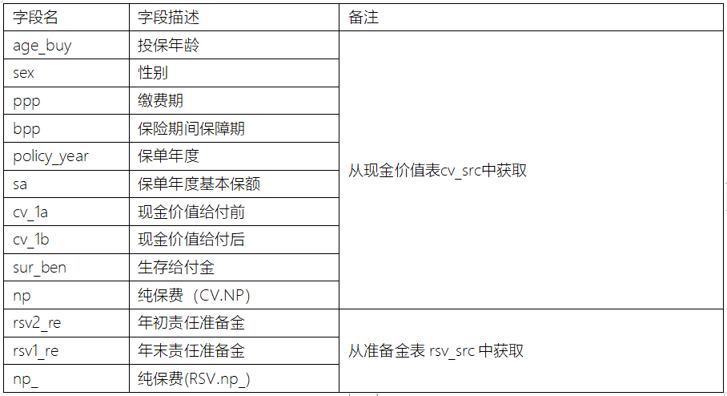
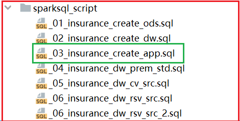
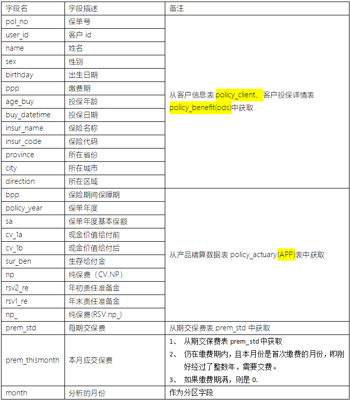
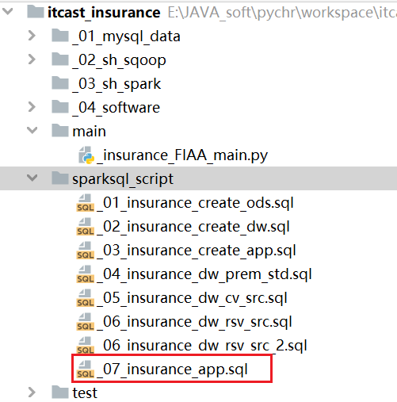

# day09_保险项目课程笔记


## 1. APP层计算操作

### 1.1 保险精算表生成

​		此表是银保监会需要的数据表, 在进行精算计算的时候, 需要将此表结果计算出来, 最终将其提交给银保监会


表的基本结构: policy_actuary表




实操: 

* 1- 在项目中的sparksql_script目录中创建一个SQL的脚本:  
  * 文件名: _03_insurance_create_app.sql
  * 注意: 不要把空格粘贴进去



* 2- 构建保险精算结果表

```sql
-- 此脚本主要用于APP层建表
-- 创建APP层数据库
drop database if exists insurance_app cascade ;
create database if not exists insurance_app
    location 'hdfs://node1:8020/user/hive/warehouse/insurance_app.db';
-- 构建保险精算数据结果表
drop table if exists insurance_app.policy_actuary;
create table if not exists insurance_app.policy_actuary (
    age_buy     smallint comment '投保年龄',
    sex         string comment '性别',
    ppp         smallint comment '交费期间(Premuim Payment Period PPP)',
    bpp         smallint comment '保险期间(BPP)',
    policy_year smallint comment '保单年度',
    sa          decimal(12, 2) comment '基本保险金额(Baisc Sum Assured)',
    cv_1a       decimal(17, 7) comment '现金价值年末（生存给付前）',
    cv_1b       decimal(17, 7) comment '现金价值年末（生存给付后）',
    sur_ben     decimal(17, 7) comment '生存金',
    np          decimal(17, 7) comment '修匀净保费',
    rsv2_re     decimal(17, 7) comment '修正责任准备金年初(未加当年初纯保费）',
    rsv1_re     decimal(17) comment '修正责任准备金年末',
    np_         decimal(12) comment '修正纯保费'
) comment '产品精算数据表'
row format delimited fields terminated by '\t';
```

* 3- 编写 SQL 实现需求 (此处演示SQL如何编写, 后续会进行调整)
  * 目前: 由于此表也是精算系统中相关的结果表, 理应和精算业务放置在一起

```sql
-- 需求一: 计算产品精算结果表
insert overwrite  table insurance_app.policy_actuary
select
    t1.age_buy,
    t1.sex,
    t1.ppp,
    t1.bpp,
    t1.policy_year,
    t1.sa,
    t1.cv_1a,
    t1.cv_1b,
    t1.sur_ben,
    t1.np,
    t2.rsv2_re,
    t2.rsv1_re,
    t2.np_
from insurance_dw.cv_src t1 join insurance_dw.rsv_src t2
    on t1.age_buy = t2.age_buy and t1.sex = t2.sex and t1.ppp = t2.ppp and t1.policy_year = t2.policy_year;
```

由于这个表的结果数据是来自于前序在DW层计算的各项指标, 故将此表放置在APP层, 而且此表的数据后续要推送到银保监会, 需要将数据导出到业务库(MySQL)中


如何将数据导出到MySQL呢?

```properties
方案一:    Apache Sqoop 目前不是特别推荐

我们希望当精算系统的python脚本执行完成后, 直接将结果灌入到Mysql即可
	
方案二: 可以采用 Spark SQL 直接完成数据导出操作
```


实施方案二处理:

* 1- 在MySQL中创建一个目标库: 用于放置结果表数据

```sql
create database  if not exists insurance_olap charset utf8;
```

* 编写代码处理: (完整代码)

```properties
import decimal

import pandas as pd
from pyspark import SparkContext, SparkConf, StorageLevel
from pyspark.sql import SparkSession
import pyspark.sql.functions as F
import os

# 锁定远端操作环境, 避免存在多个版本环境的问题
os.environ['SPARK_HOME'] = '/export/server/spark'
os.environ["PYSPARK_PYTHON"] = "/root/anaconda3/bin/python"
os.environ["PYSPARK_DRIVER_PYTHON"] = "/root/anaconda3/bin/python"


# 工具函数(方法) :
# 大致功能: 读取SQL脚本, 将脚本中 空行 以及注释全部过滤掉, 将其中SQL执行即可
def executeSQLFile(filename):
    with open(r'../sparksql_script/' + filename, 'r') as f:
        # 读取所有行的数据, 将其封装到一个列表中
        read_data = f.readlines()
        # 将数组的一行一行拼接成一个长文本，就是SQL文件的内容
        read_data = ''.join(read_data)
        # 将文本内容按分号切割得到数组，每个元素预计是一个完整语句
        arr = read_data.split(";")
        # 对每个SQL,如果是空字符串或空文本，则剔除掉
        # 注意，你可能认为空字符串''也算是空白字符，但其实空字符串‘’不是空白字符 ，即''.isspace()返回的是False
        arr2 = list(filter(lambda x: not x.isspace() and not x == "", arr))
        # 对每个SQL语句进行迭代
        for sql in arr2:
            # 先打印完整的SQL语句。
            print(sql, ";")
            # 由于SQL语句不一定有意义，比如全是--注释;，他也以分号结束，但是没有意义不用执行。
            # 对每个SQL语句，他由多行组成，sql.splitlines()数组中是每行，挑选出不是空白字符的，也不是空字符串''的，也不是--注释的。
            # 即保留有效的语句。
            filtered = filter(lambda x: (not x.lstrip().startswith("--")) and (not x.isspace()) and (not x.strip() == ''),
                              sql.splitlines())
            # 下面数组的元素是SQL语句有效的行
            filtered = list(filtered)

            # 有效的行数>0，才执行
            if len(filtered) > 0:
                df = spark.sql(sql)
                # 如果有效的SQL语句是select开头的，则打印数据。
                if filtered[0].lstrip().startswith("select"):
                    df.show(100)


if __name__ == '__main__':
    print("此python实现整个精算系统相关的指标内容:(保费参数因子, 保费, 现金价值, 准备金)")

    # 1) 创建 sparkSession对象, 此对象支持连接hive

    spark = SparkSession \
        .builder \
        .master("local[*]") \
        .appName("insurance_main") \
        .config("spark.sql.shuffle.partitions", 4) \
        .config("spark.sql.warehouse.dir", "hdfs://node1:8020/user/hive/warehouse") \
        .config("hive.metastore.uris", "thrift://node1:9083") \
        .enableHiveSupport() \
        .getOrCreate()

    # 自定义UDAF函数, 实现计算 lx
    @F.pandas_udf(returnType='decimal(17,12)')
    def udaf_lx(qx:pd.Series,lx:pd.Series) -> decimal:
        # 因为返回的类型为decimal类型, 所以这里初始值一定也是一个decimal类型
        # 如何构建呢?
        tmp_qx = decimal.Decimal(0) # 0.000711 --> 0.000751
        tmp_lx = decimal.Decimal(0) # 1 --> 0.999289

        for i in range(0,len(qx)):
            if i == 0:
                tmp_qx = decimal.Decimal(qx[i])
                tmp_lx = decimal.Decimal(lx[i])
            else:
                # 计算lx  计算后 保证小数位为12位 , 与返回类型中设置小数位保持一致
                tmp_lx = (tmp_lx * (1 - tmp_qx)).quantize(decimal.Decimal('0.000000000000'))
                tmp_qx = decimal.Decimal(qx[i])
        return tmp_lx


    # 自定义UDAF函数, 完成计算  lx_d dx_d  dx_ci
    @F.pandas_udf(returnType='string')
    def udaf_3col(qx_d:pd.Series,qx_ci:pd.Series,lx_d:pd.Series) -> str:
        tmp_lx_d = decimal.Decimal(0) # 1
        tmp_dx_d = decimal.Decimal(0) # 0.0005215185
        tmp_dx_ci = decimal.Decimal(0) # 0.000838


        for i in range(0,len(qx_d)):
            if i == 0:
                tmp_lx_d = decimal.Decimal(lx_d[i])
                tmp_dx_d = decimal.Decimal(qx_d[i])
                tmp_dx_ci = decimal.Decimal(qx_ci[i])
            else:
                tmp_lx_d = (tmp_lx_d - tmp_dx_d - tmp_dx_ci).quantize(decimal.Decimal('0.000000000000'))
                tmp_dx_d = (tmp_lx_d * qx_d[i]).quantize(decimal.Decimal('0.000000000000'))
                tmp_dx_ci = (tmp_lx_d * qx_ci[i]).quantize(decimal.Decimal('0.000000000000'))

        return f'{tmp_lx_d},{tmp_dx_d},{tmp_dx_ci}'


    # 将函数注册到SQL中使用:
    spark.udf.register('udaf_lx',udaf_lx)
    spark.udf.register('udaf_3col', udaf_3col)
    # 2) 编写SQL执行:
    executeSQLFile('_04_insurance_dw_prem_std.sql')
    executeSQLFile('_05_insurance_dw_cv_src.sql')
    executeSQLFile('_06_insurance_dw_rsv_src.sql')

    # 3) 生成精算结果数据表, 并导入到结果表
    df_policy_actuary = spark.sql("""
        select
            t1.age_buy,
            t1.sex,
            t1.ppp,
            t1.bpp,
            t1.policy_year,
            t1.sa,
            t1.cv_1a,
            t1.cv_1b,
            t1.sur_ben,
            t1.np,
            t2.rsv2_re,
            t2.rsv1_re,
            t2.np_
        from insurance_dw.cv_src t1 join insurance_dw.rsv_src t2
            on t1.age_buy = t2.age_buy and t1.sex = t2.sex and t1.ppp = t2.ppp and t1.policy_year = t2.policy_year
    """)

    # 设置到缓存中
    df_policy_actuary.persist(storageLevel=StorageLevel.MEMORY_AND_DISK).count()

    # 将精算数据分别写入到HIVE 目标表 以及写入到MYSQL
    # HIVE
    df_policy_actuary.write.saveAsTable(name='insurance_app.policy_actuary',mode='overwrite')

    # MYSQL
    df_policy_actuary.write.jdbc(
        url='jdbc:mysql://node1:3306/insurance_olap?createDatabaseIfNotExist=true&serverTimezone=UTC&characterEncoding=utf8&useUnicode=true',
        table='policy_actuary',
        mode='overwrite',
        properties={ 'user' : 'root', 'password' : '123456' }
    )

    # 关闭 spark session对象
    spark.stop()

```


### 1.2 计算某个月份各个客户应交保费

需求：

1、 请结合客户投保详情表，计算当月客户的精算现金价值、准备金信息和现在的应交保费。

2、 每月统计一次

3、 结果按月分区

4、 各字段的取数或计算逻辑如下。



* 1- 创建结果表:  
  * 建表语句放置在: _03_insurance_create_app.sql

```sql
-- 客户保单精算结果表
drop table if exists insurance_app.policy_result;
create table if not exists insurance_app.policy_result (
    pol_no         STRING COMMENT '保单号',
    user_id        string comment '客户id',
    name           string comment '姓名',
    sex            string comment '性别',
    birthday       string comment '出生日期',
    ppp            string comment '缴费期',
    age_buy        bigint comment '投保年龄',
    buy_datetime   string comment '投保日期',
    insur_name     STRING COMMENT '保险名称',
    insur_code     STRING COMMENT '保险代码',
    province       string comment '所在省份',
    city           string comment '所在城市',
    direction      String comment '所在区域',
    bpp            smallint comment '保险期间，保障期',
    policy_year    smallint comment '保单年度',
    sa             decimal(12, 2) comment '保单年度基本保额',
    cv_1a          decimal(17, 7) comment '现金价值给付前',
    cv_1b          decimal(17, 7) comment '现金价值给付后',
    sur_ben        decimal(17, 7) comment '生存给付金',
    np             decimal(17, 7) comment '纯保费（CV.NP）',
    rsv2_re        decimal(17, 7) comment '年初责任准备金',
    rsv1_re        decimal(17, 7) comment '年末责任准备金',
    np_            decimal(12, 2) comment '纯保费(RSV.np_) ',
    prem_std       decimal(14, 6) comment '每期交保费',
    prem_thismonth decimal(14, 6) comment '本月应交保费'
) comment '客户保单精算结果表'
partitioned by (month string)
row format delimited fields terminated by '\t';
```

* 2- 创建一个 SQL脚本, 用于放置APP层指标统计SQL
  * 文件名为: _07_insurance_app.sql



* 3- 编写SQL语句:

```sql
-- 此脚本专门用于放置APP层指标SQL
-- 开启非严格模式
set hive.exec.dynamic.partition.mode=nonstrict;
-- 需求一: 计算某个月份各个客户应交保费  假设计算 2022-06月份
insert overwrite  table insurance_app.policy_result partition(month)
select
    t1.pol_no,
    t1.user_id,
    t2.name,
    t2.sex,
    t2.birthday,
    t1.ppp,
    t1.age_buy,
    t1.buy_datetime,
    t1.insur_name,
    t1.insur_code,
    t2.province,
    t2.city,
    t2.direction,
    t3.bpp,
    t3.policy_year,
    t3.sa,
    t3.cv_1a,
    t3.cv_1b,
    t3.sur_ben,
    t3.np,
    t3.rsv2_re,
    t3.rsv1_re,
    t3.np_,
    t4.prem as prem_std,
    if(
        -- 如果不为 null 一定是退保了
        t5.pol_no is not null ,
        -1,
        if(
            t3.policy_year <= t1.ppp and substr(t1.buy_datetime,6,2) = substr('2022-06',6,2) ,
            t4.prem,
            0
        )
    ) as prem_thismonth,
    '2022-06' as month
from insurance_ods.policy_benefit t1
    join insurance_ods.policy_client t2 on t1.user_id = t2.user_id
    join insurance_app.policy_actuary t3
        on t2.sex = t3.sex
               and t1.ppp = t3.ppp
               and t1.age_buy = t3.age_buy
               and t3.policy_year = floor( months_between('2022-06',t1.buy_datetime) / 12 ) + 1
    join insurance_dw.prem_std t4
        on t2.sex = t4.sex
               and t1.ppp = t4.ppp
               and t1.age_buy = t4.age_buy
    left join insurance_ods.policy_surrender t5
        on  t1.pol_no = t5.pol_no;


-- 思考:  计算 2022 - 06 月份, 我们保单截止到这个时间, 到了多少保单年度?
-- 假设:  2021-05月份购买的保险, 请问 2022-03月份, 是属于第几个保单年度?  1
-- 假设:  2021-05月份购买的保险, 请问 2022-05月份, 是属于第几个保单年度?  2
-- 假设:  2021-05月份购买的保险, 请问 2022-06月份, 是属于第几个保单年度?  2

-- 如何算出来的:
--    保单年度:   floor( (当前时间 - 投保时间) / 12 )   + 1

-- 关键点:  两个时间, 如何得出相差多少个月呢? months_between(当前时间, 之前时间)
select floor(months_between('2022-05-04','2021-05-06') / 12) + 1

-- 思考: 计算 2022-06 月份应缴保费: 满足条件
-- 条件1:  首先没有退保  (关联退保表, 如何能关联上, 说明以及退保了, 直接返回 -1)
-- 条件2:  保单年度 <= 缴费期
-- 条件3:  缴费月份(投保月份) =  当前计算月份


-- 校验:
select * from insurance_app.policy_result where prem_thismonth >0 ;
```


