# day10_保险项目课程笔记


## 1. APP层计算操作

### 1.1 保险精算表生成

​		此表是银保监会需要的数据表, 在进行精算计算的时候, 需要将此表结果计算出来, 最终将其提交给银保监会


结果表字段的说明: policy_actuary表

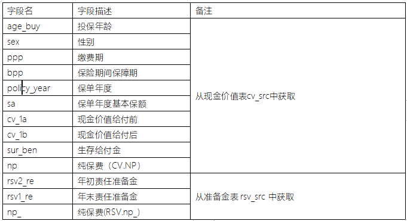


### 1.2 计算某个月份各个客户应交保费

需求：

1、 请结合客户投保详情表，计算当月客户的精算现金价值、准备金信息和现在的应交保费。

2、 每月统计一次

3、 结果按月分区


目标表的字段说明: policy_result表

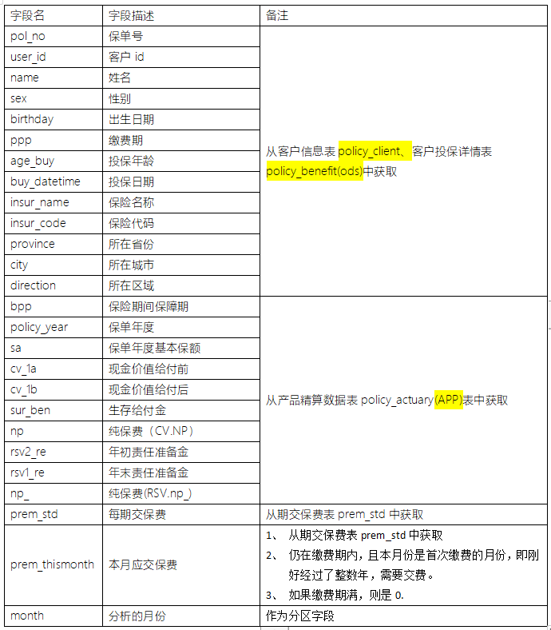

### 1.3 计算保费收入增长率

需求:

1、每月计算一次。下月初计算上月的数据。

2、当月保费收入增长率prem_incre_rate= (当月末保费收入-上月末保费收入)/上月末保费收入 

3、例：2021年1月31日，个险渠道保费收入为100元， 2021年2月28日，个险保费收入为110元，则，个险保费收入增长率 = 110/100 -1 = 10%

目标表

| month           | 统计月份       | 分区字段                                  |
| --------------- | -------------- | ----------------------------------------- |
| prem            | 本月保费收入   | 对policy_result的本月的prem_thismonth求和 |
| last_prem       | 上月保费收入   | 对policy_result的上月的prem_thismonth求和 |
| prem_incre_rate | 保费收入增长率 | (本月保费收入-上月保费收入)/ 上月保费收入 |

* 1- 构建目标表:

```sql
--保费收入增长率
drop table if exists insurance_app.app_agg_month_incre_rate;
CREATE TABLE if not exists insurance_app.app_agg_month_incre_rate
(
    prem            DECIMAL(24, 6) comment '本月保费收入',
    last_prem       DECIMAL(24, 6) comment '上月保费收入',
    prem_incre_rate DECIMAL(6, 4)comment '保费收入增长率'
) partitioned by (month string comment '月份')
    comment '保费收入增长率表' row format delimited fields terminated by '\t';
```

* 2- SQL实现

```sql
-- 计算保费收入增长率:
-- 请问, 这里的当月  是指的 7月份 还是6月份呢? 应该是6月份 (从我们的理解来说, 上个月 和 上上个月的比较)
--  如何计算当月的保费收入呢? 上一个需要是计算客户的每月应交保费
with t1  as (
    select

        sum(
            if( month = '2022-06' and prem_thismonth > 0,prem_thismonth,0 )
        ) as  prem,

        sum(
            if( month = '2022-05' and prem_thismonth > 0,prem_thismonth,0 )
        ) as  last_prem

    from insurance_app.policy_result
)
insert overwrite table insurance_app.app_agg_month_incre_rate partition(month)
select
    prem,
    last_prem,
    round((prem - last_prem)/ last_prem *100,5)  as prem_incre_rate,
    '2022-06' as month
from t1;
```


### 1.4 计算首年保费与保费收入比

需求:

1、每月计算一次。下月初计算上月的数据。

2、first_of_total_prem= 首年保费收入/保费收入

目标表字段:

| month               | 统计月份             |                                                              |
| ------------------- | -------------------- | ------------------------------------------------------------ |
| first_prem          | 首年保费             |                                                              |
| total_prem          | 已经收取的所有保费   | 1、如果在缴费期内正常缴费，则取已经交过的所有保费。2、如果已经缴纳完毕，则取总体交过的所有保费。3、如果在缴费期内退保，取退保前缴纳的所有保费。 |
| first_of_total_prem | 首年保费与保费收入比 | 首年保费收入/保费收入                                        |

建表操作:

```sql
drop TABLE if exists insurance_app.app_agg_month_first_of_total_prem;
CREATE TABLE if not exists insurance_app.app_agg_month_first_of_total_prem
(
    first_prem          DECIMAL(24, 6),
    total_prem          DECIMAL(24, 6),
    first_of_total_prem DECIMAL(8, 6)
) partitioned by (month string comment '月份')
    comment '首年保费与保费收入比表' row format delimited fields terminated by '\t';
```

计算操作

```sql
-- 计算首年保费和保费收入比:
-- 计算规则  首年保费除以保费收入
with t1 as (
    select

        sum(t1.prem_std) as first_prem,

        sum(
            least(
                t1.ppp * t1.prem_std,
                t1.policy_year * t1.prem_std,
                t1.prem_std * (floor(months_between(t2.elapse_date, t1.buy_datetime) /12) +1)
            )
        ) as  total_prem

    from (select * from  insurance_app.policy_result where month = '2022-06') t1
       left join  insurance_ods.policy_surrender t2 on t1.pol_no = t2.pol_no
)
insert overwrite table insurance_app.app_agg_month_first_of_total_prem partition (month)
select
    first_prem,
    total_prem,
    round(first_prem / total_prem  * 100, 5) as first_of_total_prem,
    '2022-06' as month
from t1;

-- 思考:
--   首年保费:
--     将所有的投保的投保的保费全部加载一起, 就是截止到当月总的保费收入
--   总保费计算: ； 将每一张的保单的  缴费年数 * 保费
--         如何判断缴费年数： 最终选择那种方案呢?  选择最小的
--                 情况一：  当保单年度 > 缴费期 :  缴费期 * 保费
--                 情况二:  当保单年度 <= 缴费期 : 保单年度  * 保费
--                 情况三:  当客户如果退保了,
--                              退保的时间  大于缴费期:  缴费期 * 保费
--                              如果退保时间 小缴费期:  则按照截止到退保的保单年度 * 保费

```

### 1.5 个人营销渠道的件均保费

需求:

1、每月计算一次。下月初计算上月的数据。

2、个人营销渠道的件均保费 premium per policy of individual marketing channel 

个人营销渠道的件均保费=（本月的）个人营销渠道的首年原保费收入÷（本月的）个人营销渠道的新单件数 

解释：个人营销渠道的件均保费是指个人营销渠道的首年原保费收入与新单件数的比值。


目标表: 

| insur_code   | 保险代码               |      |
| ------------ | ---------------------- | ---- |
| insur_name   | 保险名称               |      |
| prem_per_pol | 个人营销渠道的件均保费 |      |
| month        | 月份                   |      |

```sql
drop TABLE if exists insurance_app.app_agg_month_premperpol;
CREATE TABLE if not exists insurance_app.app_agg_month_premperpol
(
    insur_code   string comment '保险代码',
    insur_name   string comment '保险名称',
    prem_per_pol DECIMAL(38, 2) comment '个人营销渠道的件均保费'
) partitioned by (month string comment '月份')
    comment '个人营销渠道的件均保费' row format delimited fields terminated by '\t';
```

SQL实现操作

```sql
-- 件均保费: 每一款保险平均的投保的保费是多少钱
insert overwrite table insurance_app.app_agg_month_premperpol partition (month)
select
    insur_code,
    insur_name,
    round(sum(prem_std) / count(pol_no),5) as prem_pre_pol,
    '2022-06'
from insurance_app.policy_result where month = '2022-06'
group by insur_code,insur_name;
```

### 1.6 死亡发生率和残疾发生率

需求: 

死亡发生率 =在月末时点，统计每个年龄的人群，按一岁一组，计算其中历史所有发生过死亡的保单数/所有的有效保单

残疾发生率 =在月末时点，统计每个年龄的人群，按一岁一组，计算其中历史所有发生过残疾的保单数/所有的有效保单

死亡发生率和残疾发生率表结构说明：

| insur_code | 保险代码         |      |
| ---------- | ---------------- | ---- |
| insur_name | 保险名称         |      |
| age        | 年龄             |      |
| sg_cnt     | 发生身故的保单数 |      |
| sc_cnt     | 发生伤残的保单数 |      |
| all_cnt    | 所有有效保单数   |      |
| sg_rate    | 死亡发生率       |      |
| sc_rate    | 残疾发生率       |      |
| month      | 月份             |      |

建表

```sql
DROP TABLE if exists insurance_app.app_agg_month_mort_dis_rate;
CREATE TABLE if not exists insurance_app.app_agg_month_mort_dis_rate
(
    insur_code string comment '保险代码',
    insur_name string comment '保险名称',
    age        int,
    sg_rate    decimal(8,6),
    sc_rate    decimal(8,6)
) partitioned by (month string comment '月份')
    comment '死亡发生率和残疾发生率表' row format delimited fields terminated by '\t';
```

SQL实现:

```sql
-- 死亡发生率 和 残疾发生率: 统计每一款保险 每个年龄段发生死亡赔付率 和 残疾的赔付率
with t1 as (
    select
        t1.insur_code,
        t1.insur_name,
        t1.age_buy + floor(months_between(t2.claim_date,t1.buy_datetime) / 12) as age,  -- 此处表示的实际的发生理赔年龄
        count(
            if(
                t2.claim_item like 'sg%',
                t1.pol_no,
                NULL
            )
        ) AS sg_cnt,

        count(
            if(
                t2.claim_item like 'sc%',
                t1.pol_no,
                NULL
            )
        ) AS sc_cnt,

        count(t1.pol_no) as all_age_cnt

    from (select * from insurance_app.policy_result where month = '2022-06') t1
        left join insurance_ods.claim_info t2 on t1.pol_no = t2.pol_no
    group by t1.insur_code,t1.insur_name, t1.age_buy + floor(months_between(t2.claim_date,t1.buy_datetime) / 12)
),
t2 as (
    select
        insur_code,
        insur_name,
        age,
        sg_cnt,
        sc_cnt,
        sum(all_age_cnt) over(partition by insur_code) as all_cnt
    from t1
)
insert overwrite table insurance_app.app_agg_month_mort_dis_rate partition(month)
select
    insur_code,
    insur_name,
    age,
    round(sg_cnt / all_cnt * 100,5) as sg_rate,
    round(sc_cnt / all_cnt * 100,5) as sc_rate,
    '2022-06' as month
from t2;
```


### 1.7 新业务价值率

需求:

1、每月计算一次。下月初计算上月的数据。

2、新业务价值率（NBEV，New Business Embed Value）= PV（预期各年利润） / 首年保费收入

3、对一个产品的一个保单的业务价值率而言，它存在prem_std_real表中。

4、对一个产品的多张保单而言，

第1张单，期交保费100元，新业务价值率是10%

第2张单，期交保费是200元，新业务价值率是20%

则新业务价值率 = （100\*10% + 200* 20%） / 300 = 16.67%


目标表:

| insur_code | 保险代码     |      |
| ---------- | ------------ | ---- |
| insur_name | 保险名称     |      |
| nbev       | 新业务价值率 |      |
| month      | 月份         |      |

```sql
drop table if exists insurance_app.app_agg_month_nbev;
create table if not exists insurance_app. app_agg_month_nbev
(
    insur_code string comment '保险代码',
    insur_name string comment '保险名称',
    nbev decimal(38,11) comment '新业务价值率'
) partitioned by (month string comment '月份')
    comment '新业务价值率表' row format delimited fields terminated by '\t';
```

sql实现:

```sql
-- 新业务的价值率:
insert overwrite table insurance_app.app_agg_month_nbev partition(month)
select
    t1.insur_code,
    t1.insur_name,
    round(sum(t1.prem_std * t2.nbev) / sum(prem_std),5) as nbev,
    '2022-06' as month
from (select * from insurance_app.policy_result where month = '2022-06') t1
    join insurance_ods.prem_std_real t2 on t1.sex = t2.sex and t1.age_buy = t2.age_buy and t1.ppp  =t2.ppp
group by t1.insur_code,t1.insur_name;
```


### 1.8  高净值客户比例

需求:

1、每月计算一次。下月初计算上月的数据。

2、高净值客户，指填写的信息里，年收入超过1000万的客户

3、高净值客户比例= 高净值客户 / 总客户。例如100个客户，高净值客户10个，则高净值客户比例 = 10/100 = 10%


目标表:

| high_net_rate | 高净值客户比例 |      |
| ------------- | -------------- | ---- |
| month         | 月份           |      |

```sql
drop table if exists insurance_app.app_agg_month_high_net_rate;
create table if not exists insurance_app.app_agg_month_high_net_rate(
    high_net_rate decimal(8, 6) comment '高净值客户比例'
) partitioned by (month string comment '月份')
    comment '高净值客户比例表' row format delimited fields terminated by '\t';
```

SQL:

```sql
-- 高净值客户比例计算
insert overwrite table insurance_app.app_agg_month_high_net_rate partition(month)
select

    round(
        count( distinct if(t2.income >= 10000000,t1.user_id,null) )
            /
        count( distinct t1.user_id) * 100
    ,5)   as high_net_rate,
    '2022-06' as month
from (select * from insurance_app.policy_result where month='2022-06') t1
    join insurance_ods.policy_client t2 on t1.user_id = t2.user_id;
```


### 1.9 各地区的汇总保费

需求:

1、 每月计算一次。下月初计算上月的数据。

2、 依据精算数据表policy_result的当月数据，按区域分组，统计当月时刻的总投保人数，当月收取的保费汇总，当月时刻的总现金价值，总生存金，总准备金。


目标表:

| direction   | 所在区域     |
| ----------- | ------------ |
| sum_users   | 总投保人数   |
| sum_prem    | 当月保费汇总 |
| sum_cv_1b   | 总现金价值   |
| sum_sur_ben | 总生存金     |
| sum_rsv2_re | 总准备金     |
| month       | 月份         |

```sql
drop table if exists insurance_app.app_agg_month_dir;
create table if not exists insurance_app.app_agg_month_dir
(
    direction string comment '所在区域',
    sum_users bigint comment '总投保人数',
    sum_prem decimal(24) comment '当月保费汇总',
    sum_cv_1b decimal(27,2) comment '总现金价值',
    sum_sur_ben decimal(27) comment '总生存金',
    sum_rsv2_re decimal(27,2) comment '总准备金'
) partitioned by (month string comment '月份')
    comment '各地区的汇总保费表' row format delimited fields terminated by '\t';
```

sql:

```sql
-- 各地区的汇总保费
insert overwrite table insurance_app.app_agg_month_dir partition(month)
select
    direction,
    count(distinct  user_id) as sum_users,
    sum(prem_thismonth) as sum_prem,
    sum(cv_1b) as sum_cv_1b,
    sum(sur_ben) as sum_sur_ben,
    sum(rsv2_re) as sum_rsv2_re,
    '2022-06' as month
from insurance_app.policy_result  where month = '2022-06' and prem_thismonth != -1
group by direction;
```


## 2. 项目上线至YARN平台

### 2.1 精算系统部署操作

​		整个精算系统, 主要涉及到计算有: 保费参数因子, 保费, 现金价值, 准备金, 保险精算结果表

​		这个系统的执行, 只需要运行_insurance_FIAA_main.py 即可

​		所以说, 部署精算系统, 本质上就是在部署当前这个python脚本, 将这个脚本提交到Yarn集群中运行即可

* 1- 需要调整 _insurance_FIAA_main.py 脚本: 将master 参数修改为 Yarn 或者删除这个函数配置

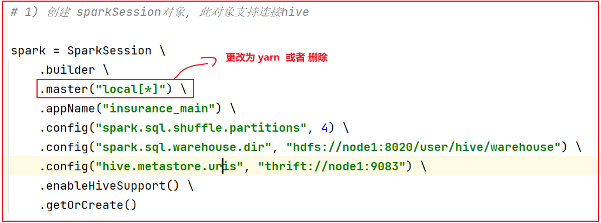

* 2- 需要调整 _insurance_FIAA_main.py 脚本:  删除 shuffle的配置操作, 以及SQL脚本的shuffle分区配置 后续通过命令参数指定

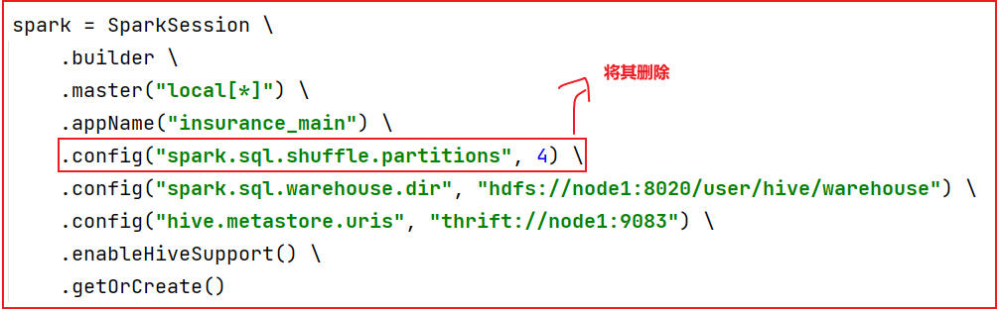

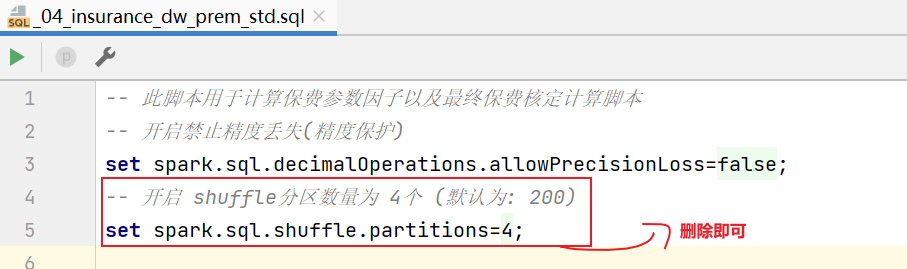

* 3- 删除所有的SQL脚本中 测试代码, 仅保留一些关键点测试即可

* 4- 编写一个shell脚本, 在脚本中, 设置提交spark的程序脚本内容:  _spark_FIAA_insurance.sh

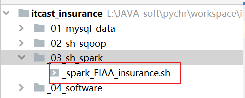

```shell
#!/bin/bash
/export/server/spark/bin/spark-submit \
--master yarn \
--deploy-mode client \
--jars /export/data/mysql-connector-java-5.1.32.jar \
--conf "spark.pyspark.driver.python=/root/anaconda3/bin/python3" \
--conf "spark.pyspark.python=/root/anaconda3/bin/python3" \
--conf "spark.sql.shuffle.partitions=18" \
--driver-memory 512M \
--driver-cores 1 \
--executor-memory 6G \
--executor-cores 2 \
--num-executors 3 \
--queue default \
/export/data/workspace/itcast_insurance/main/_insurance_FIAA_main.py
```

* 5- 测试脚本, 是否可以正常的运行

```shell
sh _spark_FIAA_insurance.sh
```

* 6- 如果可以正常的运行, 将部署模式切换为 cluster, 然后可以使用DS调度即可

```properties
方式1: 
	将整个项目 上到HDFS , 在DS 使用shell调度的节点, 编写shell命令. 
		1- 下载HDFS上保险项目
		2- 进入项目的shell脚本目录
		3- 执行脚本即可

方式二:
	将项目分发到各个DS的节点上, 然后基于DS 调用对应的SHELL即可
```

在DS对于精算系统调度方案说明:

```properties
精算系统中, 使用的相关原始表, 主要是以基础的配置表为主, 比如说 生命表, 费率表, 行业25种重疾发生率的表
这些表都是来源于保险业标准规范表, 变量的情况的基本上不算特别大, 但是只要有变更, 那么就意味需要重新核定相关指标结果

处理方案有二种:
	1- 不定时  当业务端通知有基础数据变更后, 我们在DS进行调度即可:
			措施一: 手动调度, 自己打开web UI  手动触发一次执行即可
			措施二: 基于java web 编写一个集成管理系统, 当检查到基础数据源有变更的时候, 然后触发连接DS, 通过DS接口的方式, 实施任务调度, 完成重新导入数据操作, 以及精算系统重新执行操作
	
	2- 定时处理  不管基础数据有没有发送变更, 我们与ODS层数据采集的频次保持一致, 当ODS采集结束后, 触发精算系统执行, 完成重新计算操作 (推荐)
```


可能出现的错误: 

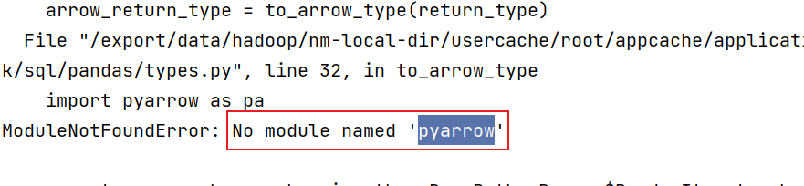

```properties
错误原因:  在运行环境中, 没有pyarrow框架, 导致 pandas的 UDAF函数无法运行

解决方案: 
	查看每一个yarn上每一个节点是否安装了pyarrow
	如果没有安装. 将其安装一下即可:  
		pip install -i https://pypi.tuna.tsinghua.edu.cn/simple pyspark==3.1.2
		pip install -i https://pypi.tuna.tsinghua.edu.cn/simple pyspark[sql]
		
		或者 
		pip install -i https://pypi.tuna.tsinghua.edu.cn/simple pyarrow
```

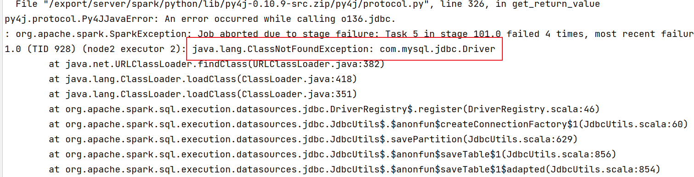

```properties
错误原因:  
		YARN在运行spark程序, 整个运行环境中, 找不到 mysql的驱动包

解决方案:  添加MySQL驱动
	方案一: 使用  --jars 参数. 手动指定jar包位置即可  (适合于临时使用一次的)
		./spark-submit  --jars xxx.jar
		
	
	方案二:   适用于常用的jar包处理方案
        需要将驱动添加到以下这几个位置: 
            1- anaconda的Python的pyspark包的lib目录下:   -- 用于在pycharm右键运行使用相关的jar包
                    BASE环境: /root/anaconda3/lib/python3.8/site-packages/pyspark/jars/

                    虚拟环境: /root/anaconda3/envs/虚拟环境名称/lib/python3.8/site-packages/pyspark/jars/

            2- spark的家路径的jars目录下:   主要是用于通过spark-submit提交到local或者spark集群模式的时候
                /export/server/spark/jars/

            3- HDFS的spark的jars目录下: 主要是用于通过spark-submit提交到yarn集群的时候
                /spark/jars 

```


### 2.2 APP层部署操作

​		APP层整体就是一个SQL的脚本 , 不依赖于其他内容,所以核心将SQL提交到Yarn执行操作,请问 如何处理呢?

```properties
思考: 
	如何提交spark的SQL脚本|或者 纯 SQL的语句 到 Yarn平台呢?

解决方案:  
	在spark的bin目录下, 提供了 spark-sql
	
注意: 
	此脚本也可以设置相关的资源的参数信息, 与 spark-submit方式是一致的
```

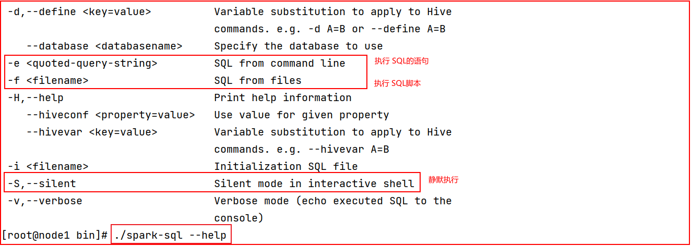

​		目前在SQL脚本中, 主要是计算2022-06月份相关的数据, 但是后续通过DS 定时调度, 统计分别某个月的相关数据, 目前 SQL脚本写的比较死板

​		可以配置一个shell脚本, 执行shell脚本, 通过外部传参的方式, 在shell脚本中, 执行SQL语句即可

---

* 1- 构建一个部署APP层的shell脚本: _spark_app_insurance.sh

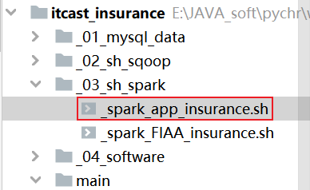

* 2- 编写脚本内容:

```properties
说明:  
	获取当前月: 
		date +'%Y-%m'
	获取上个月: 
		date -d '-1 month' +'%Y-%m'
	获取上上个月: 
		date -d '-2 month' +'%Y-%m'

思考: 当shell外部传递了一个年月数据, 如果根据这数据拿到 上个月 和 上上个月呢
	获取当前月: $1
	获取上个月: `date -d "${1}-01 -1 month" +'%Y-%m'`
	获取上上个月: `date -d "${1}-01 -2 month" +'%Y-%m'`
```

shell 脚本的内容:

```shell
#!/bin/bash

if [ $# == 1 ]
then
    this_month=$1
    last_month=`date -d "${1}-01 -1 month" +'%Y-%m'`
    before_last_month=`date -d "${1}-01 -2 month" +'%Y-%m'`
else
    this_month=`date +'%Y-%m'`
    last_month=`date -d '-1 month' +'%Y-%m'`
    before_last_month=`date -d '-2 month' +'%Y-%m'`
fi

spark_sql="
set hive.exec.dynamic.partition.mode=nonstrict;
insert overwrite  table insurance_app.policy_result partition(month)
select
    t1.pol_no,
    t1.user_id,
    t2.name,
    t2.sex,
    t2.birthday,
    t1.ppp,
    t1.age_buy,
    t1.buy_datetime,
    t1.insur_name,
    t1.insur_code,
    t2.province,
    t2.city,
    t2.direction,
    t3.bpp,
    t3.policy_year,
    t3.sa,
    t3.cv_1a,
    t3.cv_1b,
    t3.sur_ben,
    t3.np,
    t3.rsv2_re,
    t3.rsv1_re,
    t3.np_,
    t4.prem as prem_std,
    if(
        t5.pol_no is not null ,
        -1,
        if(
            t3.policy_year <= t1.ppp and substr(t1.buy_datetime,6,2) = substr('${this_month}',6,2) ,
            t4.prem,
            0
        )
    ) as prem_thismonth,
    '${this_month}' as month
from insurance_ods.policy_benefit t1
    join insurance_ods.policy_client t2 on t1.user_id = t2.user_id
    join insurance_app.policy_actuary t3
        on t2.sex = t3.sex
               and t1.ppp = t3.ppp
               and t1.age_buy = t3.age_buy
               and t3.policy_year = floor( months_between('${this_month}',t1.buy_datetime) / 12 ) + 1
    join insurance_dw.prem_std t4
        on t2.sex = t4.sex
               and t1.ppp = t4.ppp
               and t1.age_buy = t4.age_buy
    left join insurance_ods.policy_surrender t5
        on  t1.pol_no = t5.pol_no;

with t1  as (
    select

        sum(
            if( month = '${last_month}' and prem_thismonth > 0,prem_thismonth,0 )
        ) as  prem,

        sum(
            if( month = '${before_last_month}' and prem_thismonth > 0,prem_thismonth,0 )
        ) as  last_prem

    from insurance_app.policy_result
)
insert overwrite table insurance_app.app_agg_month_incre_rate partition(month)
select
    prem,
    last_prem,
    round((prem - last_prem)/ last_prem *100,5)  as prem_incre_rate,
    '${last_month}' as month
from t1;

with t1 as (
    select

        sum(t1.prem_std) as first_prem,

        sum(
            least(
                t1.ppp * t1.prem_std,
                t1.policy_year * t1.prem_std,
                t1.prem_std * (floor(months_between(t2.elapse_date, t1.buy_datetime) /12) +1)
            )
        ) as  total_prem

    from (select * from  insurance_app.policy_result where month = '${last_month}') t1
       left join  insurance_ods.policy_surrender t2 on t1.pol_no = t2.pol_no
)
insert overwrite table insurance_app.app_agg_month_first_of_total_prem partition (month)
select
    first_prem,
    total_prem,
    round(first_prem / total_prem  * 100, 5) as first_of_total_prem,
    '${last_month}' as month
from t1;
"

/export/server/spark/bin/spark-sql \
--master yarn \
--name insurance_app \
--deploy-mode client \
--jars /export/data/mysql-connector-java-5.1.32.jar \
--conf "spark.pyspark.driver.python=/root/anaconda3/bin/python3" \
--conf "spark.pyspark.python=/root/anaconda3/bin/python3" \
--conf "spark.sql.shuffle.partitions=18" \
--driver-memory 512M \
--driver-cores 1 \
--executor-memory 6G \
--executor-cores 2 \
--num-executors 3 \
--queue default \
-S \
-e "${spark_sql}"
```

* 3- 进行测试, 当测试成功后, 将部署方式更改为 cluster, 然后放置DS运行: 周期以 月   一月一次 
  * 注意: 在运行的时候, 是要在ODS --> 精算操作 --> app


​		当执行完成APP层后, 所有的结果表数据都是保存在 HIVE的库中, 但是后续对接报表的时候,  数据加载源应该是MySQL, 所以需要将HIVE的数据导出到MySQL, 请思考 如何做呢?

```properties
	当前可以使用Spark SQL方式来导出数据 也可以使用Sqoop来导出数据操作, 相对来严  目前使用sqoop会更方便一些, 如果使用python脚本, 编写python脚本, 然后在编写shell调度 会更麻烦一些
```

目前简单演示一个表的数据导出操作, 基于sqoop方式

* 1- 创建一个数据导出的sqoop的shell脚本: 

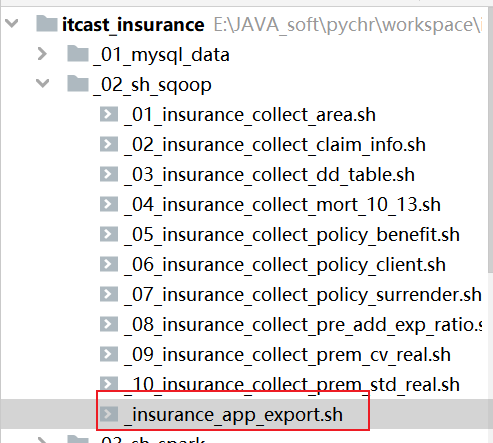

* 2- 编写shell脚本处理

```shell
#!/bin/bash

if [ $# == 1 ]
then
    this_month=$1
    last_month=`date -d "${1}-01 -1 month" +'%Y-%m'`
    before_last_month=`date -d "${1}-01 -2 month" +'%Y-%m'`
else
    this_month=`date +'%Y-%m'`
    last_month=`date -d '-1 month' +'%Y-%m'`
    before_last_month=`date -d '-2 month' +'%Y-%m'`
fi

/export/server/sqoop/bin/sqoop export \
--connect 'jdbc:mysql://node1:3306/insurance_olap?serverTimezone=UTC&characterEncoding=utf8&useUnicode=true' \
--username root \
--password 123456 \
--table policy_result \
--export-dir "hdfs://node1:8020/user/hive/warehouse/insurance_app.db/policy_result/month=${this_month}" \
--fields-terminated-by '\t' \
-m 1
```

* 3- 在MySQL创建目标表: 

```sql
create table if not exists insurance_olap.policy_result (
    pol_no         varchar(200) COMMENT '保单号',
    user_id        varchar(200) comment '客户id',
    name           varchar(200) comment '姓名',
    sex            varchar(200) comment '性别',
    birthday       varchar(200) comment '出生日期',
    ppp            varchar(200) comment '缴费期',
    age_buy        bigint comment '投保年龄',
    buy_datetime   varchar(200) comment '投保日期',
    insur_name     varchar(200) COMMENT '保险名称',
    insur_code     varchar(200) COMMENT '保险代码',
    province       varchar(200) comment '所在省份',
    city           varchar(200) comment '所在城市',
    direction      varchar(200) comment '所在区域',
    bpp            smallint comment '保险期间，保障期',
    policy_year    smallint comment '保单年度',
    sa             decimal(12, 2) comment '保单年度基本保额',
    cv_1a          decimal(17, 7) comment '现金价值给付前',
    cv_1b          decimal(17, 7) comment '现金价值给付后',
    sur_ben        decimal(17, 7) comment '生存给付金',
    np             decimal(17, 7) comment '纯保费（CV.NP）',
    rsv2_re        decimal(17, 7) comment '年初责任准备金',
    rsv1_re        decimal(17, 7) comment '年末责任准备金',
    np_            decimal(12, 2) comment '纯保费(RSV.np_) ',
    prem_std       decimal(14, 6) comment '每期交保费',
    prem_thismonth decimal(14, 6) comment '本月应交保费'
) comment '客户保单精算结果表';
```

* 4- 执行数据导出操作

* 5- 将shell脚本配置到DS 完成定时导出操作即可, 与 APP层脚本配置在一起, 在app层执行完成后之后执行


## 3. 项目相关面试题说明:

```properties
1- 请简单介绍一下你最近做的这个项目 (请讲述你比较熟悉的项目...)
	
	如何介绍项目: 5分钟
		1.1 描述项目基本情况(什么行业的项目, 项目的背景)
			背景: 本次项目是一个重构项目, 之前整个项目是基于Oracle计算的, 后来管理这个项目的程序员离职了, 我们到了之后, 发现Oracle计算过程非常复杂的, 而且利用大量的存储过程, 导致我们维护非常麻烦的, 不好维度, 所以项目老大想更换一种新的方式完成整个精算计算操作, 所以后续采用spark SQL 来进行计算实现操作, 对计算流程进行了拆解, 简化难度, 提升维护性, 以及提升效率
			项目的作用: 项目主要实现精算系统相关指标计算, 包括像 现金价值 准备金 保费 等相关核心计算指标技术操作以及完成了一些用于支持业务决策相关指标
			
		1.2 描述出项目的架构: 技术架构 和 数据流转流程 (结合在一起来说)
		1.3 描述出在本次项目, 我主要负责那一部分计算操作:
				可选负责:  
					0- 基础数据采集操作
					1- 负责保费参数因子计算 以及后续的保费计算
					2- 负责现金价值指标计算
					3- 负责保险准备金计算操作
					4- 负责 行业业务指标统计分析
				
				可组合: 
					0-1-2-4 :  适用于从0开始进入项目
					0-1-3-4 :  适用于从0开始进入项目
					0-1-4: 适用于从0开始进入项目, 中途接触了其他项目,后续又回来的
					1-3-4 : 适合中期进入项目
					1-2-4：适合中期进入项目
					3-4 : 适合中期进入项目
					
2- 结合着项目描述, 面试官会挑选它所感兴趣, 并且也是你所负责的点, 进行深入询问: 
	例如: 
		保费参数因子是什么呢? 如何完成保费参数因子计算 ? 
			1- 描述保费因子主要是做什么? 支撑后续的保费 保险准备金 以及现金价值计算的基础表
			2- 计算流程: 详细描述出具体的操作流程
				2.1 - 首先精算师提供了Excel测算模板
				2.2 - 接着根据测试模板确定涉及到维度和指标(可以说出涉及指标和维度那些 说出一部分)
				2.3 - 对指标和维度进行分析发现,维度数据需要手动生成.  各项指标计算存在互相依赖, 需要进行迭代计算
				2.4 - 如果每个指标计算都是有比较复杂的规则, 所以我先了解计算规则, 将规则形成计算流程图,在形成过程中, 与精算业务人员进行比较深入沟通, 了解每一个指标计算方案
				2.5 - 根据形成计算流程图, 开始进行指标计算, 整个计算采用横向迭代计算方案, 每一步计算操作, 都通过spark SQL 构建视图临时保存起来, 逐步往下进行, 同时在计算过程中, 使用自定义UDAF函数, 完成一些比较负责的迭代计算操作
				2.6 最终完成保费参数因子表计算操作, 将结果灌入到目标表中, 共计涉及到23个指标
				

3- 在整个计算过程中, 是否存在一些计算的难点, 或者 你认为整个计算操作, 你觉得最闪光在哪里? 经历最大挑战是什么?  
		可讲难点:  展示能力地方
			1- 自定义UDAF函数 :  遇到什么问题, 当时先采用什么方案解决的, 然后没解决掉, 有更换其他的方式, 怎么做的, 最后解决了
			2- 数据量比较大, shuffle分区: (APP层, 和保单数据关联处理的时候)https://wenku.baidu.com/view/5a3dd351158884868762caaedd3383c4bb4cb41c.html
			3- 精度问题: decimal长度超过38位 出现NULL值清空
			4- 开启广播优化: 类似于mapJoin操作
					广播小表，可以避免shuffle，可以在map端做预先的筛选。
					spark.sql.autoBroadcastJoinThreshold=100M  (默认是10M)
				
			
4- 项目真实性的问题: 


5- 相关原理性问题:  -- 有很多了 spark  hadoop hive  zookeeper
	pyspark的程序执行流程
	Driver的job的调度流程
	spark SQL的调度流程
```


