# Flink Chapter02：Flink 流批一体 API开发（1）

---

> ​			Apache Flink是一个面向分布式数据流处理和批量数据处理的开源计算平台，它能够基于同一个Flink运行时（Flink Runtime），提供支持流处理和批处理两种类型应用的功能。
>

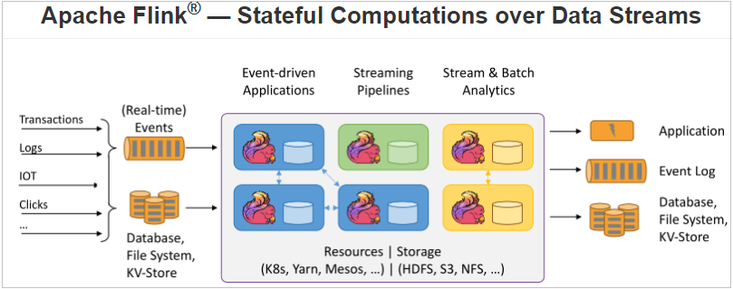


## 前言部分：知识回顾及课程目标


```

```


### [前言1]-上次课程内容回顾

---


> 上次主要讲解：Flink 安装部署和入门案例，具体如下思维导图所示。

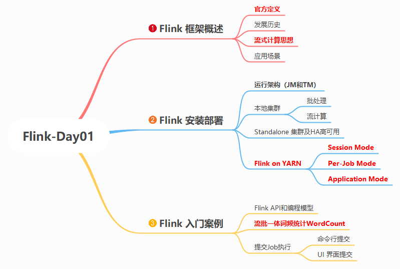

> Flink on YARN本质：**先在Hadoop YARN上运行Flink Cluster集群，然后提交运行Flink Job作业**。
>
> - 首先：向Hadoop YARN中ResourceManager申请资源（NodeManager Container），运行JM和TMs；
>   - JobManager和AppMaster在同一个Container容器中运行
>   - TaskManagers也都是运行在不同Container容器
> - 然后：提交flink job到启动Flink Cluster集群上运行；

```ini

# 1、Flink on YARN 部署
	# 当在Hadoop YARN上申请资源，运行Flink Cluster集群后，提交多少Job执行及Job中MAIN方法在哪执行？
	Session 会话模式
		多个Flink Job共享1个Flink Cluster资源
	Job 独立模式
		每个Flink Job运行在自己FlinkCluster中，当Job结束，集群也就终止，释放资源
		【推荐使用部署模式】
	Application 应用模式，1.11版本新特性
		无论Session模式还是Per-Job模式，每个Flink Job运行时MAIN在本地Client客户端执行
		建立在Per-Job模式基础上，当提交运行Flink Job时，MAIN方法在JobManager上执行，也就是说在Container容器中执行。
		【spark on yarn： yarn-cluster】

	
# 2、入门案例：WordCount词频统计
	流计算，DataStream，流批一体
	提交运行：命令行和UI界面
	
	# 开发步骤，无论开发流计算应用还是批处理程序DataSet，都分为5个步骤：
	1. 执行环境-env
	2. 数据源-source
	3. 数转转换-transformation
		最核心，最难的，如何对数据处理
	4. 数据接收器-sink
	5. 触发执行-execute
	
	# 词频统计WordCount开发步骤，实现流程
		datastream/dataset
	3-1. 分割单词，flatMap
	3-2. 转换二元组，map
	3-3. 分组求和，groupBy, sum
		在Flink框架中，提供实体类：Tuple元组类，方便封装数据，可以使用下标方式，指定如何分组和求和。
		tupleDataSet/tupleDataStream.groupBy(0).sum(1)
		
	# Flink 1.12版本开始，流批一体化
		流计算和批处理，使用一套API开发，不同类型分析，设置执行模式即可
		env.setRuntimeMode(RuntimeExecutionMode.BATCH) ;
	
	# Flink工具类：ParameterTool
		参数解析工具类，直接解析MAIN方法中arg参数解析，要求：--host node1 --port 9999
```


### [前言2]-今日课程内容提纲

---


> 主要讲解：基于Flink计算引擎，进行流式数据==流计算==处理【`DataStream API`】使用

官方文档：https://nightlies.apache.org/flink/flink-docs-release-1.13/docs/dev/datastream/overview/

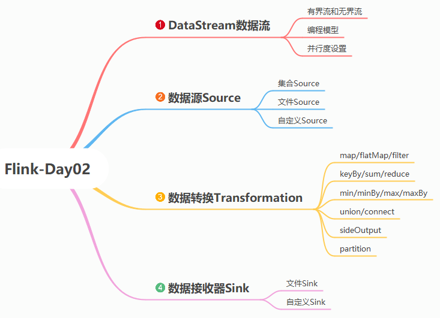


> 今日课程内容课程目标：

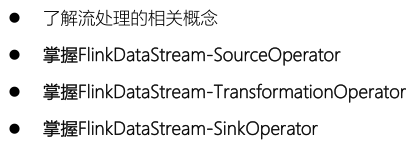


## 第一部分：基础概念【3个小节】


```

```


### 01-[理解]-基础概念【DataStream】

---


​		在Flink计算引擎中，将数据当做：==数据流DataStream==，分为**有界数据流**和**无界数据流**。

> ​		[任何类型的数据都可以形成一种事件流，如信用卡交易、传感器测量、机器日志、网站或移动应用程序上的==用户交互记录==，所有这些数据都形成一种流。]()

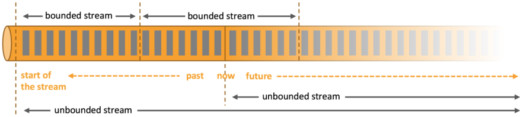

> - 1）、`有边界流（bounded stream`）：==有定义流的开始，也有定义流的结束。==有界流可以在摄取所有数据后再进行计算。有界流所有数据可以被排序，所以并不需要有序摄取。有界流处理通常被称为`批处理。`
> - 2）、`无边界流（unbounded stream）`：==有定义流的开始，但没有定义流的结束==。它们会无休止地产生数据。无界流的数据必须持续处理，即数据被摄取后需要立刻处理。不能等到所有数据都到达再处理，因为输入是无限的，在任何时候输入都不会完成。处理无界数据通常要求以特定顺序摄取事件，例如事件发生的顺序，以便能够推断结果的完整性。


`DataStream（数据流）`官方定义：

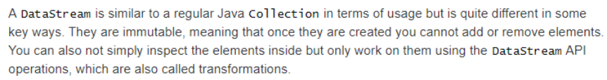


> `DataStream（数据流）`源码中定义：

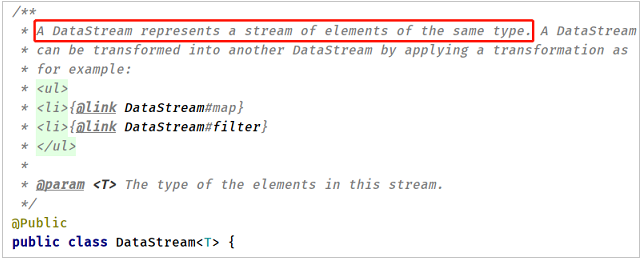


> DataStream有如下几个子类：

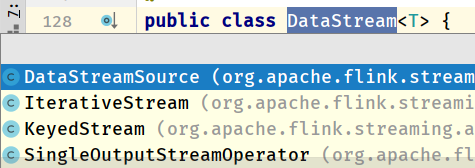

- 1）、`DataStreamSource`：
  
  - 表示从数据源直接获取数据流DataStream，比如从Socket或Kafka直接消费数据
  
    
  
- 2）、`KeyedStream`：
  
  - 当DataStream数据流进行分组时（调用keyBy），产生流称为KeyedStream，按照指定Key分组；
  - 通常情况下数据流被分组以后，需要进行窗口window操作或聚合操作。
  
  
  
- 3）、`SingleOutputStreamOperator`：
  
  - 当DataStream数据流没有进行keyBy分组，而是使用转换函数，产生的流称为SingleOutputStreamOperator。
  - 比如使用filter、map、flatMap等函数，产生的流就是`SingleOutputStreamOperator`
  
  
  
- 4）、`IterativeStream`：迭代流，表示对流中数据进行迭代计算，比如机器学习，图计算等。


> `DataStream`类是泛型（类型参数），数据类型支持如下所示：

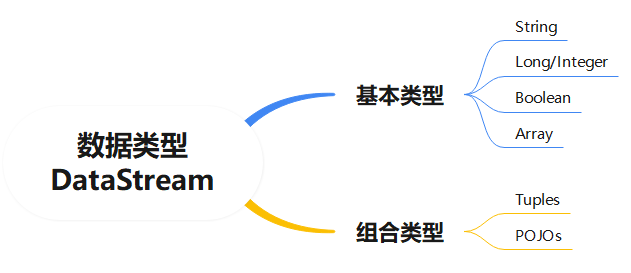


> 在Flink计算引擎中，提供4个层次API，如下所示：

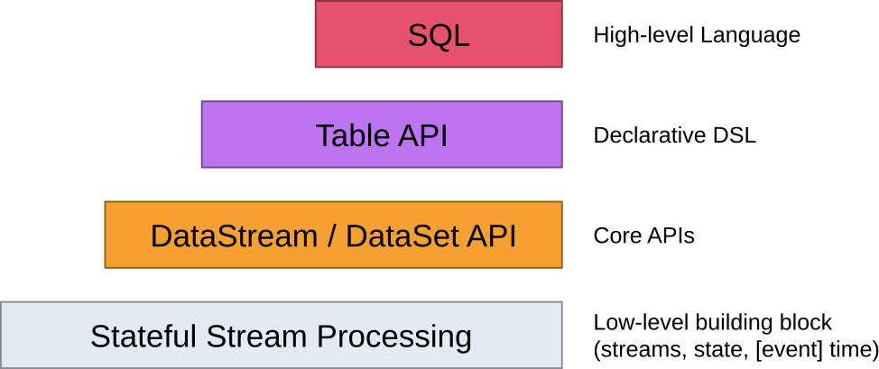


> Flink中流计算DataStream层次API在使用时，还是包括三个方面：`Source/Transformation/Sink`


> 基于Flink开发流式计算程序五个步骤：

```ini
# 1）、Obtain an execution environment,
	执行环境-env：StreamExecutionEnvironment
	
# 2）、Load/create the initial data,
    数据源-source：DataStream
    
# 3）、Specify transformations on this data,
    数据转换-transformation：DataStream API（算子，Operator）
    
# 4）、Specify where to put the results of your computations,
    数据接收器-sink
	
# 5）、Trigger the program execution
	触发执行-execute
```

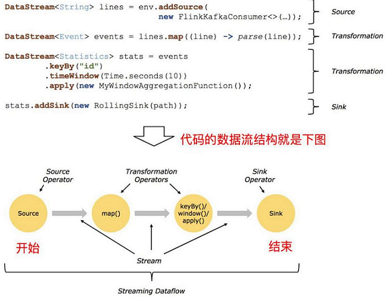


> 在IDEA中创建Flink Stream流计算编程模板：`FlinkClass`

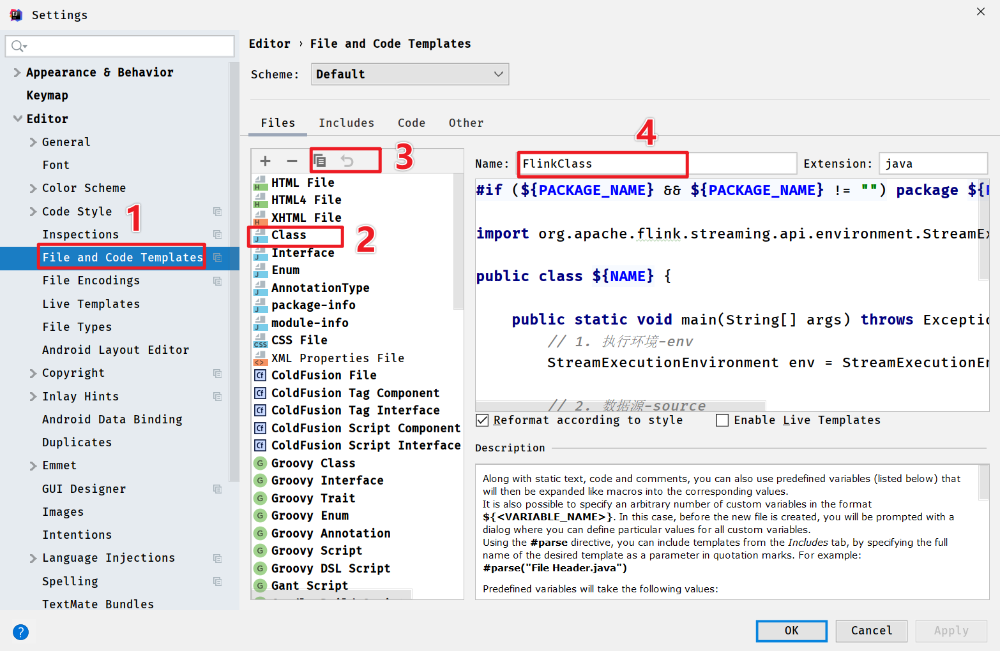

模块中内容：`FlinkClass`

```java
#if (${PACKAGE_NAME} && ${PACKAGE_NAME} != "") package ${PACKAGE_NAME};#end

import org.apache.flink.streaming.api.environment.StreamExecutionEnvironment;

/**
 * 
 * @author xuanyu
 */
public class ${NAME} {

	public static void main(String[] args) throws Exception {
		// 1. 执行环境-env
		StreamExecutionEnvironment env = StreamExecutionEnvironment.getExecutionEnvironment();
		
		// 2. 数据源-source
		
		// 3. 数据转换-transformation
		
		// 4. 数据终端-sink
		
		// 5. 触发执行-execute
		env.execute("${NAME}") ;
	}

}  
```


> 依据上述定义FlinkStream模块Template，创建Flink Stream编程类：`StreamDemo`

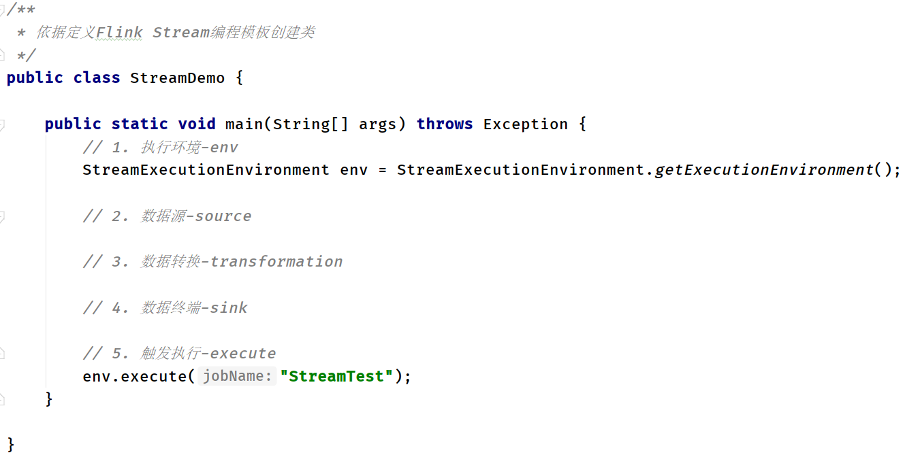


### 02-[掌握]-基础概念【并行度设置】

---


> 一个Flink程序由多个Operator组成(`source、transformation和 sink`)。

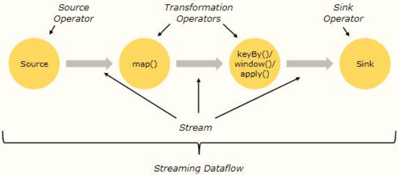


> ​		一个Operator由多个并行的SubTask（以线程方式）来执行， 一个Operator的并行SubTask(数目就被称为该Operator(任务)的**并行度**(`Parallelism`)。

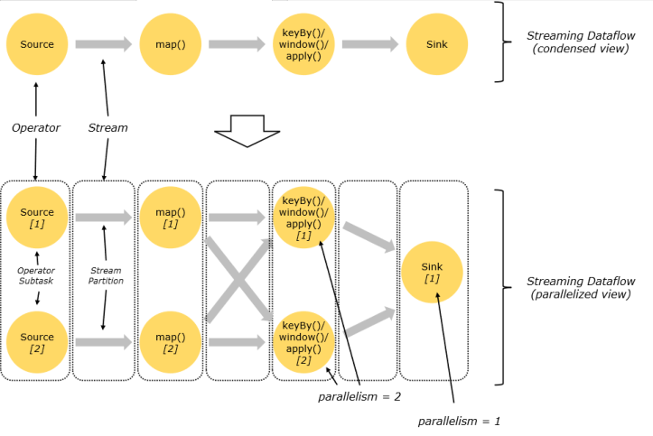


在Flink 中，并行度设置可以从4个层次级别指定，具体如下所示：

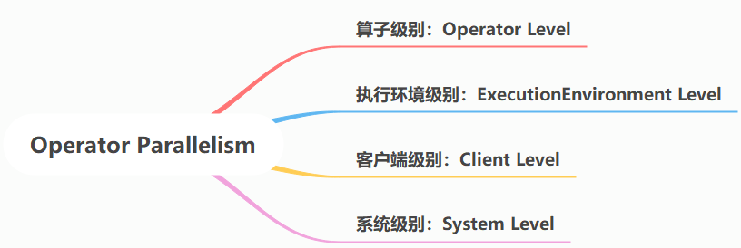


- 1）、==Operator Level（算子级别）==(可以使用)

> 一个operator、source和sink的并行度可以通过调用 `setParallelism()`方法来指定。

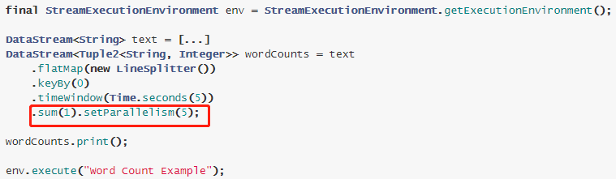


- 2）、==Execution Environment Level==（Env级别，可以使用)

> 执行环境并行度可以通过调用`setParallelism()`方法指定。

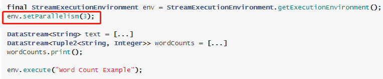


- 3）、==Client Level==(客户端级别，推荐使用)

> 并行度可以在客户端将job提交到Flink时设定，对于CLI客户端，可以通过`-p`参数指定并行度

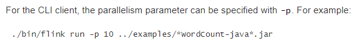


- 4）、==System Level==（系统默认级别，尽量不使用）

> ​			在系统级可以通过设置`flink-conf.yaml`文件中的`parallelism.default`属性来指定所有执行环境的默认并行度。


```Java
package cn.itcast.flink.parallelism;

import org.apache.flink.api.common.functions.FlatMapFunction;
import org.apache.flink.api.common.functions.MapFunction;
import org.apache.flink.api.java.tuple.Tuple2;
import org.apache.flink.api.java.utils.ParameterTool;
import org.apache.flink.streaming.api.datastream.DataStreamSource;
import org.apache.flink.streaming.api.datastream.SingleOutputStreamOperator;
import org.apache.flink.streaming.api.environment.StreamExecutionEnvironment;
import org.apache.flink.util.Collector;

/**
 * 使用Flink计算引擎实现实时流计算：词频统计WordCount，从TCP Socket消费数据，结果打印控制台。
		1.执行环境-env
		2.数据源-source
		3.数据转换-transformation
		4.数据接收器-sink
		5.触发执行-execute
 * @author xuyuan
 */
public class WordCountParallelism {

	/**
	 * 当运行Flink 程序时，传递参数，获取对应host和port值
	 * 		todo:  WordCount --host node1.itcast.cn --port 9999
	 */
	public static void main(String[] args) throws Exception {

		// 构建参数解析工具类ParameterTool
		ParameterTool parameterTool = ParameterTool.fromArgs(args);
		if(parameterTool.getNumberOfParameters() != 2){
			System.out.println("Usage: WordCount --host <host> --port <port> ............");
			System.exit(-1);
		}
		String host = parameterTool.get("host");
		int port = parameterTool.getInt("port", 9999) ;

		// 1.执行环境-env
		StreamExecutionEnvironment env = StreamExecutionEnvironment.getExecutionEnvironment() ;
		// todo: 执行环境级别并行度
		env.setParallelism(2) ;

		// 2.数据源-source
		DataStreamSource<String> inputDataStream = env.socketTextStream(host, port);

		// 3.数据转换-transformation
		/*
			流中每条数据： flink spark flink
							|
				词频统计，步骤与批处理完全一致
		 */
		// 3-1. 分割单词
		SingleOutputStreamOperator<String> wordDataStream = inputDataStream.flatMap(
			new FlatMapFunction<String, String>() {
				@Override
				public void flatMap(String value, Collector<String> out) throws Exception {
					String[] words = value.split("\\s+");
					for (String word : words) {
						out.collect(word);
					}
				}
			}
		);
		// 3-2. 转换为二元组
		SingleOutputStreamOperator<Tuple2<String, Integer>> tupleDataStream = wordDataStream.map(
			new MapFunction<String, Tuple2<String, Integer>>() {
				@Override
				public Tuple2<String, Integer> map(String value) throws Exception {
					return Tuple2.of(value, 1);
				}
			}
		);
		// 3-3. 按照单词分组，并且组求和
		SingleOutputStreamOperator<Tuple2<String, Integer>> resultDataStream = tupleDataStream
				.keyBy(0)
				.sum(1);

		// 4.数据接收器-sink, todo: 算子级别设置并行度，优先级最高
		resultDataStream.print().setParallelism(1);

		// 5.触发执行-execute
		env.execute("StreamWordCount");
	}

}

```


> 总结：并行度的优先级：`算子级别 > env级别 > Client级别 > 系统默认级别` 

- 1）、如果source不可以被并行执行，即使指定了并行度为多个，也不会生效
- 2）、实际生产中，推荐`在算子级别显示指定各自的并行度`，方便进行显示和精确的资源控制。
- 3）、slot是静态的概念，是**指taskmanager具有的并发执行能力**； `parallelism`是动态的概念，是指`程序运行时实际使用的并发能力`。


### 03-[理解]-基础概念【资源槽Slot】 

------


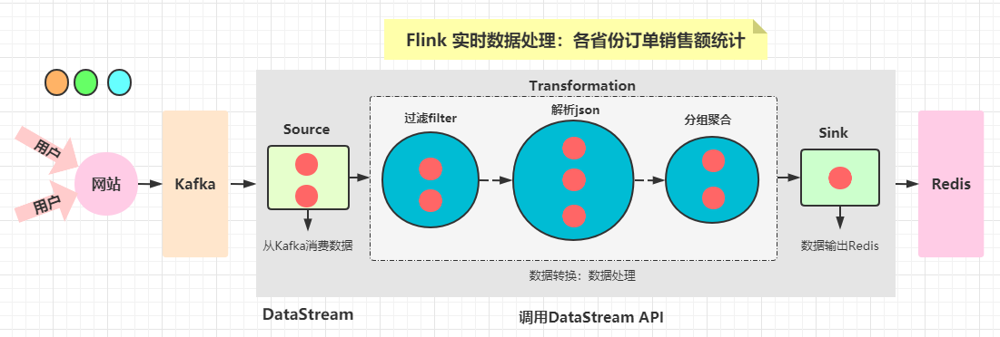


> Flink中运行Task任务（**SubTask**）在Slot资源槽中：
> 								[Slot为子任务SubTask运行资源抽象，每个TaskManager运行时设置Slot个数。]()

```ini
官方建议：
	Slot资源槽个数  =  CPU Core核数
	
也就是说，
    分配给TaskManager多少CPU Core核数，可以等价为Slot个数
```

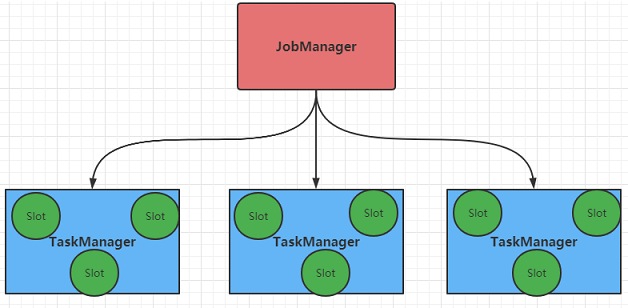

> 每个TaskManager运行时设置内存大小：[TaskManager中内存==平均==划分给Slot]()。

```ini
举例说明：
	假设TaskManager中分配内存为：4GB，Slot个数为4个，此时每个Slot分配内存就是 4GB / 4 = 1GB 内存	
```


> 每个Slot中运行SubTask子任务，以**线程Thread**方式运行。
>
> - 1个Job中不同类型SubTask任务，可以运行在同一个Slot中，称为：[Slot Sharded 资源槽共享]()
> - 1个Job中相同类型SubTask任务必须运行在不同Slot中

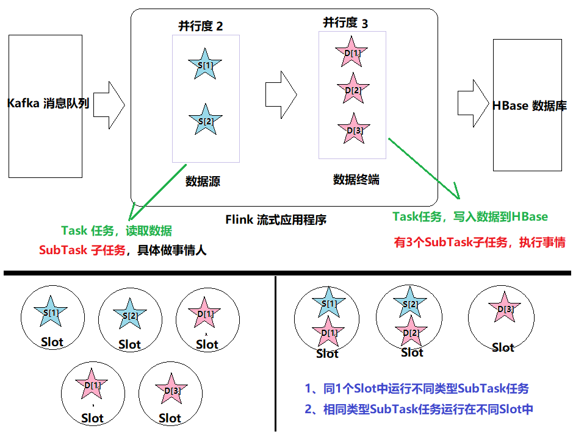


## 第二部分：Data Source & Data Sink【4个小节】


```ini
DataStream API 编程
	https://nightlies.apache.org/flink/flink-docs-release-1.13/docs/dev/datastream/overview
	
# 1、Data Sources 数据源
	https://nightlies.apache.org/flink/flink-docs-release-1.13/docs/dev/datastream/overview/#data-sources

# 2、DataStream Transformations
	https://nightlies.apache.org/flink/flink-docs-release-1.13/docs/dev/datastream/operators/overview/
	
# 3、Data Sinks 数据接收器
	https://nightlies.apache.org/flink/flink-docs-release-1.13/docs/dev/datastream/overview/#data-sinks
```


### 04-[掌握]-Data Source【基本数据源】

---


​			针对Flink 流计算来说，数据源可以是**有界数据源（静态数据）**，也可以是**无界数据源（流式数据）**，原因在于Flink框架中，==将数据统一封装称为`DataStream`数据流==。

https://nightlies.apache.org/flink/flink-docs-release-1.13/docs/dev/datastream/overview/#data-sources

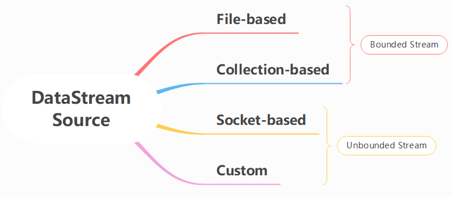

```ini
1、基于File文件数据源
	readTextFile(path)

2、Sockect 数据源
	socketTextStream 
	
3、基于Collection数据源
	fromCollection(Collection)
	fromElements(T ...)
	fromSequence(from, to)，相当于Python中range

4、自定义Custom数据源
	env.addSource()
	官方提供接口：
		SourceFunction			非并行
		RichSourceFunction 
		
		ParallelSourceFunction  并行
		RichParallelSourceFunction 
```


#### 集合Collection数据源

---

> 基于==集合Collection==数据源Source，一般用于学习测试。

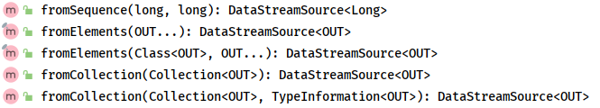

```java
package cn.itcast.flink.source;

import org.apache.flink.streaming.api.datastream.DataStreamSource;
import org.apache.flink.streaming.api.environment.StreamExecutionEnvironment;

import java.util.Arrays;

/**
 * Flink 流计算数据源：基于集合的Source，分别为可变参数、集合和自动生成数据
 *      TODO: 基于集合数据源Source构建DataStream，属于有界数据流，当数据处理完成以后，应用结束
 */
public class StreamSourceCollectionDemo {

	public static void main(String[] args) throws Exception {
		// 1. 执行环境-env
		StreamExecutionEnvironment env = StreamExecutionEnvironment.getExecutionEnvironment();
		env.setParallelism(1) ;

		// 2. 数据源-source
		// 方式一：可变参数
		DataStreamSource<String> dataStream01 = env.fromElements("spark", "flink", "mapreduce");
		dataStream01.print();

		// 方式二：集合对象
		DataStreamSource<String> dataStream02 = env.fromCollection(Arrays.asList("spark", "flink", "mapreduce"));
		dataStream02.printToErr();

		// 方式三：自动生成序列数字
		DataStreamSource<Long> dataStream03 = env.fromSequence(1, 10);
		dataStream03.print();

		// 5. 触发执行-execute
		env.execute("StreamSourceCollectionDemo") ;
	}

}
```


#### 文件File数据源

---

> 基于文件数据源， 一般用于学习测试，演示代码如下所示：

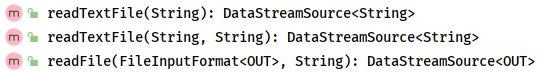


> 从文本文件加载数据时，可以是压缩文件，支持压缩格式如下图。

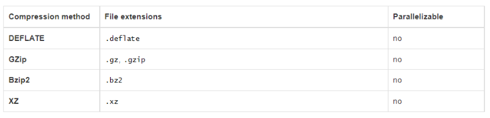


> 案例演示代码：`StreamSourceFileDemo`

```java
package cn.itcast.flink.source;

import org.apache.flink.streaming.api.datastream.DataStreamSource;
import org.apache.flink.streaming.api.environment.StreamExecutionEnvironment;

/**
 * Flink 流计算数据源：基于文件的Source
 */
public class StreamSourceFileDemo {

	public static void main(String[] args) throws Exception {
		// 1. 执行环境-env
		StreamExecutionEnvironment env = StreamExecutionEnvironment.getExecutionEnvironment();
		env.setParallelism(1) ;

		// 2. 数据源-source
		// 方式一：读取文本文件
		DataStreamSource<String> dataStream01 = env.readTextFile("datas/words.txt");
		dataStream01.printToErr();

		// 方式二：读取压缩文件
		DataStreamSource<String> dataStream02 = env.readTextFile("datas/words.txt.gz");
		dataStream02.print();

		// 5. 触发执行-execute
		env.execute("StreamSourceFileDemo") ;
	}

}
```


### 05-[掌握]-Data Source【自定义数据源】

------


> 在Flink 流计算中，提供**数据源Source**接口，用户实现自定义数据源，可以从任何地方获取数据。

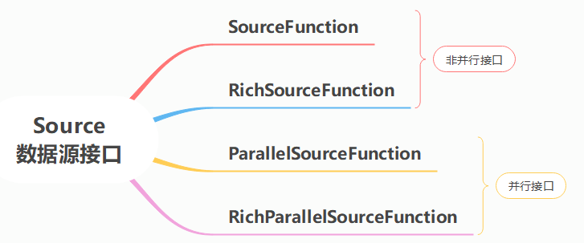

```ini
1、SourceFunction：
	非并行数据源(并行度parallelism=1)

2、RichSourceFunction：
	多功能非并行数据源(并行度parallelism=1)

3、ParallelSourceFunction：
	并行数据源(并行度parallelism>=1)

4、RichParallelSourceFunction：
	多功能并行数据源(parallelism>=1)，Kafka数据源使用该接口
```


> 实际项目中，如果自定义数据源，实现接口：`RichSourceFunction`或`RichParallelSourceFunction`。

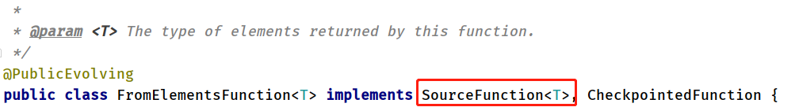


> 查看`SourceFunction`接口中方法：

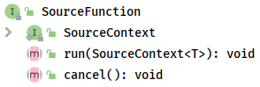

```ini
# 第一个方法：run
	实时从数据源端加载数据，并且发送给下一个Operator算子，进行处理
	实时产生数据

# 第二个方法：cancel
	字面意思：取消
	当将Job作业取消时，不在从数据源端读取数据
	
# 总结：当基于数据源接口自定义数据源时，只要实现上述2个 方法即可。
```

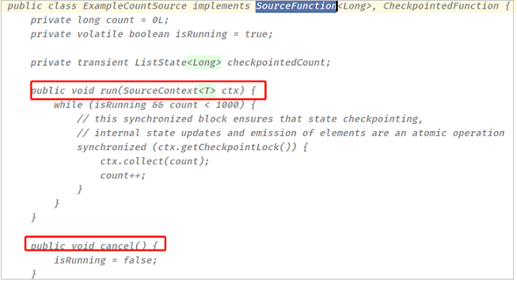


> 需求：==每隔1秒随机生成一条订单信息(订单ID、用户ID、订单金额、时间戳)==


> 创建类：`OrderSource`，实现接口【`RichParallelSourceFunction`】，实现其中`run`和`cancel`方法。

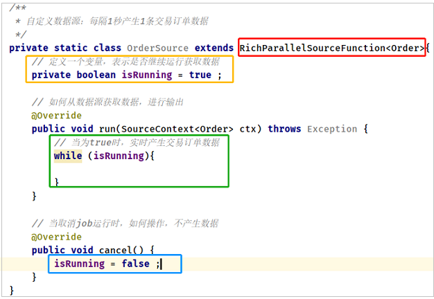


> 编程实现自定义数据源：`StreamSourceOrderDemo`，实时产生交易订单数据。

```java
package cn.itcast.flink.source;

import lombok.AllArgsConstructor;
import lombok.Data;
import lombok.NoArgsConstructor;
import org.apache.flink.streaming.api.datastream.DataStreamSource;
import org.apache.flink.streaming.api.environment.StreamExecutionEnvironment;
import org.apache.flink.streaming.api.functions.source.RichParallelSourceFunction;

import java.util.Random;
import java.util.UUID;
import java.util.concurrent.TimeUnit;

/**
 * 每隔1秒随机生成一条订单信息(订单ID、用户ID、订单金额、时间戳)
	 * - 随机生成订单ID：UUID
	 * - 随机生成用户ID：0-2
	 * - 随机生成订单金额：0-100
	 * - 时间戳为当前系统时间：current_timestamp
 */
public class StreamSourceOrderDemo {

	@Data
	@NoArgsConstructor
	@AllArgsConstructor
	public static class Order {
		private String id;
		private Integer userId;
		private Double money;
		private Long orderTime;
	}

	/**
	 * 自定义数据源，继承抽象类：RichParallelSourceFunction，并行的和富有的
	 */
	private static class OrderSource extends RichParallelSourceFunction<Order> {
		// 定义变量，用于标识是否产生数据
		private boolean isRunning = true ;

		// 表示产生数据，从数据源Source源源不断加载数据
		@Override
		public void run(SourceContext<Order> ctx) throws Exception {
			Random random = new Random();
			while (isRunning){
				// 产生交易订单数据
				Order order = new Order(
					UUID.randomUUID().toString(), //
					random.nextInt(2), //
					(double)random.nextInt(100), //
					System.currentTimeMillis()
				);
				// 发送交易订单数据
				ctx.collect(order);

				// 每隔1秒产生1条数据，休眠1秒钟
				TimeUnit.SECONDS.sleep(1);
			}
		}

		// 取消从数据源加载数据
		@Override
		public void cancel() {
			isRunning = false ;
		}
	}

	public static void main(String[] args) throws Exception {
		// 1. 执行环境-env
		StreamExecutionEnvironment env = StreamExecutionEnvironment.getExecutionEnvironment() ;
		env.setParallelism(1);

		// 2. 数据源-source
		DataStreamSource<Order> orderDataStream = env.addSource(new OrderSource());

		// 3. 数据转换-transformation
		// 4. 数据接收器-sink
		orderDataStream.printToErr();

		// 5. 触发执行-execute
		env.execute("StreamSourceOrderDemo") ;
	}

}
```


运行流式计算程序，查看模拟产生订单数据：

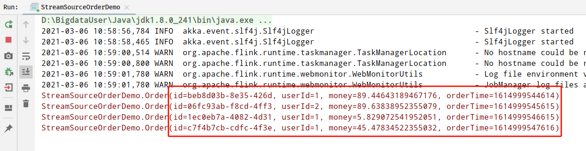


### 06-[掌握]-Data Source【MySQL Source】

---


> 需求：==从MySQL中实时加载数据，要求MySQL中的数据有变化，也能被实时加载出来==

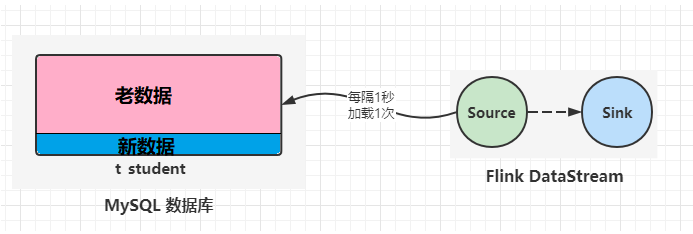


- 1）、数据准备

```SQL
CREATE DATABASE IF NOT EXISTS db_flink ;


CREATE TABLE IF NOT EXISTS db_flink.t_student (
                             id int(11) NOT NULL AUTO_INCREMENT,
                             name varchar(255) DEFAULT NULL,
                             age int(11) DEFAULT NULL,
                             PRIMARY KEY (id)
) ENGINE=InnoDB AUTO_INCREMENT=1 DEFAULT CHARSET=utf8;

INSERT INTO db_flink.t_student VALUES ('1', 'jack', 18);
INSERT INTO db_flink.t_student VALUES ('2', 'tom', 19);
INSERT INTO db_flink.t_student VALUES ('3', 'rose', 20);
INSERT INTO db_flink.t_student VALUES ('4', 'tom', 19);

INSERT INTO db_flink.t_student VALUES ('5', 'jack', 18);
INSERT INTO db_flink.t_student VALUES ('6', 'rose', 20);
```


- 2）、自定义数据源：`MysqlSource`

> 实现`run`方法，实现每隔1秒加载1次数据库表数据，此时数据有更新都会即使查询。

```scala
package cn.itcast.flink.source;

import lombok.AllArgsConstructor;
import lombok.Data;
import lombok.NoArgsConstructor;
import org.apache.flink.configuration.Configuration;
import org.apache.flink.streaming.api.datastream.DataStreamSource;
import org.apache.flink.streaming.api.environment.StreamExecutionEnvironment;
import org.apache.flink.streaming.api.functions.source.RichSourceFunction;

import java.sql.Connection;
import java.sql.DriverManager;
import java.sql.PreparedStatement;
import java.sql.ResultSet;
import java.util.concurrent.TimeUnit;

/**
 * 从MySQL中实时加载数据：要求MySQL数据的数据有变化，也能被实时加载出来（每隔几秒钟加载一次数据）
 * @author xuyuan
 */
public class StreamSourceMysqlDemo {

	@Data
	@AllArgsConstructor
	@NoArgsConstructor
	static class Student{
		private Integer id ;
		private String name ;
		private Integer age ;
	}


	/**
	 * 自定义数据源，从MySQL表中加载数据，并且实时增量加载，每隔5秒钟加载一次
	 */
	private static class MysqlSource extends RichSourceFunction<Student> {
		// 定义变量，标识是否加载数据
		private boolean isRunning = true ;

		// 定义变量
		private Connection conn = null ;
		private PreparedStatement pstmt = null ;
		private ResultSet result = null ;

		// todo: 在运行run方法之前初始化操作，比如获取连接
		@Override
		public void open(Configuration parameters) throws Exception {
			// step1. 加载驱动
			Class.forName("com.mysql.jdbc.Driver") ;
			// step2. 获取连接
			conn = DriverManager.getConnection(
				"jdbc:mysql://node1.itcast.cn:3306/?useSSL=false", "root", "123456"
			);
			// step3. 创建Statement对象
			pstmt = conn.prepareStatement("SELECT id, name, age FROM db_flink.t_student") ;
		}

		@Override
		public void run(SourceContext<Student> ctx) throws Exception {
			while (isRunning){
				// step4. 执行操作
				result = pstmt.executeQuery();
				// step5. 获取数据
				while (result.next()){
					// 获取每条数据
					int stuId = result.getInt("id");
					String stuName = result.getString("name");
					int stuAge = result.getInt("age");
					// todo: 封装数据到实体类对象中
					Student student = new Student(stuId, stuName, stuAge);
					// 发送数据到下游
					ctx.collect(student);
				}

				// 每隔5秒加载一次数据
				TimeUnit.SECONDS.sleep(5);
			}
		}

		@Override
		public void cancel() {
			isRunning = false ;
		}

		// todo: 当run方法运行结束以后，收尾工作，比如释放资源，关闭连接
		@Override
		public void close() throws Exception {
			// step6. 关闭连接
			if(null != result) {
				result.close();
			}
			if(null != pstmt ) {
				pstmt.close();
			}
			if(null != conn) {
				conn.close();
			}
		}
	}

	public static void main(String[] args) throws Exception {
		// 1. 执行环境-env
		StreamExecutionEnvironment env = StreamExecutionEnvironment.getExecutionEnvironment();
		env.setParallelism(1) ;

		// 2. 数据源-source
		MysqlSource mysqlSource = new MysqlSource();
		DataStreamSource<Student> studentDataStream = env.addSource(mysqlSource);

		// 3. 数据转换-transformation

		// 4. 数据终端-sink
		studentDataStream.printToErr();

		// 5. 触发执行-execute
		env.execute("StreamSourceMySQLDemo");
	}

}  
```


### 07-[理解]-Data Sink【MySQL Sink】 

------


> Flink 流计算中数据接收器Sink，基本数据保存和自定义Sink保存。

https://nightlies.apache.org/flink/flink-docs-release-1.13/docs/dev/datastream/overview/#data-sinks

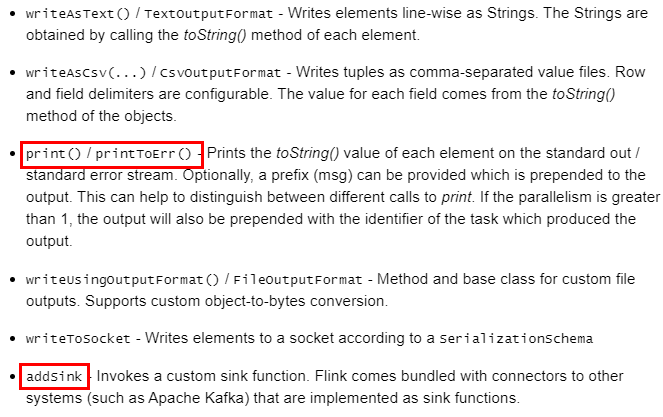

```ini
# 1、写入文件，API已经过时，不推荐使用
	writeAsText
	writeAsCsv
	
# 2、打印控制台，开发测试使用
	print，标准输出
	printToErr,错误输出
	
# 3、写入Socket
	很少使用
	
# 4、自定义数据接收器Sink
	Sink接口：SinkFunction、RichSinkFunction
	datastream.addSink 添加流式数据输出Sink
	
	# 需求：Flink 流式计算程序，实时从Kafka消费数据（保险行业），将数据ETL转换，存储到HBase表
		Flink 1.10版本中，DataStream未提供与HBase集成Connector连接器
		自定实现SinkFunction接口，向HBase表写入数据即可
		https://www.jianshu.com/p/1c29750ed814
```

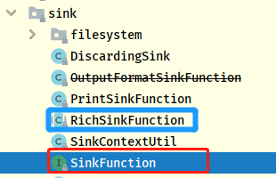


> 将数据写入文件方法：`writeAsText`和`writeAsCsv`全部过时，提供新的Connector：`StreamingFileSink`

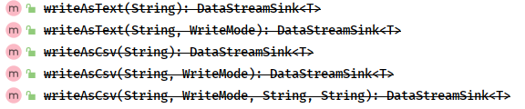


> **需求**：将Flink集合中的数据集DataStream，通过自定义Sink保存到MySQL。

```ini
CREATE DATABASE IF NOT EXISTS db_flink ;

CREATE TABLE IF NOT EXISTS db_flink.t_student (
    id int(11) NOT NULL AUTO_INCREMENT,
    name varchar(255) DEFAULT NULL,
    age int(11) DEFAULT NULL,
    PRIMARY KEY (id)
) ENGINE=InnoDB AUTO_INCREMENT=1 DEFAULT CHARSET=utf8;

INSERT INTO db_flink.t_student VALUES ('100', 'zhangsan', 24);
```


> [当自定义Flink中Sink时，需要实现接口：`SinkFunction`或`RichSinkFunction`]()

```java
package cn.itcast.flink.sink;

import lombok.AllArgsConstructor;
import lombok.Data;
import lombok.NoArgsConstructor;
import org.apache.flink.configuration.Configuration;
import org.apache.flink.streaming.api.datastream.DataStreamSource;
import org.apache.flink.streaming.api.environment.StreamExecutionEnvironment;
import org.apache.flink.streaming.api.functions.sink.RichSinkFunction;

import java.sql.Connection;
import java.sql.DriverManager;
import java.sql.PreparedStatement;

/**
 * 案例演示：自动Sink，将数据保存到MySQL表中，实现类RichSinkFunction
 * @author xuyuan
 */
public class StreamSinkMysqlDemo {

	@Data
	@AllArgsConstructor
	@NoArgsConstructor
	public static class Student{
		private Integer id ;
		private String name ;
		private Integer age ;
	}

	/**
	 * 自定义Sink接收器，将DataStream中数据写入到MySQL数据库表中
	 */
	private static class MysqlSink extends RichSinkFunction<Student> {

		// 定义变量
		private Connection conn = null ;
		private PreparedStatement pstmt = null ;

		// todo: 初始化操作，比如获取连接
		@Override
		public void open(Configuration parameters) throws Exception {
			// step1. 加载驱动
			Class.forName("com.mysql.jdbc.Driver") ;
			// step2. 获取连接
			conn = DriverManager.getConnection(
				"jdbc:mysql://node1.itcast.cn:3306/?useSSL=false", "root", "123456"
			);
			// step3. 创建Statement对象
			pstmt = conn.prepareStatement("INSERT INTO db_flink.t_student(id, name, age) VALUES (?, ?, ?)") ;

		}

		// todo： 数据流中每条数据进行输出操作，调用invoke方法
		@Override
		public void invoke(Student student, Context context) throws Exception {
			// step4、执行操作，先设置占位符值
			pstmt.setInt(1, student.id);
			pstmt.setString(2, student.name);
			pstmt.setInt(3, student.age);
			pstmt.execute();
		}

		// todo： 收尾工作，比如关闭连接，释放资源
		@Override
		public void close() throws Exception {
			// step5. 关闭连接
			if(null != pstmt) {
				pstmt.close();
			}
			if(null != conn) {
				conn.close();
			}
		}
	}


	public static void main(String[] args) throws Exception {
		// 1. 执行环境-env
		StreamExecutionEnvironment env = StreamExecutionEnvironment.getExecutionEnvironment();
		env.setParallelism(1) ;

		// 2. 数据源-source
		DataStreamSource<Student> inputDataStream = env.fromElements(
			new Student(21, "wangwu", 20),
			new Student(22, "zhaoliu", 19),
			new Student(23, "laoda", 25),
			new Student(24, "laoer", 23),
			new Student(25, "laosan", 21)
		);

		// 3. 数据转换-transformation

		// 4. 数据终端-sink
		MysqlSink mysqlSink = new MysqlSink() ;
		inputDataStream.addSink(mysqlSink) ;

		// 5. 触发执行-execute
		env.execute("StreamSinkMySQLDemo");
	}

}  
```


## 第三部分：DataStream Transformations【9个小节】


```

```


### 08-[理解]-Transformation【算子概述】

---


> 从DataStream数据流转换角度看Transformation算子（函数），有如下四类操作：

文档：https://nightlies.apache.org/flink/flink-docs-release-1.13/docs/dev/datastream/operators/overview/

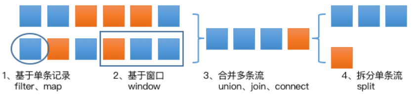


- 1）、第一类是对于`单条记录的操作`，比如筛除掉不符合要求的记录（Filter 操作），或者将每条记录都做一个转换（Map 操作）


- 2）、第二类是对`多条记录的操作`。比如说统计一个小时内的订单总成交量，就需要将一个小时内的所有订单记录的成交量加到一起。为了支持这种类型的操作，就得通过 Window 将需要的记录关联到一起进行处理


- 3）、第三类是对`多个流进行操作合并转换为单个流`。例如，多个流可以通过 Union、Join 或Connect 等操作合到一起。这些操作合并的逻辑不同，但是它们最终都会产生了一个新的统一的流，从而可以进行一些跨流的操作。


- 4）、第四类是DataStream支持与合并对称的`拆分操作`，即`把一个流按一定规则拆分为多个流`（Split 操作），每个流是之前流的一个子集，这样我们就可以对不同的流作不同的处理。


> 先讲解一些DataStream中最基本Operator算子使用，也是使用比较多。

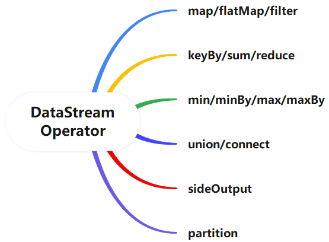


### 09-[掌握]-Transformation【map 算子】

---


> `map`函数使用说明：

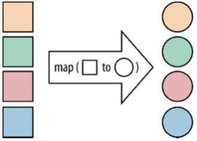


> **需求**：将读取文本文件数据，每行JSON格式数据，转换为**ClickLog**对象，使用`map`函数完成。

​						[将JSON格式字符串，解析转换为JavaBean对象，使用库：`fastJson`库]()

```java
package cn.itcast.flink.transformation;

import com.alibaba.fastjson.JSON;
import lombok.Data;
import org.apache.commons.lang3.time.DateFormatUtils;
import org.apache.flink.api.common.functions.FilterFunction;
import org.apache.flink.api.common.functions.FlatMapFunction;
import org.apache.flink.api.common.functions.MapFunction;
import org.apache.flink.streaming.api.datastream.DataStream;
import org.apache.flink.streaming.api.environment.StreamExecutionEnvironment;
import org.apache.flink.util.Collector;

/**
 * Flink中流计算DataStream转换函数：map、flatMap和filter
 */
public class TransformationBasicDemo {

	@Data
	private static class ClickLog {
		//频道ID
		private long channelId;
		//产品的类别ID
		private long categoryId;

		//产品ID
		private long produceId;
		//用户的ID
		private long userId;
		//国家
		private String country;
		//省份
		private String province;
		//城市
		private String city;
		//网络方式
		private String network;
		//来源方式
		private String source;
		//浏览器类型
		private String browserType;
		//进入网站时间
		private Long entryTime;
		//离开网站时间
		private Long leaveTime;
	}

	public static void main(String[] args) throws Exception {
		// 1. 执行环境-env
		StreamExecutionEnvironment env = StreamExecutionEnvironment.getExecutionEnvironment();
		env.setParallelism(1);

		// 2. 数据源-source
		DataStream<String> inputDataStream = env.readTextFile("datas/click.log");

		// 3. 数据转换-transformation
		// TODO: 函数一【map函数】，将JSON转换为JavaBean对象
		DataStream<ClickLog> clickDataStream = inputDataStream.map(new MapFunction<String, ClickLog>() {
			@Override
			public ClickLog map(String line) throws Exception {
				return JSON.parseObject(line, ClickLog.class);
			}
		});
		clickDataStream.printToErr();

		// 5. 触发执行-execute
		env.execute("TransformationBasicDemo") ;
	}

}
```


### 10-[掌握]-Transformation【flatMap 算子】

---


> `flatMap`：将集合中的每个元素变成一个或多个元素，并返回扁平化之后的结果，==flatMap = map + flattern==

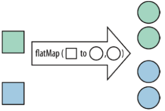

> **案例演示说明**：依据`访问网站时间戳`转换为不同时间日期格式数据

```ini
Long类型日期时间：	1577890860000  
				|
				|进行格式
				|
String类型日期格式
		yyyy-MM-dd-HH
		yyyy-MM-dd
		yyyy-MM
```


```java
		// TODO: 函数二【flatMap】，每条数据转换为日期时间格式
		/*
		Long类型日期时间：	1577890860000
							|
							|进行格式
							|
		String类型日期格式
				yyyy-MM-dd-HH
				yyyy-MM-dd
				yyyy-MM
		 */
		DataStream<String> flatMapDataStream = clickDataStream.flatMap(new FlatMapFunction<ClickLog, String>() {
			@Override
			public void flatMap(ClickLog clickLog, Collector<String> out) throws Exception {
				// 获取访问数据
				Long entryTime = clickLog.getEntryTime();
				// 格式一：yyyy-MM-dd-HH
				String hour = DateFormatUtils.format(entryTime, "yyyy-MM-dd-HH");
				out.collect(hour);

				// 格式二：yyyy-MM-dd
				String day = DateFormatUtils.format(entryTime, "yyyy-MM-dd");
				out.collect(day);

				// 格式三：yyyy-MM
				String month = DateFormatUtils.format(entryTime, "yyyy-MM");
				out.collect(month);
			}
		});
		//flatMapDataStream.printToErr();
```


### 11-[掌握]-Transformation 【filter 算子 】

---


> `filter`：按照指定的条件对集合中的元素进行过滤，过滤出返回true/符合条件的元素

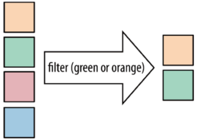

> 需求：==过滤出clickLog中使用谷歌浏览器访问的日志==

```java
		// TODO: 函数三【filter函数】，过滤使用谷歌浏览器数据
		DataStream<ClickLog> filterDataStream = clickDataStream.filter(new FilterFunction<ClickLog>() {
			@Override
			public boolean filter(ClickLog clickLog) throws Exception {
				return "谷歌浏览器".equals(clickLog.getBrowserType());
			}
		});
		//filterDataStream.printToErr();
```


### 12-[掌握]-Transformation【keyBy 算子 】

---


> ​			**keyBy**算子表示：==按照指定的key来对流中的数据进行分组==，分组后流称为`KeyedStream`，要么聚合操作（调用**reduce、fold或aggregate**函数等等），要么进行窗口操作window。

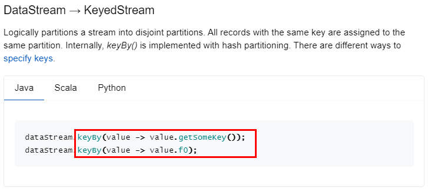

​			在Flink中如果是批处理，分组使用函数：`groupBy`，从Flink 1.12以后开始，由于流批一体，无论是流计算还是批处理，分组函数：`keyBy`。


> ​			在使用keyBy函数时，可以指定`下标索引`（数据类型为**元组**）、指定`属性名称`（数据类型为**JavaBean**）或指定`KeySelector选择器`。

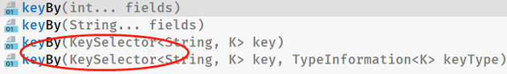


> **案例代码演示**：从TCP Socket消费数据，进行词频统计，先过滤和分词，再分组和聚合。

```java
package cn.itcast.flink.transformation;

import org.apache.flink.api.common.functions.FilterFunction;
import org.apache.flink.api.common.functions.FlatMapFunction;
import org.apache.flink.api.common.functions.MapFunction;
import org.apache.flink.api.java.tuple.Tuple2;
import org.apache.flink.streaming.api.datastream.DataStreamSource;
import org.apache.flink.streaming.api.datastream.SingleOutputStreamOperator;
import org.apache.flink.streaming.api.environment.StreamExecutionEnvironment;
import org.apache.flink.util.Collector;

/**
 * Flink中流计算DataStream转换算子：keyBy和sum 算子
 * @author xuyuan
 */
public class TransformationKeyByDemo {

	public static void main(String[] args) throws Exception {
		// 1. 执行环境-env
		StreamExecutionEnvironment env = StreamExecutionEnvironment.getExecutionEnvironment();
		env.setParallelism(1) ;

		// 2. 数据源-source
		DataStreamSource<String> inputDataStream = env.socketTextStream("node1.itcast.cn", 9999);

		// 3. 数据转换-transformation
		/*
			flink spark flink
				|flatMap
			flink, spark, flink
				|map
			(flink, 1), (spark, 1), (flink, 1)
				|keyBy(0)
			flink -> [(flink, 1), (flink, 1)]   spark -> [(spark, 1)]
				|sum(1): todo -> 分组后，对每个组内数据求和操作
			flink -> 1 + 1 = 2,   spark -> 1 = 1
		 */
		// 3-0. 过滤掉空字符串
		SingleOutputStreamOperator<String> lineDataStream = inputDataStream.filter(new FilterFunction<String>() {
			@Override
			public boolean filter(String line) throws Exception {
				return line.trim().length() > 0;
			}
		});

		// 3-1. 分割单词，使用map算子
		SingleOutputStreamOperator<String> wordDataStream = lineDataStream.flatMap(new FlatMapFunction<String, String>() {
			@Override
			public void flatMap(String line, Collector<String> out) throws Exception {
				String[] words = line.split("\\s+");
				for (String word : words) {
					out.collect(word);
				}
			}
		});

		// 3-2. 转换为二元组
		SingleOutputStreamOperator<Tuple2<String, Integer>> tupleDataStream = wordDataStream.map(new MapFunction<String, Tuple2<String, Integer>>() {

			@Override
			public Tuple2<String, Integer> map(String word) throws Exception {
				return Tuple2.of(word, 1);
			}
		});

		// 3-3. 按照单词分组，并且组内求和
		/*
		.keyBy(new KeySelector<Tuple2<String, Integer>, String>() {
				@Override
				public String getKey(Tuple2<String, Integer> tuple) throws Exception {
					return tuple.f0;
				}
			})
		 */
		SingleOutputStreamOperator<Tuple2<String, Integer>> resultDataStream = tupleDataStream
			// lambda 表达式写法
			.keyBy(tuple -> tuple.f0)
			.sum(1);

		// 4. 数据终端-sink
		resultDataStream.printToErr();

		// 5. 触发执行-execute
		env.execute("TransformationKeyByDemo");
	}

}  
```


### 13-[掌握]-Transformation【reduce 算子】

---


> ​		[`reduce`：对Key分组中的元素进行`聚合`]()，有2个参数 `（x, y)`，其中 `x ：tmp`为聚合中间临时变量， `y：item`为聚合中每个元素。

​									[reduce 算子，仅仅针对DataStream被keyBy分组后KeyedStream数据进行聚合]()

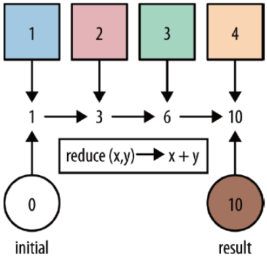


> **案例代码演示**：修改词频统计WordCount程序，使用`reduce`代替 进行组内数据求和。

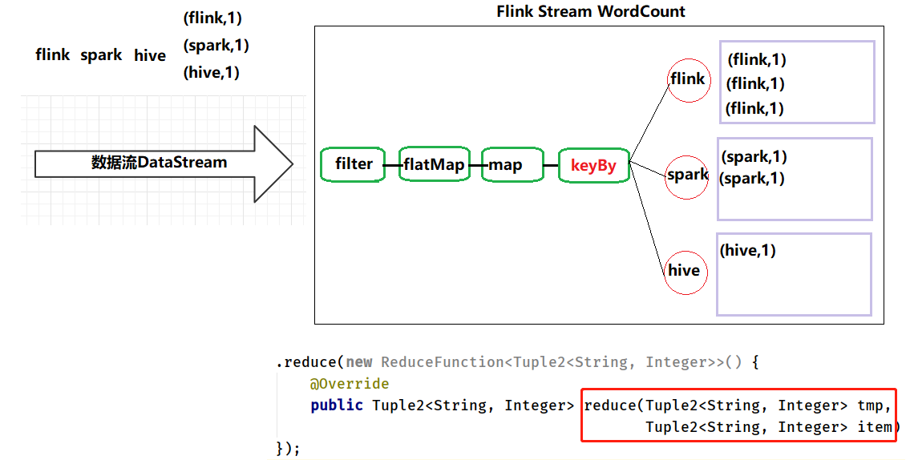


```java
package cn.itcast.flink.transformation;

import org.apache.flink.api.common.functions.FlatMapFunction;
import org.apache.flink.api.common.functions.ReduceFunction;
import org.apache.flink.api.java.tuple.Tuple2;
import org.apache.flink.streaming.api.datastream.DataStream;
import org.apache.flink.streaming.api.datastream.SingleOutputStreamOperator;
import org.apache.flink.streaming.api.environment.StreamExecutionEnvironment;
import org.apache.flink.util.Collector;

/**
 * Flink中流计算DataStream转换函数：reduce聚合函数
 */
public class TransformationReduceDemo {

	public static void main(String[] args) throws Exception {
		// 1. 执行环境-env
		StreamExecutionEnvironment env = StreamExecutionEnvironment.getExecutionEnvironment();
		env.setParallelism(2);

		// 2. 数据源-source
		DataStream<String> inputDataStream = env.socketTextStream("node1.itcast.cn", 9999);

		// 3. 数据转换-transformation
		// todo: 过滤脏数据和转换为单词而源自
		SingleOutputStreamOperator<Tuple2<String, Integer>> tupleDataStream = inputDataStream
			// 3-1. 过滤脏数据，todo：Java 8 提供Lambda表达式
			.filter(line -> line.trim().length() > 0)
			// 3-2. 每行数据分割为单词，并转换为二元组
			.flatMap(new FlatMapFunction<String, Tuple2<String, Integer>>() {
				@Override
				public void flatMap(String line, Collector<Tuple2<String, Integer>> out) throws Exception {
					String[] words = line.trim().split("\\s+");
					for (String word : words) {
						out.collect(Tuple2.of(word, 1));
					}
				}
			});
		// todo: 3-3. 使用reduce算子，对keyBy分组后流数据进行聚合操作（组内求和）
		SingleOutputStreamOperator<Tuple2<String, Integer>> outputDataStream = tupleDataStream
			.keyBy(tuple -> tuple.f0)
			.reduce(new ReduceFunction<Tuple2<String, Integer>>() {
				// todo： sc.parallisize([1, 2, 3, 4, 5]).reduce(lambda tmp, item: tmp + item)), tmp 初始值为分区第一个元素
				@Override
				public Tuple2<String, Integer> reduce(Tuple2<String, Integer> tmp,
				                                      Tuple2<String, Integer> item) throws Exception {
					System.out.println("tmp = " + tmp + ", item = " + item);
					/*
						tmp：表示keyBy分组中每个Key对应结果值
							key -> spark,  tmp -> (spark, 10)
							todo： 如果第一次对key数据聚合，直接将数据赋值给tmp
						item: 表示使用keyBy分组后组内数据
							(spark, 1)
					 */
					// 获取以前计算你只
					Integer historyValue = tmp.f1;
					// 获取现在传递值
					Integer currentValue = item.f1;

					// 计算最新值
					int latestValue = historyValue + currentValue ;

					//返回结果
					return Tuple2.of(tmp.f0, latestValue);
				}
			});

		// 4. 数据接收器-sink
		outputDataStream.printToErr();

		// 5. 触发执行-execute
		env.execute("TransformationReduceDemo");
	}

}
```


### 14-[掌握]-Transformation【max和min 算子 】

---


> 在DataStream API中，对数据按照keyBy分组，直接获取最大或最小值函数：`min与minBy，及max与maxBy`。

- **max或min**：`只会求出最大或最小的那个字段`，其他的字段不管
- **maxBy或minBy**：`会求出最大或最小的那个字段和对应的其他的字段`

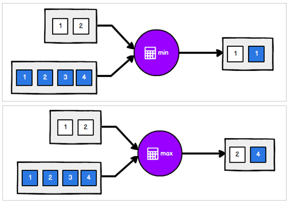

```java
package cn.itcast.flink.transformation;

import org.apache.flink.api.java.tuple.Tuple3;
import org.apache.flink.streaming.api.datastream.DataStream;
import org.apache.flink.streaming.api.environment.StreamExecutionEnvironment;

/**
 * Flink 中流计算DataStream转换算子：max或maxBy、min或minBy
 * @author xuyuan
 */
public class TransformationMaxMinDemo {

	public static void main(String[] args) throws Exception {
		// 1. 执行环境-env
		StreamExecutionEnvironment env = StreamExecutionEnvironment.getExecutionEnvironment();
		env.setParallelism(1);

		// 2. 数据源-source
		DataStream<Tuple3<String, String, Integer>> inputDataStream = env.fromElements(
			Tuple3.of("上海", "浦东新区", 777),
			Tuple3.of("上海", "闵行区", 999),
			Tuple3.of("上海", "杨浦区", 666),
			Tuple3.of("北京", "东城区", 567),
			Tuple3.of("北京", "西城区", 987),
			Tuple3.of("上海", "静安区", 888),
			Tuple3.of("北京", "海淀区", 9999)
		);

		// 3. 数据转换-transformation
		// todo: max 最大值, 只关心指定字段最大值，其他字段不关心
		DataStream<Tuple3<String, String, Integer>> maxDataStream = inputDataStream
			.keyBy(tuple -> tuple.f0)
			.max(2);
		maxDataStream.printToErr("max>");

		// todo: maxBy 最大值，关心其他字段
		DataStream<Tuple3<String, String, Integer>> maxByDataStream = inputDataStream
			.keyBy(tuple -> tuple.f0)
			.maxBy(2);
		maxByDataStream.printToErr("maxBy>");

		// 4. 数据终端-sink

		// 5. 触发执行-execute
		env.execute("TransformationMaxMinDemo");
	}

}  
```


### 15-[掌握]-Transformation【union和connect 算子 】

---


> - 1）`union`函数：可以`合并多个同类型的数据流`，并生成同类型的数据流，即可以将多个DataStream[T]合并为一个新的DataStream[T]。
>
>   ​						[数据将按照先进先出（First In First Out）的模式合并，且不去重。]()

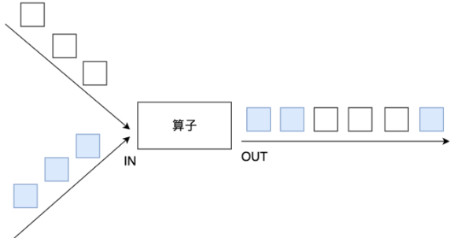


> - 2）、`connect`函数：与union函数功能类似，`用来连接两个数据流`，且2个数据流数据**类型可不一样**。

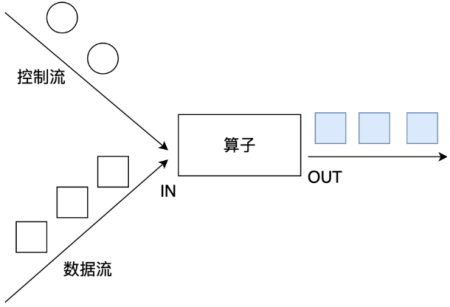


1. connect只能连接两个数据流，union可以连接多个数据流；
2. connect所连接的两个数据流的数据类型可以不一致，union所连接的两个数据流的数据类型必须一致；


> **案例演示**，分别对2个流DataStream进行union和connect操作：
>
> - 将两个String类型的流进行`union`；
> - 将一个String类型和一个Long类型的流进行`connect`；

```java
package cn.itcast.flink.transformation;

import org.apache.flink.streaming.api.datastream.ConnectedStreams;
import org.apache.flink.streaming.api.datastream.DataStream;
import org.apache.flink.streaming.api.datastream.SingleOutputStreamOperator;
import org.apache.flink.streaming.api.environment.StreamExecutionEnvironment;
import org.apache.flink.streaming.api.functions.co.CoMapFunction;

/**
 * Flink中流计算DataStream转换算子：合并union和连接connect
 * @author xuyuan
 */
public class TransformationUnionConnectDemo {

	public static void main(String[] args) throws Exception {
		// 1. 执行环境-env
		StreamExecutionEnvironment env = StreamExecutionEnvironment.getExecutionEnvironment();
		env.setParallelism(1) ;

		// 2. 数据源-source
		DataStream<String> dataStream01 = env.fromElements("A", "B", "C", "D");
		DataStream<String> dataStream02 = env.fromElements("aa", "bb", "cc", "dd");
		DataStream<Integer> dataStream03 = env.fromElements(1, 2, 3, 4);

		// 3. 数据转换-transformation
		// todO: 2个流进行union，要求流中数据类型必须相同
		DataStream<String> unionDataStream = dataStream01.union(dataStream02);
		// unionDataStream.printToErr() ;

		// todo: 2个流进行连接，connect 应用场景 -> 大表与小表维度关联
		ConnectedStreams<String, Integer> connectDataStream = dataStream01.connect(dataStream03);
		// 对连接流中数据必须进行处理，才可以输出，需要调用转换算子：比如map、flatMap都可以
		SingleOutputStreamOperator<String> mapDataStream = connectDataStream.map(
			// interface CoMapFunction<IN1, IN2, OUT>
			new CoMapFunction<String, Integer, String>() {
				// 连接流时，左边数据流中数据操作
				@Override
				public String map1(String value) throws Exception {
					return "map1: left -> " + value;
				}

				// 连接流时，右边数据流中数据操作
				@Override
				public String map2(Integer value) throws Exception {
					return "map2: right -> " + value;
				}
			}
		);
		mapDataStream.printToErr();

		// 4. 数据终端-sink

		// 5. 触发执行-execute
		env.execute("TransformationUnionConnectDemo");
	}

}  
```


### 16-[掌握]-Transformation 【Side Outputs】

---


> 在Flink流计算中，提供API函数，将1个流分割为多个流，使用`split`算子和`select`算子。

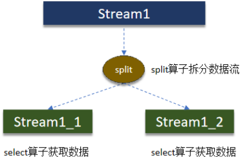

> `Split`就是将一个流分成多个流，`Select`就是获取分流后对应的数据。

​			[DataStream中split函数，分割流的本质：给DataStream流中`每条数据打上标签Tag`，最后依据标签Tag获取具体分割的流数据。]()


> ​			分割流`函数split`已经过时，并且在新版本中已经被删除，Flink提供：`侧边输出SideOutput`方式，可以将1个流进行侧边输出多个流。

https://nightlies.apache.org/flink/flink-docs-release-1.13/docs/dev/datastream/side_output/

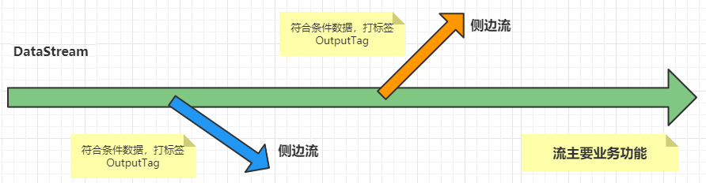


- 第1步、定义输出标签`OutputTag`
  - `OutputTag<String> outputTag = new OutputTag<String>("side-output") {};`
  - 比如需要输出2个流，定义2个OutputTag标签
  
  
  
- 第2步、调用DataStream中`process`底层处理函数，进行判断，划分OutputTag。

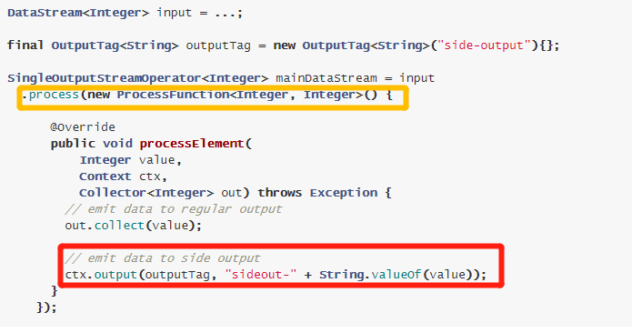


> 案例演示：对流中的数据**按照奇数和偶数进行分流**，并获取分流后的数据

```java
package cn.itcast.flink.transformation;

import org.apache.flink.streaming.api.datastream.DataStream;
import org.apache.flink.streaming.api.datastream.DataStreamSource;
import org.apache.flink.streaming.api.datastream.SingleOutputStreamOperator;
import org.apache.flink.streaming.api.environment.StreamExecutionEnvironment;
import org.apache.flink.streaming.api.functions.ProcessFunction;
import org.apache.flink.util.Collector;
import org.apache.flink.util.OutputTag;

/**
 * Flink 流计算中转换算子：使用侧边流SideOutputs
 */
public class TransformationSideOutputsDemo {

	public static void main(String[] args) throws Exception {
		// 1. 执行环境-env
		StreamExecutionEnvironment env = StreamExecutionEnvironment.getExecutionEnvironment();
		env.setParallelism(1);

		// 2. 数据源-source
		DataStreamSource<Integer> inputStream = env.fromElements(1, 2, 3, 4, 5, 6, 7, 8, 9, 10);

		// 3. 数据转换-transformation
		/*
			对数据流进行分割，使用sideOutput侧边输出算子实现，将奇数数字放在一个流，将偶数数字放在一个流，todo：原来数据流中数据平方处理
		 */
		// step1、定义分割流标签
		OutputTag<Integer> oddTag = new OutputTag<Integer>("side-odd") {};
		OutputTag<Integer> evenTag = new OutputTag<Integer>("side-even") {};
		
		// step2、调用process函数，对流中数据处理及打标签
		SingleOutputStreamOperator<String> mainStream = inputStream.process(new ProcessFunction<Integer, String>() {
			// 表示对流中每条数据处理
			@Override
			public void processElement(Integer value, Context ctx, Collector<String> out) throws Exception {
				// todo: 流中每条数据原来该怎么计算依然如何计算，比如值平方
				int squareValue = value * value ;
				out.collect(squareValue + "");

				// step3、判断数据是奇数还是偶数，打上对应标签
				if(value % 2 == 0){
					ctx.output(evenTag, value);
				}else{
					ctx.output(oddTag, value);
				}
			}
		});

		// 4. 数据终端-sink
		mainStream.printToErr();

		// step4、获取侧边流，依据标签
		DataStream<Integer> oddStream = mainStream.getSideOutput(oddTag);
		oddStream.print("odd>");

		DataStream<Integer> evenStream = mainStream.getSideOutput(evenTag);
		evenStream.print("even>");

		// 5. 触发执行-execute
		env.execute("TransformationSideOutputsDemo");
	}

}
```

运行上述流式计算程序，可以发现，原来数据流继续处理数据，依据OutputTag衍生侧边流，各自单独处理数据。

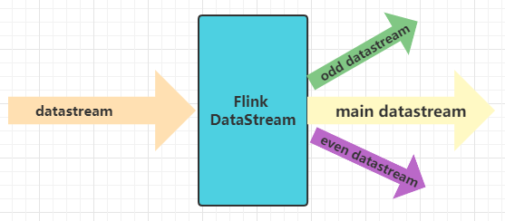


## 附录部分：注意事项及扩展内容


```

```


### [附录1]-创建Maven模块

---


> Maven 工程结构

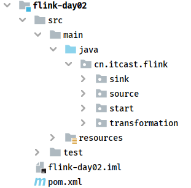


> Maven 工程POM文件中内容（依赖包）：		

```xml
    <properties>
        <project.build.sourceEncoding>UTF-8</project.build.sourceEncoding>
        <maven.compiler.source>${java.version}</maven.compiler.source>
        <maven.compiler.target>${java.version}</maven.compiler.target>
        <java.version>1.8</java.version>
        <scala.binary.version>2.11</scala.binary.version>
        <flink.version>1.13.1</flink.version>
        <hadoop.version>3.3.0</hadoop.version>
    </properties>

    <repositories>
        <repository>
            <id>nexus-aliyun</id>
            <name>Nexus aliyun</name>
            <url>http://maven.aliyun.com/nexus/content/groups/public</url>
        </repository>
        <repository>
            <id>central_maven</id>
            <name>central maven</name>
            <url>https://repo1.maven.org/maven2</url>
        </repository>
        <repository>
            <id>cloudera</id>
            <url>https://repository.cloudera.com/artifactory/cloudera-repos/</url>
        </repository>
        <repository>
            <id>apache.snapshots</id>
            <name>Apache Development Snapshot Repository</name>
            <url>https://repository.apache.org/content/repositories/snapshots/</url>
            <releases>
                <enabled>false</enabled>
            </releases>
            <snapshots>
                <enabled>true</enabled>
            </snapshots>
        </repository>
    </repositories>

    <dependencies>
        <dependency>
            <groupId>org.apache.flink</groupId>
            <artifactId>flink-java</artifactId>
            <version>1.13.1</version>
        </dependency>
        <dependency>
            <groupId>org.apache.flink</groupId>
            <artifactId>flink-streaming-java_2.11</artifactId>
            <version>1.13.1</version>
        </dependency>
        <dependency>
            <groupId>org.apache.flink</groupId>
            <artifactId>flink-clients_2.11</artifactId>
            <version>1.13.1</version>
        </dependency>
        <dependency>
            <groupId>org.apache.flink</groupId>
            <artifactId>flink-runtime-web_2.11</artifactId>
            <version>1.13.1</version>
        </dependency>

        <dependency>
            <groupId>org.apache.flink</groupId>
            <artifactId>flink-connector-kafka_2.11</artifactId>
            <version>1.13.1</version>
        </dependency>

        <dependency>
            <groupId>org.apache.flink</groupId>
            <artifactId>flink-connector-jdbc_2.11</artifactId>
            <version>1.13.1</version>
        </dependency>

        <dependency>
            <groupId>org.apache.flink</groupId>
            <artifactId>flink-connector-files</artifactId>
            <version>1.13.1</version>
        </dependency>

        <dependency>
            <groupId>org.apache.bahir</groupId>
            <artifactId>flink-connector-redis_2.11</artifactId>
            <version>1.0</version>
        </dependency>

        <dependency>
            <groupId>mysql</groupId>
            <artifactId>mysql-connector-java</artifactId>
            <version>5.1.48</version>
        </dependency>

        <dependency>
            <groupId>com.alibaba</groupId>
            <artifactId>fastjson</artifactId>
            <version>1.2.68</version>
        </dependency>
        <dependency>
            <groupId>org.projectlombok</groupId>
            <artifactId>lombok</artifactId>
            <version>1.18.12</version>
        </dependency>

        <dependency>
            <groupId>org.slf4j</groupId>
            <artifactId>slf4j-log4j12</artifactId>
            <version>1.7.7</version>
            <scope>runtime</scope>
        </dependency>
        <dependency>
            <groupId>log4j</groupId>
            <artifactId>log4j</artifactId>
            <version>1.2.17</version>
            <scope>runtime</scope>
        </dependency>

    </dependencies>

    <build>
        <sourceDirectory>src/main/java</sourceDirectory>
        <testSourceDirectory>src/test/java</testSourceDirectory>
        <plugins>
            <!-- 编译插件 -->
            <plugin>
                <groupId>org.apache.maven.plugins</groupId>
                <artifactId>maven-compiler-plugin</artifactId>
                <version>3.5.1</version>
                <configuration>
                    <source>1.8</source>
                    <target>1.8</target>
                    <!--<encoding>${project.build.sourceEncoding}</encoding>-->
                </configuration>
            </plugin>
            <plugin>
                <groupId>org.apache.maven.plugins</groupId>
                <artifactId>maven-surefire-plugin</artifactId>
                <version>2.18.1</version>
                <configuration>
                    <useFile>false</useFile>
                    <disableXmlReport>true</disableXmlReport>
                    <includes>
                        <include>**/*Test.*</include>
                        <include>**/*Suite.*</include>
                    </includes>
                </configuration>
            </plugin>
            <!-- 打jar包插件(会包含所有依赖) -->
            <plugin>
                <groupId>org.apache.maven.plugins</groupId>
                <artifactId>maven-shade-plugin</artifactId>
                <version>2.3</version>
                <executions>
                    <execution>
                        <phase>package</phase>
                        <goals>
                            <goal>shade</goal>
                        </goals>
                        <configuration>
                            <filters>
                                <filter>
                                    <artifact>*:*</artifact>
                                    <excludes>
                                        <!--
                                        zip -d learn_spark.jar META-INF/*.RSA META-INF/*.DSA META-INF/*.SF -->
                                        <exclude>META-INF/*.SF</exclude>
                                        <exclude>META-INF/*.DSA</exclude>
                                        <exclude>META-INF/*.RSA</exclude>
                                    </excludes>
                                </filter>
                            </filters>
                            <transformers>
                                <transformer
                                        implementation="org.apache.maven.plugins.shade.resource.ManifestResourceTransformer">
                                    <!-- <mainClass>com.itcast.flink.cn.itcast.flink.WordCount</mainClass> -->
                                </transformer>
                            </transformers>
                        </configuration>
                    </execution>
                </executions>
            </plugin>
        </plugins>
    </build>
```


### [附录2]-Lombok 使用及插件安装

---


> 定义JavaBean对象（POJO类）使用lombok注解方式完成，代码简洁。

- 第一步、添加Maven依赖

```xml
<dependency>
    <groupId>org.projectlombok</groupId>
    <artifactId>lombok</artifactId>
    <version>1.18.12</version>
</dependency>
```


- 第二步、IDEA安装插件：Lombok，图标logo为小辣椒。


```Java
package cn.itcast.flink.test.lombok;

import lombok.*;

/*
@Setter
@Getter
@AllArgsConstructor
@NoArgsConstructor
@EqualsAndHashCode
@ToString
*/
@Data
@AllArgsConstructor
@NoArgsConstructor
public class StudentObj {

	private Long id;
	private String name;
	private Integer age ;

}
```


### [复习1]-Java 基础回顾【泛型】

------


> 在Flink中几乎所有处理数据**Function函数接口**都是**泛型**，**创建子类时需要指定具体类型**。


> ​		在Java集合类中：`List`列表就是泛型，指定列表存储数据类型；其中`add`方法，接收参数也是泛型，表示接收数据类型。


```Java
package cn.itcast.flink.test;

import java.util.ArrayList;
import java.util.List;

/**
 * Java中列表ArrayList就是泛型类
 */
public class JavaListTest {

	public static void main(String[] args) {
		// 创建列表
		List<String> list = new ArrayList<>() ;

		// 添加数据到列表中
		list.add("hello");
		list.add("world");
		list.add("word");
		list.add("count");

		// 打印数据
		System.out.println(list);
	}

}
```


### [复习2]-Java 基础回顾【匿名内部类】

------


> ​			在Java OOP中，如果需要**创建接口Interface实现类对象**，有三种方式：**1、单独定义类创建，实例对象**、**2、直接创建匿名内部类对象**、**3、使用Lambda表达式**。


> 以Java中创建线程启动为例，采用不同方式创建`Runnable`对象。


- 方式1：**1、单独定义类，创建实例对象**

------


```Java
package cn.itcast.flink.test;

public class JavaThreadTest {

	// 方式一：创建类，实现接口（属于内部类 -> 定义在类中的类）
	static class MyThread implements Runnable {
		@Override
		public void run() {
            long counter = 1 ;
			while (true){
				System.out.println(counter + "...........................");
				counter ++ ;
			}
		}
	}

	public static void main(String[] args) {
		// 创建一个线程, todo: 1、单独定义类创建，实例对象
		Thread thread = new Thread(new MyThread());
		// 启动线程
		thread.start();
	}

}
```


- 方式2：**2、直接创建匿名内部类对象**

------


- 方式3：**3、使用Lambda表达式**

------


> 将匿名内部类改为lambda表达式：代码简洁，Java8以后支持特性

```Java
		// 创建一个线程, todo: 3、使用Lambda表达式
		Thread thread = new Thread(
			() -> {
				long counter = 1 ;
				while (true){
					System.out.println(counter + "...........................");
					counter ++ ;
				}
			}
		);
```


### [复习3]-Java 基础回顾【MySQL JDBC】

------


> 在Java中提供`JDBC`接口规范，方便对数据库进行操作，以MySQL为例，编写JDBC代码读写表数据。

- 创建表：

------

```SQL
-- 创建数据库
CREATE DATABASE IF NOT EXISTS db_flink ;
-- 创建表
CREATE TABLE IF NOT EXISTS db_flink.t_student (
    id int(11) NOT NULL AUTO_INCREMENT,
    name varchar(255) DEFAULT NULL,
    age int(11) DEFAULT NULL,
    PRIMARY KEY (id)
) ENGINE=InnoDB AUTO_INCREMENT=1 DEFAULT CHARSET=utf8;

-- 插入数据
INSERT INTO db_flink.t_student VALUES ('1', 'jack', 18);
INSERT INTO db_flink.t_student VALUES ('2', 'tom', 19);
INSERT INTO db_flink.t_student VALUES ('3', 'rose', 20);
INSERT INTO db_flink.t_student VALUES ('4', 'tom', 19);

-- 查询数据
SELECT id, name, age FROM db_flink.t_student ;
```


- 添加Maven依赖

```xml
        <dependency>
            <groupId>mysql</groupId>
            <artifactId>mysql-connector-java</artifactId>
            <version>5.1.48</version>
        </dependency>
```


- JDBC方式读取数据

------

```JAva
package cn.itcast.flink.test;

import java.sql.Connection;
import java.sql.DriverManager;
import java.sql.PreparedStatement;
import java.sql.ResultSet;

/**
 * 基于JDBC方式读取MySQL数据库表中数据
 */
public class MySQLJdbcReadTest {

	public static void main(String[] args) throws Exception{
		// step1、加载驱动
		Class.forName("com.mysql.jdbc.Driver") ;
		// step2、获取连接Connection
		Connection conn = DriverManager.getConnection(
			"jdbc:mysql://node1.itcast.cn:3306/?useSSL=false",
			"root",
			"123456"
		);
		// step3、创建Statement对象，设置语句（INSERT、SELECT）
		PreparedStatement pstmt = conn.prepareStatement("SELECT id, name, age FROM db_flink.t_student") ;
		// step4、执行操作，获取ResultSet对象
		ResultSet result = pstmt.executeQuery();
		// step5、遍历获取数据
		while (result.next()){
			// 获取每个字段的值
			int stuId = result.getInt("id");
			String stuName = result.getString("name");
			int stuAge = result.getInt("age");
			System.out.println("id = " + stuId + ", name = " + stuName + ", age = " + stuAge);
		}
		// step6、关闭连接
		result.close();
		pstmt.close();
		conn.close();
	}

}
```


- JDBC方式写入数据

------

```Java
package cn.itcast.flink.test;

import java.sql.Connection;
import java.sql.DriverManager;
import java.sql.PreparedStatement;

/**
 * 基于JDBC方式写入数据到MySQL数据库表中
 */
public class MySQLJdbcWriteTest {

	public static void main(String[] args) throws Exception{
		// step1、加载驱动
		Class.forName("com.mysql.jdbc.Driver") ;
		// step2、获取连接Connection
		Connection conn = DriverManager.getConnection(
			"jdbc:mysql://node1.itcast.cn:3306/?useSSL=false",
			"root",
			"123456"
		);
		// step3、创建Statement对象，设置语句（INSERT、SELECT）
		PreparedStatement pstmt = conn.prepareStatement("INSERT INTO db_flink.t_student(id, name, age) VALUES (?, ?, ?)") ;
		// step4、执行操作
		pstmt.setInt(1, 99);
		pstmt.setString(2, "Jetty");
		pstmt.setInt(3, 28);
		pstmt.executeUpdate();
		// step5、关闭连接
		pstmt.close();
		conn.close();
	}

}
```


