# Flink Chapter03：Flink 流批一体 API开发（2）

---

> ​			Apache Flink是一个面向分布式数据流处理和批量数据处理的开源计算平台，它能够基于同一个Flink运行时（Flink Runtime），提供支持流处理和批处理两种类型应用的功能。
>


## 前言部分：知识回顾及课程目标


```

```


### [前言1]-上次课程内容回顾 

---


> 主要讲解：基于Flink计算引擎，进行流式数据==流计算==处理【`DataStream API`】使用

官方文档：https://nightlies.apache.org/flink/flink-docs-release-1.13/docs/dev/datastream/overview/

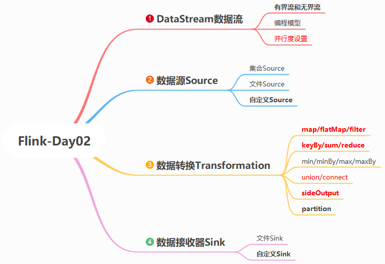


### [前言2]-今日课程内容提纲

------


> 主要讲解3个方面的内容：DataStream数据转换、DataStream Connectors连接器及批处理DataSet高级特性

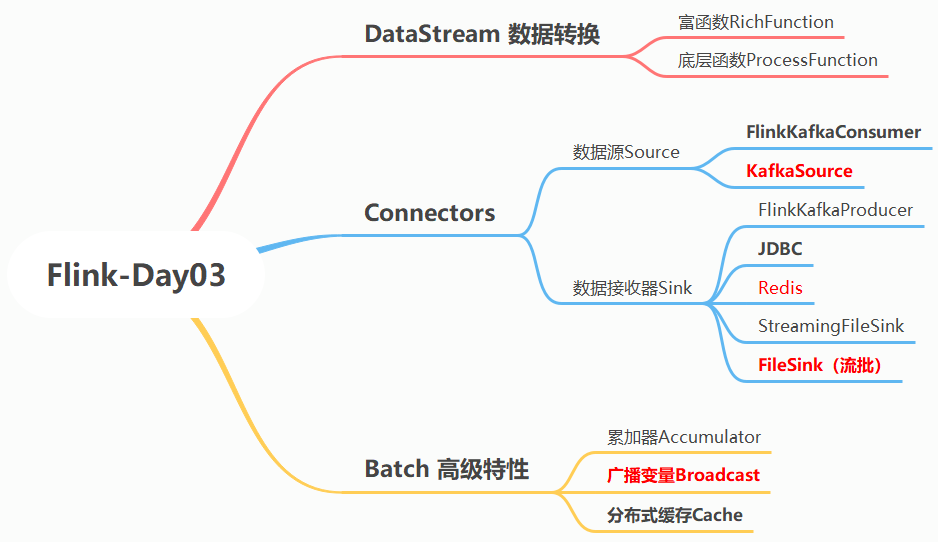


### [前言3]-ExecutionEnvironment 创建方式

---


> 在Flink 流计算程序中，程序入口：流式执行环境`StreamExecutionEnvironment`，有三种创建方式。

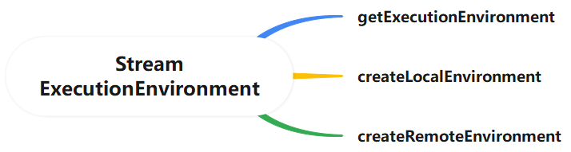


- 第1种：`getExecutionEnvironment`方法，**自动依据当前环境，获取执行环境**

---

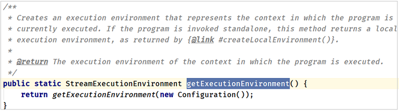


- 第2种：`createLocalEnvironment` 方法，获取本地执行环境，启动1个JVM，运行多个线程

---

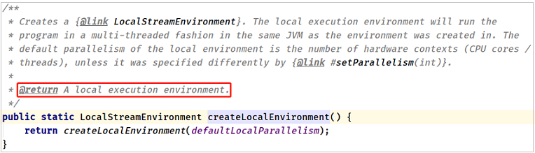


> ​		无论是`getExecutionEnvironment`还是`createLocalEnvironment`方法在本地模式运行时，创建执行环境，**随机生成Web UI界面端口号**，可以使用方法：`createLocalEnvironmentWithWebUI`，指定某个端口号，默认为`8081`。

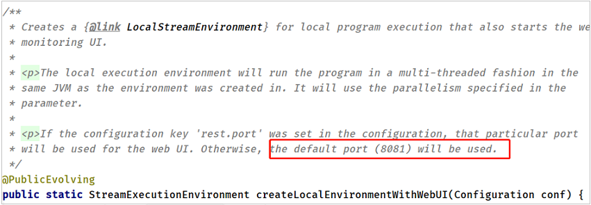

```java
StreamExecutionEnvironment env = StreamExecutionEnvironment.createLocalEnvironmentWithWebUI(new Configuration());
env.setParallelism(2);
```

运行Flink 流计算程序，打开监控页面：

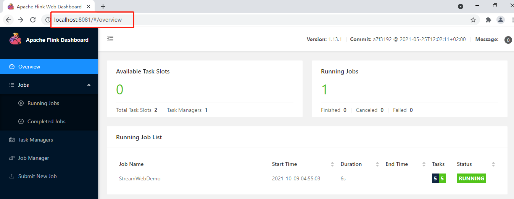


- 第三种：`createRemoteEnvironment` 方法，指定**JobManager**地址，获取远程执行环境，提交应用到集群

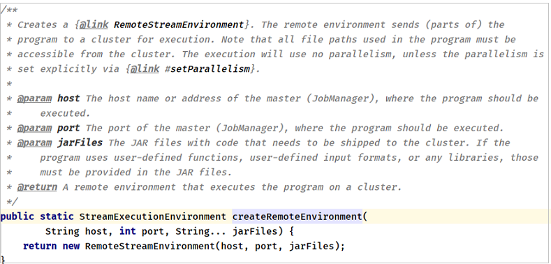

```JAva
StreamExecutionEnvironment remoteEnv = StreamExecutionEnvironment.createRemoteEnvironment(
    "host", // JobManager 主机名
    1234, // JobManager 进程端口号
    "/path/to/jarFile.jar" // 提交给 JobManager 的 JAR 包
);
```


> 案例代码演示，针对词频统计WordCount修改，不同方式创建流式执行环境：

```Java
package cn.itcast.flink.env;

import org.apache.flink.api.common.functions.FlatMapFunction;
import org.apache.flink.api.java.tuple.Tuple2;
import org.apache.flink.configuration.Configuration;
import org.apache.flink.streaming.api.datastream.DataStreamSource;
import org.apache.flink.streaming.api.datastream.SingleOutputStreamOperator;
import org.apache.flink.streaming.api.environment.StreamExecutionEnvironment;
import org.apache.flink.util.Collector;

/**
 * @author xuyuan
 */
public class WordCountEnvDemo {

	public static void main(String[] args) throws Exception{
		// 1. 执行环境-env
		// TODO: 依据运行环境，自动确定创建本地环境还是集群环境
		// StreamExecutionEnvironment env = StreamExecutionEnvironment.getExecutionEnvironment();

		// TODO: 创建执行环境，传递配置信息参数，设置端口号：8081
		//Configuration configuration = new Configuration();
		//configuration.setString("rest.port", "8081");
		//StreamExecutionEnvironment env = StreamExecutionEnvironment.getExecutionEnvironment(configuration);

		// TODO: 创建本地执行环境，启动一个JVM进程，其中Task任务（SubTask子任务）
		// StreamExecutionEnvironment env = StreamExecutionEnvironment.createLocalEnvironment();

		// TODO: 创建本地执行环境，启动WEB UI界面，默认端口号：8081
		Configuration configuration = new Configuration();
		StreamExecutionEnvironment env = StreamExecutionEnvironment.createLocalEnvironmentWithWebUI(configuration);
		env.setParallelism(1);

		// 2. 数据源-source
		DataStreamSource<String> inputStream = env.socketTextStream("node1.itcast.cn", 9999);

		// 3. 数据转换-transformation
		SingleOutputStreamOperator<Tuple2<String, Integer>> resultStream = inputStream
			.filter(line -> line.trim().length() > 0)
			.flatMap(new FlatMapFunction<String, Tuple2<String, Integer>>() {
				@Override
				public void flatMap(String value, Collector<Tuple2<String, Integer>> out) throws Exception {
					String[] words = value.trim().split("\\s+");
					for (String word : words) {
						out.collect(Tuple2.of(word, 1));
					}
				}
			})
			.keyBy(tuple -> tuple.f0)
			.sum("f1");

		// 4. 数据接收器-sink
		resultStream.printToErr();

		// 5. 触发执行-execute
		env.execute("WordCountEnvDemo");
	}

}
```


## 第一部分：DataStream Operators【3个小节】


```

```


### 01-[理解]-Operators【Physical Partitioning】

------


> DataStream提供物理分区算子：[决定上游Operator中各个分区数据如何发送到下游Operator的各个分区中。]()

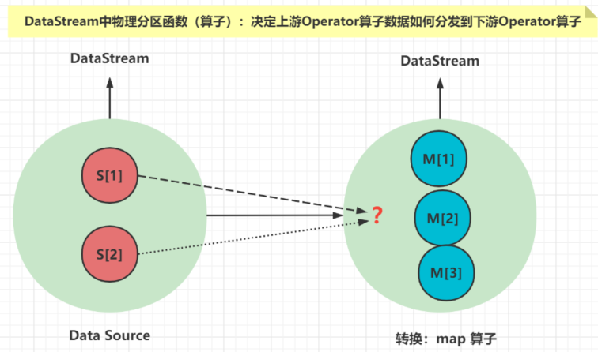


> ​		在DataStream函数中提供7种方式，常见的物理分区策略有**随机分配（Random）、轮询分配（Round-Robin）、重缩放（Rescale）和广播（Broadcast）**等。

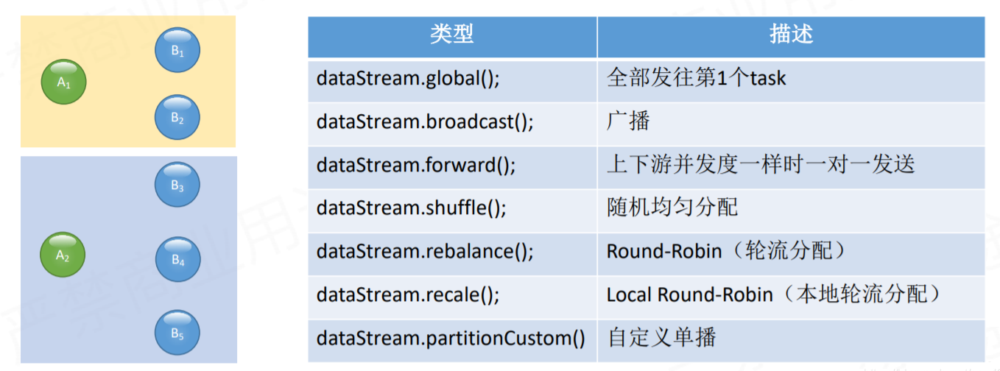


- 第一、物理分区算子【**global**】

---

> 功能：**将所有的数据都发送到下游的某个算子实例**(subtask id = 0)。

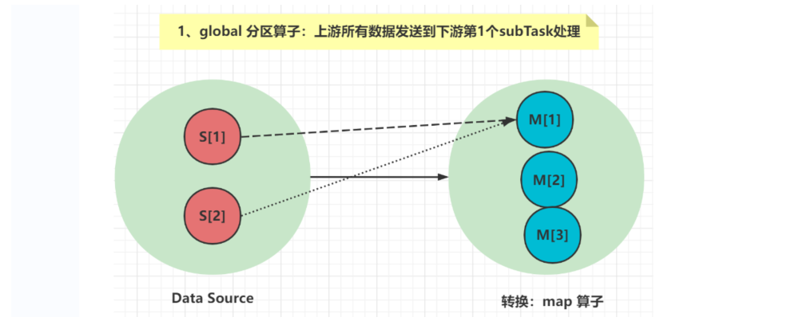


- 第二、物理分区算子【**broadcast**】

---

> 功能：发送到下游**所有**的算子实例。

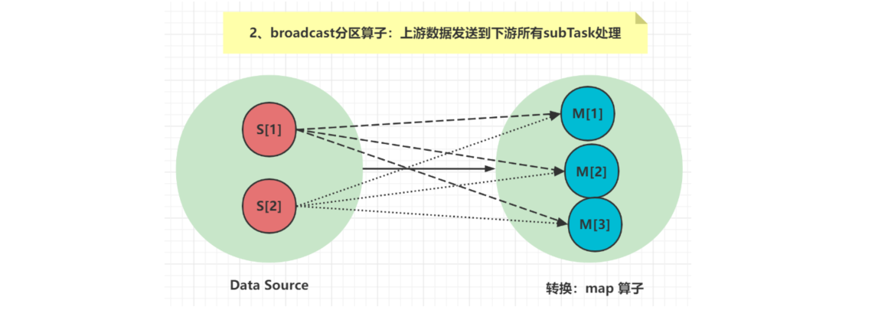


- 第三、物理分区算子【**forward**】

---

> 功能：发送到下游对应的第1个task，保证上下游算子并行度一致，即**上游算子与下游算子是1:1关系**。

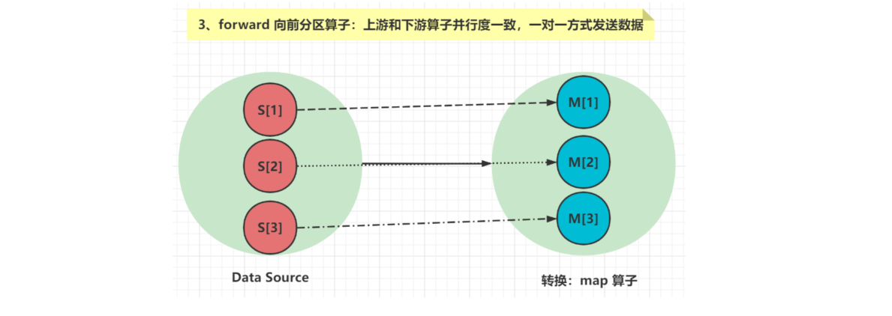

[在上下游的算子没有指定分区器的情况下，如果上下游的算子并行度一致，则使用ForwardPartitioner，否则使用RebalancePartitioner，对于ForwardPartitioner，必须保证上下游算子并行度一致，否则会抛出异常]()


- 第四、物理分区算子【**shuffle**】

---

> 功能：**随机选择**一个下游算子实例进行发送


- 第五、物理分区算子【**rebalance**】

---

> 功能：通过**循环**的方式依次发送到下游的task。

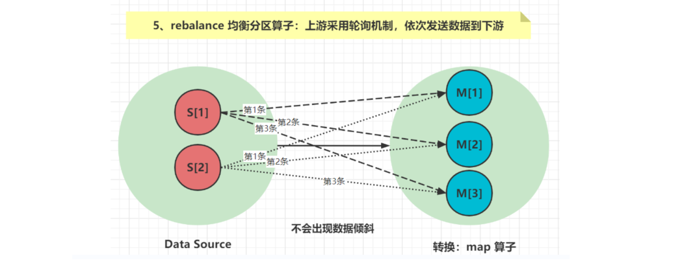


> [在Flink批处理中（离线数据分析中），如果数据倾斜，直接调用`rebalance`函数，将数据均衡分配。]()

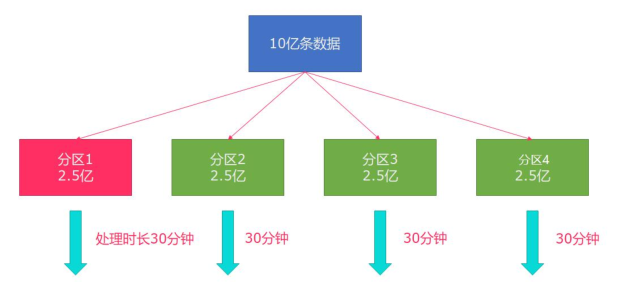


- 第六、物理分区算子【**rescale**】

---

> 功能：基于上下游Operator并行度，将记录以循环的方式输出到下游Operator每个实例。

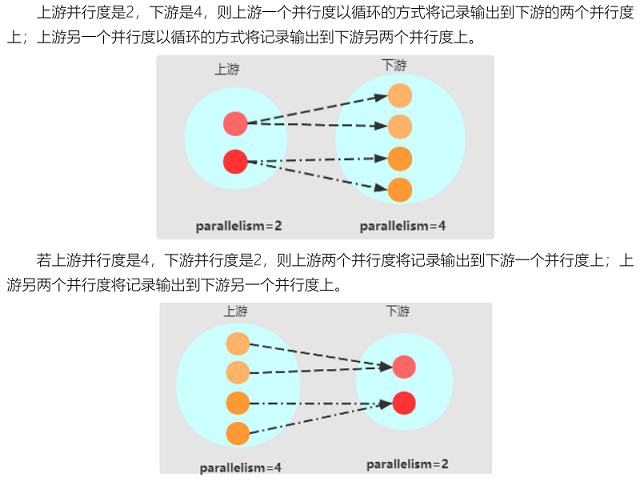


- 第七、物理分区算子【**custom**】

---

> 当Flink 供的所有分区策略都不能满足用户的需求时，使用`partitionCustom()`方法来自定义分区策略。

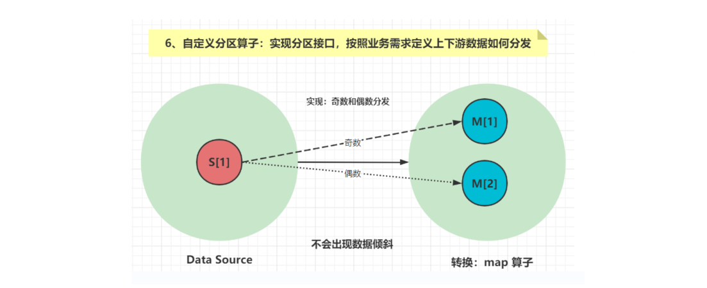


> 案例代码演示：DataStream中各种数据分区函数使用

```java
package cn.itcast.flink.transformation;

import org.apache.flink.api.common.functions.Partitioner;
import org.apache.flink.api.java.functions.KeySelector;
import org.apache.flink.api.java.tuple.Tuple2;
import org.apache.flink.streaming.api.datastream.DataStream;
import org.apache.flink.streaming.api.datastream.DataStreamSource;
import org.apache.flink.streaming.api.environment.StreamExecutionEnvironment;
import org.apache.flink.streaming.api.functions.source.RichParallelSourceFunction;

import java.util.Random;
import java.util.concurrent.TimeUnit;

/**
 * Flink 流计算物理分区算子： 对流数据进行分区
 *      todo: global、broadcast、forward、shuffle、rebalance、rescale、partitionCustom
 * @author xuyuan
 */
public class TransformationPartitionDemo {

	public static void main(String[] args) throws Exception {
		// 1. 执行环境-env
		StreamExecutionEnvironment env = StreamExecutionEnvironment.getExecutionEnvironment();
		env.setParallelism(1) ;

		// 2. 数据源-source
		DataStreamSource<Tuple2<Integer, String>> dataStream = env.addSource(
			new RichParallelSourceFunction<Tuple2<Integer, String>>() {
				private boolean isRunning = true ;

				@Override
				public void run(SourceContext<Tuple2<Integer, String>> ctx) throws Exception {
					int index = 1 ;
					Random random = new Random();
					String[] chars = new String[]{
						"A", "B", "C", "D", "E", "F", "G", "H", "I", "J", "K", "L", "M", "N", "O",
						"P", "Q", "R", "S", "T", "U", "V", "W", "X", "Y", "Z"
					};
					while (isRunning){
						Tuple2<Integer, String> tuple = Tuple2.of(index, chars[random.nextInt(chars.length)]);
						ctx.collect(tuple);

						TimeUnit.SECONDS.sleep(2);
						index ++ ;
					}
				}

				@Override
				public void cancel() {
					isRunning = false ;
				}
			}
		);
		//dataStream.printToErr();

		// 3. 数据转换-transformation
		// todo 1. global 全局，将所有数据发往下游第1个subTask
		DataStream<Tuple2<Integer, String>> globalDataStream = dataStream.global();
		// globalDataStream.print().setParallelism(3) ;

		// todo 2. broadcast 广播，发送给下游所有SubTask
		DataStream<Tuple2<Integer, String>> broadcastDataStream = dataStream.broadcast();
		// broadcastDataStream.printToErr().setParallelism(3) ;

		// todo 3. forward 向前，上下游并行度相同时，一对一发送
		// DataStream<Tuple2<Integer, String>> forwardDataStream = dataStream.setParallelism(3).forward();
		// forwardDataStream.print().setParallelism(3);

		// todo 4. shuffle 随机，发送到下游时，随机选择
		DataStream<Tuple2<Integer, String>> shuffleDataStream = dataStream.shuffle();
		// shuffleDataStream.printToErr().setParallelism(3) ;

		// todo 5. rebalance 均衡，采用轮询机制发送到下游各个subTask任务
		DataStream<Tuple2<Integer, String>> rebalanceDataStream = dataStream.rebalance();
		// rebalanceDataStream.print().setParallelism(3) ;

		// todo 6. rescale 局部均衡，本地轮询机制
		// DataStream<Tuple2<Integer, String>> rescaleDataStream = dataStream.setParallelism(4).rescale();
		// rescaleDataStream.printToErr().setParallelism(2);

		// todo 7. partitionCustom 自定义分区规则
		/*
			step1、从数据流中每条数据获取key，
			step2、依据key决定如何进行物理分区
		 */
		DataStream<Tuple2<Integer, String>> customStream = dataStream.partitionCustom(
			// step2、依据key决定如何进行物理分区
			new Partitioner<Integer>() {
				@Override
				public int partition(Integer key, int numPartitions) {
					return key % 2; // 0 , 1  -> 下游算子并行度：2
				}
			},
			// step1、从数据流中每条数据获取key
			new KeySelector<Tuple2<Integer, String>, Integer>() {
				@Override
				public Integer getKey(Tuple2<Integer, String> value) throws Exception {
					return value.f0;
				}
			}
		);
		customStream.printToErr().setParallelism(2) ;

		// 4. 数据终端-sink

		// 5. 触发执行-execute
		env.execute("TransformationPartitionDemo");
	}

}  
```


### 02-[理解]-Operators【RichFunction】

---


> ​		“==富函数==”是DataStream API提供的一个函数类的接口，==所有Flink函数类都有其Rich版本==。富函数类一般是以抽象类的形式出现的。例如：**RichMapFunction、RichFilterFunction、RichReduceFunction** 等。

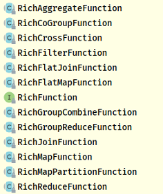


> ​		**富函数RichFunction**，可以**获取运行环境的上下文，并拥有一些生命周期方法**，当处理数据时，如果涉及到数据库连接、网络连接以及文件描述符的创建和关闭，使用富函数。`RichFunction`有一个生命周期的概念，典型的生命周期方法有：`open`和`close` 方法。

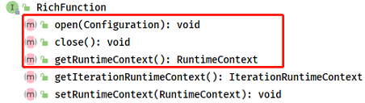

- `open()`方法：
  - rich function的初始化方法，当一个算子例如map或者filter被调用之前open()会被调用。
- `close()`方法：
  - 生命周期中的最后一个调用的方法，做一些清理工作。
- `getRuntimeContext()`方法：
  -  提供了函数的RuntimeContext的一些信息，例如函数执行的并行度，任务的名字，以及state状态。


> **案例代码演示**：修改自定义数据源从MySQL数据库加载数据代码，**加上打印语句**，查看结果。

```java
package cn.itcast.flink.transformation;

import lombok.AllArgsConstructor;
import lombok.Data;
import lombok.NoArgsConstructor;
import org.apache.flink.configuration.Configuration;
import org.apache.flink.streaming.api.datastream.DataStreamSource;
import org.apache.flink.streaming.api.environment.StreamExecutionEnvironment;
import org.apache.flink.streaming.api.functions.source.RichParallelSourceFunction;

import java.sql.Connection;
import java.sql.DriverManager;
import java.sql.PreparedStatement;
import java.sql.ResultSet;
import java.util.concurrent.TimeUnit;

/**
 * 富函数RichFunction，生命周期方法：open和close，当算子对数据库操作时，建议使用
 */
public class TransformationRichDemo {

	@Data
	@NoArgsConstructor
	@AllArgsConstructor
	public static class Student {
		private Integer id;
		private String name;
		private Integer age;
	}

	/**
	 * 自定义数据源，从MySQL表中加载数据，并且实现增量加载
	 */
	private static class MySQLSource extends RichParallelSourceFunction<Student> {
		// 定义变量，标识是否加载数据
		private boolean isRunning = true ;

		// 定义变量，open方法初始化，close方法关闭连接
		private Connection conn = null ;
		private PreparedStatement pstmt = null ;
		private ResultSet result = null ;

		// 初始化方法，在获取数据之前，准备工作
		@Override
		public void open(Configuration parameters) throws Exception {
			System.out.println("调用open()方法，初始化操作：创建数据库连接..........................");
			// step1、加载驱动
			Class.forName("com.mysql.jdbc.Driver") ;
			// step2、获取连接Connection
			conn = DriverManager.getConnection(
				"jdbc:mysql://node1.itcast.cn:3306/?useSSL=false",
				"root",
				"123456"
			);
			// step3、创建Statement对象，设置语句（INSERT、SELECT）
			pstmt = conn.prepareStatement("SELECT id, name, age FROM db_flink.t_student") ;
		}

		@Override
		public void run(SourceContext<Student> ctx) throws Exception {
			while (isRunning){
				System.out.println("调用run()方法，查询数据库中数据..........................");
				// step4、执行操作，获取ResultSet对象
				result = pstmt.executeQuery();
				// step5、遍历获取数据
				while (result.next()){
					// 获取每个字段的值
					int stuId = result.getInt("id");
					String stuName = result.getString("name");
					int stuAge = result.getInt("age");
					// 构建实体类对象
					Student student = new Student(stuId, stuName, stuAge);
					// 发送数据
					ctx.collect(student);
				}

				// 每隔5秒加载一次数据库，获取数据
				TimeUnit.SECONDS.sleep(5);
			}
		}

		@Override
		public void cancel() {
			isRunning = false ;
		}

		// 收尾工作，当不再加载数据时，一些善后工作
		@Override
		public void close() throws Exception {
			System.out.println("调用close()方法，收尾工作，关闭数据库连接.....................");
			// step6、关闭连接
			if(null != result) result.close();
			if(null != pstmt) pstmt.close();
			if(null != conn) conn.close();
		}
	}

	public static void main(String[] args) throws Exception {
		// 1. 执行环境-env
		StreamExecutionEnvironment env = StreamExecutionEnvironment.createLocalEnvironmentWithWebUI(new Configuration()) ;
		env.setParallelism(1);

		// 2. 数据源-source
		DataStreamSource<Student> studentDataStream = env.addSource(new MySQLSource());

		// 3. 数据转换-transformation
		// 4. 数据终端-sink
		studentDataStream.printToErr();

		// 5. 触发执行-execute
		env.execute("TransformationRichDemo") ;
	}
}
```

执行程序，结果如下截图：

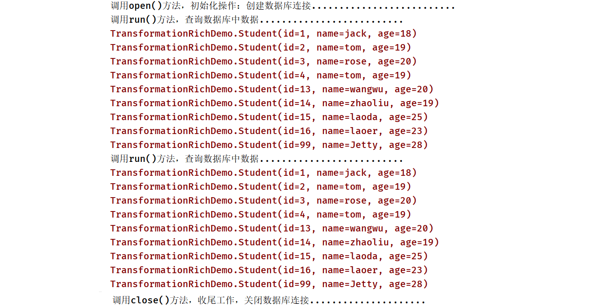


### 03-[掌握]-Operators【ProcessFunction】

---


> [Flink DataStream API中最底层API，提供`process`方法，其中需要实现`ProcessFunction`函数]()

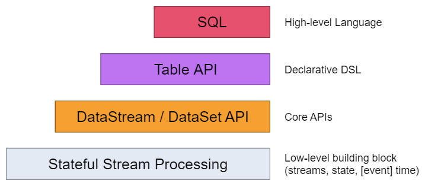


> 查看抽象类：`ProcessFunction`源码，最主要方法：`processElement`，对流中每条数据进行处理。

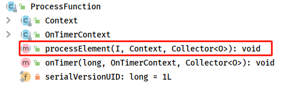


> 案例演示：使用`process`函数，代替`filter`函数，实现对数据过滤操作。

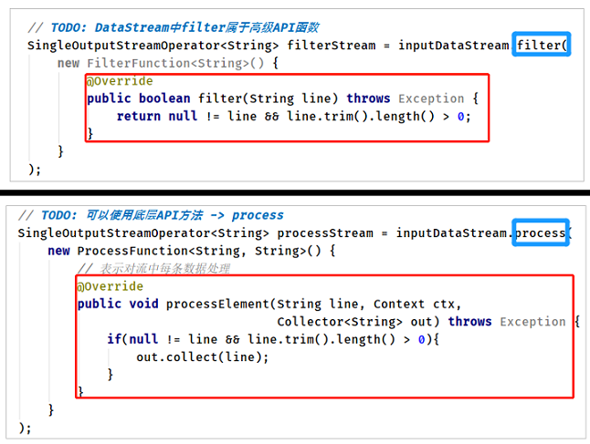

```java
package cn.itcast.flink.transformation;

import org.apache.flink.api.common.functions.FilterFunction;
import org.apache.flink.streaming.api.datastream.DataStreamSource;
import org.apache.flink.streaming.api.datastream.SingleOutputStreamOperator;
import org.apache.flink.streaming.api.environment.StreamExecutionEnvironment;
import org.apache.flink.streaming.api.functions.ProcessFunction;
import org.apache.flink.util.Collector;

/**
 * 使用Flink 计算引擎实现流式数据处理：从Socket接收数据，对数据进行过滤【filter】和【process】
 */
public class TransformationProcessDemo {

	public static void main(String[] args) throws Exception {
		// 1. 执行环境-env
		StreamExecutionEnvironment env = StreamExecutionEnvironment.getExecutionEnvironment();
		env.setParallelism(1) ;

		// 2. 数据源-source
		DataStreamSource<String> inputStream = env.socketTextStream("node1.itcast.cn", 9999);

		// 3. 数据转换-transformation
		// TODO: DataStream中filter属于高级API函数
		SingleOutputStreamOperator<String> filterStream = inputStream.filter(
			new FilterFunction<String>() {
				@Override
				public boolean filter(String line) throws Exception {
					return line.trim().length() > 0;
				}
			}
		);
		filterStream.printToErr("filter>");

		// TODO: 可以使用底层API方法 -> process
		SingleOutputStreamOperator<String> processStream = inputStream.process(
			new ProcessFunction<String, String>() {
				@Override
				public void processElement(String line, Context ctx, Collector<String> out) throws Exception {
					if(line.trim().length() > 0){
						out.collect(line);
					}
				}
			}
		);
		processStream.printToErr("process>");

		// 4. 数据接收器-sink
        
		// 5. 执行应用-execute
		env.execute("StreamProcessDemo");
	}

}
```


## 第二部分：DataStream Connector【10个小节】


> ​		在Flink框架中，专门为一些存储系统提供**Connector连接器**，方便用户进行**读取**数据（Data Source 数据源）和**保存**数据(Data Sink数据接收器）。

https://nightlies.apache.org/flink/flink-docs-release-1.13/docs/connectors/datastream/overview/

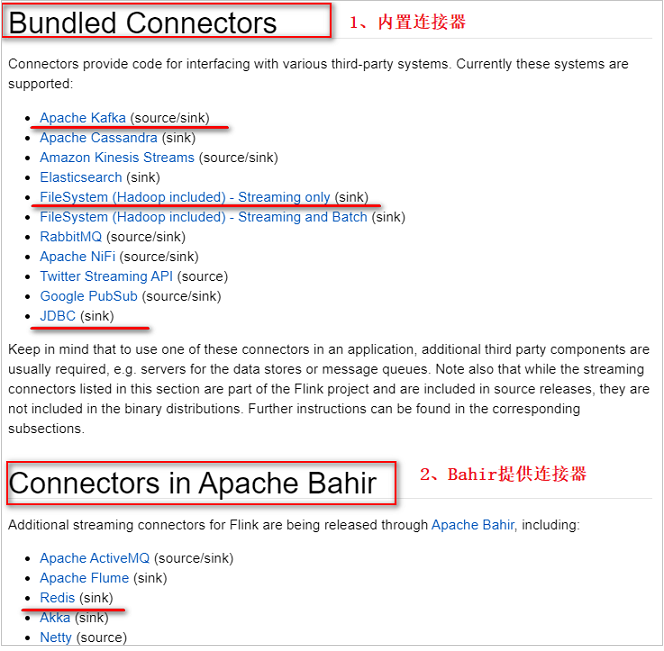


### 04-[掌握]-Connector之Kafka Connector

---


> Kafka Connector连接器，既可以作为==数据源Source==加载数据，又可以作为==数据接收器Sink==保存数据。


> 使用Kafka Connector连接器，添加Maven 依赖：

```xml
<dependency>
    <groupId>org.apache.flink</groupId>
    <artifactId>flink-connector-kafka_2.11</artifactId>
    <version>1.13.1</version>
</dependency>
```


> ​		在Kafka Connector连接器中提供Source数据源和Sink接收器类，在**Flink 1.12**版本中提供基于新的接口消费Kafka数据：`KafkaSource`。

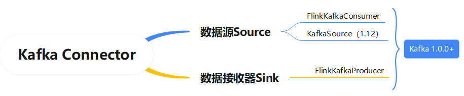


> 在**Flink 1.14**版本中提供基于新的接口生产数据到Kafka接收器：`KafkaSink`。

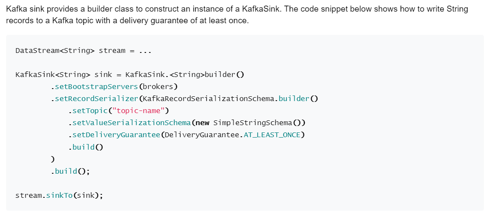


### 05-[掌握]-Connector之Kafka 数据源【FlinkKafkaConsumer】

---


> 当从Kafka消费数据时，工具类：`FlinkKafkaConsumer` ，相关说明如下：

https://nightlies.apache.org/flink/flink-docs-release-1.13/docs/connectors/datastream/kafka/#kafka-sourcefunction

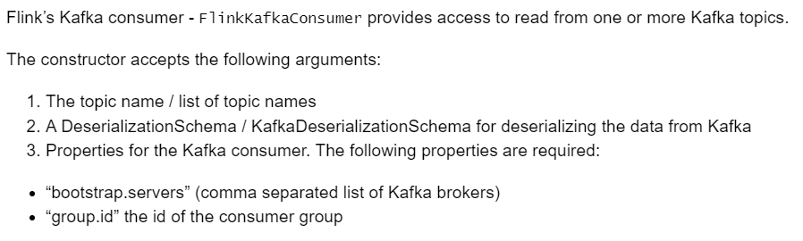


1. 订阅的主题：`topic`，一个Topic名称或一个列表（多个Topic）
2. 反序列化规则：`deserialization`
3. 消费者属性-集群地址：`bootstrap.servers`
4. 消费者属性-消费者组id(如果不设置，会有默认的，但是默认的不方便管理)：`group.id`


> 当从Kafka消费数据时，需要指定反序列化实现类：**将Kafka读取二进制数据，转换为String对象**。

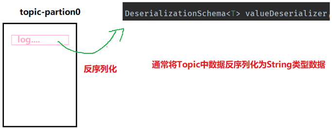


> Kafka Consumer消费数据，反序列化数据说明：

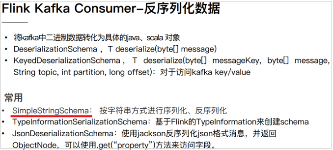


> 启动Zookeeper和Kafka集群，命令如下：

```bash
[root@node1 ~]# start-zk.sh
[root@node1 ~]# start-kafka.sh

[root@node1 ~]# /export/server/kafka/bin/kafka-topics.sh --list --bootstrap-server node1.itcast.cn:9092

[root@node1 ~]# /export/server/kafka/bin/kafka-topics.sh --create --topic flink-topic --bootstrap-server node1.itcast.cn:9092,node2.itcast.cn:9092,node3.itcast.cn:9092 --replication-factor 1 --partitions 3

[root@node1 ~]# /export/server/kafka/bin/kafka-console-producer.sh --topic flink-topic --broker-list node1.itcast.cn:9092,node2.itcast.cn:9092,node3.itcast.cn:9092
```


> 编程实现从Kafka消费数据，演示代码如下：

```Java
package cn.itcast.flink.connector;

import org.apache.flink.api.common.serialization.SimpleStringSchema;
import org.apache.flink.streaming.api.datastream.DataStream;
import org.apache.flink.streaming.api.environment.StreamExecutionEnvironment;
import org.apache.flink.streaming.connectors.kafka.FlinkKafkaConsumer;

import java.util.Properties;

/**
 * Flink从Kafka消费数据，指定topic名称和反序列化类
 */
public class ConnectorFlinkKafkaConsumerDemo {

	public static void main(String[] args) throws Exception{
		// 1. 执行环境-env
		StreamExecutionEnvironment env = StreamExecutionEnvironment.getExecutionEnvironment();
		env.setParallelism(3);

		// 2. 数据源-source
		// 2-1. 创建消费Kafka数据时属性
		Properties props = new Properties();
		props.setProperty("bootstrap.servers", "node1.itcast.cn:9092,node2.itcast.cn:9092,node3.itcast.cn:9092");
		props.setProperty("group.id", "test");
		// 2-2. 构建FlinkKafkaConsumer实例对象
		FlinkKafkaConsumer<String> kafkaConsumer = new FlinkKafkaConsumer<String>(
			"flink-topic", //
			new SimpleStringSchema(), //
			props
		);
		// 2-3. 添加Source
		DataStream<String> kafkaStream = env.addSource(kafkaConsumer);

		// 3. 数据转换-transformation
		// 4. 数据接收器-sink
		kafkaStream.printToErr();

		// 5. 触发执行-execute
		env.execute("ConnectorFlinkKafkaConsumerDemo") ;
	}

}
```

> 其中最核心的部分就是：创建`FlinkKafkaConsumer`对象，传递参数值

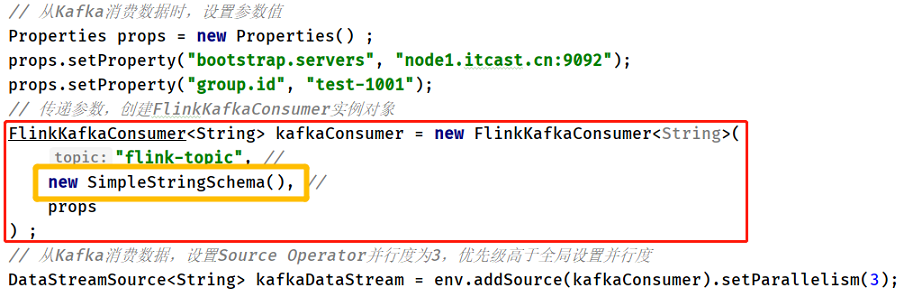


### 06-[掌握]-Connector之Kafka 数据源【Start Offset】

---


> ​			从Kafka 消费数据时，可以设置从Kafka Topic中**哪个偏移量位置**开始消费数据，默认情况下，第一次运行，从Kafka Topic==最大偏移量==开始消费数据。
>

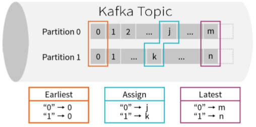


> - 第一、`earliest`：从最起始位置开始消费，当然不一定是从0开始，因为如果数据过期就清掉
>   了，所以可以理解为从现存的数据里最小位置开始消费；
> - 第二、`latest`：从最末位置开始消费；
> - 第三、`per-partition assignment`：对每个分区都指定一个offset，再从offset位置开始消费
>
> [在Kafka Consumer 参数中，有一个参数，可以进行设置，表示从哪里开始消费读取数据。]()

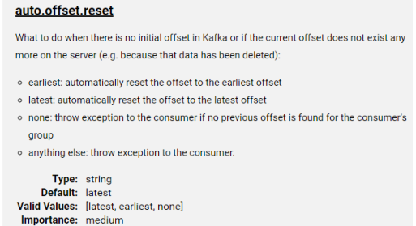


> ​		Flink 提供**KafkaConnector**连接器中提供`5种方式`，指定从哪里开始消费数据。默认情况下，==从Kafka消费数据时，采用的是：`latest`，最新偏移量开始消费数据==。

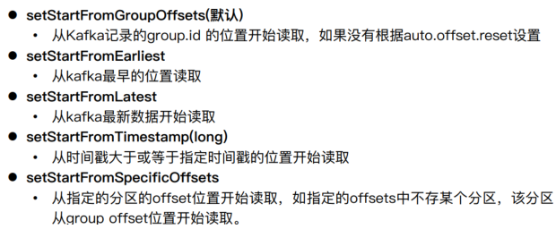

> 1. `setStartFromGroupOffsets`：
>    - 从groupId上次消费数据记录开始消费，将上次消费偏移量存储在topic【`__consumer_offsets`】；
>    - 如果消费组时第一次消费数据，从最大偏移量开始消费。
> 2. `setStartFromEarliest`：从最小偏移量消费数据
> 3. `setStartFromLatest`：从最大偏移量消费数据
> 4. `setStartFromTimestamp`：消费每条数据时间戳大于指定时间戳
> 5. `setStartFromSpecificOffsets`：从指定偏移量开始消费数据，偏移量值大于设置偏移量
>


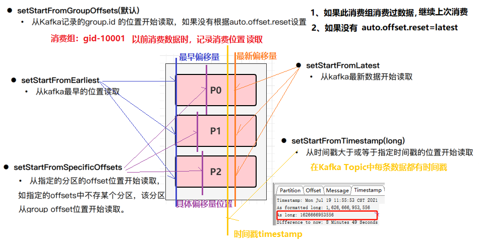


> 在代码中设置消费数据起始位置相关API如下所示：

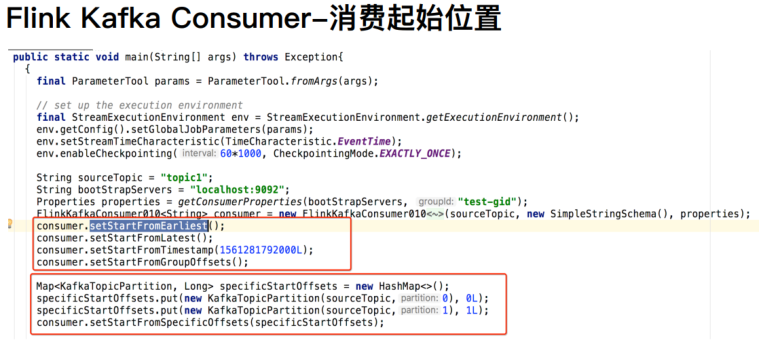


> 案例演示代码如下所示：

```Java
package cn.itcast.flink.connector;

import org.apache.flink.api.common.serialization.SimpleStringSchema;
import org.apache.flink.streaming.api.datastream.DataStreamSource;
import org.apache.flink.streaming.api.environment.StreamExecutionEnvironment;
import org.apache.flink.streaming.connectors.kafka.FlinkKafkaConsumer;
import org.apache.flink.streaming.connectors.kafka.internals.KafkaTopicPartition;

import java.util.HashMap;
import java.util.Map;
import java.util.Properties;

/**
 * Flink从Kafka消费数据，指定topic名称和反序列化类，可以指定消费数据开始偏移量
 */
public class ConnectorFlinkKafkaConsumerOffsetDemo {

	public static void main(String[] args) throws Exception {
		// 1. 执行环境-env
		StreamExecutionEnvironment env = StreamExecutionEnvironment.getExecutionEnvironment() ;
		env.setParallelism(1) ;

		// 2. 数据源-source
		// 从Kafka消费数据时，设置参数值
		Properties props = new Properties() ;
		props.setProperty("bootstrap.servers", "node1.itcast.cn:9092");
		props.setProperty("group.id", "test1");
		// 传递参数，创建FlinkKafkaConsumer实例对象
		FlinkKafkaConsumer<String> kafkaConsumer = new FlinkKafkaConsumer<String>(
			"flink-topic",
			new SimpleStringSchema(),
			props
		) ;
		// TODO: 1、Flink从topic中最初的数据开始消费
		//kafkaConsumer.setStartFromEarliest() ;

		// TODO: 2、Flink从topic中最新的数据开始消费
		//kafkaConsumer.setStartFromLatest();

		// TODO: 3、Flink从topic中指定的group上次消费的位置开始消费，所以必须配置group.id参数
		//kafkaConsumer.setStartFromGroupOffsets() ;

		// TODO: 4、Flink从topic中指定的offset开始，这个比较复杂，需要手动指定offset
		Map<KafkaTopicPartition, Long> offsets = new HashMap<>();
		offsets.put(new KafkaTopicPartition("flink-topic", 0), 100L);
		offsets.put(new KafkaTopicPartition("flink-topic", 1), 90L);
		offsets.put(new KafkaTopicPartition("flink-topic", 2), 110L);
		//kafkaConsumer.setStartFromSpecificOffsets(offsets);

		// TODO: 5、指定时间戳消费数据
		kafkaConsumer.setStartFromTimestamp(1644935966961L) ;

		// 从Kafka消费数据
		DataStreamSource<String> kafkaDataStream = env.addSource(kafkaConsumer);

		// 3. 数据转换-transformation
		// 4. 数据终端-sink
		kafkaDataStream.printToErr();

		// 5. 触发执行-execute
		env.execute("ConnectorFlinkKafkaConsumerOffsetDemo") ;
	}

}
```

> [上面所设置消费偏移量位置，表示不考虑流式程序从Checkpoint检查点或保存点SavePoint恢复。]()


### 07-[理解]-Connector之Kafka 数据源【新增Topic和分区发现】

---


> ​		有一个 Flink Job需要将五份数据聚合到一起，五份数据对应**5个 kafka topic**，随着业务增长，**新增一类数据，同时新增1个 Kafka topic**，如何在==不重启作业==的情况下作业自动感知新的 topic。
>
> ​																			[新增TOPIC数据，如何Flink Job感知？]()

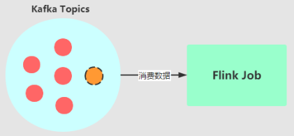

https://nightlies.apache.org/flink/flink-docs-release-1.13/docs/connectors/datastream/kafka/#topic-partition-subscription

> Flink Kafka Source数据源，提供对应机制：`topic 发现`。

- 对于新增Topic来说，可以设置消费Topic名称时，采用`正则表达式`即可；
- topic名称设置：`java.util.regex.Pattern.compile("test-topic-[0-9]")`

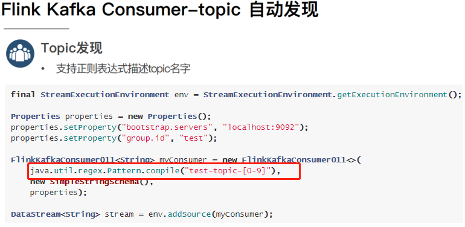


> ​			Flink Job从一个固定的Kafka topic 读数据，开始该 topic 有**7 个 partition**，但随着业务的增长数据量变大，需要对**Kafka partition 个数进行扩容**，由 ==7 个扩容到 14==。该情况下如何在==不重启作业==情况下动态感知新扩容的 partition？
>
> ​														==对Topic增加分区，如何Flink job感知==

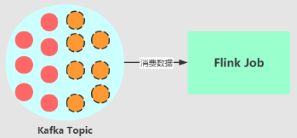


> ​		构建 ==FlinkKafkaConsumer== 时的 `Properties` 中设置`flink.partition-discovery.interval-millis` 参数为非负值，==表示开启动态发现的开关，及设置的时间间隔==，启动一个单独的线程定期去Kafka获取最新的meta信息。
>

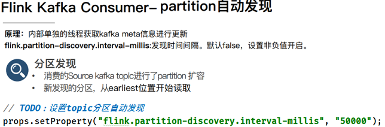


### 08-[扩展]-Connector之Kafka 数据源【KafkaSource】

---


> **Flink 1.12** 版本中，提供基于新API接口`Data Source`实现Kafka 数据源：`KafkaSource`，消费数据更加简单

https://nightlies.apache.org/flink/flink-docs-release-1.13/docs/connectors/datastream/kafka/#kafka-source

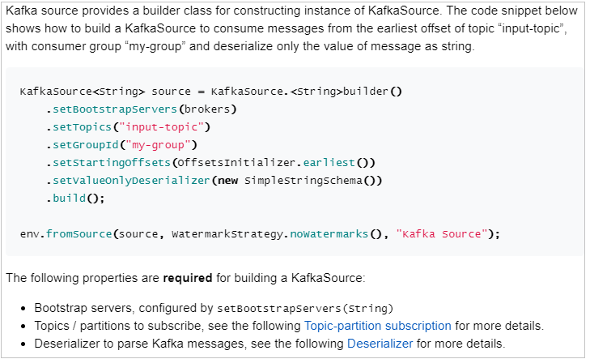


> 案例演示：从Kafka消费数据，进行实时流式处理。

```Java
package cn.itcast.flink.connector;

import org.apache.flink.api.common.eventtime.WatermarkStrategy;
import org.apache.flink.api.common.serialization.SimpleStringSchema;
import org.apache.flink.connector.kafka.source.KafkaSource;
import org.apache.flink.connector.kafka.source.enumerator.initializer.OffsetsInitializer;
import org.apache.flink.streaming.api.datastream.DataStream;
import org.apache.flink.streaming.api.environment.StreamExecutionEnvironment;

/**
 * Flink从Kafka消费数据，指定topic名称和反序列化类
 */
public class ConnectorKafkaSourceDemo {

	public static void main(String[] args) throws Exception{
		// 1. 执行环境-env
		StreamExecutionEnvironment env = StreamExecutionEnvironment.getExecutionEnvironment();
		env.setParallelism(3);

		// 2. 数据源-source
		// 2-1. 创建KafkaSource对象，设置属性
		KafkaSource<String> kafkaSource = KafkaSource.<String>builder()
			.setBootstrapServers("node1.itcast.cn:9092,node2.itcast.cn:9092,node3.itcast.cn:9092")
			.setTopics("flink-topic")
			.setGroupId("my-group")
			.setStartingOffsets(OffsetsInitializer.earliest())
			.setValueOnlyDeserializer(new SimpleStringSchema())
			.build();
		// 2-2. 添加数据源
		DataStream<String> kafkaStream = env.fromSource(kafkaSource, WatermarkStrategy.noWatermarks(), "KafkaSource");

		// 3. 数据转换-transformation
		// 4. 数据接收器-sink
		kafkaStream.printToErr();

		// 5. 触发执行-execute
		env.execute("StreamKafkaSourceDemo") ;
	}

}
```


### 09-[掌握]-Connector之FlinkKafkaProducer

---


> ​		Flink提供Connector连接器中支持Kafka的`Source数据源`和`数据终端Sink`。==Flink Kafka Sink核心类：`FlinkKafkaProducer`==。

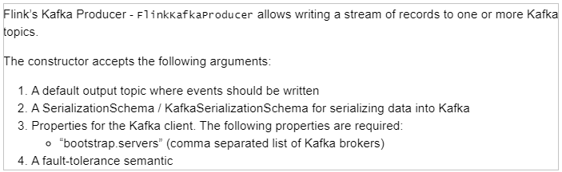


> 1. topic 名称
> 2. 序列化：将Java对象转byte[]
> 3. Kafka Server地址信息
> 4. 容错语义
>


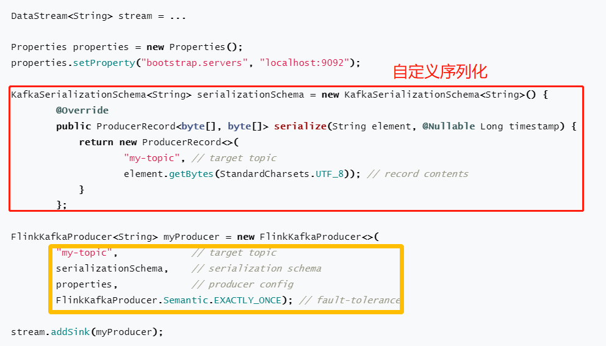


> **准备工作**：启动集群、创建Topic，命令如下

```bash
[root@node1 ~]# start-zk.sh
[root@node1 ~]# start-kafka.sh

[root@node1 ~]# /export/server/kafka/bin/kafka-topics.sh --list --bootstrap-server node1.itcast.cn:9092

[root@node1 ~]# /export/server/kafka/bin/kafka-topics.sh --create --topic flink-topic --bootstrap-server node1.itcast.cn:9092 --replication-factor 1 --partitions 3

[root@node1 ~]# /export/server/kafka/bin/kafka-console-consumer.sh --topic flink-topic --bootstrap-server node1.itcast.cn:9092
```


> 案例演示：==自定义Source数据源，产生交易订单数据，将其转换为JSON字符串，实时保存到Kafka topic==

```Java
package cn.itcast.flink.connector;

import com.alibaba.fastjson.JSON;
import lombok.AllArgsConstructor;
import lombok.Data;
import lombok.NoArgsConstructor;
import org.apache.flink.api.common.functions.MapFunction;
import org.apache.flink.streaming.api.datastream.DataStreamSource;
import org.apache.flink.streaming.api.datastream.SingleOutputStreamOperator;
import org.apache.flink.streaming.api.environment.StreamExecutionEnvironment;
import org.apache.flink.streaming.api.functions.source.RichParallelSourceFunction;
import org.apache.flink.streaming.connectors.kafka.FlinkKafkaProducer;
import org.apache.flink.streaming.connectors.kafka.KafkaSerializationSchema;
import org.apache.kafka.clients.producer.ProducerConfig;
import org.apache.kafka.clients.producer.ProducerRecord;

import javax.annotation.Nullable;
import java.util.Properties;
import java.util.Random;
import java.util.UUID;
import java.util.concurrent.TimeUnit;

/**
 * 将DataStream数据流中数据保存至Kafka Topic队列，使用FlinkKafkaProducer类完成
 * @author xuyuan
 */
public class ConnectorFlinkKafkaProducerDemo {

	@Data
	@NoArgsConstructor
	@AllArgsConstructor
	static class Order {
		private String id;
		private Integer userId;
		private Double money;
		private Long orderTime;
	}

	/**
	 * 自定义数据源：每隔1秒产生1条交易订单数据
	 */
	private static class OrderSource extends RichParallelSourceFunction<Order> {
		// 定义标识变量，表示是否产生数据
		private boolean isRunning = true;

		// 模拟产生交易订单数据
		@Override
		public void run(SourceContext<Order> ctx) throws Exception {
			Random random = new Random() ;
			while (isRunning){
				// 构建交易订单数据
				// 构建交易订单数据
				Order order = new Order(
					UUID.randomUUID().toString(), //
					random.nextInt(10) + 1 , //
					(double)random.nextInt(100) ,//
					System.currentTimeMillis()
				);

				// 将数据输出
				ctx.collect(order);

				// 每隔1秒产生1条数据，线程休眠
				TimeUnit.SECONDS.sleep(1);
			}
		}

		@Override
		public void cancel() {
			isRunning = false ;
		}
	}


	/**
	 * 创建子类，实现接口，对数据进行序列化操作
	 */
	private static class KafkaStringSchema implements KafkaSerializationSchema<String>{
		@Override
		public ProducerRecord<byte[], byte[]> serialize(String jsonStr, @Nullable Long timestamp) {
			return new ProducerRecord<>("flink-topic", jsonStr.getBytes());
		}
	}

	public static void main(String[] args) throws Exception {
		// 1. 执行环境-env
		StreamExecutionEnvironment env = StreamExecutionEnvironment.getExecutionEnvironment();
		env.setParallelism(3) ;

		// 2. 数据源-source
		DataStreamSource<Order> orderDataStream = env.addSource(new OrderSource());
		//orderDataStream.printToErr();

		// 3. 数据转换-transformation

		// 将订单数据Order对象，转换为JSON字符串，存储到Kafka Topic队列
		SingleOutputStreamOperator<String> jsonDataStream = orderDataStream.map(new MapFunction<Order, String>() {
			@Override
			public String map(Order order) throws Exception {
				// 阿里巴巴库：fastJson，转换对象为json字符串
				return JSON.toJSONString(order);
			}
		});
		//jsonDataStream.printToErr();

		// 4. 数据终端-sink
		// 4-1. 写入数据时序列化
		KafkaSerializationSchema<String> serializationSchema = new KafkaStringSchema() ;
		// 4-2. 生成者属性设置
		Properties props = new Properties() ;
		props.setProperty(ProducerConfig.BOOTSTRAP_SERVERS_CONFIG, "node1.itcast.cn:9092,node2.itcast.cn:9092,node3.itcast.cn:9092");
		// 4-3. 构建实例对象
		FlinkKafkaProducer<String> kafkaProducer = new FlinkKafkaProducer<String>(
			"flink-topic",
				serializationSchema,
				props,
				FlinkKafkaProducer.Semantic.EXACTLY_ONCE
		);
		// 4-4. 添加接收器
		jsonDataStream.addSink(kafkaProducer) ;

		// 5. 触发执行-execute
		env.execute("ConnectorFlinkKafkaProducerDemo");
	}

}  
```

```
基于flink构建实时数仓项目，按照数仓分层管理数据
    ODS层 ->  DWD 层 -> DWS层 ->  ADS 层
        |       |       |
            Kafka Topic
```


### 10-[掌握]-Connector之JdbcSink

---


> 从**Flink 1.11**版本开始，增加`JDBC Connector`连接器，可以将DataStream数据直接保存RDBMS表中。
>

https://nightlies.apache.org/flink/flink-docs-release-1.13/docs/connectors/datastream/jdbc/


> - 1）、添加Maven依赖

```xml
<dependency>
    <groupId>org.apache.flink</groupId>
    <artifactId>flink-connector-jdbc_2.11</artifactId>
    <version>1.13.1</version>
</dependency>
```


> - 2）、API使用说明：`JdbcSink.sink`

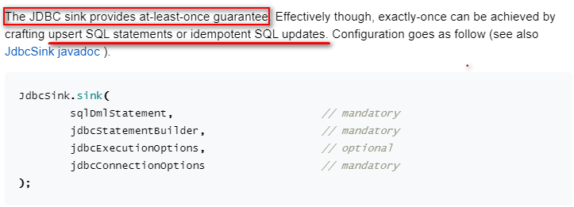


> - 3）、官方提供案例代码

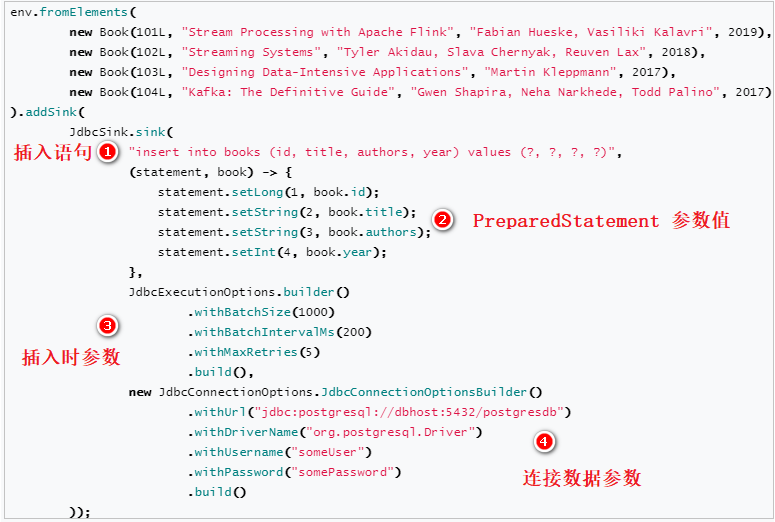


> 需求：==将Flink集合中的数据集DataStream，通过JDBCSink保存到MySQL。==

```JAva
package cn.itcast.flink.connector;

import lombok.AllArgsConstructor;
import lombok.Data;
import lombok.NoArgsConstructor;
import org.apache.flink.connector.jdbc.JdbcConnectionOptions;
import org.apache.flink.connector.jdbc.JdbcExecutionOptions;
import org.apache.flink.connector.jdbc.JdbcSink;
import org.apache.flink.connector.jdbc.JdbcStatementBuilder;
import org.apache.flink.streaming.api.datastream.DataStreamSource;
import org.apache.flink.streaming.api.environment.StreamExecutionEnvironment;
import org.apache.flink.streaming.api.functions.sink.SinkFunction;

import java.sql.PreparedStatement;
import java.sql.SQLException;

/**
 * 案例演示：使用JDBC Sink 连接器，将数据保存至MySQL表中，继承RichSinkFunction
 */
public class ConnectorJdbcSinkDemo {

	@Data
	@NoArgsConstructor
	@AllArgsConstructor
	private static class Student{
		private Integer id ;
		private String name ;
		private Integer age ;
	}

	public static void main(String[] args) throws Exception {
		// 1. 执行环境-env
		StreamExecutionEnvironment env = StreamExecutionEnvironment.getExecutionEnvironment();
		env.setParallelism(1) ;

		// 2. 数据源-source
		DataStreamSource<Student> inputDataStream = env.fromElements(
			new Student(23, "zhaoqi", 40),
			new Student(34, "zhaoliu", 19),
			new Student(35, "wangwu", 20),
			new Student(36, "zhaoliu", 19)
		);

		// 3. 数据转换-transformation
		// 4. 数据终端-sink
		// 4-1. 创建JdbcSink实例对象，传递参数信息
		SinkFunction<Student> jdbcSink = JdbcSink.sink(
			// a. 插入语句
			"REPLACE INTO db_flink.t_student (id, name, age) VALUES (?, ?, ?)", //
			// b. 构建Statement实例对象
			new JdbcStatementBuilder<Student>() {
				@Override
				public void accept(PreparedStatement pstmt, Student student) throws SQLException {
					pstmt.setInt(1, student.id);
					pstmt.setString(2, student.name);
					pstmt.setInt(3, student.age);
				}
			},
			// c. 设置执行插入参数
			JdbcExecutionOptions.builder()
				.withBatchSize(1000)
				.withBatchIntervalMs(200)
				.withMaxRetries(5)
				.build(),
			// d. 设置连接MySQL数据库信息
			new JdbcConnectionOptions.JdbcConnectionOptionsBuilder()
				.withDriverName("com.mysql.jdbc.Driver")
				.withUrl("jdbc:mysql://node1.itcast.cn:3306/?useUnicode=true&characterEncoding=utf-8&useSSL=false")
				.withUsername("root")
				.withPassword("123456")
				.build()
		);
		// 4-2. 为数据流DataStream添加Sink
		inputDataStream.addSink(jdbcSink) ;

		// 5. 触发执行-execute
		env.execute("StreamJdbcSinkDemo") ;
	}
}
```


### 11-[掌握]-Connector之Streaming File Sink

---


> ​		大数据业务场景中，经常有一种场景：[外部数据发送到kafka中，Flink作为中间件消费Kafka数据并进行业务处理，处理完成之后的数据可能还需要写入到数据库或者文件系统中，如写入HDFS中]()。
>

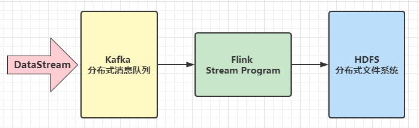


​		`StreamingFileSink`是**Flink1.7**中推出的新特性，可以用来**将分区文件写入到支持 Flink FileSystem 接口的文件系统**中，==支持Exactly-Once语义==。

https://nightlies.apache.org/flink/flink-docs-release-1.13/docs/connectors/datastream/streamfile_sink/


> ​		Streaming File Sink 会将数据写入到桶Bucket（认可Hive中分区目录）中，可以设置**存储目录名称、文件大小和文件名称**。

- 由于输入流可能是无界的，因此每个桶中的数据被划分为多个有限大小的文件。
- 如何分桶是可以配置的，默认使用基于时间的分桶策略，这种策略每个小时创建一个新的桶，桶中包含的文件将记录所有该小时内从流中接收到的数据。

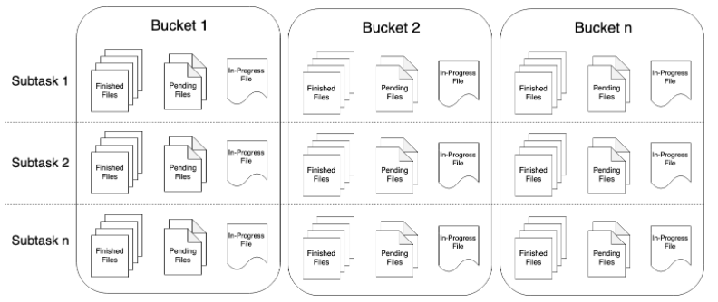

​		桶目录中的实际输出数据会被划分为多个部分文件（part file），每一个接收桶数据的 Sink Subtask ，至少包含一个部分文件（part file）。

- 额外的部分文件（part file）将根据滚动策略创建，滚动策略是可以配置的。
- 默认的策略是根据文件大小和超时时间来滚动文件。
- 超时时间指打开文件的最长持续时间，以及文件关闭前的最长非活动时间。


​			[使用 StreamingFileSink 时需要启用 Checkpoint ，每次做 Checkpoint 时写入完成。如果 Checkpoint 被禁用，部分文件（part file）将永远处于 'in-progress' 或 'pending' 状态，下游系统无法安全地读取。]()

> 案例演示：==编写Flink程序，自定义数据源产生交易订单数据，接收后的数据流式方式存储到本地文件系统==

```ini
# 1. 执行环境-env
	1-1.设置并行度为：3
	1-2.设置Checkpoint检查点，如果不设置，数据不会写入文件
	
# 2. 数据源-source
	自定义数据源，产生交易订单数据
	数据格式：e7057860-e88,u-14395,94.24,1630142114565
	
# 4. 数据接收器-sink
	4-1. 设置数据存储文件格式
	4-2. 设置输出文件大小滚动策略，什么时候产生新文件
	4-3. 设置文件的名称
	4-4. 添加Sink，设置并行度为：1
	
# 5.触发执行-execute
```

> 具体代码如下所示：

```Java
package cn.itcast.flink.connector;

import org.apache.commons.lang3.time.FastDateFormat;
import org.apache.flink.api.common.serialization.SimpleStringEncoder;
import org.apache.flink.core.fs.Path;
import org.apache.flink.streaming.api.datastream.DataStreamSource;
import org.apache.flink.streaming.api.environment.StreamExecutionEnvironment;
import org.apache.flink.streaming.api.functions.sink.filesystem.OutputFileConfig;
import org.apache.flink.streaming.api.functions.sink.filesystem.StreamingFileSink;
import org.apache.flink.streaming.api.functions.sink.filesystem.bucketassigners.DateTimeBucketAssigner;
import org.apache.flink.streaming.api.functions.sink.filesystem.rollingpolicies.DefaultRollingPolicy;
import org.apache.flink.streaming.api.functions.source.ParallelSourceFunction;

import java.math.BigDecimal;
import java.math.RoundingMode;
import java.util.Random;
import java.util.concurrent.TimeUnit;

/**
 * Flink Stream 流计算，将DataStream 保存至文件系统，使用FileSystem Connector
 */
public class ConnectorStreamingFileSinkDemo {

	public static void main(String[] args) throws Exception {
		// 1. 执行环境-env
		StreamExecutionEnvironment env = StreamExecutionEnvironment.getExecutionEnvironment();
		env.setParallelism(3);
		// TODO: 设置检查点
		env.enableCheckpointing(5000) ;

		// 2. 数据源-source
		DataStreamSource<String> orderDataStream = env.addSource(new OrderSource());
		//orderDataStream.print();

		// 3. 数据转换-transformation
		// 4. 数据终端-sink
		StreamingFileSink<String> fileSink = StreamingFileSink
			// 4-1. 设置存储文件格式，Row行存储
			.forRowFormat(
				new Path("datas/file-sink"), new SimpleStringEncoder<String>()
			)
			// 4-2. 设置桶分配政策,默认基于时间的分配器，每小时产生一个桶，格式如下yyyy-MM-dd--HH
			.withBucketAssigner(new DateTimeBucketAssigner<>())
			// 4-3. 设置数据文件滚动策略
			.withRollingPolicy(
				DefaultRollingPolicy.builder()
					.withRolloverInterval(TimeUnit.SECONDS.toMillis(5))
					.withInactivityInterval(TimeUnit.SECONDS.toMillis(10))
					.withMaxPartSize(2 * 1024 * 1024)
					.build()
			)
			// 4-4. 设置文件名称
			.withOutputFileConfig(
				OutputFileConfig.builder()
					.withPartPrefix("itcast")
					.withPartSuffix(".log")
					.build()
			)
			.build();
		// 4-4. 数据流DataStream添加Sink
		orderDataStream.addSink(fileSink).setParallelism(1);

		// 5. 触发执行
		env.execute("ConnectorStreamingFileSinkDemo");
	}

	/**
	 * 自定义数据源，实时产生交易订单数据
	 */
	private static class OrderSource implements ParallelSourceFunction<String> {
		private boolean isRunning = true ;
		private FastDateFormat format = FastDateFormat.getInstance("yyyyMMddHHmmssSSS");
		@Override
		public void run(SourceContext<String> ctx) throws Exception {
			Random random = new Random();
			while (isRunning){
				// 交易订单
				long timeMillis = System.currentTimeMillis();
				String orderId = format.format(timeMillis) + (10000 + random.nextInt(10000))  ;
				String userId = "u_" + (10000 + random.nextInt(10000)) ;
				double orderMoney = new BigDecimal(random.nextDouble() * 100).setScale(2, RoundingMode.HALF_UP).doubleValue() ;
				String output = orderId + "," + userId + "," + orderMoney + "," + timeMillis ;
				System.out.println(output);
				// 输出
				ctx.collect(output);
				TimeUnit.MILLISECONDS.sleep(100);
			}
		}

		@Override
		public void cancel() {
			isRunning = false ;
		}
	}
}
```


### 12-[掌握]-Connector之FileSink

---


> ​				**Flink 1.12** 中，提供流批统一的 `FileSink connector`，以替换现有的 `StreamingFileSink connector` （FLINK-19758），允许为 **BATCH 和 STREAMING** 两种执行模式，实现不同的运行时策略，以达到仅使用一种 sink 实现。

https://nightlies.apache.org/flink/flink-docs-release-1.13/docs/connectors/datastream/file_sink/

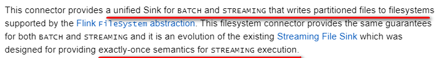


> - 1）、添加Maven依赖

```xml
<dependency>
    <groupId>org.apache.flink</groupId>
    <artifactId>flink-connector-files</artifactId>
    <version>1.13.1</version>
</dependency>
```


> - 2）、API使用：`FileSink`

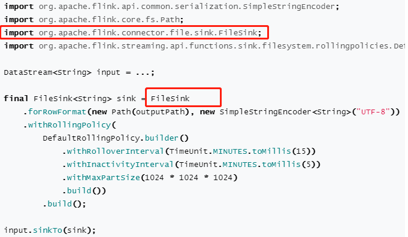


> - 3）、案例演示：自定义数据源产生交易订单数据，写入本地文件系统文件中

```Java
package cn.itcast.flink.connector;

import org.apache.commons.lang3.time.FastDateFormat;
import org.apache.flink.api.common.serialization.SimpleStringEncoder;
import org.apache.flink.connector.file.sink.FileSink;
import org.apache.flink.core.fs.Path;
import org.apache.flink.streaming.api.datastream.DataStreamSource;
import org.apache.flink.streaming.api.environment.StreamExecutionEnvironment;
import org.apache.flink.streaming.api.functions.sink.filesystem.OutputFileConfig;
import org.apache.flink.streaming.api.functions.sink.filesystem.bucketassigners.DateTimeBucketAssigner;
import org.apache.flink.streaming.api.functions.sink.filesystem.rollingpolicies.DefaultRollingPolicy;
import org.apache.flink.streaming.api.functions.source.ParallelSourceFunction;

import java.math.BigDecimal;
import java.math.RoundingMode;
import java.util.Random;
import java.util.concurrent.TimeUnit;

/**
 * Flink Stream 流计算，将DataStream 保存至文件系统，使用FileSystem Connector
 */
public class _11StreamBatchFileSinkDemo {

	public static void main(String[] args) throws Exception {
		// 1. 执行环境-env
		StreamExecutionEnvironment env = StreamExecutionEnvironment.getExecutionEnvironment();
		env.setParallelism(3);
		// TODO: 设置检查点
		env.enableCheckpointing(1000) ;

		// 2. 数据源-source
		DataStreamSource<String> orderDataStream = env.addSource(new OrderSource());
		//orderDataStream.print();

		// 3. 数据转换-transformation
		// 4. 数据终端-sink
		FileSink<String> fileSink = FileSink
			// 4-1. 设置存储文件格式，Row行存储
			.forRowFormat(
				new Path("datas/file-sink"), new SimpleStringEncoder<String>("UTF-8")
			)
			// 4-2. 设置桶分配政策,默认基于时间的分配器，每小时产生一个桶，格式如下yyyy-MM-dd--HH
			.withBucketAssigner(new DateTimeBucketAssigner<>())
			// 4-3. 设置数据文件滚动策略
			.withRollingPolicy(
				DefaultRollingPolicy.builder()
					.withRolloverInterval(TimeUnit.SECONDS.toMillis(5))
					.withInactivityInterval(TimeUnit.SECONDS.toMillis(10))
					.withMaxPartSize(2 * 1024 * 1024)
					.build()
			)
			// 4-4. 设置文件名称
			.withOutputFileConfig(
				OutputFileConfig.builder()
					.withPartPrefix("itcast")
					.withPartSuffix(".log")
					.build()
			)
			.build();
		// 4-4. 数据流DataStream添加Sink
		orderDataStream.sinkTo(fileSink).setParallelism(1) ;

		// 5. 触发执行
		env.execute("StreamFileSinkDemo");
	}

	/**
	 * 自定义数据源，实时产生交易订单数据
	 */
	private static class OrderSource implements ParallelSourceFunction<String> {
		private boolean isRunning = true ;
		private FastDateFormat format = FastDateFormat.getInstance("yyyyMMddHHmmssSSS");
		@Override
		public void run(SourceContext<String> ctx) throws Exception {
			Random random = new Random();
			while (isRunning){
				// 交易订单
				long timeMillis = System.currentTimeMillis();
				String orderId = format.format(timeMillis) + (10000 + random.nextInt(10000))  ;
				String userId = "u_" + (10000 + random.nextInt(10000)) ;
				double orderMoney = new BigDecimal(random.nextDouble() * 100).setScale(2, RoundingMode.HALF_UP).doubleValue() ;
				String output = orderId + "," + userId + "," + orderMoney + "," + timeMillis ;
				System.out.println(output);
				// 输出
				ctx.collect(output);
				TimeUnit.MILLISECONDS.sleep(100);
			}
		}

		@Override
		public void cancel() {
			isRunning = false ;
		}
	}
}
```


> ​				对比StreamingFileSink接收器和FileSink接收器，发现文件名称稍有不同，一个使用subTask任务编号，一个使用subTask任务TaskId。

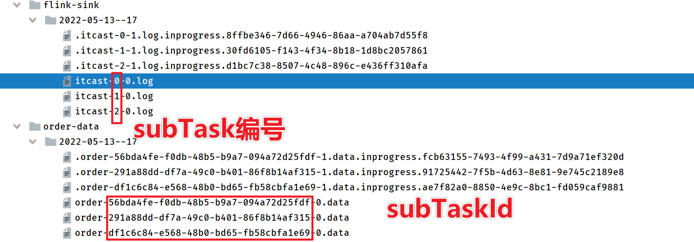


### 13-[掌握]-Connector之RedisSink

---


> Flink中提供`Connector：RedisSink`，将DataStream可以保存到Redis数据库中。
>

https://bahir.apache.org/docs/flink/current/flink-streaming-redis/


> - 1）、添加Maven 依赖

```xml
<dependency>
  <groupId>org.apache.bahir</groupId>
  <artifactId>flink-connector-redis_2.11</artifactId>
  <version>1.0</version>
</dependency>
```


> - 2）、核心类：`RedisSink`，创建对象，传递`RedisMapper`实例；此外，底层采用Jedis Client 第三方库写入Redis数据库。

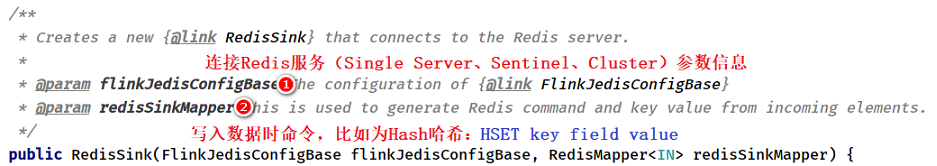


> - 3）、`RedisMapper`映射接口方法：

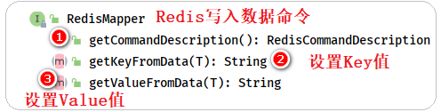


> - 4）、官方实例代码：

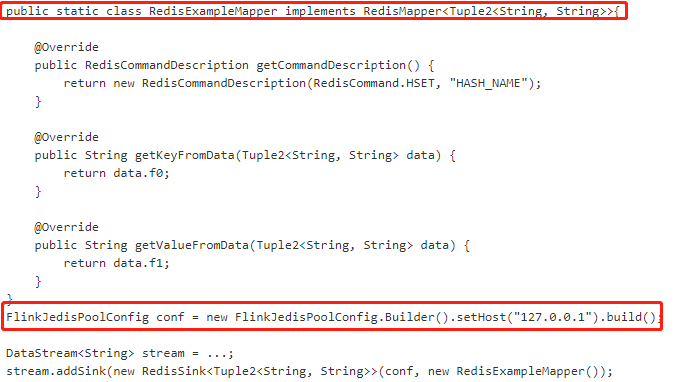


> 案例演示：==将Flink集合中的数据通过RedisSink进行保存==

```java
package cn.itcast.flink.connector;

import org.apache.flink.api.common.functions.FlatMapFunction;
import org.apache.flink.api.java.tuple.Tuple2;
import org.apache.flink.streaming.api.datastream.DataStreamSource;
import org.apache.flink.streaming.api.datastream.SingleOutputStreamOperator;
import org.apache.flink.streaming.api.environment.StreamExecutionEnvironment;
import org.apache.flink.streaming.connectors.redis.RedisSink;
import org.apache.flink.streaming.connectors.redis.common.config.FlinkJedisPoolConfig;
import org.apache.flink.streaming.connectors.redis.common.mapper.RedisCommand;
import org.apache.flink.streaming.connectors.redis.common.mapper.RedisCommandDescription;
import org.apache.flink.streaming.connectors.redis.common.mapper.RedisMapper;
import org.apache.flink.util.Collector;

/**
 * 案例演示：将数据保存至Redis中，直接使用官方提供Connector
 *      https://bahir.apache.org/docs/flink/current/flink-streaming-redis/
 */
public class ConnectorRedisSinkDemo {

	public static void main(String[] args) throws Exception {
		// 1. 执行环境-env
		StreamExecutionEnvironment env = StreamExecutionEnvironment.getExecutionEnvironment();
		env.setParallelism(1) ;

		// 2. 数据源-source
		DataStreamSource<String> inputDataStream = env.socketTextStream("node1.itcast.cn", 9999);

		// 3. 数据转换-transformation
		SingleOutputStreamOperator<Tuple2<String, Integer>> resultDataStream = inputDataStream
			// a. 过滤数据
			.filter(line -> null != line && line.trim().length() > 0)
			// b. 分割单词
			.flatMap(new FlatMapFunction<String, Tuple2<String, Integer>>() {
				@Override
				public void flatMap(String line, Collector<Tuple2<String, Integer>> out) throws Exception {
					String[] words = line.trim().split("\\W+");
					for (String word : words) {
						out.collect(Tuple2.of(word, 1));
					}
				}
			})
			// c. 按照单词分组及对组内聚合操作
			.keyBy(tuple -> tuple.f0).sum("f1");
		//resultDataStream.printToErr();

		// 4. 数据终端-sink
		/*
			spark -> 15
			flink -> 20
			hive -> 10
			--------------------------------------------
			Redis 数据结构：哈希Hash
				Key:
					flink:word:count
				Value: 哈希
					field  value
					spark  15
					flink  20
					hive   10
			命令：
				HSET flink:word:count spark 15
		 */
		// 4-1. 构建Redis Server配置
		FlinkJedisPoolConfig config = new FlinkJedisPoolConfig.Builder()
			.setHost("node1.itcast.cn")
			.setPort(6379)
			.setDatabase(0)
			.setMinIdle(3)
			.setMaxIdle(8)
			.setMaxTotal(8)
			.build();
		// 4-2. 构建RedisMapper实例
		RedisMapper<Tuple2<String, Integer>> redisMapper = new RedisMapper<Tuple2<String, Integer>>() {
			// HSET flink:word:count spark 15 -> 拆分到如下三个方法中
			@Override
			public RedisCommandDescription getCommandDescription() {
				return new RedisCommandDescription(RedisCommand.HSET, "flink:word:count");
			}

			@Override
			public String getKeyFromData(Tuple2<String, Integer> data) {
				return data.f0;
			}

			@Override
			public String getValueFromData(Tuple2<String, Integer> data) {
				return data.f1 + "";
			}
		};
		// 4-3. 创建RedisSink对象
		RedisSink<Tuple2<String, Integer>> redisSink = new RedisSink<Tuple2<String, Integer>>(
			config, redisMapper
		);
		// 4-4. 添加Sink
		resultDataStream.addSink(redisSink) ;

		// 5. 触发执行-execute
		env.execute("ConnectorRedisSinkDemo") ;
	}

}
```


> 运行流式程序，输入测试数据，查看Redis中结果数据，截图如下所示：

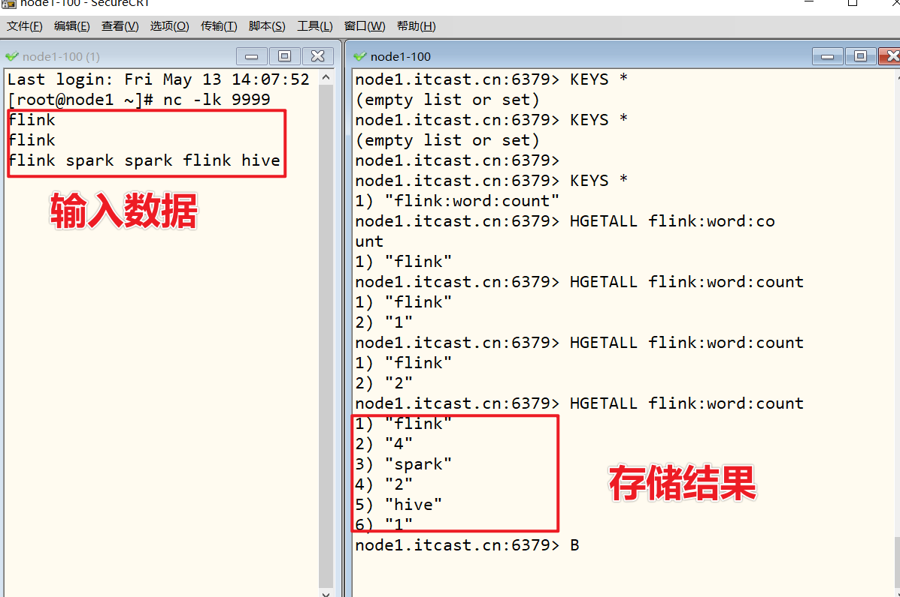


## 第三部分：批处理高级特性【3个小节】


```

```


### 14-[了解]-批处理特性之累加器Accamulator

---


​		Flink中的==累加器Accumulator== ，与Mapreduce counter的应用场景类似，可以很好地**观察task在运行期间的数据变化**，如在Flink job任务中的**算子函数**中操作累加器，在任务执行结束之后才能获得累加器的最终结果。

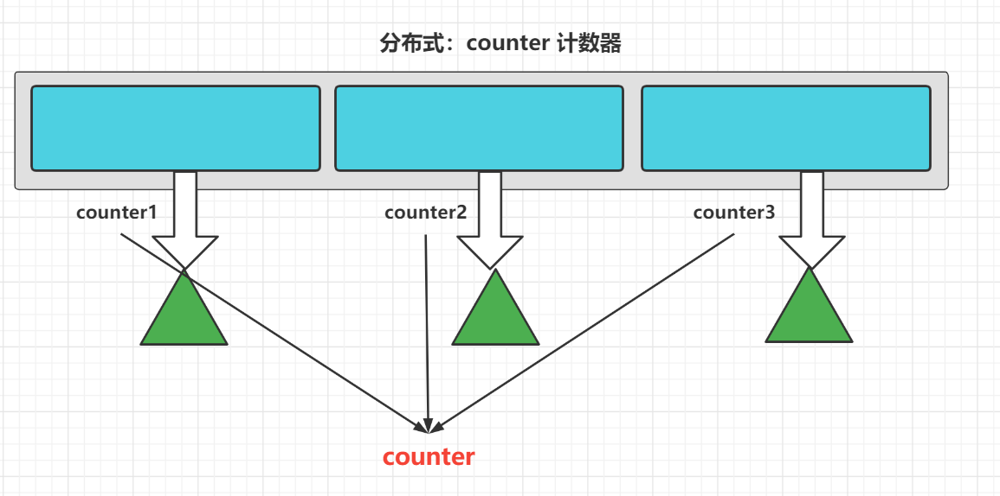


> Flink有以下内置累加器，每个累加器都实现了`Accumulator`接口：


> 使用累加器进行累加统计操作时，步骤如下：

```ini
1.创建累加器
	private IntCounter numLines = new IntCounter();
2.注册累加器
	getRuntimeContext().addAccumulator("num-lines", this.numLines);
3.使用累加器
	this.numLines.add(1);
4.获取累加器的结果
	myJobExecutionResult.getAccumulatorResult("num-lines")
```


> **编写程序**：对数据源读取的数据进行计数Counter，最终输出所出来的数据条目数。

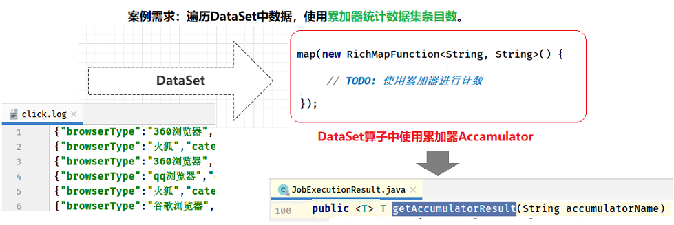


```Java
package cn.itcast.flink.batch;

import org.apache.flink.api.common.JobExecutionResult;
import org.apache.flink.api.common.accumulators.IntCounter;
import org.apache.flink.api.common.functions.RichMapFunction;
import org.apache.flink.api.java.ExecutionEnvironment;
import org.apache.flink.api.java.operators.DataSource;
import org.apache.flink.api.java.operators.MapOperator;
import org.apache.flink.configuration.Configuration;

/**
 * 案例压实：Flink中累加器Accumulator使用，统计处理数据条目数
 * @author xuyuan
 */
public class BatchAccumulatorDemo {

	/**
	 * 定义子类，实现函数接口，重写抽象方法map：实现数据处理和计数器累加功能
	 */
	private static class CounterMapFunction extends RichMapFunction<String, String> {
		// todo step1. 定义累加器
		private IntCounter counter = new IntCounter();

		@Override
		public void open(Configuration parameters) throws Exception {
			// todo step2. 注册累加器
			getRuntimeContext().addAccumulator("counter", counter);
		}

		@Override
		public String map(String value) throws Exception {
			// todo step3. 使用累加器进行计数
			counter.add(1);

			return value;
		}
	}

	public static void main(String[] args) throws Exception {
		// 1. 执行环境-env
		ExecutionEnvironment env = ExecutionEnvironment.getExecutionEnvironment();
		env.setParallelism(1);

		// 2. 数据源-source
		DataSource<String> dataset = env.readTextFile("datas/click.log");

		// 3. 数据转换-transformation
		MapOperator<String, String> mapDataSet = dataset.map(new CounterMapFunction());

		// 4. 数据终端-sink
		mapDataSet.writeAsText("datas/click.txt");

		// 5. 触发执行-execute
		JobExecutionResult jobResult = env.execute("BatchAccumulatorDemo");

		// todo step4. 获取累加器值
		Object counter = jobResult.getAccumulatorResult("counter");
		System.out.println("counter = " + counter);
	}

}  
```


### 15-[理解]-批处理特性之广播变量Broadcast

---


> ​		Flink支持广播，可以==将数据广播到TaskManager==上就可以==供TaskManager中的SubTask/task==去使用，`数据存储到内存`中。

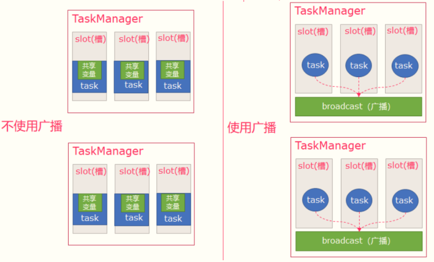

1. 可以理解广播就是一个公共的共享变量
2. 将一个数据集广播后，不同的Task都可以在节点上获取到
3. 每个节点（TaskManager）只存一份
4. 如果不使用广播，每一个Task都会拷贝一份数据集，造成`内存资源浪费`


> - 第一、广播变量是要把`dataset`广播到内存中，所以广播的数据量不能太大，否则会出现`OOM`
> - 第二、广播变量的值不可修改，这样才能确保每个节点获取到的值都是一致的


使用广播变量步骤：

```ini
1：广播数据
	.withBroadcastSet(DataSet, "name");
	
2：获取广播的数据
	Collection<> broadcastSet = getRuntimeContext().getBroadcastVariable("name");
	
3：使用广播数据
```


> ​		将`studentDS(学号,姓名)`集合广播出去(广播到各个TaskManager内存中)，然后使用`scoreDS(学号,学科,成绩)`和广播数据(学号,姓名)进行关联，得到这样格式的数据：`(姓名,学科,成绩)`

```Java
		// 大表数据
		DataSource<Tuple3<Integer, String, Integer>> scoreDataSet = env.fromCollection(
			Arrays.asList(
				Tuple3.of(1, "语文", 50),
				Tuple3.of(1, "数学", 70),
				Tuple3.of(1, "英语", 86),
				Tuple3.of(2, "语文", 80),
				Tuple3.of(2, "数学", 86),
				Tuple3.of(2, "英语", 96),
				Tuple3.of(3, "语文", 90),
				Tuple3.of(3, "数学", 68),
				Tuple3.of(3, "英语", 92)
			)
		);
		// 小表数据
		DataSource<Tuple2<Integer, String>> studentDataSet = env.fromCollection(
			Arrays.asList(
				Tuple2.of(1, "张三"),
				Tuple2.of(2, "李四"),
				Tuple2.of(3, "王五")
			)
		);
```

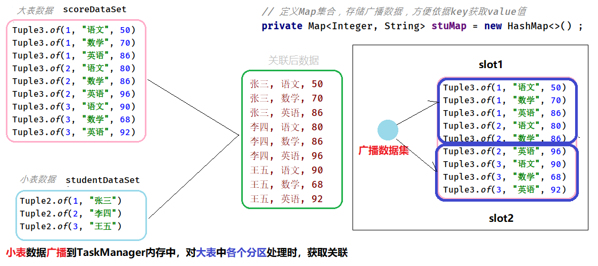


> 编写代码，完成小数据集DataSet广播，与大数据集进行关联操作，代码如下所示：

```java
package cn.itcast.flink.batch;

import org.apache.flink.api.common.functions.RichMapFunction;
import org.apache.flink.api.java.ExecutionEnvironment;
import org.apache.flink.api.java.operators.DataSource;
import org.apache.flink.api.java.operators.MapOperator;
import org.apache.flink.api.java.tuple.Tuple2;
import org.apache.flink.api.java.tuple.Tuple3;
import org.apache.flink.configuration.Configuration;

import java.util.Arrays;
import java.util.HashMap;
import java.util.List;
import java.util.Map;

/**
 * Flink 批处理中广播变量：将小数据集广播到TaskManager内存中，便于Slot中运行SubTask任务使用
 * @author xuyuan
 */
public class BatchBroadcastDemo {

	/**
	 * 定义子类，实现函数接口MapFunction，重写方法map：实现数据处理，使用广播变量
	 */
	private static class BroadcastMapFunction
			extends RichMapFunction<Tuple3<Integer, String, Integer>, String> {
		// 定义Map集合，存储广播数据
		private Map<Integer, String> stuMap = new HashMap<>() ;

		@Override
		public void open(Configuration parameters) throws Exception {
			// todo step2. 获取广播的数据集
			List<Tuple2<Integer, String>> list = getRuntimeContext().getBroadcastVariable("students");
			// todo step3. 将广播变量数据放到map聚合中，当处理大表数据时，依据key获取小表中value值
			for (Tuple2<Integer, String> tuple2 : list) {
				stuMap.put(tuple2.f0, tuple2.f1) ;
			}
		}

		@Override
		public String map(Tuple3<Integer, String, Integer> value) throws Exception {
			// value:  Tuple3.of(1, "语文", 50)
			Integer studentId = value.f0;
			String subjectName = value.f1;
			Integer studentScore = value.f2;
			// 依据学生ID获取学生名称
			String studentName = stuMap.getOrDefault(studentId, "未知");
			// 拼凑字符串并返回
			return studentName + ", " + subjectName + ", " + studentScore;
		}

	}

	public static void main(String[] args) throws Exception {
		// 1. 执行环境-env
		ExecutionEnvironment env = ExecutionEnvironment.getExecutionEnvironment() ;
		env.setParallelism(1);

		// 2. 数据源-source，todo：从本地集合创建2个DataSet
		// 大表数据
		DataSource<Tuple3<Integer, String, Integer>> scoreDataSet = env.fromCollection(
			Arrays.asList(
				Tuple3.of(1, "语文", 50),
				Tuple3.of(1, "数学", 70),
				Tuple3.of(1, "英语", 86),
				Tuple3.of(2, "语文", 80),
				Tuple3.of(2, "数学", 86),
				Tuple3.of(2, "英语", 96),
				Tuple3.of(3, "语文", 90),
				Tuple3.of(3, "数学", 68),
				Tuple3.of(3, "英语", 92)
			)
		);
		// 小表数据
		DataSource<Tuple2<Integer, String>> studentDataSet = env.fromCollection(
			Arrays.asList(
				Tuple2.of(1, "张三"),
				Tuple2.of(2, "李四"),
				Tuple2.of(3, "王五")
			)
		);

		// 3. 数据转换-transformation: 使用map算子，对大表中每条数据处理，处理时使用小表数据
		/*
				Tuple3.of(1, "语文", 50)    --小表-->   张三", "语文", 50
		 */
		MapOperator<Tuple3<Integer, String, Integer>, String> resultDataSet = scoreDataSet
			.map(new BroadcastMapFunction())
			// todo step1. 将小表数据集广播出去，哪个算子使用小表，就在算子后面进行广播
			.withBroadcastSet(studentDataSet, "students");

		// 4. 数据接收器-sink
		resultDataSet.printToErr();
	}

}
```


### 16-[理解]-批处理特性之分布式缓存Cache

---


> Flink提供了一个类似于Hadoop的分布式缓存，让并行运行实例的函数可以在本地访问。

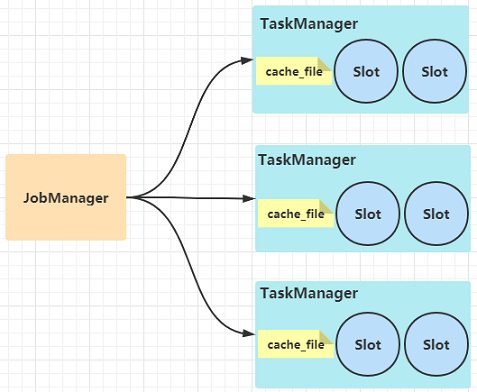

- 广播变量：使用数据为数据集DataSet，将其广播到TaskManager内存中，被Task使用；
- 分布式缓存：缓存数据文件数据，数据放在文件中；

[广播变量是将`变量（DataSet）`分发到各个TaskManager节点的内存上，分布式缓存是将`文件缓存`到各个TaskManager节点上]()


> 编码步骤：

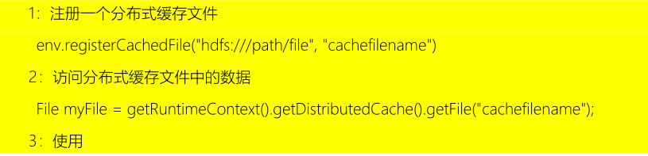


> 修改上述使用广播变量，进行大表与小表数据案例，将小表数据放入文件中，采用分布式缓存，然后关联。

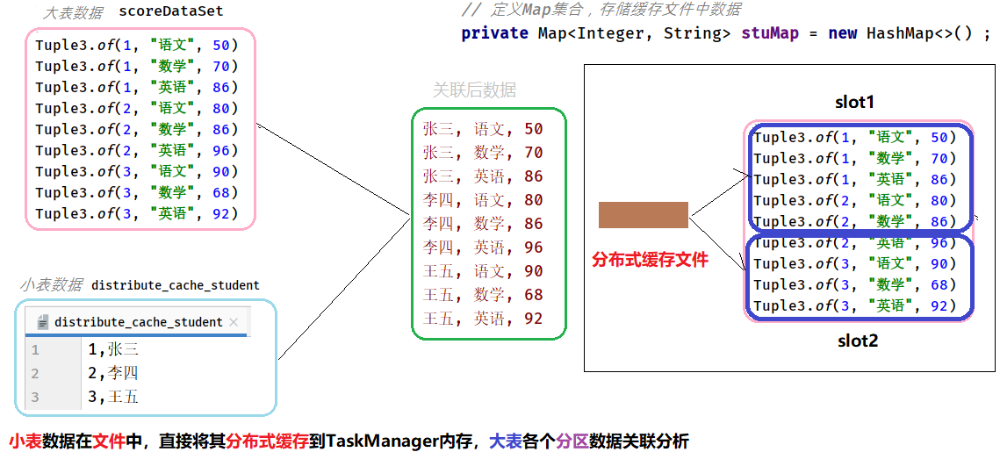


```java
package cn.itcast.flink.batch;

import org.apache.commons.io.FileUtils;
import org.apache.flink.api.common.functions.RichMapFunction;
import org.apache.flink.api.java.ExecutionEnvironment;
import org.apache.flink.api.java.operators.DataSource;
import org.apache.flink.api.java.operators.MapOperator;
import org.apache.flink.api.java.tuple.Tuple3;
import org.apache.flink.configuration.Configuration;

import java.io.File;
import java.nio.charset.Charset;
import java.util.Arrays;
import java.util.HashMap;
import java.util.List;
import java.util.Map;

/**
 * Flink 批处理中分布式缓存：将小文件数据进行缓存到TaskManager中，被Slot中运行subTask任务使用
 * @author xuyuan
 */
public class BatchDistributedCacheDemo {

	/**
	 * 定义子类，实现函数接口MapFunction，重写方法map：实现数据处理，获取分布式缓存数据，存储到map集合中
	 */
	private static class CacheMapFunction
			extends RichMapFunction<Tuple3<Integer, String, Integer>, String> {
		// 定义Map集合，存储广播数据
		private Map<Integer, String> stuMap = new HashMap<>() ;

		@Override
		public void open(Configuration parameters) throws Exception {
			// todo step2. 获取分布式缓存的数据
			File file = getRuntimeContext().getDistributedCache().getFile("cache_students");

			// todo step3. 读取缓存文件数据   // 1,张三
			List<String> list = FileUtils.readLines(file, Charset.defaultCharset()); 
			for (String item : list) {
				String[] array = item.split(",");
				stuMap.put(Integer.parseInt(array[0]), array[1]) ;
			}
			System.out.println(stuMap);
		}

		@Override
		public String map(Tuple3<Integer, String, Integer> value) throws Exception {
			// value:  Tuple3.of(1, "语文", 50)
			Integer studentId = value.f0;
			String subjectName = value.f1;
			Integer studentScore = value.f2;
			// 依据学生ID获取学生名称
			String studentName = stuMap.getOrDefault(studentId, "未知");
			// 拼凑字符串并返回
			return studentName + ", " + subjectName + ", " + studentScore;
		}

	}

	public static void main(String[] args) throws Exception {
		// 1. 执行环境-env
		ExecutionEnvironment env = ExecutionEnvironment.getExecutionEnvironment() ;
		env.setParallelism(1);

		// todo step1. 将数据文件进行缓存，不能太大，属于小文件数据
		env.registerCachedFile("datas/distribute_cache_student", "cache_students");

		// 2. 数据源-source，todo：从本地集合创建1个DataSet
		// 大表数据
		DataSource<Tuple3<Integer, String, Integer>> scoreDataSet = env.fromCollection(
			Arrays.asList(
				Tuple3.of(1, "语文", 50),
				Tuple3.of(1, "数学", 70),
				Tuple3.of(1, "英语", 86),
				Tuple3.of(2, "语文", 80),
				Tuple3.of(2, "数学", 86),
				Tuple3.of(2, "英语", 96),
				Tuple3.of(3, "语文", 90),
				Tuple3.of(3, "数学", 68),
				Tuple3.of(3, "英语", 92)
			)
		);

		// 3. 数据转换-transformation: 使用map算子，对大表中每条数据处理，处理时使用小表数据
		/*
				Tuple3.of(1, "语文", 50)    --小表-->   张三", "语文", 50
		 */
		MapOperator<Tuple3<Integer, String, Integer>, String> resultDataSet = scoreDataSet
				.map(new CacheMapFunction());

		// 4. 数据接收器-sink
		resultDataSet.printToErr();
	}

}
```


## 附录部分：注意事项及扩展内容


```

```


### [附录1]-创建Maven模块

---


> Maven 工程结构

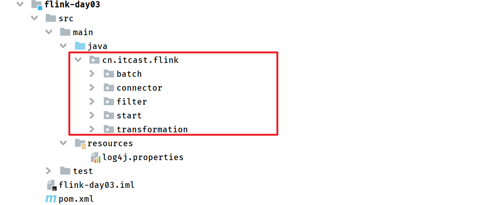


> Maven 工程POM文件中内容（依赖包）：		

```xml
    <repositories>
        <repository>
            <id>nexus-aliyun</id>
            <name>Nexus aliyun</name>
            <url>http://maven.aliyun.com/nexus/content/groups/public</url>
        </repository>
        <repository>
            <id>central_maven</id>
            <name>central maven</name>
            <url>https://repo1.maven.org/maven2</url>
        </repository>
        <repository>
            <id>cloudera</id>
            <url>https://repository.cloudera.com/artifactory/cloudera-repos/</url>
        </repository>
        <repository>
            <id>apache.snapshots</id>
            <name>Apache Development Snapshot Repository</name>
            <url>https://repository.apache.org/content/repositories/snapshots/</url>
            <releases>
                <enabled>false</enabled>
            </releases>
            <snapshots>
                <enabled>true</enabled>
            </snapshots>
        </repository>
    </repositories>

    <dependencies>
        <dependency>
            <groupId>org.apache.flink</groupId>
            <artifactId>flink-java</artifactId>
            <version>1.13.1</version>
        </dependency>
        <dependency>
            <groupId>org.apache.flink</groupId>
            <artifactId>flink-streaming-java_2.11</artifactId>
            <version>1.13.1</version>
        </dependency>
        <dependency>
            <groupId>org.apache.flink</groupId>
            <artifactId>flink-clients_2.11</artifactId>
            <version>1.13.1</version>
        </dependency>
        <dependency>
            <groupId>org.apache.flink</groupId>
            <artifactId>flink-runtime-web_2.11</artifactId>
            <version>1.13.1</version>
        </dependency>

        <dependency>
            <groupId>org.apache.flink</groupId>
            <artifactId>flink-connector-kafka_2.11</artifactId>
            <version>1.13.1</version>
        </dependency>

        <dependency>
            <groupId>org.apache.flink</groupId>
            <artifactId>flink-connector-jdbc_2.11</artifactId>
            <version>1.13.1</version>
        </dependency>

        <dependency>
            <groupId>org.apache.flink</groupId>
            <artifactId>flink-connector-files</artifactId>
            <version>1.13.1</version>
        </dependency>

        <dependency>
            <groupId>org.apache.bahir</groupId>
            <artifactId>flink-connector-redis_2.11</artifactId>
            <version>1.0</version>
        </dependency>

        <dependency>
            <groupId>mysql</groupId>
            <artifactId>mysql-connector-java</artifactId>
            <version>5.1.48</version>
        </dependency>

        <dependency>
            <groupId>com.alibaba</groupId>
            <artifactId>fastjson</artifactId>
            <version>1.2.68</version>
        </dependency>
        <dependency>
            <groupId>org.projectlombok</groupId>
            <artifactId>lombok</artifactId>
            <version>1.18.12</version>
        </dependency>

        <dependency>
            <groupId>org.slf4j</groupId>
            <artifactId>slf4j-log4j12</artifactId>
            <version>1.7.7</version>
            <scope>runtime</scope>
        </dependency>
        <dependency>
            <groupId>log4j</groupId>
            <artifactId>log4j</artifactId>
            <version>1.2.17</version>
            <scope>runtime</scope>
        </dependency>

    </dependencies>

    <build>
        <sourceDirectory>src/main/java</sourceDirectory>
        <testSourceDirectory>src/test/java</testSourceDirectory>
        <plugins>
            <!-- 编译插件 -->
            <plugin>
                <groupId>org.apache.maven.plugins</groupId>
                <artifactId>maven-compiler-plugin</artifactId>
                <version>3.5.1</version>
                <configuration>
                    <source>1.8</source>
                    <target>1.8</target>
                    <!--<encoding>${project.build.sourceEncoding}</encoding>-->
                </configuration>
            </plugin>
            <plugin>
                <groupId>org.apache.maven.plugins</groupId>
                <artifactId>maven-surefire-plugin</artifactId>
                <version>2.18.1</version>
                <configuration>
                    <useFile>false</useFile>
                    <disableXmlReport>true</disableXmlReport>
                    <includes>
                        <include>**/*Test.*</include>
                        <include>**/*Suite.*</include>
                    </includes>
                </configuration>
            </plugin>
            <!-- 打jar包插件(会包含所有依赖) -->
            <plugin>
                <groupId>org.apache.maven.plugins</groupId>
                <artifactId>maven-shade-plugin</artifactId>
                <version>2.3</version>
                <executions>
                    <execution>
                        <phase>package</phase>
                        <goals>
                            <goal>shade</goal>
                        </goals>
                        <configuration>
                            <filters>
                                <filter>
                                    <artifact>*:*</artifact>
                                    <excludes>
                                        <!--
                                        zip -d learn_spark.jar META-INF/*.RSA META-INF/*.DSA META-INF/*.SF -->
                                        <exclude>META-INF/*.SF</exclude>
                                        <exclude>META-INF/*.DSA</exclude>
                                        <exclude>META-INF/*.RSA</exclude>
                                    </excludes>
                                </filter>
                            </filters>
                            <transformers>
                                <transformer implementation="org.apache.maven.plugins.shade.resource.ManifestResourceTransformer">
                                    <!-- <mainClass>com.itcast.flink.WordCount</mainClass> -->
                                </transformer>
                            </transformers>
                        </configuration>
                    </execution>
                </executions>
            </plugin>
        </plugins>
    </build>
```


### [附录2]-回顾Redis Hash数据类型

----


```ini
# Redis
	1. 数据库，NoSQL = Not Only SQL
	
	2. Key/Value 存储类型数据库
	
	3. name -> value：5种常见数据类型
			String，List，Hash，Set，ZSet
			Hash哈希：
				类似Python中字典dict
				类似Java集合中映射Map
	
	4. 如果是Hash类型
		key 	field	value
```


> ​		Redis支持五种数据类型：**String、Hash、List、Set、ZSet**，哈希类型Hash是指键值对里的==value本身存储的也是一个个的KV键值对==，类似于python中的dict和java中的map集合。

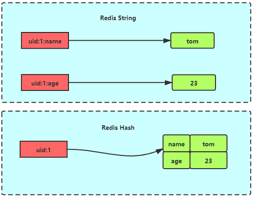


> Redis中哈希Hash对象常用命令如下表：

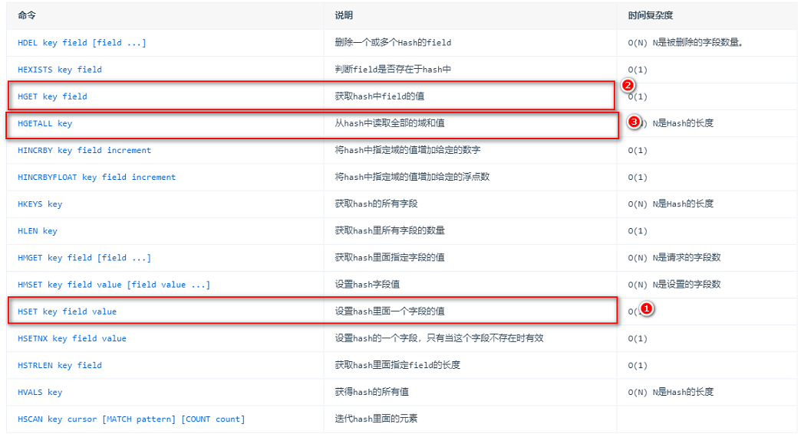


> 基本命令演示如下所示：

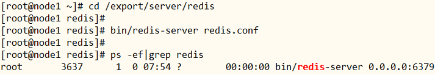

```bash
[root@node1 ~]# /export/server/redis/bin/redis-cli 
127.0.0.1:6379> 
127.0.0.1:6379> KEYS *
1) "name"
2) "age"
3) "gender"
4) "stu:1001"
127.0.0.1:6379> hset s_1001 name lisi
(integer) 1
127.0.0.1:6379> hset s_1001 age 25
(integer) 1
127.0.0.1:6379> hset s_1001 gender male
(integer) 1
127.0.0.1:6379> 
127.0.0.1:6379> KEYS *
1) "age"
2) "name"
3) "s_1001"
127.0.0.1:6379> 
127.0.0.1:6379> HGETALL s_1001
1) "name"
2) "lisi"
3) "age"
4) "25"
5) "gender"
6) "male"
127.0.0.1:6379> HGET s_1001 name
"lisi"
127.0.0.1:6379> 
127.0.0.1:6379> HGET s_1001 age
"25"
```


