# Flink Chapter04：Flink 高级API开发（1）

---

​			Flink之所以能这么流行，离不开它最重要的四个基石：**Checkpoint、State、Time、Window**。


## 前言部分：知识回顾及课程目标


```

```


### [前言1]-上次课程内容回顾 

---


```ini
# day01：
    环境安装部署
    快速入门体验

# day02：
    流计算 DataStream API使用
    Source\Transformation\Sink

# day03：
    Connectors连接器（Source和Sink）
    批处理DataSet中高级特性（累加器、广播变量、分布式缓存）

# 在Flink计算引擎中，将所有数据当做Data Stream（数据流），划分为2种：
    - 无界流unbounded data stream   
        有开始，没有结束
        流式数据
        处理时，处理一条数据，输出一个结果
    - 有界流bounded data stream   
        有开始，有结束
        静态数据
        处理时，处理一条数据，输出一个结果
```


> 主要讲解3个方面的内容：DataStream Connectors连接器及批处理DataSet高级特性


```ini
# 2、Connectors连接器
	数据源Source：FlinkKafkaConsumer、KafkaSource（新 API）
	数据接收器Sink：
		FlinkKafkaProducer
		JDBCSink
		RedisSink
		StreamingFileSink和FileSink（流批）

# 3、批处理特性
	基于DataSet进行离线批处理分析特性：Accamulator累加器、Broadcast广播变量、Cache分布式缓存
		使用富函数RichFunction
```


### [前言2]-今日课程内容提纲

------


> 主要讲解：Flink 四大基石【**Window 窗口计算**】和【**事件时间EventTime窗口计算**】。

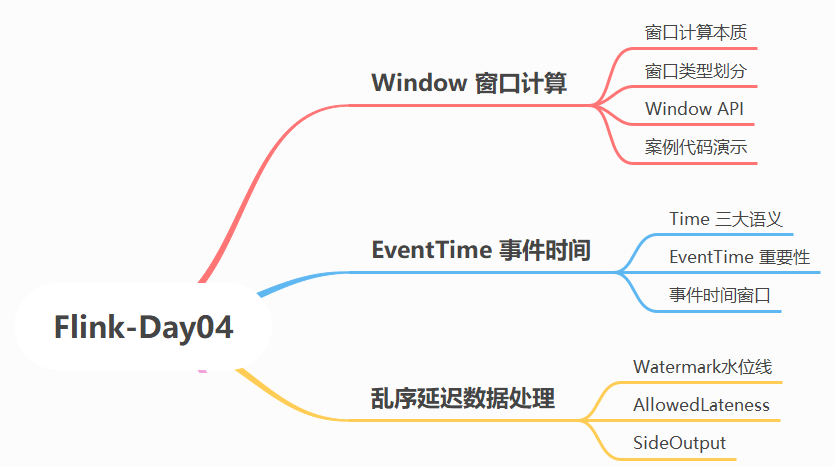


```ini
# 事件时间EventTime：
	表示这条数据产生时间，附在数据的字段中
	1.交易订单数据：orderId,orderMoney,orderTime,...
		其中orderTime订单时间就属于这条数据事件时间
	
	2.用户网站行为日志数据：uuid,accessTime,ip,url,...
		其中accessTime访问时间就属于这条数据事件时间

```


### [前言3]-实时统计订单销售额

---

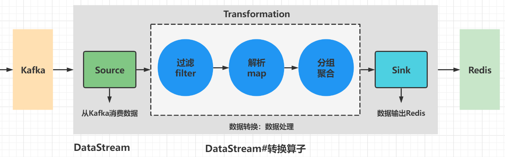


> 仿双十一实时大屏：**从Kafka Topic实时消费交易订单数据，销售总额统计，保存到Redis内存数据库**。

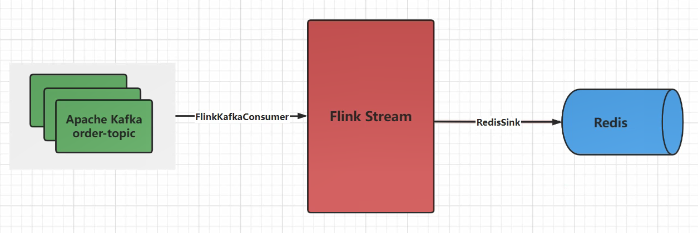


- 模拟业务数据

```ini
# orderId,userId,orderMoney,orderTime
2022051506560053115929,u_12839,50.0,1652568960531
2022051506560054613305,u_16251,95.93,1652568960546
2022051506560055313822,u_16630,8.72,1652568960553
2022051506560063418910,u_17244,30.0,1652568960634
2022051506560064916340,u_17398,4.04,1652568960649
2022051506560065610686,u_11208,25.69,1652568960656
2022051506560073510519,u_15800,1.69,1652568960735
2022051506560075217070,u_14082,83.83,1652568960752
2022051506560075619641,u_11710,57.3,1652568960756
2022051506560083712977,u_17621,25.74,1652568960837
```


- 启动Zookeeper和Kafka集群

```ini
[root@node1 ~]# start-zk.sh
[root@node1 ~]# start-kafka.sh

[root@node1 ~]# /export/server/kafka/bin/kafka-topics.sh --create --topic order-topic --bootstrap-server node1.itcast.cn:9092,node2.itcast.cn:9092,node3.itcast.cn:9092 --replication-factor 1 --partitions 3

[root@node1 ~]# /export/server/kafka/bin/kafka-console-producer.sh --topic order-topic --broker-list node1.itcast.cn:9092,node2.itcast.cn:9092,node3.itcast.cn:9092
```


- 编程Flink DataStream流式程序代码：`StreamOrderReport`

```Java
package cn.itcast.flink.order;

import lombok.AllArgsConstructor;
import lombok.Data;
import lombok.NoArgsConstructor;
import org.apache.flink.api.common.functions.MapFunction;
import org.apache.flink.api.common.serialization.SimpleStringSchema;
import org.apache.flink.api.java.tuple.Tuple2;
import org.apache.flink.streaming.api.datastream.DataStreamSource;
import org.apache.flink.streaming.api.datastream.SingleOutputStreamOperator;
import org.apache.flink.streaming.api.environment.StreamExecutionEnvironment;
import org.apache.flink.streaming.connectors.kafka.FlinkKafkaConsumer;
import org.apache.flink.streaming.connectors.redis.RedisSink;
import org.apache.flink.streaming.connectors.redis.common.config.FlinkJedisConfigBase;
import org.apache.flink.streaming.connectors.redis.common.config.FlinkJedisPoolConfig;
import org.apache.flink.streaming.connectors.redis.common.mapper.RedisCommand;
import org.apache.flink.streaming.connectors.redis.common.mapper.RedisCommandDescription;
import org.apache.flink.streaming.connectors.redis.common.mapper.RedisMapper;
import org.apache.kafka.clients.consumer.ConsumerConfig;

import java.util.Properties;

/**
 * 仿双十一实时大屏：从Kafka Topic实时消费交易订单数据，销售总额统计，保存到Redis内存数据库。
 * @author xuyuan
 */
public class StreamOrderReport {

	/**
	 * 交易订单数据实体类对象
	 */
	@Data
	@AllArgsConstructor
	@NoArgsConstructor
	public static class OrderEvent{
		public String orderId;
		public String userId;
		public Double orderMoney;
		public Long orderTimestamp;
	}

	public static void main(String[] args) throws Exception {
		// 1. 执行环境-env
		StreamExecutionEnvironment env = StreamExecutionEnvironment.getExecutionEnvironment();
		env.setParallelism(1) ;

		// 2. 数据源-source
		// 2-1. Kafka 消费者属性设置
		Properties props = new Properties() ;
		props.setProperty(
            ConsumerConfig.BOOTSTRAP_SERVERS_CONFIG, 
            "node1.itcast.cn:9092,node2.itcast.cn:9092,node3.itcast.cn:9092");
		props.setProperty(ConsumerConfig.GROUP_ID_CONFIG, "gid-order-1") ;
		// 设置属性，动态发现topic分区信息
		props.setProperty("flink.partition-discovery.interval-millis", "60000") ;
		// 2-2. 构建实例对象
		FlinkKafkaConsumer<String> kafkaConsumer = new FlinkKafkaConsumer<String>(
			"order-topic", new SimpleStringSchema(), props
		);
		// 设置属性：消费数据起始偏移量
		kafkaConsumer.setStartFromLatest();
		// 2-3. 添加数据源
		DataStreamSource<String> kafkaStream = env.addSource(kafkaConsumer);

		// 3. 数据转换-transformation
		/*
			业务数据：
				orderId,userId,orderMoney,orderTime
				2022051506560053115929,u_12839,50.0,1652568960531
			3-1. 数据提取封装
				将字符串数据提取字段值，封装到实体类对象
			3-2. 聚合统计销售额
				sum算子
		 */
		// 3-1. 数据提取封装
		SingleOutputStreamOperator<OrderEvent> orderStream = kafkaStream.map(
            new MapFunction<String, OrderEvent>() {
			@Override
			public OrderEvent map(String value) throws Exception {
				// 分割字符串
				String[] array = value.trim().split(",");
				// 创建实体类对象
				OrderEvent orderEvent = new OrderEvent();
				// 设置属性值
				orderEvent.setOrderId(array[0]);
				orderEvent.setUserId(array[1]);
				orderEvent.setOrderMoney(Double.parseDouble(array[2]));
				orderEvent.setOrderTimestamp(Long.parseLong(array[3]));
				// 返回实体类对象
				return orderEvent;
			}
		});
		//orderStream.printToErr("order>");

		// 3-2. 聚合统计销售额
		SingleOutputStreamOperator<Tuple2<String, Double>> reportStream = orderStream
			// 提取销售额，封装到二元组中：("全国", 99.99)
			.map(new MapFunction<OrderEvent, Tuple2<String, Double>>() {
				@Override
				public Tuple2<String, Double> map(OrderEvent value) throws Exception {
					return Tuple2.of("全国", value.orderMoney);
				}
			})
			// 指定分组字段，按照“全国”分组
			.keyBy(tuple -> tuple.f0)
			// 组内，求和
			.sum(1);
		// reportStream.printToErr("report>");

		// 4. 数据接收器-sink
		// 4-1. 连接Redis数据库信息
		FlinkJedisConfigBase flinkJedisConfigBase = new FlinkJedisPoolConfig.Builder()
			.setHost("node1.itcast.cn")
			.setPort(6379)
			.setDatabase(0)
			.setMaxTotal(8)
			.setMaxIdle(8)
			.setMinIdle(3)
			.build() ;
		// 4-2. 流中数据映射命令
		/*
				(全国,84.04)       ->   set  "全国"  "84.04"
		 */
		RedisMapper<Tuple2<String, Double>> redisSinkMapper = new RedisMapper<>() {
			@Override
			public RedisCommandDescription getCommandDescription() {
				// set  "全国"  "84.04"
				return new RedisCommandDescription(RedisCommand.SET);
			}

			@Override
			public String getKeyFromData(Tuple2<String, Double> data) {
				return data.f0;
			}

			@Override
			public String getValueFromData(Tuple2<String, Double> data) {
				return data.f1 + "";
			}
		} ;
		// 4-3. 传递参数，创建Sink对象
		RedisSink<Tuple2<String, Double>> redisSink = new RedisSink<>(
            flinkJedisConfigBase, redisSinkMapper
        );
		// 4-4. 添加接收器
		reportStream.addSink(redisSink) ;

		// 5. 触发执行
		env.execute("StreamOrderReport");
	}

}
```


### [前言4]-Flink 计算引擎四大基石 

---


```ini
# 1、每日实时大屏
	显示当日所有订单销售额，从00:00 ~ 24:00 所有订单销售额
	
	计算数据范围：
        00:00 ~ 24:00 每天，称之窗口window
        
    按照时间范围划分窗口window，然后对窗口中数据计算
        窗口为1天，时间窗口   

    Window 窗口计算
    Time 时间语义


# 2、流式实时计算
	只要job运行起来，正常情况下，一直接收数据进行计算，除非异常终止或人为关闭

	job运行时，计算数据中，往往有状态State，比如案例：总的销售额total
	
	某时刻，小白码农，执行命令：kill -9 99999，将Job进程杀死，当再次重新运行，继续处理数据
        1). 获取以前数据状态：销售额，以便计算数据时，进行累加求和
        2). 获取以前读取数据位置，针对Kafka消费偏移量 -> 也是一种状态

    将Job运行时状态（销售额和消费偏移量）定时进行保存，称之为Checkpoint检查点，再次运行时，从保存数据中获取State，继续处理数据

    State 状态
    Checkpoint检查点，保存状态数据到可靠文件系统中，比如HDFS分布式文件系统
```


> Flink之所以能这么流行，离不开它最重要的四个基石：==Checkpoint、State、Time、Window==。
>

- 1）、窗口`Window`和时间`Time`
  
  - 基于事件时间EventTime窗口Window计算
  
  
  
- 2）、状态`State`和检查点`Checkpoint`
  
  - Flink 流式Job运行时，有状态，可以将某个时刻的状态State进行快照和保存，称为Checkpoint
  
  

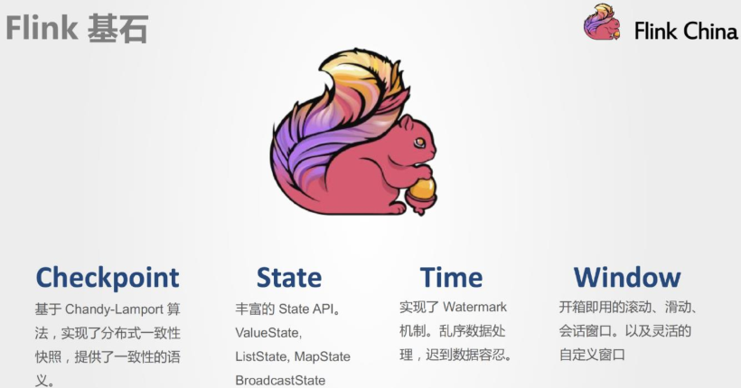

- **1）、窗口Window**
  - 流计算中一般在对流数据进行操作之前都会==先进行开窗==，即基于一个什么样的窗口上做这个计算
  - Flink提供了==开箱即用的各种窗口==，比如滑动窗口、滚动窗口、会话窗口以及非常灵活的自定义的窗口
  - [类似离线批处理分析中开窗函数中窗口大小设置]()

https://nightlies.apache.org/flink/flink-docs-release-1.13/docs/dev/datastream/operators/windows/


- **2）、时间Time**
  - Flink中窗口计算，基本上都是==基于时间设置窗口==
  - Flink还实现了Watermark的机制，能够支持基于事件时间的处理，能够容忍**迟到/乱序**的数据
  - [基于事件时间窗口计算：EventTime事件时间、窗口计算Window、窗口类型]()

https://nightlies.apache.org/flink/flink-docs-release-1.13/docs/concepts/time/


- **3）、状态State**
  - Flink计算引擎，自身就是==基于状态计算框架==，默认情况下程序自己管理状态
  - 提供==一致性的语义==，使得用户在编程时能够更轻松、更容易地去管理状态
  - 提供一套非常==简单明了的State API==，包括ValueState、ListState、MapState，BroadcastState

https://nightlies.apache.org/flink/flink-docs-release-1.13/docs/concepts/stateful-stream-processing/


- **4）、检查点Checkpoint**
  - Flink Checkpoint检查点：==保存状态数据==
  - 基于Chandy-Lamport算法实现了一个==分布式的一致性的快照==，从而提供了一致性的语义
  - 进行Checkpoint后，可以设置==自动进行故障恢复==
  - 保存点Savepoint，人工进行Checkpoint操作，进行程序恢复执行

https://nightlies.apache.org/flink/flink-docs-release-1.13/docs/dev/datastream/fault-tolerance/checkpointing/


## 第一部分：Flink Window 窗口【6个小节】


```

```


### 01-[了解]-Flink Window【Window 概述 】

---


> ​			在Flink流式计算中，最重要的转换就是**窗口转换Window**，在DataStream转换图中，可以发现处处都可以对DataStream进行窗口Window计算。
>

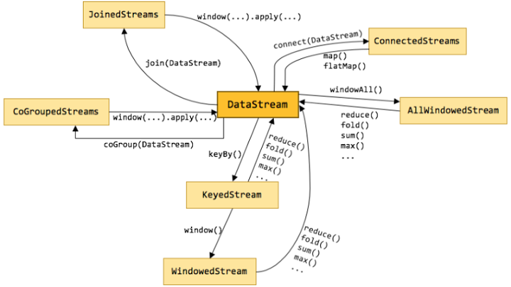


> ​			`窗口（window）就是从 Streaming 到 Batch 的一个桥梁`。窗口将无界流（unbounded data stream）划分很多有界流（bounded stream），对无界流进行计算。

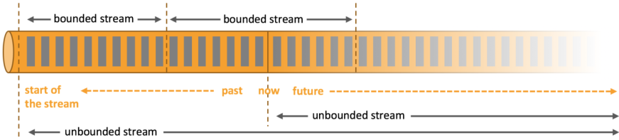


> ​		在实际业务需求中，往往说窗口，指的就是==基于时间Time窗口==，比如**最近1分钟内数据，指的就是1分钟时间内产生的数据，放在窗口中**。
>

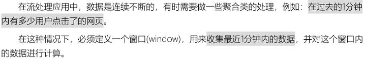


> Flink Window 窗口的结构中，有两个必须的两个操作：

- 第一、**窗口分配器（Window Assigner）**：将数据流中的元素分配到对应的窗口。
- 第二、**窗口函数（Window Function）**：当满足窗口触发条件后，对窗口内的数据使用窗口处理函数（Window Function）进行处理，常用的有**reduce、aggregate、process**。
- 其他的**trigger**、**evictor**则是窗口的触发和销毁过程中的附加选项，主要面向需要更多自定义的高级编程者，如果不设置则会使用默认的配置。


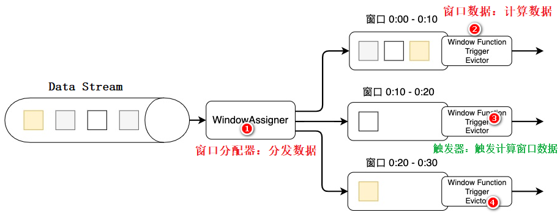


- 上图是**窗口的生命周期示意图**，假如设置的是**一个10分钟的滚动窗口**，第一个窗口的起始时间是0:00，结束时间是0:10，后面以此类推。
- **当数据流中的元素流入后，窗口分配器会根据时间（Event Time或Processing Time）分配给相应的窗口。相应窗口满足了触发条件，比如已经到了窗口的结束时间，会触发相应的Window Function进行计算**。


### 02-[理解]-Flink Window【Window 类型 】

---

 

> 在Flink计算引擎中，支持窗口类型有很多种，几乎所有Streaming流式计算引擎需要实现窗口都支持。

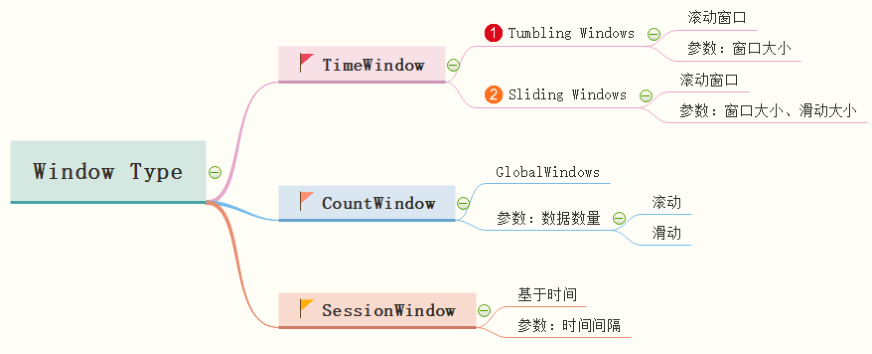


> - 1）、时间窗口`TimeWindow`
>   - 按照**时间间隔**划分出窗口，并对窗口中数据进行计，如每xx分钟统计，最近xx分钟的数据
>   - 划分为：**滚动（Tumbling）**窗口和**滑动（Sliding）**窗口
>
> - 2）、计数窗口`CountWindow`
>   - 按照`数据条目数`进行设置窗口，比如每10条数据统计一次
>   - 划分为：**滚动（Tumbling）**窗口和**滑动（Sliding）**窗口
>   - [此种方式窗口计算，在实际项目中使用不多，但是有些特殊业务需要，需要使用此场景。]()


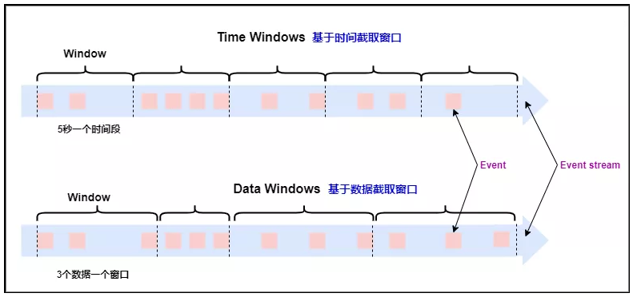


> - 3）、会话窗口`SessionWindow`
>   - 会话Session相关，表示多久没有来数据，比如5分钟都没有来数据，将前面的数据作为一个窗口
>   - session 窗口，**在一个固定的时间周期内不再收到元素，即非活动间隔产生，这个窗口就会关闭**。

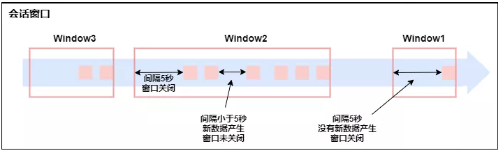

​			[一个session窗口通过一个session间隔gap来配置，这个session间隔定义了非活跃周期的长度，当这个非活跃周期产生，那么当前的session将关闭并且后续的元素将被分配到新的session窗口中去。]()


> 在Flink窗口计算中，无论时间窗口还是计数窗口，都可以分为2种类型：`滚动Tumbling和滑动Sliding窗口`

​											[窗口有两个重要的属性: 窗口`大小size`和滑动`间隔slide`]()

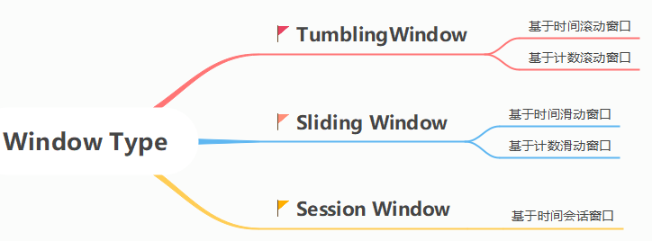


> - ==1）、滚动窗口（Tumbling Window），又叫做翻滚窗口==
>   - 条件：**窗口大小size  =   滑动间隔 slide**

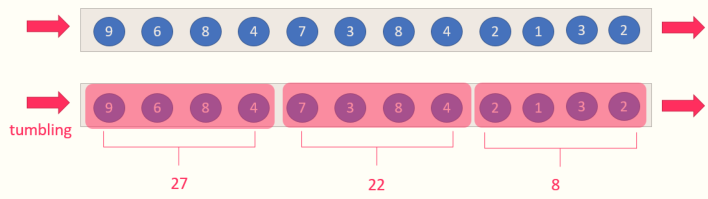


> - ==2）、滑动窗口（Sliding Window）==
>   - 条件：**窗口大小 != 滑动间隔**，通常条件【`窗口大小size > 滑动间隔slide`】

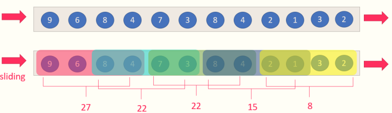


> 上面图中展示：以计数窗口CountWindow讲解滚动窗口和滑动窗口，下图为以时间窗口为例讲解：

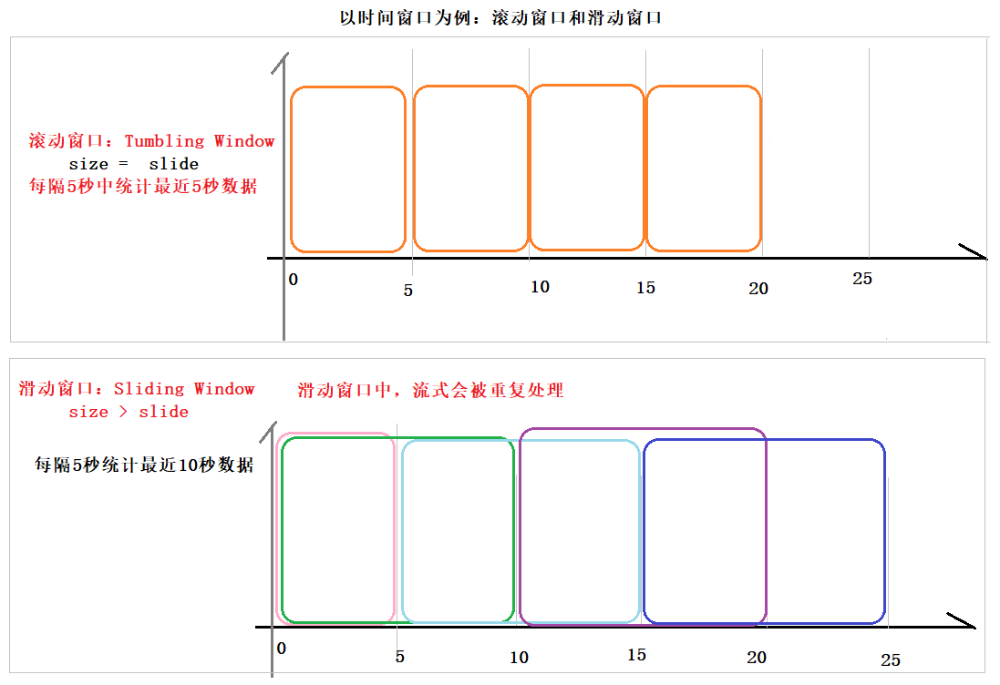


### 03-[掌握]-Flink Window【Window API】

---


> 在Flink流计算中，提供Window窗口API分为2种：

https://nightlies.apache.org/flink/flink-docs-release-1.13/docs/dev/datastream/operators/windows/

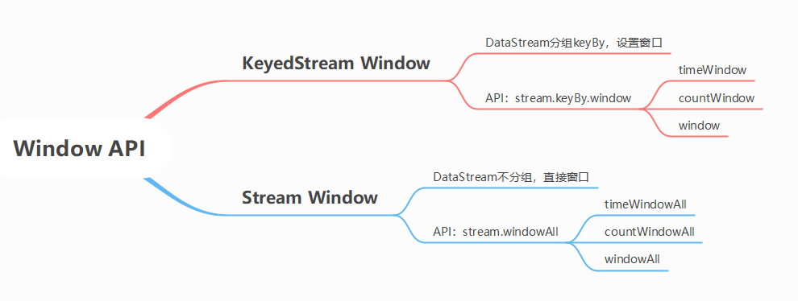


> 1）、针对`KeyedStream`窗口API：`window`
>
>     [先对数据流DataStream进行分组`keyBy`，再设置窗口`window`，最后进行聚合`apply`操作。]()

- 第一步、数据流DataStream调用`keyBy`函数分组，获取`KeyedStream`
- 第二步、`KeyedStream.window`设置窗口
- 第三步、聚合操作，对窗口中数据进行聚合统计，函数：reduce、aggregate、`apply()` 等

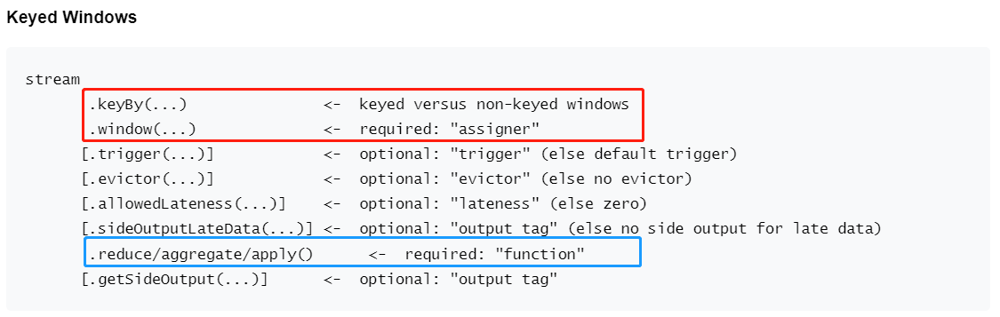


> [Flink DataStream流计算程序伪代码如下：]()

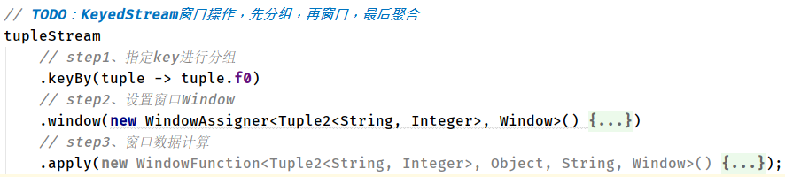


> ​		从数据类型上来看，1个`DataStream`经过**keyBy**转换成`KeyedStream`，再经过**window**转换成`WindowedStream`，要在之上进行**reduce、aggregate**等Window Function，对数据进行必要的聚合操作。

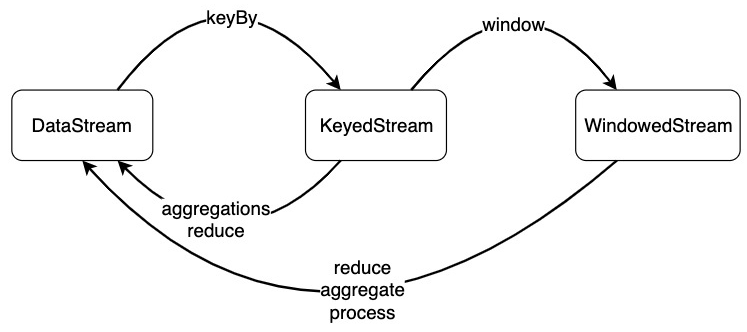


> 2）、非KeyedStream窗口API：`windowAll`

- 直接调用窗口函数：`windowAll`，然后再对窗口所有数据进行处理，未进行分组
- 聚合操作，对窗口中数据进行聚合统计，函数：reduce、aggregate、`apply()` 等

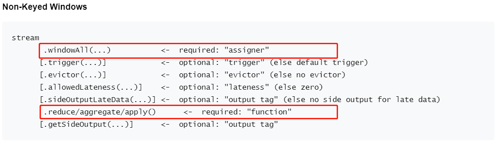


> [Flink DataStream流计算程序伪代码如下：]()

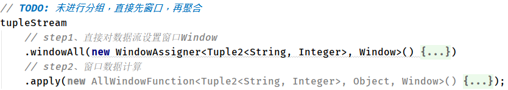


> [在实际项目，Flink流计算中如果对DataStream流进行窗口计算时，通常使用`apply`函数对窗口数据计算]()

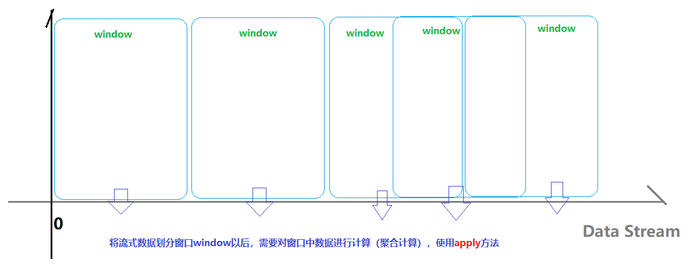


> ​		当对DataStream数据流划分窗口window以后，获取到数据流：`WindowedStream`，其中`apply`方法，传递`WindowFunction`函数处理实体类，**定义如何对窗口数据处理**。

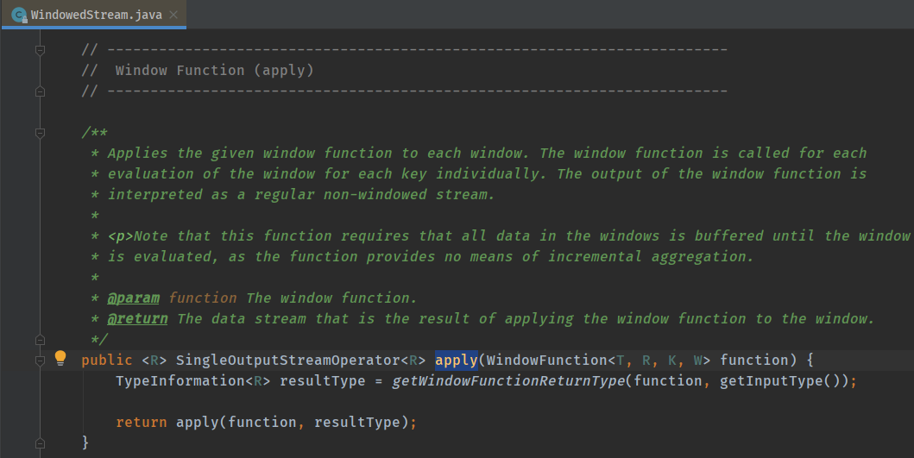


> `WindowedStream`数据流中`apply`方法，需要传递1个`WindowFunction`实例，处理数据，泛型参数说明：

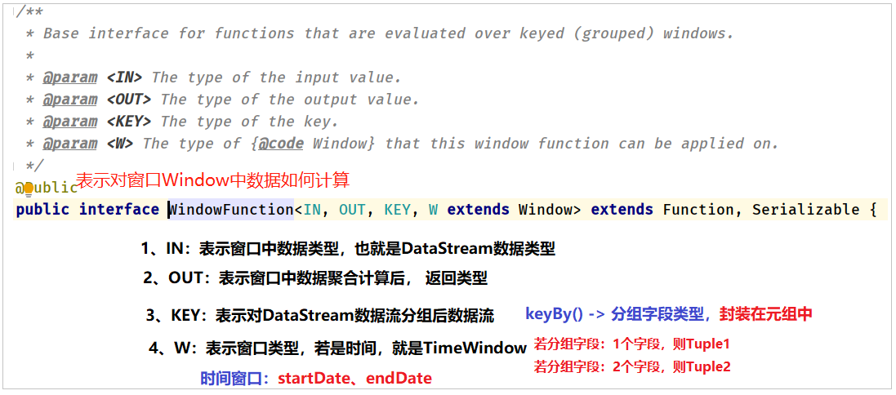


> 在`WindowFunction`窗口接口中，有个1个`apply`方法，如果是时间窗口计算，`apply`方法参数解释：

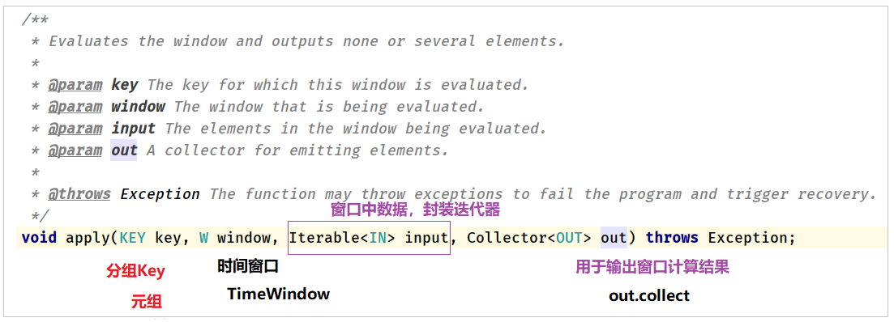


### 04-[掌握]-Flink Window【时间窗口案例】

---


> 基于**时间的滚动**窗口：`size大小 = slide 大小`
>
> - 滚动窗口能将数据流切分成**不重叠的窗口**，每一个事件只能属于一个窗口
> - 滚动窗口具有固定的尺寸，不重叠。

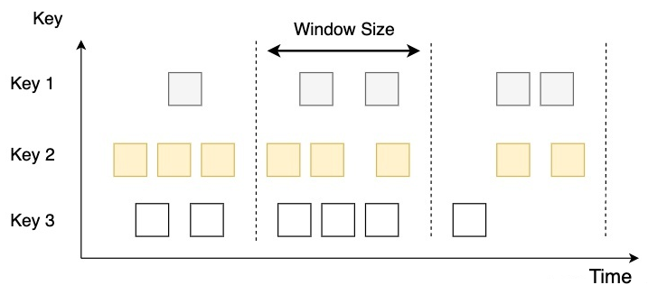


> ​		**滚动时间窗口**案例：==每隔一段时间实时统计各个信号灯的车流量，==[智慧城市智能交通各个卡（qia）口实时流量监测]()

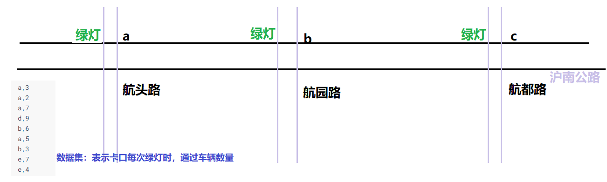

模拟卡口业务数据：

```ini
a,3
a,2
a,7
d,9
b,6
a,5
b,3
e,7
e,4
```

​												使用netcat工具，发送数据：`nc -lk 9999`

> [需求：每5秒钟统计一次，最近5秒钟内，各个路口通过红绿灯汽车的数量]()

```java
package cn.itcast.flink.window.time;

import org.apache.commons.lang3.time.FastDateFormat;
import org.apache.flink.api.common.functions.MapFunction;
import org.apache.flink.api.java.tuple.Tuple2;
import org.apache.flink.streaming.api.datastream.DataStream;
import org.apache.flink.streaming.api.environment.StreamExecutionEnvironment;
import org.apache.flink.streaming.api.functions.windowing.WindowFunction;
import org.apache.flink.streaming.api.windowing.assigners.TumblingProcessingTimeWindows;
import org.apache.flink.streaming.api.windowing.time.Time;
import org.apache.flink.streaming.api.windowing.windows.TimeWindow;
import org.apache.flink.util.Collector;

/**
 * 滚动时间窗口案例：实时交通卡口流量统计，每隔5秒钟统计最近5秒钟各个卡口车流量
 * @author xuyuan
 */
public class TumblingTimeWindowDemo {

    public static void main(String[] args) throws Exception {
        // 1. 执行环境-env
        StreamExecutionEnvironment env = StreamExecutionEnvironment
            .getExecutionEnvironment();
        env.setParallelism(1);

        // 2. 数据源-source
        DataStream<String> inputStream = env.socketTextStream("node1.itcast.cn", 9999);

/*
a,3
a,2
a,7
d,9
b,6
a,5
b,3
e,7
e,4
 */

        // 3. 数据转换-transformation
        // 3-1. 对数据进行转换处理：过滤脏数据，解析数据封装到二元组
        DataStream<Tuple2<String, Integer>> mapStream = inputStream
                .filter(line -> line.trim().split(",").length == 2)
                .map(new MapFunction<String, Tuple2<String, Integer>>() {
                    @Override
                    public Tuple2<String, Integer> map(String value) throws Exception {
                        System.out.println("item: " + value);

                        String[] array = value.trim().split(",");
                        return Tuple2.of(array[0], Integer.parseInt(array[1]));
                    }
                });

        // todo 3-2. 窗口计算， 每隔5秒统计最近5秒中各个卡口车流量
        DataStream<String> windowStream = mapStream
                // a. 设置分组key，按照卡口分组
                .keyBy(tuple -> tuple.f0)
                // b. 设置窗口：滚动时间窗口 size = slide -> 5秒
                .window(
                        TumblingProcessingTimeWindows.of(Time.seconds(5))
                )
                // c. 窗口计算，定义窗口函数
                .apply(
            new WindowFunction<Tuple2<String, Integer>, String, String, TimeWindow>() {
                    // 对日期时间数据格式化
                    private FastDateFormat format = FastDateFormat
                        .getInstance("yyyy-MM-dd HH:mm:ss");

                    @Override
                    public void apply(String key,  // 分组key，此处卡口编号
                                      // 窗口类型，此处为时间窗口，可以获取窗口开始时间和结束时间
                                      TimeWindow window,  
                                      // 窗口中所有数据，放在迭代器中
                                      Iterable<Tuple2<String, Integer>> input,  
                                      Collector<String> out) throws Exception {
                        // 获取窗口时间信息：开始时间和结束时间
                        String winStart = this.format.format(window.getStart());
                        String winEnd = this.format.format(window.getEnd());

                        // 对窗口中数据进行统计：求和
                        int sum = 0;
                        for (Tuple2<String, Integer> item : input) {
                            sum += item.f1;
                        }

                        // 输出结果数据
                        String output = "window: [" + winStart + " ~ " 
                            + winEnd + "], " + key + " = " + sum;
                        out.collect(output);
                    }
                });

        // 4. 数据终端-sink
        windowStream.printToErr();

        // 5. 触发执行-execute
        env.execute("TumblingTimeWindowDemo");
    }

}  
```


> 基于**时间的滑动**窗口案例：==每5秒钟统计一次，最近10秒钟内，各个路口通过红绿灯汽车的数量==
>
> ​																			`窗口：size = 10秒，slide = 5秒`

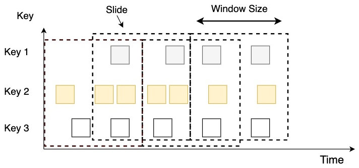


```java
package cn.itcast.flink.window.time;

import org.apache.commons.lang3.time.FastDateFormat;
import org.apache.flink.api.common.functions.MapFunction;
import org.apache.flink.api.java.tuple.Tuple2;
import org.apache.flink.streaming.api.datastream.DataStream;
import org.apache.flink.streaming.api.environment.StreamExecutionEnvironment;
import org.apache.flink.streaming.api.functions.windowing.WindowFunction;
import org.apache.flink.streaming.api.windowing.assigners.SlidingProcessingTimeWindows;
import org.apache.flink.streaming.api.windowing.time.Time;
import org.apache.flink.streaming.api.windowing.windows.TimeWindow;
import org.apache.flink.util.Collector;

/**
 * 滑动时间窗口案例：实时交通卡口流量统计，每隔5秒统计最近10秒中各个卡口车流量
 * @author xuyuan
 */
public class SlidingTimeWindowDemo {

    public static void main(String[] args) throws Exception {
        // 1. 执行环境-env
        StreamExecutionEnvironment env = StreamExecutionEnvironment
            .getExecutionEnvironment();
        env.setParallelism(1);

        // 2. 数据源-source
        DataStream<String> inputStream = env.socketTextStream("node1.itcast.cn", 9999);

/*
a,3
a,2
a,7
d,9
b,6
a,5
b,3
e,7
e,4
 */

        // 3. 数据转换-transformation
        // 3-1. 对数据进行转换处理：过滤脏数据，解析数据封装到二元组
        DataStream<Tuple2<String, Integer>> mapStream = inputStream
                .filter(line -> line.trim().split(",").length == 2)
                .map(new MapFunction<String, Tuple2<String, Integer>>() {
                    @Override
                    public Tuple2<String, Integer> map(String value) throws Exception {
                        System.out.println("item: " + value);

                        String[] array = value.trim().split(",");
                        return Tuple2.of(array[0], Integer.parseInt(array[1]));
                    }
                });

        // todo 3-2. 窗口计算， 每隔5秒统计最近10秒中各个卡口车流量
        DataStream<String> windowStream = mapStream
                // a. 设置分组key，按照卡口分组
                .keyBy(tuple -> tuple.f0)
                // b. 设置窗口：滚动时间窗口 size = 10s , slide = 5s
                .window(
                        SlidingProcessingTimeWindows.of(Time.seconds(10), Time.seconds(5))
                )
                // c. 窗口计算，定义窗口函数
                .apply(
            new WindowFunction<Tuple2<String, Integer>, String, String, TimeWindow>() {
                    // 对日期时间数据格式化
                    private FastDateFormat format = FastDateFormat
                        .getInstance("yyyy-MM-dd HH:mm:ss");

                    @Override
                    public void apply(String key, 
                                      TimeWindow window,
                                      Iterable<Tuple2<String, Integer>> input,  
                                      Collector<String> out) throws Exception {
                        // 获取窗口时间信息：开始时间和结束时间
                        String winStart = this.format.format(window.getStart());
                        String winEnd = this.format.format(window.getEnd());

                        // 对窗口中数据进行统计：求和
                        int sum = 0;
                        for (Tuple2<String, Integer> item : input) {
                            sum += item.f1;
                        }

                        // 输出结果数据
                        String output = "window: [" + winStart + " ~ " 
                            + winEnd + "], " + key + " = " + sum;
                        out.collect(output);
                    }
                });

        // 4. 数据终端-sink
        windowStream.printToErr();

        // 5. 触发执行-execute
        env.execute("SlidingTimeWindowDemo");
    }

}  
```


### 05-[理解]-Flink Window【计数窗口案例】

---


> Flink 流计算支持**计数窗口CountWindow**，如下案例：[每2个元素计算1次最近4个元素的总和]()

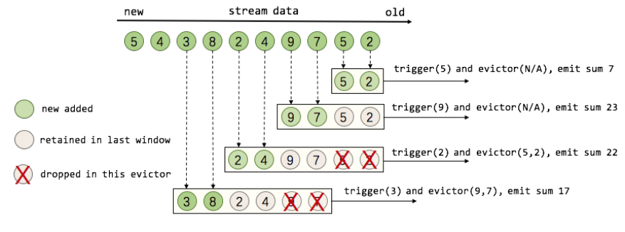


> **滚动计数窗口**案例：**每5个消息，统计一次最近5条消息中，数字之和sum值**

- 模拟数据

```ini
1
1
1
2
3
4
5
6
4
3
```

- Flink Stream流计算代码


```Java
package cn.itcast.flink.window.count;

import org.apache.flink.api.common.functions.MapFunction;
import org.apache.flink.streaming.api.datastream.DataStream;
import org.apache.flink.streaming.api.environment.StreamExecutionEnvironment;
import org.apache.flink.streaming.api.functions.windowing.AllWindowFunction;
import org.apache.flink.streaming.api.windowing.windows.GlobalWindow;
import org.apache.flink.util.Collector;

/**
 * 案例演示：滑动计数窗口，按照条目数划分窗口，对窗口中数据计算
 * @author xuyuan
 */
public class TumblingCountWindowDemo {

    public static void main(String[] args) throws Exception {
        // 1. 执行环境-env
        StreamExecutionEnvironment env = StreamExecutionEnvironment
            .getExecutionEnvironment();
        env.setParallelism(1);

        // 2. 数据源-source
        DataStream<String> inputStream = env.socketTextStream("node1.itcast.cn", 9999);
/*
1
1
1
2
3
4
5
6
4
3
 */

        // 3. 数据转换-transformation
        // 3-1. 过滤和转换数据
        DataStream<Integer> mapStream = inputStream
                .filter(line -> line.trim().length() > 0)
                .map(new MapFunction<String, Integer>() {
                    @Override
                    public Integer map(String value) throws Exception {
                        System.out.println("item : " + value);
                        return Integer.valueOf(value);
                    }
                });

        // 3-2. 直接对DataStream数据流设置窗口操作
        DataStream<String> windowStream = mapStream
                // a. 设置窗口，滚动计数窗口
                .countWindowAll(5)
                // b. 设置窗口函数，计算窗口中数据
                .apply(new AllWindowFunction<Integer, String, GlobalWindow>() {
                    @Override
                    public void apply(GlobalWindow window, Iterable<Integer> values, 
                                      Collector<String> out) throws Exception {
                        // 对窗口中数据进行求和
                        int sum = 0;
                        for (Integer value : values) {
                            sum += value;
                        }

                        // 输出累计求和值
                        String output = "sum = " + sum;
                        out.collect(output);
                    }
                });

        // 4. 数据终端-sink
        windowStream.printToErr();

        // 5. 触发执行-execute
        env.execute("TumblingCountWindowDemo");
    }

}  
```


> **滑动计数窗口**案例：**每隔2条数据，统计在最近5条消息中， 数字之和sum值**

```Java
package cn.itcast.flink.window.count;

import org.apache.flink.api.common.functions.MapFunction;
import org.apache.flink.streaming.api.datastream.DataStream;
import org.apache.flink.streaming.api.environment.StreamExecutionEnvironment;
import org.apache.flink.streaming.api.functions.windowing.AllWindowFunction;
import org.apache.flink.streaming.api.windowing.windows.GlobalWindow;
import org.apache.flink.util.Collector;

/**
 * 案例演示：滑动计数窗口，按照条目数划分窗口，对窗口中数据计算
 * @author xuyuan
 */
public class SlidingCountWindowDemo {

    public static void main(String[] args) throws Exception {
        // 1. 执行环境-env
        StreamExecutionEnvironment env = StreamExecutionEnvironment
            .getExecutionEnvironment();
        env.setParallelism(1);

        // 2. 数据源-source
        DataStream<String> inputStream = env.socketTextStream("node1.itcast.cn", 9999);
/*
1
1
1
2
3
4
5
6
4
3
 */

        // 3. 数据转换-transformation
        // 3-1. 过滤和转换数据
        DataStream<Integer> mapStream = inputStream
                .filter(line -> line.trim().length() > 0)
                .map(new MapFunction<String, Integer>() {
                    @Override
                    public Integer map(String value) throws Exception {
                        System.out.println("item : " + value);
                        return Integer.valueOf(value);
                    }
                });

        // 3-2. 直接对DataStream数据流设置窗口操作
        DataStream<String> windowStream = mapStream
                // a. 设置窗口，滑动计数窗口： size = 5, slide = 2
                .countWindowAll(5, 2)
                // b. 设置窗口函数，计算窗口中数据
                .apply(new AllWindowFunction<Integer, String, GlobalWindow>() {
                    @Override
                    public void apply(GlobalWindow window, Iterable<Integer> values,
                                      Collector<String> out) throws Exception {
                        // 对窗口中数据进行求和
                        int sum = 0;
                        for (Integer value : values) {
                            sum += value;
                        }

                        // 输出累计求和值
                        String output = "sum = " + sum;
                        out.collect(output);
                    }
                });

        // 4. 数据终端-sink
        windowStream.printToErr();

        // 5. 触发执行-execute
        env.execute("SlidingCountWindowDemo");
    }

}  
```

> ​			计数滑动窗口与时间滑动窗口，数据都会有一部分被重复计算，一个是依据**时间**划分窗口，一个是依据**数量**划分窗口。


### 06-[掌握]-Flink Window【会话窗口案例】

---


> Flink 流计算中支持：**会话窗口Session**，基于`时间`的，需要设置`超时时间间隔gap`
>
> - 会话窗口不重叠，没有固定的开始和结束时间
> - 与翻滚窗口和滑动窗口相反, ==当会话窗口在一段时间内没有接收到元素时会关闭会话窗口==，后续的元素将会被分配给新的会话窗口

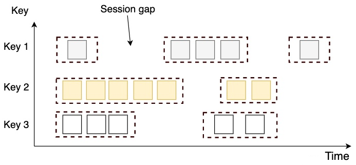


> 需求：`设置会话超时时间为5s，5s内没有数据到来，则触发上个窗口的计算`

```JAva
package cn.itcast.flink.window.session;

import org.apache.commons.lang3.time.FastDateFormat;
import org.apache.flink.api.common.functions.MapFunction;
import org.apache.flink.streaming.api.datastream.DataStream;
import org.apache.flink.streaming.api.environment.StreamExecutionEnvironment;
import org.apache.flink.streaming.api.functions.windowing.AllWindowFunction;
import org.apache.flink.streaming.api.windowing.assigners.ProcessingTimeSessionWindows;
import org.apache.flink.streaming.api.windowing.time.Time;
import org.apache.flink.streaming.api.windowing.windows.TimeWindow;
import org.apache.flink.util.Collector;

/**
 * 案例演示：时间会话窗口，设置超时时间间隔为5秒，某条数据来了以后，后续超过5秒没有数据到达，将前面数据当做一个窗口
 * @author xuyuan
 */
public class TimeSessionWindowDemo {

    public static void main(String[] args) throws Exception {
        // 1. 执行环境-env
        StreamExecutionEnvironment env = StreamExecutionEnvironment
            .getExecutionEnvironment();
        env.setParallelism(1);

        // 2. 数据源-source
        DataStream<String> inputStream = env.socketTextStream("node1.itcast.cn", 9999);
/*
1
1
1
2
3
4
5
6
4
3
 */

        // 3. 数据转换-transformation
        // 3-1. 过滤和转换数据
        DataStream<Integer> mapStream = inputStream
                .filter(line -> line.trim().length() > 0)
                .map(new MapFunction<String, Integer>() {
                    @Override
                    public Integer map(String value) throws Exception {
                        System.out.println("item : " + value);
                        return Integer.valueOf(value);
                    }
                });

        // 3-2. 直接对DataStream数据流设置窗口操作
        DataStream<String> windowStream = mapStream
                // a. 设置窗口，滚动计数窗口
                .windowAll(
                        ProcessingTimeSessionWindows.withGap(Time.seconds(5))
                )
                // b. 设置窗口函数，计算窗口中数据
                .apply(new AllWindowFunction<Integer, String, TimeWindow>() {
                    private FastDateFormat format = FastDateFormat
                        .getInstance("yyyy-MM-dd HH:mm:ss");

                    @Override
                    public void apply(TimeWindow window, 
                                      Iterable<Integer> values, 
                                      Collector<String> out) throws Exception {
                        // 获取窗口时间信息：开始时间和结束时间
                        String winStart = this.format.format(window.getStart());
                        String winEnd = this.format.format(window.getEnd());

                        // 对窗口中数据进行求和
                        int sum = 0;
                        for (Integer value : values) {
                            sum += value;
                        }

                        // 输出累计求和值
                        String output = "window: [" + winStart + " ~ " 
                            + winEnd + "], " + "sum = " + sum;
                        out.collect(output);
                    }
                });

        // 4. 数据终端-sink
        windowStream.printToErr();

        // 5. 触发执行-execute
        env.execute("TimeSessionWindowDemo");
    }

}  
```


## 第二部分：Flink Time 时间【4个小节】


### 07-[掌握]-Flink Time【Time 时间语义】

---


> 在Flink 流式处理中，会涉及到时间的不同概念，如下图所示：

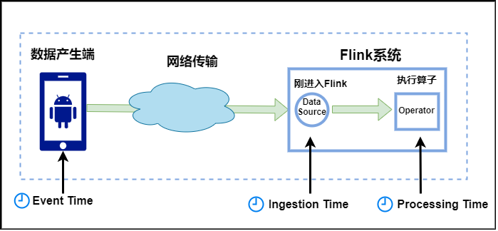

​		         	[事件时间EventTime（不变） <    摄入时间IngstionTime   <   处理数据ProcessingTime]()

> - 1）、事件时间`EventTime`
>   - 事件真真正正发生产生的时间，比如订单数据中订单时间表示订单产生的时间
>
>
>   - 2）、摄入时间`IngestionTime`
>
>     - 数据被流式程序获取的时间
> - 3）、处理时间`ProcessingTime`
>
>   - 事件真正被处理/计算的时间
>


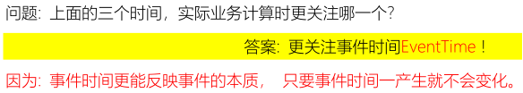


​				[通过几个示例，感受对数据处理时，需要使用基于**事件时间EventTime**进行分析，更加合理化。]()

> 1）、==示例一：外卖订单处理==

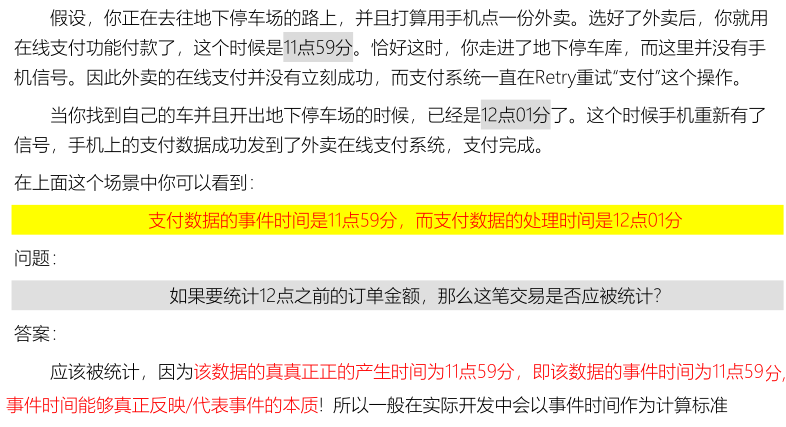


> - 2）、==示例二：错误日志时段统计==

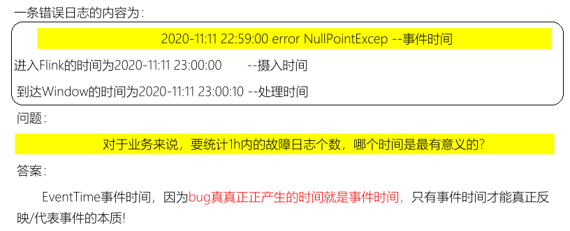


> - 3）、==示例三：用户抢单网络延迟==

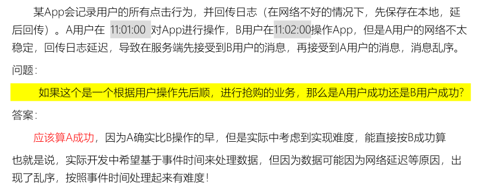


> 所以在实际项目中，Flink流计算中窗口计算，往往就是 [基于事件时间EventTime Window窗口分析。]()

​					[所以Flink 1.11版本开始，基于时间time窗口Window分析，默认时间语义：EventTime事件时间。]()

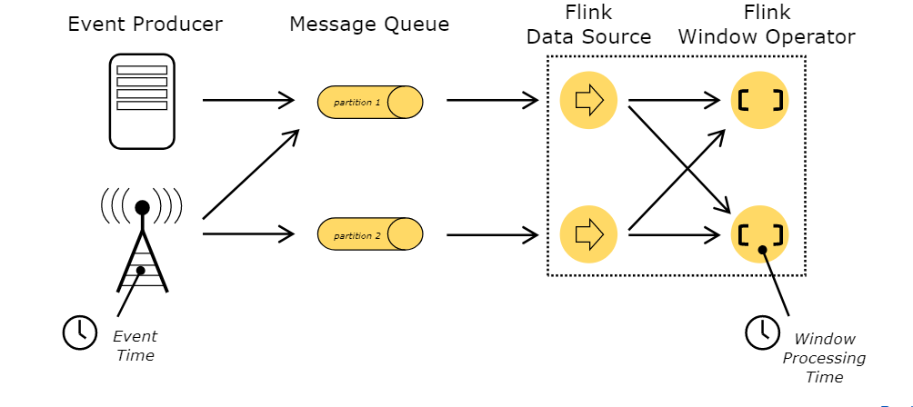


### 08-[掌握]-Flink Time【事件时间案例编程】

---


[基于事件时间EventTime窗口分析时，要求数据字段中，必须包含事件时间字段，代表数据产生时间。]()

> 需求：==基于事件时间EventTime Window窗口【5秒】，进行聚合统计（类似WordCount）。==

```ini
2022-04-01 09:00:01,a,1
2022-04-01 09:00:02,a,1
2022-04-01 09:00:05,a,1

2022-04-01 09:00:10,a,1

2022-04-01 09:00:11,a,1
2022-04-01 09:00:14,b,1
2022-04-01 09:00:15,b,1
```


> ​				[基于事件时间EventTime窗口分析，指定事件时间字段，使用 `assignTimestampsAndWatermarks`方法，类型必须为Long类型。]()

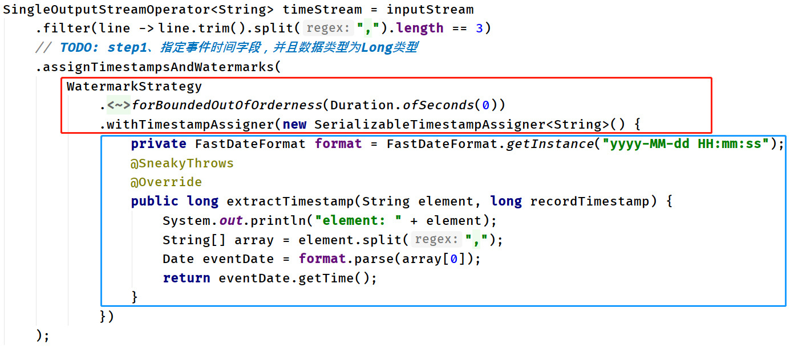


> 完整案例代码如下：

```java
package cn.itcast.flink.time;

import lombok.SneakyThrows;
import org.apache.commons.lang3.time.FastDateFormat;
import org.apache.flink.api.common.eventtime.SerializableTimestampAssigner;
import org.apache.flink.api.common.eventtime.WatermarkStrategy;
import org.apache.flink.api.common.functions.MapFunction;
import org.apache.flink.api.java.tuple.Tuple2;
import org.apache.flink.streaming.api.datastream.DataStream;
import org.apache.flink.streaming.api.environment.StreamExecutionEnvironment;
import org.apache.flink.streaming.api.functions.windowing.WindowFunction;
import org.apache.flink.streaming.api.windowing.assigners.TumblingEventTimeWindows;
import org.apache.flink.streaming.api.windowing.time.Time;
import org.apache.flink.streaming.api.windowing.windows.TimeWindow;
import org.apache.flink.util.Collector;

import java.time.Duration;
import java.util.Date;

/**
 * 滚动事件时间窗口案例：每隔5秒统计各个卡口流量
 * @author xuyuan
 */
public class EventTimeWindowDemo {

	public static void main(String[] args) throws Exception {
		// 1. 执行环境-env
		StreamExecutionEnvironment env = StreamExecutionEnvironment.getExecutionEnvironment();
		env.setParallelism(1) ;

		// 2. 数据源-source
		DataStream<String> inputStream = env.socketTextStream("node1.itcast.cn", 9999);

		// 3. 数据转换-transformation
/*
2022-04-01 09:00:01,a,1
2022-04-01 09:00:02,a,1
2022-04-01 09:00:05,a,1

2022-04-01 09:00:10,a,1

2022-04-01 09:00:11,a,1
2022-04-01 09:00:14,b,1
2022-04-01 09:00:15,b,1
 */
		// 3-1. 过滤脏数据，并且指定事件时间字段值
		DataStream<String> timeStream = inputStream
			.filter(line -> line.trim().split(",").length == 3)
			// todo step1. 指定事件时间字段，并且值Long类型
			.assignTimestampsAndWatermarks(
				WatermarkStrategy
					// 暂不考虑数据乱序与延迟
					.<String>forBoundedOutOfOrderness(Duration.ofSeconds(0))
					// 提取数据中事件时间字段值
					.withTimestampAssigner(
						new SerializableTimestampAssigner<String>() {
							private FastDateFormat format = FastDateFormat
                                .getInstance("yyyy-MM-dd HH:mm:ss");

							// 参数element表示流中每条数据
							@SneakyThrows
							@Override
							public long extractTimestamp(String element, 
                                                         long recordTimestamp) {
								// element -> 2022-04-01 09:00:01,a,1
								System.out.println("element -> " + element);
								// 分割字符串
								String[] array = element.split(",");
								// 获取事件时间
								String eventTime = array[0];
								// 转换格式
								Date eventDate = format.parse(eventTime);
								// 转换Long类型并且返回
								return eventDate.getTime();
							}
						}
					)
			);

		// 3-2. 设置事假时间滚动窗口
		DataStream<String> windowStream = timeStream
			// 解析数据，提取卡口名称和流量数据，封装到二元组中
			.map(new MapFunction<String, Tuple2<String, Integer>>() {
				@Override
				public Tuple2<String, Integer> map(String value) throws Exception {
					// element -> 2022-04-01 09:00:01,a,1
					// 分割字符串
					String[] array = value.split(",");
					return Tuple2.of(array[1], Integer.parseInt(array[2]));
				}
			})
			// a. 指定卡口编号为分组字段
			.keyBy(tuple -> tuple.f0)
			// todo step2. 设置窗口：事件时间窗口，并且是滚动窗口
			.window(TumblingEventTimeWindows.of(Time.seconds(5)))
			// c. 窗口函数，对窗口中数据进行计算
			.apply(
            new WindowFunction<Tuple2<String, Integer>, String, String, TimeWindow>() {
				// 对日期时间数据格式化
				private FastDateFormat format = FastDateFormat
                    .getInstance("yyyy-MM-dd HH:mm:ss");

				@Override
				public void apply(String key,  
				                  TimeWindow window,  
				                  Iterable<Tuple2<String, Integer>> input,  
				                  Collector<String> out) throws Exception {
					// 获取窗口时间信息：开始时间和结束时间
					String winStart = this.format.format(window.getStart());
					String winEnd = this.format.format(window.getEnd());

					// 对窗口中数据进行统计：求和
					int sum = 0;
					for (Tuple2<String, Integer> item : input) {
						sum += item.f1;
					}

					// 输出结果数据
					String output = "window: [" + winStart + " ~ " 
                        + winEnd + "], " + key + " = " + sum;
					out.collect(output);
				}
			});

		// 4. 数据终端-sink
		windowStream.printToErr();

		// 5. 触发执行-execute
		env.execute("EventTimeWindowDemo");
	}

}  
```


### 09-[掌握]-Flink Time【事件时间案例测试】

---


> 基于时间窗口TimeWindow来说，每个窗口都有【==开始时间start==】和【==结束时间end==】，属于左闭右开。

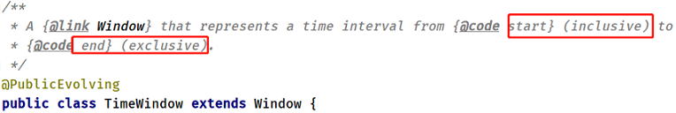


```ini
窗口：
	[2021-10-10 14:00:00    -    2021-10-10 14:10:00)
	左闭（包含）右开（不包含）
		windowStart: 包含，2021-10-10 14:00:00
		windowEnd：不包含，2021-10-10 14:10:00
	
数据：
	2021-10-10 14:00:00,user1001,11
	2021-10-10 14:04:00,user1002,22
	2021-10-10 14:05:00,user1001,55
	2021-10-10 14:10:00,user1001,66
```


> [当基于事件时间Time窗口分析时，窗口数据什么时候进行触发计算呢？？？？？]()

​			`默认情况下（不考虑乱序和延迟），当数据事件时间EventTime >= 窗口结束时间，触发窗口数据计算。`

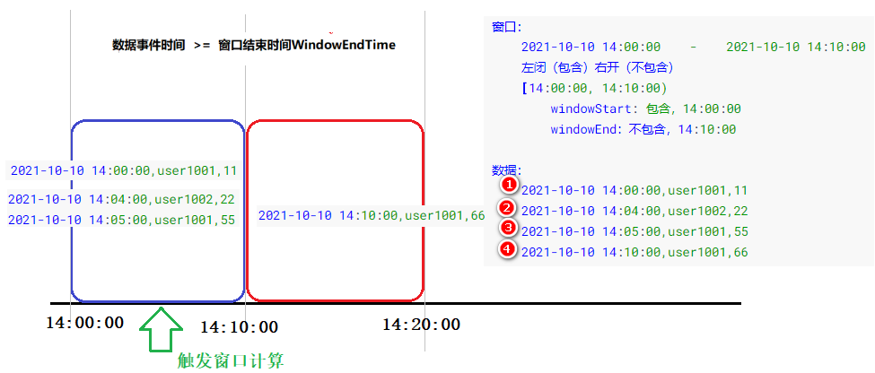


> 运行Flink流式计算程序，在CRT命令，通过`nc -lk 9999` 输入如下数据：

```ini
2022-04-01 09:00:01,a,1
2022-04-01 09:00:02,a,1
2022-04-01 09:00:05,a,1

2022-04-01 09:00:04,a,1

2022-04-01 09:00:06,a,1
2022-04-01 09:00:07,b,1

2022-04-01 09:00:10,b,1
2022-04-01 09:00:12,b,1
```

> 运行结构显示如下所示：

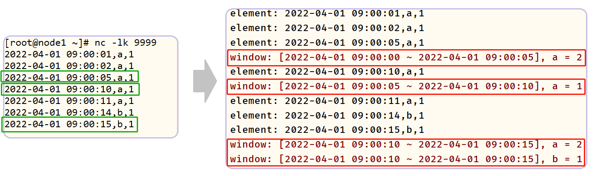


> ​			基于事件时间EventTime窗口分析，如果不考虑数据延迟乱序，当窗口被触发计算以后，延迟乱序到达的数据将不会被计算，而是直接丢弃。

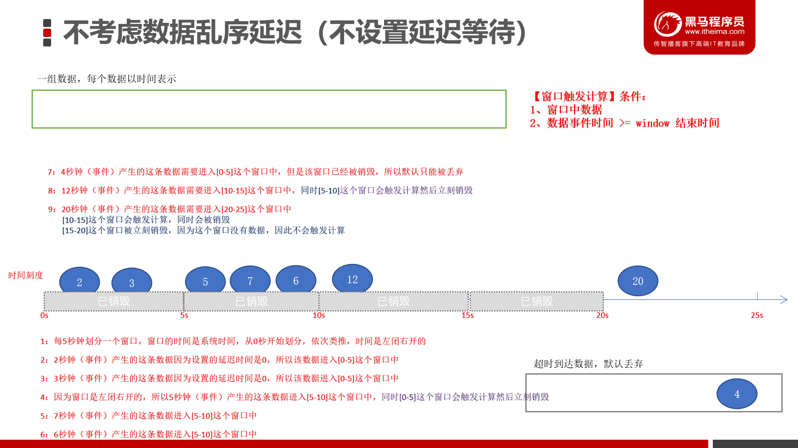


### 10-[了解]-Flink Time【EventTime窗口起始时间】

---


> 基于事件时间EventTime窗口分析时，==第一个窗口的起始时间==是如何确定的呢？？

```ini
第一条数据：2022-04-01 09:00:01,a,1
				|
			   计算
				|
第一个窗口起始时间：2022-04-01 09:00:00
```


> [第一个窗口起始时间，依据**==第一条数据的事件时间==**计算得到的。]()

1. 首先依据第一条数据的事件时间计算第一个窗口开始时间；
2. 再依据窗口大小，计算出第一个窗口时间范围；
3. 最后，根据窗口大小与滑动大小进行计算第二个窗口，第三个窗口，以此类推下一个窗口时间范围；


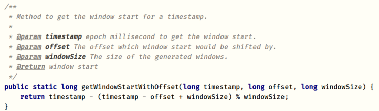


> 假设第一条数据：`2022-04-01 09:00:01,a,1`，那么计算第一个窗口起始时间:`2022-04-01 09:00:00`

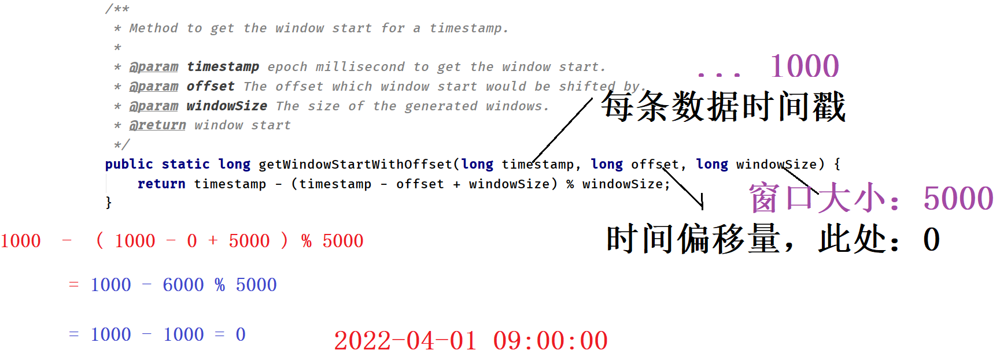


## 第三部分：乱序延迟数据处理【3个小节】


```

```


### 11-[理解]-乱序数据处理【Watermark 水印机制】

---


> ​		基于==事件时间EventTime窗口==分析，默认情况下，如果某个窗口触发计算以后，再来一条窗口内的数据（此条数据乱序延迟达到），此时不会计算这条数据，而是直接丢弃。

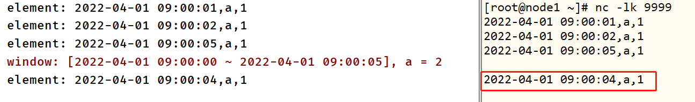


> ​			流处理从事件产生，到流经 source，再到 operator，中间是有一个过程和时间的，虽然大部分情况下，流到 operator 的数据都是按照事件产生的时间顺序来的，但是也不排除**由于网络、背压等原因**，导致乱序的产生，==所谓乱序，就是指 Flink 接收到的事件的先后顺序不是严格按照事件的 Event Time 顺序排列的==，所以 Flink 最初设计时，就考虑到网络延迟，网络乱序等问题，所以提出1个抽象概念：`水印（WaterMark）`；
>

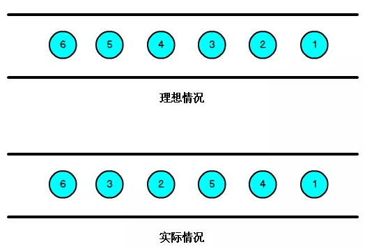


> ​			在实际业务数据中，数据乱序到达流处理程序，属于正常现象，原因在于**网络延迟导致数据延迟，无法避免的**，所以应该可以[允许数据乱序达到（在某个时间范围内），依然参与窗口计算]()。

​				比如允许数据最大乱序延迟时间为2秒，那么此时只要符合时间范围乱序数据都会处理，此种机制：**Watermark水印机制**。[水印机制Watermark：允许数据乱序到达，在对应窗口中进行计算（延迟时间很短）]()


> 案例演示：修改上面代码，**设置最大允许乱序时间为2秒，运行程序测试**。

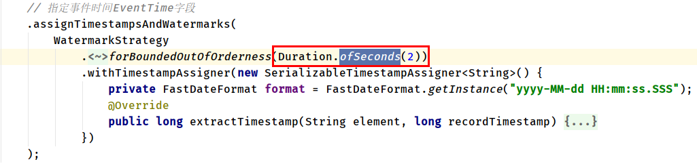

> 运行结果分析

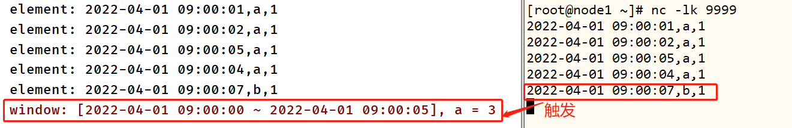


> - 1）、Watermark水位线定义：

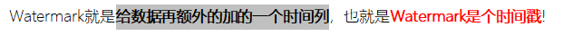


> 查看`Watermark`源码，可以看到其中有一个属性：**timestamp时间戳**

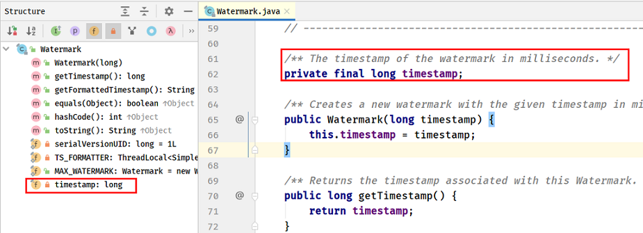


> - 2）、Watermark如何计算：


[针对窗口计算时，Watermark值计算，参考整个窗口中数据计算]()

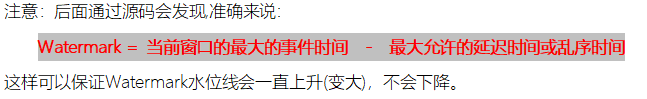


> - 3）、Watermark 有什么用？

​														[Watermark是用来触发窗口计算的！]()


> - 4）、Watermark 如何触发窗口计算

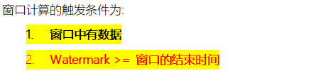


> 当设置水位Watermark以后，窗口触发计算和乱序数据达到处理流程

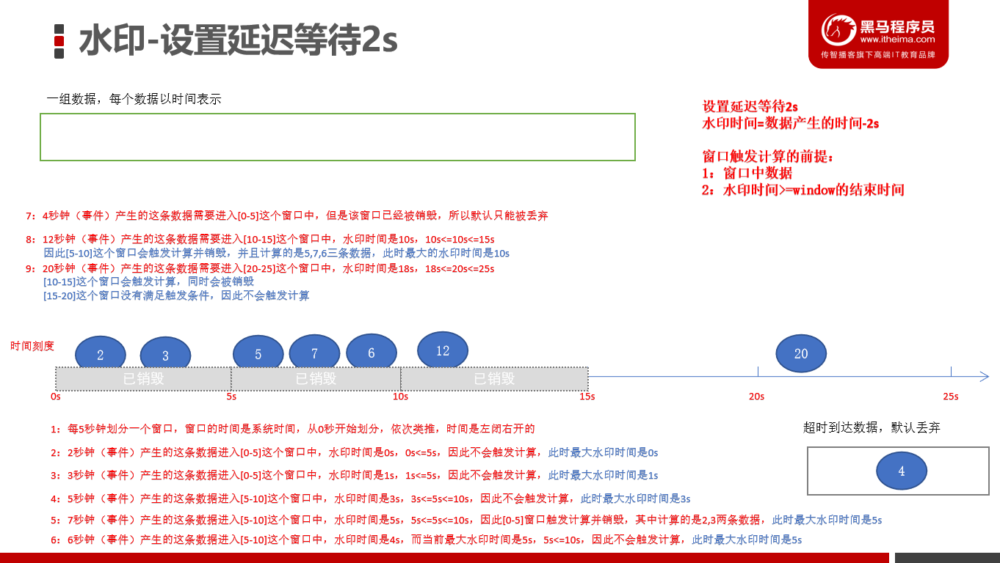


> ​		基于事件时间窗口统计，往往存在数据乱序达到（由于网络延迟原因），所以设置watermark水印机制，允许数据短时间内乱序达到，依然进行处理数据。


### 12-[理解]-延迟数据处理【Allowed Lateness 允许延迟】

---


> ​		[默认情况下，当watermark超过end-of-window之后，再有之前的数据到达时，这些数据会被删除。]()为了避免有些迟到的数据被删除，因此产生了**allowedLateness**的概念。
>

- 简单来讲，allowedLateness就是针对event time而言，对于watermark超过end-of-window之后，还[允许有一段时间（也是以event time来衡量）来等待之前的数据到达，以便再次处理这些数据]()。
- 默认情况下，如果不指定`allowedLateness`，其值是0，即对于watermark超过end-of-window之后，还有此window的数据到达时，这些数据被删除掉了。


> ​		`延迟数据`是指：在当前窗口【假设窗口范围为**10 - 15**】已经计算之后，又来了一个属于该窗口的数据【假设事件时间为13】，这时候仍`会触发window操作`，这种数据就称为延迟数据。
>
> ​		Allowed Lateness 机制允许用户**设置一个允许的最大迟到时⻓**。

- Flink 会在窗口关闭后一直保存窗口的状态直至超过允许迟到时⻓，这期间的迟到事件不会被丢弃，而是默认会触发窗口重新计算**。**
- **因为保存窗口状态需要额外内存**，并且如果窗口计算使用ProcessWindowFunction， API 还可能使得每个迟到事件触发一次窗口的全量计算，**代价比较大，所以允许迟到时⻓不宜设得太⻓，迟到事件也不宜过多**，否则应该考虑降低水位线提高的速度或者调整算法。


> 在window窗口方法后，再次调用【`allowedLateness`】方法，设置AllowedLateness延迟数据时长。

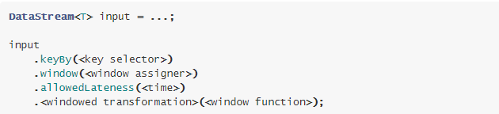


> 修改上述代码，设置允许最大延迟时间值，具体代码如下：

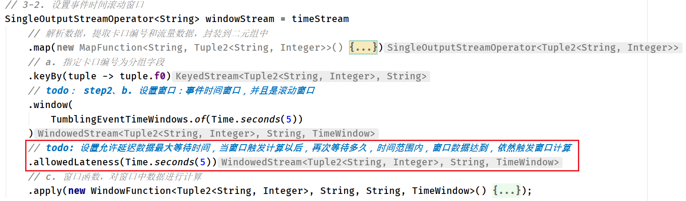


> [针对基于事件时间EventTime窗口分析，如何解决`乱序数据`和`延迟数据`的呢？？？]()

- **1）、乱序数据：Watermark**，[窗口数据计算等一下]()
  
  - 使用水位线Watermark，给每条数据加上一个时间戳
  - Watermark = 数据事件时间 - 最大允许乱序时间
  - 当数据的Watermark >= 窗口结束时间，并且窗口内有数据，触发窗口数据计算
  
  
  
- **2）、延迟数据：AllowedLateness**，[窗口计算状态保存一段时间]()
  
  - 设置方法参数：`allowedLateness`，表示允许延迟数据最多可以迟到多久，还可以进行计算（保存窗口，并且触发窗口计算）
  - [当某个窗口触发计算以后，继续等待多长时间，如果在等待时间范围内，有数据达到时，依然会触发窗口计算。如果到达等待时长以后，没有数据达到，销毁窗口数据信息。]()


### 13-[理解]-迟到数据处理【Side Output 侧边输出】

----


> ​			[基于事件时间窗口计算中，如果数据到达时，所在窗口已经触发计算并且销毁，此时可以将迟到数据放到侧边流输出中，单独保存，进行额外处理，解决数据丢失问题。]()

- 第1种情况：没有设置Watermark，窗口达到触发计算条件，直接计算数据输出并且销毁窗口。
  - 将后续乱序数据放到侧边流输出
- 第2种情况：设置Watermark后，窗口达到触发计算条件，计算数据并且输出和销毁窗口
  - 解决数据乱序问题，但是依然有窗口迟到数据，可以将其放到侧边流输出
- 第3种情况：设置watemark和allowedlateness后，窗口数据计算并且销毁
  - 解决乱序数据和迟到数据，但是仍然有迟到很久很久数据到达，也是可以将其放到侧边流输出


> ​	通过**侧边流Side OutputTag保存迟到数据**，然后进行单独处理，代码如下所示：

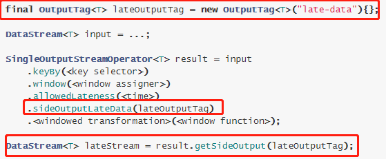


> ​			修改上述基于事件时间窗口统计分析代码，加上允许延迟数据：`5秒`，并且将延迟数据放到侧边流中，进行额外单独处理分析。

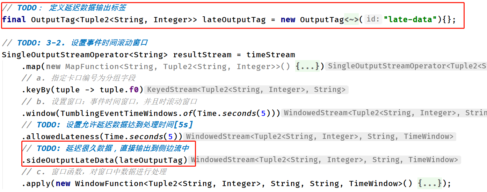


```JAva
package cn.itcast.flink.eventtime;

import lombok.SneakyThrows;
import org.apache.commons.lang3.time.FastDateFormat;
import org.apache.flink.api.common.eventtime.SerializableTimestampAssigner;
import org.apache.flink.api.common.eventtime.WatermarkStrategy;
import org.apache.flink.api.common.functions.MapFunction;
import org.apache.flink.api.java.tuple.Tuple2;
import org.apache.flink.streaming.api.datastream.DataStream;
import org.apache.flink.streaming.api.datastream.DataStreamSource;
import org.apache.flink.streaming.api.datastream.SingleOutputStreamOperator;
import org.apache.flink.streaming.api.environment.StreamExecutionEnvironment;
import org.apache.flink.streaming.api.functions.windowing.WindowFunction;
import org.apache.flink.streaming.api.windowing.assigners.TumblingEventTimeWindows;
import org.apache.flink.streaming.api.windowing.time.Time;
import org.apache.flink.streaming.api.windowing.windows.TimeWindow;
import org.apache.flink.util.Collector;
import org.apache.flink.util.OutputTag;

import java.time.Duration;
import java.util.Date;

/**
 * 滚动事件时间窗口案例：每隔5秒统计各个卡口流量
 */
public class EventTimeWindowSideOutputDemo {

	public static void main(String[] args) throws Exception {
		// 1. 执行环境-env
		StreamExecutionEnvironment env = StreamExecutionEnvironment.getExecutionEnvironment();
		env.setParallelism(1) ;

		// 2. 数据源-source
		DataStreamSource<String> inputStream = env.socketTextStream("node1.itcast.cn", 9999);

		// 3. 数据转换-transformation
/*
2022-04-01 09:00:01,a,1
2022-04-01 09:00:02,a,1
2022-04-01 09:00:05,a,1

2022-04-01 09:00:10,a,1

2022-04-01 09:00:11,a,1
2022-04-01 09:00:14,b,1
2022-04-01 09:00:15,b,1
 */
		// 3-1. 过滤脏数据和指定事件时间字段字段
		SingleOutputStreamOperator<String> timeStream = inputStream
			.filter(line -> line.trim().split(",").length == 3)
			// todo: step1、指定事件时间字段，并且数据类型为Long类型
			.assignTimestampsAndWatermarks(
				WatermarkStrategy
					// todo：考虑数据乱序，设置允许最大乱序时间：2秒
					.<String>forBoundedOutOfOrderness(Duration.ofSeconds(2))
					// 指定事件时间字段
					.withTimestampAssigner(
						new SerializableTimestampAssigner<String>() {
							private FastDateFormat format = FastDateFormat.getInstance("yyyy-MM-dd HH:mm:ss");

							@SneakyThrows
							@Override
							public long extractTimestamp(String element, long recordTimestamp) {
								// 2022-04-01 09:00:01,a,1 -> 2022-04-01 09:00:01 -> 1648774801000
								System.out.println("element -> " + element);
								// 分割字符串
								String[] array = element.split(",");
								// 获取事件时间
								String eventTime = array[0];
								// 转换格式
								Date eventDate = format.parse(eventTime);
								// 转换Long类型并返回
								return eventDate.getTime();
							}
						}
					)
			);

		// TODO: 定义迟到很久数据输出标签Tag
		final OutputTag<Tuple2<String, Integer>> lateOutputTag = new OutputTag<Tuple2<String, Integer>>("late-date"){} ;

		// 3-2. 设置事件时间滚动窗口
		SingleOutputStreamOperator<String> windowStream = timeStream
			// 解析数据，提取卡口编号和流量数据，封装到二元组中
			.map(new MapFunction<String, Tuple2<String, Integer>>() {
				@Override
				public Tuple2<String, Integer> map(String value) throws Exception {
					String[] array = value.split(",");
					Tuple2<String, Integer> tuple = Tuple2.of(array[1], Integer.parseInt(array[2]));
					// 返回处理结果数据
					return tuple;
				}
			})
			// a. 指定卡口编号为分组字段
			.keyBy(tuple -> tuple.f0)
			// todo： step2、b. 设置窗口：事件时间窗口，并且是滚动窗口
			.window(
				TumblingEventTimeWindows.of(Time.seconds(5))
			)
			// todo: 设置允许延迟数据最大等待时间，当窗口触发计算以后，再次等待多久，时间范围内，窗口数据达到，依然触发窗口计算
			.allowedLateness(Time.seconds(5))
			// todo: 设置迟到很久的数据，直接输出到侧边流中
			.sideOutputLateData(lateOutputTag)
			// c. 窗口函数，对窗口中数据进行计算
			.apply(new WindowFunction<Tuple2<String, Integer>, String, String, TimeWindow>() {
				// 定义变量，对日前时间数据进行转换
				private FastDateFormat format = FastDateFormat.getInstance("yyyy-MM-dd HH:mm:ss");

				@Override
				public void apply(String key, TimeWindow window,
				                  Iterable<Tuple2<String, Integer>> input,
				                  Collector<String> out) throws Exception {
					// 获取窗口时间信息：开始时间和结束时间
					String winStart = this.format.format(window.getStart());
					String winEnd = this.format.format(window.getEnd());

					// 对窗口中数据进行统计：求和
					int sum = 0;
					for (Tuple2<String, Integer> tuple : input) {
						sum += tuple.f1;
					}

					// 输出结果数据
					String output = "window: [" + winStart + " ~ " + winEnd + "], " + key + " = " + sum;
					out.collect(output);
				}
			});

		// 4. 数据终端-sink
		windowStream.printToErr() ;

		// todo: 获取侧边流，也就是延迟很久数据，进行单独处理
		DataStream<Tuple2<String, Integer>> lateStream = windowStream.getSideOutput(lateOutputTag);
		lateStream.print("late>");

		// 5. 触发执行-execute
		env.execute("EventTimeWindowSideOutputDemo");
	}

}  
```


> - 1、窗口window 的作用是**为了周期性的获取数据**
>- 2、watermark作用是**防止数据出现乱序(经常)**，事件时间内获取不到指定的全部数据，做的一种保险方法
> - 3、allowLateNess是**将窗口关闭时间再延迟一段时间**
> - 4、sideOutPut是最后兜底操作，**所有迟到数据，指定窗口已经彻底关闭，就会把数据放到侧输出流**

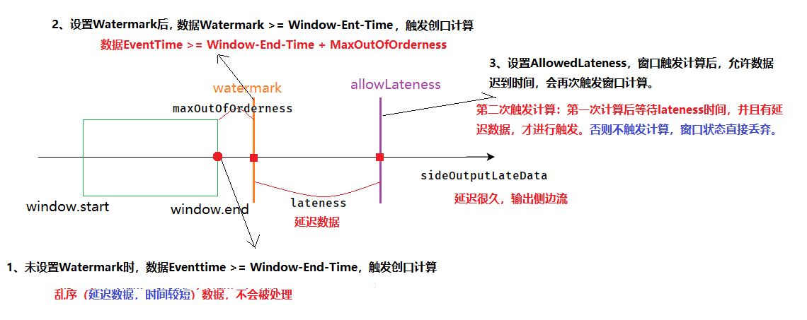


## 附录部分：注意事项及扩展内容


```

```


### [附录1]-离线数据分析【开窗函数】

----


> 窗口统计，不仅仅在流式计算中存在，批处理数据分析中也存在，比如 [开窗函数，其中窗口大小设置]()

```ini
# 1. 函数名称
# 2. 窗口：PARTITION BY分组、ORDER BY排序、窗口大小（ROWS/RANGE)
	默认窗口大小：组内第一条数据到当前数据，组成窗口

ROW_NUMBER() OVER (PARTITION BY x1 ORDER BY x2 ROWS Between xxx AND yyyy)
```

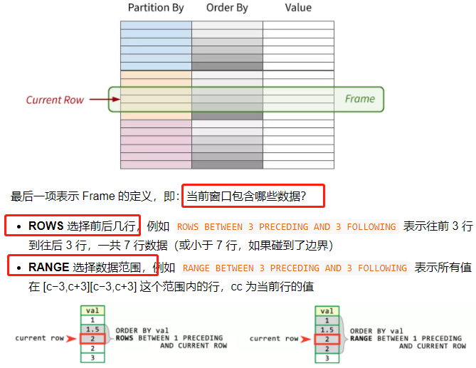


### [附录2]-Flink Window 窗口类型

---


> ​			在Flink流式计算中，Window窗口无处不在，属于Streaming流计算到Batch批处理一个桥梁，按照不同方式划分窗口有如下类型：

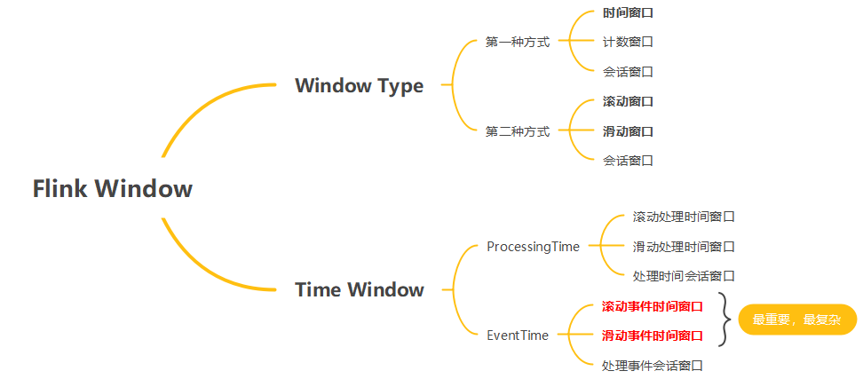

```ini
1、Flink Window窗口类型划分：
	第一种方式：
		时间窗口TimeWindow，以时间范围划分流式数据为窗口
		计数窗口CountWindow，以数据量为标准划分流式数据为窗口
		会话窗口SessionWindow
		
	第二种方式：
		滚动窗口ThumblingWindow，窗口大小size=滑动大小slide
		滑动窗口SlidingWindow
		会话窗口SessionWindow
		
2、Flink Time 时间语义
	主要针对Flink Window，时间窗口进行划分的
	语义三种：
		事件时间EventTime，数据产生的时间，包含在数据中某个字段
			订单数据中订单时间，日志数据中访问时间
		摄取时间IngestionTime，流式计算框架获取数据的时间，比如Source操作
		处理时间ProcessingTime，数据被计算处理的时间，比如Transformation操作
	
	如果按照上述时间语义，结合时间窗口，可以有如下几种窗口：
		基于事件时间EventTime滚动窗口     ★ ★ ★ ★ ★
		基于事件时间EventTime滑动窗口		★ ★ ★ ★ ★
		
		基于处理时间ProcessingTime滚动窗口		★ ★ ★ ★ 
		基于处理时间ProcessingTime滑动窗口		★ ★ ★ ★ 

	会话窗口SessionWindow，基于时间设置的窗口
		基于事件时间会话窗口						★ ★ ★ ★ 
		基于处理时间会话窗口						★ ★ ★ ★ ★
```

[在实际项目开发中，基于时间窗口使用最多就是：基于事件时间EventTime滚动窗口设置和数据计算。]()

> 查看源码窗口分配器：`WindowAssigner` 实现子类，可知窗口类型。

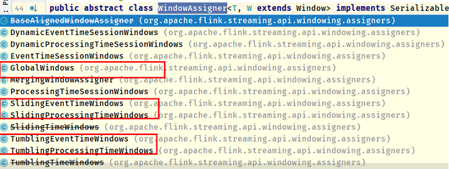


### [附录3]-EventTime Window乱序迟到数据处理

---


#### Watermark 水印机制

> 乱序数据处理：watermark 水印机制

```Java
package cn.itcast.flink.time;

import lombok.SneakyThrows;
import org.apache.commons.lang3.time.FastDateFormat;
import org.apache.flink.api.common.eventtime.SerializableTimestampAssigner;
import org.apache.flink.api.common.eventtime.WatermarkStrategy;
import org.apache.flink.api.common.functions.MapFunction;
import org.apache.flink.api.java.tuple.Tuple2;
import org.apache.flink.streaming.api.datastream.DataStream;
import org.apache.flink.streaming.api.environment.StreamExecutionEnvironment;
import org.apache.flink.streaming.api.functions.windowing.WindowFunction;
import org.apache.flink.streaming.api.windowing.assigners.TumblingEventTimeWindows;
import org.apache.flink.streaming.api.windowing.time.Time;
import org.apache.flink.streaming.api.windowing.windows.TimeWindow;
import org.apache.flink.util.Collector;

import java.time.Duration;
import java.util.Date;

/**
 * 滚动事件时间窗口案例：每隔5秒统计各个卡口流量
 * @author xuyuan
 */
public class EventTimeWindowWatermarkDemo {

	public static void main(String[] args) throws Exception {
		// 1. 执行环境-env
		StreamExecutionEnvironment env = StreamExecutionEnvironment.getExecutionEnvironment();
		env.setParallelism(1) ;

		// 2. 数据源-source
		DataStream<String> inputStream = env.socketTextStream("node1.itcast.cn", 9999);

		// 3. 数据转换-transformation
/*
2022-04-01 09:00:01,a,1
2022-04-01 09:00:02,a,1
2022-04-01 09:00:05,a,1

2022-04-01 09:00:10,a,1

2022-04-01 09:00:11,a,1
2022-04-01 09:00:14,b,1
2022-04-01 09:00:15,b,1
 */
		// 3-1. 过滤脏数据，并且指定事件时间字段值
		DataStream<String> timeStream = inputStream
			.filter(line -> line.trim().split(",").length == 3)
			// todo step1. 指定事件时间字段，并且值Long类型
			.assignTimestampsAndWatermarks(
				WatermarkStrategy
					// todo: 考虑数据乱序，设置允许最大乱序时间，理解为等待多久触发计算，值 = 2s
					.<String>forBoundedOutOfOrderness(Duration.ofSeconds(2))
					// 提取数据中事件时间字段值
					.withTimestampAssigner(
						new SerializableTimestampAssigner<String>() {
							private FastDateFormat format = FastDateFormat.getInstance("yyyy-MM-dd HH:mm:ss");

							// 参数element表示流中每条数据
							@SneakyThrows
							@Override
							public long extractTimestamp(String element, long recordTimestamp) {
								// element -> 2022-04-01 09:00:01,a,1
								System.out.println("element -> " + element);
								// 分割字符串
								String[] array = element.split(",");
								// 获取事件时间
								String eventTime = array[0];
								// 转换格式
								Date eventDate = format.parse(eventTime);
								// 转换Long类型并且返回
								return eventDate.getTime();
							}
						}
					)
			);

		// 3-2. 设置事假时间滚动窗口
		DataStream<String> windowStream = timeStream
			// 解析数据，提取卡口名称和流量数据，封装到二元组中
			.map(new MapFunction<String, Tuple2<String, Integer>>() {
				@Override
				public Tuple2<String, Integer> map(String value) throws Exception {
					// element -> 2022-04-01 09:00:01,a,1
					// 分割字符串
					String[] array = value.split(",");
					Tuple2<String, Integer> tuple = Tuple2.of(array[1], Integer.parseInt(array[2]));
					// 返回二元组
					return tuple;
				}
			})
			// a. 指定卡口编号为分组字段
			.keyBy(tuple -> tuple.f0)
			// todo step2. 设置窗口：事件时间窗口，并且是滚动窗口
			.window(TumblingEventTimeWindows.of(Time.seconds(5)))
			// c. 窗口函数，对窗口中数据进行计算
			.apply(new WindowFunction<Tuple2<String, Integer>, String, String, TimeWindow>() {
				// 对日期时间数据格式化
				private FastDateFormat format = FastDateFormat.getInstance("yyyy-MM-dd HH:mm:ss");

				@Override
				public void apply(String key,  // 分组key，此处卡口编号
				                  TimeWindow window,  // 窗口类型，此处为时间窗口，可以获取窗口开始时间和结束时间
				                  Iterable<Tuple2<String, Integer>> input,  // 窗口中所有数据，放在迭代器中
				                  Collector<String> out) throws Exception {
					// 获取窗口时间信息：开始时间和结束时间
					String winStart = this.format.format(window.getStart());
					String winEnd = this.format.format(window.getEnd());

					// 对窗口中数据进行统计：求和
					int sum = 0;
					for (Tuple2<String, Integer> item : input) {
						sum += item.f1;
					}

					// 输出结果数据
					String output = "window: [" + winStart + " ~ " + winEnd + "], " + key + " = " + sum;
					out.collect(output);
				}
			});

		// 4. 数据终端-sink
		windowStream.printToErr();

		// 5. 触发执行-execute
		env.execute("EventTimeWindowWatermarkDemo");
	}

}  
```


#### AllowedLateness 允许延迟

> ​			基于事件时间窗口计算，当数据迟到到达时，窗口已经触发计算，保存窗口状态到内存一定时间，当有延迟数据到达时，继续触发窗口计算。

```java
package cn.itcast.flink.time;

import lombok.SneakyThrows;
import org.apache.commons.lang3.time.FastDateFormat;
import org.apache.flink.api.common.eventtime.SerializableTimestampAssigner;
import org.apache.flink.api.common.eventtime.WatermarkStrategy;
import org.apache.flink.api.common.functions.MapFunction;
import org.apache.flink.api.java.tuple.Tuple2;
import org.apache.flink.streaming.api.datastream.DataStream;
import org.apache.flink.streaming.api.environment.StreamExecutionEnvironment;
import org.apache.flink.streaming.api.functions.windowing.WindowFunction;
import org.apache.flink.streaming.api.windowing.assigners.TumblingEventTimeWindows;
import org.apache.flink.streaming.api.windowing.time.Time;
import org.apache.flink.streaming.api.windowing.windows.TimeWindow;
import org.apache.flink.util.Collector;

import java.time.Duration;
import java.util.Date;

/**
 * 滚动事件时间窗口案例：每隔5秒统计各个卡口流量
 * @author xuyuan
 */
public class EventTimeWindowAllowedLatenessDemo {

	public static void main(String[] args) throws Exception {
		// 1. 执行环境-env
		StreamExecutionEnvironment env = StreamExecutionEnvironment.getExecutionEnvironment();
		env.setParallelism(1) ;

		// 2. 数据源-source
		DataStream<String> inputStream = env.socketTextStream("node1.itcast.cn", 9999);

		// 3. 数据转换-transformation
/*
2022-04-01 09:00:01,a,1
2022-04-01 09:00:02,a,1
2022-04-01 09:00:05,a,1

2022-04-01 09:00:10,a,1

2022-04-01 09:00:11,a,1
2022-04-01 09:00:14,b,1
2022-04-01 09:00:15,b,1
 */
		// 3-1. 过滤脏数据，并且指定事件时间字段值
		DataStream<String> timeStream = inputStream
			.filter(line -> line.trim().split(",").length == 3)
			// todo step1. 指定事件时间字段，并且值Long类型
			.assignTimestampsAndWatermarks(
				WatermarkStrategy
					// todo: 考虑数据乱序，设置允许最大乱序时间，理解为等待多久触发计算，值 = 2s
					.<String>forBoundedOutOfOrderness(Duration.ofSeconds(2))
					// 提取数据中事件时间字段值
					.withTimestampAssigner(
						new SerializableTimestampAssigner<String>() {
							private FastDateFormat format = FastDateFormat.getInstance("yyyy-MM-dd HH:mm:ss");

							// 参数element表示流中每条数据
							@SneakyThrows
							@Override
							public long extractTimestamp(String element, long recordTimestamp) {
								// element -> 2022-04-01 09:00:01,a,1
								System.out.println("element -> " + element);
								// 分割字符串
								String[] array = element.split(",");
								// 获取事件时间
								String eventTime = array[0];
								// 转换格式
								Date eventDate = format.parse(eventTime);
								// 转换Long类型并且返回
								return eventDate.getTime();
							}
						}
					)
			);

		// 3-2. 设置事假时间滚动窗口
		DataStream<String> windowStream = timeStream
			// 解析数据，提取卡口名称和流量数据，封装到二元组中
			.map(new MapFunction<String, Tuple2<String, Integer>>() {
				@Override
				public Tuple2<String, Integer> map(String value) throws Exception {
					// element -> 2022-04-01 09:00:01,a,1
					// 分割字符串
					String[] array = value.split(",");
					Tuple2<String, Integer> tuple = Tuple2.of(array[1], Integer.parseInt(array[2]));
					// 返回二元组
					return tuple;
				}
			})
			// a. 指定卡口编号为分组字段
			.keyBy(tuple -> tuple.f0)
			// todo step2. 设置窗口：事件时间窗口，并且是滚动窗口
			.window( TumblingEventTimeWindows.of(Time.seconds(5)))
			// todo 当窗口触发计算以后，再次等待一段时间，保存窗口数据在内存中，如果有延迟数据到达，再次触发窗口计算
			.allowedLateness(Time.seconds(5))
			// c. 窗口函数，对窗口中数据进行计算
			.apply(new WindowFunction<Tuple2<String, Integer>, String, String, TimeWindow>() {
				// 对日期时间数据格式化
				private FastDateFormat format = FastDateFormat.getInstance("yyyy-MM-dd HH:mm:ss");

				@Override
				public void apply(String key,  // 分组key，此处卡口编号
				                  TimeWindow window,  // 窗口类型，此处为时间窗口，可以获取窗口开始时间和结束时间
				                  Iterable<Tuple2<String, Integer>> input,  // 窗口中所有数据，放在迭代器中
				                  Collector<String> out) throws Exception {
					// 获取窗口时间信息：开始时间和结束时间
					String winStart = this.format.format(window.getStart());
					String winEnd = this.format.format(window.getEnd());

					// 对窗口中数据进行统计：求和
					int sum = 0;
					for (Tuple2<String, Integer> item : input) {
						sum += item.f1;
					}

					// 输出结果数据
					String output = "window: [" + winStart + " ~ " + winEnd + "], " + key + " = " + sum;
					out.collect(output);
				}
			});

		// 4. 数据终端-sink
		windowStream.printToErr();

		// 5. 触发执行-execute
		env.execute("EventTimeWindowAllowedLatenessDemo");
	}

}  
```


#### LateData SideOutput 侧边输出

> ​		基于事件时间窗口计算时，如果数据到达时，窗口已经触发计算并且销毁窗口状态，此时可以将迟到数据进行侧边输出。

```Java
package cn.itcast.flink.time;

import lombok.SneakyThrows;
import org.apache.commons.lang3.time.FastDateFormat;
import org.apache.flink.api.common.eventtime.SerializableTimestampAssigner;
import org.apache.flink.api.common.eventtime.WatermarkStrategy;
import org.apache.flink.api.common.functions.MapFunction;
import org.apache.flink.api.java.tuple.Tuple2;
import org.apache.flink.streaming.api.datastream.DataStream;
import org.apache.flink.streaming.api.datastream.SingleOutputStreamOperator;
import org.apache.flink.streaming.api.environment.StreamExecutionEnvironment;
import org.apache.flink.streaming.api.functions.windowing.WindowFunction;
import org.apache.flink.streaming.api.windowing.assigners.TumblingEventTimeWindows;
import org.apache.flink.streaming.api.windowing.time.Time;
import org.apache.flink.streaming.api.windowing.windows.TimeWindow;
import org.apache.flink.util.Collector;
import org.apache.flink.util.OutputTag;

import java.time.Duration;
import java.util.Date;

/**
 * 滚动事件时间窗口案例：每隔5秒统计各个卡口流量
 * @author xuyuan
 */
public class EventTimeWindowSideOutputDemo {

	public static void main(String[] args) throws Exception {
		// 1. 执行环境-env
		StreamExecutionEnvironment env = StreamExecutionEnvironment.getExecutionEnvironment();
		env.setParallelism(1) ;

		// 2. 数据源-source
		DataStream<String> inputStream = env.socketTextStream("node1.itcast.cn", 9999);

		// 3. 数据转换-transformation
/*
2022-04-01 09:00:01,a,1
2022-04-01 09:00:02,a,1
2022-04-01 09:00:05,a,1

2022-04-01 09:00:10,a,1

2022-04-01 09:00:11,a,1
2022-04-01 09:00:14,b,1
2022-04-01 09:00:15,b,1
 */
		// 3-1. 过滤脏数据，并且指定事件时间字段值
		DataStream<String> timeStream = inputStream
			.filter(line -> line.trim().split(",").length == 3)
			// todo step1. 指定事件时间字段，并且值Long类型
			.assignTimestampsAndWatermarks(
				WatermarkStrategy
					// todo: 考虑数据乱序，设置允许最大乱序时间，理解为等待多久触发计算，值 = 2s
					.<String>forBoundedOutOfOrderness(Duration.ofSeconds(2))
					// 提取数据中事件时间字段值
					.withTimestampAssigner(
						new SerializableTimestampAssigner<String>() {
							private FastDateFormat format = FastDateFormat.getInstance("yyyy-MM-dd HH:mm:ss");

							// 参数element表示流中每条数据
							@SneakyThrows
							@Override
							public long extractTimestamp(String element, long recordTimestamp) {
								// element -> 2022-04-01 09:00:01,a,1
								System.out.println("element -> " + element);
								// 分割字符串
								String[] array = element.split(",");
								// 获取事件时间
								String eventTime = array[0];
								// 转换格式
								Date eventDate = format.parse(eventTime);
								// 转换Long类型并且返回
								return eventDate.getTime();
							}
						}
					)
			);

		// todo 定义迟到数据侧边输出标签
		final OutputTag<Tuple2<String, Integer>> lateOutputTag = new OutputTag<Tuple2<String, Integer>>("late-data"){} ;

		// 3-2. 设置事假时间滚动窗口
		SingleOutputStreamOperator<String> windowStream = timeStream
			// 解析数据，提取卡口名称和流量数据，封装到二元组中
			.map(new MapFunction<String, Tuple2<String, Integer>>() {
				@Override
				public Tuple2<String, Integer> map(String value) throws Exception {
					// element -> 2022-04-01 09:00:01,a,1
					// 分割字符串
					String[] array = value.split(",");
					Tuple2<String, Integer> tuple = Tuple2.of(array[1], Integer.parseInt(array[2]));
					// 返回二元组
					return tuple;
				}
			})
			// a. 指定卡口编号为分组字段
			.keyBy(tuple -> tuple.f0)
			// todo step2. 设置窗口：事件时间窗口，并且是滚动窗口
			.window(TumblingEventTimeWindows.of(Time.seconds(5)))
			// todo 当窗口触发计算以后，再次等待一段时间，保存窗口数据在内存中，如果有延迟数据到达，再次触发窗口计算
			.allowedLateness(Time.seconds(5))
			// todo 设置迟到数据输出侧边流标签
			.sideOutputLateData(lateOutputTag)
			// c. 窗口函数，对窗口中数据进行计算
			.apply(new WindowFunction<Tuple2<String, Integer>, String, String, TimeWindow>() {
				// 对日期时间数据格式化
				private FastDateFormat format = FastDateFormat.getInstance("yyyy-MM-dd HH:mm:ss");

				@Override
				public void apply(String key,  // 分组key，此处卡口编号
				                  TimeWindow window,  // 窗口类型，此处为时间窗口，可以获取窗口开始时间和结束时间
				                  Iterable<Tuple2<String, Integer>> input,  // 窗口中所有数据，放在迭代器中
				                  Collector<String> out) throws Exception {
					// 获取窗口时间信息：开始时间和结束时间
					String winStart = this.format.format(window.getStart());
					String winEnd = this.format.format(window.getEnd());

					// 对窗口中数据进行统计：求和
					int sum = 0;
					for (Tuple2<String, Integer> item : input) {
						sum += item.f1;
					}

					// 输出结果数据
					String output = "window: [" + winStart + " ~ " + winEnd + "], " + key + " = " + sum;
					out.collect(output);
				}
			});

		// 4. 数据终端-sink
		windowStream.printToErr();

		// todo 获取侧边流
		DataStream<Tuple2<String, Integer>> lateStream = windowStream.getSideOutput(lateOutputTag);
		lateStream.print("late>>");

		// 5. 触发执行-execute
		env.execute("EventTimeWindowDemo");
	}

}  
```

