# Flink Chapter05：Flink 高级API开发（2）

---

​			Flink之所以能这么流行，离不开它最重要的四个基石：**Checkpoint、State、Time、Window**。

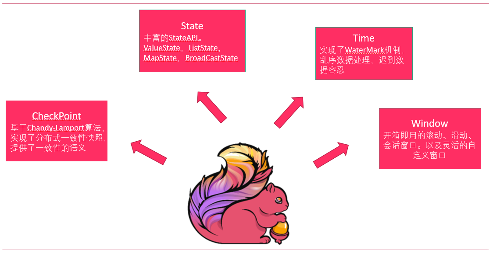


## 前言部分：知识回顾及课程目标


```

```


### [前言1]-上次课程内容回顾 

---


> 主要讲解：Flink 四大基石【Window 窗口计算】和【事件时间EventTime窗口计算】。

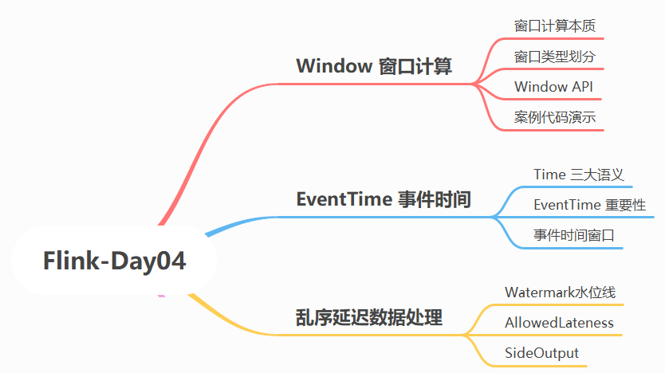

```ini
# 1、Flink Window类型
	时间窗口TimeWindow：滚动时间窗口和滑动时间窗口
	计数窗口CountWindow：滚动计数窗口和滑动计数窗口
	会话窗口SessionWindow：基于时间会话窗口
	datastream.keyBy(tuple -> tuple.f0).window(TimeWindow).apply(WindowFunction)
		WindowAssinger 窗口分配器：如何将流中数据划分到窗口中
		WindowFunction 窗口计算函数：对窗口中数据进行计算

# 2、Flink Time时间
	事件时间EventTime：数据产生的时间
	处理时间ProcessingTime：数据被处理的时间
	摄入时间IngestionTime：数据被流式系统获取的时间，通常与处理时间一致
	
# 3、基于事件时间EventTime窗口分析
	需要指定事件时间EventTime字段，类型必须为Long类型
	a. 乱序数据处理：Watermark水印机制
		数据延迟时间很短
		watermark：给每条数据加上时间戳，数据事件时间 - 允许最大乱序时间，用于触发窗口计算
	b. 延迟数据处理：AllowedLateness
		数据延迟时间较长
		在窗口触发计算以后，再次等待一段时间， 如果有延迟数据达到，将会触发窗口计算
	c. 超延迟数据处理：Side Output
		数据延迟时间很久，超出AllowedLateness设置的时间
		在窗口计算并销毁后，延迟很久的数据到达，将其放到侧边流中，进行单独处理
```


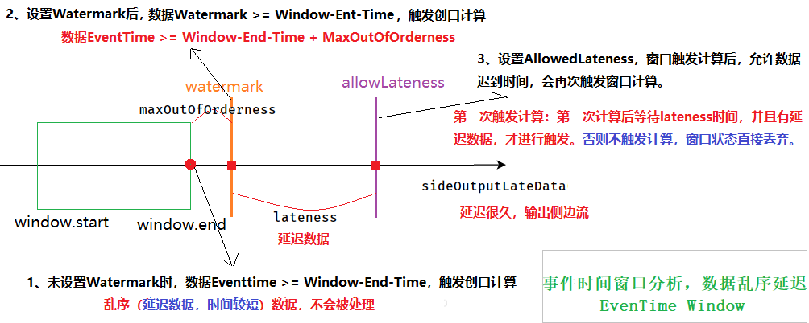


### [前言2]-基于窗口订单统计

---


> ​			针对电商网站交易订单数据统计，以叮咚买菜抢单为例，进行销售额统计，[每次统计最近10秒各个用户订单销售额，最大允许乱序时间：2秒，最大允许延迟时间：3秒，迟到很久数据侧边输出]()。


- 业务数据

```ini
订单ID, 用户ID, 订单金额, 订单时间

o_101,u_121,11.50,2022-04-05 10:00:02
o_102,u_121,59.50,2022-04-05 10:00:04
o_103,u_121,4.00,2022-04-05 10:00:07
o_104,u_121,22.25,2022-04-05 10:00:10

o_105,u_121,37.35,2022-04-05 10:00:09

o_106,u_121,33.40,2022-04-05 10:00:11
o_107,u_121,4.00,2022-04-05 10:00:12

o_108,u_121,29.10,2022-04-05 10:00:08

o_109,u_121,25.20,2022-04-05 10:00:15
o_110,u_121,58.80,2022-04-05 10:00:06

o_111,u_121,80.90,2022-04-05 10:00:20
o_112,u_121,46.10,2022-04-05 10:00:22


```


#### 订单实体类：OrderEvent

---


```Java
package cn.itcast.flink.order;

import lombok.*;

/**
 * 交易订单数据封装实体类
 * @author xuyuan
 */
@Data
@AllArgsConstructor
@NoArgsConstructor
public class OrderEvent {

	private String orderId;
	private String userId;
	private Double orderMoney;
	private String orderTime;

	@Override
	public String toString() {
		return orderTime + "," + userId + "," + orderMoney + "," + orderId;
	}
}
```


#### 结果实体类：OrderReport

----

```Java
package cn.itcast.flink.order;

import lombok.*;

/**
 * 窗口计算结果字段封装实体类，包含字段：userId, totalMoney, windowStart, windowEnd
 * @author xuyuan
 */
@Data
@AllArgsConstructor
@NoArgsConstructor
public class OrderReport {
	private String userId;
	private String windowStart;
	private String windowEnd;
	private Double totalMoney ;

	@Override
	public String toString() {
		return "[" + windowStart + " ~ " + windowEnd + "]: " + userId + " = " + totalMoney;
	}
}
```


#### 窗口函数：OrderWindowFunction

---

```Java
package cn.itcast.flink.order;

import org.apache.commons.lang3.time.FastDateFormat;
import org.apache.flink.streaming.api.functions.windowing.WindowFunction;
import org.apache.flink.streaming.api.windowing.windows.TimeWindow;
import org.apache.flink.util.Collector;

/**
 * 对窗口中数据进行计算，计算每个窗口中各个用户销售订单额
 * @author xuyuan
 */
public class OrderWindowFunction implements WindowFunction<OrderEvent, OrderReport, String, TimeWindow> {

	private FastDateFormat fastDateFormat = FastDateFormat.getInstance("yyyy-MM-dd HH:mm:ss") ;

	@Override
	public void apply(String key,
	                  TimeWindow window,
	                  Iterable<OrderEvent> input,
	                  Collector<OrderReport> out) throws Exception {
		// 获取窗口中开始时间和结束时间
		String windowStart = fastDateFormat.format(window.getStart());
		String windowEnd = fastDateFormat.format(window.getEnd());

		// 对窗口中数据计算
		double sum = 0 ;
		for (OrderEvent orderEvent : input) {
			Double orderMoney = orderEvent.getOrderMoney();
			sum += orderMoney ;
		}

		// 构建计算结果实例对象，设置属性值
		OrderReport orderReport = new OrderReport();
		orderReport.setUserId(key);
		orderReport.setWindowStart(windowStart);
		orderReport.setWindowEnd(windowEnd);
		orderReport.setTotalMoney(sum);

		// 输出数据
		out.collect(orderReport);
	}

}
```


#### 流式程序：StreamOrderWindowReport

----

```Java
package cn.itcast.flink.order;

import lombok.SneakyThrows;
import org.apache.commons.lang3.time.FastDateFormat;
import org.apache.flink.api.common.eventtime.SerializableTimestampAssigner;
import org.apache.flink.api.common.eventtime.WatermarkStrategy;
import org.apache.flink.api.common.functions.MapFunction;
import org.apache.flink.streaming.api.datastream.DataStream;
import org.apache.flink.streaming.api.datastream.SingleOutputStreamOperator;
import org.apache.flink.streaming.api.environment.StreamExecutionEnvironment;
import org.apache.flink.streaming.api.windowing.assigners.TumblingEventTimeWindows;
import org.apache.flink.streaming.api.windowing.time.Time;
import org.apache.flink.util.OutputTag;

import java.time.Duration;
import java.util.Date;

/**
 * 每次统计最近10秒各个用户订单销售额，最大允许乱序时间：2秒，最大允许延迟时间：3秒，迟到很久数据侧边输出
 *      todo: 滚动窗口, 分组流窗口窗口计算, 计算结果
 *          userId, totalMoney, windowStart, windowEnd
 * @author xuyuan
 */
public class StreamOrderWindowDemo {

	public static void main(String[] args) throws Exception {
		// 1. 执行环境-env
		StreamExecutionEnvironment env = StreamExecutionEnvironment.getExecutionEnvironment();
		env.setParallelism(1);

		// 2. 数据源-source
		DataStream<String> inputStream = env.socketTextStream("node1.itcast.cn", 9999);

		// 3. 数据转换-transformation
		/*
			业务数据：
				订单ID, 用户ID, 订单金额, 订单时间
				o_101,u_121,11.50,2022-04-05 10:00:02
			分析步骤：
				3-1. 过滤、解析和封装数据
				3-2. 设置事件时间字段值
				3-3. 定义窗口和函数
				---------------------------
				3-4. 考虑乱序延迟迟到数据处理
					乱序数据：watermark水位线机制，等待时间再触发窗口计算
					延迟数据：窗口已经计算，让窗口状态保存一段时间，如果延迟数据达到，依然触发窗口计算
					迟到数据：输出侧边流中
		 */
		// 3-1. 过滤、解析和封装数据
		DataStream<OrderEvent> orderStream = inputStream
			.filter(line -> line.trim().split(",").length == 4)
			.map(new MapFunction<String, OrderEvent>() {
				@Override
				public OrderEvent map(String value) throws Exception {
					// 分割字符串
					String[] array = value.split(",");
					// 封装实体类对象
					OrderEvent orderEvent = new OrderEvent() ;
					orderEvent.setOrderId(array[0]);
					orderEvent.setUserId(array[1]);
					orderEvent.setOrderMoney(Double.parseDouble(array[2]));
					orderEvent.setOrderTime(array[3]);
					// 返回实例对象
					return orderEvent;
				}
			});

		// 3-2. 设置事件时间字段值
		SingleOutputStreamOperator<OrderEvent> timeStream = orderStream
            .assignTimestampsAndWatermarks(
			WatermarkStrategy
				// 乱序数据：watermark水位线机制，等待时间再触发窗口计算 todo【最大允许乱序时间】
				.<OrderEvent>forBoundedOutOfOrderness(Duration.ofSeconds(2))
				// todo 获取订单数据中时间，设置为事件时间字段中，必须为long类型
				.withTimestampAssigner(new SerializableTimestampAssigner<OrderEvent>() {
					private FastDateFormat format = FastDateFormat
                        .getInstance("yyyy-MM-dd HH:mm:ss");
					@SneakyThrows
					@Override
					public long extractTimestamp(OrderEvent element, long recordTimestamp) {
						System.out.println("order -> " + element);
						// 获取订单时间
						String orderTime = element.getOrderTime();
						// 转换字符串为Date日期
						Date orderDate = format.parse(orderTime);
						// 转换Long并返回
						return orderDate.getTime();
					}
				})
		);

		OutputTag<OrderEvent> lateOutputTag = new OutputTag<OrderEvent>("late-data"){};
		// 3-3. 定义窗口和函数
		SingleOutputStreamOperator<OrderReport> windowStream = timeStream
			// 按照用户分组
			.keyBy(OrderEvent::getUserId)
			// 设置窗口：10s，滚动窗口
			.window(TumblingEventTimeWindows.of(Time.seconds(10)))
			// 延迟数据：窗口已经计算，让窗口状态保存内存一段时间，
            // 在范围内延迟数据达到，依然触发窗口计算 todo【最大允许延迟时间】
			.allowedLateness(Time.seconds(3))
			// 迟到数据，将其单独输出到侧边流流 todo【迟到数据标签】
			.sideOutputLateData(lateOutputTag)
			// 设置窗口函数，数据计算
			.apply(new OrderWindowFunction());

		// 4. 数据终端-sink
		windowStream.printToErr();

		// todo: 依据标签获取侧边流中迟到数据
		DataStream<OrderEvent> lateStream = windowStream.getSideOutput(lateOutputTag);
		lateStream.print("late>");

		// 5. 触发执行-execute
		env.execute("StreamOrderWindowDemo");
	}

}  
```


### [前言3]-今日课程内容提纲

---


> 讲解Flink 四大基石：`状态State`和检查点`Checkpoint`、端到端精确性一次语义（==EOS==）。


> ​			Flink 流式计算引擎，属于**状态计算框架**，在程序运行时，[管理状态和基于状态计算]()。对程序状态State进行快照和保存：**Checkpoint（程序自动执行）**和**SavePoint（人为手动执行）**。


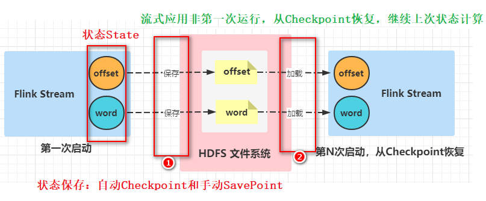


### [前言4]-Flink 状态计算 

---


> ​			在Flink架构体系中，有状态计算可以说是Flink非常重要的特征之一。[有状态计算是指在程序计算过程中，在Flink程序内部，存储计算产生的中间结果，并提供给Functions 或 算子计算使用。]()

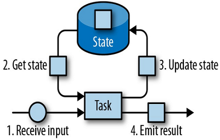


> 词频统计WordCount程序，其中**词频就是使用State状态进行存储**，==每个Key对应一个词频（状态）==。

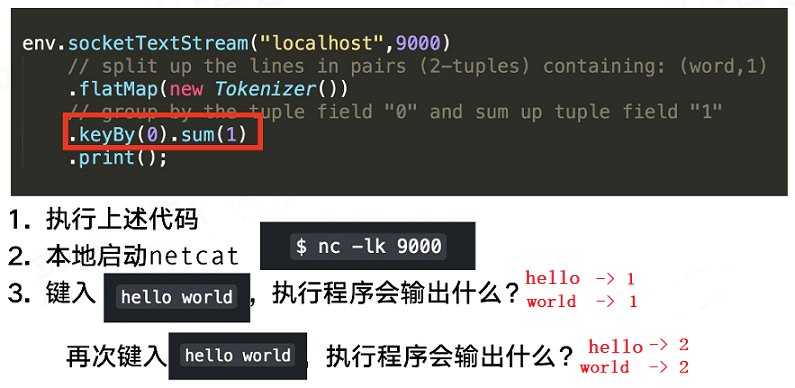


> ​			为什么Flink知道之前已经处理过一次 hello和world，这就是 `state`发挥作用了，这里是==被称为 keyed state 存储了之前需要统计的数据==，所以Flink 程序知道 hello和 world词频。


**附录**：基于Flink流式计算引擎实现词频统计WordCount代码。

---

```Java
package cn.itcast.flink.state;

import org.apache.flink.api.common.functions.FlatMapFunction;
import org.apache.flink.api.common.functions.MapFunction;
import org.apache.flink.api.java.tuple.Tuple2;
import org.apache.flink.streaming.api.datastream.DataStream;
import org.apache.flink.streaming.api.environment.StreamExecutionEnvironment;
import org.apache.flink.util.Collector;

/**
 * 基于 Flink 流计算引擎：从TCP Socket消费数据，实时词频统计WordCount
 * @author xuyuan
 */
public class StreamWordCount {

	public static void main(String[] args) throws Exception {
		// 1. 执行环境-env
		StreamExecutionEnvironment env = StreamExecutionEnvironment.getExecutionEnvironment();
		env.setParallelism(1) ;

		// 2. 数据源-source
		DataStream<String> inputStream = env.socketTextStream("node1.itcast.cn", 9999);

		// 3. 数据转换-transformation
		DataStream<Tuple2<String, Integer>> resultDataStream = inputStream
			// 3-1. 过滤脏数据
			.filter(line -> line.trim().length() > 0)
			// 3-2. 每行数据分割为单词
			.flatMap(new FlatMapFunction<String, String>() {
				@Override
				public void flatMap(String line, Collector<String> out) throws Exception {
					String[] words = line.trim().split("\\s+");
					for (String word : words) {
						out.collect(word);
					}
				}
			})
			// 3-3. 单词转换为二元组
			.map(new MapFunction<String, Tuple2<String, Integer>>() {
				@Override
				public Tuple2<String, Integer> map(String word) throws Exception {
					return Tuple2.of(word, 1);
				}
			})
			// 3-4. 按照单词分组，并且组内求和
			.keyBy(tuple -> tuple.f0).sum(1);

		// 4. 数据终端-sink
		resultDataStream.printToErr();

		// 5. 触发执行-execute
		env.execute("StreamWordCount") ;
	}

}
```


## 第一部分：Flink State 状态【4个小节】


> ​			Apache Flink作为一个计算框架，提供了**有状态的计算**，封装了一些底层的实现，比如状态的高效存储、Checkpoint和Savepoint持久化备份机制、计算资源扩缩容等问题。因为Flink接管了这些问题，**开发者只需调用Flink API，这样可以更加专注于业务逻辑**。


### 01-[理解]-Flink State之状态及存储结构 

---


> ​		==什么是状态==：流式计算的数据往往是转瞬即逝， 真实业务场景不可能说所有的数据都是进来之后就走掉，没有任何东西留下来，那么**留下来的东西其实就是称之为state**，中文可以翻译成**状态**。

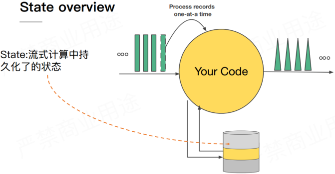

​			在上面这个图中，所有的原始数据进入用户代码之后再输出到下游，==如果中间涉及到 state 的读写，这些状态会存储在本地的 state backend（可以对标成嵌入式本地 kv 存储）当中==。


> **抛出疑问1：**什么是状态？

​									[在Flink中，可以这样理解State：某task/operator在某时刻的一个中间结果。]()

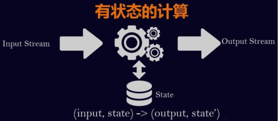


> **抛出疑问2：**为什么流式计算中需要State状态呢？

1. 与批计算相比，==State是流计算特有的==，批计算没有failover机制，要么成功，要么重新计算。
2. 流计算在大多数场景下是==增量计算，数据逐条处理（大多数场景），每次计算是在上一次计算结果之上进行处理的==，这样的机制势必要[将上一次的计算结果进行存储（生产模式要持久化）]()；
3. 另外由于机器、网络、脏数据等原因导致的程序错误，在==重启job时候需要从成功的检查点(checkpoint)进行state的恢复==。增量计算，Failover这些机制都需要state的支撑。


> **抛出疑问3**：状态State存储在哪里呢？

​			状态数据可以维系在[本地存储]()中，这里的存储可以是 [Flink 的堆内存或者堆外内存]()，也可以借助第三方的存储介质，例如：Flink中已经实现的**RocksDB**，当然用户也可以自己实现相应的缓存系统去存储状态信息，以完成更加复杂的计算逻辑。


> ​			状态计算其实就是需要==考虑历史数据==，而历史数据需要搞个地方存储起来。Flink为了方便不同分类的State的存储和管理，提供以下保存State的数据结构。

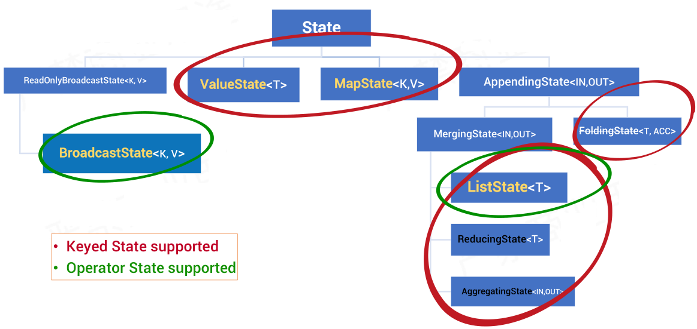


- `ValueState<T>`：类型为T的[单值]()状态

  - 保存一个可以更新和检索的值（每个值都对应到当前的输入数据的key，因此算子接收到的每个key都可能对应一个值）。
  - 这个值可以通过**update(T)**进行更新，通过**T value()**进行检索。

  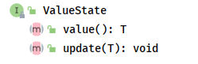


- `ListState<T>`：key上的状态值为一个[列表]()
  - 保存一个元素的列表，可以往这个列表中追加数据，并在当前的列表上进行检索。
  - 可以通过**add(T)**或者**addAll(List<T>)**进行添加元素，通过**Iterable<T> get()**获得整个列表。
  - 还可以通过**update(List<T>)**覆盖当前的列表。
  - 如统计按用户id统计用户经常登录的IP

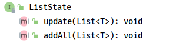


- `MapState<UK,UV>`：即状态值为一个[map]()
  - 维护了一个映射列表，可以添加键值对到状态中，也可以获得反映当前所有映射的迭代器。
  - 使用**put(UK，UV)**或者**putAll(Map<UK，UV>)**添加映射。
  - 使用**get(UK)**检索特定key。
  - 使用**entries()，keys()和values()**分别检索映射、键和值的可迭代视图

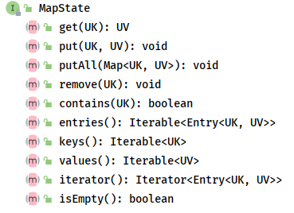


- `Broadcast State`：具有Broadcast流的特殊属性
  - 类比批处理中广播变量：**将小表数据广播到TaskManager内存，被Slot中运行Task任务使用**
  - 一种小数据状态广播向其它流的形式，从而避免大数据流量的传输；
  - 在这里，其它流是对广播状态只有只读操作的允许，因为不同任务间没有跨任务的信息交流。
  - 一旦有运行实例对于广播状态数据进行更新了，就会造成状态不一致现象。

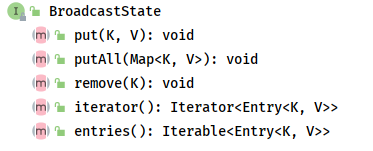


- `ReducingState<T>`：
  - 保存一个单值，表示添加到状态的所有值的聚合。
  - 这种状态通过用户传入的**reduceFunction**，每次调用**add**方法添加值的时候，会调用**reduceFunction**，最后合并到一个单一的状态值。
  - `AggregatingState<IN,OUT>`：保留一个单值，表示添加到状态的所有值的聚合。和ReducingState相反的是，聚合类型可能与添加到状态的元素的类型不同。
  - `FoldingState<T,ACC>`：保留一个单值，表示添加到状态的所有值的聚合。与ReducingState相反，聚合类型可能与添加到状态的元素类型不同。


### 02-[掌握]-Flink State之状态分类

---


> 在Flink中，按照**基本类型**划分State：==Keyed State 和 Operator State==。

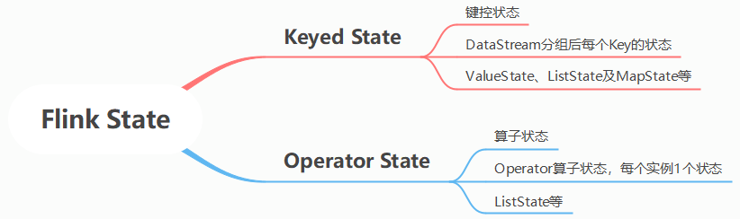


https://nightlies.apache.org/flink/flink-docs-release-1.13/docs/dev/datastream/fault-tolerance/state/

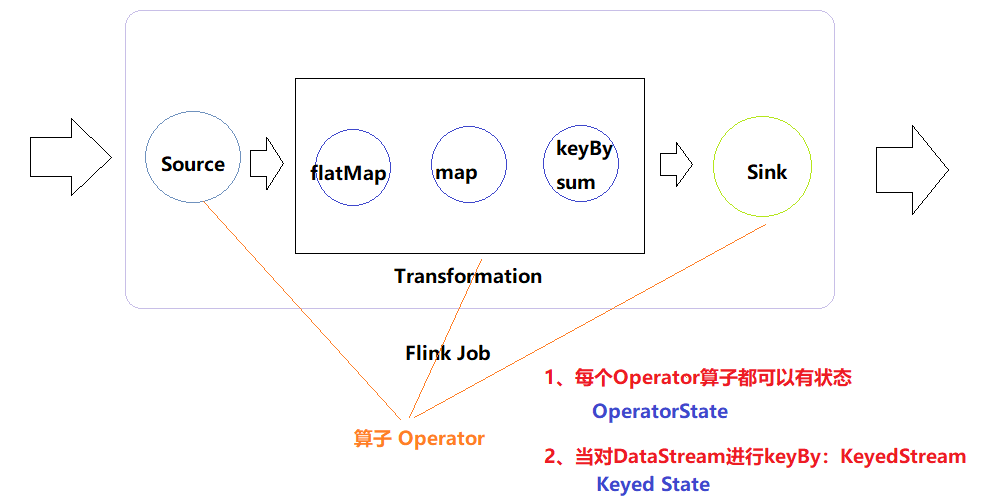


> 1）、[Keyed State]()：键控状态
>
> - 和Key有关的状态类型，KeyedStream流上的==每一个key，都对应一个state==；
> - 只能应用于 KeyedStream 的函数与操作中；
> - 存储数据结构：**ValueState、ListState、MapState、ReducingState和AggregatingState**等等

[**基于KeyedStream上的状态，是跟特定的key绑定的，对KeyedStream流上的每一个key，都对应一个state**。]()

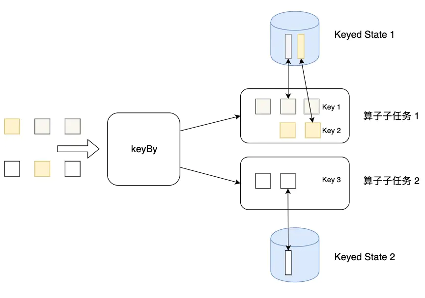


> 2）、[Operator State]()：算子状态
>
> - 又称为 non-keyed state，每一个 operator state 都仅与一个 operator 的实例（1个SubTask任务）绑定；
> - 可以用在所有算子上，每个算子子任务或者说每个算子实例共享一个状态，流入这个算子子任务的数据可以访问和更新这个状态。
> - 常见的 operator state 是 数据源==source state==，例如记录当前 source 的 offset；
> - 存储数据结构：**ListState或BroadcastState**等等

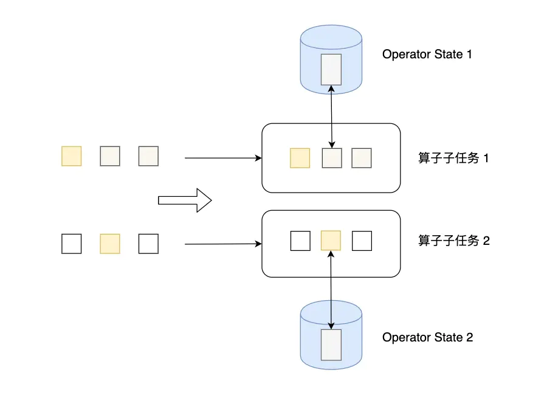


> 两种不同类型状态：==Keyed State与Operator State==比较如下：

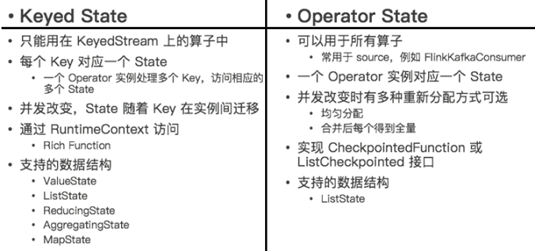


> [OperatorState算子状态属于每个实例存储1个State值，但是KeyedState键控状态属于每个Key存储1个状态值]()

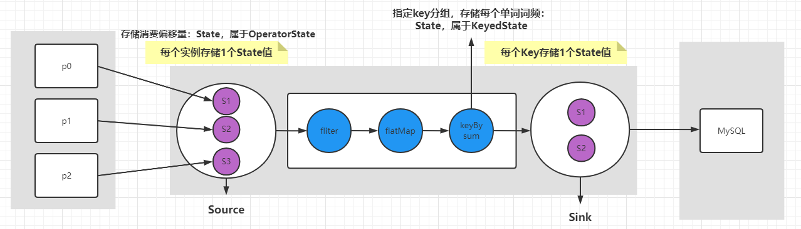


> Flink中State状态划分，按照是否被管理划分：

- 1、Managered State 管理状态，状态数据被Flink程序管理
  - 比如：ValueState、ListState、MapState等
- 2、Raw State 原始状态，由用户自己管理状态
  - 存储数据结构：byte[] ，相对来说很麻烦


### 03-[理解]-Flink State之KeyedState 案例

---


> **KeyedState**是根据输入数据流中==定义的键（key）来维护和访问==的状态。
>
> - Flink 为**每个 key 维护一个状态实例**，并将具有相同键的所有数据，都分区到同一个算子任务中，这个任务会维护和处理这个 key 对应的状态；
> - 当任务处理一条数据时，它会自动将状态的访问范围限定为当前数据的 key。

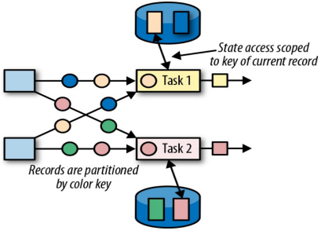


> 词频统计WordCount的 `sum` 使用的`StreamGroupedReduce`类为例，在代码中使用 keyed state：

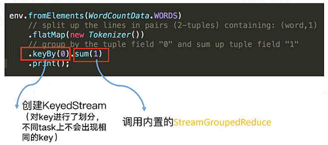


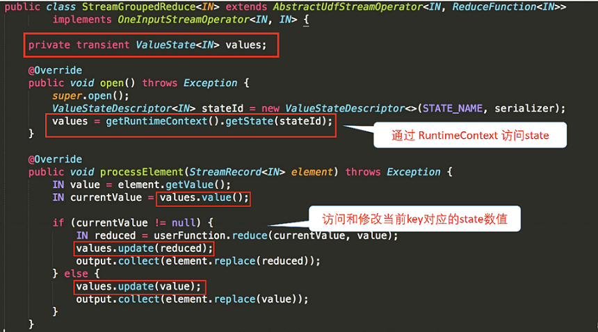


> **案例需求**：使用KeyedState中的`ValueState`获取数据中的**最大值**(实际中直接使用`max`即可)。

```java
DataStreamSource<Tuple3<String, String, Long>> tupleStream = env.fromElements(
    Tuple3.of("上海", "普陀区", 488L), Tuple3.of("上海", "徐汇区", 212L),
    Tuple3.of("北京", "西城区", 823L), Tuple3.of("北京", "海淀区", 234L),
    Tuple3.of("上海", "杨浦区", 888L), Tuple3.of("上海", "浦东新区", 666L),
    Tuple3.of("北京", "东城区", 323L), Tuple3.of("上海", "黄浦区", 111L)
);
```


> 使用`KeyedState`存储每个Key的最大值，依据案例需求，分析思路如下：

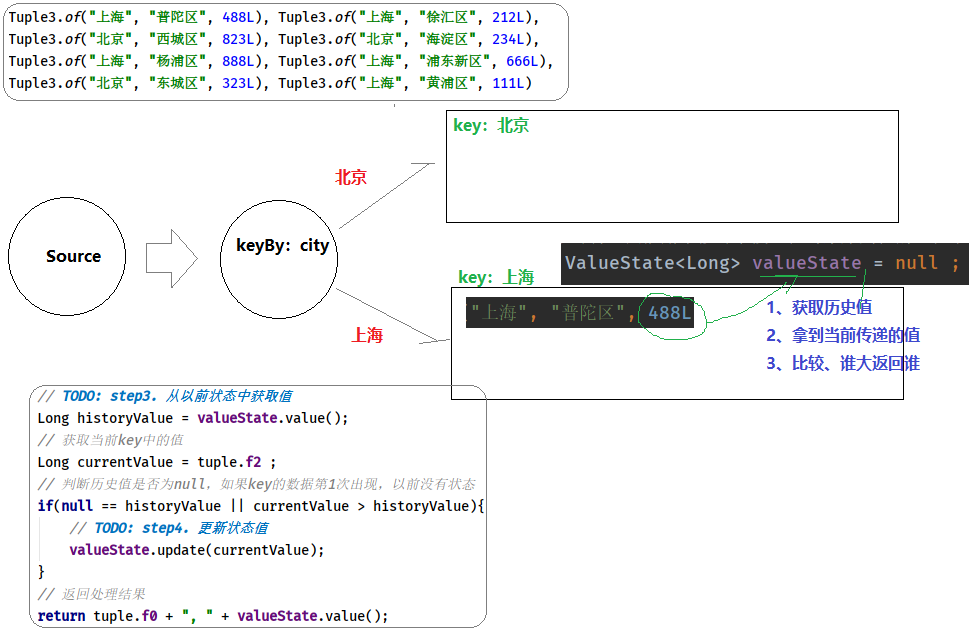


> 用户自己管理KeyedState，存储Key的状态值，步骤如下：

```java
// step1、定义状态变量，存储每个单词Key的词频
private ValueState<Long> valueState = null ;

// step2、初始化状态变量，通过状态描述符
valueState = getRuntimeContext().getState(
    new ValueStateDescriptor<Long>("maxState", Long.class)
);

// step3、对Key相同新数据处理时，从状态中获取Key以前词频
Long historyValue = valueState.value();

// step4、数据处理并输出后，更新状态中的值
valueState.update(currentValue);
```


> 编写代码，基于`KeyedState`状态实现获取最大值`max`函数功能，具体如下：

```Java
package cn.itcast.flink.state;

import org.apache.flink.api.common.functions.RichMapFunction;
import org.apache.flink.api.common.state.ValueState;
import org.apache.flink.api.common.state.ValueStateDescriptor;
import org.apache.flink.api.java.tuple.Tuple3;
import org.apache.flink.configuration.Configuration;
import org.apache.flink.streaming.api.datastream.DataStreamSource;
import org.apache.flink.streaming.api.datastream.SingleOutputStreamOperator;
import org.apache.flink.streaming.api.environment.StreamExecutionEnvironment;

public class StreamKeyedStateDemo {

	public static void main(String[] args) throws Exception {
		// 1. 执行环境-env
		StreamExecutionEnvironment env = StreamExecutionEnvironment.getExecutionEnvironment();
		env.setParallelism(1) ;

		// 2. 数据源-source
		DataStreamSource<Tuple3<String, String, Long>> tupleStream = env.fromElements(
			Tuple3.of("上海", "普陀区", 488L),
			Tuple3.of("上海", "徐汇区", 212L),
			Tuple3.of("北京", "西城区", 823L),
			Tuple3.of("北京", "海淀区", 234L),
			Tuple3.of("上海", "杨浦区", 888L),
			Tuple3.of("上海", "浦东新区", 666L),
			Tuple3.of("北京", "东城区", 323L),
			Tuple3.of("上海", "黄浦区", 111L)
		);

		// 3. 数据转换-transformation
		// todo: 使用DataStream转换函数max获取每个省份最大值
		SingleOutputStreamOperator<Tuple3<String, String, Long>> maxStream = tupleStream.keyBy(tuple -> tuple.f0).max(2);
		// maxStream.printToErr();
		/*
			(上海,普陀区,488)
			(上海,普陀区,488)
			(北京,西城区,823)
			(北京,西城区,823)
			(上海,普陀区,888)
			(上海,普陀区,888)
			(北京,西城区,823)
			(上海,普陀区,888)
		 */

		// todo: 自定义状态，实现max算子获取最大值，此处KeyedState定义
		SingleOutputStreamOperator<String> statStream = tupleStream
			// 指定城市字段进行分组
			.keyBy(tuple -> tuple.f0)
			// 处理流中每条数据
			.map(new RichMapFunction<Tuple3<String, String, Long>, String>() {

				// todo: 第1步、定义变量，存储每个Key对应值，
                // 所有状态State实例化都是RuntimeContext实例化
				private ValueState<Long> maxState = null ;

				// 处理流中每条数据之前，初始化准备工作
				@Override
				public void open(Configuration parameters) throws Exception {
					// todo: 第2步、初始化状态，开始默认值null
					maxState = getRuntimeContext().getState(
						new ValueStateDescriptor<Long>("maxState", Long.class)
					);
				}

				@Override
				public String map(Tuple3<String, String, Long> value) throws Exception {
					// 获取流中数据对应值
					Long currentValue = value.f2;

					// todo: step3、从状态中获取存储key以前值
					Long historyValue = maxState.value();

					// 如果数据为key分组中第一条数据；没有状态，值为null
					if(null == historyValue ||historyValue < currentValue){
						// todo: step4、更新状态值
						maxState.update(currentValue);
					}

					// 返回状态的最大值
					return value.f0 + " -> " + maxState.value();
				}
			});
		
		// 4. 数据终端-sink
		statStream.printToErr();

		// 5. 触发执行-execute
		env.execute("StreamKeyedStateDemo");
	}

}  
```


> ​				KeyedState键控状态，当用户定义State存储Key值以后，Job运行时，自动对State状态值进行Checkpoint和自动恢复操作，无需用户干预。


### 04-[理解]-Flink State之State TTL生命周期

---


> **Flink State Time-To-Live**：状态的存活时间
>
> - 在开发Flink应用时，对于许多有状态流应用程序的一个常见要求是**自动清理应用程序状态**，以有效管理状态大小。
> - 从 Flink 1.6 版本开始，社区为状态引入了TTL（time-to-live，生存时间）机制，支持Keyed State 的自动过期，有效解决了状态数据在无干预情况下无限增长导致 OOM 的问题。
>
> [状态的清理并不是即时的，而是使用了一种 Lazy 的算法来实现，从而减少状态清理对性能的影响。]()

https://nightlies.apache.org/flink/flink-docs-release-1.13/docs/dev/datastream/fault-tolerance/state/#state-time-to-live-ttl

创建State实例对象时，可以设置状态的TTL，如下代码所示：

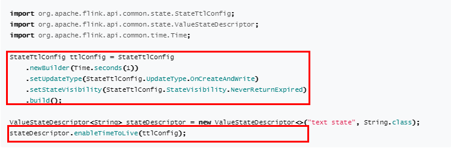


1. **TTL：表示状态的过期时间**：一旦设置了 TTL，那么如果上次访问的时间戳 + TTL 超过了当前时间，则表明状态过期了。
2. **UpdateType：表示状态时间戳的更新的时机**：
   - 如果设置为 Disabled，则表明不更新时间戳；
   - 如果设置为 OnCreateAndWrite，则表明当状态创建或每次写入时都会更新时间戳；
   - 如果设置为 OnReadAndWrite，则除了在状态创建和写入时更新时间戳外，读取也会更新状态时间戳。
3. **StateVisibility：表示对已过期但还未被清理掉的状态如何处理**：
   - 如果设置为 ReturnExpiredIfNotCleanedUp，那么即使这个状态的时间戳表明它已经过期了，但是只要还未被真正清理掉，就会被返回给调用方；
   - 如果设置为 NeverReturnExpired，那么一旦这个状态过期了，那么永远不会被返回给调用方，只会返回空状态，避免了过期状态带来的干扰。
4. **TimeCharacteristic 以及 TtlTimeCharacteristic：**表示 State TTL 功能所适用的时间模式
5. **CleanupStrategies：表示过期对象的清理策略**
   - 当设置为 `FULL_STATE_SCAN_SNAPSHOT` 时，对应的是 EmptyCleanupStrategy 类，表示对过期状态不做主动清理，当执行完整快照（Snapshot / Checkpoint）时，会生成一个较小的状态文件，但本地状态并不会减小。
   - `INCREMENTAL_CLEANUP`和`ROCKSDB_COMPACTION_FILTER`，实现增量清理，Flink 可以被配置为每读取若干条记录就执行一次清理操作，而且可以指定每次要清理多少条失效记录；

[本质上来讲，State TTL 功能给每个 Flink 的 Keyed 状态增加了一个“时间戳”，而 Flink 在状态创建、写入或读取（可选）时更新这个时间戳，并且判断状态是否过期。如果状态过期，还会根据可见性参数，来决定是否返回已过期但还未清理的状态等等。]()


```Java
// todo: step1. 定义状态，存储每个Key状态值
private ValueState<Long> maxState = null ;
@Override
public void open(Configuration parameters) throws Exception {
	// todo: step2. 初始化状态，必须在open方法，使用RuntimeContext实例化
	// 2-1. 创建状态描述符
	ValueStateDescriptor<Long> stateDescriptor = new ValueStateDescriptor<>(
			"maxState", Long.class
	);
	// 2-2. 设置状态ttl
	StateTtlConfig ttlConfig = StateTtlConfig
		.newBuilder(Time.days(1))
		.setUpdateType(StateTtlConfig.UpdateType.OnCreateAndWrite)
		.setStateVisibility(StateTtlConfig.StateVisibility.NeverReturnExpired)
		.build();
	stateDescriptor.enableTimeToLive(ttlConfig);

	this.maxState = getRuntimeContext().getState(stateDescriptor);
}
```


## 第二部分：Flink Checkpoint 检查点【7个小节】


```ini
# RDD Checkpoint：
	将RDD数据保存到可靠文件系统，比如HDFS

# Flink Checkpoint：
	将数据（状态State）保存到可靠文件系统，比如HDFS
		状态数据：某一时刻状态快照
```


### 05-[理解]-Flink Checkpoint之State与Checkpoint 

---


> ​			什么是Checkpoint？也就是所谓的==检查点==，是==用来故障恢复的一种机制==。Spark也有Checkpoint，Flink与Spark一样，都是**用Checkpoint来存储某一时间或者某一段时间的快照（snapshot），用于将任务恢复到指定的状态。**

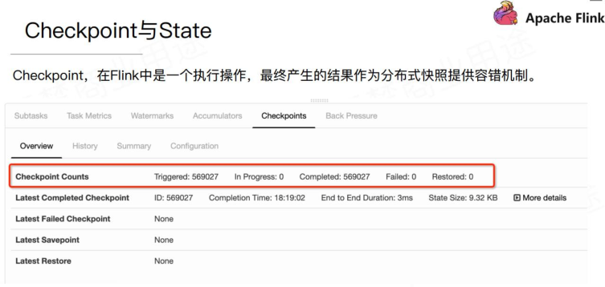

状态State与检查点Checkpoint之间关系：`Checkpoint将某个时刻应用状态State进行快照Snapshot并保存Save`。


> - 1）、`State`：存储的是某一个Operator的运行的状态/历史值，是**维护在内存Memory**中。

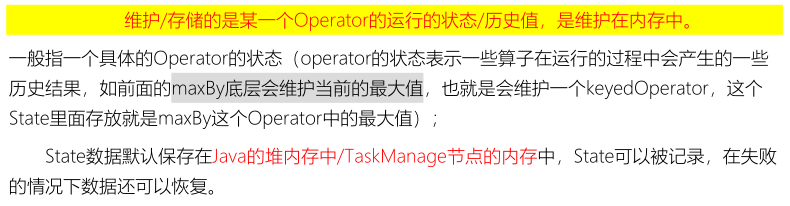


> - 2）、`Checkpoint`：某一时刻，Flink中所有Operator当前**State的全局快照**，一般存在**磁盘上**。


> ​			Flink的Checkpoint的核心算法叫做`Chandy-Lamport`，是一种分布式快照（Distributed Snapshot）算法，应用到流式系统中就是**确定一个 Global 的 Snapshot**，错误处理的时候各个节点根据上一次的 Global Snapshot 来恢复。

​											Chandy-Lamport 算法：https://zhuanlan.zhihu.com/p/53482103

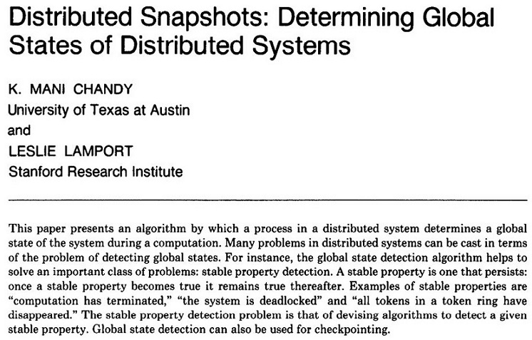


### 06-[掌握]-Flink Checkpoint之执行流程

---


​			Checkpoint是Flink实现容错机制最核心的功能，根据配置[周期性地基于Stream中各个Operator/task的状态State来生成快照，从而将这些状态数据定期持久化存储下来，当Flink程序一旦意外崩溃时，重新运行程序时可以有选择地从这些快照进行恢复，从而修正因为故障带来的程序数据异常]()。


> ​			Checkpoint实现的核心就是`barrier（栅栏或屏障）`，Flink通过在数据集上**间隔性**的生成**屏障barrier**，并通过barrier将某段时间内的状态State数据保存到Checkpoint中（先快照，再保存）。

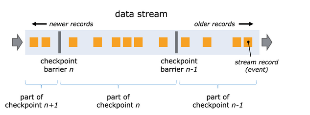


> 下图展示Checkpoint时整体流程，简易版本：

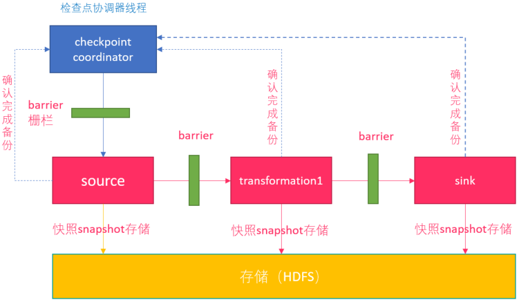


1. Flink的`JobManager`创建`CheckpointCoordinator`；
2. Coordinator向所有的`SourceOperator`发送Barrier栅栏(理解为执行Checkpoint的信号)；
3. SourceOperator接收到Barrier之后，暂停当前的操作(暂停的时间很短，因为后续的写快照是异步的)，并制作State快照, 然后将自己的快照保存到指定的介质中(如HDFS), 一切 ok之后向Coordinator汇报并将Barrier发送给下游的其他Operator；
4. 其他的如TransformationOperator接收到Barrier，重复第3步，最后将Barrier发送给Sink；
5. Sink接收到Barrier之后重复第3步；
6. Coordinator接收到所有的Operator的执行ok的汇报结果，认为本次快照执行成功；


> ==栅栏对齐==：下游subTask必须接收到上游的**所有SubTask**发送Barrier栅栏信号，才开始进行Checkpoint操作。

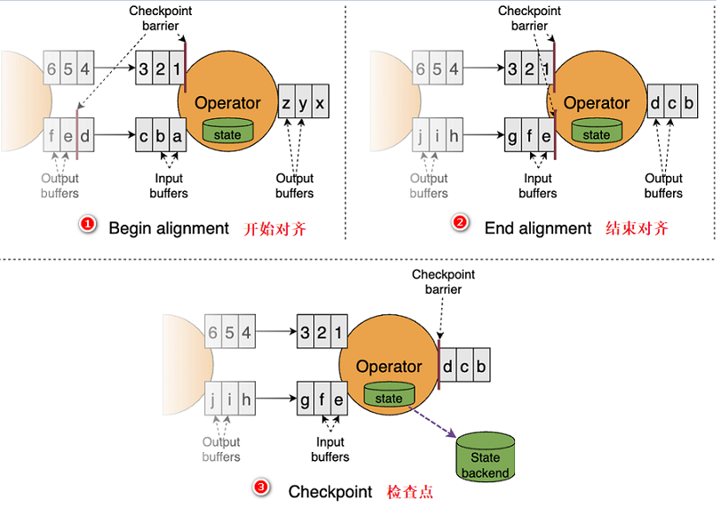

 


### 07-[掌握]-Flink Checkpoint之StateBackend 

---


```ini
# StateBackend（状态后端）：
	1、State状态存储地方： 内存Memory
	
	2、Checkpoint检查点存储地方：Fs文件系统或Memory
```

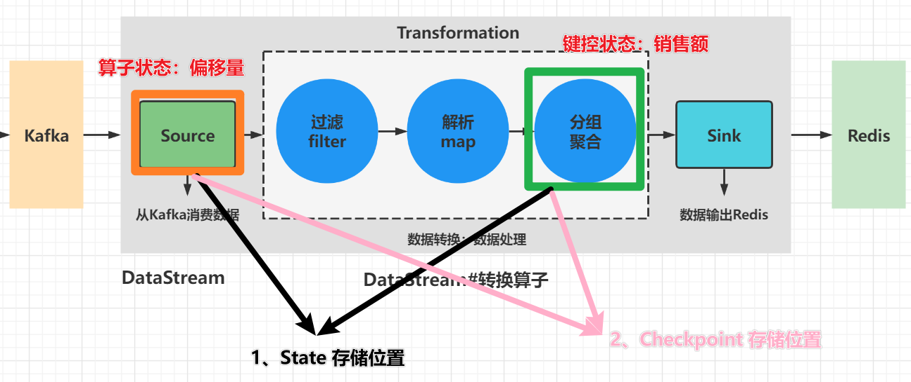


> ​			Checkpoint其实就`是Flink中某一时刻，所有的Operator的全局快照，那么快照应该要有一个地方进行存储`，而这个存储的地方叫做**状态后端（StateBackend**）。

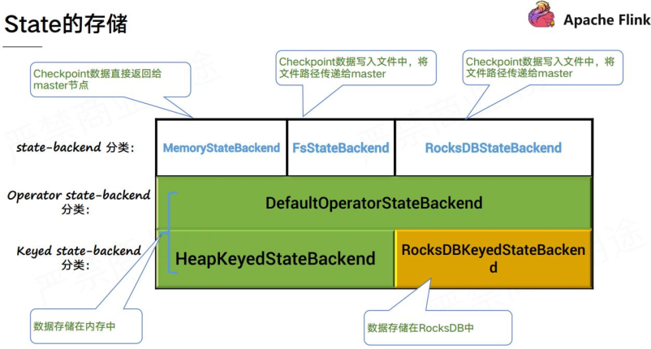


> **Flink 1.13之前**状态后端存储，三种方式：**Memory（内存）、Fs（文件系统）和RocksDB（嵌入式数据库）**。

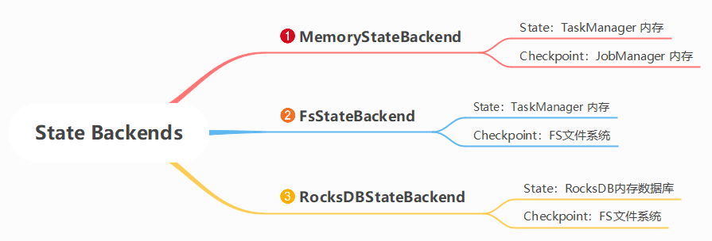


> - 1）、`MemoryStateBackend`
>   - State存储：**TaskManager**内存中
>   - Checkpoint存储：**JobManager**内存中

[推荐使用的场景为：本地测试、几乎无状态的作业，比如 ETL、JobManager 不容易挂，或挂掉影响不大的情况。不推荐在生产场景使用。]()

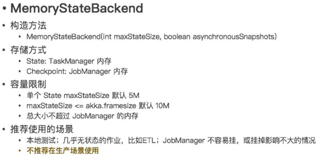


> - 2）、`FsStateBackend`
>   - State存储：==TaskManager==内存
>   - Checkpoint存储：可靠外部存储文件系统，本地测试可以为LocalFS，==测试生产HDFS==

[推荐使用的场景为：常规使用状态的作业，例如分钟级窗口聚合或 join、需要开启HA的作业]()

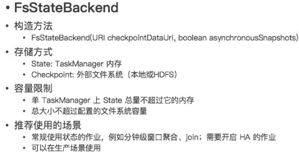

> 当Checkpoint时存储到文件系统时，设置格式

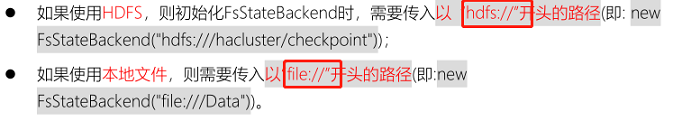


> - 3）、`RocksDBStateBackend`
>   - `RocksDB` 是一个 **嵌入式本地key/value 内存数据库**，和其他的 key/value 一样，==先将状态放到内存中，如果内存快满时，则写入到磁盘中==。类似Redis内存数据库。
>   - State存储：TaskManager内存数据库（==RocksDB==）
>   - Checkpoint存储：外部文件系统，比如HDFS可靠文件系统中

[推荐使用的场景为：超大状态的作业，例如天级窗口聚合、需要开启 HA 的作业、最好是对状态读写性能要求不高的作业。]()

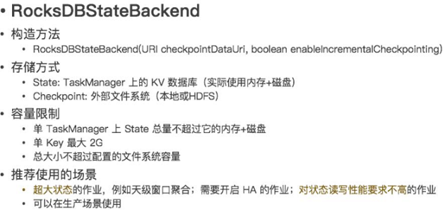


> ​			在**Flink 1.13**之前版本，**状态State存储和Checkpoint检查点**两个功能是混在一起的，即把**状态存储和检查点的创建**概念笼统的混在一起，导致初学者对此部分感觉很混乱，很难理解。

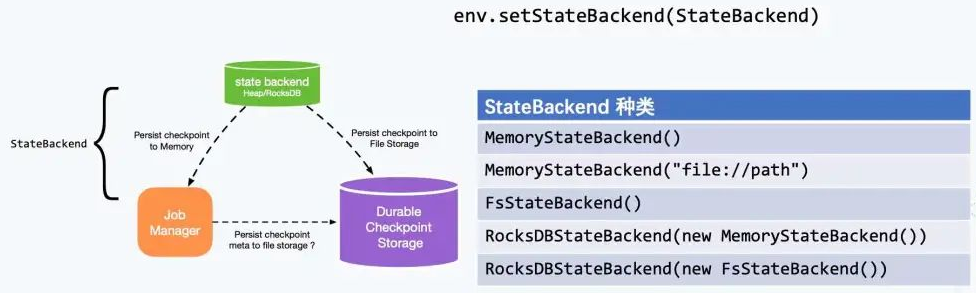


> Flink 1.13 中将`状态State`和`检查点Checkpoint`两者区分开来。
>
> - State Backend 的概念变窄，只描述状态访问和存储；
> - Checkpoint storage，描述的是 Checkpoint 行为，如 Checkpoint 数据是发回给 JM 内存还是上传到远程。

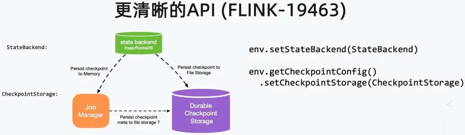


> ​		从**Flink 1.13**版本开始，社区重新设计了其公共状态后端类，以帮助用户更好地理解本地状态存储和检查点存储的分离。[此时StateBackend后端，分为2种情况：]()

https://nightlies.apache.org/flink/flink-docs-release-1.13/docs/ops/state/state_backends/#available-state-backends

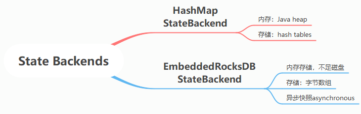


> Checkpoint存储支持2种方式：==JobManager内存和FileSystem文件系统==。

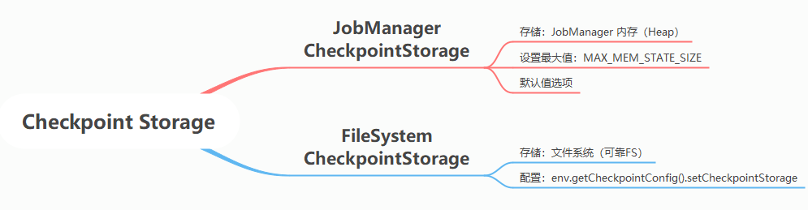


> ​			Flink 1.13 中State和Checkpoint两个概念被拆开，[当前不仅需要指定 State Backend ，还需要指定 Checkpoint Storage，以下就是新老接口的对应关系：]()

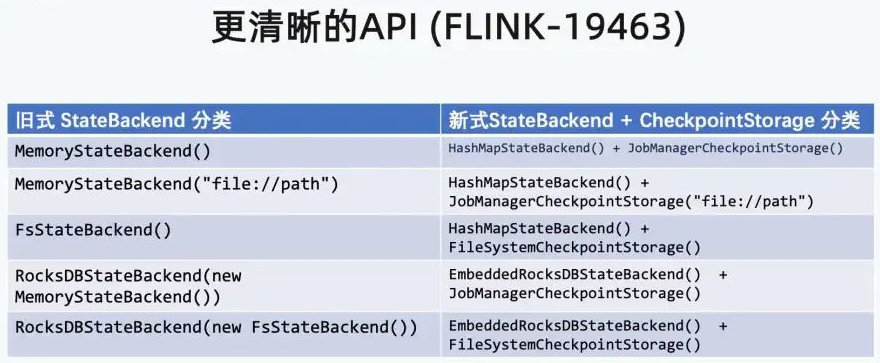


### 08-[掌握]-Flink Checkpoint之Checkpoint 案例演示 

---


在Flink如何配置Checkpoint，有如下几种方式：

> - 1）、全局配置，配置文件：`flink-conf.yaml`

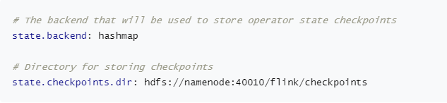


> - 2）、在代码中配置：每个应用单独配置

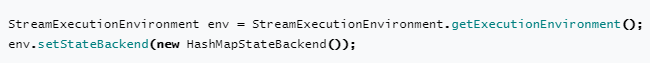

注意：如果将State存储`RocksDBStateBackend`内存中，需要引入相关依赖

```xml
<dependency>
    <groupId>org.apache.flink</groupId>
    <artifactId>flink-statebackend-rocksdb_2.11</artifactId>
    <version>1.13.1</version>
</dependency>
```


> **Flink 1.13**版本，应用程序使用新 API，兼容以前版本State状态和Checkpoint检查点设置：

- 第一种：内存状态后端【**MemoryStateBackend**】

---

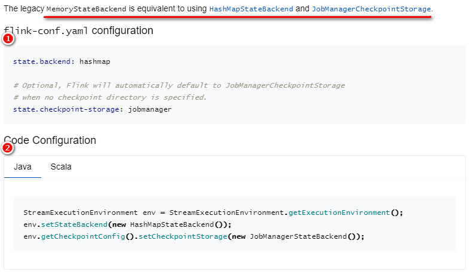


- 第二种：文件系统状态后端【**FsStateBackend**】

---

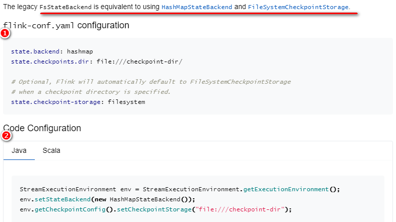


- 第三种：RocksDB状态后端【**RocksDBStateBackend** 】

---

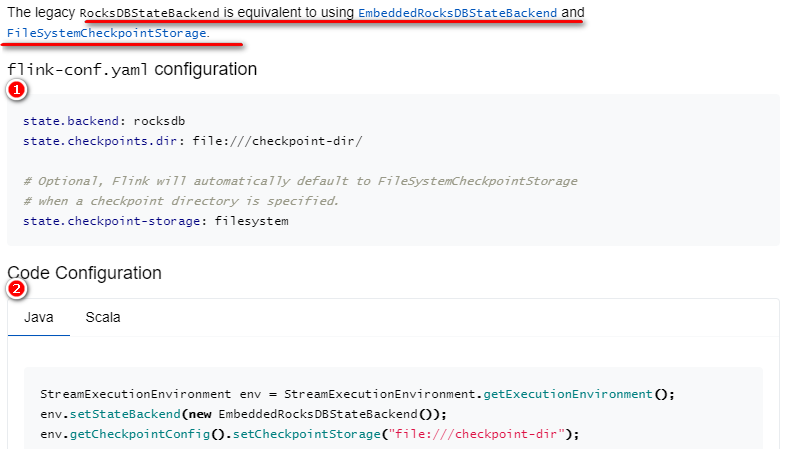


> ​			编写Flink入门案例程序，词频统计WordCount，**自定义数据源**，产生数据：`spark flink`，设置Checkpoint，运行程序，查看Checkpoint检查点数据存储。

https://nightlies.apache.org/flink/flink-docs-release-1.13/docs/dev/datastream/fault-tolerance/checkpointing/

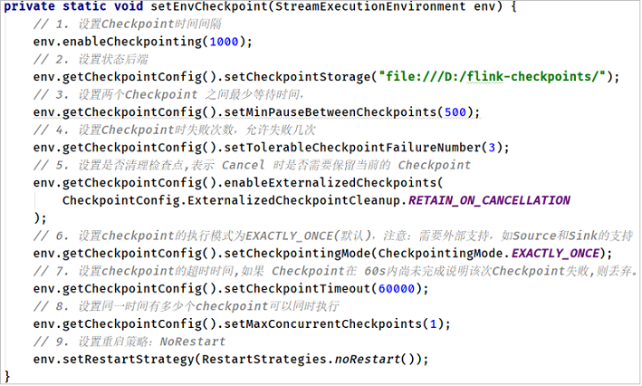


> 代码中加上上述针对Checkpoint设置代码，完整代码如下：

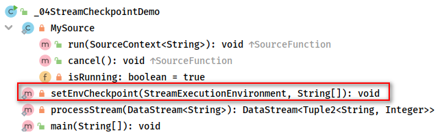


```java
package cn.itcast.flink.ckpt;

import org.apache.flink.api.common.functions.FlatMapFunction;
import org.apache.flink.api.common.functions.MapFunction;
import org.apache.flink.api.java.tuple.Tuple2;
import org.apache.flink.configuration.Configuration;
import org.apache.flink.runtime.state.hashmap.HashMapStateBackend;
import org.apache.flink.streaming.api.CheckpointingMode;
import org.apache.flink.streaming.api.datastream.DataStreamSource;
import org.apache.flink.streaming.api.datastream.SingleOutputStreamOperator;
import org.apache.flink.streaming.api.environment.CheckpointConfig;
import org.apache.flink.streaming.api.environment.StreamExecutionEnvironment;
import org.apache.flink.streaming.api.functions.source.RichParallelSourceFunction;
import org.apache.flink.util.Collector;

import java.util.concurrent.TimeUnit;

/**
 * Flink 流式计算程序检查点Checkpoint配置
 * @author xuyuan
 */
public class StreamCheckpointSettingDemo {

	/**
	 * 自定义数据源，每隔1秒产生1条数据
	 */
	private static class DataSource extends RichParallelSourceFunction<String> {
		private boolean isRunning = true ;

		@Override
		public void run(SourceContext<String> ctx) throws Exception {
			while (isRunning){
				// 发送数据
				ctx.collect("spark flink flink");

				// 每隔1秒发送1条数据
				TimeUnit.SECONDS.sleep(1);
			}
		}

		@Override
		public void cancel() {
			isRunning = false ;
		}
	}

	public static void main(String[] args) throws Exception {
		// 1. 执行环境-env
		Configuration configuration = new Configuration();
		configuration.setString("rest.port", "8081");
		StreamExecutionEnvironment env = StreamExecutionEnvironment.getExecutionEnvironment(configuration);
		env.setParallelism(1) ;
		// todo: 设置检查点Checkpoint属性，状态保存和快照保存
		setEnvCheckpoint(env);

		// 2. 数据源-source
		DataStreamSource<String> dataStream = env.addSource(new DataSource());

		// 3. 数据转换-transformation
		SingleOutputStreamOperator<Tuple2<String, Integer>> outputStream = dataStream
			.flatMap(new FlatMapFunction<String, String>() {
				@Override
				public void flatMap(String value, Collector<String> out) throws Exception {
					String[] words = value.split("\\s+");
					for (String word : words) {
						out.collect(word);
					}
				}
			})
			.map(new MapFunction<String, Tuple2<String, Integer>>() {
				@Override
				public Tuple2<String, Integer> map(String value) throws Exception {
					return Tuple2.of(value, 1);
				}
			})
			.keyBy(tuple -> tuple.f0).sum(1);

		// 4. 数据终端-sink
		outputStream.printToErr();

		// 5. 触发执行-execute
		env.execute("StreamCheckpointDemo");
	}

	/**
	 * Flink 流式应用，Checkpoint 检查点设置
	 */
	private static void setEnvCheckpoint(StreamExecutionEnvironment env) {
		// 1. 启用检查点，设置时间间隔
		env.enableCheckpointing(5000) ;
		// 2. 状态后端，state存储
		env.setStateBackend(new HashMapStateBackend());
		// 3. 检查点存储，Checkpoint存储
		env.getCheckpointConfig().setCheckpointStorage("file:///D:/BigDataSH34/ckpts");
		// todo: 设置Checkpoint检查相关属性
		// 4. 相邻两个Checkpoint间隔最小时间
		env.getCheckpointConfig().setMinPauseBetweenCheckpoints(500);
		// 5. 容忍Checkpoint失败最大次数
		env.getCheckpointConfig().setTolerableCheckpointFailureNumber(3);
		// 6. 当job取消，保存Checkpoint数据，默认自动删除数据
		env.getCheckpointConfig().enableExternalizedCheckpoints(
            CheckpointConfig.ExternalizedCheckpointCleanup.RETAIN_ON_CANCELLATION
        );
		// 7. 允许同时进行Checkpoint数目：1个
		env.getCheckpointConfig().setMaxConcurrentCheckpoints(1);
		// 8. Checkpoint超时时间，如果超过时间，就表示失败
		env.getCheckpointConfig().setCheckpointTimeout(5 * 60 * 1000L);
		// 9. Checkpoint执行模式化：精确性一次语义
		env.getCheckpointConfig().setCheckpointingMode(CheckpointingMode.EXACTLY_ONCE);
	}

}  
```

运行流式程序，WEB 监控页面查看Checkpoint检查点统计信息：

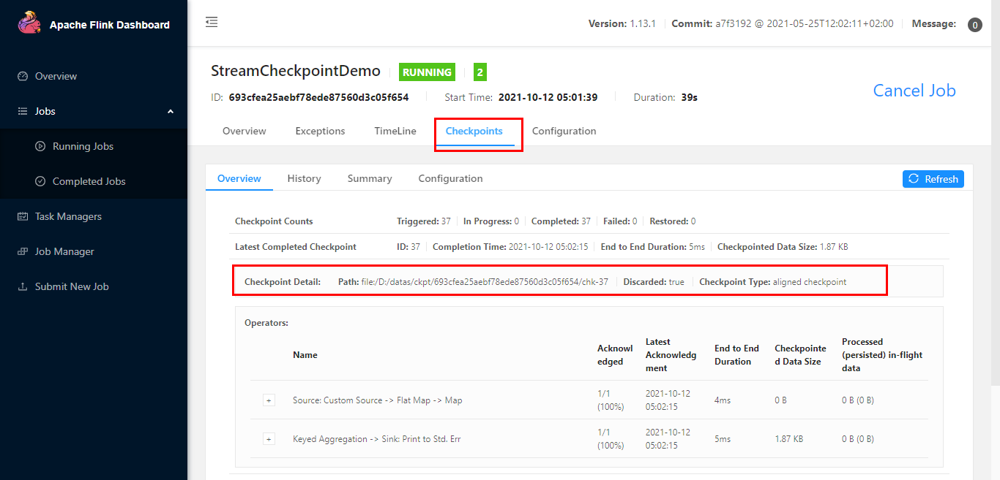


### 09-[掌握]-Flink Checkpoint之手动重启恢复状态 

---


在Flink流式计算程序中，如果设置Checkpoint检查点以后，当应用程序运行失败，可以从检查点恢复：

> - 1）、`手动重启`应用，从Checkpoint恢复状态
>   - 程序升级（人为停止程序）等
> - 2）、`自动重启`应用，从Checkpoint恢复状态
>   - 程序异常时，自动重启，继续运行处理数据，比如出现“脏数据”
>   - 自动重启，设置最大重启次数，如果重启超过设置次数，需要人为干预，进行手动重启


[将上述Flink程序，打成jar包，在Flink Standalone Cluster上提交运行]()，具体操作步骤如下所示：

---

- step1、把程序打包


- step2、启动Flink集群(Standalone 分布式集群)

  ```ini
  # 如果HDFS没有启动，先启动服务，将Checkpoint数据保存到HDFS文件系统
  [root@node1 ~]# hadoop-daemon.sh start namenode 
  [root@node1 ~]# hadoop-daemons.sh start datanode 
  
  [root@node1 ~]# /export/server/flink-standalone/bin/start-cluster.sh
  ```


- step3、访问webUI：http://node1.itcast.cn:8081/#/overview

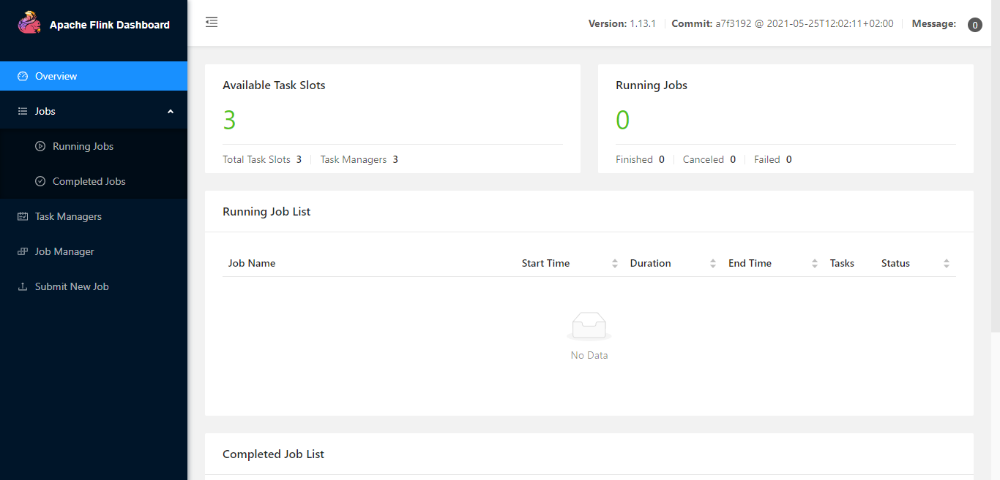


- step4、使用Flink WebUI提交，填写如下参数

```ini
cn.itcast.flink.checkpoint.StreamCheckpointDemo
hdfs://node1.itcast.cn:8020/flink/checkpoint
```

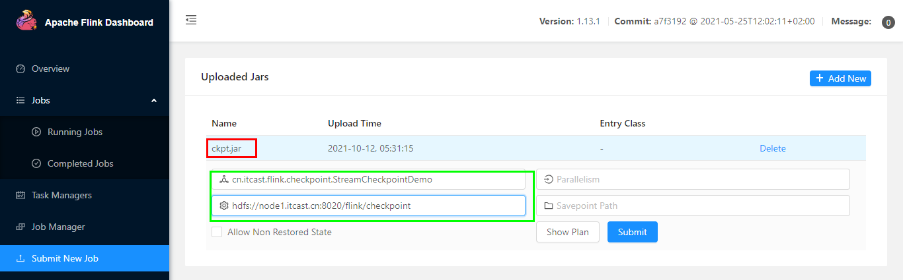


- step5、取消任务

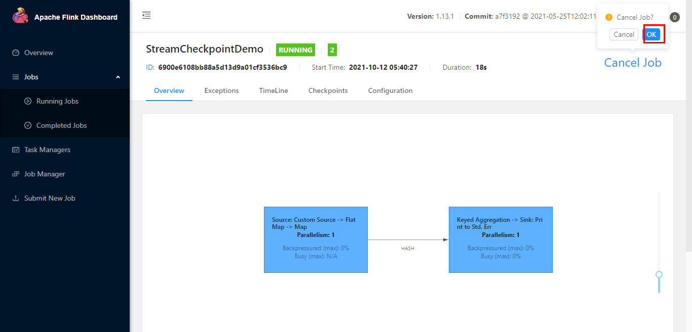


- step6、查看HDFS目录，Checkpoint存文件


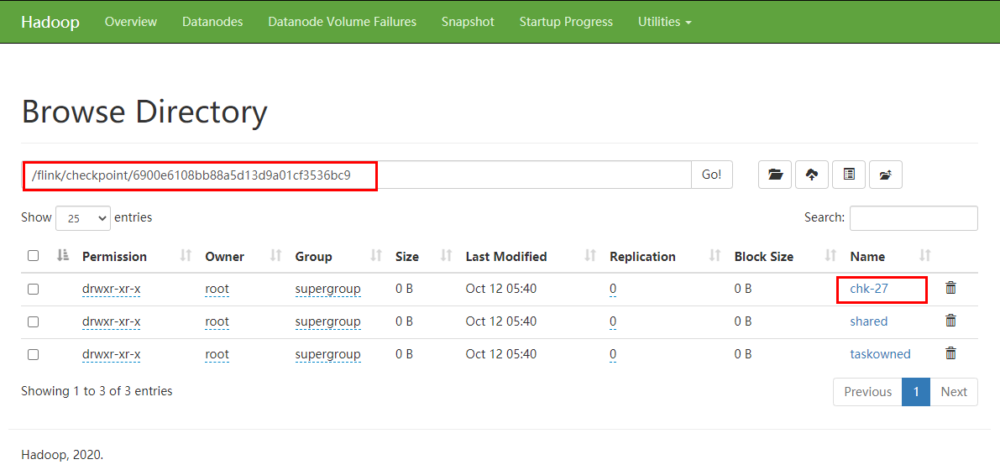


- step7、重新启动任务并指定从哪恢复

```ini
cn.itcast.flink.checkpoint.StreamCheckpointDemo
hdfs://node1.itcast.cn:8020/flink/checkpoint
hdfs://node1.itcast.cn:8020/flink/checkpoint/6900e6108bb88a5d13d9a01cf3536bc9/chk-27
```

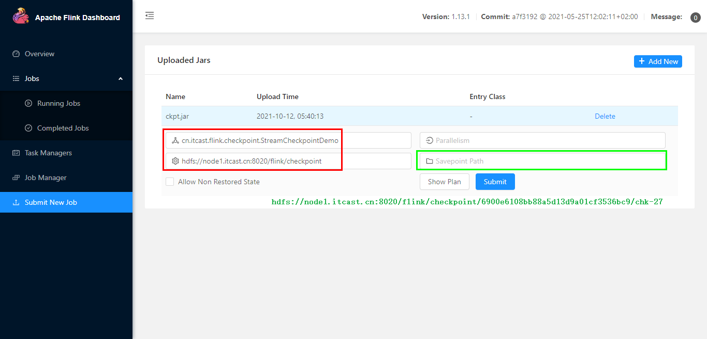


> 查看Job作业运行结果时，与上一次最后结果，相比较发现，继续上次结果计算数据。

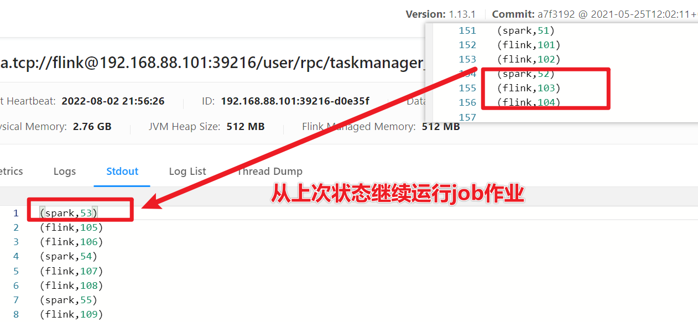


> 使用`flink run` 运行Job执行，指定参数选项 `-s path`，从Checkpoint检查点启动，恢复以前状态。

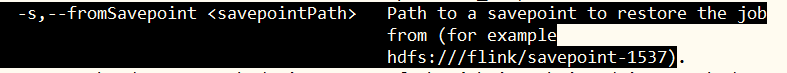


### 10-[理解]-Flink Checkpoint之自动重启恢复状态 

---


> 在Flink流式计算程序中，可以设置当应用处理数据异常时，可以自动重启，相关设置如下：
>

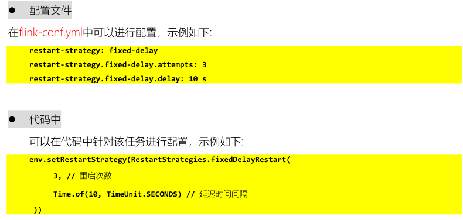


> 重启策略分为4类：
>
> - 1）、`默认重启策略`
>   - 如果配置Checkpoint，没有配置重启策略，那么代码中出现了非致命错误时，程序会无限重启。
> - 2）、`无重启策略`
>   - Job直接失败，不会尝试进行重启

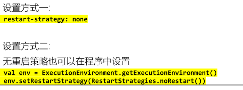


> - 3）、==固定延迟重启策略==（开发中使用）
>   - 设置固定重启次数，及重启间隔时间

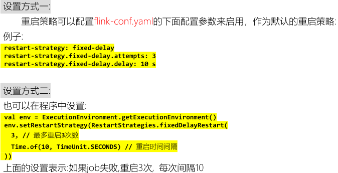


> - 4）、==失败率重启策略==（偶尔使用）

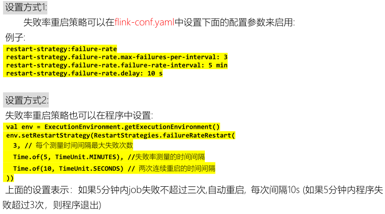


> 修改前面Checkpoint程序，设置自动重启策略：**自动重启3次，每次时间间隔为5秒**。
>

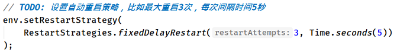

```Java
package cn.itcast.flink.checkpoint;

import org.apache.flink.api.common.functions.FlatMapFunction;
import org.apache.flink.api.common.restartstrategy.RestartStrategies;
import org.apache.flink.api.java.tuple.Tuple2;
import org.apache.flink.configuration.Configuration;
import org.apache.flink.runtime.state.hashmap.HashMapStateBackend;
import org.apache.flink.streaming.api.CheckpointingMode;
import org.apache.flink.streaming.api.datastream.DataStreamSource;
import org.apache.flink.streaming.api.datastream.SingleOutputStreamOperator;
import org.apache.flink.streaming.api.environment.CheckpointConfig;
import org.apache.flink.streaming.api.environment.StreamExecutionEnvironment;
import org.apache.flink.streaming.api.functions.source.RichParallelSourceFunction;
import org.apache.flink.util.Collector;

import java.util.concurrent.TimeUnit;

public class StreamRestartStrategyDemo {

	/**
	 * 自定义数据源，每隔一定时间产生字符串
	 */
	private static class MySource extends RichParallelSourceFunction<String>{
		private boolean isRunning = true ;

		@Override
		public void run(SourceContext<String> ctx) throws Exception {
			int counter = 0 ;
			while (isRunning){
				// 发送数据
				ctx.collect("spark flink flink");

				// 每隔1秒发送1次数据
				TimeUnit.SECONDS.sleep(1);

				counter += 1;
				if(counter % 5 == 0){
					throw new RuntimeException("程序出现异常啦.......................") ;
				}
			}
		}

		@Override
		public void cancel() {
			isRunning = false ;
		}
	}

	public static void main(String[] args) throws Exception {
		// 1. 执行环境-env
		Configuration configuration = new Configuration() ;
		configuration.setString("rest.port", "8081");
		StreamExecutionEnvironment env = StreamExecutionEnvironment.getExecutionEnvironment(configuration);
		env.setParallelism(1) ;
		// todo: 设置检查点Checkpoint属性，保存状态和快照保存
		setEnvCheckpoint(env, args) ;
		// todo: 设置重启策略，默认情况下，非程序致命错误，无限重启
		env.setRestartStrategy(
			RestartStrategies.fixedDelayRestart(3, 10000)
		);

		// 2. 数据源-source
		DataStreamSource<String> inputStream = env.addSource(new MySource());

		// 3. 数据转换-transformation
		SingleOutputStreamOperator<Tuple2<String, Integer>> outputStream = inputStream
			.filter(line -> line.trim().length() > 0)
			.flatMap(new FlatMapFunction<String, Tuple2<String, Integer>>() {
				@Override
				public void flatMap(String value, Collector<Tuple2<String, Integer>> out) throws Exception {
					String[] words = value.trim().split("\\s+");
					for (String word : words) {
						out.collect(Tuple2.of(word, 1));
					}
				}
			})
			.keyBy(tuple -> tuple.f0).sum(1);

		// 4. 数据终端-sink
		outputStream.printToErr();

		// 5. 触发执行-execute
		env.execute("StreamRestartStrategyDemo");
	}

	/**
	 * Flink 流式应用，Checkpoint检查点属性设置
	 */
	private static void setEnvCheckpoint(StreamExecutionEnvironment env, String[] args) {
		/* TODO： ================================== 建议必须设置 ================================== */
// 1. 设置Checkpoint-State的状态后端为FsStateBackend，本地测试时使用本地路径，集群测试时使用传入的HDFS的路径
		env.setStateBackend(new HashMapStateBackend()) ;
		if (args.length < 1) {
			env.getCheckpointConfig().setCheckpointStorage("file:///D:/ckpt");
		} else {
			// 后续集群测试时，传入参数：hdfs://node1.itcast.cn:8020/flink-checkpoints/checkpoint
			env.getCheckpointConfig().setCheckpointStorage(args[0]);
		}
/*
2. 设置Checkpoint时间间隔为1000ms，意思是做 2 个 Checkpoint 的间隔为1000ms。
Checkpoint 做的越频繁，恢复数据时就越简单，同时 Checkpoint 相应的也会有一些IO消耗。
*/
		env.enableCheckpointing(1000);// 默认情况下如果不设置时间checkpoint是没有开启的
/*
3. 设置两个Checkpoint 之间最少等待时间，如设置Checkpoint之间最少是要等 500ms
为了避免每隔1000ms做一次Checkpoint的时候，前一次太慢和后一次重叠到一起去了
如:高速公路上，每隔1s关口放行一辆车，但是规定了两车之前的最小车距为50m
*/
		env.getCheckpointConfig().setMinPauseBetweenCheckpoints(500);
/*
4. 设置Checkpoint时失败次数，允许失败几次
 */
		env.getCheckpointConfig().setTolerableCheckpointFailureNumber(3); //

/*
5. 设置是否清理检查点,表示 Cancel 时是否需要保留当前的 Checkpoint，默认 Checkpoint会在作业被Cancel时被删除
ExternalizedCheckpointCleanup.RETAIN_ON_CANCELLATION：false，当作业被取消时，保留外部的checkpoint
ExternalizedCheckpointCleanup.DELETE_ON_CANCELLATION：true,当作业被取消时，删除外部的checkpoint(默认值)
*/
		env.getCheckpointConfig().enableExternalizedCheckpoints(
			CheckpointConfig.ExternalizedCheckpointCleanup.RETAIN_ON_CANCELLATION
		);

		/* TODO： ================================== 直接使用默认的即可 ================================== */
/*
6. 设置checkpoint的执行模式为EXACTLY_ONCE(默认)，注意:需要外部支持，如Source和Sink的支持
 */
		env.getCheckpointConfig().setCheckpointingMode(CheckpointingMode.EXACTLY_ONCE);
/*
7. 设置checkpoint的超时时间,如果 Checkpoint在 60s内尚未完成说明该次Checkpoint失败,则丢弃。
 */
		env.getCheckpointConfig().setCheckpointTimeout(60000);
/*
8. 设置同一时间有多少个checkpoint可以同时执行
 */
		env.getCheckpointConfig().setMaxConcurrentCheckpoints(1); // 默认为1
	}

}  
```


### 11-[理解]-Flink Checkpoint之Savepoint 保存点

---


​			Flink流式计算，提供**Checkpoint机制，程序自动将State进行快速Snapshot，然后进行Checkpoint保存**。此外，还支持用户可以==手动进行Snapshot==，保存State数据，称为：`SavePoint`保存点。

https://nightlies.apache.org/flink/flink-docs-release-1.13/docs/ops/state/savepoints/

> [SavePoint保存点由==用户==手动创建、拥有和删除，它们的用例用于有计划的、手动的备份和恢复。]()

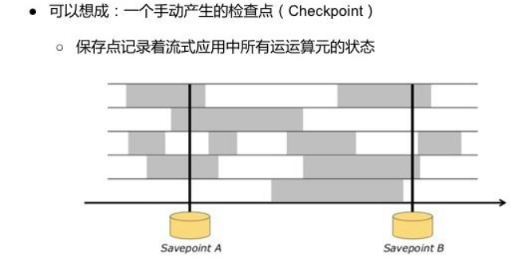


> `Savepoint`：保存点，类似于以前玩游戏的时候，遇到难关/遇到boss，赶紧手动存个档，然后接着玩，如果失败了，赶紧从上次的存档中恢复，然后接着玩。


> **保存点SavePoint和检查点Checkpoint**区别：

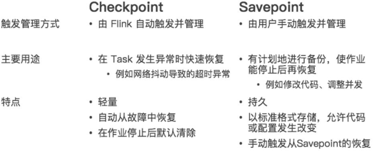


> SavePoint保存配置，可以在`flink-yaml`文件及代码中配置：

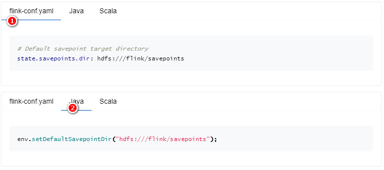


> Flink Savepoint 作为实时任务的全局镜像，可以看做 Checkpoint在特定时期的一个状态快照。

```ini
# Trigger a Savepoint 
$ bin/flink savepoint :jobId [:targetDirectory]

# Trigger a Savepoint with YARN
$ bin/flink savepoint :jobId [:targetDirectory] -yid :yarnAppId

# Stopping a Job with Savepoint
$ bin/flink stop --savepointPath [:targetDirectory] :jobId

# Resuming from Savepoint
$ bin/flink run -s :savepointPath [:runArgs]
```


> **案例演示：**运行前面Checkpoint程序，将其运行在Standalone集群上，采用==WEB UI界面方式部署==运行。

```ini
# 1）、启动HDFS集群和Standalone集群
[root@node1 ~]# hadoop-daemon.sh start namenode 
[root@node1 ~]# hadoop-daemons.sh start datanode 

[root@node1 ~]# /export/server/flink-standalone/bin/start-cluster.sh 

# 清空缓存数据
echo 1 > /proc/sys/vm/drop_caches

# 2）、提交运行Job
/export/server/flink-standalone/bin/flink run -d \
--class cn.itcast.flink.checkpoint.StreamCheckpointDemo \
/root/ckpt.jar hdfs://node1.itcast.cn:8020/flink/checkpoint

# 如果执行上述提交命令，出现找YARN集群提交，需要删除/tmp/.yarn-properties-root 文件即可
rm -rf /tmp/.yarn-properties-root 
```

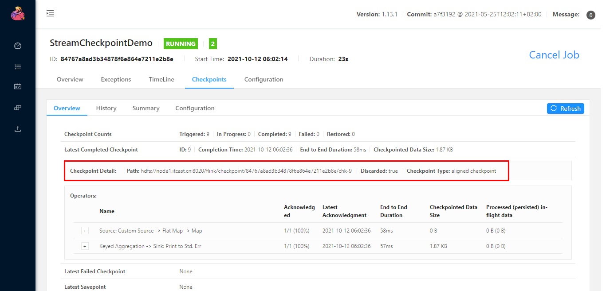


```ini
# 3）、手动创建savepoint
# 停止Job执行，并且进行SavePoint
/export/server/flink-standalone/bin/flink stop --savepointPath hdfs://node1.itcast.cn:8020/flink/savepoint/ 6267b9ee0707a88e39acbe09a641ff2e

# 4）、重新启动job,手动加载savepoint数据
/export/server/flink-standalone/bin/flink run -d \
-s hdfs://node1.itcast.cn:8020/flink/savepoint/savepoint-6267b9-5c31a1b8e6fc \
--class cn.itcast.flink.checkpoint.StreamCheckpointDemo \
/root/ckpt.jar hdfs://node1.itcast.cn:8020/flink/checkpoint

```


## 第三部分：End-to-End Exactly-Once【4个小节】


```

```


### 12-[理解]-End-to-End Exactly-Once之一致性语义

---


> 对于流处理程序内部来说，所谓的**状态一致性**，其实就是所说的==计算结果要保证准确==。

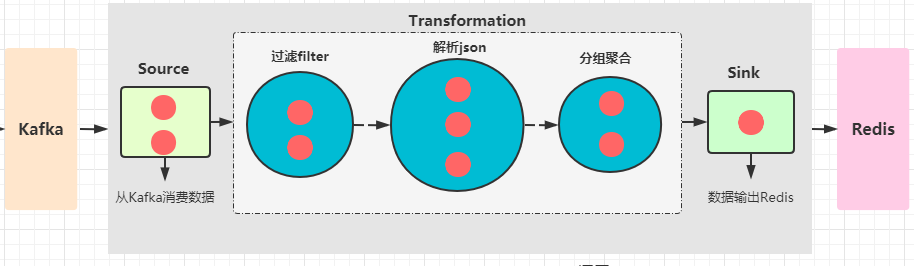

 			对数据流DataStream中每条数据计算时：[一条数据不应该丢失，也不应该重复计算，在遇到故障时可以恢复状态，如果重新计算，结果应该也是完全正确的。]()


> ​		流处理引擎通常为应用程序提供了三种数据处理语义：==最多一次、至少一次和精确一次==，后来Flink计算引擎添加：==端到端精确性一次语义==，不同处理语义的宽松定义(一致性由弱到强)：


> - 1）、最多一次：`At-most-once`，数据可能丢失，没有进行处理

​		当Job任务故障时，最简单的做法是什么都不干，==既不恢复丢失的状态，也不重播丢失的数据==。At-most-once 语义的含义是**最多处理一次事件**。

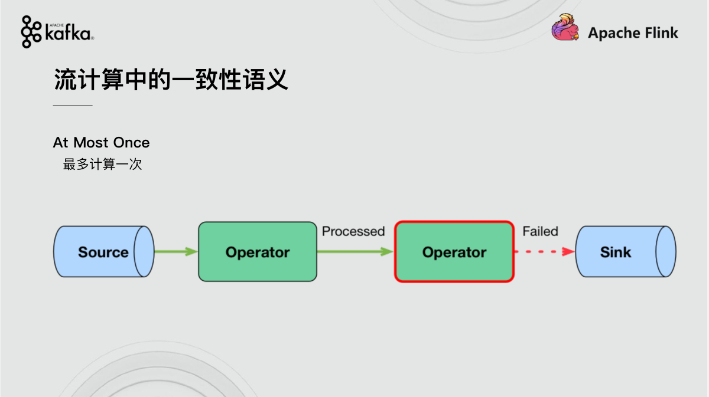


> - 2）、至少一次：`At-least-once`，数据可能被处理多次

​		在大多数的真实应用场景，希望不丢失事件，这种类型的保障称为 **at-least-once**，意思是==所有的事件都得到了处理，而一些事件还可能被处理多次==。

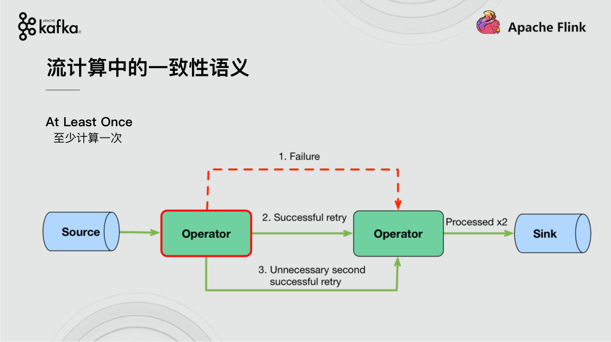


> - 3）、精确一次：`Exactly-once`，数据被处理一次，不会丢弃，也不会重复

 			**恰好处理一次**是最严格的保证，也是最难实现的。恰好处理一次语义不仅仅意味着没有事件丢失，还意味着==针对每一个数据，内部状态仅仅更新一次==。

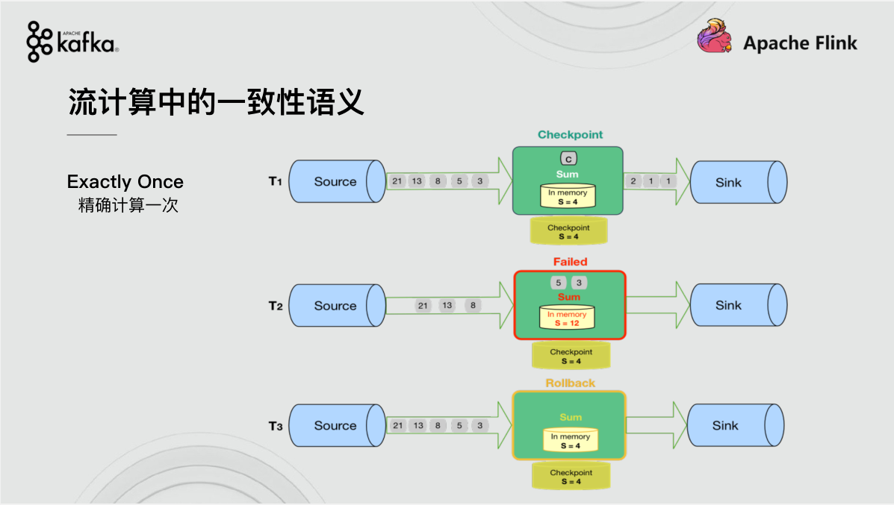

​		Flink **Checkpoint机制和故障恢复机制**给Flink内部提供了精确一次的保证，需要注意的是，所谓精确一次并不是说精确到每个event只执行一次，而是**每个event对状态（计算结果）的影响只有一次**。


> - 4）、`End-to-End Exactly-Once`
>
> [Flink 在1.4.0 版本引入『exactly-once』并号称支持『End-to-End Exactly-Once』“端到端的精确一次”语义。]()

- 端到端的精确一次：**结果的正确性贯穿了整个流处理应用的始终，每一个组件都保证了它自己的一致性**；
- 端到端的精确一次：==Flink 应用从 Source 端开始到 Sink 端结束，数据必须经过的起始点和结束点==；

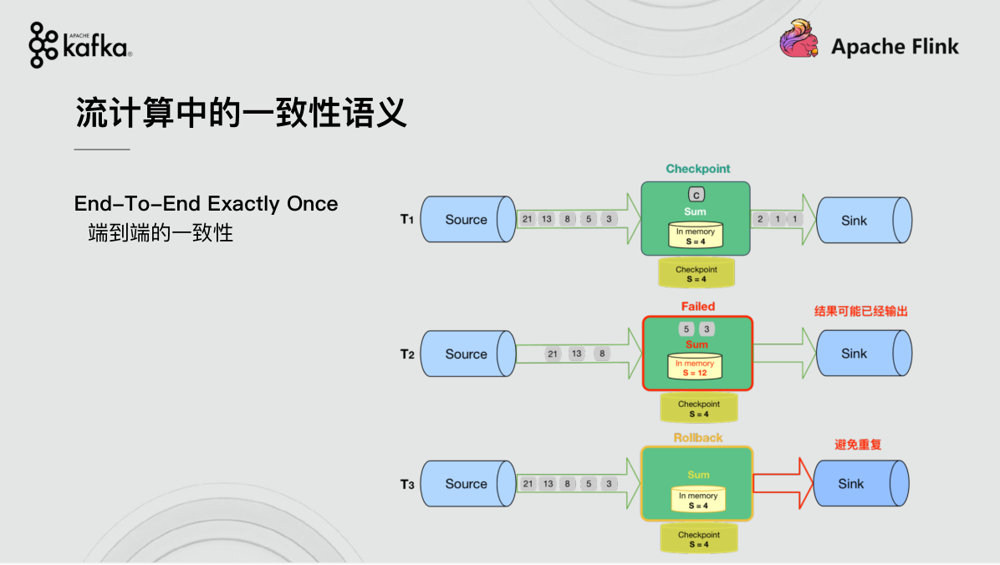


> **『exactly-once』和『End-to-End Exactly-Once』**的区别，如下图所示：

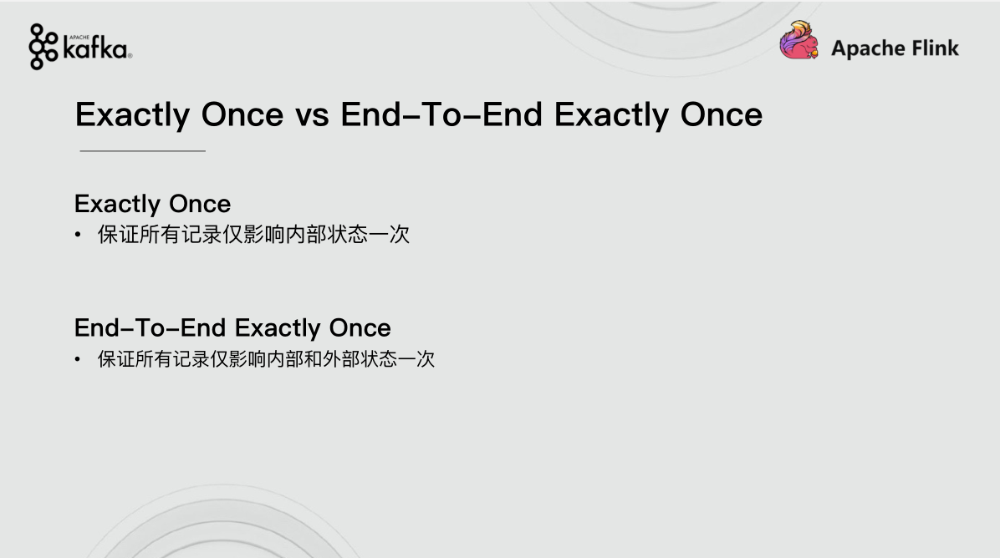


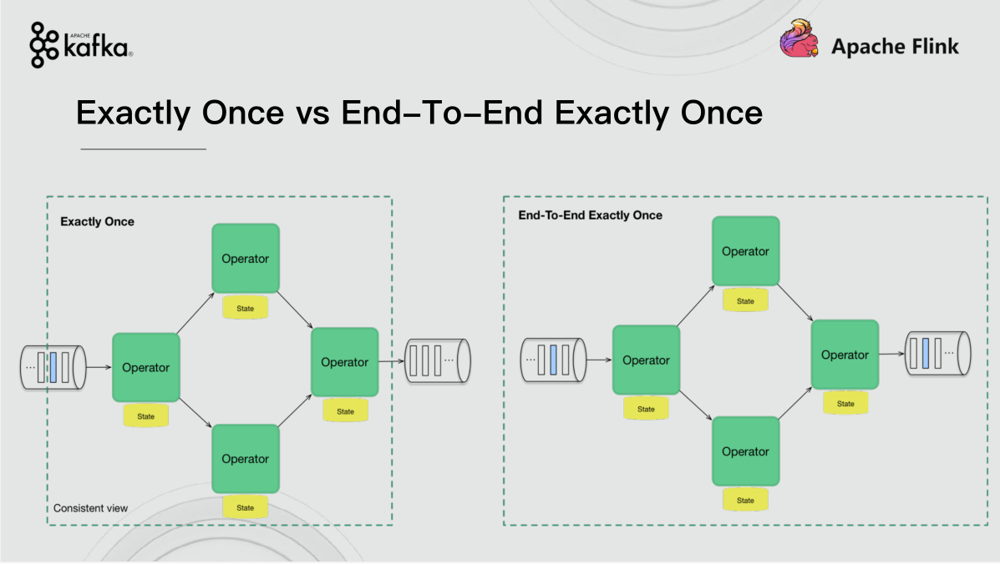


在流式计算引擎中，如果要实现精确一致性语义，有如下三种方式：

> - 1）、方式一：**至少一次+去重**

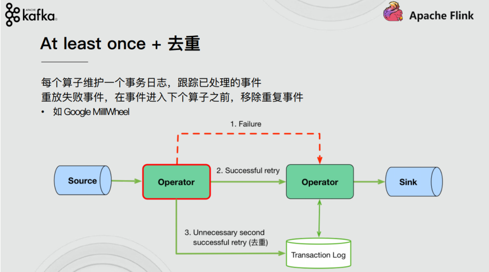


> - 2）、方式二：**至少一次+幂等**

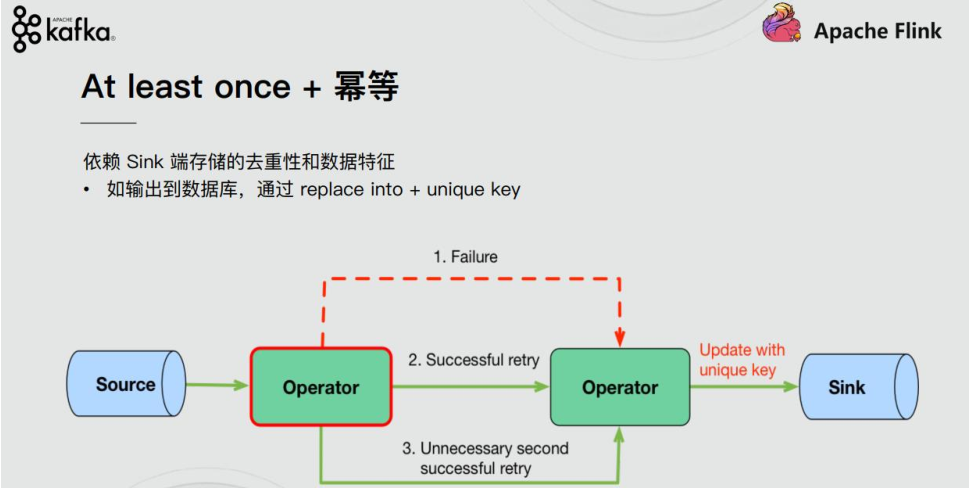


> - 3）、方式三：**分布式快照**

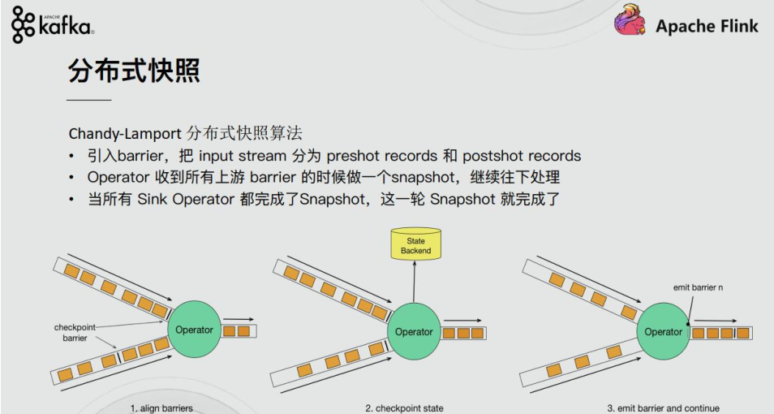


> 上述三种实现流式计算一致性语义方式，综合相比较，如下图所示：

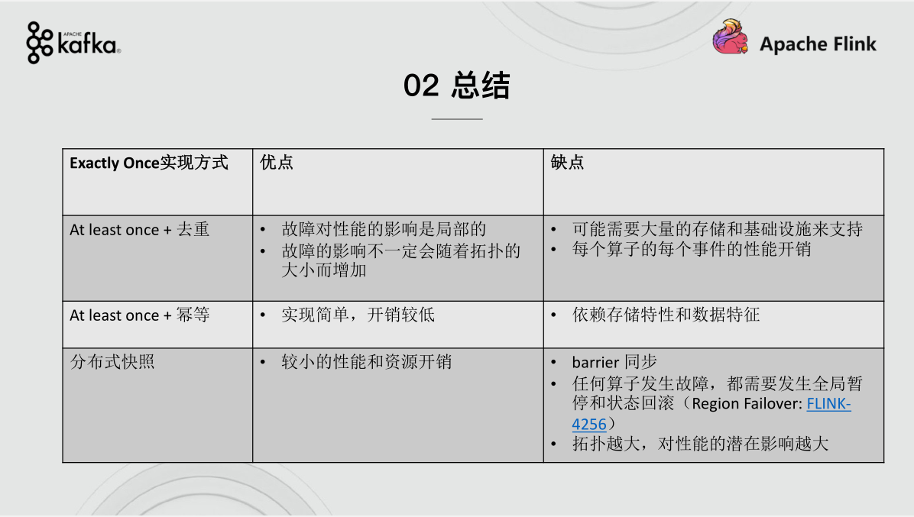


 

### 13-[掌握]-End-to-End Exactly-Once之Flink 一致性实现

---


> ​			Flink 内部借助`分布式快照`Checkpoint已经实现了**内部的Exactly-Once**，但是Flink自身是无法保证外部其他系统“精确一次”语义的，所以**Flink 若要实现所谓“端到端（End to End）的精确一次”的要求，那么外部系统必须支持“精确一次”语义，然后借助一些其他手段才能实现**。
>

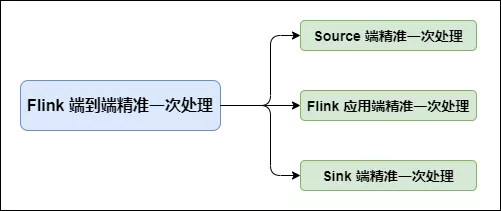


> 1. **数据源Source**：支持`重设数据的读取位置`，比如偏移量offfset（kafka消费数据）
> 2. **数据转换Transformation**：Checkpoint检查点机制（采用分布式快照算法实现一致性）
> 3. **数据终端Sink**：要么支持==幂等性写入==，要么==事务写入==。
>

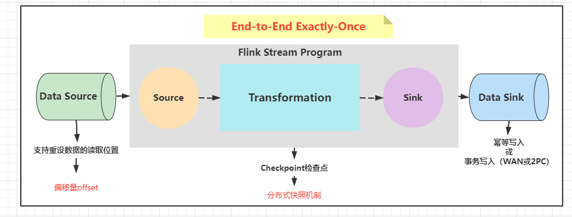


在Flink中**Data Sink要实现精确一次性**：

> - 1）、`幂等写入（Idempotent Writes）`


```ini
1、Redis 内存KeyValue数据库
	set flink:wordcount:spark  99
	
2、HBase NoSQL数据库
	put t1 rk1 info:name zhangsan
	
3、MySQL 数据库
	replace into tbl_xx (id, name, age) Values(1001, ‘张三', 34 ) ；
```


> - 2）、`事务写入（Transactional Writes）`


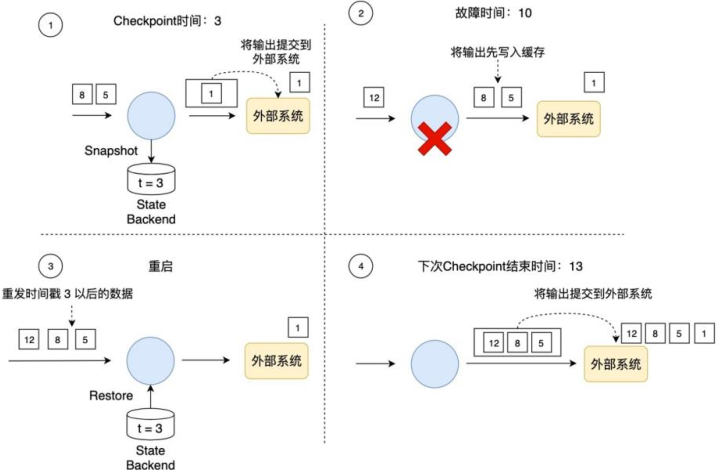


​		在事务写入的具体实现上，Flink目前提供了两种方式：

> 1、预写日志（Write-Ahead-Log）`WAL`

- **把结果数据先当成状态保存，然后在收到 checkpoint 完成的通知时，一次性写入 sink 系统；**
- 简单易于实现，由于数据提前在状态后端中做了缓存，所以无论什么 sink 系统，都能用这种方式；
- DataStream API 提供了一个模板类：`GenericWriteAheadSink`，来实现这种事务性 sink；

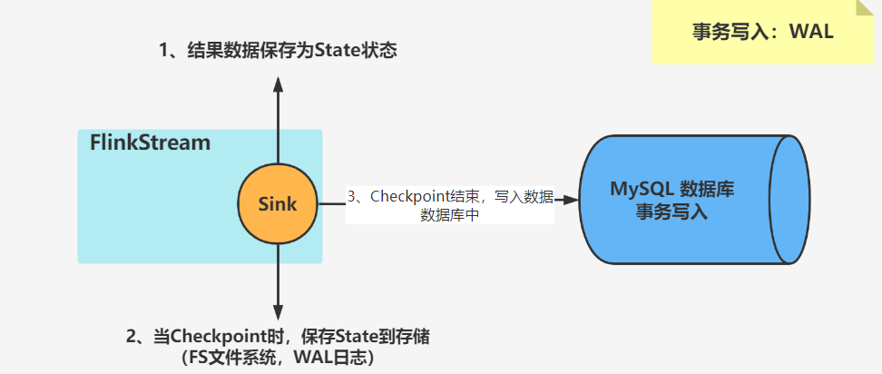


> 2、两阶段提交（`Two-Phase-Commit，2PC`）

- step1、对于每个 checkpoint，Data Sink 任务会启动一个事务，并将接下来所有接收的数据添加到事务里；
- step2、然后将这些数据写入外部 sink 系统，但不提交它们 —— 这时只是**“预提交**”；
- step3、当它收到 checkpoint 完成的通知时，它才正式提交事务，实现结果的真正写入；
- 此种方式真正实现exactly-once，需要一个**提供事务支持的外部 sink 系统**；
- Flink 提供了 `TwoPhaseCommitSinkFunction` 接口。

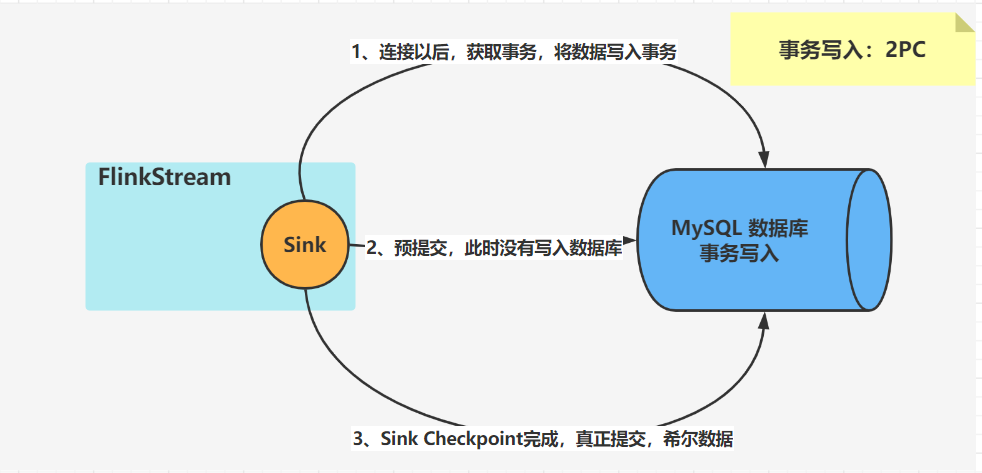


> 预写日志WAL和两阶段提交2PC区别：

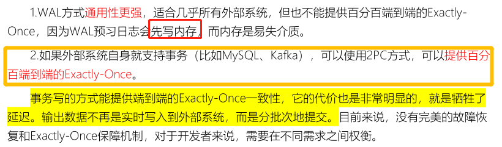


> ​			Flink 流式应用如果要是**端到端精确性一次语义**，从Source数据源端，到Flink应用程序，最后到Sink数据接收器端，满足如下条件即可：


### 14-[理解]-End-to-End Exactly-Once之两阶段提交

---


> 顾名思义，**2PC将分布式事务分成了两个阶段**，两个阶段分别为==提交请求（投票）==和==提交（执行）==。

​		Flink提供基于2PC的SinkFunction，名为`TwoPhaseCommitSinkFunction`，做了一些基础的工作。它的第一层类继承关系如下：

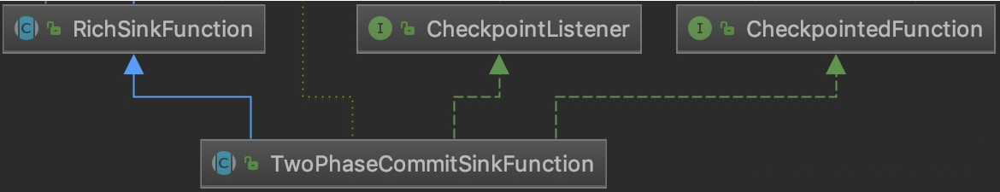


​		`TwoPhaseCommitSinkFunction`仍然留了以下四个抽象方法待子类来实现：

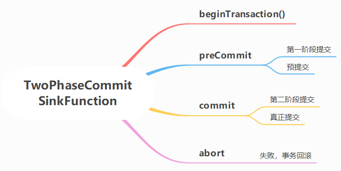


```ini
# 1、开始一个事务，返回事务信息的句柄。
	protected abstract TXN beginTransaction() throws Exception;

# 2、预提交（即提交请求）阶段的逻辑。
	protected abstract void preCommit(TXN transaction) throws Exception;
	当Sink进行Checkpoint完成时，将数据预提交到事务中
  
# 3、正式提交阶段的逻辑。
	protected abstract void commit(TXN transaction);
	当Sink接收到JobManager通知整个Checkpoint完成通知以后，将数据真正提交到外部存储中

# 4、取消事务。
	protected abstract void abort(TXN transaction);
```


> 以MySQL数据库为例，手动事务性提交数据

```Java
package cn.itcast.flink.exactly;


import java.sql.Connection;
import java.sql.DriverManager;
import java.sql.PreparedStatement;
import java.sql.SQLException;

/**
 * 采用JDBC方式向MySQL数据库写入数据
 * @author xuyuan
 */
public class MysqlJdbcDemo {

    /**
        向MySQL数据库写入数据，采用JDBC方式，5个步骤
            1. 加载驱动类
            2. 连接
            3. Statement对象
            4. 执行
            5. 关闭
     */
    public static void main(String[] args) throws SQLException {
        // 定义变量
        Connection connection = null;
        PreparedStatement pstmt = null;

        try {
            // 1. 加载驱动类
            Class.forName("com.mysql.jdbc.Driver");

            // 2. 获取连接
            connection = DriverManager.getConnection("jdbc://...", "root", "123456");
            // todo step1. 开启事务
            connection.setAutoCommit(false);

            // 3. 创建Statement对象
            pstmt = connection.prepareStatement(
                "INSERT INTO db_flink.t_student(id, name, age) VALUES (?, ?, ?)"
            );
            pstmt.setInt(1, 31);
            pstmt.setString(2, "Jack");
            pstmt.setInt(3, 24);

            // 4. 执行SQL todo step2. 预提交
            pstmt.execute();

            // todo step3. 提交
            connection.commit();
        } catch (Exception e) {
            e.printStackTrace();

            // todo step4. 回滚
            if (null != connection) {
                connection.rollback();
            }
        } finally {
            // 5. 关闭连接
            if (null != pstmt) {
                pstmt.close();
            }
            if (null != connection) {
                connection.close();
            }
        }
    }

}
```

​			

​			以Flink与Kafka的集成来说明2PC的具体流程，注意Kafka版本必须是**0.11**及以上，因为只有0.11+的版本才**支持幂等producer以及事务性**，从而2PC才有存在的意义。

> - 1、JobManager 协调各个 TaskManager 进行 checkpoint 存储。checkpoint保存在 StateBackend中，默认StateBackend是**内存级**的。

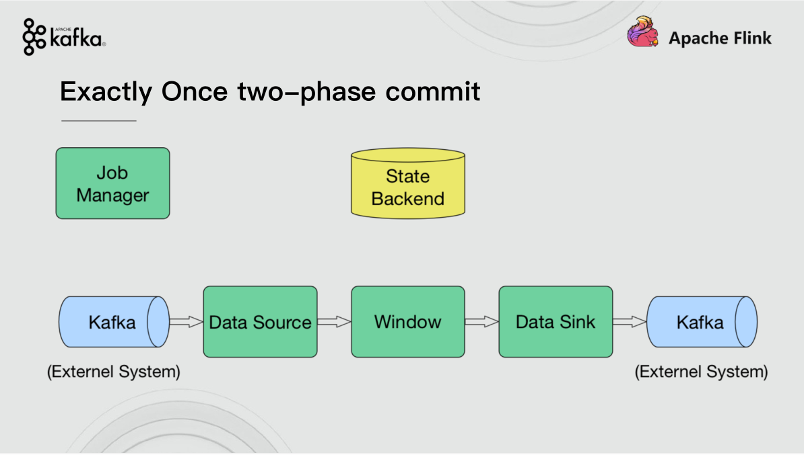


> - 2、当开启了checkpoint ，JobManager 会将检查点分界线（barrier）注入数据流 ，barrier会在算子间传递下去；

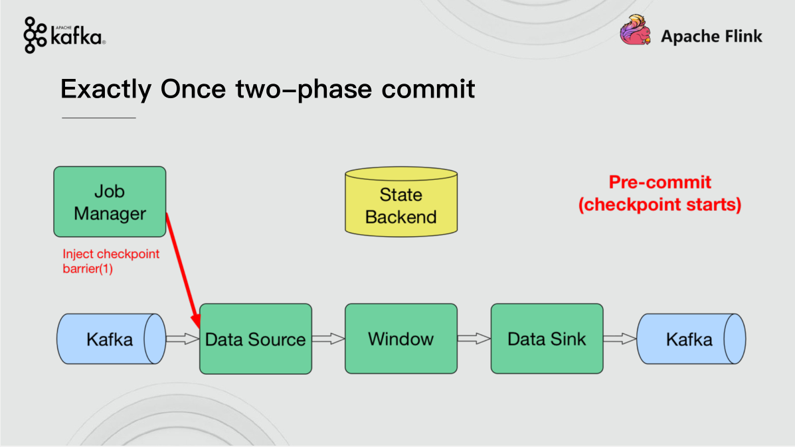


> - 3、每个算子会对当前的状态做个快照，保存到状态后端，checkpoint 机制可以保证内部的状态一致性。

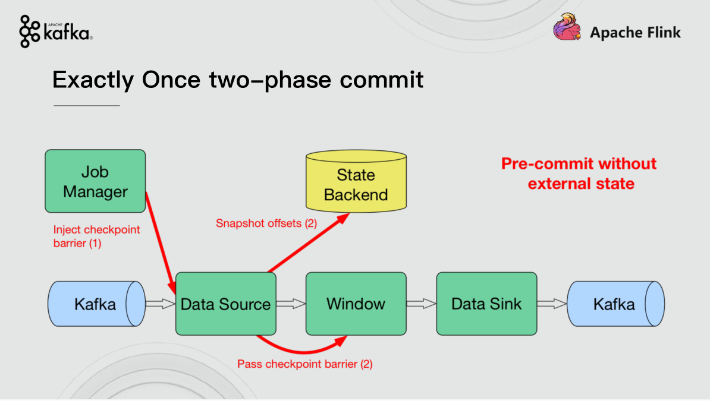


> - 4、每个内部的 transformation 任务遇到 barrier 时，都会把状态存到 checkpoint 里；**sink 任务首先把数据写入外部 kafka，这些数据都属于预提交的事务；**遇到 barrier 时，把状态保存到状态后端，并开启新的预提交事务。

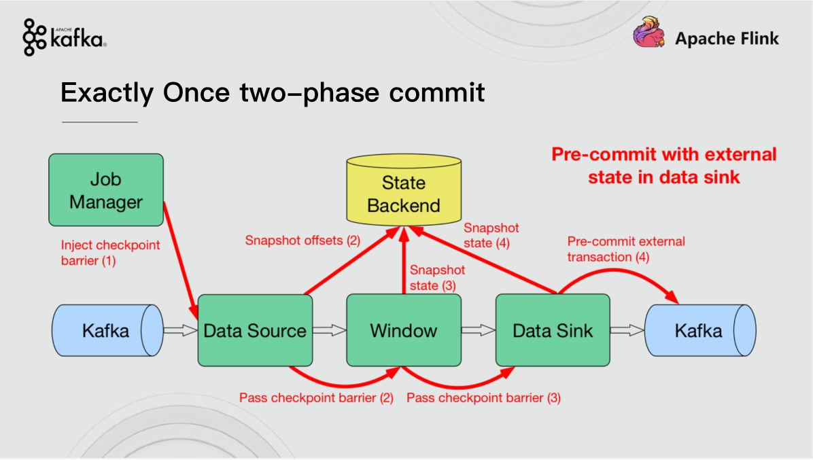


> - 5、当所有算子任务的快照完成，也就是这次的 checkpoint 完成时，JobManager 会向所有任务发通知，确认这次 checkpoint 完成；**sink 任务收到确认通知，正式提交之前的事务，kafka 中未确认数据改为“已确认”。**

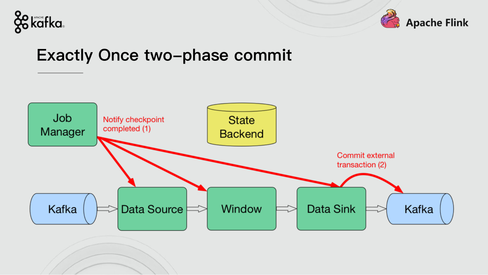


> - 6、只有在所有检查点都成功完成这个前提下，写入才会成功。其中JobManager为协调者，各个算子为参与者（不过只有sink一个参与者会执行提交）。**一旦有检查点失败，notifyCheckpointComplete()方法就不会执行。如果重试也不成功的话，最终会调用abort()方法回滚事务。**

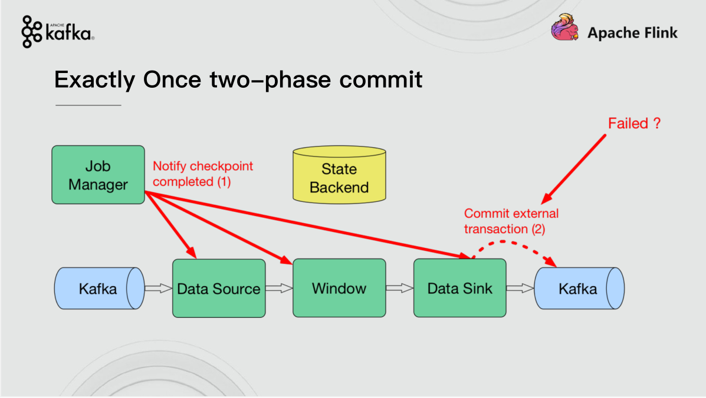


> ​			上述过程可以发现，[一旦Pre-commit完成，必须要确保commit也要成功，Operator和外部系统都需要对此进行保证。]()整个 [两阶段提交协议2PC]()就是解决分布式事务问题，所以才能有如今Flink可以端到端精准一次处理。


### 15-[掌握]-End-to-End Exactly-Once之Flink+Kafka一致性 

---


> 使用Flink + Kafka来实现一个端对端一致性保证：**source(kafka) -> transform -> sink**

- **数据源Source**：Kafka Consumer 作为 Source，可以将偏移量保存下来，如果后续任务出现了故障，恢复的时候可以由连接器FlinkKafkaConsumer/KafkaSource重置偏移量，重新消费数据，保证一致性；
- **数据转换（内部）**： 利用Checkpoin 机制，把状态存盘，发生故障的时候可以恢复，保证内部的状态一致性；
- **数据终端sink**：采用两阶段提交Sink，需要实现一个 `TwoPhaseCommitSinkFunction`

https://flink.apache.org/features/2018/03/01/end-to-end-exactly-once-apache-flink.html

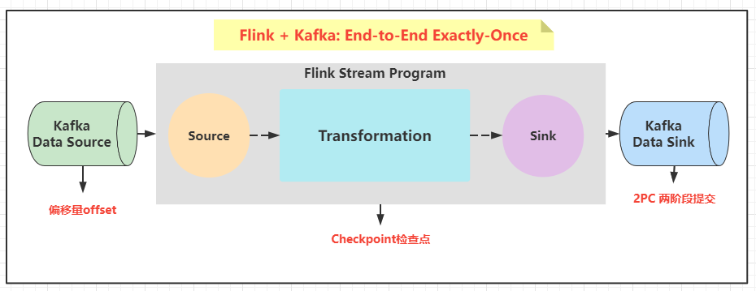


​			[Flink 1.4版本之后，通过两阶段提交(`TwoPhaseCommitSinkFunction`)支持End-To-EndExactly Once，而且要求Kafka 0.11+。]()

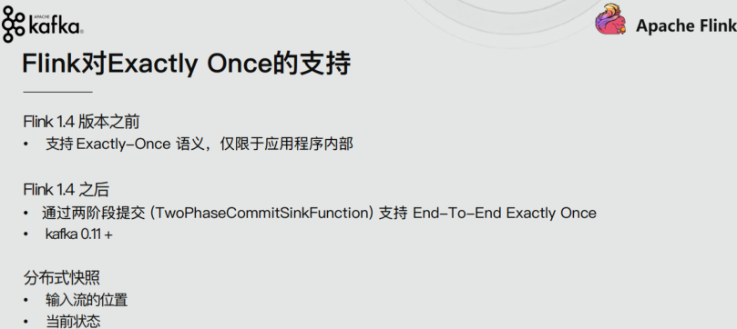


​			利用`TwoPhaseCommitSinkFunction`是通用的管理方案，只要实现对应的接口，而且Sink的存储支持事务提交，即可实现端到端的精确性语义。

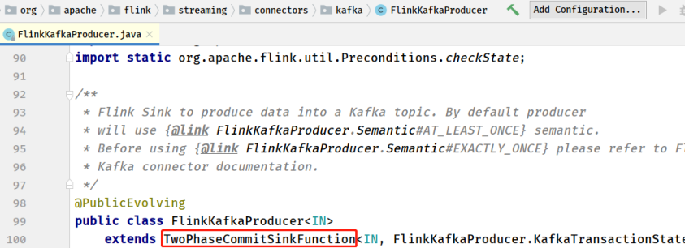


#### 代码：FlinkKafkaEndToEndDemo 

> 编写Flink Stream流式应用程序，从Kafka数据源消费数据，再将数据写入Kafka数据接收器。

```java
package cn.itcast.flink.exactly.kafka;

import org.apache.flink.api.common.restartstrategy.RestartStrategies;
import org.apache.flink.api.common.serialization.SimpleStringSchema;
import org.apache.flink.runtime.state.hashmap.HashMapStateBackend;
import org.apache.flink.streaming.api.CheckpointingMode;
import org.apache.flink.streaming.api.datastream.DataStream;
import org.apache.flink.streaming.api.environment.CheckpointConfig;
import org.apache.flink.streaming.api.environment.StreamExecutionEnvironment;
import org.apache.flink.streaming.connectors.kafka.FlinkKafkaConsumer;
import org.apache.flink.streaming.connectors.kafka.FlinkKafkaProducer;
import org.apache.flink.streaming.connectors.kafka.KafkaSerializationSchema;
import org.apache.kafka.clients.producer.ProducerRecord;

import javax.annotation.Nullable;
import java.util.Properties;

/**
 * Flink Kafka端到端精准一致性测试
 *      从Flink1.4.0版本开始，Kafka版本高于0.11的Kafka Sink可以通过二阶段事务提交构建端到端一致性的实时应用
 *      https://flink.apache.org/features/2018/03/01/end-to-end-exactly-once-apache-flink.html
 * @author xuyuan
 */
public class FlinkKafkaEndToEndDemo {

	/**
	 * Flink Stream流式应用，Checkpoint检查点属性设置
	 */
	private static void setEnvCheckpoint(StreamExecutionEnvironment env) {
		// 1. 设置Checkpoint时间间隔
		env.enableCheckpointing(1000);

		// 2. 设置状态后端
		env.setStateBackend(new HashMapStateBackend());
		env.getCheckpointConfig().setCheckpointStorage("file:///D:/flink-checkpoints/");

		// 3. 设置两个Checkpoint 之间最少等待时间，
		env.getCheckpointConfig().setMinPauseBetweenCheckpoints(500);

		// 4. 设置Checkpoint时失败次数，允许失败几次
		env.getCheckpointConfig().setTolerableCheckpointFailureNumber(3);

		// 5. 设置是否清理检查点,表示 Cancel 时是否需要保留当前的 Checkpoint
		env.getCheckpointConfig().enableExternalizedCheckpoints(
			CheckpointConfig.ExternalizedCheckpointCleanup.RETAIN_ON_CANCELLATION
		);

		// 6. 设置checkpoint的执行模式为EXACTLY_ONCE(默认)，注意：需要外部支持，如Source和Sink的支持
		env.getCheckpointConfig().setCheckpointingMode(CheckpointingMode.EXACTLY_ONCE);

		// 7. 设置checkpoint的超时时间,如果 Checkpoint在 60s内尚未完成说明该次Checkpoint失败,则丢弃。
		env.getCheckpointConfig().setCheckpointTimeout(60000);

		// 8. 设置同一时间有多少个checkpoint可以同时执行
		env.getCheckpointConfig().setMaxConcurrentCheckpoints(1);

		// 9. 设置重启策略：NoRestart
		env.setRestartStrategy(RestartStrategies.noRestart());
	}

	/**
	 * 从Kafka实时消费数据，使用Flink Kafka Connector连接器中FlinkKafkaConsumer
	 */
	private static DataStream<String> kafkaSource(StreamExecutionEnvironment env, String topic) {
		// 2-1. 消费Kafka数据时属性设置
		Properties props = new Properties();
		props.put("bootstrap.servers", "node1.itcast.cn:9092,node2.itcast.cn:9092,node3.itcast.cn:9092") ;
		props.put("group.id", "group_id_10001") ;
		props.put("flink.partition-discovery.interval-milli", "10000") ;

		// 2-2. 创建Consumer对象
		FlinkKafkaConsumer<String> kafkaConsumer = new FlinkKafkaConsumer<String>(
			topic,
			new SimpleStringSchema(),
			props
		) ;
		kafkaConsumer.setStartFromLatest();
		// 2-3. 添加数据源
		return env.addSource(kafkaConsumer);
	}

	/**
	 * 将数据流DataStream保存到Kafka Topic中，使用Flink Kafka Connector连接器中FlinkKafkaProducer
	 */
	private static void kafkaSink(DataStream<String> stream, String topic){
		// 4-1. 向Kafka写入数据时属性设置
		Properties props = new Properties();
		props.setProperty("bootstrap.servers", "node1.itcast.cn:9092,node2.itcast.cn:9092,node3.itcast.cn:9092");
		// 端到端一致性：需要指定transaction.timeout.ms(默认为1小时)的值，需要小于transaction.max.timeout.ms(默认为15分钟)
		props.setProperty("transaction.timeout.ms", 1000 * 60 * 2 + "");
		// 4-2. 写入数据时序列化
		KafkaSerializationSchema<String> kafkaSchema = new KafkaSerializationSchema<String>() {
			@Override
			public ProducerRecord<byte[], byte[]> serialize(String element, @Nullable Long timestamp) {
				return new ProducerRecord<byte[], byte[]>(topic, element.getBytes());
			}
		};
		// 4-3. 创建Producer对象
		FlinkKafkaProducer<String> producer = new FlinkKafkaProducer<String>(
			topic,
			kafkaSchema,
			props,
			FlinkKafkaProducer.Semantic.EXACTLY_ONCE
		) ;
		// 4-4. 添加Sink
		stream.addSink(producer);
	}

	public static void main(String[] args) throws Exception {
		// 1. 执行环境-env
		StreamExecutionEnvironment env = StreamExecutionEnvironment.getExecutionEnvironment();
		env.setParallelism(2);
		// TODO: 设置Checkpoint和Restart
		setEnvCheckpoint(env);

		// 2. 数据源-source
		DataStream<String> inputStream = kafkaSource(env, "flink-input-topic") ;

		// 3. 数据转换-transformation

		// 4. 数据终端-sink
		kafkaSink(inputStream, "flink-output-topic");

		// 5. 触发执行-execute
		env.execute("StreamExactlyOnceKafkaDemo") ;
	}

}
```


#### 代码：StreamKafkaProducerDemo

> 编写Flink流式程序，实时产生用户行为日志数据，写入Kafka Topic中。

```java
package cn.itcast.flink.exactly.kafka;

import org.apache.flink.streaming.api.datastream.DataStream;
import org.apache.flink.streaming.api.environment.StreamExecutionEnvironment;
import org.apache.flink.streaming.api.functions.source.RichParallelSourceFunction;
import org.apache.flink.streaming.connectors.kafka.FlinkKafkaProducer;
import org.apache.flink.streaming.connectors.kafka.KafkaSerializationSchema;
import org.apache.kafka.clients.producer.ProducerRecord;

import javax.annotation.Nullable;
import java.time.Instant;
import java.util.Properties;
import java.util.Random;
import java.util.TimeZone;

/**
 *编写Flink Stream应用程序：自定义数据源，模拟生成测试数据到【flink_input_topic】中。
 * @author xuyuan
 */
public class StreamKafkaProducerDemo {

	/**
	 * 将数据流DataStream保存到Kafka Topic中，使用Flink Kafka Connector连接器中FlinkKafkaProducer
	 */
	private static void kafkaSink(DataStream<String> stream, String topic){
		// 4-1. 向Kafka写入数据时属性设置
		Properties props = new Properties();
		props.setProperty("bootstrap.servers", "node1.itcast.cn:9092");
		props.put("group.id", "group_id_20001") ;
		// 4-2. 写入数据时序列化
		KafkaSerializationSchema<String> kafkaSchema = new KafkaSerializationSchema<String>() {
			@Override
			public ProducerRecord<byte[], byte[]> serialize(String element, @Nullable Long timestamp) {
				return new ProducerRecord<byte[], byte[]>(topic, element.getBytes());
			}
		};
		// 4-3. 创建Producer对象
		FlinkKafkaProducer<String> producer = new FlinkKafkaProducer<String>(
			topic,
			kafkaSchema,
			props,
			FlinkKafkaProducer.Semantic.EXACTLY_ONCE
		) ;
		// 4-4. 添加Sink
		stream.addSink(producer);
	}

	public static void main(String[] args) throws Exception {
		// 1. 执行环境-env
		StreamExecutionEnvironment env = StreamExecutionEnvironment.getExecutionEnvironment();
		env.setParallelism(1);

		// 2. 数据源-source
		DataStream<String> inputStream = env.addSource(new RichParallelSourceFunction<String>() {
			private boolean isRunning = true;
			@Override
			public void run(SourceContext<String> ctx) throws Exception {
				Random random = new Random();
				TimeZone timeZone = TimeZone.getTimeZone("Asia/Shanghai");
				// 循环产生数据
				while (isRunning){
					Instant instant = Instant.ofEpochMilli(
						System.currentTimeMillis() + timeZone.getOffset(System.currentTimeMillis())
					);
					String ouptut = String.format(
						"{\"ts\": \"%s\",\"user_id\": \"%s\", \"item_id\":\"%s\", \"category_id\": \"%s\"}",
						instant.toString(),
						"user_" + (10000 + random.nextInt(10000)),
						"item_" + (100000 + random.nextInt(100000)),
						"category_" + (200 + random.nextInt(200))
					);
					System.out.println(ouptut);
					ctx.collect(ouptut);
					// 每隔1秒产生1条数据
					Thread.sleep(1000);
				}
			}

			@Override
			public void cancel() {
				isRunning = false;
			}
		}) ;

		// 3. 数据转换-transformation

		// 4. 数据终端-sink
		kafkaSink(inputStream, "flink-input-topic");

		// 5. 触发执行-execute
		env.execute("StreamKafkaProducerDemo") ;
	}
}
```


#### 代码：StreamKafkaConsumerDemo

> 编写Flink Stream流式程序，实时从Kafka Topic消费数据。

```java
package cn.itcast.flink.exactly.kafka;

import org.apache.flink.api.common.serialization.SimpleStringSchema;
import org.apache.flink.streaming.api.datastream.DataStream;
import org.apache.flink.streaming.api.environment.StreamExecutionEnvironment;
import org.apache.flink.streaming.connectors.kafka.FlinkKafkaConsumer;

import java.util.Properties;

/**
 * 编写Flink Stream应用程序：从Kafka的【flink_output_topic】中实时消费数据，打印纸控制台。
 * @author xuyuan
 */
public class StreamKafkaConsumerDemo {

	/**
	 * 从Kafka实时消费数据，使用Flink Kafka Connector连接器中FlinkKafkaConsumer
	 */
	private static DataStream<String> kafkaSource(StreamExecutionEnvironment env, String topic) {
		// 2-1. 消费Kafka数据时属性设置
		Properties props = new Properties();
		props.put("bootstrap.servers", "node1.itcast.cn:9092") ;
		props.put("group.id", "group_id_30001") ;

		// 2-2. 创建Consumer对象
		FlinkKafkaConsumer<String> kafkaConsumer = new FlinkKafkaConsumer<String>(
			topic,
			new SimpleStringSchema(),
			props
		) ;
		kafkaConsumer.setStartFromLatest();
		// 2-3. 添加数据源
		return env.addSource(kafkaConsumer);
	}

	public static void main(String[] args) throws Exception {
		// 1. 执行环境-env
		StreamExecutionEnvironment env = StreamExecutionEnvironment.getExecutionEnvironment();
		env.setParallelism(1);

		// 2. 数据源-source
		DataStream<String> inputStream = kafkaSource(env, "flink-output-topic") ;

		// 3. 数据转换-transformation
		//DataStream<String> outputStream = null ;

		// 4. 数据终端-sink
		inputStream.printToErr();

		// 5. 触发执行-execute
		env.execute("FlinkKafkaConsumerDemo") ;
	}

}
```


## 附录部分：注意事项及扩展内容


```

```


### [扩展1]-Operator State 案例

---


> **OperatorState** 状态针对**非分组**数据流DataStream状态管理，==常常应用于数据源Source==。
>
> - 算子状态的作用范围限定为==算子任务==，由同一并行任务所处理的所有数据都可以访问到相同的状态；
> - Kafka Connectors连接器中，提供的从Kafka消费数据：`FlinkKafkaConsumer`，实现自己管理状态：OperatorState，使用数据结构为`ListState`（列表存储状态）。

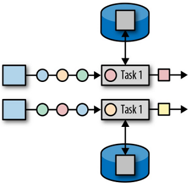


> 对 WordCount示例中的`FromElementsFunction`类进行详解并分享如何在代码中使用 operator state：

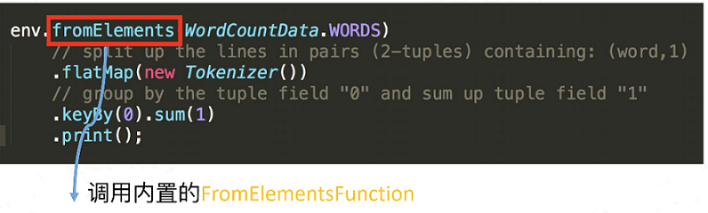


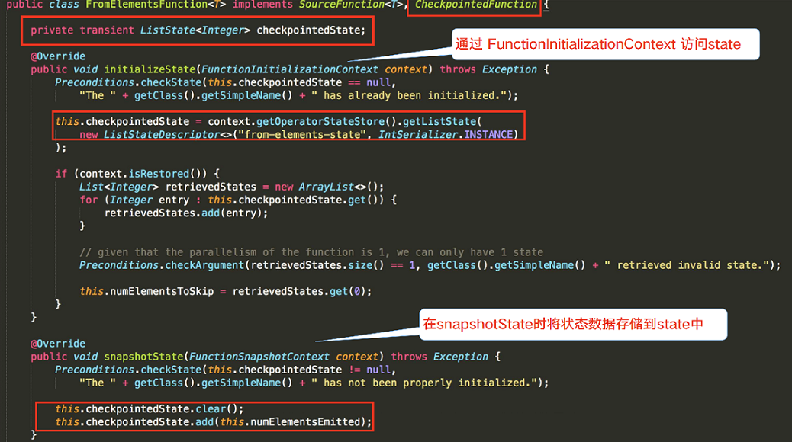

[上述源码中，使用`ListState`存储状态，并且要求数据源实现`CheckpointFunction`接口，将状态进行Checkpoint操作，以便容灾恢复。]()


> **需求**：使用ListState存储offset，模拟Kafka的offset维护，重启流式应用从Checkpoint恢复上次消费offset。

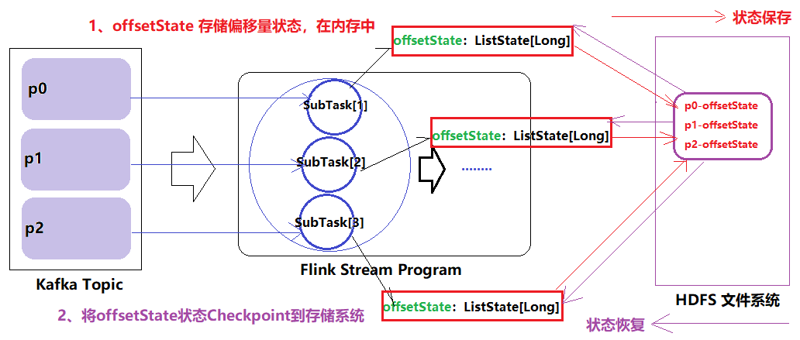


> 将状态State进行快照SnapShot并保存（`Checkpoint`），实现接口：`CheckpointedFunction`。

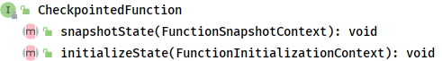

- 状态快照方法`snapshotState`：将某时刻State状态进行快照，并保存到外部存储，比如HDFS文件系统；
- 初始化状态`initializeState`：流式应用重启时，从Checkpoint检查点进行恢复状态；


> **编写代码**：基于OperatorState状态实现获取从Kafka消费数据时偏移量保存及从检查点恢复。

```Java
package cn.itcast.flink.state;

import org.apache.flink.api.common.state.ListState;
import org.apache.flink.api.common.state.ListStateDescriptor;
import org.apache.flink.runtime.state.FunctionInitializationContext;
import org.apache.flink.runtime.state.FunctionSnapshotContext;
import org.apache.flink.runtime.state.filesystem.FsStateBackend;
import org.apache.flink.streaming.api.CheckpointingMode;
import org.apache.flink.streaming.api.checkpoint.CheckpointedFunction;
import org.apache.flink.streaming.api.datastream.DataStreamSource;
import org.apache.flink.streaming.api.environment.CheckpointConfig;
import org.apache.flink.streaming.api.environment.StreamExecutionEnvironment;
import org.apache.flink.streaming.api.functions.source.RichParallelSourceFunction;

import java.util.Collections;
import java.util.concurrent.TimeUnit;

public class StreamOperatorStateDemo {

	/**
	 * 自定义数据源，模拟从Kafka消费数据，管理消费偏移量，使用状态State进行存储
	 */
	private static class KafkaSource extends RichParallelSourceFunction<String> implements CheckpointedFunction {

		// 定义变量，表示是否运行产生数据
		private boolean isRunning = true;

		// 定义long类型变量，存储消费偏移量
		private Long offset = 0L ;

		// todo: 第1步、定义状态，存储消费kafka偏移量
		private ListState<Long> offsetState = null ;

		@Override
		public void run(SourceContext<String> ctx) throws Exception {
			while (isRunning){
				// 此处模拟从Kafka topic中消费数据，假设每次消费一条数据
				int partitionId = getRuntimeContext().getIndexOfThisSubtask(); // 获取SubTask编号，从0开始
				String output = "p-" + partitionId + " -> " + offset ;
				ctx.collect(output);

				// 偏移量自增，下一次获取数据位置
				offset += 1 ;

				// todo: 第4步、更新状态中的值
				offsetState.update(Collections.singletonList(offset));

				// 每隔1秒消费1次数据
				TimeUnit.SECONDS.sleep(1);

				// 模拟程序异常
				if(offset % 5 ==0){
					throw new RuntimeException("程序出现异常啦啦啦啦啦啦啦.................") ;
				}
			}
		}

		@Override
		public void cancel() {
			isRunning = false ;
		}

		/**
		 * 对状态进行快照和保存：Checkpoint检查点
		 */
		@Override
		public void snapshotState(FunctionSnapshotContext context) throws Exception {
			// todo: 第5步、将状态state进行快照和保存
			offsetState.clear(); // 将内存中数据写入到磁盘

			// 再次给状态赋值，最新消费偏移量
			offsetState.update(Collections.singletonList(offset));
		}

		/**
		 * 从检查点恢复状态，对状态进行初始化
		 */
		@Override
		public void initializeState(FunctionInitializationContext context) throws Exception {
			// todo: 第2步、初始化状态
			offsetState = context.getOperatorStateStore().getListState(
				new ListStateDescriptor<Long>("offsetState", Long.class)
			);

			// 如果是从Checkpoint检查恢复，获取状态中偏移量
			if(context.isRestored()){
				// todo: 第3步、从状态获取偏移量
				offset = offsetState.get().iterator().next() ; // 列表只存储一条数据
			}
		}
	}

	public static void main(String[] args) throws Exception {
		// 1. 执行环境-env
		StreamExecutionEnvironment env = StreamExecutionEnvironment.getExecutionEnvironment();
		env.setParallelism(3) ;
		// todo: 设置流式应用Checkpoint检查点属性值
		setEnvCheckpoint(env);

		// 2. 数据源-source
		DataStreamSource<String> kafkaStream = env.addSource(new KafkaSource());

		// 3. 数据转换-transformation

		// 4. 数据终端-sink
		kafkaStream.printToErr();

		// 5. 触发执行-execute
		env.execute("StreamOperatorStateDemo");
	}

	/**
	 * 设置Flink Stream流式应用Checkpoint相关属性
	 */
	private static void setEnvCheckpoint(StreamExecutionEnvironment env){
		// 每隔1s执行一次Checkpoint
		env.enableCheckpointing(1000) ;
		// 状态数据保存本地文件系统
		env.setStateBackend(new FsStateBackend("file:///D:/ckpt/")) ;
		// 当应用取消时，Checkpoint数据保存，不删除
		env.getCheckpointConfig().enableExternalizedCheckpoints(
			CheckpointConfig.ExternalizedCheckpointCleanup.RETAIN_ON_CANCELLATION
		);
		// 设置模式Mode为精确性一次语义
		env.getCheckpointConfig().setCheckpointingMode(CheckpointingMode.EXACTLY_ONCE);
		// TODO: 当不设置重启策略时，将会无限重启
	}

}  
```


### [扩展2]-Flink Checkpoint 执行流程（详细版）

---


> Flink Checkpoint时详细版执行流程如下：

- 下图左侧是 Checkpoint Coordinator协调器，是整个 Checkpoint的发起者；
- 中间是由两个 source，一个 sink 组成的Flink作业；
- 最右侧的是持久化存储，在大部分用户场景中对应 HDFS


> 1）、Checkpoint Coordinator 向所有 source 节点 trigger Checkpoint（[触发Checkpoint，发送Barrier栅栏]()）；

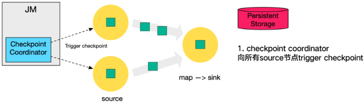


> 2）、广播barrier并进行持久化
>
> - ​	Source将状态State进行快照，并且进行持久化到存储系统。
> - ​	Source节点向下游广播 barrier，这个 barrier 就是实现 Chandy-Lamport 分布式快照算法的核心，下游的 task `只有收到所有 上游 的 barrier` 才会执行相应的 Checkpoint。

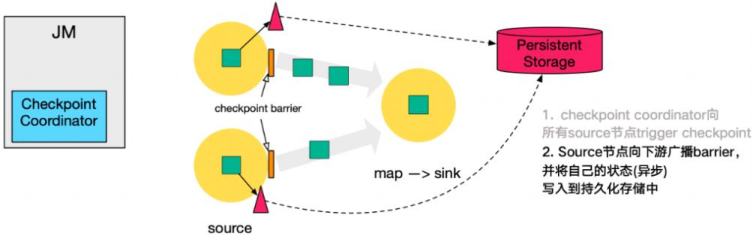


> 3）、当task完成state备份后，会将`备份数据的地址（state handle）通知给 Checkpointcoordinator`

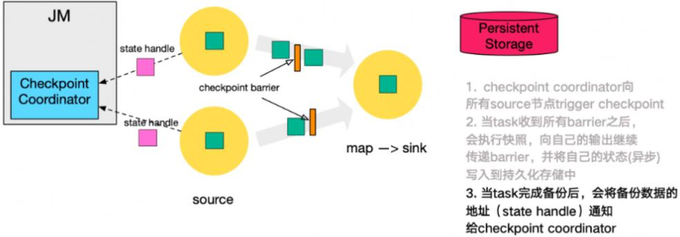


> 4）、下游的 sink 节点收集齐上游两个 input 的 barrier 之后（栅栏对齐），将执行本地快照。
>
> - 展示了 `RocksDB` incremental Checkpoint (`增量Checkpoint`)的流程，首先 RocksDB 会全量刷数据到磁盘上（红色大三角表示），然后 Flink 框架会从中选择没有上传的文件进行持久化备份（紫色小三角）。

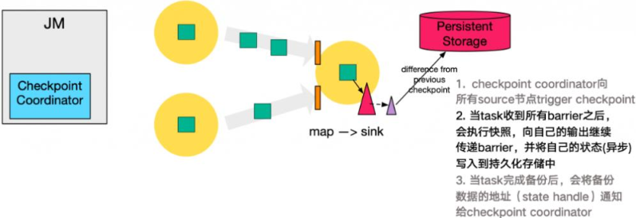


> 5）、同样的，sink 节点在完成自己的 Checkpoint 之后，会将 state handle 返回通知Coordinator。

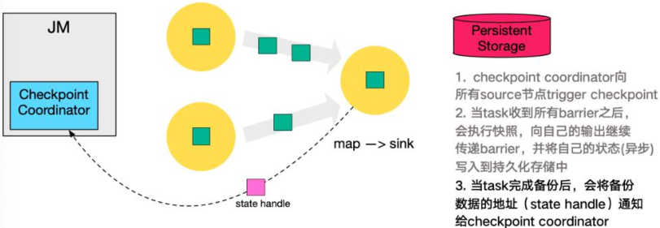


> 6）、最后，当 Checkpoint coordinator 收集齐所有 task 的 state handle，就认为这一次的Checkpoint 全局完成了，向持久化存储中再备份一个 Checkpoint meta 文件。

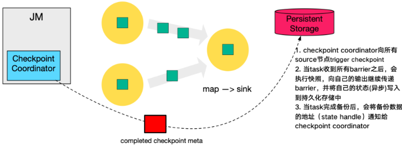


### [扩展3]-Flink+MySQL 端到端一致性实现

---


​			Flink 1.11提供`JdbcSink`，查看源码实现类【`GenericJdbcSinkFunction`】可知，并没有基于【事务性】实现精确性一次语义（仅仅实现接口`CheckpointedFunction`），而是实现至少一次性语义。

​				https://nightlies.apache.org/flink/flink-docs-release-1.13/docs/connectors/datastream/jdbc/

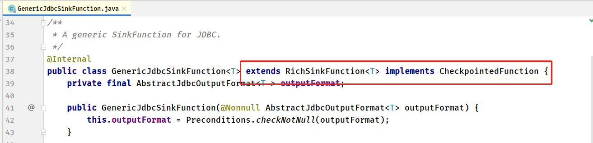


> **JDBC Connector**官方文档中，明确说明，要想实现精确一次性语义，要求**写入支持幂等性和Upsert语句**。

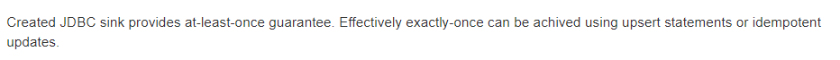

```ini
当向MySQL数据库中写入数据时，如何保存幂等性：
	1、REPLACE INTO和unique Key
		使用REPLACE 语句插入数据，并且要求主键唯一性
	
	2、INSERT INTO .....  ON DUPLICATE KEY UPDATE ....
```


> 向MySQL数据库表中写入数据，可以通过==实现2PC接口，实现精确性一次语义==。

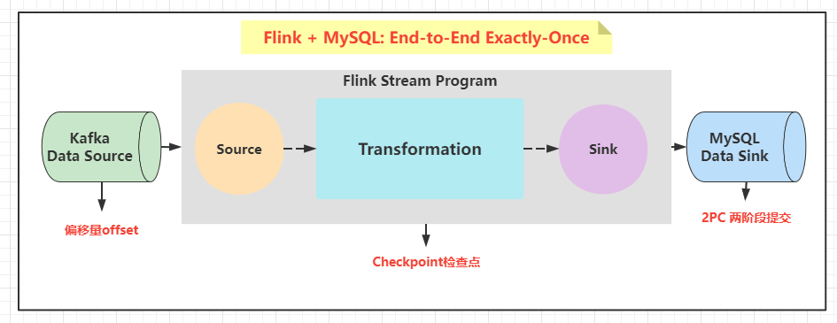


#### DDL语句：数据库准备

---

MySQL数据库创建数据库和表的语句：

```SQL
-- 创建数据库
CREATE DATABASE IF NOT EXISTS db_flink;

-- 使用数据库
USE db_flink ;

-- 创建表
CREATE TABLE `db_flink`.`tbl_kafka_message` (
  `id` bigint(20) NOT NULL AUTO_INCREMENT,
  `value` varchar(255) NOT NULL,
  `insert_time` varchar(255) NOT NULL,
  PRIMARY KEY (`id`),
  UNIQUE KEY `tbl_kafka_message_UN` (`value`)
) ENGINE=InnoDB DEFAULT CHARSET=utf8mb4 ;


-- 插入数据
INSERT INTO db_flink.tbl_kafka_message(value, insert_time) VALUES (?, ?) ;


-- 查询数据
SELECT id, value, insert_time FROM db_flink.tbl_kafka_message;

```


#### 代码：工具类DBConnectUtil

---

编写Flink Stream流式程序代码，自定义Sink实现2PC接口，完成Flink+MySQL端到端精确性一次性语义。

> - 1）、工具类：连接MySQL数据库相关操作

```java
package cn.itcast.flink.exactly.mysql;

import java.sql.Connection;
import java.sql.DriverManager;

/**
 * 数据库操作工具类，比如获取连接Connection，提交事务和事务回滚等
 */
public class DBConnectUtil {

	/**
	 * 依据MySQL数据库URL、USER和PASSWORD获取连接Connection对象
	 */
	public static Connection getConnection(String url, String user, String password) {
		// 定义变量
		Connection conn = null;
		try{
			// a. 加载驱动类
			Class.forName("com.mysql.cj.jdbc.Driver");
			// b. 获取连接
			conn = DriverManager.getConnection(url, user, password);
			// c.设置手动提交
			conn.setAutoCommit(false);
		}catch (Exception e) {
			e.printStackTrace();
		}
		return conn;
	}

	/**
	 * 关闭连接
	 */
	public static void closeConnection(Connection conn) {
		try{
			if(null != conn) conn.close();
		}catch (Exception e){
			e.printStackTrace();
		}
	}

	/**
	 * 手动提交事务
	 */
	public static void commitTransaction(Connection conn) {
		try{
			if(null != conn){
				conn.commit();
			}
		}catch (Exception e){
			e.printStackTrace();
		}finally {
			closeConnection(conn);
		}
	}

	/**
	 * 事务回滚
	 */
	public static void rollback(Connection conn) {
		try{
			if(null != conn){
				conn.rollback();
			}
		}catch (Exception e){
			e.printStackTrace();
		}finally {
			closeConnection(conn);
		}
	}

}
```

​	


#### 代码：MySQLTwoPhaseCommitSink

---

> - 2）、Sink：实现2PC接口，自定义Sink

```scala
package cn.itcast.flink.exactly.mysql;

import org.apache.commons.lang3.time.FastDateFormat;
import org.apache.flink.api.common.ExecutionConfig;
import org.apache.flink.api.common.typeutils.base.VoidSerializer;
import org.apache.flink.api.java.typeutils.runtime.kryo.KryoSerializer;
import org.apache.flink.streaming.api.functions.sink.TwoPhaseCommitSinkFunction;

import java.sql.Connection;
import java.sql.PreparedStatement;
import java.util.Date;

/**
 * 基于2PC接口TwoPhaseCommitSinkFunction类，实现 MySQL 关系型数据库的二阶提交。
 */
public class MySQLTwoPhaseCommitSink
		extends TwoPhaseCommitSinkFunction<String, MySQLTwoPhaseCommitSink.ConnectionState, Void> {
	// 无参构造方法
	public MySQLTwoPhaseCommitSink(){
		super(new KryoSerializer<>(MySQLTwoPhaseCommitSink.ConnectionState.class, new ExecutionConfig()), VoidSerializer.INSTANCE);
		System.out.println("MySQLTwoPhaseCommitSink...................");
	}

	// 获取连接，开启手动提交事务（getConnection方法中）
	@Override
	public MySQLTwoPhaseCommitSink.ConnectionState beginTransaction() throws Exception {
		// 获取连接
		Connection conn = DBConnectUtil.getConnection(
			"jdbc:mysql://node1.itcast.cn:3306/?useUnicode=true&characterEncoding=UTF-8&zeroDateTimeBehavior=convertToNull&useSSL=false&autoReconnect=true",
			"root",
			"123456"
		);
		System.out.println("Connection: " + conn + "...................");
		// 返回连接
		return new ConnectionState(conn);
	}

	// 执行数据库入库操作，task初始化的时候调用
	@Override
	public void invoke(MySQLTwoPhaseCommitSink.ConnectionState transaction, String value, Context context) throws Exception {
		System.out.println("invoke 方法被调用，处理数据：" + value + "...................");
		// a. 构建插入数据SQL语句
		String insertSQL = "REPLACE INTO db_flink.tbl_kafka_message(id, value, insert_time) VALUES (null, ?, ?)" ;
		// b. 创建PreparedStatement实例对象
		PreparedStatement pstmt = transaction.connection.prepareStatement(insertSQL) ;
		// c. 设置值
		pstmt.setString(1, value);
		String currentDate = FastDateFormat.getInstance("yyyy-MM-dd HH:mm:ss.SSS").format(new Date());
		pstmt.setString(2, currentDate);
		System.out.println("构建SQL语句：" + pstmt.toString());
		// d. 执行插入语句
		pstmt.executeUpdate();
	}

	// 预提交，此处预提交的逻辑在invoke方法中
	@Override
	public void preCommit(MySQLTwoPhaseCommitSink.ConnectionState transaction) throws Exception {
		System.out.println("preCommit.........................");
	}

	//  如果invoke方法执行正常，则提交事务
	@Override
	public void commit(MySQLTwoPhaseCommitSink.ConnectionState transaction) {
		System.out.println("commit.........................");
		DBConnectUtil.commitTransaction(transaction.connection);
	}

	// 如果invoke执行异常则回滚事物，下一次的checkpoint操作也不会执行
	@Override
	public void abort(MySQLTwoPhaseCommitSink.ConnectionState transaction) {
		System.out.println("abort.........................");
		DBConnectUtil.rollback(transaction.connection);
	}

	public static class ConnectionState{
		// 定义变量，数据库连接Connection
		private final transient Connection connection ;
		// 构造方法
		public ConnectionState(Connection connection){
			this.connection = connection ;
		}
	}

}
```


#### 代码：FlinkMySQLEndToEndDemo

----

> - 3）、Flink Stream流式程序：从Kafka消费数据，处理完成以后，写入到MySQL数据库表中

```java
package cn.itcast.flink.exactly.mysql;

import org.apache.flink.api.common.restartstrategy.RestartStrategies;
import org.apache.flink.api.common.serialization.SimpleStringSchema;
import org.apache.flink.configuration.Configuration;
import org.apache.flink.runtime.state.filesystem.FsStateBackend;
import org.apache.flink.streaming.api.CheckpointingMode;
import org.apache.flink.streaming.api.datastream.DataStream;
import org.apache.flink.streaming.api.environment.CheckpointConfig;
import org.apache.flink.streaming.api.environment.StreamExecutionEnvironment;
import org.apache.flink.streaming.connectors.kafka.FlinkKafkaConsumer;

import java.util.Properties;

/**
 * 实现Flink提供2PC接口，将数据流DataStream保存到MySQL数据库表中。
 */
public class FlinkMySQLEndToEndDemo {

	/**
	 * Flink Stream流式应用，Checkpoint检查点属性设置
	 */
	private static void setEnvCheckpoint(StreamExecutionEnvironment env) {
		// 1. 设置Checkpoint时间间隔
		env.enableCheckpointing(1000);

		// 2. 设置状态后端
		env.setStateBackend(new FsStateBackend("file:///D:/flink-checkpoints/"));

		// 3. 设置两个Checkpoint 之间最少等待时间，
		env.getCheckpointConfig().setMinPauseBetweenCheckpoints(500);

		// 4-1. 设置如果在做Checkpoint过程中出现错误，是否让整体任务失败
		env.getCheckpointConfig().setFailOnCheckpointingErrors(false);
		// 4-2. 设置Checkpoint时失败次数，允许失败几次
		env.getCheckpointConfig().setTolerableCheckpointFailureNumber(3);

		// 5. 设置是否清理检查点,表示 Cancel 时是否需要保留当前的 Checkpoint
		env.getCheckpointConfig().enableExternalizedCheckpoints(
			CheckpointConfig.ExternalizedCheckpointCleanup.RETAIN_ON_CANCELLATION
		);

		// 6. 设置checkpoint的执行模式为EXACTLY_ONCE(默认)，注意：需要外部支持，如Source和Sink的支持
		env.getCheckpointConfig().setCheckpointingMode(CheckpointingMode.EXACTLY_ONCE);

		// 7. 设置checkpoint的超时时间,如果 Checkpoint在 60s内尚未完成说明该次Checkpoint失败,则丢弃。
		env.getCheckpointConfig().setCheckpointTimeout(60000);

		// 8. 设置同一时间有多少个checkpoint可以同时执行
		env.getCheckpointConfig().setMaxConcurrentCheckpoints(1);

		// 9. 设置重启策略：NoRestart
		env.setRestartStrategy(RestartStrategies.noRestart());
	}

	/**
	 * 从Kafka实时消费数据，使用Flink Kafka Connector连接器中FlinkKafkaConsumer
	 */
	private static DataStream<String> kafkaSource(StreamExecutionEnvironment env, String topic) {
		// 2-1. 消费Kafka数据时属性设置
		Properties props = new Properties();
		props.put("bootstrap.servers", "node1.itcast.cn:9092") ;
		props.put("group.id", "group_id_90001") ;
		// 如果有记录偏移量从记录的位置开始消费,如果没有从最新的数据开始消费
		props.put("auto.offset.reset", "latest");
		// 开一个后台线程每隔10s检查Kafka的分区状态
		props.put("flink.partition-discovery.interval-millis", "10000") ;

		// 2-2. 创建Consumer对象
		FlinkKafkaConsumer<String> kafkaConsumer = new FlinkKafkaConsumer<String>(
			topic,
			new SimpleStringSchema(),
			props
		) ;
		// 从group offset记录的位置位置开始消费,如果kafka broker 端没有该group信息，会根据"auto.offset.reset"的设置来决定从哪开始消费
		kafkaConsumer.setStartFromGroupOffsets();
		// Flink 执 行 Checkpoint 的 时 候 提 交 偏 移 量 (一份在Checkpoint中,一份在Kafka的默认主题中__comsumer_offsets(方便外部监控工具去看))
		kafkaConsumer.setCommitOffsetsOnCheckpoints(true);

		// 2-3. 添加数据源
		return env.addSource(kafkaConsumer);
	}

	public static void main(String[] args) throws Exception {
		// 1. 执行环境-env
		StreamExecutionEnvironment env = StreamExecutionEnvironment.createLocalEnvironmentWithWebUI(new Configuration()) ;
		env.setParallelism(1);
		// 设置检查点Checkpoint
		setEnvCheckpoint(env);

		// 2. 数据源-source
		DataStream<String> inputStream = kafkaSource(env, "mysql-topic") ;
		//inputStream.printToErr();

		// 3. 数据转换-transformation
		// 4. 数据终端-sink
		inputStream.addSink(new MySQLTwoPhaseCommitSink()).name("MySQL2PCSink") ;

		// 5. 触发执行-execute
		env.execute("FlinkMySQLEndToEnd") ;
	}

}
```


#### 代码：MockKafkaDemo

---

> - 4）、数据模拟生成器：模拟产生数据，发送Kafka Topic中

```java
package cn.itcast.flink.exactly.mysql;

import org.apache.kafka.clients.producer.KafkaProducer;
import org.apache.kafka.clients.producer.Producer;
import org.apache.kafka.clients.producer.ProducerRecord;

import java.util.Properties;

/**
 * 模拟产生数据，发送到Kafka Topic中
 */
public class MockKafkaDemo {

	public static void main(String[] args) throws Exception {
		// 1. Kafka Producer 生产者属性配置
		Properties props = new Properties();
		props.put("bootstrap.servers", "node1.itcast.cn:9092");
		props.put("key.serializer", "org.apache.kafka.common.serialization.StringSerializer");
		props.put("value.serializer", "org.apache.kafka.common.serialization.StringSerializer");
		// 2. 构建Producer对象
		Producer<String, String> producer = new KafkaProducer<>(props);
		// 3. 构建Record对象
		for (int i = 1; i <= 200; i++) {
			String message = "val_" + i ;
			System.out.println("Message>>>>>>" + message);
			ProducerRecord<String, String> record = new ProducerRecord<String, String>(
				"mysql-topic", message
			);
			producer.send(record);
			// 休眠1秒
			Thread.sleep(1000);
		}
		// 4. 数据刷新
		producer.flush();
	}

}
```


