# Flink Chapter06：Flink DataStream 实战编程

---

​				[Apache Flink is a framework and distributed processing engine for `stateful computations` over `unbounded and bounded data streams`. ]()

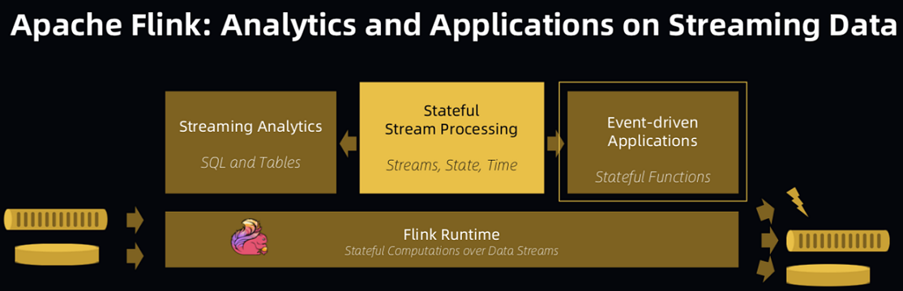

​		

​			大数据技术领域中，流式计算引擎发展历程，经历**Apache Storm ->	SparkStreaming -> Flink** 三代。

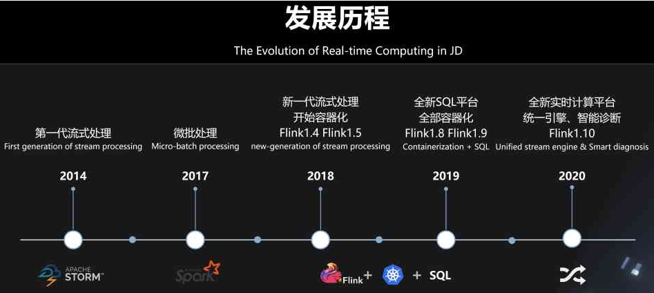


## 前言部分：知识回顾及课程目标


```

```


### [前言1]-上次课程内容回顾 

---


> 讲解Flink 四大基石：`状态State`和检查点`Checkpoint`、端到端精确性一次语义（==EOS==）。

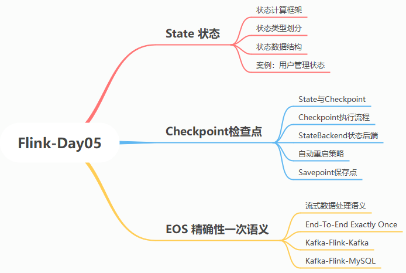


> ​		Flink 流式计算引擎，属于状态计算框架，在程序运行时，自动管理状态和基于状态计算。[对程序某时刻状态State进行快照和保存：Checkpoint（程序自动执行）和SavePoint（人为手动执行）]()

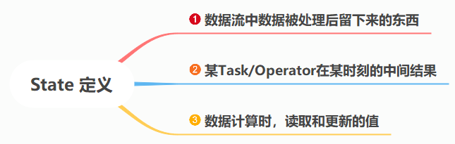

```Java
// 1. 启动Checkpoint
env.enableCheckpointing(10000) ;

// 2.设置StateBackend
env.setStateBackend(new HashMapStateBackend());
// 3.设置Checkpoint存储
env.getCheckpointConfig().setCheckpointStorage("file:///D:/ckpt/");

// 4. 设置相邻Checkpoint至少时间间隔
env.getCheckpointConfig().setMinPauseBetweenCheckpoints(500);
// 5. 设置Checkpoint最大失败次数
env.getCheckpointConfig().setTolerableCheckpointFailureNumber(3);
// 6. 设置取消job时Checkpoint是删除还是保留
env.getCheckpointConfig().enableExternalizedCheckpoints(CheckpointConfig.ExternalizedCheckpointCleanup.RETAIN_ON_CANCELLATION);

// 7.设置Checkpoint超时时间
env.getCheckpointConfig().setCheckpointTimeout(10 * 60 * 1000);
// 8. 设置Checkpoint最大并发次数
env.getCheckpointConfig().setMaxConcurrentCheckpoints(1);
// 9. 设置模式
env.getCheckpointConfig().setCheckpointingMode(CheckpointingMode.EXACTLY_ONCE);

// 10. 设置重启策略
env.setRestartStrategy(RestartStrategies.fixedDelayRestart(3, 10000));
```

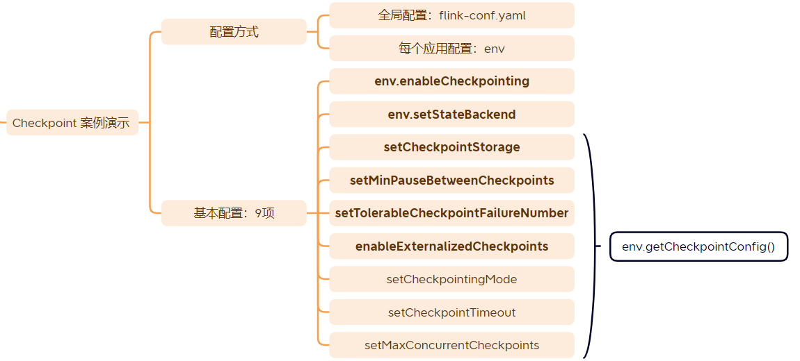


> Flink 流式应用如果要是端到端精确性一次语义，满足如下条件即可：

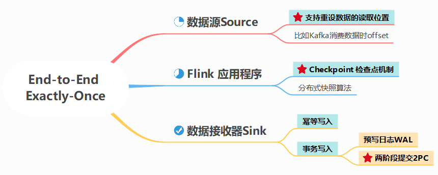


### [前言2]-今日课程内容提纲

---


> 主要讲解3个方面：DataStream 高级特性、双流JOIN和**Flink 运行架构**。

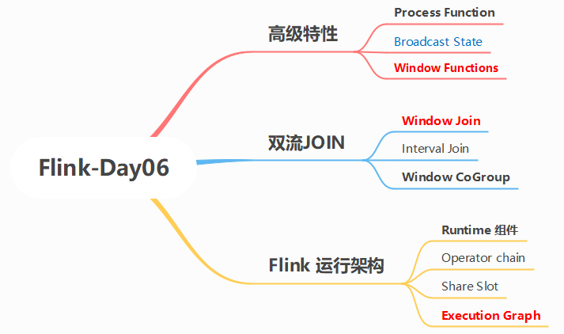


## 第一部分：Flink Stream 高级编程【6个小节】


```

```


### 01-[理解]-ProcessFunction【状态State】

---


> [Flink DataStream API中最底层API，提供`process`算子，其中需要实现`ProcessFunction`接口函数]()


> 查看抽象类：`ProcessFunction`源码，最主要方法：`processElement`和 `onTimer`：
>
> - `processElement` 方法：**对流中每条数据进行处理**
> - `onTimer` 方法：**当设置定时器后，调用执行方法**

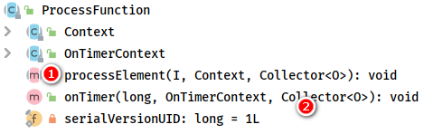


https://nightlies.apache.org/flink/flink-docs-release-1.13/docs/dev/datastream/operators/process_function/

> **案例演示**：从`netcat`消费数据，`keyBy`分组后，使用`process`算子，自定义State状态，实现词频统计。

```Java
package cn.itcast.flink.process.state;

import org.apache.flink.api.common.functions.FlatMapFunction;
import org.apache.flink.api.common.functions.MapFunction;
import org.apache.flink.api.common.state.ValueState;
import org.apache.flink.api.common.state.ValueStateDescriptor;
import org.apache.flink.api.java.tuple.Tuple2;
import org.apache.flink.configuration.Configuration;
import org.apache.flink.streaming.api.datastream.DataStream;
import org.apache.flink.streaming.api.datastream.DataStreamSource;
import org.apache.flink.streaming.api.environment.StreamExecutionEnvironment;
import org.apache.flink.streaming.api.functions.KeyedProcessFunction;
import org.apache.flink.util.Collector;

/**
 * 使用Flink计算引擎实现流式数据处理：从Socket接收数据，实时进行词频统计WordCount，使用process函数处理（聚合数据）
 * @author xuyuan
 */
public class StreamProcessStateDemo {

	public static void main(String[] args) throws Exception {
		// 1. 执行环境-env
		StreamExecutionEnvironment env = StreamExecutionEnvironment.getExecutionEnvironment();
		env.setParallelism(1);

		// 2. 数据源-source
		DataStreamSource<String> inputStream = env.socketTextStream("node1.itcast.cn", 9999);

		// 3. 数据转换-transformation
		DataStream<Tuple2<String, Integer>> tupleStream = inputStream
			.filter(line -> line.trim().length() > 0)
			.flatMap(new FlatMapFunction<String, String>() {
				@Override
				public void flatMap(String value, Collector<String> out) throws Exception {
					String[] words = value.trim().split("\\s+");
					for (String word : words) {
						out.collect(word);
					}
				}
			})
			.map(new MapFunction<String, Tuple2<String, Integer>>() {
				@Override
				public Tuple2<String, Integer> map(String value) throws Exception {
					return new Tuple2<>(value, 1);
				}
			});

		// todo：按照单词分组及组内聚合【统计每个单词出现次数]
		DataStream<String> outputStream = tupleStream
			.keyBy(tuple -> tuple.f0)
			// 调用process算子，处理数据
			.process(new KeyedProcessFunction<String, Tuple2<String, Integer>, String>() {
				// 定义变量，存储每个Key（单词）状态（词频）
				private ValueState<Integer> counterState = null ;

				@Override
				public void open(Configuration parameters) throws Exception {
					// 定义状态描述符
					ValueStateDescriptor<Integer> stateDescriptor = new ValueStateDescriptor<>("counterState", Integer.class);
					// 对定义状态初始化
					counterState = getRuntimeContext().getState(stateDescriptor);
				}

				@Override
				public void processElement(Tuple2<String, Integer> value, // 表示流中每条数据
				                           Context ctx, // 运行时上下文对象，环境
				                           Collector<String> out) throws Exception {
					/*
						value -> (flink, 1)
					 */
					// 获取分组key，此时就是单词：flink
					String currentKey = ctx.getCurrentKey();

					// a. 从State中获取以前状态的值
					Integer historyValue = counterState.value();
					// b. 获取传递进来值
					int currentValue = value.f1;

					// c. 如果是第一次出现key，历史为null
					if(null == historyValue){
						// 更新状态
						counterState.update(currentValue);
					}else{
						Integer latestValue = historyValue + currentValue;
						counterState.update(latestValue);
					}

					// d. 返回结果
					String output = currentKey + " -> " + counterState.value();
					out.collect(output);
				}
			});

		// 4. 数据终端-sink
		outputStream.printToErr();

		// 5. 触发执行-execute
		env.execute("StreamProcessStateDemo");
	}

}  
```


> 设置定义State状态TTL声明存活周期，代码如下：

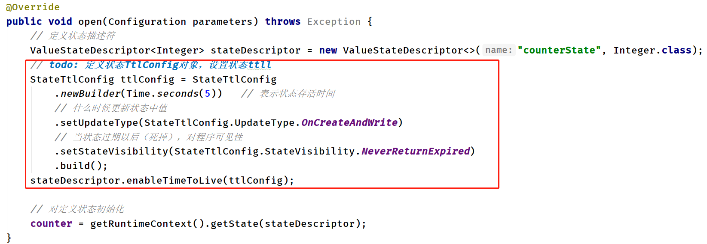


### 02-[掌握]-ProcessFunction【定时器Timer】

---


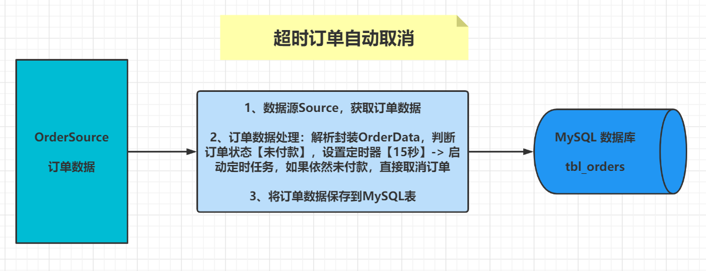


> ==Timer（定时器）==是Flink Streaming API提供的用于感知并利用处理时间/事件时间变化的机制。

​			对于普通用户来说，最常见的显式利用Timer的地方就是**`KeyedProcessFunction`**。在其`processElement()`方法中注册`Timer`，然后**覆写其`onTimer()`方法作为Timer触发时的回调逻辑**。

- **处理时间**：调用`context.timerService().registerProcessingTimeTimer()`注册，`onTimer()`在系统时间戳达到Timer设定的时间戳时触发。
- **事件时间**：调用`context.timerService().registerEventTimeTimer()`注册，`onTimer()`在Flink内部水印达到或超过Timer设定的时间戳时触发。


> 案例演示：[使用Flink Stream中Timer定时器，实现电商系统未付款订单，超时自动取消]()

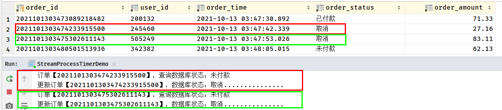


#### DDL和DML语句

```SQL
CREATE DATABASE IF NOT EXISTS db_flink ;

CREATE TABLE db_flink.tbl_orders (
    order_id varchar(255) NOT NULL,
    user_id varchar(100) NOT NULL,
    order_time varchar(255) NOT NULL,
    order_status varchar(100) NOT NULL,
    order_amount DOUBLE NOT NULL,
    CONSTRAINT tbl_orders_PK PRIMARY KEY (order_id)
)ENGINE=InnoDB DEFAULT CHARSET=utf8 COLLATE=utf8_general_ci;

-- 插入语句
INSERT INTO db_flink.tbl_orders (order_id, user_id, order_time, order_status, order_amount) VALUES (?,?,?,?,?) ;

-- 查询语句
SELECT order_status FROM db_flink.tbl_orders WHERE order_id = ? ;

-- 更新语句
UPDATE db_flink.tbl_orders SET order_status = ? WHERE order_id = ? ;
```


#### 自定义数据源

- 订单实体类：`OrderData`

```Java
package cn.itcast.flink.process.timer;

import lombok.AllArgsConstructor;
import lombok.Data;
import lombok.NoArgsConstructor;

/**
 * 交易订单数据封装实体类
 * @author xuyuan
 */
@AllArgsConstructor
@NoArgsConstructor
@Data
public class OrderData{
	private String orderId;
	private String userId;
	private String orderTime;
	private String orderStatus ;
	private Double orderAmount ;
}
```


- 自定义数据源：`OrderSource`

```Java
package cn.itcast.flink.process.timer;

import org.apache.commons.lang3.time.FastDateFormat;
import org.apache.flink.streaming.api.functions.source.RichParallelSourceFunction;

import java.math.BigDecimal;
import java.math.RoundingMode;
import java.util.Random;
import java.util.concurrent.TimeUnit;

/**
 * 自定义数据源Source，实时产生交易订单数据：orderId,userId,orderTime,orderStatus,orderAmount
 * @author xuyuan 
 */
public class OrderSource extends RichParallelSourceFunction<String> {
	String[] allStatus = new String[]{"未付款", "已付款", "已付款", "已付款", "已付款"};
	private boolean isRunning = true ;
	@Override
	public void run(SourceContext<String> ctx) throws Exception {
		Random random = new Random();
		FastDateFormat format = FastDateFormat.getInstance("yyyyMMddHHmmssSSS");
		FastDateFormat format2 = FastDateFormat.getInstance("yyyy-MM-dd HH:mm:ss.SSS");
		while (isRunning){
			long currentTimeMillis = System.currentTimeMillis();
			String orderId = format.format(currentTimeMillis) + "" + (10000 + random.nextInt(10000)) ;
			String userId = (random.nextInt(5) + 1) * 100000 + random.nextInt(100000) + "" ;
			String orderTime = format2.format(currentTimeMillis);
			String orderStatus = allStatus[random.nextInt(allStatus.length)] ;
			Double orderAmount = new BigDecimal(random.nextDouble() * 100).setScale(2, RoundingMode.HALF_UP).doubleValue();

			// 输出字符串
			String output = orderId + "," + userId + "," + orderTime + "," + orderStatus + "," + orderAmount;
			ctx.collect(output);

			TimeUnit.MILLISECONDS.sleep(2000);
		}
	}
	@Override
	public void cancel() {
		isRunning = false ;
	}
}
```


#### 自定义数据接收器

```Java
package cn.itcast.flink.timer;

import org.apache.flink.configuration.Configuration;
import org.apache.flink.streaming.api.functions.sink.RichSinkFunction;

import java.sql.Connection;
import java.sql.DriverManager;
import java.sql.PreparedStatement;

/**
 * 将数据流保存至MySQL数据库表中
 */
public class OrderSink extends RichSinkFunction<OrderData> {
	// 定义变量
	private Connection conn = null ;
	private PreparedStatement pstmt = null ;

	@Override
	public void open(Configuration parameters) throws Exception {
		// a. 加载驱动类
		Class.forName("com.mysql.jdbc.Driver");
		// b. 获取连接
		conn = DriverManager.getConnection(
			"jdbc:mysql://node1.itcast.cn:3306/?useUnicode=true&characterEncoding=utf-8&useSSL=false",
			"root",
			"123456"
		);
		// c. 获取PreparedStatement实例
		pstmt = conn.prepareStatement("INSERT INTO db_flink.tbl_orders (order_id, user_id, order_time, order_status, order_amount) VALUES (?,?,?,?,?)") ;
	}

	@Override
	public void invoke(OrderData order, Context context) throws Exception {
		// d. 设置占位符值
		pstmt.setString(1, order.getOrderId());
		pstmt.setString(2, order.getUserId());
		pstmt.setString(3, order.getOrderTime());
		pstmt.setString(4, order.getOrderStatus());
		pstmt.setDouble(5, order.getOrderAmount());
		// e. 执行插入
		pstmt.executeUpdate();
	}

	@Override
	public void close() throws Exception {
		if(null != pstmt && ! pstmt.isClosed()) pstmt.close();
		if(null != conn && ! conn.isClosed()) conn.close();
	}

}
```


#### 查询订单状态

```JAva
// 依据orderId查询订单状态
private String queryStatus(String orderId) throws Exception{
	// a. 加载驱动类，获取连接
	Class.forName("com.mysql.jdbc.Driver");
	Connection conn = DriverManager.getConnection(
		"jdbc:mysql://node1.itcast.cn:3306/?useUnicode=true&characterEncoding=utf-8&useSSL=false",
		"root", "123456"
	);
	// b. 执行查询
	PreparedStatement pstmt = conn.prepareStatement("SELECT order_status FROM db_flink.tbl_orders WHERE order_id = ?") ;
	pstmt.setString(1, orderId);
	ResultSet result = pstmt.executeQuery();
	// c. 获取订单状态
	String orderStatus = "unknown";
	while (result.next()){
		orderStatus = result.getString(1);
	}
	// d. 关闭连接
	result.close();
	pstmt.close();
	conn.close();
	// e. 返回
	return orderStatus ;
}
```


#### 更新订单状态

```java
// 依据orderId更新订单状态为：取消
private void updateStatus(String orderId) throws Exception{
	// a. 加载驱动类，获取连接
	Class.forName("com.mysql.jdbc.Driver");
	Connection conn = DriverManager.getConnection(
		"jdbc:mysql://node1.itcast.cn:3306/?useUnicode=true&characterEncoding=utf-8&useSSL=false",
		"root", "123456"
	);
	// b. 执行更新
	PreparedStatement pstmt = conn.prepareStatement("UPDATE db_flink.tbl_orders SET order_status = ? WHERE order_id = ?") ;
	pstmt.setString(1, "取消");
	pstmt.setString(2, orderId);
	pstmt.executeUpdate();
	// c. 关闭连接
	pstmt.close();
	conn.close();
}
```


#### Timer核心代码

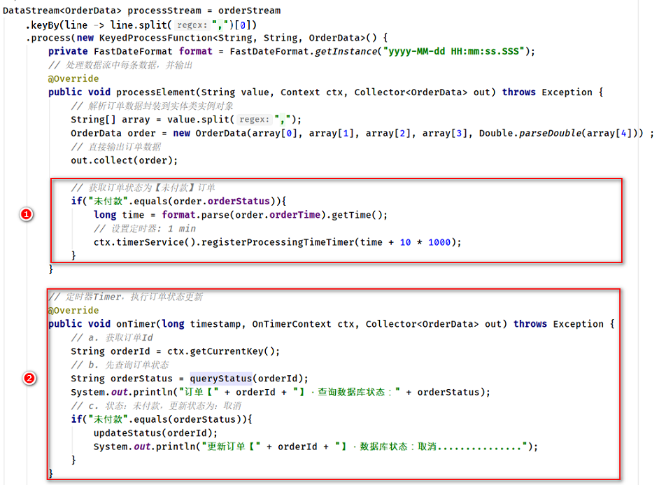


#### MAIN方法代码

```Java
package cn.itcast.flink.timer;

import org.apache.flink.streaming.api.datastream.DataStreamSource;
import org.apache.flink.streaming.api.datastream.SingleOutputStreamOperator;
import org.apache.flink.streaming.api.environment.StreamExecutionEnvironment;

/**
 * 使用Flink Stream中Timer定时器，实现电商系统未付款订单，超时自动取消
 */
public class StreamProcessTimerDemo {

	public static void main(String[] args) throws Exception {
		// 1. 执行环境-env
		StreamExecutionEnvironment env = StreamExecutionEnvironment.getExecutionEnvironment();
		env.setParallelism(1);

		// 2. 数据源-source
		DataStreamSource<String> orderStream = env.addSource(new OrderSource());
		// orderStream.printToErr();

		// 3. 数据转换-transformation
		SingleOutputStreamOperator<OrderData> processStream = orderStream
			// 按照订单ID分组
			.keyBy(line -> line.split(",")[0])
			// 对每个订单数据进行解析分装
			.process(new OrderProcessFunction());

		// 4. 数据终端-sink
		processStream.addSink(new OrderSink()) ;

		// 5. 触发执行-execute
		env.execute("StreamProcessTimerDemo");
	}

}  
```


### 03-[理解]-Broadcast State 功能及案例

----


[BroadcastState：将小数据流DataStream广播到各个Task中，数据存储在MapState中，以key/value对存储的。]()

```ini
BroadcastState：
	Broadcast，表示广播意思
	在SparkCore或Flink DataSet批处理中，广播变量，将小数据集广播出去，被Task共享使用
	
在批处理中，小表数据：DataSet
	广播变量
在流计算中，小表数据：DataStream
	广播流，数据流每条数据广播存储到BroadcastState中，数据类型为MapState，map集合
```

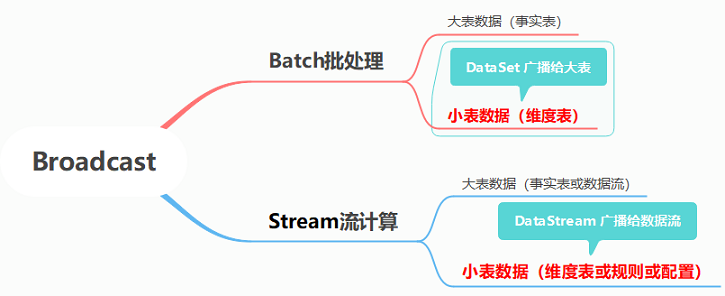


> **Broadcast State** 是 **Flink 1.5** 引入的新特性，可用于[以特定方式组合和联合处理两个事件流。]()
>
> - 第一个流的事件被广播到一个算子的所有并行实例，该算子将它们保存为状态。
> - 另一个流的事件不广播，而是发送给同一个算子的单个实例，并与广播流的事件一起处理。
>
> 对于需要**连接低吞吐量和高吞吐量流**或需要**动态更新处理逻辑的应用**来说，新的broadcast state非常适合。

https://nightlies.apache.org/flink/flink-docs-release-1.13/docs/dev/datastream/fault-tolerance/broadcast_state/

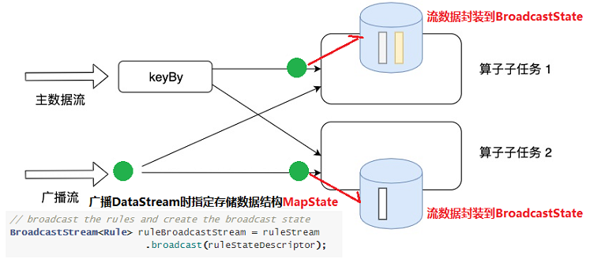


> ​	  当大表数据流与小表数据流关联，采用广播Broadcast方式广播小表数据流以后，调用`connect`方法，将两个流数据进行关联。[connect方法，将两个流（数据类型可以不一样）进行关联，分别对流中数据处理。]()

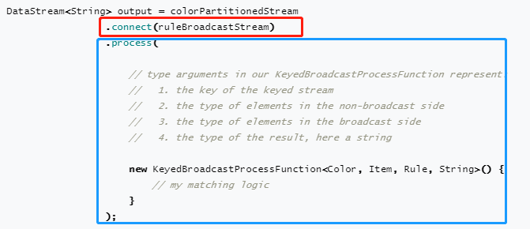


> 注意事项：

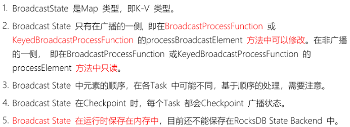


> 使用Flink中广播状态`BroadcastState`，可以实时更新数据，案例需求说明如下：

- 1）、大表数据流，实时产生：用户访问网站日志数据log表

```ini
user_2,19765,2021-09-11 11:36:03:758,click
user_4,13710,2021-09-11 11:36:04:765,click
user_1,19821,2021-09-11 11:36:05:772,search
user_2,10663,2021-09-11 11:36:06:781,browser
user_4,15180,2021-09-11 11:36:07:784,search
user_3,10216,2021-09-11 11:36:08:791,browser
```


- 2）、小表数据流，维度表，需要与大表数据实时关联，进行拉宽操作。

```ini
user_1,张三,10
user_2,李四,20
user_3,王五,30
user_4,赵六,40
```

[			小表数据存储在MySQL表中，大表数据来源于自定义数据源，小表数据可能会被更新，比如新用户注册，访问网站，产生日志数据]()

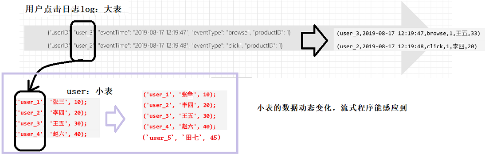


> ​		**案例演示**：自定义数据源，实时产生用户行为日志数据（大表）和加载MySQL表用户信息数据（小表），将小表数据广播，实时与大表进行关联。


#### DDL和DML语句

```SQL
CREATE DATABASE IF NOT EXISTS db_flink ;
USE db_flink ;

DROP TABLE IF EXISTS `user_info`;
CREATE TABLE `user_info` (
 `user_id` varchar(20) CHARACTER SET utf8 COLLATE utf8_general_ci NOT NULL,
 `user_name` varchar(10) CHARACTER SET utf8 COLLATE utf8_general_ci NULL DEFAULT NULL,
 `user_age` int(11) NULL DEFAULT NULL,
 PRIMARY KEY (`user_id`) USING BTREE
) ENGINE = InnoDB CHARACTER SET = utf8 COLLATE = utf8_general_ci ROW_FORMAT = Dynamic;


INSERT INTO `user_info` VALUES ('user_1', '张三', 10);
INSERT INTO `user_info` VALUES ('user_2', '李四', 20);
INSERT INTO `user_info` VALUES ('user_3', '王五', 30);
INSERT INTO `user_info` VALUES ('user_4', '赵六', 40);
```


#### 用户行为日志

- 用户日志实体类

```Java
import lombok.*;

@Setter
@Getter
@NoArgsConstructor
@AllArgsConstructor
@EqualsAndHashCode
public class TrackLog {

	private String userId ;
	private Integer productId ;
	private String trackTime ;
	private String eventType ;

	@Override
	public String toString() {
		return userId + "," + productId + "," + trackTime + "," + eventType;
	}
}
```


- 自定义数据源，实时产生交易数据，[每隔1秒产生1条日志数据]()

```Java
import org.apache.commons.lang3.time.FastDateFormat;
import org.apache.flink.streaming.api.functions.source.RichParallelSourceFunction;

import java.util.Random;
import java.util.concurrent.TimeUnit;

/**
 * 自定义数据源，实时产生用户访问网站点击流数据
 */
public class TrackLogSource extends RichParallelSourceFunction<TrackLog> {
	private boolean isRunning = true ;

	@Override
	public void run(SourceContext<TrackLog> ctx) throws Exception {
		String[] types = new String[]{
			"click", "browser", "search", "click", "browser", "browser", "browser",
			"click", "search", "click", "browser", "click", "browser", "browser", "browser"
		} ;
		Random random = new Random() ;
		FastDateFormat format = FastDateFormat.getInstance("yyyy-MM-dd HH:mm:ss:SSS") ;

		while (isRunning){
			TrackLog clickLog = new TrackLog(
				"user_" + (random.nextInt(4) + 1), //
				10000 + random.nextInt(10000), //
				format.format(System.currentTimeMillis()), //
				types[random.nextInt(types.length)]
			);
			ctx.collect(clickLog);

			// 每个1秒生成一条数据
			TimeUnit.MILLISECONDS.sleep(1000);
		}
	}

	@Override
	public void cancel() {
		isRunning = false ;
	}

}
```


#### 用户基本信息

- 用户基本信息实体类

```Java
import lombok.*;

@Setter
@Getter
@EqualsAndHashCode
@NoArgsConstructor
@AllArgsConstructor
public class UserInfo {

	private String userId ;
	private String userName ;
	private Integer userAge ;

	@Override
	public String toString() {
		return userId + "," + userName + "," + userAge ;
	}
}
```


- 自定义数据源，每隔3秒，加载一次MySQL数据库中用户信息数据

```Java
import org.apache.flink.configuration.Configuration;
import org.apache.flink.streaming.api.functions.source.RichSourceFunction;

import java.sql.Connection;
import java.sql.DriverManager;
import java.sql.PreparedStatement;
import java.sql.ResultSet;
import java.util.concurrent.TimeUnit;

/**
 * 自定义数据源，实时从MySQL表获取数据，实现接口RichSourceFunction
 */
public class UserInfoSource extends RichSourceFunction<UserInfo> {

	// 标识符，是否实时接收数据
	private boolean isRunning = true;

	private Connection conn = null;
	private PreparedStatement pstmt = null;
	private ResultSet rs = null;

	@Override
	public void open(Configuration parameters) throws Exception {
		// 1. 加载驱动
		Class.forName("com.mysql.jdbc.Driver");
		// 2. 创建连接
		conn = DriverManager.getConnection(
			"jdbc:mysql://node1.itcast.cn:3306/?useUnicode=true&characterEncoding=utf-8",
			"root",
			"123456"
		);
		// 3. 创建PreparedStatement
		pstmt = conn.prepareStatement("select user_id, user_name, user_age from db_flink.user_info");
	}

	@Override
	public void run(SourceContext<UserInfo> ctx) throws Exception {
		while (isRunning) {
			// 1. 执行查询
			rs = pstmt.executeQuery();
			// 2. 遍历查询结果,收集数据
			while (rs.next()) {
				String id = rs.getString("user_id");
				String name = rs.getString("user_name");
				Integer age = rs.getInt("user_age");
				UserInfo userInfo = new UserInfo(id, name, age);
				// 输出
				ctx.collect(userInfo);
			}
			// 每隔3秒查询一次
			TimeUnit.SECONDS.sleep(3);
		}
	}

	@Override
	public void cancel() {
		isRunning = false;
	}

	@Override
	public void close() throws Exception {
		if (null != rs) rs.close();
		if (null != pstmt) pstmt.close();
		if (null != conn) conn.close();
	}

}
```


#### MAIN方法代码

```Java
import org.apache.flink.api.common.state.BroadcastState;
import org.apache.flink.api.common.state.MapStateDescriptor;
import org.apache.flink.api.common.state.ReadOnlyBroadcastState;
import org.apache.flink.configuration.Configuration;
import org.apache.flink.streaming.api.datastream.BroadcastStream;
import org.apache.flink.streaming.api.datastream.DataStreamSource;
import org.apache.flink.streaming.api.datastream.SingleOutputStreamOperator;
import org.apache.flink.streaming.api.environment.StreamExecutionEnvironment;
import org.apache.flink.streaming.api.functions.co.BroadcastProcessFunction;
import org.apache.flink.util.Collector;

/**
 * 实时过滤出配置中的用户，并在事件流中补全这批用户的基础信息
 *      TODO: 用户信息存储在MySQL数据库表
 *  实时将大表与小表数据进行关联，其中小表数据动态变化
 *      大表数据：流式数据，存储Kafka消息队列，此处演示自定义数据源产生日志流数据
 *      小表数据：动态数据，存储MySQL数据库
 *   TODO： BroadcastState 将小表数据进行广播，封装到Map集合集合中，使用connect函数与大表数据流进行连接
 */
public class StreamBroadcastStateDemo {

	public static void main(String[] args) throws Exception {
		// 1. 执行环境-env
		StreamExecutionEnvironment env = StreamExecutionEnvironment.getExecutionEnvironment();
		env.setParallelism(1);

		// 2. 数据源-source
		// 2-1. 构建小表数据流：用户信息 <userId, name, age>
		DataStreamSource<UserInfo> userStream = env.addSource(new UserInfoSource());

		// 2-2. 构建大表数据流：用户行为日志，<userId, productId, trackTime, eventType>
		DataStreamSource<TrackLog> logStream = env.addSource(new TrackLogSource());

		// 3. 数据转换-transformation
		/*
			将小数据流，广播以后，存储到MapState中，方便大表数据流处理数据依据key获取value值
				Map[userId, userInfo]
			大表数据处理，依据userId，获取小表中对应用户信息UserInfo
				map.get(userId) -> userInfo
		 */
		// todo: 3-1. 广播小表数据
		MapStateDescriptor<String, UserInfo> descriptor = new MapStateDescriptor<>("userInfoState", String.class, UserInfo.class);
		BroadcastStream<UserInfo> broadcastStream = userStream.broadcast(descriptor);

		// todo: 3-2. 将大表数据与广播数据进行connect连接
		SingleOutputStreamOperator<String> processStream = logStream
			.connect(broadcastStream)
			.process(new BroadcastProcessFunction<TrackLog, UserInfo, String>() {
				// 处理大表数据流中每条数据， todo：大表数据流中每条数据到BroadcastState中获取数据
				@Override
				public void processElement(TrackLog value, ReadOnlyContext ctx, Collector<String> out) throws Exception {
					// 获取广播状态数据
					ReadOnlyBroadcastState<String, UserInfo> broadcastState = ctx.getBroadcastState(descriptor);
					// 获取日志数据中userId
					String userId = value.getUserId();
					// 依据userId到状态中获取对应的用户信息数据
					UserInfo userInfo = broadcastState.get(userId);
					// 关联数据
					String output = userInfo +  " -> " + value;
					out.collect(output);
				}

				// 处理广播的小表数据流中数据, todo: 广播流中数据放入BroadcastState中
				@Override
				public void processBroadcastElement(UserInfo value, Context ctx, Collector<String> out) throws Exception {
					// 获取广播状态数据，本地上map集合
					BroadcastState<String, UserInfo> broadcastState = ctx.getBroadcastState(descriptor);
					// 获取用户id
					String userId = value.getUserId();
					// 将广播流中数据存储到状态中
					broadcastState.put(userId, value);
				}
			});

		// 4. 数据终端-sink
		processStream.printToErr();

		// 5. 触发执行-execute
		env.execute("StreamBroadcastStateDemo");
	}

}  
```


### 04-[掌握]-Window Aggregation【窗口聚合类型】

------


> 在Flink Window窗口计算中，对窗口中数据聚合计算分为2种类型：**全量聚合**和**增量聚合**。

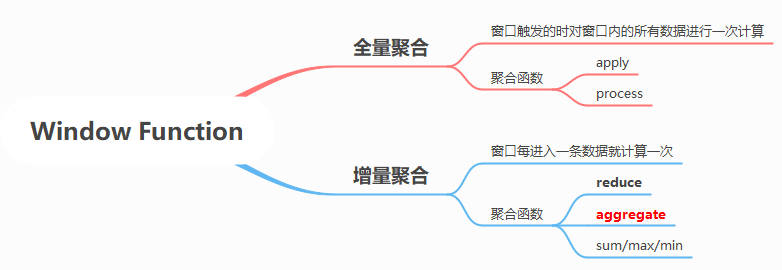


> - 第一种、**全量聚合**：[指在窗口触发的时候才会对窗口内的所有数据进行一次计算（等窗口的数据到齐，才开始进行聚合计算，可实现对窗口内的数据进行排序等需求）]()。 窗口先缓存所有元素，等到触发条件后对窗口内的全量元素执行计算。

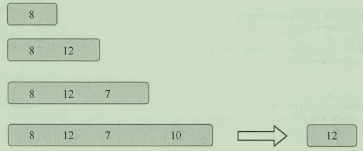

​													[全量聚合函数：`apply` 函数和`process` 函数]()


> - 第二种、**增量聚合**：[指窗口每进入一条数据就计算一次]()，窗口保存一份**聚合中间数据**，每流入一个新元素，新元素与中间数据两两合一，生成新的中间数据。

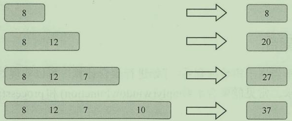

​					[增量聚合函数：`reduce`函数、`aggregate`函数和`max`函数、`min`函数、`sum`函数]()


​								[修改第4章讲解时间窗口TimeWindow中案例代码，演示窗口数据全量聚合和增量聚合。]()

> 使用全量聚合函数：`WindowFunction`实时对窗口数据进行聚合，代码如下：

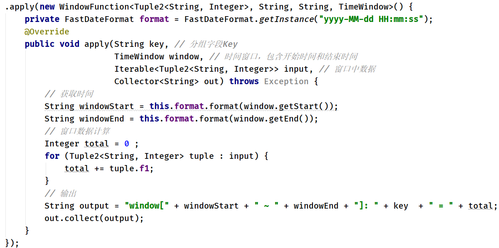


> 使用全量聚合函数：`ProcessWindowFunction`实时对窗口数据进行聚合，代码如下：

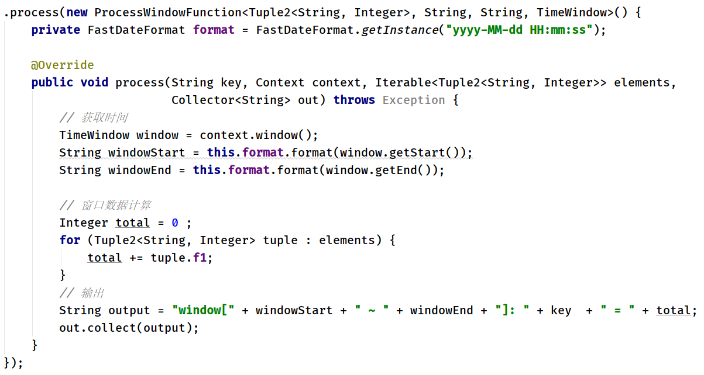


> 使用增量聚合函数：`ReduceFunction`实时对窗口数据进行聚合，代码如下：

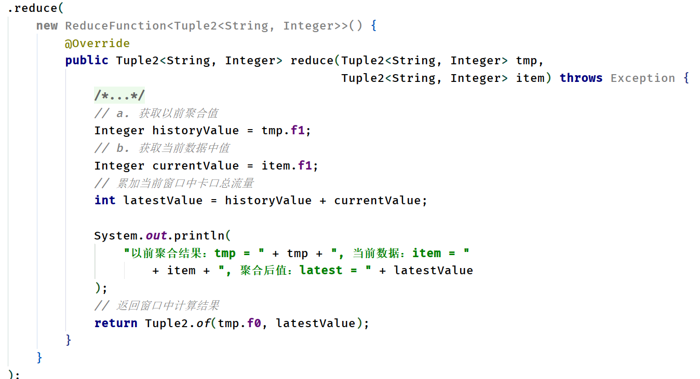

> 当运行流式计算程序时，控制台数据打印信息如下：

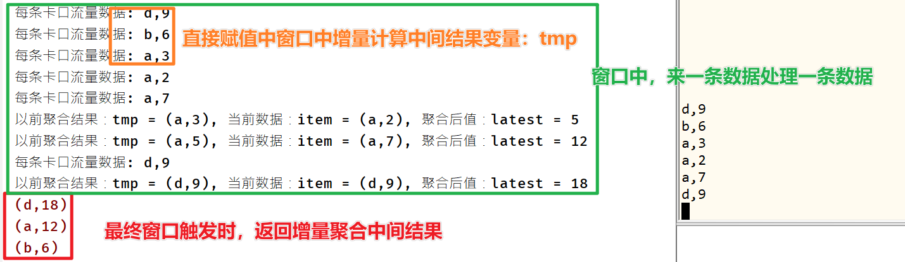


### 05-[掌握]-Window Aggregation【先增后全聚合】

------


> ​			当使用**ProcessWindowFunction**窗口函数对窗口中数据聚合时，可以结合使用`ReduceFunction`或`AggregateFunction`函数进行增量聚合。
>
> ​		 [数据进入窗口时，首先调用ReduceFunction或AggregateFunction增量聚合，当触发窗口计算时，直接返回窗口中增量聚合中间结果即可，还可以获取窗口信息（比如窗口开始时间和结束时间）。]()

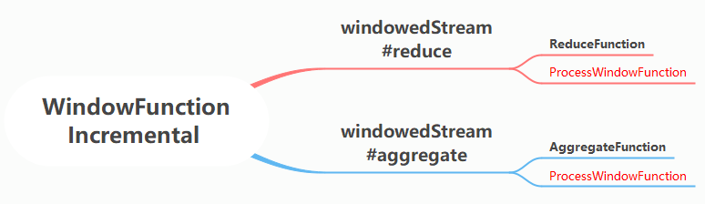


> `ProcessWindowFunction`窗口函数结合`ReduceFunction`增量函数，对窗口中数据实时增量聚合。

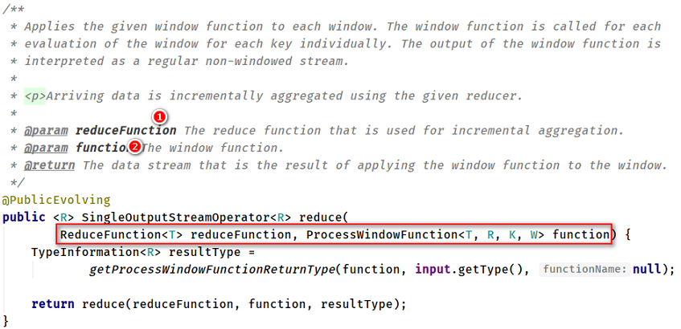


> 修改代码，使用增量聚合和窗口聚合，获取窗口开始时间和结束时间，代码如下：

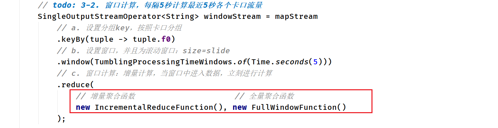


```Java
package cn.itcast.flink.aggregate;

import org.apache.commons.lang3.time.FastDateFormat;
import org.apache.flink.api.common.functions.MapFunction;
import org.apache.flink.api.common.functions.ReduceFunction;
import org.apache.flink.api.java.tuple.Tuple2;
import org.apache.flink.streaming.api.datastream.DataStreamSource;
import org.apache.flink.streaming.api.datastream.SingleOutputStreamOperator;
import org.apache.flink.streaming.api.environment.StreamExecutionEnvironment;
import org.apache.flink.streaming.api.functions.windowing.ProcessWindowFunction;
import org.apache.flink.streaming.api.windowing.assigners.TumblingProcessingTimeWindows;
import org.apache.flink.streaming.api.windowing.time.Time;
import org.apache.flink.streaming.api.windowing.windows.TimeWindow;
import org.apache.flink.util.Collector;

/**
 * 滚动时间窗口案例演示：实时交通卡口流量统计，每隔5秒统计最近5秒钟各个卡口流量
 */
public class WindowReduceProcessDemo {

	/*
		对窗口中数据进行增量聚合，使用reduce函数
	 */
	private static class IncrementalReduceFunction implements ReduceFunction<Tuple2<String, Integer>> {

		@Override
		public Tuple2<String, Integer> reduce(Tuple2<String, Integer> tmp,
		                                      Tuple2<String, Integer> item) throws Exception {
			System.out.println("tmp = " + tmp + ", item = " + item);
					/*
						tmp:
							对窗口中数据聚合时，存储聚合中间结果变量，类型与窗口中数据类型一致
							todo: 将窗口中第1条数据首先赋值给tmp
							(flink, 10)
						item:
							窗口中每条数据，todo：从窗口中第2条数据开始赋值
							(flink, 1)
					 */
			// 获取以前聚合值
			Integer historyValue = tmp.f1;
			// 获取当前值
			Integer currentValue = item.f1;
			// 合并数据
			int updateValue = historyValue + currentValue;

			// 返回聚合结果
			return Tuple2.of(tmp.f0, updateValue);
		}
	}

	/*
	    当触发窗口计算时，对窗口中数据进行聚合操作
	 */
	private static class FullWindowFunction
		extends ProcessWindowFunction<Tuple2<String, Integer>, String, String, TimeWindow> {
		private FastDateFormat format = FastDateFormat.getInstance("yyyy-MM-dd HH:mm:ss") ;
		@Override
		public void process(String key,
		                    Context context,
		                    Iterable<Tuple2<String, Integer>> elements,
		                    Collector<String> out) throws Exception {
			// 获取窗口时间
			TimeWindow window = context.window();
			String winStart = this.format.format(window.getStart());
			String winEnd = this.format.format(window.getEnd());
			// 窗口数据计算
			Tuple2<String, Integer> totalTuple = elements.iterator().next();

			// 输出
			String output = "window[" + winStart + " ~ " + winEnd + "]: " + key + " = " + totalTuple.f1 ;
			out.collect(output);
		}
	}

	public static void main(String[] args) throws Exception {
		// 1. 执行环境-env
		StreamExecutionEnvironment env = StreamExecutionEnvironment.getExecutionEnvironment();
		env.setParallelism(1) ;

		// 2. 数据源-source
		DataStreamSource<String> inputStream = env.socketTextStream("node1.itcast.cn", 9999);

/*
数据：
a,3
a,2
a,7
d,9
b,6
a,5
b,3
e,7
e,4
 */
		// 3. 数据转换-transformation
		// 3-1. 对数据进行转换处理: 过滤脏数据，解析封装到二元组中
		SingleOutputStreamOperator<Tuple2<String, Integer>> mapStream = inputStream
			.filter(line -> line.trim().split(",").length == 2)
			.map(new MapFunction<String, Tuple2<String, Integer>>() {
				@Override
				public Tuple2<String, Integer> map(String line) throws Exception {
					String[] array = line.trim().split(",");
					Tuple2<String, Integer> tuple = Tuple2.of(array[0], Integer.parseInt(array[1]));
					// 返回
					return tuple;
				}
			});
		
		// todo: 3-2. 窗口计算，每隔5秒计算最近5秒各个卡口流量
		SingleOutputStreamOperator<String> windowStream = mapStream
			// a. 设置分组key，按照卡口分组
			.keyBy(tuple -> tuple.f0)
			// b. 设置窗口，并且为滚动窗口：size=slide
			.window(TumblingProcessingTimeWindows.of(Time.seconds(5)))
			// c. 窗口计算：增量计算，当窗口中进入数据，立刻进行计算
			.reduce(
				// 增量聚合函数                     // 全量聚合函数
				new IncrementalReduceFunction(), new FullWindowFunction()
			);

		// 4. 数据终端-sink
		windowStream.printToErr();

		// 5. 触发执行-execute
		env.execute("WindowReduceProcessDemo");
	}

}  
```


> 运行流式程序，输入数据，查看输出结果：

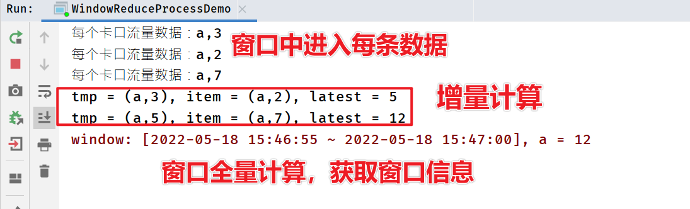


### 06-[掌握]-Aysnc IO 功能及案例

------


> ​		   Async I/O是阿里巴巴贡献给社区的一个呼声非常高的特性，于**1.2版本**引入。主要目的==是为了解决与外部系统交互时网络延迟成为了系统瓶颈的问题。==

https://nightlies.apache.org/flink/flink-docs-release-1.13/docs/dev/datastream/operators/asyncio/

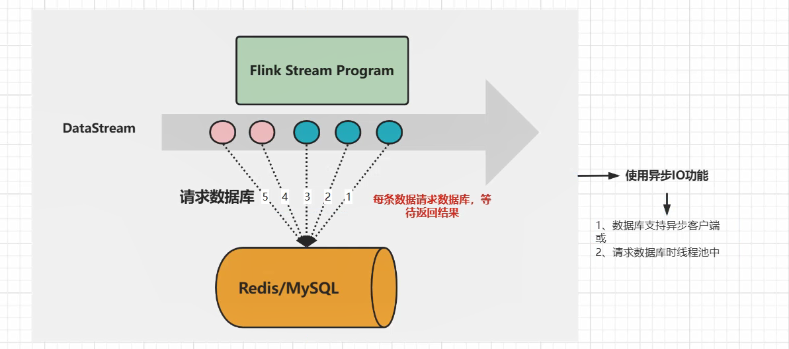


> ​			流计算系统中经常需要与外部系统进行交互，通常的做法，如向数据库发送用户A的查询请求，然后等待结果返回，在之前，程序无法发送用户B的查询请求。这是一种同步访问方式，如下图所示：

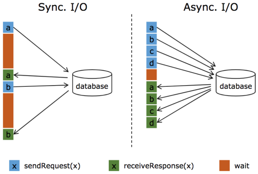


- 1）、左图所示：通常实现方式是向数据库发送用户a的查询请求（例如在MapFunction中），然后
  等待结果返回，在这之前，无法发送用户b的查询请求，这是一种同步访问的模式，图中棕色
  的长条标识等待时间，可以发现网络等待时间极大的阻碍了吞吐和延迟；


- 2）、右图所示：为了解决同步访问的问题，`异步模式可以并发的处理多个请求和回复，`可以连续
  的向数据库发送用户a、b、c、d等的请求，与此同时，哪个请求的回复先返回了就处理哪个回复，从而连续的请求之间不需要阻塞等待，这也正是Async I/O的实现原理。


> 使用 **Aysnc I/O** 前提条件：

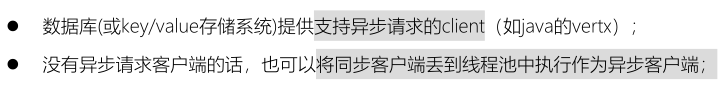


> ​		**Async I/O API**：允许用户在数据流中使用异步客户端访问外部存储，该API处理与数据流的集成，以及消息顺序性（Order），事件时间（EventTime），一致性（容错）等脏活累活，用户只专注于业务。

- step1、使用`AysncDataStream`对数据流DataStream进行异步处理

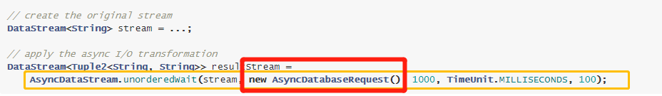


- step2、自定义类，转换异步处理数据，其中需要异步请求外部存储系统，处理结果

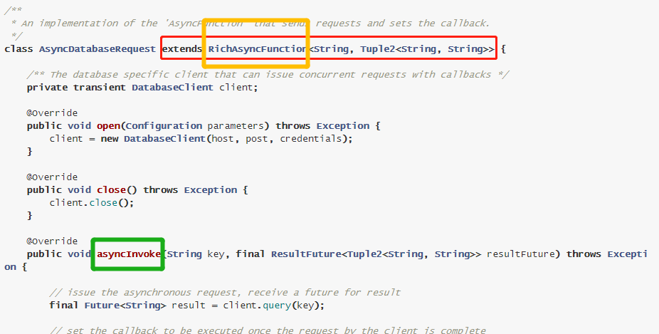


> 案例说明：**自定义数据源创建DataStream，依据其中字段值，采用异步方式，到MySQL数据库查询数据。**

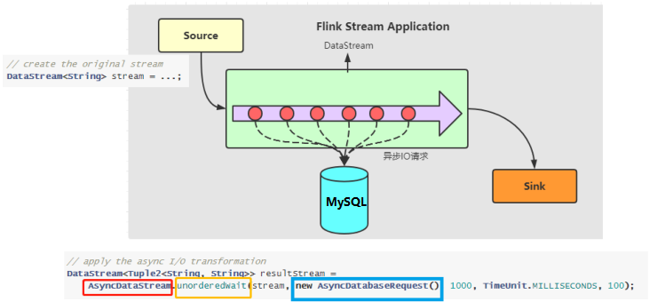


```SQL
-- 创建数据库
CREATE DATABASE IF NOT EXISTS db_flink;

-- 使用数据库
USE db_flink ;

-- 创建表
CREATE TABLE IF NOT EXISTS db_flink.tbl_user_info (
    user_id varchar(100) NOT NULL,
    user_name varchar(255) NOT NULL,
    CONSTRAINT tbl_user_info_PK PRIMARY KEY (user_id)
)ENGINE=InnoDB DEFAULT CHARSET=utf8 COLLATE=utf8_general_ci;

-- 插入数据
INSERT INTO db_flink.tbl_user_info (user_id, user_name) VALUES ('u_1000', 'zhenshi') ;
INSERT INTO db_flink.tbl_user_info (user_id, user_name) VALUES ('u_1001', 'zhangsan') ;
INSERT INTO db_flink.tbl_user_info (user_id, user_name) VALUES ('u_1002', 'lisi') ;
INSERT INTO db_flink.tbl_user_info (user_id, user_name) VALUES ('u_1003', 'wangwu') ;
INSERT INTO db_flink.tbl_user_info (user_id, user_name) VALUES ('u_1004', 'zhaoliu') ;
INSERT INTO db_flink.tbl_user_info (user_id, user_name) VALUES ('u_1005', 'tianqi') ;
INSERT INTO db_flink.tbl_user_info (user_id, user_name) VALUES ('u_1006', 'qianliu') ;
INSERT INTO db_flink.tbl_user_info (user_id, user_name) VALUES ('u_1007', 'sunqi') ;
INSERT INTO db_flink.tbl_user_info (user_id, user_name) VALUES ('u_1008', 'zhouba') ;
INSERT INTO db_flink.tbl_user_info (user_id, user_name) VALUES ('u_1009', 'wujiu') ;

```


#### 用户访问日志

> 自定义数据源：`ClickLogSource`，模拟用户访问网站日志数据。

```Java
package cn.itcast.flink.async;

import org.apache.commons.lang3.time.FastDateFormat;
import org.apache.flink.streaming.api.functions.source.RichSourceFunction;

import java.util.Random;
import java.util.concurrent.TimeUnit;

/**
 * 自定义数据源，实时产生用户行为日志数据
 */
public class ClickLogSource extends RichSourceFunction<String> {
	private boolean isRunning = true ;

	@Override
	public void run(SourceContext<String> ctx) throws Exception {
		String[] array = new String[]{"click", "browser", "browser", "click", "browser", "browser", "search"};
		Random random = new Random();
		FastDateFormat format = FastDateFormat.getInstance("yyyy-MM-dd HH:mm:ss.SSS") ;
		// 模拟用户点击日志流数据
		while (isRunning){
			String userId = "u_" + (1000 + random.nextInt(10)) ;
			String behavior = array[random.nextInt(array.length)] ;
			Long timestamp = System.currentTimeMillis();

			String output = userId + "," + behavior + "," + format.format(timestamp) ;
			System.out.println("source>>" + output);
			// 输出
			ctx.collect(output);
			// 每隔至少1秒产生1条数据
			TimeUnit.SECONDS.sleep( 1 + random.nextInt(2));
		}
	}

	@Override
	public void cancel() {
		isRunning = false ;
	}
}
```


#### 异步请求数据库

> 定义类：`AsyncMySQLRequest`，实现异步接口`RichAsyncFunction`。

```Java
package cn.itcast.flink.async;

import org.apache.flink.api.java.tuple.Tuple2;
import org.apache.flink.configuration.Configuration;
import org.apache.flink.streaming.api.functions.async.ResultFuture;
import org.apache.flink.streaming.api.functions.async.RichAsyncFunction;

import java.sql.Connection;
import java.sql.DriverManager;
import java.sql.PreparedStatement;
import java.sql.ResultSet;
import java.util.Collections;
import java.util.concurrent.Callable;
import java.util.concurrent.ExecutorService;
import java.util.concurrent.Executors;
import java.util.concurrent.Future;

/**
 * 异步请求MySQL数据库，依据userId获取userName，采用线程池方式请求
 */
public class AsyncMySQLRequest extends RichAsyncFunction<Tuple2<String, String>, String> {

	// 定义变量
	private Connection conn = null ;
	private PreparedStatement pstmt = null ;
	private ResultSet result = null ;

	// 定义线程池变量
	private ExecutorService executorService = null ;

	// 请求数据库前，准备工作，todo：获取数据库连接
	@Override
	public void open(Configuration parameters) throws Exception {
		// 初始化线程池
		executorService = Executors.newFixedThreadPool(10) ;

		// a. 加载驱动类
		Class.forName("com.mysql.jdbc.Driver") ;
		// b. 获取连接
		conn = DriverManager.getConnection(
			"jdbc:mysql://node1.itcast.cn:3306/?useSSL=false",
			"root",
			"123456"
		);
		// c. 构建Statement对象
		pstmt = conn.prepareStatement("SELECT user_name FROM db_flink.tbl_user_info WHERE user_id = ?") ;
	}

	// todo：对流中每条数据调用，进行异步请求，获取数据，并返回
	@Override
	public void asyncInvoke(Tuple2<String, String> input, ResultFuture<String> resultFuture) throws Exception {
		/*
			input -> (u_1000, u_1000,browser,2022-04-03 10:16:35.606)
						|
				zhenshi,u_1000,browser,2022-04-03 10:16:35.606
		 */
		String userId = input.f0 ;

		// todo: 通过线程池请求MySQL数据库，达到异步请求效果
		Future<String> future = executorService.submit(
			new Callable<String>() {
				@Override
				public String call() throws Exception {
					// 直接请求数据库，获取userName
					String userName = "未知" ;

					// d. 设置查询占位符值
					pstmt.setString(1, userId);
					// e. 请求数据库，查询数据
					result = pstmt.executeQuery();
					// f. 获取查询结果
					while (result.next()){
						userName = result.getString("user_name");
					}
					// 返回查询结果
					return userName;
				}
			}
		);

		// 获取异步请求结果
		String userName = future.get();
		String output = userName + "," + input.f1 ;

		// 将查询数据库结果异步返回
		resultFuture.complete(Collections.singletonList(output));
	}

	// todo：异步请求超时，如何处理数据
	@Override
	public void timeout(Tuple2<String, String> input, ResultFuture<String> resultFuture) throws Exception {
		// 获取日志数据
		String log = input.f1;
		// 输出数据
		String output = "unknown," + log ;
		// 最后返回
		resultFuture.complete(Collections.singletonList(output));
	}

	// 请求数据收尾工作，todo：关闭数据库连接
	@Override
	public void close() throws Exception {
		if(null != result) result.close();
		if(null != pstmt) pstmt.close();
		if(null != conn) conn.close();
	}
}
```


#### MAIN方法代码

```JAva
package cn.itcast.flink.async;

import org.apache.flink.api.common.functions.MapFunction;
import org.apache.flink.api.java.tuple.Tuple2;
import org.apache.flink.streaming.api.datastream.AsyncDataStream;
import org.apache.flink.streaming.api.datastream.DataStreamSource;
import org.apache.flink.streaming.api.datastream.SingleOutputStreamOperator;
import org.apache.flink.streaming.api.environment.StreamExecutionEnvironment;

import java.util.concurrent.TimeUnit;

/**
 * 采用异步方式请求MySQL数据库获取数据
 */
public class StreamAysncMySQLDemo {

	public static void main(String[] args) throws Exception {
		// 1. 执行环境-env
		StreamExecutionEnvironment env = StreamExecutionEnvironment.getExecutionEnvironment();
		env.setParallelism(1) ;

		// 2. 数据源-source
		DataStreamSource<String> dataStream = env.addSource(new ClickLogSource());
		//dataStream.printToErr();

		// 3. 数据转换-transformation
		/*
			u_1000,browser,2022-04-03 10:16:35.606
		 */
		// 3-1. 将数据进行转换，封装到二元组中: userId -> log
		SingleOutputStreamOperator<Tuple2<String, String>> logStream = dataStream.map(new MapFunction<String, Tuple2<String, String>>() {
			@Override
			public Tuple2<String, String> map(String value) throws Exception {
				// 获取userId，便于后期直接使用，到数据库中查询用户名称
				String userId = value.split(",")[0] ;
				// 构建二元组对象，并返回
				return Tuple2.of(userId, value);
			}
		});

		// 3-2. TODO: 异步请求MySQL数据库，采用JDBC方式查询数据，不支持异步请求，所以使用线程池方式请求
		SingleOutputStreamOperator<String> resultStream = AsyncDataStream.unorderedWait(
			logStream, // 数据流
			new AsyncMySQLRequest(), //
			1000, //
			TimeUnit.MILLISECONDS,//
			10
		);

		// 4. 数据终端-sink
		resultStream.printToErr();

		// 5. 触发执行-execute
		env.execute("StreamAysncMySQLDemo");
	}

}  
```


## 第二部分：Flink 双流JOIN【4个小节】


```

```


```ini
# 双流JOIN：2个大数据流，需要实时进行关联JOIN，往往进行数据拉宽整合操作。
	交易订单数据
		main-order，订单数据
			orderId
		detail-order，订单详情数据
			关联订单表orderId
	大表对大表
	
实时数据仓库体系中：
	如果对订单实时分析，需要将主订单和子订单数据流实时JOIN，存储到数据库中，进一步实时查询分析。
```


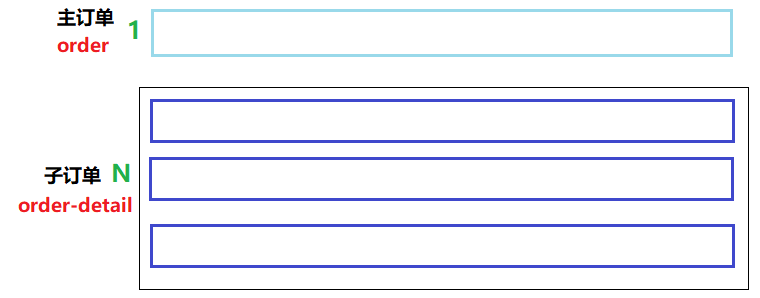


### 07-[理解]-Flink 双流 JOIN【JOIN 类型】

---


> [在Flink中，双流Join主要有两种：一种是`Window Join`，还有一种是`Interval Join`。]()

https://nightlies.apache.org/flink/flink-docs-release-1.13/docs/dev/datastream/operators/joining/

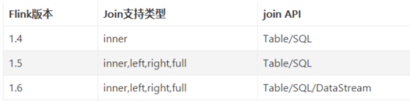


> - 第一类：**Window Join**，[基于窗口JOIN]()
>   - ==利用window的机制，先将数据缓存在Window State中，当窗口触发计算时，执行join操作==；
>   - 根据Window的类型细分出3种：`Tumbling Window` Join、`Sliding Window` Join、`Session Widnow` Join；
>
> [Window JOIN，都是基于`时间`之上的窗口，按照时间划分窗口，时间都是`事件时间EventTime`]()

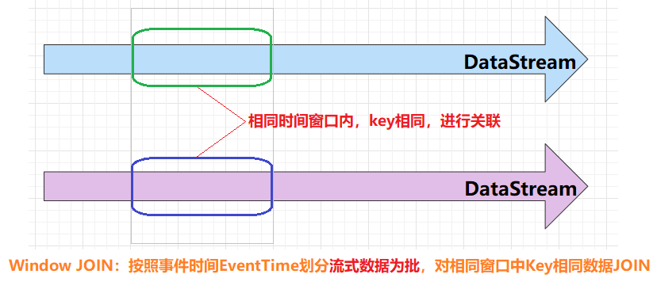


> - 第二类：**Interval Join**，[基于间隔JOIN]()
>   - 对两条流中拥有==相同键值Key==及彼此之间==时间戳不超过某一指定间隔==的事件进行 Join。
>   - ==利用state存储数据再处理==，区别在于state中的数据有失效机制，依靠数据触发数据清理；
>   - IntervalJoin **连接两个keyedStream**, 按照相同的key在一个相对数据时间的时间段内进行连接。

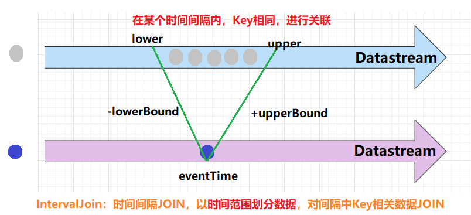


### 08-[理解]-Flink 双流 JOIN【Window Join】

---


> ​		Window Join将流中**两个key相同的元素联结在一起**。这种联结方式看起来非常像`inner join`，==两个元素必须都存在，才会出现在结果中==。

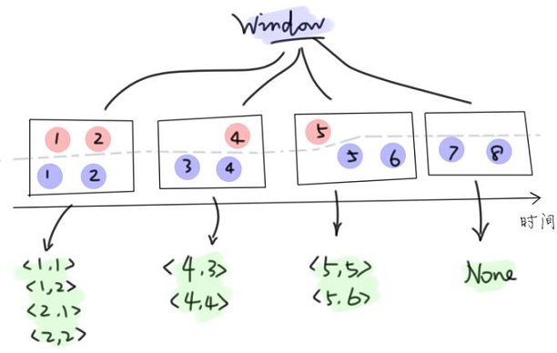


> ​		在执行窗口join时，会将`所有key能够匹配上、且处在同一个窗口的事件进行join，join之后传递到JoinFunction或者FlatJoinFunction`。

```ini
两个流DataStream进行关联JOIN时步骤：
    第一步、join 方法关联
    第二步、where...equalTo...指定条件
    第三步、window 方法设置窗口
    第四步、apply 方法窗口数据聚合
```

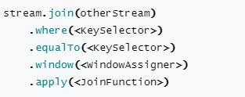


> Flink中有三种类型的时间窗口：**滚动时间窗口、滑动时间窗口、会话时间窗口**，以窗口的类型分开讲解。

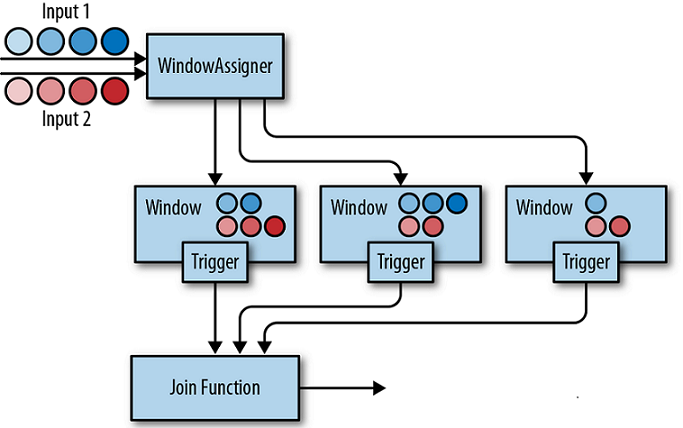

​				两条输入流都会根据各自的键值属性进行分区，公共窗口分配器会将二者的事件映射到公共窗口内（其中同时存储了两条流中的数据）。当窗口的计时器触发时，算子会遍历两个输入中元素的每个组合（叉乘积）去调用 JoinFunction。


> ​		Thumbling Window Join：**执行滚动窗口JOIN时，具有公共键和公共滚动窗口的所有元素将作为成对组合联接，并传递给JoinFunction或FlatJoinFunction**。因为它的行为类似于内部连接，所以一个流中的元素在其滚动窗口中没有来自另一个流的元素，因此不会被发射！

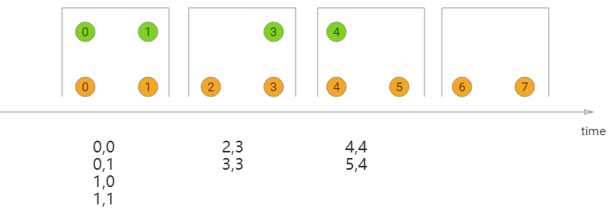


> ​		如上图所示，定义了一个大小为`2毫秒`的滚动窗口，结果窗口的形式为`[0,1]、[2,3]、...`，该图显示了每个窗口中所有元素的成对组合，这些元素将传递给`JoinFunction`。注意，在滚动窗口[6,7]中没有发射任何东西，因为绿色流中不存在与橙色元素⑥和⑦结合的元素。

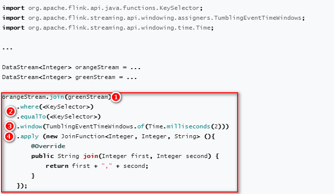


> ​			Sliding Window Join：**在执行滑动窗口联接时，具有公共键和公共滑动窗口的所有元素将作为成对组合联接，并传递给JoinFunction或FlatJoinFunction。**在当前滑动窗口中，一个流的元素没有来自另一个流的元素，则不会发射！请注意，某些元素可能会连接到一个滑动窗口中，但不会连接到另一个滑动窗口中！

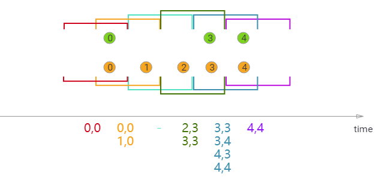

> ​		在上图示例中，使用大小为`2毫秒的滑动窗口`，并将其`滑动1毫秒`，从而产生滑动窗口`[-1，0]，[0,1]，[1,2]，[2,3]…`。x轴下方的连接元素是传递给每个滑动窗口的JoinFunction的元素。在这里，还可以看到，例如，在窗口[2,3]中，橙色②与绿色③连接，但在窗口[1,2]中没有与任何对象连接。

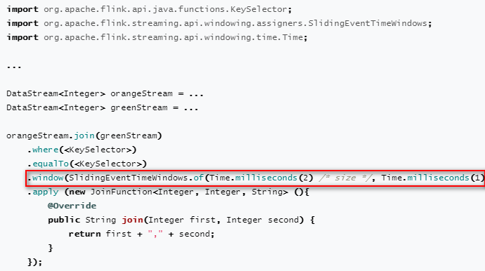


> ​			Session Window Join：**在执行会话窗口联接时，具有相同键（当“组合”时满足会话条件）的所有元素以成对组合方式联接，并传递给JoinFunction或FlatJoinFunction。**同样，这执行一个内部连接，所以如果有一个会话窗口只包含来自一个流的元素，则不会发出任何输出！

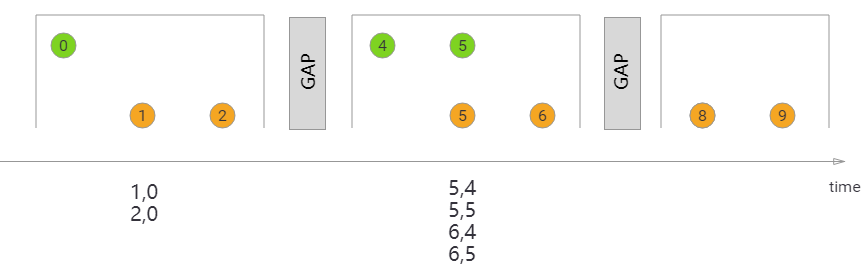

> 在上图，定义了一个会话窗口连接，其中每个会话被`至少1ms的间隔分割`。有三个会话，在前两个会话中，来自两个流的连接元素被传递给JoinFunction。**在第三个会话中，绿色流中没有元素，所以⑧和⑨没有连接！**

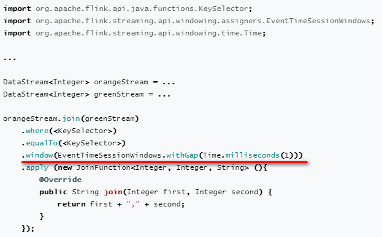


> 测试数据

```ini
交易订单数据为例：
	订单数据：main-order
		orderTime,orderId,userId,orderAddress,orderMoney
	订单详情数据：detail-order
		detailTime,orderId,detailId,goodsName,goodsNumber,detailMoney


2022-04-05 06:00:00,order_101,user_1,shanghai-haizhou,60.00
-----------------------------------------------------
2022-04-05 06:00:01,order_101,detail_1,tomato,4,17.50
2022-04-05 06:00:01,order_101,detail_2,potato,2,12.50
2022-04-05 06:00:01,order_101,detail_3,egg,20,30.00


2022-04-05 06:00:07,order_102,user_2,shanghai-changda,100.00
-----------------------------------------------------
2022-04-05 06:00:07,order_102,detail_1,milk,1,64.80
2022-04-05 06:00:08,order_102,detail_3,pig,1,35.20


2022-04-05 06:00:12,order_103,user_3,shanghai-changtai,45.00
-----------------------------------------------------
2022-04-05 06:00:12,order_103,detail_1,milk,1,45.00
```


#### 流式代码：TumblingWindowJoinDemo

---

```Java
package cn.itcast.flink.join;

import lombok.SneakyThrows;
import org.apache.commons.lang3.time.FastDateFormat;
import org.apache.flink.api.common.eventtime.SerializableTimestampAssigner;
import org.apache.flink.api.common.eventtime.WatermarkStrategy;
import org.apache.flink.api.common.functions.JoinFunction;
import org.apache.flink.api.common.functions.MapFunction;
import org.apache.flink.streaming.api.datastream.DataStream;
import org.apache.flink.streaming.api.datastream.DataStreamSource;
import org.apache.flink.streaming.api.datastream.SingleOutputStreamOperator;
import org.apache.flink.streaming.api.environment.StreamExecutionEnvironment;
import org.apache.flink.streaming.api.windowing.assigners.TumblingEventTimeWindows;
import org.apache.flink.streaming.api.windowing.time.Time;

import java.time.Duration;
import java.util.Date;

/**
 * 双流JOIN：基于事件时间滚动窗口JOIN
 *      orderStream：订单数据流
 *      detailStream：订单详情数据流
 */
public class TumblingWindowJoinDemo {

	public static void main(String[] args) throws Exception {
		// 1. 执行环境-env
		StreamExecutionEnvironment env = StreamExecutionEnvironment.getExecutionEnvironment();
		env.setParallelism(1);

		// 2. 数据源-source
		// 2-1. order订单数据流 -> 9999
		DataStreamSource<String> rawOrderStream = env.socketTextStream("node1.itcast.cn", 9999);
		// 2-2. detail订单详情数据流 -> 8888
		DataStreamSource<String> rawDetailStream = env.socketTextStream("node1.itcast.cn", 8888);

/*
2022-04-05 06:00:00,order_101,user_1,shanghai-haizhou,60.00
-----------------------------------------------------
2022-04-05 06:00:01,order_101,detail_1,tomato,4,17.50
2022-04-05 06:00:01,order_101,detail_2,potato,2,12.50
2022-04-05 06:00:01,order_101,detail_3,egg,20,30.00


2022-04-05 06:00:07,order_102,user_2,shanghai-changda,100.00
-----------------------------------------------------
2022-04-05 06:00:07,order_102,detail_1,milk,1,64.80
2022-04-05 06:00:08,order_102,detail_3,pig,1,35.20


2022-04-05 06:00:12,order_103,user_3,shanghai-changtai,45.00
-----------------------------------------------------
2022-04-05 06:00:12,order_103,detail_1,milk,1,45.00
 */

		// 3. 数据转换-transformation
		// 3-1. 对【订单数据流】中订单数据处理
		SingleOutputStreamOperator<MainOrder> orderStream = rawOrderStream
			.filter(line -> line.trim().split(",").length == 5)
			// 设置事件时间字段
			.assignTimestampsAndWatermarks(
				WatermarkStrategy
					.<String>forBoundedOutOfOrderness(Duration.ofSeconds(2)) // 乱序数据，等待2秒
					.withTimestampAssigner(new SerializableTimestampAssigner<String>() {
						private FastDateFormat format = FastDateFormat.getInstance("yyyy-MM-dd HH:mm:ss");

						@SneakyThrows
						@Override
						public long extractTimestamp(String element, long recordTimestamp) {
							System.out.println("order -> " + element);
							String orderTime = element.split(",")[0];
							Date orderDate = format.parse(orderTime);
							return orderDate.getTime();
						}
					})
			)
			// 数据解析封装到实体类中
			.map(new MapFunction<String, MainOrder>() {
				@Override
				public MainOrder map(String value) throws Exception {
					// 2022-04-05 06:00:12,order_103,user_3,shanghai-changtai,45.00
					String[] array = value.split(",");
					MainOrder mainOrder = new MainOrder();
					mainOrder.setOrderTime(array[0]);
					mainOrder.setOrderId(array[1]);
					mainOrder.setUserId(array[2]);
					mainOrder.setAddress(array[3]);
					mainOrder.setOrderMoney(Double.parseDouble(array[4]));
					// 返回实体类对象
					return mainOrder;
				}
			});

		// 3-2. 对【详细订单数据流】中详情数据处理
		SingleOutputStreamOperator<DetailOrder> detailStream = rawDetailStream
			.filter(line -> line.trim().split(",").length == 6)
			// 设置事件时间字段
			.assignTimestampsAndWatermarks(
				WatermarkStrategy
					.<String>forBoundedOutOfOrderness(Duration.ofSeconds(2)) // 乱序数据，等待2秒
					.withTimestampAssigner(new SerializableTimestampAssigner<String>() {
						private FastDateFormat format = FastDateFormat.getInstance("yyyy-MM-dd HH:mm:ss");

						@SneakyThrows
						@Override
						public long extractTimestamp(String element, long recordTimestamp) {
							System.out.println("detail -> " + element);
							String orderTime = element.split(",")[0];
							Date orderDate = format.parse(orderTime);
							return orderDate.getTime();
						}
					})
			)
			// 数据解析封装到实体类中
			.map(new MapFunction<String, DetailOrder>() {
				@Override
				public DetailOrder map(String value) throws Exception {
					// 2022-04-05 06:00:12,order_103,detail_1,milk,1,45.00
					String[] array = value.split(",");
					DetailOrder detailOrder = new DetailOrder() ;
					detailOrder.setDetailTime(array[0]);
					detailOrder.setOrderId(array[1]);
					detailOrder.setDetailId(array[2]);
					detailOrder.setGoodsName(array[3]);
					detailOrder.setGoodsNumber(Integer.parseInt(array[4]));
					detailOrder.setDetailMoney(Double.parseDouble(array[5]));
					// 返回实体类对象
					return detailOrder;
				}
			});

		// todo: 3-3. 对2个流进行窗口join，基于事件时间滚动窗口
		DataStream<DwdOrder> joinStream = orderStream
			// 第1步、join数据流
			.join(detailStream)
			// 第2步、指定条件：关联key
			.where(MainOrder::getOrderId).equalTo(DetailOrder::getOrderId)
			// 第3步、窗口设置
			.window(TumblingEventTimeWindows.of(Time.seconds(5)))
			// 第4步、窗口中数据JOIN处理
			.apply(new JoinFunction<MainOrder, DetailOrder, DwdOrder>() {
				@Override
				public DwdOrder join(MainOrder order, DetailOrder detail) throws Exception {
					/*
						2022-04-05 06:00:12,order_103,user_3,shanghai-changtai,45.00
						-----------------------------------------------------
						2022-04-05 06:00:12,order_103,detail_1,milk,1,45.00
					*/
					DwdOrder dwdOrder = new DwdOrder();
					dwdOrder.setOrderId(order.getOrderId());

					dwdOrder.setOrderTime(order.getOrderTime());
					dwdOrder.setUserId(order.getUserId());
					dwdOrder.setAddress(order.getAddress());
					dwdOrder.setOrderMoney(order.getOrderMoney());

					dwdOrder.setDetailOrderTime(detail.getDetailTime());
					dwdOrder.setDetailId(detail.getDetailId());
					dwdOrder.setGoodsName(detail.getGoodsName());
					dwdOrder.setGoodsNumber(detail.getGoodsNumber());
					dwdOrder.setDetailMoney(detail.getDetailMoney());

					// 返回关联数据
					return dwdOrder;
				}
			});

		// 4. 数据终端-sink
		joinStream.printToErr();

		// 5. 触发执行-execute
		env.execute("TumblingWindowJoinDemo");
	}

}  
```


#### 实体类：MainOrder

---

```Java
package cn.itcast.flink.join;

import lombok.*;

/**
 * 订单数据实体类
 */
@Setter
@Getter
@NoArgsConstructor
@AllArgsConstructor
@EqualsAndHashCode
public class MainOrder {
	/*
		数据：2022-04-05 06:00:00,order_101,user_1,shanghai-haizhou,50.00
	 */
	private String orderTime;
	private String orderId;
	private String userId;
	private String address;
	private Double orderMoney;

	@Override
	public String toString() {
		return orderTime + "," + orderId + "," + userId + "," + address + "," + orderMoney;
	}
}
```


#### 实体类：DetailOrder

----

```Java
package cn.itcast.flink.join;

import lombok.*;

/**
 * 订单详情信息表
 */
@Setter
@Getter
@NoArgsConstructor
@AllArgsConstructor
@EqualsAndHashCode
public class DetailOrder {
	/*
		数据：2022-04-05 06:00:01,order_101,detail_1,tomato,4,17.50
	 */
	private String detailTime;
	private String orderId ;
	private String detailId ;
	private String goodsName ;
	private int goodsNumber ;
	private double detailMoney ;

	@Override
	public String toString() {
		return detailTime + "," + orderId + "," + detailId + "," + goodsName + "," + goodsNumber + "," + detailMoney;
	}
}	
```


#### 实体类：DwdOrder

---

```Java
package cn.itcast.flink.join;

import lombok.AllArgsConstructor;
import lombok.Data;
import lombok.NoArgsConstructor;

@Data
@AllArgsConstructor
@NoArgsConstructor
public class DwdOrder {

	private String orderTime;
	private String orderId;
	private String userId;
	private String address;
	private Double orderMoney;
	private String detailOrderTime ;
	private String detailId ;
	private String goodsName ;
	private int goodsNumber ;
	private double detailMoney ;

}

```


### 09-[理解]-Flink 双流 JOIN【Interval Join】

---


> ​		==Flink中基于DataStream的Join，只能实现在同一个窗口的两个数据流进行join==，但是在实际中常常会存在`数据乱序或者延时`的情况，导致两个流的数据进度不一致，就会出现数据跨窗口的情况，那么数据就无法在同一个窗口内join。
>
> ​		**Flink基于KeyedStream提供的`interval join`机制，interval join 连接两个keyedStream, 按照相同的key在一个相对数据时间的时间段内进行连接。**
>
> ​									[基于时间间隔的 Join 目前只支持`事件时间`以及 `INNER JOIN` 语义]()

​		`Interval Join`使用公共`key`连接两个流（现在将它们分别称为A和B）的元素，并且流B的元素具有与流A的元素时间戳**相对时间间隔的时间戳**。

`流B的元素的时间戳 ≥ 流A的元素时间戳 + 下界 and  流B的元素的时间戳 ≤ 流A的元素时间戳 + 上界。`

```ini
b.timestamp ∈ [a.timestamp + lowerBound; a.timestamp + upperBound] 

or 

a.timestamp - lowerBound <= b.timestamp <= a.timestamp + upperBound
```


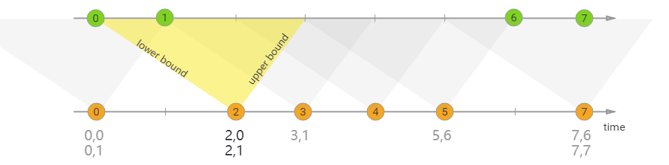


> ​	   在上面的示例中，将两个流“orange”和“green”连接起来，其`下限lower为-2毫秒`，`上限upper为+1毫秒`。默认情况下，这些**边界是包含**的，但是可以应用==.lowerBoundExclusive==（）和==.upperBoundExclusive==来更改行为`orangeElem.ts + lowerBound <= greenElem.ts <= orangeElem.ts + upperBound`。

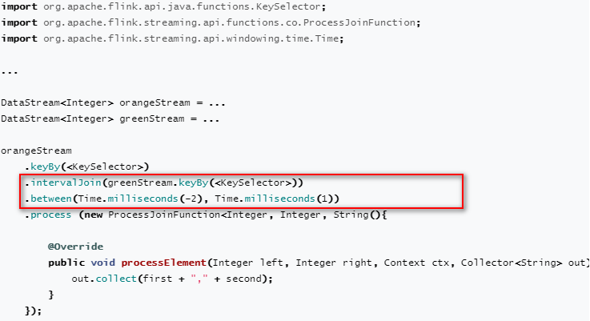


> 测试数据

```ini
2022-04-05 06:00:00,order_101,user_1,shanghai-haizhou,60.00
-----------------------------------------------------
2022-04-05 06:00:01,order_101,detail_1,tomato,4,17.50
2022-04-05 06:00:01,order_101,detail_2,potato,2,12.50
2022-04-05 06:00:01,order_101,detail_3,egg,20,30.00


2022-04-05 06:00:07,order_102,user_2,shanghai-changda,100.00
-----------------------------------------------------
2022-04-05 06:00:07,order_102,detail_1,milk,1,64.80
2022-04-05 06:00:08,order_102,detail_2,pig,1,35.20


2022-04-05 06:00:12,order_103,user_3,shanghai-changtai,45.00
-----------------------------------------------------
2022-04-05 06:00:13,order_103,detail_1,milk,1,45.00
```


> 修改上述基于事件时间滚动窗口Join代码，设置基于事件时间时间间隔JOIN，代码如下：

```Java
package cn.itcast.flink.join;

import lombok.SneakyThrows;
import org.apache.commons.lang3.time.FastDateFormat;
import org.apache.flink.api.common.eventtime.SerializableTimestampAssigner;
import org.apache.flink.api.common.eventtime.WatermarkStrategy;
import org.apache.flink.api.common.functions.MapFunction;
import org.apache.flink.streaming.api.datastream.DataStreamSource;
import org.apache.flink.streaming.api.datastream.SingleOutputStreamOperator;
import org.apache.flink.streaming.api.environment.StreamExecutionEnvironment;
import org.apache.flink.streaming.api.functions.co.ProcessJoinFunction;
import org.apache.flink.streaming.api.windowing.time.Time;
import org.apache.flink.util.Collector;

import java.time.Duration;
import java.util.Date;

/**
 * 双流JOIN：基于事件时间滚动间隔JOIN
 *      orderStream：订单数据流   detailStream：订单详情数据流
 */
public class IntervalJoinDemo {

	public static void main(String[] args) throws Exception {
		// 1. 执行环境-env
		StreamExecutionEnvironment env = StreamExecutionEnvironment.getExecutionEnvironment();
		env.setParallelism(1);

		// 2. 数据源-source
		// 2-1. order订单数据流 -> 9999
		DataStreamSource<String> rawOrderStream = env.socketTextStream("node1.itcast.cn", 9999);
		// 2-2. detail订单详情数据流 -> 8888
		DataStreamSource<String> rawDetailStream = env.socketTextStream("node1.itcast.cn", 8888);

/*
2022-04-05 06:00:00,order_101,user_1,shanghai-haizhou,60.00
-----------------------------------------------------
2022-04-05 06:00:01,order_101,detail_1,tomato,4,17.50
2022-04-05 06:00:01,order_101,detail_2,potato,2,12.50
2022-04-05 06:00:01,order_101,detail_3,egg,20,30.00


2022-04-05 06:00:07,order_102,user_2,shanghai-changda,100.00
-----------------------------------------------------
2022-04-05 06:00:07,order_102,detail_1,milk,1,64.80
2022-04-05 06:00:08,order_102,detail_3,pig,1,35.20


2022-04-05 06:00:12,order_103,user_3,shanghai-changtai,45.00
-----------------------------------------------------
2022-04-05 06:00:12,order_103,detail_1,milk,1,45.00
 */

		// 3. 数据转换-transformation
		// 3-1. 对【订单数据流】中订单数据处理
		SingleOutputStreamOperator<MainOrder> orderStream = rawOrderStream
			.filter(line -> line.trim().split(",").length == 5)
			// 设置事件时间字段
			.assignTimestampsAndWatermarks(
				WatermarkStrategy
					.<String>forBoundedOutOfOrderness(Duration.ofSeconds(2)) // 乱序数据，等待2秒
					.withTimestampAssigner(new SerializableTimestampAssigner<String>() {
						private FastDateFormat format = FastDateFormat.getInstance("yyyy-MM-dd HH:mm:ss");

						@SneakyThrows
						@Override
						public long extractTimestamp(String element, long recordTimestamp) {
							System.out.println("order -> " + element);
							String orderTime = element.split(",")[0];
							Date orderDate = format.parse(orderTime);
							return orderDate.getTime();
						}
					})
			)
			// 数据解析封装到实体类中
			.map(new MapFunction<String, MainOrder>() {
				@Override
				public MainOrder map(String value) throws Exception {
					// 2022-04-05 06:00:12,order_103,user_3,shanghai-changtai,45.00
					String[] array = value.split(",");
					MainOrder mainOrder = new MainOrder();
					mainOrder.setOrderTime(array[0]);
					mainOrder.setOrderId(array[1]);
					mainOrder.setUserId(array[2]);
					mainOrder.setAddress(array[3]);
					mainOrder.setOrderMoney(Double.parseDouble(array[4]));
					// 返回实体类对象
					return mainOrder;
				}
			});

		// 3-2. 对【详细订单数据流】中详情数据处理
		SingleOutputStreamOperator<DetailOrder> detailStream = rawDetailStream
			.filter(line -> line.trim().split(",").length == 6)
			// 设置事件时间字段
			.assignTimestampsAndWatermarks(
				WatermarkStrategy
					.<String>forBoundedOutOfOrderness(Duration.ofSeconds(2)) // 乱序数据，等待2秒
					.withTimestampAssigner(new SerializableTimestampAssigner<String>() {
						private FastDateFormat format = FastDateFormat.getInstance("yyyy-MM-dd HH:mm:ss");

						@SneakyThrows
						@Override
						public long extractTimestamp(String element, long recordTimestamp) {
							System.out.println("detail -> " + element);
							String orderTime = element.split(",")[0];
							Date orderDate = format.parse(orderTime);
							return orderDate.getTime();
						}
					})
			)
			// 数据解析封装到实体类中
			.map(new MapFunction<String, DetailOrder>() {
				@Override
				public DetailOrder map(String value) throws Exception {
					// 2022-04-05 06:00:12,order_103,detail_1,milk,1,45.00
					String[] array = value.split(",");
					DetailOrder detailOrder = new DetailOrder() ;
					detailOrder.setDetailTime(array[0]);
					detailOrder.setOrderId(array[1]);
					detailOrder.setDetailId(array[2]);
					detailOrder.setGoodsName(array[3]);
					detailOrder.setGoodsNumber(Integer.parseInt(array[4]));
					detailOrder.setDetailMoney(Double.parseDouble(array[5]));
					// 返回实体类对象
					return detailOrder;
				}
			});

		// todo: 3-3. 对2个流进行间隔join，基于事件时间滚动窗口
		SingleOutputStreamOperator<DwdOrder> joinStream = orderStream
			.keyBy(MainOrder::getOrderId) // 订单流按照Key：orderId分组
			// 第1步、JOIN 数据流
			.intervalJoin(
				detailStream.keyBy(DetailOrder::getOrderId) // 详情流按照Key：orderId分组
			)
			// 第2步、指定条件，上限和下限
			.between(Time.seconds(-1), Time.seconds(2))
			// 第3步、关联join计算
			.process(new ProcessJoinFunction<MainOrder, DetailOrder, DwdOrder>() {
				@Override
				public void processElement(MainOrder order, DetailOrder detail,
				                           Context ctx, Collector<DwdOrder> out) throws Exception {
					DwdOrder dwdOrder = new DwdOrder();
					dwdOrder.setOrderId(order.getOrderId());

					dwdOrder.setOrderTime(order.getOrderTime());
					dwdOrder.setUserId(order.getUserId());
					dwdOrder.setAddress(order.getAddress());
					dwdOrder.setOrderMoney(order.getOrderMoney());

					dwdOrder.setDetailOrderTime(detail.getDetailTime());
					dwdOrder.setDetailId(detail.getDetailId());
					dwdOrder.setGoodsName(detail.getGoodsName());
					dwdOrder.setGoodsNumber(detail.getGoodsNumber());
					dwdOrder.setDetailMoney(detail.getDetailMoney());

					// 输出关联后数据
					out.collect(dwdOrder);
				}
			});

		// 4. 数据终端-sink
		joinStream.printToErr();

		// 5. 触发执行-execute
		env.execute("IntervalJoinDemo");
	}

}  
```


### 10-[理解]-Flink 双流 JOIN【Window CoGroup】

---


> 在实际的流计算中，经常会遇到多个流进行join的情况，Flink提供了2个Transformations来实现。

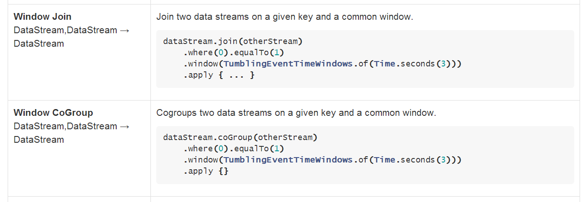


> `CoGroup` 表示**联合分组**，==将两个不同的DataStream联合起来，在相同的窗口内按照相同的key分组处理==。


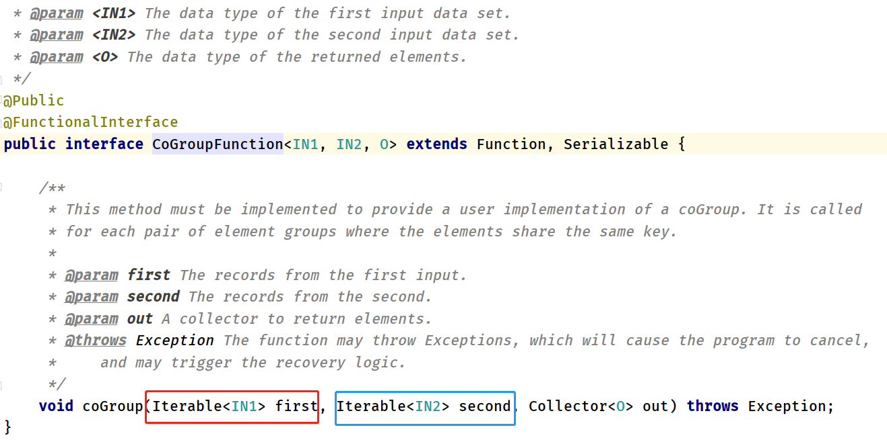


> ​		`CoGroup`操作是**将两个数据流/集合按照key进行group，然后将相同key的数据进行处理**，但是它和join操作稍有区别，它==在一个流/数据集中没有找到与另一个匹配的数据还是会输出==。
>
> - 侧重于**group**，对同一个key上的**两组集合**进行操作；
> - 如果在一个流中没有找到与另一个流的window中匹配的数据，任何输出结果，即只输出一个流的数据；
> - 仅能使用在**window**中；
>

​				[从两个不同的端口来读取数据，模拟两个流，使用CoGroup来处理这两个数据流，观察输出结果。]()

测试数据：

```ini
2022-04-05 06:00:00,order_101,user_1,shanghai-haizhou,60.00
-----------------------------------------------------
2022-04-05 06:00:01,order_101,detail_1,tomato,4,17.50
2022-04-05 06:00:01,order_101,detail_2,potato,2,12.50
2022-04-05 06:00:01,order_101,detail_3,egg,20,30.00


2022-04-05 06:00:07,order_102,user_2,shanghai-changda,100.00
-----------------------------------------------------
2022-04-05 06:00:07,order_102,detail_1,milk,1,64.80
2022-04-05 06:00:08,order_102,detail_3,pig,1,35.20


2022-04-05 06:00:12,order_103,user_3,shanghai-changtai,45.00
-----------------------------------------------------
2022-04-05 06:00:12,order_103,detail_1,milk,1,45.00


2022-04-05 06:00:17,order_104,user_4,shanghai-heima,0.00
-----------------------------------------------------


2022-04-05 06:00:22,order_105,user_5,shanghai-xiaweiyi,60.00
-----------------------------------------------------
2022-04-05 06:00:23,order_105,detail_1,milk,1,60.00
```


> 案例演示，代码如下：

```Java
package cn.itcast.flink.join;

import lombok.SneakyThrows;
import org.apache.commons.lang3.time.FastDateFormat;
import org.apache.flink.api.common.eventtime.SerializableTimestampAssigner;
import org.apache.flink.api.common.eventtime.WatermarkStrategy;
import org.apache.flink.api.common.functions.CoGroupFunction;
import org.apache.flink.api.common.functions.MapFunction;
import org.apache.flink.streaming.api.datastream.DataStream;
import org.apache.flink.streaming.api.datastream.DataStreamSource;
import org.apache.flink.streaming.api.datastream.SingleOutputStreamOperator;
import org.apache.flink.streaming.api.environment.StreamExecutionEnvironment;
import org.apache.flink.streaming.api.windowing.assigners.TumblingEventTimeWindows;
import org.apache.flink.streaming.api.windowing.time.Time;
import org.apache.flink.util.Collector;

import java.time.Duration;
import java.util.Date;

/**
 * 双流JOIN：基于事件时间滚动窗口CoGroup
 *      orderStream：订单数据流     detailStream：订单详情数据流
 */
public class TumblingWindowCoGroupDemo {

	public static void main(String[] args) throws Exception {
		// 1. 执行环境-env
		StreamExecutionEnvironment env = StreamExecutionEnvironment.getExecutionEnvironment();
		env.setParallelism(1);

		// 2. 数据源-source
		// 2-1. order订单数据流 -> 9999
		DataStreamSource<String> rawOrderStream = env.socketTextStream("node1.itcast.cn", 9999);
		// 2-2. detail订单详情数据流 -> 8888
		DataStreamSource<String> rawDetailStream = env.socketTextStream("node1.itcast.cn", 8888);

/*
2022-04-05 06:00:00,order_101,user_1,shanghai-haizhou,60.00
-----------------------------------------------------
2022-04-05 06:00:01,order_101,detail_1,tomato,4,17.50
2022-04-05 06:00:01,order_101,detail_2,potato,2,12.50
2022-04-05 06:00:01,order_101,detail_3,egg,20,30.00


2022-04-05 06:00:07,order_102,user_2,shanghai-changda,100.00
-----------------------------------------------------
2022-04-05 06:00:07,order_102,detail_1,milk,1,64.80
2022-04-05 06:00:08,order_102,detail_3,pig,1,35.20


2022-04-05 06:00:12,order_103,user_3,shanghai-changtai,45.00
-----------------------------------------------------
2022-04-05 06:00:12,order_103,detail_1,milk,1,45.00


2022-04-05 06:00:17,order_104,user_4,shanghai-heima,0.00
-----------------------------------------------------


2022-04-05 06:00:22,order_105,user_5,shanghai-xiaweiyi,60.00
-----------------------------------------------------
2022-04-05 06:00:23,order_105,detail_1,milk,1,60.00
 */

		// 3. 数据转换-transformation
		// 3-1. 对【订单数据流】中订单数据处理
		SingleOutputStreamOperator<MainOrder> orderStream = rawOrderStream
			.filter(line -> line.trim().split(",").length == 5)
			// 设置事件时间字段
			.assignTimestampsAndWatermarks(
				WatermarkStrategy
					.<String>forBoundedOutOfOrderness(Duration.ofSeconds(2)) // 乱序数据，等待2秒
					.withTimestampAssigner(new SerializableTimestampAssigner<String>() {
						private FastDateFormat format = FastDateFormat.getInstance("yyyy-MM-dd HH:mm:ss");

						@SneakyThrows
						@Override
						public long extractTimestamp(String element, long recordTimestamp) {
							System.out.println("order -> " + element);
							String orderTime = element.split(",")[0];
							Date orderDate = format.parse(orderTime);
							return orderDate.getTime();
						}
					})
			)
			// 数据解析封装到实体类中
			.map(new MapFunction<String, MainOrder>() {
				@Override
				public MainOrder map(String value) throws Exception {
					// 2022-04-05 06:00:12,order_103,user_3,shanghai-changtai,45.00
					String[] array = value.split(",");
					MainOrder mainOrder = new MainOrder();
					mainOrder.setOrderTime(array[0]);
					mainOrder.setOrderId(array[1]);
					mainOrder.setUserId(array[2]);
					mainOrder.setAddress(array[3]);
					mainOrder.setOrderMoney(Double.parseDouble(array[4]));
					// 返回实体类对象
					return mainOrder;
				}
			});

		// 3-2. 对【详细订单数据流】中详情数据处理
		SingleOutputStreamOperator<DetailOrder> detailStream = rawDetailStream
			.filter(line -> line.trim().split(",").length == 6)
			// 设置事件时间字段
			.assignTimestampsAndWatermarks(
				WatermarkStrategy
					.<String>forBoundedOutOfOrderness(Duration.ofSeconds(2)) // 乱序数据，等待2秒
					.withTimestampAssigner(new SerializableTimestampAssigner<String>() {
						private FastDateFormat format = FastDateFormat.getInstance("yyyy-MM-dd HH:mm:ss");

						@SneakyThrows
						@Override
						public long extractTimestamp(String element, long recordTimestamp) {
							System.out.println("detail -> " + element);
							String orderTime = element.split(",")[0];
							Date orderDate = format.parse(orderTime);
							return orderDate.getTime();
						}
					})
			)
			// 数据解析封装到实体类中
			.map(new MapFunction<String, DetailOrder>() {
				@Override
				public DetailOrder map(String value) throws Exception {
					// 2022-04-05 06:00:12,order_103,detail_1,milk,1,45.00
					String[] array = value.split(",");
					DetailOrder detailOrder = new DetailOrder() ;
					detailOrder.setDetailTime(array[0]);
					detailOrder.setOrderId(array[1]);
					detailOrder.setDetailId(array[2]);
					detailOrder.setGoodsName(array[3]);
					detailOrder.setGoodsNumber(Integer.parseInt(array[4]));
					detailOrder.setDetailMoney(Double.parseDouble(array[5]));
					// 返回实体类对象
					return detailOrder;
				}
			});

		// todo: 3-3. 对2个流进行窗口cogroup，基于事件时间滚动窗口
		DataStream<DwdOrder> joinStream = orderStream
			// 第1步、jion数据流
			.coGroup(detailStream)
			// 第2步、指定条件
			.where(MainOrder::getOrderId).equalTo(DetailOrder::getOrderId)
			// 第3步、窗口设置
			.window(TumblingEventTimeWindows.of(Time.seconds(5)))
			// 第4步、窗口数据JOIN处理
			.apply(new CoGroupFunction<MainOrder, DetailOrder, DwdOrder>() {
				@Override
				public void coGroup(Iterable<MainOrder> first, Iterable<DetailOrder> second, Collector<DwdOrder> out) throws Exception {
					// 以左表为准遍历数据
					for (MainOrder order : first) {
						DwdOrder dwdOrder = new DwdOrder() ;
						dwdOrder.setOrderId(order.getOrderId());
						dwdOrder.setOrderTime(order.getOrderTime());
						dwdOrder.setUserId(order.getUserId());
						dwdOrder.setAddress(order.getAddress());
						dwdOrder.setOrderMoney(order.getOrderMoney());

						//定义变量，表示是否与右表关联
						boolean isJoin = false ;

						// todo: 直接遍历右表数据，当且仅当右表有数据时，才执行遍历
						for (DetailOrder detail : second) {
							isJoin = true;
							// 关联以后，设置属性值
							dwdOrder.setDetailOrderTime(detail.getDetailTime());
							dwdOrder.setDetailId(detail.getDetailId());
							dwdOrder.setGoodsName(detail.getGoodsName());
							dwdOrder.setGoodsNumber(detail.getGoodsNumber());
							dwdOrder.setDetailMoney(detail.getDetailMoney());

							// 输出关联数据
							out.collect(dwdOrder);
						}

						// 如果右表没有数据，此时单独输出左表数据即可，todo：类似左外连接
						if(!isJoin){
							out.collect(dwdOrder);
						}
					}
				}
			});

		// 4. 数据终端-sink
		joinStream.printToErr();

		// 5. 触发执行-execute
		env.execute("TumblingWindowCoGroupDemo");
	}

}  
```


> Flink 流计算中转换算子类型

```ini
1、单条记录数据计算
	数据流中每条数据进行处理
2、多条记录数据计算
	窗口window数据处理
3、拆分多个流
	split和select
	sideOutput 侧边输出
4、多流合并
	第1、union
		多个流数据类型相同，进行合并，FIFO顺序
	第2、connect
		将不同类型数据流进行连接
		Broadcast数据流连接操作
	第3、join
		将2个流按照key进行关联，类似离线批处理中2个表依据某个字段值join
		窗口window join和间隔interval join，实现内连接InnerJoin
	第4、coGroup
		联合分组，类似window join
		在2个流的窗口中，先按照key分组，再依据key关联，实现外连接OuterJoin

	注意：
		join和coGroup都是基于事件时间EventTime关联2个流数据

```


## 第三部分：Flink Job 调度【4个小节】


```ini
当将Flink Stream 应用开发完成，需要打包部署提交执行测试生产环境：
	1、Flink Cluster 集群
		JM、TMs
	
	2、Flink Job调度
		划分子任务SubTask，需要资源Slot槽
	
```


### 11-[理解]-Flink Job 调度【作业提交流程 】

---


> ​		Flink Runtime 层的整个架构采用了标准 **Master-Slave** 的结构：由==一个Flink JobManager==和==一个或多个Flink TaskManager==组成。

- `Flink JobManager` 是Master，负责管理整个集群中的资源并处理作业提交、作业监督；
- `Flink TaskManager` 是 Slave，工作（worker）进程，负责提供具体的资源并实际执行作业。

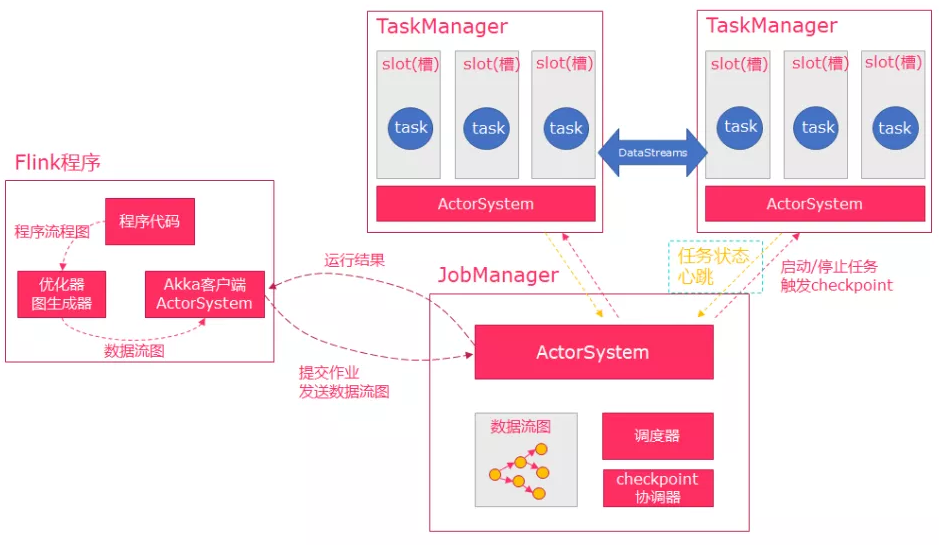

https://nightlies.apache.org/flink/flink-docs-release-1.13/docs/concepts/flink-architecture/


> ​		==Flink JobManager==是Flink集群的主进程，包含三个不同的组件：**Resource Manager、Dispatcher**以及每个**运行Job的JobMaster**。

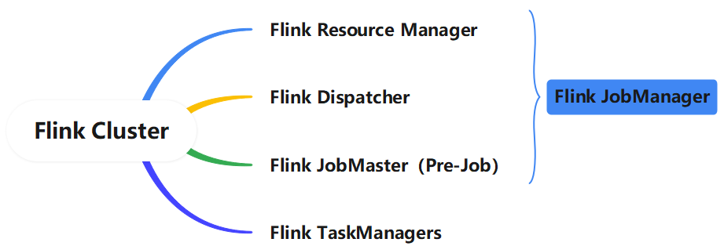


- **Dispatcher**，负责接收用户提供的作业，并且负责为这个新提交的作业拉起一个新的JobMaster 组件。
- **ResourceManager**，负责资源的管理，在整个 Flink 集群中只有一个 ResourceManager。
- **JobMaster**，负责管理作业的执行，在一个 Flink 集群中可能有多个作业同时执行，每个作业都有自己的 JobMaster组件。


> 当一个应用提交执行时，Flink 的各个组件交互协作示意图：
>

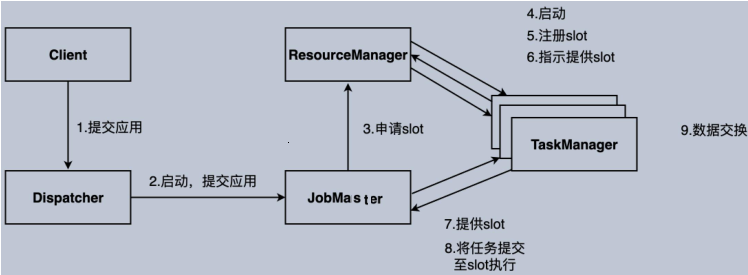


​	

> Flink on YARN部署：**Session 会话模式**

- 1、先启动一个 YARN session会创建一个 Flink 集群 

---

​			只启动了 JobManager，而 TaskManager 可以根据需要动态地启动。在 JobManager 内部，由于还没有提交作业，所以只有 ResourceManager 和 Dispatcher 在运行 

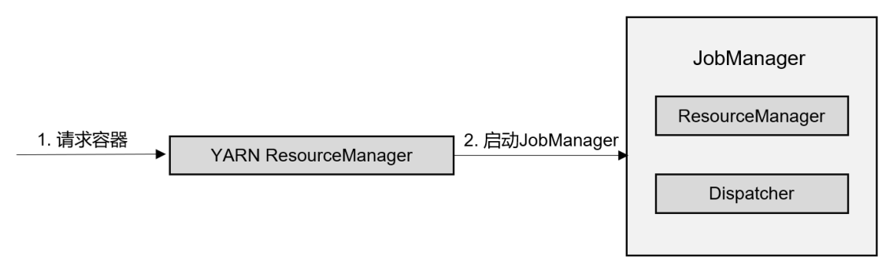


- 2、集群作业提交流程 

---

```
1）、客户端通过 REST 接口，将作业提交给分发器。
2）、分发器启动 JobMaster，并将作业（包含 JobGraph）提交给 JobMaster。
3）、JobMaster 向资源管理器请求资源（slots）。
4）、资源管理器向 YARN 的资源管理器请求 container 资源。
5）、YARN 启动新的 TaskManager 容器。
6）、TaskManager 启动之后，向 Flink 的资源管理器注册自己的可用任务槽。
7）、资源管理器通知 TaskManager 为新的作业提供 slots。
8）、TaskManager 连接到对应的 JobMaster，提供 slots。
9）、JobMaster 将需要执行的任务分发给 TaskManager，执行任务。
```

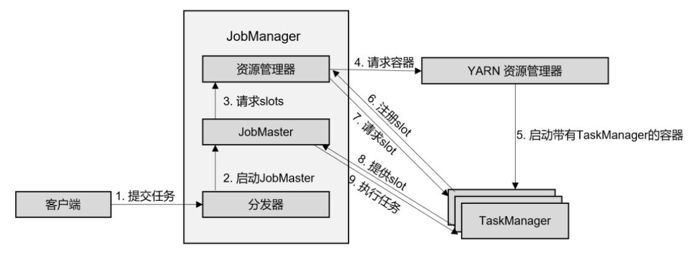


> ​			Flink on YARN部署：**Per-Job 单作业模式**，此种模式下JobManager中没有Dispatcher分发器，由于Flink集群只运行1个flink Job程序。

​					[在单作业模式下， Flink 集群不会预先启动，而是在提交作业时，才启动新的 JobManager。]() 

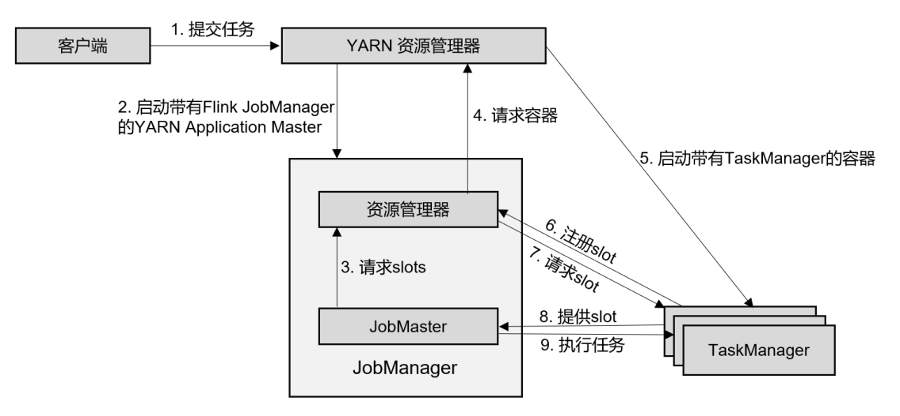


### 12-[理解]-Flink Job 调度【并行度与算子链】

---


> ​			Flink 程序的基本构建块是：**流和转换**（请注意，Flink 的 DataSet API 中使用的 DataSet 也是内部流 ）。从概念上讲，**流是（可能永无止境的）数据记录流，而转换是将一个或多个流作为输入，并产生一个或多个输出流。**

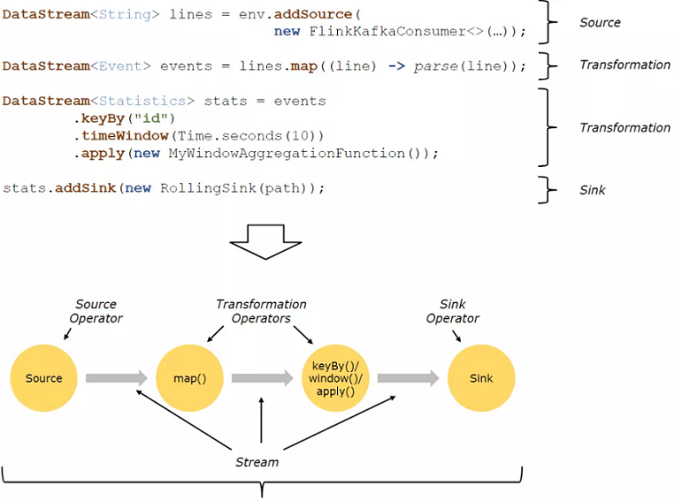


> ​			Flink 程序在执行的时候，会被映射成一个 ==Streaming Dataflow==，一个 Streaming Dataflow 是==由一组 Stream 和 Transformation Operator 组成的==。在启动时从一个或多个 Source Operator 开始，结束于一个或多个 Sink Operator。
>

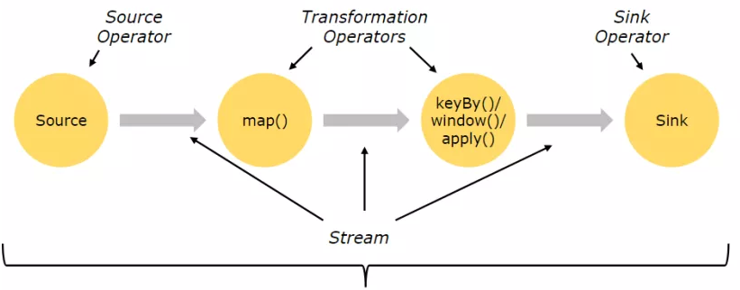


> ​			**Flink 程序本质上是并行的和分布式的**，在执行过程中，==一个流(stream)包含一个或多个流分区==，而==每一个 operator 包含一个或多个 operator 子任务==。

- 操作子任务间彼此独立，在不同的线程中执行，甚至是在不同的机器或不同的容器上。
- ==operator 子任务的数量是这一特定 operator 的并行度==，相同程序中的不同 operator 有不同级别的并行度。
- ==一个 Stream 可以被分成多个 Stream 的分区，也就是 Stream Partition。一个 Operator 也可以被分为多个 Operator Subtask。==

​		如下图中，Source 被分成 Source1 和 Source2，它们分别为 Source 的 Operator Subtask。每一个 Operator Subtask 都是在不同的线程当中独立执行的。一个 Operator 的并行度，就等于 Operator Subtask 的个数。

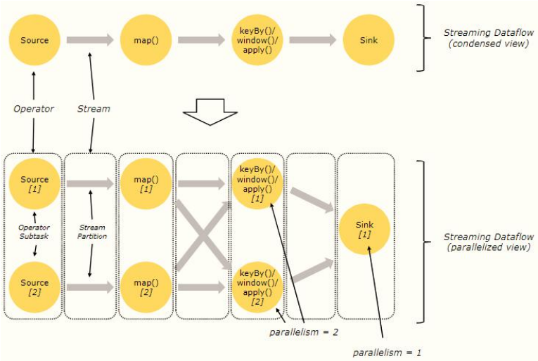

​	


> 如下图  的并行度为 2，而一个 Stream 的并行度就等于它生成的 Operator 的并行度。

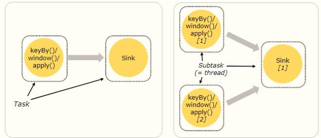


> 数据在两个 operator 之间传递的时候有两种模式：[类似RDD之间依赖关系【宽依赖、窄依赖】]()

1. **One to One 模式**：两个 operator 用此模式传递的时候，会保持数据的分区数和数据的排序；如下图中的 Source1 到 Map1，它就保留的 Source 的分区特性，以及分区元素处理的有序性。[窄依赖]()

   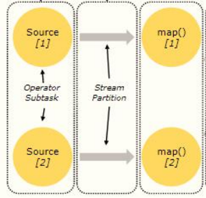

   `DataStream 物理分区：forward 向前`

   

2. **Redistributing （重新分配）模式**：这种模式会改变数据的分区数；每个一个 operator subtask 会根据选择 transformation 把数据发送到不同的目标 subtasks，比如 keyBy()会通过 hashcode 重新分区，broadcast()和 rebalance()方法会随机重新分区；[宽依赖]()

   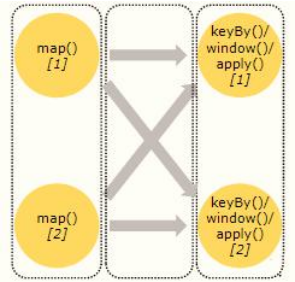
   
   `DataStream 物流分区：shuffle（随机）、rebalance（均衡）等`


> ​			Flink的所有操作都称之为Operator，==客户端在提交任务==的时候会对Operator进行优化操作，**能进行合并的Operator会被合并为一个Operator，合并后的Operator称为Operator chain**，实际上就是一个执行链，每个执行链会在TaskManager上一个独立的线程中执行。

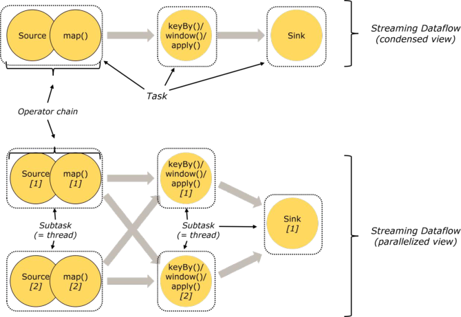


> 问题1：**什么条件下进行相邻Operator算子合并，形成Operator Chain？**

满足如下两个条件：

- 条件1：相邻2个Operator并行度（parallelism）相同；
- 条件2：相邻2个Operator之间数据传递方式为One-to-One 模式；


> 问题2：**Operator Chain，有什么两个好处？**

1. 减少线程到线程的切换和缓冲的开销（reduces the overhead of thread-to-thread handover
   and buffering）；
2. 增加总体吞吐量，同时减少延迟（ increases overall throughput while decreasing latency）；


### 13-[理解]-Flink Job 调度【资源任务槽Slot】

---


> ​	  每个TaskManager是一个JVM Process，将在不同线程Treads中执行一个或多个SubTask任务。每个SubTask任务运行地方称为：`Task Slots`（任务槽，资源槽等）。

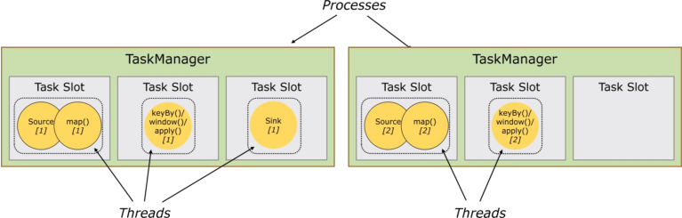

​		**Slot是TaskManager资源粒度的划分，每个Slot都有自己独立的内存。**所有Slot平均分配TaskManger的内存，比如TaskManager分配给Solt的内存为8G，两个Slot，每个Slot的内存为4G；四个Slot，每个Slot的内存为2G。值得注意的是，==Slot仅划分内存，不涉及cpu的划分。==


> Slot是Flink中的任务执行器，**每个Slot可以运行多个subtask**，而且一个subtask会以单独的线程来运行。

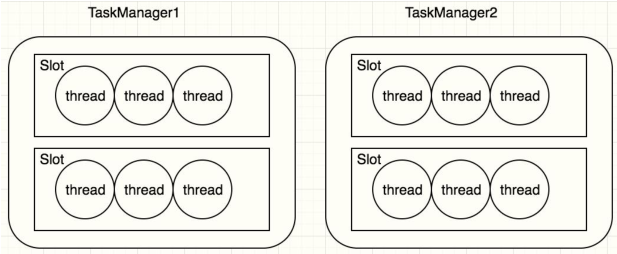

​			[As a rule-of-thumb, a good default number of task slots would be the number of CPU cores.]()


> ​			默认情况下，Flink允许**子任务SubTask共享资源槽Slot**。[By default, Flink allows subtasks to share slots even if they are subtasks of different tasks, so long as they are from the same job.]()

Slot可以被多个SubTask共享使用，需要满足以下条件：

- ==SubTask必须是不同SubTask（Operator），也就是说一个Slot中的SubTask属于不同Operator操作；==
- ==SubTask属于一个Job中任务，必须是一个Job中不同SubTask。==

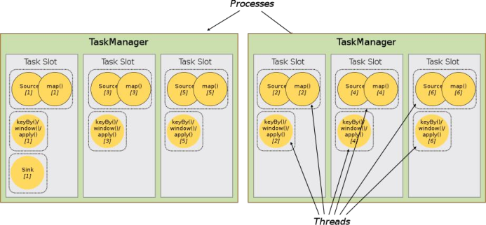


> Slot 共享主要的好处有以下几点：

- 可以起到隔离内存的作用，防止多个不同job的task竞争内存；
- Slot个数就代表了一个Flink程序的最高并行度，简化了性能调优的过程；
- ==允许多个subTask共享Slot，提升了资源利用率。==举一个实际的例子，kafka有3个partition，对应flink
  的source有3个subtask，而keyBy设置的并行度为20，这个时候如果Slot不能共享的话，需要占用
  23个Slot，如果允许共享的话，只需要20个Slot即可（Slot默认共享规则计算为20个）；


> [在Flink job中，判断Job需要多少Slot资源槽运行SubTask任务，取决于：Job中最大Operator并行度。]()


### 14-[掌握]-Flink Job 调度【作业图与执行图】

---


>  ​		由Flink程序直接映射成的**数据流图是StreamGraph，也被称为逻辑流图**，因为它们表示的是计算逻辑的高级视图。为了执行一个流处理程序，Flink需要**将逻辑流图转换为物理数据流图（也叫执行图）**。

​						[Flink中的执行图分成四层：StreamGraph -> JobGraph -> ExecutionGraph -> 物理执行图。]()

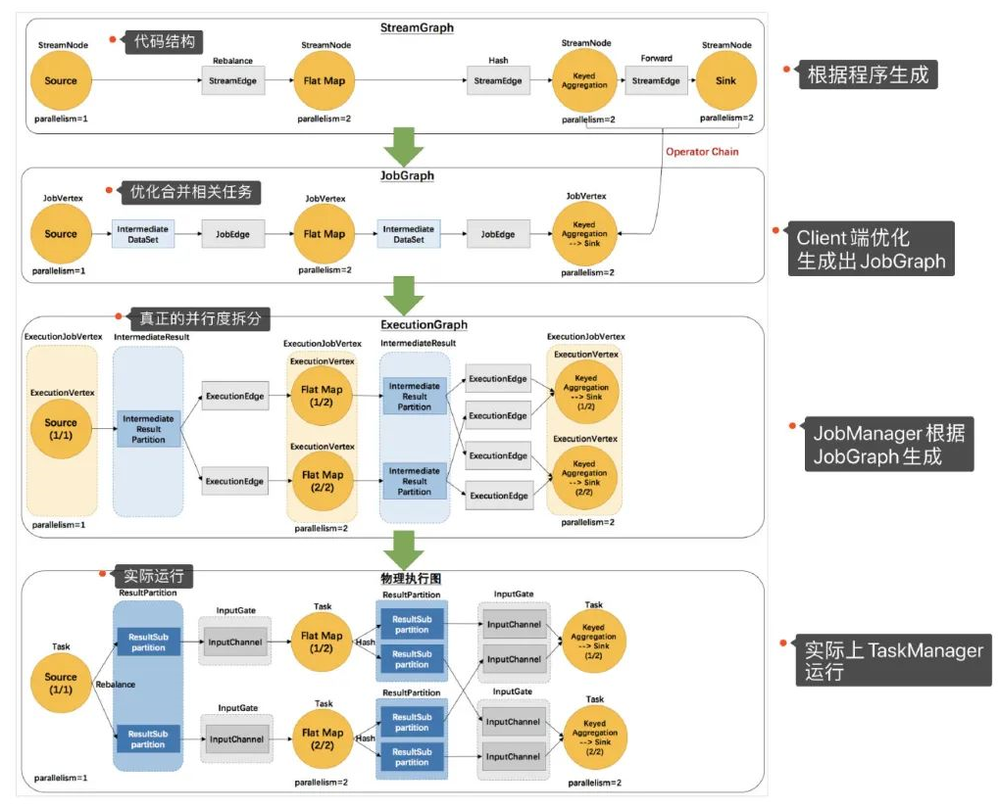


​		以编写流式计算入门程序：WordCount词频统计为例。

```java
package cn.itcast.flink.scheduler;

import org.apache.flink.api.common.functions.FlatMapFunction;
import org.apache.flink.api.common.functions.MapFunction;
import org.apache.flink.api.java.tuple.Tuple2;
import org.apache.flink.configuration.Configuration;
import org.apache.flink.streaming.api.datastream.DataStream;
import org.apache.flink.streaming.api.environment.StreamExecutionEnvironment;
import org.apache.flink.util.Collector;

/**
 * 使用Flink 计算引擎实现流式数据处理：从Socket接收数据，实时进行词频统计WordCount
 * @author xuyuan
 */
public class FlinkJobDemo {

	public static void main(String[] args) throws Exception {
		// 1. 执行环境-env
		Configuration configuration = new Configuration();
		configuration.setString("rest.port", "8081");
		StreamExecutionEnvironment env = StreamExecutionEnvironment.getExecutionEnvironment(configuration) ;
		env.setParallelism(2) ;

		// 2. 数据源-source
		DataStream<String> inputStream = env.socketTextStream("node1.itcast.cn", 9999);

		// 3. 数据转换-transformation
		// 3.1 将每行数据按照分隔符分割为单词
		DataStream<String> wordStream = inputStream.flatMap(new FlatMapFunction<String, String>() {
			@Override
			public void flatMap(String line, Collector<String> out) throws Exception {
				for (String word : line.trim().split("\\s+")) {
					out.collect(word);
				}
			}
		});

		// 3.2 转换每个单词为二元组，表示单词出现一次
		DataStream<Tuple2<String, Integer>> tupleStream = wordStream.map(new MapFunction<String, Tuple2<String, Integer>>() {
			@Override
			public Tuple2<String, Integer> map(String word) throws Exception {
				return Tuple2.of(word, 1);
			}
		});

		// 3.3 按照单词分组和组内聚合累加
		DataStream<Tuple2<String, Integer>> outputStream = tupleStream
			.keyBy(tuple -> tuple.f0)
			.sum(1);

		// 4. 数据输出-sink
		outputStream.printToErr();

		// 5. 执行应用-execute
		env.execute("FlinkJobDemo");
	}

}
```


> - step1、提交运行之前，首先依据程序代码构建==Streaming DataFlow==，如下图所示。【[Stream Graph]()】

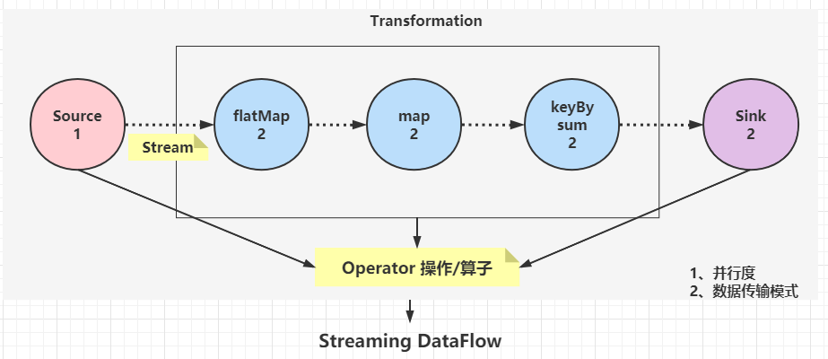


> - step2、针对Stream Graph，将多个符合条件的算子Operator 合并在一起作为一个节点（Operator Chains），形成JobGraph（作业图），下图所示。【[Job Graph]()】
>   - **条件一：相邻算子Operator，并行度相同**
>   - **条件二：相邻算子Operator，数据传输模式为One  To One**

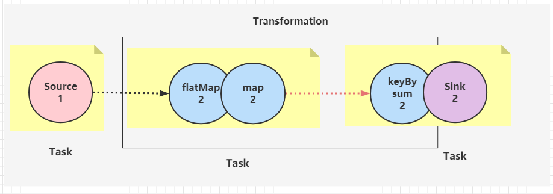


> 运行FlinkJob程序，查看Job运行调度图：

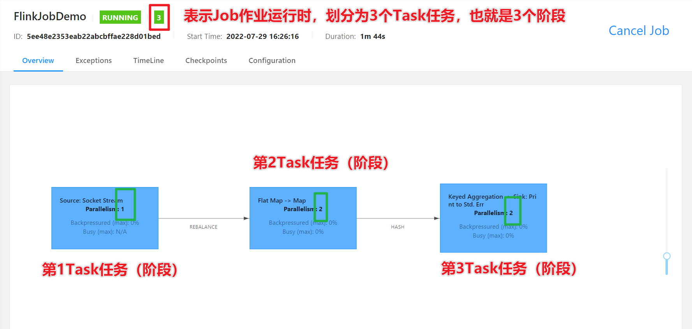


> - step3、将Job Graph加上Operator并行度，形成执行图ExecutionGraph。【[Execution Graph]()】

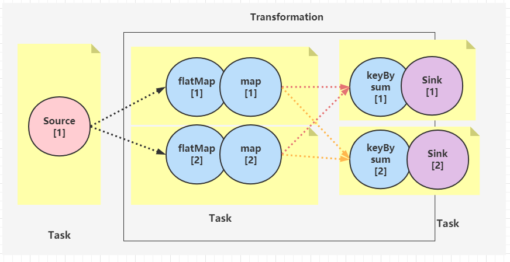


> 运行FlinkJob程序，查看Job执行监控页面：此Job运行时有5个subTask子任务。

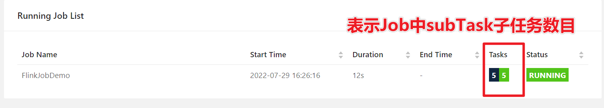


> - step4、申请资源，将Execution Graph执行图中SubTask运行在Slot资源槽中，**考虑槽共享**，形成图称为物流执行图。	[物理 Execution Graph]()
>   - **槽共享条件：同1个Job中不同类型SubTask任务可以共享1个slot资源槽。**

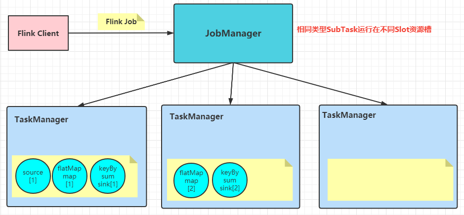


> 总结，简单理解【逻辑流图转换为物理数据流图】步骤如下：

1. StreamGraph：最初的程序执行逻辑流程，也就是算子之间的前后顺序（全部都是Subtask）
2. JobGraph：将部分可以合并的Subtask合并成一个Task
3. ExecutionGraph：为Task赋予并行度，此时确定Job中SubTask数目
4. 物理执行图：将Task赋予并行度后的执行流程，落实到具体的TaskManager上，将具体的Task落实到具体的Slot内进行运行。[此处考虑槽Slot共享，确定运行SubTask需要资源Slot]()


## 附录部分：注意事项及扩展内容


```

```


### [附录1]-Flink Job 调度执行流程

---


> 当 Flink 集 群 启 动 后 ， 首 先 会 启 动 ==一 个 JobManger 和 一 个 或 多 个 的TaskManager==。

- 由 Client 提交Job给 JobManager，JobManager 再调度任务到各个TaskManager 去执行，然后 TaskManager 将心跳和统计信息汇报给 JobManager。
- TaskManager 之间以流的形式进行数据的传输。
- Flink Client、JobManager和TaskManager三者均为独立的 JVM 进程。


1. ==Client== 为提交 Job 的客户端，可以是运行在任何机器上（与 JobManager 环境连通即可）。提交 Job 后，Client 可以结束进程（Streaming 的任务），也可以不结束并等待结果返回。
2. ==JobManager== 主 要 负 责 调 度 Job 并协调Task做checkpoint， 职责上很像Storm 的 Nimbus。从Client 处接收到 Job 和 JAR 包等资源后，会生成优化后的执行计划，并以 Task 的单元调度到各个 TaskManager 去执行。
3. ==TaskManager== 在启动的时候就设置好了槽位数（Slot），每个 slot 能启动一个Task，Task 为线程。从 JobManager 处接收需要部署的 Task，部署启动后，与自己的上游建立 Netty 连接，接收数据并处理。

> ​			客 户 端 不 是 运 行 时 和 程 序 执 行 的 一 部 分 ， 但 它 用 于 准 备 并 发 送dataflow(JobGraph)给 Master(JobManager)，然后，客户端断开连接或者维持连接以等待接收计算结果。


