# Flink Chapter07：Flink Table API & SQL（1）

---

​		

[Apache Flink features two relational APIs - the Table API and SQL - for unified stream and batch processing.]() 

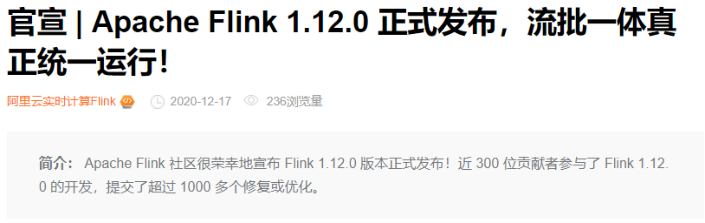

- The **Table API** is a language-integrated query API for Java, Scala, and Python that allows the composition of queries from relational operators such as **selection, filter, and join** in a very intuitive way. 
- **Flink’s SQL** support is based on [Apache Calcite](https://calcite.apache.org/) which implements the SQL standard.


## 前言部分：知识回顾及课程目标


```

```


### [前言1]-上次课程内容回顾 

---


> 主要讲解3个方面：DataStream 高级特性、双流JOIN和**Flink 运行架构**。


> 执行图（Execution Graph）

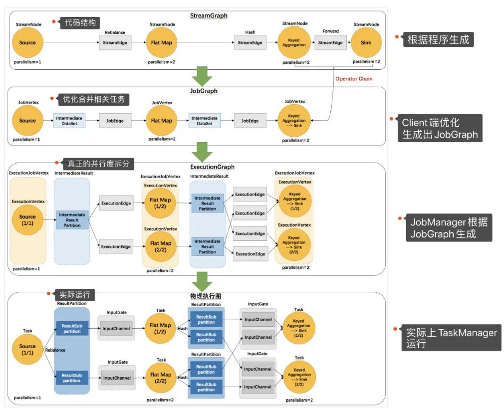


### [前言2]-今日课程内容提纲

---


> 主要讲解：Flink Table API &SQL 快速入门、DataStream与Table相互转换和Table API Connector使用、SQLClient


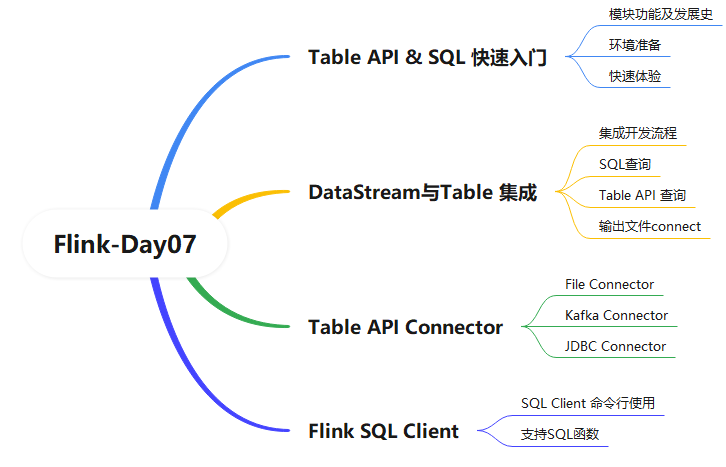


## 第一部分：Flink SQL 快速入门【5个小节】


```

```


### 01-[了解]-Table API & SQL之功能与发展史

---


> ​			在Flink 流式计算引擎中，提供`Flink Table API & SQL`模块，类似SparkSQL模块，提供高层次API，以便用户使用，开发程序更加简单。
>
> [Flink Table API&SQL 实现上有80%以上代码是公用的，作为流批统一的计算引擎，Flink Runtime时统一。]()

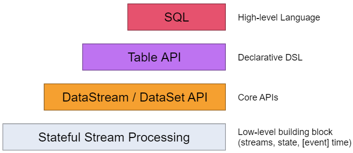

​						https://nightlies.apache.org/flink/flink-docs-release-1.13/docs/dev/table/overview/


> Apache Flink是**批流统一**的处理框架，具有两个关系API：**Table API和SQL**，用于统一流和批处理的上层API。

- Table API是`Java`，Scala和Python的语言集成查询API，类似SQL API，通过Table API，用户可以像操作表一样操作数据，非常直观和方便。
- SQL作为**声明式语言**，有标准的语法和规范，用户可以不关心底层实现，进行数据的处理，非常容易上手。


> 为什么Spark和Flink中都提供 **Table API（DSL）或SQL**呢？？？？？

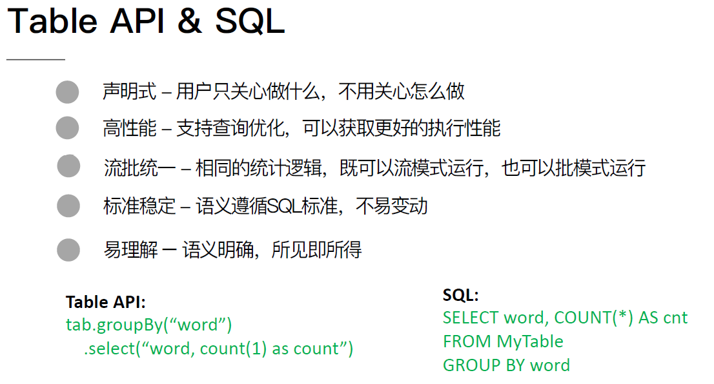


> ​		**Flink Table API & SQL** 发展史中，阿里巴巴未收购Flink 母公司之前，一致很缓慢；收购以后，将Blink中Table API和SQL融合到Apache Flink，直到1.12版本，功能基本完全，可生产环境使用，支持流计算和批处理。

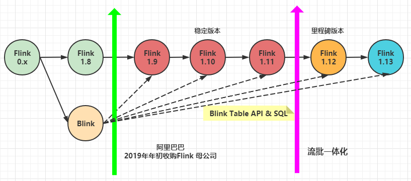

```ini
# 1、Flink 1.9版本之前
	Table API & SQL 发展不是很迅速，企业使用也不多
	API使用相对比较复杂
	底层优化性能也不是很好，分别针对批处理和流计算进行设计优化引擎

----------------  2019年初，阿里巴巴收购Flink 母公司 ----------------
	Apache Flink  ->  Blink（阿里巴巴内部Flink） ->  Flink Table API & SQL，进行重构和优化

	Apache Flink	
						->    Apache Flink（整合），发布第一个版本Flink 1.9版本
		   Blink
			

# 2、Flink 1.9版本
	Table API & SQL  底层引擎（查询计划器）：Flink Planner和Blink Planner
	陆续发展Table API & SQL模块，发布
		Flink 1.10版本（相当稳定）
		Flink 1.11版本（过渡版本）

		
# 3、Flink 1.12版本（里程碑版本）
	Flink Table API & SQL 基本功能完善
		API接口进行重构，使用Blink底层查询处理器
		推荐使用Table API & SQL模块在实际项目中使用
```


> 在Flink 1.9版本中，Blink中Table 模块合并到ApacheFlink中，架构进行全新调整。

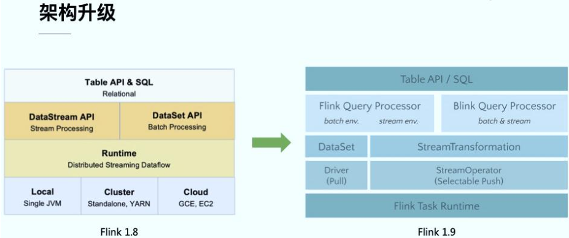


> ​			在Flink1.9之后新的架构中，有两个查询处理器：`Flink Query Processor`，也称作Old Planner和`Blink Query Processor`，也称作`Blink Planner`。

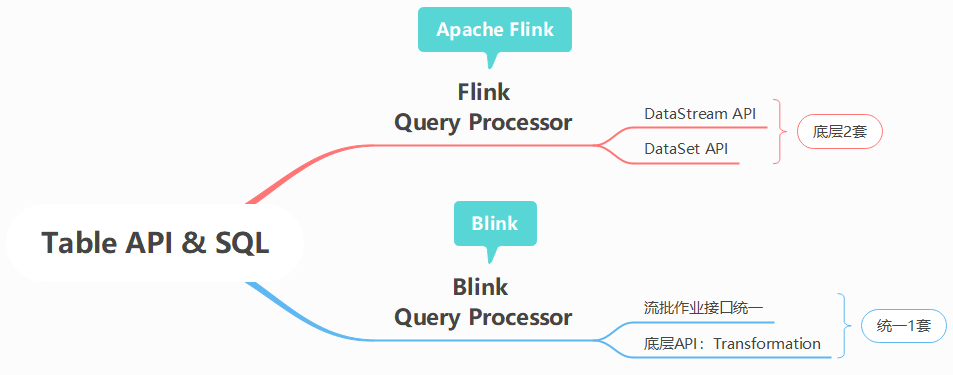

- **Flink Query Processor查询处理器**：针对流计算和批处理作业有不同的分支处理，流计算作业底层的 API 是 `DataStream API`， 批处理作业底层的 API 是 `DataSet API`；

- **Blink Query Processor查询处理器**：实现流批作业接口的统一，底层的 API 都是`DataStream Transformation`，这就意味着和Dataset完全没有关系；

  
  
  
  
  > ​											[**Flink1.11之后，默认查询处理器：Blink Query Processor**]()

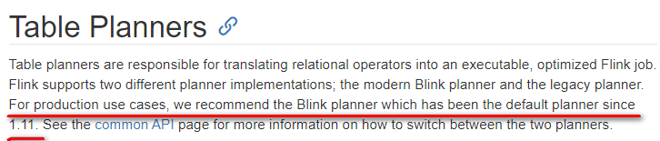


### 02-[掌握]-Table API & SQL之依赖与程序结构

---


​			使用Table API&SQL，需要导入相关依赖和构建表执行环境。

> - 第一步、**添加依赖**

```xml
<!-- Flink Table API & SQL -->
<dependency>
    <groupId>org.apache.flink</groupId>
    <artifactId>flink-table-api-java-bridge_2.11</artifactId>
    <version>1.13.1</version>
</dependency>

<dependency>
    <groupId>org.apache.flink</groupId>
    <artifactId>flink-table-planner-blink_2.11</artifactId>
    <version>1.13.1</version>
</dependency>

<dependency>
    <groupId>org.apache.flink</groupId>
    <artifactId>flink-table-common</artifactId>
    <version>1.13.1</version>
</dependency>
```

- `flink-table-common`：这个包中主要是包含 Flink Planner 和 Blink Planner一些共用的代码；
- 两个 Planner：flink-table-planner 和 `flink-table-planner-blink`；
- 两个 Bridge：flink-table-api-scala-bridge 和 `flink-table-api-java-bridge`；


> - 第二步、**构建表执行环境**
>

​					[A `TableEnvironment` is created by calling the static `TableEnvironment.create()` method.]()

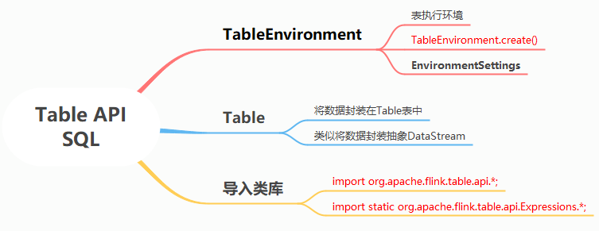


```Java
// 导入包
import org.apache.flink.table.api.EnvironmentSettings;
import org.apache.flink.table.api.TableEnvironment;

// 创建环境配置对象，设置属性值
EnvironmentSettings settings = EnvironmentSettings
    .newInstance()
    .inStreamingMode() //.inBatchMode()
    .build();

// 创建表执行环境
TableEnvironment tEnv = TableEnvironment.create(settings);
```


> ​			此外，可以从流式执行环境`StreamExecutionEnvironment` 创建`StreamTableEnvironment` 流式表的执行环境，混合使用DataStream编程和Table API编程。

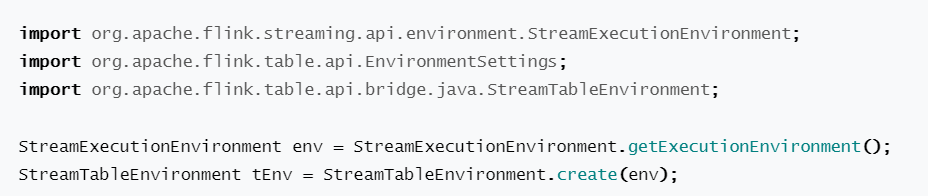


> - 3）、**程序结构**

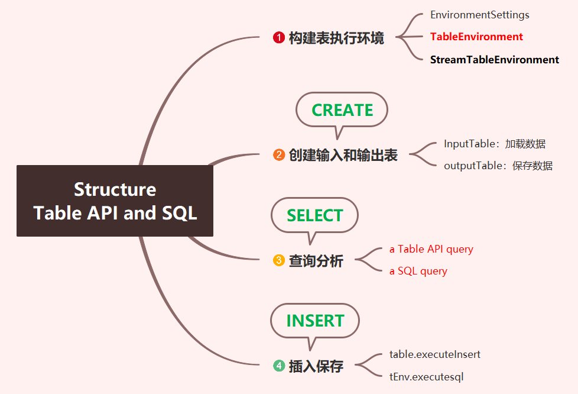


```Java
// 1. create a TableEnvironment for batch or streaming execution
TableEnvironment tableEnv = ...; 

// 2-1. create an input Table
tableEnv.executeSql("CREATE TEMPORARY TABLE table1 ... WITH ( 'connector' = ... )");
// 2-2. register an output Table
tableEnv.executeSql("CREATE TEMPORARY TABLE outputTable ... WITH ( 'connector' = ... )");

// 3-1. create a Table object from a Table API query
Table table2 = tableEnv.from("table1").select(...);
// 3-2. create a Table object from a SQL query
Table table3 = tableEnv.sqlQuery("SELECT ... FROM table1 ... ");

// 4. emit a Table API result Table to a TableSink, same for SQL result
TableResult tableResult = table2.executeInsert("outputTable");
```


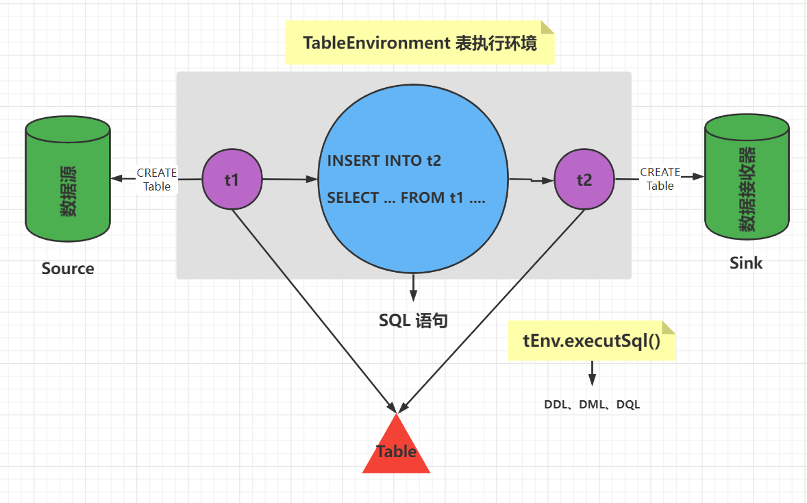


### 03-[掌握]-Table API & SQL之快速上手【SQL 实现】

---


> **案例演示**：读取文本数据，创建为临时表，查询分析，结果打印控制台。

- ==创建数据源表==：加载文本文件数据

---

文档：https://nightlies.apache.org/flink/flink-docs-release-1.13/docs/connectors/table/formats/csv/

```SQL
CREATE TABLE tbl_ratings(
  user_id STRING,
  movie_id STRING,
  rating DOUBLE,
  ts BIGINT
) WITH (
  'connector' = 'filesystem', 
  'path' = 'datas/ratings.data', 
  'format' = 'csv',
  'csv.field-delimiter' = '\t',
  'csv.ignore-parse-errors' = 'true'
)
```


> 如果加载数据CSV格式文件，需要添加相关Mave依赖

```xml
<dependency>
    <groupId>org.apache.flink</groupId>
    <artifactId>flink-csv</artifactId>
    <version>1.13.1</version>
</dependency>
```


- 基于SQL查询分析

---

```SQL
-- 每部电影平均评分和评分人数
SELECT 
    movie_id, COUNT(movie_id) AS rating_people, ROUND(AVG(rating), 2) AS rating_number
FROM 
   tbl_ratings GROUP BY movie_id LIMIT 10

-- Top10 电影
WITH tmp AS(
    SELECT 
        movie_id, COUNT(movie_id) AS rating_people, ROUND(AVG(rating), 2) AS rating_number
    FROM 
        tbl_ratings GROUP BY movie_id
)
SELECT * FROM tmp WHERE rating_people > 400 ORDER BY rating_number DESC, rating_people DESC LIMIT 10
```


- ==创建数据接收器表==：将数据打印控制台

---

文档：https://nightlies.apache.org/flink/flink-docs-release-1.13/docs/connectors/table/print/

```SQL
CREATE TABLE tbl_print(
  movie_id STRING,
  rating_people BIGINT, 
  rating_number DOUBLE  
) WITH (
  'connector' = 'print'
)
```


> 完整代码如下：

```Java
package cn.itcast.flink.start;

import org.apache.flink.table.api.EnvironmentSettings;
import org.apache.flink.table.api.TableEnvironment;
import org.apache.flink.table.api.TableResult;

/**
 * 基于Flink SQL实现加载文本文件数据，进行电影评分统计：Top10电影分析
 */
public class FlinkSqlDemo {

    public static void main(String[] args) {
        // 1. 构建表执行环境
        EnvironmentSettings settings = EnvironmentSettings
            .newInstance()
            .inBatchMode() // 设置批模式处理数据
            .useBlinkPlanner() // 底层引擎：Blink，默认引擎
            .build();
        TableEnvironment tableEnv = TableEnvironment.create(settings);

        // 2. 创建输入表：编写CREATE TABLE依据，映射到数据（本地文件系统文件）
        tableEnv.executeSql(
            "CREATE TABLE tbl_ratings(\n" +
                "  user_id STRING,\n" +
                "  movie_id STRING,\n" +
                "  rating DOUBLE,\n" +
                "  ts BIGINT\n" +
                ") WITH (\n" +
                "  'connector' = 'filesystem', \n" +
                "  'path' = 'datas/ratings.data', \n" +
                "  'format' = 'csv',\n" +
                "  'csv.field-delimiter' = '\\t',\n" +
                "  'csv.ignore-parse-errors' = 'true'\n" +
                ")"
        );

        // 3. 查询表数据，编写SQL语句
		/*
			每个电影平均评分，评分次数
		 */
        TableResult tableResult = tableEnv.executeSql(
            "WITH tmp AS(" +
                "SELECT " +
                "   movie_id, COUNT(movie_id) AS rating_people, ROUND(AVG(rating), 2) AS rating_number " +
                "FROM " +
                "   tbl_ratings GROUP BY movie_id " +
                ")" +
                "SELECT * FROM tmp WHERE rating_people > 400 ORDER BY rating_number DESC, rating_people DESC LIMIT 20"
        );
        tableResult.print();
    }

}

```


### 04-[掌握]-Table API & SQL之快速上手【Table API 实现】

---


> Flink Table API & SQL模块，提供Table API ，类似**SparkSQL中DSL链式编程。**

https://nightlies.apache.org/flink/flink-docs-release-1.13/docs/dev/table/tableapi/#table-api

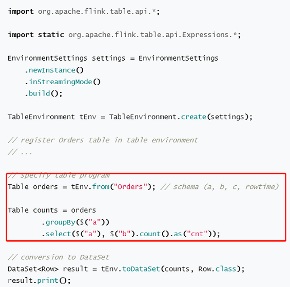


[Table API查询分析，导入静态方法：`import static org.apache.flink.table.api.Expressions.*;`]()


> 修改上述代码，将SQL语句改为Table API链式编程方式，完整代码如下：

```Java
package cn.itcast.flink.start;

import org.apache.flink.table.api.EnvironmentSettings;
import org.apache.flink.table.api.Table;
import org.apache.flink.table.api.TableEnvironment;

import static org.apache.flink.table.api.Expressions.$;

/**
 * 基于Flink Table Api实现加载文本文件数据，进行电影评分统计：Top10电影分析
 */
public class FlinkTableApiDemo {

    public static void main(String[] args) {
        // 1. 构建表执行环境
        EnvironmentSettings settings = EnvironmentSettings
            .newInstance()
            .inBatchMode() // 设置批模式处理数据
            .useBlinkPlanner() // 底层引擎：Blink，默认引擎
            .build();
        TableEnvironment tableEnv = TableEnvironment.create(settings);

        // 2. 创建输入表：编写CREATE TABLE依据，映射到数据（本地文件系统文件）
        tableEnv.executeSql(
            "CREATE TABLE tbl_ratings(\n" +
                "  user_id STRING,\n" +
                "  movie_id STRING,\n" +
                "  rating DOUBLE,\n" +
                "  ts BIGINT\n" +
                ") WITH (\n" +
                "  'connector' = 'filesystem', \n" +
                "  'path' = 'datas/ratings.data', \n" +
                "  'format' = 'csv',\n" +
                "  'csv.field-delimiter' = '\\t',\n" +
                "  'csv.ignore-parse-errors' = 'true'\n" +
                ")"
        );

        // 3. 查询表数据，编写SQL语句
		/*
			每个电影平均评分，评分次数
		 */
        Table resultTable = tableEnv
            // 指定表，加载数据
            .from("tbl_ratings")
            // 指定分组字段
            .groupBy(
                // 将字符串 转换 列对象
                $("movie_id")
            )
            // 选择字段和数据聚合
            .select(
                $("movie_id"),
                $("movie_id").count().as("rating_people"),
                $("rating").avg().round(2).as("rating_number")
            )
            // 按照评分人数过滤
            .where(
                $("rating_people").isGreater(400)
            )
            // 设置排序字段，降序排序，可以有多个
            .orderBy(
                $("rating_number").desc(), $("rating_people").desc()
            )
            // 获取前10条数据
            .limit(10);

        // 4. 创建输出表：将结果数据输出
        resultTable.execute().print();
    }

}
```


### 05-[理解]-Table API & SQL之DataStream与Table互转

---


> ​		Flink Table API & SQL允许**把Table和DataStream做转换**：可以基于一个DataStream，[先流式地读取数据源，然后map转换为POJO，再把它转成Table]()。Table的列字段（column fields），就是POJO里的字段。

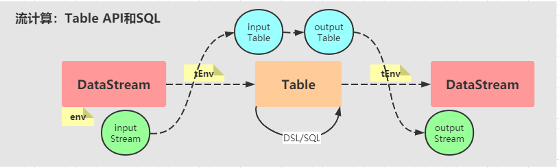


> 官方案例演示代码：

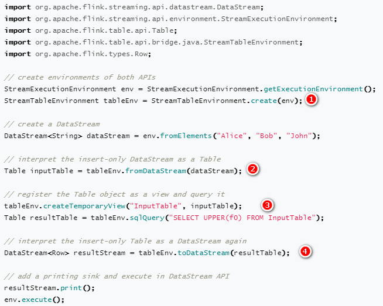

- ①表示：创建Stream表执行环境（StreamTableEnvironment）
- ②表示：将DataStream数据流，转换为Table表
- ③表示：注册Table为临时视图，编写SQL分析数据
- ④表示：将结果Table转换为DataStream


> 读取文本数据为DataStream，数据提取解析后，转换为Table，注册临时视图，使用SQL查询。

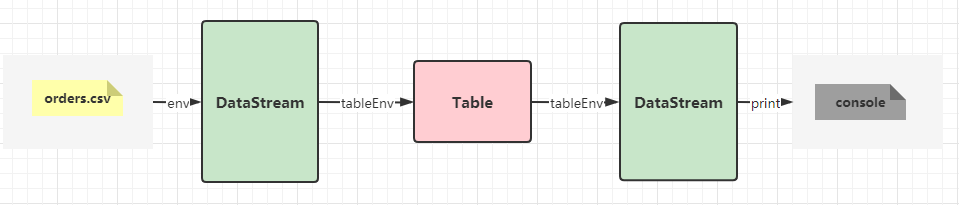


> **案例演示**：先读取数据为`DataStream`，再转换为`Table`，最后注册编写`SQL`语句。

```Java
package cn.itcast.flink.stream;

import lombok.AllArgsConstructor;
import lombok.Data;
import lombok.NoArgsConstructor;
import org.apache.flink.api.common.functions.MapFunction;
import org.apache.flink.streaming.api.datastream.DataStream;
import org.apache.flink.streaming.api.datastream.DataStreamSource;
import org.apache.flink.streaming.api.datastream.SingleOutputStreamOperator;
import org.apache.flink.streaming.api.environment.StreamExecutionEnvironment;
import org.apache.flink.table.api.EnvironmentSettings;
import org.apache.flink.table.api.Table;
import org.apache.flink.table.api.bridge.java.StreamTableEnvironment;
import org.apache.flink.types.Row;

/**
 * DataStream数据流与Table表支架相互转换，在实际项目中，可以先基于DataStream进行数据过滤封装，然后转换为Table，最后使用SQL分析
 * @author xuyuan 
 */
public class StreamToTableDemo {

    @Data
    @AllArgsConstructor
    @NoArgsConstructor
    public static class OrderInfo {
        private String userId;
        private Long ts;
        private Double money;
        private String category;
    }

    public static void main(String[] args) throws Exception {
        // 1. 执行环境-env
        StreamExecutionEnvironment env = StreamExecutionEnvironment.getExecutionEnvironment();
        // todo: a. 创建流式表的执行环境
        EnvironmentSettings settings = EnvironmentSettings.newInstance().inStreamingMode().build();
        StreamTableEnvironment tableEnv = StreamTableEnvironment.create(env, settings);

        // 2. 数据源-source
        DataStreamSource<String> inputStream = env.readTextFile("datas/order.csv");

        // 3. 数据转换-transformation
        SingleOutputStreamOperator<OrderInfo> orderStream = inputStream.map(new MapFunction<String, OrderInfo>() {
            @Override
            public OrderInfo map(String value) throws Exception {
                // value -> user_001,1621718199,10.1,电脑
                String[] array = value.split(",");
                OrderInfo orderInfo = new OrderInfo();
                orderInfo.setUserId(array[0]);
                orderInfo.setTs(Long.parseLong(array[1]));
                orderInfo.setMoney(Double.parseDouble(array[2]));
                orderInfo.setCategory(array[3]);
                // 返回实体类对象
                return orderInfo;
            }
        });

        // todo b. 将DataStream转换Table
        Table orderTable = tableEnv.fromDataStream(orderStream);

        // todo c. 基于SQL查询
        tableEnv.createTemporaryView("tbl_orders", orderTable);
        Table resultTable = tableEnv.sqlQuery(
            "SELECT * FROM tbl_orders"
        );

        // todo d. 将Table转换为DataStream, Table中每条数据封装类型Row（一行数据，与SparkSQL中DataFrame）
        DataStream<Row> resultStream = tableEnv.toDataStream(resultTable);

        // 4. 数据接收器-sink
        resultStream.printToErr();

        // 5. 触发执行-execute
        env.execute("StreamToTableDemo");
    }

}
```


## 第二部分：Table API Connector【4个小节】


> Flink Table API中提供Connector连接器，方便加载load读取数据和保存save写入数据。

https://nightlies.apache.org/flink/flink-docs-release-1.13/docs/connectors/table/overview/

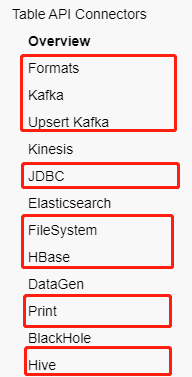


> 编写Java 程序，实时产生用户访问日志数据，发送到Kafka Topic队列。

```Java
package cn.itcast.flink.connectors;

import org.apache.commons.lang3.time.FastDateFormat;
import org.apache.kafka.clients.producer.KafkaProducer;
import org.apache.kafka.clients.producer.ProducerRecord;

import java.util.Properties;
import java.util.Random;
import java.util.concurrent.TimeUnit;

/**
 * 模拟实时产生用户访问网站日志数据
 */
public class MockUserTrackLog {

	public static void main(String[] args) throws Exception{
		// 1. 创建KafkaProducer对象
		Properties props = new Properties();
		props.put("bootstrap.servers", "node1.itcast.cn:9092,node2.itcast.cn:9092,node3.itcast.cn:9092");
		props.put("key.serializer", "org.apache.kafka.common.serialization.StringSerializer");
		props.put("value.serializer", "org.apache.kafka.common.serialization.StringSerializer");
		props.put("acks", "1") ;
		KafkaProducer<String, String> kafkaProducer = new KafkaProducer<String, String>(props) ;

		// 2. 模拟产生数据
		String[] types = new String[]{
			"click", "browser", "search", "click", "browser", "browser", "browser",
			"click", "search", "click", "browser", "click", "browser", "browser", "browser"
		} ;
		Random random = new Random() ;
		FastDateFormat format = FastDateFormat.getInstance("yyyy-MM-dd HH:mm:ss.SSS") ;
		while (true){
			String userId = "user_" + (random.nextInt(1000) + 1000);
			int itemId = 10000 + random.nextInt(10000) ;
			String behavior = types[random.nextInt(types.length)];
			String ts = format.format(System.currentTimeMillis()) ;
			String logEvent = userId + "," + itemId + ","  + behavior + "," + ts ;
			System.out.println(logEvent);

			// 3. 发送数据至Topic
			ProducerRecord<String, String> record = new ProducerRecord<>("log-topic", logEvent) ;
			kafkaProducer.send(record) ;

			// 每隔1秒产生1条数据
			TimeUnit.SECONDS.sleep(1);
		}
	}

}
```


### 06-[掌握]-Table API Connector之Kafka  Connector

------


> Flink Table Connector连接器中提供从Kafka加载数据和向Kafka保存数据Connector，添加Maven依赖

```xml
<dependency>
  <groupId>org.apache.flink</groupId>
  <artifactId>flink-connector-kafka_2.11</artifactId>
  <version>1.13.1</version>
</dependency>
```


> - 官方提供案例：

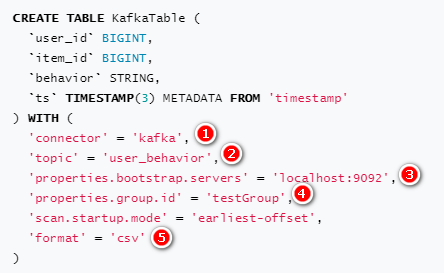


#### Kafka Source数据源

---

> ​		Flink Table API Connector提供从Kafka消费数据，创建表映射Topic，创建表语句如下：

```SQL
CREATE TABLE tbl_log_kafka (
  `user_id` STRING,
  `item_id` INTEGER,
  `behavior` STRING,
  `ts` STRING
) WITH (
  'connector' = 'kafka',
  'topic' = 'log-topic',
  'properties.bootstrap.servers' = 'node1.itcast.cn:9092,node2.itcast.cn:9092,node3.itcast.cn:9092',
  'properties.group.id' = 'gid-1',
  'scan.startup.mode' = 'latest-offset',
  'format' = 'csv'
)
```


> 编写代码，定义创建表语句，从Kafka Topic中实时消费数据，代码如下：

```Java
package cn.itcast.flink.connector;

import org.apache.flink.table.api.EnvironmentSettings;
import org.apache.flink.table.api.TableEnvironment;

/**
 * 从Kafka Topic 中消费数据，基于Table API Connection连接器
 */
public class SqlConnectorKafkaSourceDemo {

    public static void main(String[] args) {
        // 1. 构建表执行环境-tEnv
        EnvironmentSettings settings = EnvironmentSettings.newInstance().inStreamingMode().build();
        TableEnvironment tableEnv = TableEnvironment.create(settings);

        // 2. 定义输入表，从Kafka消费数据
        tableEnv.executeSql(
            "CREATE TABLE tbl_log_kafka (\n" +
                "  `user_id` STRING,\n" +
                "  `item_id` INTEGER,\n" +
                "  `behavior` STRING,\n" +
                "  `ts` STRING\n" +
                ") WITH (\n" +
                "  'connector' = 'kafka',\n" +
                "  'topic' = 'log-topic',\n" +
                "  'properties.bootstrap.servers' = 'node1.itcast.cn:9092,node2.itcast.cn:9092,node3.itcast.cn:9092',\n" +
                "  'properties.group.id' = 'gid-1',\n" +
                "  'scan.startup.mode' = 'latest-offset',\n" +
                "  'format' = 'csv'\n" +
                ")"
        );

        // 3. 编写SQL，直接查询表的数据
        tableEnv.executeSql("SELECT * FROM tbl_log_kafka").print();
    }

}
```


#### Kafka Sink 接收器

---

> ​		Flink Table API Connector提供Kafka Connector也支持向Kafka Topic中写入数据。

```SQL
CREATE TABLE tbl_log_kafka_sink (
  `user_id` STRING,
  `item_id` INTEGER,
  `behavior` STRING,
  `ts` STRING
) WITH (
  'connector' = 'kafka',
  'topic' = 'track-log',
  'properties.bootstrap.servers' = 'node1.itcast.cn:9092,node2.itcast.cn:9092,node3.itcast.cn:9092',
  'sink.semantic' = 'exactly-once',
  'sink.parallelism' = '3',
  'format' = 'json'
)
```


> ​		  查询SELECT插入INSERT语句，从Kafka查询数据，再写入Kafka topic中。

```SQL
INSERT INTO tbl_log_kafka_sink SELECT user_id, item_id, behavior, ts FROM tbl_log_kafka
```


> 保存数据为JSON字符串时，需要添加Maven 依赖

```xml
<dependency>
    <groupId>org.apache.flink</groupId>
    <artifactId>flink-json</artifactId>
    <version>1.13.1</version>
</dependency>
```


> 编写代码，定义创建表语句，向Kafka Topic中实时写入数据，代码如下：

```Java
package cn.itcast.flink.connector;

import org.apache.flink.table.api.EnvironmentSettings;
import org.apache.flink.table.api.TableEnvironment;

/**
 * 从Kafka Topic 中消费数据，基于Table API Connection连接器
 * @author xuyuan 
 */
public class SqlConnectorKafkaSinkDemo {

    public static void main(String[] args) {
        // 1. 构建表执行环境-tEnv
        EnvironmentSettings settings = EnvironmentSettings.newInstance().inStreamingMode().build();
        TableEnvironment tableEnv = TableEnvironment.create(settings);

        // 2. 定义输入表，从Kafka消费数据
        tableEnv.executeSql(
            "CREATE TABLE tbl_log_kafka (\n" +
                "  `user_id` STRING,\n" +
                "  `item_id` INTEGER,\n" +
                "  `behavior` STRING,\n" +
                "  `ts` STRING\n" +
                ") WITH (\n" +
                "  'connector' = 'kafka',\n" +
                "  'topic' = 'log-topic',\n" +
                "  'properties.bootstrap.servers' = 'node1.itcast.cn:9092,node2.itcast.cn:9092,node3.itcast.cn:9092',\n" +
                "  'properties.group.id' = 'gid-1',\n" +
                "  'scan.startup.mode' = 'latest-offset',\n" +
                "  'format' = 'csv'\n" +
                ")"
        );

        // 3. 定义输出表，将数据保存到Kafka Topic中
        tableEnv.executeSql(
            "CREATE TABLE tbl_log_kafka_sink (\n" +
                "  `user_id` STRING,\n" +
                "  `item_id` INTEGER,\n" +
                "  `behavior` STRING,\n" +
                "  `ts` STRING\n" +
                ") WITH (\n" +
                "  'connector' = 'kafka',\n" +
                "  'topic' = 'track-log',\n" +
                "  'properties.bootstrap.servers' = 'node1.itcast.cn:9092,node2.itcast.cn:9092,node3.itcast.cn:9092',\n" +
                "  'sink.semantic' = 'exactly-once',\n" +
                "  'sink.parallelism' = '3',\n" +
                "  'format' = 'json'\n" +
                ")"
        );

        // 3. 编写SQL，直接查询表的数据
        tableEnv.executeSql(
            "INSERT INTO tbl_log_kafka_sink SELECT user_id, item_id, behavior, ts FROM tbl_log_kafka"
        );
    }

}
```


### 07-[掌握]-Table API Connector之FileSystem Connector

------


> 将Table表数据保存到文件中，设置格式为PARQUET列式存储，代码样例如下：

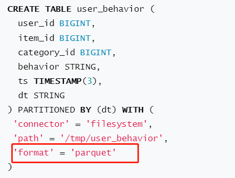

```SQL
CREATE TABLE tbl_log_fs_sink (
  `user_id` STRING,
  `item_id` INTEGER,
  `behavior` STRING,
  `ts` STRING
) WITH (
  'connector' = 'filesystem',
  'path' = 'datas/track-logs',
  'format' = 'parquet',
  'sink.rolling-policy.file-size' = '2MB',
  'sink.rolling-policy.rollover-interval' = '2 min',
  'sink.rolling-policy.check-interval' = '1 min'
)
```


> 保存数据为PARQUET列式存储时，需要添加Maven 依赖

```xml
<dependency>
    <groupId>org.apache.flink</groupId>
    <artifactId>flink-parquet_2.11</artifactId>
    <version>1.13.1</version>
</dependency>
```


> 修改前面的代码，将数据保存到本地文件系统文件中，代码如下：

```Java
package cn.itcast.flink.connector;

import org.apache.flink.configuration.Configuration;
import org.apache.flink.table.api.TableEnvironment;

/**
 * 从Kafka Topic 中消费数据，基于Table API Connection连接器
 * @author xuyuan 
 */
public class SqlConnectorFileSystemDemo {

    public static void main(String[] args) {
        // 1. 构建表执行环境-tEnv
        //EnvironmentSettings settings = EnvironmentSettings.newInstance().inStreamingMode().build();

        Configuration configuration = new Configuration();
        configuration.setString("execution.checkpointing.interval", "10000");
        configuration.setString("execution.runtime-mode", "streaming");
        configuration.setString("table.planner", "blink");
        TableEnvironment tableEnv = TableEnvironment.create(configuration);

        // 2. 定义输入表，从Kafka消费数据
        tableEnv.executeSql(
            "CREATE TABLE tbl_log_kafka (\n" +
                "  `user_id` STRING,\n" +
                "  `item_id` INTEGER,\n" +
                "  `behavior` STRING,\n" +
                "  `ts` STRING\n" +
                ") WITH (\n" +
                "  'connector' = 'kafka',\n" +
                "  'topic' = 'log-topic',\n" +
                "  'properties.bootstrap.servers' = 'node1.itcast.cn:9092,node2.itcast.cn:9092,node3.itcast.cn:9092',\n" +
                "  'properties.group.id' = 'gid-1',\n" +
                "  'scan.startup.mode' = 'latest-offset',\n" +
                "  'format' = 'csv'\n" +
                ")"
        );

        // 3. 定义输出表，将数据保存到文件系统中，数据存储格式：parquet
        tableEnv.executeSql(
            "CREATE TABLE tbl_log_fs_sink (\n" +
                "  `user_id` STRING,\n" +
                "  `item_id` INTEGER,\n" +
                "  `behavior` STRING,\n" +
                "  `ts` STRING\n" +
                ") WITH (\n" +
                "  'connector' = 'filesystem',\n" +
                "  'path' = 'datas/track-logs',\n" +
                "  'format' = 'parquet',\n" +
                "  'sink.parallelism' = '1',\n" +
                "  'sink.rolling-policy.file-size' = '2MB',\n" +
                "  'sink.rolling-policy.rollover-interval' = '1 min',\n" +
                "  'sink.rolling-policy.check-interval' = '1 min'\n" +
                ")"
        );

        // 3. 编写SQL，直接查询表的数据
        tableEnv.executeSql(
            "INSERT INTO tbl_log_fs_sink SELECT user_id, item_id, behavior, ts FROM tbl_log_kafka"
        );
    }

}
```


### 08-[掌握]-Table API Connector之JDBC Connector

---


> 使用JDBC Connector将Table表数据保存到MySQL数据库表中，需要加载Maven依赖和数据库JDBC 驱动包。

https://nightlies.apache.org/flink/flink-docs-release-1.13/docs/connectors/table/jdbc/

```xml
<dependency>
    <groupId>org.apache.flink</groupId>
    <artifactId>flink-connector-jdbc_2.11</artifactId>
    <version>1.13.1</version>
</dependency>
<dependency>
    <groupId>mysql</groupId>
    <artifactId>mysql-connector-java</artifactId>
    <version>5.1.48</version>
</dependency>
```


> 官方提供案例：

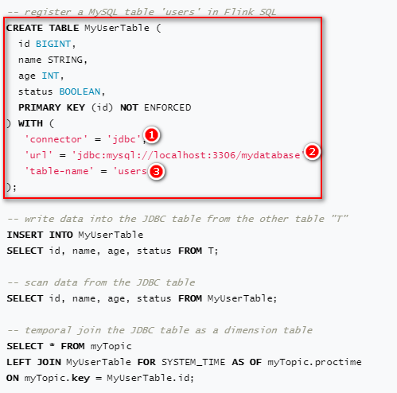

```SQL
CREATE TABLE tbl_log_jdbc_sink (
  `user_id` STRING,
  `item_id` INTEGER,
  `behavior` STRING,
  `ts` STRING
) WITH (
  'connector' = 'jdbc', 
  'url' = 'jdbc:mysql://node1.itcast.cn:3306/db_flink?useSSL=false',
  'table-name' = 'tbl_logs', 
  'driver' = 'com.mysql.jdbc.Driver', 
  'username' = 'root', 
  'password' = '123456', 
  'sink.buffer-flush.interval' = '1s', 
  'sink.buffer-flush.max-rows' = '1', 
  'sink.max-retries' = '5',
  'sink.parallelism' = '4'  
)
```


> 通过JDBC连接数据库时，基本参数如下：

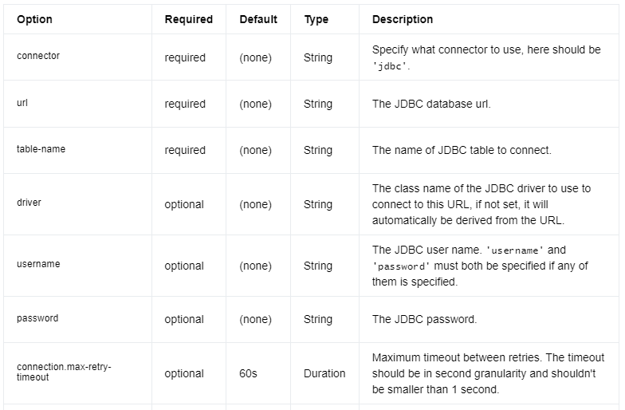


> 修改上述代码，将Table表数据保存到MySQL数据库表中。

```SQL

CREATE DATABASE IF NOT EXISTS db_flink ;
USE db_flink;

CREATE TABLE IF NOT EXISTS db_flink.tbl_logs (
    `user_id` varchar(255) NOT NULL,
    `item_id` int DEFAULT NULL,
    `behavior` varchar(255) DEFAULT NULL,
     `ts` varchar(255) DEFAULT NULL
) ENGINE=InnoDB DEFAULT CHARSET=utf8;

```


> 完整案例代码如下：

```JAva
package cn.itcast.flink.connector;

import org.apache.flink.table.api.EnvironmentSettings;
import org.apache.flink.table.api.TableEnvironment;

/**
 * 从Kafka Topic 中消费数据，基于Table API Connection连接器
 * @author xuyuan 
 */
public class SqlConnectorJdbcSinkDemo {

    public static void main(String[] args) {
        // 1. 构建表执行环境-tEnv
        EnvironmentSettings settings = EnvironmentSettings.newInstance().inStreamingMode().build();
        TableEnvironment tableEnv = TableEnvironment.create(settings);

        // 2. 定义输入表，从Kafka消费数据
        tableEnv.executeSql(
            "CREATE TABLE tbl_log_kafka (\n" +
                "  `user_id` STRING,\n" +
                "  `item_id` INTEGER,\n" +
                "  `behavior` STRING,\n" +
                "  `ts` STRING\n" +
                ") WITH (\n" +
                "  'connector' = 'kafka',\n" +
                "  'topic' = 'log-topic',\n" +
                "  'properties.bootstrap.servers' = 'node1.itcast.cn:9092,node2.itcast.cn:9092,node3.itcast.cn:9092',\n" +
                "  'properties.group.id' = 'gid-1',\n" +
                "  'scan.startup.mode' = 'latest-offset',\n" +
                "  'format' = 'csv'\n" +
                ")"
        );

        // 3. 定义输出表，将数据保存到MySQL数据库表中
        tableEnv.executeSql(
            "CREATE TABLE tbl_log_jdbc_sink (\n" +
                "  `user_id` STRING,\n" +
                "  `item_id` INTEGER,\n" +
                "  `behavior` STRING,\n" +
                "  `ts` STRING\n" +
                ") WITH (\n" +
                "  'connector' = 'jdbc', \n" +
                "  'url' = 'jdbc:mysql://node1.itcast.cn:3306/db_flink?useSSL=false',\n" +
                "  'table-name' = 'tbl_logs', \n" +
                "  'driver' = 'com.mysql.jdbc.Driver', \n" +
                "  'username' = 'root', \n" +
                "  'password' = '123456', \n" +
                "  'sink.buffer-flush.interval' = '1s', \n" +
                "  'sink.buffer-flush.max-rows' = '1', \n" +
                "  'sink.max-retries' = '5',\n" +
                "  'sink.parallelism' = '4'  \n" +
                ")"
        );

        // 3. 编写SQL，直接查询表的数据
        tableEnv.executeSql(
            "INSERT INTO tbl_log_jdbc_sink " +
                "SELECT user_id, item_id, behavior, ts FROM tbl_log_kafka"
        );
    }

}
```


### 09-[掌握]-Table API Connector之HBase Connector

---


> 使用HBase Connector将Table表数据保存到HBase数据库表中，需要加载Maven依赖

```xml
<dependency>
  <groupId>org.apache.flink</groupId>
  <artifactId>flink-connector-hbase-2.2_2.11</artifactId>
  <version>1.13.1</version>
</dependency>
```


> 官方提供案例：

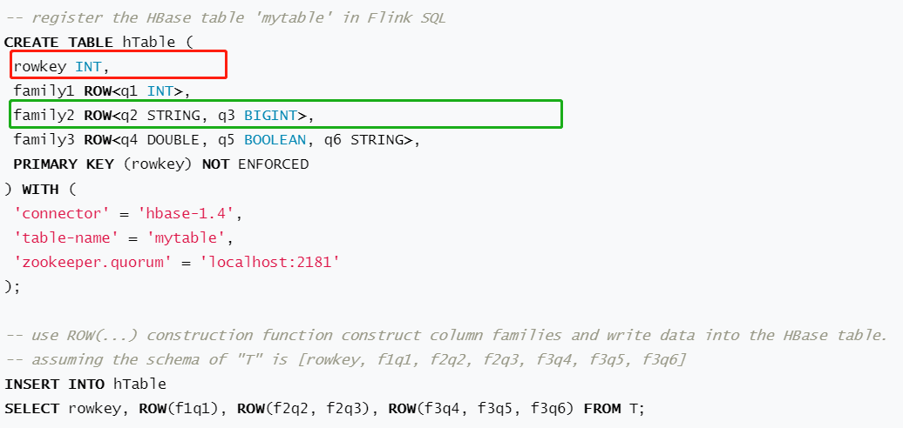


> 创建表CREATE语句，映射到HBase表：

```SQL
CREATE TABLE tbl_log_hbase_sink (
   rowkey STRING,
   info Row<user_id STRING, item_id INTEGER, behavior STRING, ts STRING>,
   PRIMARY KEY (rowkey) NOT ENFORCED
) WITH (
  'connector' = 'hbase-2.2',
  'table-name' = 'htbl_logs',
  'zookeeper.quorum' = 'node1.itcast.cn:2181,node2.itcast.cn:2181,node3.itcast.cn:2181',
  'zookeeper.znode.parent' = '/hbase',
  'sink.buffer-flush.max-size' = '1mb',
  'sink.buffer-flush.max-rows' = '1',
  'sink.buffer-flush.interval' = '1s',
  'sink.parallelism' = '3'
)
```


> 在HBase数据库中，创建表语句；

```ini
create 'htbl_logs', 'info'

# 向Base表中写如数据时，RowKey设计
	RowKey = user_id + ts
	
# HBase 表的设计的原则/rowkey原则
	唯一性
	业务性，依据rowkey前缀匹配查询最快的
	热点性
	长度原则
	字段组合原则
```


> 查询数据和插入语句：

```SQL
-- 拼凑字符串
SELECT CONCAT(user_id, '#' , ts) AS rowkey, user_id, item_id, behavior, ts 
FROM tbl_log_kafka
    
-- 查询和插入
INSERT INTO tbl_log_hbase_sink 
SELECT CONCAT(user_id, '#' , ts) AS rowkey, Row(user_id, item_id, behavior, ts)
FROM tbl_log_kafka
```


> 完整案例代码如下：

```Java
package cn.itcast.flink.connector;

import org.apache.flink.table.api.EnvironmentSettings;
import org.apache.flink.table.api.TableEnvironment;

/**
 * 从Kafka Topic 中消费数据，基于Table API Connection连接器
 * @author xuyuan 
 */
public class SqlConnectorHBaseSinkDemo {

    public static void main(String[] args) {
        // 1. 构建表执行环境-tEnv
        EnvironmentSettings settings = EnvironmentSettings.newInstance().inStreamingMode().build();
        TableEnvironment tableEnv = TableEnvironment.create(settings);

        // 2. 定义输入表，从Kafka消费数据
        tableEnv.executeSql(
            "CREATE TABLE tbl_log_kafka (\n" +
                "  `user_id` STRING,\n" +
                "  `item_id` INTEGER,\n" +
                "  `behavior` STRING,\n" +
                "  `ts` STRING\n" +
                ") WITH (\n" +
                "  'connector' = 'kafka',\n" +
                "  'topic' = 'log-topic',\n" +
                "  'properties.bootstrap.servers' = 'node1.itcast.cn:9092,node2.itcast.cn:9092,node3.itcast.cn:9092',\n" +
                "  'properties.group.id' = 'gid-1',\n" +
                "  'scan.startup.mode' = 'latest-offset',\n" +
                "  'format' = 'csv'\n" +
                ")"
        );

        // 3. 定义输出表，将数据保存到HBase数据库表中
        tableEnv.executeSql(
            "CREATE TABLE tbl_log_hbase_sink (\n" +
                "   rowkey STRING,\n" +
                "   info Row<user_id STRING, item_id INTEGER, behavior STRING, ts STRING>,\n" +
                "   PRIMARY KEY (rowkey) NOT ENFORCED\n" +
                ") WITH (\n" +
                "  'connector' = 'hbase-2.2',\n" +
                "  'table-name' = 'htbl_logs',\n" +
                "  'zookeeper.quorum' = 'node1.itcast.cn:2181,node2.itcast.cn:2181,node3.itcast.cn:2181',\n" +
                "  'zookeeper.znode.parent' = '/hbase',\n" +
                "  'sink.buffer-flush.max-size' = '1mb',\n" +
                "  'sink.buffer-flush.max-rows' = '1',\n" +
                "  'sink.buffer-flush.interval' = '1s',\n" +
                "  'sink.parallelism' = '3'\n" +
                ")"
        );

        // 3. 编写SQL，直接查询表的数据
		/*
		INSERT INTO hTable
			SELECT rowkey, ROW(f1q1), ROW(f2q2, f2q3), ROW(f3q4, f3q5, f3q6) FROM T;
		 */
        tableEnv.executeSql(
            "INSERT INTO tbl_log_hbase_sink " +
                "SELECT CONCAT(user_id, '#', ts) AS rowkey , Row(user_id, item_id, behavior, ts) FROM tbl_log_kafka"
        );
    }

}
```


## 第三部分：Flink SQL Client【2个小节】


```

```


### 10-[理解]-Flink SQL Client之快速入门使用

---


> ​			**SQL Client**目的：提供一种简单的方式来编写、调试和提交**表程序（DDL、DQL、DML语句）**到Flink 集群上，而无需写一行 Java 或 Scala 代码。
>
> ​			SQL 客户端命令行界面（CLI） 能够在命令行中检索和可视化分布式应用中实时产生的结果。

https://nightlies.apache.org/flink/flink-docs-release-1.13/docs/dev/table/sqlclient/

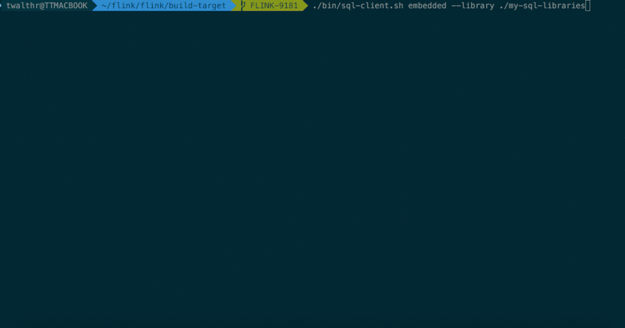


> ​			SQL Client 捆绑在常规 Flink 发行版中，因此可以直接运行，仅需要一个**正在运行的 Flink 集群**就可以在其中执行表程序。

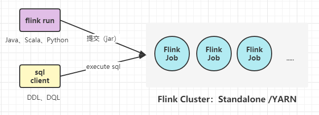


- step1、启动本地集群（Local Cluster）

```ini
# 启动Flink Local Cluster 集群
[root@node1 ~]# /export/server/flink-local/bin/start-cluster.sh 
```


- step2、启动SQL Client命令行

```ini
# 启动SQL Client CLI命令行
[root@node1 ~]# /export/server/flink-local/bin/sql-client.sh embedded
```


```ini
Flink SQL> HELP;
The following commands are available:

CLEAR           Clears the current terminal.
CREATE TABLE            Create table under current catalog and database.
DROP TABLE              Drop table with optional catalog and database. Syntax: 'DROP TABLE [IF EXISTS] <name>;'
CREATE VIEW             Creates a virtual table from a SQL query. Syntax: 'CREATE VIEW <name> AS <query>;'
DESCRIBE                Describes the schema of a table with the given name.
DROP VIEW               Deletes a previously created virtual table. Syntax: 'DROP VIEW <name>;'
EXPLAIN         Describes the execution plan of a query or table with the given name.
HELP            Prints the available commands.
INSERT INTO             Inserts the results of a SQL SELECT query into a declared table sink.
INSERT OVERWRITE                Inserts the results of a SQL SELECT query into a declared table sink and overwrite existing data.
QUIT            Quits the SQL CLI client.
RESET           Resets a session configuration property. Syntax: 'RESET <key>;'. Use 'RESET;' for reset all session properties.
SELECT          Executes a SQL SELECT query on the Flink cluster.
SET             Sets a session configuration property. Syntax: 'SET <key>=<value>;'. Use 'SET;' for listing all properties.
SHOW FUNCTIONS          Shows all user-defined and built-in functions or only user-defined functions. Syntax: 'SHOW [USER] FUNCTIONS;'
SHOW TABLES             Shows all registered tables.
SOURCE          Reads a SQL SELECT query from a file and executes it on the Flink cluster.
USE CATALOG             Sets the current catalog. The current database is set to the catalog's default one. Experimental! Syntax: 'USE CATALOG <name>;'
USE             Sets the current default database. Experimental! Syntax: 'USE <name>;'
LOAD MODULE             Load a module. Syntax: 'LOAD MODULE <name> [WITH ('<key1>' = '<value1>' [, '<key2>' = '<value2>', ...])];'
UNLOAD MODULE           Unload a module. Syntax: 'UNLOAD MODULE <name>;'
USE MODULES             Enable loaded modules. Syntax: 'USE MODULES <name1> [, <name2>, ...];'
BEGIN STATEMENT SET             Begins a statement set. Syntax: 'BEGIN STATEMENT SET;'
END             Ends a statement set. Syntax: 'END;'

Hint: Make sure that a statement ends with ';' for finalizing (multi-line) statements.
```


- step3、执行SQL语句

```SQL
SELECT 'Flink' AS word, UPPER('Flink') AS upper_word, LOWER('Flink') AS lower_word ;
```

​				[在Flink SQL Client 命令行上执行SQL，本质上将SQL转换为DataStream转换，提交到集群上执行。]()

显示结果如下：

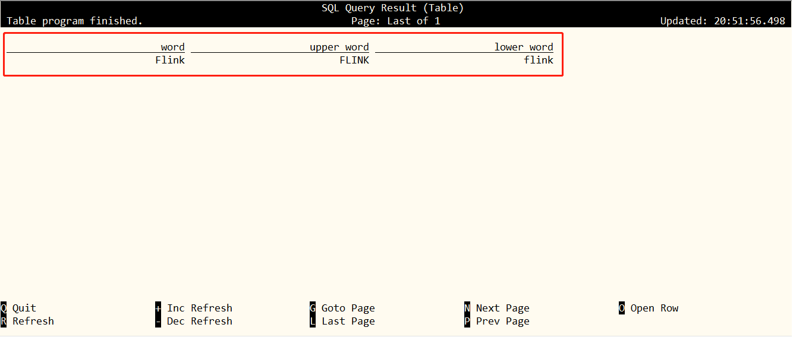

**默认情况下输出默认采用的是表格模式**，从集群中检索结果并将其可视化，按 `Q 键`退出结果视图。


> SQL Client 命令行（CLI）为维护和可视化结果提供三种模式：**表格模式、变更日志模式和数据库模式**。

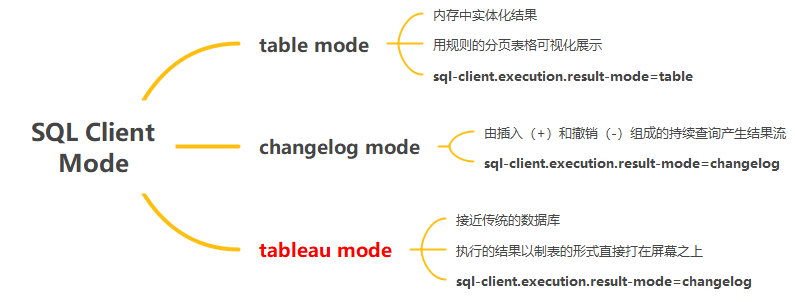

- 可视化模式：**表格table**模式

```ini
Flink SQL> SET sql-client.execution.result-mode=table;

Flink SQL> SELECT ('Flink') AS word, UPPER('Flink') AS upper_word, LOWER('Flink') AS lower_word ;
```

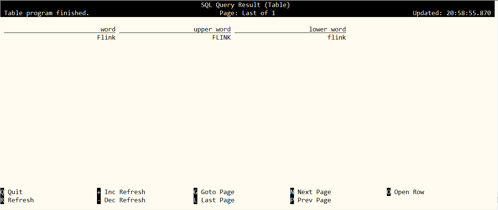


- 可视化模式：**变更日志changlog** 模式

```ini
Flink SQL> SET sql-client.execution.result-mode=changelog;  

Flink SQL> SELECT ('Flink') AS word, UPPER('Flink') AS upper_word, LOWER('Flink') AS lower_word ;
```

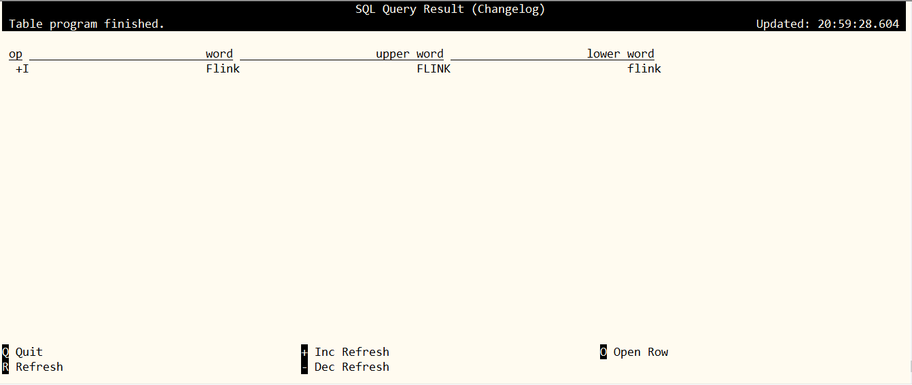


- 可视化模式：**数据库tableau**模式

```ini
Flink SQL> SET sql-client.execution.result-mode=tableau;

Flink SQL> SELECT ('Flink') AS word, UPPER('Flink') AS upper_word, LOWER('Flink') AS lower_word ;
```

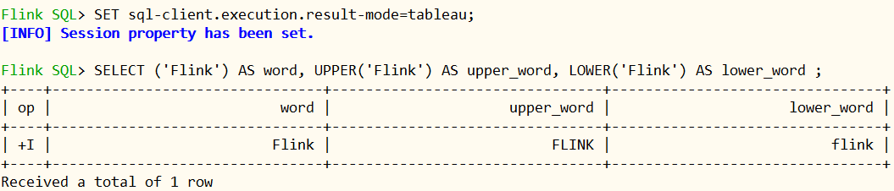


> 编写SQL，实现词频统计WordCount。

```SQL
-- 设置执行模式：batch
SET execution.runtime-mode = batch ;
SET sql-client.execution.result-mode=tableau;
SET sql-client.execution.max-table-result.rows=100;
SET sql-client.verbose=true;

-- 词频统计SQL
SELECT 
  word, COUNT(*) AS total 
FROM(
  VALUES ('flink'), ('flink'), ('spark'), ('flink'), ('spark'), ('hive')
) AS NameTable(word) 
GROUP BY word;
```

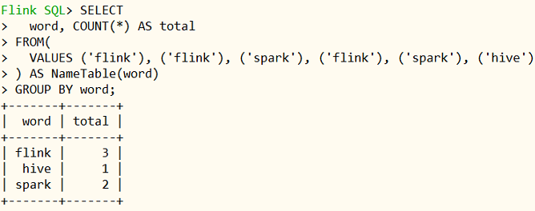


```sql
-- Properties that change the fundamental execution behavior of a table program.

SET table.planner = blink; -- planner: either 'blink' (default) or 'old'
SET execution.runtime-mode = streaming; -- execution mode either 'batch' or 'streaming'
SET sql-client.execution.result-mode = table; -- available values: 'table', 'changelog' and 'tableau'
SET sql-client.execution.max-table-result.rows = 10000; -- optional: maximum number of maintained rows
SET parallelism.default = 1; -- optional: Flink's parallelism (1 by default)
SET pipeline.auto-watermark-interval = 200; --optional: interval for periodic watermarks
SET pipeline.max-parallelism = 10; -- optional: Flink's maximum parallelism
SET table.exec.state.ttl=1000; -- optional: table program's idle state time
SET restart-strategy = fixed-delay;

-- Configuration options for adjusting and tuning table programs.

SET table.optimizer.join-reorder-enabled = true;
SET table.exec.spill-compression.enabled = true;
SET table.exec.spill-compression.block-size = 128kb;
```


### 11-[掌握]-Flink SQL Client之PvUv案例分析

---


> 在Flink SQL Client命令行客户端，执行 `set` 命令，查看默认属性基本配置：

```ini
# 启动Local Cluster 
[root@node1 ~]# /export/server/flink-local/bin/start-cluster.sh 

# 启动SQL Client
[root@node1 ~]# /export/server/flink-local/bin/sql-client.sh embedded

Flink SQL> set ;
execution.attached=true
execution.runtime-mode=batch
execution.savepoint.ignore-unclaimed-state=false
execution.shutdown-on-attached-exit=false
execution.target=remote

jobmanager.execution.failover-strategy=region
jobmanager.memory.process.size=1600m
jobmanager.rpc.address=localhost
jobmanager.rpc.port=6123

parallelism.default=1

pipeline.classpaths=
pipeline.jars=file:/export/server/flink-local/opt/flink-sql-client_2.11-1.13.1.jar

sql-client.execution.result-mode=tableau
sql-client.verbose=true

taskmanager.memory.process.size=1728m
taskmanager.numberOfTaskSlots=1
```


#### 需求分析

---

> 以阿里巴巴移动电商平台的**真实用户-商品行为数据**为基础，进行基本网站指标分析统计：`PV、UV`等。

- 1、业务数据：用户浏览网页数据记录日志

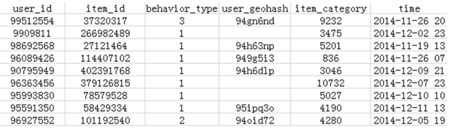


- 2、字段含义：

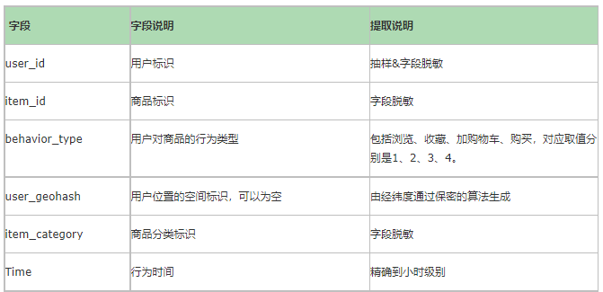


```SQL
-- 启动服务
hadoop-daemon.sh start namenode
hadoop-daemons.sh start datanode

start-metastore.sh
start-hiverserver2.sh

-- 1、Hive 中创建表
CREATE DATABASE IF NOT EXISTS db_flink ;

CREATE TABLE db_flink.tbl_user_behavior(
user_id STRING,
item_id STRING,
behavior_type INT,
user_geohash STRING,
item_catogry STRING,
access_time STRING
) 
ROW FORMAT DELIMITED FIELDS TERMINATED BY ',';

-- 2、加载数据
load data local inpath '/root/tianchi_user.csv' into table db_flink.tbl_user_behavior ;

-- 3、查询数据
SELECT * FROM  db_flink.tbl_user_behavior LIMIT 3 ;
```


- 3、业务需求及分析说明


#### 创建表

----

```SQL
-- step0、上传数据文件至/root 目录
cd /root
rz


-- 设置属性
SET sql-client.execution.result-mode=tableau;
SET execution.runtime-mode = batch ;


-- step1、创建表
CREATE TABLE tbl_user_behavior (
  user_id STRING,
  item_id STRING,
  behavior_type INT,
  user_geohash STRING,
  item_catogry STRING,
  access_time STRING
) WITH (
  'connector' = 'filesystem',
  'path' = 'file:///root/tianchi_user.csv',
  'format' = 'csv',
  'csv.ignore-parse-errors' = 'true'
);


-- step2、测试表数据
SELECT COUNT(1) AS toal FROM tbl_user_behavior ;

SELECT user_id, item_id, behavior_type, user_geohash, item_catogry, access_time FROM tbl_user_behavior LIMIT 5 ;

```

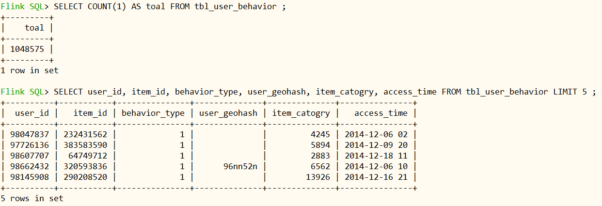


#### PV统计分析

---


```SQL
SELECT * FROM tbl_user_behavior LIMIT 5 ;
/*
+----------+-----------+---------------+--------------+--------------+---------------+
|  user_id |   item_id | behavior_type | user_geohash | item_catogry |   access_time |
+----------+-----------+---------------+--------------+--------------+---------------+
| 98047837 | 232431562 |             1 |              |         4245 | 2014-12-06 02 |
| 97726136 | 383583590 |             1 |              |         5894 | 2014-12-09 20 |
| 98607707 |  64749712 |             1 |              |         2883 | 2014-12-18 11 |
| 98662432 | 320593836 |             1 |      96nn52n |         6562 | 2014-12-06 10 |
| 98145908 | 290208520 |             1 |              |        13926 | 2014-12-16 21 |
+----------+-----------+---------------+--------------+--------------+---------------+
*/
-- 1. 页面PV
SELECT item_id, COUNT(1) AS pv FROM tbl_user_behavior 
GROUP BY item_id ORDER BY pv DESC LIMIT 10;
/*
+-----------+-----+
|   item_id |  pv |
+-----------+-----+
| 112921337 | 130 |
|  97655171 | 130 |
| 387911330 |  88 |
|  14087919 |  73 |
| 135104537 |  71 |
| 128186279 |  69 |
|   2217535 |  67 |
|   5685392 |  65 |
| 355292943 |  60 |
| 276636269 |  60 |
+-----------+-----+
*/

-- 2、每天PV
WITH tmp AS(
  SELECT SUBSTRING(access_time, 0, 10) AS access_date FROM tbl_user_behavior
)
SELECT access_date, COUNT(1) AS pv FROM tmp 
GROUP BY access_date ORDER BY pv DESC LIMIT 10;
/*
+-------------+-------+
| access_date |    pv |
+-------------+-------+
|  2014-12-12 | 59327 |
|  2014-12-11 | 41727 |
|  2014-12-10 | 35835 |
|  2014-12-03 | 34896 |
|  2014-11-30 | 34824 |
|  2014-12-13 | 34801 |
|  2014-12-14 | 34656 |
|  2014-12-02 | 34625 |
|  2014-12-07 | 34400 |
|  2014-12-04 | 34286 |
+-------------+-------+ 
*/

-- 3、用户PV
SELECT user_id, COUNT(1) AS pv FROM tbl_user_behavior 
GROUP BY user_id ORDER BY pv DESC LIMIT 10;
/*
+-----------+------+
|   user_id |   pv |
+-----------+------+
|  36233277 | 3117 |
|  65645933 | 2073 |
|  59511789 | 2071 |
|  73196588 | 2042 |
| 130270245 | 1956 |
|  83813302 | 1783 |
|   7234861 | 1762 |
| 137175187 | 1304 |
|  52577851 | 1303 |
| 123842164 | 1279 |
+-----------+------+
*/
```


#### UV统计分析

---


```SQL
SELECT * FROM tbl_user_behavior LIMIT 5 ;
/*
+----------+-----------+---------------+--------------+--------------+---------------+
|  user_id |   item_id | behavior_type | user_geohash | item_catogry |   access_time |
+----------+-----------+---------------+--------------+--------------+---------------+
| 98047837 | 232431562 |             1 |              |         4245 | 2014-12-06 02 |
| 97726136 | 383583590 |             1 |              |         5894 | 2014-12-09 20 |
| 98607707 |  64749712 |             1 |              |         2883 | 2014-12-18 11 |
| 98662432 | 320593836 |             1 |      96nn52n |         6562 | 2014-12-06 10 |
| 98145908 | 290208520 |             1 |              |        13926 | 2014-12-16 21 |
+----------+-----------+---------------+--------------+--------------+---------------+
*/
-- 1、页面UV
SELECT item_id, COUNT(DISTINCT user_id) AS uv FROM tbl_user_behavior 
GROUP BY item_id ORDER BY uv DESC LIMIT 10 ;
/*
+-----------+-----+
|   item_id |  uv |
+-----------+-----+
| 112921337 | 111 |
|  97655171 |  84 |
| 387911330 |  65 |
| 128186279 |  64 |
| 135104537 |  60 |
|   5685392 |  57 |
|   2217535 |  57 |
|  14087919 |  54 |
| 275450912 |  52 |
| 217213194 |  52 |
+-----------+-----+
*/

-- 2、每日UV
WITH tmp AS(
  SELECT user_id, SUBSTRING(access_time, 0, 10) AS access_date FROM tbl_user_behavior
)
SELECT access_date, COUNT(DISTINCT user_id) AS uv FROM tmp 
GROUP BY access_date ORDER BY uv DESC LIMIT 10;
/*
+-------------+------+
| access_date |   uv |
+-------------+------+
|  2014-12-12 | 5693 |
|  2014-12-11 | 4912 |
|  2014-12-13 | 4624 |
|  2014-12-15 | 4615 |
|  2014-12-16 | 4613 |
|  2014-12-10 | 4559 |
|  2014-12-03 | 4558 |
|  2014-12-14 | 4525 |
|  2014-12-17 | 4511 |
|  2014-12-02 | 4497 |
+-------------+------+
*/


-- 每日PV和UV
WITH tmp AS(
  SELECT user_id, SUBSTRING(access_time, 0, 10) AS access_date FROM tbl_user_behavior
)
SELECT access_date, COUNT(1) AS pv, COUNT(DISTINCT user_id) AS uv FROM tmp 
GROUP BY access_date ORDER BY pv DESC, uv DESC;
/*
+-------------+-------+------+
| access_date |    pv |   uv |
+-------------+-------+------+
|  2014-12-06 | 33119 | 4373 |
|  2014-12-09 | 33731 | 4472 |
|  2014-12-18 | 31318 | 4399 |
|  2014-12-16 | 34077 | 4613 |
|  2014-12-03 | 34896 | 4558 |
|  2014-12-13 | 34801 | 4624 |
|  2014-11-27 | 31338 | 4262 |
|  2014-12-11 | 41727 | 4912 |
|  2014-12-05 | 31370 | 4295 |
|  2014-12-08 | 32719 | 4483 |
|  2014-12-01 | 33658 | 4421 |
|  2014-12-12 | 59327 | 5693 |
|  2014-11-20 | 30598 | 4276 |
|  2014-12-14 | 34656 | 4525 |
|  2014-11-26 | 30792 | 4275 |
|  2014-11-21 | 28039 | 4144 |
|  2014-11-28 | 29817 | 4138 |
|  2014-11-23 | 32458 | 4317 |
|  2014-11-29 | 31685 | 4235 |
|  2014-11-25 | 31510 | 4298 |
|  2014-12-15 | 34208 | 4615 |
|  2014-12-17 | 33038 | 4511 |
|  2014-12-04 | 34286 | 4458 |
|  2014-11-24 | 32292 | 4391 |
|  2014-12-07 | 34400 | 4437 |
|  2014-11-19 | 30567 | 4301 |
|  2014-12-10 | 35835 | 4559 |
|  2014-11-22 | 31283 | 4122 |
|  2014-12-02 | 34625 | 4497 |
|  2014-11-18 | 31581 | 4283 |
|  2014-11-30 | 34824 | 4385 |
+-------------+-------+------+
*/
```


## 附录部分：注意事项及扩展内容


```

```


### [附录1]-Mavan 模块依赖

---


> 创建Maven模块，添加相关依赖：

```xml
    <repositories>
        <repository>
            <id>nexus-aliyun</id>
            <name>Nexus aliyun</name>
            <url>http://maven.aliyun.com/nexus/content/groups/public</url>
        </repository>
        <repository>
            <id>central_maven</id>
            <name>central maven</name>
            <url>https://repo1.maven.org/maven2</url>
        </repository>
        <repository>
            <id>cloudera</id>
            <url>https://repository.cloudera.com/artifactory/cloudera-repos/</url>
        </repository>
        <repository>
            <id>apache.snapshots</id>
            <name>Apache Development Snapshot Repository</name>
            <url>https://repository.apache.org/content/repositories/snapshots/</url>
            <releases>
                <enabled>false</enabled>
            </releases>
            <snapshots>
                <enabled>true</enabled>
            </snapshots>
        </repository>
    </repositories>

    <dependencies>
        <dependency>
            <groupId>org.apache.flink</groupId>
            <artifactId>flink-java</artifactId>
            <version>1.13.1</version>
        </dependency>
        <dependency>
            <groupId>org.apache.flink</groupId>
            <artifactId>flink-streaming-java_2.11</artifactId>
            <version>1.13.1</version>
        </dependency>
        <dependency>
            <groupId>org.apache.flink</groupId>
            <artifactId>flink-clients_2.11</artifactId>
            <version>1.13.1</version>
        </dependency>
        <dependency>
            <groupId>org.apache.flink</groupId>
            <artifactId>flink-runtime-web_2.11</artifactId>
            <version>1.13.1</version>
        </dependency>

        <dependency>
            <groupId>org.apache.flink</groupId>
            <artifactId>flink-connector-kafka_2.11</artifactId>
            <version>1.13.1</version>
        </dependency>

        <dependency>
            <groupId>org.apache.flink</groupId>
            <artifactId>flink-connector-jdbc_2.11</artifactId>
            <version>1.13.1</version>
        </dependency>

        <!-- Flink Table API & SQL -->
        <dependency>
            <groupId>org.apache.flink</groupId>
            <artifactId>flink-table-api-java-bridge_2.11</artifactId>
            <version>1.13.1</version>
        </dependency>
        <dependency>
            <groupId>org.apache.flink</groupId>
            <artifactId>flink-table-planner-blink_2.11</artifactId>
            <version>1.13.1</version>
        </dependency>
        <dependency>
            <groupId>org.apache.flink</groupId>
            <artifactId>flink-table-common</artifactId>
            <version>1.13.1</version>
        </dependency>

        <dependency>
            <groupId>org.apache.flink</groupId>
            <artifactId>flink-csv</artifactId>
            <version>1.13.1</version>
        </dependency>
        <dependency>
            <groupId>org.apache.flink</groupId>
            <artifactId>flink-json</artifactId>
            <version>1.13.1</version>
        </dependency>
        <dependency>
            <groupId>org.apache.flink</groupId>
            <artifactId>flink-parquet_2.11</artifactId>
            <version>1.13.1</version>
        </dependency>

        <dependency>
            <groupId>org.apache.flink</groupId>
            <artifactId>flink-connector-hive_2.11</artifactId>
            <version>1.13.1</version>
        </dependency>
        <dependency>
            <groupId>org.apache.hive</groupId>
            <artifactId>hive-exec</artifactId>
            <version>3.1.2</version>
            <scope>provided</scope>
        </dependency>

        <dependency>
            <groupId>org.apache.flink</groupId>
            <artifactId>flink-shaded-hadoop-3-uber</artifactId>
            <version>3.1.1.7.2.1.0-327-9.0</version>
        </dependency>
        <dependency>
            <groupId>commons-cli</groupId>
            <artifactId>commons-cli</artifactId>
            <version>1.4</version>
        </dependency>

        <dependency>
            <groupId>org.apache.flink</groupId>
            <artifactId>flink-connector-hbase-2.2_2.11</artifactId>
            <version>1.13.1</version>
        </dependency>

        <dependency>
            <groupId>mysql</groupId>
            <artifactId>mysql-connector-java</artifactId>
            <version>5.1.48</version>
        </dependency>

        <dependency>
            <groupId>com.alibaba</groupId>
            <artifactId>fastjson</artifactId>
            <version>1.2.68</version>
        </dependency>
        <dependency>
            <groupId>org.projectlombok</groupId>
            <artifactId>lombok</artifactId>
            <version>1.18.12</version>
        </dependency>

        <dependency>
            <groupId>org.slf4j</groupId>
            <artifactId>slf4j-log4j12</artifactId>
            <version>1.7.7</version>
            <scope>runtime</scope>
        </dependency>
        <dependency>
            <groupId>log4j</groupId>
            <artifactId>log4j</artifactId>
            <version>1.2.17</version>
            <scope>runtime</scope>
        </dependency>

        <dependency>
            <groupId>org.apache.commons</groupId>
            <artifactId>commons-compress</artifactId>
            <version>1.20</version>
        </dependency>

    </dependencies>

    <build>
        <sourceDirectory>src/main/java</sourceDirectory>
        <testSourceDirectory>src/test/java</testSourceDirectory>
        <plugins>
            <!-- 编译插件 -->
            <plugin>
                <groupId>org.apache.maven.plugins</groupId>
                <artifactId>maven-compiler-plugin</artifactId>
                <version>3.5.1</version>
                <configuration>
                    <source>1.8</source>
                    <target>1.8</target>
                    <!--<encoding>${project.build.sourceEncoding}</encoding>-->
                </configuration>
            </plugin>
            <plugin>
                <groupId>org.apache.maven.plugins</groupId>
                <artifactId>maven-surefire-plugin</artifactId>
                <version>2.18.1</version>
                <configuration>
                    <useFile>false</useFile>
                    <disableXmlReport>true</disableXmlReport>
                    <includes>
                        <include>**/*Test.*</include>
                        <include>**/*Suite.*</include>
                    </includes>
                </configuration>
            </plugin>
            <!-- 打jar包插件(会包含所有依赖) -->
            <plugin>
                <groupId>org.apache.maven.plugins</groupId>
                <artifactId>maven-shade-plugin</artifactId>
                <version>2.3</version>
                <executions>
                    <execution>
                        <phase>package</phase>
                        <goals>
                            <goal>shade</goal>
                        </goals>
                        <configuration>
                            <filters>
                                <filter>
                                    <artifact>*:*</artifact>
                                    <excludes>
                                        <!--
                                        zip -d learn_spark.jar META-INF/*.RSA META-INF/*.DSA META-INF/*.SF -->
                                        <exclude>META-INF/*.SF</exclude>
                                        <exclude>META-INF/*.DSA</exclude>
                                        <exclude>META-INF/*.RSA</exclude>
                                    </excludes>
                                </filter>
                            </filters>
                            <transformers>
                                <transformer implementation="org.apache.maven.plugins.shade.resource.ManifestResourceTransformer">
                                    <!-- <mainClass>com.itcast.flink.batch.FlinkBatchWordCount</mainClass> -->
                                </transformer>
                            </transformers>
                        </configuration>
                    </execution>
                </executions>
            </plugin>
        </plugins>
    </build>

```


