# Flink Chapter08：Flink Table API & SQL（2）

----

​		[Apache Flink features two relational APIs - the Table API and SQL - for unified stream and batch processing.]() 


- The **Table API** is a language-integrated query API for Java, Scala, and Python that allows the composition of queries from relational operators such as selection, filter, and join in a very intuitive way. 
- **Flink’s SQL** support is based on [Apache Calcite](https://calcite.apache.org/) which implements the SQL standard.


## 前言部分：知识回顾及课程目标


```

```


### [前言1]-上次课程内容回顾 

---


> 主要讲解：Flink Table API &SQL 快速入门、DataStream与Table相互转换和Table API Connector使用。

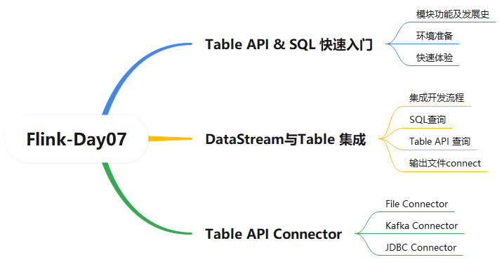


> ​			**Flink Table API & SQL**：构建`TableEnvironment`表执行环境，加载数据至`Table`，使用Table API（DSL）或SQL分析查询，最后将结果Table插入到外部表中。

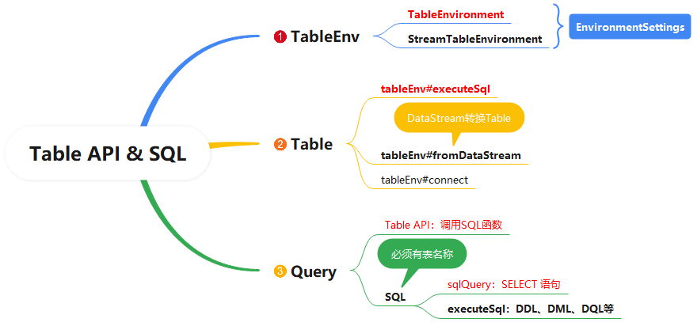


### [前言2]-维度表数据Lookup检索查找

---


> 在Table API & SQL模块，提供很多与外部存储集成`Connectors`连接器，可以加载保存，还支持流批。

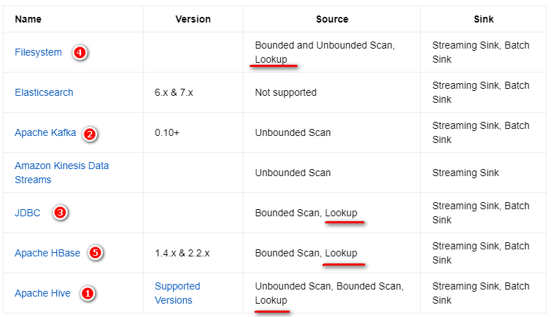


> 其中数据源Source中支持： `Lookup`检索查找，表示：数据流（大表）与维表JOIN关联。

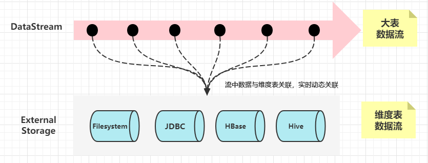


> jdbc connector 关于 Lookup Cache 的描述：

- JDBC Connector，可用在时态表关联中作为一个 lookup  source (又称为维表)，当前只支持同步的查找模式。
- 默认情况，lookup cache 未启用，可设置 `lookup.cache.max-rows` and `lookup.cache.ttl` 参数来启用。
- lookup cache 主要目的是**用于提高时态表关联 JDBC 连接器的性能**
  - 默认情况下，lookup cache 不开启，所以所有请求都会发送到外部数据库。 
  - 当 lookup cache 被启用时，每个进程（即 TaskManager）将维护一个缓存。
  - Flink 将优先查找缓存，只有当缓存未查找到时才向外部数据库发送请求，并使用返回的数据更新缓存。 

- 当缓存命中最大缓存行 lookup.cache.max-rows 或当行超过最大存活时间 lookup.cache.ttl 时，缓存中最老的行将被设置为已过期。
-  缓存中的记录可能不是最新的，用户可以将 lookup.cache.ttl 设置为一个更小的值以获得更好的刷新数据，但这可能会增加发送到数据库的请求数。


> **案例演示**：大表数据流：从Kafka Topic队列中消费数据，维表数据存储在MySQL数据库表中。

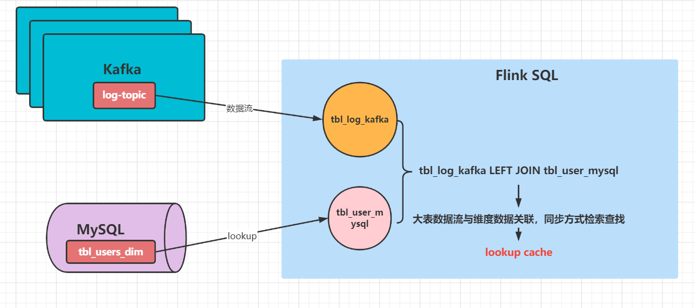


- 0、环境准备

```ini
# 将相关jar包上传中flink安装目录lib中
[root@node1 ~]# cd /export/server/flink-local/lib
[root@node1 lib]# rz
	flink-connector-jdbc_2.11-1.13.1.jar
	flink-sql-connector-kafka_2.11-1.13.1.jar
	mysql-connector-java-5.1.49.jar

# 启动Local Cluster 
[root@node1 ~]# /export/server/flink-local/bin/start-cluster.sh 

# 启动SQL Client
[root@node1 ~]# /export/server/flink-local/bin/sql-client.sh embedded

-- 设置属性
SET sql-client.execution.result-mode=tableau;
SET execution.runtime-mode = streaming ;
SET parallelism.default = 1 ;
```


- 1、加载kafka队列日志数据中数据

```SQL
CREATE TABLE tbl_log_kafka (
  `user_id` STRING,
  `item_id` INTEGER,
  `behavior` STRING,
  `ts` STRING,
  `process_time` as proctime()
) WITH (
  'connector' = 'kafka',
  'topic' = 'log-topic',
  'properties.bootstrap.servers' = 'node1.itcast.cn:9092,node2.itcast.cn:9092,node3.itcast.cn:9092',
  'properties.group.id' = 'gid-2',
  'scan.startup.mode' = 'latest-offset',
  'format' = 'csv'
);

-- 查看表的数据
SELECT * FROM tbl_log_kafka ;

```


- 2、加载MySQL数据库表中用户信息数据

```SQL
CREATE TABLE tbl_user_mysql (
  `user_id` STRING,
  `user_name` STRING,
  `id_card` STRING,
  `mobile` STRING,
  `address` STRING,
  `gender` STRING,
   PRIMARY KEY (user_id) NOT ENFORCED
) WITH (
  'connector' = 'jdbc', 
  'url' = 'jdbc:mysql://node1.itcast.cn:3306/db_flink?characterEncoding=utf8&useSSL=false',
  'table-name' = 'tbl_users_dim', 
  'driver' = 'com.mysql.jdbc.Driver', 
  'username' = 'root', 
  'password' = '123456',
  'lookup.cache.max-rows' = '1000',
  'lookup.cache.ttl' = '1 minute'
);

-- 查看用户表数据
SELECT user_id, user_name, gender, mobile FROM tbl_user_mysql LIMIT 10 ;

```


- 3、日志数据流中user_id与用户维度表数据关联，使用left join，底层基于lookup实现。

```SQL
SELECT t1.user_id, t1.item_id, t1.behavior, t2.user_name, t2.gender
FROM tbl_log_kafka AS t1
LEFT JOIN tbl_user_mysql FOR SYSTEM_TIME AS OF t1.process_time AS t2 
ON t1.user_id = t2.user_id ;
```


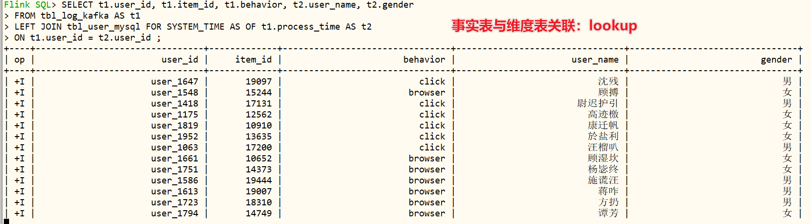


### [前言3]-今日课程内容提纲

---


> 主要分为3个部分讲解：集成Hive（配置）、Flink CDC及实时综合案例。

```ini
# 1、FlinkSQL与Hive集成
	从1.9版本开始，提供与Hive集成，可以从Hive表加载数据和保存数据到Hive表，类似SparkSQL集合Hive
	直接加载读取Hive表中数据，进行分析
	可以让Hive管理数据
	函数使用：
		日期函数，开窗函数、window窗口函数
	

# 2、Flink CDC
	直接增量或全量将RDMBS表数据实时获取，进行处理分析，保存到外部（比如Hive、HBase、。。。。。）
	阿里巴巴：云邪开发模块
	最新版2.x中支持数据库：MySQL、Oracle、SQLServer、Postgresql


# 3、实时综合案例
	NoSQL数据库时，陌陌综合案例（实时ETL存储），基于FlinkSQL完成。

```

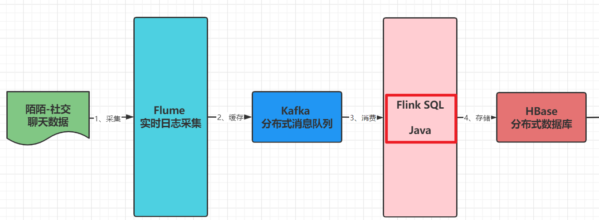


- 应用开发文档：https://nightlies.apache.org/flink/flink-docs-release-1.13/docs/dev/table/overview/
- 连接器文档：https://nightlies.apache.org/flink/flink-docs-release-1.13/docs/connectors/table/overview/


## 第一部分：集成Hive【4个小节】


> - 添加`HADOOP_CONF_DIR`环境变量

```ini
# 编辑文件
vim /etc/profile
	添加内容：
	export HADOOP_CONF_DIR=/export/server/hadoop/etc/hadoop

# 执行生效
source /etc/profile
```


> - 修改`flink-conf.yaml`文件，设置TaskManager资源槽Slot个数

```ini
[root@node1 ~]# cd /export/server/flink-local/conf

[root@node1 conf]# vim flink-conf.yaml 
	修改内容：60行
	taskmanager.numberOfTaskSlots: 4
```


```ini
[root@node1 conf]# vim flink-conf.yaml 
	修改内容：257行
	classloader.check-leaked-classloader: false
```


> - 启动Flink Local Cluster本地集

```ini
[root@node1 ~]# /export/server/flink-local/bin/start-cluster.sh 
```


> 运行Flink SQL Client命令行：

```ini
[root@node1 ~]# /export/server/flink-local/bin/sql-client.sh 
```


### 01-[理解]-集成Hive之元数据Catalog

---


> ​		数据处理最重要的方面之一是**管理元数据**。Catalogs提供了元数据管理，例如**数据库（database/schema)、表(table)、分区(partition)、视图（view）、函数（function）**和访问存储在数据库或其他外部系统中的数据所需的信息。
>
> - 可以是临时表之类的临时元数据，也可以是针对表环境注册的UDF函数，或者永久的元数据，比如Hive中的元数据。
> - Catalogs提供一个统一的API来管理元数据，并可以通过表API和SQL查询。


文档：https://nightlies.apache.org/flink/flink-docs-release-1.13/docs/dev/table/catalogs/

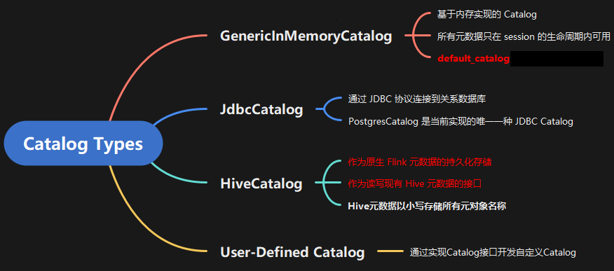


```ini
# 显示所有catelog元数据
Flink SQL> show catalogs ; 
+-----------------+
|    catalog name |
+-----------------+
| default_catalog |
+-----------------+
1 row in set

# 显示所有数据库
Flink SQL> show databases ;
+------------------+
|    database name |
+------------------+
| default_database |
+------------------+
1 row in set

# 显示所有表
Flink SQL> show tables ;
+-------------------+
|        table name |
+-------------------+
| tbl_user_behavior |
+-------------------+
1 row in set

```


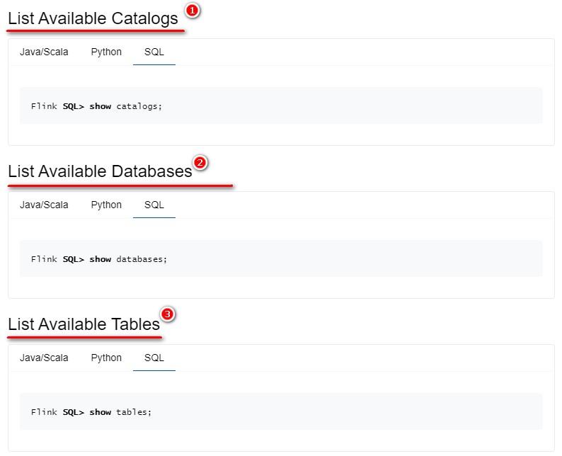


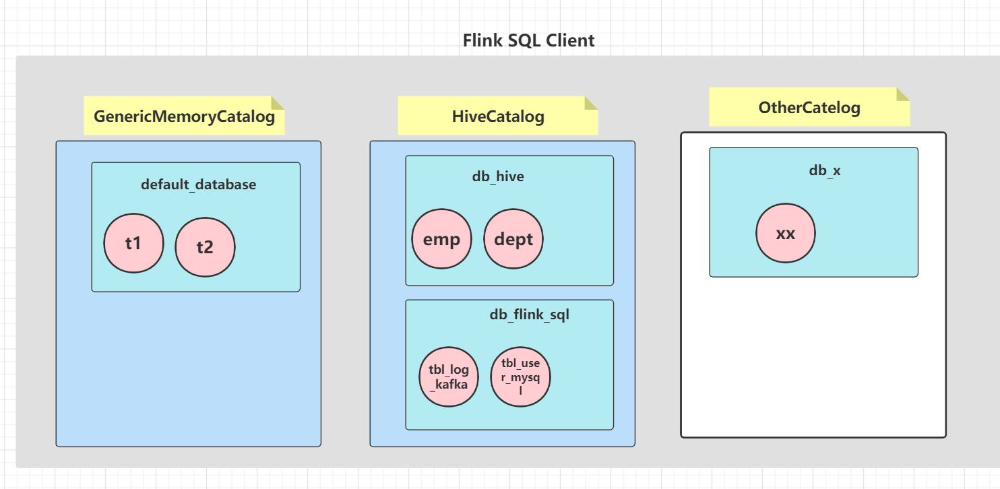


### 02-[掌握]-集成Hive之HiveCatalog 配置

---


> ​			使用Apache Hive构建**数据仓库**已经成为了比较普遍的一种解决方案目前，一些比较常见的大数据处理引擎，都无一例外兼容Hive。
>
> ​		[Flink从1.9开始支持集成Hive，不过1.9版本为beta版，不推荐在生产环境中使用。在Flink1.10版本中，标志着对 Blink的整合宣告完成，对 Hive 的集成也达到了生产级别的要求。]()

​			Flink SQL与 Hive 的集成体现两个方面优势：

- **第一方面：持久化元数据**
  - Flink[利用 Hive 的 MetaStore 作为持久化的 Catalog]()，可通过HiveCatalog将不同会话中的 Flink 元数据存储到 Hive Metastore 中。 
  - 例如，可以使用HiveCatalog将其 Kafka的数据源表存储在 Hive Metastore 中，这样该表的元数据信息会被持久化到Hive的MetaStore对应的元数据库中，在后续的 SQL 查询中，可以重复使用它们。
  
- **第二方面：利用 Flink 来读写 Hive 的表**
  - Flink[打通与Hive的集成]()，如同使用SparkSQL或者Presto操作Hive中的数据一样，可以使用Flink直接读写Hive中的表。
  - `HiveCatalog`的设计提供了与 Hive 良好的兼容性，用户可以”开箱即用”的访问其已有的 Hive表。

> [Note that we `highly recommend` users using the `blink planner` with Hive integration]()


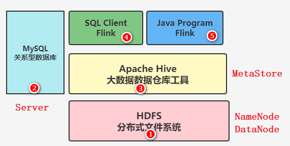


#### FlinkSQL Client

> 启动服务（MySQL、HDFS和Hive MetaStore），配置Flink SQL Client 集成Hive，步骤如下：

- **step1、启动服务**

```ini
# a. 确定MySQL数据库启动
[root@node1 ~]# mysql -uroot -p123456

# b. 启动HDFS服务（集群）
[root@node1 ~]# hadoop-daemon.sh start namenode 
[root@node1 ~]# hadoop-daemons.sh start datanode    

# c. 启动HiveMetaStore服务
[root@node1 ~]# start-metastore.sh 
```


- step2、将依赖包放入`$FLINK_HOME/lib` 目录

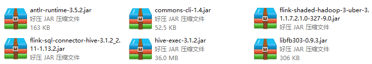


```ini
[root@node1 ~]# cd /export/server/flink-local/lib
[root@node1 lib]# rz
```

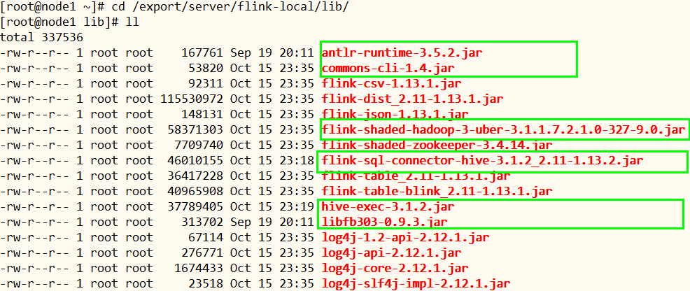


> 在重新启动Flink Cluster集群

```ini
[root@node1 ~]# export HADOOP_CLASSPATH=`hadoop classpath`
[root@node1 ~]# /export/server/flink-local/bin/start-cluster.sh 
```


- step3、启动SQL Client命令行

```ini
[root@node1 ~]# export HADOOP_CLASSPATH=`hadoop classpath`

[root@node1 ~]# /export/server/flink-local/bin/sql-client.sh embedded
# 设置配置参数
SET sql-client.execution.mode=batch;
SET parallism.default=1;
SET sql-client.execution.result-mode=tableau;
```


- step4、创建Catalog

```SQL
CREATE CATALOG hive_catalog WITH (
    'type' = 'hive',
    'default-database' = 'default',
    'hive-conf-dir' = '/export/server/hive/conf/',
    'hive-version' = '3.1.2',
    'hadoop-conf-dir' = '/export/server/hadoop/etc/hadoop/'
);

-- 使用创建的CATALOG
USE CATALOG hive_catalog;
```

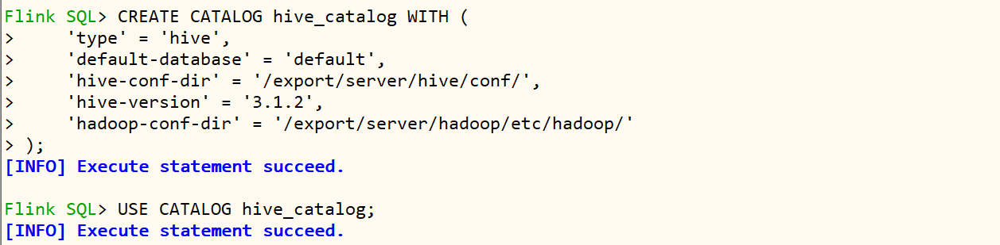


- step5、执行基本SQL语句

```SQL
-- 设置SQL 方言为：hive
Flink SQL> set table.sql-dialect=hive;

-- 显示当前数据库
Flink SQL> SHOW DATABASES ;
-- 显示表
Flink SQL> SHOW TABLES ;

-- 查询Hive表数据
Flink SQL> SELECT * FROM dept ;
```

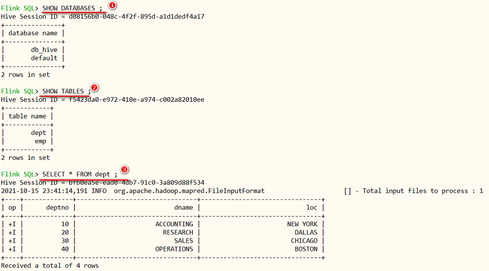


```SQL
--设置方言
 set table.sql-dialect=default;

-- 创建数据库
/*
CREATE DATABASE [IF NOT EXISTS] [catalog_name.]db_name
  [COMMENT database_comment]
  WITH (key1=val1, key2=val2, ...)
*/
CREATE DATABASE IF NOT EXISTS hive_catalog.db_flink_sql
COMMENT 'flink sql database';

-- 创建表
CREATE TABLE tbl_taobao_behavior (
  user_id STRING,
  item_id STRING,
  behavior_type INT,
  user_geohash STRING,
  item_catogry STRING,
  access_time STRING
) WITH (
  'connector' = 'filesystem',
  'path' = 'file:///root/tianchi_user.csv',
  'format' = 'csv',
  'csv.ignore-parse-errors' = 'true'
);
```


#### FlinkSQL Java

> 在Flink代码程序中，创建Catalog，与Hive集成。

- 添加相关依赖

```xml
<dependency>
    <groupId>org.apache.flink</groupId>
    <artifactId>flink-connector-hive_2.11</artifactId>
    <version>1.13.1</version>
</dependency>
<dependency>
    <groupId>org.apache.hive</groupId>
    <artifactId>hive-exec</artifactId>
    <version>3.1.2</version>
</dependency>
<dependency>
    <groupId>org.apache.hive</groupId>
    <artifactId>hive-metastore</artifactId>
    <version>3.1.2</version>
</dependency>
<dependency>
    <groupId>org.apache.thrift</groupId>
    <artifactId>libthrift</artifactId>
    <version>0.9.3</version>
</dependency>
```


- 配置文件：Hive和HDFS

---

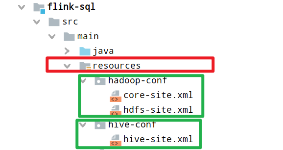


- 创建类：`SqlConnectorHiveSourceDemo`，与Hive集成，加载Hive表数据

---

```Java
package cn.itcast.flink.hive;

import org.apache.flink.table.api.EnvironmentSettings;
import org.apache.flink.table.api.TableEnvironment;
import org.apache.flink.table.catalog.hive.HiveCatalog;

/**
 * Flink SQL与Hive集成，创建HiveCatalog元数据对象，可以加载和读取数据
 * @author xuyuan
 */
public class SqlConnectorHiveSourceDemo {

    public static void main(String[] args) {

        // 1. 创建表执行环境
        EnvironmentSettings settings = EnvironmentSettings
            .newInstance()
            .inBatchMode()
            .useBlinkPlanner()
            .build();
        TableEnvironment tableEnv = TableEnvironment.create(settings);

        // 2. 创建HiveCatalog对象，传递配置参数
        HiveCatalog hiveCatalog = new HiveCatalog(
            "hiveCatalog",
            "default",
            "flink-sql/src/main/resources/hive-conf",
            "flink-sql/src/main/resources/hadoop-conf",
            "3.1.2"
        );
        // 注册Catalog
        tableEnv.registerCatalog("hive_catalog", hiveCatalog);
        // 使用Catalog
        tableEnv.useCatalog("hive_catalog");

        // 3. 编写DDL、DML和DQL依据
        tableEnv.executeSql("SHOW DATABASES").print();

        tableEnv.executeSql("SELECT * FROM db_hive.emp").print();
    }

}
```


### 03-[掌握]-Flink SQL函数之函数使用

---


> **面试题**：列举经常使用SQL函数（20+）？

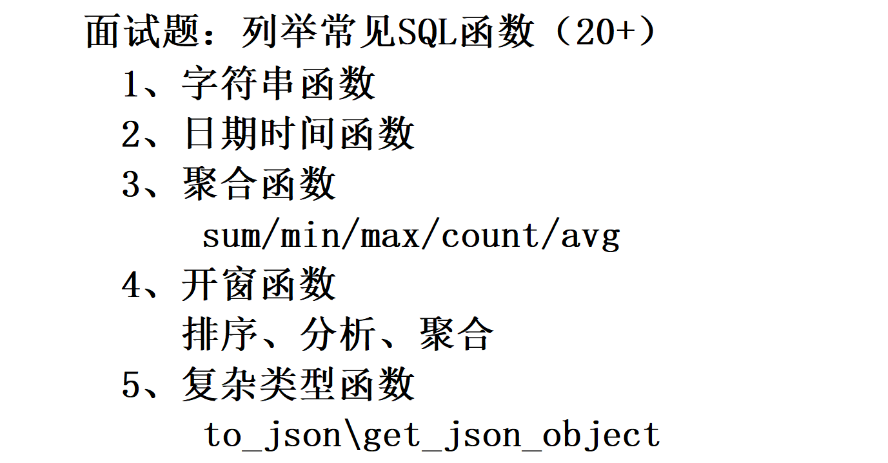


> 在实际项目开发中，如果使用Flink Table API &SQL进行数据分析（流计算或批处理），往往使用SQL最多

- 1）、SQL 文档：https://nightlies.apache.org/flink/flink-docs-release-1.13/docs/dev/table/sql/overview/
- 2）、函数文档：https://nightlies.apache.org/flink/flink-docs-release-1.13/docs/dev/table/functions/systemfunctions/

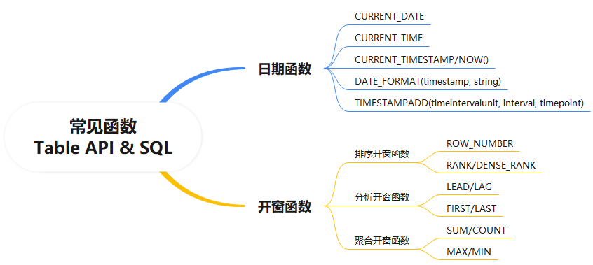

文档：https://nightlies.apache.org/flink/flink-docs-release-1.13/docs/dev/table/functions/systemfunctions/


> 启动本地集群和SQL Client客户端

```ini
# 启动Flink Local Cluster集群
[root@node1 ~]# export HADOOP_CLASSPATH=`hadoop classpath`
[root@node1 ~]# /export/server/flink-local/bin/start-cluster.sh 

# 启动SQL Client服务
[root@node1 ~]# /export/server/flink-local/bin/sql-client.sh 
SET sql-client.execution.result-mode=tableau;
SET execution.runtime-mode=batch;
```


#### 日期函数

---


> 常见日期函数使用：`NOW()、CURRENT_DATE、CURRENT_TIME和TIMESTAMPADD`。

```ini
# 设置SQL方言为defualt
Flink SQL> set table.sql-dialect=default ;

# 获取当前日期和时间
Flink SQL> SELECT NOW() AS now_day, CURRENT_DATE, CURRENT_TIME, CURRENT_TIMESTAMP ;
+-------------------------+--------------+--------------+-------------------------+
|                 now_day | CURRENT_DATE | CURRENT_TIME |       CURRENT_TIMESTAMP |
+-------------------------+--------------+--------------+-------------------------+
| 2021-10-16 04:43:16.661 |   2021-10-16 |     04:43:16 | 2021-10-16 04:43:16.661 |
+-------------------------+--------------+--------------+-------------------------+

# 日期时间格式化，字符串日期时间类型转换为指定格式类型
Flink SQL> SELECT DATE_FORMAT('2021-10-16 04:43:16.661', 'yyyyMMdd') AS date_str ;
+----------+
| date_str |
+----------+
| 20211016 |
+----------+
1 row in set

# 获取前一天、后一天日期
Flink SQL> SELECT 
   CURRENT_DATE AS now_day, 
   TIMESTAMPADD(DAY, 1, CURRENT_DATE) AS next_day,
   TIMESTAMPADD(DAY, -1, CURRENT_DATE) AS last_day ;
+------------+------------+------------+
|    now_day |   next_day |   last_day |
+------------+------------+------------+
| 2021-10-16 | 2021-10-17 | 2021-10-15 |
+------------+------------+------------+
  
  
  SELECT 
   CURRENT_DATE AS now_day, 
   TIMESTAMPADD(DAY, -10, CURRENT_DATE) AS last_day,
   TIMESTAMPDIFF(DAY, TIMESTAMPADD(DAY, -10, CURRENT_DATE), CURRENT_DATE) AS days;
```


#### 开窗函数

---


> 基本语法：`Function (arg1, ..., argn) OVER ([PARTITION BY <...>] [ORDER BY <...>] [<window_expression>])`
>
> - 第一部分：**函数Function**，指定函数名称和传递参数
> - 第二部分：**窗口Window**，指定窗口大小，数据范围，包含分组partitionby、排序orderby及ROWS或Range

https://nightlies.apache.org/flink/flink-docs-release-1.13/docs/dev/table/functions/systemfunctions/#aggregate-functions

​	Function (arg1,..., argn) 可以是下面的函数：

- Aggregate Functions：**聚合函数**,比如：sum(...)、 max(...)、min(...)、avg(...)等.
- Sort Functions：**排序函数**, 比如 ：rank(...)、row_number(...)等.
- Analytics Functions:：**分析函数**, 比如：lead(...)、lag(...)、 first_value(...)等.


> 环境准备：SQL Client客户端，与Hive集成。

```SQL
CREATE CATALOG hive_catalog WITH (
    'type' = 'hive',
    'default-database' = 'db_hive',
    'hive-conf-dir' = '/export/server/hive/conf/',
    'hive-version' = '3.1.2',
    'hadoop-conf-dir' = '/export/server/hadoop/etc/hadoop/'
);

-- 使用创建的CATALOG
USE CATALOG hive_catalog;

-- 设置SQL方言
set table.sql-dialect=hive;
```


```ini
# 使用数据库和查看表
Flink SQL> USE db_hive ;
Flink SQL> SHOW TABLES ;

# 查看dept表数据
Flink SQL> SELECT * FROM dept ;
+--------+------------+----------+
| deptno |      dname |      loc |
+--------+------------+----------+
|     10 | ACCOUNTING | NEW YORK |
|     20 |   RESEARCH |   DALLAS |
|     30 |      SALES |  CHICAGO |
|     40 | OPERATIONS |   BOSTON |
+--------+------------+----------+

# 查看emp表数据
Flink SQL> SELECT * FROM emp ;    
+-------+--------+-----------+--------+------------+--------+--------+--------+
| empno |  ename |       job |    mgr |   hiredate |    sal |   comm | deptno |
+-------+--------+-----------+--------+------------+--------+--------+--------+
|  7369 |  SMITH |     CLERK |   7902 | 1980-12-17 |  800.0 | (NULL) |     20 |
|  7499 |  ALLEN |  SALESMAN |   7698 |  1981-2-20 | 1600.0 |  300.0 |     30 |
|  7521 |   WARD |  SALESMAN |   7698 |  1981-2-22 | 1250.0 |  500.0 |     30 |
|  7566 |  JONES |   MANAGER |   7839 |   1981-4-2 | 2975.0 | (NULL) |     20 |
|  7654 | MARTIN |  SALESMAN |   7698 |  1981-9-28 | 1250.0 | 1400.0 |     30 |
|  7698 |  BLAKE |   MANAGER |   7839 |   1981-5-1 | 2850.0 | (NULL) |     30 |
|  7782 |  CLARK |   MANAGER |   7839 |   1981-6-9 | 2450.0 | (NULL) |     10 |
|  7788 |  SCOTT |   ANALYST |   7566 |  1987-4-19 | 3000.0 | (NULL) |     20 |
|  7839 |   KING | PRESIDENT | (NULL) | 1981-11-17 | 5000.0 | (NULL) |     10 |
|  7844 | TURNER |  SALESMAN |   7698 |   1981-9-8 | 1500.0 |    0.0 |     30 |
|  7876 |  ADAMS |     CLERK |   7788 |  1987-5-23 | 1100.0 | (NULL) |     20 |
|  7900 |  JAMES |     CLERK |   7698 |  1981-12-3 |  950.0 | (NULL) |     30 |
|  7902 |   FORD |   ANALYST |   7566 |  1981-12-3 | 3000.0 | (NULL) |     20 |
|  7934 | MILLER |     CLERK |   7782 |  1982-1-23 | 1300.0 | (NULL) |     10 |
+-------+--------+-----------+--------+------------+--------+--------+--------+

```


> 排序开窗函数：**各个部门工资最高的人员信息**，[排序开窗函数给每条数据添加一个字段，字段值属于序号。]()

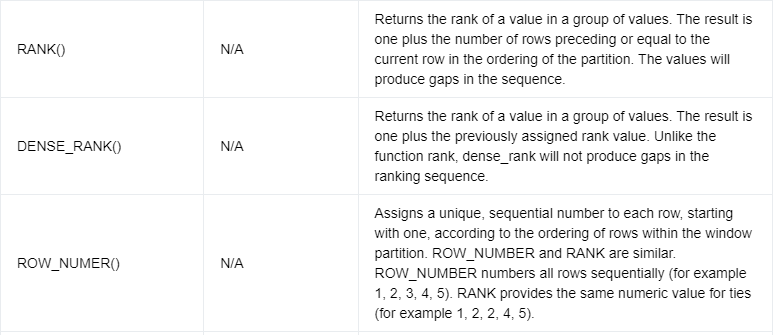

```SQL
-- 直接使用ROW_NUMBER
SELECT 
  empno, ename, sal, deptno, 
  ROW_NUMBER()OVER(PARTITION BY deptno ORDER BY sal DESC) AS rnk
FROM db_hive.emp;

-- 各部分工资最高
WITH tmp AS(
  SELECT 
    empno, ename, sal, deptno, 
    ROW_NUMBER()OVER(PARTITION BY deptno ORDER BY sal DESC) AS rnk
  FROM db_hive.emp
)
SELECT  empno, ename, sal, deptno FROM tmp WHERE rnk = 1 ;

-- 三个函数，比较
SELECT 
  empno, ename, sal, deptno, 
  ROW_NUMBER()OVER(PARTITION BY deptno ORDER BY sal DESC) AS rnk1, 
  RANK()OVER(PARTITION BY deptno ORDER BY sal DESC) AS rnk2, 
  DENSE_RANK()OVER(PARTITION BY deptno ORDER BY sal DESC) AS rnk3
FROM db_hive.emp;
```

[当需求分析中：按照某个字段分组，并且某个字段排序，获取TopN数据/BottomN数据，此时考虑开窗函数]()


> 分析开窗函数：`LEAD（向下）、LAG（向上）、FIRST_VALUE（第一）、LAST_VALUE（最后一个）`

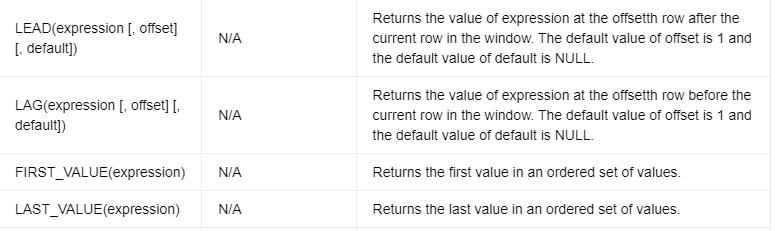

```SQL
-- lead和lag向下和向上函数使用
SELECT 
  empno, ename, sal, deptno, 
  ROW_NUMBER()OVER(PARTITION BY deptno ORDER BY sal DESC) AS rnk,
  LEAD(sal, 1, 0.0)OVER(PARTITION BY deptno ORDER BY sal DESC) AS down_value,
  LAG(sal, 1, 99999.99)OVER(PARTITION BY deptno ORDER BY sal DESC) AS up_value
FROM db_hive.emp;

-- first和last 第一个和最后一个函数使用
SELECT 
  empno, ename, sal, deptno, 
  ROW_NUMBER()OVER(PARTITION BY deptno ORDER BY sal DESC) AS rnk,
  FIRST_VALUE(sal)OVER(PARTITION BY deptno ORDER BY sal DESC) AS first_value,
  LAST_VALUE(sal)OVER(PARTITION BY deptno ORDER BY sal DESC) AS last_value
FROM db_hive.emp;
```


> **聚合开窗函数**：在普通聚合函数上，使用OVER语句，加上窗口设置。
>
> ​											[五大聚合函数：COUNT、SUM、AVG、MIN、MAX]()

```SQL
SELECT 
  empno, ename, sal, deptno, 
  ROW_NUMBER()OVER(PARTITION BY deptno ORDER BY sal DESC) AS rnk,
  COUNT(1) OVER (PARTITION BY deptno ORDER BY sal DESC) AS total_cnt,
  SUM(sal) OVER (PARTITION BY deptno ORDER BY sal DESC) AS total_sum
FROM db_hive.emp;

```

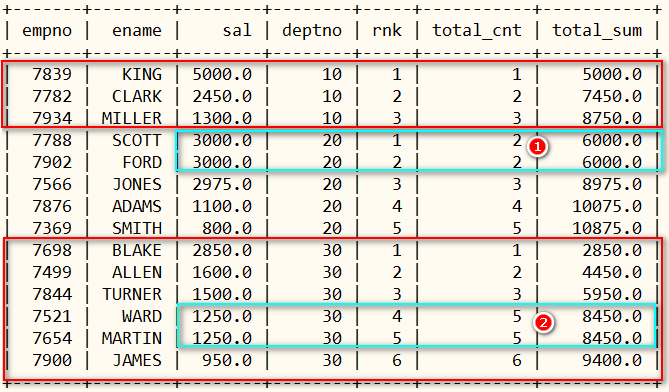


> 在开窗函数中，可以设置窗口范围Window：
>
> - 方式一：物理上设置【行数】，`ROWS BETWEEN ... AND ....`
> - 方式二：逻辑上设置【值】，`RANGE BETWEEN ... AND ....`
>
> [窗口范围几个关键词：CUREENT ROW、向前PRECEDING，向后FOLLOWING，没有界限：UNBOUNDED]()

```SQL
SELECT 
  empno, ename, sal, deptno, 
  ROW_NUMBER()OVER(PARTITION BY deptno ORDER BY sal DESC) AS rnk,
  SUM(sal) OVER (PARTITION BY deptno ORDER BY sal DESC ROWS BETWEEN UNBOUNDED PRECEDING AND CURRENT ROW) AS row_sum, 
  SUM(sal) OVER (PARTITION BY deptno ORDER BY sal DESC RANGE BETWEEN UNBOUNDED PRECEDING AND CURRENT ROW) AS range_sum
FROM db_hive.emp;
```

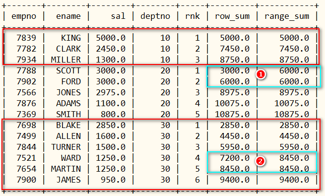


 


### 04-[掌握]-Flink SQL函数之Group Windows

---


> 在Table API & SQL中，有两种窗口：**Group Windows和Over Windows**


> 分组窗口（**GROUP WINDOWS**）

- Group Windows 是使用 **window（w：GroupWindow）**子句定义的，并且**必须由as子句指定一个别名**。
- 为了按窗口对表进行分组，**窗口的别名必须在 group by 子句**中，像常规的分组字段一样引用
- Table API 提供一组具有特定语义的预定义 Window 类，会被转换为底层 DataStream 或 DataSet 的窗口操作
- 目前支持分组窗口：**滚动窗口（Tumble ）、滑动窗口（Hop）**、会话窗口（Session）。

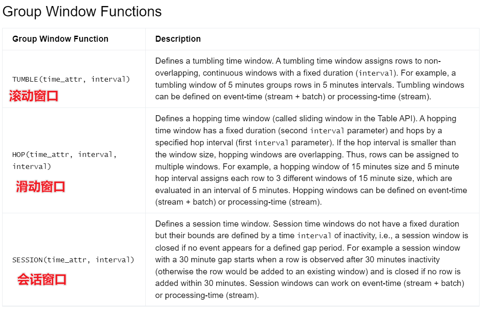


- 文档：https://nightlies.apache.org/flink/flink-docs-release-1.13/docs/dev/table/sql/queries/window-agg/#group-window-aggregation

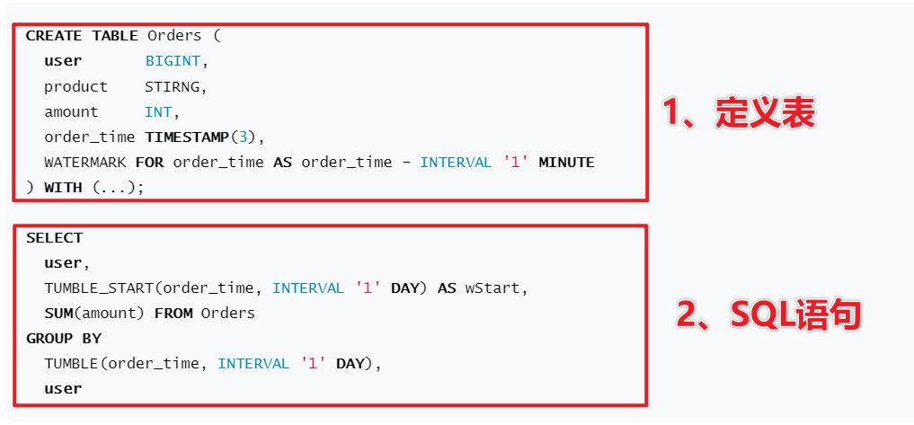


#### 创建表

---


> 从**Socket**实时消费数据，进行实时卡口流量统计，数据格式：`2021-10-01 10:00:02,a,10 `
>


- 拷贝Socket Jar包至`$FLINK_HOME/lib`目录，启动集群和SQL Client。

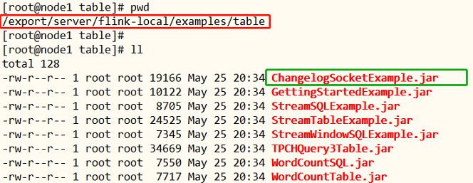


```ini
# 拷贝jar包
[root@node1 ~]# cp /export/server/flink-local/examples/table/ChangelogSocketExample.jar /export/server/flink-local/lib

# 启动Flink Local Cluster集群
[root@node1 ~]# export HADOOP_CLASSPATH=`hadoop classpath`
[root@node1 ~]# /export/server/flink-local/bin/stop-cluster.sh 
[root@node1 ~]# /export/server/flink-local/bin/start-cluster.sh 

# 启动SQL Client服务
[root@node1 ~]# /export/server/flink-local/bin/sql-client.sh 
SET sql-client.execution.result-mode=tableau;
SET execution.runtime-mode=streaming;
```


终端terminal开启netcat

```ini
[root@node1 ~]# nc -lk 9999
```


创建表：`tbl_road_records`，测试查询表数据

```SQL
-- 创建表，映射到Socket
CREATE TABLE tbl_road_records (
  record_time TIMESTAMP(3),
  road_id STRING,
  record_count INT,
  WATERMARK FOR record_time AS record_time - INTERVAL '0' SECOND
) WITH (
  'connector' = 'socket',
  'hostname' = 'node1.itcast.cn',
  'port' = '9999', 
  'format' = 'csv',
  'csv.ignore-parse-errors' = 'true'
);

-- 查询表数据
SELECT * FROM tbl_road_records ;     
```

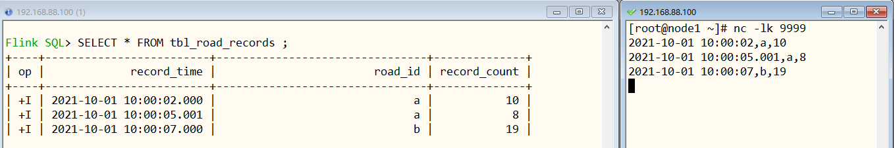


```ini
# 测试数据
2021-10-01 10:00:02,a,10
2021-10-01 10:00:04,a,10
2021-10-01 10:00:05,a,10
2021-10-01 10:00:07,a,10
2021-10-01 10:00:08.100,a,10
2021-10-01 10:00:10,a,10
```


#### 滚动窗口SQL分析

---

​		设置窗口大小size：**5秒**，滑动间隔slide：**5秒**  -- [滚动窗口]()

```SQL
SELECT
  TUMBLE_START(record_time, INTERVAL '5' SECOND) AS win_start,
  TUMBLE_END(record_time, INTERVAL '5' SECOND) AS win_end,
  road_id, 
  SUM(record_count) AS total
FROM 
  tbl_road_records
GROUP BY
  TUMBLE(record_time, INTERVAL '5' SECOND), road_id ;
```


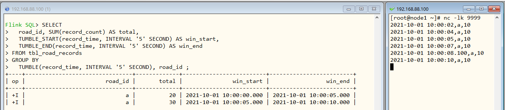


```SQL
SELECT
  TUMBLE_START(record_time, INTERVAL '5' SECOND) AS win_start,
  TUMBLE_END(record_time, INTERVAL '5' SECOND) AS win_end,
  TUMBLE_ROWTIME(record_time, INTERVAL '5' SECOND) AS rt,
  road_id, 
  SUM(record_count) AS total
FROM 
  tbl_road_records
GROUP BY
  TUMBLE(record_time, INTERVAL '5' SECOND), road_id ;
```

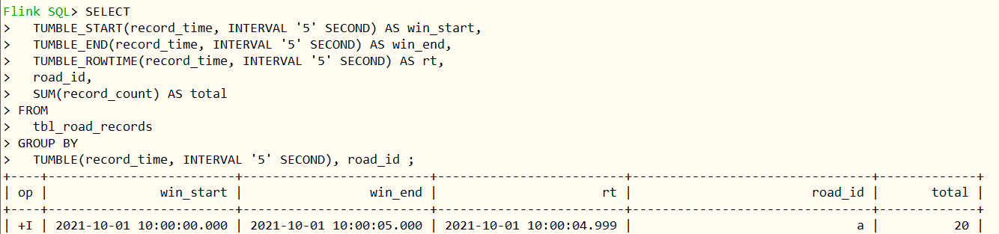


#### 滚动窗口Table API分析

---

​	使用Table API从Socket消费数据，基于事件时间滚动窗口进行聚合计算。

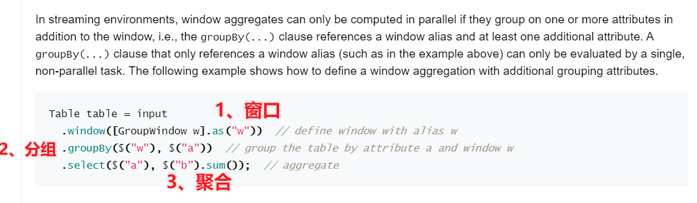


其中窗口设置：

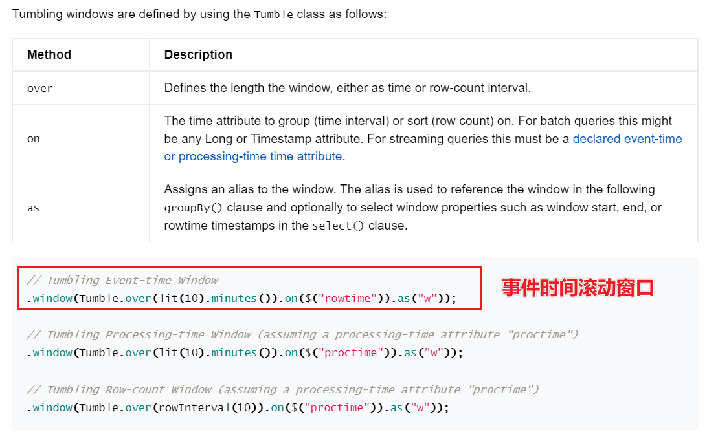


添加Maven依赖，从Socket消费数据

```xml
        <dependency>
            <groupId>org.apache.flink</groupId>
            <artifactId>flink-table-api-java-bridge_2.11</artifactId>
            <version>1.13.1</version>
        </dependency>
        <dependency>
            <groupId>org.apache.flink</groupId>
            <artifactId>flink-table-planner-blink_2.11</artifactId>
            <version>1.13.1</version>
        </dependency>
        <dependency>
            <groupId>org.apache.flink</groupId>
            <artifactId>flink-table-common</artifactId>
            <version>1.13.1</version>
        </dependency>

        <dependency>
            <groupId>org.apache.flink</groupId>
            <artifactId>flink-examples-table_2.11</artifactId>
            <version>1.13.1</version>
        </dependency>
```


> 案例演示代码如下：
>

```Java
package cn.itcast.flink.sql;

import org.apache.flink.table.api.EnvironmentSettings;
import org.apache.flink.table.api.Table;
import org.apache.flink.table.api.TableEnvironment;
import org.apache.flink.table.api.Tumble;
import static org.apache.flink.table.api.Expressions.*;

/**
 * 从Socket实时消费数据，进行卡口流量实时统计，将结果打印大控制台
 */
public class GroupWindowTableApiDemo {

	public static void main(String[] args) {
		// 1. 表的执行环境
		EnvironmentSettings settings = EnvironmentSettings
			.newInstance()
			.inStreamingMode()
			.build();
		TableEnvironment tableEnv = TableEnvironment.create(settings) ;

		// 2. 数据源，创建inputTable
		tableEnv.executeSql(
			"CREATE TABLE tbl_road_records (" +
				"  record_time TIMESTAMP(3)," +
				"  road_id STRING," +
				"  record_count INT," +
				"  WATERMARK FOR record_time AS record_time - INTERVAL '0' SECOND" +
				") WITH (" +
				"  'connector' = 'socket'," +
				"  'hostname' = 'node1.itcast.cn'," +
				"  'port' = '9999'," +
				"  'format' = 'csv'," +
				"  'csv.ignore-parse-errors' = 'true'" +
				")"
		);

		// 3. 编写Table API分析数据：基于事件时间滚动窗口，size=5秒
		Table resultTable = tableEnv
			// a. 执行表名称
			.from("tbl_road_records")
			// b. 设置滚动窗口
			.window(
				Tumble.over(lit(5).seconds()).on($("record_time")).as("win")
			)
			// c.分组，先窗口，再业务字段
			.groupBy(
				$("win"), $("road_id")
			)
			// d. 选择字段和使用聚合函数聚合数据
			.select(
				$("win").start().as("win_start"),
				$("win").end().as("win_end"),
				$("road_id"),
				$("record_count").sum().as("total")
			);

		// 4. 执行计算，结果打印控制台
		resultTable.execute().print();
	}

}
```


#### 表值函数(TVF)

---


> ​			**表值函数(table-valued function, TVF)**，顾名思义就是指==返回值是一张表的函数==，在Oracle、SQL Server等数据库中屡见不鲜。
>
> ​		[在Flink1.13 稳定版本中，社区通过FLIP-145提出了窗口表值函数(window TVF)的实现，用于替代旧版的窗口分组(grouped window)语法。]()

文档：https://nightlies.apache.org/flink/flink-docs-release-1.13/docs/dev/table/sql/queries/window-tvf/


##### 滚动窗口TumblingWindow

---

> 以滚动窗口`TumblingWindow`为例，首先查看官方案例：

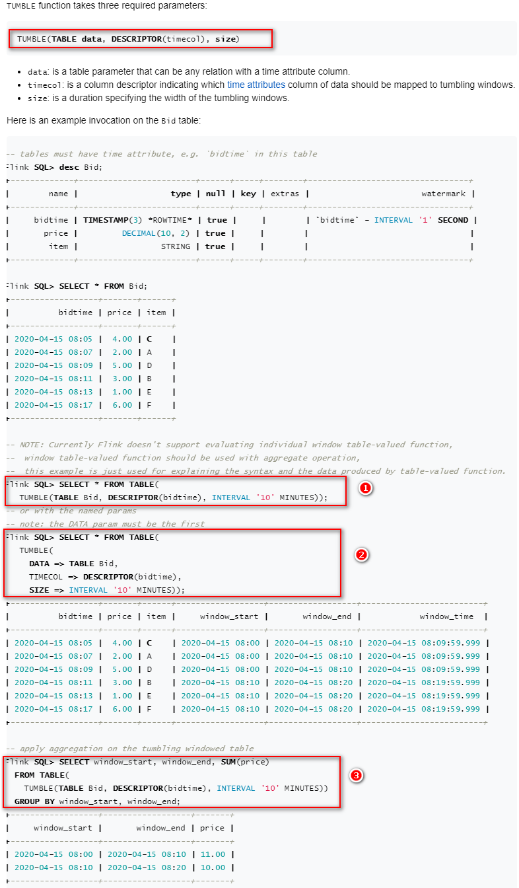


```SQL
-- 首先，使用表值函数：基于事件时间的滚动窗口
SELECT * FROM TABLE(
   TUMBLE(TABLE tbl_road_records, DESCRIPTOR(record_time), INTERVAL '5' SECONDS)
);


SELECT * FROM TABLE(
    TUMBLE(
        DATA => TABLE tbl_road_records,
        TIMECOL => DESCRIPTOR(record_time),
        SIZE => INTERVAL '5' SECONDS
    )
);
```


```SQL
-- -- 对表值函数返回值：表，进行分组（先窗口，再业务字段），继续聚合操作
SELECT 
  window_start, window_end, road_id, SUM(record_count) AS total
FROM TABLE(
   TUMBLE(
     DATA => TABLE tbl_road_records,
     TIMECOL => DESCRIPTOR(record_time),
     SIZE => INTERVAL '5' SECONDS
  )
)
GROUP BY window_start, window_end, road_id;


-- 测试数据
2021-10-01 10:00:02,a,10
2021-10-01 10:00:04,a,10
2021-10-01 10:00:05,a,10
2021-10-01 10:00:07,a,10
2021-10-01 10:00:08.100,a,10
2021-10-01 10:00:10,a,10
```

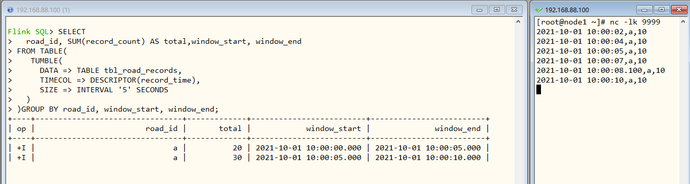


##### 累计窗口Cumulating Window

---

> 累计窗口**Cumulating windows**，在实际业务场景中经常被使用，窗口中数据每隔多久触发计算一下。

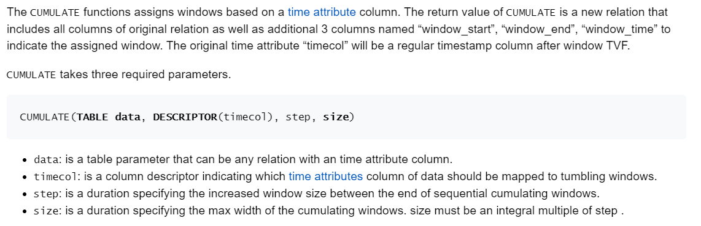


```SQL
SELECT 
  window_start, window_end, road_id, SUM(record_count) AS total
FROM TABLE(
   CUMULATE(
     DATA => TABLE tbl_road_records,
     TIMECOL => DESCRIPTOR(record_time),
     STEP => INTERVAL '1' SECONDS,
     SIZE => INTERVAL '5' SECONDS
  )
)
GROUP BY window_start, window_end, road_id; 

-- 测试数据
2021-10-01 10:00:02,a,10
2021-10-01 10:00:04,a,10
2021-10-01 10:00:05,a,10
2021-10-01 10:00:07,a,10
2021-10-01 10:00:08.100,a,10
2021-10-01 10:00:10,a,10
```

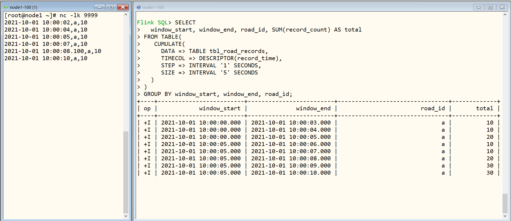


## 第二部分：Flink CDC【3个小节】


> ​			**CDC Connectors for Apache Flink®** is a set of source connectors for [Apache Flink®](https://flink.apache.org/), ingesting changes from different databases using change data capture (CDC). 

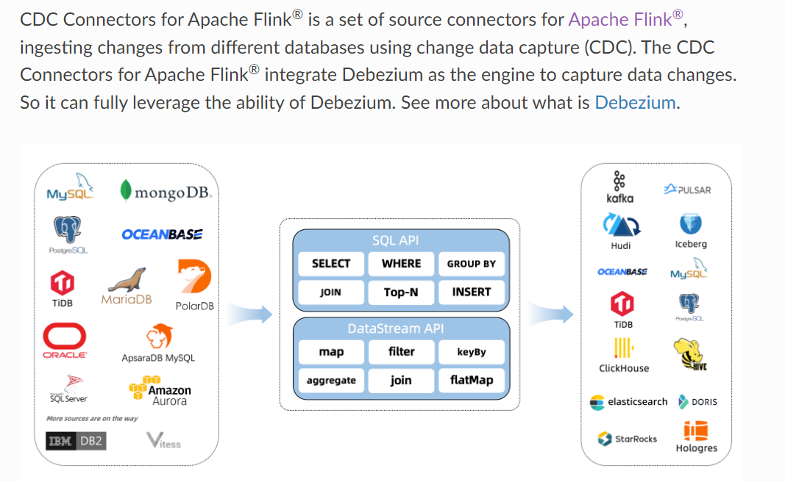


### 05-[掌握]-Flink CDC之基本概念及应用场景

------


> ​		Flink 1.11 引入了 **Flink CDC**，Flink社区开发 `flink-cdc-connectors` 组件，可以直接从 MySQL、PostgreSQL 等数据库[直接]()读取[全量数据和增量变更数据]()的 source 组件。


官网地址：https://github.com/ververica/flink-cdc-connectors


#### CDC 概念

---

> ​			[CDC：Change Data Capture]()，变更数据获取的简称，使用CDC可以**从数据库中获取已提交的更改并将这些更改发送到下游，供下游使用**，这些变更可以包括**INSERT、DELETE、UPDATE**等。

​								[业界主要有基于==查询==的 CDC 和基于==日志==的 CDC ，可以从下面表格对比他们功能和差异点。]()

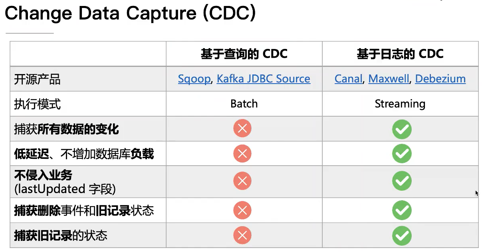


#### Flink CDC

---

> ​		案例背景：**基于日志的 CDC**，==采集业务库数据存储在 MySQL 数据库，通过 Debezium或Canal 把 MySQL Binlog 进行采集后发送至 Kafka 消息队列，然后对接一些实时计算引擎Flink 进行消费后，把数据传输入 OLAP 系统或者其他存储介质。==

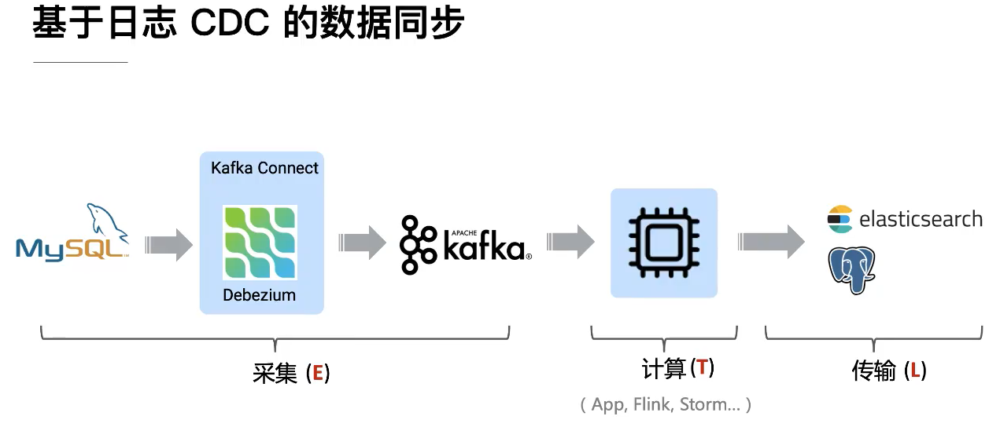


> ​		上述架构有个缺点，可以看到**采集端组件过多导致维护繁杂**，这时候就会想是否可以用 Flink SQL 直接对接 MySQL 的 binlog 数据呢，有没可以替代的方案呢？
>

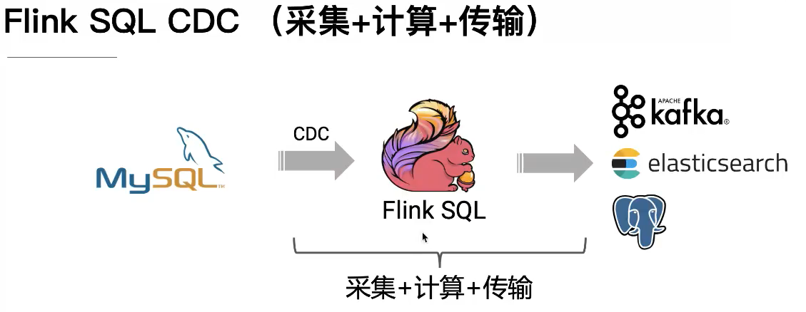


> ​		社区开发了 `flink-cdc-connectors` 组件，这是一个可以直接从 MySQL、PostgreSQL 等数据库直接读取**全量数据和增量变更数据**的 source 组件。
>
> - 1）如果第1次监控数据库表的数据，直接全量加载
> - 2）不是第一次监控数据库表的数据，流式的增量加载变更数据

​		`flink-cdc-connectors` 可以用来替换 Debezium+Kafka 的数据采集模块，从而实现 [Flink SQL 采集+计算+传输（ETL）一体化]()，有如下优点：

- 开箱即用，简单易上手
- 减少维护的组件，简化实时链路，减轻部署成本
- 减小端到端延迟
- Flink 自身支持 Exactly Once 的读取和计算
- 数据不落地，减少存储成本
- 支持全量和增量流式读取
- binlog 采集位点可回溯

> 文档：https://ververica.github.io/flink-cdc-connectors/master/content/about.html
>


#### 案例场景

---

> **案例1：Flink SQL CDC + JDBC Connector**

​		此案例通过订阅我们订单表（事实表）数据，通过 Debezium 将 MySQL Binlog 发送至 Kafka，通过维表 Join 和 ETL 操作把结果输出至下游的 PG 数据库。

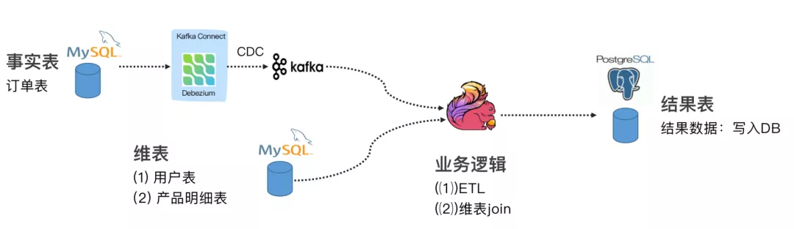

B 站资源：https://www.bilibili.com/video/BV1bp4y1q78d


> **案例2：CDC Streaming ETL**

​		模拟电商公司的订单表和物流表，需要对订单数据进行统计分析，对于不同的信息需要进行关联后续形成订单的大宽表后，交给下游的业务方使用 ES 做数据分析，这个案例演示了如何只依赖 Flink 不依赖其他组件，借助 Flink 强大的计算能力实时把 Binlog 的数据流关联一次并同步至 ES 。


视频链接：https://www.bilibili.com/video/BV1zt4y1D7kt


> **案例3：Streaming Changes to Kafka**

对 GMV 进行天级别的全站统计。包含插入/更新/删除，只有付款的订单才能计算进入 GMV ，观察 GMV 值的变化。


视频链接：https://www.bilibili.com/video/BV1zt4y1D7kt


### 06-[掌握]-Flink CDC之案例演示【基于DataStream】

---


>  从MySQL数据库实时捕获表数据变化，获取数据进行实时处理，示意图如下：
>


#### 配置MySQL binlog

---

- 修改配置，添加配置

  ```ini
  [root@node1 ~]# vim /etc/my.cnf
  # 在[mysqld]下面增加内容
  log-bin=mysql-bin
  binlog-format=ROW
  server-id=1
  ```

  

- 重启服务

  ```ini
  [root@node1 ~]# systemctl restart mysqld
  ```

  

- 登录MySQL Client客户端，显示配置

  ```ini
  [root@node1 ~]# mysql -uroot -p123456
  mysql> show variables like '%log_bin%';
  ```

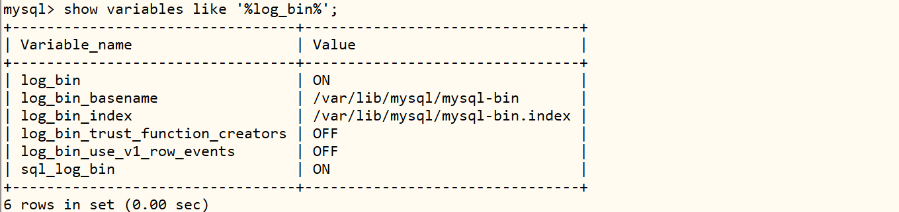


- 查看MySQL数据库数据存储目录

```shell
ll /var/lib/mysql
```

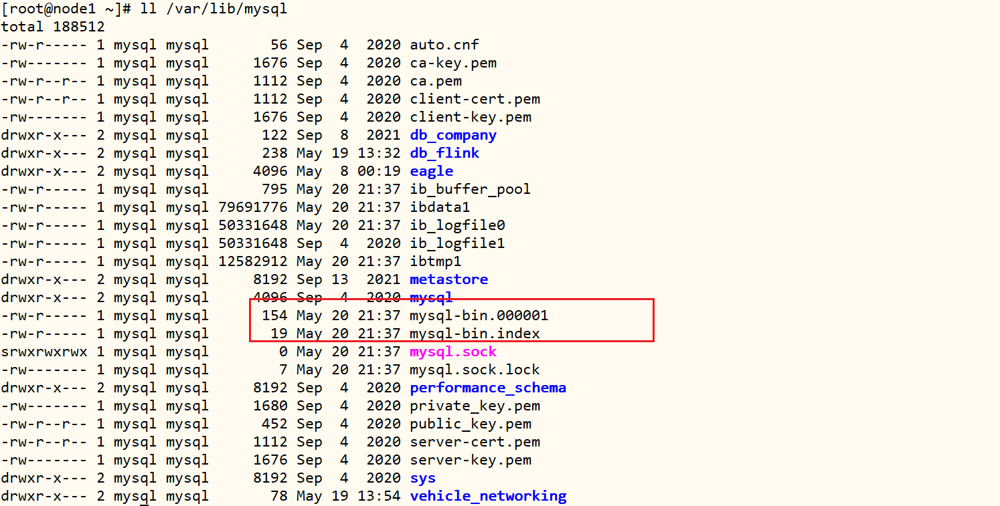


#### MySQL创建数据库和表

---

```SQL
-- 创建数据库
CREATE DATABASE IF NOT EXISTS db_flink ;

-- 创建表
DROP TABLE IF EXISTS db_flink.tbl_users;
CREATE TABLE IF NOT EXISTS db_flink.tbl_users (
id int NOT NULL,
name varchar(45) NOT NULL,
age int ,
gender varchar(10),
PRIMARY KEY (id)
) ENGINE=InnoDB DEFAULT CHARSET=utf8;

-- 插入数据，模拟数据
USE db_flink ;
INSERT INTO tbl_users(id, name, age, gender) VALUES (1001, 'zhangsan', 24, 'male');
INSERT INTO tbl_users(id, name, age, gender) VALUES (1002, 'lisi', 22, 'male');
INSERT INTO tbl_users(id, name, age, gender) VALUES (1003, 'wangwu', 23, 'female');
INSERT INTO tbl_users(id, name, age, gender) VALUES (1004, 'zhaoliu', 23, 'female');

INSERT INTO tbl_users(id, name, age, gender) VALUES (1005, 'tianqi', 24, 'male');
INSERT INTO tbl_users(id, name, age, gender) VALUES (1006, 'liuba', 22, 'male'); 
INSERT INTO tbl_users(id, name, age, gender) VALUES (1007, 'qianjiu', 25, 'female'); 
```


#### 添加Maven依赖

---

​			使用IDEA创建Maven Project或Maven Module，添加依赖，此处使用flink-cdc版本：`2.1.0`。

```xml
        <dependency>
            <groupId>com.ververica</groupId>
            <artifactId>flink-connector-mysql-cdc</artifactId>
            <version>2.1.0</version>
        </dependency>
```


#### 基于DataStream实现

---

​		基于DataStream实现Flink CDC案例演示：从MySQL数据库实时获取数据，打印控制台

```Java
package cn.itcast.flink.cdc;

import com.ververica.cdc.connectors.mysql.source.MySqlSource;
import com.ververica.cdc.connectors.mysql.table.StartupOptions;
import com.ververica.cdc.debezium.JsonDebeziumDeserializationSchema;
import org.apache.flink.api.common.eventtime.WatermarkStrategy;
import org.apache.flink.streaming.api.datastream.DataStreamSource;
import org.apache.flink.streaming.api.environment.StreamExecutionEnvironment;

/**
 * 基于DataStream实现Flink CDC案例演示：从MySQL数据库实时获取数据，打印控制台。
 * @author xuyuan
 */
public class FlinkCdcDataStreamDemo {

    public static void main(String[] args) throws Exception {
        // 1. 执行环境-env
        StreamExecutionEnvironment env = StreamExecutionEnvironment
            .getExecutionEnvironment();
        env.enableCheckpointing(3000);
        env.setParallelism(1);

        // 2. 数据源-source
        // 2-1. MySQL-CDC-Source
        MySqlSource<String> mySqlSource = MySqlSource.<String>builder()
            .hostname("node1.itcast.cn")
            .port(3306)
            .databaseList("db_flink") // set captured database
            .tableList("db_flink.tbl_users") // set captured table
            .username("root")
            .password("123456")
            // 表示第1次读取表中数据，先全量加载，后增量加载
            .startupOptions(StartupOptions.initial()) 
            // converts SourceRecord to JSON String
            .deserializer(new JsonDebeziumDeserializationSchema()) 
            .build();
        // 2-2. 添加数据源
        DataStreamSource<String> logStream = env.fromSource(
            mySqlSource, WatermarkStrategy.noWatermarks(), "mysql-cdc-source"
        );

        // 3. 数据转换-transformation

        // 4. 数据终端-sink
        logStream.printToErr();

        // 5. 触发执行-execute
        env.execute("FlinkCDDataStreamDemo");
    }

}  
```

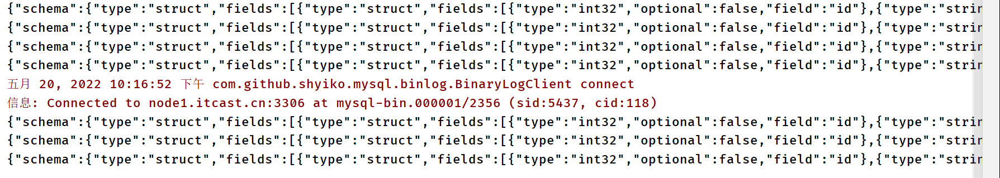

```JSON
{"schema":{"type":"struct","fields":[{"type":"struct","fields":[{"type":"int32","optional":false,"field":"id"},{"type":"string","optional":false,"field":"name"},{"type":"int32","optional":true,"field":"age"},{"type":"string","optional":true,"field":"gender"}],"optional":true,"name":"mysql_binlog_source.db_flink.tbl_users.Value","field":"before"},{"type":"struct","fields":[{"type":"int32","optional":false,"field":"id"},{"type":"string","optional":false,"field":"name"},{"type":"int32","optional":true,"field":"age"},{"type":"string","optional":true,"field":"gender"}],"optional":true,"name":"mysql_binlog_source.db_flink.tbl_users.Value","field":"after"},{"type":"struct","fields":[{"type":"string","optional":false,"field":"version"},{"type":"string","optional":false,"field":"connector"},{"type":"string","optional":false,"field":"name"},{"type":"int64","optional":false,"field":"ts_ms"},{"type":"string","optional":true,"name":"io.debezium.data.Enum","version":1,"parameters":{"allowed":"true,last,false"},"default":"false","field":"snapshot"},{"type":"string","optional":false,"field":"db"},{"type":"string","optional":true,"field":"sequence"},{"type":"string","optional":true,"field":"table"},{"type":"int64","optional":false,"field":"server_id"},{"type":"string","optional":true,"field":"gtid"},{"type":"string","optional":false,"field":"file"},{"type":"int64","optional":false,"field":"pos"},{"type":"int32","optional":false,"field":"row"},{"type":"int64","optional":true,"field":"thread"},{"type":"string","optional":true,"field":"query"}],"optional":false,"name":"io.debezium.connector.mysql.Source","field":"source"},{"type":"string","optional":false,"field":"op"},{"type":"int64","optional":true,"field":"ts_ms"},{"type":"struct","fields":[{"type":"string","optional":false,"field":"id"},{"type":"int64","optional":false,"field":"total_order"},{"type":"int64","optional":false,"field":"data_collection_order"}],"optional":true,"field":"transaction"}],"optional":false,"name":"mysql_binlog_source.db_flink.tbl_users.Envelope"},"payload":{"before":null,"after":{"id":1005,"name":"tianqi","age":24,"gender":"male"},"source":{"version":"1.5.4.Final","connector":"mysql","name":"mysql_binlog_source","ts_ms":1653056227000,"snapshot":"false","db":"db_flink","sequence":null,"table":"tbl_users","server_id":1,"gtid":null,"file":"mysql-bin.000001","pos":2560,"row":0,"thread":null,"query":null},"op":"c","ts_ms":1653056227922,"transaction":null}}
```


### 07-[掌握]-Flink CDC之案例演示【基于SQL】

---


> ​	基于Flink SQL实现Flink CDC案例演示：从MySQL数据库实时获取数据，打印控制台。
>

```Java
package cn.itcast.flink.cdc;

import org.apache.flink.streaming.api.environment.StreamExecutionEnvironment;
import org.apache.flink.table.api.EnvironmentSettings;
import org.apache.flink.table.api.TableResult;
import org.apache.flink.table.api.bridge.java.StreamTableEnvironment;

/**
 * 基于Flink SQL实现Flink CDC案例演示：从MySQL数据库实时呼气数据，打印控制台
 * @author xuyuan
 */
public class FlinkCdcSqlDemo {

    public static void main(String[] args) {
        // 1. 获取表执行环境
        StreamExecutionEnvironment env = StreamExecutionEnvironment
            .getExecutionEnvironment();
        env.enableCheckpointing(3000);
        env.setParallelism(1);

        EnvironmentSettings settings = EnvironmentSettings
            .newInstance()
            .inStreamingMode()
            .useBlinkPlanner()
            .build();
        StreamTableEnvironment tableEnv = StreamTableEnvironment.create(env, settings);

        // 2. 创建输入表，todo：使用CDC-SQL-MySQL获取数据
        tableEnv.executeSql(
            "CREATE TABLE mysql_binlog (\n" +
                " id INT,\n" +
                " name STRING,\n" +
                " age INT,\n" +
                " gender STRING,\n" +
                " PRIMARY KEY(id) NOT ENFORCED\n" +
                ") WITH (\n" +
                " 'connector' = 'mysql-cdc',\n" +
                " 'hostname' = 'node1.itcast.cn',\n" +
                " 'port' = '3306',\n" +
                " 'username' = 'root',\n" +
                " 'password' = '123456',\n" +
                " 'database-name' = 'db_flink',\n" +
                " 'table-name' = 'tbl_users',\n" +
                " 'scan.startup.mode' = 'initial'\n" +
                ")"
        );

        // 3. 查询数据
        TableResult tableResult = tableEnv
            .executeSql("SELECT id, name, age, gender FROM mysql_binlog");

        // 4. 打印控制台
        tableResult.print();
    }

}
```


> ​			**Flink SQL Client 实现**：启动Flink Standalone集群（本地集群），运行Flink SQL Client客户端，执行DDL和DML语句，实时获取MySQL表中变化的数据。

- 将`flink-sql-connector-mysql-cdc-2.1.0.jar`和`mysql-connector-java-8.0.16.jar`放入`$FLINK_HOME/lib`目录下

  

```shell
# 设置CLASSPATH路径
export HADOOP_CLASSPATH=`/export/server/hadoop/bin/hadoop classpath`

# 停止集群
/export/server/flink-local/bin/stop-cluster.sh 
# 启动集群
/export/server/flink-local/bin/start-cluster.sh
```


- 启动SQL Client客户端

```shell
# 启动SQL Client
/export/server/flink-local/bin/sql-client.sh embedded shell

# 基本设置
set sql-client.execution.result-mode=tableau;
set execution.checkpointing.interval=3sec;
```


- 创建表，映射到MySQL中，connector为：`mysql-cdc`

```SQL
CREATE TABLE user_info_mysql(
  id INT,
  name STRING,
  age INT,
  gender STRING,
  primary key(id) NOT ENFORCED
)
WITH(
  'connector' = 'mysql-cdc',
  'hostname' = 'node1.itcast.cn',
  'port' = '3306',
  'username' = 'root',
  'password' = '123456',
  'database-name' = 'db_flink',
  'table-name' = 'tbl_users',
  'scan.startup.mode' = 'initial' 
) ;
```


- 查询表数据，编写SQL语句

```SQL
SELECT id, name, age, gender FROM user_info_mysql ;
```


## 第三部分：实时综合案例【2个小节】


 				在陌陌中，每天都有数千万的用户进行聊天, 陌陌公司目前想要对这些聊天记录进行存储, 同时还需要对每天的消息量进行实时统计分析, 请您来设计如何实现数据的存储以及实时的数据统计分析工作。


> 陌陌综合案例，业务数据流程图：陌陌用户聊天数据实时存储到日志log文件中。

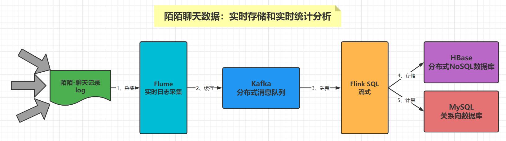


### 08-[掌握]-实时综合案例之Flume 数据采集Kafka

---


> 用户聊天数据以文本格式存储日志文件中，包含20个字段，下图所示：


> 样本数据：


上述数据各个字段之间分割符号为：**\001**


#### 数据生成

---

> ​		本次案例，直接提供专门用于生产陌陌社交消息数据的工具，可以直接部署在业务端进行数据生成即可，接下来部署用于生产数据的工具jar包。

- 创建原始文件目录

  ```ini
  mkdir -p /export/data/momo_init
  ```

  

- 上传模拟数据程序

  ```ini
  cd /export/data/momo_init
  rz
  ```

  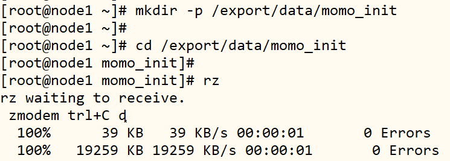

  

- 创建模拟数据目录

  ```ini
  mkdir -p /export/data/momo_data
  ```

  

- 运行程序生成数据

  ```ini
  # 1. 语法
  java -jar /export/data/momo_init/MoMo_DataGen.jar 原始数据路径 模拟数据路径 随机产生数据间隔ms时间
    	
  # 2. 测试：每500ms生成一条数据
  java -jar /export/data/momo_init/MoMo_DataGen.jar \
  /export/data/momo_init/MoMo_Data.xlsx \
  /export/data/momo_data \
  500
  
  # 3. 结果
  生成模拟数据文件MOMO_DATA.dat，并且每条数据中字段分隔符为\001
  ```


#### Flume 安装部署

----

- 上传安装包

  ```ini
  cd /export/software/
  rz
  ```

  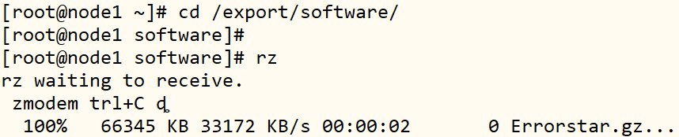

  

- 解压安装

  ```shell
  tar -zxf apache-flume-1.9.0-bin.tar.gz -C /export/server/
  
  cd /export/server
  mv apache-flume-1.9.0-bin flume-1.9.0-bin
  ln -s flume-1.9.0-bin flume
  ```

  

- 修改配置

  ```shell
  #集成HDFS，拷贝HDFS配置文件
  cp /export/server/hadoop/etc/hadoop/core-site.xml /export/server/hadoop/etc/hadoop/hdfs-site.xml /export/server/flume/conf/
  
  #修改Flume环境变量
  cd /export/server/flume/conf/
  mv flume-env.sh.template flume-env.sh
  vim flume-env.sh 
      #修改22行
      export JAVA_HOME=/export/server/jdk
    #修改34行
      export HADOOP_HOME=/export/server/hadoop
  ```
  
  
  
- 删除Flume自带的guava包，替换成Hadoop的

  ```ini
  cd /export/server/flume
  rm -rf lib/guava-11.0.2.jar
  cp /export/server/hadoop/share/hadoop/common/lib/guava-27.0-jre.jar lib/
  ```


#### 实时采集日志

---

> 采集聊天数据，实时写入Kafka：

- **Source**：`taildir`，动态监听多个文件实现实时数据采集；
- **Channel**：`mem`，将数据缓存在内存；
- **Sink**：`KafkaSink`，分布式消息队列


程序开发，Flume Agent属性配置文件：`momo_mem_kafka.properties`，内容如下：

```shell
mkdir -p /export/data/momo_conf
vim /export/data/momo_conf/momo_mem_kafka.properties
```


```properties
# define a1
a1.sources = s1 
a1.channels = c1
a1.sinks = k1

#define s1
a1.sources.s1.type = TAILDIR
#指定一个元数据记录文件
a1.sources.s1.positionFile = /export/data/momo_conf/taildir_momo_kafka.json
#将所有需要监控的数据源变成一个组
a1.sources.s1.filegroups = f1
#指定了f1是谁：监控目录下所有文件
a1.sources.s1.filegroups.f1 = /export/data/momo_data/.*
#指定f1采集到的数据的header中包含一个KV对
a1.sources.s1.headers.f1.type = momo
a1.sources.s1.fileHeader = true

#define c1
a1.channels.c1.type = memory
a1.channels.c1.capacity = 10000
a1.channels.c1.transactionCapacity = 1000

#define k1
a1.sinks.k1.type = org.apache.flume.sink.kafka.KafkaSink
a1.sinks.k1.kafka.topic = momo-msg
a1.sinks.k1.kafka.bootstrap.servers = node1.itcast.cn:9092,node2.itcast.cn:9092,node3.itcast.cn:9092
a1.sinks.k1.kafka.flumeBatchSize = 10
a1.sinks.k1.kafka.producer.acks = 1
a1.sinks.k1.kafka.producer.linger.ms = 100

#bind
a1.sources.s1.channels = c1
a1.sinks.k1.channel = c1
```

创建目录：

```ini
mkdir -p /export/data/momo_conf
```


- 启动ZK集群和Kafka集群

  ```ini
  [root@node1 ~]# start-zk.sh
  
  [root@node1 ~]# start-kafka.sh 
  ```

  

- 创建Topic

  ```ini
  kafka-topics.sh --create \
  --topic momo-msg  \
  --partitions 3 \
  --replication-factor 2 \
  --bootstrap-server node1.itcast.cn:9092,node2.itcast.cn:9092,node3.itcast.cn:9092
  ```

  

- 启动Flume程序

  ```shell
  /export/server/flume/bin/flume-ng agent \
  -c /export/server/flume/conf/ \
  -n a1 \
  -f /export/data/momo_conf/momo_mem_kafka.properties \
  -Dflume.root.logger=INFO,console
  ```

  

- 启动模拟数据

  ```ini
  java -jar /export/data/momo_init/MoMo_DataGen.jar \
  /export/data/momo_init/MoMo_Data.xlsx \
  /export/data/momo_data/ \
  500
  ```

  

- 观察Kafka Topic中是否有数据：

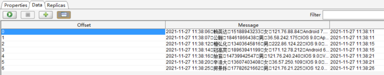


### 09-[掌握]-实时综合案例之FlinkSQL写入HBase

---


使用Flink SQL实时从Kafka消费数据，进行查询处理，最后将数据实时写入HBase表中。

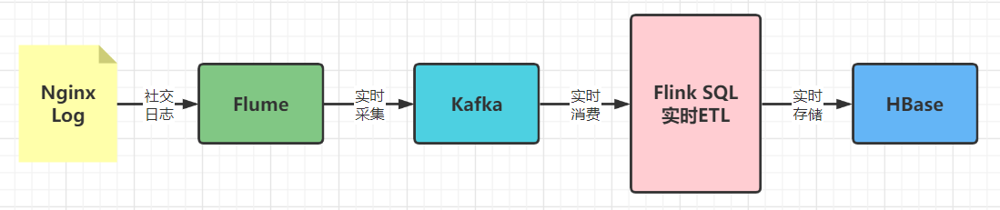


- HBase表**RowKey**设计


```ini
# 查询需求：
	根据【发件人id、收件人id + 消息日期】查询聊天记录
        发件人账号
        时间
        收件人账号（唯一性）
    RowKey = 发件人id + 消息日期 + 收件人id
    列簇：info
    字段：所有字段，20个字段
  	
# 设计规则：
	业务、唯一、长度、散列、组合
	[唯一性、业务性、热点性（考虑写数据）]
	
# 从HBase表查询数据
	1. RowKey查询最快的：Get
	2. 前缀匹配查询：Range
```


- 创建HBase表

```SQL
-- 建表
create 'htbl_momo_msg_sql', {NAME => "info", COMPRESSION => "GZ"}, { NUMREGIONS => 6, SPLITALGO => 'HexStringSplit'}
```


- 创建表输入表InputTable映射到Kafka Topic，从Kafka实时消费数据

```SQL
DROP TABLE IF EXISTS tbl_momo_msg_kafka ;

CREATE TABLE tbl_momo_msg_kafka (
  `msg_time` STRING,
  `sender_nickyname` STRING,
  `sender_account` STRING,
  `sender_sex` STRING,
  `sender_ip` STRING,
  `sender_os` STRING,
  `sender_phone_type` STRING,
  `sender_network` STRING,
  `sender_gps` STRING,
  `receiver_nickyname` STRING,
  `receiver_ip` STRING,
  `receiver_account` STRING,
  `receiver_os` STRING,
  `receiver_phone_type` STRING,
  `receiver_network` STRING,
  `receiver_gps` STRING,
  `receiver_sex` STRING,
  `msg_type` STRING,
  `distance` STRING,  
  `message` STRING  
) WITH (
  'connector' = 'kafka',
  'topic' = 'momo-msg',
  'properties.bootstrap.servers' = 'node1.itcast.cn:9092,node2.itcast.cn:9092,node3.itcast.cn:9092',
  'properties.group.id' = 'momo-gid-1',
  'scan.startup.mode' = 'latest-offset',
  'format' = 'csv',
  'csv.field-delimiter' = '\001',
  'csv.ignore-parse-errors' = 'true',
  'csv.allow-comments' = 'true'
);
```


- 创建输出表OutputTable，将数据实时写入HBase表

```SQL
CREATE TABLE tbl_momo_msg_hbase (
 row_key STRING,
 info ROW<msg_time STRING, sender_nickyname STRING, sender_account STRING, sender_sex STRING, sender_ip STRING, sender_os STRING, sender_phone_type STRING, sender_network STRING, sender_gps STRING, receiver_nickyname STRING, receiver_ip STRING, receiver_account STRING, receiver_os STRING, receiver_phone_type STRING, receiver_network STRING, receiver_gps STRING, receiver_sex STRING, msg_type STRING, distance STRING, message STRING>,
 PRIMARY KEY (row_key) NOT ENFORCED
) WITH (
 'connector' = 'hbase-2.2',
 'table-name' = 'htbl_momo_msg_sql',
 'sink.parallelism' = '3',
 'sink.buffer-flush.interval' = '1s',
 'sink.buffer-flush.max-rows' = '1000',
 'sink.buffer-flush.max-size' = '2mb',
 'zookeeper.quorum' = 'node1.itcast.cn:2181,node2.itcast.cn:2181,node3.itcast.cn:2181',
 'zookeeper.znode.parent' = '/hbase'
);
```


- 查询SELECT语句：从Kafka中读取数据，拼接RowKey，最后写HBase表中

```SQL
SELECT
  CONCAT(sender_account, '_', msg_time, '_', receiver_account ) AS row_key,
  msg_time, sender_nickyname, sender_account, sender_sex, sender_ip, sender_os, sender_phone_type, sender_network, sender_gps, receiver_nickyname, receiver_ip, receiver_account, receiver_os, receiver_phone_type, receiver_network, receiver_gps, receiver_sex, msg_type, distance, message
FROM tbl_momo_msg_kafka ;
```


- 采用INSERT插入语句，将查询结果写入HBase表

```SQL
INSERT INTO tbl_momo_msg_hbase
SELECT
  CONCAT(sender_account, '_', msg_time, '_', receiver_account ) AS row_key,
  ROW(msg_time, sender_nickyname, sender_account, sender_sex, sender_ip, sender_os, sender_phone_type, sender_network, sender_gps, receiver_nickyname, receiver_ip, receiver_account, receiver_os, receiver_phone_type, receiver_network, receiver_gps, receiver_sex, msg_type, distance, message)
FROM tbl_momo_msg_kafka ;
```


> 创建FlinkSQL程序：`MomoStoreHBase`
>

```Java
package cn.itcast.flink.momo;

import org.apache.flink.table.api.EnvironmentSettings;
import org.apache.flink.table.api.TableEnvironment;

/**
 * 陌陌社交实时综合案例： 实时从Kafka消费陌陌设计数据，存储到HBase表中，基于Flink SQL Connector实现
 * @author xuyuan
 */
public class MomoStoreHbase {

    public static void main(String[] args) {
        // 1. 获取表执行环境
        EnvironmentSettings settings = EnvironmentSettings
            .newInstance()
            .useBlinkPlanner()
            .inStreamingMode()
            .build();
        TableEnvironment tableEnv = TableEnvironment.create(settings);

        // 2. 创建输入表，从Kafka消费数据
        tableEnv.executeSql("DROP TABLE IF EXISTS tbl_momo_msg_kafka");
        tableEnv.executeSql(
            "CREATE TABLE tbl_momo_msg_kafka (\n" +
                "  `msg_time` STRING,\n" +
                "  `sender_nickyname` STRING,\n" +
                "  `sender_account` STRING,\n" +
                "  `sender_sex` STRING,\n" +
                "  `sender_ip` STRING,\n" +
                "  `sender_os` STRING,\n" +
                "  `sender_phone_type` STRING,\n" +
                "  `sender_network` STRING,\n" +
                "  `sender_gps` STRING,\n" +
                "  `receiver_nickyname` STRING,\n" +
                "  `receiver_ip` STRING,\n" +
                "  `receiver_account` STRING,\n" +
                "  `receiver_os` STRING,\n" +
                "  `receiver_phone_type` STRING,\n" +
                "  `receiver_network` STRING,\n" +
                "  `receiver_gps` STRING,\n" +
                "  `receiver_sex` STRING,\n" +
                "  `msg_type` STRING,\n" +
                "  `distance` STRING,  \n" +
                "  `message` STRING  \n" +
                ") WITH (\n" +
                "  'connector' = 'kafka',\n" +
                "  'topic' = 'momo-msg',\n" +
                "  'properties.bootstrap.servers' = 'node1.itcast.cn:9092,node2.itcast.cn:9092,node3.itcast.cn:9092',\n" +
                "  'properties.group.id' = 'momo-gid-1',\n" +
                "  'scan.startup.mode' = 'latest-offset',\n" +
                "  'format' = 'csv',\n" +
                "  'csv.field-delimiter' = '\\001',\n" +
                "  'csv.ignore-parse-errors' = 'true',\n" +
                "  'csv.allow-comments' = 'true'\n" +
                ")"
        );

        // 3. 创建输出表：保存数据到HBase表中
        tableEnv.executeSql(
            "CREATE TABLE tbl_momo_msg_hbase (\n" +
                " row_key STRING,\n" +
                " info ROW<msg_time STRING, sender_nickyname STRING, sender_account STRING, sender_sex STRING, sender_ip STRING, sender_os STRING, sender_phone_type STRING, sender_network STRING, sender_gps STRING, receiver_nickyname STRING, receiver_ip STRING, receiver_account STRING, receiver_os STRING, receiver_phone_type STRING, receiver_network STRING, receiver_gps STRING, receiver_sex STRING, msg_type STRING, distance STRING, message STRING>,\n" +
                " PRIMARY KEY (row_key) NOT ENFORCED\n" +
                ") WITH (\n" +
                " 'connector' = 'hbase-2.2',\n" +
                " 'table-name' = 'htbl_momo_msg_sql',\n" +
                " 'sink.parallelism' = '3',\n" +
                " 'sink.buffer-flush.interval' = '1s',\n" +
                " 'sink.buffer-flush.max-rows' = '1000',\n" +
                " 'sink.buffer-flush.max-size' = '2mb',\n" +
                " 'zookeeper.quorum' = 'node1.itcast.cn:2181,node2.itcast.cn:2181,node3.itcast.cn:2181',\n" +
                " 'zookeeper.znode.parent' = '/hbase'\n" +
                ")"
        );

        // 4. 通过子查询方式，将数据写入到输出表
        tableEnv.executeSql(
            "INSERT INTO tbl_momo_msg_hbase\n" +
                "SELECT\n" +
                "  CONCAT(sender_account, '_', msg_time, '_', receiver_account ) AS row_key,\n" +
                "  ROW(msg_time, sender_nickyname, sender_account, sender_sex, sender_ip, sender_os, sender_phone_type, sender_network, sender_gps, receiver_nickyname, receiver_ip, receiver_account, receiver_os, receiver_phone_type, receiver_network, receiver_gps, receiver_sex, msg_type, distance, message)\n" +
                "FROM tbl_momo_msg_kafka"
        );

    }

}
```

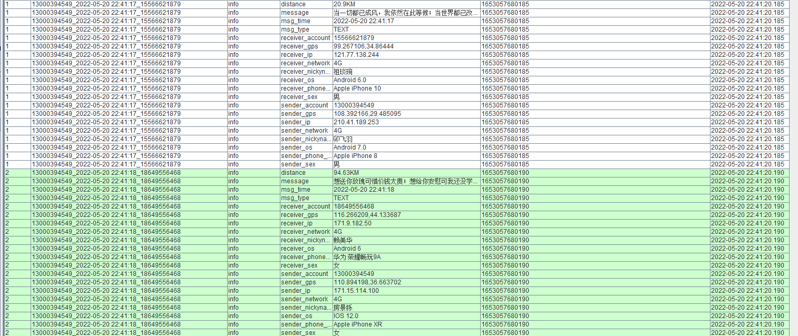


## 附录部分：注意事项及扩展内容


```

```


### [附录1]-Mavan 模块依赖

------


> 创建Maven模块，添加相关依赖：

```xml
    <repositories>
        <repository>
            <id>nexus-aliyun</id>
            <name>Nexus aliyun</name>
            <url>http://maven.aliyun.com/nexus/content/groups/public</url>
        </repository>
        <repository>
            <id>central_maven</id>
            <name>central maven</name>
            <url>https://repo1.maven.org/maven2</url>
        </repository>
        <repository>
            <id>cloudera</id>
            <url>https://repository.cloudera.com/artifactory/cloudera-repos/</url>
        </repository>
        <repository>
            <id>apache.snapshots</id>
            <name>Apache Development Snapshot Repository</name>
            <url>https://repository.apache.org/content/repositories/snapshots/</url>
            <releases>
                <enabled>false</enabled>
            </releases>
            <snapshots>
                <enabled>true</enabled>
            </snapshots>
        </repository>
    </repositories>

    <properties>
        <project.build.sourceEncoding>UTF-8</project.build.sourceEncoding>
        <maven.compiler.source>1.8</maven.compiler.source>
        <maven.compiler.target>1.8</maven.compiler.target>
    </properties>

    <dependencies>
        <dependency>
            <groupId>org.apache.flink</groupId>
            <artifactId>flink-java</artifactId>
            <version>1.13.1</version>
        </dependency>
        <dependency>
            <groupId>org.apache.flink</groupId>
            <artifactId>flink-streaming-java_2.11</artifactId>
            <version>1.13.1</version>
        </dependency>
        <dependency>
            <groupId>org.apache.flink</groupId>
            <artifactId>flink-clients_2.11</artifactId>
            <version>1.13.1</version>
        </dependency>
        <dependency>
            <groupId>org.apache.flink</groupId>
            <artifactId>flink-runtime-web_2.11</artifactId>
            <version>1.13.1</version>
        </dependency>

        <dependency>
            <groupId>org.apache.flink</groupId>
            <artifactId>flink-connector-kafka_2.11</artifactId>
            <version>1.13.1</version>
        </dependency>
        <dependency>
            <groupId>org.apache.flink</groupId>
            <artifactId>flink-connector-jdbc_2.11</artifactId>
            <version>1.13.1</version>
        </dependency>

        <!-- Flink Table API & SQL -->
        <dependency>
            <groupId>org.apache.flink</groupId>
            <artifactId>flink-table-api-java-bridge_2.11</artifactId>
            <version>1.13.1</version>
        </dependency>
        <dependency>
            <groupId>org.apache.flink</groupId>
            <artifactId>flink-table-planner-blink_2.11</artifactId>
            <version>1.13.1</version>
        </dependency>
        <dependency>
            <groupId>org.apache.flink</groupId>
            <artifactId>flink-table-common</artifactId>
            <version>1.13.1</version>
        </dependency>

        <!-- Flink File：csv、json、parquet -->
        <dependency>
            <groupId>org.apache.flink</groupId>
            <artifactId>flink-csv</artifactId>
            <version>1.13.1</version>
        </dependency>
        <dependency>
            <groupId>org.apache.flink</groupId>
            <artifactId>flink-json</artifactId>
            <version>1.13.1</version>
        </dependency>
        <dependency>
            <groupId>org.apache.flink</groupId>
            <artifactId>flink-parquet_2.11</artifactId>
            <version>1.13.1</version>
        </dependency>

        <!-- Flink Table API & SQL：Socket -->
        <dependency>
            <groupId>org.apache.flink</groupId>
            <artifactId>flink-examples-table_2.11</artifactId>
            <version>1.13.1</version>
        </dependency>

        <!-- Flink CDC -->
        <dependency>
            <groupId>com.ververica</groupId>
            <artifactId>flink-connector-mysql-cdc</artifactId>
            <version>2.1.0</version>
        </dependency>
        <dependency>
            <groupId>com.ververica</groupId>
            <artifactId>flink-sql-connector-mysql-cdc</artifactId>
            <version>2.1.0</version>
        </dependency>

        <!-- Hadoop Client API -->
        <dependency>
            <groupId>org.apache.flink</groupId>
            <artifactId>flink-shaded-hadoop-3-uber</artifactId>
            <version>3.1.1.7.2.1.0-327-9.0</version>
        </dependency>
        <dependency>
            <groupId>commons-cli</groupId>
            <artifactId>commons-cli</artifactId>
            <version>1.4</version>
        </dependency>

        <!-- Flink Integrated HBase -->
        <dependency>
            <groupId>org.apache.flink</groupId>
            <artifactId>flink-connector-hbase-2.2_2.11</artifactId>
            <version>1.13.1</version>
        </dependency>

        <!-- Flink Integrated Hive -->
        <dependency>
            <groupId>org.apache.flink</groupId>
            <artifactId>flink-connector-hive_2.11</artifactId>
            <version>1.13.1</version>
        </dependency>
        <dependency>
            <groupId>org.apache.hive</groupId>
            <artifactId>hive-exec</artifactId>
            <version>3.1.2</version>
        </dependency>
        <dependency>
            <groupId>org.apache.hive</groupId>
            <artifactId>hive-metastore</artifactId>
            <version>3.1.2</version>
        </dependency>
        <dependency>
            <groupId>org.apache.thrift</groupId>
            <artifactId>libthrift</artifactId>
            <version>0.9.3</version>
        </dependency>

        <dependency>
            <groupId>mysql</groupId>
            <artifactId>mysql-connector-java</artifactId>
            <version>8.0.21</version>
        </dependency>
        <dependency>
            <groupId>com.alibaba</groupId>
            <artifactId>fastjson</artifactId>
            <version>1.2.68</version>
        </dependency>
        <dependency>
            <groupId>org.projectlombok</groupId>
            <artifactId>lombok</artifactId>
            <version>1.18.12</version>
        </dependency>

        <dependency>
            <groupId>org.lionsoul</groupId>
            <artifactId>ip2region</artifactId>
            <version>1.7.2</version>
        </dependency>

        <dependency>
            <groupId>org.apache.commons</groupId>
            <artifactId>commons-compress</artifactId>
            <version>1.20</version>
        </dependency>

        <dependency>
            <groupId>org.slf4j</groupId>
            <artifactId>slf4j-log4j12</artifactId>
            <version>1.7.7</version>
            <scope>runtime</scope>
        </dependency>
        <dependency>
            <groupId>log4j</groupId>
            <artifactId>log4j</artifactId>
            <version>1.2.17</version>
            <scope>runtime</scope>
        </dependency>

    </dependencies>

    <build>
        <sourceDirectory>src/main/java</sourceDirectory>
        <testSourceDirectory>src/test/java</testSourceDirectory>
        <plugins>
            <!-- 编译插件 -->
            <plugin>
                <groupId>org.apache.maven.plugins</groupId>
                <artifactId>maven-compiler-plugin</artifactId>
                <version>3.5.1</version>
                <configuration>
                    <source>1.8</source>
                    <target>1.8</target>
                    <!--<encoding>${project.build.sourceEncoding}</encoding>-->
                </configuration>
            </plugin>
            <plugin>
                <groupId>org.apache.maven.plugins</groupId>
                <artifactId>maven-surefire-plugin</artifactId>
                <version>2.18.1</version>
                <configuration>
                    <useFile>false</useFile>
                    <disableXmlReport>true</disableXmlReport>
                    <includes>
                        <include>**/*Test.*</include>
                        <include>**/*Suite.*</include>
                    </includes>
                </configuration>
            </plugin>
            <!-- 打jar包插件(会包含所有依赖) -->
            <plugin>
                <groupId>org.apache.maven.plugins</groupId>
                <artifactId>maven-shade-plugin</artifactId>
                <version>2.3</version>
                <executions>
                    <execution>
                        <phase>package</phase>
                        <goals>
                            <goal>shade</goal>
                        </goals>
                        <configuration>
                            <filters>
                                <filter>
                                    <artifact>*:*</artifact>
                                    <excludes>
                                        <!--
                                        zip -d learn_spark.jar META-INF/*.RSA META-INF/*.DSA META-INF/*.SF -->
                                        <exclude>META-INF/*.SF</exclude>
                                        <exclude>META-INF/*.DSA</exclude>
                                        <exclude>META-INF/*.RSA</exclude>
                                    </excludes>
                                </filter>
                            </filters>
                            <transformers>
                                <transformer implementation="org.apache.maven.plugins.shade.resource.ManifestResourceTransformer">
                                    <!-- <mainClass>com.itcast.flink.batch.FlinkBatchWordCount</mainClass> -->
                                </transformer>
                            </transformers>
                        </configuration>
                    </execution>
                </executions>
            </plugin>
        </plugins>
    </build>

```

