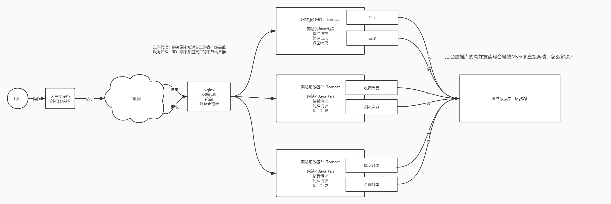
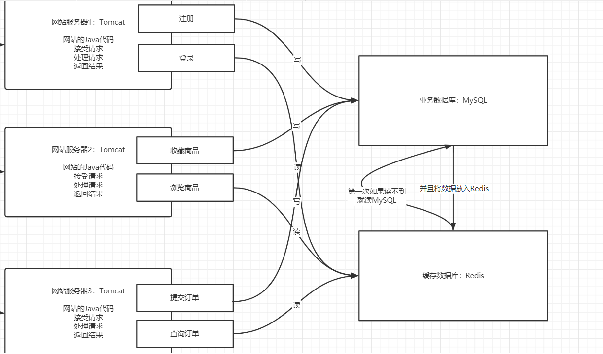
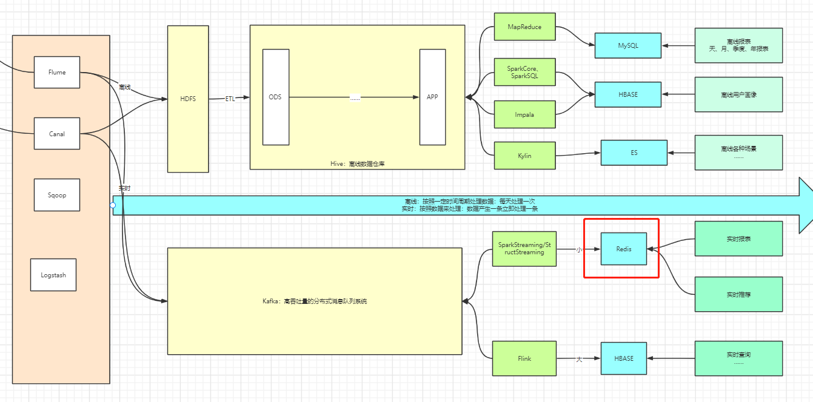
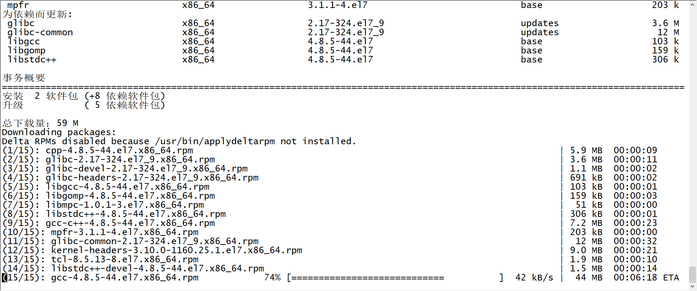
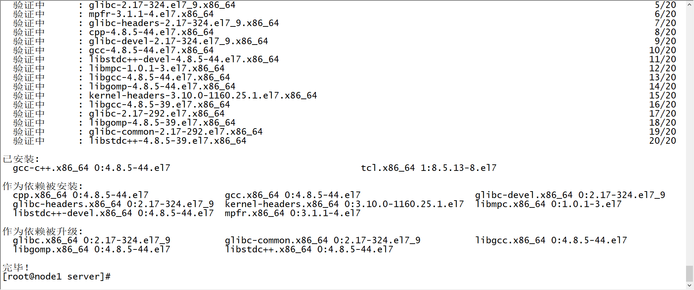
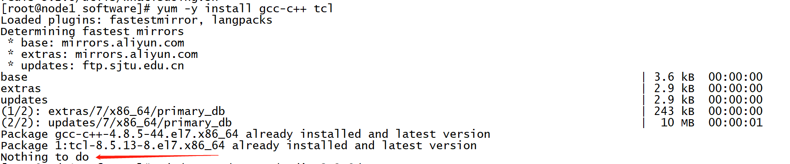
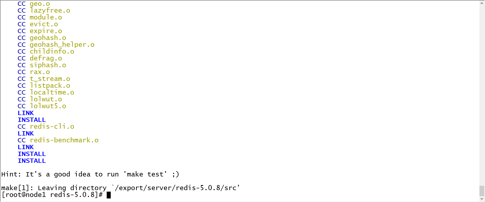
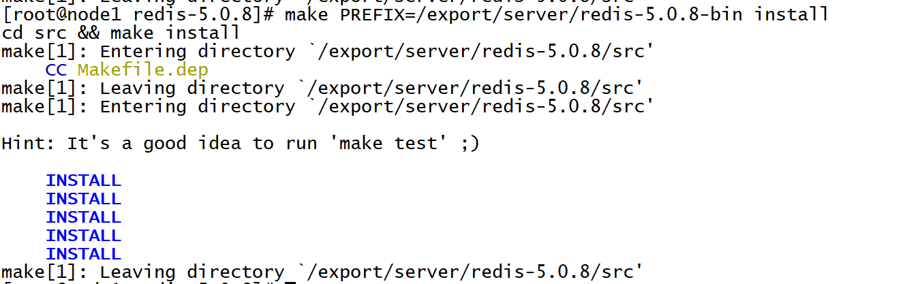
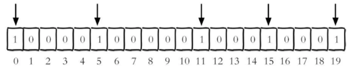

# 基于内存的分布式NoSQL数据库Redis

## 知识点01：课程目标

1. Redis功能和应用场景
   - 目标：**掌握Redis的功能、应用场景**
   - 什么是Redis，能解决什么问题？
   - 什么场景下用到Redis？
2. Redis的数据结构和数据类型
   - 目标：**掌握Redis数据结构和常用数据类型**
   - Redis中以什么形式进行存储？常用的数据类型有哪些？
3. Redis的基本使用
   - 目标：学习Redis的读写操作：基于命令行命令操作【命令】 /  基于代码提交操作【Jedis】


## 知识点02：【了解】NoSQL与RDBMS

- **目标**：**了解NoSQL的应用场景与RDBMS的区别**

- **实施**

  - **RDBMS的特点**：关系型数据库管理系统

    - 工具：MySQL、Oracle、SQL Server……
    - 应用：业务性数据存储系统：事务和稳定性
      - 用户数据、商品数据、订单数据、人事数据、财务数据
      - **数据的安全性和稳定性**
    - 特点：体现数据之间的关系，支持事务，保证业务完整性和稳定性，小数据量的性能也比较好
    - 开发：SQL

  - 业务架构中的问题

    - **问题**：以网站后台存储为例，当并发量很大，**所有高并发全部直接请求MySQL，容易导致MySQL奔溃**

      

    - 需求：能实现高并发的数据库，接受高并发请求

  - **NoSQL的特点**：Not Only SQL：非关系型数据库

    - 工具：Redis、HBASE、MongoDB……

    - 应用：一般用于**高并发高性能**场景下的数据缓存或者数据库存储

    - 特点：**读写速度特别快，并发量非常高**，相对而言不如RDBMS稳定，对事务性的支持不太友好

    - 开发：每种NoSQL都有自己的命令语法

    - 解决上面RDBMS的问题：使用高并发缓存实现读写分离

      

- **小结**：了解NoSQL的应用场景与RDBMS的区别

  

## 知识点03：【掌握】Redis的功能与应用场景

- **目标**：**理解Redis的功能与应用场景**

- **实施**

  - **介绍**

    - 相关网站

      - 官方网站：<https://redis.io/>、<http://download.redis.io/releases/>
      - 中文文档：<http://www.redis.cn/>
      - Redis 命令参考：<http://redisdoc.com/>

    - 官方介绍

      ```
      Redis 是一个开源（BSD许可）的，内存中的数据结构存储系统，它可以用作数据库、缓存和消息中间件。 它支持多种类型的数据结构，如 字符串（strings）， 散列（hashes）， 列表（lists）， 集合（sets）， 有序集合（sorted sets） 与范围查询， bitmaps， hyperloglogs 和 地理空间（geospatial） 索引半径查询。 Redis 内置了 复制（replication），LUA脚本（Lua scripting）， LRU驱动事件（LRU eviction），事务（transactions） 和不同级别的 磁盘持久化（persistence）， 并通过 Redis哨兵（Sentinel）和自动 分区（Cluster）提供高可用性（high availability）。
      ```

    - **定义**：基于内存的分布式的NoSQL数据库

      - 所有数据存储在内存中，并且有**持久化机制**【保证内存数据安全】
      - 每次redis重启，会从文件中重新加载数据到内存，==**所有读写都只基于内存**==

  - **功能特点**

    - 功能：**提供高性能高并发的数据存储【读写】**
    - 特点
      - 基于**C语言**开发的系统，与硬件的交互性能更好
      - 基于**内存实现数据读写**，读写性能更快
      - **分布式的**：扩展性和稳定性更好
      - KV结构数据库：支持事务、拥有各种**丰富的数据结构**

  - **应用场景**

    - 缓存：用于实现大数据量高并发的大数据量缓存【传统Java架构领域中】

      - 临时性存储

    - 数据库：用于实现**高性能**的小数据量读写【大数据中主要应用场景】
    
      - 持久性存储
    
      
    
    - 消息中间件：消息队列【MQ】：用于实现消息传递，一般不用Redis
    
      - 有些工具会利用redis做消息队列

- **小结**：理解Redis的功能与应用场景


## 知识点04：【实现】Redis的Linux版单机部署

- **目标**：实现Redis的Linux版单机部署

- **实施**

  - Windows版本安装及远程工具使用请参考随堂资料《Redis的Windows版安装及远程工具的使用.pdf》

  - Redis版本

    - 常见版本：redis3、redis5
    - redis3：提供集群模式等功能
    - redis5：优化了集群模式，修复bug

  - **上传**redis-5.0.8源码

    ```
    cd /export/software/
    rz
    ```

  - **解压**

    ```
  tar -zxvf redis-5.0.8.tar.gz -C /export/server/
    ```

  - **安装依赖**

    ```
  yum -y install gcc-c++ tcl
    ```

    

    

    - 如果已经安装过，执行命令结果如下：

      

  - **编译安装**

    ```shell
  #进入源码目录
    cd /export/server/redis-5.0.8/
  #编译
    make
  #安装，并指定安装目录
    make PREFIX=/export/server/redis-5.0.8-bin install
    ```
    
    
    
    
    
    
    
  - **修改配置**

    - 复制配置文件

      ```bash
      cp /export/server/redis-5.0.8/redis.conf /export/server/redis-5.0.8-bin/
      ```
      
    - 创建目录

      ```shell
      #redis日志目录
      mkdir -p /export/server/redis-5.0.8-bin/logs
      #redis数据目录
      mkdir -p /export/server/redis-5.0.8-bin/datas
      ```

    - 修改配置

      ```shell
      cd  /export/server/redis-5.0.8-bin/
      vim redis.conf
      ```

      ```shell
      ## 69行，配置redis服务器接受链接的网卡
      bind node1
      ## 136行，redis是否后台运行，设置为yes
      daemonize yes
      ## 171行，设置redis服务日志存储路径
      logfile "/export/server/redis-5.0.8-bin/logs/redis.log"
      ## 263行，设置redis持久化数据存储目录
      dir /export/server/redis-5.0.8-bin/datas/
      ```

    - 创建软连接

      ```
      cd /export/server
      ln -s redis-5.0.8-bin redis
      ```

    - 配置环境变量

      ```bash
      vim /etc/profile
      # 添加以下内容
      # REDIS HOME
      export REDIS_HOME=/export/server/redis
      export PATH=:$PATH:$REDIS_HOME/bin
      # 刷新环境变量：这条不能放入配置文件中
      source /etc/profile
      ```

  - **启动**

    - 端口：6379

    - 启动服务端

      - 启动命令

        ```bash
      /export/server/redis/bin/redis-server /export/server/redis/redis.conf
        ```

      - 启动脚本

        ```bash
      vim /export/server/redis/bin/redis-start.sh
        ```

        ```shell
      #!/bin/bash 
        
        REDIS_HOME=/export/server/redis
        ${REDIS_HOME}/bin/redis-server ${REDIS_HOME}/redis.conf
        ```
        
        ```
        chmod u+x /export/server/redis/bin/redis-start.sh 
        ```
        
      
    - 检查服务端
    
      ```
      ps -ef | grep redis
      或者
      netstat -atunlp | grep 6379
      ```
    
    - 启动客户端
    
      ```
      /export/server/redis/bin/redis-cli -h node1 -p 6379
      ```
    
    - 关闭客户端
      
      - exit：退出客户端
      
    - 关闭服务端
      
      - 方式一：客户端中
        
        ```bash
        shutdown
        ```
        
      - 方式二：Linux命令行
        
        ```bash
        kill -9 redis的pid
        ```
        
      - 方式三：通过客户端命令进行关闭
        
          ```bash
          bin/redis-cli -h node1 -p 6379  shutdown
          ```
      
    - **测试**
    
      ```
      node1:6379> keys *
      (empty list or set)
      node1:6379> set s1 hadoop
      OK
      node1:6379> keys *
      1) "s1"
      node1:6379> get s1
      "hadoop"
      node1:6379> 
      ```
    
      - 远程工具的使用：参考Windows安装文档
    
  
- **小结**：实现Redis的Linux版单机部署


## 知识点05：【掌握】Redis的数据结构及数据类型

- **目标**：**掌握Redis的数据结构及数据类型**

- **实施**

  - **数据结构**：Redis中所有数据存储都以KV结构形式存在

    - K：作为唯一标识符，唯一标识一条数据，**固定为String类型**，写入时指定KV，读取时，根据K读取V

    - V：真正存储的数据，可以有多种类型：**String、Hash、List、Set、Zset**、BitMap、HypeLogLog

    - 理解Redis：类似于Java中的一个Map集合，可以存储多个KV，根据K获取V

  - **数据类型**

    - 每一种类型的应用场景和命令都是不一样的

    | Key：String   | Value类型             | Value值                              | 应用场景                               |
    | ------------- | --------------------- | ------------------------------------ | -------------------------------------- |
    | pv_20200101   | String                | 10000                                | 一般用于存储单个数据指标的结果         |
    | flow_20200101 | Hash                  | UV:1000  PV : 2000  IP: 100          | 用于存储整个对象所有属性值             |
    | uv            | List                  | {100,200,300,100,600}                | 有序允许重复的集合，每天获取最后一个值 |
    | uv_20200101   | Set                   | {userid1,userid2,userid3,userid4……}  | 无序且不重复的集合，直接通过长度得到UV |
    | top10_product | ZSet【score,element】 | {10000-牙膏，9999-玩具，9998-电视……} | 有序不可重复的集合，统计TopN           |

    - String：类似于Java中的字符串，用于存储单个指标的结果

        ```
        # 存储单个指标
        K：20220101_uv
        V：123456
        ```

    - Hash：类似于Java中Map集合，用于存储整个对象的所有属性

        ```
        # 一个KV存储多个指标的结果
        K：20220101_rs
        V：{uv:12345, pv:678910, order_amt:100000, order_cnt:100}
        ```

    - List：类似于Java中List集合，有序且可重复

        ```
        # 存储一个有序可重复的结果，昨天的UV，近7天的UV，近15天UV，1个月UV
        K：uv_days
        V: [100, 400, 300, 200, 100]
        ```

    - Set：类似于Java中Set集合，不可重复

        - 需求：统计昨日所有用户个数：userid

          ```
          # Flink或者Struct Steaming
          select count(distinct userid) uv from table
          ```

        - 用Redis解决

          ```
          K：20220101_uv
          V:(userid1,userid2,userid3……)
          ```

    - Zset：类似于Java中TreeMap，结合了List和Set共同特性，有序【自己选择升序或者降序】且不可重复

        ```
        # 需求：销量最高前10个商品：排序，不可重复
        K：top10_goods
        V: {10000:牙膏，9999:袜子……}
        ```

- **小结**：掌握Redis的数据结构及数据类型


## 知识点06：【掌握】Redis的通用命令

- **目标**：**掌握Redis常用的通用命令**

- **实施**

  - **keys**：列举当前数据库中所有Key

  - **del key**：删除某个KV

  - **exists key** ：判断某个Key是否存在

  - **type key**：判断这个K对应的V的类型的

  - **expire K** 过期时间：设置某个K的过期时间，一旦到达过期时间，这个K会被自动删除

  - **ttl K**：查看某个K剩余的存活时间

  - select N：切换数据库的

  - move key N：将某个Key移动到某个数据库中

  - flushdb：清空当前数据库的所有Key

  - flushall：清空所有数据库的所有Key

- **小结**：掌握Redis常用的通用命令


## 知识点07：【掌握】String类型的常用命令

- **目标**：掌握String类型的常用命令

- **实施**
  - **set**：给String类型的Value的进行赋值或者更新
  - **get**：读取String类型的Value的值
  - **mset**：用于批量写多个String类型的KV
  - **mget**：用于批量读取String类型的Value
  - setnx：只能用于新增数据，当K不存在时可以进行新增
  - **incr**：用于对数值类型的字符串进行递增，递增1,一般用于做计数器
  - **incrby**：指定对数值类型的字符串增长固定的步长
  - decr：对数值类型的数据进行递减，递减1
  - decrby：按照指定步长进行递减
  - strlen：统计字符串的长度
  - getrange：用于截取字符串

- **小结**：掌握String类型的常用命令


## 知识点08：【掌握】Hash类型的常用命令

- **目标**：掌握Hash类型的常用命令

- **实施**

  - **hset**：用于为某个K添加一个属性
  - **hget**：用于获取某个K的某个属性的值
  - **hmset**：批量的为某个K赋予新的属性
  - **hmget**：批量的获取某个K的多个属性的值
  - **hgetall**：获取所有属性的值
  - hdel：删除某个属性
  - hlen：统计K对应的Value总的属性的个数
  - hexists：判断这个K的V中是否包含这个属性
  - hvals：获取所有属性的value的
  - hkeys：后去所有属性

- **小结**

  - 掌握Hash类型的常用命令


## 知识点09：【掌握】List类型的常用命令

- **目标**：掌握List类型的常用命令

- **实施**

  - **lpush**：将每个元素放到集合的左边，左序放入
  - **rpush**：将每个元素放到集合的右边，右序放入
  - **lrange**：通过下标的范围来获取元素的数据
  - llen：统计集合的长度
  - lpop：删除左边的一个元素

  - rpop：删除右边的一个元素

- **小结**：掌握List类型的常用命令


## 知识点10：【掌握】Set类型的常用命令

- **目标**：掌握Set类型的常用命令

- **实施**

    - **sadd**：用于添加元素到Set集合中

    - **smembers**：用于查看Set集合的所有成员

    - sismember：判断是否包含这个成员

    - srem：删除其中某个元素

    - **scard**：统计集合长度

    - sunion：取两个集合的并集

    - **sinter**：取两个集合的交集

- **小结**：掌握Set类型的常用命令


## 知识点11：【掌握】Zset类型的常用命令

- **目标**：掌握Zset类型的常用命令

- **实施**

  - **zadd**：用于添加元素到Zset集合中
  - **zrange**：范围查询

  - **zrevrange**：倒序查询

  - zrem：移除一个元素

  - **zcard**：统计集合长度
  - zscore：获取评分

- **小结**

  - 掌握Zset类型的常用命令


## 知识点12：【掌握】BitMap类型的常用命令

- **目标**：了解BitMap类型的常用命令

- **实施**

  - 功能：通过一个String对象的存储空间，来构建位图，用每一位0和1来表示状态

    

    

    - Redis中一个String最大支持512M =  2^32次方，1字节 = 8位
    - 使用时，可以指定每一位对应的值，要么为0，要么为1，默认全部为0

    - 用下标来标记每一位，第一个位的下标为0

    

  - 举例：统计UV

    - 一个位图中包含很多位，可以用每一个位表示一个用户id

    - 读取数据，发现一个用户id，就将这个用户id对应的那一位改为1

    - 统计整个位图中所有1的个数，就得到了UV

  - setbit：修改某一位的值

    - 语法：setbit  bit1  位置   0/1

      ```
    setbit bit1 0 1
      ```
  
  - getbit：查看某一位的值

    - 语法：getbit  K  位置

      ```
    getbit bit1 9
      ```

  - bitcount：用于统计位图中所有1的个数
  
    - 语法：bitcount  K [start   end]

      ```
    bitcount bit1
      #start和end表示的是字节:1 字节 = 8 位
    bitcount bit1 0 10
      ```

  - bitop：用于位图的运算：and/or/not/xor
  
    - 语法：bitop  and/or/xor/not  bitrs   bit1 bit2
  
      ```
    bitop and bit3 bit1 bit2
      bitop or bit4 bit1 bit2
      ```
  
    
  
  ```
  node1:6379> setbit bit1 0 1
  (integer) 0
  node1:6379> getbit bit1 0
  (integer) 1
  node1:6379> getbit bit1 1
  (integer) 0
  node1:6379> getbit bit1 2
  (integer) 0
  node1:6379> getbit bit1 3
  (integer) 0
  node1:6379> setbit bit1 9 1
  (integer) 0
  node1:6379> setbit bit1 17 1
  (integer) 0
  node1:6379> bitcount bit1 
  (integer) 3
  node1:6379> bitcount bit1 0 7
  (integer) 3
  node1:6379> bitcount bit1 0 0
  (integer) 1
  node1:6379> bitcount bit1 0 1
  (integer) 2
  node1:6379> bitcount bit1 0 2
  (integer) 3
  node1:6379> setbit bit2 0 1
  (integer) 0
  node1:6379> setbit bit2 10 1
  (integer) 0
  node1:6379> bitop and bit3 bit1 bit2
  (integer) 3
  node1:6379> bitcount bit3
  (integer) 1
  node1:6379> 
  ```
  
- **小结**：了解BitMap类型的常用命令


## 知识点13：【掌握】HyperLogLog类型的常用命令

- **目标**：了解HyperLogLog类型的常用命令

- **实施**

  - 功能：**类似于Set集合**，用于实现数据的去重，底层实现原理不一样

  - 应用：适合于**数据量比较庞大**的情况下的使用，**存在一定的误差率**
    
  - pfadd：用于添加元素

    - 语法：pfadd  K   e1 e2 e3……

      ```
    pfadd pf1 userid1 userid1 userid2 userid3 userid4 userid3 userid4
      pfadd pf2 userid1 userid2 userid2 userid5 userid6
      ```

  - pfcount：用于统计个数

    - 语法：pfcount K

        ```
        pfcount pf1
      ```

  - pfmerge：用于实现集合合并

    - 语法：pfmerge  pfrs  pf1 pf2……

        ```
        pfmerge pf3 pf1 pf2
      ```

- **小结**：了解HyperLogLog类型的常用命令


## 知识点14：【掌握】Jedis：使用方式与Jedis依赖

- **目标**：**掌握Redis的使用方式及构建Jedis工程依赖**
- **实施**
  - **Redis的使用方式**
    
    - 命令操作Redis，一般用于测试开发阶段
    
    - 分布式计算或者Java程序读写Redis，一般用于实际生产开发
  
      - Spark/Flink读写Redis
    
      - 所有数据库使用Java操作方式整体是类似的
    
        ```java
        //todo:1-构建客户端连接对象
        Connection conn = DriverManager.getConnect(url,username,password)
        //todo:2-执行操作：所有操作都在客户端连接对象中：方法
        prep.execute(SQL)
        //todo:3-释放连接
        conn.close
        ```
    
  - **Jedis依赖**
  
    - 参考附录一添加依赖
- **小结**
  
  - 掌握Redis的使用方式及构建Jedis工程依赖


## 知识点15：【掌握】Jedis：构建连接

- **目标**：实现Jedis的客户端连接

- **实施**

  ```java
  package bigdata.itcast.cn.jedis;
  
  import org.junit.After;
  import org.junit.Before;
  import org.junit.Test;
  import redis.clients.jedis.Jedis;
  import redis.clients.jedis.JedisPool;
  import redis.clients.jedis.JedisPoolConfig;
  
  /**
   * @ClassName JedisClientTest
   * @Description TODO 测试Jedis客户端的开发，实现Redis数据库的操作
   * @Create By     Frank
   */
  public class JedisClientTest {
  
      // todo:1-构建一个连接对象
      Jedis jedis = null;
  
      @Before
      public void getConnection(){
          //方式一：直接构建一个Jedis连接实例
  //        jedis = new Jedis("node1",6379);
          //方式二：使用连接池构建
          //构建连接池配置
          JedisPoolConfig config = new JedisPoolConfig();
          config.setMaxTotal(10); //设置最大连接数
          //构建连接池
          JedisPool jedisPool = new JedisPool(config,"node1",6379);
          //获取连接
          jedis = jedisPool.getResource();
      }
      // todo:2-实现具体的操作
  
      // todo:3-释放连接
      @After
      public void closeConnection(){
          jedis.close();
      }
  }
  
  ```
  
- **小结**：实现Jedis的客户端连接


## 知识点16：【掌握】Jedis：String操作

- **目标**：Jedis中实现String的操作

- **实施**

  ```
  set/get/incr/exists/expire/setexp/ttl
  ```

  ```java
      @Test
      public void testString(){
          //set/get/incr/exists/expire/setex/ttl
  //        jedis.set("s1","hadoop");
  //        System.out.println(jedis.get("s1"));
  //        jedis.set("s2","1");
  //        jedis.incr("s2");
  //        System.out.println(jedis.get("s2"));
  //        System.out.println(jedis.exists("s1"));
  //        System.out.println(jedis.exists("s3"));
  //        jedis.expire("s1",20);
  //        while(true){
  //            System.out.println(jedis.ttl("s1"));
  //        }
          jedis.setex("s3",10,"hive");
      }
  ```
  
- **小结**：Jedis中实现String的操作

  

## 知识点17：【掌握】Jedis：其他类型操作

- **目标**：Jedis中实现其他类型操作

- **实施**

  - **Hash类型**

    ```
    hset/hmset/hget/hgetall/hdel/hlen/hexists
    ```

    ```java
        public void testHash(){
            //hset/hmset/hget/hgetall/hdel/hlen/hexists
            jedis.hset("m1","name","zhangsan");
            System.out.println(jedis.hget("m1","name"));
            Map<String,String> maps = new HashMap<>();
            maps.put("age","18");
            maps.put("phone","110");
            jedis.hmset("m1",maps);
            List<String> hmget = jedis.hmget("m1", "name", "age");
            System.out.println(hmget);
            System.out.println("=");
            Map<String, String> m1 = jedis.hgetAll("m1");
            for(Map.Entry map : m1.entrySet()){
                System.out.println(map.getKey()+"\t"+map.getValue());
            }
            System.out.println("=");
            System.out.println(jedis.hlen("m1"));
            jedis.hdel("m1","name");
            System.out.println(jedis.hlen("m1"));
            System.out.println(jedis.hexists("m1","name"));
            System.out.println(jedis.hexists("m1","age"));
        }
    ```

  - **List类型**

    ```
  lpush/rpush/lrange/llen/lpop/rpop
    ```
  
    ```java
      @Test
        public void testList(){
            //lpush/rpush/lrange/llen/lpop/rpop
            jedis.lpush("list1","1","2","3");
            System.out.println(jedis.lrange("list1",0,-1));
            jedis.rpush("list1","4","5","6");
            System.out.println(jedis.lrange("list1",0,-1));
            System.out.println(jedis.llen("list1"));
            jedis.lpop("list1");
            jedis.rpop("list1");
            System.out.println(jedis.lrange("list1",0,-1));
        }
    ```
  
  - **Set类型**

    ```
  sadd/smembers/sismember/scard/srem
    ```
  
    ```java
      @Test
        public void testSet(){
            //sadd/smembers/sismember/scard/srem
            jedis.sadd("set1","1","2","3","1","2","3","4","5","6");
            System.out.println("长度："+jedis.scard("set1"));
            System.out.println("内容："+jedis.smembers("set1"));
            System.out.println(jedis.sismember("set1","1"));
            System.out.println(jedis.sismember("set1","7"));
            jedis.srem("set1","2");
            System.out.println("内容："+jedis.smembers("set1"));
    
        }
    ```
  
  - **Zset类型**

    ```
  zadd/zrange/zrevrange/zcard/zrem
    ```

    ```java
        @Test
        public void testZset(){
          //zadd/zrange/zrevrange/zcard/zrem
            jedis.zadd("zset1",20.9,"yuwen");
            jedis.zadd("zset1",10.5,"yinyu");
            jedis.zadd("zset1",70.9,"shuxue");
            jedis.zadd("zset1",99.9,"shengwu");
            Set<String> zset1 = jedis.zrange("zset1", 0, -1);
            System.out.println(zset1);
            System.out.println(jedis.zrevrange("zset1",0,-1));
            System.out.println(jedis.zcard("zset1"));
            jedis.zrem("zset1","yuwen");
            System.out.println(jedis.zrangeWithScores("zset1",0,-1));
        }
    ```
  
- **小结**：Jedis中实现其他类型操作


## 附录一：Jedis Maven依赖

```xml
   <dependencies>
        <!-- Jedis 依赖 -->
        <dependency>
            <groupId>redis.clients</groupId>
            <artifactId>jedis</artifactId>
            <version>3.2.0</version>
        </dependency>
        <!-- JUnit 4 依赖 -->
        <dependency>
            <groupId>junit</groupId>
            <artifactId>junit</artifactId>
            <version>4.13</version>
        </dependency>
    </dependencies>

    <build>
        <plugins>
            <plugin>
                <groupId>org.apache.maven.plugins</groupId>
                <artifactId>maven-compiler-plugin</artifactId>
                <version>3.0</version>
                <configuration>
                    <source>1.8</source>
                    <target>1.8</target>
                    <encoding>UTF-8</encoding>
                </configuration>
            </plugin>
        </plugins>
    </build>
```


