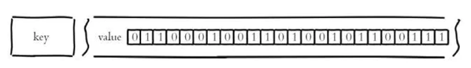
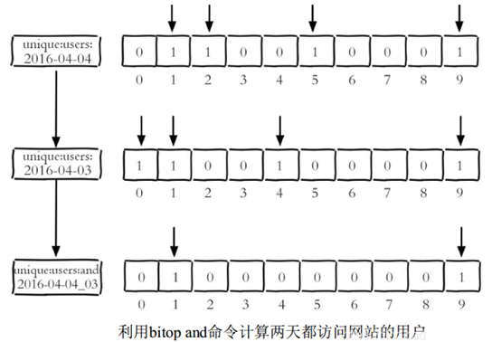
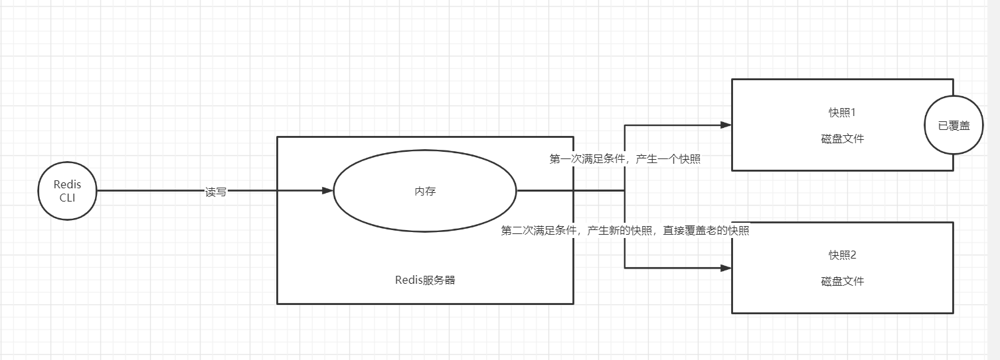
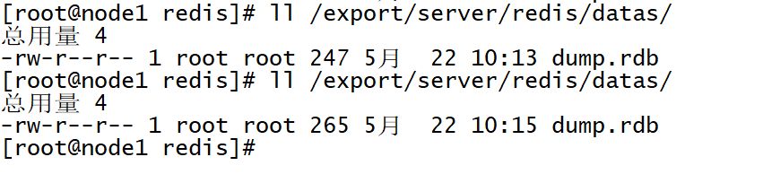
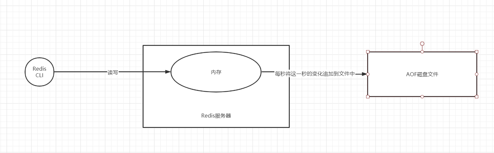
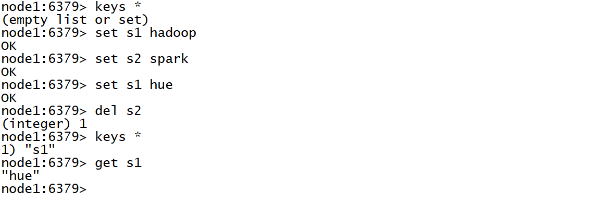

# 内存式NoSQL数据库Redis（三）

## 知识点01：课程回顾

- Redis中常用命令
- 不同场景下不同需求：多种V的类型：String、Hash、List、Set、Zset
- 通用命令：DDL
  - keys 通配符：列举所有的Key
  - del Key：删除某个Key
  - type key：查看某个Key对应Value类型
  - exists Key：判断某个Key是否存在
  - expire Key  Seconds：指定某个Key过期时间
  - ttl Key：查询某个KV过期时间
- 不同类型数据读写命令：DML
  - String：set、get、mset 、mget、incr/incrBy
  - Hash：hset、hget、hmset、hmget、hgetall、hdel、hexists
  - List：lpush、rpush、lrange  Key  start end、lpop、rpop
  - Set：sadd、smembers、scard
  - Zset：zadd Key score e、zrange key start end [withscores]、zrevrange Key start end [withscores]、zcard


## 知识点02：课程目标

1. 了解BitMap和HyperLogsLogs类型功能和使用
   - 目标：知道有这两个类型
2. Jedis使用
   - 目标：**工作中如何使用Redis，掌握Jedis使用**
3. Redis持久化机制
   - 目标：==**掌握Redis持久化方案以及选择**==


## 知识点03：【了解】BitMap类型的常用命令

- **目标**：了解BitMap类型的常用命令

- **实施**

  - 功能：通过一个String对象的存储空间，来构建位图，用每一位0和1来表示状态

    

    

    - Redis中一个String最大支持512M =  2^32次方，1字节 = 8位
    - 使用时，可以指定每一位对应的值，要么为0，要么为1，默认全部为0

    - 用下标来标记每一位，第一个位的下标为0

    

  - 举例：统计UV

    - 一个位图中包含很多位，可以用每一个位表示一个用户id

    - 读取数据，发现一个用户id，就将这个用户id对应的那一位改为1

    - 统计整个位图中所有1的个数，就得到了UV

  - setbit：修改某一位的值

    - 语法：setbit  bit1  位置   0/1

      ```
      setbit bit1 0 1
      ```

  - getbit：查看某一位的值

    - 语法：getbit  K  位置

      ```
      getbit bit1 9
      ```

  - bitcount：用于统计位图中所有1的个数

    - 语法：bitcount  K [start   end]

      ```
      bitcount bit1
      #start和end表示的是字节:1 字节 = 8 位
      bitcount bit1 0 10
      ```

  - bitop：用于位图的运算：and/or/not/xor

    - 语法：bitop  and/or/xor/not  bitrs   bit1 bit2

      ```
      bitop and bit3 bit1 bit2
      bitop or bit4 bit1 bit2
      ```

    

  ```
  node1:6379> setbit bit1 0 1
  (integer) 0
  node1:6379> getbit bit1 0
  (integer) 1
  node1:6379> getbit bit1 1
  (integer) 0
  node1:6379> getbit bit1 2
  (integer) 0
  node1:6379> getbit bit1 3
  (integer) 0
  node1:6379> getbit bit1 4
  (integer) 0
  node1:6379> setbit bit1 9 1
  (integer) 0
  node1:6379> getbit bit1 9
  (integer) 1
  node1:6379> getbit bit1 10
  (integer) 0
  node1:6379> getbit bit1 8
  (integer) 0
  node1:6379> setbit bit1 10 1
  (integer) 0
  node1:6379> getbit bit1 10
  (integer) 1
  node1:6379> bitcount bit1
  (integer) 3
  node1:6379> bitcount bit1 0 5
  (integer) 3
  node1:6379> bitcount bit1 0 1
  (integer) 3
  node1:6379> bitcount bit1 0 0
  (integer) 1
  node1:6379> setbit bit2 5 1
  (integer) 0
  node1:6379> setbit bit2 9 1
  (integer) 0
  node1:6379> setbit bit2 10 1
  (integer) 0
  node1:6379> setbit bit2 20 1
  (integer) 0
  node1:6379> bitcount bit2
  (integer) 4
  node1:6379> bitop and bit3 bit1 bit2
  (integer) 3
  node1:6379> bitcount bit3
  (integer) 2
  node1:6379> 
  ```

- **小结**：了解BitMap类型的常用命令


## 知识点04：【了解】HyperLogLog类型的常用命令

- **目标**：了解HyperLogLog类型的常用命令

- **实施**

  - 功能：**类似于Set集合**，用于实现数据的去重，底层实现原理不一样

  - 应用：适合于**数据量比较庞大**的情况下的使用，**存在一定的误差率**

  - pfadd：用于添加元素

    - 语法：pfadd  K   e1 e2 e3……

      ```
      pfadd pf1 userid1 userid1 userid2 userid3 userid4 userid3 userid4
      pfadd pf2 userid1 userid2 userid2 userid5 userid6
      ```

  - pfcount：用于统计个数

    - 语法：pfcount K

      ```
      pfcount pf1
      ```

  - pfmerge：用于实现集合合并

    - 语法：pfmerge  pfrs  pf1 pf2……

      ```
      pfmerge pf3 pf1 pf2
      ```

- **小结**：了解HyperLogLog类型的常用命令


## 知识点05：【掌握】Jedis：使用方式与Jedis依赖

- **目标**：**掌握Redis的使用方式及构建Jedis工程依赖**

- **实施**

  - **Redis的使用方式**

    - 命令操作Redis，一般用于测试开发阶段

    - 分布式计算或者Java程序读写Redis，一般用于实际生产开发

      - Spark/Flink读写Redis

      - 所有数据库使用Java操作方式整体是类似的

        ```java
        //todo:1-构建客户端连接对象
        Connection conn = DriverManager.getConnect(url,username,password)
        //todo:2-执行操作：所有操作都在客户端连接对象中：方法
        prep.execute(SQL)
        //todo:3-释放连接
        conn.close
        ```

  - **Jedis依赖**

    - 参考附录一添加依赖

- **小结**

  - 掌握Redis的使用方式及构建Jedis工程依赖


## 知识点06：【掌握】Jedis：构建连接

- **目标**：实现Jedis的客户端连接

- **实施**

  ```java
  package bigdata.itcast.cn.redis.client;
  
  import org.junit.After;
  import org.junit.Before;
  import redis.clients.jedis.Jedis;
  import redis.clients.jedis.JedisPool;
  import redis.clients.jedis.JedisPoolConfig;
  
  /**
   * @ClassName JedisClientTest
   * @Description TODO 实现Jedis API的测试
   * @Date 2022/7/19 20:24
   * @Create By     Frank
   */
  public class JedisClientTest {
      // todo:1-构建连接
      // 构建连接对象
      Jedis jedis = null;
  
      @Before
      // 初始化构建实例
      public void getConnection(){
          // 方式一：直接new一个：主机名、端口
  //        jedis = new Jedis("node1",6379);
          // 方式二：构建连接池
          // 构建连接池配置对象
          JedisPoolConfig poolConfig = new JedisPoolConfig();
          poolConfig.setMaxTotal(10); //配置连接数
          // 构建连接池对象
          JedisPool jedisPool = new JedisPool(poolConfig, "node1", 6379);
          // 从连接池中获取连接对象
          jedis = jedisPool.getResource();
      }
  
      //todo:2-实现操作
  
      //todo:3-释放连接
      @After
      public void closeConnection(){
          jedis.close();
      }
  }
  
  ```

- **小结**：实现Jedis的客户端连接


## 知识点07：【掌握】Jedis：String操作

- **目标**：Jedis中实现String的操作

- **实施**

  ```
  set/get/incr/exists/expire/setexp/ttl
  ```

  ```java
      @Test
      // 用于测试String类型的命令
      public void testString(){
          //set/get/incr/exists/expire/setex/ttl
  //        jedis.set("s1", "hadoop");
  //        System.out.println(jedis.get("s1"));
  //        jedis.set("s2","5");
  //        jedis.incr("s2");
  //        System.out.println(jedis.get("s2"));
  //        System.out.println(jedis.exists("s1"));
  //        System.out.println(jedis.exists("s3"));
  //        jedis.expire("s2", 10);
  //        while(true){
  //            System.out.println(jedis.ttl("s2"));
  //        }
          // 构建一个KV的时候，指定生命周期
          jedis.setex("s2",10, "hadoop");
      }
  ```

- **小结**：Jedis中实现String的操作

  

## 知识点08：【掌握】Jedis：其他类型操作

- **目标**：Jedis中实现其他类型操作

- **实施**

  - **Hash类型**

    ```
    hset/hmset/hget/hgetall/hdel/hlen/hexists
    ```

    ```java
        public void testHash(){
            //hset/hmset/hget/hgetall/hdel/hlen/hexists
            jedis.hset("m1","name","zhangsan");
            System.out.println(jedis.hget("m1","name"));
            Map<String,String> maps = new HashMap<>();
            maps.put("age","18");
            maps.put("phone","110");
            jedis.hmset("m1",maps);
            List<String> hmget = jedis.hmget("m1", "name", "age");
            System.out.println(hmget);
            System.out.println("=");
            Map<String, String> m1 = jedis.hgetAll("m1");
            for(Map.Entry map : m1.entrySet()){
                System.out.println(map.getKey()+"\t"+map.getValue());
            }
            System.out.println("=");
            System.out.println(jedis.hlen("m1"));
            jedis.hdel("m1","name");
            System.out.println(jedis.hlen("m1"));
            System.out.println(jedis.hexists("m1","name"));
            System.out.println(jedis.hexists("m1","age"));
        }
    ```

  - **List类型**

    ```
    lpush/rpush/lrange/llen/lpop/rpop
    ```

    ```java
      @Test
        public void testList(){
            //lpush/rpush/lrange/llen/lpop/rpop
            jedis.lpush("list1","1","2","3");
            System.out.println(jedis.lrange("list1",0,-1));
            jedis.rpush("list1","4","5","6");
            System.out.println(jedis.lrange("list1",0,-1));
            System.out.println(jedis.llen("list1"));
            jedis.lpop("list1");
            jedis.rpop("list1");
            System.out.println(jedis.lrange("list1",0,-1));
        }
    ```

  - **Set类型**

    ```
    sadd/smembers/sismember/scard/srem
    ```

    ```java
      @Test
        public void testSet(){
            //sadd/smembers/sismember/scard/srem
            jedis.sadd("set1","1","2","3","1","2","3","4","5","6");
            System.out.println("长度："+jedis.scard("set1"));
            System.out.println("内容："+jedis.smembers("set1"));
            System.out.println(jedis.sismember("set1","1"));
            System.out.println(jedis.sismember("set1","7"));
            jedis.srem("set1","2");
            System.out.println("内容："+jedis.smembers("set1"));
    
        }
    ```

  - **Zset类型**

    ```
    zadd/zrange/zrevrange/zcard/zrem
    ```

    ```java
        @Test
        public void testZset(){
          //zadd/zrange/zrevrange/zcard/zrem
            jedis.zadd("zset1",20.9,"yuwen");
            jedis.zadd("zset1",10.5,"yinyu");
            jedis.zadd("zset1",70.9,"shuxue");
            jedis.zadd("zset1",99.9,"shengwu");
            Set<String> zset1 = jedis.zrange("zset1", 0, -1);
            System.out.println(zset1);
            System.out.println(jedis.zrevrange("zset1",0,-1));
            System.out.println(jedis.zcard("zset1"));
            jedis.zrem("zset1","yuwen");
            System.out.println(jedis.zrangeWithScores("zset1",0,-1));
        }
    ```

- **小结**：Jedis中实现其他类型操作


## 知识点09：【掌握】Redis持久化：RDB设计

- **目标**：**掌握Redis的RDB持久化机制**

- **实施**

  - **问题**

    ```
    Redis中的数据都存储在内存中，由内存对外提供读写，Redis一旦重启，内存中的数据就会丢失，Redis如何实现持久化？
    ```

  - **RDB方案**

    - **Redis默认的持久化方案**

    - **思想**

      - 定期检查，在**一定的时间内**，如果Redis内存中的数据**产生了一定次数的更新**，就将整个Redis内存中的**所有数据**拍摄一个**全量快照文件存储在硬盘上**
      - 新的快照会覆盖老的快照文件，**快照是全量快照，包含了内存中所有的内容**，基本与内存一致
      - 如果Redis故障重启，从硬盘的快照文件进行恢复

    - **举例**

      - 配置：save   30   2
      - 解释：如果30s内，redis内存中的数据发生了2条更新【插入、删除、修改】，就将整个Redis内存数据保存到磁盘文件中，作为快照

    - **过程**

      

    - **触发**

      - **手动触发**：当执行某些命令时，会自动拍摄快照【一般不用】

        - save：手动触发拍摄RDB快照的，将内存的所有数据拍摄最新的快照
          - **前端运行**
          - 阻塞所有的客户端请求，等待快照拍摄完成后，再继续处理客户端请求
          - 特点：快照与内存是一致的，数据不会丢失，用户的请求会被阻塞
        - **bgsave**：手动触发拍摄RDB快照的，将内存的所有数据拍摄最新的快照
          - **后台运行**
          - 主进程会fork一个子进程负责拍摄快照，客户端可以正常请求，不会被阻塞
          - 特点：用户请求继续执行，用户的新增的更新数据不在快照中
        - shutdown：执行关闭服务端命令
        - flushall：清空，没有意义

      - **自动触发**：按照一定的时间内发生的更新的次数，拍摄快照

        - 配置文件中有对应的配置，决定什么时候做快照

          ```
          #Redis可以设置多组rdb条件，默认设置了三组，这三组共同交叉作用，满足任何一个都会拍摄快照
          save 900 1
          save 300 10
          save 60 10000
          ```

        - 为什么默认设置3组？根据不同读写速度场景，保证实现交叉快照

  - **优缺点**

    - 优点
      - rdb方式实现的是**全量快照**，快照文件中的数据与内存中的数据是一致的
      - 快照是**二进制文件**，生成快照加载快照都比较快，体积更小
      - Fork进程实现，**性能更好**
      - 总结：更快、更小、性能更好
    - 缺点：存在一定概率导致部分数据丢失

  - **应用**：希望有一个高性能的读写，不影响业务，允许一部分的数据存在一定概率的丢失**【做缓存】**，**大规模的数据备份和恢复**

- **小结**：掌握Redis的RDB持久化机制

  


## 知识点10：【实现】Redis持久化：RDB测试

- **目标**：**实现RDB持久化的测试**

- **实施**

  - 查看当前快照

    ```
    ll /export/server/redis/datas/
    ```

    

    

  - 配置修改

    ```
    cd /export/server/redis
    vim redis.conf
    #221行
    save 20 2
    ```

  - 重启redis服务，配置才会生效

    ```
    shutdown
    redis-start.sh
    ```

  - 插入数据

    ```
    set s1 "laoda"
    set s2 "laoliu"
    set s3 "laoliu"
    ```

  - 查看dump的rdb快照

    ```
    ll /export/server/redis/datas/
    ```

    

- **小结**

  - 实现RDB持久化的测试


## 知识点11：【掌握】Redis持久化：AOF设计

- **目标**：**掌握Redis的AOF持久化机制**

- **实施**

  - **问题**

    ```
    RDB存在一定概率的数据丢失，如何解决？
    ```

  - **AOF方案**

    - **思想**

      - 按照一定的规则，将内存数据的操作日志追加写入一个文件中
      - 当Redis发生故障，重启，从文件中进行读取所有的操作日志，恢复内存中的数据
      - 重新对Redis进行执行，用于恢复内存中的数据

    - **过程**

      

    - **实现**：追加的规则

      - appendfsync **always**
        - 每更新一条数据就同步将这个更新操作追加到文件中
        - 优点：数据会相对安全，几乎不会出现数据丢失的情况
        - 缺点：频繁的进行数据的追加，增大磁盘的IO，导致性能较差
      - appendfsync **==everysec==**
        - 每秒将一秒内Redis内存中数据的操作异步追加写入文件
        - 优点：在安全性和性能之间做了权衡，性能要比always高
        - 缺点：有数据丢失风险 ，但最多丢失1秒
      - appendfsync **no**
        - 交给操作系统来做，不由Redis控制
        - 肯定不用的

  - **优缺点**

    - 优点：安全性和性能做了折中方案，提供了灵活的机制，如果性能要求不高，安全性可以达到最高

    - 缺点

      - 这个文件是**普通文本文件**，相比于二进制文件来说，每次追加和加载比较慢

      - 数据的变化以追加的方式写入AOF文件

        - 问题：文件会不断变大，文件中会包含不必要的操作【过期的数据】
        - 解决：模拟类似于RDB做全量的方式，按照一定条件生成一次全量的AOF文件

  - **应用**：数据持久化安全方案，理论上绝对性保证数据的安全

  - **持久化方案**：两种方案怎么选？

    - 工作中：两个一般一起用，互不冲突
    - 问题：如果RDB和AOF同时使用，Redis启动时加载谁的文件？
    - 优先级：AOF优先级高于RDB
    - 利用RDB做迁移的时候
    - step1：现在老集群拍摄快照生成最新的RDB文件
    - step2：放入新集群的目录中，新集群不开启AOF，加载RDB文件到内存中
    - step3：新集群中通过命令：appendonly yes，临时开启AOF，自动生成AOF文件，自动写入数据到AOF文件
    - step4：修改配置文件，更改为开启AOF

- **小结**：掌握Redis的AOF持久化机制

  

## 知识点12：【实现】Redis持久化：AOF实现

- **目标**：实现AOF持久化

- **实施**

  - 开启并配置

    ```shell
    vim redis.conf
    #699：开启aof
    appendonly yes
    #729：默认每s刷写一次
    appendfsync everysec
    #770,771
    #增幅100%就重新覆盖一次
    auto-aof-rewrite-percentage 100
    #文件至少要大于64MB，一般建议更改为GB大小
    auto-aof-rewrite-min-size 64mb
    ```

  - 重启Redis

    ```
    shutdown
    redis-start.sh
    ```

  - 查看数据

    ```
      keys *
    ```

    

    - 从AOF文件恢复数据

  - 查看aof文件

    ```shell
      ll /export/server/redis/datas
    ```

    

- **小结**

  - 实现AOF持久化


## 附录一：Jedis Maven依赖

```xml
   <dependencies>
        <!-- Jedis 依赖 -->
        <dependency>
            <groupId>redis.clients</groupId>
            <artifactId>jedis</artifactId>
            <version>4.2.3</version>
        </dependency>
        <!-- JUnit 4 依赖 -->
        <dependency>
            <groupId>junit</groupId>
            <artifactId>junit</artifactId>
            <version>4.13</version>
        </dependency>
    </dependencies>

    <build>
        <plugins>
            <plugin>
                <groupId>org.apache.maven.plugins</groupId>
                <artifactId>maven-compiler-plugin</artifactId>
                <version>3.0</version>
                <configuration>
                    <source>1.8</source>
                    <target>1.8</target>
                    <encoding>UTF-8</encoding>
                </configuration>
            </plugin>
        </plugins>
    </build>
```