# 内存式NoSQL数据库Redis（四）

## 知识点01：课程回顾

1. Jedis如何使用？

   - 工作中如何读写Redis：Redis用于存储实时统计分析的结果
     - 写入：实时计算引擎：Flink、Spark StructStreaming
     - 读取：应用层报表工具：Web程序、可视化工具
   - 规则：只要记住命令，就有对应的方法
   - 步骤
     - step1：构建连接对象：Jedis【单节点Redis】、JedisCluster【分片集群】
     - step2：实现读写操作：命令对应着方法
     - step3：关闭连接对象：close方法

2. 什么是RDB机制？

   - 设计：默认机制，在一定时间内【100ms检查一次】，发生一定次数的更新，就拍摄内存全量快照文件【二进制】存储在磁盘上

   - 触发

     - 手动触发：save、bgsave、shutdown
     - 自动触发：配置文件中设定save规则

   - 示例

     ```
     # 假设上一次拍摄快照的时间是：12:00:00
     # 配置如下：save 时间  更新次数
     save 900 1
     save 300 10
     save 60 10000
     
     
     # 请问从12:00:00 开始以下情况是否拍摄快照？
     -- 有save 20 2
     
     检查时间     举例上次更新次数      间隔     次数			结果
     12:00:20   发生了1次更新			20		1			   不拍	
     12:00:21   发生了2次更新			21		2			   拍   
     -- 没有save 20 2
     12:01:00   发生了9999次更新		60		9999      		不拍          
     12:05:00   发生了9999次更新		300		9999			拍
     12:10:00   发生了1次更新			600		1			   	不拍 	
     12:15:00   发生了1次更新			900		1				拍
     
     # 工作中配置规则：时间从大到小  更新次数从小到大
     ```

   - 优点：全量快照，数据与内存基本是一致的，占用空间相对是比较小的，快照是二进制文件，生成、恢复都比较快，

   - 缺点：丢失数据概率相对有点大

   - 场景：1-缓存，2-迁移备份

3. 什么是AOF机制？

   - 设计：推荐配置，根据性能和安全性需求，自己决定持久化机制，将内存更新操作追加到一个日志文件中

   - 触发

     - always：内存更新一条，往磁盘追加一条
     - everysec：每1s往磁盘追加一次
     - no：同步操作交给操作系统

   - 优点：直接追加，同步开销相对较小，自由选择安全和性能

   - 缺点：日志文件是普通文本文件，恢复相对较慢，日志文件中会包含很多无用操作

   - 场景：Redis正常运行过程中的持久化

   - 工作：同时使用，AOF优先级更高

     

## 知识点02：课程目标

1. Redis集群设计演变
   - 目标：了解主从复制、哨兵集群，**掌握分片集群设计**
2. Redis事务及内存过期和淘汰机制
   - 目标：了解Redis事务、数据过期策略、内存淘汰策略


## 知识点03：【了解】Redis架构：问题与主从复制集群设计

- **目标**：**了解Redis架构中的问题及主从复制集群的设计**

- **实施**

  - **架构问题**

    - **架构**：Redis的服务只有单台机器
    - **问题1：单点故障问题**，如果Redis服务故障，整个Redis服务将不可用
    - **问题2：单台机器的内存比较小，单个服务能够接受的并发量比较固定**，数据存储的容量不足，会导致redis无法满足需求
    - **如何解决？**分布式集群

  - **主从复制集群设计**

    - **架构**

      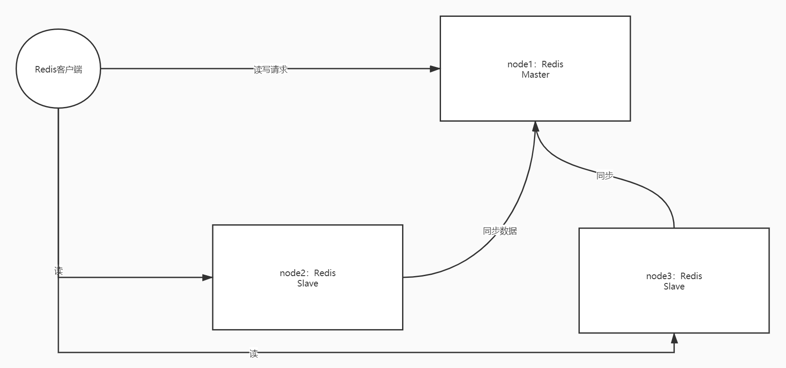

    - **设计**

      - 分布式主从架构
      - Master：主节点，负责对外提供数据的读写【写只能写Master节点】
      - Slave：从节点
        - 负责对外提供读的请求【默认不能，可以开启写，但没用，不建议开启】
        - 负责与主节点同步数据
      - 特点：主从节点上的数据都是一致的，连接任何一个节点实现读，默认写操作只能连接主节点

    - **优缺点**

      - 优点：实现了读写分离，分摊了读写的压力负载，如果一台Redis的Slave故障，其他的Redis服务节点照常对外提供服务
      - 缺点：如果Master故障，整个集群不能对外提供写的操作，Master没有HA机制

- **小结**：了解Redis架构中的问题及主从复制集群的设计


## 知识点04：【理解】Redis架构：哨兵集群的设计

- **目标**：**理解哨兵集群的设计**

- **实施**

  - **问题**

    ```
    主从复制集群的Master存在单点故障问题，怎么解决？
    ```

  - **哨兵设计**

    - **思想**：基于主从复制模式之上封装了哨兵模式，**如果Master出现故障，让Slave选举成为新的Master**

    - **实现**：**哨兵进程**实现

      - 必须能发现Master的故障
      - 必须负责重新选举新的Master

    - **架构**

      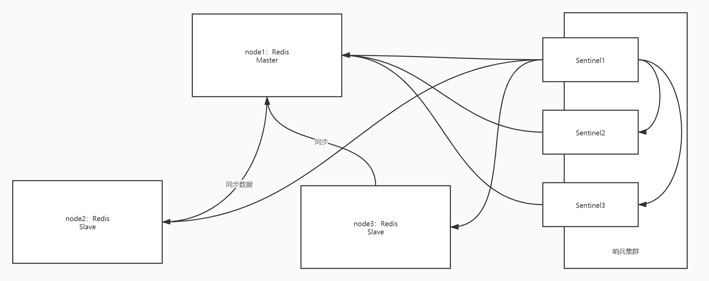

      - Redis主从架构
      - 哨兵进程：每个哨兵负责监听所有Redis节点和其他哨兵
        - 为什么要监听所有Redis的节点？
          - Master：发现Master是否故障
        - Slave：为了选举一个新的Master
        - 为什么要监听别的哨兵？
        - 避免哨兵故障
    
    - 哨兵功能
    
    - 集群监控：监控节点状态
      - 消息通知：汇报节点状态
    - 故障转移：实现Master重新选举
    
    - 配置中心：实现配置同步
    
    - **流程**
    
      - step1：如果Master突然故障，有一个哨兵会发现这个问题，这个哨兵会立即通告给所有哨兵
        - 主观性故障【sdown】
      - step2：当有一定的个数的哨兵都通告Master故障了，整体认为Master故障了
      - 客观性故障【odown】
      - step3：所有哨兵根据每台Slave通信的健康状况以及Slave权重选举一个新的Master
    - step4：将其他所有的Slave的配置文件中的Master切换为当前最新的Master
    
    - **优点**：简单方案解决了Master单点故障问题
    
    - **缺点**：存储空间依旧只有1台机器

- **小结**：理解哨兵集群的设计


## 知识点05：【掌握】Redis架构：分片Cluster集群的设计

- **目标**：**掌握分片集群的设计**

- **实施**

  - **问题**

    ```
    Redis哨兵集群中的存储容量只有单台机器，如何解决大量数据使用Redis存储问题？
    ```

  - **分片集群设计**

    - 哨兵模式：解决了单点故障

    - 分片集群模式：解决了单点故障和单机资源不足的问题

    - **思想**：将多个Redis小集群从逻辑上合并为一个大集群，每个小集群分摊一部分槽位【理解为一个范围】，对每一条Redis的数据进行槽位计算，这条数据属于哪个槽位，就存储对应槽位的小集群中

      - 分片的规则：**根据Key进行槽位运算：CRC16【K】 &  16383 =  0  ~ 16383**

      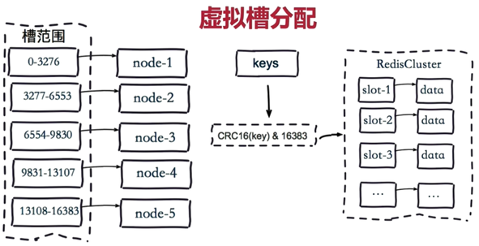

    - **架构**

      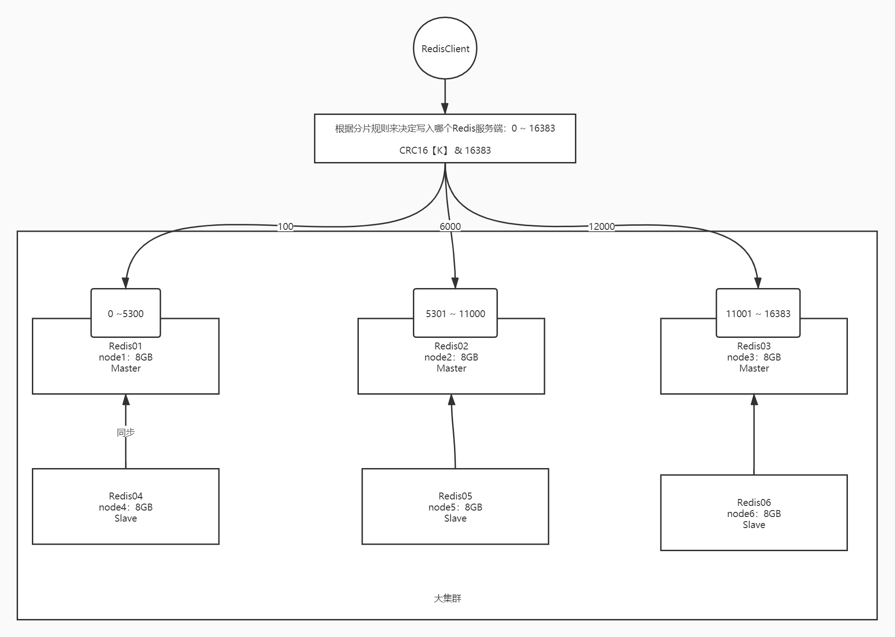

- **小结**：掌握分片集群的设计


## 知识点06：【实现】Redis架构：分片Cluster集群的实现

- **目标**：**实现分片集群的搭建**

- **实施**

  - 如果搭建了哨兵集群【不建议搭】，请先**关闭所有机器的redis服**务与哨兵服务

  - 三台机器都保证有C语言环境

    ```shell
    yum -y install gcc-c++ tcl
    ```

    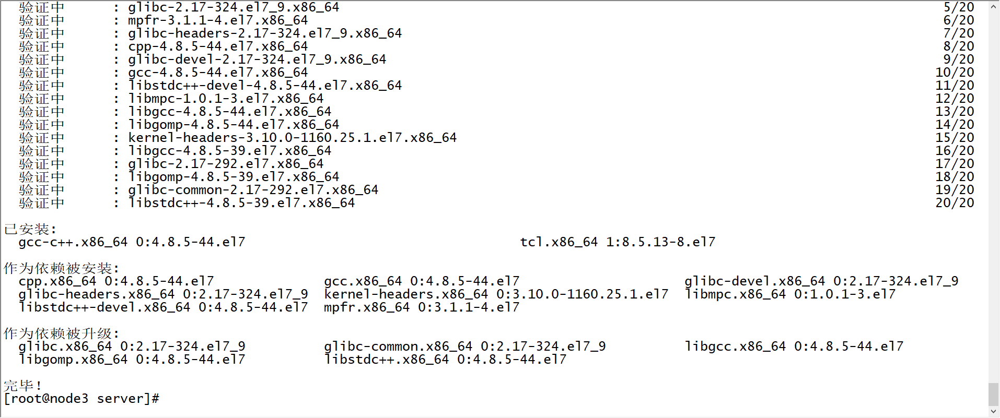

  - 第一天机器先安装
  
  - 创建两个服务目录

    ```shell
    # 创建目录：7001和7002
    cd /export/server/redis
    mkdir -p 7001 7002
    ```
    
    
    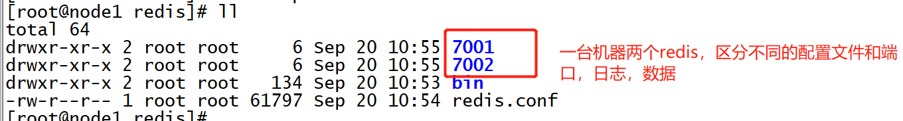
    
- 配置7001
  
    ```shell
    cd /export/server/redis
    cp /export/server/redis-5.0.8/redis.conf 7001/redis_7001.conf
    vim 7001/redis_7001.conf
    ```
  
    ```shell
    #69行
    bind 0.0.0.0
    #88行
    protected-mode no
    #92行
    port 7001
    #136行
    daemonize yes
    #158行
    pidfile /var/run/redis_7001.pid
    #171行
    logfile "/export/server/redis-5.0.8-bin/7001/logs/redis.log"
    #263行
    dir /export/server/redis-5.0.8-bin/7001/datas/
    #293行
    masterauth 123456
    #507行
    requirepass 123456
    #699行
    appendonly yes
    #832行
    cluster-enabled yes
    #840行
    cluster-config-file nodes-7001.conf
    #846行
    cluster-node-timeout 15000
    ```
  
    ```
    # 创建7001的日志和数据目录
    mkdir -p /export/server/redis/7001/logs
    mkdir -p /export/server/redis/7001/datas
    ```
  
  - 配置7002
  
  - 拷贝
  
      ```shell
    cd /export/server/redis
      cp 7001/redis_7001.conf 7002/redis_7002.conf
      ```
  
    - 替换：修改redis_7002.conf
  
      ```
      所有7001换成7002
    ```
  
  
    - 创建目录
  
      ```shell
    mkdir -p /export/server/redis/7002/logs
      mkdir -p /export/server/redis/7002/datas
      ```
  
  - 发送给node2和node3
  
    ```shell
    cd /export/server
    scp -r redis-5.0.8-bin root@node2:$PWD
    scp -r redis-5.0.8-bin root@node3:$PWD
    ```
  
  - 其他两台创建软连接
  
    ```
    cd /export/server
    ln -s redis-5.0.8-bin redis
    ```
  
  
  - 启动服务：三台机器启动所有redis进程
  
    ```
    /export/server/redis/bin/redis-server /export/server/redis/7001/redis_7001.conf
    /export/server/redis/bin/redis-server /export/server/redis/7002/redis_7002.conf
    ```
  

    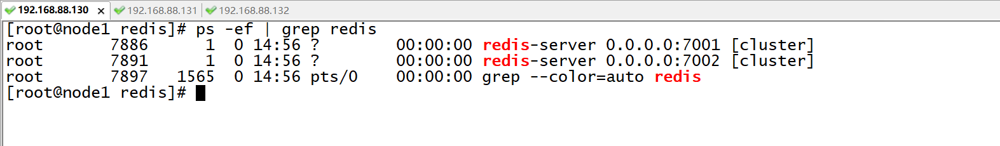
  
  - 初始化配置集群：**==改成自己的IP【第一次才需要，后面启动就不需要了】==**
  
    ```shell
    redis-cli -a 123456 --cluster create \
    192.168.88.221:7001 192.168.88.221:7002 \
    192.168.88.222:7001 192.168.88.222:7002 \
    192.168.88.223:7001 192.168.88.223:7002 \
    --cluster-replicas 1
    ```

  - --cluster-replicas ：每个小的集群有几个副本，不包含master：用于计算几个小集群，每个小集群有几个节点
  
    - 举例
  
        - 如果为1：每个小集群的slave = 1 + 1个Master = 2台节点，总共6个节点，每个小集群2个节点 = 3个小集群
      - 如果为2：每个小集群的slave = 2  + 1 个Master = 3台节点，总共6个节点，每个小集群3个节点 = 2个小集群
        - 如果为0：每个小集群的slave = 0 + 1个Master = 1 台节点，总共6个节点，每个小集群1个节点= 6个小集群
  
    - 结果
  
      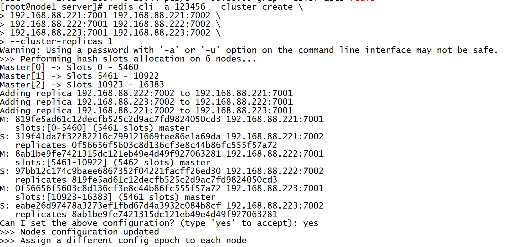
    
      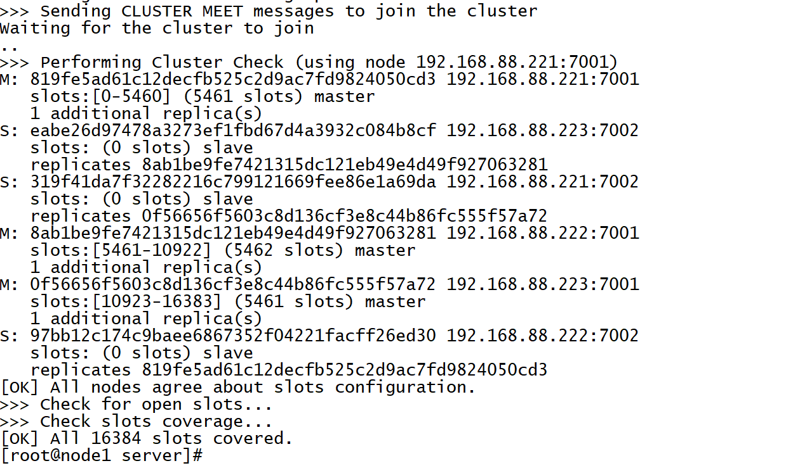
  
  - 连接集群
  
    ```
    redis-cli -c -h node1 -p 7001 -a 123456 
    ```
  
    - -c：分片集群模式
    - -a：客户端连接密码
  
  - 测试：cluster nodes
  
    ```
    [root@node1 ~]# redis-cli -c -h node3 -p 7002 -a 123456
    Warning: Using a password with '-a' or '-u' option on the command line interface may not be safe.
    node3:7002> keys *
    1) "s3"
    node3:7002> get s3
    -> Redirected to slot [6970] located at 192.168.88.222:7001
    "spark"
    192.168.88.222:7001> get s1
    -> Redirected to slot [15224] located at 192.168.88.223:7001
    "hadoop"
    192.168.88.223:7001> get s3
    -> Redirected to slot [6970] located at 192.168.88.222:7001
    "spark"
    192.168.88.222:7001> get s1
    -> Redirected to slot [15224] located at 192.168.88.223:7001
    "hadoop"
    192.168.88.223:7001> get s3
    -> Redirected to slot [6970] located at 192.168.88.223:7002
    "spark"
    192.168.88.223:7002> 
    
    ```
  
    - 模拟某个Master故障，查看是否会由Slave提供服务
  
- 其他操作
  
  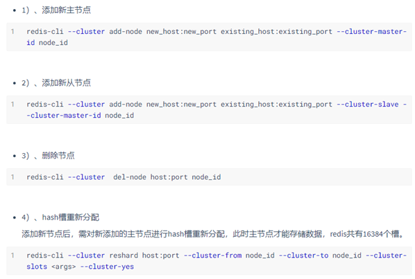
  
  - 启动脚本
  
  ```
  cd /export/server/redis
  vim bin/redis-cluster-start.sh
  ```
  
    ```shell
  #!/bin/bash
  REDIS_HOME=/export/server/redis
  
  # Start Server
  ## node1
  ssh node1 "${REDIS_HOME}/bin/redis-server /export/server/redis/7001/redis_7001.conf"
  ssh node1 "${REDIS_HOME}/bin/redis-server /export/server/redis/7002/redis_7002.conf"
  
  ## node2
  ssh node2 "${REDIS_HOME}/bin/redis-server /export/server/redis/7001/redis_7001.conf"
  ssh node2 "${REDIS_HOME}/bin/redis-server /export/server/redis/7002/redis_7002.conf"
  
  ## node3
  ssh node3 "${REDIS_HOME}/bin/redis-server /export/server/redis/7001/redis_7001.conf"
  ssh node3 "${REDIS_HOME}/bin/redis-server /export/server/redis/7002/redis_7002.conf"
    ```
  
    ```shell
  # 添加执行权限
  chmod u+x bin/redis-cluster-start.sh
    ```
  
- 关闭脚本
  
  ```shell
  vim bin/redis-cluster-stop.sh
  ```
  
  ```shell
  #!/bin/bash
  
  REDIS_HOME=/export/server/redis
  # Stop Server
  ## node1
  ${REDIS_HOME}/bin/redis-cli -h node1 -p 7001 -a 123456 SHUTDOWN
  ${REDIS_HOME}/bin/redis-cli -h node1 -p 7002 -a 123456 SHUTDOWN
  ## node2
  ${REDIS_HOME}/bin/redis-cli -h node2 -p 7001 -a 123456 SHUTDOWN
  ${REDIS_HOME}/bin/redis-cli -h node2 -p 7002 -a 123456 SHUTDOWN
  ## node3
  ${REDIS_HOME}/bin/redis-cli -h node3 -p 7001 -a 123456 SHUTDOWN
  ${REDIS_HOME}/bin/redis-cli -h node3 -p 7002 -a 123456 SHUTDOWN
  ```
  
    ```shell
  chmod u+x bin/redis-cluster-stop.sh
    ```
  
  - Jedis中连接
  
    ```java
  JedisCluster jedisCluster = null;//分片集群连接对象    
    @Before
        public void getJedisCluster(){
            //构建连接池的配置对象
            JedisPoolConfig jedisPoolConfig = new JedisPoolConfig();
          jedisPoolConfig.setMaxTotal(30);//总连接数
            jedisPoolConfig.setMaxIdle(20);//最大空闲连接
          jedisPoolConfig.setMaxWaitMillis(1500);//等待时间
            //构建集群模式的额连接池
            HashSet<HostAndPort> sets = new HashSet<HostAndPort>();
            sets.add(new HostAndPort("node1",7001));
          sets.add(new HostAndPort("node1",7002));
            sets.add(new HostAndPort("node2",7001));
            sets.add(new HostAndPort("node2",7002));
            sets.add(new HostAndPort("node3",7001));
            sets.add(new HostAndPort("node3",7002));
            jedisCluster = new JedisCluster(sets,2000,2000,5,"123456",jedisPoolConfig);
      }
    ```
  
- **小结**：实现分片集群的搭建


## 知识点07：【了解】Redis的事务机制

- **目标**：**了解Redis的事务机制**

- **实施**

  - **事务定义**：事务是数据库操作的最小工作单元，包含原子性、一致性、隔离性、持久性

  - **Redis事务**：Redis一般不用事务

    - **Redis本身是单线程的，所以本身没有事务等概念**
    - **Redis 支持事务的本质是一组命令的集合**，**事务支持一次执行多个命令，串行执行每个命令**
    - 一旦Redis开启了事务，将**所有命令放入一个队列中，提交事务时，对整个队列中的命令进行执行**
    - redis事务就是一次性、顺序性、排他性的执行一个队列中的一系列命令
    - 没有隔离性：批量的事务命令执行前在缓存队列中，没有事务交叉，不存在脏读幻读等问题
    - **不能保证原子性**：单条命令是原子性执行的，但事务不保证原子性，且没有回滚机制，事务中任意命令执行失败，其余的命令仍会被执行。

  - **过程**：开启事务、提交命令、执行事务

  - **命令**

    - multi：开启事务
    - exec：执行事务
    - discard：取消事务

  - 测试1：正常使用

    ```
    set user1 hadoop1
    set user2 hadoop2
    get user1
    get user2
    multi
    set user1 hadoop3
    set user2 hadoop4
    exec
    get user1
    get user2
    ```

  - 测试2：语法【编译】错误

    ```
    flushdb
    set user1 hadoop1
    set user2 hadoop2
    get user1
    get user2
    multi
    set user1 hadoop3
    sets user2 hadoop4
    exec
    get user1
    get user2
    ```

  - 测试3：类型【运行】错误

    ```
    flushdb
    set user1 hadoop1
    set user2 hadoop2
    get user1
    get user2
    multi
    set user1 hadoop3
    lpush user2 hadoop4
    exec
    get user1
    get user2
    ```

  - 测试4：取消事务

    ```
    flushdb
    set user1 hadoop1
    set user2 hadoop2
    get user1
    get user2
    multi
    set user1 hadoop3
    set user2 hadoop4
    discard
    get user1
    get user2
    ```

- **小结**：了解Redis的事务机制


## 知识点08：【了解】Redis过期策略与内存淘汰机制

- **目标**：**了解Redis的过期策略与内存淘汰机制**

- **实施**

  - **内存问题**

    ```
    Redis使用的是内存，内存如果满了，怎么解决？
    ```

    - 场景：大数据量缓存、小数据量持久性存储
    - 方案一：避免内存满，不需要持久存储的数据进行自动过期
      - 命令：expire、setex：让数据自动过期
      - **Redis怎么知道这个数据过期了呢？过期监听方案是什么**
    - 方案二：内存淘汰机制，内存达到上限，需要将不需要的数据从内存中踢出去
      - 淘汰谁呢？

  - **过期策略**

    - 设计思想：避免内存满，指定Key的存活时间，到达存活时间以后自动删除

    - **定时过期**：指定Key的存活时间，一直监听这个存活时间，一旦达到存活时间，自动删除

      - 需要CPU一直做监听，如果Key比较多，CPU的消耗比较严重

    - **惰性过期**：指定Key的存活时间，当使用这个Key的时候，判断是否过期，如果过期就删除

      - 如果某个Key设置了过期时间，但是一直没有使用，不会被发现过期了，就会导致资源浪费

    - **定期过期**：每隔一段时间就检查数据是否过期，如果过期就进行删除

      - 中和的策略机制

    - ==**Redis中使用了惰性过期和定期过期两种策略共同作用**==

  - **淘汰机制**

    - 设计思想：内存满了，怎么淘汰

    - Redis的内存淘汰策略是指在Redis的用于**缓存**的内存不足时，怎么处理需要新写入且需要申请额外空间的数据， Redis 源码中的默认配置

      ```properties
      # MAXMEMORY POLICY: how Redis will select what to remove when maxmemory
      
      # is reached. You can select among five behaviors:
      
      #最大内存策略：当到达最大使用内存时，你可以在下面5种行为中选择，Redis如何选择淘汰数据库键
      
      #当内存不足以容纳新写入数据时
      
      # volatile-lru -> remove the key with an expire set using an LRU algorithm
      
      # volatile-lru ：在设置了过期时间的键空间中，移除最近最少使用的key。这种情况一般是把 redis 既当缓存，又做持久化存储的时候才用。
      
      # allkeys-lru -> remove any key according to the LRU algorithm
      
      # allkeys-lru ： 移除最近最少使用的key （推荐）
      
      # volatile-random -> remove a random key with an expire set
      
      # volatile-random ： 在设置了过期时间的键空间中，随机移除一个键，不推荐
      
      # allkeys-random -> remove a random key, any key
      
      # allkeys-random ： 直接在键空间中随机移除一个键，弄啥叻
      
      # volatile-ttl -> remove the key with the nearest expire time (minor TTL)
      
      # volatile-ttl ： 在设置了过期时间的键空间中，有更早过期时间的key优先移除 不推荐
      
      # noeviction -> don't expire at all, just return an error on write operations
      
      # noeviction ： 不做过键处理，只返回一个写操作错误。 不推荐
      
      # Note: with any of the above policies, Redis will return an error on write
      
      #       operations, when there are no suitable keys for eviction.
      
      # 上面所有的策略下，在没有合适的淘汰删除的键时，执行写操作时，Redis 会返回一个错误。下面是写入命令：
      
      #       At the date of writing these commands are: set setnx setex append
      
      #       incr decr rpush lpush rpushx lpushx linsert lset rpoplpush sadd
      
      #       sinter sinterstore sunion sunionstore sdiff sdiffstore zadd zincrby
      
      #       zunionstore zinterstore hset hsetnx hmset hincrby incrby decrby
      
      #       getset mset msetnx exec sort
      
      # 过期策略默认是：
      
      # The default is:
      
      # maxmemory-policy noeviction
      ```

    - 实际项目中设置内存淘汰策略：maxmemory-policy allkeys-lru，移除最近最少使用的key。

      - 缓存使用：allkeys-lru
      - 数据库使用：volatile-lru /  noeviction

- **小结**

  - 了解Redis的过期策略与内存淘汰机制


## 附录一：Redis常见面试题

- **分片集群问题**

  ​	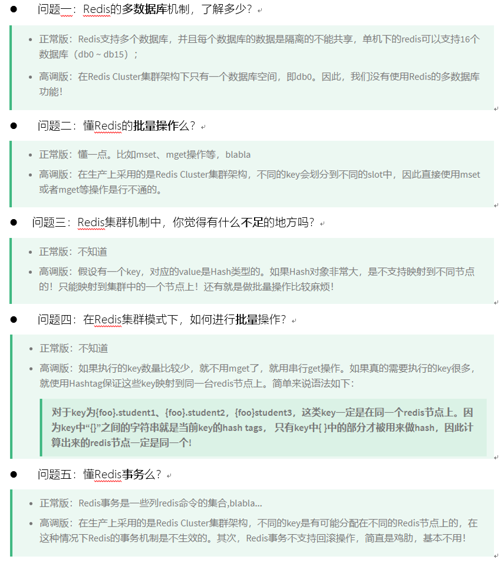

- **常见面试题**

  - **什么是缓存穿透，怎么解决？**

    - 现象：**客户端高并发不断向Redis请求一个不存在的Key，MySQL中也没有**

      - 由于Redis没有，导致这个并发全部落在MySQL上

    - 解决

      - step1：对于那些每秒访问频次过高的IP进行限制，拒绝访问

      - step2：如果第一次redis中没有，读MYSQL，MySQL也没有，在Redis中设置一个临时默认值

      - step3：利用BitMap类型构建**布隆过滤器**

        - MySQL
          - 1    hadoop
          - 2    hive
          - 3    hive
          - 4     spark
          - 5     hue
          - 10   oozie

        ```
        111110000100000000000000000000000000000000000000000000000000
        ```

        - 如果用户请求一个Key，对Key进行计算取余一个数字：10

        - 将MySQL中如果存在的数据都设置为1

        - 如果用户请求1：MySQL中有，可以请求

        - 如果用户请求8：MySQL中没有这个值，不可以请求MySQL

        - 说你有，你不一定有，说你没有，你肯定没有

          

  - **什么是缓存击穿，怎么解决？**

    - 现象：有一个Key，经常需要高并发的访问，这个Key有过期时间的，一旦达到过期时间，这个Key被删除，所有高并发落到了MySQL中，被击穿了

    - 解决

      - step1：资源充足的情况下，设置永不过期

      - step2：对这个Key做一个互斥锁，只允许一个请求去读取，其他的所有请求先阻塞掉

        - 第一个请求redis中没有读取到，读了MySQL，再将这个数据放到Redis中

        - 释放所有阻塞的请求

          

  - **什么是缓存雪崩，怎么解决？**

    - 现象：大量的Key在同一个时间段过期，大量的Key的请求在Redis中都没有，都去请求MySQL，导致MySQL奔溃

    - 解决

      - step1：资源充足允许的情况下，设置大部分的Key不过期

      - step2：给所有Key设置过期时间时加上随机值，让Key不再同一时间过期

        

  - **Redis中的Key怎么设计？**

    - 使用统一的命名规范

    - 一般使用业务名(或数据库名)为前缀，用冒号分隔，例如，业务名:表名:id，shop:usr:msg_code（电商:用户:验证码）

    - 控制key名称的长度，不要使用过长的key
    - 在保证语义清晰的情况下，尽量减少Key的长度。有些常用单词可使用缩写，例如，user缩写为u，messages缩写为msg

    - 名称中不要包含特殊字符、包含空格、单双引号以及其他转义字符

    

  - **为什么Redis是单线程的？**

    - 因为Redis是基于内存的操作，CPU不是Redis的瓶颈

    - Redis的瓶颈最有可能是机器内存的大小或者网络带宽

    - 单线程容易实现，而且CPU不会成为瓶颈，所以没必要使用多线程增加复杂度

    - 可以使用多Redis压榨CPU，提高性能

    - 多线程模型虽然在某些方面表现优异，但是它却引入了程序执行顺序的不确定性，带来了并发读写的一系列问题，增加了系统复杂度、同时可能存在线程切换、甚至加锁解锁、死锁造成的性能损耗

    - 注意：Redis4之后并不是严格意义的单线程，除了主线程外，它也有后台线程在处理一些较为缓慢的操作，例如清理脏数据、无用连接的释放、大 key 的删除等等

      

  - **为什么单线程的Redis的性能很高？**

    - 完全基于内存，非常快速

    - 数据结构简单，对数据操作也简单

    - 采用单线程，避免了不必要的上下文切换和竞争条件

    - 多路I/O复用模型，非阻塞IO

      

  - **Redis6.0为什么要引入多线程呢？**

    - Redis将所有数据放在内存中，内存的响应时长大约为100纳秒
    - 对于小数据包，Redis服务器的极限可以处理80,000到100,000 QPS
    - 但随着越来越复杂的业务场景，有些公司动不动就上亿的交易量，因此需要更大的QPS
    - 方案一：分布式可以解决，但维护成本高，命令受限，容易产生数据热点倾斜，整体维护更加复杂
    - 方案二：对于Redis自身使用更好的网络模型及CPU多线程模型
    - Redis6.0默认不开启多线程，需要修改配置