# 分布式实时消息队列Kafka（一）

## 知识点01：课程回顾

1. Redis集群设计

   - 问题1：Redis存在单点故障问题以及单机资源不足问题
   - 解决1：主从复制集群
     - Master：主：负责接收读写请求
     - Slave：从：负责接收读请求，与Master同步数据
   - 问题2：主从复制中存在Master单点故障问题
   - 解决2：基于主从复制集群之上构建哨兵集群
     - Sentinel：哨兵进程：监控所有节点，实现故障发现和Master选择，配置更新
   - 问题3：单台节点的资源受限
   - 解决3：Cluster分片集群
     - 设计：将多个小的集群从逻辑上构建成一个大集群，每一个小集群分摊一部分槽位
       - 分摊槽位目的：便于划分数据的存储
       - 槽位计算规则：CRC16(Key) & 16383，槽位相同但是Key不一定相同

2. Redis事务：了解为主，有，但不完善也不用

   

## 知识点02：课程目标

1. Redis补充
   - 目标：了解Redis过期策略，内存淘汰机制以及常见面试题
2. 消息队列介绍
   - 目标：理解消息对应的功能和应用场景
3. Kafka介绍及核心概念
   - 目标：掌握Kafka**功能和应用场景**、**==核心概念==**
4. Kafka的基础使用
   - 目标：实现Kafka分布式集群搭建以及测试，**掌握Topic的管理**


# ==【模块一：Redis补充】==

## 知识点03：【了解】Redis过期策略与内存淘汰机制

- **目标**：**了解Redis的过期策略与内存淘汰机制**

- **实施**

  - **内存问题**

    ```
    Redis使用的是内存，内存如果满了，怎么解决？
    ```

    - 场景：大数据量缓存、小数据量持久性存储
    - 方案一：避免内存满，不需要持久存储的数据进行自动过期
      - 命令：expire、setex：让数据自动过期
      - **Redis怎么知道这个数据过期了呢？过期监听方案是什么**
    - 方案二：内存淘汰机制，内存达到上限，需要将不需要的数据从内存中踢出去
      - 淘汰谁呢？

  - **过期策略**

    - 设计思想：避免内存满，指定Key的存活时间，到达存活时间以后自动删除

    - **定时过期**：指定Key的存活时间，一直监听这个存活时间，一旦达到存活时间，自动删除
- 需要CPU一直做监听，如果Key比较多，CPU的消耗比较严重
      
- **惰性过期**：指定Key的存活时间，当使用这个Key的时候，判断是否过期，如果过期就删除
    - 如果某个Key设置了过期时间，但是一直没有使用，不会被发现过期了，就会导致资源浪费
  
    - **定期过期**：每隔一段时间就检查数据是否过期，如果过期就进行删除
- 中和的策略机制
      
- ==**Redis中使用了惰性过期和定期过期两种策略共同作用**==
    
- **淘汰机制**
  
  - 设计思想：内存满了，怎么淘汰
  
  - Redis的内存淘汰策略是指在Redis的用于**缓存**的内存不足时，怎么处理需要新写入且需要申请额外空间的数据， Redis 源码中的默认配置
  
    ```properties
      # MAXMEMORY POLICY: how Redis will select what to remove when maxmemory
    
      # is reached. You can select among five behaviors:
      
      #最大内存策略：当到达最大使用内存时，你可以在下面5种行为中选择，Redis如何选择淘汰数据库键
      
      #当内存不足以容纳新写入数据时
      
      # volatile-lru -> remove the key with an expire set using an LRU algorithm
      
      # volatile-lru ：在设置了过期时间的键空间中，移除最近最少使用的key。这种情况一般是把 redis 既当缓存，又做持久化存储的时候才用。
      
      # allkeys-lru -> remove any key according to the LRU algorithm
      
      # allkeys-lru ： 移除最近最少使用的key （推荐）
      
      # volatile-random -> remove a random key with an expire set
      
      # volatile-random ： 在设置了过期时间的键空间中，随机移除一个键，不推荐
      
      # allkeys-random -> remove a random key, any key
      
      # allkeys-random ： 直接在键空间中随机移除一个键，弄啥叻
      
      # volatile-ttl -> remove the key with the nearest expire time (minor TTL)
      
      # volatile-ttl ： 在设置了过期时间的键空间中，有更早过期时间的key优先移除 不推荐
      
      # noeviction -> don't expire at all, just return an error on write operations
      
      # noeviction ： 不做过键处理，只返回一个写操作错误。 不推荐
      
      # Note: with any of the above policies, Redis will return an error on write
      
      #       operations, when there are no suitable keys for eviction.
      
      # 上面所有的策略下，在没有合适的淘汰删除的键时，执行写操作时，Redis 会返回一个错误。下面是写入命令：
      
      #       At the date of writing these commands are: set setnx setex append
      
      #       incr decr rpush lpush rpushx lpushx linsert lset rpoplpush sadd
      
      #       sinter sinterstore sunion sunionstore sdiff sdiffstore zadd zincrby
      
      #       zunionstore zinterstore hset hsetnx hmset hincrby incrby decrby
      
      #       getset mset msetnx exec sort
      
      # 过期策略默认是：
      
      # The default is:
      
      # maxmemory-policy noeviction
      ```
  
    - 实际项目中设置内存淘汰策略：maxmemory-policy allkeys-lru，移除最近最少使用的key。
  
    - 缓存使用：allkeys-lru
      - 数据库使用：volatile-lru /  noeviction

- **小结**：了解Redis的过期策略与内存淘汰机制


## 知识点04：【了解】Redis常见面试题

- **分片集群问题**

  ​	

- **常见面试题**

  - **什么是缓存穿透，怎么解决？**

    - 现象：**客户端高并发不断向Redis请求一个不存在的Key，MySQL中也没有**

      - 由于Redis没有，导致这个并发全部落在MySQL上

    - 解决

      - step1：对于那些每秒访问频次过高的IP进行限制，拒绝访问

      - step2：如果第一次redis中没有，读MYSQL，MySQL也没有，在Redis中设置一个临时默认值

      - step3：利用BitMap类型构建**布隆过滤器**

        - MySQL
          - 1    hadoop
          - 2    hive
          - 3    hive
          - 4     spark
          - 5     hue
          - 10   oozie

        ```
        111110000100000000000000000000000000000000000000000000000000
        ```

        - 如果用户请求一个Key，对Key进行计算取余一个数字：10

        - 将MySQL中如果存在的数据都设置为1

        - 如果用户请求1：MySQL中有，可以请求

        - 如果用户请求8：MySQL中没有这个值，不可以请求MySQL

        - 说你有，你不一定有，说你没有，你肯定没有

          

  - **什么是缓存击穿，怎么解决？**

    - 现象：有一个Key，经常需要高并发的访问，这个Key有过期时间的，一旦达到过期时间，这个Key被删除，所有高并发落到了MySQL中，被击穿了

    - 解决

      - step1：资源充足的情况下，设置永不过期

      - step2：对这个Key做一个互斥锁，只允许一个请求去读取，其他的所有请求先阻塞掉

        - 第一个请求redis中没有读取到，读了MySQL，再将这个数据放到Redis中

        - 释放所有阻塞的请求

          

  - **什么是缓存雪崩，怎么解决？**

    - 现象：大量的Key在同一个时间段过期，大量的Key的请求在Redis中都没有，都去请求MySQL，导致MySQL奔溃

    - 解决

      - step1：资源充足允许的情况下，设置大部分的Key不过期

      - step2：给所有Key设置过期时间时加上随机值，让Key不再同一时间过期

        

  - **Redis中的Key怎么设计？**

    - 使用统一的命名规范

    - 一般使用业务名(或数据库名)为前缀，用冒号分隔，例如，业务名:表名:id，shop:usr:msg_code（电商:用户:验证码）

    - 控制key名称的长度，不要使用过长的key
    - 在保证语义清晰的情况下，尽量减少Key的长度。有些常用单词可使用缩写，例如，user缩写为u，messages缩写为msg

    - 名称中不要包含特殊字符、包含空格、单双引号以及其他转义字符

    

  - **为什么Redis是单线程的？**

    - 因为Redis是基于内存的操作，CPU不是Redis的瓶颈

    - Redis的瓶颈最有可能是机器内存的大小或者网络带宽

    - 单线程容易实现，而且CPU不会成为瓶颈，所以没必要使用多线程增加复杂度

    - 可以使用多Redis压榨CPU，提高性能

    - 多线程模型虽然在某些方面表现优异，但是它却引入了程序执行顺序的不确定性，带来了并发读写的一系列问题，增加了系统复杂度、同时可能存在线程切换、甚至加锁解锁、死锁造成的性能损耗

    - 注意：Redis4之后并不是严格意义的单线程，除了主线程外，它也有后台线程在处理一些较为缓慢的操作，例如清理脏数据、无用连接的释放、大 key 的删除等等

      

  - **为什么单线程的Redis的性能很高？**

    - 完全基于内存，非常快速

    - 数据结构简单，对数据操作也简单

    - 采用单线程，避免了不必要的上下文切换和竞争条件

    - 多路I/O复用模型，非阻塞IO

      

  - **Redis6.0为什么要引入多线程呢？**

    - Redis将所有数据放在内存中，内存的响应时长大约为100纳秒
    - 对于小数据包，Redis服务器的极限可以处理80,000到100,000 QPS
    - 但随着越来越复杂的业务场景，有些公司动不动就上亿的交易量，因此需要更大的QPS
    - 方案一：分布式可以解决，但维护成本高，命令受限，容易产生数据热点倾斜，整体维护更加复杂
    - 方案二：对于Redis自身使用更好的网络模型及CPU多线程模型
    - Redis6.0默认不开启多线程，需要修改配置


# ==【模块二：消息队列的介绍】==


## 知识点05：【了解】消息队列：MQ介绍

- **目标**：**了解消息队列的功能，应用场景及特点**

- **实施**

  - **问题**：在这个架构中，如果高并发的写比较多怎么办？

    

  - **举个栗子**：让A将数据传递给B、C、D三个系统分别做不同的数据处理

    - 常规做法

      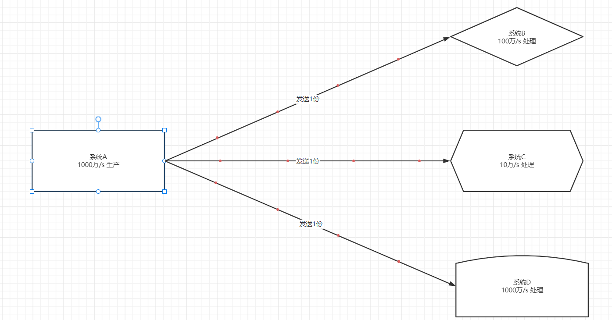

    - 问题

      - 读写速度：不匹配，导致接受数据的一方数据丢失或者故障，影响需求的实现
      - 架构变化：高耦合，频繁的需要将数据生产者停止运行，修改代码，影响业务
      - 串行处理：慢，挨个实现发送，按照顺序一个一个来实现数据传输

    - 解决：消息中间件=消息队列：MQ

      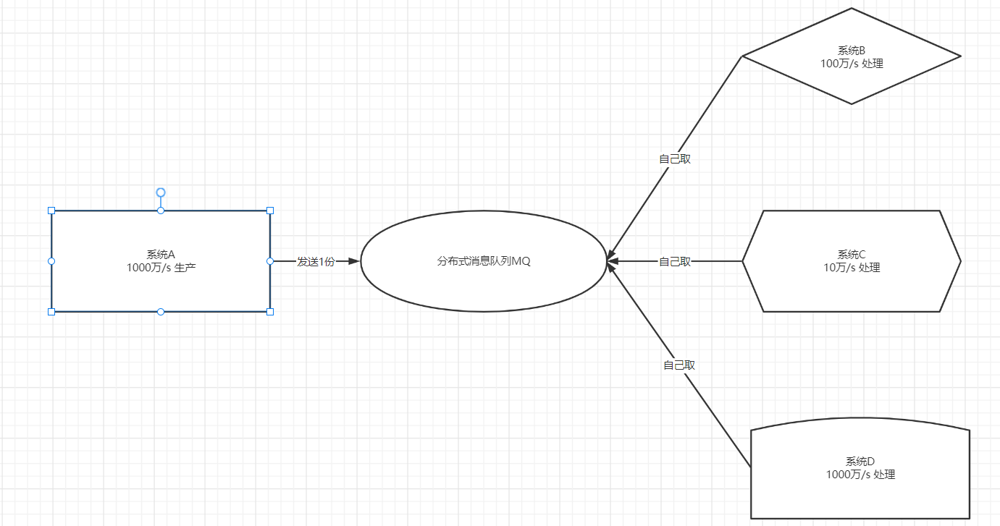

      

  - **定义**
    
    - 官方定义：消息队列是一种异步的服务间通信方式,是分布式系统中重要的组件,主要解决应用耦合,异步消息,流量削锋等问题,实现高性能,高可用,可伸缩和最终一致性架构。
  - 简单点说：**消息队列MQ用于实现两个系统之间或者两个模块之间传递消息数据时，实现数据缓存**
    
  - **功能**

    - 基于队列的方式，实现消息传递的数据缓存
    - 保证消息传递有序性：队列先进先出，消息队列的实现先产生的先消费

  - **应用场景**

    - 用于所有需要实现实时、高性能、高吞吐、高可靠的消息传递架构中
    - 大数据应用中：作为唯一的实时数据存储平台

  - **优点**

    - **实现了架构解耦**：将架构中的高耦合转换为低耦合，更加灵活
    - **实现异步，提高传输性能**：生产一次，所有消费都可以并行
    - **限流削峰**：不用再考虑不同时间资源分配不均衡的问题

  - **缺点**

    - 增加了消息队列，架构运维更加复杂：一旦消息队列故障，整个系统全部崩溃
      - **必须保证消息队列是高可靠：分布式架构设计**
    - 数据保证更加复杂，必须保证生产安全和消费安全：每一步都必须不丢失和不重复
      - ==**必须保证生产者生产数据到消息队列中不丢失不重复**==
      - ==**必须保证消费者从消息队列中消费数据不丢失不重复**==

- **小结**：了解消息队列的功能，应用场景及特点


## 知识点06：【掌握】消息队列：订阅发布模式

- **目标**：**掌握消息队列中消息传递的订阅发布模式**

- **实施**

  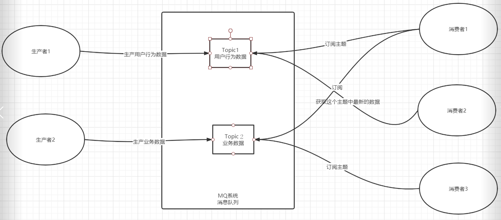

  - 角色
    - 生产者：负责往消息队列中写数据
      - 功能：产生数据的程序，用于将产生的数据写入MQ
    - 消息队列：临时存放两个系统之间需要传递的数据
      - 功能：介于生产和消费之间，临时缓存中间的数据
    - 消费者：负责从消息队列中读数据
      - 功能：读取并处理数据的程序，用于从MQ读取数据进行处理
    - 主题：数据的分类，用于区分消息队列中不同的业务的数据
      - 功能：用于区分不同的数据来源
  - 流程
    - step1：生产者往**消息队列**中生产数据，将数据写入对应的**主题**中
    - step2：消费者可以订阅主题，如果主题中出现新的数据，消费就可以立即消费
  - 特点：**一个消费者可以订阅多个主题，一个主题可以被多个消费者订阅**
    - 消费成功以后，不会立即主动删除数据
    - 可以实现数据共享
  - 理解：**订阅发布模式高度类似于微信公众号概念：一个公众号可以被多个人订阅，一个人可以订阅多个公众号**

- **小结**：掌握消息队列中消息传递的订阅发布模式


# ==【模块三：Kafka的介绍及核心概念】==

## 知识点07：【掌握】Kafka的介绍及特点

- **目标**：**掌握Kafka的功能、特点及应用场景**

- **实施**

  - 官网：kafka.apache.org

  - 公司：领英LinkedIn公司基于Scala语言开发的工具

    ```scala
    // 读取数据
    val input = sc.textFile(path)
    
    // 处理数据
    val rsRdd = input
    			.flatMap(_.split(" "))
    			.map((_,1))
    			.reduceByKey(_+_)
    	
    // 保存二级果
    rsRdd.saveAsTextFile(outputPath)
    ```

    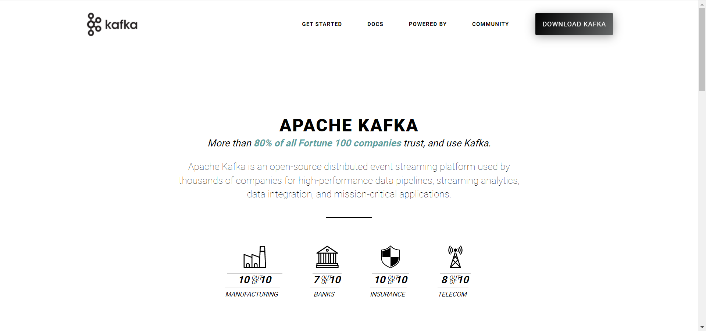

  - **功能**

    - 功能一：**分布式流式数据实时存储：分布式消息队列系统**【工作中主要使用的场景】
    - 功能二：分布式流式计算：分布式计算：KafkaStream

  - **定义**：**分布式的基于订阅发布模式的高吞吐高性能的实时消息队列系统**

  - **应用场景**：大数据实时计算的架构中，实现实时数据缓存的场景

    - 目前只要做实时大数据，都必用Kafka或者Pulsar

    - Kafka：作为大数据架构中**实时消息队列**，用于存储从外部同步到的所有实时数据，供实时计算引擎进行消费数据处理

      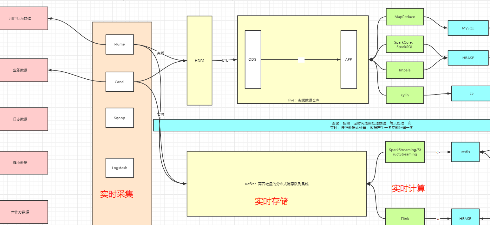

    - 生产者：实时采集工具：Flume

    - 消费者：实时计算引擎：Flink、Spark

  - **特点**

    - **高性能**：实时的对数据进行高性能的读写【内存+磁盘】
    - **高并发**：分布式并行读写
    - **高吞吐**：使用分布式磁盘存储
    - **高可靠**：分布式主从架构
    - **高安全性**：数据安全保障机制
      - **数据安全：存储在Kafka中的数据是相对安全的**
      - 传输安全：从理论上能保证数据生产和消费满足一次性语义：不丢失不重复
    - **高灵活性**：根据需求，随意添加生产者和消费者

- **小结**：Kafka在大数据中专门用于实现实时的数据存储，实现大数据实时计算


## 知识点08：【掌握】Kafka概念：生产和消费

- **目标**：**掌握Kafka中的Producer、Broker、Consumer概念及其功能**

- **实施**

  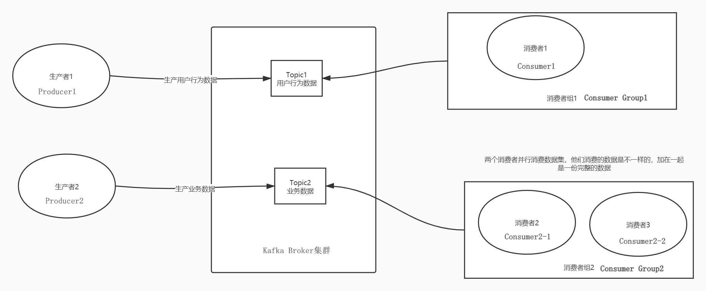

  - **Broker**：Kafka是一个分布式集群，多台机器构成，**每台Kafka的节点就是一个Broker**

    - Kafka节点：Broker
    - Kafka进程：Kafka
    - 多台机器启动Kafka进程，构建了多个Broker的Kafka集群

  - **Producer**：**生产者**

    - 功能：负责往Kafka写数据的客户端
    - 本质：写数据的客户端

  - **Consumer：消费者**

    - 功能：负责从Kafka中读取数据
    - 本质：读数据的客户端

  - **Consumer Group**：**消费者组，==Kafka的订阅发布模式中必须以消费者组的形式从Kafka中消费数据==**

    - **举个栗子**：公司有一个Topic，存储所有用户行为的数据共100条数据

      - 数据分析希望拿到一份：必须构建一个数据分析的消费者组

        - Consumer Group1

          ```
          consumer1:100条数据
          ```

      - 推荐系统希望拿到一份：必须构建一个推荐系统的消费者组

        - Consumer Group2

          ```
          consumer1:25条数据
          consumer2:10条数据
          consumer3:30条数据
          consumer4:35条数据
          ```

      - ……

    - ==**任何一个消费者必须属于某一个消费者组**==

    - 一个消费者组中可以有多个消费者：**多个消费者共同并行消费数据，提高消费性能**
      - **消费者组中多个消费者消费的数据是不一样的**
      - **整个消费者组中所有消费者消费的数据加在一起是一份完整的数据**

    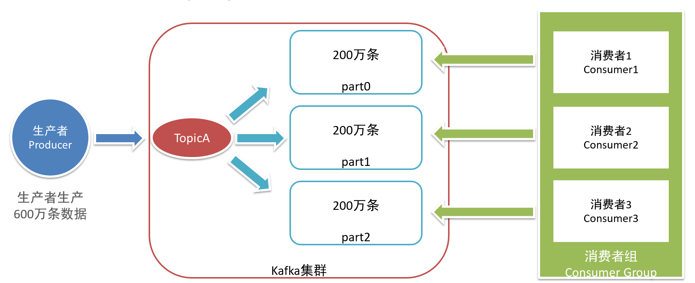

- **小结**：掌握Kafka中的Producer、Broker、Consumer概念及其功能

  

## 知识点09：【掌握】Kafka概念：Topic、Partition

- **目标**：**掌握Kafka中的Topic、Partition概念及其功能**

- **路径**

  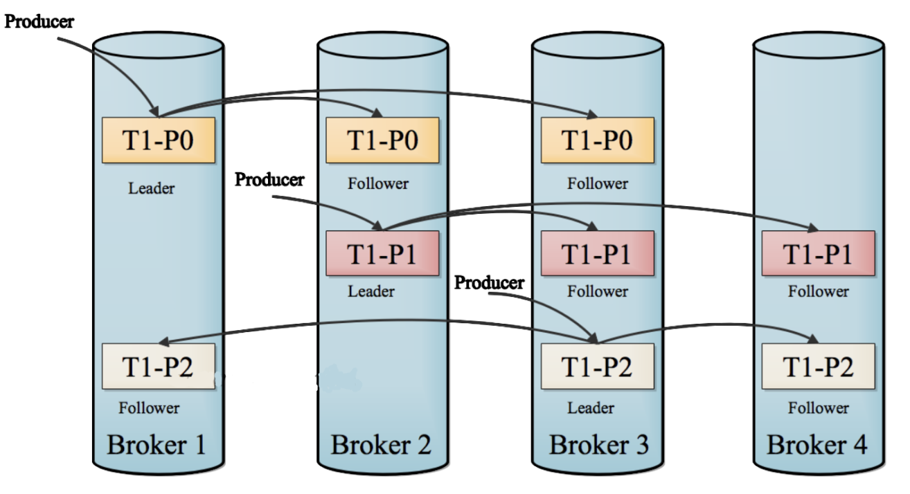

- **实施**

  - **Topic：数据主题**，用于区分不同的数据，**对数据进行分类**

    - Topic是Kafka中分布式的数据存储对象，类似于数据库中表的概念，但是Topic是分布式的
      - 类似于HDFS中文件的概念，不同的数据存储在不同的文件中，Kafka中不同的数据存储在不同的Topic中
    - Kafka是分布式存储，所以Kafka中的Topic也是分布式的概念，写入Topic的数据会分布式的存储在Kakfa中
      - 类似于HDFS中每个文件会被拆分成Block，每个Block会分散在不同的节点上存储
    
  - **Partition：数据分区**，用于**实现Topic的分布式存储**，对Topic的数据进行划分
    
      - 每个Topic都可以对应多个分区，每个分区存储在不同的Kafka节点Broker上
      - 例如上图中：Topic名称为T1，T1有三个分区：P0、P1、P2
      - 写入Topic：根据**一定的规则**决定写入哪个具体的分区
      
  - 类比HDFS
  
    | 概念 | HDFS               | Kafka            |
    | ---- | ------------------ | ---------------- |
    | 节点 | NameNode、DataNode | Broker           |
    | 对象 | 文件               | Topic            |
    | 划分 | 分块：Block        | 分区：Partition  |
    | 规则 | 按大小拆分：128M   | 自己指定分区个数 |
  
- **小结**：掌握Kafka中的Topic、Partition概念及其功能

  

## 知识点10：【掌握】Kafka概念：分区副本机制

- **目标**：**掌握Kafka中的分区副本机制**

- **路径**

  

- **实施**

  - **问题1：Kafka中的每个Topic的每个分区存储在不同的节点上，如果某个节点故障，怎么保证集群正常可用？**
    - Kafka选用了**副本机制**来保证数据的安全性
    - Kafka**每一个分区都可以有多个副本**，类似于HDFS的副本机制，一个块构建多个副本
    - 如果某台机器故障，其他机器还有这个分区的副本，其他机器的副本照样可以对外提供客户端读写
    - **注意：Kafka中一个分区的副本个数最多只能等于机器的个数**，相同分区的副本不允许放在同一台机器，没有意义
  - **问题2：一个分区有多个副本，读写这个分区的数据时候，到底读写哪个分区副本呢？**
    - Kafka将一个分区的多个副本，划分为两种角色
    - **Leader副本**：负责对外提供读写，生产者和消费者只对leader副本进行读写
    - **Follower副本**：与Leader同步数据，如果leader故障，从follower新的leader副本对外提供读写
    - 设计：方式类似于ZK中节点的设计，但是这里不是做节点的选举而是分区副本的选举
    - 实现：由**Kafka的主节点**根据机器的健康状态、数据的完整性来选择Leader和Follower副本

- **小结**：掌握Kafka的分区副本机制

  


## 知识点11：【理解】Kafka概念：Segment

- **目标**：**理解Kafka中的Segment概念及其功能**

- **路径**

  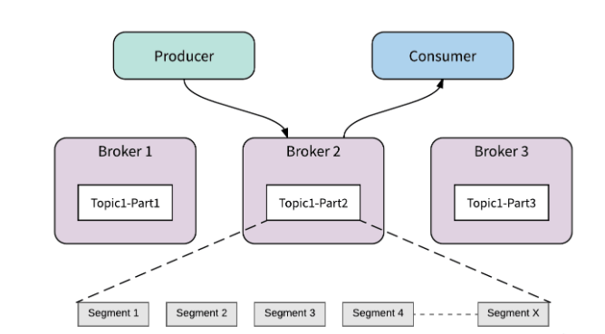

- **实施**

  - **本质**：对每个分区的数据进行了更细的划分，用于存储Kafka中的数据文件并记录索引

  - **规则**：先写入的数据会先生成一对Segment文件，存储到一定条件以后，后面数据写入另外一对Segment文件，每个文件就叫Segment文件对

  - **实现**：每个Segment对应两种【三个】文件

    - xxxxxxxxx.log：存储数据
    - xxxxxxxxx.index/xxxxxxxx.timeindex：对应.log的文件的索引

  - **设计**：**为了加快数据检索的效率**

    - 将数据按照规则写入不同文件，以后可以根据规则快速的定位数据所在的文件
    - 读取对应的小的segment文件，不用读取所有数据文件

  - **举例**

    - 如果不设计Segment，整个分区的所有数据都存储在一个文件中

      ```
      part2.log => 10G => 1亿
      ```
      
    - 当文件越来越大，存储的数据越来越多，影响读的性能，会再构建一个新的segment，老的segment不再被写入
      
        ```
        --第一个Segment：1G = 20万条
        00000000000000000000000.log  -- 0：这个文件中的最小的offset，也就是这个文件中存放的第一条数据偏移
        00000000000000000000000.index
        00000000000000000000000.timeindex
        
        --第二个Segment:1G = 20万条
        00000000000000000200000.log - 这个文件中最小的那条数据的offset为20万，就是这个分区的第20万01条数据
        00000000000000000200000.index
        00000000000000000200000.timeindex
        
        --第三个Segment：
        00000000000000000400000.log
        00000000000000000400000.index
        00000000000000000400000.timeindex
        
        ……
        ```
    
    
    - Segment文件的名字就是这个Segment记录的offset的最小值
      - **消费者消费数据是根据offset进行消费的**
      - 消费者1：想消费分区1:offset偏移量 = 39999这个offset开始消费
      - 先根据文件文件名来判断我要的offset在哪个文件中

- **小结**：理解Kafka中的Segment概念及其功能

  

## ==**知识点12：【掌握】Kafka概念：Offset**==

- **目标**：**掌握Kafka中的Offset概念及其功能**

- **实施**

  - **消息队列：将两个系统之间传递的数据进行缓存**

  - **问题**：怎么能保证这个顺序性，先写入的数据先被读取呢？

    - A：生产者

      ```
      a
      b
      c
      d
      ……
      ```

    - MQ：消息队列

      ```
      0-a
      1-b
      2-c
      3-d
      ……
      ```
    
    - B：消费者：只要按照编号进行顺序读取就可以保证消费的顺序
  
      ```
    a
      b
    c
      d
      ……
      ```
    
  - **定义**：**Offset是每条数据在自己分区中的偏移量**
  
    - 写入分区的顺序就是offset偏移量，**Offset是分区级别的，每个分区的offset独立管理，都从0开始**
    - 消息队列：先进先出
    - 先写入的offset就越小
    
    - 第一条数据的offset就为0
    - 第二条数据的offset就为1
    - ……
    - 第N条数据的offset就为N-1
    
  - **生成**：生产者往Kafka中写入数据，写入某个分区
    
      - **每个分区单独管理一套Offset【分区】**，offset从0开始对每条数据进行编号
      
      - Kafka写入数据也是按照KV来写入数据
  
        ```
      #Kafka中一条数据存储的结构
        offset		Key				Value
        ```
    
  - **功能**：**基于offset来指定数据的顺序，消费时候按照offset顺序来读取**
    
      - 消费者消费Topic分区中的数据是按照offset进行**分区级别顺序消费**的
      
      - 怎么保证**消费不丢失不重复**：只要保证消费者每次按照offset的顺序消费即可
  
        - 如果没有Offset
        - 从头取一遍：数据重复
        
        - 从最新的读：数据丢失    
        
      - **Kafka中所有消费者数据的读取都是按照Offset来读取数据**
      
        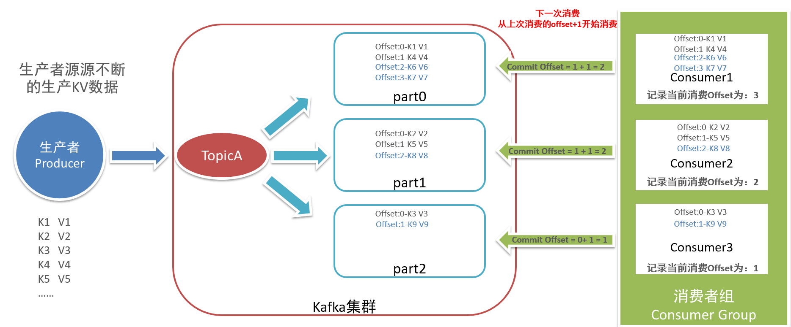
      
  
- **小结**：掌握Kafka中的Offset概念及其功能

  - Offset用于标记分区中的每条数据，消费者根据上一次消费的offset对分区继续进行消费，保证顺序
  - 实现保证数据不丢失不重复


## 知识点13：【掌握】Kafka概念：概念总结

- **目标**：**掌握Kafka中的概念**

- **路径**

  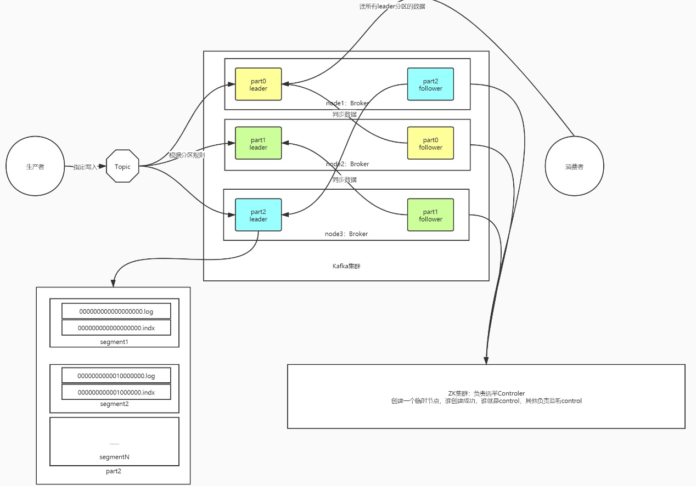

  

- **实施**

  | Kafka         | 解释                                                         |
  | :------------ | :----------------------------------------------------------- |
  | Producer      | Kafka生产者，负责往Kakfa写数据的客户端                       |
  | Consumer      | Kafka消费者，负责从Kafka读取数据的客户端                     |
  | ConsumerGroup | 消费者组，必须以消费组的形式才能消费，一个消费者组中可以包含多个消费者，任何一个消费者都必须属于某个消费者组 |
  | Broker        | Kafka节点，每个节点叫做一个Broker                            |
  | Topic         | 主题，用于区分不同的数据，实现数据分类，分布式逻辑的概念，一个Topic可以对应多个分区 |
  | Partition     | 分区，用于实现Kafka中Topic的分布式存储，每个分区可以分布在不同节点上，每个分区可以有多份 |
  | Replication   | 副本，用于保证Kafka中分区的数据安全，每个分区中副本个数小于等于节点个数，两种角色：Leader，Follower |
  | Segment       | 分区文件段，用于将分区中的数据按照一定的规则进行细分，加快查询性能，由两种文件组成，.log数据文件和.index索引文件 |
  | KV            | Kafka中写入数据也是KV结构                                    |
  | Offset        | 每条数据在分区中的偏移量，第N条件数据的offset = N-1，用于保证消费者按照offset顺序消费，一致性 |

- **小结**：掌握Kafka中的概念


# ==【模块四：Kafka集群架构及部署】==

## 知识点14：【理解】Kafka集群架构及角色功能

- **目标**：**理解Kafka集群架构及角色功能**

- **实施**

  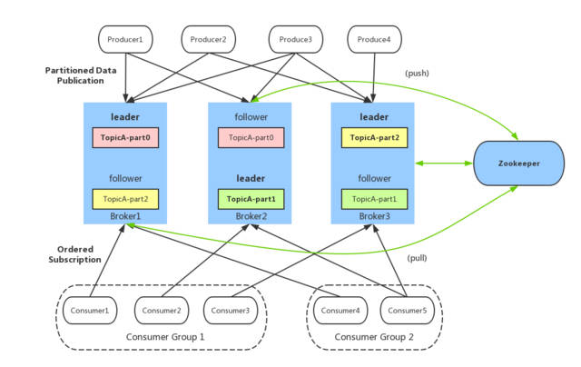

  

  - **Kafka中的每个角色以及对应的功能**
    - **分布式主从架构【公平】**：允许从节点选举成为主节点
    - 主：**Kafka Broker** **==【Controller】==**
      - 是一种特殊的Broker，从所有Broker中选举出来的，负责普通Broker的工作
      - 负责管理所有从节点：Topic、分区和副本【负责决定一个分区的leader副本和follower副本】
      - 每次启动集群，会从所有Broker中选举一个Controller，==**由ZK实现**==
    - 从：**Kafka Broker**
      - 对外提供读写请求
      - 其他的Broker监听Controller在ZK中创建的临时节点，如果Controller故障，会重新从Broker选举一个新的Controller
  - **ZK的功能**
    - 辅助选举Controller：启动时所有Broker都会到Zk中创建临时节点，谁创建成功谁就是主节点
    - 存储Kafka元数据
  - Kafka 3.0版本新特性：可以摆脱ZK，独立运行了

- **小结**：理解Kafka集群架构及角色功能


## 知识点15：【实现】Kafka分布式集群部署

- **目标**：**实现Kafka分布式集群的搭建部署**

- **实施**

  - **下载解压安装**

    - 下载：http://archive.apache.org/dist/kafka/

    - 上传到第一台机器

      ```shell
      cd /export/software/
      rz
      ```

    - 解压

      ```shell
      # 解压安装
      tar -zxvf kafka_2.12-2.4.1.tgz -C /export/server/
      cd /export/server/kafka_2.12-2.4.1/
      # Kafka数据存储的位置
      mkdir datas
      ```

  - **修改配置**

    - 切换到配置文件目录

      ```shell
      cd /export/server/kafka_2.12-2.4.1/config
      ```

      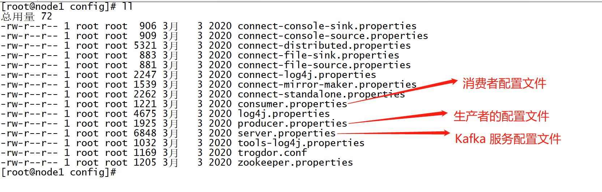

    - 修改server.properties：vim server.properties

      ```properties
      #21行：唯一的 服务端id
      broker.id=0
      #60行：指定kafka的日志及数据【segment【.log,.index】】存储的位置
      log.dirs=/export/server/kafka_2.12-2.4.1/datas
      #123行：指定zookeeper的地址
      zookeeper.connect=node1:2181,node2:2181,node3:2181
      #在最后添加两个配置，允许删除topic，当前kafkaServer的主机名
      delete.topic.enable=true
      host.name=node1
      ```

    - 分发

      ```shell
      cd /export/server/
      scp -r kafka_2.12-2.4.1 node2:$PWD
      scp -r kafka_2.12-2.4.1 node3:$PWD
      ```

    - 第二台：server.properties

      ```properties
      #21行：唯一的 服务端id
      broker.id=1
      #最后
      host.name=node2
      ```

    - 第三台：server.properties

      ```properties
      #21行：唯一的 服务端id
      broker.id=2
      #最后
      host.name=node3
      ```

    - 添加环境变量

      ```shell
      vim /etc/profile
      ```

      ```shell
      #KAFKA_HOME
      export KAFKA_HOME=/export/server/kafka_2.12-2.4.1
      export PATH=:$PATH:$KAFKA_HOME/bin
      ```

      ```shell
      source /etc/profile
      ```

- **小结**：实现Kafka分布式集群的搭建部署

  - 按照笔记一步步来，不做过多要求，知道配置含义，实现安装即可
  
  

## 知识点16：【实现】Kafka启动与关闭

- **目标**：**实现Kafka启动与关闭**

- **实施**

  - 启动Zookeeper

    ```shell
    start-zk-all.sh
    ```

  - 启动Kafka：只能启动当前节点

    ```shell
    cd /export/server/kafka_2.12-2.4.1/
    bin/kafka-server-start.sh config/server.properties >>/dev/null 2>&1 &
    ```
    
  - 关闭Kafka

    ```
  bin/kafka-server-stop.sh 
    ```

  - **封装Kafka脚本**

    - 启动脚本：**==不要从PDF复制==**

      ```shell
    vim /export/server/kafka_2.12-2.4.1/bin/start-kafka.sh
      ```

      ```shell
    #!/bin/bash
      KAFKA_HOME=/export/server/kafka_2.12-2.4.1
      
      for number in {1..3}
      do
              host=node${number}
              echo ${host}
              /usr/bin/ssh ${host} "cd ${KAFKA_HOME};source /etc/profile;export JMX_PORT=9988;${KAFKA_HOME}/bin/kafka-server-start.sh ${KAFKA_HOME}/config/server.properties >>/dev/null 2>&1 &"
              echo "${host} started"
      done
      ```

      ```
    chmod u+x /export/server/kafka_2.12-2.4.1/bin/start-kafka.sh
      ```

    - 关闭脚本

      ```shell
    vim /export/server/kafka_2.12-2.4.1/bin/stop-kafka.sh
      ```

      ```shell
    #!/bin/bash
      KAFKA_HOME=/export/server/kafka_2.12-2.4.1
      
      for number in {1..3}
      do
        host=node${number}
        echo ${host}
        /usr/bin/ssh ${host} "cd ${KAFKA_HOME};source /etc/profile;${KAFKA_HOME}/bin/kafka-server-stop.sh"
        echo "${host} stoped"
      done
      ```

      ```
    chmod u+x /export/server/kafka_2.12-2.4.1/bin/stop-kafka.sh
      ```

    - 关闭，可能需要多等待一会，才看不到进程

- **小结**：实现Kafka启动与关闭


# ==【模块五：Topic管理及生产消费测试】==

## 知识点17：【掌握】Topic管理：创建与列举

- **目标**：**掌握Kafka集群中Topic的管理命令，实现创建Topic及列举Topic**

- **实施**

  - **Topic管理脚本**

    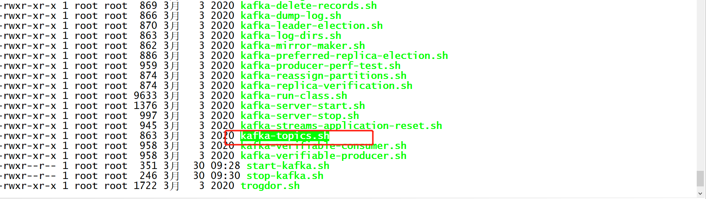

  - **查看用法**

    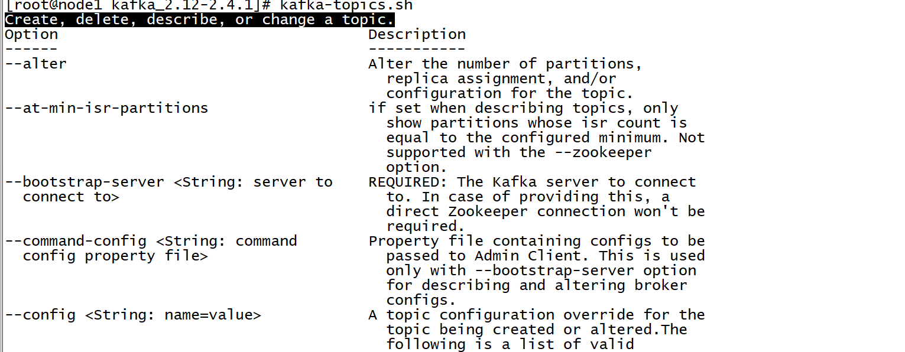
  
  - **创建Topic**

    ```
  kafka-topics.sh --create --topic bigdata01 --partitions 3 --replication-factor 2 --bootstrap-server node1:9092,node2:9092,node3:9092
    ```
  
    - --create：创建
    - --list：列举
    - --topic：topic名称
    - --partitions：指定topic的分区数
    - --replication-factors：指定分区副本个数
    - --bootstrap-server：指定服务端地址
    
  - **列举Topic**

    ```
  kafka-topics.sh --list -bootstrap-server node1:9092,node2:9092,node3:9092
    ```
  
    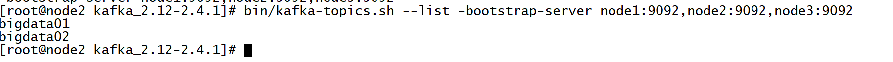

- **小结**：掌握Kafka集群中Topic的管理命令，实现创建Topic及列举Topic

  

## 知识点18：【掌握】Topic管理：查看与删除

- **目标**：**掌握Kafka集群中Topic查看与删除**

- **实施**

  - **查看Topic信息**

    ```shell
    kafka-topics.sh --describe --topic bigdata01  --bootstrap-server node1:9092,node2:9092,node3:9092
    ```

    ```shell
    # Topic的整体信息
    Topic: bigdata01        PartitionCount: 3       ReplicationFactor: 2  
    # Topic的分区信息
    Topic: bigdata01        Partition: 0    Leader: 2       Replicas: 2,0   Isr: 2,0
    Topic: bigdata01        Partition: 1    Leader: 1       Replicas: 1,2   Isr: 1,2
    Topic: bigdata01        Partition: 2    Leader: 0       Replicas: 0,1   Isr: 0,1
    ```

    - Kafka中唯一决定一个分区：Topic+Partition
    - Topic：Topic的名称
    - Partition：分区的编号，从0开始
    - Replicas：显示的是这个分区的所有副本所在的Broker节点id
    - Leader：显示的是这个分区的Leader副本所在的Broker节点id
    - Isr：显示的是这个分区所有可用的副本
    - 规律：Leader的分布由Kafka的主节点相对均衡的分布在不同节点的，ISR越靠前越有概率成为Leader

  - **删除Topic**

    ```shell
    kafka-topics.sh --create --topic bigdata02 --partitions 2  --replication-factor 3 --bootstrap-server node1:9092,node2:9092,node3:9092 
    
    kafka-topics.sh --delete --topic bigdata02  --bootstrap-server node1:9092,node2:9092,node3:9092
    ```

    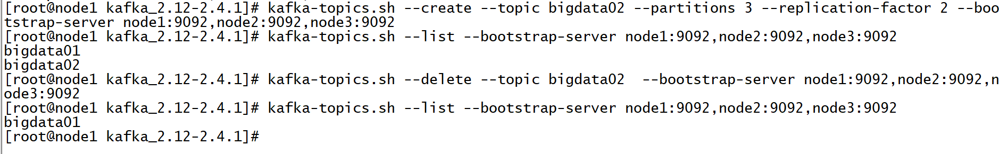

- **小结**：掌握Topic查看与删除

  

## 知识点19：【实现】生产者及消费者测试

- **目标**：**实现命令行如何模拟测试生产者和消费者**

- **实施**

  - **命令行提供的脚本**

    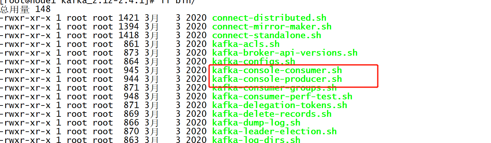

  - **Console生产者**

    ```
  kafka-console-producer.sh --topic bigdata01 --broker-list node1:9092,node2:9092,node3:9092
    ```

    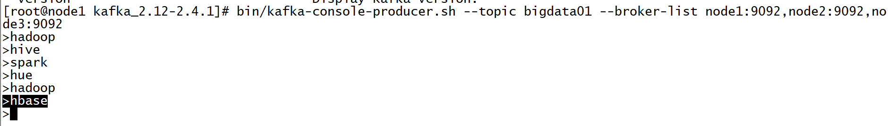

    

  - **Console消费者**

    ```
    kafka-console-consumer.sh --topic bigdata01 --bootstrap-server node1:9092,node2:9092,node3:9092
    ```

    - --from-beginning：从每个分区的最初开始消费，默认从最新的offset进行消费
    - 默认从最新位置开始消费

    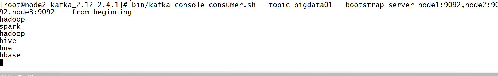

- **小结**：只要生产者不断生产，消费就能实时的消费到Topic中的数据


# ==【模块六：生产者及消费者Java API】==


## 知识点20：【掌握】生产者API：生产数据到Kafka

- **目标**：**掌握如何将数据写入Kafka中**

- **实施**

  - **使用方式**

    - 命令行：一般只用于topic的管理：创建、删除
    - Java API：Spark、Flink构建生产者和消费者

  - **生产流程**

  - **生产代码**

    ```Java
    package bigdata.itcast.cn.kafka.producer;
    
    import org.apache.kafka.clients.producer.KafkaProducer;
    import org.apache.kafka.clients.producer.ProducerRecord;
    
    import java.util.Properties;
    
    /**
     * @ClassName KafkaProducerClient
     * @Description TODO 用于构建Kafka生产者，生产数据到Kafka中
     * @Create By     Frank
     */
    public class KafkaProducerClient {
        public static void main(String[] args) {
            //todo:1-构建连接
            //构建配置对象,类似于Hadoop中的Configuration对象
            Properties props = new Properties();
            //指定服务端地址
            props.put("bootstrap.servers", "node1:9092,node2:9092,node3:9092");
            /**
             *  Kafka怎么保证数据存储安全？--分区副本机制
             *  Kafka怎么保证数据传输安全？
             *              消费数据时不丢失和不重复？ --消费者按照offset进行顺序消费
             *              生产数据时不丢失？ -- ACK应答机制和重试机制
             *  acks = 0/1/all
             *  0：生产者发送一条数据给Kafka，不管kafka有没有写入这条数据，直接发送下一条【快，数据丢失的概率大】
             *  1：生产者发送一条数据给Kafka，等待Kafka将这条数据写入这个分区的Leader副本以后，就返回ack，生产者收到ack就发送下一条【安全和性能之间】
             *  all[-1]：生产者发送一条数据给Kafka，等待Kafka将这条数据写入这个分区的所有可用副本中，再返回ack，生产者收到ack就发送下一条【安全性最高，慢】
             *  工作中选择：1或者all
             *      注重安全性：all
             *      注重性能：1
             *  如果没有收到ack，生产者会根据重试机制，重新发送这条数据：retries = 3
             */
            props.put("acks", "all");
            // 指定写入的KV序列化的类型
            props.put("key.serializer", "org.apache.kafka.common.serialization.StringSerializer");
            props.put("value.serializer", "org.apache.kafka.common.serialization.StringSerializer");
            //构建生产者对象
            KafkaProducer<String, String> producer = new KafkaProducer<>(props);
    
    
            //todo:2-执行操作
            for (int i = 0; i < 10; i++){
                //构建生产的数据对象
                //方式一：指定Key和Value，Topic+Key+Value
    //            ProducerRecord<String, String> record1 = new ProducerRecord<>("bigdata01", i+"", "itcast"+i);
    //            producer.send(record1); //调用生产的方法写入数据
                //方式二：不指定Key，Topic+Value：将数据写入了同一个分区中
    //            ProducerRecord<String, String> record2 = new ProducerRecord<>("bigdata01", "itcast"+i);
    //            producer.send(record2); //调用生产的方法写入数据
                //方式三：指定写入某个分区，Topic+Partition+Key+Value：指定写入某个分区
                ProducerRecord<String, String> record3 = new ProducerRecord<>("bigdata01", 0,i+"", "itcast"+i);
                producer.send(record3); //调用生产的方法写入数据
            }
    
            //todo:3-关闭资源，注意：这一步在实时中是没有，实时是7*24运行，不停的
            producer.close();
        }
    }
    ```

- **小结**：掌握如何将数据写入Kafka中


## 知识点21：【掌握】消费者API：消费Topic数据

- **目标**：**掌握如何从Kafka中消费数据**

- **实施**

  - **消费流程**
  
  - **消费代码**
  
    ```java
    package bigdata.itcast.cn.kafka.consumer;
    
    import org.apache.kafka.clients.consumer.ConsumerRecord;
    import org.apache.kafka.clients.consumer.ConsumerRecords;
    import org.apache.kafka.clients.consumer.KafkaConsumer;
    
    import java.time.Duration;
    import java.util.Arrays;
    import java.util.Properties;
    
    /**
     * @ClassName KafkaConsumerClient
     * @Description TODO 用于测试消费者消费数据
     * @Create By     Frank
     */
    public class KafkaConsumerClient {
        public static void main(String[] args) {
            //todo:1-构建连接
            //构建配置对象
            Properties props = new Properties();
            //指定服务端地址
            props.setProperty("bootstrap.servers", "node1:9092,node2:9092,node3:9092");
            //指定当前消费者属于哪个消费者组
            props.setProperty("group.id", "test01");
            //开启自动提交
            props.setProperty("enable.auto.commit", "true");
            //自动提交的时间间隔
            props.setProperty("auto.commit.interval.ms", "1000");
            //指定KV读取反序列化的类型
            props.setProperty("key.deserializer", "org.apache.kafka.common.serialization.StringDeserializer");
            props.setProperty("value.deserializer", "org.apache.kafka.common.serialization.StringDeserializer");
            //构建消费者对象
            KafkaConsumer<String, String> consumer = new KafkaConsumer<>(props);
    
            //todo:2-处理数据：先订阅Topic，再消费数据，最后处理数据
            //step1：先订阅Topic：一个消费者可以订阅多个Topic
            consumer.subscribe(Arrays.asList("bigdata01"));
            //源源不断的消费和处理数据
            while (true) {
                //step2:消费拉取数据，每次拉取到的所有数据翻入ConsumerRecords集合中
                ConsumerRecords<String, String> records = consumer.poll(Duration.ofMillis(100));
                //step3:处理每条数据:ConsumerRecord存储消费到的一条数据
                for (ConsumerRecord<String, String> record : records){
                    //输出每条数据中的信息
                    String topic = record.topic();//当前这条数据的topic
                    int part = record.partition();//来自于这个topic的哪个分区
                    long offset = record.offset();//在这个分区中的offset
                    //获取这条数据中的Keyvalue
                    String key = record.key();
                    String value = record.value();
                    System.out.println(topic+"\t"+part+"\t"+offset+"\t"+key+"\t"+value);
                }
            }
            //todo:3-消费者是源源不断的消费的，不停的，没有关闭的过程
        }
    }
    ```
  
- **小结**：掌握如何从Kafka中消费数据


## 知识点22：【掌握】生产分区规则

- **目标**：**掌握Kafka生产者生产数据的分区规则**

- **实施**

  - **面试题：Kafka生产者怎么实现生产数据的负载均衡？**

  - **需求**：生产数据的时候尽量保证相对均衡的分到Topic多个分区中

  - **问题**：为什么生产数据的方式不同，分区的规则就不一样？

    ```java
    - ProducerRecord（Topic，Value）//将所有数据写入某一个分区
    - ProducerRecord（Topic，Key，Value） //按照Key的Hash取余方式
    - ProducerRecord（Topic，Partition，Key，Value） //指定写入某个分区
    ```

  - **解答**

    - 1：先判断是否指定了某个分区，如果指定了分区，就写入指定的分区，如果没有执行step2
    - 2：再判断是否自定义分区器，如果有，就调用自定义分区器。如果没有就调用默认分区器DefaultPartitioner，进入step3
    - 3：先判断是否指定了Key，如果指定了Key，就按照Key的MUR值取模分区个数，决定分区，没有指定Key，就执行step4
    - 4：执行StickyPartition黏性分区，从缓存中获取上一次的分区编号，如果有就直接返回，如果没有就随机选择一个分区编号
    
    ```
    先判断有没有指定分区，指定了就写入指定的分区
    没有指定就判断有没有自定义分区，如果有，就调用自定义的分区
    没有自定义就判断有没有指定Key，如果有，按照Key的mur取模分区个数
    没有就使用黏性分区，随机选择一个分区，将这一批次所有数据写入这个分区
    ```
    
    - 按照Key的MUR取模分区：可能导致数据热点
    - 黏性分区：相对数据更加均衡，一般为了保证均衡性，数据都存储在Value，不用指定Key

- **小结**

  - 掌握Kafka生产者生产数据的分区规则

    

## 知识点23：【了解】自定义开发生产分区器

- **目标**：**了解Kafka自定义开发生产分区器，以随机分区为例**

- **实施**

  - **开发一个随机分区器**

    ```java
    package bigdata.itcast.cn.kafka.userpart;
    
    import org.apache.kafka.clients.producer.Partitioner;
    import org.apache.kafka.common.Cluster;
    
    import java.util.Map;
    import java.util.Random;
    
    /**
     * @ClassName UserPartition
     * @Description TODO 用户自定义分区器，随机分区
     * @Create By     Frank
     */
    public class UserPartition implements Partitioner {
        //计算当前这条数据的分区，返回对应的分区编号
        @Override
        public int partition(String topic, Object key, byte[] keyBytes, Object value, byte[] valueBytes, Cluster cluster) {
            //或者这个Topic的分区个数
            Integer count = cluster.partitionCountForTopic(topic);
            //构建随机值
            Random random = new Random();
            int i = random.nextInt(count);
            //返回一个随机值
            return i;
        }
    
        @Override
        public void close() {
            //释放资源
        }
    
        @Override
        public void configure(Map<String, ?> configs) {
            //获取配置
        }
    }
    
    ```
  
- **加载分区器**
  
  ```java
    //指定分区器
    props.put("partitioner.class","bigdata.itcast.cn.kafka.userpart.UserPartition");
  ```
  
- **结果**
  
  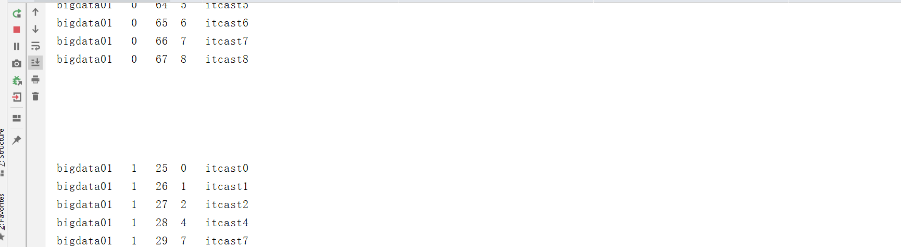
  
- **小结**：了解Kafka自定义开发生产分区器


# 附录一：可视化工具Kafka Tool

- **目标**：**了解Windows版可视化工具Kafka Tool的使用** 

- **实施**

  - **安装Kafka Tool：不断下一步即可**

    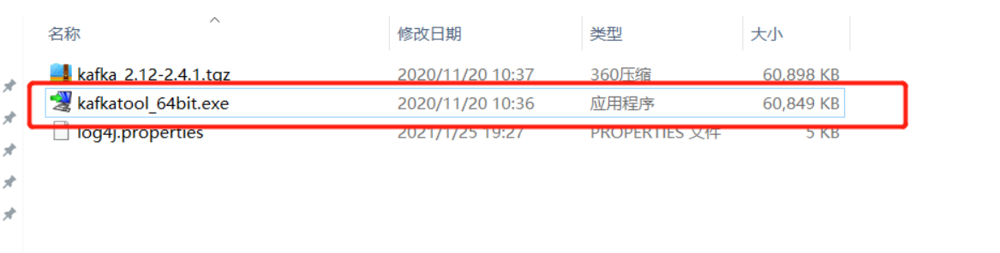

    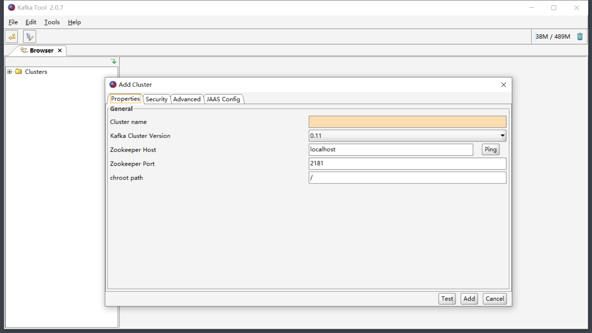

    

  - **构建集群连接：连接Kafka集群**

    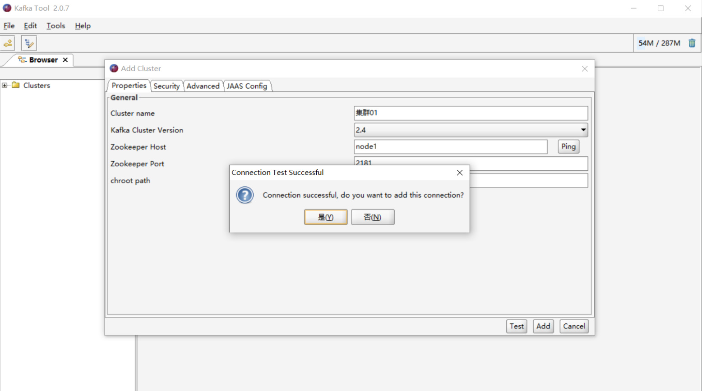

    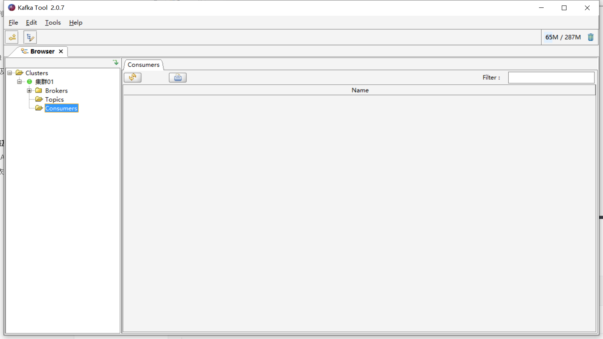

  - 配置显示String

    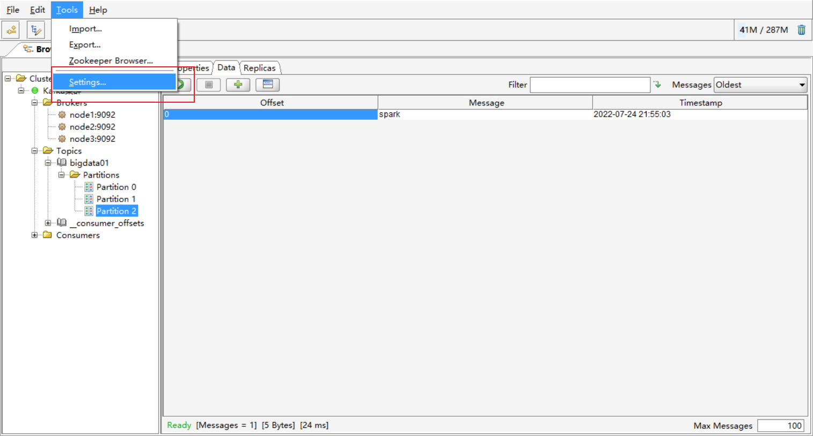

    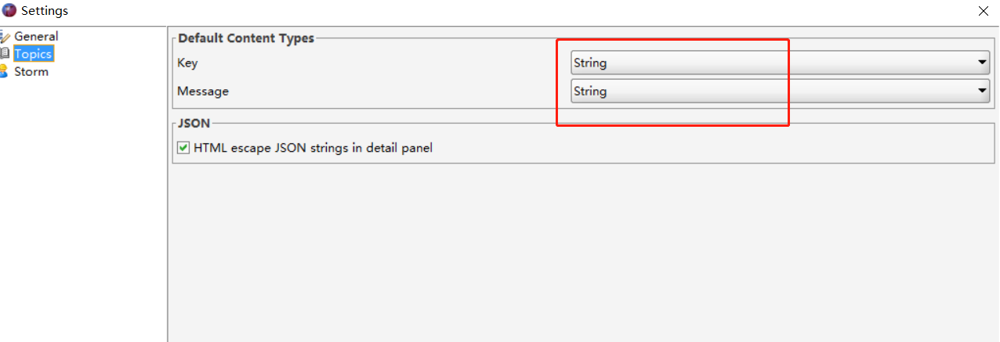

  - **查看集群信息**

    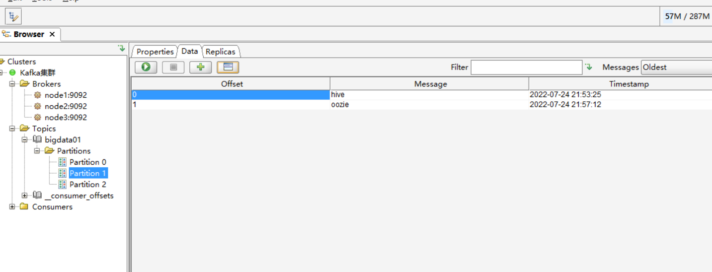

- **小结**：可视化工具

  

# 附录二：Kafka集群压力测试

- **目标**：**了解如何实现Kafka集群的吞吐量及压力测试**

- **实施**

  - 创建Topic

    ```shell
    kafka-topics.sh --create --topic bigdata --partitions 3 --replication-factor 2 --bootstrap-server node1:9092,node2:9092,node3:9092
    ```

  - 生产测试

    ```shell
    kafka-producer-perf-test.sh --topic bigdata --num-records 1000000 --throughput -1 --record-size 1000 --producer-props bootstrap.servers=node1:9092,node2:9092,node3:9092 acks=1
    ```

    - --num-records：写入数据的条数
    - --throughput：是否做限制，-1表示不限制
    - --record-size：每条数据的字节大小

    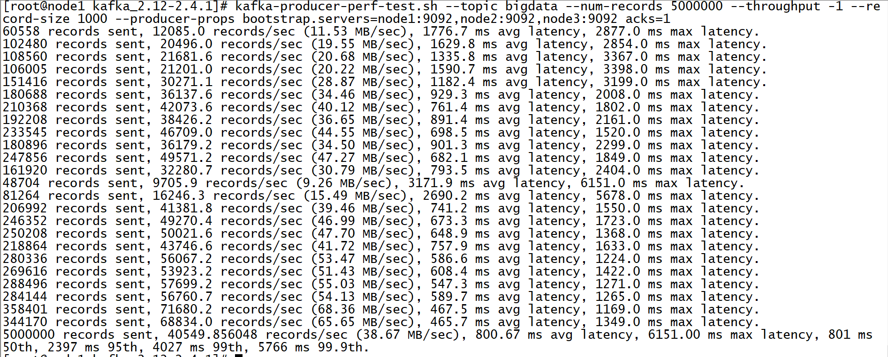

  - 消费测试

    ```shell
    kafka-consumer-perf-test.sh --topic bigdata --broker-list node1:9092,node2:9092,node3:9092  --fetch-size 1048576 --messages 1000000
    ```

    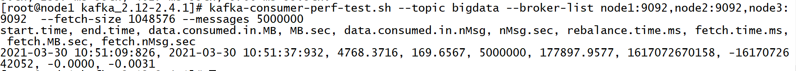

- **小结**：工作中一般根据实际的需求来调整参数，测试kafka集群的最高性能，判断是否能满足需求


# 附录三：Kafka Maven依赖

```xml
<repositories>
    <repository>
        <id>aliyun</id>
        <url>http://maven.aliyun.com/nexus/content/groups/public/</url>
    </repository>
</repositories>
<dependencies>
    <!-- Kafka的依赖 -->
    <dependency>
        <groupId>org.apache.kafka</groupId>
        <artifactId>kafka-clients</artifactId>
        <version>2.4.1</version>
    </dependency>
</dependencies>
```
