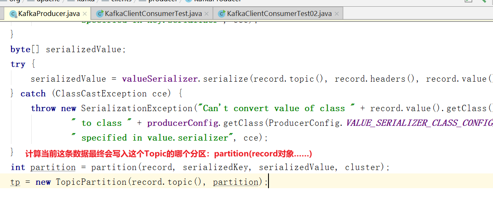
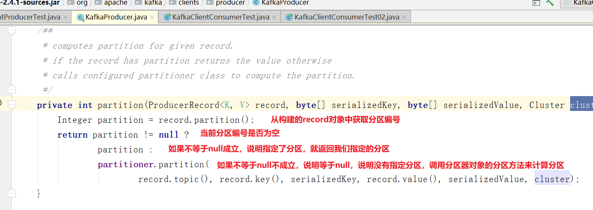
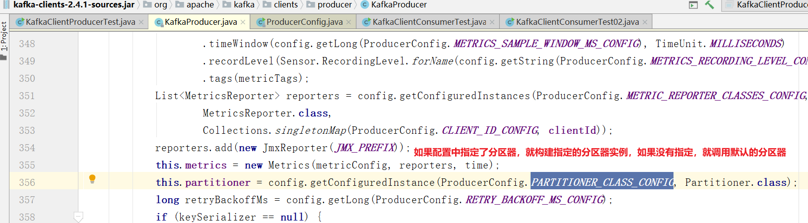
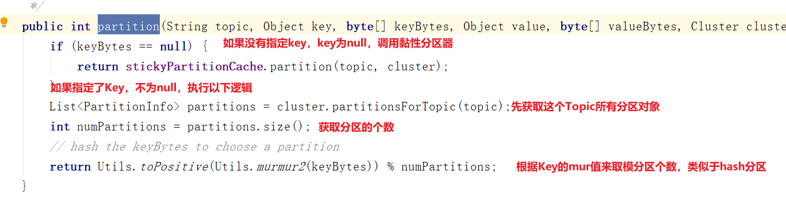
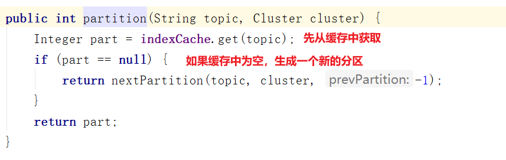
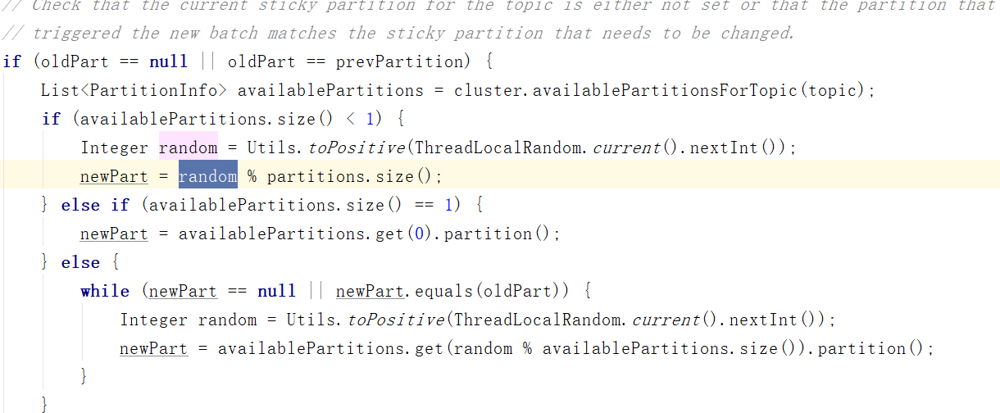
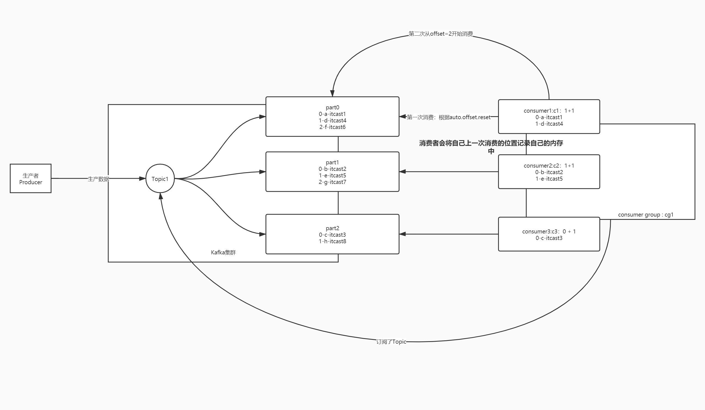
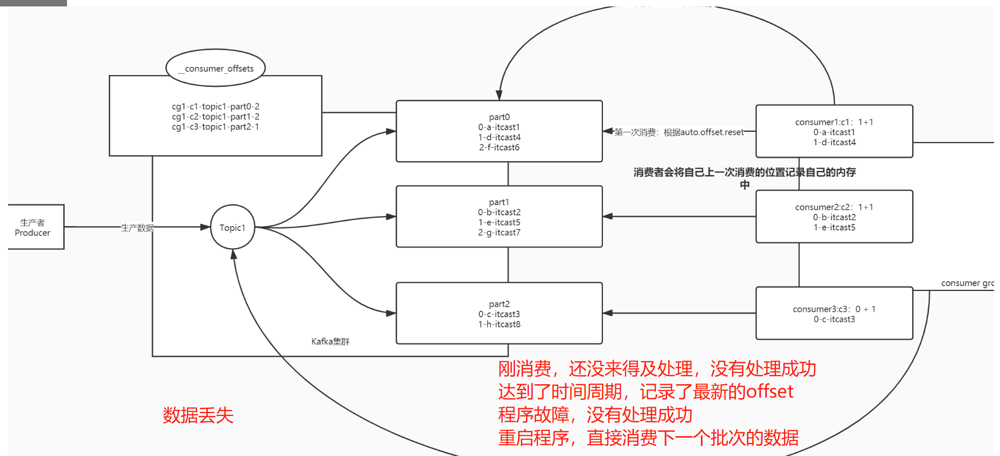
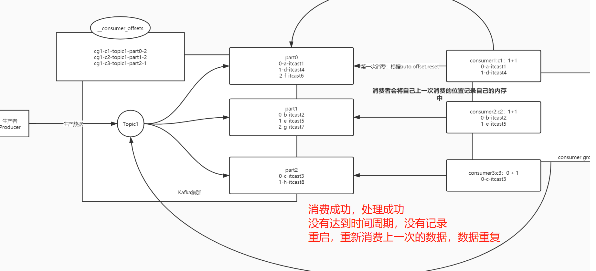

# 分布式消息队列系统Kafka（二）

## 知识点01：课程回顾

1. Kafka的功能和应用场景
   - 功能：实现分布式高吞吐高性能消息队列系统，实现实时数据流分布式计算
   - 场景：大数据实时架构中，用于缓存同步到的实时数据
   - 特点：高并发、高性能、高安全
2. Kafka中核心概念
   - Broker：Kafka节点
   - Producer：生产者，负责写入数据到Kafka中
   - Consumer：消费者，负责从Kafka读取数据
   - Consumer Group：消费者组，Kafka中消费数据必须以消费组的形式进行消费
     - 一个消费者组中可以包含多个消费者，实现分布式并行消费
     - 整个消费者组中所有消费者消费的数据加在一起才是一份完整的数据
   - Topic：数据主题，类似于表、文件的概念、用于区分不同的数据，实现读写操作的对象
     - Topic是一个分布式的逻辑概念
     - 物理上Topic可以对应多个分区，每个分区可以分布在不同broker节点上
   - Partition：数据分区，实现分布式消息读写
   - Replicas：分区副本，一个分区可以构建多份副本，用于保证分区数据安全
     - 分区副本 <= Kafka节点个数
     - 划分了两种角色
     - Leader：负责对外提供读写
     - Follower：负责与Leader同步数据，如果Leader故障，参与选举新的Leader副本
   - Segment：分区文件段，用于将一个分区的数据进行划分，按照一定的规则分成若干个Segment进行存储，为了加快查询效率
     - 每个Segment由两种文件构成
     - xxxxxxxxx.log：数据的文件
     - xxxxxxxxx.index/timeindex：对应的索引文件
     - Segment文件的命名：按照这个Segment文件中最小的offset来命名的
   - Offset：分区偏移量，每个分区中数据写入以后对应的一个下标位置，分区的第N条数据，offset=N-1
     - 设计：保证分区内部顺序消费，用于保证消费数据安全
     - 消费者严格按照每个分区的offset进行顺序消费，消费过程数据不丢失不重复
3. Kafka集群
   - 公平分布式主从架构
     - 主：Broker【Controller】：负责接收读写请求，负责管理类型：Topic、Partition、Replication
     - 从：Broker：负责接收读写请求，如果Controller故障，利用ZK选举一个新的Controller
   - Zookeeper：1-负责辅助选举Controller，2-负责存储Kafka元数据


## 知识点02：课程目标

1. Kafka Java API
   - 目标：通过Java API来验证Kafka中的理论学习
   - 工作中基本不写KafkaAPI
   - 生产者：实时数据采集工具
   - 消费者：实时计算程序Flink、Spark：实时计算引擎中封装了消费者代码
2. 生产者生产数据的负载均衡规则
   - 目标：**==一个Topic有多个分区，生产者写入数据到Topic中，数据会进入哪个分区？==**


## 知识点03：【掌握】生产者API：生产数据到Kafka

- **目标**：**掌握如何将数据写入Kafka中**

- **实施**

  - **使用方式**

    - 命令行/Web工具：一般只用于topic的管理：创建、删除
    - Java API：Spark、Flink构建生产者和消费者

  - **生产流程**

    - step1：构建一个生产者对象，连接服务端【node1:9092,node2:9092,node3:9092】
    - step2：调用生产者生产数据方法，将数据生产写入Kafka
    - step3：关闭生产者对象

  - **生产代码**

    ```Java
    package bigdata.itcast.cn.kafka.producer;
    
    import org.apache.kafka.clients.producer.KafkaProducer;
    import org.apache.kafka.clients.producer.ProducerRecord;
    
    import java.util.Properties;
    
    /**
     * @ClassName KafkaClientProducerTest
     * @Description TODO
     * @Date 2022/7/26 20:06
     * @Create By     Frank
     */
    public class KafkaClientProducerTest {
        public static void main(String[] args) {
            // todo:1-构建生产者的客户端连接对象
            // 定义一个配置对象
            Properties props = new Properties();
            // 指定Kafka集群服务端地址
            props.put("bootstrap.servers", "node1:9092,node2:9092,node3:9092");
            /**
             *  acks：应答机制 + 重试机制，用于保证生产者生产数据不丢失的
             *  0：生产者发送一条数据写入Kafka，不等待Kafka返回ACK，直接生产下一条
             *      优点：快，缺点：数据丢失的风险较高
             *  1：生产者发送一条数据写入Kafka，Kafka将数据写入这个分区的Leader副本以后，就返回ack
             *      在性能和安全性之间做了平衡
             *  all/-1：生产者发送一条数据写入Kafka，等待Kafka将数据写入这个分区的Leader副本以及所有可用Follower同步成功后再返回ACK
             *      优点：安全性最高，缺点：性能相对较差
             */
            props.put("acks", "all");
            // 指定Key和Value序列化的类型
            props.put("key.serializer", "org.apache.kafka.common.serialization.StringSerializer");
            props.put("value.serializer", "org.apache.kafka.common.serialization.StringSerializer");
            // 构建生产者对象加载生产者配置
            KafkaProducer<String, String> producer = new KafkaProducer<>(props);
    
            // todo:2-调用生产者对象的生产数据的方法实现生产
            for (int i = 0; i < 10; i++){
                /**
                 * 数据对象中参数不同：分区规则不一样
                 *  指定分区：数据就写入指定的分区中
                 *  给定Key：数据会根据一定的规则分散在多个分区中
                 *  没给Key：数据全部会进入同一个分区中
                 */
                // 方式一：构建一个生产的数据对象ProducerRecord：Topic，Key，Value
                ProducerRecord<String, String> record1 = new ProducerRecord<>("bigdata01", i+"", "itcast"+i);
                // 方式二：构建一个生产的数据对象ProducerRecord：Topic，Value
                ProducerRecord<String, String> record2 = new ProducerRecord<>("bigdata01", "itcast"+i);
                // 方式一：构建一个生产的数据对象ProducerRecord：Topic，Partition，Key，Value
                ProducerRecord<String, String> record3 = new ProducerRecord<>("bigdata01", 0,i+"", "itcast"+i);
                // 调用生产的方法将数据写入Kafka中
                producer.send(record1);
            }
    
            // todo:3-关闭生产者对象
            producer.close();
    
        }
    }
    
    ```

- **小结**：掌握如何将数据写入Kafka中


## 知识点04：【掌握】消费者API：消费Topic数据

- **目标**：**掌握如何从Kafka中消费数据**

- **实施**

  - **消费流程**

    - step1：构建消费者对象，加载消费者配置：指定服务端地址
    - step2：实现消费处理：先订阅Topic，再消费数据，最后处理数据

  - **消费代码**

    ```java
    package bigdata.itcast.cn.kafka.consumer;
    
    import org.apache.kafka.clients.consumer.ConsumerRecord;
    import org.apache.kafka.clients.consumer.ConsumerRecords;
    import org.apache.kafka.clients.consumer.KafkaConsumer;
    
    import java.time.Duration;
    import java.util.Arrays;
    import java.util.Properties;
    
    /**
     * @ClassName KafkaClientConsumerTest
     * @Description TODO 消费者测试代码
     * @Date 2022/7/26 20:56
     * @Create By     Frank
     */
    public class KafkaClientConsumerTest {
        public static void main(String[] args) {
            // todo:1-构建消费者对象
            // 构建配置对象
            Properties props = new Properties();
            // 指定Kafka服务端地址
            props.setProperty("bootstrap.servers", "node1:9092,node2:9092,node3:9092");
            // 指定当前消费者所属消费组的id
            props.setProperty("group.id", "test01");
            // 开启自动提交
            props.setProperty("enable.auto.commit", "true");
            // 自动提交时间间隔
            props.setProperty("auto.commit.interval.ms", "1000");
            // 指定KV反序列化的类
            props.setProperty("key.deserializer", "org.apache.kafka.common.serialization.StringDeserializer");
            props.setProperty("value.deserializer", "org.apache.kafka.common.serialization.StringDeserializer");
            // 构建一个消费者对象，加载配置对象
            KafkaConsumer<String, String> consumer = new KafkaConsumer<>(props);
    
            // todo:2-实现消费
            // step1：先订阅：subscribe-订阅Topic
            consumer.subscribe(Arrays.asList("bigdata01"));
            while (true) {
                // step2: 再消费,poll-从Kafka中拉取数据，参数表示单次拉取的最大等待时间
                // ConsumerRecords：拉取到的多条数据的集合
                ConsumerRecords<String, String> records = consumer.poll(Duration.ofMillis(100));
                // step3: 再处理
                // ConsumerRecord：消费到的每一条数据
                for (ConsumerRecord<String, String> record : records){
                    String topic = record.topic(); //获取当前这条数据属于哪个Topic
                    int part = record.partition(); //获取当前这条数据是这个Topic的哪个分区的数据
                    long offset = record.offset(); //获取当前这条数据在这个Partition的offset
                    String key = record.key(); //获取这条数据中的Key
                    String value = record.value(); // 获取这条数据中的Value
                    // 假装处理：做打印输出
                    System.out.println(topic+"\t"+part+"\t"+offset+"\t"+key+"\t"+value);
                }
            }
        }
    }
    
    ```

- **小结**：掌握如何从Kafka中消费数据


## 知识点05：【掌握】生产分区规则

- **目标**：**掌握Kafka生产者生产数据的分区规则**

- **实施**

  - **面试题：Kafka生产者怎么实现生产数据的负载均衡？**

  - **需求**：生产数据的时候尽量保证相对均衡的分到Topic多个分区中

  - **问题**：为什么生产数据的方式不同，分区的规则就不一样？

    ```java
    - ProducerRecord（Topic，Value）//将所有数据写入某一个分区
    - ProducerRecord（Topic，Key，Value） //按照Key的Hash取余方式
    - ProducerRecord（Topic，Partition，Key，Value） //指定写入某个分区
    ```

  - **解答**

    - 1：先判断是否指定了某个分区，如果指定了分区，就写入指定的分区，如果没有执行step2
    - 2：再判断是否自定义分区器，如果有，就调用自定义分区器。如果没有就调用默认分区器DefaultPartitioner，进入step3
    - 3：先判断是否指定了Key，如果指定了Key，就按照Key的MUR值取模分区个数，决定分区，没有指定Key，就执行step4
    - 4：执行StickyPartition黏性分区，从缓存中获取上一次的分区编号，如果有就直接返回，如果没有就随机选择一个分区编号

    ```
    先判断有没有指定分区，指定了就写入指定的分区
    没有指定就判断有没有自定义分区，如果有，就调用自定义的分区
    没有自定义就判断有没有指定Key，如果有，按照Key的mur取模分区个数
    没有就使用黏性分区，随机选择一个分区，将这一批次所有数据写入这个分区
    ```

    - 按照Key的MUR取模分区：可能导致数据热点
    - 黏性分区：相对数据更加均衡，一般为了保证均衡性，数据都存储在Value，不用指定Key
    
  - **执行代码**

    

    

    

    

  - 什么是黏性分区StickyPartitioner？

    - 2.4版本之前：轮询分区

      ```
      V					Partition
      itcast0					0
      itcast1					1
      itcast2					2
      itcast3					0
      itcast4					1
      itcast5					2
      itcast6					0	
      itcast7					1
      itcast8					2
      itcast9					0
      ```

      - 优点：每个分区的数据相对均衡，最多差1
      - 缺点：Kafka会以批次提交数据写入Kafka，但是轮询分区，每条数据的分区都不一样，每条数据都要单独做一次写入操作，每次写入数据少，次数多，产生了性能问题

    - 2.4版本以后：黏性分区

      - 目标：每一次都写入一个分区，写入数据多，次数少

      - 规则：将这个批次的数据都写入一个分区，随机选

      - 实现

        

        

- **小结**：掌握Kafka生产者生产数据的分区规则

  

## 知识点06：【了解】自定义开发生产分区器

- **目标**：**了解Kafka自定义开发生产分区器，以随机分区为例**

- **实施**

  - **开发一个随机分区器**

    ```java
    package bigdata.itcast.cn.kafka.userpart;
    
    import org.apache.kafka.clients.producer.Partitioner;
    import org.apache.kafka.common.Cluster;
    
    import java.util.Map;
    import java.util.Random;
    
    /**
     * @ClassName UserPartition
     * @Description TODO 用户自定义分区器，随机分区
     * @Create By     Frank
     */
    public class UserPartition implements Partitioner {
        //计算当前这条数据的分区，返回对应的分区编号
        @Override
        public int partition(String topic, Object key, byte[] keyBytes, Object value, byte[] valueBytes, Cluster cluster) {
            //或者这个Topic的分区个数
            Integer count = cluster.partitionCountForTopic(topic);
            //构建随机值
            Random random = new Random();
            int i = random.nextInt(count);
            //返回一个随机值
            return i;
        }
    
        @Override
        public void close() {
            //释放资源
        }
    
        @Override
        public void configure(Map<String, ?> configs) {
            //获取配置
        }
    }
    
    ```

  - **加载分区器**

    ```java
      //指定分区器
      props.put("partitioner.class","bigdata.itcast.cn.kafka.userpart.UserPartition");
    ```

  - **结果**

    

- **小结**：了解Kafka自定义开发生产分区器


## 知识点07：【理解】消费者消费过程及问题

- **目标**：**理解Kafka消费者消费过程及消费问题**

- **实施**

  - **问题1**：消费者是如何消费Topic中的数据的？

  - **问题2**：如果消费者故障重启，消费者怎么知道自己上次消费的位置的？

  - **Kafka中消费者消费数据的规则**

    - 消费者消费Kafka中的Topic根据每个分区的Offset进行消费，每次从上一次的位置继续消费

    - **第一次消费规则**【消费者组id在Kafka元数据中不存在】：由属性决定

      ```
      auto.offset.reset = latest | earliest
      latest：默认的值，从Topic每个分区的最新的位置开始消费
      earliest：从最早的位置开始消费，每个分区的offset为0开始消费
      ```

    - **第二次消费开始【消费者组已经在Kafka中存在】**：根据**上一次消费的Offset**位置+1继续进行消费

      - consumer offset：消费者已经消费到的offset
      - **==commit offset：消费者下一个要消费的offset==**
      - 关系：commit offset = consumer offset + 1

      

    - **问题1：消费者如何知道下一次要请求的位置是什么？**

    - **问题2：如果因为一些原因，消费者故障了，重启消费者，原来内存中offset就没有了**

      - 场景1：**如果这个消费者重启，这个消费者怎么知道下一次消费的位置？**
      - 场景2：**如果这个消费者长时间没有重启，这个分区会交给这个消费者组中的其他消费者消费，其他的消费者怎么知道这个分区下一次消费的位置是什么呢？**

    - **解决**

      - 原因：每个分区下一次要消费的offset放在消费者 内存中
      - 问题：一旦消费者故障，内存数据会丢失，offset就丢失了
      - 解决：将Offset持久化存储，不仅仅放在内存中，如果内存丢失，其他的地方能读到

  - **Kafka Offset偏移量管理**

    - Kafka将每个分区下次消费的位置主动记录在一个Topic中：**__consumer_offsets**
      - 每个负责消费这个分区的消费者会主动将自己消费的commit offset写入这个Topic
      - Consumer Offset：消费者已经消费到的位置
      - Commit  Offset：下一次要消费的位置 = Consumer Offset + 1
    - 如果下次消费者重启以后注册或者将这个分区分给别的活着的消费者，kafka就根据自己记录的offset来提供消费的位置

    

  - 提交的规则：根据时间自动提交

    ```java
    //是否自动提交offset：true表示每个消费者将自己负责的分区下一次要消费的位置自动的写入__consumer_offsets中
    props.setProperty("enable.auto.commit", "true");
    //自动提交的时间间隔
    props.setProperty("auto.commit.interval.ms", "1000");
    ```

- **小结**：消理解Kafka消费者消费过程及消费问题


## 知识点08：【了解】自动提交问题

- **目标**：**了解Kafka自动提交Offset存在的问题**

- **实施**

  - **自动提交的规则**

    - 根据时间周期来提交下一次要消费的offset，记录在__consumer_offsets中
    - 每1s提交记录一次

  - **数据丢失的情况**

    - 如果刚消费，还没处理，就达到提交周期，记录了当前 的offset

    - 最后处理失败，需要重启，重新消费处理

    - Kafka中已经记录消费过了，从上次消费的后面进行消费

      

      

    - **数据重复的情况**

      - 如果消费并处理成功，但是没有提交offset，程序故障

      - 重启以后，kafka中记录的还是之前的offset，重新又消费一遍

      - 数据重复问题

        

  - 原因

    - 自动提交：按照时间来进行提交
    - 实际需求：按照消费并处理的结果
      - 如果消费并处理成功，提交offset，下一次接着处理成功的数据之后来进行消费
      - 如果消费失败或者处理失败，不提交offset，下一次重新消费和处理这部分数据

- **小结**：消费是否成功，是根据处理的结果来决定的


## 知识点09：【实现】手动提交Topic的Offset

- **目标**：**Kafka如何实现手动提交Topic的Offset实现**

- **实施**

  - 关闭自动提交

    ```java
            // 自动提交
            props.setProperty("enable.auto.commit", "false");
            // 自动提交的时间间隔
    //        props.setProperty("auto.commit.interval.ms", "1000");
    ```

  - 手动提交Offset

    ```java
    package bigdata.itcast.cn.kafka.manual;
    
    import org.apache.kafka.clients.consumer.ConsumerRecord;
    import org.apache.kafka.clients.consumer.ConsumerRecords;
    import org.apache.kafka.clients.consumer.KafkaConsumer;
    
    import java.time.Duration;
    import java.util.Arrays;
    import java.util.Properties;
    
    /**
     * @ClassName KafkaConsumerManualCommitTopicOffset
     * @Description TODO 用于测试消费者消费数据，手动提交每个分区的offset到__consumer_offsets中
     * @Create By     Frank
     */
    public class KafkaConsumerManualCommitTopicOffset {
        public static void main(String[] args) {
            //todo:1-构建连接
            //构建配置对象
            Properties props = new Properties();
            //指定服务端地址
            props.setProperty("bootstrap.servers", "node1:9092,node2:9092,node3:9092");
            //指定当前消费者属于哪个消费者组
            props.setProperty("group.id", "test02");
            //关闭自动提交
            props.setProperty("enable.auto.commit", "false");
    //        //自动提交的时间间隔：手动提交场景下，这个属性不会被加载
    //        props.setProperty("auto.commit.interval.ms", "1000");
            //指定KV读取反序列化的类型
            props.setProperty("key.deserializer", "org.apache.kafka.common.serialization.StringDeserializer");
            props.setProperty("value.deserializer", "org.apache.kafka.common.serialization.StringDeserializer");
            //构建消费者对象
            KafkaConsumer<String, String> consumer = new KafkaConsumer<>(props);
    
            //todo:2-处理数据：先订阅Topic，再消费数据，最后处理数据
            //step1：先订阅Topic：一个消费者可以订阅多个Topic
            consumer.subscribe(Arrays.asList("bigdata01"));
            //源源不断的消费和处理数据
            while (true) {
                //step2:消费拉取数据，每次拉取到的所有数据翻入ConsumerRecords集合中
                ConsumerRecords<String, String> records = consumer.poll(Duration.ofMillis(100));
                //step3:处理每条数据:ConsumerRecord存储消费到的一条数据
                for (ConsumerRecord<String, String> record : records){
                    //输出每条数据中的信息
                    String topic = record.topic();//当前这条数据的topic
                    int part = record.partition();//来自于这个topic的哪个分区
                    long offset = record.offset();//在这个分区中的offset
                    //获取这条数据中的Keyvalue
                    String key = record.key();
                    String value = record.value();
                    System.out.println(topic+"\t"+part+"\t"+offset+"\t"+key+"\t"+value);
                }
                //step4:手动提交offset：选择同步提交：提交成功以后，再消费下一个批次的数据
                consumer.commitSync();
            }
            //todo:3-消费者是源源不断的消费的，不停的，没有关闭的过程
        }
    }
    
    ```

- **小结**：根据处理的结果来实现手动提交，如果成功以后，再手动提交


## 附录一：Kafka Maven依赖

```xml
<repositories>
    <repository>
        <id>aliyun</id>
        <url>http://maven.aliyun.com/nexus/content/groups/public/</url>
    </repository>
</repositories>
<dependencies>
    <!-- Kafka的依赖 -->
    <dependency>
        <groupId>org.apache.kafka</groupId>
        <artifactId>kafka-clients</artifactId>
        <version>2.4.1</version>
    </dependency>
</dependencies>
```

