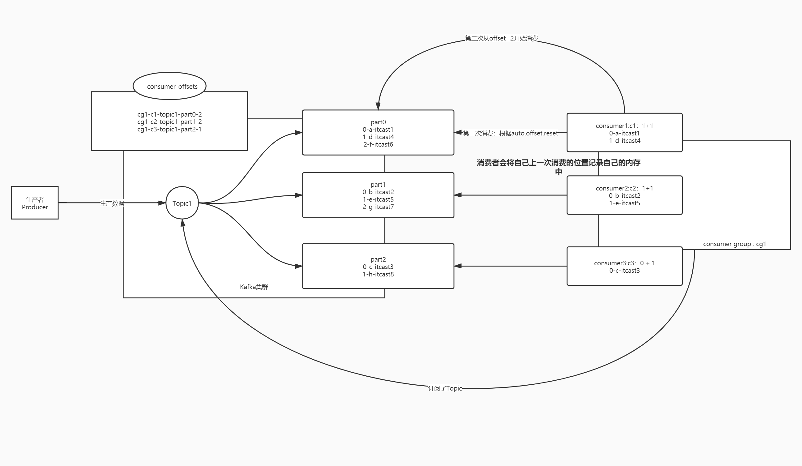
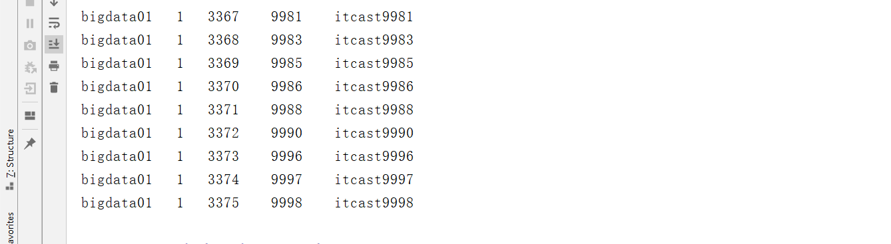
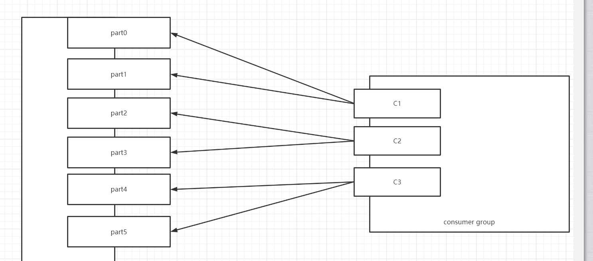
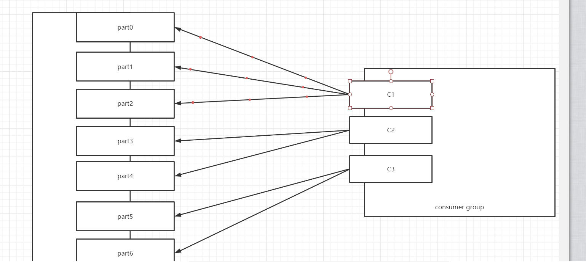
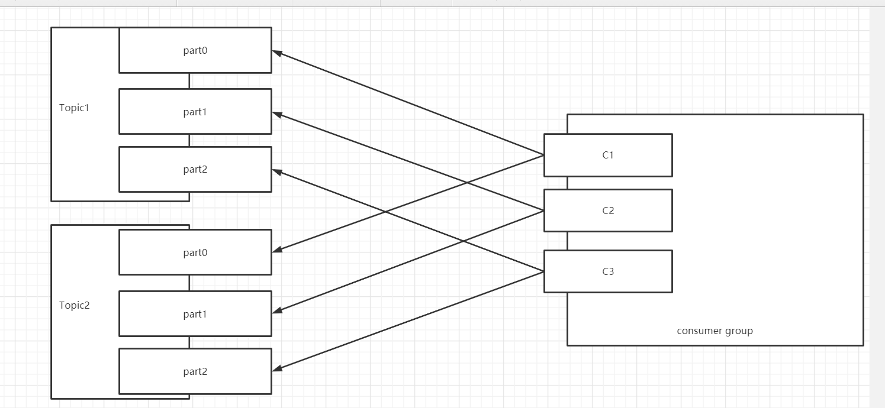
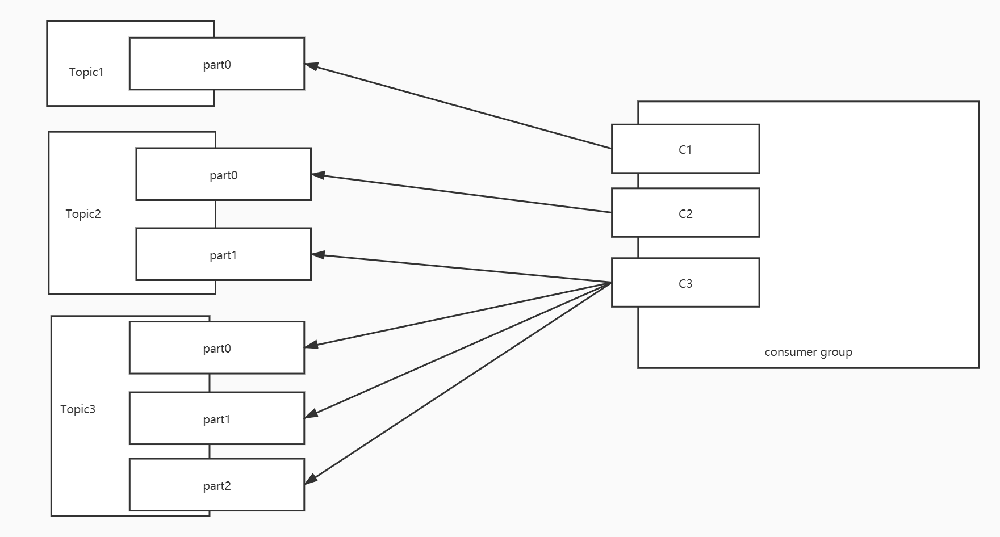
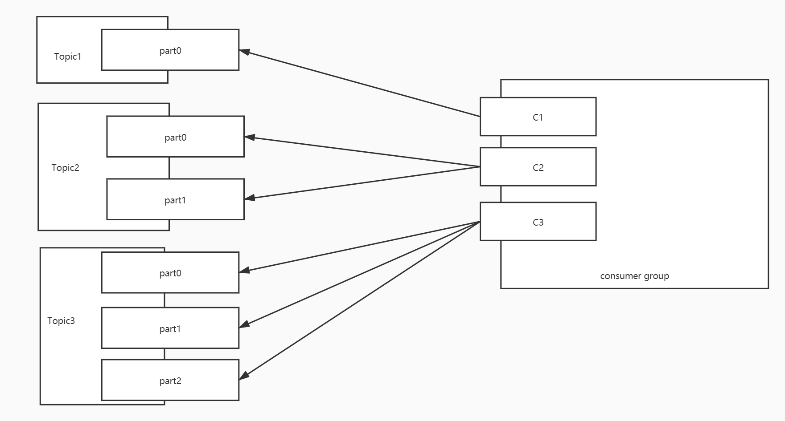

# 分布式消息队列系统Kafka（二）

## 知识点01：课程回顾

1. Java API：生产者和消费者
   - 生产者：KafkaProducer，send，ProducerRecord
     - 配置：acks + retries，用于保证生产数据不丢失
   - 消费者：KafkaConsumer，subscribe、poll、ConsumerRecords、ConsumerRecord【topic、partition、offset、Key、Value】
     - 配置：group.id，用于指定消费者属于哪个消费者组
   - 工作中实际生产者【实时数据采集工具】和消费者【Spark StructStreaming/Flink：封装】
2. 生产者生产数据负载均衡规则
   - 问题：生产者生产的数据写入Topic，一个Topic有多个分区，怎么决定数据会进入哪个分区？
   - 需求：数据分布更加均衡
   - 规则
     - step1：是否指定分区，指定了就写入指定分区
     - step2：是否自定义分区，调用自定义的分区器
     - step3：是否给定Key，按照Key的mur值取模分区个数
     - step4：没有key就使用黏性分区，每个Batch所有数据写入一个分区
       - 轮询：批次多，数据少
       - 黏性：数据多，批次少


## 知识点02：课程目标

1. 消费者消费的规则以及问题
   - 目标：==**掌握消费者消费规则、问题和解决方案**==
   - 问题：消费者消费过程中如何保证消费不丢失和不重复
2. 消费者的负载均衡策略
   - 目标：掌握多个分区是如何分配给多个消费者
   - 问题：消费者的负载均衡的策略是什么？


## 知识点03：【理解】消费者消费过程及问题

- **目标**：**理解Kafka消费者消费过程及消费问题**

- **实施**

  - **问题1**：消费者是如何消费Topic中的数据的？

  - **问题2**：如果消费者故障重启，消费者怎么知道自己上次消费的位置的？

  - **Kafka中消费者消费数据的规则**

    - 消费者消费Kafka中的Topic根据每个分区的Offset进行消费，每次从上一次的位置继续消费

    - **第一次消费规则**【消费者组id在Kafka元数据中不存在】：由属性决定

      ```
      auto.offset.reset = latest | earliest
      latest：默认的值，从Topic每个分区的最新的位置开始消费
      earliest：从最早的位置开始消费，每个分区的offset为0开始消费
      ```

    - **第二次消费开始【消费者组已经在Kafka中存在】**：根据**上一次消费的每个分区Offset**位置+1继续进行消费

      - consumer offset：消费者已经消费到这个分区的offset
      - **==commit offset：消费者下一个要消费的offset==**
      - 关系：commit offset = consumer offset + 1

      

    - **问题1：消费者如何知道下一次要请求的位置是什么？**

      - 每个消费者维护自己下一次要消费的commit offset放在**自己的内存**中
      - 消费者是客户端，如果客户端故障，就会出现问题

    - **问题2：如果因为一些原因，消费者故障了，重启消费者，原来内存中 commit offset就没有了**

      - 场景1：**如果这个消费者重启，这个消费者怎么知道下一次消费分区的什么位置？**
      - 场景2：**如果这个消费者长时间没有重启，这个分区会交给这个消费者组中的其他消费者消费，其他的消费者怎么知道这个分区下一次消费的位置是什么呢？**

    - **解决**

      - 原因：每个分区下一次要消费的offset放在消费者客户端的 内存中
      - 问题：一旦消费者故障，内存数据会丢失，offset就丢失了
      - 解决：将Offset持久化存储，不仅仅放在内存中，如果内存丢失，其他的地方能读到
        - 这个地方一定是一个公共的，高可靠的存储系统

  - **Kafka Offset偏移量管理**

    - Kafka让所有消费者每个分区下次消费的位置主动记录在一个Topic中：==**__consumer_offsets**==
      - 每个负责消费这个分区的消费者会主动将自己消费的commit offset写入这个Topic
      - Consumer Offset：消费者已经消费到的位置
      - Commit  Offset：下一次要消费的位置 = Consumer Offset + 1
    - 如果下次消费者重启以后注册或者将这个分区分给别的活着的消费者，kafka就根据自己记录的offset来提供消费的位置

    

  - 提交的规则：根据时间自动提交

    ```java
    //是否自动提交offset：true表示每个消费者将自己负责的分区下一次要消费的位置自动的写入__consumer_offsets中
    props.setProperty("enable.auto.commit", "true");
    //自动提交的时间间隔
    props.setProperty("auto.commit.interval.ms", "1000");
    ```

- **小结**：消理解Kafka消费者消费过程及消费问题


## 知识点04：【了解】自动提交问题

- **目标**：**了解Kafka自动提交Offset存在的问题**

- **实施**

  - **自动提交的规则**

    - 根据时间周期来提交下一次要消费的offset，记录在__consumer_offsets中
    - 每1s提交记录一次

  - **数据丢失的情况**

    - 如果刚消费，还没处理，就达到提交周期，记录了当前 的offset

    - 最后处理失败，需要重启，重新消费处理

    - Kafka中已经记录消费过了，从上次消费的后面进行消费

      

      

    - **数据重复的情况**

      - 如果消费并处理成功，但是没有提交offset，程序故障

      - 重启以后，kafka中记录的还是之前的offset，重新又消费一遍

      - 数据重复问题

        

  - 原因

    - 自动提交：按照时间来进行提交，提交目的为了保证安全性
    - 实际需求：按照消费并处理的结果
      - 如果消费并处理成功，提交offset，下一次接着处理成功的数据之后来进行消费
      - 如果消费失败或者处理失败，不提交offset，下一次重新消费和处理这部分数据

- **小结**：消费是否成功，是根据处理的结果来决定的


## 知识点05：【实现】手动提交Topic的Offset

- **目标**：**Kafka如何实现手动提交Topic的Offset实现**

- **实施**

  - 关闭自动提交

    ```java
            // 自动提交
            props.setProperty("enable.auto.commit", "false");
            // 自动提交的时间间隔
    //        props.setProperty("auto.commit.interval.ms", "1000");
    ```

  - 手动提交Offset

    ```java
    package bigdata.itcast.cn.manual;
    
    import org.apache.kafka.clients.consumer.ConsumerRecord;
    import org.apache.kafka.clients.consumer.ConsumerRecords;
    import org.apache.kafka.clients.consumer.KafkaConsumer;
    
    import java.time.Duration;
    import java.util.Arrays;
    import java.util.Properties;
    
    /**
     * @ClassName KafkaClientConsumerTest
     * @Description TODO 消费者测试代码
     * @Date 2022/7/26 20:56
     * @Create By     Frank
     */
    public class KafkaConsumerCommitTopicOffset {
        public static void main(String[] args) {
            // todo:1-构建消费者对象
            // 构建配置对象
            Properties props = new Properties();
            // 指定Kafka服务端地址
            props.setProperty("bootstrap.servers", "node1:9092,node2:9092,node3:9092");
            // 指定当前消费者所属消费组的id
            props.setProperty("group.id", "test02");
            // 关闭自动提交
            props.setProperty("enable.auto.commit", "false");
            // 自动提交时间间隔
    //        props.setProperty("auto.commit.interval.ms", "1000");
            // 指定KV反序列化的类
            props.setProperty("key.deserializer", "org.apache.kafka.common.serialization.StringDeserializer");
            props.setProperty("value.deserializer", "org.apache.kafka.common.serialization.StringDeserializer");
            // 构建一个消费者对象，加载配置对象
            KafkaConsumer<String, String> consumer = new KafkaConsumer<>(props);
    
            // todo:2-实现消费
            // step1：先订阅：subscribe-订阅Topic
            consumer.subscribe(Arrays.asList("bigdata01"));
            while (true) {
                // step2: 再消费,poll-从Kafka中拉取数据，参数表示单次拉取的最大等待时间
                // ConsumerRecords：拉取到的多条数据的集合
                ConsumerRecords<String, String> records = consumer.poll(Duration.ofMillis(100));
                // step3: 再处理
                // ConsumerRecord：消费到的每一条数据
                for (ConsumerRecord<String, String> record : records){
                    String topic = record.topic(); //获取当前这条数据属于哪个Topic
                    int part = record.partition(); //获取当前这条数据是这个Topic的哪个分区的数据
                    long offset = record.offset(); //获取当前这条数据在这个Partition的offset
                    String key = record.key(); //获取这条数据中的Key
                    String value = record.value(); // 获取这条数据中的Value
                    // 假装处理：做打印输出
                    System.out.println(topic+"\t"+part+"\t"+offset+"\t"+key+"\t"+value);
                }
                // 手动提交Offset
                consumer.commitSync();
            }
        }
    }
    
    ```

- **小结**：根据处理的结果来实现手动提交，如果成功以后，再手动提交


## 知识点06：【了解】手动提交Topic Offset的问题

- **目标**：**了解Kafka实现手动提交Topic的Offset的问题**

- **实施**

  - **Offset的设计**==**：Offset是分区级别**==，每个分区单独管理一套offset

  - **手动提交Topic Offset的过程中会出现数据重复**

    - 举个栗子

    - 一个消费者，消费一个Topic，Topic有三个分区

      - 第一次消费

        - part0

          ```
          0	hadoop
          1	hive
          ```

        - part1

          ```
          0	hive
          1	spark
          2	hue
          ```

        - part2

          ```
          0	spark
          1	hadoop
          ```

      - 问题：part0和part1都处理成功，当处理part2时候，程序故障，重启

        - offset有没有提交？没有提交
        - 重启消费者：Kafka中没有消费记录，但是消费者刚刚分区0和分区1已经消费成功了
        - 所有分区都重新消费

  - **原因**：Offset是分区级别的，提交offset是按照整个Topic级别来提交的

  - **解决**：提交offset的时候，**按照分区来提交**，消费处理成功一个分区，就提交一个分区的offset

- **小结**：了解Kafka实现手动提交Topic的Offset的问题


## 知识点07：【实现】手动提交分区Offset的实现

- **目标**：**实现Kafka实现手动提交Partition的Offset**

- **实施**

  ```java
  package bigdata.itcast.cn.manual;
  
  import org.apache.kafka.clients.consumer.ConsumerRecord;
  import org.apache.kafka.clients.consumer.ConsumerRecords;
  import org.apache.kafka.clients.consumer.KafkaConsumer;
  import org.apache.kafka.clients.consumer.OffsetAndMetadata;
  import org.apache.kafka.common.TopicPartition;
  
  import java.time.Duration;
  import java.util.*;
  
  /**
   * @ClassName KafkaClientConsumerTest
   * @Description TODO 消费者测试代码
   * @Date 2022/7/26 20:56
   * @Create By     Frank
   */
  public class KafkaConsumerCommitPartitionOffset {
      public static void main(String[] args) {
          // todo:1-构建消费者对象
          // 构建配置对象
          Properties props = new Properties();
          // 指定Kafka服务端地址
          props.setProperty("bootstrap.servers", "node1:9092,node2:9092,node3:9092");
          // 指定当前消费者所属消费组的id
          props.setProperty("group.id", "test02");
          // 关闭自动提交
          props.setProperty("enable.auto.commit", "false");
          // 自动提交时间间隔
  //        props.setProperty("auto.commit.interval.ms", "1000");
          // 指定KV反序列化的类
          props.setProperty("key.deserializer", "org.apache.kafka.common.serialization.StringDeserializer");
          props.setProperty("value.deserializer", "org.apache.kafka.common.serialization.StringDeserializer");
          // 构建一个消费者对象，加载配置对象
          KafkaConsumer<String, String> consumer = new KafkaConsumer<>(props);
  
          // todo:2-实现消费
          // step1：先订阅：subscribe-订阅Topic
          consumer.subscribe(Arrays.asList("bigdata01"));
          while (true) {
              // step2: 再消费,poll-从Kafka中拉取数据，参数表示单次拉取的最大等待时间
              // ConsumerRecords：拉取到的多条数据的集合
              ConsumerRecords<String, String> records = consumer.poll(Duration.ofMillis(100));
              // step3: 按照每个分区进行处理
              Set<TopicPartition> partitions = records.partitions(); // 获取当前消费到的数据中有哪些分区
              // 对分区迭代，基于每个分区处理一次
              for (TopicPartition partition : partitions) {
                  // 获取这个分区这次拉取到的数据
                  List<ConsumerRecord<String, String>> partRecords = records.records(partition);
                  // 对这个分区的数据进行处理
                  // ConsumerRecord：消费到的每一条数据
                  long offset = 0;
                  for (ConsumerRecord<String, String> record : partRecords){
                      String topic = record.topic(); //获取当前这条数据属于哪个Topic
                      int part = record.partition(); //获取当前这条数据是这个Topic的哪个分区的数据
                      offset = record.offset(); //获取当前这条数据在这个Partition的offset
                      String key = record.key(); //获取这条数据中的Key
                      String value = record.value(); // 获取这条数据中的Value
                      // 假装处理：做打印输出
                      System.out.println(topic+"\t"+part+"\t"+offset+"\t"+key+"\t"+value);
                  }
                  // 手动提交这个分区的Offset：当前的分区对象，commit offset
                  Map<TopicPartition, OffsetAndMetadata> offsets = Collections.singletonMap(partition, new OffsetAndMetadata(offset+1));
                  consumer.commitSync(offsets);
              }
          }
      }
  }
  
  ```
  
- **小结**：实现Kafka实现手动提交Partition的Offset

  

## 知识点08：【实现】指定消费Topic分区的数据

- **目标**：**实现Kafka如何实现消费指定分区的数据**

- **实施**

  - Kafka中执定消费者消费的方式：多个Topic有多个分区，一个消费者组有多个消费者

    - Topic级别：**Kafka会自动将多个分区分给多个消费者**

      ```
      consumer.subscribe(Arrays.asList("bigdata01"));
      ```

      - 3个分区，一个消费者：一个消费者消费3个分区
      - 3个分区，二个消费者：第一个消费者消费2个分区，第二个消费1个分区
      - 3个分区，三个消费者：每个消费者消费1个分区

    - Partition级别：**可以指定每个消费者消费哪些分区**

      ```java
      TopicPartition p1 = new TopicPartition("bigdata01",1);
      TopicPartition p2 = new TopicPartition("bigdata01",2);
      consumer1.assign(Arrays.asList(p1,p2));
      
      TopicPartition p0 = new TopicPartition("bigdata01",0);
      consumer2.assign(Arrays.asList(p0));
      ```

    - Offset级别：自己指定每个分区从哪个Offset进行消费

      ```java
      // Offset级别
      consumer.seek("指定的分区","消费的位置");
      ```
      
      - Kafka消费者消费数据不丢失不重复：由offset来决定
      
      - Offset没有持久化机制，导致Offset丢失
      
      - Kafka默认方案：允许消费者手动提交每个分区的commit offset放在一个Topic中
      
      - 可选方案：自己管理Offset，基于自己消费情况，消费成功以后，将每个分区的offset记录在可靠存储系统中
      
        - MySQL、Zookeeper、Redis、共享文件【Flink/Spark：checkpoint】
      
        - 示例代码
      
          ```
          // step1:消费拉取数据
          offset = OffsetUtils.readOffset(groupid,topic,partition)
          consumer.seek(partition, offset)
          
          // step2:处理数据
          
          // step3:保存offset
          OffsetUtils.writeToMySQL(groupid,topic,partition,offset+1)：replace
          ```

  - 场景：不希望让Kafka来帮我分配每个消费者消费哪些分区，希望自己指定每消费者消费哪些分区

  - 构建Topic分区对象

    ```java
    TopicPartition part1 = new TopicPartition("bigdata01", 1);
    TopicPartition part2 = new TopicPartition("bigdata01", 2);
    ```

  - 指定消费Topic分区

    ```java
    consumer.assign(Arrays.asList(part1,part2));  
    ```

  - 观察结果

    

- **小结**：实现Kafka如何实现消费指定分区的数据

  


## 知识点09：【掌握】消费分配策略：基本规则及分配策略

- **目标**：**掌握Kafka消费者组中多个消费者的分配规则**

- **实施**

  - **问题**

    - 1-多个topic多个分区，一个消费者组有多个消费者，Kafka是怎么自动分配保证负载均衡？
    - 2-如果有一个消费者A故障，超过一定时间没有恢复，这个消费者A原来负责的分区怎么分摊给别的消费者？

  - ==**基本规则**==

    - 一个分区的数据只能由这个消费者组中的某一个消费者消费
    - 一个消费者可以消费多个分区的数据

  - **分配策略**：决定了多个分区如何分配给多个消费者

    - 属性：`partition.assignment.strategy = org.apache.kafka.clients.consumer.RangeAssignor`

    - **RangeAssignor**：范围分配，默认的分配策略

    - **RoundRobinAssignor**：轮询分配，常见于Kafka2.0之前的版本

      ```
      org.apache.kafka.clients.consumer.RoundRobinAssignor
      ```

    - **StickyAssignor**：==**黏性分配，2.0之后建议使用**==

      ```
      org.apache.kafka.clients.consumer.StickyAssignor
      ```

- **小结**：掌握Kafka消费者组中多个消费者的分配规则

  

## 知识点10：【理解】消费分配策略：RangeAssignor

- **目标**：**理解范围分配策略的规则及应用场景**

- **实施**

  - **范围分配规则**

    - **Kafka中默认的分配规则**
    - 每个消费者消费一定范围的分区，尽量的实现将分区均分给不同的消费者，如果不能均分，优先将分区分配给编号小的消费者
    - 针对每个消费者的每个Topic进行范围分配
    - 6个分区：part0 ~ part5
      - 2个消费者
        - C1：part0 ~ part2
        - C2：part3 ~ part5
      - 4个消费者
        - C1：part0  part1
        - C2：part2  part3
        - C3：part4
        - C4：part5

  - 举例

    - 假设一：三个消费者，消费1个Topic，Topic1有6个分区

      | 消费者 |   分区    |
      | :----: | :-------: |
      |   C1   | T1【0,1】 |
      |   C2   | T1【2,3】 |
      |   C3   | T1【4,5】 |

      

      

    - 假设二：三个消费者，消费1个Topic，Topic1有7个分区

      | 消费者 |    分区     |
      | :----: | :---------: |
      |   C1   | T1【0,1,2】 |
      |   C2   |  T1【3,4】  |
      |   C3   |  T1【5,6】  |

      

    

    - 假设三：三个消费者，消费3个Topic，Topic1、Topic2、Topic3各有7个分区

      | 消费者 |                分区                 |
      | :----: | :---------------------------------: |
      |   C1   | T1【0,1,2】 T2【0,1,2】 T3【0,1,2】 |
      |   C2   |    T1【3,4】 T2【3,4】 T3【3,4】    |
      |   C3   |    T1【5,6】 T2【5,6】 T3【5,6】    |

    - 问题：负载不均衡

    - 优点：如果Topic的个数比较少，分配会相对比较均衡

    - 缺点：如果Topic的个数比较多，而且不能均分，导致负载不均衡问题

    - 应用：Topic个数少或者每个Topic都均分的场景

- **小结**

  - 规则：每个消费者消费一定范围的分区，尽量做均分，如果不能均分，优先将分区分配给编号小的消费者
  - 应用：适合于Topic个数少或者每个Topic都能均分场景


## 知识点11：【理解】消费分配策略：RoundRobinAssignor

- **目标**：**理解轮询分配策略的规则及应用场景**

- **实施**

  - **轮询分配的规则**

    - 按照Topic的名称和分区编号排序，轮询分配给每个消费者

    - 如果遇到范围分区的场景，能否均衡：三个消费者，消费3个Topic，Topic1、Topic2、Topic3各有7个分区

      - T1【0】 ~ T1【6】
      - T2【0】 ~ T2【6】
      - T3【0】 ~ T3【6】

      | 消费者 |               分区               |
      | :----: | :------------------------------: |
      |   C1   | T1【0,3,6】 T2【2,5】 T3【1,4】  |
      |   C2   | T1【1,4】 T2【0,3,6】 T3【2,5】  |
      |   C3   | T1【2,5】 T2【1,4】 T3【0，3,6】 |

  - **举例**

    - 假设一：三个消费者，消费2个Topic，每个Topic3个分区

      | 消费者 |       分区       |
      | :----: | :--------------: |
      |   C1   | T1【0】  T2【0】 |
      |   C2   | T1【1】  T2【1】 |
      |   C3   | T1【2】  T2【2】 |

      

      

  - 假设二：三个消费者，消费3个Topic，第一个Topic1个分区，第二个Topic2个分区，第三个Topic三个分区，消费者1消费Topic1，消费者2消费Topic1，Topic2，消费者3消费Topic1,Topic2,Topic3

    - 有一个消费者组：消费3个Topic，Topic1的数据比较多，Topic2相对少一点，Topic3的数据最少

    - 设计

      - Topic1【T1-0】：C1，C2，C3
      - Topic2【T2-0，T2-1】：C2，C3
      - Topic3【T3-0，T3-1，T3-2】：C3

    - 轮询实现

      ```
      T1-0: C1
      T2-0: C2
      T2-1: C3
      T3-0: C3
      T3-1: C3
      T3-2: C3
      不均衡
      理想情况
      C1: T1-0
      C2: T2-0，T2-1
      C3: T3-0，T3-1，T3-2
      ```

    | 消费者 |              分区               |
    | :----: | :-----------------------------: |
    |   C1   |             T1【0】             |
    |   C2   |             T2【0】             |
    |   C3   | T2【1】 T3【0】 T3【1】 T3【2】 |

    

  - 问题：负载不均衡

  - 优点：如果有多个消费者，消费的Topic都是一样的，实现将所有Topic的所有分区轮询分配给所有消费者，尽量的实现负载的均衡大多数的场景都是这种场景

  - 缺点：遇到消费者订阅的Topic是不一致的，不同的消费者订阅了不同Topic，只能基于订阅的消费者进行轮询分配，导致整体消费者负载不均衡的

  - 应用：**所有消费者都订阅共同的Topic**，能实现让所有Topic的分区轮询分配所有的消费者

- **小结**

  - 规则：根据订阅关系，将订阅的Topic的分区排序轮询分配给订阅的消费者
  - 应用：订阅关系都是一致的


## 知识点12：【理解】消费分配策略：StickyAssignor

- **目标**：**理解黏性分配策略的规则及应用场景**

- **实施**

  - **设计目的**

    - 第一：轮询分配在特殊场景得不到最优解

    - 第二：如果某个消费者故障，范围和轮询将所有分区重新分配【性能比较差】

  - **规则**：类似于轮询分配，尽量的将分区均衡的分配给消费者

  - **特点**

    - **相对的保证的分配的均衡**[比轮询还要均衡]
    - **如果某个消费者故障，尽量的避免网络传输，不会重新分配**
      - 尽量保证原来的消费的分区不变，将多出来分区均衡给剩余的消费者
      - 假设原来有3个消费，消费6个分区，平均每个消费者消费2个分区
      - 如果有一个消费者故障了，这个消费者负责的分区交给剩下的消费者来做：消费重平衡

  - **举例**

    - 假设一：三个消费者，消费2个Topic，每个Topic3个分区

      | 消费者 |       分区       |
      | :----: | :--------------: |
      |   C1   | T1【0】  T2【0】 |
      |   C2   | T1【1】  T2【1】 |
      |   C3   | T1【2】  T2【2】 |

      - 效果类似于轮询，比较均衡的分配，但底层实现原理有些不一样

    - 假设二：三个消费者，消费3个Topic，第一个Topic1个分区，第二个Topic2个分区，第三个Topic三个分区，消费者1消费Topic1，消费者2消费Topic1，Topic2，消费者3消费Topic1,Topic2,Topic3

      | 消费者 |          分区           |
      | :----: | :---------------------: |
      |   C1   |         T1【0】         |
      |   C2   |     T2【0】 T2【1】     |
      |   C3   | T3【0】 T3【1】 T3【2】 |

        

  - **负载均衡的场景**：某个消费者故障，其他的消费者要重新分配所有分区

    - 如果假设一中的C3出现故障

      - 假设一

        | 消费者 |       分区       |
        | :----: | :--------------: |
        |   C1   | T1【0】  T2【0】 |
        |   C2   | T1【1】  T2【1】 |
        |   C3   | T1【2】  T2【2】 |

      - 轮询：将所有分区重新分配

        | 消费者 |          分区           |
        | :----: | :---------------------: |
        |   C1   | T1【0】 T1【2】 T2【1】 |
        |   C2   | T1【1】 T2【0】 T2【2】 |

      - 黏性：直接故障的分区均分给其他的消费者，其他消费者不用改变原来的分区，降低网络IO消耗

        | 消费者 |           分区           |
        | :----: | :----------------------: |
        |   C1   | T1【0】  T2【0】 T1【2】 |
        |   C2   | T1【1】  T2【1】 T2【2】 |

    - 假设四：如果假设二中的C1出现故障

      - 假设二：轮询

        | 消费者 |              分区               |
        | :----: | :-----------------------------: |
        |   C1   |             T1【0】             |
        |   C2   |             T2【0】             |
        |   C3   | T2【1】 T3【0】 T3【1】 T3【2】 |

      - 轮询负载均衡

        | 消费者 |              分区              |
        | :----: | :----------------------------: |
        |   C2   |        T1【0】 T2【1】         |
        |   C3   | T2【0】T3【0】 T3【1】 T3【2】 |

      - 假设二：黏性

        | 消费者 |          分区           |
        | :----: | :---------------------: |
        |   C1   |         T1【0】         |
        |   C2   |     T2【0】 T2【1】     |
        |   C3   | T3【0】 T3【1】 T3【2】 |

      - 黏性负载均衡

        | 消费者 |          分区           |
        | :----: | :---------------------: |
        |   C2   | T2【0】 T2【1】 T1【0】 |
        |   C3   | T3【0】 T3【1】 T3【2】 |

  - **小结**

    - 规则：尽量保证所有分配均衡，尽量保证每个消费者如果出现故障，剩余消费者依旧保留自己原来消费的分区

    - 特点

      - 分配更加均衡
      - 如果消费者出现故障，提高性能，避免重新分配，将多余的分区均衡的分配给剩余的消费者


