# 分布式消息队列系统Kafka（四）

## 知识点01：课程回顾

1. Kafka消费者消费的规则

   - 消费者组不在元数据中：第一次消费：消费位置由属性决定
     - auto.offset.reset=latest【默认，最新位置】 / earliest【从最早位置】
   - 消费者组存在元数据中：第二次开始：根据每个分区的Commit Offset进行消费
     - 这个消费者组中每个消费者会消费一定的分区
     - 每个消费者客户端在消费过程中会在自己的内存中维护这个Commit Offset

2. 消费者消费过程中怎么保证消费不丢失和不重复

   - 规则：只要每个消费者消费每个分区严格按照每个分区的Offset顺序消费

   - 问题：Offset安全性，如果消费者故障，这个分区的Commit就丢失了

   - 原因：Offset没有共享，也没有持久化

   - 解决：持久化到一个共享的存储系统中

     - 方案一：Kafka让所有消费者负责的分区的CommitOffset存储到公共的Topic中：__consumer_offsets

       - 自动提交：按照时间间隔
       - 手动提交：基于每个分区消费并处理成功再提交分区的Commit Offfset

     - 方案二：自己手动管理Offset，Redis、MySQL、Zookeeper、文件

       - 消费处理成功：记录Offset

       - 如果故障重启：读取Offset向Kafka提交

         ```
         consumer.assignment() // 获取当前消费者负责处理的所有分区
         consumer.seek
         ```

       - 建议选择带有事务性存储机制

         

## 知识点02：课程目标

1. 消费者消费的分配策略
   - 目标：掌握消费分配策略的选择
2. Kafka存储读写原理
   - 目标：理解读写流程以及索引检索机制
   - **问题1：Kafka读写速度为什么很快？**
   - 问题2：Kafka索引中存储的内容是什么？
3. Kafka面试题
   - Kafka如何保证生产、消费的一次性语义？
   - Kafka中的一些概念：AR、ISR、OSR、LEO、HW？
   - 如何解决全局无序带来的问题？
4. Hbase介绍
   - 目标：掌握Hbase功能和应用场景、**==核心概念==**


# ==【模块一：消费分配策略】==


## 知识点03：【掌握】消费分配策略：基本规则及分配策略

- **目标**：**掌握Kafka消费者组中多个消费者的分配规则**

- **实施**

  - **问题**

    - 1-多个topic多个分区，一个消费者组有多个消费者，Kafka是怎么自动分配保证负载均衡？
      - 消费者组：CG1 => 多个消费者：C1、C2、C3
      - 订阅多个Topic：Topic1 Topic2 Topic3  =》 每个Topic都有多个分区
    - 2-如果有一个消费者C1故障，超过一定时间没有恢复，这个消费者A原来负责的分区怎么分摊给别的消费者？
      - C1故障以后，C1负责的分区，怎么重新分配效率更高？

  - ==**基本规则**==

    - **一个分区的数据只能由这个消费者组中的某一个消费者消费**
    - **一个消费者可以消费多个分区的数据**

  - **分配策略**：决定了多个分区如何分配给多个消费者

    - 属性：`partition.assignment.strategy = org.apache.kafka.clients.consumer.RangeAssignor`

    - **RangeAssignor**：范围分配，默认的分配策略

    - **RoundRobinAssignor**：轮询分配，常见于Kafka2.0之前的版本

      ```
      org.apache.kafka.clients.consumer.RoundRobinAssignor
      ```

    - **StickyAssignor**：==**黏性分配，2.0之后建议使用**==

      ```
      org.apache.kafka.clients.consumer.StickyAssignor
      ```

- **小结**：掌握Kafka消费者组中多个消费者的分配规则

  

## 知识点04：【理解】消费分配策略：RangeAssignor

- **目标**：**理解范围分配策略的规则及应用场景**

- **实施**

  - **范围分配规则**

    - **Kafka中默认的分配规则**
    - 每个消费者消费一定范围的分区，尽量的实现将分区均分给不同的消费者，如果不能均分，优先将分区分配给编号小的消费者
    - **针对每个消费者的每个Topic进行范围分配**
    - 1个Topic6个分区：part0 ~ part5
      - 2个消费者
        - C1：part0 ~ part2
        - C2：part3 ~ part5
      - 4个消费者
        - C1：part0  part1
        - C2：part2  part3
        - C3：part4
        - C4：part5

  - 举例

    - 假设一：三个消费者，消费1个Topic，Topic1有6个分区

      | 消费者 |   分区    |
      | :----: | :-------: |
      |   C1   | T1【0,1】 |
      |   C2   | T1【2,3】 |
      |   C3   | T1【4,5】 |

      

      

    - 假设二：三个消费者，消费1个Topic，Topic1有7个分区

      | 消费者 |    分区     |
      | :----: | :---------: |
      |   C1   | T1【0,1,2】 |
      |   C2   |  T1【3,4】  |
      |   C3   |  T1【5,6】  |

      

    

    - 假设三：三个消费者，消费3个Topic，Topic1、Topic2、Topic3各有7个分区

      | 消费者 |                分区                 |
      | :----: | :---------------------------------: |
      |   C1   | T1【0,1,2】 T2【0,1,2】 T3【0,1,2】 |
      |   C2   |    T1【3,4】 T2【3,4】 T3【3,4】    |
      |   C3   |    T1【5,6】 T2【5,6】 T3【5,6】    |

    - 问题：负载不均衡

    - 优点：如果Topic的个数比较少，分配会相对比较均衡

    - 缺点：如果Topic的个数比较多，而且不能均分，导致负载不均衡问题

    - 应用：Topic个数少或者每个Topic都均分的场景

- **小结**：理解范围分配策略的规则及应用场景


## 知识点05：【理解】消费分配策略：RoundRobinAssignor

- **目标**：**理解轮询分配策略的规则及应用场景**

- **实施**

  - **轮询分配的规则**

    - 按照**所有Topic的名称和分区编号排序**，轮询分配给每个消费者

    - 如果遇到范围分区的场景，能否均衡：三个消费者，消费3个Topic，Topic1、Topic2、Topic3各有7个分区

      - T1【0】 ~ T1【6】
      - T2【0】 ~ T2【6】
      - T3【0】 ~ T3【6】

      | 消费者 |               分区               |
      | :----: | :------------------------------: |
      |   C1   | T1【0,3,6】 T2【2,5】 T3【1,4】  |
      |   C2   | T1【1,4】 T2【0,3,6】 T3【2,5】  |
      |   C3   | T1【2,5】 T2【1,4】 T3【0，3,6】 |

  - **举例**

    - 假设一：三个消费者，消费2个Topic，每个Topic3个分区

      | 消费者 |       分区       |
      | :----: | :--------------: |
      |   C1   | T1【0】  T2【0】 |
      |   C2   | T1【1】  T2【1】 |
      |   C3   | T1【2】  T2【2】 |

      

      

  - 假设二：三个消费者，消费3个Topic，第一个Topic1个分区，第二个Topic2个分区，第三个Topic三个分区，消费者1消费Topic1，消费者2消费Topic1，Topic2，消费者3消费Topic1,Topic2,Topic3

    - 有一个消费者组：消费3个Topic，Topic1的数据比较多，Topic2相对少一点，Topic3的数据最少

    - 三个消费者：C1、C2、C3

    - 设计
    
      - Topic1【T1-0】：C1，C2，C3
  - Topic2【T2-0，T2-1】：C2，C3
      - Topic3【T3-0，T3-1，T3-2】：C3

    - 轮询实现
    
      ```
      排序
      T1-0: C1
      T2-0: C2
      T2-1: C3
      T3-0: C3
      T3-1: C3
      T3-2: C3
      
      最优方案：
      C1：T1-0
      C2：T2-0 T2-1
      C3：T3-0 T3-1 T3-2
      ```
    
    
    | 消费者 |              分区               |
    | :----: | :-----------------------------: |
    |   C1   |             T1【0】             |
    |   C2   |             T2【0】             |
    |   C3   | T2【1】 T3【0】 T3【1】 T3【2】 |
    
    
    
  - 问题：负载不均衡
  
  - 优点：如果有多个消费者，消费的Topic都是一样的，实现将所有Topic的所有分区轮询分配给所有消费者，尽量的实现负载的均衡大多数的场景都是这种场景
  
  - 缺点：遇到消费者订阅的Topic是不一致的，不同的消费者订阅了不同Topic，只能基于订阅的消费者进行轮询分配，导致整体消费者负载不均衡的
    
  - 应用：**所有消费者都订阅共同的Topic**，能实现让所有Topic的分区轮询分配所有的消费者
  
- **小结**：理解轮询分配策略的规则及应用场景


## 知识点06：【理解】消费分配策略：StickyAssignor

- **目标**：**理解黏性分配策略的规则及应用场景**

- **实施**

  - **设计目的**

    - 第一：轮询分配在特殊场景得不到最优解

    - 第二：如果某个消费者故障，范围和轮询将所有分区重新分配【性能比较差】

  - **规则**：类似于轮询分配，尽量的将分区均衡的分配给消费者

  - **特点**

    - **相对的保证的分配的均衡**[比轮询还要均衡]
    - ==**如果某个消费者故障，尽量的避免网络传输，不会重新分配**==
      - 尽量保证原来的消费的分区不变，将多出来分区均衡给剩余的消费者
      - 假设原来有3个消费，消费6个分区，平均每个消费者消费2个分区
      - 如果有一个消费者故障了，这个消费者负责的分区交给剩下的消费者来做：消费重平衡

  - **举例**

    - 假设一：三个消费者，消费2个Topic，每个Topic3个分区

      | 消费者 |       分区       |
      | :----: | :--------------: |
      |   C1   | T1【0】  T2【0】 |
      |   C2   | T1【1】  T2【1】 |
      |   C3   | T1【2】  T2【2】 |

      - 效果类似于轮询，比较均衡的分配，但底层实现原理有些不一样

    - 假设二：三个消费者，消费3个Topic，第一个Topic1个分区，第二个Topic2个分区，第三个Topic三个分区，消费者1消费Topic1，消费者2消费Topic1，Topic2，消费者3消费Topic1,Topic2,Topic3

      | 消费者 |          分区           |
      | :----: | :---------------------: |
      |   C1   |         T1【0】         |
      |   C2   |     T2【0】 T2【1】     |
      |   C3   | T3【0】 T3【1】 T3【2】 |

        

  - **负载均衡【重平衡】的场景**：某个消费者故障，其他的消费者要重新分配所有分区

    - 如果假设一中的C3出现故障：三个消费者消费2个Topic，每个Topic3个分区

      - 假设一

        | 消费者 |       分区       |
        | :----: | :--------------: |
        |   C1   | T1【0】  T2【0】 |
        |   C2   | T1【1】  T2【1】 |
        |   C3   | T1【2】  T2【2】 |

      - 轮询：将所有分区重新分配

        | 消费者 |          分区           |
        | :----: | :---------------------: |
        |   C1   | T1【0】 T1【2】 T2【1】 |
        |   C2   | T1【1】 T2【0】 T2【2】 |

      - 黏性：直接故障的分区均分给其他的消费者，其他消费者不用改变原来的分区，降低网络IO消耗

        | 消费者 |           分区           |
        | :----: | :----------------------: |
        |   C1   | T1【0】  T2【0】 T1【2】 |
        |   C2   | T1【1】  T2【1】 T2【2】 |

    - 假设四：如果假设二中的C1出现故障

      - 假设二：轮询

        | 消费者 |              分区               |
        | :----: | :-----------------------------: |
        |   C1   |             T1【0】             |
        |   C2   |             T2【0】             |
        |   C3   | T2【1】 T3【0】 T3【1】 T3【2】 |

      - 轮询负载均衡

        | 消费者 |              分区              |
        | :----: | :----------------------------: |
        |   C2   |        T1【0】 T2【1】         |
        |   C3   | T2【0】T3【0】 T3【1】 T3【2】 |

      - 假设二：黏性

        | 消费者 |          分区           |
        | :----: | :---------------------: |
        |   C1   |         T1【0】         |
        |   C2   |     T2【0】 T2【1】     |
        |   C3   | T3【0】 T3【1】 T3【2】 |

      - 黏性负载均衡

        | 消费者 |          分区           |
        | :----: | :---------------------: |
        |   C2   | T2【0】 T2【1】 T1【0】 |
        |   C3   | T3【0】 T3【1】 T3【2】 |

  - **小结**：理解黏性分配策略的规则及应用场景


# ==【模块二：数据读写流程】==

## 知识点07：【理解】Kafka存储机制：写入过程

- **目标**：**理解Kafka数据的写入过程**

- **实施**

  - **step1**：生产者生产每一条数据，将数据放入一个batch批次中，如果batch满了或者达到一定的时间，提交写入请求

  - **step2**：生产者根据分区规则构建数据分区，获取对应的元数据，将请求提交给leader副本所在的Broker

    - 问题1：生产者可以计算出数据要写入哪个分区，但是我怎么知道这个分区的leader副本在哪台机器？

      - Kafka中所有Topic、Partition、Replication信息都存储在元数据：Zookeeper中
      - 先从Zookeeper中获取这个Topic的这个分区所对应的Leader副本所在的节点的Brokerid

    - 问题2：生产者连接ZK读取元数据，元数据的内容长什么样呢？

      - 辅助选举Kafka主节点:Controller

        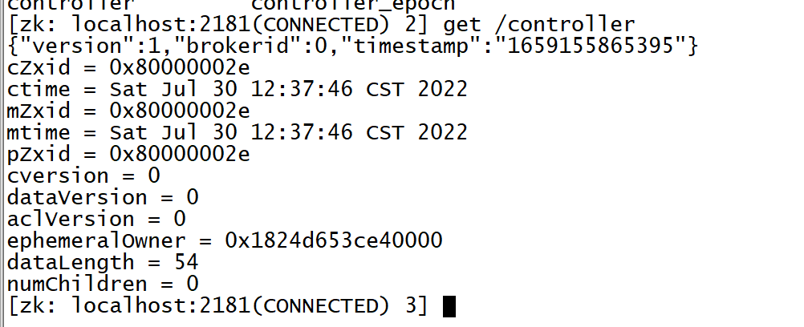

      - 存储元数据：生产者会将这个Topic的元数据获取以后会缓存在本地，定时刷新元数据

        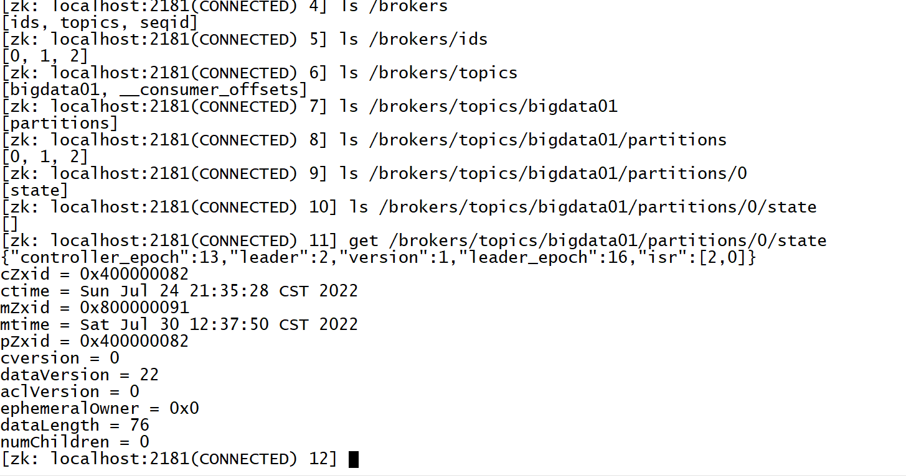

  - **step3**：先写入这台Broker的**==PageCache【操作系统级别内存】==**中，Kafka也用了内存机制来实现数据的快速的读写

    - Kafka使用OS内存：只有操作系统故障，重启机器，内存数据才会清空
    - 只考虑机器故障重启才会出现内存数据丢失：通过构建副本来解决

  - **step4**：操作系统的后台的自动将页缓存中的数据SYNC同步到磁盘文件中：最新的Segment的.log中

    - 条件：占用操作内存达到10%或者数据写入超过30s
    - **顺序写磁盘**：速度可以媲美写内存

  - **step5**：其他的Follower到Leader中同步数据，Follower同步完成会返回ACK给Leader

- **小结**：理解Kafka数据的写入过程：**==先写PageCache内存区域，顺序写磁盘【追加方式写入文件】==**

  

## 知识点08：【理解】Kafka存储机制：Segment

- **目标**：**理解Segment的设计**

- **实施**

  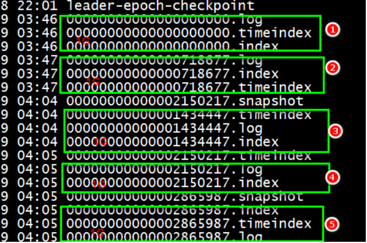

  - **设计思想**

    - **加快查询效率**
      - 通过将分区的数据根据Offset划分多个比较小的Segment文件
      - 在检索数据时，可以根据Offset快速定位数据所在的Segment
      - 加载单个Segment文件查询数据，可以提高查询效率
    - **减少删除数据IO**
      - 删除数据时，**Kafka以Segment为单位**删除某个Segment的数据
      - 避免一条一条删除，增加IO负载，性能较差

  - **Segment的基本实现**

    - .log：存储真正的数据
    - .index/.timeindex：存储对应的.log文件的索引

  - **Segment的划分规则**：满足任何一个条件都会划分segment

    - 按照时间周期生成

      ```properties
      #如果达到7天，重新生成一个新的Segment
      log.roll.hours = 168
      ```

    - 按照文件大小生成

      ```properties
      #如果一个Segment存储达到1G，就构建一个新的Segment
      log.segment.bytes = 1073741824  
      ```

  - **Segment文件的命名规则**

    - 以当前文件存储的最小offset来命名的

      ```
      00000000000000000000.log			offset : 0 ~ 2344
      00000000000000000000.index
      
      00000000000000002345.log			offset : 2345 ~ 6788
      00000000000000002345.index
      
      00000000000000006789.log			offset : 6789 ~
      00000000000000006789.index
      ```

    - 加快查询效率

    - 查找：offset = 3500

- **小结**：理解Segment的设计


## 知识点09：【理解】Kafka存储机制：读取过程

- **目标**：**理解Kafka数据的读取过程**

- **实施**

  - **step1**：消费者根据**Topic、Partition、Offset**提交给Kafka请求读取数据
  - **step2**：Kafka根据元数据信息，找到对应的这个分区对应的Leader副本节点
  - **step3**：请求Leader副本所在的Broker，**先读PageCache**，通过**零拷贝机制**【Zero Copy】读取PageCache
    - 先读内存，如果当前offset还在内存中，就使用零拷贝机制读取内存
    - 如果生产者生产的速度和消费者消费的速度相匹配：生产者一生产就立即被消费者消费
  - **step4**：如果PageCache中没有，读取Segment文件段，先根据offset找到要读取的那个Segment
    - 根据offset和文件名找到最近偏小的那个文件
  - **step5**：将.log文件对应的.index文件加载到内存中，根据.index中索引的信息找到Offset在.log文件中的最近物理位置
    - Kafka中的索引：稀疏索引【不是每条数据都有索引】
  - **step6**：读取.log，根据索引找到对应Offset的数据，读取连续的一个批次的数据

- **小结**：理解Kafka数据的读取过程：**==先读内存，基于零拷贝机制实现读取，Segment以及索引读取设计==**
  - https://zhuanlan.zhihu.com/p/183808742?utm_source=wechat_timeline


## 知识点10：【理解】Kafka存储机制：index索引设计

- **目标**：**理解Kafka的Segment中index的索引设计**

- **实施**

  - **查看数据**

    ```shell
    # 查看log文件信息
    kafka-run-class.sh kafka.tools.DumpLogSegments --files 00000000000000000000.log
    
    # 查看log文件信息并显示数据内容
    kafka-run-class.sh kafka.tools.DumpLogSegments --files 00000000000000000000.log --print-data-log
    
    # 查看index文件信息
    kafka-run-class.sh kafka.tools.DumpLogSegments --files 00000000000000000000.index --print-data-log
    ```
    
    - **索引类型**
  
      - 全量索引：每一条数据，都对应一条索引
  
        - index：200条
  
          ```
          行号		数据在文件中的物理偏移量
          1			0
          2			202
          ……
          200			100000
          ```
  
        - .log：200条数据
  
          ```
          1			key2			value2
          ……
          200			key201			value201
          ```
  
      - **稀疏索引**：部分数据有索引，有一部分数据是没有索引的
  
        - index：10条
  
          ```
          1			0
          2			202
          9			1010
          ……
          ```
  
        - log:200条
  
          ```
          1			key2			value2
          ……
          200			key201			value201
          ```
          
        - 优点：减少了索引存储的数据量加快索引的检索效率
  
        - 缺点：检索的时候，只能定位一定的范围
  
        - 场景：数据量非常大的情况下
        
        - 什么时候生成一条索引？
        
        ```properties
          #.log文件每增加4096字节，在.index中增加一条索引
          log.index.interval.bytes=4096
          ```
        
        - ==**面试题：Kafka中使用的索引是怎么设计的？**==
        
          - **Kafka中选择使用了稀疏索引**
          - index索引的第一列是offset的相对文件的位置，第二列是这条数据在文件中的物理偏移量
  
  - **索引内容**

    - 两列

      - 第一列N：这条数据在这个文件中的位置，是这个文件的第几条

      - 第二列Position：这条数据在文件中的物理偏移量

        ```
        是这个文件中的第几条,数据在这个文件中的物理偏移量位置
        1,0				--表示这个文件中的第一条，在文件中的位置是第0个字节开始
        3,497			--表示这个文件中的第三条，在文件中的位置是第497个字节开始
        ```

          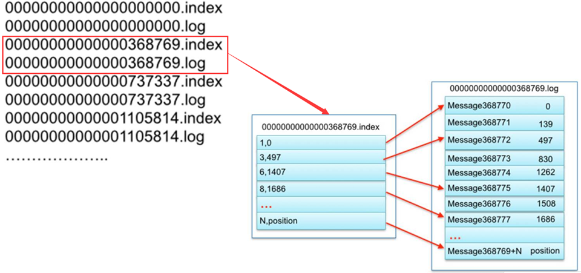

    - 这个文件中的第1条数据是这个分区中的第368770条数据，offset = 368769

  - **检索数据流程**

    - step1：先根据offset计算这条offset是这个文件中的第几条
    - step2：读取.index索引，根据二分检索，从索引中找到离这条数据最近偏小的位置

    - step3：读取.log文件从最近位置读取到要查找的数据

  - 举例

    - 需求：查找offset = 368772

    - step1：计算是文件中的第几条

      ```
        368772 - 368769 = 3 + 1 = 4，是这个文件中的第四条数据
      ```

    - step2：读取.index索引，找到最近位置

      ```
        3,497
      ```

    - step3：读取.log，从497位置向后读取一条数据，得到offset = 368772的数据

    - **问题：为什么不直接将offset作为索引的第一列，而用一个相对偏移量作为第一列？**

      - 直接offset作为索引的第一列，随着offset越来越大，索引变的非常大，查询性能会降低
      - 通过计算相对偏移量可以在数据量大的情况下，节省索引的空间，提高检索的效率

- **小结**：理解Kafka的Segment中index的索引设计

  

## 知识点11：【理解】Kafka数据清理

- **目标**：**理解Kafka中数据清理的规则**

- **实施**

  - **属性配置**

    ```properties
    #开启清理
    log.cleaner.enable = true
    #清理规则
    log.cleanup.policy = delete
    ```

  - **基于存活时间规则：最常用的方式**，单位越小，优先级越高

    ```properties
    # 清理周期
    log.retention.ms
    log.retention.minutes
    log.retention.hours=168/7天
    # 检查周期,要搭配清理周期来修改
    log.retention.check.interval.ms=300000
    # Segment文件最后修改时间如果满足条件将被删除
    ```

  - **基于文件大小规则**

    ```properties
    #删除文件阈值，如果整个数据文件大小，超过阈值的一个segment大小，将会删除最老的segment,-1表示不使用这种规则
    log.retention.bytes = -1
    ```

- **小结**：理解Kafka中数据清理的规则


# ==【模块三：常见面试题】==

## 知识点12：【掌握】Kafka消息队列的一次性语义

- **问题1：什么是一次性语义？**

  - at-most-once：至多一次，允许为0次，可能数据丢失

  - at-least-once：至少一次，允许多次，可能数据重复

  - exactly-once：有且仅有一次，只有1次，精准数据传输一次性语义

    

- **问题2：Kafka如何保证生产一次性语义？**

  - **数据丢失场景**：生产者将数据发送给Kafka，数据在网络传输过程中可能丢失

    - **ACK + 重试机制**：生产者生产数据写入kafka，等待kafka返回ack确认，收到ack，生产者发送下一条

    - **ACK机制**：acks = 0/1/all/-1

      - **0**：不等待ack，直接发送下一条
        - 优点：快
        - 缺点：数据易丢失
      - **1**：生产者将数据写入Kafka，Kafka等待这个分区Leader副本，返回ack，发送下一条
        - 优点：性能和安全做了中和的选项
        - 缺点：依旧存在一定概率的数据丢失的情况
      - ==**all/-1**==：生产者将数据写入Kafka，Kafka等待这个分区所有ISR【可用】副本同步成功，返回ack，发送下一条
        - 优点：安全
        - 缺点：性能比较差
        - 问题：如果ISR中只有leader一个，leader写入成功，直接返回，leader故障数据丢失怎么办？
        - 解决：搭配min.insync.replicas来使用，==**min.insync.replicas**==：表示最少要有几个ISR的副本，建议>=2

    - **重试机制**

      ```
      retries = 3 发送失败的重试次数
      ```

  - **数据重复的情况**：ACK丢失

    - step1：生产发送一条数据A给kafka
    - step2：Kafka存储数据A，返回Ack给生产者
    - step3：如果ack丢失，生产者没有收到ack，超时，生产者认为数据丢失没有写入Kafka
    - step4：生产者基于重试机制重新发送这条数据A，Kafka写入数据A，返回Ack
    - step5：生产者收到ack，发送下一条B
    - 问题：A在Kafka中写入两次，产生数据重复的问题

  - **Kafka的解决方案**：Pid：生产者id，数据id，同一个生产者生产的每一条数据都比上一条数据的id要多1

    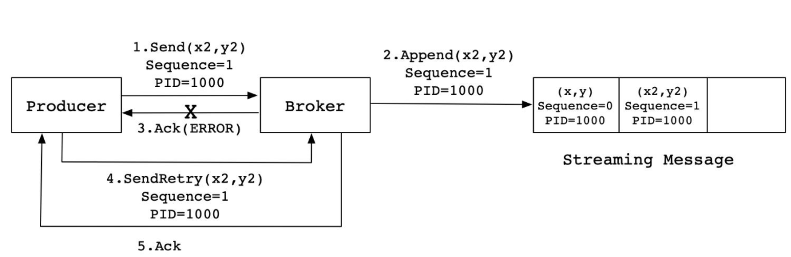

    

    - 实现：**在每条数据中增加一个数据id，当前这一条数据会比上一条数据id多1，Kafka会根据id进行判断是否写入过了**
      - 如果没有写入：写入kafka
      - 如果已经写入：直接返回ack
      

  - ==**幂等性机制**==：一个操作被执行多次，结果是一致的f(x) = f(f(x))

    

- **问题3：Kafka如何保证消费一次性语义？**

  - **规则**：消费者是根据offset来持续消费，只要**保证任何场景下消费者都能知道这个分区的commit Offset**即可
  - 问题：commit  offset每个消费者只保存在自己的内存中，如果消费者一旦故障，这个分区的commit offset就丢失
  - 需要：将**每个分区的commit offset存储在一种可靠外部存储中，手动管理offset**
  - 实现
    - step1：第一次消费根据属性进行消费
    - step2：消费分区数据，处理分区数据
    - step3：处理成功：将处理成功的分区的Offset进行额外的存储
    - step4：**如果消费者故障，可以从外部存储读取上一次消费的offset向Kafka进行请求**


## 知识点13：【理解】Kafka分区副本概念

- **问题1：Kafka如何保证分区数据安全？**
  - **分区副本机制**：每个kafka中分区都可以构建多个副本，相同分区的副本存储在不同的节点上
  
  - 为了保证安全和写的性能：划分了副本角色
  
  - leader副本：对外提供读写数据

  - follower副本：与Leader同步数据，如果leader故障，选举一个新的leader
  
  - 选举实现：Kafka主节点Controller实现
  
    
  
- **问题2：什么是AR、ISR、OSR？**

  ```
          Topic: bigdata01        Partition: 0    Leader: 2       Replicas: 2,0   Isr: 2,0
          Topic: bigdata01        Partition: 1    Leader: 1       Replicas: 1,2   Isr: 1,2
          Topic: bigdata01        Partition: 2    Leader: 1       Replicas: 0,1   Isr: 1,0
  ```

  - **AR：All - Replicas**

    - 所有副本：指的是一个分区在所有节点上的副本

  - **ISR：In - Sync - Replicas**

    - 可用副本：所有正在与Leader同步的Follower副本

    - 列表中：按照优先级排列【Controller根据副本同步状态以及Broker健康状态】，越靠前越会成为leader

    - 如果leader故障，是从ISR列表中选择新的leader

    - 如果生产者写入数据：ack=all，写入所有ISR列表中的副本，就返回ack

  - **OSR：Out - Sync  - Replicas**

    - 不可用副本：长时间没有与Leader副本同步数据的follower副本

    - 原因：网路故障等外部环境因素，某个副本与Leader副本的数据差异性很大

    - 判断是否是一个OSR副本？

      ```
      replica.lag.time.max.ms = 10000   可用副本的同步超时时间
      ```

    - 写入、Leader选举：都只从ISR列表中选取
    
  - **关系：AR = ISR + OSR**

    

- **问题3：什么是HW、LEO？**

  - LW：分区概念：low_watermark：最低消费的offset，一般为0，消费者能够消费到的最小的offset
  - **HW：分区概念：high_watermark：最高消费的offset，消费者只能消费到这个位置**
  - LSO：副本概念：Log Start Offset：起始Offset，一般0
  - **LEO：副本概念：Log End Offset：下一个待写的offset = 当前已有的最新offset + 1**
  - **==一个分区所有副本的最小LEO = 这个分区的HW==**
  - HW = 6，表示消费者能够消费到offset从0 到 5总共6条数据
    - LEO = 9 ，表示这个分区的Leader副本中已经写入了9条数据，offset从0到8

  

  - ==HW：当前这个分区所有副本同步的最低位置+1，**消费者能消费到的最大位置**==

    - Part0：3个副本

    - Leader副本：node1，LEO=5
  
      ```
      0-a
      1-b
      2-c
      3-d
    4-e
      ```

    - Follower1副本：node2，LEO=5
  
      ```
      0-a
      1-b
      2-c
      3-d
    4-e
      ```

    - Follower2副本：node3，LEO=3
  
      ```
      0-a
      1-b
    2-c
      ```

    - **消费者消费这个分区的HW = 这个分区所有副本中的最小LEO = offset为3之前的数据**

  - **数据写入Leader及同步过程**

    - step1:数据写入分区的Leader副本

      
  
      - leader：LEO = 5 
      - follower1：LEO = 3
- follower2：LEO = 3
      - HW = 3

    - step2：Follower到Leader副本中同步数据

      
  
      - leader：LEO = 5 
    - follower1：LEO = 5
      - follower2：LEO = 4
    - |
      - HW = 4
    
    - **每当follower同步成功以后会返回一个ack给leader，leader收到ack，会更新HW**


## 知识点14：【理解】其他面试题

- **问题1：什么是CAP理论，Kafka满足哪两个？**

  - C：一致性，任何一台机器写入数据，其他节点也可以读取到

  - A：可用性，如果一个节点故障，其他节点可以正常提供数据服务

  - P：分区容错性，如果某个分区故障，这个分区的数据照样可用

  - Kafka满足CA，Kafka不能保证一个分区故障，这个分区的数据照样可用

    

- **问题2：Canal实时采集MySQL，将MySQL中实时的数据写入Kafka的时候，消费端消费的更新日志在插入日志之前，就会因为数据缺失导致异常，怎么保证插入和更新的顺序？**

  - 问题：同一条数据在短时间做了两个具有顺序性的操作

    ```
    insert：写入了第一个分区
    update：写入了第二个分区
    ```

  - 根本原因：Kafka多个分区不能保证顺序，只能保证分区内部顺序

  - 解决

    - 方案一：只构建一个分区【性能太差，一定是不选用】
    
    - 方案二：将数据库和表名作为key，然后按照Hash取余规则写入Kafka
    
    - 方案三：Flink**基于事件时间处理来实现**
    
      

- **问题3：timeindex的功能是什么？**

  - Kafka存储是提供了两种索引方式

    - index：offset位移索引
    - timeindex：时间索引

  - Kafka提供了两种条件消费数据的方式

    - 方式一：提供Topic、Partition、Offset【默认方式】

    - 方式二：提供Topic、Partition、time

      - 代码中需要指定分区消费，以及指定每个分区消费的时间

        ```
        consumer.seek(分区，分区要消费的offset)
        ```
        
      - 只能指定offset，如果要用时间，就需要将时间转换为offset

        ```java
        // 将每个分区要消费的时间转换为offset
        Map<TopicParition, Offset> offsets = consumer.offsetsForTimes(topicPartitionLongMap);
        ```

      - 要求必须传入每个分区从什么时间消费的Map集合

        ```java
        // 构建一个空的Map集合
        Map<TopicPartition, Long> topicPartitionLongMap = new HashMap<>;
        // 获取当前这个消费者消费的所有分区
        Set<TopicParition> partitions = consumer.assignment();
        // 添加每个分区要从什么时间消费
        for(TopicPartition part: partitions){
            topicPartitionLongMap.put(part, System.currentTimeMillis() - 1 * 24* 3600000)
        }
        ```

  - 第二种方式的本质还是第一种方式：根据上一次消费的时间去获取对应时间范围内的offset，再消费offset

    - 如何知道上一次消费到当前时间的offset是哪些？
    - 检索timeindex文件：你想要的这个时间对应的offset是这个Segmen文件中的第几条
- 检查index文件：根据第几条找到对应的offset的物理偏移量
    - 读取log文件：根据时间来做比较，找到这个时间对应的数据的offset
    
    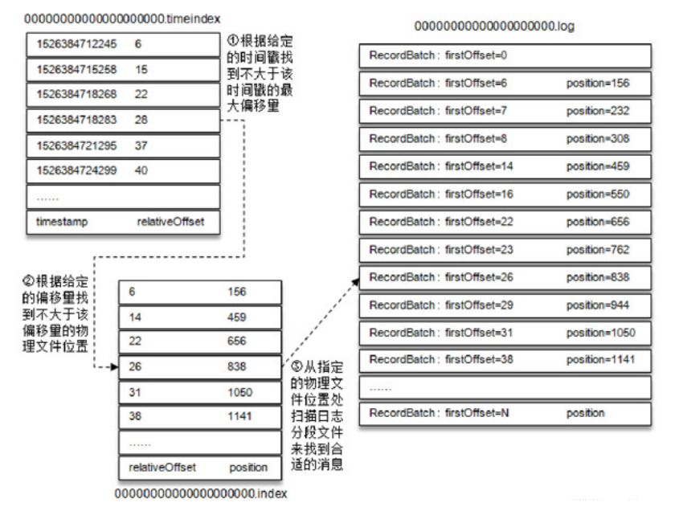


# ==【模块四：Hbase基础入门】==

## 知识点15：【理解】HBASE基本介绍

- **目标**：**了解大数据存储业务需求及Hbase的诞生背景**

- **实施**

  - **存储需求**

    - 早期需求：能实现大量数据的存储和计算
      - 只要能实现即可
    - 现在需求：大数据要达到一个实时应用的效果，实时推荐系统、实时监控、机器学习
      - 规则：数据的价值会随着时间而逐渐流失，要想追寻数据价值最大化，必须构建实时
      - 实时采集：Flume、Canal
      - 实时存储：Kafka
      - 实时计算：Flink 、 StructStreaming
      - 实时应用：Redis【数据量小】、Hbase【数据量大】

  - **Hbase诞生**

    - Google：前三篇论文
    - GFS：HDFS
    - MapReduce：MapReduce
    - BigTable【Chubby】：Hbase+Zookeeper

  - **官方定义**：http://hbase.apache.org/

    - Hbase是一个基于Hadoop的分布式的可扩展的大数据存储的基于内存列存储NoSQL数据库

      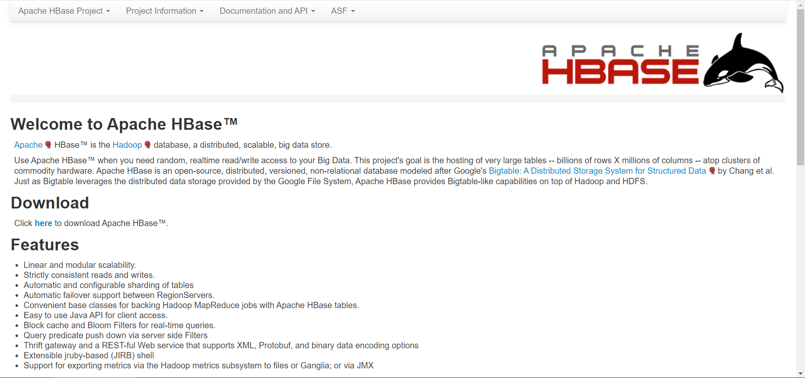

      ```
      Apache HBase™ is the Hadoop database, a distributed, scalable, big data store.
      
      Use Apache HBase™ when you need random, realtime read/write access to your Big Data. This project's goal is the hosting of very large tables -- billions of rows X millions of columns -- atop clusters of commodity hardware. Apache HBase is an open-source, distributed, versioned, non-relational database modeled after Google's Bigtable: A Distributed Storage System for Structured Data by Chang et al. Just as Bigtable leverages the distributed data storage provided by the Google File System, Apache HBase provides Bigtable-like capabilities on top of Hadoop and HDFS.
      ```

    - 可扩展的大数据存储：分布式

    - **随机实时的访问大数据**：基于**内存**存储

  - **定义**：分布式的实时随机的大数据读写的NOSQL数据库系统

  - **功能**：提供分布式的实时随机的大数据持久性存储【读写】

  - **应用**：大数据量、高并发、高性能的结构化数据列存储【读写】

    - 电商：订单
    - 交通：实时监控、实时车辆轨迹
    - 金融：交易信息
    
  - **工作**

    - 实时：可以用于实时处理中间结果的存储、实时计算的最终结果的存储
    - 离线：用于离线系统中与Hive集成，将Hive表的数据存储在Hbase，提升查询性能

- **小结**：理解Hbase的设计、功能及应用场景


## 知识点16：【理解】HBASE设计思想

- **目标**：**掌握Hbase的设计思想**

- **实施**

  - **为什么Hbase读写速度比较快？**

    - Hbase使用内存提供数据存储和读写

  - **为什么Hbase可以支持大数据量？**

    - Hbase基于分布式磁盘来存储和读写：直接依赖于HDFS

  - **核心思想**

    - **数据存储**：分布式内存 + 分布式磁盘
    - **问题**：写入数据的时候，到底是写内存还是写磁盘呢？
      - 实时工具：写一定是写内存的，当内存达到一定阈值，将内存的数据写入磁盘中
    - **应用场景**：实时，数据一产生写入，就立即要被读取计算
      - 刚产生数据：大概率需要用到的数据
      - 已经产生很久数据：大概率很少会用到的
    - **思想：将刚产生的数据写入分布式内存 ，内存存储达到一定阈值，将内存中的数据写入分布式磁盘【HDFS】**
      - **写：只写内存**，内存如果达到阈值，自动将内存的数据写入磁盘
      - **读：先读内存**，实时场景下，刚写入就会被读取，读写只经过内存，速度很快

  - **Hbase与HDFS有什么区别？**

    - HDFS：分布式文件系统【文件】、离线、分布式磁盘、大数据量永久性存储
    - Hbase：分布式NoSQL数据库【表】、实时、分布式内存+分布式磁盘【HDFS】、大数据量永久性存储或者临时存储
    - 问题：Hbase既然底层基于HDFS，HDFS是离线的，为什么Hbase可以是实时的？
      - 写：只写分布式内存
      - 读：先读内存，如果内存中没有，就读HDFS，通过很多的设计保证读HDFS也很快
        - 索引：基于索引加快查询
        - 分区：按照一定规则存储文件的数据，可以基于规则快速定位在哪个文件中
        - 二进制文件
        - 缓存机制

  - **Hbase与MySQL有什么区别？**

    - Hbase：NoSQL【非关系型】，不支持SQL语句， 仅支持单行事务操作, 分布式存储 ,存储是结构化和半结构数据,不支持join

      - 面向列存储工具：**最小操作单元为列**

      - 每一行的列可以不固定，**不同的行可以拥有不同的列**

      - put、get、delete：对是都某一行的某一列的操作

        ```
        id	name		age		sex
        1	laoda		18		male
        2	laoer
        3				20
        ```
        
      - 为什么，物理层怎么实现？

        ```
        # Hbase中行是逻辑的概念，对应着物理上的多行，有几列就有几行
        # Hbase中列是逻辑的概念，对应着物理上的一行，是一个KV
        K				V
        表名+行号a+id	 1
        表名+行号a+name	 laoda
        表名+行号a+age	 18
        表名+行号a+sex	 male
        
        表名+行号b+id	2
        表名+行号b+name	laoer
        ```

    - MySQL：RDBMS【关系型】，支持SQL 支持多行事务操作, 中心化存储, 存储主要是以结构化数据为主,支持join

      - 面向行存储工具：**最小操作单元为行**

      - **每一行的列都是固定的**，哪怕这一行的列没有值，它有这一列，默认为null

      - 对某一张表的某一行的操作

        ```
        id	name		age
        1	laoda		18
        2	laoer		null
        3	null		20
        ```

      - insert、update、delete：都是对行的操作

        ```
        insert into tbname values(1，laoda,null)
        upate tbname set name = laoer where id = 1;
        delete from tbname where id =1;
        ```

  - **Hbase与Hive有什么区别？**

    - 共性：底层都基于HDFS，都做为Hadoop系列的存储工具
    - Hbase：基于hadoop的软件 ,数据库工具， hbase是NoSQL存储容器, 延迟性较低, 接入在线实时业务
    - Hive：基于hadoop的软件, 数仓工具 , Hive延迟较高, 接入离线业务, 用于 OLAP操作

- **小结**：掌握Hbase的设计思想


## 知识点17：【掌握】HBASE中的对象概念

- **目标**：**掌握Hbase中的对象的概念**

- **实施**

  - **Hbase中的数据库概念NameSpace**

    - ==**NameSpace：命名空间**==，等同于**数据库中的Database**的概念

    - **Hbase中的任何一张表都必须属于某个NameSpace**

    - 使用：Hbase中没有切换NameSpace的命令，访问所有表只能使用**Namespace:TableName**方式来访问表

      - MySQL：访问一张表，两种方式

        - 方式一：先切换数据库：use dbname;，再访问表：select * from tbname;
        - 方式二：绝对路径访问：select *  from dbname.tbname

      - **Hbase：只支持绝对路径访问**

        ```
        scan nsname:tbname
        ```

    - 理解：把Namespace当做表名的前缀来看，只要访问表名必须加ns

    - 特例：Hbase中默认自带了一个default的数据库，如果访问这个数据库中的表不用加，可以直接给表名

  - ==**Hbase中的表概念Table**==

    - 概念：**表的概念**，等同于数据库中的表的概念

    - 使用

      - ==**Hbase中的表是分布式的**==：表的数据分布式存储在不同的机器上

        - 数据存在表中，Hbase是分布式存储
    - Hbase的表是一个分布式逻辑对象：**一个表可以划分多个分区Region存储**，默认情况下一张表只有1个Region分区
        - 写入这张表的数据根据分区规则写入不同的分区
    - 类似于HDFS中的文件，类似于Kafka的Topic
      
    - Hbase是分布式存储【读写】，读写是操作表
      
  - **所有的表在访问时，都必须加上ns的名称，除非表在default默认ns下**，可以不加ns名称来进行访问
      
    - 有一个ns叫做itcast，这个ns中有一张表叫做heima
      
      ```
          itcast:heima
          ```
      
    - Hbase中自带了一个ns叫做default，这个ns中有一张表叫t1
      
      ```
          default:t1 或者 t1
          ```

- **小结**：掌握Hbase中的对象的概念

  

## 知识点18：【掌握】HBASE中的存储概念

- **目标**：**掌握Hbase中的存储的概念**

- **实施**

  - ==**数据行设计Rowkey**==

    - Rowkey：行健，这个概念是整个Hbase的核心，**类似于MySQL主键的概念**

    - MySQL主键：可以有也可以没有，唯一标记一行、作为主键索引，支持创建其他索引

    - Hbase行健    

      - 所有Hbase的表不用定义，**所有Hbase的表自带行健这一列**【**行健这一列的值由用户自己设计**】  
      - **每张Hbase表都有行健**，行健这一列是Hbase表创建以后自带的
    - **行健的功能**
      - 唯一标识一行

      - **作为Hbase表中的唯一索引**，Hbase不能创建索引

  - **列族/列簇设计ColumnFamily**

    - **cf：列族**，**对除了Rowkey以外的列进行分组，将列划分不同的组中**

      - 注意：任何一张Hbase的表，都至少要有一个列族，**除了Rowkey以外的任何一列，都必须属于某个列族**，Rowkey不属于任何一个列族

      - 分组：**将拥有相似IO属性的列放入同一个列族**【要读一起读，要写一起写】

      - 设计原因：划分列族，读取数据时可以**加快读取的性能**

      - 如果没有列族，没有划分班级教室：找一个人，告诉你这个人就在这栋楼

      - 如果有了列族，划分了教室：找一个人，告诉你这个人在这栋楼某个房间

      

  - **数据列设计Qualifier**

    - **Qualifier/Column：列**，与MySQL中的列是一样

    - **Hbase除了rowkey以外的任何一列都必须属于某个列族**，**引用列的时候，必须加上列族的名称**

    - 如果有一个列族：basic

    - 如果basic列族中有两列：name，age

      ```
      basic:name
      basic:age
      ```

    - Hbase是面向列存储，Hbase中每一行拥有的列是可以不一样的

  - **多版本设计VERSIONS**

    - 功能：某一行的任何一列存储时，只能存储一个值**，Hbase可以允许某一行的某一列存储多个版本的值的**

    - 级别：**列族级别**，指定列族中的每一列最多存储几个版本的值，来记录值的变化的

    - 区分：每一列的每个值都会自带一个时间戳，用于区分不同的版本

    - **默认情况下查询，根据时间戳返回最新版本的值**

      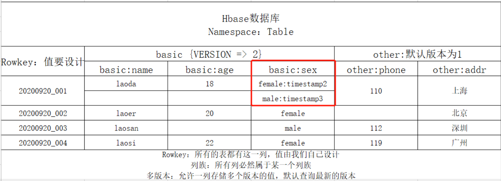

- **小结**：掌握Hbase中的存储的概念


# 附录一：可视化工具Kafka Eagle

- **目标**：**了解Kafka Eagle的功能、实现Kafka Eagle的安装部署、使用Eagle监控Kafka集群**

- **实施**

  - **功能**：用于集成Kafka，实现Kafka集群可视化以及监控报表平台

  - **部署**

    - **==注意：上传本次课程中随堂工具中的包==**

    - 下载解压：以第三台机器为例

      ```shell
      cd /export/software/
      rz  
      tar -zxf kafka-eagle-web-1.4.6-bin.tar.gz -C /export/server/
      ```

    * 准备数据库：存储eagle的元数据，在Mysql中创建一个数据库

      ```sql
      create database eagle;
      ```

      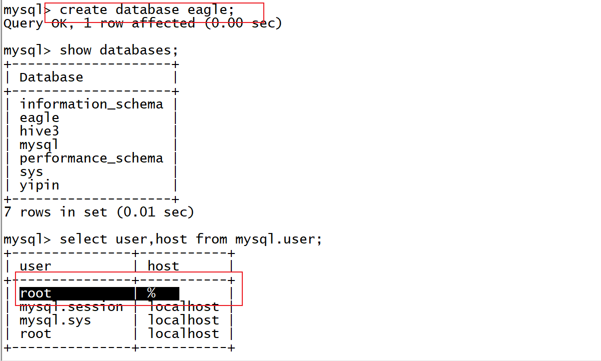

      

    * 修改配置文件：

      ```shell
      cd /export/server/kafka-eagle-web-1.4.6/
      vim  conf/system-config.properties
      ```

      ```properties
      #第4行：配置zookeeper集群的名称
      kafka.eagle.zk.cluster.alias=cluster1
      #第5行：配置zookeeper集群的地址，第6行删掉
      cluster1.zk.list=node1:2181,node2:2181,node3:2181
      #31行左右配置开启统计指标
      kafka.eagle.metrics.charts=true
      #最后位置，注释68-71，将76行以后的内容替换如下，配置连接MySQL的参数
      kafka.eagle.driver=com.mysql.jdbc.Driver
      kafka.eagle.url=jdbc:mysql://node1:3306/eagle
      kafka.eagle.username=root
      kafka.eagle.password=hadoop
      ```

    * 配置环境变量

      ```
      vim /etc/profile
      ```

      ```shell
      #KE_HOME
      export KE_HOME=/export/server/kafka-eagle-web-1.4.6
      export PATH=$PATH:$KE_HOME/bin
      ```

      ```
      source /etc/profile
      ```

    * 添加执行权限

      ```
      cd /export/server/kafka-eagle-web-1.4.6
      chmod u+x bin/ke.sh
      ```

    * 启动服务

      ```
      ke.sh start
      ```

    * 登陆

      ```
      网页：node3:8048/ke
      用户名：admin
      密码：123456
      ```

      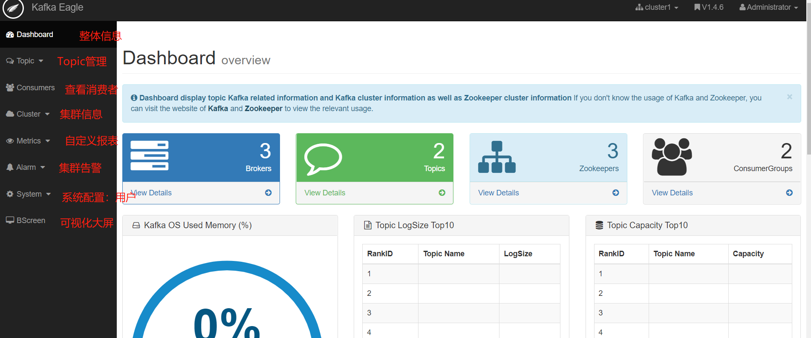

  - **Kafka Eagle使用**

    - 监控Kafka集群

      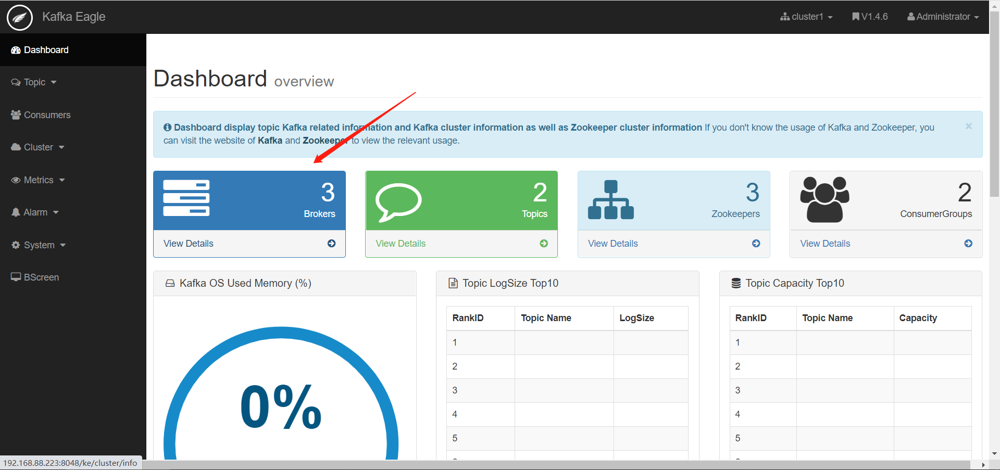

      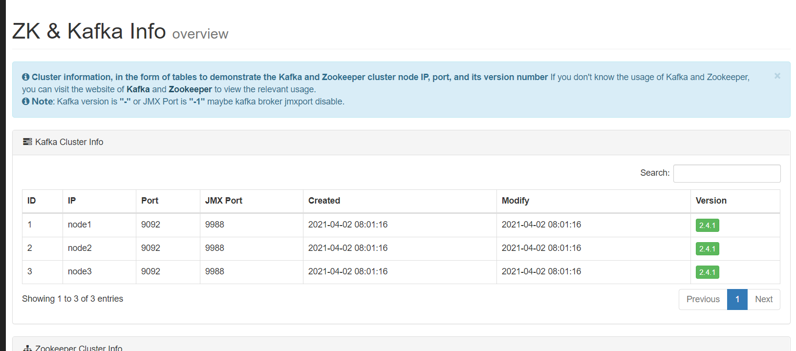

    - 监控Zookeeper集群

      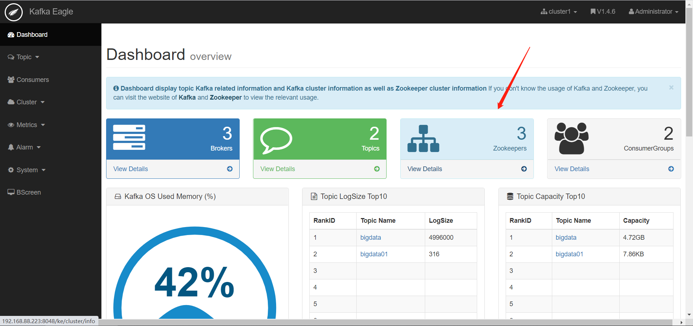

      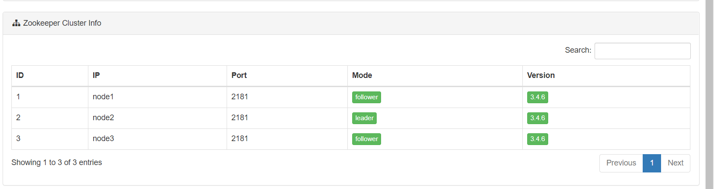

    - 监控Topic

      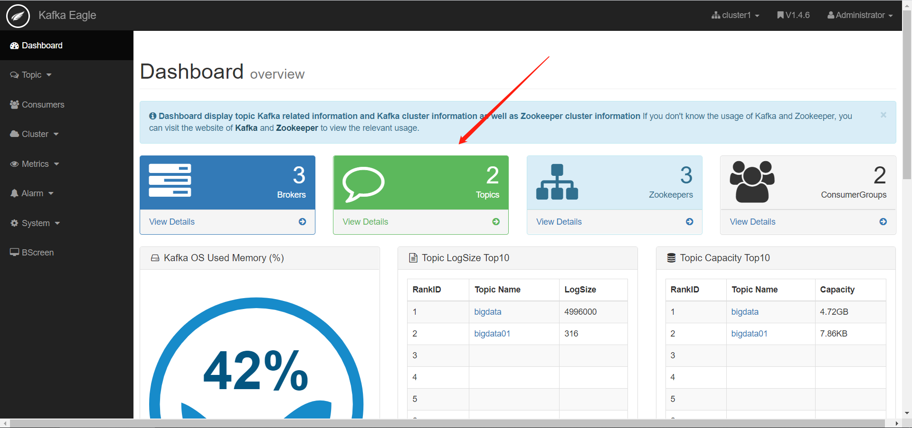

      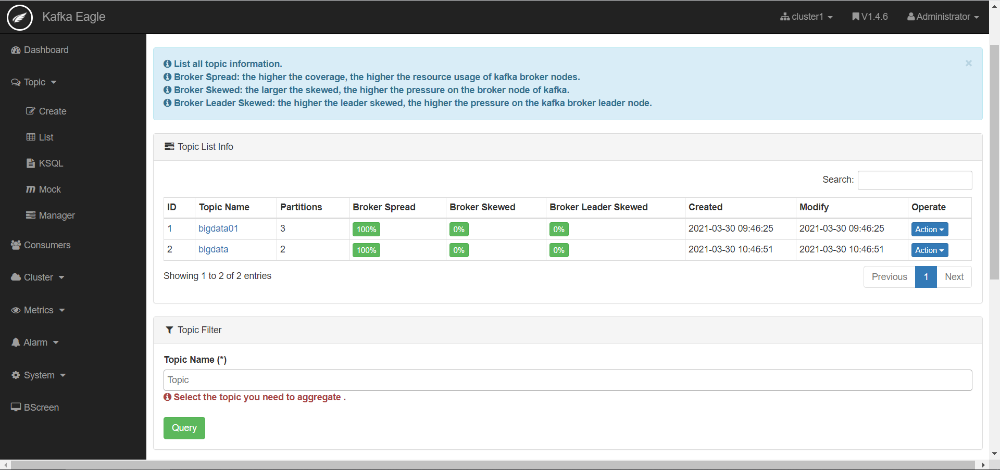

      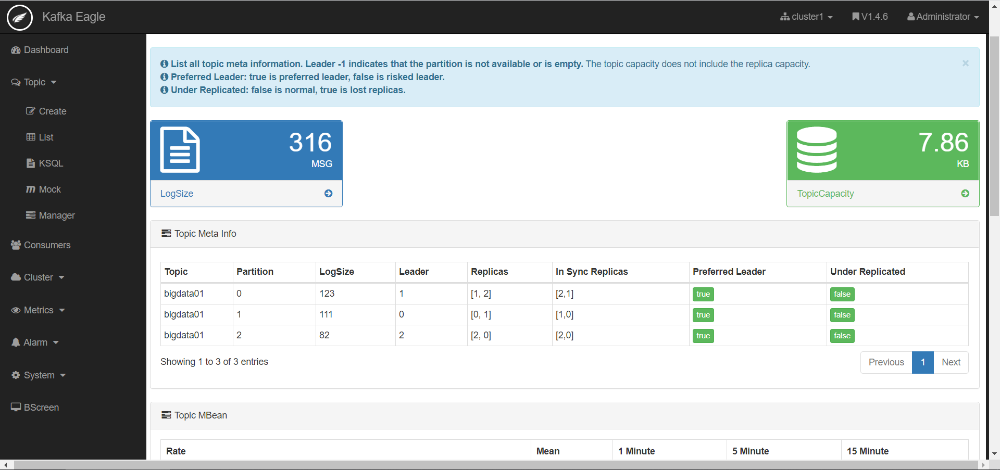

      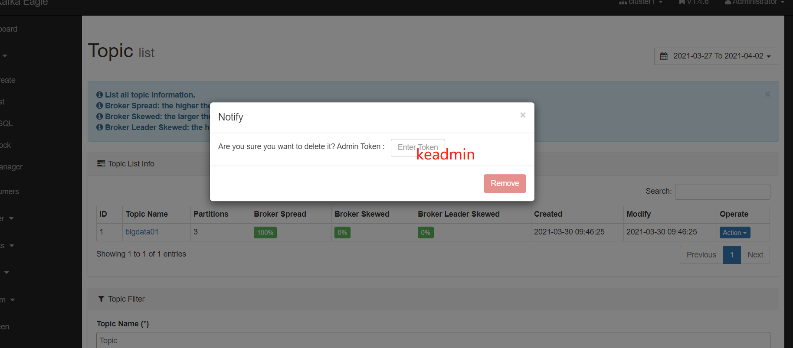

    - **查看数据积压**

      - 现象：消费跟不上生产速度，导致处理的延迟

      - **原因**

        - 消费者组的并发能力不够
      - 消费者处理失败
        - 网络故障，导致数据传输较慢
    
      - 解决

        - **提高消费者组中消费者的并行度 / 增大每次处理的消息个数**
      - 分析处理失败的原因
    
        - 找到网络故障的原因

      - 查看监控

        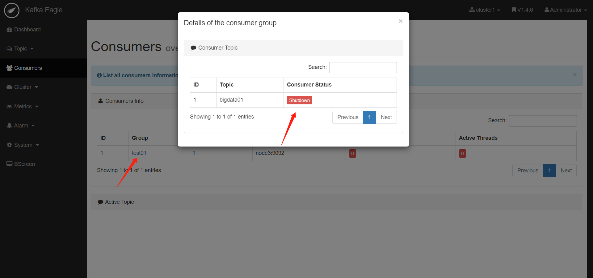

        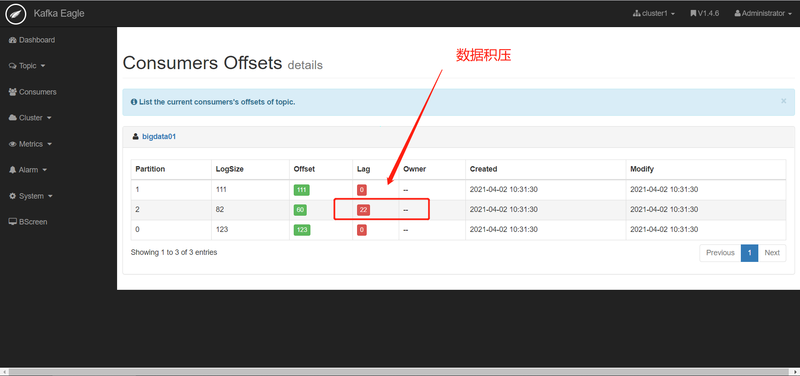

    - 报表

      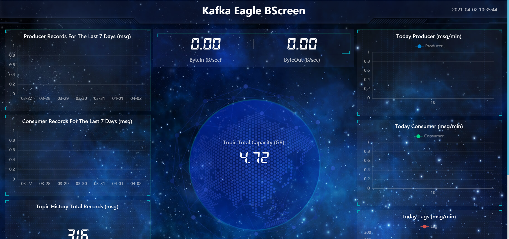

- **小结**：Kafka中最常用的监控工具