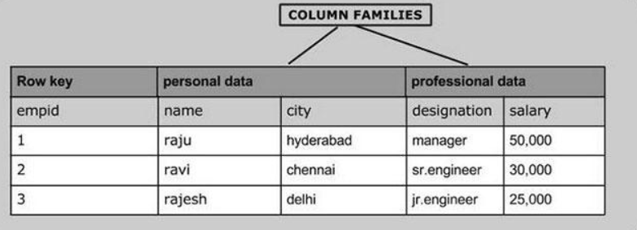
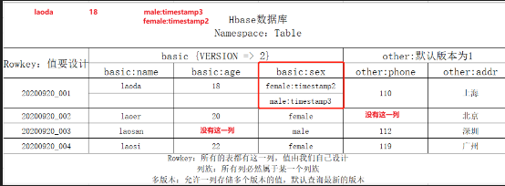
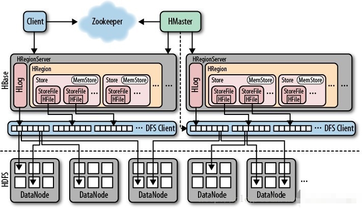
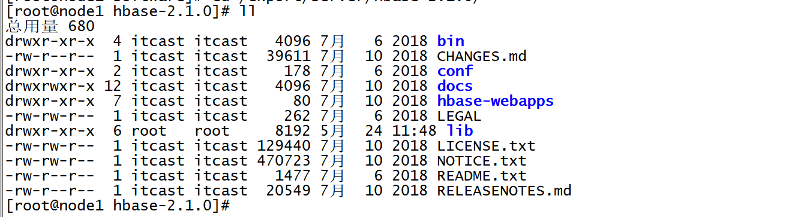
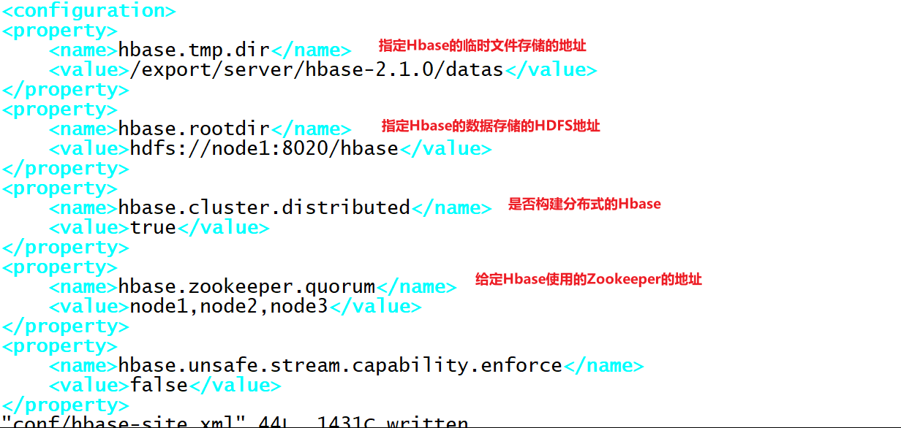
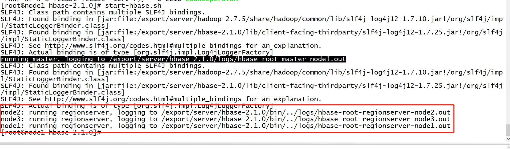
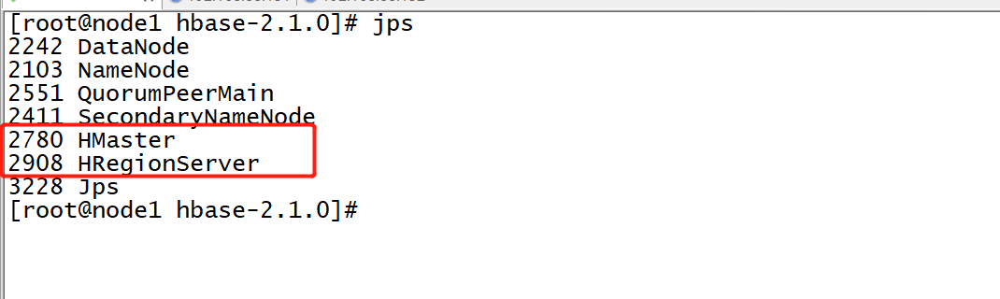
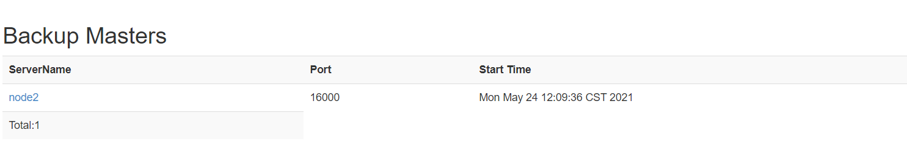
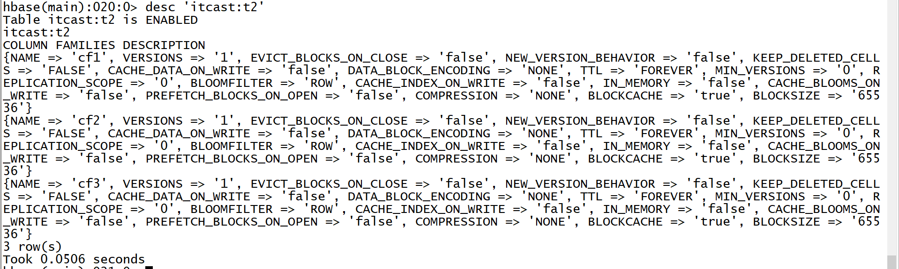

# 分布式面向列的NoSQL数据库Hbase（一）

## 知识点01：课程回顾

1. Kafka收尾

   - Kafka为什么基于磁盘的日志消息队列系统，但是读写速度很快？
     - 写：先写内存PageCache，然后顺序写入磁盘【追加】
     - 读：先读内存PageCache，Segment对分区数据进行划分，通过稀疏索引来加快查询，通过0拷贝机制来读取
   - **Kafka中如何保证一次性语义？**
     - 一次性语义：至多一次，至少一次，有且仅有一次
     - 生产不丢失：ack 应答机制 + retries 重试机制
     - 生产不重复：实现生产幂等性保证：生产id + 数据id ， 事务机制【操作放入一个Topic中】
     - 消费不丢失不重复：手动管理commit offset：文件、MySQL、Zookeeper、Redis
   - Kafka中一些概念：AR、ISR、OSR、HW、LEO？
     - AR：一个分区的所有副本
     - ISR：正在同步的副本，可用副本，写入数据以及选举Leader都是从ISR中选择
     - OSR：没有同步的副本，不可用副本，超过一定的时间没有和Leader通信
     - LEO：分区的每个副本当前已经写入的位置+1，下一个待写的位置
     - HW：消费的高水位线，指的是消费者消费这个分区能够消费到的位置+1，等于这个分区所有副本最小LEO

2. Hbase入门

   - 功能：分布式的基于Hadoop的NoSQL数据库，提供大数量的持久性存储，以及分布式实时、随机的大数据量的读写

   - 场景：大数据量实时数据读写，目前实时场景中用于存储实时处理的数据，离线场景中搭配Hive来实现，提高李娜性能

   - 设计：分布式大数据量实时数据读写、面向列存储

     - 大数据量怎么能提供实时？基于HDFS来实现大数据量，基于分布式内存来提供实时效果
     - 读写到底读写HDFS还是内存？写只写内存，内存达到阈值刷写到HDFS，读先读内存，内存没有再读HDFS
     - 面向列存储：Hbase中数据表的最小操作单元为列，本质上表的列是逻辑，物理上每一列就是一个KV

   - 概念

     - Namespace：类似于数据库Database概念，用于做业务上表的划分

       - Hbase没有切换Namespace的命令，只要访问表，就必须在表名前加上NS名称
       - Hbase中数据库和表名之间用冒号nsname:tbname，不用点dbname.tbname
       - 理解：当做表名的一部分，以后只要访问某张表，就加上NS

     - Table：类似于表Table概念，用于做数据的划分

       - Hbase是分布式存储，数据都是读写Table

       - Hbase中的Table是一个逻辑上的分布式概念，写入表中的数据，会分布式写入不同的节点中

       - Hbase的Table通过构建分区来实现分布式，一张表可以对应多个Region【分区】

         | 概念       | HDFS           | Kafka           | Hbase             | MySQL    |
         | ---------- | -------------- | --------------- | ----------------- | -------- |
         | 业务分类   | 目录           | -               | Namespace         | Database |
         | 分布式对象 | 文件           | Topic           | Table             | Table    |
         | 实现分布式 | 分块：Block    | 分区：Partition | 分区：Region      | -        |
         | 区别       | 分布式文件系统 | 分布式消息队列  | 分布式NoSQL数据库 | -        |

         

## 知识点02：课程目标

1. Hbase中核心存储概念
   - 目标：掌握核心概念**==Rowkey、ColumnFamily、Qualifier、VERSIONS==**
2. Hbase分布式集群架构及部署
   - 目标：掌握Hbase整体架构及角色功能，实现Hbase分布式集群环境的搭建


## 知识点03：【掌握】HBASE中的存储概念

- **目标**：**掌握Hbase中的存储的概念**

- **实施**

  - ==**数据行设计Rowkey**==

    - **==Rowkey：行健==**，这个概念是整个Hbase的核心，**类似于MySQL主键的概念**

    - MySQL主键：可以有也可以没有，唯一标记一行、作为主键索引，支持创建其他索引

    - Hbase行健    

      - 所有Hbase的表不用定义，**所有Hbase的表自带行健这一列**【**行健这一列的值由用户自己设计**】  
      - **每张Hbase表都有行健**，行健这一列是Hbase表创建以后自带的
    - **行健的功能**
      - 唯一标识一行

      - **作为Hbase表中的唯一索引**，Hbase不能创建索引

  - **==列族/列簇设计ColumnFamily==**

    - **cf：列族**，**对除了Rowkey以外的列进行分组，将列划分不同的组中**

      - 注意：任何一张Hbase的表，都至少要有一个列族，**除了Rowkey以外的任何一列，都必须属于某个列族**
      - 分组：**将拥有相似IO属性的列放入同一个列族**
      - 本质：就是将列进行分组，**不同的组【列族】在物理上是不同的单元，相同列族的列会存储在一个物理单元中**
      - 设计：为了提高列的查询效率，牺牲了一点点写的性能【只写内存】
      - 类比：类似于Kafka中Segment的设计
      - 举个栗子：一张表有100列，Hbase的最小操作单元列
        - 需求：从这100列中找到某一列
        - 场景一：不分组：将这100列的数据都存在一起
          - 问：找到这一列，请问最多比较多少次？
          - 答：100次
        - 场景二：分组，前50列放在同一组A，另外50列放在另一组B中，查询的时候指定要的列在B组中
          - 问：找到这一列，请问最多比较多少次？
          - 答：52次

      

  - ==**数据列设计Qualifier**==

    - **Qualifier/Column：列**，与MySQL中的列是一样

    - **Hbase除了rowkey以外的任何一列都必须属于某个列族**，**引用列的时候，必须加上列族的名称**

    - 如果有一个列族：basic

    - 如果basic列族中有两列：name，age

      ```
      basic:name
      basic:age
      ```

    - Hbase是面向列存储，Hbase中每一行拥有的列是可以不一样的

    - 本质：底层的物理存储，每一列就是一个KV

  - ==**多版本设计VERSIONS**==

    - 功能：某一行的任何一列存储时，只能存储一个值**，Hbase可以允许某一行的某一列存储多个版本的值的**

    - 级别：**列族级别**，指定列族中的每一列最多存储几个版本的值，来记录值的变化的

    - 区分：每一列的每个值都会自带一个时间戳，用于区分不同的版本

    - **默认情况下查询，根据时间戳返回最新版本的值**

      
    
  - **物理层设计**：Hbase中的数据都是以KV结构存在

    - Rowkey：Hbase表中的Rowkey是逻辑上的行，一个Rowkey代表表中的一行，在物理层对应多个KV

    - Qualifier：Hbase表中Qualifier是逻辑上的列，一个Qualifier代表一行中的一列，在物理层对应一个KV

    - VERSIONS：所谓的多版本，只是这一列在物理层有多条KV

    - 物理层结构：数据存储时，按照rowkey、cf、col进行升序排序，按照ts降序排序【加快查询性能】

      ```shell
      #K:rowkey+cf+col+ts			V:value
      001+basic+age+ts1			18
      001+basic+name+ts1			laoda
      001+basic+sex+ts3			male
      001+basic+sex+ts2			female
      001+basic+sex+ts1			male  : 已经过期
      001+other+addr+ts1			上海
      001+other+phone+ts1			110
      
      
      002
      
      
      003
      
      
      
      004
      ```

- **小结**：掌握Hbase中的存储的概念


## 知识点04：【掌握】HBASE集群架构

- **目标**：**掌握Hbase集群的集群架构**

- **实施**

  - **架构**

    

    - 分布式主从架构集群：普通分布式主从架构

    - **HMaster**：主节点：管理节点，类似于NameNode的设计
      - 负责所有从节点的管理
      - 负责元数据的管理

    - **HRegionServer**：从节点：存储节点，类似于DataNode设计
      - 负责管理每张表的分区数据：Region，类似于DataNode存储每个文件的块

      - 对外提供Region的读写请求

      - ==用于构建分布式内存==

  - **组件**

    - Hbase：通过RegionServer构建分布式内存，对外提供基于内存的读写
    - HDFS：构建分布式磁盘，当Hbase中的内存达到一定阈值，将内存的数据溢写到HDFS磁盘上
    - Zookeeper：【辅助选举】：多个Master的Active选举，【存储元数据】：Hbase的管理元数据

- **小结**：掌握Hbase集群的集群架构


## 知识点05：【实现】HBASE集群部署

- **目标**：**实现Hbase分布式集群部署**

- **实施**

  - **解压安装**

    - 上传HBASE安装包到第一台机器的/export/software目录下

      ```shell
      cd /export/software/
      rz
      ```

    - 解压安装

      ```shell
      tar -zxf hbase-2.1.0.tar.gz -C /export/server/
      cd /export/server/hbase-2.1.0/
      ```

      

  - **修改配置**

    - 切换到配置文件目录下

      ```shell
      cd /export/server/hbase-2.1.0/conf/
      ```

    - 修改hbase-env.sh：**==注意JDK的版本可能不一致==**

      ```shell
      #28行
      export JAVA_HOME=/export/server/jdk1.8.0_65
      #125行
      export HBASE_MANAGES_ZK=false
      ```

    - 修改hbase-site.xml

      ```shell
      cd /export/server/hbase-2.1.0/
      mkdir datas
      vim conf/hbase-site.xml
      ```

      ```xml
      <property>
          <name>hbase.tmp.dir</name>
          <value>/export/server/hbase-2.1.0/datas</value>
      </property>
      <property>
          <name>hbase.rootdir</name>
          <value>hdfs://node1:8020/hbase</value>
      </property>
      <property>
          <name>hbase.cluster.distributed</name>
          <value>true</value>
      </property>
      <property>
          <name>hbase.zookeeper.quorum</name>
          <value>node1,node2,node3</value>
      </property>
      <property>
          <name>hbase.unsafe.stream.capability.enforce</name>
          <value>false</value>
      </property>
      ```

      

    - 修改regionservers

      ```shell
      vim conf/regionservers
      ```

      ```
      node1
      node2
      node3
      ```

    - 配置环境变量

      ```
      vim /etc/profile
      ```

      ```shell
      #HBASE_HOME
      export HBASE_HOME=/export/server/hbase-2.1.0
      export PATH=:$PATH:$HBASE_HOME/bin
      ```

      ```
      source /etc/profile
      ```

    - 复制jar包

      ```shell
      cp lib/client-facing-thirdparty/htrace-core-3.1.0-incubating.jar lib/
      ```

  - **分发**

    ```
    cd /export/server/
    scp -r hbase-2.1.0 node2:$PWD
    scp -r hbase-2.1.0 node3:$PWD
    ```

  - **服务端启动与关闭**

    - step1：启动HDFS【第一台机器】，注意一定要等HDFS退出安全模式再启动Hbase

      ```
      start-dfs.sh
      ```

    - step2：启动ZK

      ```shell
      start-zk-all.sh
      ```

    - step3：启动Hbase

      ```
      start-hbase.sh
      ```

      

      

    - 关闭：先关闭Hbase再关闭zk

      ```
      stop-hbase.sh
      stop-zk-all.sh
      stop-dfs.sh
      ```

  - **测试**

    - 访问Hbase Web UI【node1:16010】

      

  - **搭建Hbase HA**

    - 关闭Hbase所有节点

      ```
      stop-hbase.sh
      ```

    - 创建并编辑配置文件

      ```
      vim conf/backup-masters
      ```

      ```
      node2
      ```

    - 启动Hbase集群

      

      

  - **测试HA**

    - 启动两个Master，强制关闭Active Master，观察StandBy的Master是否切换为Active状态

      ```
      hbase-daemon.sh stop master
      ```

    - **【测试完成以后，删除配置，只保留单个Master模式】**

- **小结**：实现Hbase分布式集群部署


## 知识点06：【理解】HBASE开发场景

- **目标**：**理解Hbase使用过程中的不同开发场景**

- **实施**

  - **场景1：测试开发**

    - 需求：一般用于测试开发或者实现DDL操作

    - 实现：Hbase shell命令行

    - 用法：hbase shell

    - 命令

      - 查看帮助：help
      - 查看命令的用法：help  ‘command’
    - 退出：exit

    

      

  - **场景2：生产开发**

    - 需求：一般用于生产开发，通过MapReduce或者Spark等程序读写Hbase，类似于JDBC

      - 举个栗子：读取Hbase中的数据，进行分析处理，统计UV、PV
      - 分析
        - step1：通过分布式计算程序Spark、Flink读取Hbase数据
        - step2：对读取到的数据进行统计分析
        - step3：保存结果到Hbase中

    - 实现：分布式计算程序通过Java API读写Hbase，实现数据处理

    - 用法：在MapReduce或者Spark中集成API

      

  - **场景3：集群管理**

    - 应用场景：运维做运维集群管理，我们开发用的不多

    - 需求：封装Hbase集群管理命令脚本，自动化执行

      - 类似于hive -f  xxx.sql

      - 举个栗子：每天Hbase集群能定时的自动创建一张表

      - 分析

        - 要实现运行Hbase脚本：创建表：/export/data/hbase_create_day.sh

          ```shell
          #!/bin/bash
          create 'tbname','cf1'
          ```

          - 问题是：怎么能通过Linux命令行运行Hbase的命令呢？

        - 要实现定时调度：Linux Crontab、Oozie、Azkaban

          ```
          00 00 *		*	*		sh /export/data/hbase_create_day.sh
          ```

    - 实现：通过Hbase的客户端运行命令文件，通过调度工具进行调度实现定时运行

    - 用法：hbase  shell  文件路径

      - step1：将Hbase的命令封装在一个文件中：vim /export/data/hbase.txt

        ```
        list
        exit
        ```

      - step2：运行Hbase命令文件

        ```
        hbase shell /export/data/hbase.txt
        ```

      - step3：封装到脚本

        ```
        #!/bin/bash
        hbase shell /export/data/hbase.txt
        ```

    - 注意：所有的Hbase命令文件，最后一行命令必须为exit，不然就不会退出

- **小结**：了解Hbase使用过程中的不同开发场景


## 知识点07：【掌握】HBASE命令行：DDL：NS

- **目标**：**掌握Hbase中的常用DDL的NameSpace管理命令**

- **实施**

  - **NameSpace管理**

    - **列举所有Namespace**

      - 命令：list_namespace

      - 语法

        ```
        list_namespace
        ```

      - 示例

        ```
        list_namespace
        ```

    - **列举某个NameSpace中的表**

      - 命令：list_namespace_tables

      - 语法

        ```shell
        list_namespace_tables 'Namespace的名称'
        ```

      - 示例

        ```shell
        list_namespace_tables 'hbase'
        ```

    - **创建**

      - 命令：create_namespace

      - 语法

        ```
        create_namespace 'Namespace的名称'
        ```

      - 示例

        ```shell
        create_namespace 'heima'
        create_namespace 'itcast'
        ```

    - **删除**

      - 命令：drop_namespace

      - 注意：只能删除空数据库，如果数据库中存在表，不允许删除

      - 语法

        ```
        drop_namespace 'Namespace的名称'
        ```

      - 示例

        ```
        drop_namespace 'itcast'
        drop_namespace 'heima'
        ```

- **小结**：掌握Hbase中的常用DDL的NameSpace管理命令


## 知识点08：【掌握】HBASE命令行：DDL：Table

- **目标**：掌握Hbase中的常用DDL表的命令

- **实施**

  - **Table的管理命令**

  - **列举**

    - 命令：list

    - 语法：list

    - 示例

      ```
      list
      ```

  - **创建**

    - 命令：create

    - 注意：建表时必须指定表名及至少一个列族

    - 语法

      ```shell
      #表示在ns1的namespace中创建一张表t1,这张表有一个列族叫f1，这个列族中的所有列可以存储5个版本的值
      create 'ns1:t1', {NAME => 'f1', VERSIONS => 5},{NAME => 'f2'}
      #在default的namespace中创建一张表t1,这张表有三个列族，f1,f2,f3，每个列族的属性都是默认的
      create 't1', 'f1', 'f2', 'f3'
      ```

    - 示例

      ```shell
      #如果需要更改列族的属性，使用这种写法
      create 't1',{NAME=>'cf1'},{NAME=>'cf2',VERSIONS => 3}
      #如果不需要更改列族属性
      create 'itcast:t2','cf1','cf2','cf3' = create 't1',{NAME=>'cf1'},{NAME=>'cf2'}，{NAME=>'cf3'}
      ```

  - **查看**

    - 命令：desc

    - 语法

      ```
      desc '表名'
      ```

    - 示例

      ```
      desc 't1'
      ```

      

  - **删除**

    - 命令：drop

    - 语法

      ```
      drop '表名'
      ```

    - 示例

      ```
      drop 't1'
      ```

    - 注意：如果要对表进行删除，必须先禁用表，再删除表

  - **禁用/启用**

    - 命令：disable /  enable

    - 功能：Hbase为了避免修改或者删除表，影响这张表正在对外提供读写服务

    - 规则：修改或者删除表时，必须先禁用表，表示这张表暂时不能对外提供服务

      - 如果是删除：禁用以后删除
      - 如果是修改：先禁用，然后修改，修改完成以后启用

    - 语法

      ```
      disable '表名'
      enable '表名'
      ```

    - 示例

      ```
      disable 't1'
      enable 't1'
      ```

  - **判断存在**

    - 命令：exists

    - 语法

      ```
      exists '表名'
      ```

    - 示例

      ```
      exists 't1'
      ```

- **小结**：掌握Hbase中的常用DDL表管理命令
