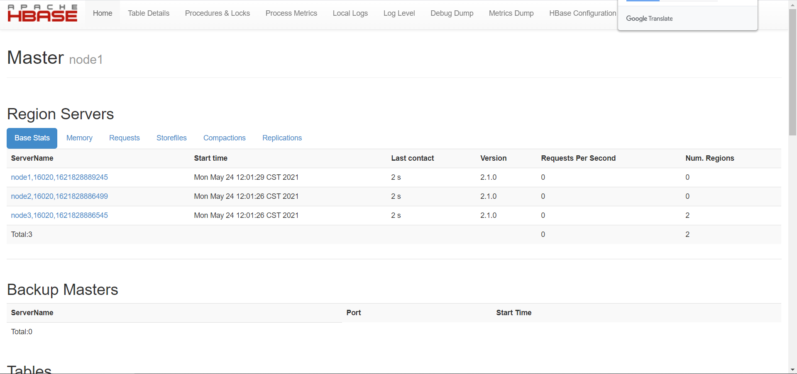
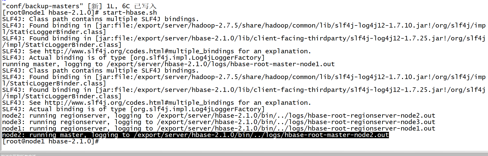
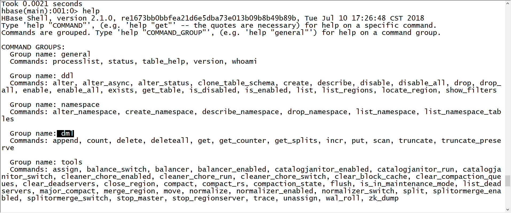
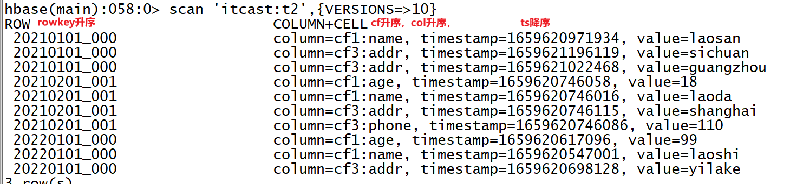
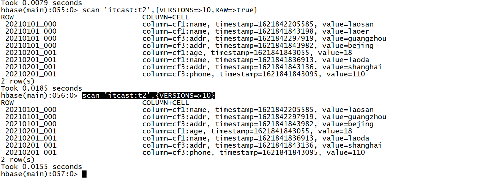

# 分布式面向列的NoSQL数据库Hbase（二）

## 知识点01：课程回顾

1. Hbase中核心概念
   - Rowkey：行健，类似于主键
     - 区别：Hbase中每一张表都有主键这一列，建表的时候自带这一列
     - 功能：1-每个Rowkey唯一决定一行【插入更新】，2-作为Hbase表中的唯一索引
     - 内容：由开发者自己决定
   - ColumnFamily：列族，对列的分组，将列划分到不同的列族
     - 规则：建表的时候会指定表中有几个列族，Hbase表中除Rowkey任何一列都必须属于某个列族
     - 存储：相同列族的数据都放在相同的物理区域
     - 设计：将列进行分组后，查询时可以指定读取某个列族的列，加快查询性能
     - 思想：牺牲一定写的性能，来换取更高查询性能
   - Qualifier：列标签，等同于列的概念
     - 规则：任何一列都必须属于某个列族，访问时候，使用列族名称：列名
     - 特殊：Hbase中每一个Rowkey可以拥有不同的列
   - VERSIONS：多版本，某一个rowkey的某一列允许存储多个版本的值
     - 规则：列族属性，默认情况下每个列族下的列只允许存储1个版本
     - 实现：查询时默认只显示最新版本
     - 区分：每一列的数据在写入时都会自带一个时间戳，使用时间戳来区分不同版本
   - 底层存储：面向列的存储
     - 每个Rowkey只是代表Hbase中逻辑上一行，每个Rowkey在物理层会对应多个KV
     - Rowkey的每一列只是代表Hbase逻辑上列，每一列在物理层会对应一个KV
     - K：rowkey+cf+col+ts
     - V：value
     - 对数据构建有序：每个KV按照rowkey、cf、col升序排序，按照ts降序排序【字典排序】
2. Hbase的分布式架构和部署
   - 架构角色：普通分布式主从架构
     - HMaster：主：管理节点：管理从节点，管理元数据，分区
     - HRegionServer：从：存储节点：负责存储表的Region，接收所有对Region读写请求，提供分布式内存
   - 架构组成
     - Hbase：负责对外提供读写请求，提供分布式内存读写
     - HDFS：负责提供Hbase底层持久化存储，提供分布式磁盘读写
     - Zookeeper：1-负责辅助选举Active HMaster，2-存储Hbase的管理元数据


## 知识点02：课程目标

1. Hbase集群管理和开发场景
   - 目标：掌握Hbase集群管理命令，理解Hbase三种开发场景
2. Hbase命令行学习
   - 目标：掌握常用的DDL、DML操作命令


## 知识点03：【实现】HBASE集群服务管理

- **目标**：**实现Hbase分布式集群部署**

- **实施**

  - **服务端启动与关闭**

    - step1：启动HDFS【第一台机器】，注意一定要等HDFS退出安全模式再启动Hbase

      ```
      start-dfs.sh
      ```
      
    - step2：启动ZK
  
      ```
      start-zk-all.sh
      ```
  
    - step3：启动Hbase

      ```
    start-hbase.sh
      ```

      

      
  
    - 关闭：**==先关闭Hbase再关闭zk==**

      ```
    stop-hbase.sh
      stop-zk-all.sh
      stop-dfs.sh
      ```
  
  - **测试**
  
    - 访问Hbase Web UI【node1:16010】
  
      
  
  - **搭建Hbase HA**
  
    - 关闭Hbase所有节点
  
      ```
      stop-hbase.sh
      ```
  
    - 创建并编辑配置文件
  
      ```
      vim conf/backup-masters
      ```
  
      ```
      node2
      ```
  
    - 启动Hbase集群
  
      
  
      
  
  - **测试HA**
  
    - 启动两个Master，强制关闭Active Master，观察StandBy的Master是否切换为Active状态

      ```
    hbase-daemon.sh stop master
      ```

    - ==**【测试完成以后，删除配置，只保留单个Master模式】**==
  
- **小结**：实现Hbase分布式集群部署


## 知识点04：【理解】HBASE开发场景

- **目标**：**理解Hbase使用过程中的不同开发场景**

- **实施**

  - **场景1：测试开发**

    - 需求：一般用于测试开发或者实现DDL操作

    - 实现：Hbase shell命令行

    - 用法：**hbase shell**

    - 命令

      - 查看帮助：help
      - 查看命令的用法：help  ‘command’
    - 退出：exit

    

      

  - **场景2：生产开发**

    - 需求：一般用于生产开发，通过MapReduce或者Spark等程序读写Hbase，类似于JDBC

      - 举个栗子：读取Hbase中的数据，进行分析处理，统计UV、PV
      - 分析
        - step1：通过分布式计算程序Spark、Flink读取Hbase数据
        - step2：对读取到的数据进行统计分析
        - step3：保存结果到Hbase中

    - 实现：分布式计算程序通过Java API读写Hbase，实现数据处理

    - 用法：在MapReduce或者Spark中集成API

    - 举个栗子：MapReduce和Spark中读写Hbase调用类

      - InputFormat：FileInputFormat：TextFileInputFormat
        - 默认读取数据的类：TextFileInputFormat
        - 其他可选的类：DBInpuFormat【读数据库】、TableInputFormat【读Hbase】
        - 代码：job.setInputFormat（InputFormat.class）
      - OutputFormat：FileOutputForamt：TextFileOutputForamt
        - 默认保存数据的类：TextFileOutputFormat
        - 其他可选的类：DBOutputFormat【写数据库】、TableOutputFormat【写Hbase】

      

  - **场景3：集群管理**

    - 应用场景：运维做运维集群管理，我们开发用的不多

    - 需求：封装Hbase集群管理命令脚本，自动化执行

      - 类似于hive -f  xxx.sql

      - 举个栗子：每天Hbase集群能定时的自动创建一张表

      - 分析

        - 要实现运行Hbase脚本：创建表：/export/data/hbase_create_day.sh

          ```shell
          #!/bin/bash
          create 'tbname','cf1'
          ```

          - 问题是：怎么能通过Linux命令行运行Hbase的命令呢？

        - 要实现定时调度：Linux Crontab、Oozie、Azkaban

          ```
          00 00 *		*	*		sh /export/data/hbase_create_day.sh
          ```

    - 实现：通过Hbase的客户端运行命令文件，通过调度工具进行调度实现定时运行

    - 用法：hbase  shell  文件路径

      - step1：将Hbase的命令封装在一个文件中：vim /export/data/hbase.txt

        ```
        list
        exit
        ```

      - step2：运行Hbase命令文件

        ```
        hbase shell /export/data/hbase.txt
        ```

      - step3：封装到脚本

        ```
        #!/bin/bash
        hbase shell /export/data/hbase.txt
        ```

    - 注意：所有的Hbase命令文件，**最后一行命令必须为exit，不然就不会退出**

- **小结**：了解Hbase使用过程中的不同开发场景


## 知识点05：【掌握】HBASE命令行：NS

- **目标**：**掌握Hbase中的常用DDL的NameSpace管理命令**

- **实施**

  - **列举所有Namespace**

    - 命令：list_namespace

    - 类比：show databases;

    - 语法

      ```
      list_namespace
      ```

    - 示例

      ```
      list_namespace
      ```

  - **列举某个NameSpace中的表**

    - 命令：list_namespace_tables

    - 类比：show tables in dbname;

    - 语法

      ```shell
      list_namespace_tables 'Namespace的名称'
      ```

    - 示例

      ```shell
      list_namespace_tables 'hbase'
      ```

  - **创建**

    - 命令：create_namespace

    - 语法

      ```
      create_namespace 'Namespace的名称'
      ```

    - 示例

      ```shell
      create_namespace 'heima'
      create_namespace 'itcast'
      ```

  - **删除**

    - 命令：drop_namespace

    - 注意：只能删除空数据库，如果数据库中存在表，不允许删除

    - 语法

      ```
      drop_namespace 'Namespace的名称'
      ```

    - 示例

      ```
      drop_namespace 'itcast'
      drop_namespace 'heima'
      ```

- **小结**：掌握Hbase中的常用DDL的NameSpace管理命令


## 知识点06：【掌握】HBASE命令行：Table

- **目标**：**掌握Hbase中的常用DDL表的命令**

- **实施**

  - **列举**

    - 命令：list

    - 类比：show tables;

    - 语法：list

    - 示例

      ```
      list
      ```

  - **创建**

    - 命令：create

    - 类比：create table dbname.tbname(字段信息)

    - **注意：建表时必须指定NS名称和表名及至少一个列族**

    - 语法

      ```shell
      # 大体语法
      create  'NS名称:表名', 列族……
      #表示在ns1的namespace中创建一张表t1,这张表有一个列族叫f1，这个列族中的所有列可以存储5个版本的值
      create 'ns1:t1', {NAME => 'f1', VERSIONS => 5},{NAME => 'f2'}
      #在default的namespace中创建一张表t1,这张表有三个列族，f1,f2,f3，每个列族的属性都是默认的
      create 't1', 'f1', 'f2', 'f3'
      ```

    - 示例

      ```shell
      #如果需要更改列族的属性，使用这种写法
      create 't1',{NAME=>'cf1'},{NAME=>'cf2',VERSIONS => 3}
      #如果不需要更改列族属性
      create 'itcast:t2','cf1','cf2','cf3' 等同 create 't1',{NAME=>'cf1'},{NAME=>'cf2'}，{NAME=>'cf3'}
      ```

  - **查看**

    - 命令：desc

    - 语法

      ```
      desc '表名'
      ```

    - 示例

      ```
      desc 't1'
      ```

      

  - **删除**

    - 命令：drop

    - 语法

      ```
      drop '表名'
      ```

    - 示例

      ```
      drop 't1'
      ```

    - 注意：如果要对表进行删除，必须先禁用表，再删除表

  - **禁用/启用**

    - 命令：disable /  enable

    - 功能：Hbase为了避免修改或者删除表，影响这张表正在对外提供读写服务

    - 规则：修改或者删除表时，必须先禁用表，表示这张表暂时不能对外提供服务

      - 如果是删除：禁用以后删除
      - 如果是修改：先禁用，然后修改，修改完成以后启用

    - 语法

      ```
      disable '表名'
      enable '表名'
      ```

    - 示例

      ```
      disable 't1'
      enable 't1'
      ```

  - **判断存在**

    - 命令：exists

    - 语法

      ```
      exists '表名'
      ```

    - 示例

      ```
      exists 't1'
      ```

- **小结**：掌握Hbase中的常用DDL表管理命令


## 知识点07：【掌握】HBASE命令行：Put

- **目标**：**掌握Hbase插入更新的数据命令put的使用**

- **实施**

  - Hbase最小操作单元：列

  - **功能**：插入  /  更新数据【某一行的某一列】

  - **语法**

    ```
    #表名+rowkey+列族+列+值
    put 'ns:tbname','rowkey','cf:col','value'
    ```

  - **示例**

    ```
    disable 'itcast:t2'
    drop 'itcast:t2'
    create 'itcast:t2','cf1',{NAME=>'cf3',VERSIONS => 2}
    ```

    ```
    put 'itcast:t2','20210201_001','cf1:name','laoda'
    put 'itcast:t2','20210201_001','cf1:age',18
    put 'itcast:t2','20210201_001','cf3:phone','110'
    put 'itcast:t2','20210201_001','cf3:addr','shanghai'
    put 'itcast:t2','20210101_000','cf1:name','laoer'
    put 'itcast:t2','20210101_000','cf3:addr','bejing'
    ```

  - **注意**：put：如果不存在，就插入，如果存在就更新

    ```
    put 'itcast:t2','20210101_000','cf1:name','laosan'
    put 'itcast:t2','20210101_000','cf3:addr','guangzhou'
    scan 'itcast:t2',{VERSIONS=>10}
    ```

  - **观察结果**

    - **Hbase表会自动按照底层的Key构建字典有序：逐位比较**

      

      - **设计思想：为什么要构建排序呢？**
      - ==设计目标：加快数据的查询==，基于有序的数据查询更快

    - **==没有物理更新和删除==**：**通过插入来代替的，实现逻辑更新和删除，做了标记不再显示**

      - **设计思想：提高数据写入的性能，通过插入数据【只写内存】**

        

- **小结**：掌握Hbase插入更新的数据命令put的使用

  


## 知识点08：【掌握】HBASE命令行：Get

- **目标**：**掌握Hbase查询的数据命令get的使用**

- **实施**

  - 功能：**读取某个Rowkey的数据**

    - 缺点：get命令最多**只能返回一个rowkey的数据**，根据Rowkey进行检索数据
    - 优点：Get是Hbase中**查询数据最快的方式**，并不是最常用的方式

  - 语法

    ```
    get	表名	rowkey		[列族,列]
    get 'ns:tbname','rowkey'
    get 'ns:tbname','rowkey',[cf]
    get 'ns:tbname','rowkey',[cf:col]
    ```

  - 示例

    ```
    get 'itcast:t2','20210201_001'
    get 'itcast:t2','20210201_001','cf1'
    get 'itcast:t2','20210201_001','cf1:name'
    ```

- **小结**：掌握Hbase查询的数据命令get的使用

  

## 知识点09：【理解】HBASE命令行：Delete

- **目标**：**理解Hbase的删除数据命令delete的使用**

- **实施**

  - **功能**：删除Hbase中的数据

  - **语法**

    ```shell
    #删除某列的数据
    delete     tbname,rowkey,cf:col
    #删除某个rowkey数据
    deleteall  tbname,rowkey
    #清空所有数据：生产环境不建议使用，有问题，建议删表重建
    truncate   tbname
    ```

  - **示例**

    ```
    delete 'itcast:t2','20210101_000','cf3:addr'
    deleteall 'itcast:t2','20210101_000'
    truncate 'itcast:t2'
    ```

- **小结**：理解Hbase的删除数据命令delete的使用


## 知识点10：【掌握】HBASE命令行：Scan

- **目标**：**掌握Hbase的查询数据命令scan的使用**

- **实施**

  - 功能：**根据条件匹配读取多个Rowkey的数据**

  - 语法

    ```shell
    #读取整张表的所有数据
    scan 'tbname'//一般不用
    #根据条件查询：工作中主要使用的场景
    scan 'tbname',{Filter} //用到最多
    ```

  - 示例

    - 插入模拟数据

      ```
      put 'itcast:t2','20210201_001','cf1:name','laoda'
      put 'itcast:t2','20210201_001','cf1:age',18
      put 'itcast:t2','20210201_001','cf3:phone','110'
      put 'itcast:t2','20210201_001','cf3:addr','shanghai'
      put 'itcast:t2','20210201_001','cf1:id','001'
      put 'itcast:t2','20210101_000','cf1:name','laoer'
      put 'itcast:t2','20210101_000','cf3:addr','bejing'
      put 'itcast:t2','20210901_007','cf1:name','laosan'
      put 'itcast:t2','20210901_007','cf3:addr','bejing'
      put 'itcast:t2','20200101_004','cf1:name','laosi'
      put 'itcast:t2','20200101_004','cf3:addr','bejing'
      put 'itcast:t2','20201201_005','cf1:name','laowu'
      put 'itcast:t2','20201201_005','cf3:addr','bejing'
      ```

    - 查看Scan用法

      ```
      scan 't1', {ROWPREFIXFILTER => 'row2', FILTER => "
          (QualifierFilter (>=, 'binary:xyz')) AND (TimestampsFilter ( 123, 456))"}
      ```

    - 测试Scan的使用

      ```
      scan 'itcast:t2'
      #rowkey前缀过滤器
      scan 'itcast:t2', {ROWPREFIXFILTER => '2021'}
      scan 'itcast:t2', {ROWPREFIXFILTER => '202101'}
      #rowkey范围过滤器
      #STARTROW：从某个rowkey开始，包含，闭区间
      #STOPROW：到某个rowkey结束，不包含，开区间
      scan 'itcast:t2',{STARTROW=>'20210101_000'}
      scan 'itcast:t2',{STARTROW=>'20210201_001'}
      scan 'itcast:t2',{STARTROW=>'20210101_000',STOPROW=>'20210201_001'}
      scan 'itcast:t2',{STARTROW=>'20210201_001',STOPROW=>'20210301_007'}
      ```

  - 在Hbase数据检索，**尽量走索引查询：按照Rowkey前缀条件查询**

    - 尽量避免走全表扫描

    - **Hbase所有Rowkey的查询都是前缀匹配，只有按照前缀匹配才走索引**

- **小结**：掌握Hbase的查询数据命令scan的使用

  


## 知识点11：【了解】HBASE命令行：incr

- **目标**：了解Hbase的incr和count命令的使用

- **实施**

  - **incr：自动计数命令**

  - 功能：一般用于自动计数的，不用记住上一次的值，直接做自增

    - 需求：一般用于做数据的计数

    - 与Put区别

      - put：需要记住上一次的值是什么

      - incr：不需要知道上一次的值是什么，自动计数

  - 语法

    ```
    incr  '表名'，'rowkey','列族:列'
    get_counter '表名'，'rowkey','列族:列'
    ```

  - 示例

    ```
    create 'NEWS_VISIT_CNT', 'C1'
    incr 'NEWS_VISIT_CNT','20210101_001','C1:CNT',12
    get_counter 'NEWS_VISIT_CNT','20210101_001','C1:CNT'
    incr 'NEWS_VISIT_CNT','20210101_001','C1:CNT'
    ```

- **小结**：了解Hbase的incr命令的使用


## 知识点12：【了解】HBASE命令行：count

- **目标**：了解Hbase的count命令的使用

- **实施**

  - **count：统计命令**

    - 功能：**统计某张表的行数【rowkey的个数】**

    - 语法

      ```
      count  '表名'
      ```

    - 示例

      ```
      count 'itcast:t2'
      ```

  - **面试题：Hbase中如何统计一张表的行数最快**

    - 方案一：分布式计算程序，读取Hbase数据，统计rowkey的个数

      ```
      #在第一台机器启动
      start-yarn.sh
      #在第一台机器运行
      hbase org.apache.hadoop.hbase.mapreduce.RowCounter 'itcast:t2'
      ```

    - 方案二：count命令，相对比较常用，速度中等

      ```
      count 'ORDER_INFO'
      ```

    - 方案三：协处理器，最快的方式

      - 类似于Hive中的UDF，自己开发一个协处理器，监听表，表中多一条数据，就加1
      - 直接读取这个值就可以得到行数了

- **小结**：了解Hbase的count命令的使用


## 附录一：Hbase Maven依赖

```xml
	<repositories>
        <repository>
            <id>aliyun</id>
            <url>http://maven.aliyun.com/nexus/content/groups/public/</url>
        </repository>
    </repositories>
    <properties>
        <hbase.version>2.1.2</hbase.version>
    </properties>

    <dependencies>
        <dependency>
            <groupId>org.apache.hbase</groupId>
            <artifactId>hbase-client</artifactId>
            <version>${hbase.version}</version>
        </dependency>
        <dependency>
            <groupId>commons-io</groupId>
            <artifactId>commons-io</artifactId>
            <version>2.6</version>
        </dependency>
        <!-- JUnit 4 依赖 -->
        <dependency>
            <groupId>junit</groupId>
            <artifactId>junit</artifactId>
            <version>4.13</version>
        </dependency>
    </dependencies>
```

