# 分布式面向列的NoSQL数据库Hbase（三）

## 知识点01：课程回顾

1. Hbase集群管理
   - 启动：start-dfs.sh / start-zk.sh / start-hbase.sh
   - 监控：HMaster：16010
   - 关闭：stop-hbase.sh / stop-zk.sh / stop-dfs.sh
2. Hbase Shell命令行
   - DDL：list_namespace、create_namespace、drop_namespace、list、create ‘ns:tbname’, 列族、drop、desc
   - DML：put
     - put使用
     - 功能：为表中的某一行添加某一列，如果存在就更新，不存在就插入
     - 语法：put ns:tbname, rowkey, cf:col , value


## 知识点02：课程目标

1. Hbase命令行中DML其他命令
   - 目标：掌握常用命令语法：**get、scan**、delete、**count**、incr
2. Hbase Java API
   - 目标：==**掌握Hbase DML Java API：Put、Scan、Get**==
3. Hbase存储原理
   - 目标：**掌握Hbase存储结构和数据划分规则**、读写流程
4. Hbase设计
   - 目标：**==掌握Hbase热点问题及Rowkey设计原则==**
5. Bulkload和基础优化
   - 目标：了解BulkLoad的功能及常见的属性优化


# ==【模块一：Hbase命令行使用】==


## 知识点03：【掌握】HBASE命令行：Get

- **目标**：**掌握Hbase查询的数据命令get的使用**

- **实施**

  - 功能：**读取某个Rowkey的数据**

    - 缺点：get命令最多**只能返回一个rowkey的数据**，根据Rowkey进行检索数据
    - 优点：Get是Hbase中**查询数据最快的方式【走rowkey索引】**，并不是最常用的方式

  - 应用：前提是知道要查询的rowkey的值

  - 语法

    ```
    get	表名	rowkey		[列族,列]
    get 'ns:tbname','rowkey'
    get 'ns:tbname','rowkey',[cf]
    get 'ns:tbname','rowkey',[cf:col]
    ```

  - 示例

    ```
    get 'itcast:t2','20210201_001'
    get 'itcast:t2','20210201_001','cf1'
    get 'itcast:t2','20210201_001','cf1:name'
    ```

- **小结**：掌握Hbase查询的数据命令get的使用

  

## 知识点04：【理解】HBASE命令行：Delete

- **目标**：**理解Hbase的删除数据命令delete的使用**

- **实施**

  - **功能**：删除Hbase中的数据

  - 应用：很少使用

  - **语法**

    ```shell
    #删除某列的数据
    delete     tbname,rowkey,cf:col
    #删除某个rowkey数据
    deleteall  tbname,rowkey
    #清空所有数据：生产环境不建议使用，有问题，建议删表重建
    truncate   tbname
    ```

  - **示例**

    ```shell
    delete 'itcast:t2','20210101_000','cf3:addr'
    deleteall 'itcast:t2','20210101_000'
    # 这个东西是一定不用的：原来的表的配置都没有了
    truncate 'itcast:t2'
    ```

- **小结**：理解Hbase的删除数据命令delete的使用


## 知识点05：【掌握】HBASE命令行：Scan

- **目标**：**掌握Hbase的查询数据命令scan的使用**

- **实施**

  - 功能：**根据条件匹配读取多个Rowkey的数据**

  - 语法

    ```shell
    #读取整张表的所有数据，等同于select *
    scan 'tbname'   //一般不用
    #根据条件查询：工作中主要使用的场景, LIMIT/COLUMN/FILTER
    scan 'tbname',{Filter} 		//用到最多
    ```

  - 示例

    - 插入模拟数据

      ```
      put 'itcast:t2','20210201_001','cf1:name','laoda'
      put 'itcast:t2','20210201_001','cf1:age',18
      put 'itcast:t2','20210201_001','cf3:phone','110'
      put 'itcast:t2','20210201_001','cf3:addr','shanghai'
      put 'itcast:t2','20210201_001','cf1:id','001'
      put 'itcast:t2','20210101_000','cf1:name','laoer'
      put 'itcast:t2','20210101_000','cf3:addr','bejing'
      put 'itcast:t2','20210901_007','cf1:name','laosan'
      put 'itcast:t2','20210901_007','cf3:addr','bejing'
      put 'itcast:t2','20200101_004','cf1:name','laosi'
      put 'itcast:t2','20200101_004','cf3:addr','bejing'
      put 'itcast:t2','20201201_005','cf1:name','laowu'
      put 'itcast:t2','20201201_005','cf3:addr','bejing'
      ```

    - 查看Scan用法

      ```
      scan 't1', {ROWPREFIXFILTER => 'row2', FILTER => "
          (QualifierFilter (>=, 'binary:xyz')) AND (TimestampsFilter ( 123, 456))"}
      ```

    - 测试Scan的使用

      ```
      scan 'itcast:t2'
      #rowkey前缀过滤器
      scan 'itcast:t2', {ROWPREFIXFILTER => '2021'}
      scan 'itcast:t2', {ROWPREFIXFILTER => '202101'}
      #rowkey范围过滤器
      #STARTROW：从某个rowkey开始，包含，闭区间
      #STOPROW：到某个rowkey结束，不包含，开区间
      scan 'itcast:t2',{STARTROW=>'20210101_000'}
      scan 'itcast:t2',{STARTROW=>'20210201_001'}
      scan 'itcast:t2',{STARTROW=>'20210101_000',STOPROW=>'20210201_001'}
      scan 'itcast:t2',{STARTROW=>'20210201_001',STOPROW=>'20210301_007'}
      # LIMIT
      scan 'itcast:t2',{LIMIT=>2}
      ```

  - 在Hbase数据检索，**尽量走索引查询：按照Rowkey前缀条件查询**

    - 尽量避免走全表扫描
  - **Hbase所有Rowkey的查询都是前缀匹配，只有按照前缀匹配才走索引**
      - 表的设计：日期_ID
      - 按照日期查询：走
      - 按照ID查询：不走

- **小结**：掌握Hbase的查询数据命令scan的使用

  


## 知识点06：【了解】HBASE命令行：incr

- **目标**：了解Hbase的incr和count命令的使用

- **实施**

  - **incr：自动计数命令**

  - 功能：一般用于自动计数的，不用记住上一次的值，直接做自增

    - 需求：一般用于做数据的计数

    - 与Put区别：put需要记住上一次的值是什么，incr不需要知道上一次的值是什么，自动计数

  - 语法

    ```
    incr  '表名'，'rowkey','列族:列'
    get_counter '表名'，'rowkey','列族:列'
    ```

  - 示例

    ```
    create 'NEWS_VISIT_CNT', 'C1'
    incr 'NEWS_VISIT_CNT','20210101_001','C1:CNT',12
    get_counter 'NEWS_VISIT_CNT','20210101_001','C1:CNT'
    incr 'NEWS_VISIT_CNT','20210101_001','C1:CNT'
    ```

- **小结**：了解Hbase的incr命令的使用


## 知识点07：【了解】HBASE命令行：count

- **目标**：了解Hbase的count命令的使用

- **实施**

  - **count：统计命令**

    - 功能：**统计某张表的行数【rowkey的个数】**

    - 语法

      ```
      count  '表名'
      ```

    - 示例

      ```
      count 'itcast:t2'
      ```

  - ==**面试题：Hbase中如何统计一张表的行数最快**==

    - 方案一：分布式计算程序，读取Hbase数据，统计rowkey的个数

      ```
      #在第一台机器启动
      start-yarn.sh
      #在第一台机器运行
      hbase org.apache.hadoop.hbase.mapreduce.RowCounter 'itcast:t2'
      ```

    - 方案二：count命令，相对比较常用，速度中等

      ```
      count 'ORDER_INFO'
      ```

    - 方案三：协处理器，最快的方式

      - 类似于Hive中的UDF，自己开发一个协处理器，监听表，表中多一条数据，就加1
      - 直接读取这个值就可以得到行数了

- **小结**：了解Hbase的count命令的使用


# ==【模块二：Hbase Java API】==

## 知识点08：【实现】Java API：构建连接

- **目标**：**实现Hbase Java API的开发构建连接**

- **实施**

  ```java
  package bigdata.itcast.cn.hbase.client;
  
  import org.apache.hadoop.conf.Configuration;
  import org.apache.hadoop.hbase.HBaseConfiguration;
  import org.apache.hadoop.hbase.client.Connection;
  import org.apache.hadoop.hbase.client.ConnectionFactory;
  import org.junit.After;
  import org.junit.Before;
  
  import java.io.IOException;
  
  /**
   * @ClassName HbaseDDLClientTest
   * @Description TODO 使用Hbase Java API实现DDL操作：创建、删除- NS/Table
   * @Date 2022/8/6 14:54
   * @Create By     Frank
   */
  public class HbaseDDLClientTest {
  
      // 构建一个Hbase连接对象
      Connection conn = null;
  
      // todo:1-构建连接
      @Before
      public void getHbaseConnect() throws IOException {
          // 构建一个配置对象，管理配置
          Configuration conf = HBaseConfiguration.create();
          // 给定Hbase服务端连接地址：任何一个Hbase客户端要连接Hbase，都要指定ZK的地址
          conf.set("hbase.zookeeper.quorum", "node1,node2,node3");
          // 构建一个Hbase连接
          conn = ConnectionFactory.createConnection(conf);
      }
  
      // todo:2-通过连接获取一个操作对象，实现操作
      
      
      // todo:3-释放连接
      @After
      public void closeHbaseConnect() throws IOException {
          conn.close();
      }
  }
  
  ```
  
- **小结**：实现Hbase Java API的开发构建连接


## 知识点09：【实现】Java API：DDL

- **目标**：**使用Hbase Java API实现DDL的管理**

- **实施**

  - 构建管理员：Java API中所有的DDL操作都是由管理员对象构建的

    ```java
    // 在Hbase的Java API中，如果要实现DDL操作，必须先构建Hbase的管理员对象HbaseAdmin
        public HBaseAdmin getHbaseAdmin() throws IOException {
            //从连接中获取管理员对象
            HBaseAdmin admin = (HBaseAdmin) conn.getAdmin();
            return admin;
        }
    ```

  - 实现DDL管理

    - 创建、删除NS

    - 创建、删除Table

    ```java
    package bigdata.itcast.cn.hbase.client;
    
    import org.apache.hadoop.conf.Configuration;
    import org.apache.hadoop.hbase.HBaseConfiguration;
    import org.apache.hadoop.hbase.NamespaceDescriptor;
    import org.apache.hadoop.hbase.TableName;
    import org.apache.hadoop.hbase.client.*;
    import org.apache.hadoop.hbase.util.Bytes;
    import org.junit.After;
    import org.junit.Before;
    import org.junit.Test;
    
    import java.io.IOException;
    
    /**
     * @ClassName HbaseDDLClientTest
     * @Description TODO 使用Hbase Java API实现DDL操作：创建、删除- NS/Table
     * @Date 2022/8/6 14:54
     * @Create By     Frank
     */
    public class HbaseDDLClientTest {
    
        // 构建一个Hbase连接对象
        Connection conn = null;
    
        // todo:1-构建连接
        @Before
        public void getHbaseConnect() throws IOException {
            // 构建一个配置对象，管理配置
            Configuration conf = HBaseConfiguration.create();
            // 给定Hbase服务端连接地址：任何一个Hbase客户端要连接Hbase，都要指定ZK的地址
            conf.set("hbase.zookeeper.quorum", "node1,node2,node3");
            // 构建一个Hbase连接
            conn = ConnectionFactory.createConnection(conf);
        }
    
        // todo:2-通过连接获取一个操作对象，实现操作
        // 规则：JavaAPI中实现DDL操作，必须先构建Hbase管理员对象
        public HBaseAdmin getHbaseAdmin() throws IOException {
            // 构建一个Hbase管理员对象
            HBaseAdmin admin = (HBaseAdmin) conn.getAdmin();
            return admin;
        }
    
        @Test
        // 创建一个NS
        public void createNs() throws IOException {
            // 先获取一个管理员对象
            HBaseAdmin admin = getHbaseAdmin();
            // 构建一个Namespace的描述器对象
            NamespaceDescriptor descriptor = NamespaceDescriptor.create("heima").build();
            // 调用管理员对象的方法来实现操作
            admin.createNamespace(descriptor);
            // 关闭管理员
            admin.close();
        }
    
        @Test
        // 删除NS
        public void delNs() throws IOException {
            HBaseAdmin admin = getHbaseAdmin();
            // 调用删除ns方法
            admin.deleteNamespace("heima");
            // 关闭
            admin.close();
        }
    
        /**
         * 建表：如果表存在，就先删除，然后再建表：itcast:t1, basic：3个版本，other:默认配置
         * 语法：create 'itcast:t1',{NAME=>'basic', VERSIONS=>3},{NAME=>'other'}
         * @throws IOException
         */
        @Test
        public void createTb() throws IOException {
            // 获取管理员
            HBaseAdmin admin = getHbaseAdmin();
            // 构建表名对象
            TableName tbname = TableName.valueOf("itcast:t1");
    
            // 先判断表是否存在，如果存在，干掉他
            if(admin.tableExists(tbname)){
                // 禁用
                admin.disableTable(tbname);
                //干掉
                admin.deleteTable(tbname);
            }
    
            // 构建列族的描述器
            ColumnFamilyDescriptor basic = ColumnFamilyDescriptorBuilder
                    .newBuilder(Bytes.toBytes("basic"))
                    .setMaxVersions(3) //设置列族的最大版本数为3
                    .build();
    
            ColumnFamilyDescriptor other = ColumnFamilyDescriptorBuilder
                    .newBuilder(Bytes.toBytes("other"))
                    .build();
            // 构建表的描述器
            TableDescriptor desc = TableDescriptorBuilder
                                    .newBuilder(tbname) //指定表名
                                    .setColumnFamily(basic) //添加列族
                                    .setColumnFamily(other)
                                    .build();
            // 调用管理员建表方法
            admin.createTable(desc);
            // 关闭
            admin.close();
        }
    
    
        // todo:3-释放连接
        @After
        public void closeHbaseConnect() throws IOException {
            conn.close();
        }
    }
    
    ```

- **小结**：使用Hbase Java API实现DDL的管理


## 知识点10：【实现】Java API：DML：Table

- **目标**：**使用Hbase Java API实现Table的实例开发**

- **实施**

  - DML操作都必须构建Hbase表的对象来进行操作

    ```java
    //构建Hbase表的实例
    public Table getHbaseTable() throws IOException {
            // 构建表名
            TableName tbname = TableName.valueOf("itcast:t1");
            // 获取一个Hbase表的对象
            Table table = conn.getTable(tbname);
            return table;
        }
    ```

- **小结**：使用Hbase Java API实现Table的实例开发

  

## 知识点11：【实现】Java API：DML：Put

- **目标**：**使用Hbase Java API实现Put插入或者更新数据**

- **实施**

  ```Java
      @Test
      // Put操作：put ns:tbname, rowkey, cf:col, value
      public void testPut() throws IOException {
          // 获取表的对象
          Table table = getHbaseTable();
          // 构建Put操作的对象：一个Put对象，代表一个Rowkey要写入的多列的数据
          Put put = new Put(Bytes.toBytes("20220806_888"));
          // 配置put对象
          put.addColumn(Bytes.toBytes("basic"), Bytes.toBytes("name"), Bytes.toBytes("laojiu"));
          put.addColumn(Bytes.toBytes("basic"), Bytes.toBytes("age"), Bytes.toBytes("20"));
          put.addColumn(Bytes.toBytes("other"), Bytes.toBytes("phone"), Bytes.toBytes("110"));
          // 调用对象方法实现put
          table.put(put);
      }
  ```
  
- **小结**：使用Hbase Java API实现Put插入或者更新数据

  

## 知识点12：【实现】Java API：DML：Get

- **目标**：使用Hbase Java API实现Get读取数据

- **实施**

  - **插入数据**

    ```
    put 'itcast:t1','20210201_000','basic:name','laoda'
    put 'itcast:t1','20210201_000','basic:age',18
    put 'itcast:t1','20210101_001','basic:name','laoer'
    put 'itcast:t1','20210101_001','basic:age',20
    put 'itcast:t1','20210101_001','basic:sex','male'
    put 'itcast:t1','20210228_002','basic:name','laosan'
    put 'itcast:t1','20210228_002','basic:age',22
    put 'itcast:t1','20210228_002','other:phone','110'
    put 'itcast:t1','20210301_003','basic:name','laosi'
    put 'itcast:t1','20210301_003','basic:age',20
    put 'itcast:t1','20210301_003','other:phone','120'
    put 'itcast:t1','20210301_003','other:addr','shanghai'
    ```
    
  - **实现Get**
  
  ```java
        @Test
      // Get操作：get ns:tbname, rowkey [, cf:col]
        public void testGet() throws IOException {
            Table table = getHbaseTable();
            // 构建Get操作对象
            Get get = new Get(Bytes.toBytes("20220806_888"));
            // 配置get对象指定列族或者指定列
    //        get.addFamily(Bytes.toBytes("basic"));
    //        get.addColumn(Bytes.toBytes("basic"), Bytes.toBytes("name"));
            // 调用方法实现get
            /**
             *  Result：用于Hbase Java API中代表一个Rowkey的所有数据的对象
             *  Cell：用于Hbase Java API中代表一个Rowkey某一列的数据的对象
             *  由于一个Rowkey可以包含多列的数据，所以一个Result对象包含多个Cell对象
             */
            Result result = table.get(get);
            // 取出这个rowkey中每一列的信息进行打印处理
            for(Cell cell: result.rawCells()){
                // 获取每一列：rowkey、cf、col、ts、value
                System.out.println(
                        Bytes.toString(CellUtil.cloneRow(cell)) + "\t" +
                        Bytes.toString(CellUtil.cloneFamily(cell)) + "\t" +
                        Bytes.toString(CellUtil.cloneQualifier(cell)) + "\t" +
                        Bytes.toString(CellUtil.cloneValue(cell)) + "\t" +
                        cell.getTimestamp()
                );
                System.out.println("-------------------------------------------");
            }
        }
    ```
  
- **小结**：使用Hbase Java API实现Get读取数据

  

## 知识点13：【实现】Java API：DML：Delete

- **目标**：使用Hbase Java API实现Delete删除数据

- **实施**

  ```Java
      @Test
      // delete ns:tbname,rowkey,cf:col
      public void testDel() throws IOException {
          // 获取表的对象
          Table table = getHbaseTable();
          //构建del对象
          Delete del = new Delete(Bytes.toBytes("20211206_009"));
          //指定删除哪一列
          del.addColumn(Bytes.toBytes("basic"),Bytes.toBytes("addr")); //删除最新版本
  //        del.addColumns(Bytes.toBytes("basic"),Bytes.toBytes("addr")); //删除所有版本
          //执行删除
          table.delete(del);
          // 释放表对象
          table.close();
      }
  ```

  

- **小结**：使用Hbase Java API实现Delete删除数据

  


## 知识点14：【实现】Java API：DML：Scan

- **目标**：使用Hbase Java API实现Scan读取数据

- **实施**

  ```java
  @Test
      // Scan操作：scan ns:tbname [,Filter]
      public void testScan() throws IOException {
          Table table = getHbaseTable();
          // 构建一个Scan对象
          Scan scan = new Scan();
          // 调用方法
          /**
           *  ResultScanner：代表多个Rowkey的数据
           *  Result：代表一个Rowkey的数据
           *  Cell：代表某一个Rowkey的某一列的数据
           *  ResultScanner 中会包含多个 Result对象， Result对象中会包含多个Cell对象
           */
          ResultScanner rsscan = table.getScanner(scan);
          // 迭代取出每个Result对象
          for (Result result : rsscan) {
              // 先打印当前这个rowkey的值
              System.out.println(Bytes.toString(result.getRow()));
              // 取出这个rowkey中每一列进行打印
              // 取出这个rowkey中每一列的信息进行打印处理
              for(Cell cell: result.rawCells()){
                  // 获取每一列：rowkey、cf、col、ts、value
                  System.out.println(
                          Bytes.toString(CellUtil.cloneRow(cell)) + "\t" +
                                  Bytes.toString(CellUtil.cloneFamily(cell)) + "\t" +
                                  Bytes.toString(CellUtil.cloneQualifier(cell)) + "\t" +
                                  Bytes.toString(CellUtil.cloneValue(cell)) + "\t" +
                                  cell.getTimestamp()
                  );
              }
              System.out.println("-------------------------------------------");
          }
      }
  ```

- **小结**：使用Hbase Java API实现Scan读取数据


## 知识点15：【实现】Java API：DML：Filter

- **目标**：使用Hbase Java API实现Scan + Filter过滤

- **实施**

  - **需求**：JavaAPI实现从Hbase表中根据条件读取部分

    - 需求1：查询2021年1月和2月的数据
    - 需求2：查询2021年的所有数据
    - 需求3：查询所有age = 20的数据
    - 需求4：查询所有数据的name和age这两列
    - 需求5：查询所有年age = 20的人的name和age

  - **实现**

    ```java
    package bigdata.itcast.cn.hbase.client;
    
    import org.apache.hadoop.conf.Configuration;
    import org.apache.hadoop.hbase.*;
    import org.apache.hadoop.hbase.client.*;
    import org.apache.hadoop.hbase.filter.*;
    import org.apache.hadoop.hbase.util.Bytes;
    import org.junit.After;
    import org.junit.Before;
    import org.junit.Test;
    
    import java.io.IOException;
    
    /**
     * @ClassName HbaseScanFilterTest
     * @Description TODO 用于测试通过Hbase Java API 实现 Scan + Filter
     * @Create By     Frank
     */
    public class HbaseScanFilterTest {
    
        //构建Hbase连接的对象
        Connection conn = null;
    
        // todo:1-构建连接
        @Before
        public void getHbaseConnection() throws IOException {
            //构建一个配置对象
            Configuration conf = HBaseConfiguration.create();
            //配置Hbase服务端地址：任何一个Hbase客户端都要连接Zookeeper
            conf.set("hbase.zookeeper.quorum","node1,node2,node3"); //windows必须要能解析地址以及node1.itcast.cn
            //赋值
            conn = ConnectionFactory.createConnection(conf);
        }
    
        // todo:2-从连接中获取操作对象，实现操作
        public Table getHbaseTable() throws IOException {
            // 构建表名
            TableName tbname = TableName.valueOf("itcast:t1");
            // 获取一个Hbase表的对象
            Table table = conn.getTable(tbname);
            return table;
        }
    
        @Test
        // Scan语法：scan ns:tbname filter
        public void testScanFilter() throws IOException {
            // 获取表的对象
            Table table = getHbaseTable();
            // 构建Scan对象
            Scan scan = new Scan();
            //todo：过滤器就是在Scan对象中设置过滤条件
            //- 需求1：查询2021年1月和2月的数据
    //        scan.withStartRow(Bytes.toBytes("202101"));
    //        scan.withStopRow(Bytes.toBytes("202103"));
            //- 需求2：查询2021年的所有数据
    //        Filter prefixFilter = new PrefixFilter(Bytes.toBytes("2021"));
            //- 需求3：查询所有age = 20的数据：select * from table where age = 20
            Filter valueFilter = new SingleColumnValueFilter(
                    Bytes.toBytes("basic"),
                    Bytes.toBytes("age"),
                    CompareOperator.EQUAL,
                    Bytes.toBytes("20")
            );
            //- 需求4：查询所有数据的name和age这两列：select name,age from table
            byte[][] prefixes = {
              Bytes.toBytes("name"),
              Bytes.toBytes("age")
            };
            Filter columnFilter = new MultipleColumnPrefixFilter(prefixes);
    
            //- 需求5：查询所有年age = 20的人的name和age
            FilterList filterList = new FilterList(FilterList.Operator.MUST_PASS_ALL);
            filterList.addFilter(valueFilter);
            filterList.addFilter(columnFilter);
    
            //让Scan加载过滤器
            scan.setFilter(filterList);
    
            // 对表执行Scan操作
            /**
             *  ResultScanner：Hbase  JavaAPI中用于封装多个Rowkey的数据的对象，一个ResultScanner对象代表多个Rowkey的聚合
             *  Result：Hbase Java API中用于封装一个Rowkey的数据的对象，一个Result对象就代表一个Rowkey
             *  Cell：Hbase Java API中用于封装一列的数据的对象，一个Cell对象就代表一列
             */
            ResultScanner scanner = table.getScanner(scan);
            // 输出每个Rowkey的每一列的数据
            for (Result rs : scanner) {
                // 将这个rowkey的每一列打印出来 = 要将这个Result对象中的Cell数组中的每个Cell对象中的值取出来
                for(Cell cell : rs.rawCells() ){
                    //打印每一列的内容：rowkey、cf、col、value、ts
                    System.out.println(
                            Bytes.toString(CellUtil.cloneRow(cell)) + "\t" +
                                    Bytes.toString(CellUtil.cloneFamily(cell)) + "\t" +
                                    Bytes.toString(CellUtil.cloneQualifier(cell)) + "\t" +
                                    Bytes.toString(CellUtil.cloneValue(cell)) + "\t" +
                                    cell.getTimestamp()
                    );
                }
                System.out.println("+========================================================+");
            }
            // 释放资源
            table.close();
        }
    
    
        // todo:3-释放资源连接
        @After
        public void closeConn() throws IOException {
            conn.close();
        }
    }
    
    ```

- **小结**：使用Hbase Java API实现Scan + Filter过滤


# ==【模块三：Hbase存储原理】==

## 知识点16：【理解】存储设计：Table、Region、RS

- **目标**：**掌握Hbase中Table与Region、RS三者之间的关系**

- **实施**

  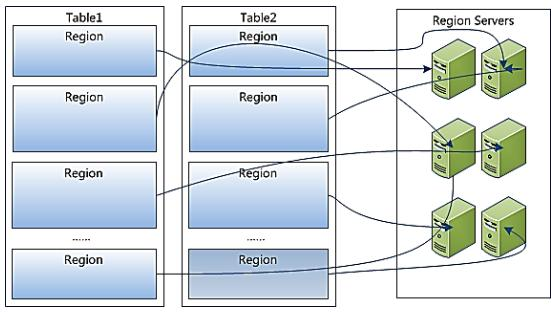

  - **问题：客户端操作的是表，数据最终存在RegionServer中，表和RegionServer的关系是什么？**

  - **分析**

    - **Table**：是一个逻辑对象，物理上不存在，供用户实现逻辑操作，存储在元数据的一个概念
      - 类比：HDFS中文件，Kafka中Topic
      - 数据写入表以后的物理存储：分区
      - **一张表会有多个分区Region**，**每个分区存储在不同的机器上**
  - 默认每张表只有1个Region分区
    - **Region**：Hbase中数据负载均衡的最小单元
      - 类似于HDFS中Block，类似于Kafka中的Partition，用于实现Hbase中分布式
      - 就是分区的概念，每张表都可以划分为多个Region，实现分布式存储
      - 每个Region由一台RegionServer所管理，Region存储在RegionServer
      - 一台RegionServer可以管理多个Region
  - **RegionServer**：是一个物理对象，Hbase中的一个进程，管理一台机器的存储
      - 类似于HDFS中DataNode
      - 一个Regionserver可以管理多个Region
      - 一个Region只能被一个RegionServer所管理
    
  - 类比

    | 概念     | HDFS     | Kafka       | Hbase        |
    | -------- | -------- | ----------- | ------------ |
    | 逻辑对象 | 文件     | Topic       | Table        |
    | 物理划分 | Block    | Partitioner | Region       |
    | 存储节点 | DataNode | Broker      | RegionServer |

  - **观察监控**

    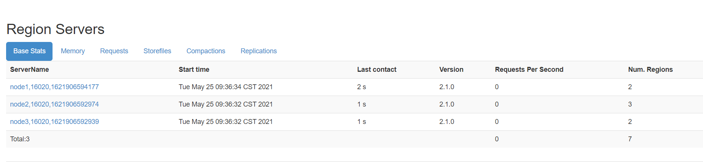

    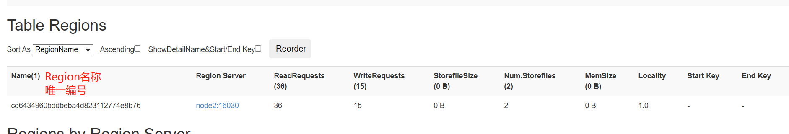

- **小结**：掌握Hbase中Table与Region、RS三者之间的关系


## 知识点17：【掌握】存储设计：Region数据的划分规则

- **目标**：**掌握Hbase中表的Region的划分规则**

- **实施**

  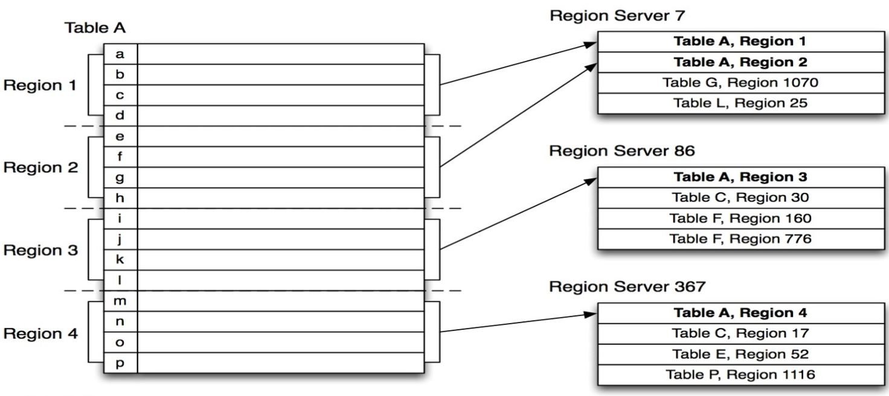

  - **问题：一张表划分为多个Region，划分的规则是什么？写一条数据到表中，这条数据会写入哪个Region，分配规则是什么？**

  - **分析**：

    - **Hbase分区划分规则**：**范围划分【根据Rowkey范围】**

      - Hbase中我们可以自己指定一张表有多少个分区，默认每张表只有1个分区，**==任何一个Region都会对应一个范围==**

      - **默认**：如果只有一个Region，范围 -oo  ~  +oo，没有范围限制

        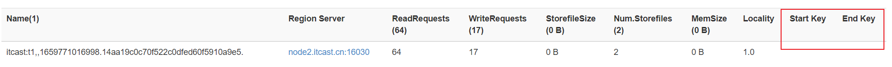

      - **指定**：如果指定了一张表有多个Region，每个Region的范围就是就是从整个-oo ~  +oo区间上进行范围划分

        ```
        [startKey,stopKey)：前闭后开区间
        ```

      - **举个栗子**：创建一张表，有2个分区Region

        ```shell
        # 建表：指定按照50来划分分区
        create 'itcast:t3',SPLITS => [50]
        # 分区
        region0：-oo ~ 50
        region1：50 ~ +oo
        ```

    - ==**数据分配的规则**：**根据Rowkey属于哪个范围就写入哪个分区**==

      - 举个栗子：创建一张表

        ```shell
        # 建表
        create 'itcast:t3',SPLITS => [20,40,60]
      
        # 分区
      region0: -oo ~ 20
        region1: 20  ~ 40
        region2: 40  ~ 60
        region3: 60 ~ +oo
        ```
      
      - 写入数据的rowkey：比较是按照ASC码比较的，不是数值比较
      
        ```
        00000001:  region0
        2       :  region0
        99999999:  region3
        66      :  region3
        9       :  region3
        A1234   :  region3
        c6789   :  region3
        ```

  - **测试并观察监控**

    - 默认只有1个分区

      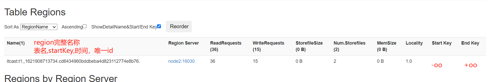

      - 注意：随着数据越来越多，达到阈值，这个分区会自动分裂为两个分裂

    - 手动创建多个分区

      ```
      create 'itcast:t3','cf',SPLITS => ['20', '40', '60', '80']
      ```

      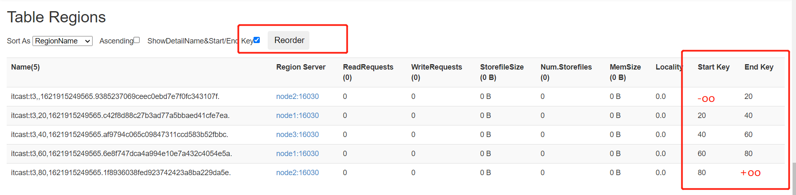

    - 写入数据

      ```
      put 'itcast:t3','0300000','cf:name','laoda'
      put 'itcast:t3','7890000','cf:name','laoer'
      ```

      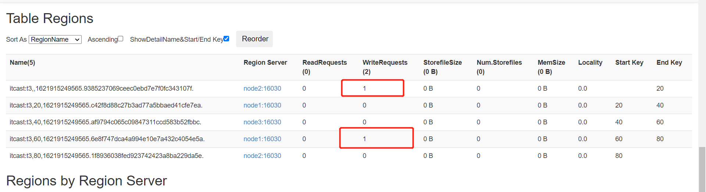

- **小结**：掌握Hbase中表的Region的划分规则


## 知识点18：【理解】存储设计：Region的内部结构

- **目标**：**理解Region的内部存储结构**

- **实施**

  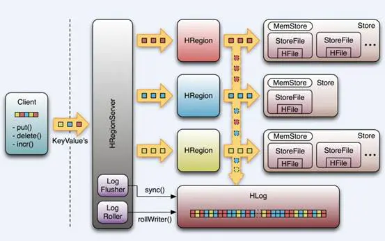

  - **问题：数据在Region的内部是如何存储的？**

    ```
    put tbname,rowkey,cf:col,value
    ```

    - tbname：决定了这张表的数据最终要读写哪些分区
    - rowkey：决定了具体读写哪个分区
    - cf：决定具体写入哪个Store

  - **分析**

    - **Table/RegionServer**：数据指定写入哪张表，提交给对应的某台regionserver
      - **Region**：对整张表的数据划分，按照范围划分，实现分布式存储
        - ==**Store**==：对分区的数据进行划分，**按照列族划分**，一个列族对应一个Store
          - 不同列族的数据写入不同的Store中，实现了按照列族将列进行分组
          - 根据用户查询时指定的列族，可以快速的读取对应的store
          - **MemStore**：Store中内存区域，先写入Memstore中就返回写入成功
            - 每一个Store中都有一个独立的Memstore内存区域
            - 当Memstore中数据达到一定阈值，就会将Memstore的数据溢写到HDFS
          - **StoreFile**：Memstore溢写产生的磁盘文件，存储在HDFS上
            - 每一个Store中可能有0或者多个StoreFile文件
            - 逻辑上属于Store，物理上存在HDFS上，在HDFS中我们叫做HFILE文件【二进制文件】

  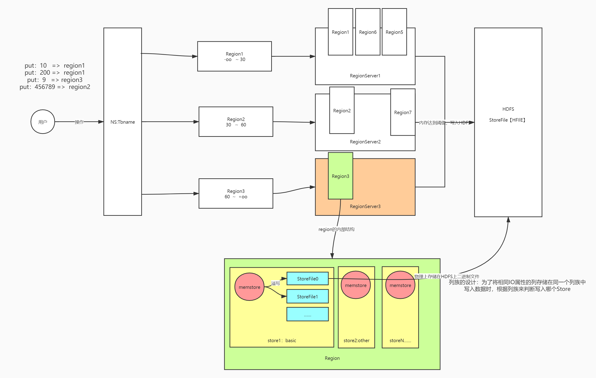

- **HDFS中的存储**

  - **问题：Hbase的数据在HDFS中是如何存储的？**

    - **分析**：整个Hbase在HDFS中的存储目录

      ```properties
      hbase.rootdir=hdfs://node1:8020/hbase
      ```

      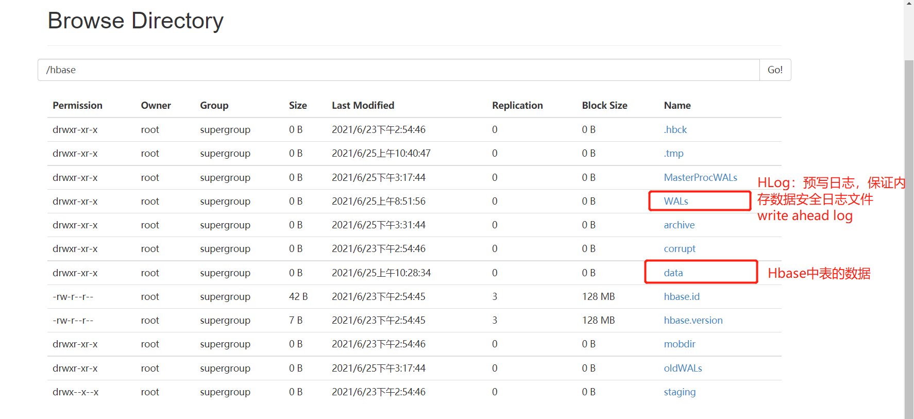

      

      - NameSpace：目录结构

        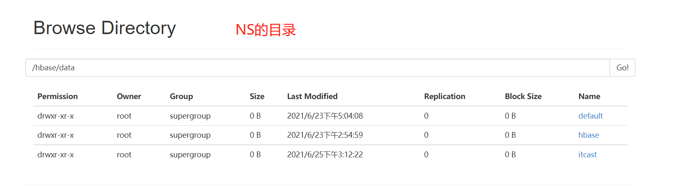

        

      - Table：目录结构

        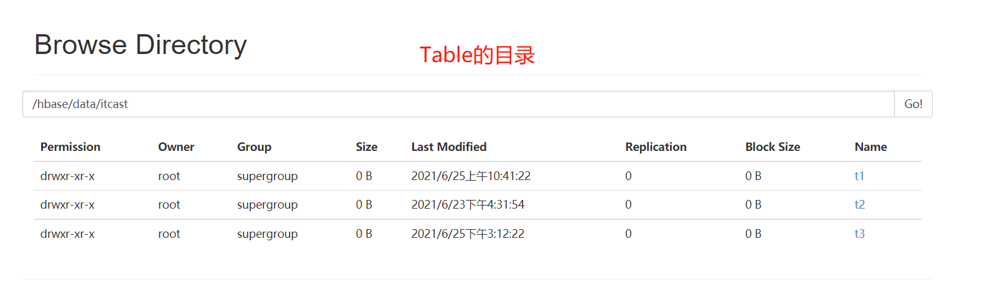

        

      - Region：目录结构

        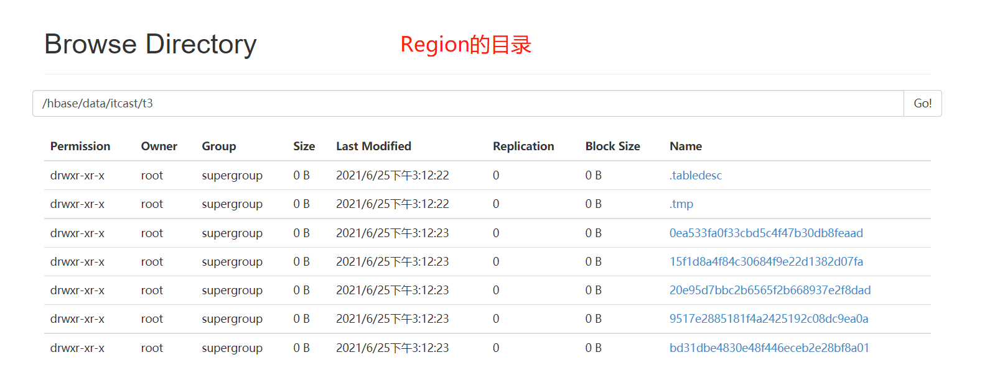

        

      - Store/ColumnFamily：目录结构

        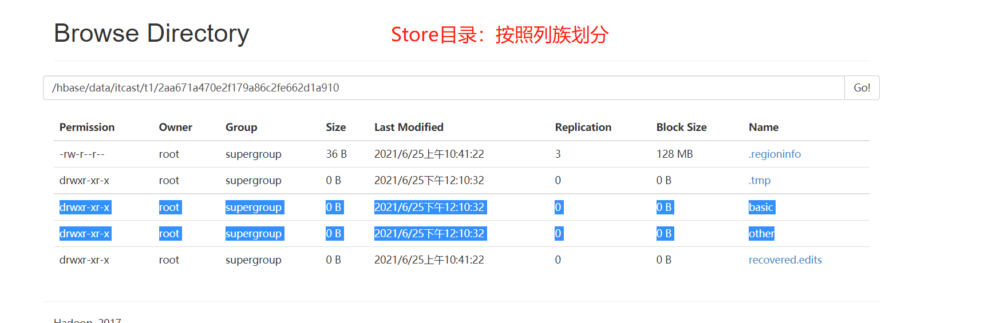

        

      - StoreFile

        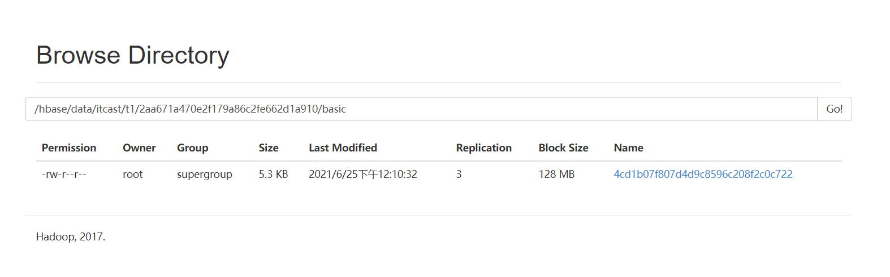

        - 如果HDFS上没有storefile文件，可以通过flush，手动将表中的数据从内存刷写到HDFS中

          ```
          flush 'itcast:t3'
          ```

- **小结**：理解Region的内部存储结构


## 知识点19：【理解】Hbase读写流程：基本流程

- **目标**：**理解Hbase数据读写的基本流程**

- **实施**

  ​											

  - **问题**：当执行一条Put操作，数据是如何写入Hbase的？

    ```
    put 表名	rowkey		列族：列		值
    ```

  - step1：根据表名获取这张表对应的所有Region的信息：**缩小检索范围**

    - 整个Hbase的所有Regionserver中有很多个Region：100
    - 先根据表名找到这张表有哪些region：5

  - step2：根据Rowkey判断具体写入哪个Region：**确定要读写分区**

    - 知道了这张表的所有region：5
    - 根据rowkey属于哪个region范围，来确定具体写入哪个region：1

  - step3：将put操作提交给这个Region所在的RegionServer：**提交请求给对应的RS**

    - 获取这个Region所在的RegionServer地址

  - step4：RegionServer将数据写入Region，根据列族判断写入哪个Store：**将数据写入**

  - step5：将数据写入MemStore中


- **小结**：理解Hbase数据读写的基本流程

  


## 知识点20：【理解】Hbase读写流程：meta表

- **目标**：**理解hbase:meta表的存储内容及功能**

  - 问题1：如何知道这张表对应的region有哪些？
  - 问题2：如何知道每个Region的范围的？
  - 问题3：如何知道Region所在的RegionServer地址的？
  - |
  - 每张表的每个Region的信息肯定都存储在某个地方
  - |
  - 本质上：表的元数据信息

- **实施**

  - Hbase自带的两张系统表

    - **hbase:namespace**：存储了Hbase中所有namespace的信息

    - **hbase:meta**：存储了表的元数据

  - **hbase:meta表结构**

    - Rowkey：每张表每个Region的名称

      ```
      itcast:t3,20,1632627488682.fba4b18252cfa72e48ffe99cc63f7604
      表名,startKey,时间，唯一id
      ```
      
      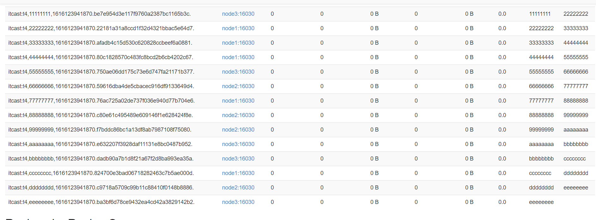
      
      - Hbase中每张表的每个region对应元数据表中的一个Rowkey
    
        - info:regioninfo
    
          ```
          STARTKEY => 'eeeeeeee', ENDKEY => ''
          ```
    
        - info:server/info:sn
    
          ```
          column=info:sn, timestamp=1624847993004, value=node1,16020,1624847978508  
          ```
    
      - 实现：根据表名读取meta表，基于rowkey的前缀匹配，获取这张表的所有region信息
  
- **小结**：理解hbase:meta表的存储内容及功能


## 知识点21：【理解】Hbase读写流程：写入流程

- **目标**：**掌握Hbase写入数据的整体流程**

- **实施**

  - **step1：获取表的元数据**：读取meta表

    - 先连接zk，从zk获取meta表所在的regionserver

    - 根据查询的数据表表名读取meta系统表，获取这张数据表的所有region的信息

      - meta表是一张表，数据存储在一个region，这个region存在某个regionserver上

      - 怎么知道meta表的regionserver在哪？

      - 这个地址记录在ZK中

        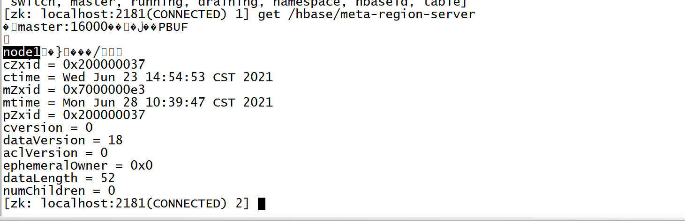

    - 得到这张表的所有region的范围和地址

  - **step2：找到对应的Region**

    - 根据Rowkey和所有region的范围，来匹配具体写入哪个region
    - 获取这个region所在的regionserver的地址

  - **step3：写入数据**

    - 请求对应的regionserver
    - regionserver根据提交的region的名称和数据来操作对应的region
    - 根据列族来判断具体写入哪个store
      - **先写WAL**：write ahead log【预写日志 Hlog】
        - 为了避免内存数据丢失，所有数据写入内存之前会
        - 先记录这个内存操作在wal文件中
      - 然后写入**这个Store的Memstore中**

  - **思考**：hbase的region没有选择副本机制来保证安全，如果RegionServer故障，Master发现故障，怎么保证数据可用性？

    - Region的数据在什么地方？
      - Memstore：存储在内存中，可以通过内存操作日志来恢复
      - StoreFile：物理上是存储在HDFS的，利用HDFS的副本机制可以正常使用
    - WAL怎么保证安全？
      - 将WAL存储在HDFS，保证安全性

- **小结**：掌握Hbase写入数据的整体流程

  

## 知识点22：【理解】Hbase读写流程：读取流程

- **目标**：**掌握Hbase数据读取整体流程**

- **实施**

    - **step1：获取元数据**

      - 客户端请求Zookeeper，获取meta表所在的regionserver的地址
      - 读取meta表的数据

    - **step2：找到对应的Region**

      - 根据meta表中的元数据，找到表对应的region
      - 根据region的范围和读取的Rowkey，判断需要读取具体哪一个Region
      - 根据region的Regionserver的地址，请求对应的RegionServer

    - **step3：读取数据**

      - **先查询memstore【写缓存】**
      - 如果开启了读缓存【默认】，**就读BlockCache**
      - 如果缓存中没有，也读取storefile，从storefile读取完成以后，放入缓存中
      - 如果没有开启缓存**，就读取StoreFile**
      - Hbase中内存设计
        - MemStore：写缓存
        - BlockCache：读缓存：为了加快对于数据多次读取，第一次读StoreFile，第二次开始从缓存中获取

- **小结**：掌握Hbase数据读取整体流程

  

## 知识点23：【了解】Flush、Compaction、Split

- **目标**：**了解Hbase的LSM模型中Flush的设计**

- **实现**

  - **问题1：什么是Flush?**

    - **功能：将内存memstore中的数据溢写到HDFS中变成磁盘文件storefile【HFILE】**

    - 设计目标

      - 避免内存占用过多：将占用内存比较多的Memstore的数据写入磁盘
      - 避免同时有很多的Memstore大量的数据进行Flush

    - 关闭集群：自动Flush

    - 参数配置：自动触发机制

      ```shell
      #Flush策略选择
      hbase.regionserver.flush.policy=FlushAllStoresPolicy | FlushAllLargeStoresPolicy
      
      # FlushAllStoresPolicy
      #memstore级别：这个Region中单个memstore达到128M，将整个Region中所有memstore进行flush
      hbase.hregion.memstore.flush.size = 128M 
      # region / regionserver
      hbase.hregion.memstore.block.multiplier  * hbase.hregion.memstore.flush.size
      hbase.regionserver.global.memstore.upperLimit = 0.4
      hbase.regionserver.global.memstore.lowerLimit = 0.38
      
      #FlushAllLargeStoresPolicy
      #设置了一个flush的最小阈值
      #规则：max("hbase.hregion.memstore.flush.size / column_family_number",hbase.hregion.percolumnfamilyflush.size.lower.bound.min)
      #如果memstore高于上面这个结果，就会被flush，如果低于这个值，就不flush
      #如果整个region所有的memstore都低于，全部flush
      #水位线 = max（128 / 列族个数,16）,列族最多给3个 ~ 42M
      #如果memstore的空间大于42,就flush，如果小于就不flush，如果都小于，全部flush
      举例：3个列族，3个memstore,90/30/30   90会被Flush
      举例：3个列族，3个memstore,30/30/30  全部flush
      hbase.hregion.percolumnfamilyflush.size.lower.bound.min=16M
      ```

  - **问题2：什么是Compaction？**

    - **问题**
      - 1-小文件：HDFS不适合存储小文件，Hbase基于多个小文件检索性能差
      - 2-hbase中的更新和删除是逻辑更新和逻辑删除，导致很多无用数据占用存储空间

    - **功能**：**将多个单独有序StoreFile文件进行合并，合并为整体有序的大文件，加快读取速度，清理无用数据**

    - **版本功能**：2.0版本开始，内存中的数据也可以先合并后Flush
      
      - 内存中合并：In-memory compaction
- 磁盘中合并：minor compaction、major compaction
      
    - **In-memory compaction：**2.0版本开始新增加的功能
  
    - 功能：将要Flush的数据提前在内存中合并，并对过期的版本进行清理
  
    - 参数：hbase.hregion.compacting.memstore.type=None|basic|eager|adaptive
      
- **minor compaction**：轻量级合并
      - 功能：将最早生成的几个小的StoreFile文件进行合并，成为一个大文件，不定期触发

      - 特点
    
    - 只实现将多个小的StoreFile合并成一个相对较大的StoreFile，占用的资源不多
        - 不会将标记为更新或者删除的数据进行处理

      - 参数：hbase.hstore.compaction.min=3

    - **major compaction**：重量级合并

      - 功能：将整个Store中所有StoreFile进行合并为一个StoreFile文件，整体有序的一个大文件

      - 特点
    
        - 将所有文件进行合并，构建**整体有序**
    - 合并过程中会进行**清理过期和标记为删除**的数据
        - 资源消耗比较大
    
      - 参数配置：hbase.hregion.majorcompaction=7天
      
      - Hbase通过Compaction实现将零散的有序数据合并为整体有序大文件，提高对HDFS数据的查询性能
      
      - 在工作中要避免自动触发majorcompaction，影响业务
      
        ```
        hbase.hregion.majorcompaction=0
        ```
      
      - 在不影响业务的时候，手动处理，每天在业务不繁忙的时候，调度工具实现手动进行major compact
      
        ```shell
        major_compact 'ns1:t1'
        ```
    
    - **问题3：什么是Split分裂机制？**
  
      - **功能**：为了避免一个Region存储的数据过多，提供了Region分裂机制，实现将一个Region分裂为两个Region
  
        - 由RegionServer实现Region的分裂，得到两个新的Region
        - 由Master负责将两个新的Region分配到Regionserver上
  
      - **参数配置**
  
        ```properties
        #2.x开始自动分裂的机制：根据这个Region最大的StoreFile来判断
        #规则：return tableRegionsCount = 1  ? this.initialSize : getDesiredMaxFileSize();
        #判断region个数是否为1，如果为1，就按照256分，如果不为1，就按照10GB来分
        hbase.regionserver.region.split.policy=org.apache.hadoop.hbase.regionserver.SteppingSplitPolicy
        ```
  
      - Hbase通过Split策略来保证一个Region存储的数据量不会过大，通过分裂实现分摊负载，避免热点，降低故障率
  
      - 注意：工作作中避免自动触发，影响集群读写，建议关闭
  
        ```properties
        hbase.regionserver.region.split.policy=org.apache.hadoop.hbase.regionserver.DisabledRegionSplitPolicy
        ```
  
      - 手动操作
  
        ```shell
        split 'tableName'
        split 'namespace:tableName'
        split 'regionName' # format: 'tableName,startKey,id'
        split 'tableName', 'splitKey'
        split 'regionName', 'splitKey'
        ```
  
- **小结**：了解Hbase的Flush、Compaction、Split机制


# ==【模块四：热点问题及Hbase表设计】==

## 知识点24：【理解】热点问题：现象及原因

- **目标**：**掌握热点问题的现象及原因**

- **实施**

  - **现象**：`在某个时间段内，大量的读写请求全部集中在某个Region中，导致这台RegionServer的负载比较高，其他的Region和RegionServer比较空闲`

  - **问题**：这台RegionServer故障的概率就会增加，整体性能降低，效率比较差

  - **原因**：本质上的原因，数据分配不均衡

    - **情况一**：如果这张表只有一个分区，所有数据都存储在一个分区中，这个分区要响应所有读写请求，出现了热点

    - **情况二**：如果这张表有多个分区，而你的**Rowkey写入时是连续的**

      - 一张表有5个分区

        ```
        region0：-oo  20
        region1：20   40
        region2：40   60
        region3: 60   80
        region4: 80   +oo
        ```

        - 000001：region0

        - 000002：region0

        - ……

        - 199999：region0

        - 都写入了同一个region0分区

        - 200000：region1

        - 200001：region1

        - ……

        - 399999：region1

    - **情况三：分区范围不合理**

      - Rowkey：字母开头
      - Region：3个分区
        - region0：-oo ~ 30
        - region1：30  ~ 70
        - region2:   70 ~ +oo
      - 所有数据都写入了region2

  - **解决**：避免热点的产生

    - step1：先设计rowkey：构建不连续的rowkey
    - step2：建表，构建多个分区，分区范围必须要根据Rowkey设计

- **小结**：掌握热点问题的现象及原因


## 知识点25：【掌握】分布式设计：预分区

- **目标**：实现建表时指定多个分区

- **实施**

  - **需求**：在创建表的时候，**指定一张表拥有多个Region分区**

  - **规则**

    - **划分的目标**：划分多个分区实现分布式并行读写，将无穷区间划分为几段，将数据存储在不同分区中，实现分区的负载均衡
    - **划分的规则**：==**Rowkey或者Rowkey的前缀来划分**==
      - 如果不按照这个规则划分，预分区就可能没有作用
        - Rowkey：00 ~ 99
        - region0： -oo  ~  30
        - ……
        - regionN ： 90 ~ +oo
      - 如果分区的设计不按照rowkey来
        - region0：-oo ~ b
        - region1:  b   ~  g
        - ……
        - regionN：z ~ +oo

  - **实现**

    - 方式一：指定分隔段，实现预分区

      - 前提：先设计rowkey

      ```shell
      create 'ns1:t1', 'f1', SPLITS => ['10', '20', '30', '40']
      #将每个分割的段写在文件中，一行一个
      create 't1', 'f1', SPLITS_FILE => 'splits.txt'
      ```

    - 方式二：指定Region个数，**要求：Rowkey必须为字母和数字的组合**

      ```shell
      #你的rowkey的前缀是数字和字母的组合 
      create 'itcast:t4', 'f1', {NUMREGIONS => 15, SPLITALGO => 'HexStringSplit'}
      ```

      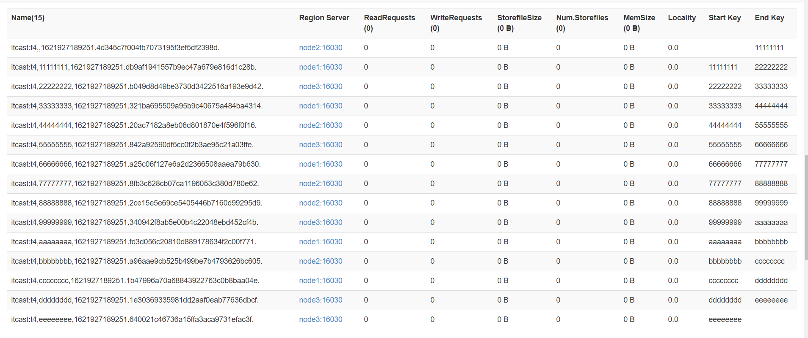

    - 方式三：Java API

      ```java
      HBASEAdmin admin = conn.getAdmin
      admin.create(表的描述器对象,byte[][] splitsKey)
      ```

- **小结**：实现建表时指定多个分区


## 知识点26：【掌握】Hbase表设计：Rowkey设计

- **目标**：**掌握Hbase表的Rowkey的设计规则**

- **实施**

  - **功能**

    - 唯一标记一条数据
    - 唯一索引：rowkey的前缀是什么，决定了可以按照什么条件走索引查询
    - Region的划分，数据的分区划分

  - **需求**：根据不同业务需求，来合理的设计rowkey，实现高性能的数据存储

  - **分析**：不同的业务需求的表，Rowkey设计都不一样

  - **设计规则**

    - **业务原则**：Rowkey的设计必须贴合业务的需求，一般选择最常用的查询条件作为rowkey的前缀

      - 常用的查询条件：各种id、时间

      - 数据

        ```
        oid		uid		pid		stime ……
        ```

      - Rowkey：stime

        ```
        rowkey					oid		uid		pid		stime ……
        20211201000000			o001	u001	p001	2021-12-01 00:00:00
        ```

      - 按照时间就走索引

    - **唯一原则**：Rowkey必须具有唯一性，不能重复，一个Rowkey唯一标识一条数据

    - **组合原则**：将更多的经常作为的查询条件的列放入Rowkey中，可以满足更多的条件查询可以走索引查询

      - Rowkey：stime：缺点不唯一、只有按照时间才走索引

      - Rowkey：stime_uid_oid

        ```
        rowkey								oid		uid		pid		stime ……
        20211201000000_u001_o001			o001	u001	p001	2021-12-01 00:00:00
        20211201000000_u002_o002			o002	u001	p001	2021-12-01 00:00:00
        ……
        20211201000000_u00N_o00N			o00N	u001	p001	2021-12-01 00:00:00
        ……
        20211201000001_u001_o00N			o00N	u001	p001	2021-12-01 00:00:00
        ```

      - 订单id唯一、一个用户在同一时间只能下一个订单

      - 索引查询：stime、s_time+uid、stime+uid+oid

      - 想查询订单id为001：不走，全表扫表：对列的值进行过滤：SingleColumnValueFilter

    - **散列原则**：为了避免出现热点问题，需要将数据的rowkey生成散列的rowkey，构建不连续的rowkey

      - 举个栗子：一般最常用的查询条件肯定是时间

        - timestamp_userid_orderid：订单表

          ```
          1624609420000_u001_o001
          1624609420001_u002_o002
          1624609420002_u003_o003
          1624609421000_u001_o004
          ……
          ```

        - 预分区：数值

          - region0：-oo  ~ 1624
          - region1：1624  ~ 1924
          - region2：1924 ~  2100
          - region3：2100 -2400
          - region4：2400 ~ +oo

        - 问题：出现热点

      - **解决：构建散列**

        - **方案一：更换不是连续的字段作为前缀，例如用户id**

        - **方案二：反转**，牺牲一定的查询性能，先反转再查询

          ```
          1624609420000_u001_o001  -> 0000249064261_u001_o001
          1624609420001_u002_o002	
          1624609420002_u003_o003
          1624609421000_u001_o004
          
          region0： -oo  2
          region1:  2    5
          region2:  5    7
          region3:  7    +oo
          ```
        
        - ==**方案三：加盐（Salt），本质对数据进行编码【MD5、CRC】，生成数字加字母组合的结果**==
        
          ```
          1624609420000_u001_o001		->		34k323232hjjnj2_u001_o001
          1624609420001_u002_o002		->		diwueiweidw2232
          1624609420002_u003_o003
          1624609421000_u001_o004
          ……
          ```

  - **长度原则**：在满足业务需求情况下，rowkey越短越好，一般建议Rowkey的长度小于100字节

    - 原因：rowkey越长，比较性能越差，rowkey在底层的存储是冗余的
    - 问题：为了满足组合原则，rowkey超过了100字节怎么办？

    - 解决：实现编码，将一个长的rowkey，编码为8位，16位，32位

- **小结**：掌握Hbase表的Rowkey的设计规则


## 知识点27：【了解】Hbase表设计：其他设计

- **目标**：**了解Hbase表中其他元素的设计**

- **实施**

  - **NS的设计**：类似于数据库名称的设计，明确标识每个业务域，一般包含业务域名称即可
  - **表名设计**：类似于数据库中表名的设计，包含业务名称即可
  - ==**列族设计**==：名称没有太多意义，个数建议最多不超过3个，一般为1个或者2个
    - **个数原则**：不能多不能少，根据列的个数合适选择
      - 30列左右：1个列族
      - 60列左右：2个列族
      - 80列以上：3个列族
    - 长度原则：列族名称没有意义，只有标识性作用，起到标识作用，越短越好
  - **标签设计**：按照实际业务字段名标识即可，建议缩写，避免长度过长

- **小结**：了解Hbase表中其他元素的设计


# ==【模块五：BulkLoad及基础优化】==

## 知识点28：【了解】BulkLoad的介绍

- **目标**：**了解BulkLoad的功能及应用场景**

- **实施**

  - **问题**：有一批大数据量的数据，要写入Hbase中，如果按照传统的方案来写入Hbase，必须先写入内存，然后内存溢写到HDFS，导致Hbase的内存负载和HDFS的磁盘负载过高，影响业务
  - **解决**：写入Hbase方式
    - 方式一：构建Put对象，先写内存
    - 方式二：**BulkLoad，直接将数据变成StoreFile文件**，加载到Hbase的表中
  - **步骤**
    - step1：先将要写入的数据转换为HFILE文件
    - step2：将HFILE文件加载到Hbase的表中
  - **特点**
    - 优点：不经过内存，降低了内存和磁盘的IO吞吐
    - 缺点：性能上相对来说要慢一些，所有数据都不会在内存中被读取
  - **场景**
    - 短时间内写入大量的数据到Hbase
    - 将很大的数据要加载到Hbase表

- **小结**：了解BulkLoad的功能及应用场景

  

## 知识点29：【了解】BulkLoad的实现

- **目标**：**实现BulkLoad方式加载数据到Hbase的表中**

- **实施**

  - **需求**

    ```
    银行每天都产生大量的转账记录，超过一定时期的数据，需要定期进行备份存储。本案例，在MySQL中有大量转账记录数据，需要将这些数据保存到HBase中。因为数据量非常庞大，所以采用的是Bulk Load方式来加载数据。
    ```

  - **数据**

    - 文件：bank_record.csv

    - 内容：每一列以逗号分隔

      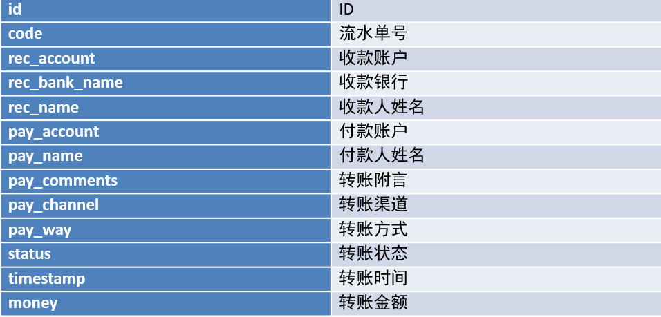

      

  - **实现**

    - 创建表

      ```
      create "TRANSFER_RECORD", { NAME => "C1"}
      ```

    - 上传测试文件

      ```shell
      hdfs dfs -mkdir -p  /bulkload/input
      hdfs dfs -put bank_record.csv /bulkload/input/
      ```

      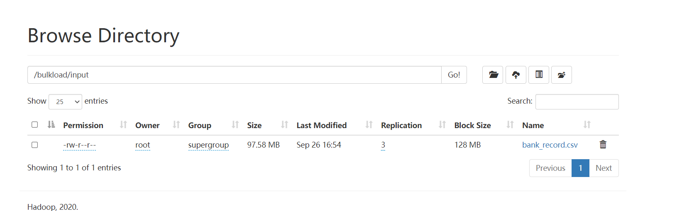

      

    - 开发转换程序：将CSV文件转换为HFILE文件

    - 上传jar包到Linux上

      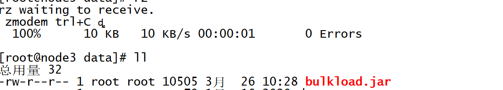

    - 启动YARN

      ```
      start-yarn.sh
      ```

    - **step1**：转换为HFILE

      ```shell
      yarn jar bulkload.jar bigdata.itcast.cn.hbase.bulkload.BulkLoadDriver  /bulkload/input/ /bulkload/output
      ```

    - 运行找不到Hbase的jar包，手动申明HADOOP的环境变量即可，只在当前窗口有效

      ```shell
      export HADOOP_CLASSPATH=$HADOOP_CLASSPATH:/export/server/hbase-2.1.0/lib/shaded-clients/hbase-shaded-mapreduce-2.1.0.jar:/export/server/hbase-2.1.0/lib/client-facing-thirdparty/audience-annotations-0.5.0.jar:/export/server/hbase-2.1.0/lib/client-facing-thirdparty/commons-logging-1.2.jar:/export/server/hbase-2.1.0/lib/client-facing-thirdparty/findbugs-annotations-1.3.9-1.jar:/export/server/hbase-2.1.0/lib/client-facing-thirdparty/htrace-core4-4.2.0-incubating.jar:/export/server/hbase-2.1.0/lib/client-facing-thirdparty/log4j-1.2.17.jar:/export/server/hbase-2.1.0/lib/client-facing-thirdparty/slf4j-api-1.7.25.jar
      ```

    - **重新运行**

    - 查看结果

      

    - **step2**：加载到Hbase表中

      ```
      hbase org.apache.hadoop.hbase.tool.LoadIncrementalHFiles /bulkload/output TRANSFER_RECORD
      ```


    - 查看数据
    
      ```
      get 'TRANSFER_RECORD','ffff98c5-0ca0-490a-85f4-acd4ef873362',{FORMATTER=> 'toString'}
      ```

- **小结**：实现BulkLoad方式加载数据到Hbase的表中


## 知识点30：【了解】Hbase优化：内存分配

- **目标**：**了解Hbase中内存的管理及分配**

- **实施**

  - RegionServer堆内存：100%

  - **MemStore**：写缓存

    ```
    hbase.regionserver.global.memstore.size = 0.4
    ```

    - 如果存多了，Flush到HDFS

  - **BlockCache**：读缓存

    ```
    hfile.block.cache.size = 0.4
    ```

    - **LRU淘汰算法**，将最近最少被使用的数据从缓存中剔除

  - 读多写少，降低MEMStore比例

  - 读少写多，降低BlockCache比例

- **小结**：可以根据实际的工作场景的需求，调整内存比例分配，提高性能

  

## 知识点31：【了解】Hbase优化：压缩机制

- **目标**：**了解Hbase中支持的压缩类型及配置实现**

- **实施**

  - 本质：Hbase的压缩源自于Hadoop对于压缩的支持

  - 检查Hadoop支持的压缩类型

    - hadoop checknative

  - 需要将Hadoop的本地库配置到Hbase中

  - 关闭Hbase的服务，配置Hbase的压缩本地库： lib/native/Linux-amd64-64

    ```
    cd /export/server/hbase-2.1.0/
    mkdir lib/native
    ```

  - 将Hadoop的压缩本地库创建一个软链接到Hbase的lib/native目录下

    ```
    ln -s /export/server/hadoop/lib/native /export/server/hbase-2.1.0/lib/native/Linux-amd64-64
    ```

  - 启动Hbase服务

    ```
    start-hbase.sh
    hbase shell
    ```

  - 创建表

    ```
    create 'testcompress',{NAME=>'cf1',COMPRESSION => 'SNAPPY'}
    put 'testcompress','001','cf1:name','laoda'
    ```

- **小结**：Hbase提供了多种压缩机制实现对于大量数据的压缩存储，提高性能

  

## 知识点32：【了解】Hbase优化：布隆过滤

- **目标**：**了解布隆过滤器的功能及使用**

- **实施**

  - **功能**：什么是布隆过滤器？
    - 是列族的一个属性，用于数据查询时对数据的过滤，类似于ORC文件中的布隆索引
    - 列族属性：BLOOMFILTER => NONE | 'ROW' | ROWCOL
    - 规则：说你有但是不一定有，说没有一定没有
  - **ROW：开启行级布隆过滤**
    - 生成StoreFile文件时，会将这个文件中有哪些Rowkey的数据记录在文件的头部
    - 当读取StoreFile文件时，会从文件头部获取这个StoreFile中的所有rowkey，自动判断是否包含需要的rowkey，如果包含就读取这个文件，如果不包含就不读这个文件
    - 场景：默认选项，正常对行的读取，就使用行级
  - **ROWCOL：行列级布隆过滤**
    - 生成StoreFile文件时，会将这个文件中有哪些Rowkey的以及对应的列族和列的信息数据记录在文件的头部
    - 当读取StoreFile文件时，会从文件头部或者这个StoreFile中的所有rowkey以及列的信息，自动判断是否包含需要的rowkey以及列，如果包含就读取这个文件，如果不包含就不读这个文件
    - 场景：经常查询列，对列进行过滤查询

- **小结**：Hbase通过布隆过滤器，在写入数据时，建立布隆索引，读取数据时，根据布隆索引加快数据的检索


# 附录一：Hbase Maven依赖

```xml
    <repositories>
        <repository>
            <id>aliyun</id>
            <url>http://maven.aliyun.com/nexus/content/groups/public/</url>
        </repository>
    </repositories>

    <dependencies>
        <dependency>
            <groupId>org.apache.hbase</groupId>
            <artifactId>hbase-client</artifactId>
            <version>2.1.2</version>
        </dependency>
        <dependency>
            <groupId>org.apache.hbase</groupId>
            <artifactId>hbase-mapreduce</artifactId>
            <version>2.1.2</version>
        </dependency>
        <dependency>
            <groupId>org.apache.hadoop</groupId>
            <artifactId>hadoop-mapreduce-client-jobclient</artifactId>
            <version>2.7.5</version>
        </dependency>
        <dependency>
            <groupId>org.apache.hadoop</groupId>
            <artifactId>hadoop-common</artifactId>
            <version>2.7.5</version>
        </dependency>
        <dependency>
            <groupId>org.apache.hadoop</groupId>
            <artifactId>hadoop-mapreduce-client-core</artifactId>
            <version>2.7.5</version>
        </dependency>
        <dependency>
            <groupId>org.apache.hadoop</groupId>
            <artifactId>hadoop-auth</artifactId>
            <version>2.7.5</version>
        </dependency>
        <dependency>
            <groupId>org.apache.hadoop</groupId>
            <artifactId>hadoop-hdfs</artifactId>
            <version>2.7.5</version>
        </dependency>
        <dependency>
            <groupId>commons-io</groupId>
            <artifactId>commons-io</artifactId>
            <version>2.6</version>
        </dependency>
         <!-- JUnit 4 依赖 -->
        <dependency>
            <groupId>junit</groupId>
            <artifactId>junit</artifactId>
            <version>4.13</version>
        </dependency>
    </dependencies>
```

