# 分布式面向列的NoSQL数据库Hbase（四）

## 知识点01：课程回顾

1. Hbase Java API
   - 掌握基本流程：先构建Connection[ZK]、DDL【HbaseAdmin】、DML【Table】
   - 掌握核心类：Put、Get、Delete、Scan、ResultScanner、Result、Cell
2. Hbase 存储结构
   - 概念
     - Table：逻辑上操作对象，Table是分布式的概念，用于客户端读写数据对象
     - Region：物理上存储数据对象，Region代表每个分区，默认每张表只有1个Region，每个Region存储在不RS
     - RegionServer：Hbase从节点进程，负责管理表的Region，接受所有Region的读写请求
   - Hbase分布式的划分规则
     - 基本原则：表的每一个分区都有一个范围，所有分区的范围合并在一起一定是-oo  ~ +oo
     - 分区规则：按照Rowkey属于哪个Region的范围，就读写哪个Region
     - 设计目的：构建表中数据的全局有序，加快读取的性能
     - Hbase基于HDFS查询性能慢的问题，怎么解决？
       - Rowkey：作为索引、Rowkey有序
       - 列族的设计
       - 积极使用内存：优先读Memstore、允许构建读缓存BlockCache
       - 写入HDFS的文件是二进制的HFILE文件
   - 读写流程
     - 写：先追加写WAL【Hlog】、写入内存【只做新增，逻辑上更新和删除】
       - Flush：将内存中的数据写入HDFS
       - Compaction：将多个文件合并为整体有序大文件，清理无用数据
       - Split：一个分区的数据过多，读写性能降低，通过Split提高并行度
     - 读：先读Memstore【写缓存】，再读BlockCache【读缓存】，最后读StoreFile
     - 元数据检索流程：管理元数据【Zookeeper】、表的元数据【hbase:meta】
   - 存储结构
     - Table | RegionServer
       - |
       - Region：表的分区
         - |
         - Store：按照列族划分
           - |
           - Memstore：内存区域
           - StoreFile：逻辑上属于Store，物理上存储在HDFS中的HFILE文件
   - 热点问题
     - 现象：存储不均衡，导致了读写都集中在某个Region上，其他Region相对来说比较空闲
     - 原因：1-没有预分区，2-分区范围没有按照Rowkey设计 ， 3-rowkey是连续的
     - 解决：1-建表的时候按照rowkey构建预分区，2-设计不连续的rowkey
   - Hbase表的设计
     - rowkey：业务原则、唯一原则、组合原则、散列原则【加盐】、长度原则
     - columnfamily：个数原则【按照列的个数来设计】、长度原则


## 知识点02：课程目标

1. BulkLoad和基础优化
   - 目标：掌握Bulkload功能和应用场景
2. SQL on Hbase
   - 目标：**掌握Hbase使用过程中的问题以及解决方案**


# ==【模块一：BulkLoad及基础优化】==

## 知识点03：【了解】BulkLoad的介绍

- **目标**：**了解BulkLoad的功能及应用场景**

- **实施**

  - **问题**：有一批大数据量的数据，要写入Hbase中，如果按照传统的方案来写入Hbase，必须先写入内存，然后内存溢写到HDFS，导致Hbase的内存负载和HDFS的磁盘负载过高，影响业务
  - **解决**：写入Hbase方式
    - 方式一：构建Put对象，先写内存，内存达到阈值再写入HDFS【实时场景】
    - 方式二：**BulkLoad，直接将数据变成StoreFile文件**，加载到Hbase的表中【离线场景】
  - **步骤**
    - step1：先将要写入的数据转换为HFILE文件
    - step2：将HFILE文件加载到Hbase的表中
  - **特点**
    - 优点：不经过内存，降低了内存和磁盘的IO吞吐
    - 缺点：性能上相对来说要慢一些，所有数据都不会在内存中被读取
  - **场景**
    - 短时间内写入大量的数据到Hbase，将很大的数据要加载到Hbase表【离线批处理场景】
  
- **小结**：了解BulkLoad的功能及应用场景

  

## 知识点04：【了解】BulkLoad的实现

- **目标**：**实现BulkLoad方式加载数据到Hbase的表中**

- **实施**

  - **需求**

    ```
    银行每天都产生大量的转账记录，超过一定时期的数据，需要定期进行备份存储。本案例，在MySQL中有大量转账记录数据，需要将这些数据保存到HBase中。因为数据量非常庞大，所以采用的是Bulk Load方式来加载数据。
    ```

  - **数据**

    - 文件：bank_record.csv

    - 内容：每一列以逗号分隔

      

      

  - **实现**

    - 创建表

      ```
      create "TRANSFER_RECORD", {NAME => "C1"}
      ```

    - 上传测试文件**[先从Windows上传到Linux**]

      ```shell
      hdfs dfs -mkdir -p  /bulkload/input
      hdfs dfs -put bank_record.csv /bulkload/input/
      ```

      

      

    - 开发转换程序：将CSV文件转换为HFILE文件

      - Input：TextInputFormat：普通文件
    - Map：Mapper.map：构建Rowkey和Rowkey的每一列
      - Output：HFILEOutputFormat：HFILE

    - 上传jar包到Linux上

      
    
    - 启动YARN

      ```
    start-yarn.sh
      ```
    
    - **step1**：转换为HFILE

      ```shell
    yarn jar bulkload.jar bigdata.itcast.cn.hbase.bulkload.BulkLoadDriver  /bulkload/input/ /bulkload/output
      ```
    
    - 运行找不到Hbase的jar包，手动申明HADOOP的环境变量即可，只在当前窗口有效

      ```shell
    export HADOOP_CLASSPATH=$HADOOP_CLASSPATH:/export/server/hbase-2.1.0/lib/shaded-clients/hbase-shaded-mapreduce-2.1.0.jar:/export/server/hbase-2.1.0/lib/client-facing-thirdparty/audience-annotations-0.5.0.jar:/export/server/hbase-2.1.0/lib/client-facing-thirdparty/commons-logging-1.2.jar:/export/server/hbase-2.1.0/lib/client-facing-thirdparty/findbugs-annotations-1.3.9-1.jar:/export/server/hbase-2.1.0/lib/client-facing-thirdparty/htrace-core4-4.2.0-incubating.jar:/export/server/hbase-2.1.0/lib/client-facing-thirdparty/log4j-1.2.17.jar:/export/server/hbase-2.1.0/lib/client-facing-thirdparty/slf4j-api-1.7.25.jar
      ```

    - **重新运行**

    - 查看结果

      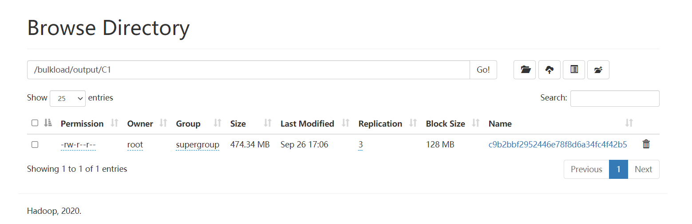
    
    - **step2**：加载到Hbase表中
    
      ```
      hbase org.apache.hadoop.hbase.tool.LoadIncrementalHFiles /bulkload/output TRANSFER_RECORD
      ```
      
    - 查看数据【不要scan】
    
      ```
      get 'TRANSFER_RECORD','ffff98c5-0ca0-490a-85f4-acd4ef873362',{FORMATTER=> 'toString'}
      ```

- **小结**：实现BulkLoad方式加载数据到Hbase的表中


## 知识点05：【了解】Hbase优化：内存分配

- **目标**：**了解Hbase中内存的管理及分配**

- **实施**

  - RegionServer堆内存：100%

  - **MemStore**：写缓存

    ```properties
    hbase.regionserver.global.memstore.size = 0.4
    ```

    - 如果存多了，Flush到HDFS

  - **BlockCache**：读缓存

    ```properties
    hfile.block.cache.size = 0.4
    ```

    - **LRU淘汰算法**，将最近最少被使用的数据从缓存中剔除

  - 读多写少，降低MEMStore比例

  - 读少写多，降低BlockCache比例

- **小结**：可以根据实际的工作场景的需求，调整内存比例分配，提高性能

  

## 知识点06：【了解】Hbase优化：压缩机制

- **目标**：**了解Hbase中支持的压缩类型及配置实现**

- **实施**

  - 本质：Hbase的压缩源自于Hadoop对于压缩的支持

  - 检查Hadoop支持的压缩类型

    - hadoop checknative

  - 需要将Hadoop的本地库配置到Hbase中

  - 关闭Hbase的服务，配置Hbase的压缩本地库： lib/native/Linux-amd64-64

    ```
    stop-hbase.sh
    cd /export/server/hbase-2.1.0/
    mkdir lib/native
    ```

  - 将Hadoop的压缩本地库创建一个软链接到Hbase的lib/native目录下

    ```
    ln -s /export/server/hadoop/lib/native /export/server/hbase-2.1.0/lib/native/Linux-amd64-64
    ```

  - 启动Hbase服务

    ```
    start-hbase.sh
    hbase shell
    ```

  - 创建表

    ```
    create 'testcompress',{NAME=>'cf1',COMPRESSION => 'SNAPPY'}
    put 'testcompress','001','cf1:name','laoda'
    ```

- **小结**：Hbase提供了多种压缩机制实现对于大量数据的压缩存储，提高性能


## 知识点07：【了解】Hbase优化：布隆过滤

- **目标**：**了解布隆过滤器的功能及使用**

- **实施**

  - **功能**：什么是布隆过滤器？
    - 是列族的一个属性，用于数据查询时对数据的过滤，类似于ORC文件中的布隆索引
    - 列族属性：BLOOMFILTER => NONE | ROW | ROWCOL
    - 规则：说你有但是不一定有，说没有一定没有
  - **ROW：开启行级布隆过滤**
    - 生成StoreFile文件时，会将这个文件中有哪些Rowkey的数据记录在文件的头部
    - 当读取StoreFile文件时，会从文件头部获取这个StoreFile中的所有rowkey，自动判断是否包含需要的rowkey，如果包含就读取这个文件，如果不包含就不读这个文件
    - 场景：默认选项，正常对行的读取，就使用行级
  - **ROWCOL：行列级布隆过滤**
    - 生成StoreFile文件时，会将这个文件中有哪些Rowkey的以及对应的列族和列的信息数据记录在文件的头部
    - 当读取StoreFile文件时，会从文件头部或者这个StoreFile中的所有rowkey以及列的信息，自动判断是否包含需要的rowkey以及列，如果包含就读取这个文件，如果不包含就不读这个文件
    - 场景：经常查询列，对列进行过滤查询

- **小结**：Hbase通过布隆过滤器，在写入数据时，建立布隆索引，读取数据时，根据布隆索引加快数据的检索


# ==【模块二：Hive on Hbase】==

## 知识点08：【了解】Hive on Hbase 介绍

- **目标**：**了解Hive on Hbase的实现原理**

- **实施**

  - **问题：hbase使用层面的问题**

    - 1-Hbase不支持SQL，使用成本较高，Hbase使用受到了限制
    - 解决问题：SQL on Hbase
    - 2-Hbase为了解决性能问题，基于Rowkey做了核心设计，Rowkey作为唯一索引，如果不知道Rowkey前缀，只能全表扫描
    - 解决问题：二级索引
    
  - **功能**：**实现Hive与Hbase集成，使用Hive SQL对Hbase的数据进行处理**

    - Hbase：itcast:t1：原始数据表

      |   

    - Hive：itcast.t1：Hbase的关联表

      |

    - 用户可以通过SQL操作Hive中表，底层是MR操作对应的Hbase表

      - SQL读写Hive中的表，而Hive表指向了Hbase的表
      - Hive会调用Hbase读写的类来对Hbase的数据进行读写

  - **原理**：在Hive中对Hbase关联的Hive表执行SQL语句，底层通过Hadoop中的Input和Output对Hbase表进行处理

    - Hadoop中InputFormat和OutputFormat
    - 读写文件：TextInputFormat、TextOutputFormat
    - 读写数据库：DBInputFormat、DBOutputFormat
    - 读写Hbase：TableInputFormat、TableOutputFormat

  - **特点**

    - 优点：**支持完善的SQL语句**，可以实现各种复杂SQL的**数据处理及计算**，通过分布式计算程序实现，对大数据量的数据处理比较友好
    - 缺点：**不支持二级索引**，单纯读写的性能不高，**不适合做即席查询**

  - **应用**

    - 基于大数据高性能的离线读写，并且使用SQL来开发
    - 离线场景下，为了提高离线的存储性能

- **小结**：了解Hive on Hbase的实现原理


## 知识点09：【实现】Hive on Hbase 配置

- **目标**：**实现Hive on Hbase配置**

- **实施**

  - 修改hive-site.xml：Hive通过SQL访问Hbase，就是Hbase的客户端，就要连接zookeeper

    ```shell
    cd /export/server/hive
    vim conf/hive-site.xml
    ```

    ```xml
    <property>
        <name>hive.zookeeper.quorum</name>
        <value>node1,node2,node3</value>
    </property>
    <property>
        <name>hbase.zookeeper.quorum</name>
        <value>node1,node2,node3</value>
    </property>
    <property>
        <name>hive.server2.enable.doAs</name>
        <value>false</value>
    </property>
    ```

  - 修改hive-env.sh：便于Hive加载Hbase的库包

    ```
    vim conf/hive-env.sh
    ```

    ```
    export HBASE_HOME=/export/server/hbase-2.1.0
    ```

  - 启动HDFS、ZK、Hbase：第一台机器

    ```shell
    start-dfs.sh
    start-zk-all.sh
    start-hbase.sh
    ```

  - 启动Hive和YARN==**【没有对应脚本，按照自己启动的方式去启动Hive】**==

    ```shell
    #启动YARN
    start-yarn.sh
    #先启动metastore服务
    hive-daemon.sh metastore
    #然后启动hiveserver
    hive-daemon.sh hiveserver2
    #然后启动beeline
    start-beeline.sh
    ```

    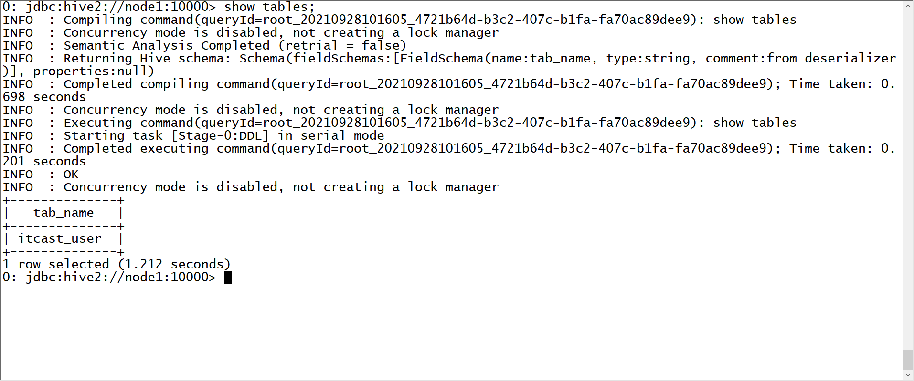

- **小结**：实现Hive on Hbase配置


## 知识点10：【实现】Hive on Hbase 测试

- **目标**：**实现Hive on Hbase的测试**

- **实施**

  - **如果Hbase中表已存在，只能创建外部表**

    ```sql
    --创建测试数据库
    create database course;
    use course;
    --创建测试表
    create external table course.t1(
    key string,
    name string,
    age  string,
    addr string,
    phone string
    )  
    stored by 'org.apache.hadoop.hive.hbase.HBaseStorageHandler'  
    with serdeproperties("hbase.columns.mapping" = ":key,basic:name,basic:age,other:addr,other:phone") 
    tblproperties("hbase.table.name" = "itcast:t1");
    ```

  - 查询

    ```SQL
    select * from t1;
    select age,count(*) as cnt from t1 group by age order by cnt desc;
    ```

  - **注意**

    - Hive中的只是关联表，并没有数据，数据存储在Hbase表中
    - 在Hive中创建Hbase的关联表，关联成功后，使用SQL通过MapReduce处理关联表
    - 如果Hbase中表已存在，只能建外部表，使用:key来表示rowkey
    - Hive中与Hbase关联的表，**不能使用load写入数据**，只能使用insert，通过MR读写数据

- **小结**：实现Hive on Hbase的测试


# ==【模块三：Phoenix的介绍及部署】==

## 知识点11：【了解】Phoenix的介绍

- **目标**：**了解Phoenix的功能及应用场景**
- **实施**
  - http://phoenix.apache.org/
  - **功能**
    - 专门基于Hbase所设计的SQL on Hbase  工具
    - 使用Phoenix实现基于SQL操作Hbase：解决了问题1
    - 使用Phoenix构建二级索引并自动维护二级索引：解决问题2
  - **原理**
    - 上层提供了SQL接口：底层全部通过Hbase Java API来实现，通过构建一系列的Scan和Put来实现数据的读写
    - 功能非常丰富：底层封装了大量的内置的协处理器，可以实现各种复杂的处理需求，例如二级索引等
  - **特点**
    - 优点
      - 支持SQL接口
      - 功能强大：支持自动维护二级索引、创建函数
    - 缺点
      - SQL支持的语法不友好，不是通用性SQL
      - Bug比较多：对Hbase版本集成要求比较高
    - Hive on Hbase对比
      - Hive：**SQL更加全面【底层MR】**，但是**不支持二级索引**，底层通过分布式计算工具来实现
      - Phoenix：**SQL相对支持不全面【没有计算引擎】**，但是**性能比较好**，直接使用HbaseAPI，**支持索引实现**
  - **应用**：**对Hbase的即席查询和索引管理**
    - Phoenix适用于任何需要使用SQL或者JDBC来快速的读写Hbase的场景
    - 或者需要构建及维护二级索引场景
- **小结**：了解Phoenix的功能及应用场景


## 知识点12：【实现】Phoenix的安装配置

- **目标**：安装部署配置Phoenix，集成Hbase

- **实施**

  - 下载：http://phoenix.apache.org/download.html

  - 第一台机器上传

    ```shell
    cd /export/software/
    rz
    ```

  - 第一台机器解压

    ```shell
    tar -zxf apache-phoenix-5.0.0-HBase-2.0-bin.tar.gz -C /export/server/
    cd /export/server/
    mv apache-phoenix-5.0.0-HBase-2.0-bin phoenix-5.0.0-HBase-2.0-bin
    ```

  - 修改三台Linux文件句柄数

    ```shell
    vim /etc/security/limits.conf
    #在文件的末尾添加以下内容，*号不能去掉
    
    * soft nofile 65536
    * hard nofile 131072
    * soft nproc 2048
    * hard nproc 4096
    ```

    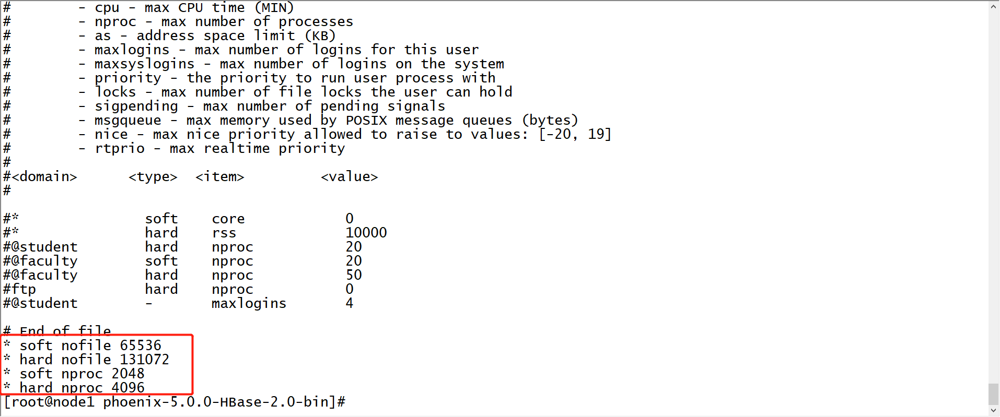

  - 将Phoenix所有jar包分发到Hbase的lib目录下

    ```shell
    #拷贝到第一台机器
    cd /export/server/phoenix-5.0.0-HBase-2.0-bin/
    cp phoenix-* /export/server/hbase-2.1.0/lib/
    #分发给第二台和第三台
    cd /export/server/hbase-2.1.0/lib/
    scp phoenix-* node2:$PWD
    scp phoenix-* node3:$PWD
    ```

  - 修改hbase-site.xml，添加一下属性

    ```shell
    cd /export/server/hbase-2.1.0/conf/
    vim hbase-site.xml
    ```

    ```xml
    <!-- 支持HBase命名空间映射 -->
    <property>
        <name>phoenix.schema.isNamespaceMappingEnabled</name>
        <value>true</value>
    </property>
    <!-- 支持索引预写日志编码 -->
    <property>
        <name>hbase.regionserver.wal.codec</name>
        <value>org.apache.hadoop.hbase.regionserver.wal.IndexedWALEditCodec</value>
    </property>
    ```

  - 同步给其他两台机器

    ```shell
    scp hbase-site.xml node2:$PWD
    scp hbase-site.xml node3:$PWD
    ```

  - 同步给Phoenix

    ```shell
    rm -rf  /export/server/phoenix-5.0.0-HBase-2.0-bin/bin/hbase-site.xml
    cp hbase-site.xml /export/server/phoenix-5.0.0-HBase-2.0-bin/bin/
    ```

  - 重启Hbase

    ```
    stop-hbase.sh
    start-hbase.sh
    ```


  - 安装依赖

    ```
    yum -y install python-argparse
    ```


  - 注意：如果默认的是Python3，启动会报错，将这个文件中的python进行修改

    ```
    vim /export/server/phoenix-5.0.0-HBase-2.0-bin/bin/sqlline.py
    ```

    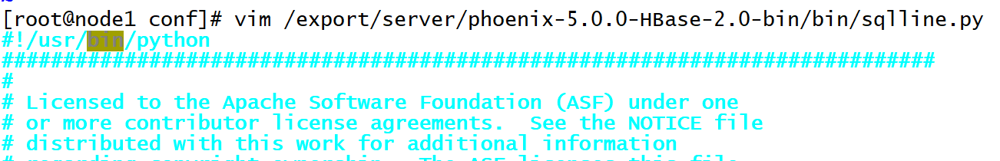

  - 启动Phoenix

    ```
    cd /export/server/phoenix-5.0.0-HBase-2.0-bin/
    bin/sqlline.py node1:2181
    ```

  - 测试

    ```
    !tables
    ```


  - 退出

    ```
    !quit
    ```
    
    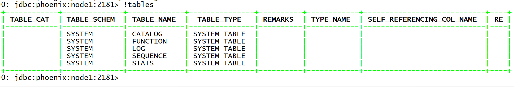
    
- **小结**：实现Phoenix的安装配置


# ==【模块四：Phoenix的基础语法】==

## 知识点13：【理解】Phoenix的DDL语法：NS

- **目标**：实现基于SQL的数据库管理：创建、切换、删除

  - http://phoenix.apache.org/language/index.html

- **实施**

  - 创建NS

    ```
    create schema if not exists student;
    ```

  - 切换NS

    ```
    use student;
    ```

  - 删除NS

    ```
    drop schema if exists student;
    ```

    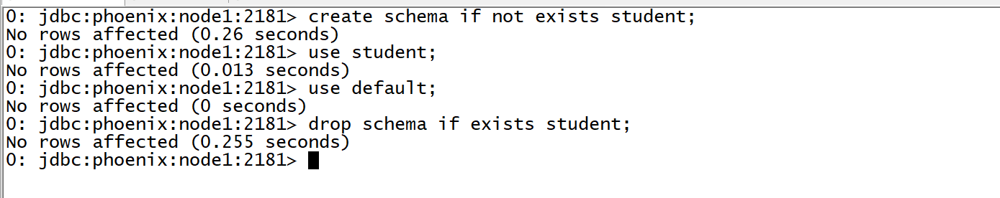

- **小结**：基本与SQL语法一致

  - **注意：Phoenix中默认会将所有字符转换为大写，如果想要使用小写字母，必须加上双引号**


## 知识点14：【理解】Phoenix的DDL语法：Table

- **目标**：实现基于SQL的数据表管理：创建、列举、查看、删除

- **实施**

  - **列举**

    ```
     !tables
    ```

    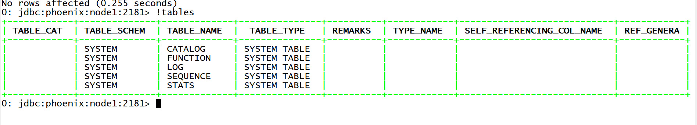

  - **创建**

    - 语法：http://phoenix.apache.org/language/index.html#create_table

    - 类型：https://phoenix.apache.org/language/datatypes.html

    - 注意规则

      - 建表的时候需要指定字段
      - 谁是primary key谁就是rowkey，每张表必须有主键
      - 定义字段时，要指定列族，列族的属性可以在建表语句中指定
      - split：指定建表构建多个分区，每个分区段划分

      ```sql
       CREATE TABLE my_schema.my_table (
           id BIGINT not null primary key, 
           date Date
       );
      
       CREATE TABLE my_table ( 
           id INTEGER not null primary key desc, 
           m.date DATE not null,
           m.db_utilization DECIMAL, 
           i.db_utilization
       ) m.VERSIONS='3';
      
       CREATE TABLE stats.prod_metrics ( 
           host char(50) not null, 
           created_date date not null,
           txn_count bigint 
           CONSTRAINT pk PRIMARY KEY (host, created_date) 
       );
      
         CREATE TABLE IF NOT EXISTS "my_case_sensitive_table"( 
             "id" char(10) not null primary key, 
             "value" integer
         ) DATA_BLOCK_ENCODING='NONE',VERSIONS=5,MAX_FILESIZE=2000000 
         split on (?, ?, ?);
      
      
         CREATE TABLE IF NOT EXISTS my_schema.my_table (
             org_id CHAR(15), 
             entity_id CHAR(15), 
             payload binary(1000),
             CONSTRAINT pk PRIMARY KEY (org_id, entity_id) 
         ) TTL=86400
      ```

    - 如果Hbase中没有这个表【很少用】

      ```sql
       use default;
       create table if not exists ORDER_DTL(
           ID varchar primary key,
           C1.STATUS varchar,
           C1.PAY_MONEY float,
           C1.PAYWAY integer,
           C1.USER_ID varchar,
           C1.OPERATION_DATE varchar,
           C1.CATEGORY varchar
       );
      ```

      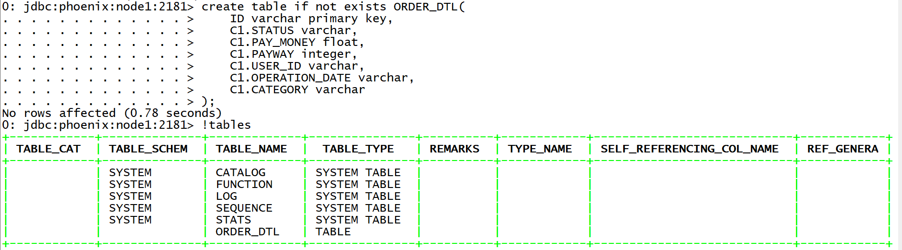

      

    - 如果Hbase中已存在会自动关联【**常用**】

      - Hbase中建表并导入数据

        ```
        hbase shell ORDER_INFO.txt 
        ```

      - Phoenix中建表

        ```sql
        create table if not exists ORDER_INFO(
        "id" varchar primary key,
        "C1"."USER_ID" varchar,
        "C1"."OPERATION_DATE" varchar,
        "C1"."PAYWAY" varchar,
        "C1"."PAY_MONEY" varchar,
        "C1"."STATUS" varchar,
        "C1"."CATEGORY" varchar
        ) column_encoded_bytes=0;
        ```

      - 表名与列名都必须一致，大小写严格区分

  - 查看

    ```
     !desc order_info;
    ```

    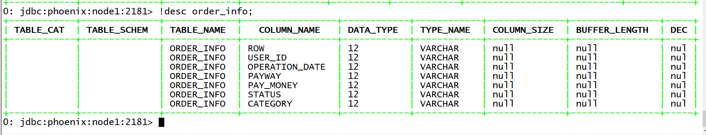

  - 删除

    ```
    drop table if exists order_dtl;
    ```

    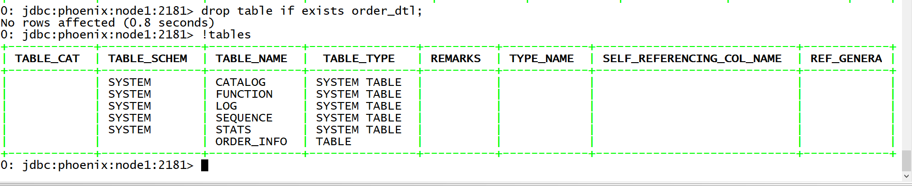

- **小结**：注意：创建表时，必须指定主键作为Rowkey，主键列不能加列族

  - Phoenix 4.8版本之前只要创建同名的Hbase表，会自动关联数据

  - Phoenix 4.8版本以后，不推荐关联表的方式

  - 推荐使用视图关联的方式来实现，如果你要使用关联表的方式，必须加上以下参数

    ```
     column_encoded_bytes=0 ;
    ```

  


## 知识点15：【理解】Phoenix的DML语法：upsert

- **目标**：基于order_info订单数据实现DML插入数据

- **实施**

  - 语法及示例

    

    

    ```sql
    UPSERT INTO TEST VALUES('foo','bar',3);
    UPSERT INTO TEST(NAME,ID) VALUES('foo',123);
    UPSERT INTO TEST(ID, COUNTER) VALUES(123, 0) ON DUPLICATE KEY UPDATE COUNTER = COUNTER + 1;
    UPSERT INTO TEST(ID, MY_COL) VALUES(123, 0) ON DUPLICATE KEY IGNORE;
    ```

  - 插入一条数据

    ```sql
    upsert into order_info values('z8f3ca6f-2f5c-44fd-9755-1792de183845','4944191','2020-04-25 12:09:16','1','4070','未提交','电脑');
    ```

  - 更新USERID为123456【更新语句必须指定rowkey】

    ```sql
    upsert into order_info("id","USER_ID") values('z8f3ca6f-2f5c-44fd-9755-1792de183845','123456');
    ```

- **小结**：语法类似于insert语法，功能等同于insert + update

  

## 知识点16：【理解】Phoenix的DML语法：delete

- **目标**：基于order_info订单数据实现DML删除数据

- **实施**

  - 语法及示例

    ```sql
    DELETE FROM TEST;
    DELETE FROM TEST WHERE ID=123;
    DELETE FROM TEST WHERE NAME LIKE 'foo%';
    ```

  - 删除USER_ID为123456的rowkey数据

    ```sql
    delete from order_info where USER_ID = '123456';
    ```

- **总结**：与MySQL是一致的

  

## 知识点17：【理解】Phoenix的DQL语法：select

- **需求**：基于order_info订单数据实现DQL查询数据

- **实现**

  - 语法及示例

    ```sql
    SELECT * FROM TEST LIMIT 1000;
    SELECT * FROM TEST LIMIT 1000 OFFSET 100;
    SELECT full_name FROM SALES_PERSON WHERE ranking >= 5.0 UNION ALL SELECT reviewer_name FROM CUSTOMER_REVIEW WHERE score >= 8.0
    ```

  - 查询支付方式为1的数据

    ```sql
    select "id",payway,pay_money,category from order_info where payway = '1';
    ```

  - 查询每种支付方式对应的用户人数，并且按照用户人数降序排序

    ```sql
     select
       payway,
       count(distinct user_id) as numb
     from order_info
     group by payway 
     order by numb desc;
    ```

  - 查询数据的第60行到66行

    ```sql
     --以前的写法：limit M,N
     --M：开始位置
     --N：显示的条数
     --Phoenix的写法：limit N offset M
     select * from order_info limit 6 offset 60;//总共66行，显示最后6行
    ```

  - 子查询：https://phoenix.apache.org/subqueries.html

    ```sql
    -- 条件子查询
    select 
      * 
    from order_info 
    where pay_money > (
       select max(pay_money) from order_info where  payway = '2'
    );
    ```

  - Join支持：https://phoenix.apache.org/joins.html

    ```sql
    -- 表join
    select a.user_id,b.payway from order_info a join order_info b on a."id" = b."id" ;
    -- 子查询join
    select 
        a.user_id,b.payway 
    from order_info a join ( select "id",payway from order_info where payway = '1' ) b on a."id" = b."id";
    ```

  - 函数支持：http://phoenix.apache.org/language/functions.html

- **小结**：基本查询与MySQL也是一致的，如果遇到SQL报错，检查语法是否支持


## 知识点18：【理解】Phoenix的使用：预分区

- **目标**：创建表的时候，需要根据Rowkey来设计多个分区

- **实现**

  - Hbase命令建表

    ```
     create Ns;tbname,列族，预分区
    ```

  - Phoenix也提供了创建表时，指定分区范围的语法

    ```sql
     CREATE TABLE IF NOT EXISTS "my_case_sensitive_table"( 
         "id" char(10) not null primary key, 
         "value" integer
     )
     DATA_BLOCK_ENCODING='NONE',VERSIONS=5,MAX_FILESIZE=2000000 split on (?, ?, ?)
    ```

  - 创建数据表，四个分区

    ```sql
     drop table if exists ORDER_DTL;
     create table if not exists ORDER_DTL(
         "id" varchar primary key,
         C1."status" varchar,
         C1."money" float,
         C1."pay_way" integer,
         C1."user_id" varchar,
         C1."operation_time" varchar,
         C1."category" varchar
     ) 
     CONPRESSION='GZ'
     SPLIT ON ('3','5','7');
    ```

    

  - 插入数据

    ```sql
    UPSERT INTO "ORDER_DTL" VALUES('02602f66-adc7-40d4-8485-76b5632b5b53','已提交',4070,1,'4944191','2020-04-25 12:09:16','手机;');
    UPSERT INTO "ORDER_DTL" VALUES('0968a418-f2bc-49b4-b9a9-2157cf214cfd','已完成',4350,1,'1625615','2020-04-25 12:09:37','家用电器;;电脑;');
    UPSERT INTO "ORDER_DTL" VALUES('0e01edba-5e55-425e-837a-7efb91c56630','已提交',6370,3,'3919700','2020-04-25 12:09:39','男装;男鞋;');
    UPSERT INTO "ORDER_DTL" VALUES('0f46d542-34cb-4ef4-b7fe-6dcfa5f14751','已付款',9380,1,'2993700','2020-04-25 12:09:46','维修;手机;');
    UPSERT INTO "ORDER_DTL" VALUES('1fb7c50f-9e26-4aa8-a140-a03d0de78729','已完成',6400,2,'5037058','2020-04-25 12:10:13','数码;女装;');
    UPSERT INTO "ORDER_DTL" VALUES('23275016-996b-420c-8edc-3e3b41de1aee','已付款',280,1,'3018827','2020-04-25 12:09:53','男鞋;汽车;');
    UPSERT INTO "ORDER_DTL" VALUES('2375a7cf-c206-4ac0-8de4-863e7ffae27b','已完成',5600,1,'6489579','2020-04-25 12:08:55','食品;家用电器;');
    UPSERT INTO "ORDER_DTL" VALUES('269fe10c-740b-4fdb-ad25-7939094073de','已提交',8340,2,'2948003','2020-04-25 12:09:26','男装;男鞋;');
    UPSERT INTO "ORDER_DTL" VALUES('2849fa34-6513-44d6-8f66-97bccb3a31a1','已提交',7060,2,'2092774','2020-04-25 12:09:38','酒店;旅游;');
    UPSERT INTO "ORDER_DTL" VALUES('28b7e793-6d14-455b-91b3-0bd8b23b610c','已提交',640,3,'7152356','2020-04-25 12:09:49','维修;手机;');
    UPSERT INTO "ORDER_DTL" VALUES('2909b28a-5085-4f1d-b01e-a34fbaf6ce37','已提交',9390,3,'8237476','2020-04-25 12:10:08','男鞋;汽车;');
    UPSERT INTO "ORDER_DTL" VALUES('2a01dfe5-f5dc-4140-b31b-a6ee27a6e51e','已提交',7490,2,'7813118','2020-04-25 12:09:05','机票;文娱;');
    UPSERT INTO "ORDER_DTL" VALUES('2b86ab90-3180-4940-b624-c936a1e7568d','已付款',5360,2,'5301038','2020-04-25 12:08:50','维修;手机;');
    UPSERT INTO "ORDER_DTL" VALUES('2e19fbe8-7970-4d62-8e8f-d364afc2dd41','已付款',6490,0,'3141181','2020-04-25 12:09:22','食品;家用电器;');
    UPSERT INTO "ORDER_DTL" VALUES('2fc28d36-dca0-49e8-bad0-42d0602bdb40','已付款',3820,1,'9054826','2020-04-25 12:10:04','家用电器;;电脑;');
    UPSERT INTO "ORDER_DTL" VALUES('31477850-8b15-4f1b-9ec3-939f7dc47241','已提交',4650,2,'5837271','2020-04-25 12:08:52','机票;文娱;');
    UPSERT INTO "ORDER_DTL" VALUES('39319322-2d80-41e7-a862-8b8858e63316','已提交',5000,1,'5686435','2020-04-25 12:08:51','家用电器;;电脑;');
    UPSERT INTO "ORDER_DTL" VALUES('3d2254bd-c25a-404f-8e42-2faa4929a629','已完成',5000,1,'1274270','2020-04-25 12:08:43','男装;男鞋;');
    UPSERT INTO "ORDER_DTL" VALUES('42f7fe21-55a3-416f-9535-baa222cc0098','已完成',3600,2,'2661641','2020-04-25 12:09:58','维修;手机;');
    UPSERT INTO "ORDER_DTL" VALUES('44231dbb-9e58-4f1a-8c83-be1aa814be83','已提交',3950,1,'3855371','2020-04-25 12:08:39','数码;女装;');
    UPSERT INTO "ORDER_DTL" VALUES('526e33d2-a095-4e19-b759-0017b13666ca','已完成',3280,0,'5553283','2020-04-25 12:09:01','食品;家用电器;');
    UPSERT INTO "ORDER_DTL" VALUES('5a6932f4-b4a4-4a1a-b082-2475d13f9240','已提交',50,2,'1764961','2020-04-25 12:10:07','家用电器;;电脑;');
    UPSERT INTO "ORDER_DTL" VALUES('5fc0093c-59a3-417b-a9ff-104b9789b530','已提交',6310,2,'1292805','2020-04-25 12:09:36','男装;男鞋;');
    UPSERT INTO "ORDER_DTL" VALUES('605c6dd8-123b-4088-a047-e9f377fcd866','已完成',8980,2,'6202324','2020-04-25 12:09:54','机票;文娱;');
    UPSERT INTO "ORDER_DTL" VALUES('613cfd50-55c7-44d2-bb67-995f72c488ea','已完成',6830,3,'6977236','2020-04-25 12:10:06','酒店;旅游;');
    UPSERT INTO "ORDER_DTL" VALUES('62246ac1-3dcb-4f2c-8943-800c9216c29f','已提交',8610,1,'5264116','2020-04-25 12:09:14','维修;手机;');
    UPSERT INTO "ORDER_DTL" VALUES('625c7fef-de87-428a-b581-a63c71059b14','已提交',5970,0,'8051757','2020-04-25 12:09:07','男鞋;汽车;');
    UPSERT INTO "ORDER_DTL" VALUES('6d43c490-58ab-4e23-b399-dda862e06481','已提交',4570,0,'5514248','2020-04-25 12:09:34','酒店;旅游;');
    UPSERT INTO "ORDER_DTL" VALUES('70fa0ae0-6c02-4cfa-91a9-6ad929fe6b1b','已付款',4100,1,'8598963','2020-04-25 12:09:08','维修;手机;');
    UPSERT INTO "ORDER_DTL" VALUES('7170ce71-1fc0-4b6e-a339-67f525536dcd','已完成',9740,1,'4816392','2020-04-25 12:09:51','数码;女装;');
    UPSERT INTO "ORDER_DTL" VALUES('71961b06-290b-457d-bbe0-86acb013b0e3','已完成',6550,3,'2393699','2020-04-25 12:08:49','男鞋;汽车;');
    UPSERT INTO "ORDER_DTL" VALUES('72dc148e-ce64-432d-b99f-61c389cb82cd','已提交',4090,1,'2536942','2020-04-25 12:10:12','机票;文娱;');
    UPSERT INTO "ORDER_DTL" VALUES('7c0c1668-b783-413f-afc4-678a5a6d1033','已完成',3850,3,'6803936','2020-04-25 12:09:20','酒店;旅游;');
    UPSERT INTO "ORDER_DTL" VALUES('7fa02f7a-10df-4247-9935-94c8b7d4dbc0','已提交',1060,0,'6119810','2020-04-25 12:09:21','维修;手机;');
    UPSERT INTO "ORDER_DTL" VALUES('820c5e83-f2e0-42d4-b5f0-83802c75addc','已付款',9270,2,'5818454','2020-04-25 12:10:09','数码;女装;');
    UPSERT INTO "ORDER_DTL" VALUES('83ed55ec-a439-44e0-8fe0-acb7703fb691','已完成',8380,2,'6804703','2020-04-25 12:09:52','男鞋;汽车;');
    UPSERT INTO "ORDER_DTL" VALUES('85287268-f139-4d59-8087-23fa6454de9d','已取消',9750,1,'4382852','2020-04-25 12:10:00','数码;女装;');
    UPSERT INTO "ORDER_DTL" VALUES('8d32669e-327a-4802-89f4-2e91303aee59','已提交',9390,1,'4182962','2020-04-25 12:09:57','机票;文娱;');
    UPSERT INTO "ORDER_DTL" VALUES('8dadc2e4-63f1-490f-9182-793be64fed76','已付款',9350,1,'5937549','2020-04-25 12:09:02','酒店;旅游;');
    UPSERT INTO "ORDER_DTL" VALUES('94ad8ee0-8898-442c-8cb1-083a4b609616','已提交',4370,0,'4666456','2020-04-25 12:09:13','维修;手机;');
    UPSERT INTO "ORDER_DTL" VALUES('994cbb44-f0ee-45ff-a4f4-76c87bc2b972','已付款',3190,3,'3200759','2020-04-25 12:09:25','数码;女装;');
    UPSERT INTO "ORDER_DTL" VALUES('9ff3032c-8679-4247-9e6f-4caf2dc93aff','已提交',850,0,'8835231','2020-04-25 12:09:40','男鞋;汽车;');
    UPSERT INTO "ORDER_DTL" VALUES('9ff4032c-1223-4247-9e6f-123456dfdsds','已付款',850,0,'8835231','2020-04-25 12:09:45','食品;家用电器;');
    UPSERT INTO "ORDER_DTL" VALUES('a467ba42-f91e-48a0-865e-1703aaa45e0e','已提交',8040,0,'8206022','2020-04-25 12:09:50','家用电器;;电脑;');
    UPSERT INTO "ORDER_DTL" VALUES('a5302f47-96d9-41b4-a14c-c7a508f59282','已付款',8570,2,'5319315','2020-04-25 12:08:44','机票;文娱;');
    UPSERT INTO "ORDER_DTL" VALUES('a5b57bec-6235-45f4-bd7e-6deb5cd1e008','已提交',5700,3,'6486444','2020-04-25 12:09:27','酒店;旅游;');
    UPSERT INTO "ORDER_DTL" VALUES('ae5c3363-cf8f-48a9-9676-701a7b0a7ca5','已付款',7460,1,'2379296','2020-04-25 12:09:23','维修;手机;');
    UPSERT INTO "ORDER_DTL" VALUES('b1fb2399-7cf2-4af5-960a-a4d77f4803b8','已提交',2690,3,'6686018','2020-04-25 12:09:55','数码;女装;');
    UPSERT INTO "ORDER_DTL" VALUES('b21c7dbd-dabd-4610-94b9-d7039866a8eb','已提交',6310,2,'1552851','2020-04-25 12:09:15','男鞋;汽车;');
    UPSERT INTO "ORDER_DTL" VALUES('b4bfd4b7-51f5-480e-9e23-8b1579e36248','已提交',4000,1,'3260372','2020-04-25 12:09:35','机票;文娱;');
    UPSERT INTO "ORDER_DTL" VALUES('b63983cc-2b59-4992-84c6-9810526d0282','已提交',7370,3,'3107867','2020-04-25 12:08:45','数码;女装;');
    UPSERT INTO "ORDER_DTL" VALUES('bf60b752-1ccc-43bf-9bc3-b2aeccacc0ed','已提交',720,2,'5034117','2020-04-25 12:09:03','机票;文娱;');
    UPSERT INTO "ORDER_DTL" VALUES('c808addc-8b8b-4d89-99b1-db2ed52e61b4','已提交',3630,1,'6435854','2020-04-25 12:09:10','酒店;旅游;');
    UPSERT INTO "ORDER_DTL" VALUES('cc9dbd20-cf9f-4097-ae8b-4e73db1e4ba1','已付款',5000,0,'2007322','2020-04-25 12:08:38','维修;手机;');
    UPSERT INTO "ORDER_DTL" VALUES('ccceaf57-a5ab-44df-834a-e7b32c63efc1','已提交',2660,2,'7928516','2020-04-25 12:09:42','数码;女装;');
    UPSERT INTO "ORDER_DTL" VALUES('d7be5c39-e07c-40e8-bf09-4922fbc6335c','已付款',8750,2,'1250995','2020-04-25 12:09:09','食品;家用电器;');
    UPSERT INTO "ORDER_DTL" VALUES('dfe16df7-4a46-4b6f-9c6d-083ec215218e','已完成',410,0,'1923817','2020-04-25 12:09:56','家用电器;;电脑;');
    UPSERT INTO "ORDER_DTL" VALUES('e1241ad4-c9c1-4c17-93b9-ef2c26e7f2b2','已付款',6760,0,'2457464','2020-04-25 12:08:54','数码;女装;');
    UPSERT INTO "ORDER_DTL" VALUES('e180a9f2-9f80-4b6d-99c8-452d6c037fc7','已完成',8120,2,'7645270','2020-04-25 12:09:32','男鞋;汽车;');
    UPSERT INTO "ORDER_DTL" VALUES('e4418843-9ac0-47a7-bfd8-d61c4d296933','已付款',8170,2,'7695668','2020-04-25 12:09:11','家用电器;;电脑;');
    UPSERT INTO "ORDER_DTL" VALUES('e8b3bb37-1019-4492-93c7-305177271a71','已完成',2560,2,'4405460','2020-04-25 12:10:05','男装;男鞋;');
    UPSERT INTO "ORDER_DTL" VALUES('eb1a1a22-953a-42f1-b594-f5dfc8fb6262','已完成',2370,2,'8233485','2020-04-25 12:09:24','机票;文娱;');
    UPSERT INTO "ORDER_DTL" VALUES('ecfd18f5-45f2-4dcd-9c47-f2ad9b216bd0','已付款',8070,3,'6387107','2020-04-25 12:09:04','酒店;旅游;');
    UPSERT INTO "ORDER_DTL" VALUES('f1226752-7be3-4702-a496-3ddba56f66ec','已付款',4410,3,'1981968','2020-04-25 12:10:10','维修;手机;');
    UPSERT INTO "ORDER_DTL" VALUES('f642b16b-eade-4169-9eeb-4d5f294ec594','已提交',4010,1,'6463215','2020-04-25 12:09:29','男鞋;汽车;');
    UPSERT INTO "ORDER_DTL" VALUES('f8f3ca6f-2f5c-44fd-9755-1792de183845','已付款',5950,3,'4060214','2020-04-25 12:09:12','机票;文娱;');
    ```

  - 查看分区请求

    

- **小结**：实现效果与命令实现的效果一致

  

## 知识点19：【理解】Phoenix的使用：加盐salt

- **目标**：Rowkey设计的时候为了避免连续，构建Rowkey的散列，如果rowkey设计是连续的，怎么解决？

- **实现**

  - 正常表

    - tb1:3个分区
    - r1：-oo ~ 3
    - r2:    3 ~ 6
    - r3:    6 ~ +oo
    - rowkey：数值开头

  - 盐表

    - t2:3个分区，不允许指定每个分区的段
    - 自动给每个分区的前缀是16进制的值
    - rowkey：数值开头，但是**Phoenix会自动为每个rowkey前面加上一个16进制的值**

  - 在Phoenix创建一张盐表，写入的数据会自动进行编码写入不同的分区中

    ```sql
     CREATE TABLE table (
         a_key VARCHAR PRIMARY KEY, 
         a_col VARCHAR
     ) SALT_BUCKETS = 20;
    ```

  - 创建一张盐表，指定分区个数为10

    ```sql
     drop table if exists ORDER_DTL;
     create table if not exists ORDER_DTL(
         "id" varchar primary key,
         C1."status" varchar,
         C1."money" float,
         C1."pay_way" integer,
         C1."user_id" varchar,
         C1."operation_time" varchar,
         C1."category" varchar
     ) 
     CONPRESSION='GZ', SALT_BUCKETS=10;
    ```

    

  - 写入数据

    ```sql
    UPSERT INTO "ORDER_DTL" VALUES('02602f66-adc7-40d4-8485-76b5632b5b53','已提交',4070,1,'4944191','2020-04-25 12:09:16','手机;');
    UPSERT INTO "ORDER_DTL" VALUES('0968a418-f2bc-49b4-b9a9-2157cf214cfd','已完成',4350,1,'1625615','2020-04-25 12:09:37','家用电器;;电脑;');
    UPSERT INTO "ORDER_DTL" VALUES('0e01edba-5e55-425e-837a-7efb91c56630','已提交',6370,3,'3919700','2020-04-25 12:09:39','男装;男鞋;');
    UPSERT INTO "ORDER_DTL" VALUES('0f46d542-34cb-4ef4-b7fe-6dcfa5f14751','已付款',9380,1,'2993700','2020-04-25 12:09:46','维修;手机;');
    UPSERT INTO "ORDER_DTL" VALUES('1fb7c50f-9e26-4aa8-a140-a03d0de78729','已完成',6400,2,'5037058','2020-04-25 12:10:13','数码;女装;');
    UPSERT INTO "ORDER_DTL" VALUES('23275016-996b-420c-8edc-3e3b41de1aee','已付款',280,1,'3018827','2020-04-25 12:09:53','男鞋;汽车;');
    UPSERT INTO "ORDER_DTL" VALUES('2375a7cf-c206-4ac0-8de4-863e7ffae27b','已完成',5600,1,'6489579','2020-04-25 12:08:55','食品;家用电器;');
    UPSERT INTO "ORDER_DTL" VALUES('269fe10c-740b-4fdb-ad25-7939094073de','已提交',8340,2,'2948003','2020-04-25 12:09:26','男装;男鞋;');
    UPSERT INTO "ORDER_DTL" VALUES('2849fa34-6513-44d6-8f66-97bccb3a31a1','已提交',7060,2,'2092774','2020-04-25 12:09:38','酒店;旅游;');
    UPSERT INTO "ORDER_DTL" VALUES('28b7e793-6d14-455b-91b3-0bd8b23b610c','已提交',640,3,'7152356','2020-04-25 12:09:49','维修;手机;');
    UPSERT INTO "ORDER_DTL" VALUES('2909b28a-5085-4f1d-b01e-a34fbaf6ce37','已提交',9390,3,'8237476','2020-04-25 12:10:08','男鞋;汽车;');
    UPSERT INTO "ORDER_DTL" VALUES('2a01dfe5-f5dc-4140-b31b-a6ee27a6e51e','已提交',7490,2,'7813118','2020-04-25 12:09:05','机票;文娱;');
    UPSERT INTO "ORDER_DTL" VALUES('2b86ab90-3180-4940-b624-c936a1e7568d','已付款',5360,2,'5301038','2020-04-25 12:08:50','维修;手机;');
    UPSERT INTO "ORDER_DTL" VALUES('2e19fbe8-7970-4d62-8e8f-d364afc2dd41','已付款',6490,0,'3141181','2020-04-25 12:09:22','食品;家用电器;');
    UPSERT INTO "ORDER_DTL" VALUES('2fc28d36-dca0-49e8-bad0-42d0602bdb40','已付款',3820,1,'9054826','2020-04-25 12:10:04','家用电器;;电脑;');
    UPSERT INTO "ORDER_DTL" VALUES('31477850-8b15-4f1b-9ec3-939f7dc47241','已提交',4650,2,'5837271','2020-04-25 12:08:52','机票;文娱;');
    UPSERT INTO "ORDER_DTL" VALUES('39319322-2d80-41e7-a862-8b8858e63316','已提交',5000,1,'5686435','2020-04-25 12:08:51','家用电器;;电脑;');
    UPSERT INTO "ORDER_DTL" VALUES('3d2254bd-c25a-404f-8e42-2faa4929a629','已完成',5000,1,'1274270','2020-04-25 12:08:43','男装;男鞋;');
    UPSERT INTO "ORDER_DTL" VALUES('42f7fe21-55a3-416f-9535-baa222cc0098','已完成',3600,2,'2661641','2020-04-25 12:09:58','维修;手机;');
    UPSERT INTO "ORDER_DTL" VALUES('44231dbb-9e58-4f1a-8c83-be1aa814be83','已提交',3950,1,'3855371','2020-04-25 12:08:39','数码;女装;');
    UPSERT INTO "ORDER_DTL" VALUES('526e33d2-a095-4e19-b759-0017b13666ca','已完成',3280,0,'5553283','2020-04-25 12:09:01','食品;家用电器;');
    UPSERT INTO "ORDER_DTL" VALUES('5a6932f4-b4a4-4a1a-b082-2475d13f9240','已提交',50,2,'1764961','2020-04-25 12:10:07','家用电器;;电脑;');
    UPSERT INTO "ORDER_DTL" VALUES('5fc0093c-59a3-417b-a9ff-104b9789b530','已提交',6310,2,'1292805','2020-04-25 12:09:36','男装;男鞋;');
    UPSERT INTO "ORDER_DTL" VALUES('605c6dd8-123b-4088-a047-e9f377fcd866','已完成',8980,2,'6202324','2020-04-25 12:09:54','机票;文娱;');
    UPSERT INTO "ORDER_DTL" VALUES('613cfd50-55c7-44d2-bb67-995f72c488ea','已完成',6830,3,'6977236','2020-04-25 12:10:06','酒店;旅游;');
    UPSERT INTO "ORDER_DTL" VALUES('62246ac1-3dcb-4f2c-8943-800c9216c29f','已提交',8610,1,'5264116','2020-04-25 12:09:14','维修;手机;');
    UPSERT INTO "ORDER_DTL" VALUES('625c7fef-de87-428a-b581-a63c71059b14','已提交',5970,0,'8051757','2020-04-25 12:09:07','男鞋;汽车;');
    UPSERT INTO "ORDER_DTL" VALUES('6d43c490-58ab-4e23-b399-dda862e06481','已提交',4570,0,'5514248','2020-04-25 12:09:34','酒店;旅游;');
    UPSERT INTO "ORDER_DTL" VALUES('70fa0ae0-6c02-4cfa-91a9-6ad929fe6b1b','已付款',4100,1,'8598963','2020-04-25 12:09:08','维修;手机;');
    UPSERT INTO "ORDER_DTL" VALUES('7170ce71-1fc0-4b6e-a339-67f525536dcd','已完成',9740,1,'4816392','2020-04-25 12:09:51','数码;女装;');
    UPSERT INTO "ORDER_DTL" VALUES('71961b06-290b-457d-bbe0-86acb013b0e3','已完成',6550,3,'2393699','2020-04-25 12:08:49','男鞋;汽车;');
    UPSERT INTO "ORDER_DTL" VALUES('72dc148e-ce64-432d-b99f-61c389cb82cd','已提交',4090,1,'2536942','2020-04-25 12:10:12','机票;文娱;');
    UPSERT INTO "ORDER_DTL" VALUES('7c0c1668-b783-413f-afc4-678a5a6d1033','已完成',3850,3,'6803936','2020-04-25 12:09:20','酒店;旅游;');
    UPSERT INTO "ORDER_DTL" VALUES('7fa02f7a-10df-4247-9935-94c8b7d4dbc0','已提交',1060,0,'6119810','2020-04-25 12:09:21','维修;手机;');
    UPSERT INTO "ORDER_DTL" VALUES('820c5e83-f2e0-42d4-b5f0-83802c75addc','已付款',9270,2,'5818454','2020-04-25 12:10:09','数码;女装;');
    UPSERT INTO "ORDER_DTL" VALUES('83ed55ec-a439-44e0-8fe0-acb7703fb691','已完成',8380,2,'6804703','2020-04-25 12:09:52','男鞋;汽车;');
    UPSERT INTO "ORDER_DTL" VALUES('85287268-f139-4d59-8087-23fa6454de9d','已取消',9750,1,'4382852','2020-04-25 12:10:00','数码;女装;');
    UPSERT INTO "ORDER_DTL" VALUES('8d32669e-327a-4802-89f4-2e91303aee59','已提交',9390,1,'4182962','2020-04-25 12:09:57','机票;文娱;');
    UPSERT INTO "ORDER_DTL" VALUES('8dadc2e4-63f1-490f-9182-793be64fed76','已付款',9350,1,'5937549','2020-04-25 12:09:02','酒店;旅游;');
    UPSERT INTO "ORDER_DTL" VALUES('94ad8ee0-8898-442c-8cb1-083a4b609616','已提交',4370,0,'4666456','2020-04-25 12:09:13','维修;手机;');
    UPSERT INTO "ORDER_DTL" VALUES('994cbb44-f0ee-45ff-a4f4-76c87bc2b972','已付款',3190,3,'3200759','2020-04-25 12:09:25','数码;女装;');
    UPSERT INTO "ORDER_DTL" VALUES('9ff3032c-8679-4247-9e6f-4caf2dc93aff','已提交',850,0,'8835231','2020-04-25 12:09:40','男鞋;汽车;');
    UPSERT INTO "ORDER_DTL" VALUES('9ff4032c-1223-4247-9e6f-123456dfdsds','已付款',850,0,'8835231','2020-04-25 12:09:45','食品;家用电器;');
    UPSERT INTO "ORDER_DTL" VALUES('a467ba42-f91e-48a0-865e-1703aaa45e0e','已提交',8040,0,'8206022','2020-04-25 12:09:50','家用电器;;电脑;');
    UPSERT INTO "ORDER_DTL" VALUES('a5302f47-96d9-41b4-a14c-c7a508f59282','已付款',8570,2,'5319315','2020-04-25 12:08:44','机票;文娱;');
    UPSERT INTO "ORDER_DTL" VALUES('a5b57bec-6235-45f4-bd7e-6deb5cd1e008','已提交',5700,3,'6486444','2020-04-25 12:09:27','酒店;旅游;');
    UPSERT INTO "ORDER_DTL" VALUES('ae5c3363-cf8f-48a9-9676-701a7b0a7ca5','已付款',7460,1,'2379296','2020-04-25 12:09:23','维修;手机;');
    UPSERT INTO "ORDER_DTL" VALUES('b1fb2399-7cf2-4af5-960a-a4d77f4803b8','已提交',2690,3,'6686018','2020-04-25 12:09:55','数码;女装;');
    UPSERT INTO "ORDER_DTL" VALUES('b21c7dbd-dabd-4610-94b9-d7039866a8eb','已提交',6310,2,'1552851','2020-04-25 12:09:15','男鞋;汽车;');
    UPSERT INTO "ORDER_DTL" VALUES('b4bfd4b7-51f5-480e-9e23-8b1579e36248','已提交',4000,1,'3260372','2020-04-25 12:09:35','机票;文娱;');
    UPSERT INTO "ORDER_DTL" VALUES('b63983cc-2b59-4992-84c6-9810526d0282','已提交',7370,3,'3107867','2020-04-25 12:08:45','数码;女装;');
    UPSERT INTO "ORDER_DTL" VALUES('bf60b752-1ccc-43bf-9bc3-b2aeccacc0ed','已提交',720,2,'5034117','2020-04-25 12:09:03','机票;文娱;');
    UPSERT INTO "ORDER_DTL" VALUES('c808addc-8b8b-4d89-99b1-db2ed52e61b4','已提交',3630,1,'6435854','2020-04-25 12:09:10','酒店;旅游;');
    UPSERT INTO "ORDER_DTL" VALUES('cc9dbd20-cf9f-4097-ae8b-4e73db1e4ba1','已付款',5000,0,'2007322','2020-04-25 12:08:38','维修;手机;');
    UPSERT INTO "ORDER_DTL" VALUES('ccceaf57-a5ab-44df-834a-e7b32c63efc1','已提交',2660,2,'7928516','2020-04-25 12:09:42','数码;女装;');
    UPSERT INTO "ORDER_DTL" VALUES('d7be5c39-e07c-40e8-bf09-4922fbc6335c','已付款',8750,2,'1250995','2020-04-25 12:09:09','食品;家用电器;');
    UPSERT INTO "ORDER_DTL" VALUES('dfe16df7-4a46-4b6f-9c6d-083ec215218e','已完成',410,0,'1923817','2020-04-25 12:09:56','家用电器;;电脑;');
    UPSERT INTO "ORDER_DTL" VALUES('e1241ad4-c9c1-4c17-93b9-ef2c26e7f2b2','已付款',6760,0,'2457464','2020-04-25 12:08:54','数码;女装;');
    UPSERT INTO "ORDER_DTL" VALUES('e180a9f2-9f80-4b6d-99c8-452d6c037fc7','已完成',8120,2,'7645270','2020-04-25 12:09:32','男鞋;汽车;');
    UPSERT INTO "ORDER_DTL" VALUES('e4418843-9ac0-47a7-bfd8-d61c4d296933','已付款',8170,2,'7695668','2020-04-25 12:09:11','家用电器;;电脑;');
    UPSERT INTO "ORDER_DTL" VALUES('e8b3bb37-1019-4492-93c7-305177271a71','已完成',2560,2,'4405460','2020-04-25 12:10:05','男装;男鞋;');
    UPSERT INTO "ORDER_DTL" VALUES('eb1a1a22-953a-42f1-b594-f5dfc8fb6262','已完成',2370,2,'8233485','2020-04-25 12:09:24','机票;文娱;');
    UPSERT INTO "ORDER_DTL" VALUES('ecfd18f5-45f2-4dcd-9c47-f2ad9b216bd0','已付款',8070,3,'6387107','2020-04-25 12:09:04','酒店;旅游;');
    UPSERT INTO "ORDER_DTL" VALUES('f1226752-7be3-4702-a496-3ddba56f66ec','已付款',4410,3,'1981968','2020-04-25 12:10:10','维修;手机;');
    UPSERT INTO "ORDER_DTL" VALUES('f642b16b-eade-4169-9eeb-4d5f294ec594','已提交',4010,1,'6463215','2020-04-25 12:09:29','男鞋;汽车;');
    UPSERT INTO "ORDER_DTL" VALUES('f8f3ca6f-2f5c-44fd-9755-1792de183845','已付款',5950,3,'4060214','2020-04-25 12:09:12','机票;文娱;');
    ```

  - Phoenix中查看

    ```
     select "id" from ORDER_DTL;
    ```

    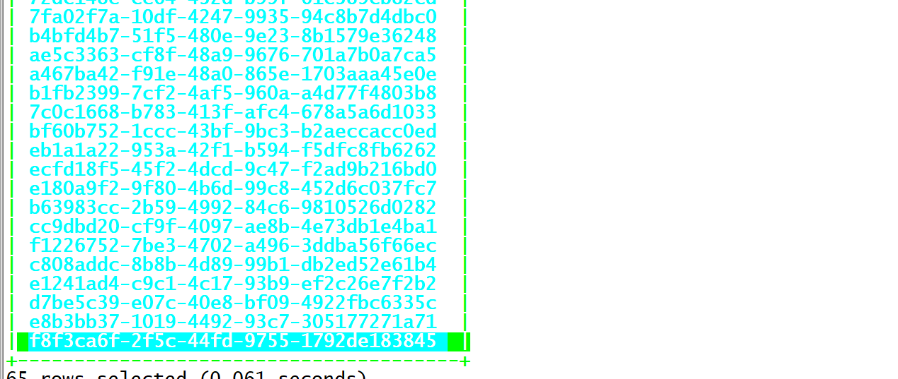

    

  - Hbase中查看

    ```
     scan 'ORDER_DTL'
    ```

    

- **小结**：由Phoenix来实现自动对Rowkey编码，解决Rowkey的热点问题，不需要自己设计散列的Rowkey

  - **注意：**一旦使用了盐表，**对于盐表数据的操作只能通过Phoenix来实现**
  - 盐表不能自己指定分区段，由Phoenix自己根据自己规则来实现

  

## 知识点20：【理解】Phoenix的使用：视图

- **目标**：**理解Phoenix中视图的使用**

- **实施**

  - 问题：直接关联Hbase中的表，会导致误删除，对数据的权限会有影响，容易出现问题，如何避免？

  - Phoenix中建议使用视图的方式来关联Hbase中已有的表

  - 通过构建关联视图，可以解决大部分数据查询的数据，不影响数据

  - 视图：理解为只读的表

  - 实现测试

    - 删除Phoenix中的ORDER_INFO

      ```sql
      drop table if exists ORDER_INFO;
      ```

    - 观察Hbase中的ORDER_INFO

      - Hbase中的表也会被删除

    - 重新加载

      ```
      hbase shell ORDER_INFO.txt 
      ```

    - 创建视图，关联Hbase中已经存在的表

      ```sql
      create view if not exists ORDER_INFO(
      "id" varchar primary key,
      "C1"."USER_ID" varchar,
      "C1"."OPERATION_DATE" varchar,
      "C1"."PAYWAY" varchar,
      "C1"."PAY_MONEY" varchar,
      "C1"."STATUS" varchar,
      "C1"."CATEGORY" varchar
      ) ;
      ```

    - 查询数据

      ```sql
      select "id",user_id,payway,category from order_info;
      ```

    - 应用场景

      - 视图：Hbase中已经有这张表，写都是操作Hbase，Phoenix只提供读
      - 建表：对这张表既要读也要使用Phoenix来写

- **小结**：理解Phoenix中视图的使用

  

## 知识点21：【理解】Phoenix的使用：JDBC

- **目标**：理解Phoenix的JDBC的使用

- **实施**

  - 问题：工作中实际使用SQL，会基于程序中使用JDBC的方式来提交SQL语句，在Phoenix中如何实现？

  - Phoenix支持使用JDBC的方式来提交SQL语句

    ```
    //JDBC
    step1：申明驱动类，获取连接Connection
    step2：获取PrepareStatement语句对象
    step3：构建SQL语句，使用prep执行SQL语句
    step4：释放资源
    ```

  - **注意：在resource中要添加hbase-site.xml配置文件**

  - 构建JDBC连接Phoenix

    ```java
    package bigdata.itcast.cn.hbase.phoenix.jdbc;
    
    import org.apache.phoenix.jdbc.PhoenixDriver;
    
    import java.sql.*;
    /**
    
       * @ClassName HbasePhoenixJDBCTest
    
     * @Description TODO 测试Phoenix JDBC的使用
    
       * @Create By     Frank
         */
          public class HbasePhoenixJDBCTest {
          public static void main(String[] args) throws SQLException {
             Connection connection = null;
             PreparedStatement ps = null;
             try {
                 Class.forName(PhoenixDriver.class.getName());
                 connection = DriverManager.getConnection("jdbc:phoenix:node1.itcast.cn:2181");
                 ps = connection.prepareStatement( "select user_id,payway,category from order_info");
                 ResultSet rs = ps.executeQuery();
                 while(rs.next()) {
                     System.out.println(
                             rs.getString("USER_ID")+"\t"+
                             rs.getString("PAYWAY")+"\t"+
                             rs.getString("CATEGORY"));
                 }
             }catch (Exception e){
                 e.printStackTrace();
             }finally {
                 if(ps != null) ps.close();
                 if(connection != null) connection.close();
             }
    
         }
          }
    ```

    - 运行查看结果

      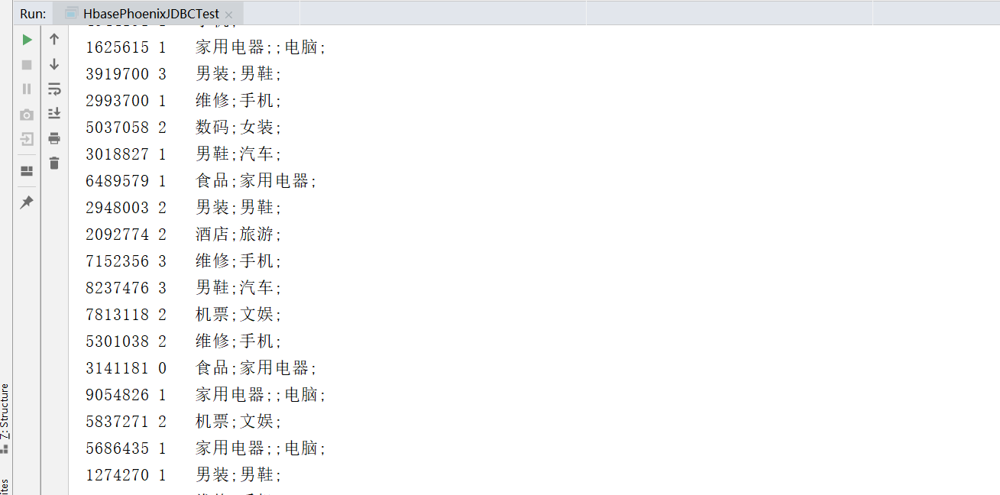

- **小结**：Phoenix支持JDBC方式提交SQL语句实现数据处理


# 附录一：Maven依赖

```xml
    <repositories>
        <repository>
            <id>aliyun</id>
            <url>http://maven.aliyun.com/nexus/content/groups/public/</url>
        </repository>
    </repositories>

    <dependencies>
        <dependency>
            <groupId>org.apache.hbase</groupId>
            <artifactId>hbase-client</artifactId>
            <version>2.1.2</version>
        </dependency>
        <dependency>
            <groupId>org.apache.hbase</groupId>
            <artifactId>hbase-mapreduce</artifactId>
            <version>2.1.2</version>
        </dependency>
        <dependency>
            <groupId>org.apache.hadoop</groupId>
            <artifactId>hadoop-mapreduce-client-jobclient</artifactId>
            <version>2.7.5</version>
        </dependency>
        <dependency>
            <groupId>org.apache.hadoop</groupId>
            <artifactId>hadoop-common</artifactId>
            <version>2.7.5</version>
        </dependency>
        <dependency>
            <groupId>org.apache.hadoop</groupId>
            <artifactId>hadoop-mapreduce-client-core</artifactId>
            <version>2.7.5</version>
        </dependency>
        <dependency>
            <groupId>org.apache.hadoop</groupId>
            <artifactId>hadoop-auth</artifactId>
            <version>2.7.5</version>
        </dependency>
        <dependency>
            <groupId>org.apache.hadoop</groupId>
            <artifactId>hadoop-hdfs</artifactId>
            <version>2.7.5</version>
        </dependency>
        <dependency>
            <groupId>commons-io</groupId>
            <artifactId>commons-io</artifactId>
            <version>2.6</version>
        </dependency>
        <!-- JUnit 4 依赖 -->
        <dependency>
            <groupId>junit</groupId>
            <artifactId>junit</artifactId>
            <version>4.13</version>
        </dependency>
        <!-- phoenix core -->
        <dependency>
            <groupId>org.apache.phoenix</groupId>
            <artifactId>phoenix-core</artifactId>
            <version>5.0.0-HBase-2.0</version>
        </dependency>
        <!-- phoenix 客户端 -->
        <dependency>
            <groupId>org.apache.phoenix</groupId>
            <artifactId>phoenix-queryserver-client</artifactId>
            <version>5.0.0-HBase-2.0</version>
        </dependency>
    </dependencies>
```

