# 分布式面向列的NoSQL数据库Hbase（五）

## 知识点01：课程回顾

1. BulkLoad
   - 功能：将数据直接转换成HFile文件，直接放入表中，不经过内存
   - 场景：短时间内大量数据写入Hbase表，离线应用中
   - 流程：a-将数据生成HFILE文件【HfileOutputFormat2】 b-将HFile加载到表中
2. SQL  on  Hbase
   - 问题：a-Hbase不支持SQL，使用成本比较高，b-不知道Rowkey前缀，无法实现索引查询
   - 需求：a-实现SQL on Hbase，b-构建二级索引
   - Hive on Hbase
     - 设计：使用Hbase来替代Hive表底层存储
     - 本质：构建了一层映射关系，通过Hadoop中读写Hbase类来实现
     - 优点：底层有计算引擎，SQL比较完善，实现对Hbase大数据量分析处理
     - 缺点：不适合做即席查询，不支持构建二级索引
     - 场景：离线场景中，利用Hbase提高数仓读写性能，实现分布式数据分析处理，或者使用SQL处理半结构化数据
   - Phoenix on Hbase
     - 设计：为了解决Hbase在使用过程中遇到的两个问题，专门为Hbase设计的工具
     - 本质：底层直接基于Hbase原生API来构建，并且封装了大量的协处理器
     - 优点：查询性能相对较快，数据存储读写功能比较强大，例如二级索引
     - 缺点：SQL语法不是很完善，没有分布式计算引擎，不能实现非常复杂转换处理
     - 场景：即席查询


## 知识点02：课程目标

1. Phoenix常用DDL和DML
   - 目标：理解DDL和掌握DML、**DQL用法**
2. 二级索引以及Phoenix实现二级索引
   - 目标：==**掌握二级索引设计**==以及Phoenix构建全局索引、覆盖索引、本地索引


# ==【模块一：Phoenix的基础语法】==

## 知识点03：【理解】Phoenix的DDL语法：NS

- **目标**：实现基于SQL的数据库管理：创建、切换、删除

  - http://phoenix.apache.org/language/index.html

- **实施**

  - 创建NS

    ```
    create schema if not exists student;
    ```

  - 切换NS

    ```
    use student;
    ```

  - 删除NS

    ```
    drop schema if exists student;
    ```

    

- **小结**：基本与SQL语法一致

  - ==**注意：Phoenix中默认会将所有字符转换为大写，如果想要使用小写字母，必须加上双引号**==


## 知识点04：【理解】Phoenix的DDL语法：Table

- **目标**：实现基于SQL的数据表管理：创建、列举、查看、删除

- **实施**

  - **列举**：默认不会主动集成Hbase中已有的表

    ```
    !tables
    ```

    

  - **创建**

    - 语法：http://phoenix.apache.org/language/index.html#create_table

    - 类型：https://phoenix.apache.org/language/datatypes.html

    - **注意规则**

      - 建表的时候需要指定字段：SQL中的表中列是固定的
      - 谁是primary key谁就是rowkey，每张表必须有主键
      - 定义字段时，要指定列族，列族的属性可以在建表语句中指定
      - split：指定建表构建多个分区，每个分区段划分

      ```sql
       CREATE TABLE my_schema.my_table (
           id BIGINT not null primary key, 
           date Date
       );
      
       CREATE TABLE my_table ( 
           id INTEGER not null primary key desc, 
           m.date DATE not null,
           m.db_utilization DECIMAL, 
           i.db_utilization
       ) m.VERSIONS='3';
      
       CREATE TABLE stats.prod_metrics ( 
           host char(50) not null, 
           created_date date not null,
           txn_count bigint 
           CONSTRAINT pk PRIMARY KEY (host, created_date) 
       );
      
         CREATE TABLE IF NOT EXISTS "my_case_sensitive_table"( 
             "id" char(10) not null primary key, 
             "value" integer
         ) DATA_BLOCK_ENCODING='NONE',VERSIONS=5,MAX_FILESIZE=2000000 
         split on (?, ?, ?);
      
      
         CREATE TABLE IF NOT EXISTS my_schema.my_table (
             org_id CHAR(15), 
             entity_id CHAR(15), 
             payload binary(1000),
             CONSTRAINT pk PRIMARY KEY (org_id, entity_id) 
         ) TTL=86400
      ```

    - 如果Hbase中没有这个表【很少用】

      ```sql
       use default;
       create table if not exists ORDER_DTL(
           ID varchar primary key,
           C1.STATUS varchar,
           C1.PAY_MONEY float,
           C1.PAYWAY integer,
           C1.USER_ID varchar,
           C1.OPERATION_DATE varchar,
           C1.CATEGORY varchar
       );
      ```

      

    - ==如果Hbase中已存在会自动关联【**常用**】==

      - 上传ORDER_INFO.txt 到node1上

      - Hbase中建表并导入数据

        ```
      hbase shell ORDER_INFO.txt 
        ```

      - Phoenix中建表

        ```sql
        create table if not exists ORDER_INFO(
        "id" varchar primary key,
        "C1"."USER_ID" varchar,
        "C1"."OPERATION_DATE" varchar,
        "C1"."PAYWAY" varchar,
        "C1"."PAY_MONEY" varchar,
        "C1"."STATUS" varchar,
        "C1"."CATEGORY" varchar
      ) column_encoded_bytes=0;
        ```
      
      - 表名与列名都必须一致，大小写严格区分

  - 查看

    ```
   !desc order_info;
    ```

    

  - 删除

    ```
  drop table if exists order_dtl;
    ```

    

- **小结**：注意：创建表时，必须指定主键作为Rowkey，主键列不能加列族

  - Phoenix 4.8版本之前只要创建同名的Hbase表，会自动关联数据

  - Phoenix 4.8版本以后，不推荐关联表的方式

  - 推荐使用视图关联的方式来实现，如果你要使用关联表的方式，必须加上以下参数

    ```
    column_encoded_bytes=0 ;
    ```

  


## 知识点05：【理解】Phoenix的DML语法：upsert

- **目标**：基于order_info订单数据实现DML插入数据

- **实施**

  - 语法及示例

    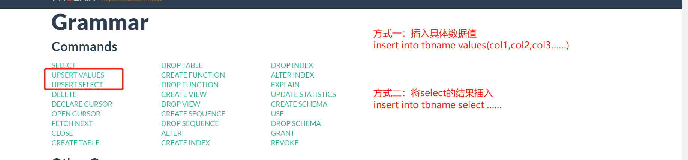

    

    ```sql
    UPSERT INTO TEST VALUES('foo','bar',3);
    UPSERT INTO TEST(NAME,ID) VALUES('foo',123);
    UPSERT INTO TEST(ID, COUNTER) VALUES(123, 0) ON DUPLICATE KEY UPDATE COUNTER = COUNTER + 1;
    UPSERT INTO TEST(ID, MY_COL) VALUES(123, 0) ON DUPLICATE KEY IGNORE;
    ```

  - 插入一条数据

    ```sql
    upsert into order_info values('z8f3ca6f-2f5c-44fd-9755-1792de183845','4944191','2020-04-25 12:09:16','1','4070','未提交','电脑');
    ```

  - 更新USERID为123456【更新语句必须指定rowkey】

    ```sql
    upsert into order_info("id","USER_ID") values('z8f3ca6f-2f5c-44fd-9755-1792de183845','123456');
    ```

- **小结**：语法类似于insert语法，功能等同于insert + update

  

## 知识点06：【理解】Phoenix的DML语法：delete

- **目标**：基于order_info订单数据实现DML删除数据

- **实施**

  - 语法及示例

    ```sql
    DELETE FROM TEST;
    DELETE FROM TEST WHERE ID=123;
    DELETE FROM TEST WHERE NAME LIKE 'foo%';
    ```

  - 删除USER_ID为123456的rowkey数据

    ```sql
    delete from order_info where USER_ID = '123456';
    ```

- **总结**：与MySQL是一致的

  

## 知识点07：【理解】Phoenix的DQL语法：select

- **需求**：基于order_info订单数据实现DQL查询数据

- **实现**

  - 语法及示例

    ```sql
    SELECT * FROM TEST LIMIT 1000;
    SELECT * FROM TEST LIMIT 1000 OFFSET 100;
    SELECT full_name FROM SALES_PERSON WHERE ranking >= 5.0 UNION ALL SELECT reviewer_name FROM CUSTOMER_REVIEW WHERE score >= 8.0
    ```

  - 查询支付方式为1的数据

    ```sql
    select "id",payway,pay_money,category from order_info where payway = '1';
    ```

  - 查询每种支付方式对应的用户人数，并且按照用户人数降序排序

    ```SQL 
    select
        payway,
        count(distinct user_id) as numb
    from order_info
    group by payway 
    order by numb desc;
    ```

  - 查询数据的第60行到66行

    ```sql
    --以前的写法：limit M,N
    --M：开始位置，默认为0，一般从头开始，就省略
    --N：显示的条数
    --Phoenix的写法：limit N offset M
    select * from order_info limit 6 offset 60;//总共66行，显示最后6行
    ```

  - 子查询：https://phoenix.apache.org/subqueries.html

    ```sql
    -- 条件子查询
    select 
      * 
    from order_info 
    where pay_money > (
       select max(pay_money) from order_info where  payway = '2'
    );
    ```

  - Join支持：https://phoenix.apache.org/joins.html

    ```sql
    -- 表join
    select a.user_id,b.payway from order_info a join order_info b on a."id" = b."id" ;
    -- 子查询join
    select 
        a.user_id,b.payway 
    from order_info a join ( select "id",payway from order_info where payway = '1' ) b on a."id" = b."id";
    ```

  - 函数支持：http://phoenix.apache.org/language/functions.html

- **小结**：基本查询与MySQL也是一致的，如果遇到SQL报错，检查语法是否支持【重点关注函数是否支持】


## 知识点08：【理解】Phoenix的使用：预分区

- **目标**：创建表的时候，需要根据Rowkey来设计多个分区

- **实现**

  - Hbase命令建表

    ```
     create Ns;tbname,列族，预分区
    ```

  - Phoenix也提供了创建表时，指定分区范围的语法

    ```sql
     CREATE TABLE IF NOT EXISTS "my_case_sensitive_table"( 
         "id" char(10) not null primary key, 
         "value" integer
     )
     DATA_BLOCK_ENCODING='NONE',VERSIONS=5,MAX_FILESIZE=2000000 split on (?, ?, ?)
    ```

  - 创建数据表，四个分区

    ```sql
     drop table if exists ORDER_DTL;
     create table if not exists ORDER_DTL(
         "id" varchar primary key,
         C1."status" varchar,
         C1."money" float,
         C1."pay_way" integer,
         C1."user_id" varchar,
         C1."operation_time" varchar,
         C1."category" varchar
     ) 
     CONPRESSION='GZ'
     SPLIT ON ('3','5','7');
    ```

    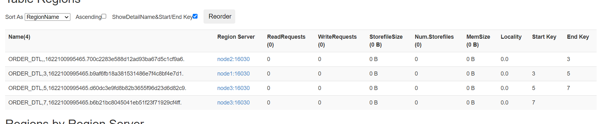

  - 插入数据

    ```sql
    UPSERT INTO "ORDER_DTL" VALUES('02602f66-adc7-40d4-8485-76b5632b5b53','已提交',4070,1,'4944191','2020-04-25 12:09:16','手机;');
    UPSERT INTO "ORDER_DTL" VALUES('0968a418-f2bc-49b4-b9a9-2157cf214cfd','已完成',4350,1,'1625615','2020-04-25 12:09:37','家用电器;;电脑;');
    UPSERT INTO "ORDER_DTL" VALUES('0e01edba-5e55-425e-837a-7efb91c56630','已提交',6370,3,'3919700','2020-04-25 12:09:39','男装;男鞋;');
    UPSERT INTO "ORDER_DTL" VALUES('0f46d542-34cb-4ef4-b7fe-6dcfa5f14751','已付款',9380,1,'2993700','2020-04-25 12:09:46','维修;手机;');
    UPSERT INTO "ORDER_DTL" VALUES('1fb7c50f-9e26-4aa8-a140-a03d0de78729','已完成',6400,2,'5037058','2020-04-25 12:10:13','数码;女装;');
    UPSERT INTO "ORDER_DTL" VALUES('23275016-996b-420c-8edc-3e3b41de1aee','已付款',280,1,'3018827','2020-04-25 12:09:53','男鞋;汽车;');
    UPSERT INTO "ORDER_DTL" VALUES('2375a7cf-c206-4ac0-8de4-863e7ffae27b','已完成',5600,1,'6489579','2020-04-25 12:08:55','食品;家用电器;');
    UPSERT INTO "ORDER_DTL" VALUES('269fe10c-740b-4fdb-ad25-7939094073de','已提交',8340,2,'2948003','2020-04-25 12:09:26','男装;男鞋;');
    UPSERT INTO "ORDER_DTL" VALUES('2849fa34-6513-44d6-8f66-97bccb3a31a1','已提交',7060,2,'2092774','2020-04-25 12:09:38','酒店;旅游;');
    UPSERT INTO "ORDER_DTL" VALUES('28b7e793-6d14-455b-91b3-0bd8b23b610c','已提交',640,3,'7152356','2020-04-25 12:09:49','维修;手机;');
    UPSERT INTO "ORDER_DTL" VALUES('2909b28a-5085-4f1d-b01e-a34fbaf6ce37','已提交',9390,3,'8237476','2020-04-25 12:10:08','男鞋;汽车;');
    UPSERT INTO "ORDER_DTL" VALUES('2a01dfe5-f5dc-4140-b31b-a6ee27a6e51e','已提交',7490,2,'7813118','2020-04-25 12:09:05','机票;文娱;');
    UPSERT INTO "ORDER_DTL" VALUES('2b86ab90-3180-4940-b624-c936a1e7568d','已付款',5360,2,'5301038','2020-04-25 12:08:50','维修;手机;');
    UPSERT INTO "ORDER_DTL" VALUES('2e19fbe8-7970-4d62-8e8f-d364afc2dd41','已付款',6490,0,'3141181','2020-04-25 12:09:22','食品;家用电器;');
    UPSERT INTO "ORDER_DTL" VALUES('2fc28d36-dca0-49e8-bad0-42d0602bdb40','已付款',3820,1,'9054826','2020-04-25 12:10:04','家用电器;;电脑;');
    UPSERT INTO "ORDER_DTL" VALUES('31477850-8b15-4f1b-9ec3-939f7dc47241','已提交',4650,2,'5837271','2020-04-25 12:08:52','机票;文娱;');
    UPSERT INTO "ORDER_DTL" VALUES('39319322-2d80-41e7-a862-8b8858e63316','已提交',5000,1,'5686435','2020-04-25 12:08:51','家用电器;;电脑;');
    UPSERT INTO "ORDER_DTL" VALUES('3d2254bd-c25a-404f-8e42-2faa4929a629','已完成',5000,1,'1274270','2020-04-25 12:08:43','男装;男鞋;');
    UPSERT INTO "ORDER_DTL" VALUES('42f7fe21-55a3-416f-9535-baa222cc0098','已完成',3600,2,'2661641','2020-04-25 12:09:58','维修;手机;');
    UPSERT INTO "ORDER_DTL" VALUES('44231dbb-9e58-4f1a-8c83-be1aa814be83','已提交',3950,1,'3855371','2020-04-25 12:08:39','数码;女装;');
    UPSERT INTO "ORDER_DTL" VALUES('526e33d2-a095-4e19-b759-0017b13666ca','已完成',3280,0,'5553283','2020-04-25 12:09:01','食品;家用电器;');
    UPSERT INTO "ORDER_DTL" VALUES('5a6932f4-b4a4-4a1a-b082-2475d13f9240','已提交',50,2,'1764961','2020-04-25 12:10:07','家用电器;;电脑;');
    UPSERT INTO "ORDER_DTL" VALUES('5fc0093c-59a3-417b-a9ff-104b9789b530','已提交',6310,2,'1292805','2020-04-25 12:09:36','男装;男鞋;');
    UPSERT INTO "ORDER_DTL" VALUES('605c6dd8-123b-4088-a047-e9f377fcd866','已完成',8980,2,'6202324','2020-04-25 12:09:54','机票;文娱;');
    UPSERT INTO "ORDER_DTL" VALUES('613cfd50-55c7-44d2-bb67-995f72c488ea','已完成',6830,3,'6977236','2020-04-25 12:10:06','酒店;旅游;');
    UPSERT INTO "ORDER_DTL" VALUES('62246ac1-3dcb-4f2c-8943-800c9216c29f','已提交',8610,1,'5264116','2020-04-25 12:09:14','维修;手机;');
    UPSERT INTO "ORDER_DTL" VALUES('625c7fef-de87-428a-b581-a63c71059b14','已提交',5970,0,'8051757','2020-04-25 12:09:07','男鞋;汽车;');
    UPSERT INTO "ORDER_DTL" VALUES('6d43c490-58ab-4e23-b399-dda862e06481','已提交',4570,0,'5514248','2020-04-25 12:09:34','酒店;旅游;');
    UPSERT INTO "ORDER_DTL" VALUES('70fa0ae0-6c02-4cfa-91a9-6ad929fe6b1b','已付款',4100,1,'8598963','2020-04-25 12:09:08','维修;手机;');
    UPSERT INTO "ORDER_DTL" VALUES('7170ce71-1fc0-4b6e-a339-67f525536dcd','已完成',9740,1,'4816392','2020-04-25 12:09:51','数码;女装;');
    UPSERT INTO "ORDER_DTL" VALUES('71961b06-290b-457d-bbe0-86acb013b0e3','已完成',6550,3,'2393699','2020-04-25 12:08:49','男鞋;汽车;');
    UPSERT INTO "ORDER_DTL" VALUES('72dc148e-ce64-432d-b99f-61c389cb82cd','已提交',4090,1,'2536942','2020-04-25 12:10:12','机票;文娱;');
    UPSERT INTO "ORDER_DTL" VALUES('7c0c1668-b783-413f-afc4-678a5a6d1033','已完成',3850,3,'6803936','2020-04-25 12:09:20','酒店;旅游;');
    UPSERT INTO "ORDER_DTL" VALUES('7fa02f7a-10df-4247-9935-94c8b7d4dbc0','已提交',1060,0,'6119810','2020-04-25 12:09:21','维修;手机;');
    UPSERT INTO "ORDER_DTL" VALUES('820c5e83-f2e0-42d4-b5f0-83802c75addc','已付款',9270,2,'5818454','2020-04-25 12:10:09','数码;女装;');
    UPSERT INTO "ORDER_DTL" VALUES('83ed55ec-a439-44e0-8fe0-acb7703fb691','已完成',8380,2,'6804703','2020-04-25 12:09:52','男鞋;汽车;');
    UPSERT INTO "ORDER_DTL" VALUES('85287268-f139-4d59-8087-23fa6454de9d','已取消',9750,1,'4382852','2020-04-25 12:10:00','数码;女装;');
    UPSERT INTO "ORDER_DTL" VALUES('8d32669e-327a-4802-89f4-2e91303aee59','已提交',9390,1,'4182962','2020-04-25 12:09:57','机票;文娱;');
    UPSERT INTO "ORDER_DTL" VALUES('8dadc2e4-63f1-490f-9182-793be64fed76','已付款',9350,1,'5937549','2020-04-25 12:09:02','酒店;旅游;');
    UPSERT INTO "ORDER_DTL" VALUES('94ad8ee0-8898-442c-8cb1-083a4b609616','已提交',4370,0,'4666456','2020-04-25 12:09:13','维修;手机;');
    UPSERT INTO "ORDER_DTL" VALUES('994cbb44-f0ee-45ff-a4f4-76c87bc2b972','已付款',3190,3,'3200759','2020-04-25 12:09:25','数码;女装;');
    UPSERT INTO "ORDER_DTL" VALUES('9ff3032c-8679-4247-9e6f-4caf2dc93aff','已提交',850,0,'8835231','2020-04-25 12:09:40','男鞋;汽车;');
    UPSERT INTO "ORDER_DTL" VALUES('9ff4032c-1223-4247-9e6f-123456dfdsds','已付款',850,0,'8835231','2020-04-25 12:09:45','食品;家用电器;');
    UPSERT INTO "ORDER_DTL" VALUES('a467ba42-f91e-48a0-865e-1703aaa45e0e','已提交',8040,0,'8206022','2020-04-25 12:09:50','家用电器;;电脑;');
    UPSERT INTO "ORDER_DTL" VALUES('a5302f47-96d9-41b4-a14c-c7a508f59282','已付款',8570,2,'5319315','2020-04-25 12:08:44','机票;文娱;');
    UPSERT INTO "ORDER_DTL" VALUES('a5b57bec-6235-45f4-bd7e-6deb5cd1e008','已提交',5700,3,'6486444','2020-04-25 12:09:27','酒店;旅游;');
    UPSERT INTO "ORDER_DTL" VALUES('ae5c3363-cf8f-48a9-9676-701a7b0a7ca5','已付款',7460,1,'2379296','2020-04-25 12:09:23','维修;手机;');
    UPSERT INTO "ORDER_DTL" VALUES('b1fb2399-7cf2-4af5-960a-a4d77f4803b8','已提交',2690,3,'6686018','2020-04-25 12:09:55','数码;女装;');
    UPSERT INTO "ORDER_DTL" VALUES('b21c7dbd-dabd-4610-94b9-d7039866a8eb','已提交',6310,2,'1552851','2020-04-25 12:09:15','男鞋;汽车;');
    UPSERT INTO "ORDER_DTL" VALUES('b4bfd4b7-51f5-480e-9e23-8b1579e36248','已提交',4000,1,'3260372','2020-04-25 12:09:35','机票;文娱;');
    UPSERT INTO "ORDER_DTL" VALUES('b63983cc-2b59-4992-84c6-9810526d0282','已提交',7370,3,'3107867','2020-04-25 12:08:45','数码;女装;');
    UPSERT INTO "ORDER_DTL" VALUES('bf60b752-1ccc-43bf-9bc3-b2aeccacc0ed','已提交',720,2,'5034117','2020-04-25 12:09:03','机票;文娱;');
    UPSERT INTO "ORDER_DTL" VALUES('c808addc-8b8b-4d89-99b1-db2ed52e61b4','已提交',3630,1,'6435854','2020-04-25 12:09:10','酒店;旅游;');
    UPSERT INTO "ORDER_DTL" VALUES('cc9dbd20-cf9f-4097-ae8b-4e73db1e4ba1','已付款',5000,0,'2007322','2020-04-25 12:08:38','维修;手机;');
    UPSERT INTO "ORDER_DTL" VALUES('ccceaf57-a5ab-44df-834a-e7b32c63efc1','已提交',2660,2,'7928516','2020-04-25 12:09:42','数码;女装;');
    UPSERT INTO "ORDER_DTL" VALUES('d7be5c39-e07c-40e8-bf09-4922fbc6335c','已付款',8750,2,'1250995','2020-04-25 12:09:09','食品;家用电器;');
    UPSERT INTO "ORDER_DTL" VALUES('dfe16df7-4a46-4b6f-9c6d-083ec215218e','已完成',410,0,'1923817','2020-04-25 12:09:56','家用电器;;电脑;');
    UPSERT INTO "ORDER_DTL" VALUES('e1241ad4-c9c1-4c17-93b9-ef2c26e7f2b2','已付款',6760,0,'2457464','2020-04-25 12:08:54','数码;女装;');
    UPSERT INTO "ORDER_DTL" VALUES('e180a9f2-9f80-4b6d-99c8-452d6c037fc7','已完成',8120,2,'7645270','2020-04-25 12:09:32','男鞋;汽车;');
    UPSERT INTO "ORDER_DTL" VALUES('e4418843-9ac0-47a7-bfd8-d61c4d296933','已付款',8170,2,'7695668','2020-04-25 12:09:11','家用电器;;电脑;');
    UPSERT INTO "ORDER_DTL" VALUES('e8b3bb37-1019-4492-93c7-305177271a71','已完成',2560,2,'4405460','2020-04-25 12:10:05','男装;男鞋;');
    UPSERT INTO "ORDER_DTL" VALUES('eb1a1a22-953a-42f1-b594-f5dfc8fb6262','已完成',2370,2,'8233485','2020-04-25 12:09:24','机票;文娱;');
    UPSERT INTO "ORDER_DTL" VALUES('ecfd18f5-45f2-4dcd-9c47-f2ad9b216bd0','已付款',8070,3,'6387107','2020-04-25 12:09:04','酒店;旅游;');
    UPSERT INTO "ORDER_DTL" VALUES('f1226752-7be3-4702-a496-3ddba56f66ec','已付款',4410,3,'1981968','2020-04-25 12:10:10','维修;手机;');
    UPSERT INTO "ORDER_DTL" VALUES('f642b16b-eade-4169-9eeb-4d5f294ec594','已提交',4010,1,'6463215','2020-04-25 12:09:29','男鞋;汽车;');
    UPSERT INTO "ORDER_DTL" VALUES('f8f3ca6f-2f5c-44fd-9755-1792de183845','已付款',5950,3,'4060214','2020-04-25 12:09:12','机票;文娱;');
    ```

  - 查看分区请求

    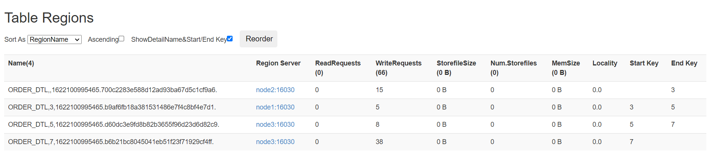

- **小结**：实现效果与命令实现的效果一致

  

## 知识点09：【理解】Phoenix的使用：加盐salt

- **目标**：Rowkey设计的时候为了避免连续，构建Rowkey的散列，如果rowkey设计是连续的，怎么解决？

- **实现**

  - 正常表

    - tb1:3个分区
    - r1：-oo ~ 3
    - r2:    3 ~ 6
    - r3:    6 ~ +oo
    - rowkey：数值开头

  - 盐表

    - t2:3个分区，不允许指定每个分区的段
    - 自动给每个分区的前缀是16进制的值
    - rowkey：数值开头，但是**Phoenix会自动为每个rowkey前面加上一个16进制的值**

  - 在Phoenix创建一张**==盐表==**，写入的数据会自动进行编码写入不同的分区中

    ```sql
     CREATE TABLE table (
         a_key VARCHAR PRIMARY KEY, 
         a_col VARCHAR
     ) SALT_BUCKETS = 20;
    ```

  - 创建一张盐表，指定分区个数为10

    ```sql
     drop table if exists ORDER_DTL;
     create table if not exists ORDER_DTL(
         "id" varchar primary key,
         C1."status" varchar,
         C1."money" float,
         C1."pay_way" integer,
         C1."user_id" varchar,
         C1."operation_time" varchar,
         C1."category" varchar
     ) 
     CONPRESSION='GZ', SALT_BUCKETS=10;
    ```

    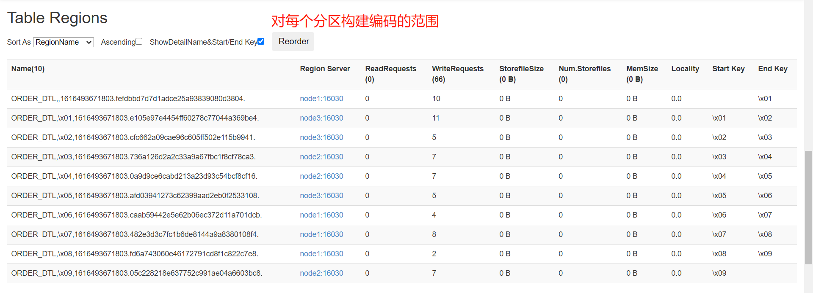

  - 写入数据

    ```sql
    UPSERT INTO "ORDER_DTL" VALUES('02602f66-adc7-40d4-8485-76b5632b5b53','已提交',4070,1,'4944191','2020-04-25 12:09:16','手机;');
    UPSERT INTO "ORDER_DTL" VALUES('0968a418-f2bc-49b4-b9a9-2157cf214cfd','已完成',4350,1,'1625615','2020-04-25 12:09:37','家用电器;;电脑;');
    UPSERT INTO "ORDER_DTL" VALUES('0e01edba-5e55-425e-837a-7efb91c56630','已提交',6370,3,'3919700','2020-04-25 12:09:39','男装;男鞋;');
    UPSERT INTO "ORDER_DTL" VALUES('0f46d542-34cb-4ef4-b7fe-6dcfa5f14751','已付款',9380,1,'2993700','2020-04-25 12:09:46','维修;手机;');
    UPSERT INTO "ORDER_DTL" VALUES('1fb7c50f-9e26-4aa8-a140-a03d0de78729','已完成',6400,2,'5037058','2020-04-25 12:10:13','数码;女装;');
    UPSERT INTO "ORDER_DTL" VALUES('23275016-996b-420c-8edc-3e3b41de1aee','已付款',280,1,'3018827','2020-04-25 12:09:53','男鞋;汽车;');
    UPSERT INTO "ORDER_DTL" VALUES('2375a7cf-c206-4ac0-8de4-863e7ffae27b','已完成',5600,1,'6489579','2020-04-25 12:08:55','食品;家用电器;');
    UPSERT INTO "ORDER_DTL" VALUES('269fe10c-740b-4fdb-ad25-7939094073de','已提交',8340,2,'2948003','2020-04-25 12:09:26','男装;男鞋;');
    UPSERT INTO "ORDER_DTL" VALUES('2849fa34-6513-44d6-8f66-97bccb3a31a1','已提交',7060,2,'2092774','2020-04-25 12:09:38','酒店;旅游;');
    UPSERT INTO "ORDER_DTL" VALUES('28b7e793-6d14-455b-91b3-0bd8b23b610c','已提交',640,3,'7152356','2020-04-25 12:09:49','维修;手机;');
    UPSERT INTO "ORDER_DTL" VALUES('2909b28a-5085-4f1d-b01e-a34fbaf6ce37','已提交',9390,3,'8237476','2020-04-25 12:10:08','男鞋;汽车;');
    UPSERT INTO "ORDER_DTL" VALUES('2a01dfe5-f5dc-4140-b31b-a6ee27a6e51e','已提交',7490,2,'7813118','2020-04-25 12:09:05','机票;文娱;');
    UPSERT INTO "ORDER_DTL" VALUES('2b86ab90-3180-4940-b624-c936a1e7568d','已付款',5360,2,'5301038','2020-04-25 12:08:50','维修;手机;');
    UPSERT INTO "ORDER_DTL" VALUES('2e19fbe8-7970-4d62-8e8f-d364afc2dd41','已付款',6490,0,'3141181','2020-04-25 12:09:22','食品;家用电器;');
    UPSERT INTO "ORDER_DTL" VALUES('2fc28d36-dca0-49e8-bad0-42d0602bdb40','已付款',3820,1,'9054826','2020-04-25 12:10:04','家用电器;;电脑;');
    UPSERT INTO "ORDER_DTL" VALUES('31477850-8b15-4f1b-9ec3-939f7dc47241','已提交',4650,2,'5837271','2020-04-25 12:08:52','机票;文娱;');
    UPSERT INTO "ORDER_DTL" VALUES('39319322-2d80-41e7-a862-8b8858e63316','已提交',5000,1,'5686435','2020-04-25 12:08:51','家用电器;;电脑;');
    UPSERT INTO "ORDER_DTL" VALUES('3d2254bd-c25a-404f-8e42-2faa4929a629','已完成',5000,1,'1274270','2020-04-25 12:08:43','男装;男鞋;');
    UPSERT INTO "ORDER_DTL" VALUES('42f7fe21-55a3-416f-9535-baa222cc0098','已完成',3600,2,'2661641','2020-04-25 12:09:58','维修;手机;');
    UPSERT INTO "ORDER_DTL" VALUES('44231dbb-9e58-4f1a-8c83-be1aa814be83','已提交',3950,1,'3855371','2020-04-25 12:08:39','数码;女装;');
    UPSERT INTO "ORDER_DTL" VALUES('526e33d2-a095-4e19-b759-0017b13666ca','已完成',3280,0,'5553283','2020-04-25 12:09:01','食品;家用电器;');
    UPSERT INTO "ORDER_DTL" VALUES('5a6932f4-b4a4-4a1a-b082-2475d13f9240','已提交',50,2,'1764961','2020-04-25 12:10:07','家用电器;;电脑;');
    UPSERT INTO "ORDER_DTL" VALUES('5fc0093c-59a3-417b-a9ff-104b9789b530','已提交',6310,2,'1292805','2020-04-25 12:09:36','男装;男鞋;');
    UPSERT INTO "ORDER_DTL" VALUES('605c6dd8-123b-4088-a047-e9f377fcd866','已完成',8980,2,'6202324','2020-04-25 12:09:54','机票;文娱;');
    UPSERT INTO "ORDER_DTL" VALUES('613cfd50-55c7-44d2-bb67-995f72c488ea','已完成',6830,3,'6977236','2020-04-25 12:10:06','酒店;旅游;');
    UPSERT INTO "ORDER_DTL" VALUES('62246ac1-3dcb-4f2c-8943-800c9216c29f','已提交',8610,1,'5264116','2020-04-25 12:09:14','维修;手机;');
    UPSERT INTO "ORDER_DTL" VALUES('625c7fef-de87-428a-b581-a63c71059b14','已提交',5970,0,'8051757','2020-04-25 12:09:07','男鞋;汽车;');
    UPSERT INTO "ORDER_DTL" VALUES('6d43c490-58ab-4e23-b399-dda862e06481','已提交',4570,0,'5514248','2020-04-25 12:09:34','酒店;旅游;');
    UPSERT INTO "ORDER_DTL" VALUES('70fa0ae0-6c02-4cfa-91a9-6ad929fe6b1b','已付款',4100,1,'8598963','2020-04-25 12:09:08','维修;手机;');
    UPSERT INTO "ORDER_DTL" VALUES('7170ce71-1fc0-4b6e-a339-67f525536dcd','已完成',9740,1,'4816392','2020-04-25 12:09:51','数码;女装;');
    UPSERT INTO "ORDER_DTL" VALUES('71961b06-290b-457d-bbe0-86acb013b0e3','已完成',6550,3,'2393699','2020-04-25 12:08:49','男鞋;汽车;');
    UPSERT INTO "ORDER_DTL" VALUES('72dc148e-ce64-432d-b99f-61c389cb82cd','已提交',4090,1,'2536942','2020-04-25 12:10:12','机票;文娱;');
    UPSERT INTO "ORDER_DTL" VALUES('7c0c1668-b783-413f-afc4-678a5a6d1033','已完成',3850,3,'6803936','2020-04-25 12:09:20','酒店;旅游;');
    UPSERT INTO "ORDER_DTL" VALUES('7fa02f7a-10df-4247-9935-94c8b7d4dbc0','已提交',1060,0,'6119810','2020-04-25 12:09:21','维修;手机;');
    UPSERT INTO "ORDER_DTL" VALUES('820c5e83-f2e0-42d4-b5f0-83802c75addc','已付款',9270,2,'5818454','2020-04-25 12:10:09','数码;女装;');
    UPSERT INTO "ORDER_DTL" VALUES('83ed55ec-a439-44e0-8fe0-acb7703fb691','已完成',8380,2,'6804703','2020-04-25 12:09:52','男鞋;汽车;');
    UPSERT INTO "ORDER_DTL" VALUES('85287268-f139-4d59-8087-23fa6454de9d','已取消',9750,1,'4382852','2020-04-25 12:10:00','数码;女装;');
    UPSERT INTO "ORDER_DTL" VALUES('8d32669e-327a-4802-89f4-2e91303aee59','已提交',9390,1,'4182962','2020-04-25 12:09:57','机票;文娱;');
    UPSERT INTO "ORDER_DTL" VALUES('8dadc2e4-63f1-490f-9182-793be64fed76','已付款',9350,1,'5937549','2020-04-25 12:09:02','酒店;旅游;');
    UPSERT INTO "ORDER_DTL" VALUES('94ad8ee0-8898-442c-8cb1-083a4b609616','已提交',4370,0,'4666456','2020-04-25 12:09:13','维修;手机;');
    UPSERT INTO "ORDER_DTL" VALUES('994cbb44-f0ee-45ff-a4f4-76c87bc2b972','已付款',3190,3,'3200759','2020-04-25 12:09:25','数码;女装;');
    UPSERT INTO "ORDER_DTL" VALUES('9ff3032c-8679-4247-9e6f-4caf2dc93aff','已提交',850,0,'8835231','2020-04-25 12:09:40','男鞋;汽车;');
    UPSERT INTO "ORDER_DTL" VALUES('9ff4032c-1223-4247-9e6f-123456dfdsds','已付款',850,0,'8835231','2020-04-25 12:09:45','食品;家用电器;');
    UPSERT INTO "ORDER_DTL" VALUES('a467ba42-f91e-48a0-865e-1703aaa45e0e','已提交',8040,0,'8206022','2020-04-25 12:09:50','家用电器;;电脑;');
    UPSERT INTO "ORDER_DTL" VALUES('a5302f47-96d9-41b4-a14c-c7a508f59282','已付款',8570,2,'5319315','2020-04-25 12:08:44','机票;文娱;');
    UPSERT INTO "ORDER_DTL" VALUES('a5b57bec-6235-45f4-bd7e-6deb5cd1e008','已提交',5700,3,'6486444','2020-04-25 12:09:27','酒店;旅游;');
    UPSERT INTO "ORDER_DTL" VALUES('ae5c3363-cf8f-48a9-9676-701a7b0a7ca5','已付款',7460,1,'2379296','2020-04-25 12:09:23','维修;手机;');
    UPSERT INTO "ORDER_DTL" VALUES('b1fb2399-7cf2-4af5-960a-a4d77f4803b8','已提交',2690,3,'6686018','2020-04-25 12:09:55','数码;女装;');
    UPSERT INTO "ORDER_DTL" VALUES('b21c7dbd-dabd-4610-94b9-d7039866a8eb','已提交',6310,2,'1552851','2020-04-25 12:09:15','男鞋;汽车;');
    UPSERT INTO "ORDER_DTL" VALUES('b4bfd4b7-51f5-480e-9e23-8b1579e36248','已提交',4000,1,'3260372','2020-04-25 12:09:35','机票;文娱;');
    UPSERT INTO "ORDER_DTL" VALUES('b63983cc-2b59-4992-84c6-9810526d0282','已提交',7370,3,'3107867','2020-04-25 12:08:45','数码;女装;');
    UPSERT INTO "ORDER_DTL" VALUES('bf60b752-1ccc-43bf-9bc3-b2aeccacc0ed','已提交',720,2,'5034117','2020-04-25 12:09:03','机票;文娱;');
    UPSERT INTO "ORDER_DTL" VALUES('c808addc-8b8b-4d89-99b1-db2ed52e61b4','已提交',3630,1,'6435854','2020-04-25 12:09:10','酒店;旅游;');
    UPSERT INTO "ORDER_DTL" VALUES('cc9dbd20-cf9f-4097-ae8b-4e73db1e4ba1','已付款',5000,0,'2007322','2020-04-25 12:08:38','维修;手机;');
    UPSERT INTO "ORDER_DTL" VALUES('ccceaf57-a5ab-44df-834a-e7b32c63efc1','已提交',2660,2,'7928516','2020-04-25 12:09:42','数码;女装;');
    UPSERT INTO "ORDER_DTL" VALUES('d7be5c39-e07c-40e8-bf09-4922fbc6335c','已付款',8750,2,'1250995','2020-04-25 12:09:09','食品;家用电器;');
    UPSERT INTO "ORDER_DTL" VALUES('dfe16df7-4a46-4b6f-9c6d-083ec215218e','已完成',410,0,'1923817','2020-04-25 12:09:56','家用电器;;电脑;');
    UPSERT INTO "ORDER_DTL" VALUES('e1241ad4-c9c1-4c17-93b9-ef2c26e7f2b2','已付款',6760,0,'2457464','2020-04-25 12:08:54','数码;女装;');
    UPSERT INTO "ORDER_DTL" VALUES('e180a9f2-9f80-4b6d-99c8-452d6c037fc7','已完成',8120,2,'7645270','2020-04-25 12:09:32','男鞋;汽车;');
    UPSERT INTO "ORDER_DTL" VALUES('e4418843-9ac0-47a7-bfd8-d61c4d296933','已付款',8170,2,'7695668','2020-04-25 12:09:11','家用电器;;电脑;');
    UPSERT INTO "ORDER_DTL" VALUES('e8b3bb37-1019-4492-93c7-305177271a71','已完成',2560,2,'4405460','2020-04-25 12:10:05','男装;男鞋;');
    UPSERT INTO "ORDER_DTL" VALUES('eb1a1a22-953a-42f1-b594-f5dfc8fb6262','已完成',2370,2,'8233485','2020-04-25 12:09:24','机票;文娱;');
    UPSERT INTO "ORDER_DTL" VALUES('ecfd18f5-45f2-4dcd-9c47-f2ad9b216bd0','已付款',8070,3,'6387107','2020-04-25 12:09:04','酒店;旅游;');
    UPSERT INTO "ORDER_DTL" VALUES('f1226752-7be3-4702-a496-3ddba56f66ec','已付款',4410,3,'1981968','2020-04-25 12:10:10','维修;手机;');
    UPSERT INTO "ORDER_DTL" VALUES('f642b16b-eade-4169-9eeb-4d5f294ec594','已提交',4010,1,'6463215','2020-04-25 12:09:29','男鞋;汽车;');
    UPSERT INTO "ORDER_DTL" VALUES('f8f3ca6f-2f5c-44fd-9755-1792de183845','已付款',5950,3,'4060214','2020-04-25 12:09:12','机票;文娱;');
    ```

  - Phoenix中查看

    ```
    select "id" from ORDER_DTL;
    ```

    

    

  - Hbase中查看

    ```
     scan 'ORDER_DTL'
    ```

    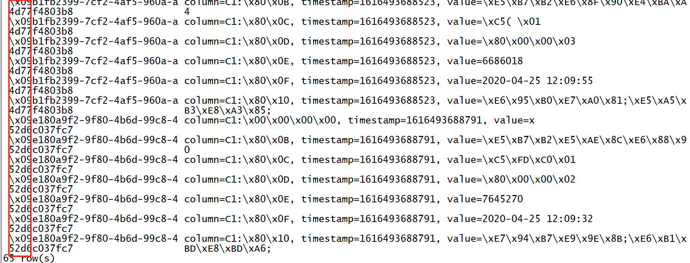

- **小结**：由Phoenix来实现自动对Rowkey编码，解决Rowkey的热点问题，不需要自己设计散列的Rowkey

  - **注意：**一旦使用了盐表，**对于盐表数据的操作只能通过Phoenix来实现**
  - 盐表不能自己指定分区段，由Phoenix自己根据自己规则来实现

  

## 知识点10：【理解】Phoenix的使用：视图

- **目标**：**理解Phoenix中视图的使用**

- **实施**

  - 问题：直接关联Hbase中的表，会导致误删除，对数据的权限会有影响，容易出现问题，如何避免？

  - Phoenix中建议使用视图的方式来关联Hbase中已有的表

  - 通过构建关联视图，可以解决大部分数据查询的数据，不影响数据

  - 视图：理解为只读的表

  - 实现测试

    - 删除Phoenix中的ORDER_INFO

      ```sql
      drop table if exists ORDER_INFO;
      ```

    - 观察Hbase中的ORDER_INFO

      - Hbase中的表也会被删除

    - 重新加载

      ```
      hbase shell ORDER_INFO.txt 
      ```

    - 创建视图，关联Hbase中已经存在的表

      ```sql
      create view if not exists ORDER_INFO(
      "id" varchar primary key,
      "C1"."USER_ID" varchar,
      "C1"."OPERATION_DATE" varchar,
      "C1"."PAYWAY" varchar,
      "C1"."PAY_MONEY" varchar,
      "C1"."STATUS" varchar,
      "C1"."CATEGORY" varchar
      ) ;
      ```

    - 查询数据

      ```sql
      select "id",user_id,payway,category from order_info;
      ```

    - 应用场景

      - 视图：Hbase中已经有这张表，写都是操作Hbase，Phoenix只提供读
      - 建表：对这张表既要读也要使用Phoenix来写

- **小结**：理解Phoenix中视图的使用


## 知识点11：【理解】Phoenix的使用：JDBC

- **目标**：理解Phoenix的JDBC的使用

- **实施**

  - 问题：工作中实际使用SQL，会基于程序中使用JDBC的方式来提交SQL语句，在Phoenix中如何实现？

  - Phoenix支持使用JDBC的方式来提交SQL语句

    ```
    //JDBC
    step1：申明驱动类，获取连接Connection
    step2：获取PrepareStatement语句对象
    step3：构建SQL语句，使用prep执行SQL语句
    step4：释放资源
    ```

  - ==**注意：在resource中要添加hbase-site.xml配置文件**==

  - 构建JDBC连接Phoenix

    ```java
    package bigdata.itcast.cn.hbase.phoenix.jdbc;
    
    import org.apache.phoenix.jdbc.PhoenixDriver;
    
    import java.sql.*;
    /**
    
       * @ClassName HbasePhoenixJDBCTest
       * @Description TODO 测试Phoenix JDBC的使用
       * @Create By     Frank
         */
          public class HbasePhoenixJDBCTest {
          public static void main(String[] args) throws SQLException {
             Connection connection = null;
             PreparedStatement ps = null;
             try {
                 Class.forName(PhoenixDriver.class.getName());
                 connection = DriverManager.getConnection("jdbc:phoenix:node1.itcast.cn:2181");
                 ps = connection.prepareStatement( "select user_id,payway,category from order_info");
                 ResultSet rs = ps.executeQuery();
                 while(rs.next()) {
                     System.out.println(
                             rs.getString("USER_ID")+"\t"+
                             rs.getString("PAYWAY")+"\t"+
                             rs.getString("CATEGORY"));
                 }
             }catch (Exception e){
                 e.printStackTrace();
             }finally {
                 if(ps != null) ps.close();
                 if(connection != null) connection.close();
             }
    
         }
          }
    ```
    
    - 运行查看结果

      

- **小结**：Phoenix支持JDBC方式提交SQL语句实现数据处理


# ==【模块二：Phoenix的二级索引】==

## 知识点12：【理解】Phoenix二级索引设计

- **目标**：基于Phoenix构建Hbase二级索引并维护二级索引

- **分析**

  - **为什么需要构建二级索引？**
    - 问题：Rowkey作为Hbase的唯一索引，只有按照Rowkey的前缀查询，才会走索引，其他都是全表扫描，性能差怎么办？
    - 需求：希望能让大部分的查询都走索引查询
    - 方案：构建二级索引
  - **什么是二级索引？**
    - 一级索引：Rowkey，Hbase不支持创建索引，rowkey作为唯一索引
    - 二级索引：自己创建一张索引表，索引表中根据查询条件指向原表的rowkey
    - 查询时候
      - 先根据查询条件，查询索引表，将符合条件的原表的rowkey进行返回
      - 再根据原表rowkey，查询原始数据表，获取符合条件的的数据
  - **Phoenix如何实现二级索引？**

- **实施**

  - step1：根据数据存储需求，创建原始数据表，将数据写入==**原始数据表**==

    ```
    rowkey：id		id		name		age
    1				1		laoda		18
    2				2		laoer		20
    3				3		laosan		22
    4				4		laoer		22
    5				5		laoda		16
    ```

    - 需求1：根据id查询：select  id , name from table where id = 2
      - 走索引
    - 需求2：根据name查询：select id，name from table where name=‘laoer’
      - 不走索引，只能全表扫描

  - step2：根据数据查询需求，构建二级索引，**Phoenix自动创建索引表**

    ```sql
    create index indexName on tbName(colName);
    create index tb_name_index on tb(name);
    ```

    ```
    rowkey：查询条件_原表的rowkey
    rowkey：name_id			col
    	laoda_1				x
    	laoer_2				X
    	laosan_3			X
    	laoer_4				X
    	laoda_5				X
    ```

  - step3：查询数据时，Phoenix根据过滤条件是否存在二级索引，优先判断走二级索引代替全表扫描

    - 先查询索引表，根据name=laoer查询索引表的rowkey：laoer_2 ，laoer_4
      - 走索引
    - 再查询原表，通过2和4，走索引查询得到2和4的所有信息
      - 走索引
    - 二级索引：通过走两层索引来代替全表扫描

  - step4：原始数据表发生数据变化时，**Phoenix会自动更新索引表的数据**

    - 实现：协处理器

  - **索引类型**：http://phoenix.apache.org/secondary_indexing.html

    - **全局索引**：Global Index
    - **覆盖索引**：Coverd Index
    - **本地索引**：Local Index

- **小结**：在Phoenix中二级索引实现完全由Phoenix自主实现，不需要关心底层的实现，只需要使用语法创建索引即可

  

## 知识点13：【了解】二级索引：全局索引设计

- **目标**：**了解二级索引中全局索引的设计思想**

- **实施**

  - 目的：提高查询过程中对数据基于索引过滤的性能

    ```
    -- 有没有索引没有区别
    select id,name from table;
    -- id有索引，更快
    select id,name from table where id > 1;
    ```

  - 希望我的查询条件有索引

  - **功能**：当为某一列【查询条件】创建全局索引时，Phoenix自动创建一张索引表，将创建索引的这一列加上原表的rowkey作为新的rowkey

    - 原始数据表

      ```
      rowkey：id		name		age
      ```

    - 需求：根据name进行数据查询

    - 问题：不走索引

    - 创建全局索引

      ```sql
      create index index01 on tbname(name);
      ```

    - 自动构建索引表

      ```
      rowkey：name_id		col：占位值
      ```

    - 查询

      - 先查询索引表：通过索引表rowkey获取名称对应的id
      - 再查询数据表：通过id查询对应的数据

  - **特点：**默认只能对构建索引的字段做索引查询，如果查询中包含了不是索引的字段或者条件不是索引字段，不走索引

  - **应用：**写少读多【对写的影响要比本地索引要大一些】

    - 当原表的数据发生更新操作提交时，会被拦截
    - 先更新所有索引表，然后再更新原表
    - 相对而言会影响写入数据性能

- **小结**：了解二级索引中全局索引的设计思想

  

## 知识点14：【实现】二级索引：全局索引实现

- **目标**：**基于Phoenix实现全局索引的测试**

- **实现**

  - 不构建索引，先查询，查看执行计划

    ```sql
    select "user_id" from ORDER_DTL where "user_id" = '8237476';
    explain select "user_id" from ORDER_DTL where "user_id" = '8237476';
    ```

    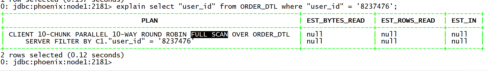

  - 基于user_id构建全局索引

    ```sql
    create index GBL_IDX_ORDER_DTL on ORDER_DTL(C1."user_id");
    ```

  - 查看索引表

    ```
    !tables
    ```

    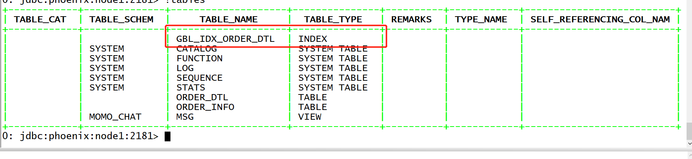

    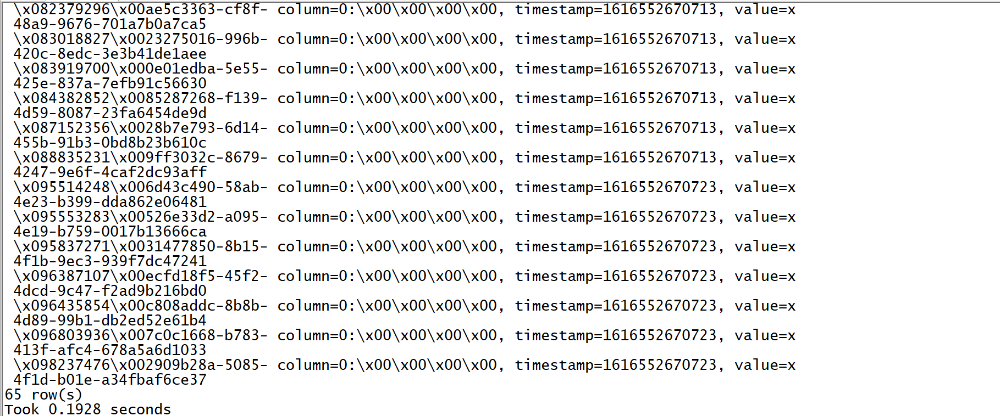

    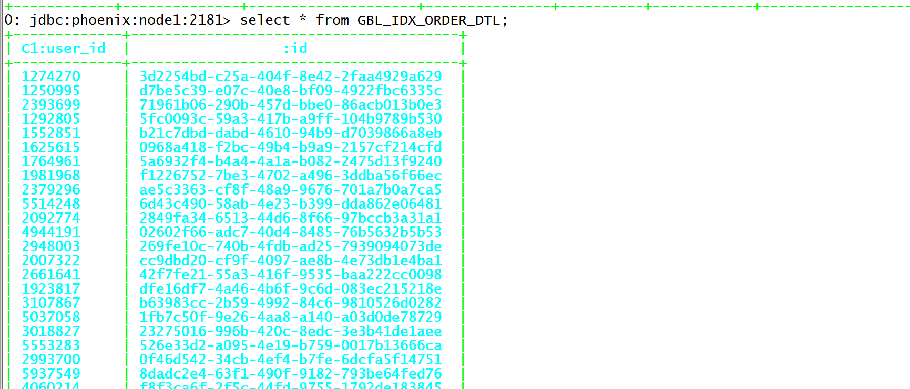

  - 查询数据及查询计划

    ```sql
    select "user_id" from ORDER_DTL where "user_id" = '8237476';
    explain select "user_id" from ORDER_DTL where "user_id" = '8237476';
    ```

    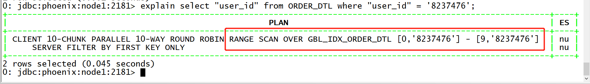

  - 如果查询内容不是索引字段，查看执行计划

    ```sql
    explain select "user_id", "id", "money" from ORDER_DTL where "user_id" = '8237476';
    ```

  - 强制走索引：Hint

    ```sql
    explain select /*+ INDEX(ORDER_DTL GBL_IDX_ORDER_DTL) */ "user_id", "id", "money" from ORDER_DTL where "user_id" = '8237476';
    ```

  - 删除索引

    ```sql
    drop index GBL_IDX_ORDER_DTL on ORDER_DTL;
    ```

- **小结**：基于Phoenix实现全局索引的测试

  

## 知识点15：【了解】二级索引：覆盖索引设计

- **目标**：了解二级索引中覆盖索引的设计思想

- **实施**

  - 问题：使用全局索引时，如果查询字段中包含了非索引字段也不能走索引

  - **功能**：在构建全局索引时，将**经常作为查询结果的列放入索引表中**，直接通过索引表来返回数据结果

    - 原始数据表

      ```
      rowkey：id		name		age  	addr  	phone
      ```

    - 需求：根据name进行数据查询

    - 创建全局索引

      ```sql
      create index index01 on tbname(name);
      ```

    - 自动构建索引表

      ```
      rowkey：name_id		col：占位值
      ```

    - 如果需求发生改变，查询name和age，上面的全局索引会失效

    - 创建全局+覆盖：include(age)

      ```
      create index index01 on tbname(name) include(age);
      ```

    - 自动构建索引表

      ```
      rowkey:name_id		col：age		col:x
      ```

      ```
      select name,age from table where name = zhangsan
      ```

  - **特点：**基于全局索引构建，将常用的查询结果放入索引表中，**直接从索引表返回结果**，不用再查询原表

  - **应用：**适合于查询条件比较固定，数据量比较小的场景下

  - **==注意：不建议将大部分列都放入覆盖索引，导致索引表过大，性能降低==**

- **小结**：了解二级索引中覆盖索引的设计思想

  

## 知识点16：【实现】二级索引：覆盖索引实现

- **目标**：**基于Phoenix实现覆盖索引的测试**

- **实施**

  - 不构建索引，先查询，查看执行计划

    ```sql
    select "user_id", "id", "money" from ORDER_DTL where "user_id" = '8237476';
    explain select "user_id", "id", "money" from ORDER_DTL where "user_id" = '8237476';
    ```

  - 基于user_id构建全局索引，运行通过user_id查询订单id和支付金额

    ```sql
    create index GBL_IDX_ORDER_DTL on ORDER_DTL(C1."user_id") INCLUDE(C1."money");
    ```

  - 查看索引表

    ```
    !tables
    ```

    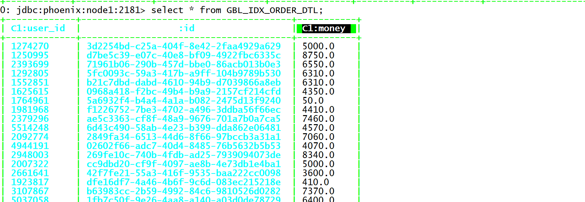

    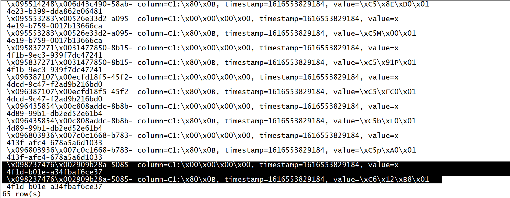

    

  - 查询数据

    ```sqlite
    select "user_id", "id", "money" from ORDER_DTL where "user_id" = '8237476';
    ```

  - 查看执行计划

    ```sql
    explain select "user_id", "id", "money" from ORDER_DTL where "user_id" = '8237476';
    ```

    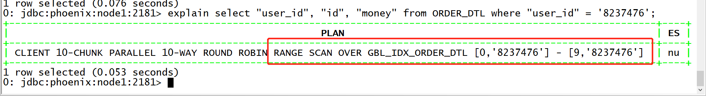

  - 如果查询内容不是索引字段，查看执行计划

    ```sql
    explain select "user_id", "id", "pay_way" from ORDER_DTL where "user_id" = '8237476';
    ```

  - 使用HINT强制走索引

    ```sql
    explain select /*+ INDEX(ORDER_DTL GBL_IDX_ORDER_DTL) */ * from ORDER_DTL where "user_id" = '8237476';
    ```

  - 删除索引

    ```sql
    drop index GBL_IDX_ORDER_DTL on ORDER_DTL;
    ```

- **小结**：基于Phoenix实现覆盖索引的测试

  

## 知识点17：【实现】二级索引：本地索引设计及实现

- **目标**：了解二级索引中本地索引的设计思想

- **实现**

  - **问题**：全局和覆盖都是单独构建一张索引表，写数据时，需要先写索引表再写原表，写的性能影响较大

    - source_table：region0：node2
    - index_table：region0：node3
    - 如果写的请求比较多，影响写入的性能

  - 设计目标：提高读性能的前提下，降低对写的影响

  - **功能**：将索引数据与对应的原始数据放在同一台机器同一个分区中，避免了跨网络传输，降低了写的性能影响

  - **本质**：==**没有创建索引表，在原表中创建了一个新的列族，将所有索引存储在这个列族中**==

    - sourceTable：C1-原始数据，C#-索引列族
    - 怎么保证这条数据和这条数据的索引一定在这张表的同一个分区中？
      - sourceTable：rowkey：id
        - region0:  ~ 2
        - region1: 2 ~ 6
        - region2: 6 ~ 
      - 需求：按照name做查询，name都是字母
        - 问题：如果构建索引，id = 3 name = zhangsan
        - 原始数据：rowkey：id = 3： region1
        - 索引数据：rowkey：name_id = zhangsan_3：region2
      - 解决：索引的前缀使用的是这条数据对应的region的startKey
        - 索引数据：rowkey：startKey_name_id = 2_zhangsan_3：region1
    - 每次查询会将索引列族中的所有索引数据全部读取：牺牲一定的读性能

  - **特点**

    - 即使查询数据中包含了非索引字段，也会走本地索引
    - **本地索引会修改原始数据表且本地索引对盐表不生效的**

  - **应用**

    - 减少构建索引时对写的性能的影响
    - 最终所有索引都是为了提高读的性能的：读的性能不如全局或者覆盖

  - **测试**

    - 删除表，重新建表，并插入数据

      ```sql
      drop table if exists ORDER_DTL;
      create table if not exists ORDER_DTL(
          "id" varchar primary key,
          C1."status" varchar,
          C1."money" float,
          C1."pay_way" integer,
          C1."user_id" varchar,
          C1."operation_time" varchar,
          C1."category" varchar
      ) 
      CONPRESSION='GZ';
      
      UPSERT INTO "ORDER_DTL" VALUES('02602f66-adc7-40d4-8485-76b5632b5b53','已提交',4070,1,'4944191','2020-04-25 12:09:16','手机;');
      UPSERT INTO "ORDER_DTL" VALUES('0968a418-f2bc-49b4-b9a9-2157cf214cfd','已完成',4350,1,'1625615','2020-04-25 12:09:37','家用电器;;电脑;');
      UPSERT INTO "ORDER_DTL" VALUES('0e01edba-5e55-425e-837a-7efb91c56630','已提交',6370,3,'3919700','2020-04-25 12:09:39','男装;男鞋;');
      UPSERT INTO "ORDER_DTL" VALUES('0f46d542-34cb-4ef4-b7fe-6dcfa5f14751','已付款',9380,1,'2993700','2020-04-25 12:09:46','维修;手机;');
      UPSERT INTO "ORDER_DTL" VALUES('1fb7c50f-9e26-4aa8-a140-a03d0de78729','已完成',6400,2,'5037058','2020-04-25 12:10:13','数码;女装;');
      UPSERT INTO "ORDER_DTL" VALUES('23275016-996b-420c-8edc-3e3b41de1aee','已付款',280,1,'3018827','2020-04-25 12:09:53','男鞋;汽车;');
      UPSERT INTO "ORDER_DTL" VALUES('2375a7cf-c206-4ac0-8de4-863e7ffae27b','已完成',5600,1,'6489579','2020-04-25 12:08:55','食品;家用电器;');
      UPSERT INTO "ORDER_DTL" VALUES('269fe10c-740b-4fdb-ad25-7939094073de','已提交',8340,2,'2948003','2020-04-25 12:09:26','男装;男鞋;');
      UPSERT INTO "ORDER_DTL" VALUES('2849fa34-6513-44d6-8f66-97bccb3a31a1','已提交',7060,2,'2092774','2020-04-25 12:09:38','酒店;旅游;');
      UPSERT INTO "ORDER_DTL" VALUES('28b7e793-6d14-455b-91b3-0bd8b23b610c','已提交',640,3,'7152356','2020-04-25 12:09:49','维修;手机;');
      UPSERT INTO "ORDER_DTL" VALUES('2909b28a-5085-4f1d-b01e-a34fbaf6ce37','已提交',9390,3,'8237476','2020-04-25 12:10:08','男鞋;汽车;');
      UPSERT INTO "ORDER_DTL" VALUES('2a01dfe5-f5dc-4140-b31b-a6ee27a6e51e','已提交',7490,2,'7813118','2020-04-25 12:09:05','机票;文娱;');
      UPSERT INTO "ORDER_DTL" VALUES('2b86ab90-3180-4940-b624-c936a1e7568d','已付款',5360,2,'5301038','2020-04-25 12:08:50','维修;手机;');
      UPSERT INTO "ORDER_DTL" VALUES('2e19fbe8-7970-4d62-8e8f-d364afc2dd41','已付款',6490,0,'3141181','2020-04-25 12:09:22','食品;家用电器;');
      UPSERT INTO "ORDER_DTL" VALUES('2fc28d36-dca0-49e8-bad0-42d0602bdb40','已付款',3820,1,'9054826','2020-04-25 12:10:04','家用电器;;电脑;');
      UPSERT INTO "ORDER_DTL" VALUES('31477850-8b15-4f1b-9ec3-939f7dc47241','已提交',4650,2,'5837271','2020-04-25 12:08:52','机票;文娱;');
      UPSERT INTO "ORDER_DTL" VALUES('39319322-2d80-41e7-a862-8b8858e63316','已提交',5000,1,'5686435','2020-04-25 12:08:51','家用电器;;电脑;');
      UPSERT INTO "ORDER_DTL" VALUES('3d2254bd-c25a-404f-8e42-2faa4929a629','已完成',5000,1,'1274270','2020-04-25 12:08:43','男装;男鞋;');
      UPSERT INTO "ORDER_DTL" VALUES('42f7fe21-55a3-416f-9535-baa222cc0098','已完成',3600,2,'2661641','2020-04-25 12:09:58','维修;手机;');
      UPSERT INTO "ORDER_DTL" VALUES('44231dbb-9e58-4f1a-8c83-be1aa814be83','已提交',3950,1,'3855371','2020-04-25 12:08:39','数码;女装;');
      UPSERT INTO "ORDER_DTL" VALUES('526e33d2-a095-4e19-b759-0017b13666ca','已完成',3280,0,'5553283','2020-04-25 12:09:01','食品;家用电器;');
      UPSERT INTO "ORDER_DTL" VALUES('5a6932f4-b4a4-4a1a-b082-2475d13f9240','已提交',50,2,'1764961','2020-04-25 12:10:07','家用电器;;电脑;');
      UPSERT INTO "ORDER_DTL" VALUES('5fc0093c-59a3-417b-a9ff-104b9789b530','已提交',6310,2,'1292805','2020-04-25 12:09:36','男装;男鞋;');
      UPSERT INTO "ORDER_DTL" VALUES('605c6dd8-123b-4088-a047-e9f377fcd866','已完成',8980,2,'6202324','2020-04-25 12:09:54','机票;文娱;');
      UPSERT INTO "ORDER_DTL" VALUES('613cfd50-55c7-44d2-bb67-995f72c488ea','已完成',6830,3,'6977236','2020-04-25 12:10:06','酒店;旅游;');
      UPSERT INTO "ORDER_DTL" VALUES('62246ac1-3dcb-4f2c-8943-800c9216c29f','已提交',8610,1,'5264116','2020-04-25 12:09:14','维修;手机;');
      UPSERT INTO "ORDER_DTL" VALUES('625c7fef-de87-428a-b581-a63c71059b14','已提交',5970,0,'8051757','2020-04-25 12:09:07','男鞋;汽车;');
      UPSERT INTO "ORDER_DTL" VALUES('6d43c490-58ab-4e23-b399-dda862e06481','已提交',4570,0,'5514248','2020-04-25 12:09:34','酒店;旅游;');
      UPSERT INTO "ORDER_DTL" VALUES('70fa0ae0-6c02-4cfa-91a9-6ad929fe6b1b','已付款',4100,1,'8598963','2020-04-25 12:09:08','维修;手机;');
      UPSERT INTO "ORDER_DTL" VALUES('7170ce71-1fc0-4b6e-a339-67f525536dcd','已完成',9740,1,'4816392','2020-04-25 12:09:51','数码;女装;');
      UPSERT INTO "ORDER_DTL" VALUES('71961b06-290b-457d-bbe0-86acb013b0e3','已完成',6550,3,'2393699','2020-04-25 12:08:49','男鞋;汽车;');
      UPSERT INTO "ORDER_DTL" VALUES('72dc148e-ce64-432d-b99f-61c389cb82cd','已提交',4090,1,'2536942','2020-04-25 12:10:12','机票;文娱;');
      UPSERT INTO "ORDER_DTL" VALUES('7c0c1668-b783-413f-afc4-678a5a6d1033','已完成',3850,3,'6803936','2020-04-25 12:09:20','酒店;旅游;');
      UPSERT INTO "ORDER_DTL" VALUES('7fa02f7a-10df-4247-9935-94c8b7d4dbc0','已提交',1060,0,'6119810','2020-04-25 12:09:21','维修;手机;');
      UPSERT INTO "ORDER_DTL" VALUES('820c5e83-f2e0-42d4-b5f0-83802c75addc','已付款',9270,2,'5818454','2020-04-25 12:10:09','数码;女装;');
      UPSERT INTO "ORDER_DTL" VALUES('83ed55ec-a439-44e0-8fe0-acb7703fb691','已完成',8380,2,'6804703','2020-04-25 12:09:52','男鞋;汽车;');
      UPSERT INTO "ORDER_DTL" VALUES('85287268-f139-4d59-8087-23fa6454de9d','已取消',9750,1,'4382852','2020-04-25 12:10:00','数码;女装;');
      UPSERT INTO "ORDER_DTL" VALUES('8d32669e-327a-4802-89f4-2e91303aee59','已提交',9390,1,'4182962','2020-04-25 12:09:57','机票;文娱;');
      UPSERT INTO "ORDER_DTL" VALUES('8dadc2e4-63f1-490f-9182-793be64fed76','已付款',9350,1,'5937549','2020-04-25 12:09:02','酒店;旅游;');
      UPSERT INTO "ORDER_DTL" VALUES('94ad8ee0-8898-442c-8cb1-083a4b609616','已提交',4370,0,'4666456','2020-04-25 12:09:13','维修;手机;');
      UPSERT INTO "ORDER_DTL" VALUES('994cbb44-f0ee-45ff-a4f4-76c87bc2b972','已付款',3190,3,'3200759','2020-04-25 12:09:25','数码;女装;');
      UPSERT INTO "ORDER_DTL" VALUES('9ff3032c-8679-4247-9e6f-4caf2dc93aff','已提交',850,0,'8835231','2020-04-25 12:09:40','男鞋;汽车;');
      UPSERT INTO "ORDER_DTL" VALUES('9ff4032c-1223-4247-9e6f-123456dfdsds','已付款',850,0,'8835231','2020-04-25 12:09:45','食品;家用电器;');
      UPSERT INTO "ORDER_DTL" VALUES('a467ba42-f91e-48a0-865e-1703aaa45e0e','已提交',8040,0,'8206022','2020-04-25 12:09:50','家用电器;;电脑;');
      UPSERT INTO "ORDER_DTL" VALUES('a5302f47-96d9-41b4-a14c-c7a508f59282','已付款',8570,2,'5319315','2020-04-25 12:08:44','机票;文娱;');
      UPSERT INTO "ORDER_DTL" VALUES('a5b57bec-6235-45f4-bd7e-6deb5cd1e008','已提交',5700,3,'6486444','2020-04-25 12:09:27','酒店;旅游;');
      UPSERT INTO "ORDER_DTL" VALUES('ae5c3363-cf8f-48a9-9676-701a7b0a7ca5','已付款',7460,1,'2379296','2020-04-25 12:09:23','维修;手机;');
      UPSERT INTO "ORDER_DTL" VALUES('b1fb2399-7cf2-4af5-960a-a4d77f4803b8','已提交',2690,3,'6686018','2020-04-25 12:09:55','数码;女装;');
      UPSERT INTO "ORDER_DTL" VALUES('b21c7dbd-dabd-4610-94b9-d7039866a8eb','已提交',6310,2,'1552851','2020-04-25 12:09:15','男鞋;汽车;');
      UPSERT INTO "ORDER_DTL" VALUES('b4bfd4b7-51f5-480e-9e23-8b1579e36248','已提交',4000,1,'3260372','2020-04-25 12:09:35','机票;文娱;');
      UPSERT INTO "ORDER_DTL" VALUES('b63983cc-2b59-4992-84c6-9810526d0282','已提交',7370,3,'3107867','2020-04-25 12:08:45','数码;女装;');
      UPSERT INTO "ORDER_DTL" VALUES('bf60b752-1ccc-43bf-9bc3-b2aeccacc0ed','已提交',720,2,'5034117','2020-04-25 12:09:03','机票;文娱;');
      UPSERT INTO "ORDER_DTL" VALUES('c808addc-8b8b-4d89-99b1-db2ed52e61b4','已提交',3630,1,'6435854','2020-04-25 12:09:10','酒店;旅游;');
      UPSERT INTO "ORDER_DTL" VALUES('cc9dbd20-cf9f-4097-ae8b-4e73db1e4ba1','已付款',5000,0,'2007322','2020-04-25 12:08:38','维修;手机;');
      UPSERT INTO "ORDER_DTL" VALUES('ccceaf57-a5ab-44df-834a-e7b32c63efc1','已提交',2660,2,'7928516','2020-04-25 12:09:42','数码;女装;');
      UPSERT INTO "ORDER_DTL" VALUES('d7be5c39-e07c-40e8-bf09-4922fbc6335c','已付款',8750,2,'1250995','2020-04-25 12:09:09','食品;家用电器;');
      UPSERT INTO "ORDER_DTL" VALUES('dfe16df7-4a46-4b6f-9c6d-083ec215218e','已完成',410,0,'1923817','2020-04-25 12:09:56','家用电器;;电脑;');
      UPSERT INTO "ORDER_DTL" VALUES('e1241ad4-c9c1-4c17-93b9-ef2c26e7f2b2','已付款',6760,0,'2457464','2020-04-25 12:08:54','数码;女装;');
      UPSERT INTO "ORDER_DTL" VALUES('e180a9f2-9f80-4b6d-99c8-452d6c037fc7','已完成',8120,2,'7645270','2020-04-25 12:09:32','男鞋;汽车;');
      UPSERT INTO "ORDER_DTL" VALUES('e4418843-9ac0-47a7-bfd8-d61c4d296933','已付款',8170,2,'7695668','2020-04-25 12:09:11','家用电器;;电脑;');
      UPSERT INTO "ORDER_DTL" VALUES('e8b3bb37-1019-4492-93c7-305177271a71','已完成',2560,2,'4405460','2020-04-25 12:10:05','男装;男鞋;');
      UPSERT INTO "ORDER_DTL" VALUES('eb1a1a22-953a-42f1-b594-f5dfc8fb6262','已完成',2370,2,'8233485','2020-04-25 12:09:24','机票;文娱;');
      UPSERT INTO "ORDER_DTL" VALUES('ecfd18f5-45f2-4dcd-9c47-f2ad9b216bd0','已付款',8070,3,'6387107','2020-04-25 12:09:04','酒店;旅游;');
      UPSERT INTO "ORDER_DTL" VALUES('f1226752-7be3-4702-a496-3ddba56f66ec','已付款',4410,3,'1981968','2020-04-25 12:10:10','维修;手机;');
      UPSERT INTO "ORDER_DTL" VALUES('f642b16b-eade-4169-9eeb-4d5f294ec594','已提交',4010,1,'6463215','2020-04-25 12:09:29','男鞋;汽车;');
      UPSERT INTO "ORDER_DTL" VALUES('f8f3ca6f-2f5c-44fd-9755-1792de183845','已付款',5950,3,'4060214','2020-04-25 12:09:12','机票;文娱;');
      ```

    - 不创建索引查询

      ```sql
      explain select "status", "money", "pay_way", "user_id" from ORDER_DTL WHERE "status" = '已提交' AND "pay_way" = 1;
      ```

    - 创建本地索引

      ```sql
      create local index LOCAL_IDX_ORDER_DTL on ORDER_DTL("id", "status", "money", "pay_way", "user_id") ;
      ```

    - 基于本地索引查询

      ```sql
      select "status", "money", "pay_way", "user_id" from ORDER_DTL WHERE "status" = '已提交';
      select * from ORDER_DTL WHERE "status" = '已提交';
      explain select * from ORDER_DTL WHERE "status" = '已提交' AND "pay_way" = 1;
      ```

    - 删除索引

      ```sql
      drop index LOCAL_IDX_ORDER_DTL on ORDER_DTL;
      ```

- **小结**：实现二级索引中本地索引的设计及测试

  

## 知识点18：【了解】二级索引：协处理器的功能介绍

- **目标**：了解协处理器的功能

- **实施**

  - **功能**：什么是协处理器？

    - **协处理器指的是可以自定义开发一些功能集成到Hbase中**
    - 类似于Hive中的UDF，当没有这个功能时，可以使用协处理器来自定义开发，让Hbase支持对应的功能

  - **分类**

    - **observer**：观察者类型，类似于监听机制，MySQL中的触发器或者Zookeeper中的监听
      - 实现：监听A，如果A触发了，就执行B
      - 监听：Region、Table、RegionServer、Master
      - 触发：监听A，如果A触发了，执行B
        - pre：阻塞A，先执行B，再执行A
        - post：A先执行，B在A执行完成之后再执行
    - **endpoint**：终端者类型，类似于MySQL中的存储过程或者Java中的方法
      - 实现：固定一个代码逻辑，可以随时根据需求调用代码逻辑

  - **优点**：功能非常强大，可以满足各种Hbase的使用需求

  - **缺点**：开发成本较高，维护较为麻烦

  - **测试**

    - 需求：当往第一张表写入数据时，自动往第二张表写入一条数据，并且将rowkey中的字段换位

      - put 'proc1','20191211_001','info:name','zhangsan'
      - proc1：rowkey：20191211_001
      - proc2：rowkey：001_20191211

    - 创建两张表

      ```shell
      #rowkey：time_id
      create 'proc1','info'
      #rowkey：id_time
      create 'proc2','info'
      ```

    - 将开发好的协处理器jar包上传到hdfs上

      ```
      hdfs dfs -mkdir -p /coprocessor/jar
      hdfs dfs -put cop.jar /coprocessor/jar/
      ```

    - 添加协处理器到proc1中，用于监听proc1的操作

      ```shell
      disable 'proc1'
      alter 'proc1',METHOD => 'table_att','Coprocessor'=>'hdfs://node1:8020/coprocessor/jar/cop.jar|bigdata.itcast.cn.hbase.coprocessor.SyncCoprocessor|1001|'
      enable 'proc1'
      ```

    - 测试

      ```
      put 'proc1','20191211_001','info:name','zhangsan'
      scan 'proc1'
      scan 'proc2'
      ```

    - 卸载协处理器

      ```
      disable 'proc1'
      alter 'proc1',METHOD=>'table_att_unset',NAME=>'coprocessor$1'
      enable 'proc1'
      ```

- **小结**：了解协处理器的功能


# 附录一：Maven依赖

```xml
    <repositories>
        <repository>
            <id>aliyun</id>
            <url>http://maven.aliyun.com/nexus/content/groups/public/</url>
        </repository>
    </repositories>

    <dependencies>
        <dependency>
            <groupId>org.apache.hbase</groupId>
            <artifactId>hbase-client</artifactId>
            <version>2.1.2</version>
        </dependency>
        <dependency>
            <groupId>org.apache.hbase</groupId>
            <artifactId>hbase-mapreduce</artifactId>
            <version>2.1.2</version>
        </dependency>
        <dependency>
            <groupId>org.apache.hadoop</groupId>
            <artifactId>hadoop-mapreduce-client-jobclient</artifactId>
            <version>2.7.5</version>
        </dependency>
        <dependency>
            <groupId>org.apache.hadoop</groupId>
            <artifactId>hadoop-common</artifactId>
            <version>2.7.5</version>
        </dependency>
        <dependency>
            <groupId>org.apache.hadoop</groupId>
            <artifactId>hadoop-mapreduce-client-core</artifactId>
            <version>2.7.5</version>
        </dependency>
        <dependency>
            <groupId>org.apache.hadoop</groupId>
            <artifactId>hadoop-auth</artifactId>
            <version>2.7.5</version>
        </dependency>
        <dependency>
            <groupId>org.apache.hadoop</groupId>
            <artifactId>hadoop-hdfs</artifactId>
            <version>2.7.5</version>
        </dependency>
        <dependency>
            <groupId>commons-io</groupId>
            <artifactId>commons-io</artifactId>
            <version>2.6</version>
        </dependency>
        <!-- JUnit 4 依赖 -->
        <dependency>
            <groupId>junit</groupId>
            <artifactId>junit</artifactId>
            <version>4.13</version>
        </dependency>
        <!-- phoenix core -->
        <dependency>
            <groupId>org.apache.phoenix</groupId>
            <artifactId>phoenix-core</artifactId>
            <version>5.0.0-HBase-2.0</version>
        </dependency>
        <!-- phoenix 客户端 -->
        <dependency>
            <groupId>org.apache.phoenix</groupId>
            <artifactId>phoenix-queryserver-client</artifactId>
            <version>5.0.0-HBase-2.0</version>
        </dependency>
    </dependencies>
```

