# 实时存储综合案例（一）

## 知识点01：课程回顾

1. Phoenix的基础语法
   - 目标：熟悉DDL、DML、DQL操作
2. Phoenix构建Hbase二级索引
   - 目标：掌握二级索引设计以及使用Phoenix实现二级索引自动化构建和维护
   - 分类
     - 全局索引：最简单二级索引，基于索引字段和原表rowkey构建索引表的rowkey，先查索引表，再查原表
       - 优点：简单，加快读取数据的性能，查询结果字段不在索引表，默认不走索引
       - 缺点：阻塞写入请求，先写索引表，然后再写原表，对写入影响相对比较大
       - 场景：读的性能要求比较高，写的性能要求不是很高
     - 覆盖索引：基于全局索引设计之上，将一些经常被查询字段放入索引表中国，优先直接从索引表返回
       - 优点：不用再查询原表，直接从索引表返回
       - 缺点：索引表的数据量会增加，如果数据不在索引表，不走索引
       - 场景：与全局索引一致，一般建覆盖索引多一点
     - 本地索引：将索引数据直接存储在原表的一个列族中，将索引数据与对应原始数据写入同一个region中
       - 优点：降低了对写数据的影响
       - 缺点：查询时必须加载所有索引数据，读性能提升没有全局索引更好
       - 场景：希望提升读的性能，但是不希望对写产生很大的影响


## 知识点02：课程目标

1. Flume的基本功能和开发规则
   - 目标：掌握Flume的**功能和应用场景**以及**开发规则**
2. Flume的常用组件选项
   - 目标：**掌握常用Source【从哪里读取】、Channel、Sink【写入什么地方】**


# ==【模块一：Flume的介绍及开发规则】==

## 知识点03：【了解】实时存储综合案例需求

- **目标**：**了解案例的背景及需求**

- **实施**

  - **案例背景**

    

    ```
    社交软件每天都有数千万的用户进行聊天, 陌陌、微信、脸书等公司想要对这些用户的聊天记录进行存储，满足用户的所有查询浏览以及后台需要对每天的消息量进行实时统计分析, 请设计如何实现数据的存储以及实时的数据统计分析工作。
    ```

  - **整体目标**

    - 选择合理的存储容器进行数据存储, 并让其支持即席查询与离线分析工作
    - 需求一：存储聊天数据
    - 需求二：即席查询聊天记录
    - 需求三：聊天数据做实时或者离线统计分析

  - **具体需求**

    - 离线分析：满足离线统计分析与即时查询
      - 离线存储：永久性存储Hbase
      - 离线统计：Hive on Hbase
      - 即席查询：Phoenix
    - 实时分析
      - 实时统计消息总量
      - 实时统计各个地区发送消息的总量
      - 实时统计各个地区接收消息的总量
      - 实时统计每个用户发送消息的总量
      - 实时统计每个用户接收消息的总量
      - |
      - 存储：Kafka
      - 分析：Flink
      - 报表：MySQL/Redis + FineBI

  - **技术流程：实时**

    - 采集：Flume：将实时产生的聊天记录的文件的数据进行实时动态采集
    - 存储
      - 离线：Hbase：供离线存储，做离线分析和即席查询
      - 实时：Kafka：供实时缓存，做实时分析
    - 计算
      - 离线：Hive/Phoenix
      - 实时：Flink
    - 应用
      - 报表：MySQL + FineBI
      - 工作中可以换成：redis + 自己开发可视化平台

  - 最终结果

    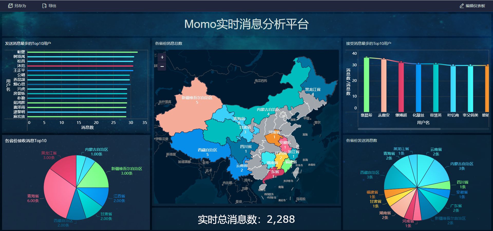

- **小结**：了解案例的背景及需求


## 知识点04：【理解】Flume的功能与应用

- **目标**：**理解Flume的功能与应用场景**

- **实施**

  - 大数据平台构建过程

    - 数据生成：了解常见数据来源
      - 来源：业务数据、日志数据、爬虫数据、第三方
      - 类型：数据库，文件
    - 数据采集：将不同数据来源的数据同步到大数据平台
      - Sqoop：实现RDBMS和HDFS【Hive、Hbase】之间的离线导入导出
      - 实时怎么办？数据来自于文件怎么办？
    - 数据存储：离线数据仓库【Hive、ClickHouse】、实时消息队列【Kafka、Pulsar】
    - 数据处理：离线大数据分析【Spark、Presto、Impala】、实时大数据分析【Spark、Flink】
    - 数据应用：报表、机器学习、即席查询、风控模型

  - 什么是数据采集？

    - 大数据平台是整个公司数据的核心：必须将公司所有的数据统一存储在大数据平台：数据仓库

      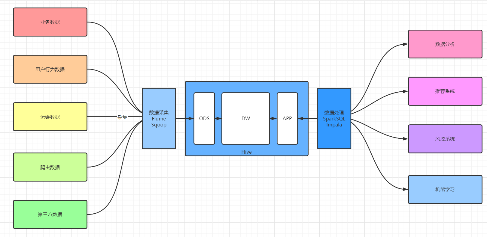

    - 将各种数据源的数据统一同步到大数据平台中的一个过程

    - 针对不同的数据源，使用数据采集工具不一样

  - **功能**：**实现分布式实时数据流的数据采集**，可以将各种各样不同数据源的数据**实时**采集到各种目标地中

  - **特点**

    - **实时**采集：只要数据一产生，就会立即被采集
    - 功能全面：大数据中常用的数据源和目标地Flume都封装好了对应的接口，只要传递参数直接使用
    - 允许自定义开发：Java源码开发的软件，提供了自定义开发的接口
    - 开发相对简单：开发一个配置文件：定义采集谁，采集以后放到哪去
    - 可以实现分布式采集：本身不是分布式工具，可以实现分布式采集

  - **应用**

    - **应用于实时文件、网络数据流采集场景**
    - 美团的Flume架构：https://tech.meituan.com/2013/12/09/meituan-flume-log-system-architecture-and-design.html

- **小结**：理解Flume的功能与应用场景

  

## 知识点05：【掌握】Flume的基本组成

- **目标**：**掌握Flume的基本组成**

- **实施**

  - **官方：flume.apache.org**

    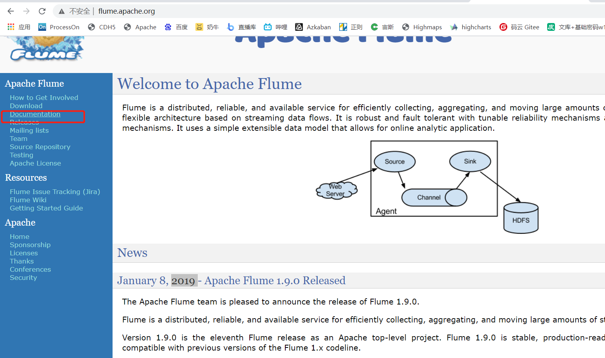

    - http://flume.apache.org/releases/content/1.9.0/FlumeUserGuide.html

    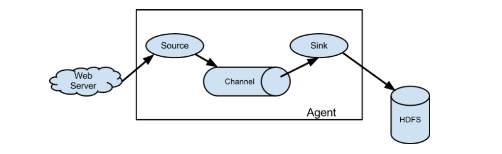

    

  - **Agent**：**一个Agent就是一个Flume程序**，每个Agent都有自己的一个名字

  - **Source**：**负责采集数据**的，监听要采集的数据源，将动态的每条数据采集变成一个Event，将采集到的Event放入Channel

  - **Channel**：**负责临时存储Source采集到的数据**，将所有的Event临时的存放在Channel

  - **Sink**：**负责将Channel中的数据发送到目标地**，主动从Channel取数据写入目标地

  - **Event**：就是**每条数据的对象**，将每一条数据封装为一个Event对象在网络中进行传递，是采集数据传输的最小单元

    - 每一个Event由两部分组成
    - header：默认为空，用于存储每条数据的配置信息，可以存放不同KV
    - body：存放这条数据的内容

- **小结**：理解Flume的基本组成

  

## 知识点06：【掌握】Flume的开发规则

- **目标**：**掌握Flume的基本开发规则**

- **实施**

  - **step1：开发一个Flume的参数配置文件**

    - 先根据需求选择合适的Source、Channel、Sink

    - 再开发一个配置文件

      - 定义一个Agent：这个agent的名称

        - 一个文件中可以定义多个Flume的agent，通过名称来区分

      - 定义这个Agent三个基本组件

        - Source：采集谁？我要去监听哪个数据源

          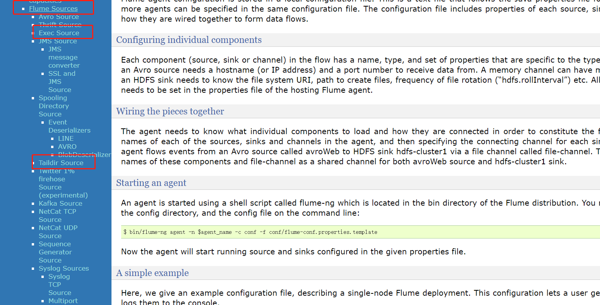

        - Channel：数据缓存在哪？

          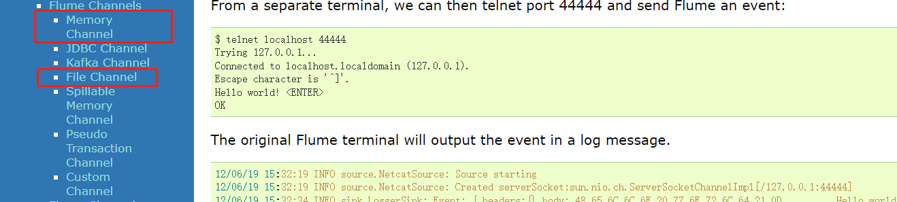

        - Sink：发送给谁？我要将采集到的数据发送给哪个目标地

          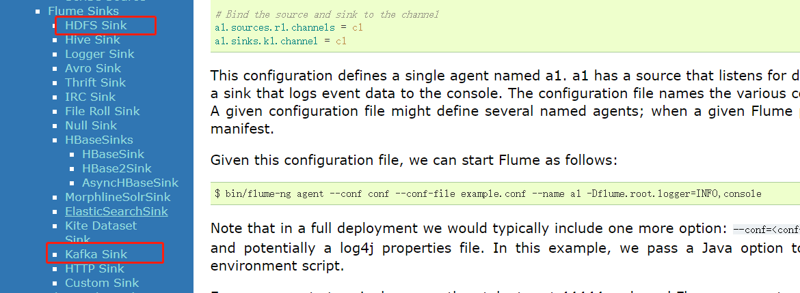

  - **step2：运行flume的agent程序**

    ```
    flume-ng agent -f xxxxx.properties  -n a1
    ```

- **小结**：掌握Flume的基本开发规则


## 知识点07：【实现】Flume的安装部署

- **目标**：**实现Flume的安装部署**

- **实施**

  - **==注意：你们的Hadoop和JDK路径版本如果和我不一样，要修改成自己的==**

  - 上传安装包

    ```
    cd /export/software/
    rz
    ```

    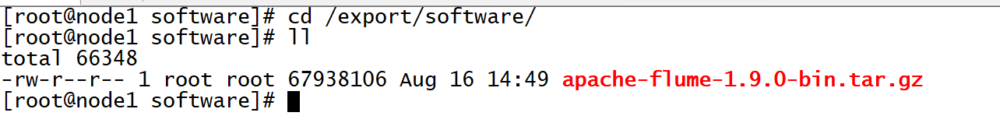

  - 解压安装

    ```shell
    tar -zxvf apache-flume-1.9.0-bin.tar.gz -C /export/server/
    cd /export/server
    mv apache-flume-1.9.0-bin flume-1.9.0-bin
    ```

  - 修改配置

    ```shell
    #修改Flume环境变量
    cd /export/server/flume-1.9.0-bin/conf/
    mv flume-env.sh.template flume-env.sh
    vim flume-env.sh 
    ```

    ```properties
    #修改22行
    export JAVA_HOME=/export/server/jdk1.8.0_65
    #修改34行
    export HADOOP_HOME=/export/server/hadoop-3.3.0
    ```

  - 删除Flume自带的guava包，替换成Hadoop的

    ```shell
    cd /export/server/flume-1.9.0-bin 
    rm -rf lib/guava-11.0.2.jar
    cp /export/server/hadoop/share/hadoop/common/lib/guava-27.0-jre.jar lib/
    ```

  - 添加Flume环境变量

    ```
    vim /etc/profile
    ```

    ```shell
    # FLUME_HOME
    export FLUME_HOME=/export/server/flume-1.9.0-bin
    export PATH=:$PATH:$FLUME_HOME/bin
    ```

    ```
    source /etc/profile
    ```

- **小结**：实现Flume的安装部署


## 知识点08：【实现】Flume开发测试

- **目标**：**实现Flume程序的开发测试**

- **实施**

  - **需求**：采集Hive的日志、临时缓存在内存中、将日志并打印在命令行

  - **分析**

    - step1：先分析需求，选择合适的Source、Channel、Sink

      - Source：固定采集某一个文件
        - Exec source ：通过指定一条Linux的命令来实现文件动态采集，一般搭配tail -F来使用
      - Channel：临时缓存在内存中
        - Memory Channel：将Source的数据缓存在内存中
      - Sink：将采集到的数据写入日志
        - Logger Sink：将Channel中的数据写入日志

    - step2：运行程序

      ```
      flume-ng agent -c/--conf 指定Flume配置文件目录 -f xxxxx.properties  -n a1
      ```

      - -c/--conf：配置配置文件目录
      - -f/--file：指定运行的程序文件
      - -n/--name：指定agent程序的名称

  - **开发**

    - **在第一台机器操作测试**

    - 创建测试目录

      ```
      cd /export/server/flume-1.9.0-bin
      mkdir usercase
      ```

    - 复制官方示例

      ```
      cp conf/flume-conf.properties.template usercase/hive-mem-log.properties
      ```

    - 开发配置文件

      ```properties
      # The configuration file needs to define the sources, 
      # the channels and the sinks.
      # Sources, channels and sinks are defined per a1, 
      
      # in this case called 'a1'
      
      #define the agent
      a1.sources = s1
      a1.channels = c1
      a1.sinks = k1
      
      #define the source
      a1.sources.s1.type = exec
      a1.sources.s1.command = tail -f /tmp/root/hive.log
      
      #define the channel
      a1.channels.c1.type = memory
      a1.channels.c1.capacity = 10000
      
      #define the sink
      a1.sinks.k1.type = logger
      
      #bond
      a1.sources.s1.channels = c1
      a1.sinks.k1.channel = c1
      ```

  - **运行**

    - 先启动HDFS、Hive：-Dflume.root.logger=INFO,console【将日志打印在命令行】

    ```
    flume-ng agent -c conf/ -f usercase/hive-mem-log.properties -n a1 -Dflume.root.logger=INFO,console
    ```

  - **结果**

    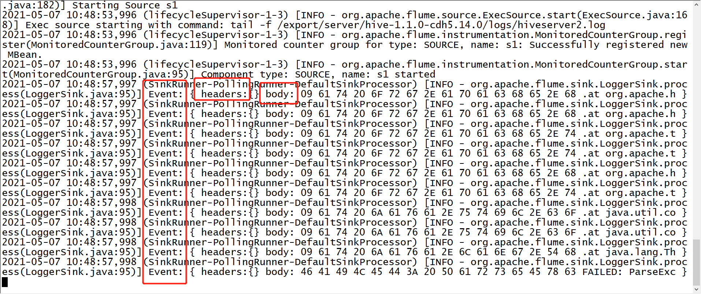


- **小结**：实现测试即可


# ==【模块二：Flume常用组件】==

## 知识点09：【理解】常用Source：Exec

- **目标**：**理解Exec Source的功能与应用场景**

- **实施**

  - **Flume主要场景：采集文件**
  - **功能与应用场景**
    - 功能：**通过执行一条Linux命令来实现数据动态采集**
      - 固定搭配tail -F命令来使用
      - 增量采集
    - **应用场景：实现动态监听采集单个文件的数据**
      - 缺点
      - 如果日志是多个文件的动态变化，Exec不能实现多个文件的监听
      - Exec容易导致数据重复采集

  - **测试实现**
    - 需求：动态采集hiveserver的日志文件，输出在Flume的日志并打印在命令行中
    - 开发：参考知识点08

- **小结**：掌握Exec Source的功能与应用场景

  

## 知识点10：【理解】常用Source：Taildir

- **目标**：**掌握Taildir Source的功能与应用场景**

- **实施**

  - **功能与应用场景**

    - 应用场景

      - 需求：当前日志文件是一天一个，需要每天将数据实时采集到HDFS上

      - 数据：Linux

        ```
        /tomcat/logs/2020-01-01.log
                     2020-01-02.log
                     ……
                     2020-11-10.log
        ```

      - 问题：能不能exec source进行采集？

        - 不能，exec只能监听采集单个文件

      - 解决：Taildir Source

  - **功能**：从Apache Flume1.7版本开始支持，**动态监听采集多个文件**

  - **优点**：能动态监听多个文件，避免数据重复的问题

  - **场景**：需要使用Flume采集文件，Flume1.7版本以上，建议你用TailDir

  - **测试实现**

    - 需求：让Flume动态监听一个文件和一个目录下的所有文件

    - 准备

      ```shell
      cd /export/server/flume-1.9.0-bin
      mkdir position
      mkdir -p /export/data/flume
      echo " " >> /export/data/flume/bigdata01.txt
      mkdir  -p /export/data/flume/bigdata
      cp usercase/hive-mem-log.properties usercase/tail-mem-log.properties
      ```

    - 开发

      ```properties
      # define sourceName/channelName/sinkName for the agent 
      a1.sources = s1
      a1.channels = c1
      a1.sinks = k1
      
      # define the s1
      a1.sources.s1.type = TAILDIR
      #指定一个元数据记录文件
      a1.sources.s1.positionFile = /export/server/flume-1.9.0-bin/position/taildir_position.json
      #将所有需要监控的数据源变成一个组，这个组内有两个数据源
      a1.sources.s1.filegroups = f1 f2
      #指定了f1是谁：监控一个文件
      a1.sources.s1.filegroups.f1 = /export/data/flume/bigdata01.txt
      #指定f1采集到的数据的header中包含一个KV对
      a1.sources.s1.headers.f1.headerKey1 = value1
      #指定f2是谁：监控一个目录下的所有文件
      a1.sources.s1.filegroups.f2 = /export/data/flume/bigdata/.*
      #指定f2采集到的数据的header中包含一个KV对
      a1.sources.s1.headers.f2.headerKey2 = value2
      #指定将文件的路径添加到Event的头部
      a1.sources.s1.fileHeader = true
      
      # define the c1
      a1.channels.c1.type = memory
      a1.channels.c1.capacity = 1000
      a1.channels.c1.transactionCapacity = 100
      
      # def the k1
      a1.sinks.k1.type = logger
      
      #source、channel、sink bond
      a1.sources.s1.channels = c1
      a1.sinks.k1.channel = c1
      ```

    - 结果

      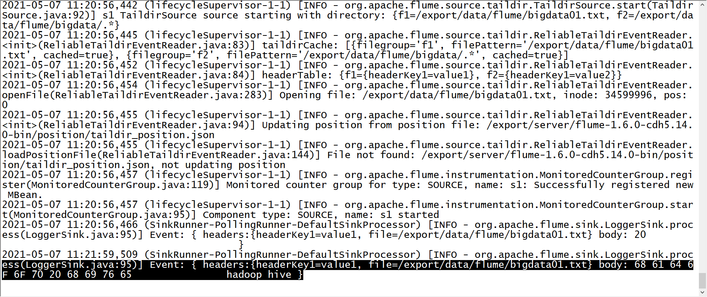

      - 元数据文件的功能：/export/server/flume-1.9.0-bin/position/taildir_position.json

      - 问题：如果Flume程序故障，重启Flume程序，已经被采集过的数据还要不要采集？

      - 需求：不需要，不能导致数据重复

      - 功能：记录Flume所监听的每个文件已经被采集的位置，避免数据重复

        ```
        [
        {"inode":36817802,"pos":16,"file":"/export/data/flume/bigdata01.txt"},{"inode":71924358,"pos":14,"file":"/export/data/flume/bigdata/1.txt"},{"inode":71924359,"pos":7,"file":"/export/data/flume/bigdata/2.txt"}
        ]
        ```

- **小结**：掌握Taildir Source的功能与应用场景

  

## 知识点11：【理解】常用Channel：File和Mem

- **目标**：**掌握file channel与mem channel的功能与应用**

- **实施**

  - 功能：负责临时缓存数据

  - **mem Channel**：将数据缓存在内存中

    - 特点：读写快、容量小、安全性较差
    - 应用：小数据量的高性能的传输

    ```
    a1.channels.c1.type = memory
    a1.channels.c1.capacity = 1000
    a1.channels.c1.transactionCapacity = 100
    ```

  - **file Channel**：将数据缓存在文件中

    - 特点：读写相对慢、容量大、安全性较高
    - 应用：数据量大，读写性能要求不高的场景下

    ```
    a1.channels.c1.type = file
    a1.channels.c1.capacity = 1000
    a1.channels.c1.transactionCapacity = 100
    a1.channels.c1.dataDirs = dir2 # 用于指定缓存数据文件所在的目录
    a1.channels.c1.checkpointDir = dir1 # 用于记录sink已经取到文件的位置
    ```

  - **常用属性**

    - capacity：缓存大小：指定Channel中最多存储多少条event
    - transactionCapacity：每次传输的大小，每次Source可以最多放多少个Event，和Sink每次最多可以取多少个Event，一般建议给capacity的十分之一

- **小结**：掌握file channel与mem channel的功能与应用

  


## 知识点12：【理解】常用Sink：HDFS

- **目标**：**掌握HDFS Sink的功能与应用**

- **实施**

  - **场景**

    - 离线：HDFS Sink

    - 实时：Kafka Sink

    - 问题：离线数仓用Hive构建，最终所有数据都要进入Hive，为什么不直接使用Flume将数据写入Hive表？

    - 原因一：采集的数据来自于文件，不一定是结构化数据，Hive表不能直接识别使用

      - 先采集写入HDFS，对HDFS上的数据进行ETL处理以后，再加载到Hive表

    - 原因二：Flume要求，如果要使用HiveSink，必须满足以下两个条件

      - Hive表必须为分桶表结构

      - Hive表的文件类型必须为ORC

  - **功能：将Flume采集的数据写入HDFS**

    - 问题：Flume作为HDFS客户端，写入HDFS数据

      - Flume必须知道HDFS地址：怎么知道NameNode地址
      - Flume必须拥有HDFS的jar包：在配置文件中申明Hadoop_home

    - 解决

      - 方式一：Flume写地址的时候，指定HDFS的绝对地址

        ```
        hdfs://node1:8020/nginx/log
        ```

        - 手动将需要的jar包放入Flume的lib目录下

      - 方式二：在Flume中配置Hadoop的环境变量，**将core-site和hdfs-site放入Flume的配置文件目录**【HA】

        ```
        cp /export/server/hadoop/etc/hadoop/core-site.xml  ./conf/
        ```

  - **需求**：将Hive的日志动态采集写入HDFS

    ```
    cp usercase/hive-mem-log.properties usercase/hive-mem-hdfs.properties
    ```

    ```properties
    # The configuration file needs to define the sources, 
    # the channels and the sinks.
    # Sources, channels and sinks are defined per a1, 
    # in this case called 'a1'
    
    
    #定义当前的agent的名称，以及对应source、channel、sink的名字
    a1.sources = s1
    a1.channels = c1
    a1.sinks = k1
    
    #定义s1:从哪读数据，读谁
    a1.sources.s1.type = exec
    a1.sources.s1.command = tail -f /tmp/root/hive.log 
    
    #定义c1:缓存在什么地方
    a1.channels.c1.type = memory
    a1.channels.c1.capacity = 1000
    
    
    #定义k1:将数据发送给谁
    a1.sinks.k1.type = hdfs
    a1.sinks.k1.hdfs.path = hdfs://node1:8020/flume/test1
    
    
    #s1将数据给哪个channel
    a1.sources.s1.channels = c1
    #k1从哪个channel中取数据
    a1.sinks.k1.channel = c1
    ```

    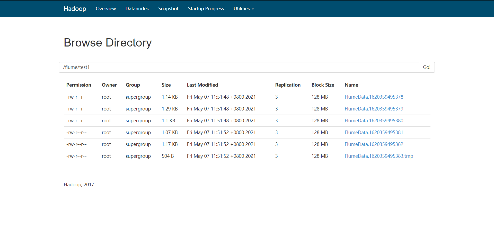

    

  - **指定文件大小**

    - 问题：Flume默认写入HDFS上会产生很多小文件，都在1KB左右，不利用HDFS存储

    - 解决：指定文件大小

      ```
      hdfs.rollInterval：按照时间间隔生成文件
      hdfs.rollSize：指定HDFS生成的文件大小
      hdfs.rollCount：按照event个数生成文件
      ```

      ```properties
      # The configuration file needs to define the sources, 
      # the channels and the sinks.
      # Sources, channels and sinks are defined per a1, 
      # in this case called 'a1'
      
      
      #定义当前的agent的名称，以及对应source、channel、sink的名字
      a1.sources = s1
      a1.channels = c1
      a1.sinks = k1
      
      #定义s1:从哪读数据，读谁
      a1.sources.s1.type = exec
      a1.sources.s1.command = tail -f /tmp/root/hive.log 
      
      #定义c1:缓存在什么地方
      a1.channels.c1.type = memory
      a1.channels.c1.capacity = 1000
      
      
      #定义k1:将数据发送给谁
      a1.sinks.k1.type = hdfs
      a1.sinks.k1.hdfs.path = hdfs://node1:8020/flume/test2
      #指定按照时间生成文件，一般关闭
      a1.sinks.k1.hdfs.rollInterval = 0
      #指定文件大小生成文件，一般120 ~ 125M对应的字节数
      a1.sinks.k1.hdfs.rollSize = 10240
      #指定event个数生成文件，一般关闭
      a1.sinks.k1.hdfs.rollCount = 0
      
      #s1将数据给哪个channel
      a1.sources.s1.channels = c1
      #k1从哪个channel中取数据
      a1.sinks.k1.channel = c1
      ```

      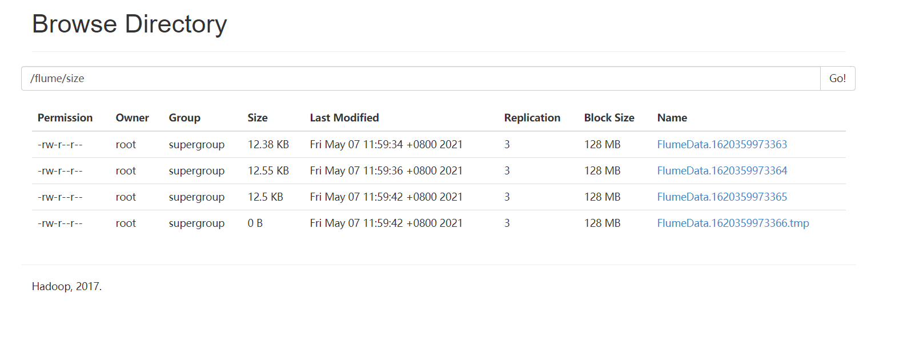

  - **指定分区**：用HDFS Sink代替Hive Sink

    - 问题：如何实现分区存储，每天一个或者每小时一个目录？

      ```
      /user/hive/warehouse/test.db/tbname/daystr=20210101
                                          daystr=20210102
      ```

    - 解决：添加时间标记目录

      ```properties
      # The configuration file needs to define the sources, 
      # the channels and the sinks.
      # Sources, channels and sinks are defined per a1, 
      # in this case called 'a1'
      
      
      #定义当前的agent的名称，以及对应source、channel、sink的名字
      a1.sources = s1
      a1.channels = c1
      a1.sinks = k1
      
      #定义s1:从哪读数据，读谁
      a1.sources.s1.type = exec
      a1.sources.s1.command = tail -f /tmp/root/hive.log 
      
      #定义c1:缓存在什么地方
      a1.channels.c1.type = memory
      a1.channels.c1.capacity = 1000
      
      
      #定义k1:将数据发送给谁
      a1.sinks.k1.type = hdfs
      a1.sinks.k1.hdfs.path = hdfs://node1:8020/flume/log/daystr=%Y%m%d
      #指定按照时间生成文件，一般关闭
      a1.sinks.k1.hdfs.rollInterval = 0
      #指定文件大小生成文件，一般120 ~ 125M对应的字节数
      a1.sinks.k1.hdfs.rollSize = 10240
      #指定event个数生成文件，一般关闭
      a1.sinks.k1.hdfs.rollCount = 0
      a1.sinks.k1.hdfs.useLocalTimeStamp = true
      
      
      #s1将数据给哪个channel
      a1.sources.s1.channels = c1
      #k1从哪个channel中取数据
      a1.sinks.k1.channel = c1
      ```

  - **其他参数**

    ```properties
    #指定生成的文件的前缀
    a1.sinks.k1.hdfs.filePrefix = nginx
    #指定生成的文件的后缀
    a1.sinks.k1.hdfs.fileSuffix = .log
    #指定写入HDFS的文件的类型：普通的文件
    a1.sinks.k1.hdfs.fileType = DataStream 
    ```

- **小结**：掌握HDFS Sink的功能与应用


## 知识点13：【了解】大数据平台可视化方案

- **目标**：**了解常用的大数据平台可视化方案**

- **实施**

  - **方案一**：商业化可视化工具：FineBI、Tableau、PowerBI

    

  - **方案二**：开源可视化工具：Superset

    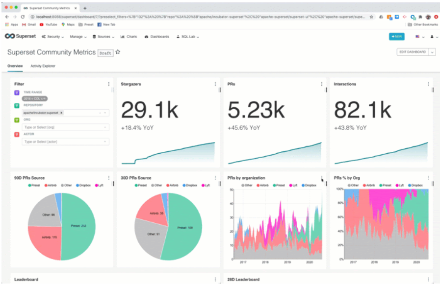

    

  - **方案三**：自定义可视化平台：Echarts

    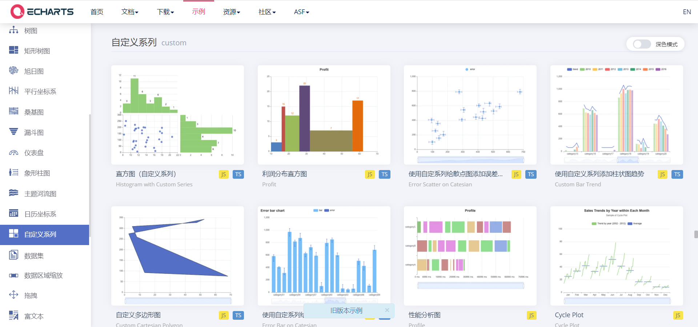

- **小结**：了解常用的大数据平台可视化方案

  

## 知识点14：【了解】FineBI的介绍及安装

- **目标**：**了解FineBI的介绍及安装**

- **实施**

  - **介绍**

    ```
    FineBI 是帆软软件有限公司推出的一款商业智能（Business Intelligence）产品。
    FineBI 是定位于自助大数据分析的BI工具，能够帮助企业的业务人员和数据分析师，开展以问题导向的探索式分析。
    ```

    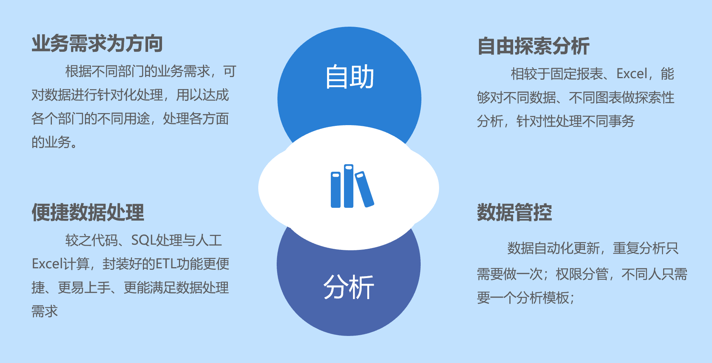

  - **特点**

    - 完善的数据管理策略

      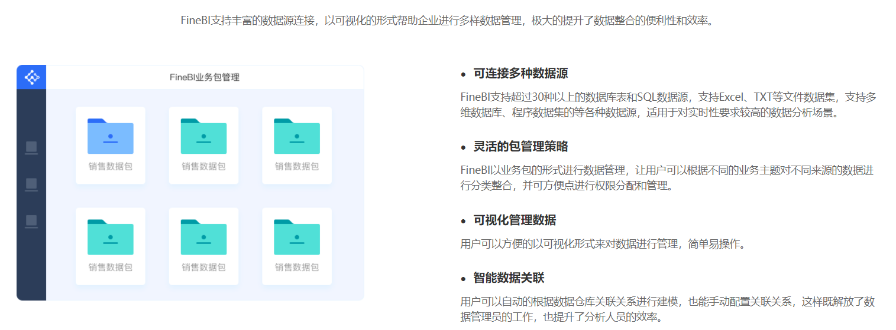

      

    - 自助式数据准备

      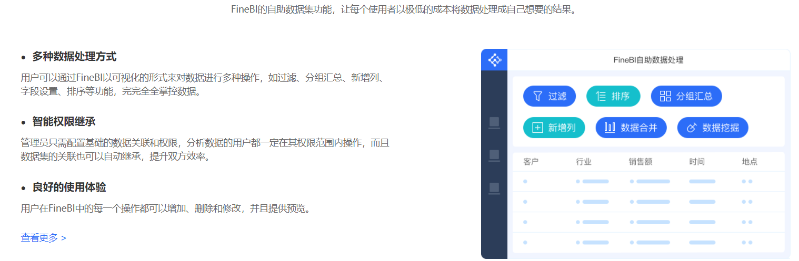

      

    - Spider引擎，大量数据秒级呈现

      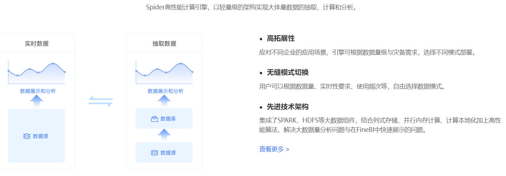

      

    - 业务数据可视化效果

      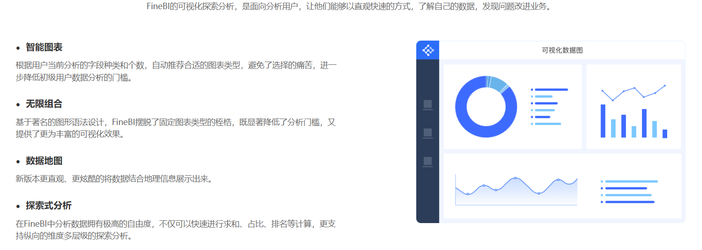

    - 全场景多屏应用方案

      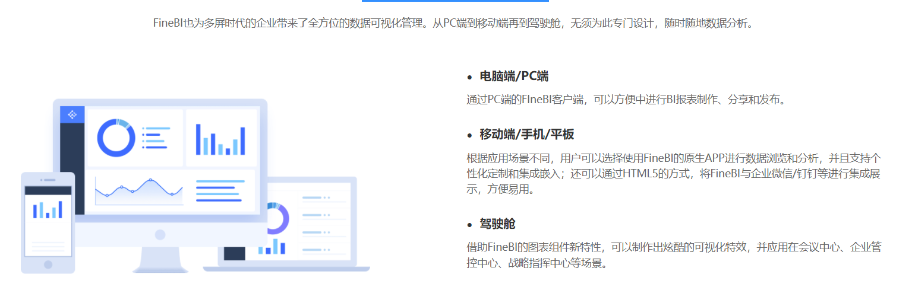

    - 企业级权限管控

      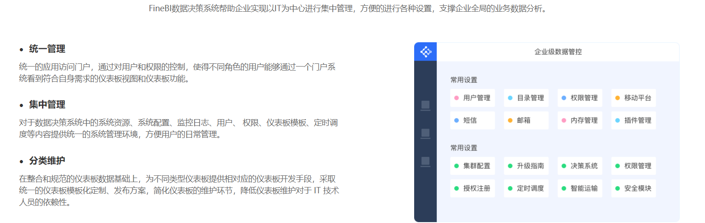

      

  - **功能**

    - 数据层：设计用户创建数据源。

    - 应用层：设计用户进行仪表板设计，管理用户配置用户和权限体系。

    - 展示层：普通用户在前端进行可视化展示和分享来编辑和查看仪表板。

      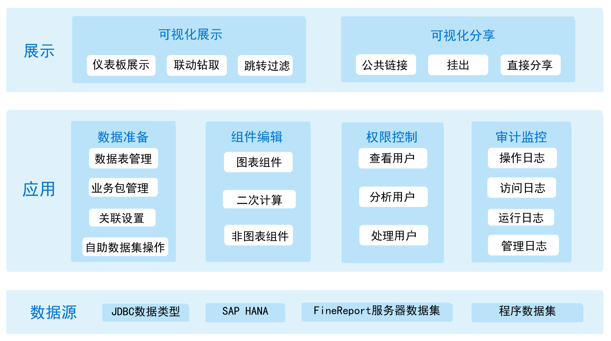

  - **安装**：参考《FineBI Windows版本安装手册》

- **小结**：了解FineBI的介绍及安装