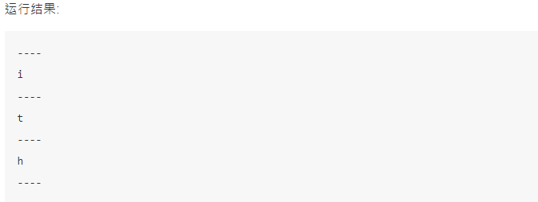
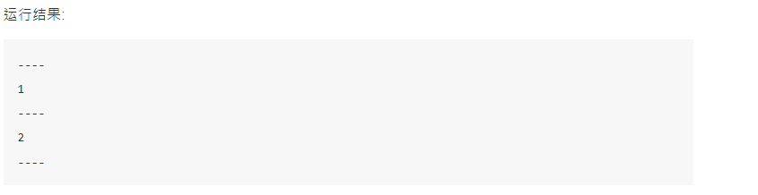
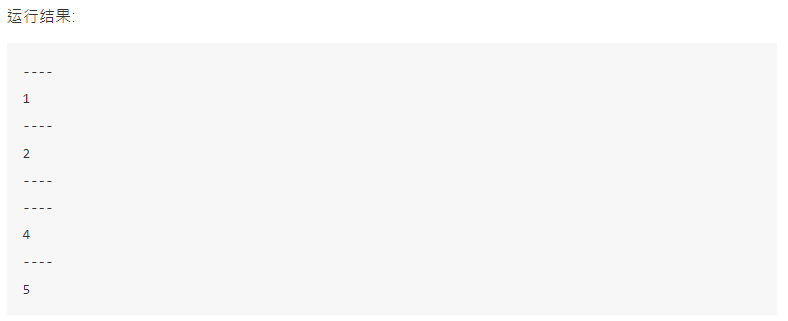
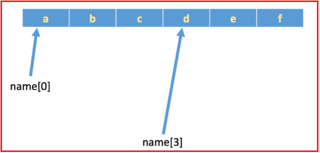

# day02_python基础

今日内容:

* 1- 循环语句 (操作)
* 2- python的容器 (操作)

## 1 循环语句

### 1.1 while循环

格式:

```python
 while 条件:
        条件满足时，做的事情1
        条件满足时，做的事情2
        条件满足时，做的事情3
        ...(省略)...
```

案例: 循环打印5次

```properties
    i = 0
    while i < 5:
        print("当前是第%d次执行循环" % (i + 1))
        print("i=%d" % i)
        i+=1
```

死循环

```properties
while True:
    print(1)
```


---

综合案例:

* 需求一: 计算1~100 的累加和(包含1~100)

```python
i = 1
sum = 0
while i <= 100:
    sum = sum + i
    i += 1

print("1~100的累加和为:%d" % sum)
```

* 需求二: 计算1~100之间偶数的累加和（包含1和100）

```python
i = 1
sum = 0
while i <= 100:
    if i % 2 == 0:
        sum = sum + i
    i+=1

print("1~100的累加和为:%d" % sum)
```

---

* while嵌套

```python
格式:
	while 条件1:

        条件1满足时，做的事情1
        条件1满足时，做的事情2
        条件1满足时，做的事情3
        ...(省略)...

        while 条件2:
            条件2满足时，做的事情1
            条件2满足时，做的事情2
            条件2满足时，做的事情3
            ...(省略)...
```

案例1:

````python
要求：打印如下图形：
* * * * * 
* * * * * 
* * * * * 
* * * * * 
* * * * *


代码实现:
i = 1
while i <= 5:
    j = 1
    while j <= 5:
        print("*", end=" ")
        j += 1
    print()

    i += 1
````

案例2: 

```properties
要求：打印如下图形：
* 
* * 
* * * 
* * * *  
* * * * *

参考代码：
i = 1
while i <= 5:
    j = 1
    while j <= i:
    	# end 设置 print的结尾内容, 默认是 \n 回车 更改为 空格, 表示不换行
        print("*", end=" ")
        j += 1
    print()

    i += 1
```

### 1.2 for 循环

格式:

```python
for 临时变量 in 列表或者字符串等可迭代对象:
    循环满足条件时执行的代码
```

示例1:

```python
name = 'itheima'

for x in name:
    print(x)
```

示例2:

```python
# 作为刚开始学习python的我们，此阶段仅仅知道range(5)表示可以循环5次即可
for i in range(5):
    print(i)

'''
效果等同于 while 循环的：

i = 0
while i < 5:
    print(i)
    i += 1
'''
```

### 1.3 break 和 continue

break作用: 立刻结束break所在的循环

-----


* break 在for循环中使用

```python
name = 'itheima'

for x in name:
    print('----')
    if x == 'e': 
        break
    print(x)
else:
    print("==for循环过程中，如果没有执行break退出，则执行本语句==")
```



* break 在while循环中使用

```
i = 0

while i<5:
    i = i+1
    print('----')
    if i==3:
        break
    print(i)
else:
    print("==while循环过程中，如果没有执行break退出，则执行本语句==")
```



---

continue作用: 用来结束本次循环，紧接着执行下一次的循环

案例:

```properties
i = 0

while i<5:
    i = i+1
    print('----')
    if i==3:
        continue
    print(i)
```




## 2- python的容器

**`容器`**：容器是一种把多个元素组织在一起的数据结构，容器中的元素可以逐个地迭代获取，可以用各种内置方法对容器中的数据进行增删改查等操作

**`人话`**: 容器就是存储数据的东西, 同时Python为了方便我们对容器中的数据进行增加删除修改查询专门提供了相应的方法便于我们操作

Python中常见容器有如下几种:

- 字符串
- 列表
- 元组
- 字典

### 2.1 字符串

* 定义格式:

```python
 b = "hello itcast.cn"
 或者
 b = 'hello itcast.cn'
   
注意：
	双引号或者单引号中的数据，就是字符串
```

* 字符串的下标:

  * 如有字符串:`name = 'abcdef'`，在内存中的实际存储如下:

  

  如果想取出部分字符，那么可以通过`下标`的方法（**注意python中下标从 0 开始**）

  ```
   name = 'abcdef'
  
  print(name[0])
  print(name[1])
  print(name[2])
  
  结果如下:
  a
  b
  c
  ```

  >- 列表与元组也同样支持下标操作
  >- 下标也叫做索引

* 字符串的切片

  * 切片是指对操作的对象截取其中一部分的操作. 比如想要取字符串"888666@qq.com"中的QQ号的时候就可以使用切片
  * **`切片的语法`**：[起始:结束:步长]
  * **`注意`**：选取的区间从"起始"位开始，到"结束"位的前一位结束（不包含结束位本身)，步长表示选取间隔的长度

```
name = 'abcdef'
print(name[0:3]) # 取 下标0~2 的字符

运行结果:
abc


name = 'abcdef'
print(name[3:5]) # 取 下标为3、4 的字符

运行结果:
de


name = 'abcdef'
print(name[2:]) # 取 下标为2开始到最后的字符

运行结果:
cdef


name = 'abcdef'
print(name[1:-1]) # 取 下标为1开始 到 最后第2个  之间的字符
运行结果:

bcde
```

>ps:
>
>- **字符串、列表、元组**都支持切片操作
>- 下标/索引是通过下标取某一个元素, 切片是通过下标去某一段元素


---

字符串常见操作

* 1- 查找: find() index()
  * 语法:
    * find(): 字符串序列.find(子串, 开始位置下标, 结束位置下标)
    * index()：检测某个子串是否包含在这个字符串中，如果在返回这个子串开始的位置下标，否则则报异常。

```python
mystr = "hello world and itcast and itheima and Python"

print(mystr.find('and'))  # 12
print(mystr.find('and', 15, 30))  # 23
print(mystr.find('ands'))  # -1


print(mystr.index('and'))  # 12
print(mystr.index('and', 15, 30))  # 23
print(mystr.index('ands'))  # 报错
```

* 2- 修改--replace(),split()
  * 格式:
    * replace(): 字符串序列.replace(旧子串, 新子串, 替换次数)
    * split(): 字符串序列.split(分割字符, num)
      * 注意：num表示的是分割字符出现的次数，即将来返回数据个数为num+1个。

```python
mystr = "hello world and itcast and itheima and Python"

# 结果：hello world he itcast he itheima he Python
print(mystr.replace('and', 'he'))
# 结果：hello world he itcast he itheima he Python
print(mystr.replace('and', 'he', 10))
# 结果：hello world and itcast and itheima and Python
print(mystr)


# 结果：['hello world ', ' itcast ', ' itheima ', ' Python']
print(mystr.split('and'))
# 结果：['hello world ', ' itcast ', ' itheima and Python']
print(mystr.split('and', 2))
# 结果：['hello', 'world', 'and', 'itcast', 'and', 'itheima', 'and', 'Python']
print(mystr.split(' '))
# 结果：['hello', 'world', 'and itcast and itheima and Python']
print(mystr.split(' ', 2))
```

其他字符串API说明:

```python
<1>capitalize
把字符串的第一个字符大写

mystr.capitalize()

<2>title
把字符串的每个单词首字母大写

>>> a = "hello itcast"
>>> a.title()
'Hello Itcast'
<3>startswith
检查字符串是否是以 hello 开头, 是则返回 True，否则返回 False

mystr.startswith(hello)

<4>endswith
检查字符串是否以obj结束，如果是返回True,否则返回 False.

mystr.endswith(obj)

<5>lower
转换 mystr 中所有大写字符为小写

mystr.lower()   

<6>upper
转换 mystr 中的小写字母为大写

mystr.upper()

<7>ljust
返回一个原字符串左对齐,并使用空格填充至长度 width 的新字符串

mystr.ljust(width)

<8>rjust
返回一个原字符串右对齐,并使用空格填充至长度 width 的新字符串

mystr.rjust(width)

<9>center
返回一个原字符串居中,并使用空格填充至长度 width 的新字符串

mystr.center(width)  

<10>lstrip
删除 mystr 左边的空白字符

mystr.lstrip()

<11>rstrip
删除 mystr 字符串末尾的空白字符

mystr.rstrip()

<12>strip
删除mystr字符串两端的空白字符

>>> a = "\n\t itcast \t\n"
>>> a.strip()
'itcast'

<13>rfind
类似于 find()函数，不过是从右边开始查找.

mystr.rfind(str, start=0,end=len(mystr) )

<14>rindex
类似于 index()，不过是从右边开始.

mystr.rindex( str, start=0,end=len(mystr))

<15>partition
把mystr以str分割成三部分,str前，str和str后

mystr.partition(str)

<16>rpartition
类似于 partition()函数,不过是从右边开始.

mystr.rpartition(str)

<17>splitlines
按照行分隔，返回一个包含各行作为元素的列表

mystr.splitlines()  

<18>isalpha
如果 mystr 所有字符都是字母 则返回 True,否则返回 False

mystr.isalpha()

<19>isdigit
如果 mystr 只包含数字则返回 True 否则返回 False.

mystr.isdigit()

<20>isalnum
如果 mystr 所有字符都是字母或数字则返回 True,否则返回 False

mystr.isalnum() 

<21>isspace
如果 mystr 中只包含空格，则返回 True，否则返回 False.

mystr.isspace()   
```

### 2.2 列表

​		类似于JAVA中的list或者数组

* 定义的格式:

  ```python
   namesList = [值1,值2,值3]
  ```

* 打印列表中某一个

  ```python
   namesList = ['xiaoWang','xiaoZhang','xiaoHua']
   print(namesList[0])
   print(namesList[1])
   print(namesList[2])
  ```

* 基于for循环遍历:

  ```python
  names_list = ['xiaoWang','xiaoZhang','xiaoHua']
  for name in names_list:
      print(name)
     
  结果:
      xiaoWang
      xiaoZhang
      xiaoHua
  ```

* 基于while循环:

  ```python
  names_list = ['xiaoWang','xiaoZhang','xiaoHua']
  
  length = len(names_list)
  
  i = 0
  
  while i<length:
      print(names_list[i])
      i+=1
   
  结果:
      xiaoWang
      xiaoZhang
      xiaoHua
  ```

---

列表相关的API:

* 添加元素:

  * append: 通过append可以向列表添加元素

  ```properties
  #定义变量A，默认有3个元素
  A = ['xiaoWang','xiaoZhang','xiaoHua']
  
  print("-----添加之前，列表A的数据-----")
  for temp_name in A:
      print(temp_name)
  
  #提示、并添加元素
  temp = input('请输入要添加的学生姓名:')
  A.append(temp)
  
  print("-----添加之后，列表A的数据-----")
  for temp_name in A:
      print(temp_name)
  ```

  * extend: 通过extend可以将另一个集合中的元素逐一添加到列表中

  ```python
  >>> a = [1, 2]
  >>> b = [3, 4]
  >>> a.append(b)
  >>> a
  [1, 2, [3, 4]]
  >>> a.extend(b)
  >>> a
  [1, 2, [3, 4], 3, 4]
  ```

  * insert: insert(index, object) 在指定位置index前插入元素object

  ```python
  >>> a = [0, 1, 2]
  >>> a.insert(1, 3)
  >>> a
  [0, 3, 1, 2]
  ```

* 修改元素:

  * 修改元素的时候，要通过下标来确定要修改的是哪个元素，然后才能进行修改

  ```python
  #定义变量A，默认有3个元素
  A = ['xiaoWang','xiaoZhang','xiaoHua']
  
  print("-----修改之前，列表A的数据-----")
  for temp_name in A:
      print(temp_name)
  
  #修改元素
  A[1] = 'xiaoLu'
  
  print("-----修改之后，列表A的数据-----")
  for temp_name in A:
      print(temp_name)
  
      
  结果:
  
      -----修改之前，列表A的数据-----
      xiaoWang
      xiaoZhang
      xiaoHua
      -----修改之后，列表A的数据-----
      xiaoWang
      xiaoLu
      xiaoHua
  ```

* 查找元素 : 看指定的元素是否存在

  * in, not in

    >python中查找的常用方法为：
    >
    >- in（存在）,如果存在那么结果为true，否则为false
    >- not in（不存在），如果不存在那么结果为true，否则false

  ```python
  #待查找的列表
  name_list = ['xiaoWang','xiaoZhang','xiaoHua']
  
  #获取用户要查找的名字
  find_name = input('请输入要查找的姓名:')
  
  #查找是否存在
  if find_name in name_list:
      print('在字典中找到了相同的名字')
  else:
      print('没有找到')
  ```

  * index,count

  ```python
  >>> a = ['a', 'b', 'c', 'a', 'b']
  >>> a.index('a', 1, 3) # 注意是左闭右开区间
  Traceback (most recent call last):
    File "<stdin>", line 1, in <module>
  ValueError: 'a' is not in list
  >>> a.index('a', 1, 4)
  3
  >>> a.count('b')
  2
  >>> a.count('d')
  0
  ```

* 删除元素: 

  * del：根据下标进行删除

  ```python
  movie_name = ['加勒比海盗','骇客帝国','第一滴血','指环王','霍比特人','速度与激情']
  
  print('------删除之前------')
  for temp_name in movie_name:
      print(movie_name)
  
  del movie_name[2]
  
  print('------删除之后------')
  for temp_name in movie_name:
      print(temp_name)
      
  
  结果:
  
      ------删除之前------
      加勒比海盗
      骇客帝国
      第一滴血
      指环王
      霍比特人
      速度与激情
      ------删除之后------
      加勒比海盗
      骇客帝国
      指环王
      霍比特人
      速度与激情
  ```

  

  * pop：删除最后一个元素

  ```python
  movie_name = ['加勒比海盗','骇客帝国','第一滴血','指环王','霍比特人','速度与激情']
  
  print('------删除之前------')
  for temp_name in movie_name:
      print(temp_name)
  
  movie_name.pop()
  
  print('------删除之后------')
  for temp_name in movie_name:
      print(temp_name)
      
  
  结果:
  
  ------删除之前------
  加勒比海盗
  骇客帝国
  第一滴血
  指环王
  霍比特人
  速度与激情
  ------删除之后------
  加勒比海盗
  骇客帝国
  第一滴血
  指环王
  霍比特人
  ```

  

  * remove：根据元素的值进行删除

  ```python
  movie_name = ['加勒比海盗','骇客帝国','第一滴血','指环王','霍比特人','速度与激情']
  
  print('------删除之前------')
  for temp_name in movie_name:
      print(temp_name)
  
  movie_name.remove('指环王')
  
  print('------删除之后------')
  for temp_name in movie_name:
      print(temp_name)
      
    
    
  结果:
  
  ------删除之前------
  加勒比海盗
  骇客帝国
  第一滴血
  指环王
  霍比特人
  速度与激情
  ------删除之后------
  加勒比海盗
  骇客帝国
  第一滴血
  霍比特人
  速度与激情
  ```

* 排序

  * sort(): sort方法是将list按特定顺序重新排列，默认为由小到大，参数reverse=True可改为倒序，由大到小。
  * reverse(): 将list逆置。

  ```python
  >>> a = [1, 4, 2, 3]
  >>> a
  [1, 4, 2, 3]
  >>> a.reverse()
  >>> a
  [3, 2, 4, 1]
  >>> a.sort()
  >>> a
  [1, 2, 3, 4]
  >>> a.sort(reverse=True)
  >>> a
  [4, 3, 2, 1]
  ```

* 列表嵌套:

  * 类似于二维数组

  ```python
  chool_names = [['北京大学','清华大学'],['南开大学','天津大学']]
  
  # 对列表打印及打印结果
  print(school_names[0][0])
  >>> 北京大学
  
  print(school_names[0][1])
  >>> 清华大学
  
  print(school_names[1][0])
  >>> 南开大学
  
  print(school_names[1][1])
  >>> 天津大学
  ```

* 列表推导式:

  * 作用：用一个表达式创建一个有规律的列表或控制一个有规律列表。
  * 列表推导式又叫列表生成式。

  ```
  例如: 创建一个0-10的列表
  
  --------------while做法----------------
  # 1. 准备一个空列表
  list1 = []
  
  # 2. 书写循环，依次追加数字到空列表list1中
  i = 0
  while i < 10:
      list1.append(i)
      i += 1
  
  print(list1)
  
  --------------for做法----------------
  list1 = []
  for i in range(10):
      list1.append(i)
  
  print(list1)
  
  
  --------------推导式----------------
  list1 = [i for i in range(10)]
  print(list1)
  ```

  * 带if的列表推导式

  ```properties
  需求: 生成一个1~10的偶数
  list1 = [i for i in range(10) if i % 2 == 0]
  print(list1)
  ```

  * 带有多个for循环的列表推导式

  ```
  需求：创建列表如下：
  	[(1, 0), (1, 1), (1, 2), (2, 0), (2, 1), (2, 2)]
  
  代码:
  
  list1 = [(i, j) for i in range(1, 3) for j in range(3)]
  print(list1)
  ```

### 2.3 元组

元组特点：定义元组使用小括号，且使用逗号隔开各个数据，数据可以是不同的数据类型。

```python
# 多个数据元组(多元元组)
t1 = (10, 20, 30)

# 单个数据元组
t2 = (10,)
```

​	注意：如果定义的元组只有一个数据，那么这个数据后面也好添加逗号，否则数据类型为唯一的这个数据的数据类型

```python
t2 = (10,)
print(type(t2))  # tuple

t3 = (20)
print(type(t3))  # int

t4 = ('hello')
print(type(t4))  # str
```

----

元组的常见操作:

​		元组数据不支持修改，只支持查找，具体如下：

* 按下标查找数据

```python
tuple1 = ('aa', 'bb', 'cc', 'bb')
print(tuple1[0])  # aa
```

- index()：查找某个数据，如果数据存在返回对应的下标，否则报错，语法和列表、字符串的index方法相同。

```python
tuple1 = ('aa', 'bb', 'cc', 'bb')
print(tuple1.index('aa'))  # 0
```

- count()：统计某个数据在当前元组出现的次数。

```python
tuple1 = ('aa', 'bb', 'cc', 'bb')
print(tuple1.count('bb'))  # 2
```

- len()：统计元组中数据的个数。

```python
tuple1 = ('aa', 'bb', 'cc', 'bb')
print(len(tuple1))  # 4
```

> 注意：元组内的直接数据如果修改则立即报错

```python
tuple1 = ('aa', 'bb', 'cc', 'bb')
tuple1[0] = 'aaa'
```

> 但是如果元组里面有列表，修改列表里面的数据则是支持的，故自觉很重要。

```python
tuple2 = (10, 20, ['aa', 'bb', 'cc'], 50, 30)
print(tuple2[2])  # 访问到列表

# 结果：(10, 20, ['aaaaa', 'bb', 'cc'], 50, 30)
tuple2[2][0] = 'aaaaa'
print(tuple2)
```

### 2.4 字典

​		类似于Java中Map

说明：

- 字典和列表一样，也能够存储多个数据
- 列表中找某个元素时，是根据下标进行的
- 字典中找某个元素时，是根据'名字'（就是冒号:前面的那个值，例如上面代码中的'name'、'id'、'sex'）
- 字典的每个元素由2部分组成，键:值。例如 'name':'班长' ,'name'为键，'班长'为值

基本格式:

```properties
info = {'name':'班长', 'id':100, 'sex':'f', 'address':'地球亚洲中国北京'}
```

基本使用:

```
info = {'name':'班长', 'id':100, 'sex':'f', 'address':'地球亚洲中国北京'}

print(info['name'])
print(info['address'])


结果:

班长
地球亚洲中国北京

若访问不存在的键，则会报错：

>>> info['age']
Traceback (most recent call last):
  File "<stdin>", line 1, in <module>
KeyError: 'age'
```

在我们不确定字典中是否存在某个键而又想获取其值时，可以使用get方法，还可以设置默认值：

```
>>> age = info.get('age')
>>> age #'age'键不存在，所以age为None
>>> type(age)
<type 'NoneType'>
>>> age = info.get('age', 18) # 若info中不存在'age'这个键，就返回默认值18
>>> age
18
```

----

常见的操作:

* 查看元素

  除了使用key查找数据，还可以使用get来获取数据

```python
    info = {'name':'吴彦祖','age':18}

    print(info['age']) # 获取年龄

    # print(info['sex']) # 获取不存在的key，会发生异常

    print(info.get('sex')) # 获取不存在的key，获取到空的内容，不会出现异常
```

* 修改元素

  字典的每个元素中的数据是可以修改的，只要通过key找到，即可修改

```python
    info = {'name':'班长', 'id':100, 'sex':'f', 'address':'地球亚洲中国北京'}

    new_id = input('请输入新的学号')

    info['id'] = int(new_id)

    print('修改之后的id为%d:'%info['id'])
```

* 添加元素

  如果在使用 `变量名['键'] = 数据`时，这个“键”在字典中，不存在，那么就会新增这个元素

```python
    info = {'name':'班长', 'sex':'f', 'address':'地球亚洲中国北京'}

    # print('id为:%d'%info['id'])#程序会终端运行，因为访问了不存在的键

    newId = input('请输入新的学号')

    info['id'] = newId

    print('添加之后的id为:%d'%info['id'])
```

结果:

```
    请输入新的学号188
    添加之后的id为: 188
```

* 删除元素

  对字典进行删除操作，有一下几种：

  * del
  * clear()

```python
    info = {'name':'班长', 'sex':'f', 'address':'地球亚洲中国北京'}

    print('删除前,%s'%info['name'])

    del info['name']

    print('删除后,%s'%info['name'])
```

del删除整个字典

```python
    info = {'name':'monitor', 'sex':'f', 'address':'China'}

    print('删除前,%s'%info)

    del info

    print('删除后,%s'%info)
```

clear清空整个字典

```python
    info = {'name':'monitor', 'sex':'f', 'address':'China'}

    print('清空前,%s'%info)

    info.clear()

    print('清空后,%s'%info)
```


-------

其他的一些操作

* get()

  * 语法

  ```
  字典序列.get(key, 默认值)
  ```

  注意：如果当前查找的key不存在则返回第二个参数(默认值)，如果省略第二个参数，则返回None。

  * 快速体验

  ```
  dict1 = {'name': 'Tom', 'age': 20, 'gender': '男'}
  print(dict1.get('name')) 
  >> Tom
  
  print(dict1.get('id', 110))
  >>> 110
  
  print(dict1.get('id'))
  >>> None
  ```

* keys()

  显示所有的key值

```python
dict1 = {'name': 'Tom', 'age': 20, 'gender': '男'}
print(dict1.keys())
>>>dict_keys(['name', 'age', 'gender'])
```

* values()

  显示所有的value值

```python
dict1 = {'name': 'Tom', 'age': 20, 'gender': '男'}
print(dict1.values())
>>>dict_values(['Tom', 20, '男'])
```

* items()

  显示所有的键值对(key-value形式)

```python
dict1 = {'name': 'Tom', 'age': 20, 'gender': '男'}
print(dict1.items())
>>>dict_items([('name', 'Tom'), ('age', 20), ('gender', '男')])
```

### 2.5 公共方法

1. 运算符

| 运算符 |      描述      |      支持的容器类型      |
| :----: | :------------: | :----------------------: |
|   +    |      合并      |    字符串、列表、元组    |
|   *    |      复制      |    字符串、列表、元组    |
|   in   |  元素是否存在  | 字符串、列表、元组、字典 |
| not in | 元素是否不存在 | 字符串、列表、元组、字典 |

* `+`运算

```python
# 1. 字符串 
str1 = 'aa'
str2 = 'bb'
str3 = str1 + str2
print(str3)  # aabb


# 2. 列表 
list1 = [1, 2]
list2 = [10, 20]
list3 = list1 + list2
print(list3)  # [1, 2, 10, 20]

# 3. 元组 
t1 = (1, 2)
t2 = (10, 20)
t3 = t1 + t2
print(t3)  # (10, 20, 100, 200)
```

* `*`运算

```python
# 1. 字符串
print('-' * 10)  # ----------

# 2. 列表
list1 = ['hello']
print(list1 * 4)  # ['hello', 'hello', 'hello', 'hello']

# 3. 元组
t1 = ('world',)
print(t1 * 4)  # ('world', 'world', 'world', 'world')
```

* `in或not in` : 更多是在 if中使用

```python
# 1. 字符串
print('a' in 'abcd')  # True
print('a' not in 'abcd')  # False

# 2. 列表
list1 = ['a', 'b', 'c', 'd']
print('a' in list1)  # True
print('a' not in list1)  # False

# 3. 元组
t1 = ('a', 'b', 'c', 'd')
print('aa' in t1)  # False
print('aa' not in t1)  # True
```

2. 公共方法

| 函数         | 描述                 |
| ------------ | -------------------- |
| len()        | 计算容器中元素个数   |
| del 或 del() | 删除                 |
| max()        | 返回容器中元素最大值 |
| min()        | 返回容器中元素最小值 |

* `len()`

```python
# 1. 字符串
str1 = 'abcdefg'
print(len(str1))  # 7

# 2. 列表
list1 = [10, 20, 30, 40]
print(len(list1))  # 4

# 3. 元组
t1 = (10, 20, 30, 40, 50)
print(len(t1))  # 5

# 4. 集合
s1 = {10, 20, 30}
print(len(s1))  # 3

# 5. 字典
dict1 = {'name': 'Rose', 'age': 18}
print(len(dict1))  # 2
```

* `del()`

```python
# 1. 字符串
str1 = 'abcdefg'
del str1
print(str1)

# 2. 列表
list1 = [10, 20, 30, 40]
del(list1[0])
print(list1)  # [20, 30, 40]
```

* `max()`

```python
# 1. 字符串
str1 = 'abcdefg'
print(max(str1))  # g

# 2. 列表
list1 = [10, 20, 30, 40]
print(max(list1))  # 40
```

* `min()`

```python
# 1. 字符串
str1 = 'abcdefg'
print(min(str1))  # a

# 2. 列表
list1 = [10, 20, 30, 40]
print(min(list1))  # 10
```

