# day02_PySpark课程笔记

今日内容:

* 1- 如何基于Spark-submit方式进行任务提交 (操作)
* 2- Spark On Yarn 环境配置操作 (操作)
* 3- Spark程序 与 PySpark交互流程 (核心原理)
* 4- Spark-submit的相关参数说明(记录)

## 1- 基于Spark-Submit进行任务提交

​			spark-submit这个脚本是Spark框架专门用于提交Spark任务的脚本, 此脚本可以将Spark任务提交到不同的资源调度平台上, 包括local, yarn, spark集群等, 同时在提交的过程中, 还可以设置资源的相关的信息

```properties
初体验: 将自己编写spark程序, 通过这个脚本提交到local模式

基本格式: 
cd /export/server/spark/bin/
./spark-submit --master local[*]  py脚本

测试:
./spark-submit \
--master local[*] \
/export/data/workspace/ky05_pyspark_parent/_01_pyspark_base/src/_03_pyspark_base_wd.py

注意: 此处的路径是我的路径 而不是你的路径   请将python程序路径设置为你自己的路径地址
```


## 2- Spark On Yarn环境搭建

### 2.1 Spark on Yarn本质

​		本质: 将Spark程序运行在Yarn集群中, 由Yarn完成资源调度工作, 从而实现分布式的运行

### 2.2 配置Spark On Yarn

​	关于整个配置, 大家直接参考<<spark环境部署文档>>  一定要参考今天的最新的安装部署文档


### 2.3 提交应用测试

* 1- 将编写好的WordCount的代码提交到Yarn平台上

  * 注意: 需要将代码中运行的方式修改为 yarn 而不是local

  

```properties
cd /export/server/spark/bin/
./spark-submit \
--master yarn \
--conf "spark.pyspark.driver.python=/root/anaconda3/bin/python3" \
--conf "spark.pyspark.python=/root/anaconda3/bin/python3" \
/export/data/workspace/ky05_pyspark_parent/_01_pyspark_base/src/_03_pyspark_base_wd.py


注意: 此处的路径是我的路径 而不是你的路径   请将python程序路径设置为你自己的路径地址
```

* 2- 测试之前Spark提供的pi圆周率的计算py脚本

```properties
cd /export/server/spark/bin/
./spark-submit \
--master yarn \
--conf "spark.pyspark.driver.python=/root/anaconda3/bin/python3" \
--conf "spark.pyspark.python=/root/anaconda3/bin/python3" \
/export/server/spark/examples/src/main/python/pi.py 100
```

说明:

```properties
spark程序在运行的时候, 主要是由二大进程来执行: Driver程序  和 Executors程序:
	Driver程序: 类似于MR中ApplicationMaster
		主要负责: 任务的资源申请, 任务分配  与任务相关的工作, 基本都是由Driver进行负责的
	
	Executors程序: 执行器(理解为是一个线程池) Spark最终执行的线程都是运行在Executor上的
```


### 2.4 两种部署模式说明

​		在提交Spark程序到Spark集群或者Yarn集群的时候, Spark提供二种部署方式: client(客户端)  cluster(集群模式)

```properties
两种模式本质区别: Driver程序具体应该运行在什么位置上
	client模式(默认):  Driver程序是在客户端中运行(在哪个节点提交任务, Driver程序运行在哪个节点上)
		好处: 方便测试, 可以直接在客户端看到程序最终运行的结果
		
		弊端: 由于Driver在客户端本地运行, executor是运行在集群中, executor在执行完成后, 需要将结果返回给Driver,而Driver又在客户端本地, 这回导致大量的数据经过网络传输给Driver程序, 从而造成网络IO增大, 影响效率
		
	cluster模式: Driver程序是运行在对应提交的集群中的, 比如说: 提交到Yarn, Driver程序会运行在某一个nodeManager上
		好处: Driver运行在集群环境中, 和executor都在同一个集群, 在进行数据传输操作的时候, 可以直接基于内网传输, 提升传输效率, 从而提升整个程序运行效率, 此种方式更多应用在生产环境中
		
		弊端: 无法直接看到运行的结果, 一般都是需要通过查看日志
```

如何配置不同的部署模式呢?

```properties
以刚刚运行的WordCount案例为例,来分别讲解 客户端模式 和 集群模式的部署方案:

client模式:
cd /export/server/spark/bin/
./spark-submit \
--master yarn \
--deploy-mode client \
--conf "spark.pyspark.driver.python=/root/anaconda3/bin/python3" \
--conf "spark.pyspark.python=/root/anaconda3/bin/python3" \
/export/data/workspace/ky05_pyspark_parent/_01_pyspark_base/src/_03_pyspark_base_wd.py
```

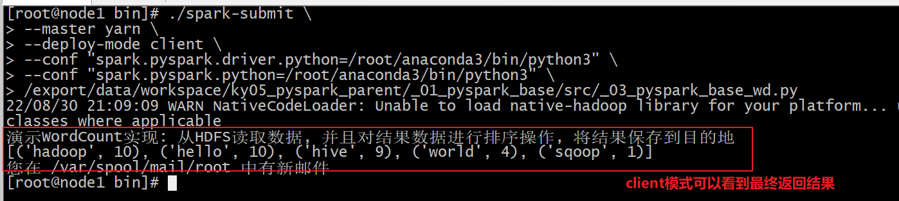

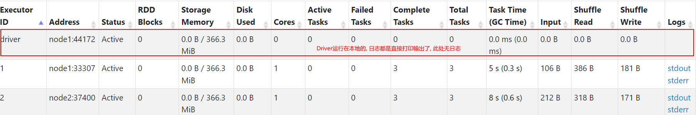


```properties
cluster模式:
cd /export/server/spark/bin/
./spark-submit \
--master yarn \
--deploy-mode cluster \
--conf "spark.pyspark.driver.python=/root/anaconda3/bin/python3" \
--conf "spark.pyspark.python=/root/anaconda3/bin/python3" \
/export/data/workspace/ky05_pyspark_parent/_01_pyspark_base/src/_03_pyspark_base_wd.py
```

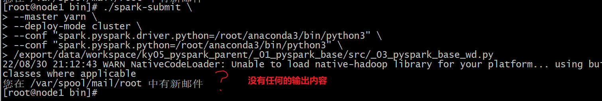

此时必须查看日志, 才能看到是否有内容返回

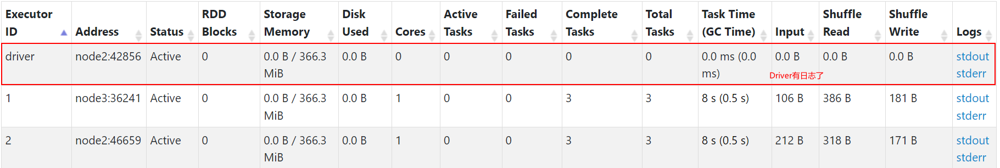


如何查看Spark的日志:

```properties
必须要启动Yarn的HistoryServer日志服务(19888), 以及Spark的日志服务(18080), 否则无法查看的

查看日志的信息, 主要有二种渠道:
	1) 基于8088界面 , 查看对应的任务的执行日志(底层基于19888实现日志访问)
	
	2) 基于Spark提供的18080界面查看具体任务相关日志(底层基于19888实现日志访问)
```

* 方式一: 8088

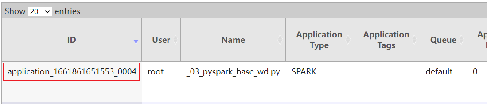

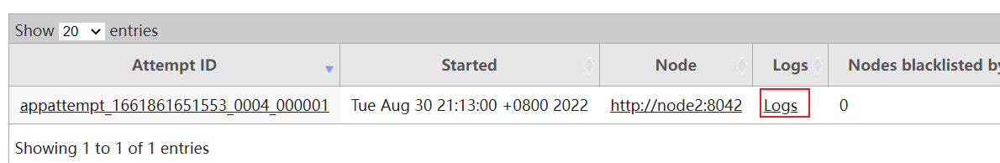

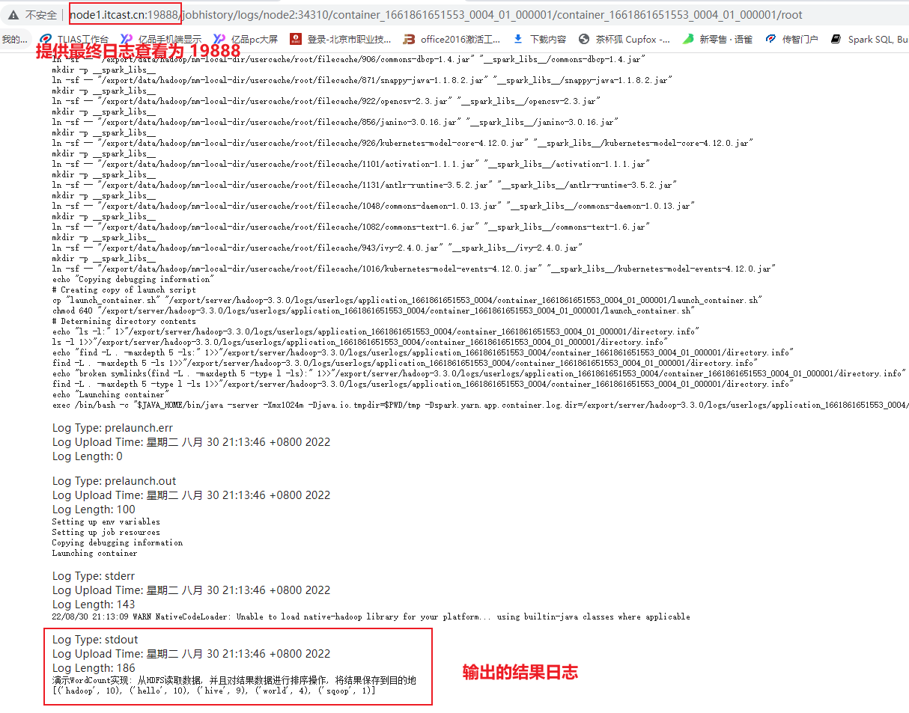

* 方式二: 18080界面

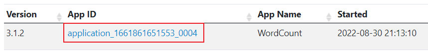

途径一: 查看各个进程的日志

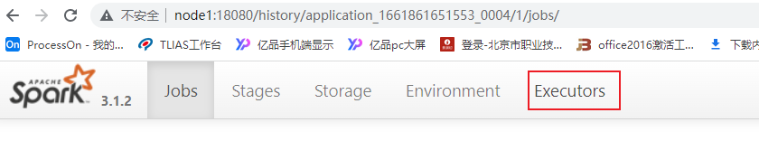

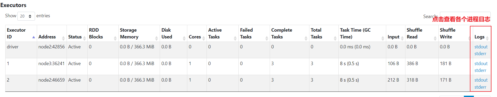

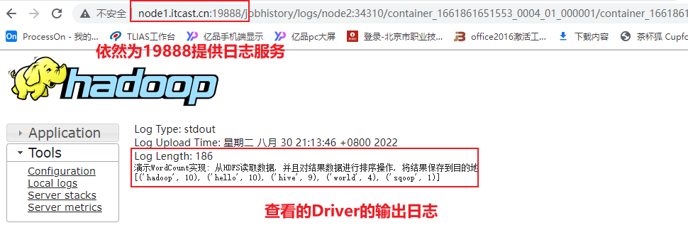

途径二: 通过各个线程查看对应的executor的日志

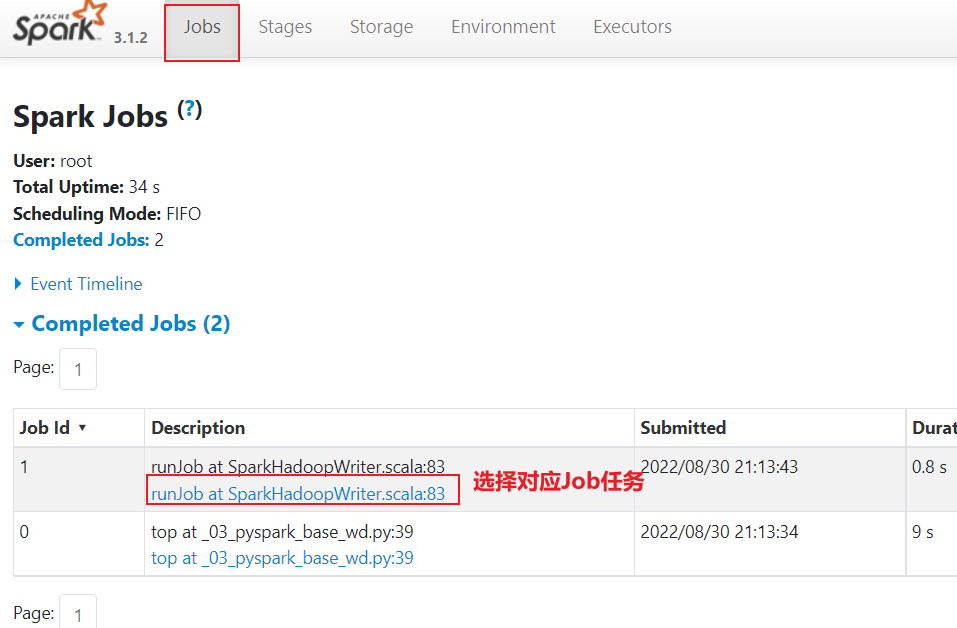

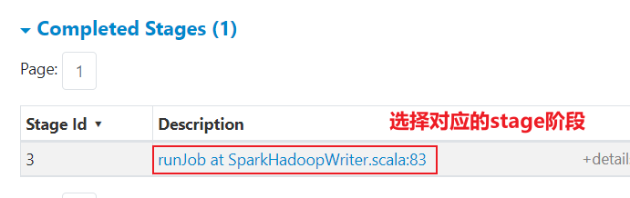

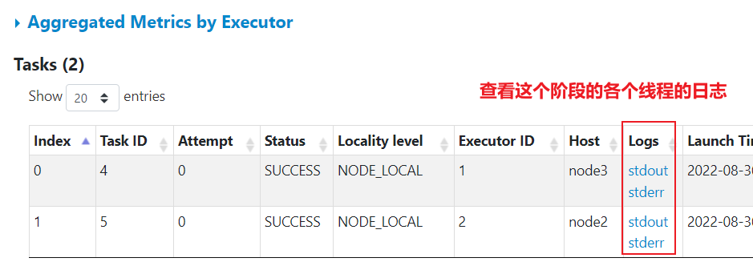


## 3- Spark程序与PySpark交互流程

* 将Spark程序提交到Spark集群采用Client部署模式:

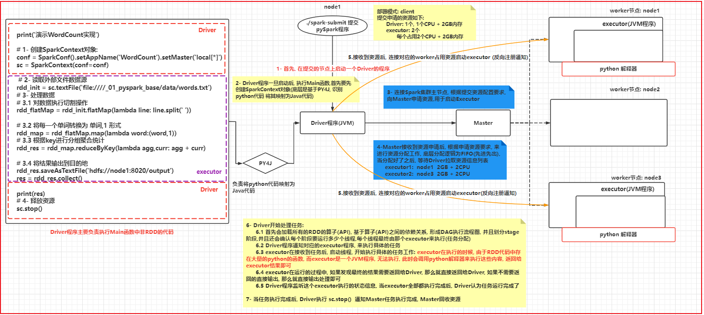

高清图, 请查看图片目录即可


## 4- Spark-submit相关参数说明

​	spark-submit 这个命令 是我们spark提供的一个专门用于提交spark程序的客户端, 可以将spark程序提交到各种资源调度平台上: 比如说 **local(本地)**, spark集群,**yarn集群**, 云上调度平台(k8s ...)

​		spark-submit在提交的过程中, 设置非常多参数, 调整任务相关信息

* 基本参数设置

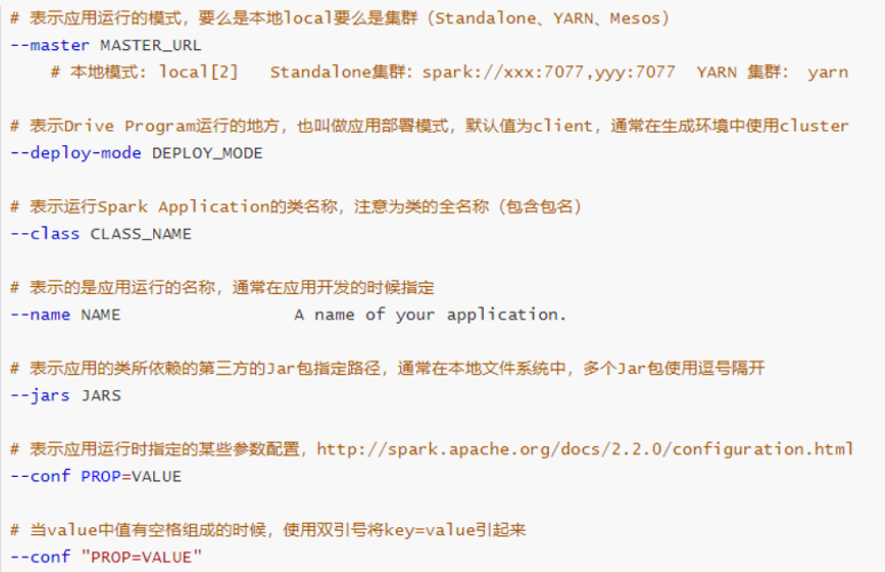

* Driver的资源配置参数


* executor的资源配置参数


