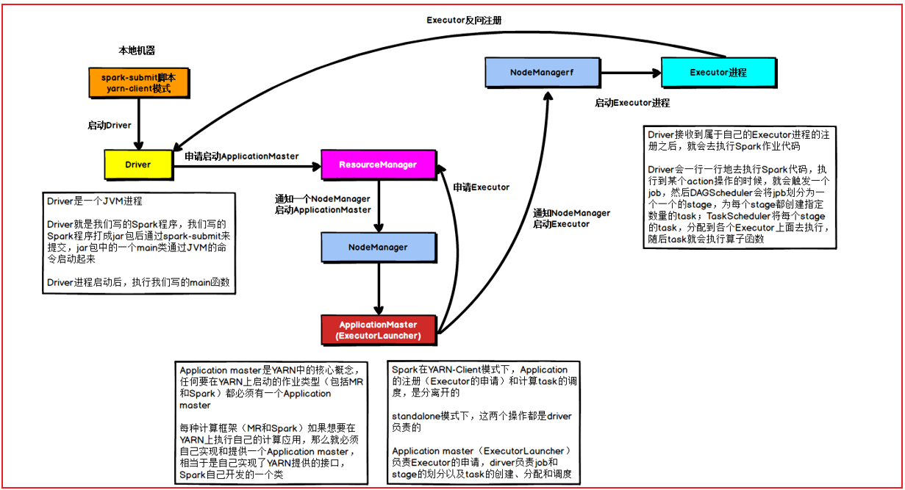
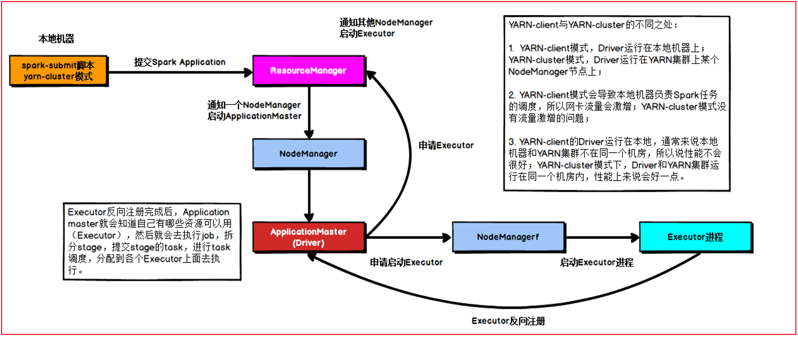
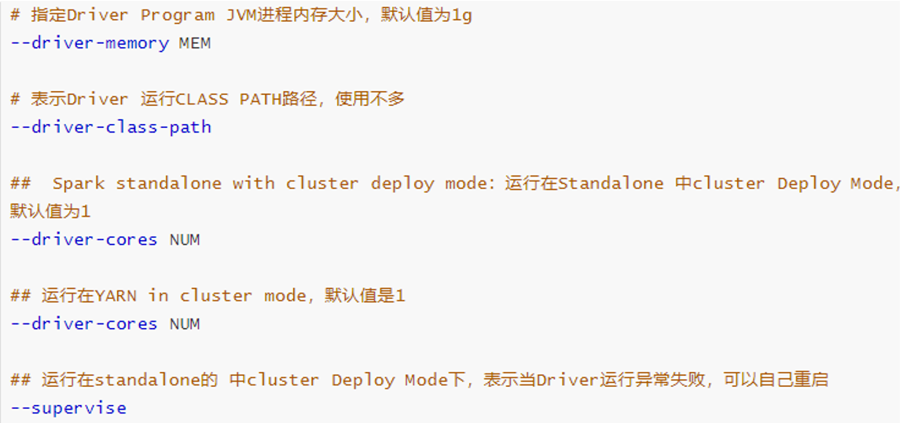
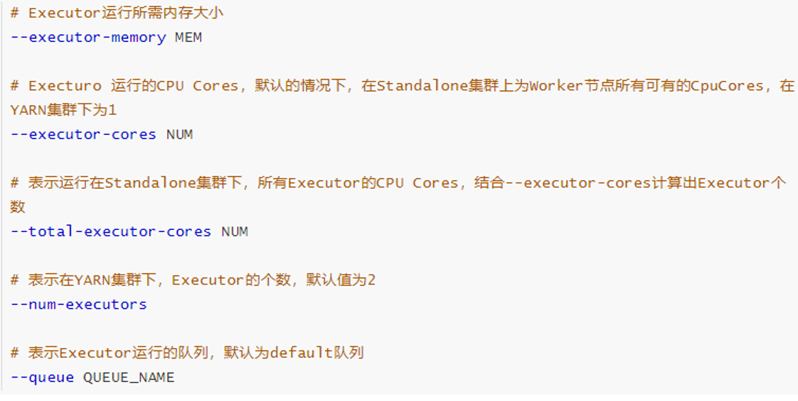
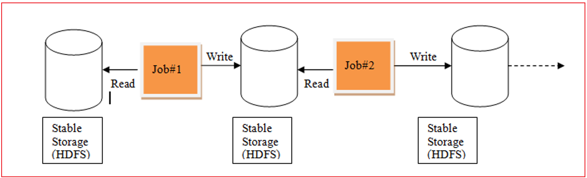
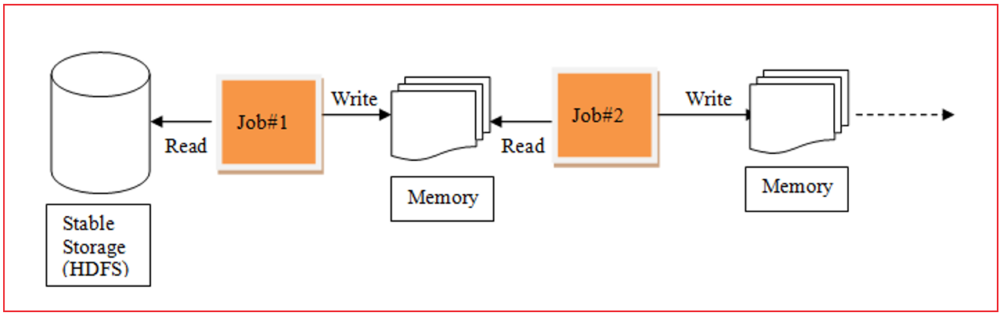

# day03 PySpark课程笔记

今日内容:

* 1- Spark框架与PySpark交互流程 (理解)
* 2- Spark-Submit相关参数说明 (记录)
* 3- RDD的基本介绍 (理解)
* 4- 如何构建RDD(操作)

## 1. Spark框架与PySpark交互流程

* 将Spark程序提交到Spark集群采用Client部署模式:


高清图, 请查看图片目录即可

```properties
1- 首先, 在提交的节点上启动一个Driver的程序
2- Driver程序一旦启动后, 执行Main函数,首先要先创建SparkContext对象(底层是基于PY4J, 识别python代码 将其映射为Java代码)
3- 连接Spark集群主节点, 根据提交资源配置要求, 向Master申请资源,用于启动Executor
4-Master接收到资源申请后, 根据申请资源要求, 来进行资源分配工作, 底层分配逻辑为FIFO(先进先出), 当分配好了之后, 等待Driver拉取资源信息列表     
	executor1:  node1  2GB + 2CPU     
	executor2:  node3  2GB + 2CPU
5.接收到资源后, 连接对应的worker占用资源启动executor (反向注册通知)
6- Driver开始处理任务:       
	6.1 首先会加载所有的RDD的算子(API), 基于算子(API)之间的依赖关系, 形成DAG执行流程图, 并且划分stage阶段,并且还会确认每个阶段要运行多少个线程,每个线程最终由那个executor来执行(任务分配)      
	6.2 Driver程序通知对应的executor程序, 来执行具体的任务      
	6.3 executor在接收到任务后, 启动线程, 开始执行具体的任务工作: executor在执行的时候, 由于RDD代码中存在大量的python的函数, 而executor是一个JVM程序, 无法执行, 此时会调用python解释器来执行这些内容, 返回给executor结果即可      
	6.4 executor在运行的过程中, 如果发现最终的结果需要返回给Driver, 那么就直接返回给Driver, 如果不需要返回的直接输出, 那么就直接输出处理即可      
	6.5 Driver程序监听这个executor执行的状态信息, 当executor全部都执行完成后, Driver认为任务运行完成了

7- 当任务执行完成后, Driver执行 sc.stop()  通知Master任务执行完成, Master回收资源
```

* PySpark程序提交Spark集群:  部署方式Cluster

```properties
1- 首先客户端将PySpark任务提交到Spark集群的Master节点上
2- Master收到任务后, 首先会根据任务信息中, 提供的Driver的资源信息, 随机找一台worker节点(找一个相对不忙,有资源)启动Driver程序 
3- Driver程序一旦启动后, 执行Main函数,首先要先创建SparkContext对象(底层是基于PY4J, 识别python代码 将其映射为Java代码), 同时启动后Driver程序也会和Master建立心跳
4- Driver程序根据任务信息中关于executor的资源配置要求, 向Master申请资源,用于启动Executor
5- Master接收到资源申请后, 根据申请资源要求, 来进行资源分配工作, 底层分配逻辑为FIFO(先进先出), 当分配好了之后, 等待Driver拉取资源信息列表     
	executor1:  node1  2GB + 2CPU     
	executor2:  node3  2GB + 2CPU
6. Driver接收到资源后, 连接对应的worker占用资源启动executor (反向注册通知)
7- Driver开始处理任务:       
	7.1 首先会加载所有的RDD的算子(API), 基于算子(API)之间的依赖关系, 形成DAG执行流程图, 并且划分stage阶段,并且还会确认每个阶段要运行多少个线程,每个线程最终由那个executor来执行(任务分配)      
	7.2 Driver程序通知对应的executor程序, 来执行具体的任务      
	7.3 executor在接收到任务后, 启动线程, 开始执行具体的任务工作: executor在执行的时候, 由于RDD代码中存在大量的python的函数, 而executor是一个JVM程序, 无法执行, 此时会调用python解释器来执行这些内容, 返回给executor结果即可      
	7.4 executor在运行的过程中, 如果发现最终的结果需要返回给Driver, 那么就直接返回给Driver, 如果不需要返回的直接输出, 那么就直接输出处理即可      
	7.5 Driver程序监听这个executor执行的状态信息, 当executor全部都执行完成后, Driver认为任务运行完成了

8- 当任务执行完成后, Driver执行 sc.stop()  通知Master任务执行完成, Master回收资源
```

* PySpark程序提交Yarn集群: 部署方式Client



```properties
1- 首先, 在提交的节点上启动一个Driver的程序
2- Driver程序一旦启动后, 执行Main函数,首先要先创建SparkContext对象(底层是基于PY4J, 识别python代码 将其映射为Java代码)
3- 连接Yarn集群主节点, 根据提交资源配置要求,向Yarn提交了一个任务, 此任务的目的帮助申请资源, 并且启动executor
4- Yarn接收到任务信息后, 首先会先随机的在某一台nodemanager节点上, 启动ApplicationMaster, 当applicationMaster启动完成后, 会Yarn建立心跳机制,告知Yarn, 已经启动成功了
5- AppMaster接下来的就要进行资源申请工作, 将需要申请的资源通过心跳的方式发送给RM, RM收到资源信息, 就会调用Yarn的资源调度器来进行资源的分配工作, 分配好后等待AppMaster的拉取即可     
	executor1:  node1  2GB + 2CPU     
	executor2:  node3  2GB + 2CPU
6.AppMaster不断的基于心跳询问Yarn主节点是否已经准备好资源列表, 一旦发现准备好了, 立即获取,然后根据对应的资源信息连接对应的nodemanager占用资源启动executor (反向注册通知给Driver程序)
7- Driver开始处理任务:       
	7.1 首先会加载所有的RDD的算子(API), 基于算子(API)之间的依赖关系, 形成DAG执行流程图, 并且划分stage阶段,并且还会确认每个阶段要运行多少个线程,每个线程最终由那个executor来执行(任务分配)      
	7.2 Driver程序通知对应的executor程序, 来执行具体的任务      
	7.3 executor在接收到任务后, 启动线程, 开始执行具体的任务工作: executor在执行的时候, 由于RDD代码中存在大量的python的函数, 而executor是一个JVM程序, 无法执行, 此时会调用python解释器来执行这些内容, 返回给executor结果即可      
	7.4 executor在运行的过程中, 如果发现最终的结果需要返回给Driver, 那么就直接返回给Driver, 如果不需要返回的直接输出, 那么就直接输出处理即可      
	7.5 Driver程序监听这个executor执行的状态信息, 当executor全部都执行完成后, Driver认为任务运行完成了

8- 当任务执行完成后, Driver执行 sc.stop()  此时各个executor通知AppMaster任务已经执行完成,AppMaster通知Yarn主节点, 任务运行完成, Yarn通知AppMaster退出程序, 同时回收资源


核心: On Yarn Client模式中  Driver程序将资源申请工作, 交给了AppMaster  Driver仅负责任务的管理工作
```

* PySpark程序提交Yarn集群: 部署方式cluster模式



```properties
1- 首先, 连接Yarn集群的主节点提交任务
2- 当YARN主节点接收到任务后, 首先会先随机的选择一台nodemanager来启动AppMaster(Driver)程序, 当AppMaster(Driver)程序启动后, 会和Yarn的主节点建立心跳机制, 报告已经启动完成了

3- AppMaster(Driver)程序一旦启动后, 执行Main函数,首先要先创建SparkContext对象(底层是基于PY4J, 识别python代码 将其映射为Java代码)
4- AppMaster(Driver)接下来的就要进行资源申请工作, 将需要申请的资源通过心跳的方式发送给RM, RM收到资源信息, 就会调用Yarn的资源调度器来进行资源的分配工作, 分配好后等待AppMaster(Driver)的拉取即可     
	executor1:  node1  2GB + 2CPU     
	executor2:  node3  2GB + 2CPU
5.AppMaster(Driver)不断的基于心跳询问Yarn主节点是否已经准备好资源列表, 一旦发现准备好了, 立即获取,然后根据对应的资源信息连接对应的nodemanager占用资源启动executor (反向注册通知给AppMaster(Driver)程序)
7- AppMaster(Driver)开始处理任务:       
	7.1 首先会加载所有的RDD的算子(API), 基于算子(API)之间的依赖关系, 形成DAG执行流程图, 并且划分stage阶段,并且还会确认每个阶段要运行多少个线程,每个线程最终由那个executor来执行(任务分配)      
	7.2 AppMaster(Driver)程序通知对应的executor程序, 来执行具体的任务      
	7.3 executor在接收到任务后, 启动线程, 开始执行具体的任务工作: executor在执行的时候, 由于RDD代码中存在大量的python的函数, 而executor是一个JVM程序, 无法执行, 此时会调用python解释器来执行这些内容, 返回给executor结果即可      
	7.4 executor在运行的过程中, 如果发现最终的结果需要返回给AppMaster(Driver), 那么就直接返回给AppMaster(Driver), 如果不需要返回的直接输出, 那么就直接输出处理即可      
	7.5 AppMaster(Driver)程序监听这个executor执行的状态信息, 当executor全部都执行完成后, Driver认为任务运行完成了

8- 当任务执行完成后, AppMaster(Driver)执行 sc.stop()  AppMaster(Driver)通知Yarn主节点, 任务运行完成, Yarn通知AppMaster(Driver)退出程序, 同时回收资源


核心: On Yarn cluster模式中  Driver程序 和 AppMaster程序 二合一, 共同资源申请 和 任务管理工作
```


## 2. Spark-Submit相关的参数说明

​	spark-submit 这个命令 是我们spark提供的一个专门用于提交spark程序的客户端, 可以将spark程序提交到各种资源调度平台上: 比如说 **local(本地)**, spark集群,**yarn集群**, 云上调度平台(k8s ...)

​		spark-submit在提交的过程中, 设置非常多参数, 调整任务相关信息

* 基本参数设置


* Driver的资源配置参数



* executor的资源配置参数




## 3. RDD的基本介绍

### 3.1 什么是RDD

RDD: 弹性的分布式数据集

RDD出现的目的: 用于支持更高效的迭代计算操作

背景:

```properties
在早期的计算模型中:  单机模型
	比如: Excel MySQL
	依赖于单个节点性能
	适用于少量数据集统计计算分析处理工作  整个计算也是基于一个进程中, 进行不断的迭代处理操作

当数据体量变大了以后, 单机这种模型可能无法进行处理操作, 此时可以采用分布式计算模型
	核心: 让更多的节点参与计算, 将计算任务进行划分, 将各个部分交给各个节点来执行处理操作, 运行完成后, 将结果进行汇总整合即可(分而治之)
	
	比如: MR SPARK  FLINK  STORM(几乎很少有人用了)....
	
	MapReduce计算模型:  
		在整个计算过程中, 每一个MR都是由 MapTask 和 ReduceTask 组成的
		在计算过程中, 需要将数据从磁盘读取到内存中, 从内存落入到磁盘中, 再次磁盘中读取, 在落入内存 .... 整个计算操作IO是非常大(MR也被称为IO密集型框架) 从而导致执行效率非常低
	
		由于整个MR只有MapTask和ReduceTask, mapTask用于分布式计算操作, reduceTask进行汇总处理, 如果需要进行多次的分布式处理, 多次的聚合处理呢, 对于MR来说, 单个MR无法处理, 必须将多个MR串联在一起, 每一个MR都要重新申请资源 回收资源,大量的时间可能都浪费在资源处理上, 以及IO处理上, 整个迭代计算效率也是非常差的
		
		发现 MR存在的一些问题点: 
			1- 是否可以让中间处理过程尽可能在内存中, 从而提升效率
			2- 是否可以在一个程序中支持多次完成不断的迭代计算
		
		这些解决的问题方案, 最终由Spark来具体处理, Spark的RDD的产生就是为了解决这样的问题
```

MR的迭代计算过程:



Spark的迭代计算过程



### 3.2 RDD的五大特性(明确知道)

五大特性:

```properties
1- RDD是可分区: RDD的分区是一个抽象的分区,  每一个RDD的分区对应就是一个线程 多个分区实现并行计算
2- RDD的计算函数是作用在RDD的每一个分区上的
3- RDD之间存在依赖关系的
4- [可选的] 对于KV类型的RDD 默认每一个分区是基于Hash 分区方案来处理的
5- [可选的] 移动数据不如移动计算, 让计算函数运行在离数据最近的地方
```


### 3.3 RDD的五大特点(明确知道)

五大特点:

```properties
1- RDD是可分区的, 通过计算函数作用在每个分区上: RDD分区是一个抽象的分区(定义好了分区规则)
2- RDD是只读的: 一个RDD对象中数据是不可变的
3- RDD之间是存在依赖关系: 依赖关系称为血缘关系, 一般分为 宽依赖 和 窄依赖
		整个血缘关系非常的长, 重新计算的代码会非常的长
4- 缓存: 当需要对一个RDD的结果进行重复使用的时候, 可以将这个RDD计算结果缓存起来, 减少后续重新计算的资源的消耗和时间消耗

5- checkpoint(检查点): 
	当依赖链条非常长的时候, 如果其中一个计算函数出现失败, 就会导致重新计算, 而重新计算一次整个代码比较高的
	
	可以使用检查点, 对整个依赖链条进行截断, 对应的截断位置上计算当前的计算结果, 这样后续一旦出现问题, 可以从截断位置直接恢复数据, 不需要重新回溯全部链条
	检查点数据是可以保存到HDFS上
```


## 4 如何构建RDD

构建RDD对象的方式主要有二种:

```properties
1- 通过 parallelism 并行的方式来构建RDD (程序内部模拟数据)  -- 测试

2- 通过读取外部文件的方式来获取一个RDD对象
```


### 4.1 通过并行的方式来构建RDD

代码演示:

```properties
# 演示WordCount实现代码
from pyspark import SparkContext, SparkConf
import os

# 锁定远程的环境版本(固定代码): 写了一定是没问题的, 但是不写可能会报错
os.environ['SPARK_HOME'] = '/export/server/spark'
os.environ['PYSPARK_PYTHON'] = '/root/anaconda3/bin/python3'
os.environ['PYSPARK_DRIVER_PYTHON'] = '/root/anaconda3/bin/python3'


if __name__ == '__main__':
    print("演示: RDD的构建方式  方式一 程序内部初始化数据")

    # 1- 创建SparkContext对象
    conf = SparkConf().setAppName('create_rdd').setMaster('local[*]')
    sc = SparkContext(conf=conf)

    # 2- 构建RDD对象:  方式一
    rdd_init = sc.parallelize(['张三','李四','王五','赵六','田七','周八','李九'])

    print(type(rdd_init))
    print(rdd_init.collect())

    # RDD是可分区,那么此处的RDD是否有分区呢?
    print(rdd_init.getNumPartitions()) # 查看当前这个RDD有多少个分区
    # 那如何查看每个分区的数据内容呢?
    # [['张三', '李四', '王五'], ['赵六', '田七', '周八', '李九']]
    print(rdd_init.glom().collect())


```

总结:

```properties
总结方式一的RDD的分区数量的说明: 
1) 默认情况下, 分区数量取决于 setMaster参数设置, 比如 local[5] 表示有五个线程, 默认就是五个5分区 如果loca[*] 默认与当前节点CPU核数是相同的

2) 支持手动设置数据的分区数量: 
	sc.parallelize(初始化数据, 分区数量)

建议: 手动设置分区数量 尽量不要超过 初始的线程的数量

相关的API:
1) 如何获取分区的数量:  rdd.getNumPartitions()
2) 如何获取每个分区的内容: rdd.glom().collect()
```

