# day04_PySpark课程笔记

今日内容:

* 1- Spark Core 如何构建RDD
* 2- RDD算子相关的操作
* 3- 综合案例

## 1 如何构建RDD

构建RDD对象的方式主要有二种:

```properties
1- 通过 parallelism 并行的方式来构建RDD (程序内部模拟数据)  -- 测试

2- 通过读取外部文件的方式来获取一个RDD对象
```


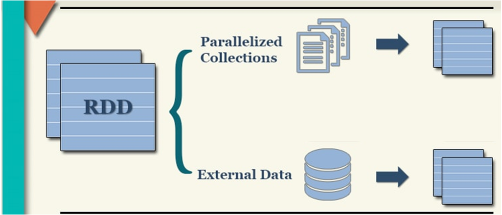

### 1.1 通过并行的方式来构建RDD

代码演示:

```properties
# 演示WordCount实现代码
from pyspark import SparkContext, SparkConf
import os

# 锁定远程的环境版本(固定代码): 写了一定是没问题的, 但是不写可能会报错
os.environ['SPARK_HOME'] = '/export/server/spark'
os.environ['PYSPARK_PYTHON'] = '/root/anaconda3/bin/python3'
os.environ['PYSPARK_DRIVER_PYTHON'] = '/root/anaconda3/bin/python3'


if __name__ == '__main__':
    print("演示: RDD的构建方式  方式一 程序内部初始化数据")

    # 1- 创建SparkContext对象
    conf = SparkConf().setAppName('create_rdd').setMaster('local[*]')
    sc = SparkContext(conf=conf)

    # 2- 构建RDD对象:  方式一
    rdd_init = sc.parallelize(['张三','李四','王五','赵六','田七','周八','李九'])

    print(type(rdd_init))
    print(rdd_init.collect())

    # RDD是可分区,那么此处的RDD是否有分区呢?
    print(rdd_init.getNumPartitions()) # 查看当前这个RDD有多少个分区
    # 那如何查看每个分区的数据内容呢?
    # [['张三', '李四', '王五'], ['赵六', '田七', '周八', '李九']]
    print(rdd_init.glom().collect())


```

总结:

```properties
总结方式一的RDD的分区数量的说明: 
1) 默认情况下, 分区数量取决于 setMaster参数设置, 比如 local[5] 表示有五个线程, 默认就是五个5分区 如果loca[*] 默认与当前节点CPU核数是相同的

2) 支持手动设置数据的分区数量: 
	sc.parallelize(初始化数据, 分区数量)

建议: 手动设置分区数量 尽量不要超过 初始的线程的数量

相关的API:
1) 如何获取分区的数量:  rdd.getNumPartitions()
2) 如何获取每个分区的内容: rdd.glom().collect()
```


### 1.2 通过读取外部文件方式构建RDD

代码演示:

```properties
# 演示WordCount实现代码
from pyspark import SparkContext, SparkConf
import os

# 锁定远程的环境版本(固定代码): 写了一定是没问题的, 但是不写可能会报错
os.environ['SPARK_HOME'] = '/export/server/spark'
os.environ['PYSPARK_PYTHON'] = '/root/anaconda3/bin/python3'
os.environ['PYSPARK_DRIVER_PYTHON'] = '/root/anaconda3/bin/python3'


if __name__ == '__main__':
    print("演示: RDD的构建方式  方式二 通过读取外部文件方式")

    # 1- 创建SparkContext对象
    conf = SparkConf().setAppName('create_rdd').setMaster('local[*]')
    sc = SparkContext(conf=conf)

    # 2- 读取外部文件数据: textFile
    # 参数1:  表示的加载数据的路径地址, 支持文件或者目录   格式: 协议+路径
    #       本地文件: file:///路径  由于咱们连接的是远程环境, 所有此处的本地路径指的是远程环境的本地
    #       HDFS: hdfs://node1:8020/路径
    # 参数2:  minPartitions=N 最小分区数量, 一旦设置了, RDD的分区数量至少保留N个
    rdd_init = sc.textFile(
        'file:///export/data/workspace/ky05_pyspark_parent/_02_pyspark_core/data/')

    print(rdd_init.collect())
    # 查看RDD的分区
    print(rdd_init.getNumPartitions())
    print(rdd_init.glom().collect())


说明： 
	目前发现通过textFile读取外部文件, 分区数量与方式一是不同的
```

​		发现, 在读取的时候, 通过TextFile, 有多少个文件, 至少会产生多少个分区, 一个分区在后续产生一个线程任务来处理这个分区数据, 如果分区数量增大, 对应线程数量也会增大, 导致后续输出到目录中文件数量也会变多, 以及一个线程仅仅处理一个小文件, 造成资源的浪费


如何处理呢?  wholeTextFiles

```properties
# 演示WordCount实现代码
from pyspark import SparkContext, SparkConf
import os

# 锁定远程的环境版本(固定代码): 写了一定是没问题的, 但是不写可能会报错
os.environ['SPARK_HOME'] = '/export/server/spark'
os.environ['PYSPARK_PYTHON'] = '/root/anaconda3/bin/python3'
os.environ['PYSPARK_DRIVER_PYTHON'] = '/root/anaconda3/bin/python3'


if __name__ == '__main__':
    print("演示: RDD的构建方式  方式二 通过读取外部文件方式")

    # 1- 创建SparkContext对象
    conf = SparkConf().setAppName('create_rdd').setMaster('local[10]')
    sc = SparkContext(conf=conf)

    # 2- 读取外部文件数据: textFile
    # wholeTextFiles : 尽可能减少分区的数量, 同时保证效率, 如果处理后不满意, 可以通过手动方式设置最小分区数量
    rdd_init = sc.wholeTextFiles(
        'file:///export/data/workspace/ky05_pyspark_parent/_02_pyspark_core/data/',
        minPartitions=5
    )

    print(rdd_init.collect())
    # 查看RDD的分区
    print(rdd_init.getNumPartitions())
    print(rdd_init.glom().collect())

注意: 
	wholeTextFiles 在返回的结果中, 返回的是一个二元的元组, 启动key为文件的路径, 而value为文件中内容
```


如何确定RDD的分区数量:

```properties
1- 当采用并行的方式来构建RDD的时候, RDD分区数量取决于设置的分区数, 如果没有设置, 取决于 --master的设置

2- 当采用textFile来构建的RDD:
	2.1  第一步: 先是两个值找一个最小值
			minPartition = min(spark.default.parallelism, 2)
			
			如果有明确的设置最小值的操作, 以设置为准
	
	2.2 第二步: 两值找最大值
		rdd的分区数量  = max(文件切片数量/hdfs的block块数据,minPartition)
```


## 2. RDD算子相关操作

​		在Spark中, 将支持传递函数的 或者说 具有一定特殊功能的方法或者函数称为算子, 或者可以认为RDD调度的函数都可以被称为算子

### 2.1 RDD算子分类

​			在整个RDD中, 主要有二大类算子: 一类为 Transformation(转换算子)   一类为 action(动作算子)

```properties
TransFormation算子: 转换算子
	1) 所有的转换算子执行完成后了都会返回一个新的RDD对象
	2) 转换算子都是lazy(惰性), 只有遇到action动作算子后才会触发执行
	3) 不负责数据的存储, 仅仅是定义了计算的规则
	
action算子: 动作算子
	1) 立即执行(一个action算子, 至少会产生一个JOB任务 一个Job任务会产生一个DAG执行流程图): 如果一个spark程序中有多个action算子, 那么也会产生多个Job任务
	2) action算子不会返回新的RDD对象: 要不就没有返回值, 要不就返回其他的内容
```


转换算子:

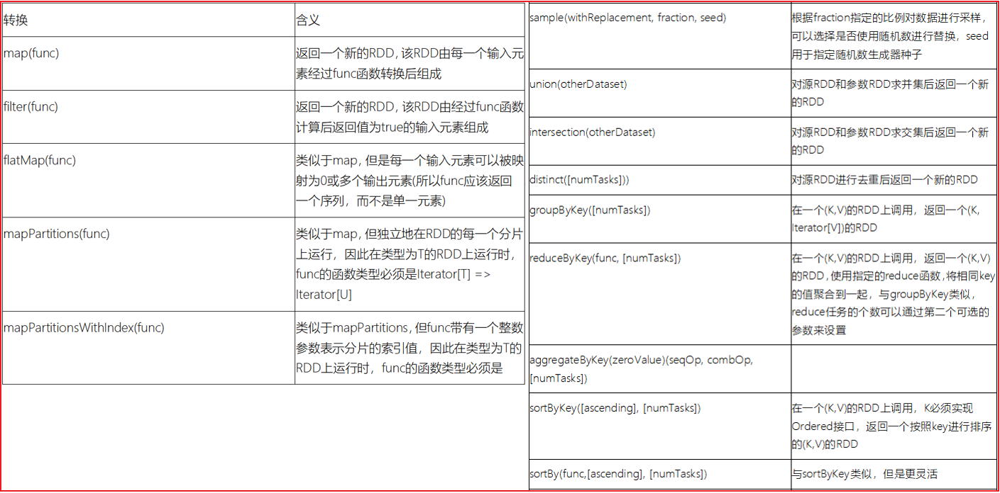

action算子:

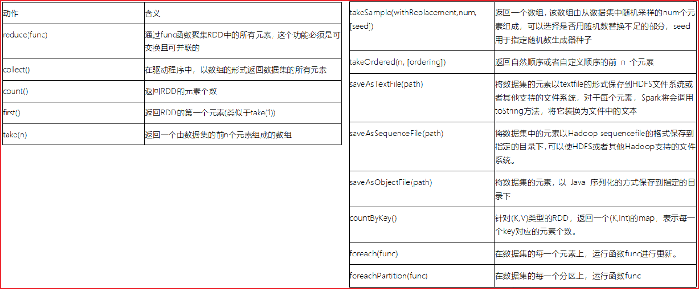


Spark官网中所有的RDD算子地址: https://spark.apache.org/docs/3.1.2/api/python/reference/pyspark.html#rdd-apis


后续关于算子的演示, 重点关注在这些算子有什么作用, 至于实际应用, 可以在后续的案例中看到(算子的作用, 其实指的就是应用场景)

### 2.2 RDD的转换算子操作

第一类: 值类型的算子 (只对value数据进行处理操作)

* map(fn): 
  * 指的: 根据用户传入的自定义函数, 将数据进行一对一的转换处理操作

```properties
需求: 初始化一个1~10的数据, 让每一个数据 +1 返回

rdd_init = sc.parallelize([1,2,3,4,5,6,7,8,9,10])

rdd_init.map(lambda num: num + 1).collect()
结果内容: 
[2, 3, 4, 5, 6, 7, 8, 9, 10, 11]

说明:  当前使用匿名函数(lambda函数), 这种函数都是可以转换为普通函数的

def fn1(num):
	return num + 1

rdd_init.map(fn1).collect()
结果内容: 
[2, 3, 4, 5, 6, 7, 8, 9, 10, 11]
```

* groupBy(fn):
  * 指的: 根据用户传入的自定义函数, 对数据进行分组操作

```properties
rdd_init = sc.parallelize([1,2,3,4,5,6,7,8,9,10])

需求: 将数据 奇数  和 偶数拆分开
rdd_init.groupBy(lambda num: 'o' if num % 2 == 0 else 'j' ).collect()
结果:
	[
		('j', <pyspark.resultiterable.ResultIterable object at 0x7f334c8fb2e0>), 
		('o', <pyspark.resultiterable.ResultIterable object at 0x7f334d4daa30>)
	]
说明: 分组确实是分组了, 但是value目前是一个可迭代的对象, 如果从这个对象找那个将结果数据出来呢?  mapValues(xxx)
rdd_init.groupBy(lambda num: 'o' if num % 2 == 0 else 'j' ).mapValues(list).collect()
结果: 
[('j', [1, 3, 5, 7, 9]), ('o', [2, 4, 6, 8, 10])]
```

* filter(fn):
  * 指的: 根据用户传入的自定义函数, 对数据进行过滤操作, 如果过滤条件结果为True 表示保留, 否则表示删除

```properties
rdd_init = sc.parallelize([1,2,3,4,5,6,7,8,9,10])

需求: 将数据 >7的过滤掉
rdd_init.filter(lambda num: num <=7).collect()
结果:
[1, 2, 3, 4, 5, 6, 7]
```

* flatMap(fn)
  * 指的:  对数据先执行map操作, 然后执行偏平化处理

```properties
rdd_init = sc.parallelize(['张三 李四 王五','赵六 田七 周八 李九'])

需求: 将每个元素中的姓名拆解为一个姓名
map演示: 一对一
rdd_init.map(lambda line: line.split(' ')).collect()
[
	['张三', '李四', '王五'], 
	['赵六', '田七', '周八', '李九']
]

flatMap演示:
rdd_init.flatMap(lambda line: line.split(' ')).collect() 
结果:
[
	'张三', '李四', '王五', '赵六', '田七', '周八', '李九'
]
```

第二类: 双值类型的算子

* union(并集) 和 intersection(交集)

```properties
rdd1 = sc.parallelize([1,3,4,6,7,9])
rdd2 = sc.parallelize([1,5,4,2,7,9,10])

交集:
rdd1.intersection(rdd2).collect()
[4, 1, 9, 7]

并集:
rdd1.union(rdd2).collect()
结果: 
[1, 3, 4, 6, 7, 9, 1, 5, 4, 2, 7, 9, 10]

去重:
rdd1.union(rdd2).distinct().collect()
[4, 1, 9, 5, 6, 2, 10, 3, 7]
```

第三类:  kv类型的算子:

* groupByKey() 
  * 作用: 根据key进行分组, 分组后, 将每组的value数据合并为一个列表

```properties
rdd_init = sc.parallelize([('c01','张三'),('c02','李四'),('c01','王五'),('c03','赵六'),('c02','田七'),('c01','周八'),('c03','李九')])

需求: 根据key分组, 查看每组内有那些数据
rdd_init.groupByKey().collect()
结果:
[
	('c01', <pyspark.resultiterable.ResultIterable object at 0x7f334c8efd90>), 
	('c02', <pyspark.resultiterable.ResultIterable object at 0x7f334c8efa30>), 
	('c03', <pyspark.resultiterable.ResultIterable object at 0x7f334c8efca0>)
]
rdd_init.groupByKey().mapValues(list).collect()
结果:
[
	('c01', ['张三', '王五', '周八']), 
	('c02', ['李四', '田七']), 
	('c03', ['赵六', '李九'])
]
```

* reduceByKey(fn):
  * 作用: 根据key进行分组操作, 根据用户传递的自定义函数进行聚合统计操作

```properties
rdd_init = sc.parallelize([('c01','张三'),('c02','李四'),('c01','王五'),('c03','赵六'),('c02','田七'),('c01','周八'),('c03','李九')])

需求: 统计每个班级有多少个人?
rdd_init.map(lambda element: (element[0],1)).reduceByKey(lambda agg,curr:agg+curr).collect()
结果: 
[('c01', 3), ('c02', 2), ('c03', 2)]
```

* sortByKey():
  * 作用: 根据key进行排序操作, 默认 升序排序,  可以设置asc参数,  将其设置为false 即可实现倒序

```properties
rdd_init = sc.parallelize([('c01', 3), ('c02', 2), ('c03', 2),('c04', 5),('c05', 6)])

升序: 
rdd_init.sortByKey().collect()   
结果:
[('c01', 3), ('c02', 2), ('c03', 2), ('c04', 5), ('c05', 6)]

降序:
rdd_init.sortByKey(False).collect()
结果:
[('c05', 6), ('c04', 5), ('c03', 2), ('c02', 2), ('c01', 3)]


如果相要对value排序, 可以使用sortBy(fn)
rdd_init.sortBy(lambda tup:tup[1],False).collect()
结果: 
[('c05', 6), ('c04', 5), ('c01', 3), ('c02', 2), ('c03', 2)]
```

* countByKey 和 countByValue
  * 作用:  ByKey 是根据key进行分组, 统计每个组内有多少个,  ByValue是根据每一个元素进行分组, 统计每个value有多少个

```properties
rdd_init = sc.parallelize([('c01','张三'),('c02','李四'),('c01','王五'),('c03','赵六'),('c02','王五'),('c01','王五'),('c03','张三')])

rdd_init.countByKey()
结果: 
 {'c01': 3, 'c02': 2, 'c03': 2}


rdd_init.countByValue()
结果: 
{
	('c01', '张三'): 1, 
	('c02', '李四'): 1, 
	('c01', '王五'): 2, 
	('c03', '赵六'): 1, 
	('c02', '王五'): 1, 
	('c03', '张三'): 1
}

特殊: 本质上是一个action算子 因为可以直接得结果, 返回不是一个RDD对象
```

### 2.3 RDD的动作算子操作

* collect(): 
  * 作用: 用于将RDD的各个分区的数据收集在一起, 进行返回, 得到一个列表数据
* reduce(fn):
  * 作用: 根据用户传入的自定义函数, 用于对数据进行聚合操作
  * 与reduceByKey的区别:  1- reduce是一个action算子  2- reduce没有分组操作, 将所有内容作为一个组

```properties
rdd_init = sc.parallelize([1,2,3,4,5,6,7,8,9,10])

需求: 求总和
rdd_init.reduce(lambda agg,curr:agg + curr)
55
```

* first():
  * 作用:  用于获取第一个元素

```properties
rdd_init = sc.parallelize([1,2,3,4,5,6,7,8,9,10])

rdd.first()
结果
1
```

* take(N):
  * 类似于 limit操作 返回前N个元素

```properties
rdd_init = sc.parallelize([1,2,3,4,5,6,7,8,9,10])

rdd_init.take(5)
返回:
1,2,3,4,5
```


* top(N,[fn])
  * 获取前N个元素, 会对数据进行倒序排序操作, 默认根据key排序, 如果没有key, 那么根据元素排序, 同时自定义排序方案

```properties
rdd_init = sc.parallelize([3,5,6,7,1,2,9])

rdd_init.top(8)
[9, 7, 6, 5, 3, 2, 1]

rdd_init = sc.parallelize([('c05', 6), ('c04', 5), ('c01', 3), ('c02', 2), ('c03', 2)])

rdd_init.top(5)
[('c05', 6), ('c04', 5), ('c03', 2), ('c02', 2), ('c01', 3)]  -- 根据key排序

rdd_init.top(5,lambda tup:tup[1])
[('c05', 6), ('c04', 5), ('c01', 3), ('c02', 2), ('c03', 2)]  -- 根据value排序
```

* count()
  * 用于获取有多少个元素

```properties
rdd_init = sc.parallelize([3,5,6,7,1,2,9])

rdd_init.count()
结果: 
7
```

* foreach(fn): 
  * 用于对数据进行遍历操作, 至于遍历后做什么取决于用户

```properties
rdd_init = sc.parallelize([3,5,6,7,1,2,9])

rdd_init.foreach(lambda num: print(num))
```

* takeSample()
  * 用于对数据进行数据采样操作(随机的获取一些数据)

```properties
rdd_init = sc.parallelize([1,2,3,4,5,6,7,8,9,10])

算子的参数说明: 
	1- 参数1: 是否允许重复采样, 默认为True
	2- 参数2: 采样的数量(如果参数1位False, 采样的数量最多和数据集的数量是一样的)
	3- 参数3: 种子值 (一旦确定了, 每次采样的结果也是一样的, 值可以随便填写)


rdd_init.takeSample(True,5)
[5, 3, 3, 4, 3]
rdd_init.takeSample(True,5)
[8, 6, 8, 2, 5]
rdd_init.takeSample(True,5)

rdd_init.takeSample(False,5)   
[2, 1, 4, 8, 7]
rdd_init.takeSample(False,5)
[4, 3, 9, 10, 6]

rdd_init.takeSample(False,5,3)
[2, 6, 7, 1, 10]
rdd_init.takeSample(False,3,3)
[2, 6, 7]

```

* saveAsTextFile:
  * 作用: 用于将结果输出到某个目录下, 支持本地目录也支持HDFS


### 2.4 RDD的重要算子

* 基本函数

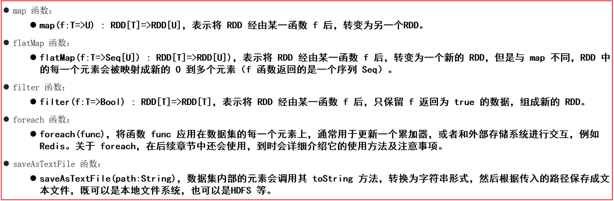

* 分区函数: 

```properties
分区计算函数: 针对每个分区的整体的数据集进行统一处理
普通计算函数: 针对每个分区中每一个数据进行处理


分区函数有什么好处呢? 
	当我们在自定义函数中, 需要连接第三方的软件, 比如数据库 , 这个时候需要在自定义函数中, 构建与数据库的连接操作, 处理后 再将连接关闭掉
	如果使用普通计算函数(有多少条数据, 就会执行多少次), 连接和释放的次数大幅提升, 而分区计算函数, 有多少个分区, 执行多少次, 这样触发的次数大大的减少


注意:
	分区计算函数, 传入到自定义函数中是一个列表, 包含了整个分区的所有的数据, 而普通计算函数传入得是一个个的数据

	在工作中, 如果要使用一个算子的时候, 发现这个算子同时带有一个partition的算子, 建议优先选择带有partition的分区算子, 尤其是需要在算子中进行跟资源相关的操作的时候
```


目前提供的分区函数主要有二个: mapPartitions()  foreachPartition()

```properties
需求一: 分别通过 foreach 和 foreachPartition来演示输出打印操作
rdd_init = sc.parallelize([1,2,3,4,5,6,7,8,9,10],3)

def fn1(num):
    print(num)
    
    
rdd_init.foreach(fn1)
结果: 由于是多线程一起打印, 可能每个人打印的结果 都不一样
4
5
6
1
2
3
7
8
9
10


def fn2(el):
    print(el)

rdd_init.foreachPartition(fn2)
结果为:  只打印了三个, 说明 fn2 只触发了三次
	<itertools.chain object at 0x7ff7fcc1c280>  每一个迭代器表示是一个分区的所有数据
	<itertools.chain object at 0x7ff7fcc1c280>
	<itertools.chain object at 0x7ff7fcc1c280>

def fn2(iter):
    for num in iter:
        print(num)
       
rdd_init.foreachPartition(fn2)
结果:
    1
    2
    3
    4
    5
    6
    7
    8
    9
    10
 

需求二:  map 和 mapPartitions  对数据进行+1返回
rdd_init = sc.parallelize([1,2,3,4,5,6,7,8,9,10],3)
rdd_init.glom().collect()
结果: 
[[1, 2, 3], [4, 5, 6], [7, 8, 9, 10]]


演示Map: 
def fn1(num):
    return num + 1

rdd_init.map(fn1).collect()
结果:
[2, 3, 4, 5, 6, 7, 8, 9, 10, 11]

原生写法:
def fn2(iter):
    list = []
    for num in iter:
        list.append(num + 1)
    return list

简单写法:
def fn2(iter):
    for num in iter:
        yield num + 1

rdd_init.mapPartitions(fn2).collect()
结果:
	[2, 3, 4, 5, 6, 7, 8, 9, 10, 11]
```


* 重分区函数

```properties
重分区函数的作用: 
	用于对RDD的分区数量进行重新划分, 可以通过重分区函数对分区数量进行增加或者减少,甚至可以让数据重新按照新的分区规则来重分区
	
为什么要调整分区呢? 
	分区变多了. 线程变多了, 对应的并行度也会变多了, 提供并行度, 达到提升效率

什么时候需要增大分区呢? 
	当我们原有分区中, 每个分区的数据量比较大的时候, 这个时候可以尝试增大分区, 提高线程数量, 提高并行度, 减少每个线程处理的数据量,最终提升效率

什么时候需要减少分区呢? 
	当每个分区的数量相对比较少的时候, 或者说每个分区中进行了大量的过滤操作, 导致每个分区的数据量变少了, 此时需要减少分区数量
	当需要将数据的统计结果输出到目的地的时候, 为了放置输出的目的地的文件数量过多, 可以减少分区数量
	
```

repartition()算子: 用于增加分区, 减少分区

```properties
此算子会触发shuffle的操作

需求: 将以下数据, 从原有的三个分区, 变更为5个分区
rdd_init = sc.parallelize([1,2,3,4,5,6,7,8,9,10],3)
rdd_init.glom().collect()
结果: 
[[1, 2, 3], [4, 5, 6], [7, 8, 9, 10]]

增加分区:
rdd_init.repartition(5).glom().collect()
[[], [1, 2, 3], [7, 8, 9, 10], [4, 5, 6], []]


减少分区: 从 3 ~ 2
rdd_init.repartition(2).glom().collect()

[[1, 2, 3, 7, 8, 9, 10], [4, 5, 6]]
```

coalesce函数: 默认只能进行减少分区

```properties
默认在减少分区的时候, 不会产生shuffle

rdd_init = sc.parallelize([1,2,3,4,5,6,7,8,9,10],3)
rdd_init.glom().collect()
结果: 
[[1, 2, 3], [4, 5, 6], [7, 8, 9, 10]]


减少分区: 
rdd_init.coalesce(2).glom().collect()
结果
[[1, 2, 3], [4, 5, 6, 7, 8, 9, 10]]

尝试增加分区: 发现失败了 默认是无shuffle 自然也就无法增加分区了
rdd_init.coalesce(5).glom().collect()
[[1, 2, 3], [4, 5, 6], [7, 8, 9, 10]]

当给参数2赋值为True 即可增加分区, 同时也有了shuffle
参数2: 是否执行shuffle操作, 默认为False
rdd_init.coalesce(5,True).glom().collect()
[[], [1, 2, 3], [7, 8, 9, 10], [4, 5, 6], []]


 repartition(N) == coalesce(N,True)
 	可以认为 repartition底层其实就是基于coalesce 实现, 是coalesce(N,True)一种简写
```

partitionBy(N,[fn]) :  调整分区的函数, 也会触发shuffle, 可以增加和减少

```properties
此函数是专门提供给kv类型的数据进行重分区的函数

rdd_init = sc.parallelize([(1,1),(2,2),(3,3),(4,4),(5,5),(6,6),(7,7),(8,8),(9,9),(10,10)],3)

rdd_init.glom().collect()

[	
	[(1, 1), (2, 2), (3, 3)], 
	[(4, 4), (5, 5), (6, 6)], 
	[(7, 7), (8, 8), (9, 9), (10, 10)]
]

rdd_init.partitionBy(5).glom().collect()
结果:
[
	[(5, 5), (10, 10)], 
	[(1, 1), (6, 6)], 
	[(2, 2), (7, 7)], 
	[(3, 3), (8, 8)], 
	[(4, 4), (9, 9)]
]

默认的重分区采用的根据key进行hash分区操作


自定义分区规则: 
需求: 将大于5的放置为一个分区,小于等于5的放置在一个分区
rdd_init.partitionBy(2,lambda key: 0 if key > 5 else 1).glom().collect()
结果:
	[
		[(6, 6), (7, 7), (8, 8), (9, 9), (10, 10)], 
		[(1, 1), (2, 2), (3, 3), (4, 4), (5, 5)]
	]
```

* 聚合函数

```properties
第一类:  单列(单值)聚合函数
	reduce() fold() aggregate()  其中aggregate是reduce算子和fold算子的底层

rdd_init = sc.parallelize([1,2,3,4,5,6,7,8,9,10],3)

需求: 将 1~10数据累加在一起
# reduce(fn) 
rdd_init.reduce(lambda agg,curr:agg+curr)
结果
55

# fold(初始值,fn)  初始值是用于给agg设置值的 agg默认值为0
rdd_init.fold(0,lambda agg,curr:agg+curr)
55
rdd_init.fold(10,lambda agg,curr:agg+curr)
95

# aggregate(初始值, fn1,fn2)

参数1: 设置初始值, 用于给agg赋值的
参数2: 用于执行对每个分区内数据的操作函数
参数3:  用不执行参数2对每个分区计算完的结果进行汇总计算

def fn1(agg,curr):
    return agg +  curr

def fn2(agg,curr):
    return agg +  curr

rdd_init.aggregate(0,fn1,fn2)
结果:
55


rdd_init.aggregate(10,fn1,fn2)
结果
95


说明:  如果说 参数2 和 参数3处理逻辑都是一样的, 可以省略为fold方案, 如果初始值为0 可以省略为reduce

在实际应用中, 优先选择reduce 如果reduce坚决不了的 可以尝试使用fold  如果fold解决不了 尝试
```

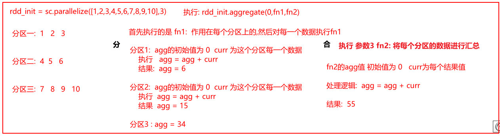

```properties
第二类: kv类型聚合函数
	reduceByKey() foldByKey() aggregateByKey() 
	
	以上这三个和单列值的使用都是一模一样的, 只不过是针对kv类型的数据, 在聚合的之前, 会先对数据进行分组, 是对每组内数据进行聚合, 以上三个是转换算子, 而上面的单列值是action算子
	
	groupByKey(): 只做分组, 不进行聚合操作


思考点: 
	groupByKey + reduce 和 reduceByKey 都可以实现分组聚合计算操作, 思考两个那个效率更好一些呢?
	
	效率最高的是reduceByKey, 原因是: reduceByKey可以实现现在每个分区内对各个分组数据进行提前的聚合计算, 然后汇总后, 在各个分区的结果上进行再次汇总,由于先汇总, 中间传输数据量会减少, 提升效率
	
	而groupByKey + reduce:  先进行分组, 全部都分好以后, 在进行聚合, 会导致中间传输数据量比较大, 影响效率
	
```

reduceByKey做法:

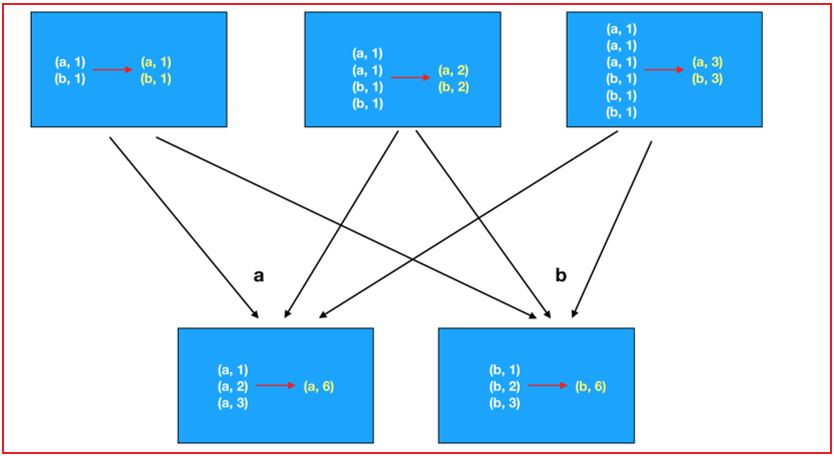

groupByKey + reduce:

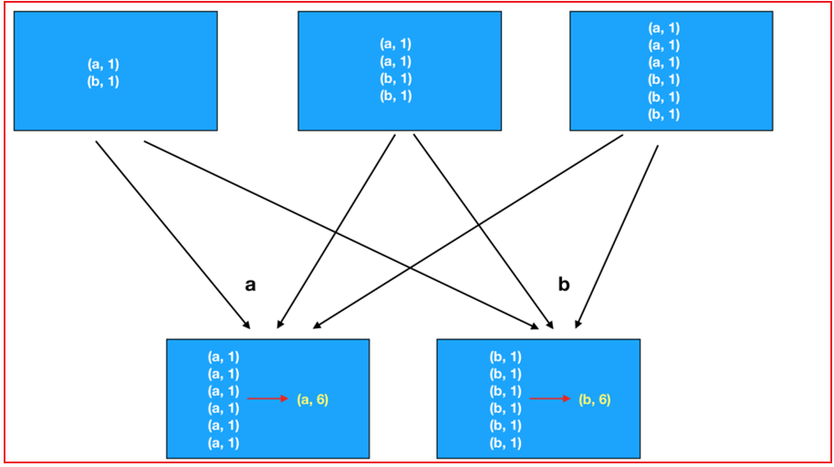


* 关联函数:

```properties
相关的API: 
	join: 内连接
	leftOuterJoin: 左外连接
	rightOuterJoin: 右外连接
	fullOuterJoin: 全外连接(满外连接)

需求: 构建两个数据集, 分别演示各种JOIN操作
rdd1 = sc.parallelize([('c01','张三'),('c02','李四'),('c01','王五'),('c03','赵六'),('c02','田七'),('c01','周八'),('c03','李九'),('c05','老王')])
rdd2 = sc.parallelize([('c01','狂野1期'),('c02','狂野2期'),('c03','狂野3期'),('c04','狂野4期')])

演示:  
# join
rdd1.join(rdd2).collect()
结果:
[
	('c01', ('张三', '狂野1期')), 
	('c01', ('王五', '狂野1期')), 
	('c01', ('周八', '狂野1期')), 
	('c02', ('李四', '狂野2期')), 
	('c02', ('田七', '狂野2期')), 
	('c03', ('赵六', '狂野3期')), 
	('c03', ('李九', '狂野3期'))
]

# leftjoin
rdd1.leftOuterJoin(rdd2).collect()
结果:
[
	('c05', ('老王', None)), 
	('c01', ('张三', '狂野1期')), 
	('c01', ('王五', '狂野1期')), 
	('c01', ('周八', '狂野1期')), 
	('c02', ('李四', '狂野2期')), 
	('c02', ('田七', '狂野2期')), 
	('c03', ('赵六', '狂野3期')), 
	('c03', ('李九', '狂野3期'))
]
# right join
rdd1.rightOuterJoin(rdd2).collect()
结果: 
[
	('c04', (None, '狂野4期')), 
	('c01', ('张三', '狂野1期')), 
	('c01', ('王五', '狂野1期')), 
	('c01', ('周八', '狂野1期')), 
	('c02', ('李四', '狂野2期')), 
	('c02', ('田七', '狂野2期')), 
	('c03', ('赵六', '狂野3期')), 
	('c03', ('李九', '狂野3期'))
]

# 满外连接
rdd1.fullOuterJoin(rdd2).collect()
结果:
[
	('c05', ('老王', None)), 
	('c04', (None, '狂野4期')), 
	('c01', ('张三', '狂野1期')), 
	('c01', ('王五', '狂野1期')), 
	('c01', ('周八', '狂野1期')), 
	('c02', ('李四', '狂野2期')), 
	('c02', ('田七', '狂野2期')), 
	('c03', ('赵六', '狂野3期')), 
	('c03', ('李九', '狂野3期'))
]
```


## 3. 综合案例

### 3.0 配置python的开发模板

模板内容:

```properties
from pyspark import SparkContext, SparkConf
import os

# 锁定远程的环境版本(固定代码): 写了一定是没问题的, 但是不写可能会报错
os.environ['SPARK_HOME'] = '/export/server/spark'
os.environ['PYSPARK_PYTHON'] = '/root/anaconda3/bin/python3'
os.environ['PYSPARK_DRIVER_PYTHON'] = '/root/anaconda3/bin/python3'


if __name__ == '__main__':
    print("python开发模板")

```

如何配置python模板呢?

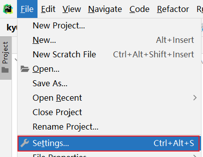

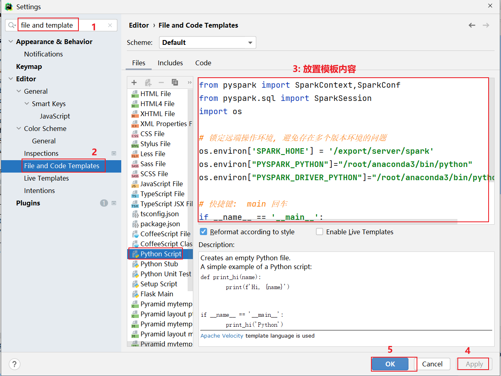


### 3.1 搜索案例

数据集介绍:

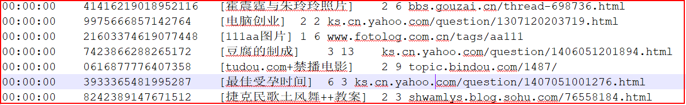

```properties
访问时间   用户id     []里面放置的是用户搜索内容  检索后返回的URL排名   实际用户在页面点击的url排名  用户点击URL


字段与字段之间的分隔符号为 \t 

需求一: 统计每个关键词出现了多少次

需求二:  统计每个用户每个搜索词点击的次数

需求三: 统计每个小时点击次数
```


* 1-  将数据进行切割处理, 将每一行通过一个元组封装起来 , 方便后续获取某一列的数据, 同时还需要对数据进行过滤 将为空行以及字段长度不等于6的数据过滤掉

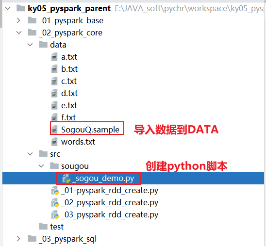

```properties
import time

from pyspark import SparkContext, SparkConf
from pyspark.sql import SparkSession
import os

# 锁定远端操作环境, 避免存在多个版本环境的问题
os.environ['SPARK_HOME'] = '/export/server/spark'
os.environ["PYSPARK_PYTHON"] = "/root/anaconda3/bin/python"
os.environ["PYSPARK_DRIVER_PYTHON"] = "/root/anaconda3/bin/python"

# 快捷键:  main 回车
if __name__ == '__main__':
    print("搜狗相关的案例")

    # 1. 创建SparkContext对象
    conf = SparkConf().setAppName('sogou_project').setMaster('local[*]')
    sc = SparkContext(conf=conf)

    # 2. 读取外部数据源数据
    rdd_init = sc.textFile('file:///export/data/workspace/ky05_pyspark_parent/_02_pyspark_core/data/SogouQ.sample')

    # 3- 处理数据
    """
        将数据进行切割处理, 将每一行通过一个元组封装起来 , 
            方便后续获取某一列的数据, 同时还需要对数据进行过滤 
                将为空行以及字段长度不等于6的数据过滤掉 
    """
    rdd_filter = rdd_init.filter(lambda line: line.strip() != '' and len(line.split()) == 6)

    rdd_map = rdd_filter.map(lambda line: (
        line.split()[0],
        line.split()[1],
        line.split()[2][1:-1],
        line.split()[3],
        line.split()[4],
        line.split()[5]
    ))

   
```

* 需求一: 统计每个关键词出现了多少次

```properties
说明: 
	关键词是包含在用户输入的搜索词中, 用户输入的搜索词可能会包含了多个关键词, 如果想要根据关键词来统计数据, 必须要对用户输入的搜索词进行拆分(分词)操作, 从而找到关键词

例如: 360安全卫士 --->  360  安全  卫士

如何搞呢?  对于英文分词很简单, 空格即可, 但是这里中文分词
	python中: 对于中文分词操作, 专门提供了一个分词库 jieba
	JAVA中:  IK分词器


如何使用jieba分词器呢?  

第一步: 安装
	pip install -i https://pypi.tuna.tsinghua.edu.cn/simple/ jieba
	
第二步: 在代码中国引入, 直接编写使用即可
from pyspark import SparkContext, SparkConf
from pyspark.sql import SparkSession
# 可能会爆红, 鼠标悬停到爆红的位置, 然后在左侧会有一个红色的灯泡, 点击 选择其中download操作(第一个)  更新到pycharm上
import jieba
import os

# 锁定远端操作环境, 避免存在多个版本环境的问题
os.environ['SPARK_HOME'] = '/export/server/spark'
os.environ["PYSPARK_PYTHON"] = "/root/anaconda3/bin/python"
os.environ["PYSPARK_DRIVER_PYTHON"] = "/root/anaconda3/bin/python"

# 快捷键:  main 回车
if __name__ == '__main__':
    print("测试jieba分词器")

    print(list(jieba.cut('今天天气很不错')))  # 默认分词模式 ['今天天气', '很', '不错']
    print(list(jieba.cut('今天天气很不错',cut_all=True)))  # 全模式(最细粒度分词)  ['今天', '今天天气', '天天', '天气', '很', '不错']
    print(list(jieba.cut_for_search('今天天气很不错')))  # 搜索引擎模式 ['今天', '天天', '天气', '今天天气', '很', '不错']

```

代码实现

```properties
def xuqiu_1():
    # 3.1 将搜索词获取出来, 对搜索词进行分词操作, 形成多个关键词
    rdd_keywords = rdd_map.flatMap(lambda line_tup: jieba.cut_for_search(line_tup[2]))
    # 3.2 统计每个关键词出现了多少次  WordCount案例
    rdd_res = rdd_keywords.map(lambda keyword: (keyword, 1)).reduceByKey(lambda agg, curr: agg + curr)
    rdd_sort = rdd_res.sortBy(lambda res_tup: res_tup[1], ascending=False)
    # 3.3 输出前10位结果
    print(rdd_sort.take(10))

```

* 需求二: 统计每个用户每个搜索词点击的次数

````properties
def xuqiu_2():
    #  SQL:  select 用户,搜索词, count(1)   from 表 group by 用户,搜索词
    rdd_sort = rdd_map \
        .map(lambda line_tup: ((line_tup[1], line_tup[2]), 1)) \
        .reduceByKey(lambda agg, curr: agg + curr) \
        .sortBy(lambda res_tup: res_tup[1], ascending=False)
    # 获取前10个
    print(rdd_sort.take(10))
````

* 需求三: 统计每个小时点击次数 (作业)

```properties
SQL:
	select 小时,count(1)  from  表 group by 小时
```


### 3.2 点击流日志分析案例

数据结构说明:

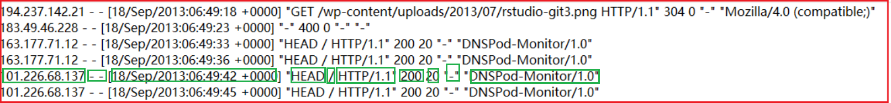

```properties
1- ip地址
2- 用户标识cookie信息 ( - -  标识没有)
3- 访问的时间
4- 请求方式
5- 访问的路径
6- 请求协议
7- 响应状态码
8- 响应的数据长度
9- 来源URL
10- 浏览器的标识


分隔符号为空格


需求一: 统计 pv(访问的次数)  和 uv(独立访问客户数)
需求二: 统计每个访问的URL的次数, 找出前10个
```


代码实现:

````properties
from pyspark import SparkContext, SparkConf
from pyspark.sql import SparkSession
import os

# 锁定远端操作环境, 避免存在多个版本环境的问题
os.environ['SPARK_HOME'] = '/export/server/spark'
os.environ["PYSPARK_PYTHON"] = "/root/anaconda3/bin/python"
os.environ["PYSPARK_DRIVER_PYTHON"] = "/root/anaconda3/bin/python"

# 快捷键:  main 回车
if __name__ == '__main__':
    print("点击流日志案例")

    # 1. 创建SparkContext对象
    conf = SparkConf().setAppName('sogou_project').setMaster('local[*]')
    sc = SparkContext(conf=conf)

    # 2. 读取外部数据源数据
    rdd_init = sc.textFile('file:///export/data/workspace/ky05_pyspark_parent/_02_pyspark_core/data/access.log')

    # 3- 处理数据
    # 3.1 过滤数据
    rdd_filter = rdd_init.filter(lambda line: line.strip() != '' and len(line.split()) >= 12)

    # 3.2 完成需求实现:
    # 需求一: 统计pv(访问的次数)和uv(独立访问客户数)
    print(rdd_filter.count())
    print(rdd_filter.map(lambda line: line.split()[0]).distinct().count())

    # 需求二:  统计每个访问的URL的次数, 找出前10个
    rdd_sort = rdd_filter\
        .map(lambda line:(line.split()[6],1))\
        .reduceByKey(lambda agg,curr:agg+curr)\
        .sortBy(lambda res_tup:res_tup[1],ascending=False)

    print(rdd_sort.take(10))
````


要求: 独立完成这两个案例


