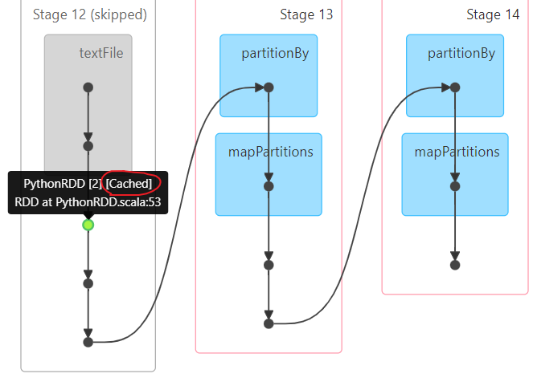
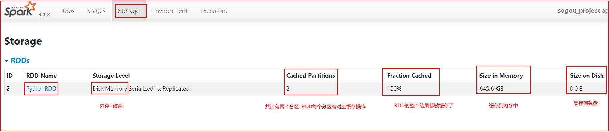
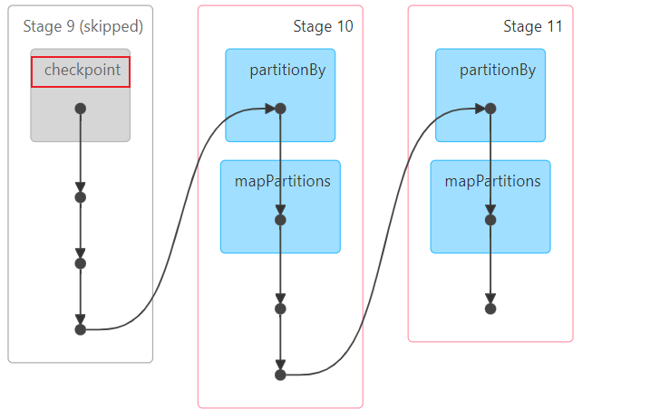
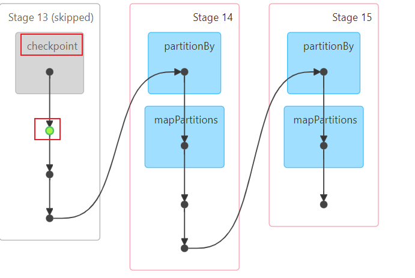
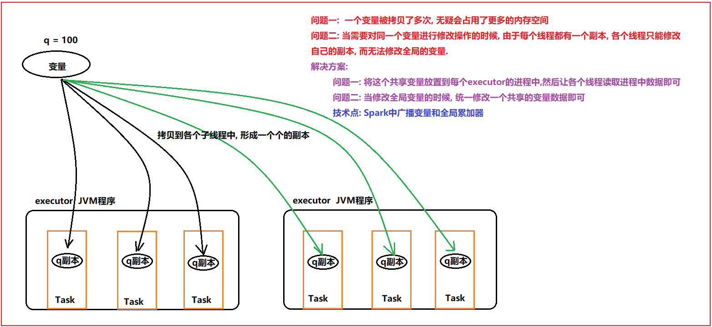

# day05_pySpark课程笔记

今日内容:

* 1- RDD的持久化: 缓存和检查点
* 2- RDD的共享变量: 广播变量 和 累加器
* 3- RDD的内核调度


## 1. RDD的持久化

### 1.1 RDD的缓存

```properties
缓存: 
	一般是当一个RDD的计算非常的耗时|昂贵(计算规则比较复杂),并且这个RDD会被重复的(多方)使用,可以尝试将计算完的结果缓存起来, 便于后续的使用, 从而提升效率
	通过缓存也可以提升RDD的容错能力, 当后续计算失败后, 尽量不让RDD进行回溯所有的计算链条, 从而减少重新计算时间


注意:
	缓存是一种临时存储, 缓存的数据可以保存到内存(executor内部的内存空间)  也可以保存到磁盘,甚至可以保存到堆外内存中(executor以外的系统内存空间)
	由于临时存储, 可能会存在丢失, 所以缓存操作, 并不会将RDD之间的依赖关系给截断掉,因为当缓存失效后, 可以通过依赖链条进行回溯计算(重新计算)
	缓存的API都是LAZY的, 如果需要触发缓存的执行, 必须在后续要跟上一个ACTION算子, 一般建议采用count
```

如何使用缓存?

```properties
设置缓存的API:
	rdd.cache(): 执行缓存操作, 仅能缓存到内存中
	rdd.persist(缓存级别(位置)): 执行缓存操作, 默认是缓存到内存中, 当然也可以自定义缓存的位置

清理缓存的API: 
	rdd.unpersist()
	
默认情况下, 当整个Spark应用退出后, 缓存自动的删除了

缓存的级别: 
	MEMORY_ONLY: 仅缓存到内存中, 适合于缓存数据量比较少的情况
	MEMORY_ONLY_SER:仅缓存到内存中, 适合于缓存数据量比较少的情况, 在缓存的时候, 会对数据进行序列化操作, 目的最大化节省内存的空间
	
	MEMORY_AND_DISK:
	MEMORY_AND_DISK_2:  优先将数据缓存到内存中, 当内存不足的时候, 会将数据缓存到磁盘上(本地磁盘上), 带2表示缓存2份
	
	MEMORY_AND_DISK_SER:
	MEMORY_AND_DISK_SER_2: 优先将数据缓存到内存中, 当内存不足的时候, 会将数据缓存到磁盘上(本地磁盘上), 带2表示缓存2份, 会对数据进行序列化操作, 目的最大化节省内存的空间
	
	序列化: 在Spark程序运行过程中, RDD对应数据一般都是一个对象, 序列化目的将对象转换为二进制字节来存储, 转换后, 可以节省一部分的空间, 但是弊端会导致CPU占用率提升, 当CPU性能比较OK的时候, 建议使用带有SER, 否则一般不建议
	
	空间比较充足的时候, 建议选择带有_2 保存为多份, 可靠性会更强一些
```

演示缓存的使用操作:

```properties
import time

import jieba
from pyspark import SparkContext, SparkConf,StorageLevel
from pyspark.sql import SparkSession
import os

# 锁定远端操作环境, 避免存在多个版本环境的问题
os.environ['SPARK_HOME'] = '/export/server/spark'
os.environ["PYSPARK_PYTHON"] = "/root/anaconda3/bin/python"
os.environ["PYSPARK_DRIVER_PYTHON"] = "/root/anaconda3/bin/python"


def xuqiu_1():
    # 3.1 将搜索词获取出来, 对搜索词进行分词操作, 形成多个关键词
    rdd_keywords = rdd_map.flatMap(lambda line_tup: jieba.cut_for_search(line_tup[2]))
    # 3.2 统计每个关键词出现了多少次  WordCount案例
    rdd_res = rdd_keywords.map(lambda keyword: (keyword, 1)).reduceByKey(lambda agg, curr: agg + curr)
    rdd_sort = rdd_res.sortBy(lambda res_tup: res_tup[1], ascending=False)
    # 3.3 输出前10位结果
    print(rdd_sort.take(10))


def xuqiu_2():
    #  SQL:  select 用户,搜索词, count(1)   from 表 group by 用户,搜索词
    rdd_sort = rdd_map \
        .map(lambda line_tup: ((line_tup[1], line_tup[2]), 1)) \
        .reduceByKey(lambda agg, curr: agg + curr) \
        .sortBy(lambda res_tup: res_tup[1], ascending=False)
    # 获取前10个
    print(rdd_sort.take(10))


# 快捷键:  main 回车
if __name__ == '__main__':
    print("搜狗相关的案例")

    # 1. 创建SparkContext对象
    conf = SparkConf().setAppName('sogou_project').setMaster('local[*]')
    sc = SparkContext(conf=conf)

    # 2. 读取外部数据源数据
    rdd_init = sc.textFile('file:///export/data/workspace/ky05_pyspark_parent/_02_pyspark_core/data/SogouQ.sample')

    # 3- 处理数据
    """
        将数据进行切割处理, 将每一行通过一个元组封装起来 , 
            方便后续获取某一列的数据, 同时还需要对数据进行过滤 
                将为空行以及字段长度不等于6的数据过滤掉 
    """
    rdd_filter = rdd_init.filter(lambda line: line.strip() != '' and len(line.split()) == 6)

    rdd_map = rdd_filter.map(lambda line: (
        line.split()[0],
        line.split()[1],
        line.split()[2][1:-1],
        line.split()[3],
        line.split()[4],
        line.split()[5]
    ))

    # 说明 rdd_map在后续被多个需求都使用, 此时rdd_map就满足了呗多方人使用的特性, 设置为缓存
    #rdd_map.cache().count()
    #rdd_map.persist().count()
    rdd_map.persist(storageLevel=StorageLevel.MEMORY_AND_DISK).count()
    # 需求一: 统计每个关键词出现了多少次
    # 快速提取方法: 选择需要提取的代码块 -->  ctrl + alt + M
    # 或者:  选择需要提取的代码块 --> refactor --> extract --> method
    xuqiu_1()

    rdd_map.unpersist().count()
    # 需求二: 统计每个用户每个搜索词点击的次数
    xuqiu_2()

    time.sleep(1000)

```







### 1.2 RDD的checkpoint

```properties
	checkpoint比较类似于缓存的操作, 只不过缓存是将数据保存到内存或者磁盘中, 而checkpoint是将数据保存到磁盘或者HDFS(主要)
	checkpoint提供了更加可靠安全的持久化方案,确保缓存的数据不会发生丢失, 一旦构建checkpoint操作后, 会将RDD之间的依赖关系进行切断, 如果后续遇到计算出错问题, 可以直接从检查点上恢复数据
	
	checkpoint可以认为是一种阶段性的快照工作
	
	主要作用: 容错 也可以在一定的程度上提升性能(不如缓存)
		在后续的计算过程中, 从检查点直接恢复数据, 不需要在重新计算了
	
	checkpoint的相关的API: 
		第一步: 设置检查点的保存的位置
			sc.setCheckpointDir('路径地址')
		
		第二步: 开启检查点
			rdd.checkpoint()
			rdd.count
```

代码演示:

```properties
import time

from pyspark import SparkContext, SparkConf
from pyspark.sql import SparkSession
import os

# 锁定远端操作环境, 避免存在多个版本环境的问题
os.environ['SPARK_HOME'] = '/export/server/spark'
os.environ["PYSPARK_PYTHON"] = "/root/anaconda3/bin/python"
os.environ["PYSPARK_DRIVER_PYTHON"] = "/root/anaconda3/bin/python"

# 快捷键:  main 回车
if __name__ == '__main__':
    print("点击流日志案例")

    # 1. 创建SparkContext对象
    conf = SparkConf().setAppName('sogou_project').setMaster('local[*]')
    sc = SparkContext(conf=conf)

    # 第一步: 设置检查点的位置
    # 此处设置的检查点的路径, 如果提交到集群运行, 必须是HDFS, 如果是local模式, 允许设置在本地
    # 默认的路径为HDFS路径
    sc.setCheckpointDir('/checkpoint')


    # 2. 读取外部数据源数据
    rdd_init = sc.textFile('file:///export/data/workspace/ky05_pyspark_parent/_02_pyspark_core/data/access.log')

    # 3- 处理数据
    # 3.1 过滤数据
    rdd_filter = rdd_init.filter(lambda line: line.strip() != '' and len(line.split()) >= 12)

    # rdd_filter也被后续多方人使用,本次设置一下checkpoint
    rdd_filter.checkpoint()
    rdd_filter.count()


    # 3.2 完成需求实现:
    # 需求一: 统计pv(访问的次数)和uv(独立访问客户数)
    print(rdd_filter.count())
    rdd_distinct = rdd_filter.map(lambda line: line.split()[0]).distinct()
    print(rdd_distinct.count())

    # 需求二:  统计每个访问的URL的次数, 找出前10个
    rdd_sort = rdd_filter\
        .map(lambda line:(line.split()[6],1))\
        .reduceByKey(lambda agg,curr:agg+curr)\
        .sortBy(lambda res_tup:res_tup[1],ascending=False)

    print(rdd_sort.take(10))

    time.sleep(1000)
```




面试题:  Spark提供两种持久化的方案, 一种为缓存, 一种为checkpoint, 请问有什么区别呢?

```properties
1) 存储位置上: 
	缓存: 存储在内存中, 本地的磁盘上 或者堆外内存中(executor以外的系统内存)
	checkpoint: 将数据保存到HDFS(集群模式)上或者磁盘(local), 进行持久化存储

2) 生命周期:
	缓存: 当我们手动调用unpersist() 或者程序停止后, 缓存数据都会被清除掉
	checkpoint: 即使程序停止后, 保存到HDFS上checkpoint数据也不会自动清理, 需要手动清理

3) 依赖关系:
	缓存: 不会截断RDD之间的依赖关系, 因为缓存所保存的位置是不可靠, 可能存在缓存丢失的问题, 需要进行回溯计算
	checkpoint: 会截断依赖关系, 因为数据是保存到HDFS上的, 进行了更加安全可靠存储, 不会丢失, 不需要回溯计算
```


在实际使用, 应该使用那种持久化方案呢?  一般可以将两种方案全部混合在一起, 一起作用于整个应用中

```properties
注意: 
	建议: 先设置缓存, 然后设置checkpoint, 最后统一的触发执行
	底层做法: 
		先将数据写入到缓存中, 然后将缓存中数据写入到checkpoint中(IO), 然后在使用的时候, 优先会缓存中读取数据(优先级比较高), 如果缓存中没有数据, 然后从检查点中读取数据
		
	不建议: 先设置checkpoint, 然后设置缓存, 原因先将数据写入到检查点中(IO),然后在从检查点中将数据读取出来(IO),使用的时候, 优先走缓存, 然后缓存失效会走检查点
	
	不能: 先设置缓存, 然后直接触发, 然后在设置checkpoint, 直接触发
	原因:
		当设置缓存后, 直接设置检查点, 会发现检查点无法生效了 因为缓存的优先级比较高 最终只能看到缓存生效了


核心代码:
import time

import jieba
from pyspark import SparkContext, SparkConf,StorageLevel
from pyspark.sql import SparkSession
import os

# 锁定远端操作环境, 避免存在多个版本环境的问题
os.environ['SPARK_HOME'] = '/export/server/spark'
os.environ["PYSPARK_PYTHON"] = "/root/anaconda3/bin/python"
os.environ["PYSPARK_DRIVER_PYTHON"] = "/root/anaconda3/bin/python"


def xuqiu_1():
    # 3.1 将搜索词获取出来, 对搜索词进行分词操作, 形成多个关键词
    rdd_keywords = rdd_map.flatMap(lambda line_tup: jieba.cut_for_search(line_tup[2]))
    # 3.2 统计每个关键词出现了多少次  WordCount案例
    rdd_res = rdd_keywords.map(lambda keyword: (keyword, 1)).reduceByKey(lambda agg, curr: agg + curr)
    rdd_sort = rdd_res.sortBy(lambda res_tup: res_tup[1], ascending=False)
    # 3.3 输出前10位结果
    print(rdd_sort.take(10))


def xuqiu_2():
    #  SQL:  select 用户,搜索词, count(1)   from 表 group by 用户,搜索词
    rdd_sort = rdd_map \
        .map(lambda line_tup: ((line_tup[1], line_tup[2]), 1)) \
        .reduceByKey(lambda agg, curr: agg + curr) \
        .sortBy(lambda res_tup: res_tup[1], ascending=False)
    # 获取前10个
    print(rdd_sort.take(10))


# 快捷键:  main 回车
if __name__ == '__main__':
    print("搜狗相关的案例")

    # 1. 创建SparkContext对象
    conf = SparkConf().setAppName('sogou_project').setMaster('local[*]')
    sc = SparkContext(conf=conf)

    # 设置检查点
    sc.setCheckpointDir('/checkpoint')

    # 2. 读取外部数据源数据
    rdd_init = sc.textFile('file:///export/data/workspace/ky05_pyspark_parent/_02_pyspark_core/data/SogouQ.sample')

    # 3- 处理数据
    """
        将数据进行切割处理, 将每一行通过一个元组封装起来 , 
            方便后续获取某一列的数据, 同时还需要对数据进行过滤 
                将为空行以及字段长度不等于6的数据过滤掉 
    """
    rdd_filter = rdd_init.filter(lambda line: line.strip() != '' and len(line.split()) == 6)

    rdd_map = rdd_filter.map(lambda line: (
        line.split()[0],
        line.split()[1],
        line.split()[2][1:-1],
        line.split()[3],
        line.split()[4],
        line.split()[5]
    ))

    # 说明 rdd_map在后续被多个需求都使用, 此时rdd_map就满足了呗多方人使用的特性, 设置为缓存
    #rdd_map.cache().count()
    #rdd_map.persist().count()
    # rdd_map.persist(storageLevel=StorageLevel.MEMORY_AND_DISK).count()
    # 缓存和检查点一起使用
    #标准做法
    rdd_map.persist(storageLevel=StorageLevel.MEMORY_AND_DISK)
    rdd_map.checkpoint()
    rdd_map.count()

    # 不建议方式:
    #rdd_map.checkpoint()
    #rdd_map.count()
    #rdd_map.persist(storageLevel=StorageLevel.MEMORY_AND_DISK).count()

    # 不能使用以下方式
    #rdd_map.persist(storageLevel=StorageLevel.MEMORY_AND_DISK).count()
    #rdd_map.checkpoint()
    #rdd_map.count()


    # 需求一: 统计每个关键词出现了多少次
    # 快速提取方法: 选择需要提取的代码块 -->  ctrl + alt + M
    # 或者:  选择需要提取的代码块 --> refactor --> extract --> method
    xuqiu_1()

    #rdd_map.unpersist().count()
    # 需求二: 统计每个用户每个搜索词点击的次数
    xuqiu_2()

    time.sleep(1000)

```





## 2. RDD的共享变量



### 2.1 广播变量

```properties
广播变量: 
	在Driver端定义一个共享的变量, 如果不使用广播变量, 各个线程在运行的时候, 都需要将这个变量拷贝到自己的线程中, 对网络传输以及内存都会造成一定的影响
	
	如果使用广播变量, 会将变量在每个executor上放置一份, 各个线程直接读取executor上的变量即可, 不需要拉取到task中, 减少了副本的拷贝, 对网络以及内存都会减少, 从而提升性能
	
	广播变量是只读的, 各个线程只能读取变量数据, 不能修改

相关API:
	设置广播变量: 广播变量的对象 = sc.broadcast(值)
	获取广播变量的值: 广播变量对象.value
```

代码演示

```properties
from pyspark import SparkContext, SparkConf
from pyspark.sql import SparkSession
import os

# 锁定远端操作环境, 避免存在多个版本环境的问题
os.environ['SPARK_HOME'] = '/export/server/spark'
os.environ["PYSPARK_PYTHON"] = "/root/anaconda3/bin/python"
os.environ["PYSPARK_DRIVER_PYTHON"] = "/root/anaconda3/bin/python"

# 快捷键:  main 回车
if __name__ == '__main__':
    print("演示广播变量")

    # 1. 创建SparkContext对象:
    conf = SparkConf().setAppName('broadcast').setMaster('local[*]')
    sc = SparkContext(conf=conf)

    # 2- 初始化一份数据集
    rdd_init = sc.parallelize([1,2,3,4,5,6,7,8,9,10],3)

    # 3- 对数据进行处理
    # 需求: 请给rdd中每个数据添加一个变量的值
    #a = 10
    # 设置广播变量
    broadcast = sc.broadcast(10)

    def fun1(num):

        return num + broadcast.value


    rdd_res = rdd_init.map(fun1)

    # 打印结果
    print(rdd_res.collect())
```


### 2.2 累加器

```properties
Spark 提供累加器, 可以用于实现全局累加计算的饿操作, 比如全局计算共操作了多少个数据, 可以使用累加器实现

累加器是在Driver中设置初始值, 在Task中进行累加计算, 最终在Driverdaunt获取最终的结果

Task只能累加, 不能读取数据

相关API: 
	1- 设置累加器(在Driver设置)
		累加器对象 = sc.accumulator(初始值)
	
	2- 在Task(RDD)中: 执行 累加器对象.add(累加值)
	
	3- 在Driver中(非RDD部分): 累加器对象.value
```

代码演示:

```properties
from pyspark import SparkContext, SparkConf
from pyspark.sql import SparkSession
import os

# 锁定远端操作环境, 避免存在多个版本环境的问题
os.environ['SPARK_HOME'] = '/export/server/spark'
os.environ["PYSPARK_PYTHON"] = "/root/anaconda3/bin/python"
os.environ["PYSPARK_DRIVER_PYTHON"] = "/root/anaconda3/bin/python"

# 快捷键:  main 回车
if __name__ == '__main__':
    print("演示累加器")

    # 1. 创建SparkContext对象:
    conf = SparkConf().setAppName('broadcast').setMaster('local[*]')
    sc = SparkContext(conf=conf)

    # a = 0
    # 设置累加器
    acc = sc.accumulator(0)

    # 2- 初始化一份数据集
    rdd_init = sc.parallelize([1,2,3,4,5,6,7,8,9,10],3)


    # 3- 对数据进行处理
    # 需求, 对数据进行转换操作, 将每个数据进行+1返回即可, 并统计一共对多少个数据进行了 +1返回操作
    def fn1(num):
        # 执行累加
        acc.add(1)

        return num + 1

    rdd_res = rdd_init.map(fn1)

    # 打印结果
    print(rdd_res.collect())

    print(acc.value) 
```

小问题:

```properties
累加器小问题: 如果后续多次调用action函数, 会导致累加器重复累加

主要原因: 
	每一次调度action函数, 都会触发执行一个job的任务, 每一个job任务都要重新计算整个操作, 导致累加器重复累加计算

解决方案: 
	在调用完累加器的RDD后, 对这个RDD设置缓存或者 缓存+checkpoint 即可解决问题
```


### 