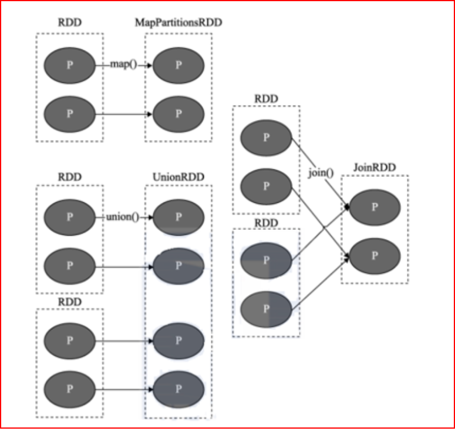
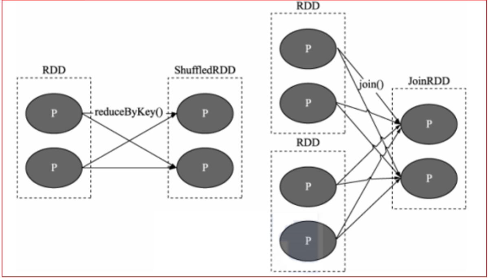
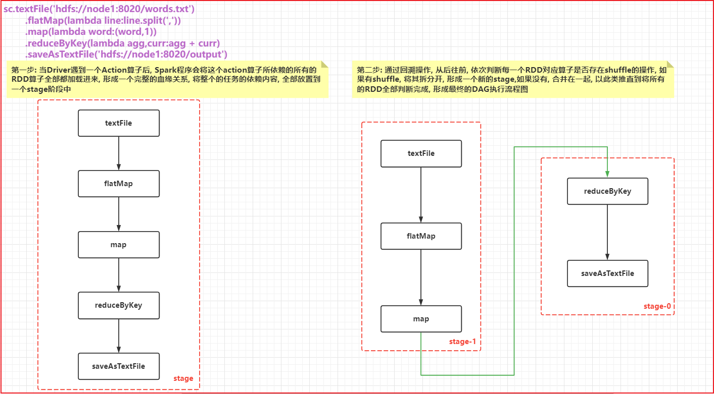
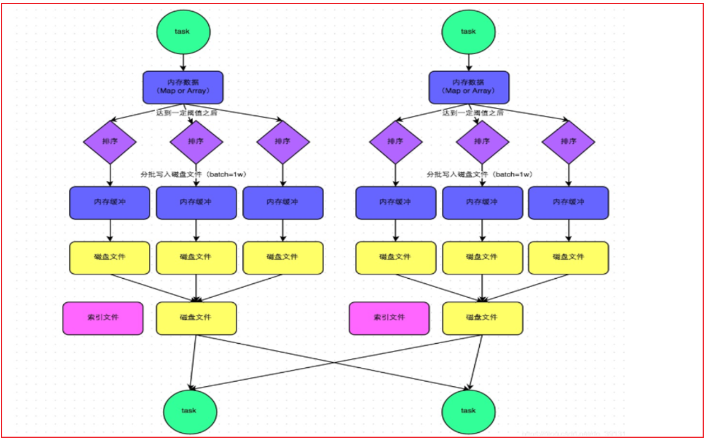

# day06_PySpark课程笔记

今日内容:

* RDD的内核调度:
  * RDD的依赖
  * DAG 与 stage
  * RDD的shuffle
  * JOB的调度流程
  * Spark的并行度处理
  * combinerByKey

## 1. RDD的内核调度

```properties
RDD的内核调度的主要任务: 
	1- 确定需要构建多少个分区(线程)
	2- 如何构建DAG执行流程图
	3- 如何划分stage阶段
	4- Driver内部核心处理流程

目标: 
	对Spark底层运转能够更加清晰, 保证在实施过程中, 采用最合适的资源, 高效的完成计算任务
```

### 1.1 RDD的依赖

​		RDD的依赖: 指的一个RDD的形成可能是由一个或者多个RDD来得出来的, 此时这个RDD和之前的RDD之间产生依赖的关系

​		在Spark中, RDD的依赖关系主要有两种:

* 窄依赖:

```properties
目的: 为了实现并行计算
指的什么是窄依赖: 一个RDD上的一个分区的数据, 只能完整的交给下一个RDD的一个分区(一个分区对应着一个分区), 不能分割
```



* 宽依赖:

```properties
目的:  划分stage(阶段)
指的什么是宽依赖: 上一个RDD的某一个分区的数据被下一个RDD的多个分区进行接收, 中间必然是存在shuffle操作(RDD之间是否存在shuffle, 也是判断宽窄依赖关系的重要依据)

注意: 一旦有了shuffle操作, 后续RDD的执行必须等待前序的shuffle执行完成后, 才能执行
```




说明:

```properties
	在Spark中, 每一个算子是否会执行shuffle操作, 其实Spark在设计算子的时候, 就基本规划好了, 比如说 像Map不会触发shuffle操作, reduceByKey算子, 就一定会触发shuffle操作
	
	如果想知道这个算子会不会触发shuffle操作, 可以通过运行的时候, 查看4040 WEBUI的界面. 在界面对应的JOB任务下, 如果发现DAG执行流程图中, 被分为了多个阶段, 那么就说明这个算子会触发shuffle, 或者 也可以查看这个算子的具体的说明信息, 一般在说明信息中也会标记为是否有shuffle(不完整)
	
	在实际使用中, 不需要纠结哪一个算子存在shuffle, 以需求实现为目标, 虽然shuffle的存在会影响一定的执行效率, 但是以完成任务为准, 该用那个算子,就用哪一个算子即可, 不要纠结
```

### 1.2 DAG与Stage

DAG:

```properties
有向无环图 , 主要是描述一段执行任务, 从开始一直往下走, 不允许出现回调的操作 
```

​		在Spark应用程序中, 程序中只要有一个action算子, 那么就一定会产生Job的任务, 一般都是一个,  所以说一个Spark的应用程序中可能是有多个action算子, 所以意外着一个应用程序中有多个Job任务

​		对于每一个Job任务,都会产生一个DAG的执行流程图, 那么这个DAG的执行流程图是如何形成的呢?

```properties
第一步: 当Driver遇到一个Action算子后, Spark程序会将这个action算子所依赖的所有的RDD算子全部都加载进来, 形成一个完整的血缘关系, 将整个的任务的依赖内容, 全部放置到一个stage阶段中

第二步: 通过回溯操作, 从后往前, 依次判断每一个RDD对应算子是否存在shuffle的操作, 如果有shuffle, 将其拆分开, 形成一个新的stage,如果没有, 合并在一起, 以此类推直到将所有的RDD全部判断完成, 形成最终的DAG执行流程图
```




细化描述DAG流程图的内部: 说明每个阶段的线程(分区)确定

高清图片 可以自己查看图片目录


```properties
确定各个阶段的RDD的分区数量 以及 各个阶段线程的数量
```


### 1.3 RDD的shuffle

spark shuffle经历阶段

```properties
1- 在1.1版本以前, shuffle主要采用 Hash shuffle方案, 完成数据分发操作
2- 在1.1版本的时候, 引入Sort shuffle方案, 本质对Hash shuffle优化, 增加合并, 排序
3- 在1.5版本的时候, 映入钨丝计划, 提升CPU以及内存的效率(优化步骤)
4- 在1.6版本的时候, 将钨丝计算合并到Sort shuffle中
5- 在2.0版本的时候, Spark将Hash 删除了, 将其功能合并到Sort shuffle, 所以从2.0版本开始, RDD只有Sort shuffle了
```


* 未优化前的Hash shuffle:


```properties
	早期版本中, 上一个stage中每一个分区(线程)都会输出与下一个stage相同分区数量的文件, 每一个文件对应下一个stage中一个分区的数据
	
弊端: 
	一旦数据量比较大的时候, 上一个stage中Task线程数量比较多的时候, 就会导致产生大量的文件, 对磁盘对后续的读取操作, 都是非常的不方便, IO也会加大, 影响效率
```

* 优化后的Hash Shuffle操作:


```properties
	经过优化后的Hash shuffle, 增加了合并的操作, 原来是每个Task都会输出等量文件对应下游各个分区, 优化后, 一个执行器划分为一个组, 一个组内只会形成与下游分区等量的文件数量, 这样就可以大大降低了分区文件数量, 减低磁盘IO 减少文件打开和关闭的次数, 提升效率
```

* sort shuffle流程:



```properties
整个完整的shuffle的流程, 基于跟MR是非常相似的

	都是先将数据写入到内存中, 然后当内存中数据达到一定的阈值后, 开始进行溢写操作, 在溢写的时候, 对数据进行排序, 将排序好的数据写入到磁盘上(一批一批写), 形成一个个的文件, 最后将多个小文件合并, 形成一个大的文件, 同时为了提升效率, 每一个大的文件, 还都匹配了一个索引文件, 从而方便后续进行读取操作
```


说明: Sort shuffle还提供了两种机制:

```properties
1- 普通机制 
	都是先将数据写入到内存中, 然后当内存中数据达到一定的阈值后, 开始进行溢写操作, 在溢写的时候, 对数据进行排序, 将排序好的数据写入到磁盘上(一批一批写), 形成一个个的文件, 最后将多个小文件合并, 形成一个大的文件, 同时为了提升效率, 每一个大的文件, 还都匹配了一个索引文件, 从而方便后续进行读取操作


bypass机制必须要满足两个条件: 
	条件一: 上游的RDD的分区数量默认不能超过200个
	条件二: 上游不能提前聚合操作

2- byPass机制:  在普通机制的基础上, 去除了排序的操作, 直接将内存的数据写入到磁盘上
	
	因为没有了排序操作, 整个模式执行效率要优于普通模式, 前提: 数据量不能太大. 而且前序不能存在提前分组聚合的操作(因为分组必须要先排序)
	
	排序的目的, 就是为了能够让后续分组聚合的效率更高
```


关于相关配置信息说明: https://spark.apache.org/docs/3.1.2/configuration.html


