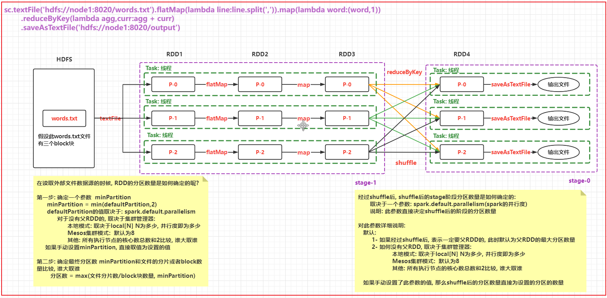
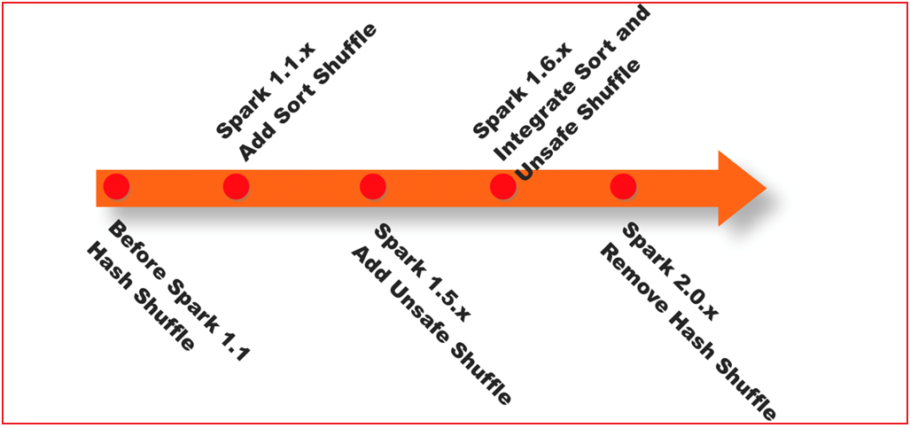
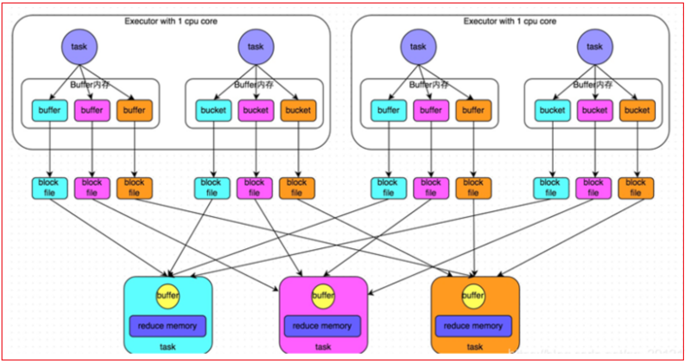
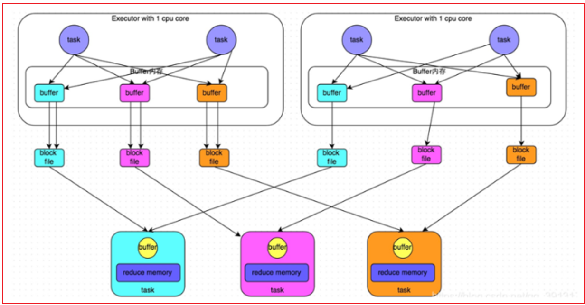
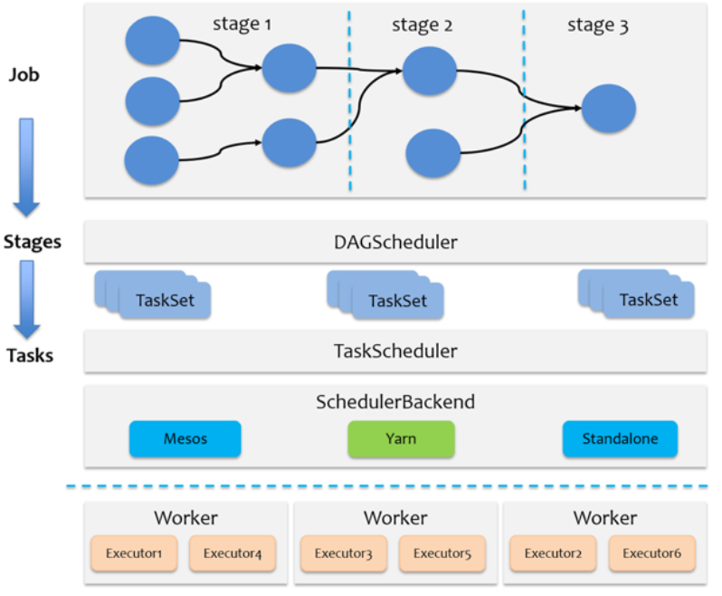
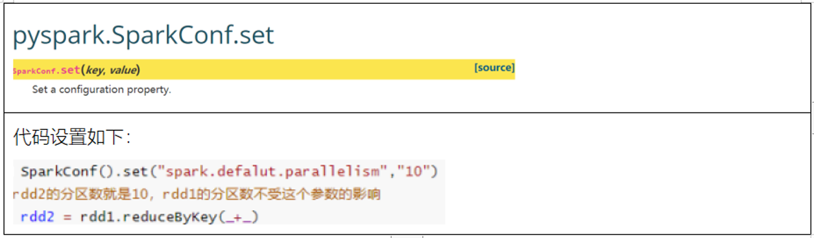
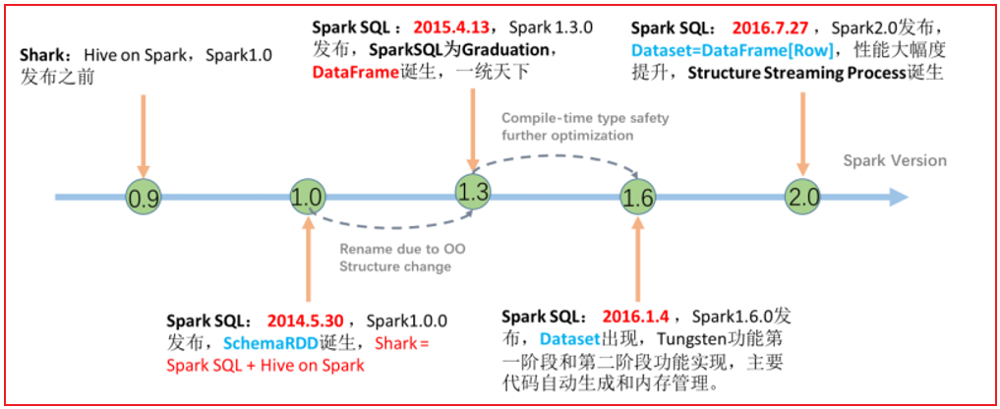
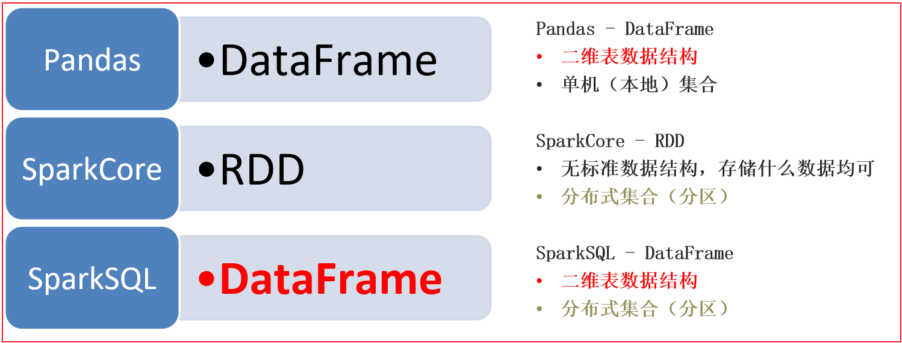
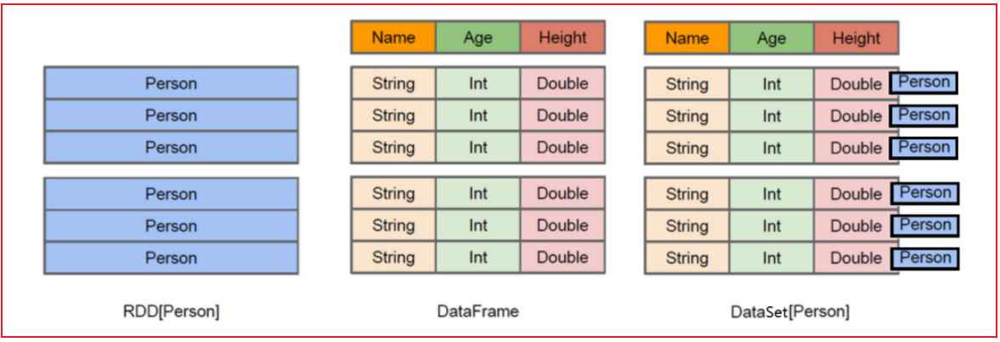

# day07_PySpark课程笔记

今日内容:

* RDD的内核调度:
  * RDD的依赖
  * DAG 与 stage
  * RDD的shuffle
  * JOB的调度流程
  * Spark的并行度处理
  * combinerByKey
* Spark Sql 基本介绍
* Spark SQL的入门案例

## 1. RDD的内核调度

```properties
RDD的内核调度的主要任务: 
	1- 确定需要构建多少个分区(线程)
	2- 如何构建DAG执行流程图
	3- 如何划分stage阶段
	4- Driver内部核心处理流程

目标: 
	对Spark底层运转能够更加清晰, 保证在实施过程中, 采用最合适的资源, 高效的完成计算任务
```

### 1.1 RDD的依赖

​		RDD的依赖: 指的一个RDD的形成可能是由一个或者多个RDD来得出来的, 此时这个RDD和之前的RDD之间产生依赖的关系

​		在Spark中, RDD的依赖关系主要有两种:

* 窄依赖:

```properties
目的: 为了实现并行计算
指的什么是窄依赖: 一个RDD上的一个分区的数据, 只能完整的交给下一个RDD的一个分区(一个分区对应着一个分区), 不能分割
```


* 宽依赖:

```properties
目的:  划分stage(阶段)
指的什么是宽依赖: 上一个RDD的某一个分区的数据被下一个RDD的多个分区进行接收, 中间必然是存在shuffle操作(RDD之间是否存在shuffle, 也是判断宽窄依赖关系的重要依据)

注意: 一旦有了shuffle操作, 后续RDD的执行必须等待前序的shuffle执行完成后, 才能执行
```


说明:

```properties
	在Spark中, 每一个算子是否会执行shuffle操作, 其实Spark在设计算子的时候, 就基本规划好了, 比如说 像Map不会触发shuffle操作, reduceByKey算子, 就一定会触发shuffle操作
	
	如果想知道这个算子会不会触发shuffle操作, 可以通过运行的时候, 查看4040 WEBUI的界面. 在界面对应的JOB任务下, 如果发现DAG执行流程图中, 被分为了多个阶段, 那么就说明这个算子会触发shuffle, 或者 也可以查看这个算子的具体的说明信息, 一般在说明信息中也会标记为是否有shuffle(不完整)
	
	在实际使用中, 不需要纠结哪一个算子存在shuffle, 以需求实现为目标, 虽然shuffle的存在会影响一定的执行效率, 但是以完成任务为准, 该用那个算子,就用哪一个算子即可, 不要纠结
```

### 1.2 DAG与Stage

DAG:

```properties
有向无环图 , 主要是描述一段执行任务, 从开始一直往下走, 不允许出现回调的操作 
```

​		在Spark应用程序中, 程序中只要有一个action算子, 那么就一定会产生Job的任务, 一般都是一个,  所以说一个Spark的应用程序中可能是有多个action算子, 所以意外着一个应用程序中有多个Job任务

​		对于每一个Job任务,都会产生一个DAG的执行流程图, 那么这个DAG的执行流程图是如何形成的呢?

```properties
第一步: 当Driver遇到一个Action算子后, Spark程序会将这个action算子所依赖的所有的RDD算子全部都加载进来, 形成一个完整的血缘关系, 将整个的任务的依赖内容, 全部放置到一个stage阶段中

第二步: 通过回溯操作, 从后往前, 依次判断每一个RDD对应算子是否存在shuffle的操作, 如果有shuffle, 将其拆分开, 形成一个新的stage,如果没有, 合并在一起, 以此类推直到将所有的RDD全部判断完成, 形成最终的DAG执行流程图
```


细化描述DAG流程图的内部: 说明每个阶段的线程(分区)确定

高清图片 可以自己查看图片目录



```properties
确定各个阶段的RDD的分区数量 以及 各个阶段线程的数量
```


### 1.3 RDD的shuffle

spark shuffle经历阶段

```properties
1- 在1.1版本以前, shuffle主要采用 Hash shuffle方案, 完成数据分发操作
2- 在1.1版本的时候, 引入Sort shuffle方案, 本质对Hash shuffle优化, 增加合并, 排序
3- 在1.5版本的时候, 映入钨丝计划, 提升CPU以及内存的效率(优化步骤)
4- 在1.6版本的时候, 将钨丝计算合并到Sort shuffle中
5- 在2.0版本的时候, Spark将Hash 删除了, 将其功能合并到Sort shuffle, 所以从2.0版本开始, RDD只有Sort shuffle了
```



* 未优化前的Hash shuffle:



```properties
	早期版本中, 上一个stage中每一个分区(线程)都会输出与下一个stage相同分区数量的文件, 每一个文件对应下一个stage中一个分区的数据
	
弊端: 
	一旦数据量比较大的时候, 上一个stage中Task线程数量比较多的时候, 就会导致产生大量的文件, 对磁盘对后续的读取操作, 都是非常的不方便, IO也会加大, 影响效率
```

* 优化后的Hash Shuffle操作:



```properties
	经过优化后的Hash shuffle, 增加了合并的操作, 原来是每个Task都会输出等量文件对应下游各个分区, 优化后, 一个执行器划分为一个组, 一个组内只会形成与下游分区等量的文件数量, 这样就可以大大降低了分区文件数量, 减低磁盘IO 减少文件打开和关闭的次数, 提升效率
```

* sort shuffle流程:


```properties
整个完整的shuffle的流程, 基于跟MR是非常相似的

	都是先将数据写入到内存中, 然后当内存中数据达到一定的阈值后, 开始进行溢写操作, 在溢写的时候, 对数据进行排序, 将排序好的数据写入到磁盘上(一批一批写), 形成一个个的文件, 最后将多个小文件合并, 形成一个大的文件, 同时为了提升效率, 每一个大的文件, 还都匹配了一个索引文件, 从而方便后续进行读取操作
```


说明: Sort shuffle还提供了两种机制:

```properties
1- 普通机制 
	都是先将数据写入到内存中, 然后当内存中数据达到一定的阈值后, 开始进行溢写操作, 在溢写的时候, 对数据进行排序, 将排序好的数据写入到磁盘上(一批一批写), 形成一个个的文件, 最后将多个小文件合并, 形成一个大的文件, 同时为了提升效率, 每一个大的文件, 还都匹配了一个索引文件, 从而方便后续进行读取操作


bypass机制必须要满足两个条件: 
	条件一: 上游的RDD的分区数量默认不能超过200个
	条件二: 上游不能提前聚合操作

2- byPass机制:  在普通机制的基础上, 去除了排序的操作, 直接将内存的数据写入到磁盘上
	
	因为没有了排序操作, 整个模式执行效率要优于普通模式, 前提: 数据量不能太大. 而且前序不能存在提前分组聚合的操作(因为分组必须要先排序)
	
	排序的目的, 就是为了能够让后续分组聚合的效率更高
```


关于相关配置信息说明: https://spark.apache.org/docs/3.1.2/configuration.html

### 1.4 JOB的调度流程

* Driver内部的调度方案

```properties
整个Job调度流程, 都是发生在Driver中: DAGScheduler 和 TaskScheduler

1- 当遇到一个action算子, 触发任务的执行, 此时就会产生一个Job任务, Driver程序首先会先创建SparkContext对象, 在构建好这个对象的同时, 在其底层也会同时创建两个新的对象: DAGScheduler 和 TaskScheduler

2- DAGScheduler主要负责对整个任务形成一个DAG执行流程图, 并且进行stage的划分操作, 确定每一个stage中需要运行多少个Task线程(分区),最后将每一个stage中Task放置到一个TaskSet列表中, 统一的提交给TaskScheduler

3- TaskScheduler接收DAGScheduler提交过来的TaskSet线程后, 依次遍历每一个TaskSet, 对每一个TaskSet中线程进行分配工作, 将其均衡分配给各个executor来运行(尽量保证均衡分配)

4- Driver程序负责后续的任务的监听, 以及数据返回的等相关的操作....


Spark默认的资源调度方案为 FIFO , 比如提交到Spark集群中  但是如果提交到Yarn集群, 基于Yarn的调度方案来处理, 比如可能是容量调度(Apache), 也可能公平调度(CDH)

```




### 1.5 Spark的并行度

Spark的并行度的影响因素:

* 1- 资源因素: 指的executor的数量 和 占用CPU以及内存的大小
* 2- 数据因素: 指的Task处理的数据量或者分区的数量

```properties
目的:  希望能够在合适的资源上, 运行合适的数据

说明: 
	当资源比较大的时候, 而数据量比较少的时候, 导致资源浪费,但是不会影响执行效率
	当资源比较小的时候, 但是数据量比较大的时候, 由于资源不足,本应该可以并行计算的操作, 也被迫编程串行化执行操作, 导致运行效率降低
	
实际运行中, 给出推荐的方案: 经验之谈 
	每一个CPU核上, 建议运行2~3倍的线程任务, 不推荐一个CPU运行一个线程的情况, 一个CPU核数一般会匹配3~5GB内存, 一个线程可以运行2~5GB的数据
```

​		对于CPU  内存 以及executor的数量等等资源, 可以在通过Spark-submit方式来提交任务进行设置即可, 对于程序中线程的并行度的设置, 取决于以下这个参数: 



```properties
说明:
	此值设置会在shuffle后生效, 设置的值越大, shuffle后分区的数量越多, 对应并行度越高, 但是同样也会导致最终输出的结果文件也会增多
```


### 1.6 了解combinerByKey

​		combinerByKey是aggregateByKey底层实现, foldByKey底层实现是aggregateByKey, reduceByKey的底层实现是foldByKey

​		reduceByKey --> foldByKey --> aggregateByKey  --> combinerByKey

```properties
combinerByKey基本格式: 
	combinerByKey(fn1,fn2,fn3):
	
	fn1: 进行初始化设置操作
	fn2: 对每个分区执行聚合操作
	fn3: 对各个分区的聚合后结果进行再次汇总操作

注意: 
	fn2 和 fn3  相当于aggregateByKey中参数2和参数3
```

案例:

```properties
from pyspark import SparkContext, SparkConf
from pyspark.sql import SparkSession
import os

# 锁定远端操作环境, 避免存在多个版本环境的问题
os.environ['SPARK_HOME'] = '/export/server/spark'
os.environ["PYSPARK_PYTHON"] = "/root/anaconda3/bin/python"
os.environ["PYSPARK_DRIVER_PYTHON"] = "/root/anaconda3/bin/python"

# 快捷键:  main 回车
if __name__ == '__main__':
    print("演示combinerByKey实现操作")

    # 1- 创建SparkContext对象
    conf = SparkConf().setAppName('combinerByKey').setMaster('local[*]')
    sc = SparkContext(conf=conf)

    # 2- 模拟一份数据
    rdd_init = sc.parallelize([
        ('c01', '张三'),
        ('c01', '李四'),
        ('c02', '王五'),
        ('c01', '赵六'),
        ('c03', '田七'),
        ('c01', '周八'),
        ('c02', '李九'),
        ('c01', '老王')
    ])
    """
        [
            [('c01', '张三'), ('c01', '李四'), ('c02', '王五'), ('c01', '赵六')], 
            [('c03', '田七'), ('c01', '周八'), ('c02', '李九'), ('c01', '老王')]
        ]
    """
    # 3- 处理数据:
    # 需求: 请使用combinerByKey实现  对Key进行分组, 将value汇总在一起, 得到以下的结果内容
    #     [ ('c01',[张三,李四,赵六,周八,老王]) ,('c02',['王五','李九']), ('c03','田七') ]

    """
        分区1为例: 
              [('c01', '张三'), ('c01', '李四'), ('c02', '王五'), ('c01', '赵六')]
              执行byKey后,会形成两个分组
                    c01: 张三 李四 赵六
                    c02: 王五
              分好一组,以c01为例,  先执行fn1: 传入组内的第一个元素  比如此时传入张三   (fn1只会执行一次)
                    此时返回 ['张三']
                    
                    然后执行 fn2: 参数1的初始值即fn1返回的值 ['张三'], 参数2: 依次放置这个组内后续的值
                        经过处理后, agg就会变成 ['张三','李四','赵六']
            
              最后整个分区1 的结果为: 
                    c01: ['张三','李四','赵六']
                    c02: ['王五']
        对于分区2, 逻辑跟分区1是一致的,最终结果为: 
                    c01: ['周八','老王'] 
                    c02: ['李九']
                    c03: ['田七']
        
        当每个分区都处理完成后, 接下来执行 fn3 , 在执行之前, 首先还是回对每个分区的结果进行分组操作
                c01:  ['张三','李四','赵六'] 和  ['周八','老王'] 
                c02:  ['王五']  和 ['李九']
                c03:  ['田七']
                
                开始执行 fn3: 参数1为每组的第一个值, 
                    比如以 c01为例, 参数1的值为  ['张三','李四','赵六'],参数2的值为这个分组后续的值, 遍历传递参数2即可
                    得到结果为: 
                        c01: ['张三','李四','赵六','周八','老王']
                        c02: ['王五','李九']
                        c03: ['田七']
    """

    def fn1(v):
        return [v]

    def fn2(agg,curr):
        agg.append(curr)
        return agg

    def fn3(agg,curr):
        agg.extend(curr)
        return agg

    rdd_res = rdd_init.combineByKey(fn1,fn2,fn3)

    # 4- 打印结果
    print(rdd_res.collect())
```


## 2. Spark Sql基本介绍

### 2.1 什么是Spark SQL

​		Spark SQL是Spark的一个模块, 此模块主要用于**处理海量结构化的数据**

```properties
思考: 什么是结构化数据?
指的:  一份数据, 每一行都有固定的长度(字段), 每一列的数据类型都是一致的, 我们将这样的数据称为结构化数据

比如说:
1 张三 男 30
2 李四 男 15
3 王五 女 18
4 赵六 女 19
```

​		Spark SQL主要是用于处理结构化的数据, 而Spark Core 可以处理任意类型的数据

​		Spark SQL中核心的数据结构为 dataFrame:  数据(RDD) + 元数据(schema)


为什么要学习Spark SQL呢?

```properties
1- SQL比较简单, 会SQL的人一定比会大数据的人多: SQL更加通用

2- Spark SQL可以兼容HIVE, 可以让Spark SQL 和 HIVE集成 , 从而将执行引擎由原来MR替换为Spark

3- Spark SQL 不仅仅可以写SQL, 还可以写代码, SQL和代码是可以共存的,也可以单独使用, 更加灵活

4- Spark SQL可以处理大规模的数据, 底层基于Spark RDD
```


Spark SQL的特点:

```properties
1- 融合性:  Spark SQL可以编写代码, 也可以编写SQL, 也可以混合使用

2- 统一的数据访问: 使用Spark SQL 可以和各种数据源进行集成, 比如 HIVE  MYSQL  Oracle .... , 一旦集成后, 可以使用一套Spark SQL的API来操作不同的数据源的数据

3- HIVE兼容性: Spark SQL可以和HIVE进行集成, 集成后, HIVE执行引擎从MR替换为Spark 提升效率,  集成核心基于metastore

4- 标准化连接:  Spark SQL支持 JDBC/ODBC连接方式, 可以非常方便和各个数据库对接
```


### 2.2 Spark SQL的发展历程



​			从2.0版本后, Spark SQL将Spark SQL中两个核心数据结构: dataFrame 和 dataSet 进行合二为一操作, 统一称为dataSet, 注意dataSet存在泛型的, 但是如果想要使用Python这样语言操作Spark, 向Python这样没有泛型的语句, Spark在客户端依然保留了dataFrame, 但是dataFrame到达Spark后, 内部还会转换为dataSet[ROW]


### 2.3 Spark SQL 和 HIVE 异同点

相同点:

```properties
1- Spark SQL 和 hive 都可以通过SQL完成数据统计分析操作
2- 都可以处理大规模的数据
3- 都可以处理结构化的数据
4- Spark SQL 和 hive SQL都可以基于Yarn平台使用
```

不同点:

```properties
1- Spark SQL是基于内存迭代计算, HIVE是基于磁盘的迭代计算
2- HIVE仅能使用SQL来处理数据, 而Spark SQL不仅仅可以使用SQL 还可以使用DSL代码
3- HIVE提示了专用的元数据管理服务(metastore), 而Spark SQL没有元数据管理服务, 一般都是手动维护
4- HIVE底层是基于MR, 而Spark SQL底层是基于Spark RDD
```

### 2.4 Spark SQL的数据结构对比



```properties
pandas的dataFrame: 表示是一个二维表数据结构, 仅能处理结构化数据,单机处理, 适合于小数据集的处理工作

spark core的RDD:  不局限任何的数据结构, 分布式的处理引擎, 可以处理大规模的数据

Spark SQL的dataFrame: 表示是一个二维表数据结构, 仅能处理结构化数据,分布式处理模式, 可以处理大规模的数据

在实际中:
	一般如果遇到的数据集以 kb MB 或者几个G, 此时可以使用pandas完成统计分析操作, 比如说做财务人员
	
	如果数据集以 几十GB 或者 TB  PB级别的数据集, 必须使用大规模处理数据的引擎
```



```properties
RDD 表示的具体的数据对象, 一个RDD表示一个数据集

dataFrame: 是将RDD中对象中各个属性拆解出来, 形成一列列的数据, 变更为一个二维的表

dataSet: 是在dataFrame的基础上, 加入了泛型的支持, 将每一行的数据, 使用一个对象(泛型)来表示


List<String>: 约束存储到List这个列表总数据类型必须是string类型, string整个列表的泛型

但是在Python中不存在, 定义列表, 直接定义即可, 不需要指定约束信息:  list = [xx,xx]


从Spark SQL 2.0开始, 整个Spark SQL底层只有一种数据结构:  dataSet
	但是Spark SQL为了支持多种语言的开发工作, 对于一些不支持泛型的语言, Spark SQL的对应的语言客户端提供了dataFrame的接口, 让其他无泛型的语言使用dataFrame接口进行开发工作, 但是底层依然会转换为dataSet
```


