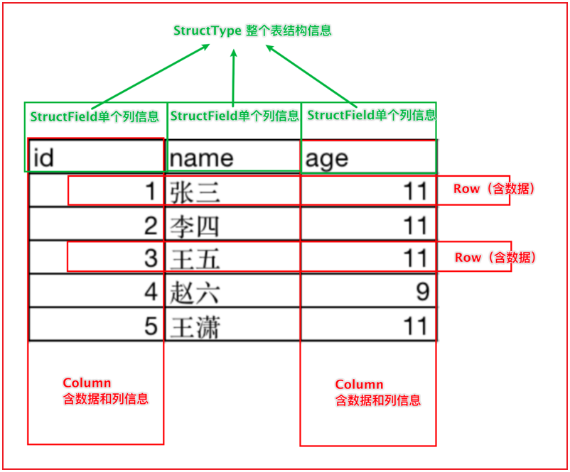
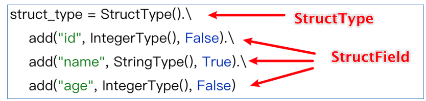
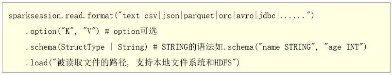

# day08_PySpark课程笔记

今日内容:

* 1- Spark SQL的入门案例
* 2- DataFrame详细讲解

## 1. Spark SQL入门案例

### 1.1 Spark SQL的统一入口

​		从Spark SQL开始, 需要将核心对象, 从SparkContext 切换为SparkSession对象

```properties
Spark session对象是Spark2.0以后退出的一个全新的对象, 此对象将会作为整个Spark的统一入口对象,此对象不仅仅可以操作Spark SQL 同时还可以获取到SparkContext对象, 用于操作Spark Core对象
```

如何构建Spark session对象呢?

```properties
from pyspark import SparkContext, SparkConf
# 不要忘记导入相关的类
from pyspark.sql import SparkSession
import os

# 锁定远端操作环境, 避免存在多个版本环境的问题
os.environ['SPARK_HOME'] = '/export/server/spark'
os.environ["PYSPARK_PYTHON"] = "/root/anaconda3/bin/python"
os.environ["PYSPARK_DRIVER_PYTHON"] = "/root/anaconda3/bin/python"

# 快捷键:  main 回车
if __name__ == '__main__':
    print("演示: 如何构建SparkSession对象")

    # 1- 创建SparkSession对象:
    spark = SparkSession.builder \
        .appName('_01_create_sparksession') \
        .master('local[*]') \
        .getOrCreate()

    # 如何获取SparkContext对象
    sc = spark.sparkContext

    print(spark)
    print(sc)
```

### 1.2 Spark SQL的入门案例

需求: 给出一份数据文件, 要求从数据文件中,获取年龄大于20岁的人群

```properties
文件内容:
文件名: stu.txt
id,name,age
1,张三,18
2,李四,25
3,王五,22
4,赵六,23
5,田七,18
6,周八,19
```

代码实现

```properties
from pyspark import SparkContext, SparkConf
from pyspark.sql import SparkSession
import os

# 锁定远端操作环境, 避免存在多个版本环境的问题
os.environ['SPARK_HOME'] = '/export/server/spark'
os.environ["PYSPARK_PYTHON"] = "/root/anaconda3/bin/python"
os.environ["PYSPARK_DRIVER_PYTHON"] = "/root/anaconda3/bin/python"

# 快捷键:  main 回车
if __name__ == '__main__':
    print("spark SQL的入门案例")

    # 1- 创建SparkSession对象
    spark = SparkSession.builder.appName('_02_init').master('local[*]').getOrCreate()

    # 2- 读取外部数据集
    """
        path: 设置读取数据的路径
        header: 数据中是否包含头信息, 如果是, 会将第一行作为表头来进行处理
        inferSchema: 用于自动推测数据类型, 默认为Flase 导致所有的类型都是string
        sep:当通过CSV方式来读取数据, 字段之间的默认的符号为逗号
    """
    df = spark.read.csv(
        path='file:///export/data/workspace/ky05_pyspark_parent/_03_pyspark_sql/data/stu.txt',
        header=True,
        inferSchema=True,
        sep=' '
    )

    # 3- 处理数据
    # 获取年龄大于20的岁
    # DSL代码实现
    df_res = df.where('age > 20')

    # SQL实现:
    df.createTempView('t1')

    spark.sql("""
        select
            *        
        from t1 where age >20;
    """).show()


    df_res.show()  # 显示数据
    #df_res.printSchema()  # 显示结构信息

```


## 2. DataFrame详解

### 2.1 dataFrame基本介绍

​		dataFrame表示就是一个二维的表, 既然是一个表, 那么应该有: 字段, 字段的类型 数据

```properties
dataFrame中, 主要是有 structType 和 structField 以及 ROW 和 column构成的

其中: 
	structType: 是dataFrame中用于表示元数据的核心对象
	
	structField: 表示字段的对象, 在一个 structType中可以多个structField, 类似于在一个表中可以有多个字段
		涵盖了三个部分的内容:  字段的名称  字段的类型 字段数据是否可以为null
	
	ROW: 行 表示的行数据, 每一行的数据就是一个ROW对象
	
	column: 列 表示的列数据, 包含列信息和列数据
```



如何构建一个StructType():



### 2.2 dataFrame的构建方式

* 方式一: 通过Spark Core RDD对象 转换为 dataFrame对象

```properties
from pyspark import SparkContext, SparkConf
from pyspark.sql import SparkSession
from pyspark.sql.types import *
import os

# 锁定远端操作环境, 避免存在多个版本环境的问题
os.environ['SPARK_HOME'] = '/export/server/spark'
os.environ["PYSPARK_PYTHON"] = "/root/anaconda3/bin/python"
os.environ["PYSPARK_DRIVER_PYTHON"] = "/root/anaconda3/bin/python"

# 快捷键:  main 回车
if __name__ == '__main__':
    print("演示: 如何将RDD转换为dataFrame")

    # 1- 创建SparkSession对象:
    spark = SparkSession.builder\
        .master('local[*]')\
        .appName('create_df')\
        .getOrCreate()

    sc = spark.sparkContext

    # 2- 通过SparkContext对象, 创建一个RDD对象
    rdd_init = sc.parallelize(['张三 20','李四 25','王五 23','赵六 19','田七 21'])

    # 3- 将这个RDD转换DF对象:
    # 注意:在转换到DF的时候, RDD中各个元素数据不能直接是字符串, 必须是一个个列表或者元组才可以
    rdd_name = rdd_init.map(lambda name_age:(
        name_age.split(' ')[0],
        int(name_age.split(' ')[1])
    ))
    # 采用createDataFrame方式来构建RDD
    #df = spark.createDataFrame(rdd_name,schema='name string,age int')

    # 此种写法, 字段的类型会自动推断, 但是可能会推断比较大
    #df = spark.createDataFrame(rdd_name, schema=['name','age'])
    # schema = StructType()\
    #     .add('name',StringType(),True)\
    #     .add('age',IntegerType(),False)
    schema = StructType([
        StructField('name',StringType(),True),
        StructField('age', IntegerType(), False)
    ])
    df = spark.createDataFrame(rdd_name, schema=schema)


    # 方式二:
    #df = rdd_name.toDF(schema='name string,age int')
    #df = rdd_name.toDF(schema=['name','age'])
    df = rdd_name.toDF(schema=schema)

    df.show()
    df.printSchema()
```

​		RDD转换为DF操作, 在后续有时候可能读取的数据为半结构化的数据, 或者存在结构不完整的数据, 首先可以通过Spark RDD来读取数据,通过RDD算子对数据进行转换处理的操作, 将处理后的干净的结构整洁的数据转换为DF , 通过SQL来处理即可

​		这就是基于Spark Core 对数据可进行预处理操作


* 方式二: 基于pandas的DF对象, 转换为Spark的dataFrame对象

```properties
import pandas as pd
from pyspark import SparkContext, SparkConf
from pyspark.sql import SparkSession
from pyspark.sql.types import *
import os

# 锁定远端操作环境, 避免存在多个版本环境的问题
os.environ['SPARK_HOME'] = '/export/server/spark'
os.environ["PYSPARK_PYTHON"] = "/root/anaconda3/bin/python"
os.environ["PYSPARK_DRIVER_PYTHON"] = "/root/anaconda3/bin/python"

# 快捷键:  main 回车
if __name__ == '__main__':
    print("演示: 如何将pd df转换为spark df")

    # 1- 创建SparkSession对象:
    spark = SparkSession.builder\
        .master('local[*]')\
        .appName('create_df')\
        .getOrCreate()

    # 2- 构建一个pandas的DF对象
    pd_df = pd.DataFrame({
        'id':[1,2,3],
        'name':['张三','李四','王五'],
        'address':['北京','上海','广州']
    })

    # 3- 如何将pandas的DF 转换为Spark SQL的DF呢?
    spark_df = spark.createDataFrame(pd_df)

    spark_df.show()
    spark_df.printSchema()
```


* 方式三: 通过Spark SQL自己模拟数据方式得到一个DF对象

```properties
import pandas as pd
from pyspark import SparkContext, SparkConf
from pyspark.sql import SparkSession
from pyspark.sql.types import *
import os

# 锁定远端操作环境, 避免存在多个版本环境的问题
os.environ['SPARK_HOME'] = '/export/server/spark'
os.environ["PYSPARK_PYTHON"] = "/root/anaconda3/bin/python"
os.environ["PYSPARK_DRIVER_PYTHON"] = "/root/anaconda3/bin/python"

# 快捷键:  main 回车
if __name__ == '__main__':
    print("演示: 如何将pd df转换为spark df")

    # 1- 创建SparkSession对象:
    spark = SparkSession.builder\
        .master('local[*]')\
        .appName('create_df')\
        .getOrCreate()

    # 2- 直接通过Spark创建DF过程
    df = spark.createDataFrame(data=[
        (1, '张三', 20, '广州'),
        (1, '李四', 18, '上海'),
        (1, '王五', 22, '深圳'),
        (1, '赵六', 28, '北京'),
        (1, '田七', 20, '广州')
    ],schema='id int,name string,age int,address string')

    df.show()
    df.printSchema()
```

-----

方式四: 通过读取外部数据源的方式, 直接得到一个DF对象



* 演示: 通过text读取方式来读取数据
  * 注意: 通过text方式来读文件, 仅支持一列数据, 其中文件中每一行数据, 反应在表中, 表示的是一行一列的数据
  * 默认列名为value, 如果想要修改列名 可以定义schema信息

```properties
from pyspark import SparkContext, SparkConf
from pyspark.sql import SparkSession
import os

# 锁定远端操作环境, 避免存在多个版本环境的问题
os.environ['SPARK_HOME'] = '/export/server/spark'
os.environ["PYSPARK_PYTHON"] = "/root/anaconda3/bin/python"
os.environ["PYSPARK_DRIVER_PYTHON"] = "/root/anaconda3/bin/python"

# 快捷键:  main 回车
if __name__ == '__main__':
    print("演示通过text方式来读取外部数据")
    # 1- 创建SparkSession对象:
    spark = SparkSession.builder \
        .master('local[*]') \
        .appName('create_df') \
        .getOrCreate()

    # 2- 对接外部数据源
    df = spark.read.format('text')\
        .schema('line string')\
        .load('file:///export/data/workspace/ky05_pyspark_parent/_03_pyspark_sql/data/stu.txt')

    df.printSchema()
    df.show()
```

* 演示通过CSV方式来读取数据

```properties
from pyspark import SparkContext, SparkConf
from pyspark.sql import SparkSession
import os

# 锁定远端操作环境, 避免存在多个版本环境的问题
os.environ['SPARK_HOME'] = '/export/server/spark'
os.environ["PYSPARK_PYTHON"] = "/root/anaconda3/bin/python"
os.environ["PYSPARK_DRIVER_PYTHON"] = "/root/anaconda3/bin/python"

# 快捷键:  main 回车
if __name__ == '__main__':
    print("演示通过text方式来读取外部数据")
    # 1- 创建SparkSession对象:
    spark = SparkSession.builder \
        .master('local[*]') \
        .appName('create_df') \
        .getOrCreate()

    # 2- 读取外部数据源: 通过CSV格式
    # sep: 通过CSV方式来读取数据, 字段之间的分隔符号, 默认为逗号
    # header: 表示否存在表头信息, 默认为Flase
    # inferSchema: 是否自动推测数据类型. 默认为Flase, 导致所有的类型都是string
    df = spark.read\
        .format('CSV')\
        .option('sep',' ')\
        .option('header',True)\
        .option('inferSchema',True)\
        .load('file:///export/data/workspace/ky05_pyspark_parent/_03_pyspark_sql/data/stu.txt')

    df.printSchema()
    df.show()
```

* 演示json格式的处理操作

```properties
from pyspark import SparkContext, SparkConf
from pyspark.sql import SparkSession
import os

# 锁定远端操作环境, 避免存在多个版本环境的问题
os.environ['SPARK_HOME'] = '/export/server/spark'
os.environ["PYSPARK_PYTHON"] = "/root/anaconda3/bin/python"
os.environ["PYSPARK_DRIVER_PYTHON"] = "/root/anaconda3/bin/python"

# 快捷键:  main 回车
if __name__ == '__main__':
    print("演示通过json方式来读取外部数据")
    # 1- 创建SparkSession对象:
    spark = SparkSession.builder \
        .master('local[*]') \
        .appName('create_df') \
        .getOrCreate()

    # 2- 读取外部数据源: JSON格式
    df = spark.read.format('json')\
        .schema('id int,name string,age int,address string')\
        .load(path='file:///export/data/workspace/ky05_pyspark_parent/_03_pyspark_sql/data/person.xx')

    df.printSchema()
    df.show()


```

对于Spark SQL来说, 支持的读取方式还有很多, 比如说 ORC  parquet JDBC.....


注意: 刚刚演示的所有的读取方式, 其实都有一些简单的写法

```properties
比如说基于text方式:
	spark.read.text(参数....)
	
比如说基于JSON方式:
	spark.read.json(参数...)

比如说基于CSV方式:
	spark.read.csv(参数...)
	

举个例子: 比如CSV方案
from pyspark import SparkContext, SparkConf
from pyspark.sql import SparkSession
import os

# 锁定远端操作环境, 避免存在多个版本环境的问题
os.environ['SPARK_HOME'] = '/export/server/spark'
os.environ["PYSPARK_PYTHON"] = "/root/anaconda3/bin/python"
os.environ["PYSPARK_DRIVER_PYTHON"] = "/root/anaconda3/bin/python"

# 快捷键:  main 回车
if __name__ == '__main__':
    print("演示通过json方式来读取外部数据")
    # 1- 创建SparkSession对象:
    spark = SparkSession.builder \
        .master('local[*]') \
        .appName('create_df') \
        .getOrCreate()

    # 2- 读取外部数据源: CSV格式
    df = spark.read.csv(
        path='file:///export/data/workspace/ky05_pyspark_parent/_03_pyspark_sql/data/stu.txt',
        sep=' ',
        encoding='UTF-8',
        header=True,
        inferSchema=True
    )

    df.printSchema()
    df.show()

```

