# day11_PySpark课程笔记

今日内容:

* 1- Spark SQL的运行机制
* 2- 综合案例

## 1. Spark SQL入门案例

### 1.1 Spark SQL的统一入口

​		从Spark SQL开始, 需要将核心对象, 从SparkContext 切换为SparkSession对象

```properties
Spark session对象是Spark2.0以后退出的一个全新的对象, 此对象将会作为整个Spark的统一入口对象,此对象不仅仅可以操作Spark SQL 同时还可以获取到SparkContext对象, 用于操作Spark Core对象
```

如何构建Spark session对象呢?

```properties
from pyspark import SparkContext, SparkConf
# 不要忘记导入相关的类
from pyspark.sql import SparkSession
import os

# 锁定远端操作环境, 避免存在多个版本环境的问题
os.environ['SPARK_HOME'] = '/export/server/spark'
os.environ["PYSPARK_PYTHON"] = "/root/anaconda3/bin/python"
os.environ["PYSPARK_DRIVER_PYTHON"] = "/root/anaconda3/bin/python"

# 快捷键:  main 回车
if __name__ == '__main__':
    print("演示: 如何构建SparkSession对象")

    # 1- 创建SparkSession对象:
    spark = SparkSession.builder \
        .appName('_01_create_sparksession') \
        .master('local[*]') \
        .getOrCreate()

    # 如何获取SparkContext对象
    sc = spark.sparkContext

    print(spark)
    print(sc)
```

### 1.2 Spark SQL的入门案例

需求: 给出一份数据文件, 要求从数据文件中,获取年龄大于20岁的人群

```properties
文件内容:
文件名: stu.txt
id,name,age
1,张三,18
2,李四,25
3,王五,22
4,赵六,23
5,田七,18
6,周八,19
```

代码实现

```properties
from pyspark import SparkContext, SparkConf
from pyspark.sql import SparkSession
import os

# 锁定远端操作环境, 避免存在多个版本环境的问题
os.environ['SPARK_HOME'] = '/export/server/spark'
os.environ["PYSPARK_PYTHON"] = "/root/anaconda3/bin/python"
os.environ["PYSPARK_DRIVER_PYTHON"] = "/root/anaconda3/bin/python"

# 快捷键:  main 回车
if __name__ == '__main__':
    print("spark SQL的入门案例")

    # 1- 创建SparkSession对象
    spark = SparkSession.builder.appName('_02_init').master('local[*]').getOrCreate()

    # 2- 读取外部数据集
    """
        path: 设置读取数据的路径
        header: 数据中是否包含头信息, 如果是, 会将第一行作为表头来进行处理
        inferSchema: 用于自动推测数据类型, 默认为Flase 导致所有的类型都是string
        sep:当通过CSV方式来读取数据, 字段之间的默认的符号为逗号
    """
    df = spark.read.csv(
        path='file:///export/data/workspace/ky05_pyspark_parent/_03_pyspark_sql/data/stu.txt',
        header=True,
        inferSchema=True,
        sep=' '
    )

    # 3- 处理数据
    # 获取年龄大于20的岁
    # DSL代码实现
    df_res = df.where('age > 20')

    # SQL实现:
    df.createTempView('t1')

    spark.sql("""
        select
            *        
        from t1 where age >20;
    """).show()


    df_res.show()  # 显示数据
    #df_res.printSchema()  # 显示结构信息

```


## 2. DataFrame详解

### 2.1 dataFrame基本介绍

​		dataFrame表示就是一个二维的表, 既然是一个表, 那么应该有: 字段, 字段的类型 数据

```properties
dataFrame中, 主要是有 structType 和 structField 以及 ROW 和 column构成的

其中: 
	structType: 是dataFrame中用于表示元数据的核心对象
	
	structField: 表示字段的对象, 在一个 structType中可以多个structField, 类似于在一个表中可以有多个字段
		涵盖了三个部分的内容:  字段的名称  字段的类型 字段数据是否可以为null
	
	ROW: 行 表示的行数据, 每一行的数据就是一个ROW对象
	
	column: 列 表示的列数据, 包含列信息和列数据
```


如何构建一个StructType():


### 2.2 dataFrame的构建方式

* 方式一: 通过Spark Core RDD对象 转换为 dataFrame对象

```properties
from pyspark import SparkContext, SparkConf
from pyspark.sql import SparkSession
from pyspark.sql.types import *
import os

# 锁定远端操作环境, 避免存在多个版本环境的问题
os.environ['SPARK_HOME'] = '/export/server/spark'
os.environ["PYSPARK_PYTHON"] = "/root/anaconda3/bin/python"
os.environ["PYSPARK_DRIVER_PYTHON"] = "/root/anaconda3/bin/python"

# 快捷键:  main 回车
if __name__ == '__main__':
    print("演示: 如何将RDD转换为dataFrame")

    # 1- 创建SparkSession对象:
    spark = SparkSession.builder\
        .master('local[*]')\
        .appName('create_df')\
        .getOrCreate()

    sc = spark.sparkContext

    # 2- 通过SparkContext对象, 创建一个RDD对象
    rdd_init = sc.parallelize(['张三 20','李四 25','王五 23','赵六 19','田七 21'])

    # 3- 将这个RDD转换DF对象:
    # 注意:在转换到DF的时候, RDD中各个元素数据不能直接是字符串, 必须是一个个列表或者元组才可以
    rdd_name = rdd_init.map(lambda name_age:(
        name_age.split(' ')[0],
        int(name_age.split(' ')[1])
    ))
    # 采用createDataFrame方式来构建RDD
    #df = spark.createDataFrame(rdd_name,schema='name string,age int')

    # 此种写法, 字段的类型会自动推断, 但是可能会推断比较大
    #df = spark.createDataFrame(rdd_name, schema=['name','age'])
    # schema = StructType()\
    #     .add('name',StringType(),True)\
    #     .add('age',IntegerType(),False)
    schema = StructType([
        StructField('name',StringType(),True),
        StructField('age', IntegerType(), False)
    ])
    df = spark.createDataFrame(rdd_name, schema=schema)


    # 方式二:
    #df = rdd_name.toDF(schema='name string,age int')
    #df = rdd_name.toDF(schema=['name','age'])
    df = rdd_name.toDF(schema=schema)

    df.show()
    df.printSchema()
```

​		RDD转换为DF操作, 在后续有时候可能读取的数据为半结构化的数据, 或者存在结构不完整的数据, 首先可以通过Spark RDD来读取数据,通过RDD算子对数据进行转换处理的操作, 将处理后的干净的结构整洁的数据转换为DF , 通过SQL来处理即可

​		这就是基于Spark Core 对数据可进行预处理操作


* 方式二: 基于pandas的DF对象, 转换为Spark的dataFrame对象

```properties
import pandas as pd
from pyspark import SparkContext, SparkConf
from pyspark.sql import SparkSession
from pyspark.sql.types import *
import os

# 锁定远端操作环境, 避免存在多个版本环境的问题
os.environ['SPARK_HOME'] = '/export/server/spark'
os.environ["PYSPARK_PYTHON"] = "/root/anaconda3/bin/python"
os.environ["PYSPARK_DRIVER_PYTHON"] = "/root/anaconda3/bin/python"

# 快捷键:  main 回车
if __name__ == '__main__':
    print("演示: 如何将pd df转换为spark df")

    # 1- 创建SparkSession对象:
    spark = SparkSession.builder\
        .master('local[*]')\
        .appName('create_df')\
        .getOrCreate()

    # 2- 构建一个pandas的DF对象
    pd_df = pd.DataFrame({
        'id':[1,2,3],
        'name':['张三','李四','王五'],
        'address':['北京','上海','广州']
    })

    # 3- 如何将pandas的DF 转换为Spark SQL的DF呢?
    spark_df = spark.createDataFrame(pd_df)

    spark_df.show()
    spark_df.printSchema()
```


* 方式三: 通过Spark SQL自己模拟数据方式得到一个DF对象

```properties
import pandas as pd
from pyspark import SparkContext, SparkConf
from pyspark.sql import SparkSession
from pyspark.sql.types import *
import os

# 锁定远端操作环境, 避免存在多个版本环境的问题
os.environ['SPARK_HOME'] = '/export/server/spark'
os.environ["PYSPARK_PYTHON"] = "/root/anaconda3/bin/python"
os.environ["PYSPARK_DRIVER_PYTHON"] = "/root/anaconda3/bin/python"

# 快捷键:  main 回车
if __name__ == '__main__':
    print("演示: 如何将pd df转换为spark df")

    # 1- 创建SparkSession对象:
    spark = SparkSession.builder\
        .master('local[*]')\
        .appName('create_df')\
        .getOrCreate()

    # 2- 直接通过Spark创建DF过程
    df = spark.createDataFrame(data=[
        (1, '张三', 20, '广州'),
        (1, '李四', 18, '上海'),
        (1, '王五', 22, '深圳'),
        (1, '赵六', 28, '北京'),
        (1, '田七', 20, '广州')
    ],schema='id int,name string,age int,address string')

    df.show()
    df.printSchema()
```

-----

方式四: 通过读取外部数据源的方式, 直接得到一个DF对象


* 演示: 通过text读取方式来读取数据
  * 注意: 通过text方式来读文件, 仅支持一列数据, 其中文件中每一行数据, 反应在表中, 表示的是一行一列的数据
  * 默认列名为value, 如果想要修改列名 可以定义schema信息

```properties
from pyspark import SparkContext, SparkConf
from pyspark.sql import SparkSession
import os

# 锁定远端操作环境, 避免存在多个版本环境的问题
os.environ['SPARK_HOME'] = '/export/server/spark'
os.environ["PYSPARK_PYTHON"] = "/root/anaconda3/bin/python"
os.environ["PYSPARK_DRIVER_PYTHON"] = "/root/anaconda3/bin/python"

# 快捷键:  main 回车
if __name__ == '__main__':
    print("演示通过text方式来读取外部数据")
    # 1- 创建SparkSession对象:
    spark = SparkSession.builder \
        .master('local[*]') \
        .appName('create_df') \
        .getOrCreate()

    # 2- 对接外部数据源
    df = spark.read.format('text')\
        .schema('line string')\
        .load('file:///export/data/workspace/ky05_pyspark_parent/_03_pyspark_sql/data/stu.txt')

    df.printSchema()
    df.show()
```

* 演示通过CSV方式来读取数据

```properties
from pyspark import SparkContext, SparkConf
from pyspark.sql import SparkSession
import os

# 锁定远端操作环境, 避免存在多个版本环境的问题
os.environ['SPARK_HOME'] = '/export/server/spark'
os.environ["PYSPARK_PYTHON"] = "/root/anaconda3/bin/python"
os.environ["PYSPARK_DRIVER_PYTHON"] = "/root/anaconda3/bin/python"

# 快捷键:  main 回车
if __name__ == '__main__':
    print("演示通过text方式来读取外部数据")
    # 1- 创建SparkSession对象:
    spark = SparkSession.builder \
        .master('local[*]') \
        .appName('create_df') \
        .getOrCreate()

    # 2- 读取外部数据源: 通过CSV格式
    # sep: 通过CSV方式来读取数据, 字段之间的分隔符号, 默认为逗号
    # header: 表示否存在表头信息, 默认为Flase
    # inferSchema: 是否自动推测数据类型. 默认为Flase, 导致所有的类型都是string
    df = spark.read\
        .format('CSV')\
        .option('sep',' ')\
        .option('header',True)\
        .option('inferSchema',True)\
        .load('file:///export/data/workspace/ky05_pyspark_parent/_03_pyspark_sql/data/stu.txt')

    df.printSchema()
    df.show()
```

* 演示json格式的处理操作

```properties
from pyspark import SparkContext, SparkConf
from pyspark.sql import SparkSession
import os

# 锁定远端操作环境, 避免存在多个版本环境的问题
os.environ['SPARK_HOME'] = '/export/server/spark'
os.environ["PYSPARK_PYTHON"] = "/root/anaconda3/bin/python"
os.environ["PYSPARK_DRIVER_PYTHON"] = "/root/anaconda3/bin/python"

# 快捷键:  main 回车
if __name__ == '__main__':
    print("演示通过json方式来读取外部数据")
    # 1- 创建SparkSession对象:
    spark = SparkSession.builder \
        .master('local[*]') \
        .appName('create_df') \
        .getOrCreate()

    # 2- 读取外部数据源: JSON格式
    df = spark.read.format('json')\
        .schema('id int,name string,age int,address string')\
        .load(path='file:///export/data/workspace/ky05_pyspark_parent/_03_pyspark_sql/data/person.xx')

    df.printSchema()
    df.show()


```

对于Spark SQL来说, 支持的读取方式还有很多, 比如说 ORC  parquet JDBC.....


注意: 刚刚演示的所有的读取方式, 其实都有一些简单的写法

```properties
比如说基于text方式:
	spark.read.text(参数....)
	
比如说基于JSON方式:
	spark.read.json(参数...)

比如说基于CSV方式:
	spark.read.csv(参数...)
	

举个例子: 比如CSV方案
from pyspark import SparkContext, SparkConf
from pyspark.sql import SparkSession
import os

# 锁定远端操作环境, 避免存在多个版本环境的问题
os.environ['SPARK_HOME'] = '/export/server/spark'
os.environ["PYSPARK_PYTHON"] = "/root/anaconda3/bin/python"
os.environ["PYSPARK_DRIVER_PYTHON"] = "/root/anaconda3/bin/python"

# 快捷键:  main 回车
if __name__ == '__main__':
    print("演示通过json方式来读取外部数据")
    # 1- 创建SparkSession对象:
    spark = SparkSession.builder \
        .master('local[*]') \
        .appName('create_df') \
        .getOrCreate()

    # 2- 读取外部数据源: CSV格式
    df = spark.read.csv(
        path='file:///export/data/workspace/ky05_pyspark_parent/_03_pyspark_sql/data/stu.txt',
        sep=' ',
        encoding='UTF-8',
        header=True,
        inferSchema=True
    )

    df.printSchema()
    df.show()

```

### 2.3 DataFrame的相关API

​		在DF中, 主要有二种编码的方式:  DSL 和 SQL

```properties
DSL: 特定领域语言
	在当前指的就是DF的相关API, 而且DF所提供的API基本上都是SQL的关键词

SQL:  
	直接通过SQL方式来操作DF中数据
```

DSL相关的API:

* show(参数1, 参数2):

  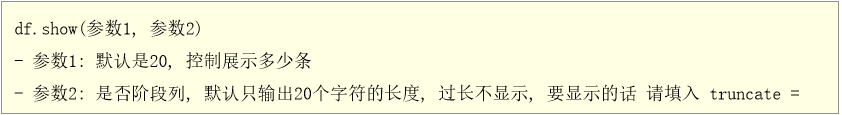

  * 一般来说直接show() 不需要设置相关参数信息

* printSchema():

  * 打印DF的表结构信息(字段信息, 数据类型, 是否允许为空), 类似于SQL中 desc 表

* select() 此API主要是用于设置 select 之后和 from之前的内容的语句

  * 作用: 用于选择DF中相关的列, 以及执行相关函数等

```properties
注意: 
	在使用DSL的API的时候, 有些API需要传递相关的参数信息, 参数的传递的方式一般支持三种:
		第一种: 支持传递字符串
			比如说:  df.select('id','name')
		
		第二种: 传递column对象
			比如说: df.select(df['id'],df['name'])
		
		第三种: 传递列表, 在列表中, 可以放置字符串 或者也可以放置column对象
			比如说:
				df.select(['id','name'])
				df.select([df['id'],df['name']])
	
	这些传递方式, 有些API仅支持其中的一种, 有些API支持两种, 有些API是三种都支持, 如何判断支持那些方式呢?
		在传递参数的时候, 在选择了某一个API的时候, 会自动提示可以传递那些类型的参数
		或者说直接点进入API的源码中, 查看其支持的方式
```

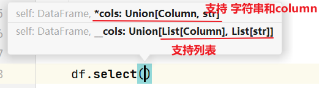

或者

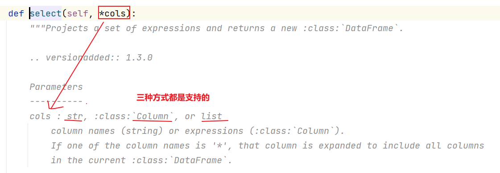

* filter 和 where:  对 df的数据进行过滤的操作
* groupBy: 用于为指定的列进行分组操作,分组后可以调度一些聚合函数, 完成聚合统计操作


如何你想在DSL中使用SQL的函数, spark sql将所有的SQL函数封装到一个类中, 直接通过这个类来使用即可

```properties
import pyspark.sql.function as F
```

----

SQL的风格:

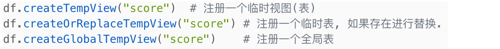

```properties
注意: 
	如何要使用SQL的风格, 必须要先将我们的DF注册为一个表才可以使用
	
	临时视图, 仅能在当前的Spark session的会话中使用, 如果要跨越多个会话使用, 必须将其注册为一个全局的表, 在使用全局表的时候, 必须添加上:  global_temp.视图名称
	

此操作, 在代码中, 一般都是构建临时的视图, 但是后续直接通过纯SQL的方式, 可能会构建永久的: 
	基于SQL来构建视图: 
		create  view  视图 ....		
```

编写SQL的API:  spark.sql('sql语句')


---

清洗相关API: 

* 去重API:  dropDuplicates()

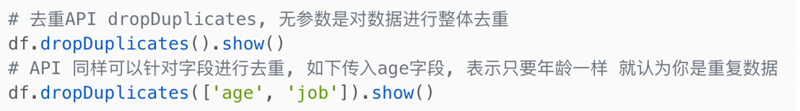

* 去除null值: dropna()

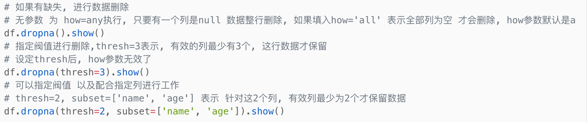

* 替换缺失值: fillna()

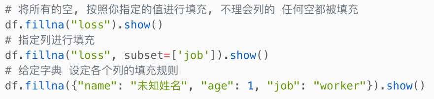


代码演示:

```properties
from pyspark import SparkContext, SparkConf
from pyspark.sql import SparkSession
import os

# 锁定远端操作环境, 避免存在多个版本环境的问题
os.environ['SPARK_HOME'] = '/export/server/spark'
os.environ["PYSPARK_PYTHON"] = "/root/anaconda3/bin/python"
os.environ["PYSPARK_DRIVER_PYTHON"] = "/root/anaconda3/bin/python"

# 快捷键:  main 回车
if __name__ == '__main__':
    print("演示清洗API")
    # 1- 创建SparkSession对象
    spark = SparkSession.builder\
        .appName('movie')\
        .master('local[*]')\
        .config('spark.sql.shuffle.partitions',4)\
        .getOrCreate()

    # 2- 读取外部数据源
    df_init = spark.read \
        .format('csv') \
        .option('sep', ',') \
        .option('header', True) \
        .option('inferSchema', True) \
        .load(path='file:///export/data/workspace/ky05_pyspark_parent/_03_pyspark_sql/data/teacher.txt')

    # 3- 进行处理:
    # 3.1 去重API:  dropDuplicates()
    df_init.dropDuplicates().show() # 针对整行, 如果完全一致, 那么就删除了

    df_init.dropDuplicates(['name','sex']).show()


    #3.2 去除null值: dropna()
    df_init.dropna().show() # 只要有一列为null, 直接整行删除
    df_init.dropna(thresh=3).show() # 至少需要有几列为有效数据
    df_init.dropna(thresh=2,subset=['id','name','sex']).show()
```


### 2.4 综合案例

#### 2.4.1 词频统计分析案例

* 方式一: 通过RDD转换为DF来实现WordCount

```properties
from pyspark import SparkContext, SparkConf
from pyspark.sql import SparkSession
import pyspark.sql.functions as F
import os

# 锁定远端操作环境, 避免存在多个版本环境的问题
os.environ['SPARK_HOME'] = '/export/server/spark'
os.environ["PYSPARK_PYTHON"] = "/root/anaconda3/bin/python"
os.environ["PYSPARK_DRIVER_PYTHON"] = "/root/anaconda3/bin/python"

# 快捷键:  main 回车
if __name__ == '__main__':
    print("演示WordCount案例实现操作")

    # 1- 创建SparkSession对象:
    spark = SparkSession.builder.appName('wd_01').master('local[*]').getOrCreate()

    sc = spark.sparkContext
    # 2- 通过 sc 读取外部数据源数据
    df_init = sc.textFile('file:///export/data/workspace/ky05_pyspark_parent/_03_pyspark_sql/data/words.dat')

    # 3- 对数据进行处理, 将其转换为一个结构化的数据:
    """
        RDD转换后的结果数据需要为什么样子呢? 最终在DF的体现应该是一个单列的数据, 然后一行放置一个单词
            结果: 
                [
                    (单词1,),(单词2,),(单词3,),(单词4,) .....
                ] 
    """
    rdd_tran = df_init.flatMap(lambda line: line.split(' ')).map(lambda word: (word,))
    print(rdd_tran.collect())

    # 4- 将rdd_tran转换为DF
    df = rdd_tran.toDF(schema='words string')

    # 5- 基于DF 对数据进行处理操作
    df.createTempView('t1')
    # SQL
    spark.sql("""
        select
            words,
            count(1) as cnt
        from t1 group by words
    """).show()

    # DSL
    df.groupby('words').count().show()
    # 更改别名
    df.groupby('words').count().withColumnRenamed('count','cnt').show()
    # 或者  基于 SQL函数来处理
    df.groupby('words').agg(
        F.count('words').alias('cnt')
    ).show()
    
    
    # 6- 释放资源
    spark.stop()
```

* 直接通过Spark session来读取数据

```sql
from pyspark import SparkContext, SparkConf
from pyspark.sql import SparkSession
import pyspark.sql.functions as F
import os

# 锁定远端操作环境, 避免存在多个版本环境的问题
os.environ['SPARK_HOME'] = '/export/server/spark'
os.environ["PYSPARK_PYTHON"] = "/root/anaconda3/bin/python"
os.environ["PYSPARK_DRIVER_PYTHON"] = "/root/anaconda3/bin/python"

# 快捷键:  main 回车
if __name__ == '__main__':
    print("演示WordCount案例实现: 直接通过SparkSession读取数据")

    # 1- 创建SparkSession对象
    spark = SparkSession.builder.appName('wd_02').master('local[*]').getOrCreate()

    # 2- 读取外部数据源:
    df_init = spark.read\
        .format('text')\
        .schema(schema='line string')\
        .load(path='file:///export/data/workspace/ky05_pyspark_parent/_03_pyspark_sql/data/words.dat')

    # 3- 处理数据:
    df_init.createTempView('t1')
    # SQL
    spark.sql("""
        select
            words,
            count(1) as cnt
        from  (select
                    explode(split(line, ' ')) as words
                from t1) as t2
        group by  words
    """).show()

    # 另一种方式实现
    spark.sql("""
        select
            words,
            count(1) as cnt
        from t1 lateral view explode(split(line, ' ')) t2 as words
        group by words
    """).show()

    # DSL方式
    # withColumn: 用于覆盖或者产生一个新的列, 参数1表示新列的名字(如果表中存在, 直接覆盖), 参数2: 表示新列的值
    df_init.withColumn('words',F.explode(F.split('line',' '))).groupby('words').agg(
        F.count('words').alias('cnt')
    ).show()

    # SQL  + DSL 混合使用
    df = df_init.withColumn('words', F.explode(F.split('line', ' ')))

    df.createTempView('t2')
    
    spark.sql("""
        select
            words,
            count(1) as cnt
        from t2 group by words
    """).show()
    
    # 4- 释放资源
    spark.stop()
```

#### 2.4.2 电影的评分案例

数据集介绍:

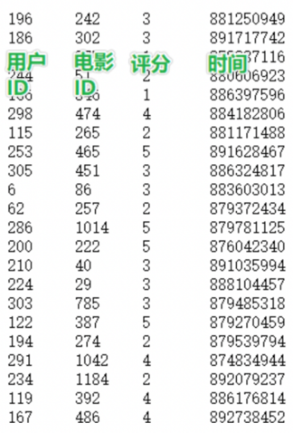

```properties
数据说明:  userid  movieid  score  datestr

字段的分隔符号:  \t
```

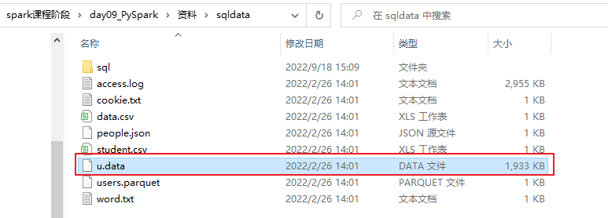

需求说明:

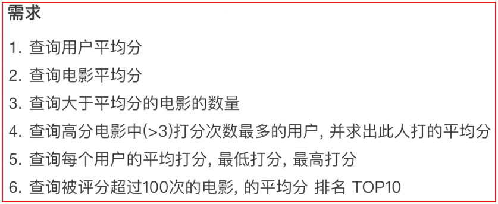

代码实现:

```properties
from pyspark import SparkContext, SparkConf
from pyspark.sql import SparkSession
import pyspark.sql.functions as F
import os

# 锁定远端操作环境, 避免存在多个版本环境的问题
os.environ['SPARK_HOME'] = '/export/server/spark'
os.environ["PYSPARK_PYTHON"] = "/root/anaconda3/bin/python"
os.environ["PYSPARK_DRIVER_PYTHON"] = "/root/anaconda3/bin/python"


def xuqiu_1():
    # 需求一:  查询用户平均分
    # SQL
    spark.sql("""
        select 
            userid,
            round(avg(score),2) as avg_score
        from t1 group by userid
    """).show()
    # DSL
    df_init.groupby(df_init['userid']).agg(
        F.round(F.avg('score'), 2).alias('avg_score')
    ).show()


def xuqiu_3():
    # SQL
    # 先求总电影的平均分
    spark.sql("""
        select
            round(avg(score),2) as total_score
        from t1
    """).show()
    # 然后求, 每部电影的平均分
    spark.sql("""
        select
            movieid,
            round(avg(score),2) as movie_score
        from  t1 group by movieid
    """).show()
    # 最后筛选出大于平均分的电影的数量
    spark.sql("""
        
         select
            count(1) as cnt
         from (select
                    movieid,
                    round(avg(score),2) as movie_score
                from  t1 group by movieid having movie_score > (select round(avg(score),2) as total_score from t1)
        ) t2
        
    """).show()
    # DSL
    # 电影总平均分
    df_total_avg = df_init.select(F.round(F.avg('score'), 2).alias('total_score'))
    # 计算每部电影的平均分
    df_movie_avg = df_init.groupby('movieid').agg(
        F.round(F.avg('score'), 2).alias('movie_score')
    )
    # 计算最终的结果
    print(df_movie_avg.where(df_movie_avg['movie_score'] > df_total_avg.first()['total_score']).count())


def xuqiu_4():
    # SQL
    # 首先: 先查询高分电影有那些?
    df_hight_movie = spark.sql("""
        select
            movieid,
            round(avg(score),2) as movie_score
        from t1 group by movieid having movie_score > 3
    """)
    df_hight_movie.createTempView('hight_movie')
    # 接着: 找到打分次数最多的用户
    df_score_user = spark.sql("""
        select
            userid
        from hight_movie join t1 on hight_movie.movieid = t1.movieid
        group by userid order by count(1) desc limit 1
    """)
    # 最后: 求这个人, 在整个结果集中打的平均分是多少
    spark.sql("""
        select
            round(avg(score),2) as avg_score
        from t1 where userid = (select
                                        userid
                                    from hight_movie join t1 on hight_movie.movieid = t1.movieid
                                    group by userid order by count(1) desc limit 1)
    """).show()
    # DSL
    # 首先 先查询高分电影有那些?
    df_hight_movie = df_init.groupby(df_init['movieid']).agg(
        F.round(F.avg('score'), 2).alias('movie_score')
    ).where(F.col('movie_score') > 3)
    # 接着: 找到打分次数最多的用户
    df_score_user = df_hight_movie.join(df_init, 'movieid').groupby('userid').count() \
        .orderBy('count', ascending=False).select('userid').limit(1)
    # 最后: 求这个人, 在整个结果集中打的平均分是多少
    df_init.where(df_init['userid'] == df_score_user.first()['userid']) \
        .select(F.round(F.avg('score'), 2).alias('avg_score')).show()


def xuqiu_5():
    # SQL
    spark.sql("""
        select
            userid,
            round(avg(score),2) as u_avg,
            min(score) as min_score,
            max(score) as  max_score
        from t1 group by userid
    """)
    # DSL
    df_init.groupby('userid').agg(
        F.round(F.avg('score'), 2).alias('u_avg'),
        F.min('score').alias('min_score'),
        F.max('score').alias('max_score')
    ).show()


def xuqiu_6():
    # SQL
    spark.sql("""
        select
            movieid,
            count(1) as pf_cnt,
            round(avg(score),2) as movie_avg
        from t1 group by movieid having pf_cnt >100  order by  movie_avg desc limit 10
    """).show()
    # DSL
    df_init.groupby('movieid').agg(
        F.count('movieid').alias('pf_cnt'),
        F.round(F.avg('score'), 2).alias('movie_avg')
    ).where('pf_cnt > 100').orderBy('movie_avg', ascending=False).limit(10).show()


# 快捷键:  main 回车
if __name__ == '__main__':
    print("演示: 电影评分案例")

    # 1- 创建SparkSession对象
    spark = SparkSession.builder.appName('movie').master('local[*]').getOrCreate()

    # 2- 读取外部数据源
    df_init = spark.read\
        .format('csv')\
        .option('sep','\t')\
        .schema(schema='userid string,movieid string,score int,datestr string')\
        .load(path='file:///export/data/workspace/ky05_pyspark_parent/_03_pyspark_sql/data/u.data')

    df_init.createTempView('t1')

    # 3- 处理数据
    # xuqiu_1()

    # 需求三:  查询大于平均分的电影的数量
    # xuqiu_3()

    # 需求四: 查询高分电影中(>3) 打分次数最多的用户, 并求出此人打的平均分
    # xuqiu_4()

    # 需求五:  查询每个用户的平均打分, 最低打分, 最高打分
    # xuqiu_5()

    # 需求六  查询被评分超过100次的电影的平均分 排名 top10
    # xuqiu_6()


```

以笔记的操作为准....

### 2.5 Spark SQL的shuffle分区设置

​		在默认情况下, spark SQL程序在运行的时候, 需要将SQL翻译为RDD, 将RDD提交到集群中运行, 生成DAG 划分stage, 确定线程, 从而进行运行操作

​		在执行过程中, 中间可能会产生shuffle的操作, 默认情况下, spark SQL的shuffle的分区数量为200个, 但是有时候由于数据量比较少, 完全不需要这么多的分区, 此时可能需要调小分区数量, 或者有时候数据量比较大, 200分区可能业务无法满足的, 此时可能需要调大的分区数量


如何调整分区的数量呢?

```properties
方式一: 在配置文件中修改shuffle的分区数量(全局修改)
	修改: spark-defaults.conf配置文件
	添加一个配置:  spark.sql.shuffle.partitions  N

方式二: 在提交Spark程序到集群的时候, 通过Spark-submit方式中 --conf 来设置shuffle分区数量  一般建议部署上线使用
	./spark-submit --conf "spark.sql.shuffle.partitions=N"

方式三: 在代码中, 直接在sparksession对象中设置, 设置后, 只对当前这个会话有效   优先级最高  测试中使用,部署的时候删除掉, 基于方式二部署
	sparksession. conf.set('spark.sql.shuffle.partitions',N)
	
	
	
一般在正式上线之前, 将内部设置调试参数删除掉, 更改为通过外部设置的方式, 以免外部设置无法生效问题
```

此设置也是在shuffle后生效, shuffle前是无效的

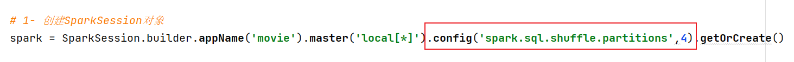


### 2.6 Spark SQL如何进行数据写出操作

统一的写出API:

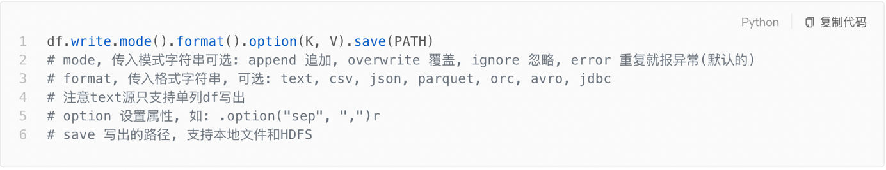

* 1- 完成基本类型的数据写出操作:  例如 写出 text  csv  json 等等

```properties
from pyspark import SparkContext, SparkConf
from pyspark.sql import SparkSession
import os

# 锁定远端操作环境, 避免存在多个版本环境的问题
os.environ['SPARK_HOME'] = '/export/server/spark'
os.environ["PYSPARK_PYTHON"] = "/root/anaconda3/bin/python"
os.environ["PYSPARK_DRIVER_PYTHON"] = "/root/anaconda3/bin/python"

# 快捷键:  main 回车
if __name__ == '__main__':
    print("演示如何进行写出操作: 基本类型")

    # 1- 创建SparkSession对象
    spark = SparkSession.builder \
        .appName('movie') \
        .master('local[*]') \
        .config('spark.sql.shuffle.partitions', 4) \
        .getOrCreate()

    # 2- 读取外部文件数据
    df = spark.read.csv(
        path='file:///export/data/workspace/ky05_pyspark_parent/_03_pyspark_sql/data/stu.txt',
        sep=' ',
        header=True,
        inferSchema=True
    )

    # 3- 处理数据: 过滤小于等于18岁学生
    df = df.where(df['age'] > 18)

    # 4- 进行数据写出操作:
    # 4.1 写出CSV
    df.write\
        .format('csv')\
        .mode('overwrite')\
        .option('sep','\t')\
        .option('header',True)\
        .save(path='hdfs://node1:8020/spark/spark_sql/output1')

    # 4.2 写出JSON
    df.write \
        .format('JSON') \
        .mode('append') \
        .save(path='hdfs://node1:8020/spark/spark_sql/output2')
```

将数据写出到HIVE中:

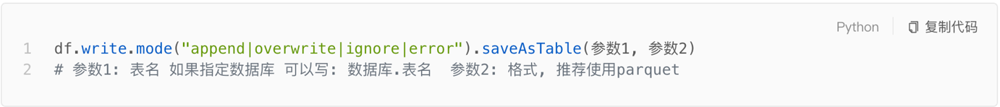

```properties
使用前提:
	需要让spark SQL 和 hive 进行集成, 如果没有集成, 无法执行此操作
```


将数据写出到支持JDBC的数据, 例如MySQL  同样也支持从数据库中读取数据

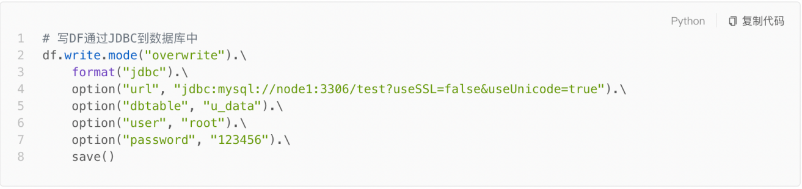

代码演示:

```properties
from pyspark import SparkContext, SparkConf
from pyspark.sql import SparkSession
import os

# 锁定远端操作环境, 避免存在多个版本环境的问题
os.environ['SPARK_HOME'] = '/export/server/spark'
os.environ["PYSPARK_PYTHON"] = "/root/anaconda3/bin/python"
os.environ["PYSPARK_DRIVER_PYTHON"] = "/root/anaconda3/bin/python"

# 快捷键:  main 回车
if __name__ == '__main__':
    print("演示数据写出操作: JDBC")

    # 1- 创建SparkSession对象
    spark = SparkSession.builder \
        .appName('movie') \
        .master('local[*]') \
        .config('spark.sql.shuffle.partitions', 4) \
        .getOrCreate()

    # 2- 读取外部文件数据
    df = spark.read.csv(
        path='file:///export/data/workspace/ky05_pyspark_parent/_03_pyspark_sql/data/stu.txt',
        sep=' ',
        header=True,
        inferSchema=True
    )

    # 3- 处理数据: 过滤小于等于18岁学生
    df = df.where(df['age'] > 18)

    # 4- 进行数据写出操作
    # CREATE DATABASE day09_spark_sql CHAR SET utf8;
    df.write.jdbc(
        url='jdbc:mysql://node1:3306/day09_spark_sql?useUnicode=true&characterEncoding=UTF-8',
        table='stu',
        mode='append',
        properties={ 'user' : 'root', 'password' : '123456' }
    )
```


可能出现的错误:

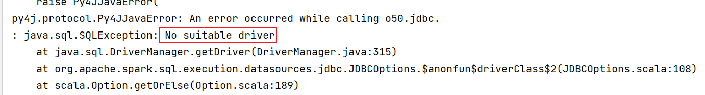

```properties
错误原因: 
	需要将数据写入到mysql, 必须配置MySQL的驱动包, 如果没有驱动包, 无法连接到MySQL, 直接报错

解决方案:  添加驱动包
	需要将驱动添加到以下几个位置中:  
		1- anaconda的python的pyspark的jars目录下:  pycharm在右键运行的时候, 会优先从这个目录下加载jar包
			BASE环境: /root/anaconda3/lib/python3.8/site-packages/pyspark/jars/ 
			
			虚拟环境: /root/anaconda3/envs/虚拟环境名称/lib/python3.8/site-packages/pyspark/jars/
		
		
		2- spark的家路径的jars目录下: 主要是用于spark-submit提交到到local或者spark集群模式的时候, 以及如果在本地运行, 设置spark的家目录环境, 也同样会加载这个目录下的jar包
				/export/server/spark/jars/

		3- HDFS的spark的jars目录下: 主要是用于通过spark-submit 提交到Yarn集群的时候
				hdfs://node1:8020/spark/jars 目录下


说明:
	以上三个环境, 适合于添加经常使用的jar包,  如果是一些不经常使用的jar包, 测试可以只在方式一中或者是方式二尝试添加即可. 后续部署上线在通过spark-submit 使用 --jars 来执行相关的jar包即可
```


## 3. Spark SQL函数定义

### 3.1 如何使用窗口函数

开窗函数的基本使用格式:

```properties
格式: 
	分析函数 over(partition by xxx  order by xxx [asc|desc] [row between xxx and xxx])

常见分析函数: 
	第一类: row_number() rank() dense_rank() ntile()
	
	第二类: 可以和聚合函数使用  sum() avg() max() min() count()
	
	第三类: 可以和lead()  lag() first_value() last_value()
```


如何使用: 

* SQL方式基本和之前在HIVE中的操作没有区别

```properties
from pyspark import SparkContext, SparkConf
from pyspark.sql import SparkSession
import pyspark.sql.functions as F
from pyspark.sql import Window as win
import os

# 锁定远端操作环境, 避免存在多个版本环境的问题
os.environ['SPARK_HOME'] = '/export/server/spark'
os.environ["PYSPARK_PYTHON"] = "/root/anaconda3/bin/python"
os.environ["PYSPARK_DRIVER_PYTHON"] = "/root/anaconda3/bin/python"

# 快捷键:  main 回车
if __name__ == '__main__':
    print("演示spark SQL的开窗函数: SQL 和 DSL")

    # 1- 创建SparkSession对象
    spark = SparkSession.builder \
        .appName('movie') \
        .master('local[*]') \
        .config('spark.sql.shuffle.partitions', 4) \
        .getOrCreate()

    # 2- 读取外部数据集:
    df = spark.read.csv(
        path='file:///export/data/workspace/ky05_pyspark_parent/_03_pyspark_sql/data/pv.dat',
        sep=' ',
        header=True,
        inferSchema=True
    )

    # 3- 执行相关的操作
    df.createTempView('t1')

    spark.sql("""
        select
            cookie,
            datestr,
            pv,
            row_number() over (partition by cookie order by datestr desc) as rn1
        from t1
    """).show()
    
    # DSL:
    df.select(
        'cookie','datestr','pv',
        F.row_number().over(win.partitionBy('cookie').orderBy(F.desc('datestr'))).alias('rn1')
    ).show()
```


### 3.2 SQL函数的分类说明

回顾SQL函数的分类:

* UDF函数: 用户自定义函数
  * 特点: 一进一出  大部分的内置函数都是属于UDF函数
  * 比如:  substr() date() .....
* UDAF函数: 用户自定义聚合函数
  * 特点: 多进一出 
  * 比如:  聚合函数 sum()  max() min()
* UDTF函数: 用户自定义表生成函数
  * 特点:  一进多出(给出一行数据, 返回多行或者多列的结果)
  * 比如: explode() 爆炸函数


不管Spark SQL 还是HIVE ,都提供了大量的内置函数,这些内置函数都是属于以上三类中某一类


为啥还要自定义函数呢?  扩充函数

```properties
	因为在进行业务领域分析的时候, 有时候会使用基于业务的特定功能的函数, 但是这些函数大部分在公共的函数中并没有提供, 此时需要自定义函数, 从而实现扩充操作
```


目前在Spark SQL中主要支持的自定义函数有那些呢?

```properties
	对于Spark SQL, 目前支持定义 UDF函数 和 UDAF函数, 但是对于python语言来说, 仅支持定义UDF函数, 如果想在python中定义UDAF函数, 官方建议结合pandas来实现自定义方案解决, 而对于UDTF函数, Spark并不支持
```

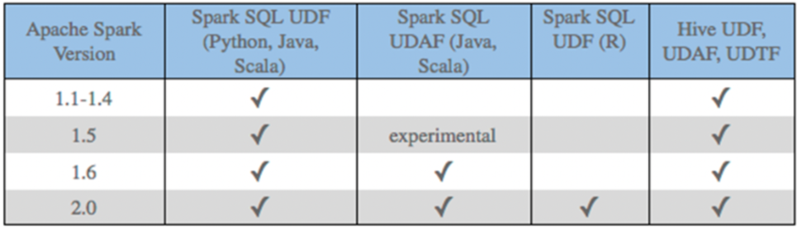

注意:

```properties
	在使用Python原生方式构建Spark SQL的UDF函数方案, 整个执行效率并不高, 因为整个内部运算是来一个处理一个, 然后一个个的返回, 而且是在两个平台之间(python平台 和 Java平台)进行交互 所以会有非常大的序列化的性能影响问题
	
	原生方案的改进: 采用JAVA  或scala来定义,然后python调度即可
	
	目前主要解决方案: 采用pandas的定义函数, 同时采用 apache  arrow框架来提升内部传输的效率
```


### 3.3 Spark原生自定义UDF函数

如何自定义原生UDF函数:

```properties
1- 在python中定义一个python的函数

2- 将这个函数注册到Spark SQL中
	方式一: 支持在DSL 和 SQL中使用
		格式:  
			udf函数对象 = sparkSession.udf.register(参数1,参数2,参数3)
		参数说明:
			参数1: 定义UDF函数的名称, 此名称可以在后续的SQL中使用
			参数2: 设置python的函数名称(需要将python那个函数进行注册, 这里写上对应函数名称即可, 不要带上括号)
			参数3: 表示函数返回值的类型(此类型为spark的类型)
			
			udf函数对象: 此对象是应用DSL中使用
	
	方式二: 仅支持在DSL中使用
		格式: 
			udf函数对象 = F.udf(参数1,参数2)
		
		参数说明:
			参数1: 设置python的函数名称(需要将python那个函数进行注册, 这里写上对应函数名称即可, 不要带上括号)
			参数2: 表示函数返回值的类型(此类型为spark的类型)
			udf函数对象: 此对象是应用DSL中使用

3- 在DSL以及SQL中进行使用即可
```

案例:普通数据类型

```properties
需求: 构建一个函数, 完成传递数据操作 统一在数据上添加一个后缀名  _boxuegu

from pyspark import SparkContext, SparkConf
from pyspark.sql import SparkSession
from pyspark.sql.types import *
import pyspark.sql.functions as F
import os

# 锁定远端操作环境, 避免存在多个版本环境的问题
os.environ['SPARK_HOME'] = '/export/server/spark'
os.environ["PYSPARK_PYTHON"] = "/root/anaconda3/bin/python"
os.environ["PYSPARK_DRIVER_PYTHON"] = "/root/anaconda3/bin/python"

# 快捷键:  main 回车
if __name__ == '__main__':
    print("原生自定义UDF函数")
    # 需求: 构建一个函数, 完成传递数据操作 统一在数据上添加一个后缀名  _boxuegu
    # 1- 创建SparkSession对象
    spark = SparkSession.builder \
        .appName('movie') \
        .master('local[*]') \
        .config('spark.sql.shuffle.partitions', 4) \
        .getOrCreate()

    # 2- 读取外部文件数据
    df = spark.read.csv(
        path='file:///export/data/workspace/ky05_pyspark_parent/_03_pyspark_sql/data/stu.txt',
        sep=' ',
        header=True,
        inferSchema=True
    )
    df.createTempView('t1')
    # 3- 处理数据:
    # 3.1 定义一个python的函数
    @F.udf(returnType=StringType())
    def add_std(data):
        return f'{data}_boxuegu'

    # 3.2 注册操作
    # 方式一: 支持在SQL 和 DSL中使用
    #add_std_dsl = spark.udf.register('add_std_sql',add_std,StringType())

    # 方式二: 仅支持在DSL中使用
    #add_std_dsl = F.udf(add_std,StringType())

    # 方式二的变种写法: 基于注解的方式

    # 使用
    # spark.sql("""
    #     select
    #         id,
    #         name,
    #         age,
    #         add_std_sql(name) as n
    #     from t1
    # """).show()

    df.select(
        'id','name','age',add_std('name').alias('n')
    ).show()

```

返回一些复杂的类型: 比如 list  tuple dict

```properties
from pyspark import SparkContext, SparkConf
from pyspark.sql import SparkSession
from pyspark.sql.types import *
import pyspark.sql.functions as F
import os

# 锁定远端操作环境, 避免存在多个版本环境的问题
os.environ['SPARK_HOME'] = '/export/server/spark'
os.environ["PYSPARK_PYTHON"] = "/root/anaconda3/bin/python"
os.environ["PYSPARK_DRIVER_PYTHON"] = "/root/anaconda3/bin/python"

# 快捷键:  main 回车
if __name__ == '__main__':
    print("原生自定义UDF函数")
    # 需求: 构建一个函数, 完成传递数据操作 统一在数据上添加一个后缀名  _boxuegu
    # 1- 创建SparkSession对象
    spark = SparkSession.builder \
        .appName('movie') \
        .master('local[*]') \
        .config('spark.sql.shuffle.partitions', 4) \
        .getOrCreate()

    # 2- 初始化基础数据集
    df = spark.createDataFrame(data=[
        ('s01', '张三,男'),
        ('s01', '李四,女'),
        ('s01', '王五,男'),
        ('s01', '赵六,女'),
        ('s01', '田七,女'),
        ('s01', '周八,男')
    ], schema='id string,name_sex string')

    df.createTempView('t1')


    # 3- 处理数据
    # 需求: 通过自定义函数, 将 name_age 数据拆解开
    def split_udf(data):
        res = data.split(',')
        # return [res[0], res[1]]
        #return (res[0], res[1])
        return {'name':res[0],'sex':res[1]}

    # 注册
    schema = StructType().add('name', StringType()).add('sex', StringType())
    split_udf_dsl = spark.udf.register('split_udf_sql', split_udf, schema)

    # 使用
    df_res = spark.sql("""
        select
            id,
            name_sex,
            split_udf_sql(name_sex) as rn,
            split_udf_sql(name_sex)['name'] as name,
            split_udf_sql(name_sex)['sex'] as sex
        from t1
    """)

    df_res.printSchema()
    df_res.show()

```


### 3.4 pandas的UDF函数

#### 3.4.1 Apache Arrow框架的基本介绍

​			apache arrow是Apache旗下的一款顶级的项目,是一个跨平台的以列式存储的内存数据存储层, 它设计目标就是作为一个跨平台的数据层, 来加快大数据分析项目的运行效率

​			pandas 与 pyspark SQL进行交互的时候,建立在apache arrow上 带来低开销 高性能的UDF函数

​			arrow 并不会自动使用, 需要进行安装以及简单配置开启工作才可以使用

​			但是 基于pandas实现UDF 和UDAF函数的时候, 其底层以及帮助我们开启了arrow方案


如何安装呢?

```properties
pip install pyspark[sql]
采用清华镜像
pip install -i https://pypi.tuna.tsinghua.edu.cn/simple pyspark[sql]

或者

pip install -i https://pypi.tuna.tsinghua.edu.cn/simple pyarrow == 9.0.0
```

如何使用呢?

```properties
spark.conf.set('spark.sql.execution.arrow.pyspark.enabled',True)
```

#### 3.4.2 如何基于Arrow完成pd_df转换

说明:

```properties
pandas df 到 spark df:
	spark_Df = spark.createDataFrame(pd_df)
	
spark df 到 pandas  df: 
	pd_df = spark_Df.toPandas()
```

代码演示操作:

```properties
from pyspark import SparkContext, SparkConf
from pyspark.sql import SparkSession
from pyspark.sql.types import *
import pyspark.sql.functions as F
import os

# 锁定远端操作环境, 避免存在多个版本环境的问题
os.environ['SPARK_HOME'] = '/export/server/spark'
os.environ["PYSPARK_PYTHON"] = "/root/anaconda3/bin/python"
os.environ["PYSPARK_DRIVER_PYTHON"] = "/root/anaconda3/bin/python"

# 快捷键:  main 回车
if __name__ == '__main__':
    print("pandas DF 和 spark df之间的互转操作")
    # 需求: 构建一个函数, 完成传递数据操作 统一在数据上添加一个后缀名  _boxuegu
    # 1- 创建SparkSession对象
    spark = SparkSession.builder \
        .appName('movie') \
        .master('local[*]') \
        .config('spark.sql.shuffle.partitions', 4) \
        .getOrCreate()

    spark.conf.set('spark.sql.execution.arrow.pyspark.enabled',True)

    # 2- 初始化基础数据集
    spark_df = spark.createDataFrame(data=[
        ('s01', '张三,男'),
        ('s01', '李四,女'),
        ('s01', '王五,男'),
        ('s01', '赵六,女'),
        ('s01', '田七,女'),
        ('s01', '周八,男')
    ], schema='id string,name_sex string')


    # 3- 将spark DF 转换为 pandas的DF
    pd_df = spark_df.toPandas()


    # 4- pandas DF 转换 spark df
    spark_df = spark.createDataFrame(pd_df)

    spark_df.show()

```


#### 3.4.3 如何基于pandas完成UDF函数

​		pandas UDF定义自定义函数, 有Spark来执行运行, 内部基于arrow传输数据, pandas函数(本质就是python函数, 只不过这个函数传入的参数为pandas的数据类型)负责处理数据, Arrow 支持向量化(充分发挥计算机并行的能力)操作. Pandas UDF是使用 F.pandas_udf() 作为装饰器进行函数注册, 将pandas函数转换为Spark的函数来进行使用, 而且pandas_udf() 也可以通过注解方式来使用

​		使用Pandas的 UDF可以模拟出 UDF函数和UDAF函数

----

* 基于Pandas实现UDF函数:  series To series
  * 说明: 自定义的Python的函数, 传入的数据类型为series类型, 函数的返回值类型也是series类型

```properties
import pandas as pd
from pyspark import SparkContext, SparkConf
from pyspark.sql import SparkSession
import pyspark.sql.functions as F
from pyspark.sql.types import *
import os

# 锁定远端操作环境, 避免存在多个版本环境的问题
os.environ['SPARK_HOME'] = '/export/server/spark'
os.environ["PYSPARK_PYTHON"] = "/root/anaconda3/bin/python"
os.environ["PYSPARK_DRIVER_PYTHON"] = "/root/anaconda3/bin/python"

# 快捷键:  main 回车
if __name__ == '__main__':
    print("演示: 基于pandas自定义Spark UDF函数")

    # 1- 创建SparkSession对象
    spark = SparkSession.builder \
        .appName('movie') \
        .master('local[*]') \
        .config('spark.sql.shuffle.partitions', 4) \
        .getOrCreate()

    # 2- 初始化一份数据源数据
    df_init = spark.createDataFrame(
        data=[
            (1, 5),
            (2, 8),
            (3, 4),
            (2, 6),
            (5, 2),
            (8, 8),
            (6, 2),
        ],
        schema='a int,b int'
    )
    df_init.createTempView('t1')
    # 3- 处理数据:
    # 需求: 要求定义一个函数, 完成对两列数据的乘积计算操作
    #  series To series
    # 第一步: 定义函数
    @F.pandas_udf(returnType=IntegerType())
    def cj_fn(a:pd.Series,b:pd.Series) -> pd.Series:
        return a * b

    # 第二步: 进行注册操作
    # cj_fn_dsl = F.pandas_udf(cj_fn,returnType=IntegerType())  也可以基于注解方式, 建议使用注解的方式

    # 如果要在SQL中使用: 当采用上面的注册后, 后续不需要写返回值类型
    spark.udf.register('cj_fn_sql',cj_fn)

    # 第三步: 进行使用操作
    # DSL
    df_init.select('a','b',cj_fn('a','b').alias('cj')).show()

    # SQL
    spark.sql("""
        select a,b, cj_fn_sql(a,b) as cj from t1
    """).show()
```

* 基于pandas 实现自定义UDAF函数: series To 标量(python的普通的数据类型, 比如说str int double...)
  * 说明: 自定义python的函数, 要求传入的数据类型为series类型. 函数的返回值的类型为标量类型

```properties
需求说明: 假设有两列数据, 一列为班级的id . 一列为学生的姓名, 请统计每个班级有多少个人, 基于自定义函数实现
import pandas as pd
from pyspark import SparkContext, SparkConf
from pyspark.sql import SparkSession
from pyspark.sql.window import Window as win
import pyspark.sql.functions as F
from pyspark.sql.types import *
import os

# 锁定远端操作环境, 避免存在多个版本环境的问题
os.environ['SPARK_HOME'] = '/export/server/spark'
os.environ["PYSPARK_PYTHON"] = "/root/anaconda3/bin/python"
os.environ["PYSPARK_DRIVER_PYTHON"] = "/root/anaconda3/bin/python"

# 快捷键:  main 回车
if __name__ == '__main__':
    print("演示: 基于pandas自定义Spark UDAF函数")

    # 1- 创建SparkSession对象
    spark = SparkSession.builder \
        .appName('movie') \
        .master('local[*]') \
        .config('spark.sql.shuffle.partitions', 4) \
        .getOrCreate()

    # 2- 初始化一份数据源数据
    df_init = spark.createDataFrame(
        data=[
            ('c01', '张三'),
            ('c02', '李四'),
            ('c01', '王五'),
            ('c03', '赵六'),
            ('c02', '田七'),
            ('c01', '周八'),
            ('c01', '李九'),
        ],
        schema='cid string,sname string'
    )
    df_init.createTempView('t1')
    # 3- 处理数据:
    # 需求说明: 假设有两列数据, 一列为班级的id . 一列为学生的姓名, 请统计每个班级有多少个人, 基于自定义函数实现
    # 第一步定义pandas的函数:  series to 标量
    @F.pandas_udf(returnType=IntegerType())
    def cnt_fn(data:pd.Series) -> int:
        return data.count()

    # 第二步 注册操作: 基于注解

    # 如果需要在SQL中使用
    spark.udf.register('cnt_fn',cnt_fn)

    # 第三步使用
    # DSL
    df_init.groupby('cid').agg(
        cnt_fn('sname').alias('cnt')
    ).show()

    # SQL
    spark.sql("""
        select
            cid,
            cnt_fn(sname) as cnt
        from t1
        group by cid
    """).show()

    # 支持在窗口函数中使用
    spark.sql("""
        select
            cid,
            sname,
            cnt_fn(sname) over(partition by cid order by sname) as fn1
        from t1
    """).show()

    df_init.select(
        'cid',
        'sname',
        cnt_fn('sname').over(win.partitionBy('cid').orderBy('sname')).alias('fn1')
    ).show()
```

#### 3.4.4 pandas UDF函数案例

数据集:

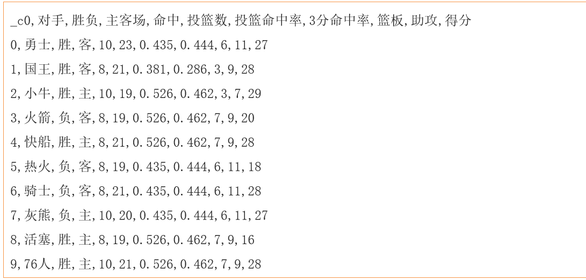

需求说明: 


数据所在的位置:

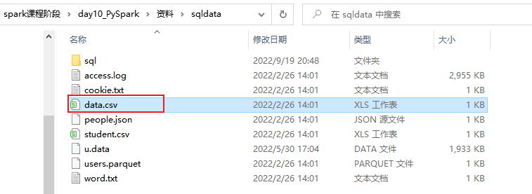

代码实现:

```properties
import pandas as pd
from pyspark import SparkContext, SparkConf
from pyspark.sql import SparkSession
import pyspark.sql.functions as F
import os

# 锁定远端操作环境, 避免存在多个版本环境的问题
os.environ['SPARK_HOME'] = '/export/server/spark'
os.environ["PYSPARK_PYTHON"] = "/root/anaconda3/bin/python"
os.environ["PYSPARK_DRIVER_PYTHON"] = "/root/anaconda3/bin/python"

# 快捷键:  main 回车
if __name__ == '__main__':
    print("pandas的UDF函数案例")

    # 1- 创建SparkSession对象
    spark = SparkSession.builder \
        .appName('movie') \
        .master('local[*]') \
        .config('spark.sql.shuffle.partitions', 4) \
        .getOrCreate()

    # 2- 读取外部的数据集:
    df_init = spark.read.csv(
        path='file:///export/data/workspace/ky05_pyspark_parent/_03_pyspark_sql/data/data.csv',
        header=True,
        inferSchema=True,
        sep=','
    )

    df_init.createTempView('t1')

    # 3- 需求实现:
    # 需求一: 助攻这一列需求加10, 如何实现?  UDF  series to series
    @F.pandas_udf(returnType='int')
    def zg_fn(zg:pd.Series) -> pd.Series:
        return zg + 10
    spark.udf.register('zg_fn',zg_fn)
    # dsl
    df_init.withColumn('助攻+10',zg_fn('助攻')).show()
    # sql
    spark.sql("""
        select *,zg_fn(`助攻`) as `助攻+10` from t1
    """).show()

    # 需求二: 篮板 + 助攻的次数, 思考使用那种方式?  udf
    @F.pandas_udf(returnType='int')
    def lb_zg_fn(lb:pd.Series,zg:pd.Series) -> pd.Series:
        return lb + zg

    spark.udf.register('lb_zg_fn', lb_zg_fn)
    # dsl
    df_init.withColumn('lb_zg', lb_zg_fn('篮板','助攻')).show()
    # sql
    spark.sql("""
        select *,lb_zg_fn(`篮板`,`助攻`) as lb_zg from t1
    """).show()

    # 需求三: 统计 胜和负的平均分  UDAF
    @F.pandas_udf(returnType='float')
    def sf_mean(df:pd.Series)->float:
        return df.mean()

    spark.udf.register('sf_mean', sf_mean)

    # DSL
    df_init.groupby('胜负').agg(
        sf_mean('得分').alias('sf_avg')
    ).show()
    # SQL
    spark.sql("""
        select
            `胜负`,
            sf_mean(`得分`) as  sf_avg
        from t1 group by `胜负`
    """).show()

```

## 4.Spark on Hive

### 4.1 集成原理说明

原生HIVE的处理过程:

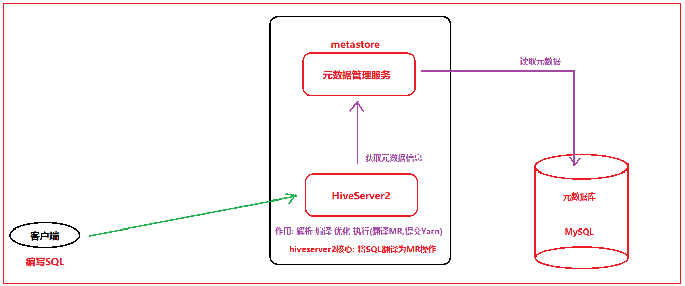

```properties
说明: 
	hiveserver2 本质上就是将SQL翻译为MR, 然后将MR提交到Yarn来运行

思考: 
	Spark on Hive: 将客户端提交的SQL语句从原来翻译为MR, 变更为翻译为Spark的RDD程序(spark程序),然后将其交给Yarn来执行

那么也就意味着, 一旦Spark和HIVE集成在一起, 这个HIVE的原有的HIVESERVER2这个服务就没有任何的价值, 所以说, Spark on HIVEDE 的本质: 
	当Spark去集成hive的metastore的元数据服务即可, 集成后, 可以让spark的执行引擎结合metastore元数据信息, 将SQL翻译为spark的应用程序, 基于spark执行运行操作,从而提升效率

核心目的: 
	集成HIVE的元数据的服务, 由Spark来运行执行, 避免每一次都需要自己来构建元数据,导致信息数据不一致问题, 不统一的问题, 一旦有了元数据服务后, 表的元数据信息就可以固定下来, 不管是谁操作spark SQL, 不需要定义schema信息,直接读取对应表来干活即可

思考: 市场上管理元数据的服务可能不止只有metastore, 那么为啥这里需要基于metastore来做元数据服务呢?
		为了抢占HIVE的市场

最终目标: 让原有使用HIVE的从业者, 不需要改变任何的方案, 即可在内部无痕的转换为Spark方案
```


### 4.2 配置操作

大前提: 要保证之前的HIVE的配置没有问题

```properties
建议: 
	在on hive配置前, 尝试先启动hive, 看看能不能正常的启动成功, 并连接

启动HIVE的命令: 
cd /export/server/hive/bin
启动metastore: 
	nohup ./hive --service metastore &nohup ./hive --service metastore &

启动hiveserver2:
	 nohup ./hive --service hiveserver2 &

通过 jps -m 查看, 相关的进程是否启动成功


基于beeline去连接操作: 在连接的之前,建议等待一会, 因为启动hiveserver2会比较慢,等个1 2分钟 
./beeline 
输入: !connect jdbc:hive2://node1:10000
用户名: root
密码: 随便写或者不写

如果能够连接成, 请务必将hive 通过kill方式将其杀死掉
```


配置操作:

```properties
1- 确保hive的conf目录下的hive-site.xml中,是否配置了metastore的服务地址信息: 有就不处理,没有就添加
	<property>
        <name>hive.metastore.uris</name>
        <value>thrift://node1.itcast.cn:9083</value>
    </property>
   
2- 需要将hive的conf目录下的hive-site.xml拷贝到spark的conf目录下:
	如果安装了spark集群, 需要三个节点都要拷贝, 如果是单机版本,只需要拷贝一台即可
	cd /export/server/hive/conf
	cp hive-site.xml /export/server/spark/conf/

3- 启动hive的metastore服务: 
	cd /export/server/hive/bin
    启动metastore: 
        nohup ./hive --service metastore &nohup ./hive --service metastore &
	
	启动后, 务必通过 jps -m 查看是否启动成功

4- 启动hadoop集群, 以及spark集群(如果spark集群没有安装,不需要启动)

5) 进行测试操作: 通过 spark提供的spark-sql 或者 pyspark直接测试即可

cd /export/server/spark/bin/
./pyspark 或者 ./spark-sql 进入后编写SQL语句查看相关内容, 进行测试


检查小技巧: 将hiveserver2启动好,然后连接上,通过hive创建 库 和表 已经添加数据,观察spark端,是否可以看到,如果是OK的,那么就说明集成成功了

测试后,一定要记得将hiveserver2 kill掉
```


### 4.3 如何在代码中集成HIVE

```properties
import pandas as pd
from pyspark import SparkContext, SparkConf
from pyspark.sql import SparkSession
import pyspark.sql.functions as F
import os

# 锁定远端操作环境, 避免存在多个版本环境的问题
os.environ['SPARK_HOME'] = '/export/server/spark'
os.environ["PYSPARK_PYTHON"] = "/root/anaconda3/bin/python"
os.environ["PYSPARK_DRIVER_PYTHON"] = "/root/anaconda3/bin/python"

# 快捷键:  main 回车
if __name__ == '__main__':
    print("pandas的UDF函数案例")

    # 1- 创建SparkSession对象
    # enableHiveSupport: 启动spark 和 hive的集成支持
    # hive.metastore.uris: 配置hive的metastore的地址
    # spark.sql.warehouse.dir: 指定spark SQL在建库和表的时候, 默认的创建的家目录在哪里, 此目录配置为与HIVE一致, 默认为本地路径
    spark = SparkSession.builder \
        .appName('movie') \
        .master('local[*]') \
        .config('spark.sql.shuffle.partitions', 4) \
        .config('hive.metastore.uris','thrift://node1.itcast.cn:9083')\
        .config('spark.sql.warehouse.dir','hdfs://node1:8020/user/hive/warehouse')\
        .enableHiveSupport()\
        .getOrCreate()

    spark.sql("""
        show databases;
    """).show()
```


## 5. spark sql 分布式执行引擎

​			目前, 我们已经完成了spark集成hive的操作, 但是集成后, 如何需要连接hive, 此时需要启动一个spark的客户端(pyspark,spark-sql,代码), 这个客户端的底层, 相当于启动一个spark的hiveserver2的服务项, 用于进行翻译spark操作, 一旦退出了这个客户端, 这个服务自然也就不存在了, 也就无法使用了

​		对于spark来说, 为了能够模拟的和hive趋于一致, 也是专门提供一个spark sql的thrift服务项, 相当于spark的hiveserver2的服务,类似于hive的hiveserver2服务


如何启动呢?

```properties
cd /export/server/spark

./sbin/start-thriftserver.sh \
--hiveconf hive.server2.thrift.port=10000 \
--hiveconf hive.server2.thrift.bind.host=node1.itcast.cn \
--hiveconf spark.sql.warehouse.dir=hdfs://node1:8020/user/hive/warehouse \
--master local[2]
```

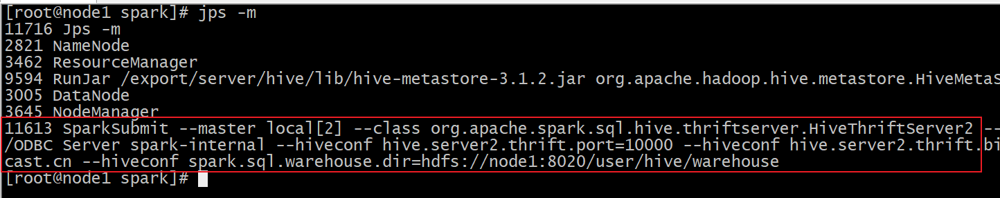

默认访问  4040 界面


启动后, 可以测试:

```
cd /export/server/spark/bin
./beeline 
输入: !connect jdbc:hive2://node1:10000
用户名: root
密码: 随便写或者不写
```

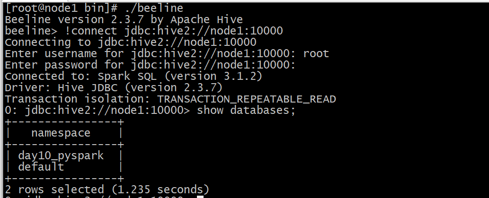


方式二: 可以通过datagrip连接操作:

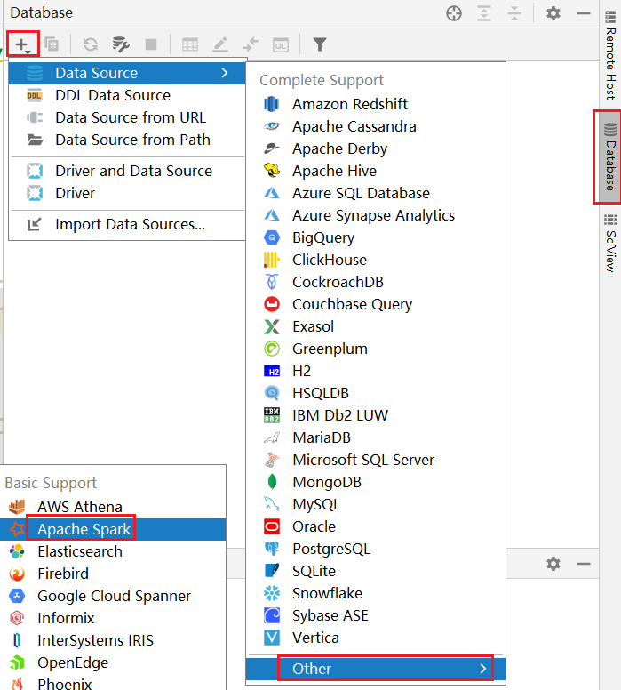

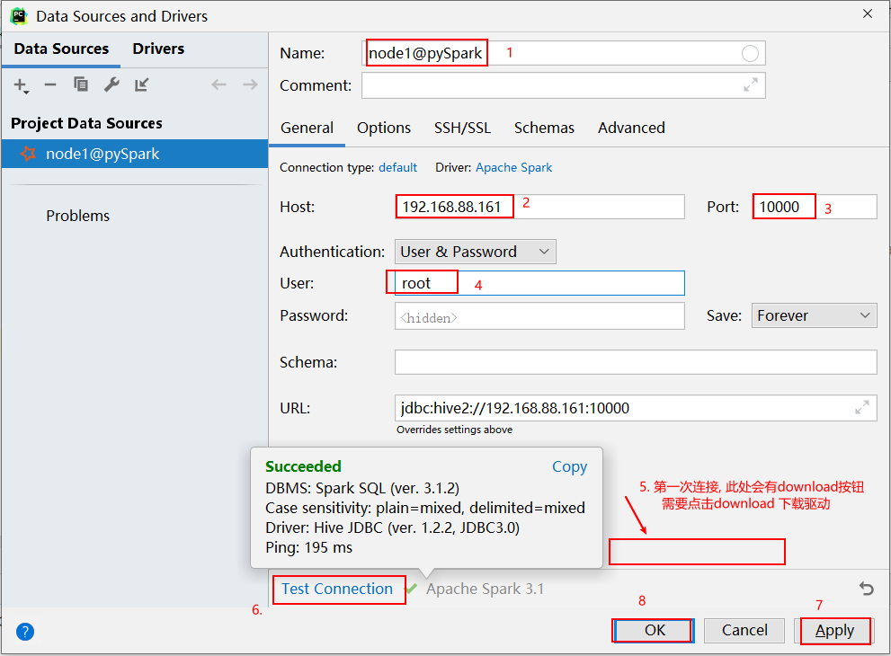

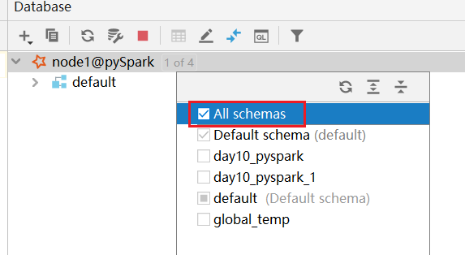

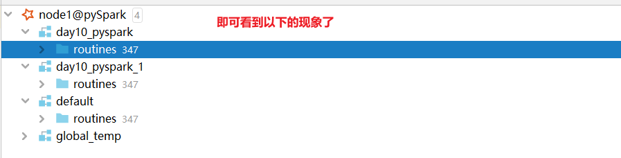


注意事项:   在使用download下载驱动的时候, 可能下载比较慢, 此时可以通过手动方式, 设置一个驱动:

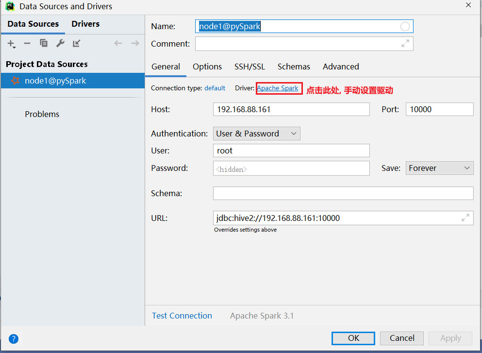


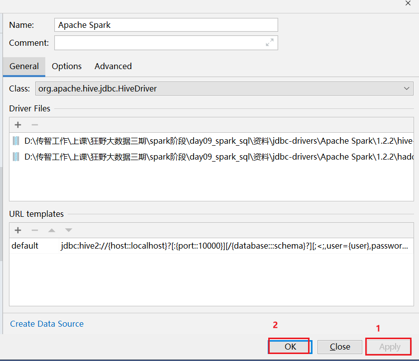


## 6. Spark SQL的运行机制

​		Spark SQL底层,也是需要将SQL语句翻译为RDD来运行的,  关于Spark SQL的运行机制, 主要讲的就是如何将SQL翻译为RDD的流程

​		因为一旦翻译为RDD后, 整个RDD的运行流程, 与之前的运行机制就是一模一样的

​		整个Spark SQL翻译为RDD的流程, 基本上与HIVE翻译为MR的流程是类似的

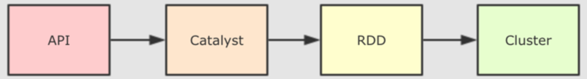

catalyst优化器内部具体流程步骤:

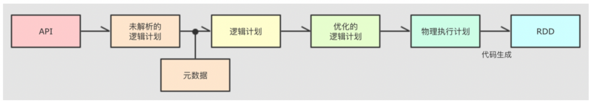

执行流程话术:  大白话

```properties
1- 编写DSL的API或者SQL, 将这些内容提交到Spark SQL来运行
2- Spark SQL在执行的时候, 会将其交给Spark SQL的优化器(catalyst), 后续整个翻译过程都是基于这个优化器来实施
	2.1 基于 SQL 先生成一个未解析的逻辑计划仅仅是对SQL语法, 以及根据SQL的执行顺序形成一个执行语法树(AST 抽象语法树), 描述SQL的执行顺序)
	2.2 然后结合元数据信息对未解析的逻辑计算添加相关的元数据信息(比如包括: 一共有那些字段 字段的烈性, 数据从哪里读, 存储的格式, 分隔符号.....), 形成未优化的逻辑计算
	2.3 接着对逻辑计划进行优化操作, 根据Spark SQL提供的默认优化策略(高达几百种优化方案),对逻辑计划进行优化操作, 比如说: 谓词下推, 列值裁剪... 形成一个优化后的逻辑计划, 底层是基于规则匹配相关的优化方案
	2.4 讲优化后的逻辑计算转换为物理计划, 在转换过程中, 由于优化策略不同, 会导致产生多个物理计划, 此时通过成本模型(代码函数),选择出一个最优的物理执行计划
	2.5 将物理执行计划, 基于代码生成器, 将物理计划转换为RDD的程序, 提交到集群运行, 后续就是RDD的整个流程
	
```

专业术语:

```properties
1- sparkSQL底层解析是有RBO 和 CBO优化完成的
2- RBO是基于规则优化, 对于SQL或DSL的语句通过执行引擎得到未执行逻辑计划, 在根据元数据得到逻辑计划, 之后加入列值裁剪或谓词下推等优化手段形成优化的逻辑计划
3- CBO是基于优化的逻辑计划得到多个物理执行计划, 根据代价函数选择出最优的物理执行计划
4- 通过codegenaration代码生成器完成RDD的代码构建
5- 底层依赖于DAGScheduler 和TaskScheduler 完成任务计算执行
```


如何查看SQL的物理执行计划呢?

* 方式一:  通过访问 WEB UI(thrift server的 web界面 4040 )查看 SQL目录下detail(详细内容):

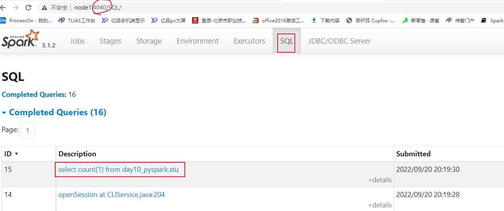

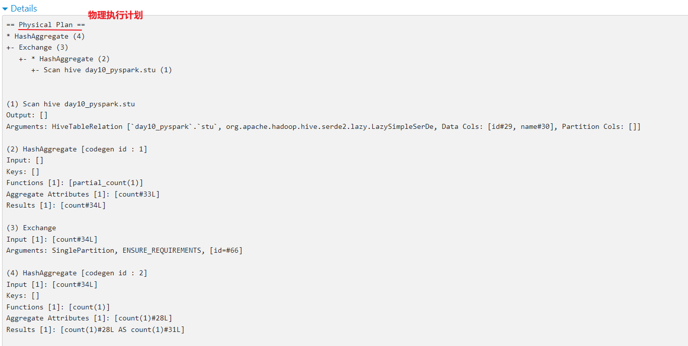

* 方式二: 通过 SQL方式查看

```properties
格式:
	explain SQL语句
```

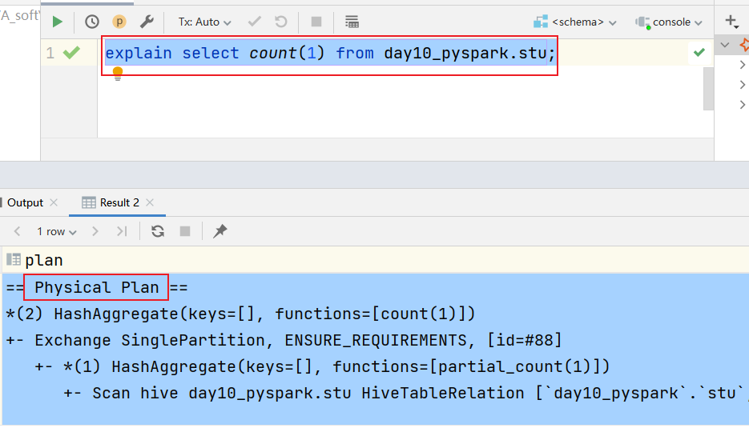

## 7. 综合案例

### 7.1 新零售综合案例

数据结构介绍:  

```properties
InvoiceNo  string  订单编号(退货订单以C 开头)
StockCode  string  产品代码
Description string  产品描述
Quantity integer  购买数量(负数表示退货)
InvoiceDate string   订单日期和时间   12/1/2010 8:26
UnitPrice  double  商品单价
CustomerID  integer  客户编号
Country string  国家名字

字段与字段之间的分隔符号为 逗号
```

E_Commerce_Data.csv


拿到数据之后, 首先需要对数据进行过滤清洗操作:  清洗目的是为了得到一个更加规整的数据

```properties
清洗需求:
	需求一: 将客户id(CustomerID) 为 0的数据过滤掉 
	需求二: 将商品描述(Description) 为空的数据过滤掉
	需求三: 将日期格式进行转换处理:
		原有数据信息: 12/1/2010 8:26
		转换为: 2010-12-01 08:26
```

相关的需求(DSL和SQL):

```properties
(1) 客户数最多的10个国家
(2) 销量最高的10个国家
(3) 各个国家的总销售额分布情况
(4) 销量最高的10个商品
(5) 商品描述的热门关键词Top300
(6) 退货订单数最多的10个国家
(7) 月销售额随时间的变化趋势
(8) 日销量随时间的变化趋势
(9) 各国的购买订单量和退货订单量的关系
(10) 商品的平均单价与销量的关系
```

#### 7.1.1 完成数据清洗过滤的操作

```properties
from pyspark import SparkContext, SparkConf
from pyspark.sql import SparkSession
import pyspark.sql.functions as F
import os

# 锁定远端操作环境, 避免存在多个版本环境的问题
os.environ['SPARK_HOME'] = '/export/server/spark'
os.environ["PYSPARK_PYTHON"] = "/root/anaconda3/bin/python"
os.environ["PYSPARK_DRIVER_PYTHON"] = "/root/anaconda3/bin/python"

# 快捷键:  main 回车
if __name__ == '__main__':
    print("新零售案例实现: 数据清洗操作")

    # 1- 创建SparkSession对象
    spark = SparkSession.builder\
        .appName('xls_clear')\
        .master('local[*]')\
        .config('spark.sql.shuffle.partitions',4)\
        .getOrCreate()

    # 2- 读取外部数据源数据
    df_xls = spark.read.csv(
        path='file:///export/data/workspace/ky05_pyspark_parent/_03_pyspark_sql/data/E_Commerce_Data.csv',
        header=True,
        inferSchema=True
    )
    df_xls.createTempView('t1')

    # 3- 对数据进行处理操作
    """
        清洗需求:
            需求一: 将客户id(CustomerID) 为 0的数据过滤掉 
            需求二: 将商品描述(Description) 为空的数据过滤掉
            需求三: 将日期格式进行转换处理:
                原有数据信息: 12/1/2010 8:26
                转换为: 2010-12-01 08:26
            转换思路: 
                先将日期 --> 时间戳 ---> 日期
            涉及函数: 
                日期转时间戳函数:  unix_timestamp(日期,格式)
                时间戳转日期函数:  from_unixtime(时间戳,格式)
    """
    df_clear = df_xls.where("CustomerID != 0 and Description is not null and Description != ''")

    df_tran = df_clear.withColumn('InvoiceDate',F.from_unixtime(F.unix_timestamp('InvoiceDate','M/d/yyyy H:mm'),'yyyy-MM-dd HH:mm'))

    # 4- 请将清洗后的结果数据保存到HDFS上:
    df_tran.write.csv(
        path='hdfs://node1:8020/spark/xls/output',
        mode='overwrite',
        header=True,
        sep='|'
    )

    # 5- 释放资源
    spark.stop()
```


#### 7.1.2 需求统计分析操作

准备工作

```properties
from pyspark import SparkContext, SparkConf
from pyspark.sql import SparkSession
import pyspark.sql.functions as F
import os

# 锁定远端操作环境, 避免存在多个版本环境的问题
os.environ['SPARK_HOME'] = '/export/server/spark'
os.environ["PYSPARK_PYTHON"] = "/root/anaconda3/bin/python"
os.environ["PYSPARK_DRIVER_PYTHON"] = "/root/anaconda3/bin/python"

# 快捷键:  main 回车
if __name__ == '__main__':
    print("新零售案例实现: 数据分析操作")

    # 1- 创建SparkSession对象
    spark = SparkSession.builder\
        .appName('xls_analysis')\
        .master('local[*]')\
        .config('spark.sql.shuffle.partitions',4)\
        .getOrCreate()

    # 2- 读取外部数据源数据
    df_xls = spark.read.csv(
        path='hdfs://node1:8020/spark/xls/output',
        header=True,
        inferSchema=True,
        sep='|'
    )
    df_xls.createTempView('t1')

    # 3- 对数据进行处理操作

```

* (1) 客户数最多的10个国家
  * 大白话: 统计每个国家有多少个不同的客户, 按照客户数倒序排序取出前10位

```properties
def xuqiu_1():
    # SQL
    spark.sql("""
        select
            Country,
            count(distinct CustomerID) as consumer_cnt
        from t1
        group by Country order by consumer_cnt desc limit 10
    """).show()
    # DSL
    df_xls.groupby('Country').agg(
        F.countDistinct('CustomerID').alias('consumer_cnt')
    ).orderBy('consumer_cnt', ascending=False).limit(10).show()

```


* (2) 销量最高的10个国家
  * 大白话:  统计每个国家销售的数量有多少, 按照销售数量倒序排序取出前10位
* (3) 各个国家的总销售额分布情况
  * 大白话:  统计每个国家的销售额

* (4) 销量最高的10个商品
  * 大白话:  统计各个商品的销售的数量, 按照销售数量进行倒序取出前10位
* (5) 商品描述的热门关键词Top20
  * 大白话: 统计每个热门关键词的数量, 按照数量进行倒序, 取出前20

```properties
def xuqiu_5():
    # SQL:
    spark.sql("""
        select
            keywords,
            count(1) as key_cnt
        from t1 lateral view explode(split(Description,' ')) t2 as keywords
        group by keywords order by  key_cnt desc limit 10
    
    """).show()
    # DSL:
    df_xls.withColumn('keywords', F.explode(F.split('Description', ' '))).groupby('keywords').agg(
        F.count('keywords').alias('key_cnt')
    ).orderBy('key_cnt', ascending=False).limit(10).show()

```


* (6) 退货订单数最多的10个国家
  * 统计每个国家退货的订单的数量有什么, 按照订单数量进行倒序排序 取出前10位
    * 退货: 订单ID以 C开头的订单

* (7) 月销售额随时间的变化趋势
  * 大白话: 统计每个月的销售额 (统计月份的时候, 一定要带上年)
* (8) 日销量随时间的变化趋势
  * 大白话: 统计每天的的销售数量 (共计天的时候, 一定要带上年和月)
* (9) 各国的购买订单量和退货订单量的关系
  * 大白话: 统计每个国家的购买的订单总数量以及退货的订单数量

```properties
def xuqiu_9():
    # SQL:
    spark.sql("""
        select
            Country,
            count(distinct InvoiceNo) as order_cnt,
            count(distinct 
                if(InvoiceNo like 'C%',InvoiceNo,NULL)
            ) as t_o_cnt
        from t1
        group by Country
    """).show()
    # DSL
    df_xls.groupby('Country').agg(
        F.countDistinct('InvoiceNo').alias('order_cnt'),
        F.countDistinct(F.expr("if(InvoiceNo like 'C%',InvoiceNo,NULL)")).alias('t_o_cnt')
    ).show()

```

* (10) 商品的平均单价与销量的关系
  * 大白话: 统计每个商品的 平均单价, 以及每个商品的销售数量


完整的代码:

```properties
from pyspark import SparkContext, SparkConf
from pyspark.sql import SparkSession
import pyspark.sql.functions as F
import os

# 锁定远端操作环境, 避免存在多个版本环境的问题
os.environ['SPARK_HOME'] = '/export/server/spark'
os.environ["PYSPARK_PYTHON"] = "/root/anaconda3/bin/python"
os.environ["PYSPARK_DRIVER_PYTHON"] = "/root/anaconda3/bin/python"


def xuqiu_1():
    # SQL
    spark.sql("""
        select
            Country,
            count(distinct CustomerID) as consumer_cnt
        from t1
        group by Country order by consumer_cnt desc limit 10
    """).show()
    # DSL
    df_xls.groupby('Country').agg(
        F.countDistinct('CustomerID').alias('consumer_cnt')
    ).orderBy('consumer_cnt', ascending=False).limit(10).show()


def xuqiu_5():
    # SQL:
    spark.sql("""
        select
            keywords,
            count(1) as key_cnt
        from t1 lateral view explode(split(Description,' ')) t2 as keywords
        group by keywords order by  key_cnt desc limit 10
    
    """).show()
    # DSL:
    df_xls.withColumn('keywords', F.explode(F.split('Description', ' '))).groupby('keywords').agg(
        F.count('keywords').alias('key_cnt')
    ).orderBy('key_cnt', ascending=False).limit(10).show()


def xuqiu_9():
    # SQL:
    spark.sql("""
        select
            Country,
            count(distinct InvoiceNo) as order_cnt,
            count(distinct 
                if(InvoiceNo like 'C%',InvoiceNo,NULL)
            ) as t_o_cnt
        from t1
        group by Country
    """).show()
    # DSL
    df_xls.groupby('Country').agg(
        F.countDistinct('InvoiceNo').alias('order_cnt'),
        F.countDistinct(F.expr("if(InvoiceNo like 'C%',InvoiceNo,NULL)")).alias('t_o_cnt')
    ).show()


# 快捷键:  main 回车
if __name__ == '__main__':
    print("新零售案例实现: 数据分析操作")

    # 1- 创建SparkSession对象
    spark = SparkSession.builder\
        .appName('xls_analysis')\
        .master('local[*]')\
        .config('spark.sql.shuffle.partitions',4)\
        .getOrCreate()

    # 2- 读取外部数据源数据
    df_xls = spark.read.csv(
        path='hdfs://node1:8020/spark/xls/output',
        header=True,
        inferSchema=True,
        sep='|'
    )
    df_xls.createTempView('t1')

    df_xls.show()
    # 3- 对数据进行处理操作
    # 需求1: 客户数最多的10个国家
    #xuqiu_1()

    # 需求5: 商品描述的热门关键词Top20
    #xuqiu_5()

    # 需求9: 统计每个国家的购买的订单总数量以及退货的订单数量
    #xuqiu_9()
```


### 7.2 在线教育案例

数据结构基本介绍:

```properties
student_id  string  学生id
recommendations string   推荐题目(题目与题目之间用逗号分隔)
textbook_id  string  教材id
grade_id  string   年级id
subject_id string  学科id
chapter_id strig   章节id
question_id string  题目id
score  integer  点击次数
answer_time  string  注册时间
ts  timestamp   时间戳


字段与字段之间的分隔符号为 \t
```


需求:

```properties
需求一: 找到TOP50热点题对应科目. 然后统计这些科目中, 分别包含几道热点题目

需求二:  找到Top20热点题对应的饿推荐题目. 然后找到推荐题目对应的科目, 并统计每个科目分别包含推荐题目的条数
```

数据存储在 资料中: eduxxx.csv


* 编写代码, 完成相关的需求:

```properties
from pyspark import SparkContext, SparkConf
from pyspark.sql import SparkSession
import pyspark.sql.functions as F
import os

# 锁定远端操作环境, 避免存在多个版本环境的问题
os.environ['SPARK_HOME'] = '/export/server/spark'
os.environ["PYSPARK_PYTHON"] = "/root/anaconda3/bin/python"
os.environ["PYSPARK_DRIVER_PYTHON"] = "/root/anaconda3/bin/python"

# 快捷键:  main 回车
if __name__ == '__main__':
    print("演示: 在线教育案例实现操作")

    # 1- 创建SparkSession对象
    spark = SparkSession.builder \
        .appName('edu_analysis') \
        .master('local[*]') \
        .config('spark.sql.shuffle.partitions', 4) \
        .getOrCreate()

    # 2- 读取外部文件数据集
    df_edu = spark.read.csv(
        path='file:///export/data/workspace/ky05_pyspark_parent/_03_pyspark_sql/data/eduxxx.csv',
        header=True,
        sep='\t',
        inferSchema=True
    )

    df_edu.createTempView('t1')

    df_edu.show()
    df_edu.printSchema()
    # 3- 处理数据
    # 需求一: 找到TOP50热点题对应科目. 然后统计这些科目中, 分别包含几道热点题目
    # SQL
    # 尝试找到TOP50热点题
    df_question_top50 = spark.sql("""
        select
            question_id,
            sum(score) as total_score
        from t1 
        group by question_id order by total_score desc limit 50
    """)
    df_question_top50.createTempView('question_top50')
    # 根据50热点题关联到对应科目
    spark.sql("""
        select
            subject_id,
            count(distinct top50.question_id) as top_cnt
        from question_top50 top50 join t1 on top50.question_id = t1.question_id
        group by subject_id
    """).show()

    # DSL:
    df_question_top50 = df_edu.groupby('question_id').agg(
        F.sum('score').alias('total_score')
    ).orderBy('total_score',ascending=False).limit(50)

    df_question_top50.join(df_edu,'question_id').groupby('subject_id').agg(
        F.countDistinct('question_id').alias('top_cnt')
    ).show()
    
    # 4- 释放资源
    spark.stop()
```


