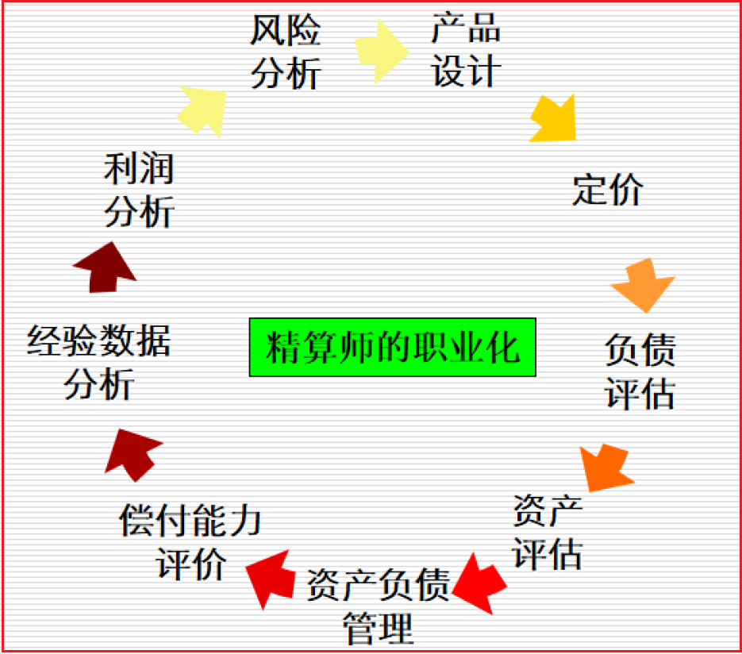
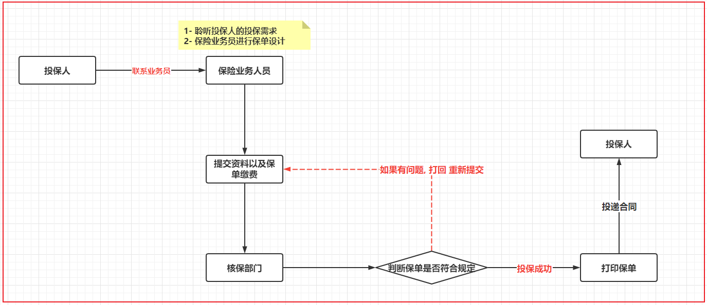
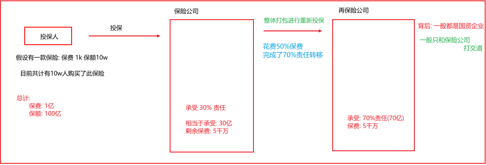

# day01_保险项目课程笔记

今日内容:

* 1- 保险项目的基本介绍: 
  * 行业背景介绍
  * 行业相关术语
  * 行业的数据特点
  * 项目背景
* 2- 项目业务需求和架构
  * 项目需求说明
  * 项目的架构
  * 项目的技术选型
  * 项目的基本真实情况介绍


## 1. 保险项目的基本介绍

项目名称: 富华阳光人寿保险项目

### 1.1 行业背景介绍

​		整个保险行业中, 最为核心的技术就是精算, 精算简单来说就是根据不同年龄以及保额来计算需要收取多少保费的问题, 精算出现改变了从早期通过经验判断的方案来确定保费的阶段, 让保险行业更加专业化, 精确化

​		精算行业并不仅仅解决保费的问题,包含有: 确定保险费率、应付意外损失的准备金、自留限额、未到期责任准备金和未决赔款准备金等方面，都力求采用更精确的方式取代以前的经验判断

​		保险精算学主要研究事故的出险规律、损失的分布规律、保费的厘定、保险产品的设计、准备金的提取、偿付能力等保险具体问题。


发展历程说明:

* 1693年，英国大数学家、天文学家哈雷编制出第一张生命表，这就标志着精算学的诞生。

* 1757年，英国人简姆士·丹松首先提出应按保险人的年龄和保额收取保费，即提出保费的计算应考虑死亡率的大小。至此，精算思想正式进入人寿保险领域。

* 1764年，英国的爱德沃创办了世界上第一家人寿保险公司——伦敦公平人寿保险社，采用了简姆士·丹松的计算保费的思想和方法，并设立了专门的精算技术部门，承担分析保险公司的利润来源、编制生命表、测定人口死亡率等，把精算技术作为保险经营决策的依据，使得保险公司的效益稳定、业绩领先。

### 1.2 行业相关术语

​	在整个保险行业中, 会按照人的生命将保险划分为二大类: 一类为寿险   一类为非寿险

* 寿险:  以人的生命 作为保险标的, 只有死亡才能赔付
* 非寿险: 
  * 财产保险: 保障财产安全
  * 责任保险: 一般指的赔付第三者保险
  * 健康保险: 主要指的 重疾险  医疗险
  * 意外保险: 主要指的发生特定意外情况, 进行赔付保险

* 精算师:  保险行业中, 最为抢手的人才, 俗称金领中钻石领

  * 全栈性人才

  


----

* 投保人: 指的申购或者缴费保险的人

* 被保人: 以谁的生命作为标的

* 受益人: 当进行理赔的时候, 获取理赔金的人

* 保险人:  指的就是保险公司

* 保险准备金: 保险准备金是指保险人为保证其如约履行保险赔偿或给付义务，根据政府有关法律规定或业务特定需要，从保费收入或盈余中提取的与其所承担的保险责任相对应的一定数量的基金

* 生命表: 根据以往一定时期内各种年龄死亡统计资料编制的一种统计表

* 保费:  投保人向保险公司缴纳的费用

* 责任:  保险公司向被保人，提供的保障责任是多方面的，比如医疗门诊责任，医疗住院责任，自然死亡责任，意外死亡责任，残疾责任，重疾赔付责任，住院津贴责任等等。

* 保额、保险金、责任保险金: 如果客户在某个责任达到获赔条件，向保险公司申请赔付，保险公司提供的最大的保障金额

* 新单、新契约

   购买的保单在首年内，称为新单，或新契约

* 续期

   对长期险来说，持续几年都会交保费，从第二期保费开始，称为续期。

* 理赔

   如果客户出险了，保险公司需要按照保单合约，对客户进行理赔，相应会支付理赔金。

### 1.3 保险行业特点

​		保险行业实时需求比较少, 因为保险中交易频次比较低的, 但是存储数据极高的, 所以大多数的的场景都是针对过去历史数据进行统计分析操作(离线分析)

​		证券行业项目. 交易频次非常高, 实时需求相对比较多, 而离线需求较少一些

​		目前大数据行业, 应该是离线和实时并存的. 目前比重来看: 大多数公司还是以离线需求居多


常规的保险部门主要有那些?

```properties
保险公司有那些部门: 
	新产品研发部门
	再保险部门
	精算部门
	渠道部门
	核保部门
	续期部门
	理赔部门
	保全部门:  所有跟保单更改相关的的操作, 都叫做保全
	财务部门:
	......
	
	当前我们的这个项目 主要是跟精算部门, 保全部门, 理赔部门 还有续期部门 有关
	
	其中保全部门整个业务复杂度是极高的, 即使是保全部门自己的人员, 也无法掌握保全中所有业务
	
	我们所在部门:  续期部门 或者 精算部门
```

* 用户投保流程:



* 再保险部门




保险种类: 

* 风险转移类保险:
  * 寿险:  解决家庭责任
    * 定期寿险
    * 两全寿险
    * 终身寿险
  * 健康险:  解决因病致贫情况, 看病少花钱
    * 医疗险
    * 重疾险
  * 意外险:  解决家庭责任
    * 意外医疗
    * 意外身故
    * 意外伤残
* 理财型保险:
  * 年金保险
  * 万能险
  * 投资连结险


当前这个项目属于终身寿险的范畴


在保险公司中, 一般数据都存储在什么位置:

* 理赔数据Oracle数据源

  介绍：记录客户出现死亡，医疗意外等，保险公司需要赔付的信息，该数据库记录出险时间、详情等，赔付金额等。

* 精算数据MySQL数据源

  介绍：存储保单的现金价值，准备金，生存金，婚假金，教育金，理财收益等结果数据，以及保费的确定，需要精算师的参与，大数据工程师跟精算师沟通。

* 保单数据PostgreSQL数据源

  介绍：保单数据存储具体客户保单的详情，比如投保时间，地点，产品以及缴费时长等信息。


在公司 不同部门可能会选择不同的数据方案来进行数据的存储操作


说明: 当前项目中数据是存储在多个数据源的, 在教学中, 仅使用mysql数据源,来存储 理赔 精算 保单等相关的数据, 方便学习使用


### 1.4 项目背景

​		当前项目是一个重构的项目, 早期精算师是基于Excel来编写精算计算的方案. 编写后, 有Oracle团队完成转换工作, 将Excel中计算方案, 转换为Oracle的存储过程, 基于Oracle存储过程完成整个精算计算的操作,但是随着保险产品越来越多, 需要核定精算部分也是越来越多, 导致在Oracle上存储过程也是越来越多, 维护关系变得更加负责, 数据体量也不不断的增加, Oracle费用也在不断的提升, 对DBA依赖度也在不断的提升

​		在这样的背景下, 集团公司决定重构整个精算系统, 希望能够解决目前所存在的痛点问题, 而这些问题交给了大数据部门来解决, 而大数据部门根据数据存在复杂的迭代计算特点, 提出基于Spark sql来完成整个计算工作. 保留SQL的灵活性, 同时提升维护关系, 提升计算的效率. 更加容易扩展. 支持分布式计算操作, 以及也可以完成后续各种业务决策指标统计计算工作


后期计算逻辑:

```properties
	根据精算师提供的精算模板(精算规则), 将这些规则转换为spark sql实现, 实现后, 依然会和精算模板进行匹配比对, 如果比对成功,那么说明计算是正确的
```


## 2.  项目业务需求与架构介绍

### 2.1 项目七大需求(知道即可)

* 1- 计算所有**性别**, 所有**缴费期**, 所有**投保年龄**, 在未来每个**保单年度**的保费参数因子相关指标: 23个 保单参数指标, 合并情况组合方式有19338种情况  保存到 prem-src 表
  * 比如: 
    * 情况一:  性别  男,  缴费期选择 10年  投保年龄 20岁 在第一年度(20~105岁)  计算器 23个保费因子
    * 情况二:  性别  男,  缴费期选择 10年  投保年龄 20岁 在第二年度  计算器 23个保费因子
    * .....

* 2- 计算所有**性别**, 所有**缴费期**, 所有**投保年龄**的每年的应交保费, 此表的计算需要依赖于第一个表 参数因子表聚合统计,  保存到:  prem-std 表
  * 比如:  这种情况共计有 274组不同组合
    * 情况一:  性别男,  缴费期为 10年,  投保年龄为 20岁, 其需要缴纳保费为: xxx
    * 情况二:  性别女,  缴费期为 15年,  投保年龄为 40岁, 其需要缴纳保费为: xxx

* 3- 计算所有**性别**, 所有缴费期, 所有的**投保年龄**, 在未来每个**保单年度**(共计有19338种情况)跟现金价值有关的 37个指标, 结果保存 cv_src (现金价值表)
  * 比如:  情况方式有19338种
    * 情况一:  性别  男,  缴费期选择 10年  投保年龄 20岁 在第一年度(20~105岁)  计算 37个现金价值指标
    * 情况二:  性别  男,  缴费期选择 10年  投保年龄 20岁 在第二年度  计算 37个现金价值指标
    * .....

* 4- 计算所有**性别**, 所有**缴费期**, 所有**投保年龄**, 在未来每个**保单年度**(共计有19338种情况) 跟准备金相关的33个指标, 保存到 rsv_src (准备金表)表中
  * 比如:  情况方式有19338种
    * 情况一:  性别  男,  缴费期选择 10年  投保年龄 20岁 在第一年度(20~105岁)  计算 33个准备金指标
    * 情况二:  性别  男,  缴费期选择 10年  投保年龄 20岁 在第二年度  计算 33个准备金指标
    * .....

* 5- 需要依据 cv_src (现金价值表) , rsv_src (准备金表) 关联 计算后续的 产品精算结果表(policy_actuary)
  * 主要包含信息:  现金价值, 生存金, 保费信息 ....
  * 此表作用:  
    * 作用一: 后续向银保监会批准售卖保险, 必须提交资料
    * 作用二:  公司要计算准备金负债 也是需要的

* 6- 需要依据上面的产品精算结果表 关联到具体客户表, 得到对应客户的精算结果表, 体现客户当前和未来的现金价值和生存金信息 , 此表是给用户看的
* 7- 依据保单详情表, 汇总统计得到保监会规定的指标, 同样此指标用于给公司决策使用 (用来实现最终的图表展示)

### 2.2 项目架构描述 (理解, 能够说的出来)

* 

### 2.3 项目的技术选型

| 框架选型         | 版本  |
| ---------------- | ----- |
| CentOS           | 7.7   |
| JDK              | 1.8   |
| Python           | 3.8   |
| Hadoop           | 3.3.0 |
| Spark            | 3.1.2 |
| Hive             | 3.1.2 |
| MySQL            | 5.7   |
| Sqoop            | 1.4.7 |
| DolphinScheduler | 1.3.5 |


### 2.4 项目的基本情况(记录)

正式环境:

```properties
服务器集群:
	大公司:   共有集群的资源 800台, 总共有 10000个CPU核数.总内存大约在 30000GB cpu和内存都是基于资源队列方案管理: 将各个业务线划分不同队列中, 避免资源抢占问题, 在我们当前这个项目中, 有资源200个核. 600g的内存 (yarn的核心和内存配比: 1核对应3~5GB)
	一个服务器的磁盘为 24T 或者 36T 
	
	小公司:   20台服务器的集群, 我们当前这个项目使用资源是200个cpu, 600g内存
```

人员配置:

```properties
组员 :  5~7 人

前端+后端(BI工程师):  1个人
项目负责人:  1个  
大数据开发者: 3个人  负责  保费 准备金 以及现金价值计算
运维: 1个人
测试: 2个人(多个业务线共用)  其中有一人主要负责

具体大数据干活的, 有  3.5个人:  
	3个大数据开发者 + 0.5个项目负责人
```

开发周期:

```properties
开发周期:  6个月

阶段划分:
	需求调研, 评审 (4周)
	架构设计:  1周
	编写和集成:  12周
	测试: 2周 (分散的两周, 因为测试是阶段测试)
	上线部署:  3周 (每完成一个阶段, 完成一次阶段上线, 实现敏捷开发)
```

技术亮点: 项目介绍

```properties
面试题:  整体项目的优势


基于精算师的保险业务使用大数据技术转换赋能
保险计算业务极其复杂，但是本项目开发模式很轻量级。
让程序员更聚焦业务，避开繁重的环境维护工作量，开发大大节省时间。
高级SQL开发，前所未有的SQL体验。

归纳起来:
	1) 虽然保险计算业务极其复杂, 但是使用sparkSQL重构后代码, 全部都是以SQL结构化思想来计算, 更加方便维护, 减轻了维护成本
	2) 将大的需求拆分多个小的步骤, 做到这个模块化开发, 减轻耦合关系
```

当前的学习环境: 


| 服务器           | node1.itcast.cn | node2.itcast.cn | node3.itcast.cn |
| ---------------- | --------------- | --------------- | --------------- |
| MySql 5.7        | √               |                 |                 |
| Hadoop           | √               | √               | √               |
| Spark            | √               |                 |                 |
| Sqoop            | √               | √               | √               |
| Hive             | √               |                 |                 |
| DolphinScheduler | √               | √               | √               |

