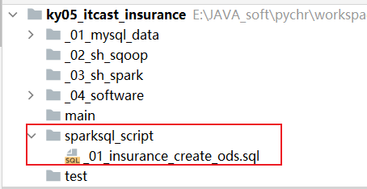
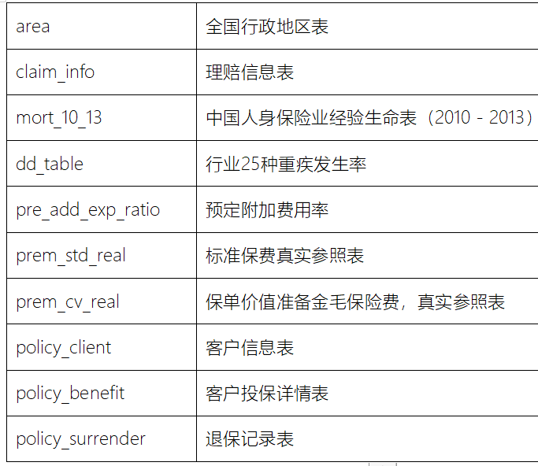
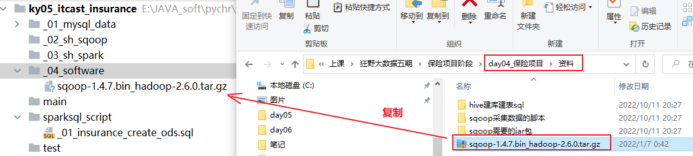
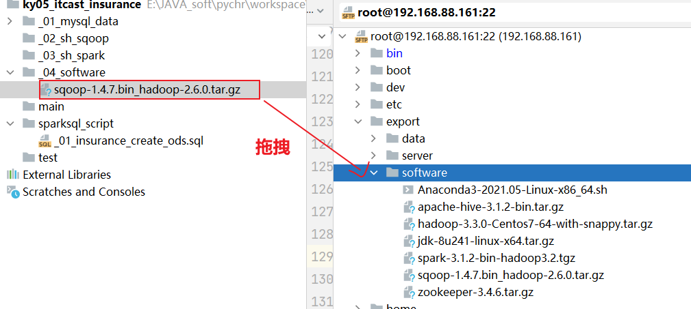
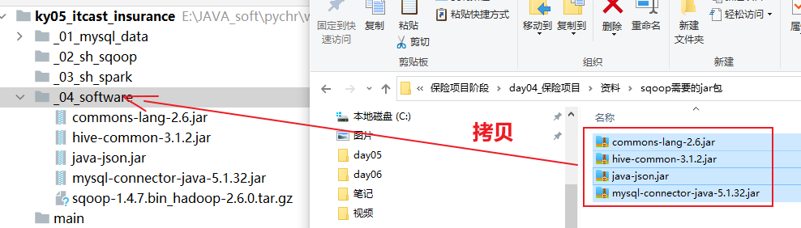
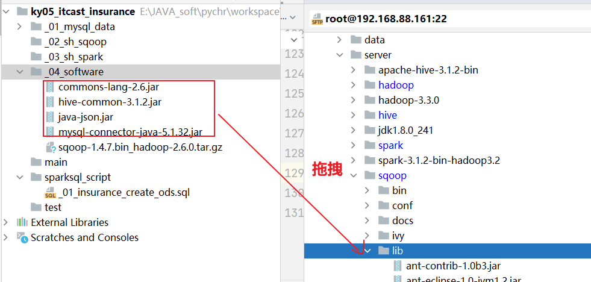
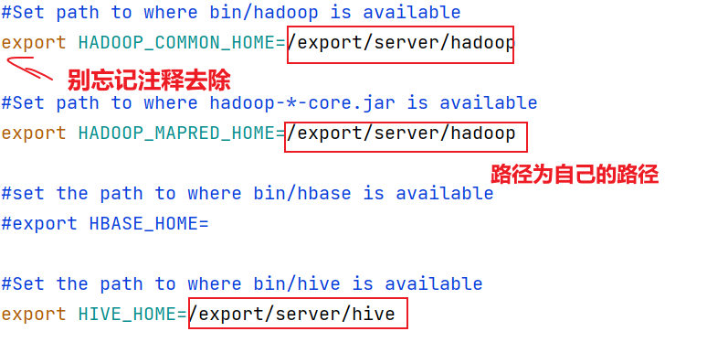
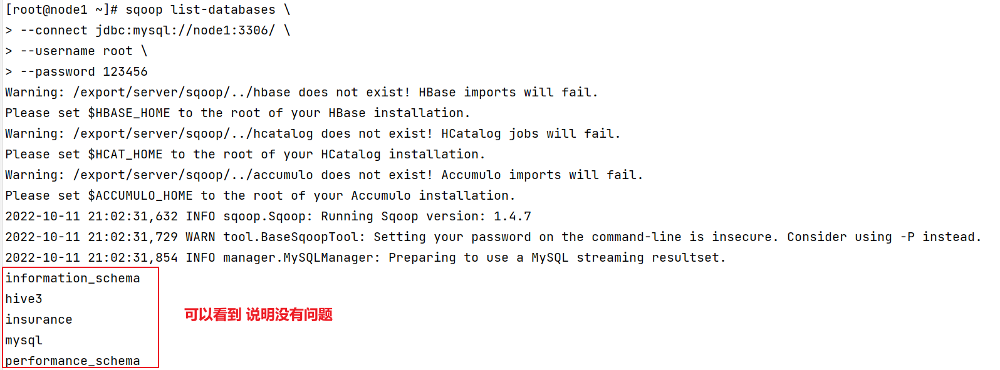
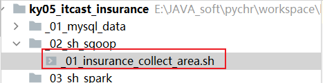
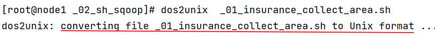

# day04_保险项目课程笔记

今日内容:

* 1- 基于Sqoop完成数据采集工作
  * 1.1 构建ODS层的表
  * 1.2 基于SQOOP完成采集工作: 全量 和 增量


## 1. 构建ODS层库和表

* ODS层: 数据源层(贴源层)

````properties
	作用:  对接数据源, 一般会和数据源保持相同的粒度, 数据源中有那些表, 那么我们的ODS层就需要构建有那些表, 与之一一对应
	
在hive中建表的时候, 需要思考那些点呢? 
	1- 表选择为内部表还是外部表呢? 
		判断标准:  表未来存储的数据, 我们是否具有绝对的控制权
		
		项目中: 
			通过Spark SQL连接HIVE构建表, 由于是自己建表, 自己从数据库导入数据, 所有对数据具有控制权, 此时可以选择构建内部表或者是外部表, 建议构建内部表
		
	2- 表是否需要使用分区表还是分桶表: 
		分区表: 在HIVE数仓体系中, 对数据量比较大的表, 或者每天都有新增或者更新的数据表, 一般构建的都是分区表
		
		分桶表:  当需要对表数据进行采样操作的时候, 或者说每一天中数据量依然是非常庞大的,或者说每个分区下的数据依然也是非常庞大的, 为了能够进一步提升查询的性能, 可以选择构建分桶表
		
		项目中: 
			除了投保信息表 客户信息表 理赔信息表 退保信息表比较庞大以外, 需要构建分区表, 其他的表主要都是一些配置型的表 数据体量不是特别的大, 可以不用构建分区表, 对于配置型表 后续可以直接选择覆盖处理即可, 这些表一般都不需要维护历史变化
			而分桶表, 后续也不需要采样而且基于Spark SQL来处理 也不需要处理,  并不构建
		在学习环境中, 为了方便一些, 后续会全部构建普通表
	
	3- 表需要使用那种存储格式 以及压缩方案
		ODS层: 一般来说都是TextFile 或者 ORC
			说明: 如果后续构建表, 然后数据直接从HDFS上加载普通的文本文件数据, 此时一般构建为TextFile (load 加载, 此方式仅支持textFile), 以及通过 sqoop采集选择的是原生导入行为的, 一般构建textFile
			如果能支持ORC导入, 一般建议构建为ORC格式
		
		其他层次: 一般选择为ORC
			
		项目中: 所有的层次都是基于ORC格式来存储, 对于ODS层, 基于sqoop的hcatalog模式来导入的
		
		学习环境中: 所有层次都采用textFile, 对于ODS层, 由于sqoop使用apache原生版本测试, 导致对hcatalog支持不良好, 仅能使用原生方式导入, 在项目中不存在 因为是基于CDH版本 可以直接使用hcatalog模式
		
		压缩方案:  数仓体系中, 一般我们选择主要是以SNAPPY为主, 对于ODS层这样数据量比较庞大的基础层, 可以选用 zlib/GZ这种可以压缩的更小的压缩方案
	
	4- 对于表的字段的选择:  
		ODS层: 一般会和数据源的表保持相同的粒度 原有表有那些字段, 那么我们在ODS层建表中也有那些字段, 如果分区表,在此基础上添加分区字段即可, 分区字段一般以采集的周期为准
		
		其他层次的建表: 没有固定方案, 主要参考当前计算的维度 和 指标来构建表, 以能够存储结果数据为准则来建表
````

建表操作:

* 1- 在项目中的sparksql_script目录下, 创建一个 _01_insurance_create_ods.sql 文件



* 2- 在文件中书写建库和建表的语句



```properties
-- 此脚本用于放置ODS层建表语句
-- 构建库
drop database if exists insurance_ods cascade ;
create database if not exists  insurance_ods
    location 'hdfs://node1:8020/user/hive/warehouse/insurance_ods.db';

-- 构建表
drop  table if exists insurance_ods.mort_10_13;
create table if not exists  insurance_ods.mort_10_13(
    age  smallint comment '年龄',
    cl1 decimal(10, 8) comment '非养老类业务一表，男（CL1）',
    cl2 decimal(10, 8) comment '非养老类业务一表，女（CL2）',
    cl3 decimal(10, 8) comment '非养老类业务二表，男（CL3）',
    cl4 decimal(10, 8) comment '非养老类业务二表，女（CL4）',
    cl5  decimal(10, 8) comment '养老类业务表，男（CL5）',
    cl6  decimal(10, 8) comment '养老类业务表，女（CL6）'
) comment '中国人身保险业经验生命表（2010－2013）'
row format delimited fields terminated by '\t';

drop table if exists insurance_ods.dd_table;
create table if not exists  insurance_ods.dd_table(
    age      smallint comment '年龄',
    male     decimal(10, 8) comment '男性的重疾发生率',
    female   decimal(10, 8) comment '女性的重疾发生率',
    k_male   decimal(10, 8) comment '男性的K值',
    k_female decimal(10, 8) comment '女性的K值'
) comment '行业25种重疾发生率'
    row format delimited fields terminated by '\t';


--ASSUMPTION 预定附加费用率 pre_add_exp_ratio
drop table if exists  insurance_ods.pre_add_exp_ratio;
create table if not exists  insurance_ods.pre_add_exp_ratio  (
                                    PPP smallint comment '缴费期',
                                    r1 decimal(10,8) comment '如果保单年度=1',
                                    r2 decimal(10,8) comment '如果保单年度=2',
                                    r3 decimal(10,8) comment '如果保单年度=3',
                                    r4 decimal(10,8) comment '如果保单年度=4',
                                    r5 decimal(10,8) comment '如果保单年度=5',
                                    r6_ decimal(10,8) comment '如果保单年度>=6',
                                    r_avg decimal(10,8) comment 'Avg',
                                    r_max decimal(10,8) comment '上限'
) comment '预定附加费用率'
 row format delimited fields terminated by '\t';


drop table if exists insurance_ods.prem_std_real;
create table if not exists  insurance_ods.prem_std_real
(
    age_buy smallint comment '年投保龄',
    sex     string comment '性别',
    ppp     smallint comment '缴费期',
    bpp     string comment '保障期',
    prem    decimal(14, 6) comment '每期交的保费',
    nbev    decimal(10,8) comment '新业务价值率（NBEV，New Business Embed Value）'
)comment '标准保费真实参照表' row format delimited fields terminated by '\t';


drop table if exists insurance_ods.prem_cv_real;
create table if not exists  insurance_ods.prem_cv_real
(
    age_buy smallint comment '年投保龄',
    sex     string comment '性别',
    ppp     smallint comment '缴费期间',
    prem_cv      decimal(15, 7) comment '保单价值准备金毛保险费(Premuim)'
)comment '保单价值准备金毛保险费，真实参照表'
    row format delimited fields terminated by '\t';


drop table if exists insurance_ods.area;
create table if not exists  insurance_ods.area
(
    id        smallint comment '编号',
    province  string comment '省份',
    city      string comment '城市',
    direction String comment '大区域'
) comment '中国省市区域表' row format delimited fields terminated by '\t';


drop table if exists insurance_ods.policy_client;
CREATE TABLE if not exists  insurance_ods.policy_client(
                              user_id STRING COMMENT '用户号',
                              name STRING COMMENT '姓名',
                              id_card STRING COMMENT '身份证号',
                              phone STRING COMMENT '手机号',
                              sex STRING COMMENT '性别',
                              birthday STRING COMMENT '出生日期',
                              province STRING COMMENT '省份',
                              city STRING COMMENT '城市',
                              direction STRING COMMENT '区域',
                              income INT COMMENT '收入'
)
    comment '客户信息表' row format delimited fields terminated by '\t';
drop table if exists insurance_ods.policy_benefit;
CREATE TABLE if not exists  insurance_ods.policy_benefit(  pol_no STRING COMMENT '保单号',
                              user_id STRING COMMENT '用户号',
                              ppp STRING COMMENT '缴费期',
                              age_buy BIGINT COMMENT '投保年龄',
                              buy_datetime STRING COMMENT '购买日期',
                              insur_name STRING COMMENT '保险名称',
                              insur_code STRING COMMENT '保险代码',
                              pol_flag smallint COMMENT '保单状态，1有效，0失效',
                              elapse_date STRING COMMENT '保单失效时间')
    comment '客户投保详情表' row format delimited fields terminated by '\t';

drop table if exists insurance_ods.claim_info;
create table if not exists  insurance_ods.claim_info
(
    pol_no string comment '保单号',
    user_id string comment '用户号',
    buy_datetime string comment '购买日期',
    insur_code string comment '保险代码',
    claim_date string comment '理赔日期',
    claim_item string comment '理赔责任',
    claim_mnt decimal(35,6) comment '理赔金额'
)  comment '理赔信息表'
    row format delimited fields terminated by '\t';

drop table if exists insurance_ods.policy_surrender;
create table  if not exists  insurance_ods.policy_surrender
(
    pol_no string comment '保单号',
    user_id string comment '用户号',
    buy_datetime string comment '投保日期',
    keep_days smallint comment '退保前的保单持有天数',
    elapse_date string comment '保单失效日期'
) comment '退保记录表'
    row format delimited fields terminated by '\t';

```

注意事项:

```properties
问题说明: 
	当基于Spark SQL来HIVE中构建表后, 发现表在HDFS上并不存在, 甚至库对应HDFS目录也没有, 通过查看表的详细结构信息发现表的location的加载路径地址为linux的本地路径, 这显然是不符合要求的
	
原因:  
	在Spark SQL 和 hive集成的时候, 应该要指定一个Spark SQL 默认加载数据的路径的位置参数,但是在启动thriftServer的时候, 并没有配置, 导致Spark使用默认值(本地路径)

解决方案:  
	方案一: 在启动Spark的thriftServer服务的时候, 添加HIVE默认加载数据位置的参数
		spark.sql.warehouse.dir=hdfs://node1:8020/user/hive/warehouse
	
	方案二: 在建库的时候, 通过手动指定location的地址为HDFS上对应位置, 然后后续建表的时候, 对应表就会被放置到库目录下
	

注意: 
	如果在建表的时候, 在建表的语句上添加location的参数, 此表默认构建的就是外部表
```


## 2. 基于SQOOP完成数据采集操作

目前数据主要是存储PG MYSQL  ORACLE数据库中, 需要将这些数据从数据源导入到HIVE的ODS层中


简单来说: 将关系型数据库的数据导入到HIVE中

技术: SQOOP


### 2.1 SQOOP的基本介绍

​		sqoop是apache旗下一款用于关系型数据库和大数据生态圈之间的数据导入导出的工作, 可以从关系型数据库将数据导入到大数据生态圈中, 也可以从大数据生态圈将数据导出到关系型数据库


### 2.2 SQOOP的安装操作

* 1- 将sqoop的安装包上传到当前项目环境中:  _04_software



* 2- 将安装包上传到node1的 /export/software目录下: 



* 3- 解析SQOOP到/export/server下

```properties
cd /export/software
tar -zxf sqoop-1.4.7.bin_hadoop-2.6.0.tar.gz -C /export/server/
```

* 4- 建立软连接

```properties
cd /export/server/
ln -s sqoop-1.4.7.bin__hadoop-2.6.0/ sqoop
```

* 5- 上传sqoop相关的额外依赖包



* 6- 将依赖包, 上传到 sqoop的lib目录下



* 7- 修改sqoop的配置文件

```properties
cd /export/server/sqoop/conf
cp sqoop-env-template.sh  sqoop-env.sh

vim sqoop-env.sh

添加以下内容:
export HADOOP_COMMON_HOME=/export/server/hadoop
export HADOOP_MAPRED_HOME=/export/server/hadoop
export HIVE_HOME=/export/server/hive
```



* 8- 配置环境变量

```properties
vim /etc/profile

添加以下内容: 

#SQOOP_HOME
export SQOOP_HOME=/export/server/sqoop
export PATH=$PATH:$SQOOP_HOME/bin

然后:保存退出,  执行 source /etc/profile
```

* 9- 测试sqoop是否安装成功:

```properties
sqoop list-databases \
--connect jdbc:mysql://node1:3306/ \
--username root \
--password 123456
```




### 2.3 基于sqoop完成数据采集操作

目前在ODS层共计有10张表, 那么也就意味着, 需要基于sqoop完成10个表数据导入操作

| area              | 全国行政地区表                         |
| ----------------- | -------------------------------------- |
| claim_info        | 理赔信息表                             |
| mort_10_13        | 中国人身保险业经验生命表（2010－2013） |
| dd_table          | 行业25种重疾发生率                     |
| pre_add_exp_ratio | 预定附加费用率                         |
| prem_std_real     | 标准保费真实参照表                     |
| prem_cv_real      | 保单价值准备金毛保险费，真实参照表     |
| policy_client     | 客户信息表                             |
| policy_benefit    | 客户投保详情表                         |
| policy_surrender  | 退保记录表                             |

以area为例, 实现数据导入到ODS层操作

```properties
思考: 当前需要是从MySQL导入到HIVE中,那么意味着在执行sqoop脚本的时候, 必须告知给sqoop什么信息呢?
sqoop命令文档: sqoop help
查看对应命令的文档: sqoop 命令 --help

原生导入和HCatalog区别: 
	1- 支持存储格式不同: 原生仅支持textFile 而 hcatalog支持多种存储格式, 例如 orc textFile parquet...
	2- 原生的方式支持数据覆盖 而hcatalog 仅支持数据追加
	3- 原生方式是按字段顺序导入, 而hcatalog是按照字段的名字导入, 建议顺序和字段保持一致

采集位置: MySQL
--connect JDBC URL
--password 密码
--username 用户名
--table 表名

目的地: HIVE
--hive-import      # 表示当前是一个HIVE的导入行为
--hive-overwrite
--hive-table 表名
--hive-database 库名
--fields-terminated-by 分隔符号

最后: 添加m 参数  确定要运行多少个mapTask
-m N

如果N为多个, 必须设置 --split-by  字段  表示按照那个字段(一般为主键)进行拆分数据, 划分为多个MapTask

注意: 如果主键为string类型, sqoop默认是不支持,仅支持数值类型 如果想让sqoop支持, 必须添加如下配置: 
	import "-Dorg.apache.sqoop.splitter.allow_text_splitter=true" 


实现sqoop脚本:
sqoop import \
--connect jdbc:mysql://node1:3306/insurance \
--username root \
--password 123456 \
--table area \
--hive-import \
--hive-overwrite \
--hive-database insurance_ods \
--hive-table area \
--fields-terminated-by '\t' \
-m 1


说明: 
	sqoop原生导入HIVE , 其背后进行两步骤: 
		第一步: 将数据从MySQL导入到HDFS的/user/操作用户/表名 目录下
		第二步: 从这个目录下, 将表数据移动到HIVE对应的加载数据的目录下
		第三步: 删除原有的目录
```

增量导入, 如何做呢?

回顾一下导入方式:

```properties
共计有四种方式: 
	全量覆盖导入:  每一次导入, 都是将之前的数据全部覆盖掉
		此种方式是不需要构建分区表, 不管全量还是增量, 都是每一次进行全量覆盖操作即可
		适合于: 小数据集, 不需要维护历史变化的情况
	仅新增导入: 第一次进行全量覆盖, 后续每一次仅导入上一个周期内的新增数据即可
		此种方式一般需要构建分区表, 分区的字段选择基于采集的周期, 利于按照天采集, 按照分区字段应该为以天作为分区
		适合于: 大小数据集, 不需要维护历史变化的情况
	新增及更新导入: 第一次进行全量覆盖, 后续每一次导入上一个周期内的新增和更新的数据即可
		此种方式一般需要构建分区表, 分区的字段选择基于采集的周期, 利于按照天采集, 按照分区字段应该为以天作为分区
		适合于: 大小数据集, 需要维护历史变化的行为
	全量导入: 每一次导入, 都是将整个表的全部数据导入
		此种方式一般需要构建分区表, 分区的字段选择基于采集的周期, 利于按照天采集, 按照分区字段应该为以天作为分区
		但是每个分区内放置都是截止到这一天的全量数据集, 一般会定时保存最近一段时间, 定时删除之前旧的数据
		适合于: 小数据集, 需要维护历史变化
	
	
	在项目中, 我们除了投保信息表 客户信息表 理赔信息表 退保信息表 采用分区表, 基于仅新增导入方式外, 其余表都是配置表, 不需要维护历史变化, 一旦有变化, 都需要重新计算, 所以采用全量覆盖的方式 
	
	其中可选为新增及更新的表: 客户信息表   理赔信息表
	
	学习中, 比较简单, 全部采用全量覆盖的方式即可
```


```properties
	对于当前环境, 都是采用全量覆盖的导入方式, 而且采用原生方式导入到HIVE的sqoop方案, 本身原生的方式支持覆盖导入, 所以后续增量导入, 整个导入命令基本上不用做任何调整
	
	对于项目中需要进行今新增以及新增及更新的时候, 可以将 --table 替换为 --query. 通过SQL的方式筛选出上一天的相关数据然后进行导入即可
	
	如果使用hcatalog, 由于不支持覆盖导入,一般建议先通过 SQL将HIVE表删除, 然后重新导入即可
```

在进行增量导入的过程中, 应该是一个周而复始 重复的不断的运行的效果, 请问如何搞呢?

```properties
	基于工作流的方案实现, 例如 ooize , 当前项目是基于DS来完成的, 但是不管使用那种方案, 最终都是基于工作流软件调用shell脚本来实施定时处理, 所以首先先编写shell脚本
```


编写shell脚本, 基于shell方式来运行采集: 注意当前是一个脚本放置一个表的导入sqoop命令 实际项目中可以将10个sqoop脚本放置在一个shell中, 或者不同导入形式的表, 分别放置一个shell脚本, 这里主要为了演示后续的DS的相关使用

* 1- 在项目的 _02_sh_sqoop 目录下, 创建一个脚本:  _0N_insurance_collect\_表名.sh



* 2- 将sqoop脚本放置到shell脚本中即可

```properties
#!/bin/bash
sqoop import \
--connect jdbc:mysql://node1:3306/insurance \
--username root \
--password 123456 \
--table area \
--hive-import \
--hive-overwrite \
--hive-database insurance_ods \
--hive-table area \
--fields-terminated-by '\t' \
-m 1
```

* 3- 执行shell脚本(测试)

```shell
cd /export/data/workspace/ky05_itcast_insurance/_02_sh_sqoop/
sh _01_insurance_collect_area.sh
```


说明: 

```properties
可能出现的错误:
	在执行shell脚本的时候, 可能报出一个找不到符号的错误, 或者显示shell有语法错误的问题, 但是简单整个内容, 写的是完全没有问题
	
原因: 
	由于shell脚本是在windows中编写的, 而运行环境是在linux中, windows中一些特殊的格式字符 和 linux的字符编码是不一样的
		例如说:  回车符号 , 在windows用 \r\n 但是在linux中 仅需要 \n 即可
		
		因为这些符号的不同, 可能会导致脚本出现一些异常的情况, 无法运行
	
解决方案:
	只需要将shell脚本中关于windows的一些特殊符号, 变更为linux的对应的特殊即可
	
如何实施呢? 
	下载一个专门用于转换的插件:  yum -y install dos2unix
	
	下载后, 对shell脚本执行: dos2unix 脚本文件
```




剩余的九个脚本 大家自己编写一下即可