# day05_保险项目课程笔记

今日内容:

* 1- DS的基本介绍(了解 知道是什么软件)
* 2- 安装DS (操作)
* 3- DS的集群的架构介绍 (知道)
* 4- DS的基本使用 (高级管理操作 了解  如何基于DS实现调度 掌握)
* 5- 基于DS完成定时数据采集工作 (操作)

## 1- DS基本介绍

​		Apache DolphinScheduler是一个分布式、去中心化、易扩展的可视化DAG工作流任务调度系统,类似于oozie

​		官网网站: https://dolphinscheduler.apache.org/

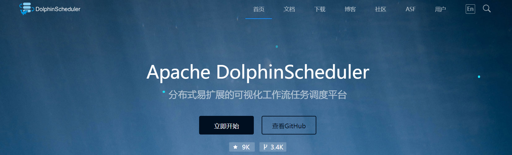

## 2- 安装DS

* 1- 将提供的DS的安装包拷贝到项目环境的_04_software 目录下

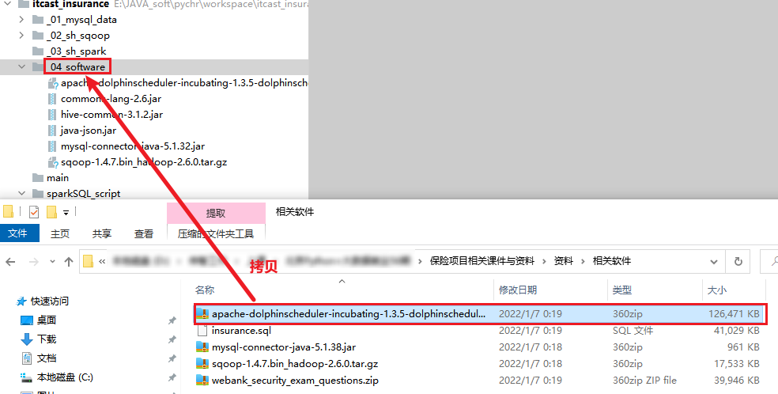

* 2- 将安装包拖拽到node1的 /export/software下

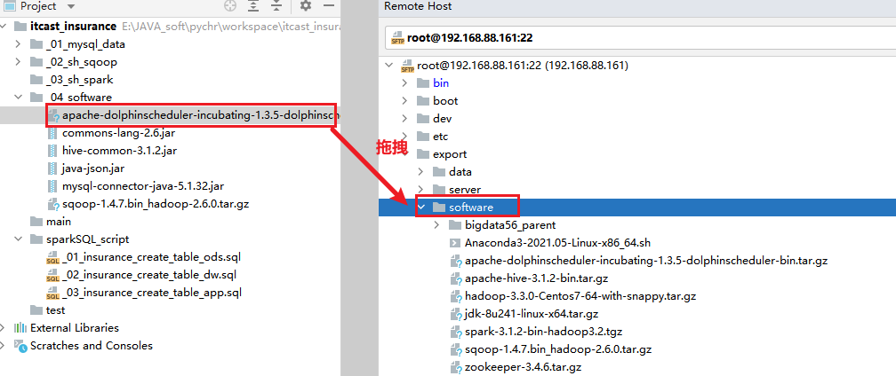

* 3- 进行解压操作, 并配置软连接

```properties
cd /export/software
tar -zxf apache-dolphinscheduler-incubating-1.3.5-dolphinscheduler-bin.tar.gz -C /export/server/

cd /export/server/
ln -s apache-dolphinscheduler-incubating-1.3.5-dolphinscheduler-bin/ dolphinscheduler
```

* 4- 添加mysql的驱动包到 DS的lib目录下

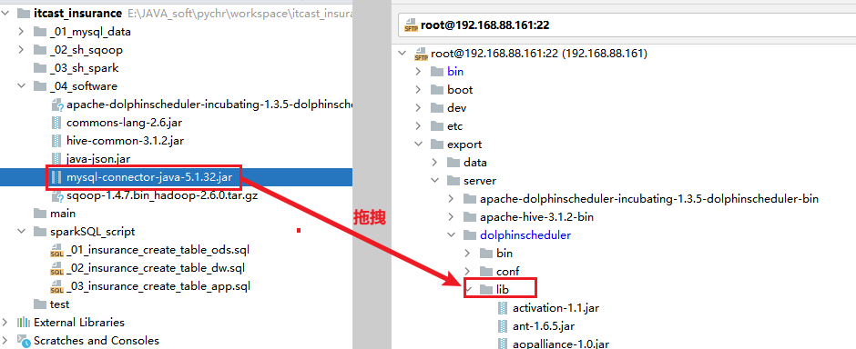

* 5- 修改DS的初始数据源的配置文件


```properties
修改以下内容:(看好中文说明. 文档中只显示需要调整的内容, 如果文档中没有写的, 保持原样不动)
# 此部分添加 # 注释
# postgresql
#spring.datasource.driver-class-name=org.postgresql.Driver
#spring.datasource.url=jdbc:postgresql://localhost:5432/dolphinscheduler
#spring.datasource.username=test
#spring.datasource.password=test

# 新增的内容
# mysql
spring.datasource.driver-class-name=com.mysql.jdbc.Driver
spring.datasource.url=jdbc:mysql://192.168.88.161:3306/dolphinscheduler?characterEncoding=UTF-8&allowMultiQueries=true
spring.datasource.username=root
spring.datasource.password=123456


说明: 
	请注意, 在复制的时候能不能不把中文复制进去?  不能
```

处理后内容:


然后上传保存

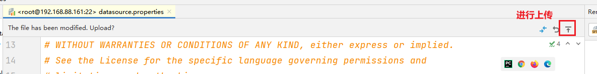

* 6- 进入mysql的客户端, 执行以下代码:

```properties
CREATE DATABASE dolphinscheduler DEFAULT CHARACTER SET utf8 DEFAULT COLLATE utf8_general_ci;
```


* 7- 初始化元数据表:

```
cd /export/server/dolphinscheduler
sh script/create-dolphinscheduler.sh
```


* 8- 修改 conf/env/dolphinscheduler_env.sh 环境变量

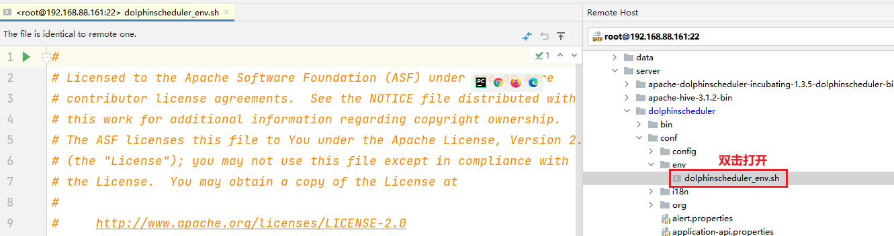

````properties
# 建议: 将文件中原有的所有export删除, 然后将以下内容拷贝进去(特别注意对应路径是否正确)
export HADOOP_HOME=/export/server/hadoop
export HADOOP_CONF_DIR=/export/server/hadoop/etc/hadoop
export SPARK_HOME1=/export/server/spark
#export SPARK_HOME2=/opt/soft/spark2
export PYTHON_HOME=/root/anaconda3/bin/python
export JAVA_HOME=/export/server/jdk1.8.0_241
export HIVE_HOME=/export/server/hive
#export FLINK_HOME=/opt/soft/flink
#export DATAX_HOME=/opt/soft/datax/bin/datax.py
export SQOOP_HOME=/export/server/sqoop

export PATH=$HADOOP_HOME/bin:$HADOOP_CONF_DIR:$PYTHON_HOME:$SPARK_HOME1/bin:$JAVA_HOME/bin:$HIVE_HOME/bin:$SQOOP_HOME/bin:$PATH
````

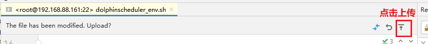

* 9- 修改 conf/config/install_config.conf (安装配置文件)
  * 说明: 目前DS还没有安装, 仅仅是在配置DS的安装配置文件

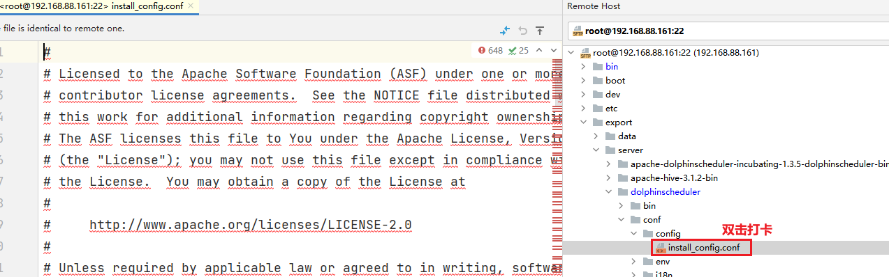

```properties
说明: 将配置文件对应配置信息, 改为以下的内容, 与以下内容一定一定要保持一致, 以下不存在的配置, 保持原样不动

dbhost="192.168.88.161:3306"
username="root"
password="123456"
zkQuorum="192.168.88.161:2181,192.168.88.162:2181,192.168.88.163:2181"
installPath="/export/server/dolphinscheduler_install"
deployUser="root"
#mailServerHost="smtp.exmail.qq.com"
#mailServerPort="25"
#mailSender="xxxxxxxxxx"
#mailUser="xxxxxxxxxx"
#mailPassword="xxxxxxxxxx"
#starttlsEnable="true"
#sslEnable="false"
#sslTrust="smtp.exmail.qq.com"
resourceStorageType="HDFS"
defaultFS="hdfs://192.168.88.161:8020"
#yarnHaIps="192.168.xx.xx,192.168.xx.xx"
singleYarnIp="192.168.88.161"
#hdfsRootUser="hdfs"
ips="192.168.88.161,192.168.88.162,192.168.88.163"
masters="192.168.88.161,192.168.88.162"
workers="192.168.88.161,192.168.88.162,192.168.88.163"
alertServer="192.168.88.163"
apiServers="192.168.88.161"
```

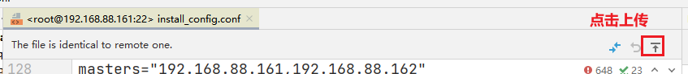


-----

* 10 - 启动 zookeeper集群:

```properties
注意: 三个节点都要执行
cd /export/server/zookeeper/bin/
./zkServer.sh start


三个节点启动后(三个都启动完成后), 需要查看zk的状态:
./zkServer.sh status

必须看到: 两个follower 和 一个 leader
```

* 11- 触发安装并启动

```properties
cd /export/server/dolphinscheduler
sh install.sh


注意:
	此操作, 会进行DS的安装操作, 安装完成后, 自动将DS进行启动  
	此操作, 仅需要第一次执行一次即可, 后续启动DS会有专门的命令的
```

安装后, 需要查看各个节点:

node1:


node2:

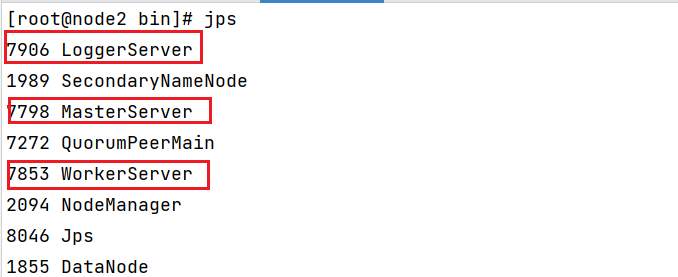

node3:


----

**后续的启动**, 是专门有命令来处理的:

```shell
cd /export/server/dolphinscheduler_install

一键停止集群所有服务
sh ./bin/stop-all.sh
一键开启集群所有服务
sh ./bin/start-all.sh

单独停止和启动命令:
sh ./bin/dolphinscheduler-daemon.sh start master-server
sh ./bin/dolphinscheduler-daemon.sh stop master-server

sh ./bin/dolphinscheduler-daemon.sh start worker-server
sh ./bin/dolphinscheduler-daemon.sh stop worker-server

sh ./bin/dolphinscheduler-daemon.sh start api-server
sh ./bin/dolphinscheduler-daemon.sh stop api-server

sh ./bin/dolphinscheduler-daemon.sh start logger-server
sh ./bin/dolphinscheduler-daemon.sh stop logger-server

sh ./bin/dolphinscheduler-daemon.sh start alert-server
sh ./bin/dolphinscheduler-daemon.sh stop alert-server
```


访问DS: http://192.168.88.161:12345/dolphinscheduler

用户名: admin

密码: dolphinscheduler123 

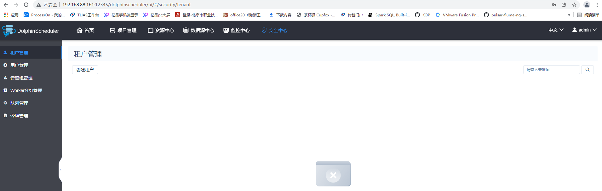


## 3. DS架构说明

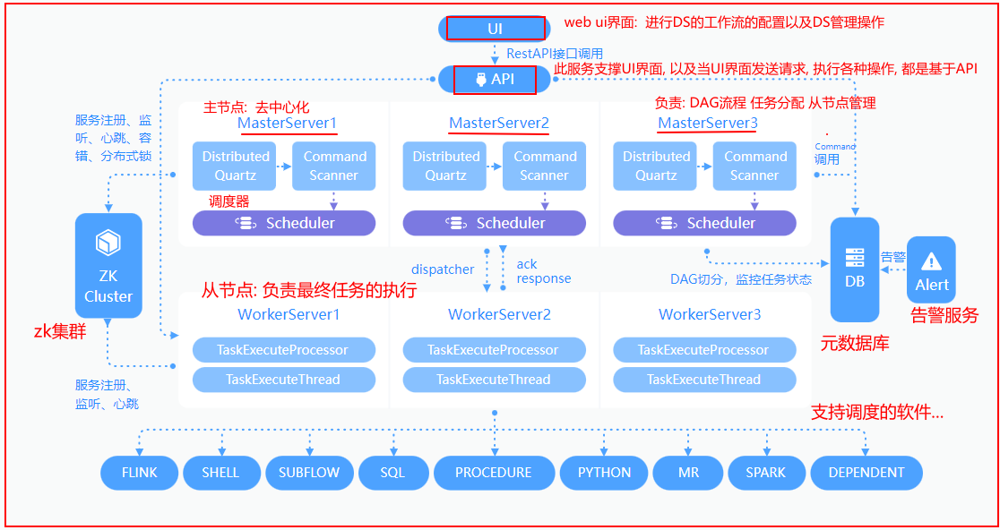

```properties
	通过UI进行工作流的配置操作, 配置完成后, 将其提交执行, 此时执行请求会被API服务接收到, 接收完成后, 随机选择一台Master来完成任务的处理(DAG 任务分配, 资源处理...)(底层最终是由scheduler具体完成), 完成分配后 将对应执行的任务交给对应的worker(从节点)来执行, worker对应有一个logger服务进行日志的记录, 在执行过程中, 通过logger实时查看执行日志, 当执行完成后, 通知Master , Master进行状态的变更, 同时告警服务实时监控状态, 一旦发现状态出现异常, 会立即根据所匹配的告警方案, 通知给相关人员	
```


## 4- DS的基本使用

### 4.1 队列

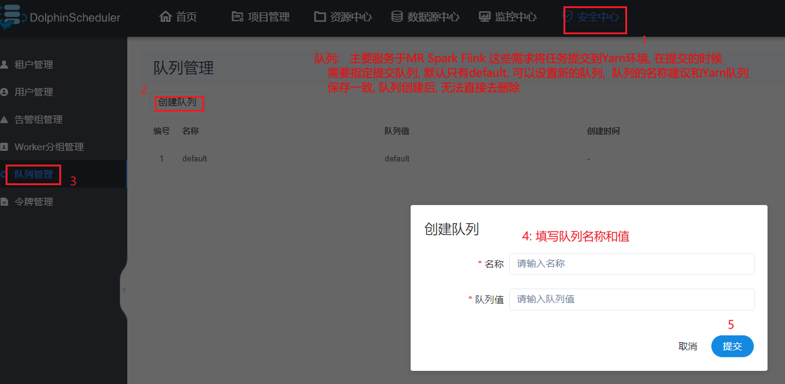

### 4.2 租户

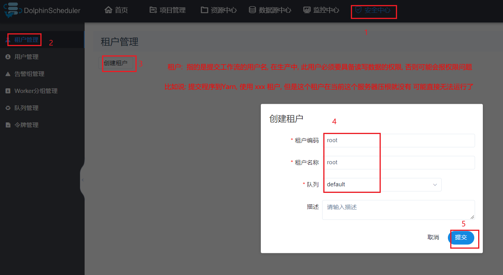

### 4.3 登录用户


### 4.4 告警组


### 4.5 worker分组说明

说明:

```properties
	worker分组主要是用于后续在进行工作流执行的时候, 可以指定worker分组, 这样Master在进行任务分配的时候, 会从worker分组中选择一些worker节点来完成任务的执行, 在实际生产中, 此分组可能会有多个, 根据任务大小来选择对应分组来干活.
```


### 4.6 创建项目编写工作流

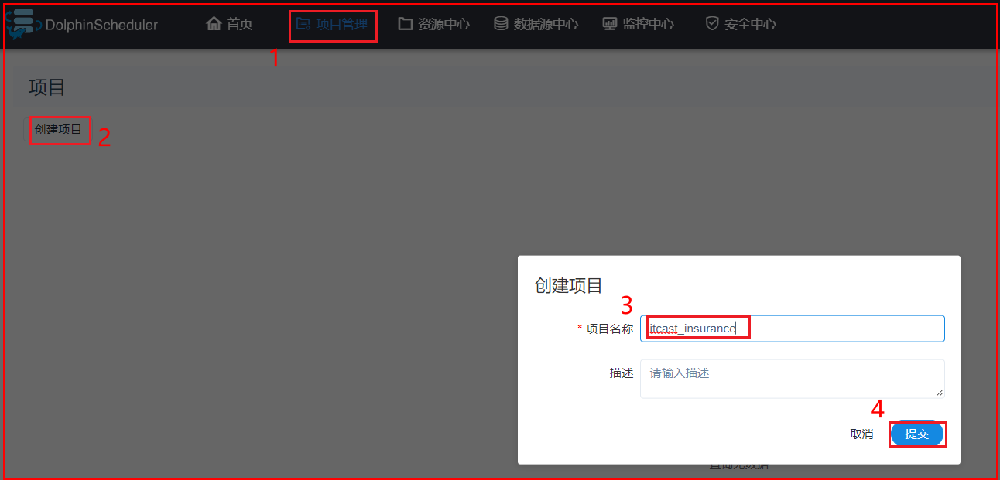

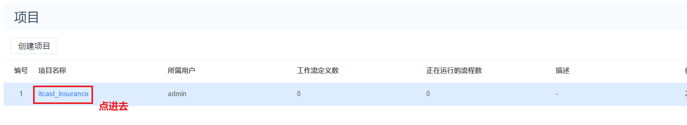

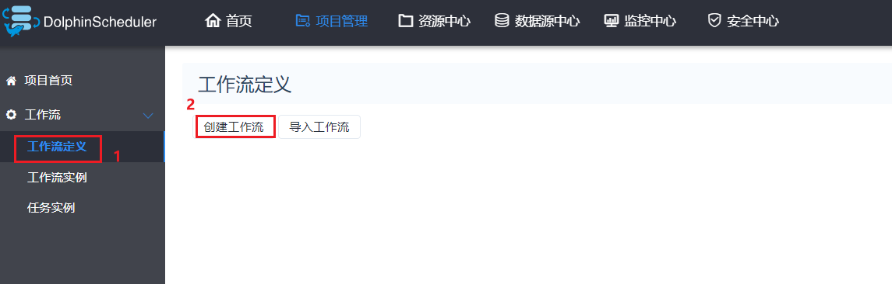

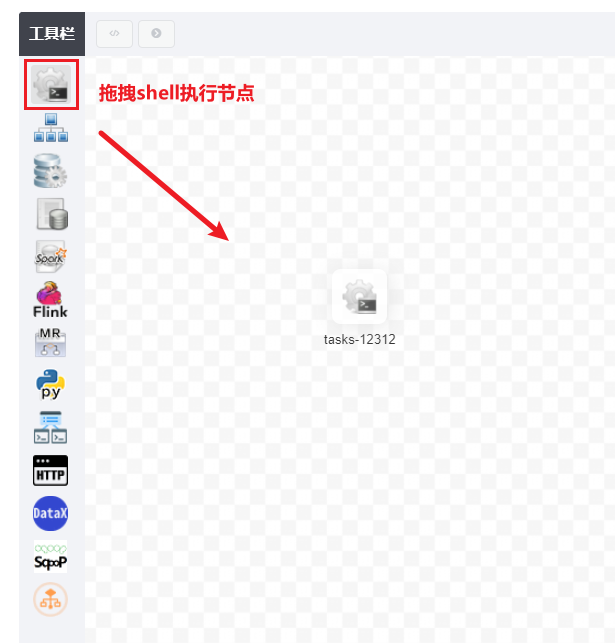


以此可以再次创建一个shell的工作流节点, 创建后可以配置串行执行:


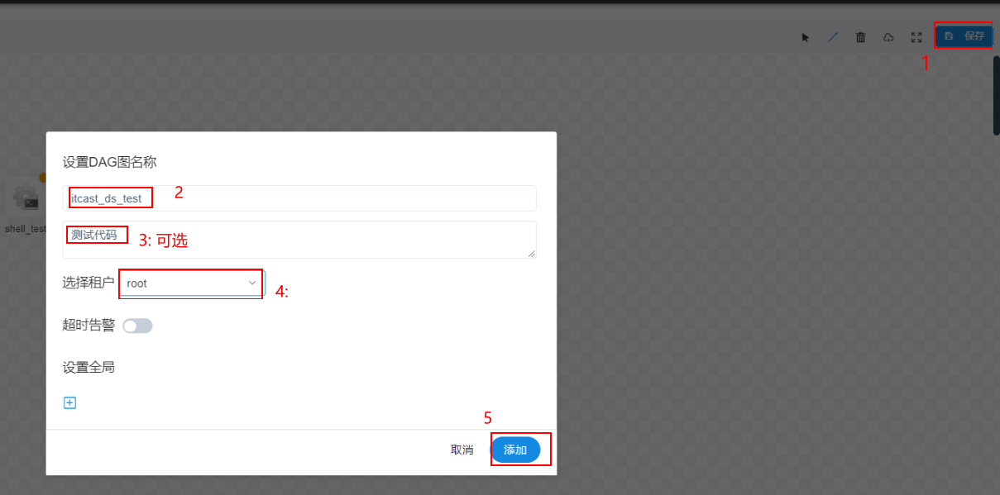


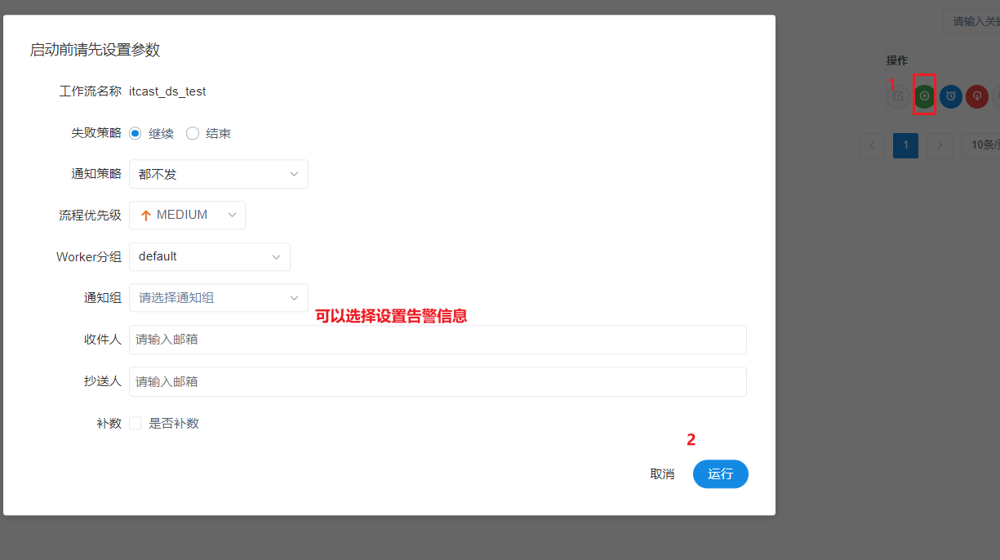

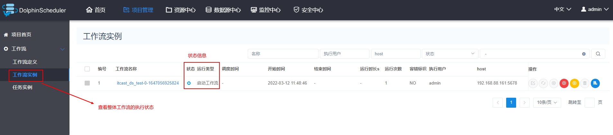


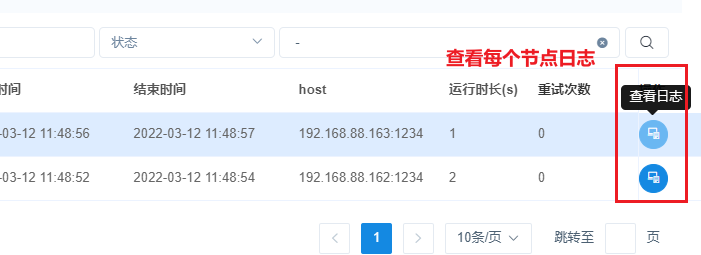

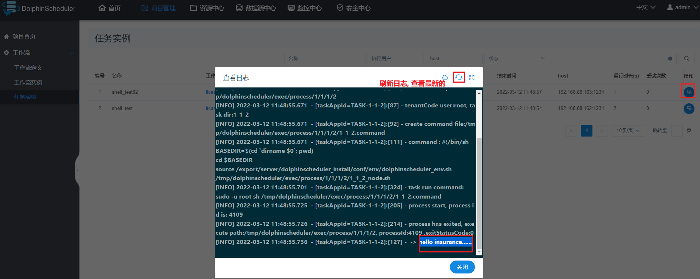


## 5- 基于DS完成定时数据采集

### 5.1 准备工作

* 1- 将SQOOP在node2和node3都安装一次:

```properties
在node1执行:
	cd /export/server
	scp -r sqoop-1.4.7.bin__hadoop-2.6.0/ node2:$PWD
	scp -r sqoop-1.4.7.bin__hadoop-2.6.0/ node3:$PWD

在node2 和 node3 配置软连接和环境变量
	软连接: 
		cd /export/server
		ln -s sqoop-1.4.7.bin__hadoop-2.6.0/ sqoop
	
	配置环境变量: 
		vim /etc/profile
		
		添加以下内容:
		#SQOOP_HOME
        export SQOOP_HOME=/export/server/sqoop
        export PATH=$PATH:$SQOOP_HOME/bin
        
        :wq
        
        执行: source /etcprofile
```

* 2- 保证每个节点都可以加载到sqoop的采集脚本

```properties
方式一: 可以直接将shell脚本上传到HDFS中, 后续在DS中编写shell命令, 选择先下载对应脚本, 然后执行运行操作 (建议生产使用)

方式二: 将node1的shell脚本放置到三个节点的同一目录下, 方便后续获取
	node1执行: 
		mkdir -p /export/data/insurance_collect
		cp /export/data/workspace/ky05_itcast_insurance/_02_sh_sqoop/*.sh /export/data/insurance_collect/
		
		cd /export/data/
		scp -r insurance_collect/ node2:$PWD
		scp -r insurance_collect/ node3:$PWD
	
	注意: 项目的同步目录, 有可能和大家的是不一致, 不要直接粘贴复制, 请选择你自己的同步目录下的脚本
```

* 3- 在node2和node3安装 dos2unix

```properties
yum -y install dos2unix
```


### 5.2 配置工作流


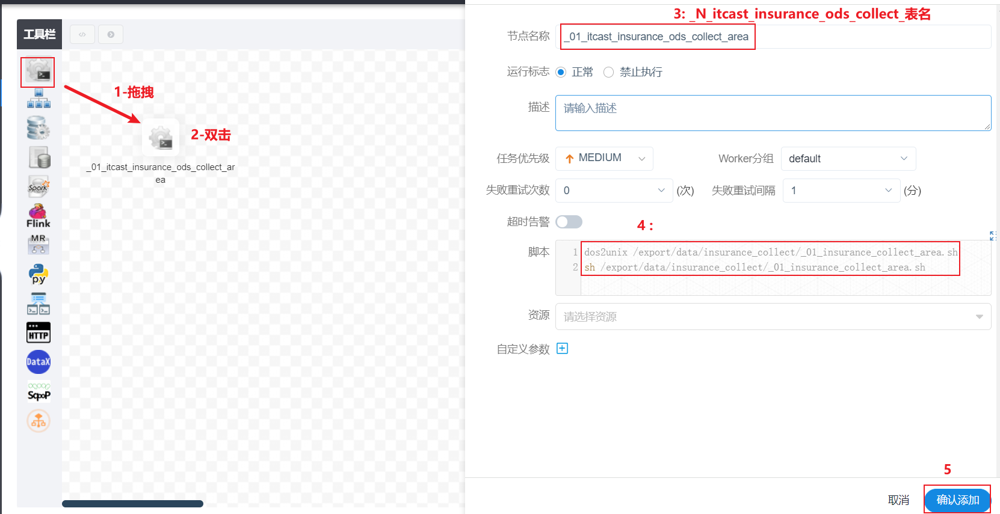

以此类推, 完成剩余9个流程的编写, 最终效果:

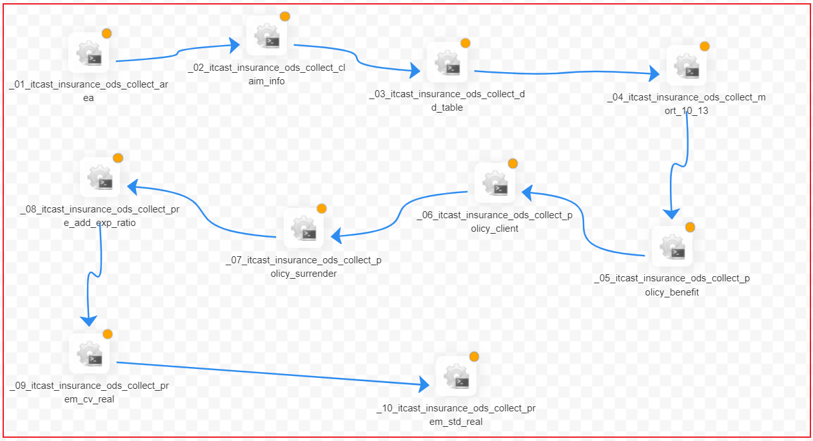

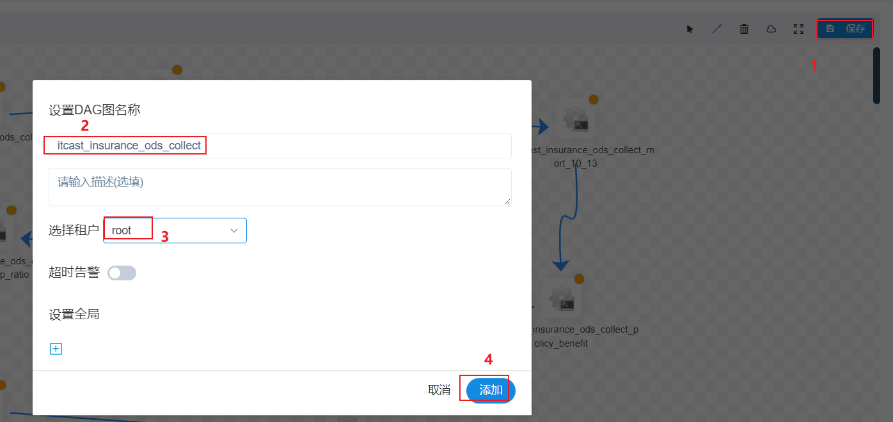


立即运行:

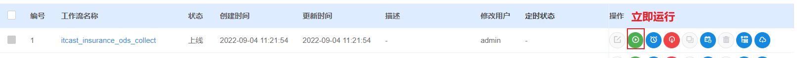

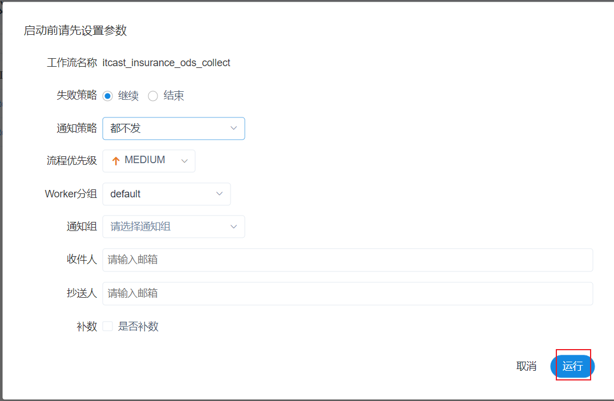

定时运行:

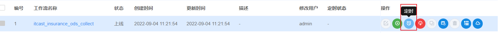

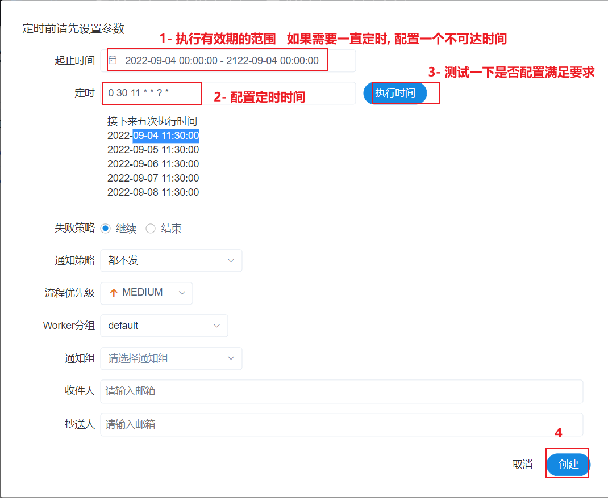

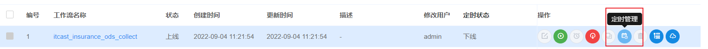

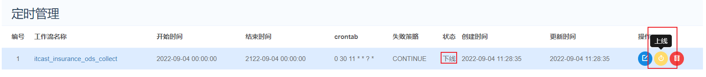

等待对应的时间进行执行即可...


```properties
说明: 
	如果在实际运行的时候, 发现有时候可以跑成功一部分 有时候可能一个都跑不成功, 大概率是资源的问题, 建议手动运行shell脚本, 一个个跑将其全部导入到ods层即可 (不要在调度上浪费太多的时间)
	
	但是如果已提交, 里面报错这一般跟资源没关系, 大概率还是在配置上有问题, 以及设置上有问题
```

处理后, 需要到ODS层表中 一个个检查一下, 观察是否有输入导入