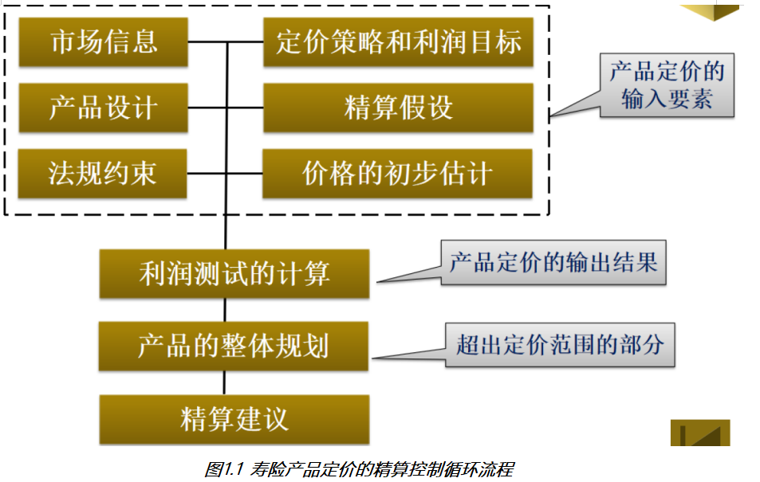

# day06_保险项目课程笔记

今日内容:

* 1- 了解寿险定价的规则(了解)
* 2- 扩展知识点(掌握)
* 3- 计算相关的指标(掌握)

## 1. 了解寿险定价规则

### 1.1 定价精算控制循环流程

​		整个保险产品, 在定价的时候, 并不是一次性成型的, 精算师需要将各种情况全部的考虑进入, 然后核算出一个保费的结果, 然后根据保费结果进行利润测算, 如果没有达到利润目标, 需要重新核算, 直到达到利润目标, 并且还要在市场上有一定的竞争力



### 1.2 寿险定价原则

* 1- 充足性原则:  费率(保费)充足 , 指保险费率足够用于保单所承诺的赔付或给付、退保金、费用、税金、红利等各项支出，同时保险公司还要获取合理的利润。

* 2- 合理性原则: 费率合理，指保险费率不能过高。

  ​	 如果保险费率过高，会损害被保险人的利益，保险人会获得太多的非正常经营性利润。

* 3- 公平性原则: 对出险概率高、赔付成本高的被保险人收取更多的保险费，反之亦然。

### 1.3 寿险定价假设

* 死亡率: 一般来说，死亡率随着年龄而提高，同一年龄上男性的死亡率高于女性 ，一般女性的死亡率为设置为男性死亡率的50%~80%。

* 失效率:  失效，指各种原因导致的保单不再有效、自愿退保、中途中止等情况
  * 保单年度。对均衡保费保单，最初几年，失效率随着保单年度的增加而迅速降低，5~10年后，失效率降低的速度变得非常缓慢，基本呈现平衡状态。
  * 投保年龄。十几到二十几岁的投保保单失效率较高，30岁以上的被保险人随年龄增加，保单率会降低。

* 利率:  利率假设可以看做是保单持有人未来的收益率。寿险公司假设的利率能否实现，要看其未来投资收益。
* 费用:  保单从出售到全部赔付、满期、退保或失效，要经历核保、出单、保单维持、理赔等环节，每一环节都需要消耗成本，这些成本源于保险人从投保人那里收取的保费和公司累积资产的投资收益。

### 1.4 传统的定价方法的介绍


## 2. 扩展知识点

### 2.1 如何生成多行的序列

spark sql提供的所有函数的文档地址: https://spark.apache.org/docs/3.1.2/api/sql/index.html


```properties
-- 需求: 请生成一列五行数据, 内容为: 1 2 3 4 5 各为一行即可
select explode(split('1,2,3,4,5',',')) as a;

-- 需求: 请生成一列数据, 内容为 1~100
/*
explode():  爆炸函数, 其参数仅支持 array 或者 map, 主要是用于将一列的数据, 爆炸为多行数据, 用于列转行操作

sequence(start,stop,step): 生成一个从开始到结束的元素数组(包头包尾) , 根据step步骤进行增增或者增减 
     start: 起始值
     stop:  表示结束值
     step:  步长 默认为 1
*/

select explode(sequence(1,100)) as a;
```


### 2.2  如何快速生成一张表数据

```properties
-- 需求: 生成一个两行两列的数据, 第一行放置 男  M  第二行 放置 女 F
-- 用于快速生成表数据的函数: stack(N,数据内容....)
-- 其中 N 表示需要生成多少行数据
-- 数据内容: 用于设置每一行数据放置的内容, 函数内部会将其自动将数据平均划分为N份, 放置到每一行中, 如果有分配不均的, 使用Null来替代

select stack(2,'男','M','女','F') as (a,b) ;

-- 需求: 生成 二行一列的数据, 分别放置 M 和 F
select stack(2,'M','F') as sex;


-- 思考: 如何将生成好的数据保存起来, 作为另一条SQL的表来使用呢?
-- 方式一: 通过子查询的方式
select
    *
from (select stack(2,'M','F') as sex) as t1;

-- 方式二:  with as 的方式(本质上是子查询的变种)
with t2 as(
    select stack(2,'M','F') as sex
)
select
    *
from t2;

-- 方式三:  通过视图的方式:
-- 永久视图:
create or replace  view  t3 as
select stack(2,'M','F') as sex;

select * from t3;
-- 临时视图:
create or replace temporary view  t4 as
select stack(2,'M','F') as sex;

select * from t4;
/*
    临时视图 和 永久视图的区别:
        永久视图: 可以跨越多个会话, 即使关闭, 在打开, 依然是可用的 只能手动删除
        临时会话: 不可以跨越多个会话, 仅能在当前会话有效, 一旦会话结束, 临时会话也就没有了

    视图本质上是不报错数据, 仅保存的计算的逻辑, 当查看视图的数据时候, 视图才会去执行获取对应的结果
    
    删除视图: drop view xxx;
 */

-- 方式四: 通过表的方式
create table t5 as
select stack(2,'M','F') as sex;

select * from t5;

/*
    表 和 视图的区别:
        从使用角度来说: 完成可以把视图当做是表

        本质区别: 视图是不保存数据, 仅保存计算的逻辑 , 而表示保存的实际结果数据

        视图只有在使用的时候, 视图会重新按照SQL进行计算, 而表直接读取数据

    建议: 如果是中间临时保存, 建议能用视图, 优先使用视图的方式(尤其是在进行不断的迭代计算中)
 */

-- 方式五: 基于缓存表的方式构建, 将数据放置到缓存中, 仅在当前会话可用
-- 默认缓存级别:  内存 + 磁盘 + 1副本
cache table t6 as
select stack(2,'M','F') as sex;

select * from t6;


如何设置其他的隔离级别: 

缓存表的使用语法: 
	CACHE [ LAZY ] TABLE table_identifier
    	[ OPTIONS ( 'storageLevel' [ = ] value ) ] [ [ AS ] query ]
    
    作用:  将数据缓存起来, 便于后续的使用, 减少扫描
    	
    	可以直接针对一张表放置到缓存中: 
    		cache [lazy] table 对应需要缓存的表/视图 [ OPTIONS ( 'storageLevel' [ = ] value ) ]
    		
    		例如: 
    			cache [lazy] table t5;  
    				直接将t5的数据设置为缓存, 后续使用t5 就相当于在使用缓存的数据了, 采用默认缓存级别
    			
    			cache [lazy] table t5 OPTIONS ( 'storageLevel'  =  'DISK_ONLY' );
    				直接将t5的数据设置为缓存, 后续使用t5 就相当于在使用缓存的数据了, 采用仅磁盘的缓存方案
    			
    			如果使用LAZY(惰性), 表示不会立即的数据缓存起来, 而是当第一次使用的时候, 才会进行缓存, 如果不加, 表示立即缓存
    			
    		
    	可以将一个SQL的查询的结果, 直接缓存起来
    		cache [lazy] table 视图名 [ OPTIONS ( 'storageLevel' [ = ] value ) ]  [ AS ] query
    		
    		例如: 
    			cache [lazy] table t6 as select stack(2,'M','F') as sex;
    			
    			cache [lazy] table t6 OPTIONS ( 'storageLevel'  =  'DISK_ONLY' ) as select stack(2,'M','F') as sex;
    			
    		注意:  可以将查询的语句缓存起来, 同时还会创建一个临时的视图为 t6, 所以当清除缓存后, 视图依然是存在的
 
 支持的缓存级别: 
 	NONE
    DISK_ONLY
    DISK_ONLY_2
    DISK_ONLY_3
    MEMORY_ONLY
    MEMORY_ONLY_2
    MEMORY_ONLY_SER
    MEMORY_ONLY_SER_2
    MEMORY_AND_DISK(默认)
    MEMORY_AND_DISK_2
    MEMORY_AND_DISK_SER
    MEMORY_AND_DISK_SER_2
    OFF_HEAP
 
 
如何清理缓存:
	UNCACHE TABLE [ IF EXISTS ] table_identifier; 清理某一个视图的缓存数据
	CLEAR CACHE; 清理所有的缓存
```


### 2.3 回顾窗口函数

```properties
-- 回顾窗口函数:
/*
    格式:
        分析函数 over(partition by xxx order by xxx [asc|desc] [rows between xxx and xxx])

    常见的分析函数和窗口组合:
        第一类:   row_number()  rank() dense_rank() ntile()
        第二类:   与聚合函数配合使用  SUM() MAX() MIN() AVG() COUNT()
        第三类:   LAG() LEAD() FIRST_VALUE() LAST_VALUE()
*/

-- 1- 初始化数据集
create or replace  temporary  view  t1(cid,name,score,datestr) as
    values
           ('c01','张三',90,'2021-01-02'),
           ('c01','李四',87,'2021-01-03'),
           ('c01','王五',94,'2021-01-04'),
           ('c01','赵六',90,'2021-01-05'),
           ('c01','田七',85,'2021-01-06'),
           ('c02','周八',97,'2021-01-02'),
           ('c02','李九',93,'2021-01-03'),
           ('c02','老王',98,'2021-01-04'),
           ('c02','老张',92,'2021-01-05');

select * from t1;

-- 第一类:   row_number()  rank() dense_rank() ntile(N)
select
    cid, name, score, datestr,
    row_number() over(partition by cid order by score desc) as rn1,
    rank() over(partition by cid order by score desc) as rn2,
    dense_rank() over(partition by cid order by score desc) as rn3,
    ntile(3) over(partition by cid order by score desc) as rn4

from t1;

/*
   row_number()  rank() dense_rank() ntile(N)

   共同点: 都是给每个窗口进行打标记的操作, 都是从1开始打标记

   区别:
        row_number:  不关心数据重复(排序字段)文件, 从 1开始打标记, 逐行在递增 +1

        rank: 关心数据重复问题, 相同的数据会打上相同的标记,  但是会占用后续的序号, 逐行递增 + 1
            例如:  1 2 2 4 5
        dense_rank:  关心数据重复问题, 相同的数据会打上相同的标记,  不会占用后续的序号, 逐行递增 + 1
            例如:  1 2 2 3 4
        ntile(N): 对窗口内的数据进行划分为等份的N分 , 每一份会打上相同的标记

   应用场景:
        row_number()  rank() dense_rank() 主要的应用方向为:  求分组内TOPN问题
            例如: 求每组内成绩最高的前三名学生是那些

        ntile(N): 主要的应用方向为:  求几分之几的问题
            例如: 计算咱们班级男生 女生各身份前二分之一的学员有那些呢?
*/

-- 第二类:   与聚合函数配合使用  SUM() MAX() MIN() AVG() COUNT()
select
    cid, name, score, datestr,
    sum(score) over(partition by cid order by score) as rn1,
    sum(score) over(partition by cid) as rn2,
    sum(score) over(partition by cid order by score rows between unbounded preceding and current row ) as rn3,
    sum(score) over(partition by cid order by score rows between 1 preceding and 1 following ) as rn4,
    sum(score) over(partition by cid order by score rows between current row and unbounded following ) as rn5
from  t1;

/*
    与聚合函数配合使用:    SUM() MAX() MIN() AVG() COUNT()

    默认情况: 可以进行逐级聚合计算(例如: 求和), 如果遇到排序的字段有重复值, 会将重复值直接合并在一起计算

    如果只想进行逐级计算操作, 引入 rows_between 锁定窗口范围
        范围格式:
            N preceding : 向前 N 行
            N following : 向后 N 行

            N取值:  可以是unbounded, 也可以是具体的数值
        关键词: unbounded  边界的意思

    如果窗口中没有设置order by, 聚合操作会直接对整个窗口所有数据进行全部聚合, 相当于将整个窗户直接全部都打开了

    应用场景: 主要是用于进行逐级计算操作, 或者 级联计算操作
        例如:
            要求计算去年截止到每一天的订单量是多少
            要求计算去年截止到每一天最大的订单金额是多少
*/

-- 第三类:   LAG() LEAD() FIRST_VALUE() LAST_VALUE()
select
    cid, name, score, datestr,

    lag(score) over(partition by cid order by datestr) as rn1,
    lag(score,2) over(partition by cid order by datestr) as rn2,
    lag(score,2,0) over(partition by cid order by datestr) as rn3,
    lead(score,1,0) over(partition by cid order by datestr) as rn4,
    first_value(score) over(partition by cid order by datestr) as rn5,
    last_value(score) over(partition by cid order by datestr rows between unbounded preceding and unbounded following) as rn6
from t1;
/*
    lag(字段, N,defaultValue):  将当前行和之前的第N行放置到同一行中, 如果没有, 设置为默认值, 默认值为NULL
    lead(字段, N,defaultValue):  将当前行和之后的第N行放置到同一行中, 如果没有, 设置为默认值, 默认值为NULL

    first_value(字段): 将当前行 和 窗口的第一行放置同一行

    last_value(字段): 将当前行 和窗口的最后一行放置在同一行, 但是不能添加order by, 否则就会将当前行和当前行放置在一起
        如果既想排序, 又想和最后一行进行比较, 需要使用rows between来锁定范围
            rows between unbounded preceding and unbounded following

    注意:
        lag 和lead 必须使用order by  否则直接报错

    应用场景:
        用于将当前行和之前或者之后行进行比较操作

        例如: 在计算每月和上个月或者和第一个月的转换率

*/

```


### 2.4 如何进行横向迭代计算

需求:  已知C1列数据, 计算出C2 和 C3列的数据

| c1   | c2 = c1 + 2 | c3 = c1 * (c2 + 3) |
| ---- | ----------- | ------------------ |
| 1    |             |                    |
| 2    |             |                    |
| 3    |             |                    |

```properties
-- 需求: 已知C1列数据, 计算出C2 和 C3列的数据
-- 计算规则: C1列为 1,2,3 c2 = c1+2  c3 = c1 * (c2 +3)

-- 初始化数据:
create or replace temporary view t1 (c1) as select stack(3,1,2,3);

select * from t1;


-- 计算c2
select
    c1,
    c1 + 2 as c2
from t1;

-- 计算c3: c3 = c1 * (c2 +3)
-- 子查询
select
    c1,
    c2,
    c1 * (c2 + 3) as c3
from (select c1, c1 + 2 as c2 from t1) as tmp

-- 其他的四种方案 都是可以处理的
```


### 2.5 如何进行纵向迭代计算

需求: 假设有如下数据, 请计算 c4列

c4计算逻辑: 当 c2=1, 则 c4 = 1;. 否则 c4 = (上一个c4 + 当前的c3) /2

| c1   | c2   | c3   | c4   |
| ---- | ---- | ---- | ---- |
| 1    | 1    | 6    |      |
| 1    | 2    | 23   |      |
| 1    | 3    | 8    |      |
| 1    | 4    | 4    |      |
| 1    | 5    | 10   |      |
| 2    | 1    | 23   |      |
| 2    | 2    | 14   |      |
| 2    | 3    | 17   |      |
| 2    | 4    | 20   |      |

```properties
-- 如何进行纵向迭代计算操作
-- 需求: 假设有如下数据, 请计算 c4列
-- c4计算逻辑: 当 c2=1, 则 c4 = 1;. 否则 c4 = (上一个c4 + 当前的c3) / 2

--初始化数据集
create or replace temporary view t1 (c1,c2,c3) as
    values (1,1,6),
           (1,2,23),
           (1,3,8),
           (1,4,4),
           (1,5,10),
           (2,1,23),
           (2,2,14),
           (2,3,17),
           (2,4,20);

select * from t1;

-- c4计算逻辑:
-- 当 c2=1, 则 c4 = 1;
select
    c1, c2, c3,
    if(c2 = 1,1,null) as c4
from t1;

-- 否则 c4 = (上一个c4 + 当前的c3) / 2
with t2 as(
    select
        c1, c2, c3,
        if(c2 = 1,1,null) as c4
    from t1
),
t3 as (
    select
        c1,
        c2,
        c3,
        if(
            c2 = 1,
            1,
            (lag(c4) over(partition by c1 order by c2) + c3) / 2
        ) as c4
    from t2
),
t4 as (
    select
        c1, c2, c3,
        if(
            c2 = 1,
            1,
            (lag(c4) over(partition by c1 order by c2) + c3) / 2
        ) as c4

    from t3
),
t5 as (
    select
        c1, c2, c3,
        if(
            c2 = 1,
            1,
            (lag(c4) over(partition by c1 order by c2) + c3) / 2
        ) as c4

    from t4
)
select
    c1, c2, c3,
    if(
        c2 = 1,
        1,
        (lag(c4) over(partition by c1 order by c2) + c3) / 2
    ) as c4

from t5;
```

​		发现, 通过该不断的一条SQL一条SQL进行迭代计算操作, 每一次只能算出来一个值, 但是如果说我们一个组内有几万行数据, 那么这种操作, 非常不合适的... 甚至说我们有时候可能根本就不知道在一个窗口内有多少行数据


​		思考: 如何解决呢? 目前并没有一个函数能够解决这类问题的, 可能就需要涉及自定义函数, 请问 自定义什么函数呢?  UDAF函数

​		尝试基于自定义UDAF函数 + 窗口函数 ,一次性完成整个计算操作

```properties
import pandas as pd
from pyspark import SparkContext, SparkConf
from pyspark.sql import SparkSession
import pyspark.sql.functions as F
from pyspark.sql.types import *
import os

# 锁定远端操作环境, 避免存在多个版本环境的问题
os.environ['SPARK_HOME'] = '/export/server/spark'
os.environ["PYSPARK_PYTHON"] = "/root/anaconda3/bin/python"
os.environ["PYSPARK_DRIVER_PYTHON"] = "/root/anaconda3/bin/python"

# 快捷键:  main 回车
if __name__ == '__main__':
    print("纵向迭代计算操作: 自定义UDAF")

    # 1. 创建SparkSession对象
    spark = SparkSession.builder.appName('c4_demo').master('local[*]').getOrCreate()

    # 2- 初始化数据
    spark.sql("""
        create or replace temporary view t1 (c1,c2,c3,c4) as
            values (1,1,6,1),
                   (1,2,23,NULL),
                   (1,3,8,NULL),
                   (1,4,4,NULL),
                   (1,5,10,NULL),
                   (2,1,23,1),
                   (2,2,14,NULL),
                   (2,3,17,NULL),
                   (2,4,20,NULL);
    
    """)
    # 当 c2=1, 则 c4 = 1;. 否则 c4 = (上一个c4 + 当前的c3) / 2
    @F.pandas_udf(returnType=FloatType())
    def udaf_c4(c3:pd.Series,c4:pd.Series) -> float:
        tmp_c4 = 0 # 0 --> 1 --> 12 --> 10 --> 7 --> 8.5

        for i in range(0,len(c3)):
            if i == 0:
                tmp_c4 = c4[i]
            else :
                tmp_c4 = (tmp_c4 + c3[i]) / 2

        return tmp_c4


    spark.udf.register('udaf_c4',udaf_c4)

    spark.sql("""
        select  
            c1,
            c2,
            c3,
            udaf_c4(c3,c4) over(partition by c1 order by c2) as c4
        from t1;
    """).show()
```


## 3. 计算保费相关指标

### 3.1 计算保费参数因子

* 需求一:  根据性别, 投保年龄, 缴费期 以及保单年度来统计其中23个保费参数因子指标


需求分析:

```properties
1- 整个保费参数因子表共计有 33个字段, 其中10个维度字段 + 23个指标字段

2- 分析维度数据如何处理? 
	其中 投保年龄 缴费期 性别 以及保单年度 为联合主键 通知这四个字段就可以确定唯一的一条数据: 一共有 19338种
	
	其他的维度, 要不就是固定的值, 要不就可以使用其他的字段计算出来
	
	只需要关注: 投保年龄 缴费期 性别  保单年度
		投保年龄: 18~60
		缴费期:  10  15  20  30
		性别: 男 女
		保单年度: 1 ~ 88
			投保的第一年, 就是第一个保单年度, 第二年就是第二个保单年度, 以此类推,直到计算到106岁
			比如说: 
				以18岁投递, 保障终生(106), 保单年度 106 - 18 = 88 年 有88条信息数据
		
3- 分析指标如何计算:  整体是基于横向迭代计算操作
	对于指标杰斯安来说, 需要解析每个指标的计算规则
	
	以其中一个指标为例, 讲解其整个解析流程: 死亡率
		计算公式: =IF(J14<=105,VLOOKUP(J14,MORT_10_13,IF(Sex="M",2,3)),0)*MortRatio_Prem_0*(I14<=BPP)
		
		分析: 
			A * MortRatio_Prem_0 * C
					|
					|
   MortRatio_Prem_0 = if(SEX = 'M',1,1) == 1	
			    A * 1 * C
					|
					|
	解析C: (I14<=BPP) 保单年度一定是小于等于保险期间  == 1
				A * 1 * 1
					|
					|
	解析A: IF(J14<=105,VLOOKUP(J14,MORT_10_13,IF(Sex="M",2,3)),0)
		当用户年龄 小于等于 105的时候:
			执行: VLOOKUP(J14,MORT_10_13,IF(Sex="M",2,3))
				根据用户年龄和生命表进行匹配, 匹配后, 如果是男性就返回生命表中第二列数据, 否则返回第三列数据
		
		否则: 返回 0

	
    
    当前我们是带着大家分析了其中一个指标的计算流程方案, 实际生产中, 剩下的22个指标, 我们都需要大家一个个进行分析, 找到那些指标先计算, 那些指标后计算,那些指标可以一起计算, 每个指标的计算规则是什么, 最终形成一个计算流程表
    
    对于当前学习环境, 不需要大家直接对接Excel进行分析了, 因为这个工作实在太费时间了, 而且技术含量相对不高, 本次直接将所有的指标计算流程, 全部直接提供给大家, 我们可以直接根据计算流程图完成统计计算操作即可, 但是建议大家在计算过程中, 可以根据计算流程图, 对Excel进行反推操作, 理解Excel中相关的计算规则
```

| 保险名词             | 描述解释                                                     | 字段名      |
| -------------------- | ------------------------------------------------------------ | ----------- |
| 缴费期               | 客户要交多少年保费                                           | ppp         |
| 保险费               | 客户每年交多少钱的保费                                       | prem        |
| 投保年龄（购买年龄） | 购买保险时的年龄。最低购买年龄18岁。70岁以后不能购买，70岁后也不能缴费。比如缴费期10年，那么最大购买年龄是60岁。不能在61岁时购买，否则导致71岁还在缴费。所以缴费期与投保年龄的关系如下图：  | age_buy     |
| 保单年度             | 自投保之日起，第1年是第1个保单年度，第2年是第二保单年度.。。以此类推。 | policy_year |
| 满期年龄             | 一直保障至多少岁。如果是终身则是106岁。                      | t_age       |
| 保险期间             | 自投保之日起，至满期年龄，之间的年数。比如18岁投保，满期年龄106岁，保障至106岁，保险期间=106-18=88年。 | bpp         |