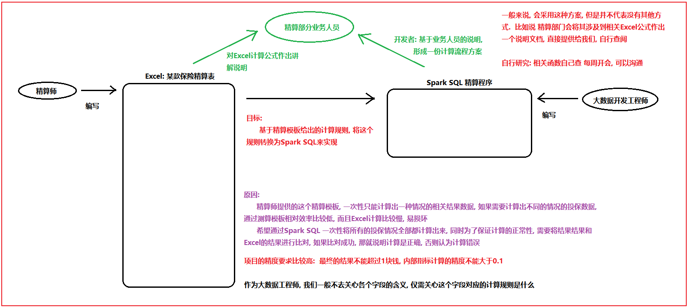
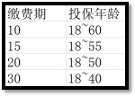

# day07_保险项目课程笔记

今日内容:  

* 计算保费参数因子

## 1. 计算保费相关指标

### 1.1 计算保费参数因子

* 需求一:  根据性别, 投保年龄, 缴费期 以及保单年度来统计其中23个保费参数因子指标



需求分析:

```properties
1- 整个保费参数因子表共计有 33个字段, 其中10个维度字段 + 23个指标字段

2- 分析维度数据如何处理? 
	其中 投保年龄 缴费期 性别 以及保单年度 为联合主键 通知这四个字段就可以确定唯一的一条数据: 一共有 19338种
	
	其他的维度, 要不就是固定的值, 要不就可以使用其他的字段计算出来
	
	只需要关注: 投保年龄 缴费期 性别  保单年度
		投保年龄: 18~60
		缴费期:  10  15  20  30
		性别: 男 女
		保单年度: 1 ~ 88
			投保的第一年, 就是第一个保单年度, 第二年就是第二个保单年度, 以此类推,直到计算到106岁
			比如说: 
				以18岁投递, 保障终生(106), 保单年度 106 - 18 = 88 年 有88条信息数据
		
3- 分析指标如何计算:  整体是基于横向迭代计算操作
	对于指标杰斯安来说, 需要解析每个指标的计算规则
	
	以其中一个指标为例, 讲解其整个解析流程: 死亡率
		计算公式: =IF(J14<=105,VLOOKUP(J14,MORT_10_13,IF(Sex="M",2,3)),0)*MortRatio_Prem_0*(I14<=BPP)
		
		分析: 
			A * MortRatio_Prem_0 * C
					|
					|
   MortRatio_Prem_0 = if(SEX = 'M',1,1) == 1	
			    A * 1 * C
					|
					|
	解析C: (I14<=BPP) 保单年度一定是小于等于保险期间  == 1
				A * 1 * 1
					|
					|
	解析A: IF(J14<=105,VLOOKUP(J14,MORT_10_13,IF(Sex="M",2,3)),0)
		当用户年龄 小于等于 105的时候:
			执行: VLOOKUP(J14,MORT_10_13,IF(Sex="M",2,3))
				根据用户年龄和生命表进行匹配, 匹配后, 如果是男性就返回生命表中第二列数据, 否则返回第三列数据
		
		否则: 返回 0

	
    
    当前我们是带着大家分析了其中一个指标的计算流程方案, 实际生产中, 剩下的22个指标, 我们都需要大家一个个进行分析, 找到那些指标先计算, 那些指标后计算,那些指标可以一起计算, 每个指标的计算规则是什么, 最终形成一个计算流程表
    
    对于当前学习环境, 不需要大家直接对接Excel进行分析了, 因为这个工作实在太费时间了, 而且技术含量相对不高, 本次直接将所有的指标计算流程, 全部直接提供给大家, 我们可以直接根据计算流程图完成统计计算操作即可, 但是建议大家在计算过程中, 可以根据计算流程图, 对Excel进行反推操作, 理解Excel中相关的计算规则
```

| 保险名词             | 描述解释                                                     | 字段名      |
| -------------------- | ------------------------------------------------------------ | ----------- |
| 缴费期               | 客户要交多少年保费                                           | ppp         |
| 保险费               | 客户每年交多少钱的保费                                       | prem        |
| 投保年龄（购买年龄） | 购买保险时的年龄。最低购买年龄18岁。70岁以后不能购买，70岁后也不能缴费。比如缴费期10年，那么最大购买年龄是60岁。不能在61岁时购买，否则导致71岁还在缴费。所以缴费期与投保年龄的关系如下图：  | age_buy     |
| 保单年度             | 自投保之日起，第1年是第1个保单年度，第2年是第二保单年度.。。以此类推。 | policy_year |
| 满期年龄             | 一直保障至多少岁。如果是终身则是106岁。                      | t_age       |
| 保险期间             | 自投保之日起，至满期年龄，之间的年数。比如18岁投保，满期年龄106岁，保障至106岁，保险期间=106-18=88年。 | bpp         |

### 1.2 建库建表操作

* 1- 在项目的sparksql_script目录下创建一个SQL脚本, 用于放置DW层建库建表语句
  * 文件名为: _02_insurance_create_dw.sql


* 2- 编写SQL构建库和表

```properties
-- 此脚本用于放置构建DW层相关的库和表
-- 建库语句
drop database if exists insurance_dw;
create database if not exists insurance_dw
    location 'hdfs://node1:8020/user/hive/warehouse/insurance_dw.db';

-- 创建表: 保费参数因子表
drop table if exists insurance_dw.prem_src;
create table if not exists insurance_dw.prem_src (
    age_buy       smallint comment '投保年龄',
    nursing_age   smallint comment '长期护理保险金给付期满年龄',
    sex           string comment '性别',
    t_age         smallint comment '满期年龄(Terminate Age)',
    ppp           smallint comment '交费期间(Premuim Payment Period PPP)',
    bpp           smallint comment '保险期间(BPP)',
    interest_rate decimal(6, 4)  comment '预定利息率(Interest Rate PREM&RSV)',
    sa            decimal(12, 2) comment '基本保险金额(Baisc Sum Assured)',
    policy_year   smallint comment '保单年度',
    age           smallint comment '保单年度对应的年龄',
    qx            decimal(17, 12) comment '死亡率',
    kx            decimal(17, 12) comment '残疾死亡占死亡的比例',
    qx_d          decimal(17, 12) comment '扣除残疾的死亡率',
    qx_ci         decimal(17, 12) comment '残疾率',
    dx_d          decimal(17, 12) comment '',
    dx_ci         decimal(17, 12) comment '',
    lx            decimal(17, 12) comment '有效保单数',
    lx_d          decimal(17, 12) comment '健康人数',
    cx            decimal(17, 12) comment '当期发生该事件的概率，如下指的是死亡发生概率',
    cx_           decimal(17, 12) comment '对Cx做调整，不精确的话，可以不做',
    ci_cx         decimal(17, 12) comment '当期发生重疾的概率',
    ci_cx_        decimal(17, 12) comment '当期发生重疾的概率，调整',
    dx            decimal(17, 12) comment '有效保单生存因子',
    dx_d_         decimal(17, 12) comment '健康人数生存因子',
    ppp_          smallint comment '是否在缴费期间，1-是，0-否',
    bpp_          smallint comment '是否在保险期间，1-是，0-否',
    expense       decimal(17, 12) comment '附加费用率',
    db1           decimal(17, 12) comment '残疾给付',
    db2_factor    decimal(17, 12) comment '长期护理保险金给付因子',
    db2           decimal(17, 12) comment '长期护理保险金',
    db3           decimal(17, 12) comment '养老关爱金',
    db4           decimal(5, 2) comment '身故给付保险金',
    db5           decimal(17, 12) comment '豁免保费因子'
) comment '保费因子表（到每个保单年度）'
row format delimited fields terminated by '\t';
```

### 1.3 准备构建起始维度表

* 1- 在项目的sparksql_script的目录下, 创建一个SQL脚本, 用于放置计算保费和保费参数因子的相关内容
  * 文件名称:  _04_insurance_dw_prem.sql


* 2- 编写SQL实现:

```properties
-- 此脚本用于放置DW层计算保费以及保费参数因子的相关SQL

-- 0 生成维度数据
-- 缴费期: 10 15 20 30
create or replace view insurance_dw.prem_src_0_ppp as
select stack(4,10,15,20,30) as ppp;

-- 性别:  M  F
create or replace view insurance_dw.prem_src_0_sex as
select stack(2,'M','F') as sex;

-- 投保年龄: 18 ~ 60
create or replace view insurance_dw.prem_src_0_age_buy as
select explode(sequence(18,60)) as age_buy;

-- 保单年度: 终身寿险 保障到106岁, 所以最大的保单年度为 106-18 = 88
create or replace view insurance_dw.prem_src_0_policy_year as
select explode(sequence(1,88)) as policy_year;


-- 构建一个input常量表, 将固定的参数值放置在一个表中, 整个表只有一行多列即可
create or replace view insurance_dw.input as
select
       0.035  interest_rate,    --预定利息率(Interest Rate PREM&RSV)
       0.055  interest_rate_cv,--现金价值预定利息率（Interest Rate CV）
       0.0004 acci_qx,--意外身故死亡发生率(Accident_qx)
       0.115  rdr,--风险贴现率（Risk Discount Rate)
       10000  sa,--基本保险金额(Baisc Sum Assured)
       1      average_size,--平均规模(Average Size)
       1      MortRatio_Prem_0,--Mort Ratio(PREM)
       1      MortRatio_RSV_0,--Mort Ratio(RSV)
       1      MortRatio_CV_0,--Mort Ratio(CV)
       1      CI_RATIO,--CI Ratio
       6      B_time1_B,--生存金给付时间(1)—begain
       59     B_time1_T,--生存金给付时间(1)-terminate
       0.1    B_ratio_1,--生存金给付比例(1)
       60     B_time2_B,--生存金给付时间(2)-begain
       106    B_time2_T,--生存金给付时间(2)-terminate
       0.1    B_ratio_2,--生存金给付比例(2)
       70     MB_TIME,--祝寿金给付时间
       0.2    MB_Ration,--祝寿金给付比例
       0.7    RB_Per,--可分配盈余分配给客户的比例
       0.7    TB_Per,--未分配盈余分配给客户的比例
       1      Disability_Ratio,--残疾给付保险金保额倍数
       0.1    Nursing_Ratio,--长期护理保险金保额倍数
       75     Nursing_Age--长期护理保险金给付期满年龄
;

-- 进行数据汇总合并操作:  形成 19338条数据
-- 由于维度表结果数据, 需要笛卡尔积的情况, 但是呢, 如果不写on条件, 优化器会认为这个SQL可能是一个效率低下的SQL, 导致无法运行
-- 为了解决这个问题, 可以增加on条件, 只不过在on条件中写为 1 = 1 即可
-- 说明: 根据 性别 缴费期 以及投保年龄, 进行匹配 共计有274种不同的情况
create or replace view insurance_dw.prem_src0 as
select
    t3.age_buy,
    input.Nursing_Age,
    t1.sex,
    input.B_time2_T as t_age,
    t2.ppp,
    106 - t3.age_buy as bpp,
    input.interest_rate,
    input.sa,
    t4.policy_year,
    t3.age_buy + t4.policy_year - 1 as age
from insurance_dw.prem_src_0_sex t1
    join insurance_dw.prem_src_0_ppp t2 on 1 = 1
    join insurance_dw.prem_src_0_age_buy t3 on t3.age_buy >= 18 and t3.age_buy <= 70 - t2.ppp
    join insurance_dw.prem_src_0_policy_year t4 on t4.policy_year >= 1 and t4.policy_year <= 106 - t3.age_buy
    join insurance_dw.input on 1 = 1;

```

### 1.4 完成计算步骤一


```properties
-- 计算步骤一: ppp_ 和 bpp_
create or replace view insurance_dw.prem_src1 as
select
    *,
    if(
        policy_year <= ppp,
        1,
        0
    ) as ppp_,

    if(
        policy_year <= bpp,
        1,
        0
    ) as bpp_
from insurance_dw.prem_src0;

-- 校验: 与 Excel进行校验操作, 在校验的时候, 查询某一种情况, 和Excel对应情况下的数据进行对比, 如果比对成功, 说明计算是正确的
-- 在校验的时候, 尽量多次校验, 前中后校验, 从而确保计算结果没有任何的问题
select * from insurance_dw.prem_src1 where age_buy = 23 and ppp = 20 and sex = 'M';
```


### 1.5 完成计算步骤二


```properties
-- 计算步骤二:  qx  kx 和 qx_ci
-- 为了保证整个计算的精度, 进行强制类型转换, 将小数强制转换为 12位小数
create or replace view insurance_dw.prem_src2 as
select
    t1.*,
    cast(
        if(
            t1.age <= 105,
            if(
                t1.sex = 'M',
                t2.cl1,
                t2.cl2
            ),
            0
        ) * input.MortRatio_Prem_0 * t1.bpp_
    as decimal(17,12)) as qx,

    cast(
        if(
            t1.age <= 105 ,
            if(
                t1.sex = 'M',
                t3.k_male,
                t3.k_female
            ),
            0
        ) * t1.bpp_
    as decimal(17,12)) as kx,

    cast(
        if(
            t1.sex = 'M',
            t3.male,
            t3.female
        ) * t1.bpp_
    as decimal(17,12)) as qx_ci
from insurance_dw.prem_src1 t1 join insurance_dw.input on 1 = 1
    join insurance_ods.mort_10_13 t2 on  t1.age = t2.age
    join insurance_ods.dd_table t3 on t1.age = t3.age;

-- 校验步骤二:
select * from insurance_dw.prem_src2 where age_buy = 23 and ppp = 20 and sex = 'M';
```


### 1.6 完成计算步骤三


```properties
-- 步骤三: 计算 qx_d
create or replace  view insurance_dw.prem_src3 as
select
    *,
    cast(
        if(
            age = 105,
            qx - qx_ci,
            qx * (1 - kx)
        ) * bpp_
    as decimal(17,12)) as qx_d
from insurance_dw.prem_src2;

-- 校验步骤三:
select * from insurance_dw.prem_src3 where age_buy = 23 and ppp = 20 and sex = 'M';
```

### 1.7 创建Py脚本,读取Sql处理

* 1- 在项目的mian目录下, 创建一个python的文件, 用于读取SQL脚本, 执行SQL
  * 文件名: insurance_FIAA_main


* 2- 编写代码

```properties
from pyspark import SparkContext, SparkConf
from pyspark.sql import SparkSession
import os

# 锁定远端操作环境, 避免存在多个版本环境的问题
os.environ['SPARK_HOME'] = '/export/server/spark'
os.environ["PYSPARK_PYTHON"] = "/root/anaconda3/bin/python"
os.environ["PYSPARK_DRIVER_PYTHON"] = "/root/anaconda3/bin/python"

# 功能: 读取外部SQL脚本文件, 识别每一个SQL语句, 去重SQL中空行注释, 然后执行SQL语句  如果SQL以select开头, 打印其返回的结果
def executeSQLFile(filename):
    with open(r'../sparksql_script/' + filename, 'r') as f:
        # 读取文件中所有行数据, 得到一个列表,列表中每一个元素就是一行行数据
        read_data = f.readlines()
        # 将数组的一行一行拼接成一个长文本，就是SQL文件的内容
        read_data = ''.join(read_data)
        # 将文本内容按分号切割得到数组，每个元素预计是一个完整语句
        arr = read_data.split(";")
        # 对每个SQL,如果是空字符串或空文本，则剔除掉
        # 注意，你可能认为空字符串''也算是空白字符，但其实空字符串‘’不是空白字符 ，即''.isspace()返回的是False
        arr2 = list(filter(lambda x: not x.isspace() and not x == "", arr))
        # 对每个SQL语句进行迭代
        for sql in arr2:
            # 先打印完整的SQL语句。
            print(sql, ";")
            # 由于SQL语句不一定有意义，比如全是--注释;，他也以分号结束，但是没有意义不用执行。
            # 对每个SQL语句，他由多行组成，sql.splitlines()数组中是每行，挑选出不是空白字符的，也不是空字符串''的，也不是--注释的。
            # 即保留有效的语句。
            filtered = filter(lambda x: (not x.lstrip().startswith("--")) and (not x.isspace()) and (not x.strip() == ''),
                              sql.splitlines())
            # 下面数组的元素是SQL语句有效的行
            filtered = list(filtered)

            # 有效的行数>0，才执行
            if len(filtered) > 0:
                df = spark.sql(sql)
                # 如果有效的SQL语句是select开头的，则打印数据。
                if filtered[0].lstrip().startswith("select"):
                    df.show()


# 快捷键:  main 回车
if __name__ == '__main__':
    print("精算系统执行驱动类程序")

    # 1- 创建SparkSession对象
    spark = SparkSession.builder.appName("FIAA_MAIN") \
        .master("local[*]") \
        .config("spark.sql.shuffle.partitions", 4) \
        .config("spark.sql.warehouse.dir", "hdfs://node1:8020/user/hive/warehouse") \
        .config("hive.metastore.uris", "thrift://node1:9083") \
        .enableHiveSupport() \
        .getOrCreate()


    # 2- 读取SQL脚本, 执行SQL语句
    executeSQLFile('_04_insurance_dw_prem.sql')
```


