# day10_保险项目课程笔记

今日内容:  

* 1- 完成计算保费参数因子 
* 2- 完成计算保费
* 3- 现金价值和准备金基本介绍
* 4- 现金价值 和 准备金的计算操作

## 1 计算保费参数因子

* 需求一:  根据性别, 投保年龄, 缴费期 以及保单年度来统计其中23个保费参数因子指标


需求分析:

```properties
1- 整个保费参数因子表共计有 33个字段, 其中10个维度字段 + 23个指标字段

2- 分析维度数据如何处理? 
	其中 投保年龄 缴费期 性别 以及保单年度 为联合主键 通知这四个字段就可以确定唯一的一条数据: 一共有 19338种
	
	其他的维度, 要不就是固定的值, 要不就可以使用其他的字段计算出来
	
	只需要关注: 投保年龄 缴费期 性别  保单年度
		投保年龄: 18~60
		缴费期:  10  15  20  30
		性别: 男 女
		保单年度: 1 ~ 88
			投保的第一年, 就是第一个保单年度, 第二年就是第二个保单年度, 以此类推,直到计算到106岁
			比如说: 
				以18岁投递, 保障终生(106), 保单年度 106 - 18 = 88 年 有88条信息数据
		
3- 分析指标如何计算:  整体是基于横向迭代计算操作
	对于指标杰斯安来说, 需要解析每个指标的计算规则
	
	以其中一个指标为例, 讲解其整个解析流程: 死亡率
		计算公式: =IF(J14<=105,VLOOKUP(J14,MORT_10_13,IF(Sex="M",2,3)),0)*MortRatio_Prem_0*(I14<=BPP)
		
		分析: 
			A * MortRatio_Prem_0 * C
					|
					|
   MortRatio_Prem_0 = if(SEX = 'M',1,1) == 1	
			    A * 1 * C
					|
					|
	解析C: (I14<=BPP) 保单年度一定是小于等于保险期间  == 1
				A * 1 * 1
					|
					|
	解析A: IF(J14<=105,VLOOKUP(J14,MORT_10_13,IF(Sex="M",2,3)),0)
		当用户年龄 小于等于 105的时候:
			执行: VLOOKUP(J14,MORT_10_13,IF(Sex="M",2,3))
				根据用户年龄和生命表进行匹配, 匹配后, 如果是男性就返回生命表中第二列数据, 否则返回第三列数据
		
		否则: 返回 0

	
    
    当前我们是带着大家分析了其中一个指标的计算流程方案, 实际生产中, 剩下的22个指标, 我们都需要大家一个个进行分析, 找到那些指标先计算, 那些指标后计算,那些指标可以一起计算, 每个指标的计算规则是什么, 最终形成一个计算流程表
    
    对于当前学习环境, 不需要大家直接对接Excel进行分析了, 因为这个工作实在太费时间了, 而且技术含量相对不高, 本次直接将所有的指标计算流程, 全部直接提供给大家, 我们可以直接根据计算流程图完成统计计算操作即可, 但是建议大家在计算过程中, 可以根据计算流程图, 对Excel进行反推操作, 理解Excel中相关的计算规则
```

| 保险名词             | 描述解释                                                     | 字段名      |
| -------------------- | ------------------------------------------------------------ | ----------- |
| 缴费期               | 客户要交多少年保费                                           | ppp         |
| 保险费               | 客户每年交多少钱的保费                                       | prem        |
| 投保年龄（购买年龄） | 购买保险时的年龄。最低购买年龄18岁。70岁以后不能购买，70岁后也不能缴费。比如缴费期10年，那么最大购买年龄是60岁。不能在61岁时购买，否则导致71岁还在缴费。所以缴费期与投保年龄的关系如下图：  | age_buy     |
| 保单年度             | 自投保之日起，第1年是第1个保单年度，第2年是第二保单年度.。。以此类推。 | policy_year |
| 满期年龄             | 一直保障至多少岁。如果是终身则是106岁。                      | t_age       |
| 保险期间             | 自投保之日起，至满期年龄，之间的年数。比如18岁投保，满期年龄106岁，保障至106岁，保险期间=106-18=88年。 | bpp         |

### 1.1 建库建表操作

* 1- 在项目的sparksql_script目录下创建一个SQL脚本, 用于放置DW层建库建表语句
  * 文件名为: _02_insurance_create_dw.sql

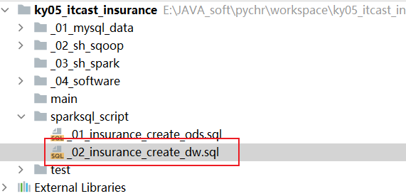

* 2- 编写SQL构建库和表

```properties
-- 此脚本用于放置构建DW层相关的库和表
-- 建库语句
drop database if exists insurance_dw;
create database if not exists insurance_dw
    location 'hdfs://node1:8020/user/hive/warehouse/insurance_dw.db';

-- 创建表: 保费参数因子表
drop table if exists insurance_dw.prem_src;
create table if not exists insurance_dw.prem_src (
    age_buy       smallint comment '投保年龄',
    nursing_age   smallint comment '长期护理保险金给付期满年龄',
    sex           string comment '性别',
    t_age         smallint comment '满期年龄(Terminate Age)',
    ppp           smallint comment '交费期间(Premuim Payment Period PPP)',
    bpp           smallint comment '保险期间(BPP)',
    interest_rate decimal(6, 4)  comment '预定利息率(Interest Rate PREM&RSV)',
    sa            decimal(12, 2) comment '基本保险金额(Baisc Sum Assured)',
    policy_year   smallint comment '保单年度',
    age           smallint comment '保单年度对应的年龄',
    qx            decimal(17, 12) comment '死亡率',
    kx            decimal(17, 12) comment '残疾死亡占死亡的比例',
    qx_d          decimal(17, 12) comment '扣除残疾的死亡率',
    qx_ci         decimal(17, 12) comment '残疾率',
    dx_d          decimal(17, 12) comment '',
    dx_ci         decimal(17, 12) comment '',
    lx            decimal(17, 12) comment '有效保单数',
    lx_d          decimal(17, 12) comment '健康人数',
    cx            decimal(17, 12) comment '当期发生该事件的概率，如下指的是死亡发生概率',
    cx_           decimal(17, 12) comment '对Cx做调整，不精确的话，可以不做',
    ci_cx         decimal(17, 12) comment '当期发生重疾的概率',
    ci_cx_        decimal(17, 12) comment '当期发生重疾的概率，调整',
    dx            decimal(17, 12) comment '有效保单生存因子',
    dx_d_         decimal(17, 12) comment '健康人数生存因子',
    ppp_          smallint comment '是否在缴费期间，1-是，0-否',
    bpp_          smallint comment '是否在保险期间，1-是，0-否',
    expense       decimal(17, 12) comment '附加费用率',
    db1           decimal(17, 12) comment '残疾给付',
    db2_factor    decimal(17, 12) comment '长期护理保险金给付因子',
    db2           decimal(17, 12) comment '长期护理保险金',
    db3           decimal(17, 12) comment '养老关爱金',
    db4           decimal(5, 2) comment '身故给付保险金',
    db5           decimal(17, 12) comment '豁免保费因子'
) comment '保费因子表（到每个保单年度）'
row format delimited fields terminated by '\t';
```

### 1.2 准备构建起始维度表

* 1- 在项目的sparksql_script的目录下, 创建一个SQL脚本, 用于放置计算保费和保费参数因子的相关内容
  * 文件名称:  _04_insurance_dw_prem.sql

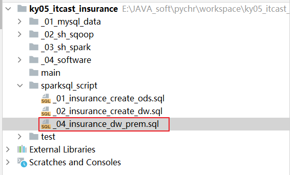

* 2- 编写SQL实现:

```properties
-- 此脚本用于放置DW层计算保费以及保费参数因子的相关SQL

-- 0 生成维度数据
-- 缴费期: 10 15 20 30
create or replace view insurance_dw.prem_src_0_ppp as
select stack(4,10,15,20,30) as ppp;

-- 性别:  M  F
create or replace view insurance_dw.prem_src_0_sex as
select stack(2,'M','F') as sex;

-- 投保年龄: 18 ~ 60
create or replace view insurance_dw.prem_src_0_age_buy as
select explode(sequence(18,60)) as age_buy;

-- 保单年度: 终身寿险 保障到106岁, 所以最大的保单年度为 106-18 = 88
create or replace view insurance_dw.prem_src_0_policy_year as
select explode(sequence(1,88)) as policy_year;


-- 构建一个input常量表, 将固定的参数值放置在一个表中, 整个表只有一行多列即可
create or replace view insurance_dw.input as
select
       0.035  interest_rate,    --预定利息率(Interest Rate PREM&RSV)
       0.055  interest_rate_cv,--现金价值预定利息率（Interest Rate CV）
       0.0004 acci_qx,--意外身故死亡发生率(Accident_qx)
       0.115  rdr,--风险贴现率（Risk Discount Rate)
       10000  sa,--基本保险金额(Baisc Sum Assured)
       1      average_size,--平均规模(Average Size)
       1      MortRatio_Prem_0,--Mort Ratio(PREM)
       1      MortRatio_RSV_0,--Mort Ratio(RSV)
       1      MortRatio_CV_0,--Mort Ratio(CV)
       1      CI_RATIO,--CI Ratio
       6      B_time1_B,--生存金给付时间(1)—begain
       59     B_time1_T,--生存金给付时间(1)-terminate
       0.1    B_ratio_1,--生存金给付比例(1)
       60     B_time2_B,--生存金给付时间(2)-begain
       106    B_time2_T,--生存金给付时间(2)-terminate
       0.1    B_ratio_2,--生存金给付比例(2)
       70     MB_TIME,--祝寿金给付时间
       0.2    MB_Ration,--祝寿金给付比例
       0.7    RB_Per,--可分配盈余分配给客户的比例
       0.7    TB_Per,--未分配盈余分配给客户的比例
       1      Disability_Ratio,--残疾给付保险金保额倍数
       0.1    Nursing_Ratio,--长期护理保险金保额倍数
       75     Nursing_Age--长期护理保险金给付期满年龄
;

-- 进行数据汇总合并操作:  形成 19338条数据
-- 由于维度表结果数据, 需要笛卡尔积的情况, 但是呢, 如果不写on条件, 优化器会认为这个SQL可能是一个效率低下的SQL, 导致无法运行
-- 为了解决这个问题, 可以增加on条件, 只不过在on条件中写为 1 = 1 即可
-- 说明: 根据 性别 缴费期 以及投保年龄, 进行匹配 共计有274种不同的情况
create or replace view insurance_dw.prem_src0 as
select
    t3.age_buy,
    input.Nursing_Age,
    t1.sex,
    input.B_time2_T as t_age,
    t2.ppp,
    106 - t3.age_buy as bpp,
    input.interest_rate,
    input.sa,
    t4.policy_year,
    t3.age_buy + t4.policy_year - 1 as age
from insurance_dw.prem_src_0_sex t1
    join insurance_dw.prem_src_0_ppp t2 on 1 = 1
    join insurance_dw.prem_src_0_age_buy t3 on t3.age_buy >= 18 and t3.age_buy <= 70 - t2.ppp
    join insurance_dw.prem_src_0_policy_year t4 on t4.policy_year >= 1 and t4.policy_year <= 106 - t3.age_buy
    join insurance_dw.input on 1 = 1;

```

### 1.3 完成计算步骤一

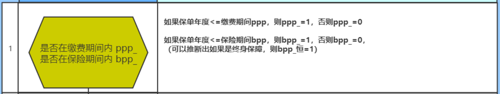

```properties
-- 计算步骤一: ppp_ 和 bpp_
create or replace view insurance_dw.prem_src1 as
select
    *,
    if(
        policy_year <= ppp,
        1,
        0
    ) as ppp_,

    if(
        policy_year <= bpp,
        1,
        0
    ) as bpp_
from insurance_dw.prem_src0;

-- 校验: 与 Excel进行校验操作, 在校验的时候, 查询某一种情况, 和Excel对应情况下的数据进行对比, 如果比对成功, 说明计算是正确的
-- 在校验的时候, 尽量多次校验, 前中后校验, 从而确保计算结果没有任何的问题
select * from insurance_dw.prem_src1 where age_buy = 23 and ppp = 20 and sex = 'M';
```


### 1.4 完成计算步骤二

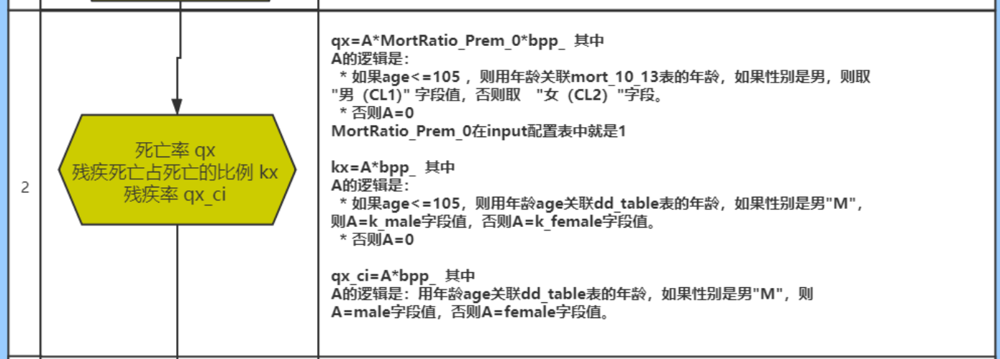

```properties
-- 计算步骤二:  qx  kx 和 qx_ci
-- 为了保证整个计算的精度, 进行强制类型转换, 将小数强制转换为 12位小数
create or replace view insurance_dw.prem_src2 as
select
    t1.*,
    cast(
        if(
            t1.age <= 105,
            if(
                t1.sex = 'M',
                t2.cl1,
                t2.cl2
            ),
            0
        ) * input.MortRatio_Prem_0 * t1.bpp_
    as decimal(17,12)) as qx,

    cast(
        if(
            t1.age <= 105 ,
            if(
                t1.sex = 'M',
                t3.k_male,
                t3.k_female
            ),
            0
        ) * t1.bpp_
    as decimal(17,12)) as kx,

    cast(
        if(
            t1.sex = 'M',
            t3.male,
            t3.female
        ) * t1.bpp_
    as decimal(17,12)) as qx_ci
from insurance_dw.prem_src1 t1 join insurance_dw.input on 1 = 1
    join insurance_ods.mort_10_13 t2 on  t1.age = t2.age
    join insurance_ods.dd_table t3 on t1.age = t3.age;

-- 校验步骤二:
select * from insurance_dw.prem_src2 where age_buy = 23 and ppp = 20 and sex = 'M';
```


### 1.5 完成计算步骤三

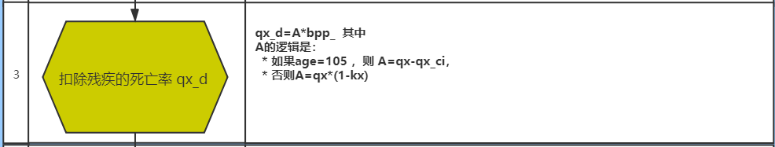

```properties
-- 步骤三: 计算 qx_d
create or replace  view insurance_dw.prem_src3 as
select
    *,
    cast(
        if(
            age = 105,
            qx - qx_ci,
            qx * (1 - kx)
        ) * bpp_
    as decimal(17,12)) as qx_d
from insurance_dw.prem_src2;

-- 校验步骤三:
select * from insurance_dw.prem_src3 where age_buy = 23 and ppp = 20 and sex = 'M';
```

### 1.6 创建Py脚本,读取Sql处理

* 1- 在项目的mian目录下, 创建一个python的文件, 用于读取SQL脚本, 执行SQL
  * 文件名: insurance_FIAA_main

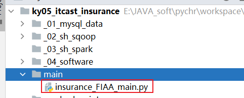

* 2- 编写代码

```properties
from pyspark import SparkContext, SparkConf
from pyspark.sql import SparkSession
import os

# 锁定远端操作环境, 避免存在多个版本环境的问题
os.environ['SPARK_HOME'] = '/export/server/spark'
os.environ["PYSPARK_PYTHON"] = "/root/anaconda3/bin/python"
os.environ["PYSPARK_DRIVER_PYTHON"] = "/root/anaconda3/bin/python"

# 功能: 读取外部SQL脚本文件, 识别每一个SQL语句, 去重SQL中空行注释, 然后执行SQL语句  如果SQL以select开头, 打印其返回的结果
def executeSQLFile(filename):
    with open(r'../sparksql_script/' + filename, 'r') as f:
        # 读取文件中所有行数据, 得到一个列表,列表中每一个元素就是一行行数据
        read_data = f.readlines()
        # 将数组的一行一行拼接成一个长文本，就是SQL文件的内容
        read_data = ''.join(read_data)
        # 将文本内容按分号切割得到数组，每个元素预计是一个完整语句
        arr = read_data.split(";")
        # 对每个SQL,如果是空字符串或空文本，则剔除掉
        # 注意，你可能认为空字符串''也算是空白字符，但其实空字符串‘’不是空白字符 ，即''.isspace()返回的是False
        arr2 = list(filter(lambda x: not x.isspace() and not x == "", arr))
        # 对每个SQL语句进行迭代
        for sql in arr2:
            # 先打印完整的SQL语句。
            print(sql, ";")
            # 由于SQL语句不一定有意义，比如全是--注释;，他也以分号结束，但是没有意义不用执行。
            # 对每个SQL语句，他由多行组成，sql.splitlines()数组中是每行，挑选出不是空白字符的，也不是空字符串''的，也不是--注释的。
            # 即保留有效的语句。
            filtered = filter(lambda x: (not x.lstrip().startswith("--")) and (not x.isspace()) and (not x.strip() == ''),
                              sql.splitlines())
            # 下面数组的元素是SQL语句有效的行
            filtered = list(filtered)

            # 有效的行数>0，才执行
            if len(filtered) > 0:
                df = spark.sql(sql)
                # 如果有效的SQL语句是select开头的，则打印数据。
                if filtered[0].lstrip().startswith("select"):
                    df.show()


# 快捷键:  main 回车
if __name__ == '__main__':
    print("精算系统执行驱动类程序")

    # 1- 创建SparkSession对象
    spark = SparkSession.builder.appName("FIAA_MAIN") \
        .master("local[*]") \
        .config("spark.sql.shuffle.partitions", 4) \
        .config("spark.sql.warehouse.dir", "hdfs://node1:8020/user/hive/warehouse") \
        .config("hive.metastore.uris", "thrift://node1:9083") \
        .enableHiveSupport() \
        .getOrCreate()


    # 2- 读取SQL脚本, 执行SQL语句
    executeSQLFile('_04_insurance_dw_prem.sql')
```

### 1.7 完成计算步骤四

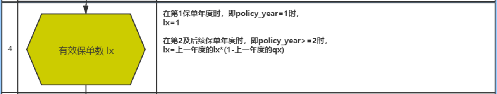

* 先处理当保单年度为1的时候

```sql
-- 步骤 4_1 完成当保单年度为1的时候
create or replace view insurance_dw.prem_src4_1 as
select
    *,
    if(policy_year = 1, 1,NULL) AS lx
from insurance_dw.prem_src3;
```

* 编写自定义UDAF函数, 实现计算LX

```properties
    @F.pandas_udf(returnType='decimal(17,12)')
    def udaf_lx(qx:pd.Series,lx:pd.Series) -> decimal:
        tmp_lx = decimal.Decimal(0)  # 0 --> 1 --> 0.999432

        for i in range(0,len(qx)):
            if i == 0:
                tmp_lx = decimal.Decimal(lx[i])
            else:
                # 此处返回的小数位 和 注册中对应函数的返回类型对应的小数位保持一致, 否则会直接报错(报警告)
                tmp_lx = (tmp_lx * (1 - qx[i - 1])).quantize(decimal.Decimal('0.000000000000'))

        return tmp_lx

    spark.udf.register('udaf_lx',udaf_lx)
```

* 编写SQL, 完成调用操作

```sql
-- 步骤4_2 完成计算lx操作
drop table if exists  insurance_dw.prem_src4_2;
create table if not exists  insurance_dw.prem_src4_2 as
select
    age_buy,
    Nursing_Age,
    sex,
    t_age,
    ppp,
    bpp,
    interest_rate,
    sa,
    policy_year,
    age,
    ppp_,
    bpp_,
    qx,
    kx,
    qx_ci,
    qx_d,
    udaf_lx(qx,lx) over(partition by age_buy,ppp,sex order by policy_year) as lx
from insurance_dw.prem_src4_1;

-- 校验步骤4_2: lx计算结果
select * from insurance_dw.prem_src4_2 where age_buy = 23 and ppp = 20 and sex = 'M';


说明: 
	由于后续要在SQL脚本中对数据进行测试操作, 以及后续的步骤也要继续编写, 所以将使用自定义函数后, 直接将结果保存到一张表, 这样后续就可以直接测试使用了, 不需要每一次通过PY程序运行了
	
	如果后续想要通过视图的方式来处理, 此处必须构建的是临时视图, 因为自定义函数是临时的, 所以视图也必须是临时的, 因为在永久的里面不能使用临时的东西, 但是在临时的内部可以使用永久的内容
```

### 1.8 完成计算步骤五

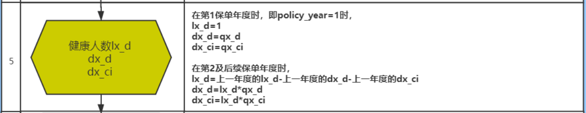

* 首先, 完成当保单年度为1的时候, 计算lx_d的值

```properties
-- 步骤 5_1: 当保单年度为1的时候, 计算 lx_d
create or replace view insurance_dw.prem_src5_1 as
select
    *,
    if(policy_year = 1, 1, null) as lx_d
from insurance_dw.prem_src4_2;
```

* 接着自定义UDAF函数, 完成一次性计算三列的结果, 并封装到一个字符串中

```properties
	@F.pandas_udf(returnType='string')
    def udaf_3col(qx_d:pd.Series,qx_ci:pd.Series,lx_d:pd.Series) -> str:
        tmp_lx_d = decimal.Decimal(0)  # 1
        tmp_dx_d = decimal.Decimal(0)  # 0.000455536
        tmp_dx_ci = decimal.Decimal(0) # 0.000565
        for i in range(0,len(qx_d)):
            if i == 0 :
                tmp_lx_d = decimal.Decimal(lx_d[i])
                tmp_dx_d = decimal.Decimal(qx_d[i])
                tmp_dx_ci = decimal.Decimal(qx_ci[i])
            else:
                # 此处结果计算的当前的lx_d
                tmp_lx_d = (tmp_lx_d - tmp_dx_d - tmp_dx_ci).quantize(decimal.Decimal('0.000000000000'))
                tmp_dx_d = (tmp_lx_d * qx_d[i]).quantize(decimal.Decimal('0.000000000000'))
                tmp_dx_ci = (tmp_lx_d * qx_ci[i]).quantize(decimal.Decimal('0.000000000000'))

        return f'{tmp_lx_d},{tmp_dx_d},{tmp_dx_ci}'

    spark.udf.register('udaf_3col',udaf_3col)
```

* 最后 编写SQL, 调用函数, 并且实现分隔操作, 完成最终三列计算

```sql
-- 步骤 5_2:
drop table if exists insurance_dw.prem_src5_2;
create table if not exists insurance_dw.prem_src5_2 as
select
    age_buy,
    Nursing_Age,
    sex,
    t_age,
    ppp,
    bpp,
    interest_rate,
    sa,
    policy_year,
    age,
    ppp_,
    bpp_,
    qx,
    kx,
    qx_ci,
    qx_d,
    lx,
    udaf_3col(qx_d,qx_ci,lx_d) over(partition by  age_buy,ppp,sex order by policy_year) as lx_d_dx_d_dx_ci
from insurance_dw.prem_src5_1;

-- 步骤5_3  将三列数据拆解开
create or replace view insurance_dw.prem_src5_3 as
select
    age_buy,
    Nursing_Age,
    sex,
    t_age,
    ppp,
    bpp,
    interest_rate,
    sa,
    policy_year,
    age,
    ppp_,
    bpp_,
    qx,
    kx,
    qx_ci,
    qx_d,
    lx,
    cast( split(lx_d_dx_d_dx_ci,',')[0]  as decimal(17,12)) as lx_d,
    cast( split(lx_d_dx_d_dx_ci,',')[1]  as decimal(17,12)) as dx_d,
    cast( split(lx_d_dx_d_dx_ci,',')[2]  as decimal(17,12)) as dx_ci
from insurance_dw.prem_src5_2;
-- 校验步骤五
select * from insurance_dw.prem_src5_3 where age_buy = 23 and ppp = 20 and sex = 'M';
```

### 1.9 完成计算步骤六

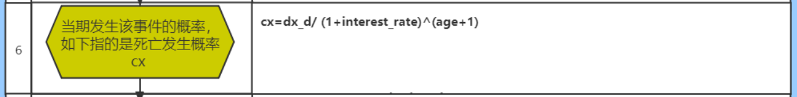

```properties
-- 步骤六:  cx  ^ 幂
-- 如何进行幂次方计算呢? pow(底数,指数)
create or replace view insurance_dw.prem_src6 as
select
    *,
   cast(  dx_d / pow((1+interest_rate),(age+1)) as decimal(17,12)) as cx
from insurance_dw.prem_src5_3;

-- 校验步骤六
select * from insurance_dw.prem_src6 where age_buy = 23 and ppp = 20 and sex = 'M';
```

### 1.10 完成计算步骤七

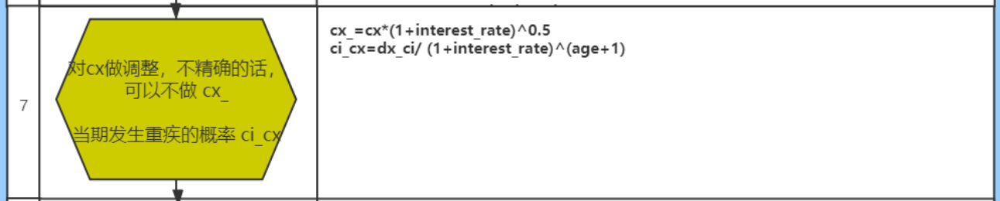

```properties
-- 步骤七: cx_  和 ci_cx
create or replace view  insurance_dw.prem_src7 as
select
    *,
    cast( cx * pow((1+interest_rate),0.5) as decimal(17,12)) as cx_,
    cast(dx_ci / pow((1+interest_rate),(age+1)) as decimal(17,12)) as ci_cx
from insurance_dw.prem_src6;

-- 校验步骤七
select * from insurance_dw.prem_src7 where age_buy = 23 and ppp = 20 and sex = 'M';
```

### 1.11 完成计算步骤八

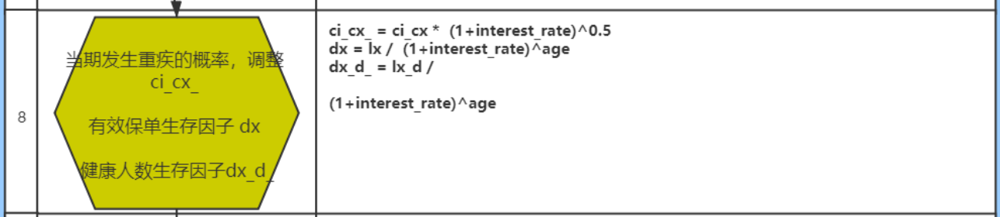

```properties
-- 步骤八
create or replace  view insurance_dw.prem_src8 as
select
    *,
    cast(ci_cx * pow((1+interest_rate),0.5) as decimal(17,12)) as ci_cx_,
    cast(lx / pow((1+interest_rate),age) as decimal(17,12)) as dx,
    cast(lx_d / pow((1+interest_rate),age) as decimal(17,12)) as dx_d_
from insurance_dw.prem_src7;

-- 校验步骤八
select * from insurance_dw.prem_src8 where age_buy = 23 and ppp = 20 and sex = 'M';
```

### 1.12 完成计算步骤九

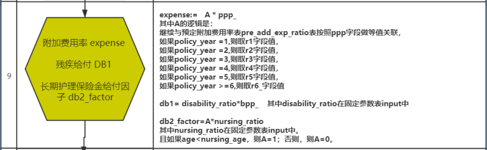

```properties
-- 步骤九
create or replace view insurance_dw.prem_src9 as
select
    t1.*,
    case
        when t1.policy_year = 1  then t2.r1
        when t1.policy_year = 2  then t2.r2
        when t1.policy_year = 3  then t2.r3
        when t1.policy_year = 4  then t2.r4
        when t1.policy_year = 5  then t2.r5
        else t2.r6_
    end  * t1.ppp_ as expense,

    cast(input.Disability_Ratio * t1.bpp_  as decimal(17,12)) as db1,
    cast(
        if(
            t1.age < t1.Nursing_Age,
            1,
            0
        ) * input.Nursing_Ratio
    as decimal(17,12)) as  db2_factor
from insurance_dw.prem_src8 t1
    join insurance_ods.pre_add_exp_ratio t2 on t1.ppp = t2.PPP
    join insurance_dw.input on 1 = 1;

-- 校验步骤九
select * from insurance_dw.prem_src9 where age_buy = 23 and ppp = 20 and sex = 'M';

```


遇到问题:

```properties
在业务端的数据源表于测算模板中相关的配置表信息不一致, 导致基础配置数据出错, 从而影响最终结果的计算

如何解决呢? 
	一般都是寻求业务方人员以及精算人员沟通, 确定到底是那方的问题, 如果是业务库问题, 由业务人员修改业务库, 调整后, 重新采集数据即可,  一般大数据开发者对业务库仅仅只有只读权限, 无权利直接修改业务库
	如果精算人员的问题, 精算重新调整精算模板, 重新验证
```

### 1.13 完成计算步骤十

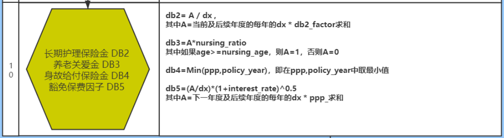

```properties
-- 计算步骤十
create or replace view insurance_dw.prem_src10 as
select
    t1.*,
    cast(
        sum(t1.dx * t1.db2_factor) over(partition by t1.age_buy,t1.sex,t1.ppp order by t1.policy_year rows between current row and unbounded following)
            /
        t1.dx
    as decimal(17,12)) as db2,

    cast(
        if(
            t1.age >= t1.Nursing_Age,
            1,
            0
        ) * input.Nursing_Ratio
    as decimal(17,12))  as db3,

    least(t1.ppp,t1.policy_year) as db4,

    cast(
        (
            sum(t1.dx * t1.ppp_) over(partition by t1.age_buy,t1.sex,t1.ppp order by t1.policy_year rows between 1 following and unbounded following)
                /
            t1.dx
        ) * pow((1+t1.interest_rate),0.5)
    as decimal(17,12)) as db5

from  insurance_dw.prem_src9 t1 join insurance_dw.input;


-- least(字段1,字段2...) : 表示在多列中 寻找一个最小值返回
-- greatest(字段1,字段2...) : 表示在多列中 寻找一个最大值返回
select least(2,5,4,1);
select greatest(2,5,4,1);

-- 校验步骤十
select * from insurance_dw.prem_src10 where age_buy = 23 and ppp = 20 and sex = 'M';
```

### 1.14 将保费参数因子表结果导入到目标表

```sql
-- 将保费参数因子表的结果导入到目标表
-- select后面的字段顺序一定要和目标表的字段顺序保持一致,否则可能会出现紊乱
insert overwrite table insurance_dw.prem_src
select
    age_buy,
    nursing_age,
    sex,
    t_age,
    ppp,
    bpp,
    interest_rate,
    sa,
    policy_year,
    age,
    qx,
    kx,
    qx_d,
    qx_ci,
    dx_d,
    dx_ci,
    lx,
    lx_d,
    cx,
    cx_,
    ci_cx,
    ci_cx_,
    dx,
    dx_d_,
    ppp_,
    bpp_,
    expense,
    db1,
    db2_factor,
    db2,
    db3,
    db4,
    db5
from insurance_dw.prem_src10;

-- 校验目标表
select count(1) from insurance_dw.prem_src;
select * from insurance_dw.prem_src where age_buy = 23 and ppp = 20 and sex = 'M' ;
```

思考: 是否可以有可优化的地方呢?

```properties
1- 在4040界面上, 看到分区(线程)的数量比较多的, 最高有200个, 默认spark sql分区数量为 200 , 可以通过添加参数, 调整分区的数量: set spark.sql.shuffle.partitions = 4;

2- 整体保费参数因子计算工作完成后, 中间所有的结果校验工作, 可以全部都删除了

3- 可以将永久视图、表全部切换为临时视图处理, 直到最后保存至表中

4- 对于input表, 可以将其设置为缓存
```


思考: 整个计算难点:

```properties
1- 自定义UDAF函数解决业务中复杂的纵向迭代问题

2- 将复杂的精算计算操作, 通过视图化方案, 将其拆解为一个个模块 简化开发难度, 提供程序维护性
```

## 2. 计算保费

​		目前这款保险是一个固定保费的保险产品, 就是说用户每一年缴纳的保费是一致的, 所以说计算保费的时候, 其实跟保单年度就没有关系, 只需要根据投递年龄, 性别 以及缴费期, 计算每一种情况下的对应保费数据即可

​		

需求二: 统计各个投保年龄 各个性别 各个缴费期的保费信息 (274条)


### 2.1 创建保费的结果表

```properties
-- 保费表
drop table if exists insurance_dw.prem_std;
create table if not exists insurance_dw.prem_std (
    age_buy smallint comment '投保年龄',
    sex     string comment '性别',
    ppp     smallint comment '缴费期',
    bpp     string comment '保障期',
    prem    decimal(14, 6) comment '每期交的保费'
) comment '标准保费结果表' row format delimited
    fields terminated by '\t';
```

注意: 建表的SQL语句需要放置到: _02_insurance_dw_create.sql

### 2.2 计算步骤十一

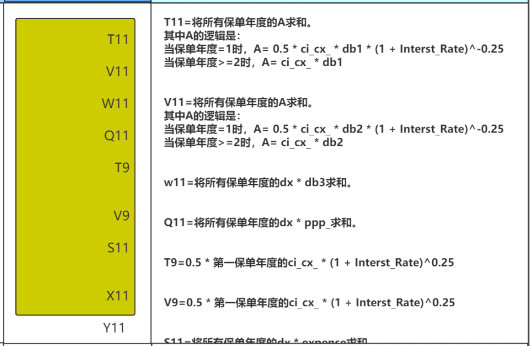

```SQL
-- 步骤十一:  计算中间结果
create or replace view  insurance_dw.prem_std11 as
select
    age_buy,
    sex,
    ppp,
    cast(
        sum(
            if(
                policy_year = 1,
                0.5 * ci_cx_ * db1 * pow((1+interest_rate),-0.25),
                ci_cx_ * db1
            )
        )
    as decimal(17,12)) as T11,

    cast(
        sum(
            if(
                policy_year = 1,
                0.5 * ci_cx_ * db2 * pow((1+interest_rate),-0.25),
                ci_cx_ * db2
            )
        )
    as decimal(17,12)) as V11,

    cast(sum(dx * db3) as decimal(17,12)) as W11,
    cast(sum(dx * ppp_) as decimal(17,12)) as Q11,

    cast(
        sum(
            if(
                policy_year = 1,
                0.5 * ci_cx_ * pow((1+interest_rate),0.25),
                0
            )
        )
    as decimal(17,12)) as T9,

    cast(
        sum(
            if(
                policy_year = 1,
                0.5 * ci_cx_ * pow((1+interest_rate),0.25),
                0
            )
        )
    as decimal(17,12)) as V9,

    cast(sum(dx * expense) as decimal(17,12)) as S11,
    cast(sum(cx_ * db4) as decimal(17,12)) as X11,
    cast(sum(ci_cx_ * db5) as decimal(17,12)) as Y11

from insurance_dw.prem_src10
group by age_buy,sex,ppp;

-- 校验操作:
select * from insurance_dw.prem_std11 where age_buy = 28 and ppp = 30 and sex = 'F' ;
```


### 2.3  计算步骤十二

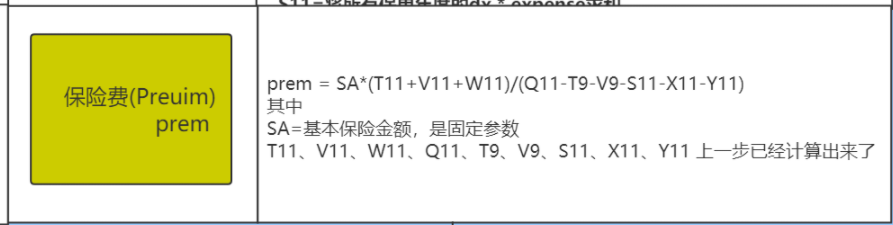

````properties
-- 步骤十二:
create or replace view insurance_dw.prem_std12 as
select
    t1.age_buy,
    t1.sex,
    t1.ppp,
    cast(
        input.sa * (t1.t11 + t1.v11 + t1.W11) / (t1.Q11 - t1.T9 - t1.V9 - t1.S11 - t1.X11 - t1.Y11)
    as decimal(17,0)) as prem

from insurance_dw.prem_std11 t1 join insurance_dw.input on 1 = 1;

-- 校验操作:
select * from insurance_dw.prem_std12 where age_buy = 35 and ppp = 15 and sex = 'F' ;
````

### 2.4 保存至目标表

```sql
-- 保存至目标表
insert overwrite table insurance_dw.prem_std
select
    age_buy,
    sex,
    ppp,
    (106 - age_buy) as bpp,
    prem
from insurance_dw.prem_std12;

-- 校验保费
select count(1) from insurance_dw.prem_std;
select * from insurance_dw.prem_std where age_buy = 35 and ppp = 15 and sex = 'F' ;

```

## 3. 保险现金价值和准备金

### 3.1  什么是现金价值

* 1- 指带有储蓄性质的人身保险单所具有的价值
* 2- 保险人为履行合同责任通常提存责任准备金,如果中途退保，即以该保单的责任准备金作为给付解约的退还金。被保险人要求解约或退保时，寿险公司应该发还的金额
* 3- 可以做保单贷款, 一般是可以贷到保单现金价值的70%

### 3.2 什么是准备金

​		保险准备金(reserve)是指保险人为保证其如约履行保险赔偿或给付义务，根据政府有关法律规定或业务特定需要，从保费收入或盈余中提取的与其所承担的保险责任相对应的一定数量的基金

​		寿险准备金意思是计提的保费，用来作为未来赔付的保证。准备金是衡量保险公司偿付能力的重要指标，偿付能力越强，保险公司信用评级越高。


从保险公司的角度来说, 不管是现金价值, 还是保险准备金, 都是准备金, 都是不能动的钱, 都可以认为是保险公司的负债


## 4. 现金价值计算操作

### 4.1 需求分析

需求: 统计各个投保年龄, 各个性别, 各个缴费期在每个保单年度对应的现金价值相关指标(总条数为 19338条)

```properties
分析:
	1- 共计有10个维度字段  和  37个指标字段:  
		其中 10个维度字段与保费参数因子表的10个维度字段基本一致, 只有一个费率是不同, 后续维度数据可以直接加载保费参数因子表
		指标: 
			发现在现金价值表中相关的字段是来源于保费参数因子表, 所欲对于这类指标 直接对接保费参数因子表即可 不需要再次计算:
			不需要计算的指标:  15个
				死亡率qx	
				残疾死亡占死亡的比例kx	
				扣除残疾的死亡率qx_d	
				残疾率qx_ci	
				dx_d	
				dx_ci	
				有效保单数lx	
				健康人数lx_d
				缴费期间PPP_	
				保险期间BPP	
				附加费用率Expense	
				残疾给付DB1	
				"长期护理保险金给付因子db2_factor"
				养老关爱金DB3
				身故给付保险金DB4

			需要计算的指标: 22个
				Cx	
				Cx~	
				Ci_Cx	
				Ci_Cx~	
				有效保单生存因子Dx	
				健康人数生存因子Dx_D_
				长期护理保险金DB2
				豁免保费因子DB5
				
				净保费NP_	
				净保费现值PVNP	
				PVDB1	
				PVDB2	
				PVDB3	
				PVDB4	
				PVDB5	
				保单价值准备金PVR	
				Rt	
				修匀净保费（NP）	
				生存金sur_ben	
				现金价值年末（生存给付前）cv_1a	
				现金价值年末（生存给付后）cv_1b	
				"现金价值年中cv_2"
	2- 在现金价值中, 保单年度为0也是有意义的, 所以在生成数据的时候, 需要包含保单年度为0的数据, 共计有274条, 所以最终的全部数据量: 19338 + 274 = 19612条

开发步骤: 
	1- 在DW层创建现金价值结果表: 共计有 47个字段(10维度 + 37个指标)
	2- 对接保费参数因子表, 将不需要计算的维度和指标获取出来
	3- 添加保单年度为0的数据到表中, 表总数据量为 19612条
	4- 完成后续的计算操作
```

### 4.2 创建现金价值结果表

```sql
-- 现金价值表计算
drop table if exists insurance_dw.cv_src;
create table if not exists insurance_dw.cv_src(
    age_buy       smallint comment '投保年龄',
    nursing_age   smallint comment '长期护理保险金给付期满年龄',
    sex           string comment '性别',
    t_age         smallint comment '满期年龄(Terminate Age)',
    ppp           smallint comment '交费期间(Premuim Payment Period PPP)',
    bpp           smallint comment '保险期间(BPP)',
    interest_rate_cv decimal(6, 4) comment '现金价值预定利息率（Interest Rate CV）',
    sa            decimal(12, 2) comment '基本保险金额(Baisc Sum Assured)',
    policy_year   smallint comment '保单年度',
    age           smallint comment '保单年度对应的年龄',
    qx            decimal(8, 7) comment '死亡率',
    kx            decimal(8, 7) comment '残疾死亡占死亡的比例',
    qx_d          decimal(8, 7) comment '扣除残疾的死亡率',
    qx_ci         decimal(8, 7) comment '残疾率',
    dx_d          decimal(8, 7) comment '',
    dx_ci         decimal(8, 7) comment '',
    lx            decimal(8, 7) comment '有效保单数',
    lx_d          decimal(8, 7) comment '健康人数',
    cx            decimal(8, 7) comment '当期发生该事件的概率，如下指的是死亡发生概率',
    cx_           decimal(8, 7) comment '对Cx做调整，不精确的话，可以不做',
    ci_cx         decimal(8, 7) comment '当期发生重疾的概率',
    ci_cx_        decimal(8, 7) comment '当期发生重疾的概率，调整',
    dx            decimal(8, 7) comment '有效保单生存因子',
    dx_d_         decimal(8, 7) comment '健康人数生存因子',
    ppp_          smallint comment '是否在缴费期间，1-是，0-否',
    bpp_          smallint comment '是否在保险期间，1-是，0-否',
    expense       decimal(8, 7) comment '附加费用率',
    db1           decimal(12, 2) comment '残疾给付',
    db2_factor    decimal(8, 7) comment '长期护理保险金给付因子',
    db2           decimal(12, 2) comment '长期护理保险金',
    db3           decimal(12, 2) comment '养老关爱金',
    db4           decimal(12, 2) comment '身故给付保险金',
    db5           decimal(12, 2) comment '豁免保费因子',
    np_         DECIMAL(12, 2) comment '净保费',
    pvnp        DECIMAL(17, 7) comment '净保费现值',
    pvdb1       DECIMAL(17, 7) comment '',
    pvdb2       DECIMAL(17, 7) comment '',
    pvdb3       DECIMAL(17, 7) comment '',
    pvdb4       DECIMAL(17, 7) comment '',
    pvdb5       DECIMAL(17, 7) comment '',
    pvr         DECIMAL(17, 7) comment '保单价值准备金',
    rt          DECIMAL(6, 3) comment '',
    np          DECIMAL(17, 7) comment '修匀净保费',
    sur_ben     DECIMAL(17, 7) comment '生存金',
    cv_1a       DECIMAL(17, 7) comment '现金价值年末（生存给付前）',
    cv_1b       DECIMAL(17, 7) comment '现金价值年末（生存给付后）',
    cv_2        DECIMAL(17, 7) comment '现金价值年中'
)comment '现金价值表（到每个保单年度）'
row format delimited fields terminated by ',';
```

注意: 建表语句需要放置到 _02_insurance_dw_create.sql

### 4.3 完成计算操作(13~16)

* 1- 在sparksql_script目录下,创建一个用于记录现金价值的SQL脚本:
  * 文件名: _05_insurance_dw_cv.sql

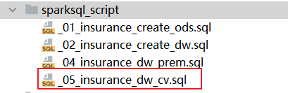

* 2- 思考如何生成274条保单年度为0的数据:

```properties
-- 投机取巧方法
select distinct
    t1.age_buy,
    t1.nursing_age,
    t1.sex,
    t1.t_age,
    t1.ppp,
    t1.bpp,
    input.interest_rate_cv,
    t1.sa,
    0 as policy_year,
    null as age,
    null as qx,
    null as kx,
    null as qx_d,
    null as qx_ci,
    null as dx_d,
    null as dx_ci,
    null as lx,
    null as lx_d,
    null as ppp_,
    null as bpp_,
    null as expense,
    null as db1,
    null as db2_factor,
    null as db3,
    null as db4
from insurance_dw.prem_src10 t1 join insurance_dw.input on 1 =1;

-- 标准生成方案(实现274条 保单年度为0的数据)
select
    t3.age_buy,
    input.Nursing_Age,
    t1.sex,
    input.B_time2_T as t_age,
    t2.ppp,
    106 - t3.age_buy as bpp,
    input.interest_rate_cv,
    input.sa,
    0 as policy_year,
    null as age,
    null as qx,
    null as kx,
    null as qx_d,
    null as qx_ci,
    null as dx_d,
    null as dx_ci,
    null as lx,
    null as lx_d,
    null as ppp_,
    null as bpp_,
    null as expense,
    null as db1,
    null as db2_factor,
    null as db3,
    null as db4
from insurance_dw.prem_src_0_sex t1
    join insurance_dw.prem_src_0_ppp t2 on 1 = 1
    join insurance_dw.prem_src_0_age_buy t3 on t3.age_buy >= 18 and t3.age_buy <= 70 - t2.ppp
    join insurance_dw.input on 1 = 1;
```

* 计算第13步:

```sql
-- 此脚本用于放置现金价值相关计算SQL
-- 步骤13~16
create or replace view insurance_dw.cv_src16 as
with cv_src13 as(
    select
        t1.age_buy,
        t1.nursing_age,
        t1.sex,
        t1.t_age,
        t1.ppp,
        t1.bpp,
        input.interest_rate_cv,
        t1.sa,
        t1.policy_year,
        t1.age,
        t1.qx,
        t1.kx,
        t1.qx_d,
        t1.qx_ci,
        t1.dx_d,
        t1.dx_ci,
        t1.lx,
        t1.lx_d,
        cast(t1.dx_d / pow((1+input.interest_rate_cv),(t1.age + 1)) as decimal(17,12)) as cx ,
        t1.ppp_,
        t1.bpp_,
        t1.expense,
        t1.db1,
        t1.db2_factor,
        t1.db3,
        t1.db4
    from insurance_dw.prem_src10 t1 join insurance_dw.input on 1 =1
    union all
    select
        t3.age_buy,
        input.Nursing_Age,
        t1.sex,
        input.B_time2_T as t_age,
        t2.ppp,
        106 - t3.age_buy as bpp,
        input.interest_rate_cv,
        input.sa,
        0 as policy_year,
        null as age,
        null as qx,
        null as kx,
        null as qx_d,
        null as qx_ci,
        null as dx_d,
        null as dx_ci,
        null as lx,
        null as lx_d,
        null as cx,
        null as ppp_,
        null as bpp_,
        null as expense,
        null as db1,
        null as db2_factor,
        null as db3,
        null as db4
    from insurance_dw.prem_src_0_sex t1
        join insurance_dw.prem_src_0_ppp t2 on 1 = 1
        join insurance_dw.prem_src_0_age_buy t3 on t3.age_buy >= 18 and t3.age_buy <= 70 - t2.ppp
        join insurance_dw.input on 1 = 1
),
cv_src14 as (
    select
        *,
        cast( cx * pow((1+interest_rate_cv),0.5) as decimal(17,12)) as cx_,
        cast(dx_ci / pow((1+interest_rate_cv),(age+1)) as decimal(17,12)) as ci_cx
    from cv_src13
),
cv_src15 as (
    select
        *,
        cast(ci_cx * pow((1+interest_rate_cv),0.5) as decimal(17,12)) as ci_cx_,
        cast(lx / pow((1+interest_rate_cv),age) as decimal(17,12)) as dx,
        cast(lx_d / pow((1+interest_rate_cv),age) as decimal(17,12)) as dx_d_
    from cv_src14
)
select
    *,
    cast(
        sum(dx * db2_factor) over(partition by age_buy,sex,ppp order by policy_year rows between current row and unbounded following)
            /
        dx
    as decimal(17,12)) as db2,

    cast(
        (
            sum(dx * ppp_) over(partition by age_buy,sex,ppp order by policy_year rows between 1 following and unbounded following)
                /
            dx
        ) * pow((1 + interest_rate_cv),0.5)
    as decimal(17,12)) as db5
from cv_src15;

-- 校验步骤16
select
    *
from insurance_dw.cv_src16 where  ppp = 10 and age_buy = 25 and sex ='M' order by policy_year;
```


### 4.4 完成计算操作(17~18)

```sql
-- 步骤17 ~ 18
create or replace view insurance_dw.cv_src18 as
with cv_src17 as (
    select
        age_buy,
        ppp,
        sex,
        cast(
            sum(
                if(
                    policy_year = 1,
                    0.5 * ci_cx_ * db1 * pow((1+interest_rate_cv),-0.25),
                    ci_cx_ * db1
                )
            )
        as decimal(17,12)) as T11,

        cast(
            sum(
                if(
                    policy_year = 1,
                    0.5 * ci_cx_ * db2 * pow((1+interest_rate_cv),-0.25),
                    ci_cx_ * db2
                )
            )
        as decimal(17,12)) as V11,

        cast(sum(dx * db3) as decimal(17,12)) as W11,
        cast(sum(dx * ppp_) as decimal(17,12)) as Q11,

        cast(
            sum(
                if(
                    policy_year = 1,
                    0.5 * ci_cx_ * pow((1+interest_rate_cv),0.25),
                    0
                )
            )
        as decimal(17,12)) as T9,

        cast(
            sum(
                if(
                    policy_year = 1,
                    0.5 * ci_cx_ * pow((1+interest_rate_cv),0.25),
                    0
                )
            )
        as decimal(17,12)) as V9,

        cast(sum(dx * expense) as decimal(17,12)) as S11,
        cast(sum(cx_ * db4) as decimal(17,12)) as X11,
        cast(sum(ci_cx_ * db5) as decimal(17,12)) as Y11

    from insurance_dw.cv_src16
    group by age_buy,ppp,sex
)
select
    t1.age_buy,
    t1.sex,
    t1.ppp,
    cast(
        (input.sa * (t1.t11 +t1.v11 +t1.w11) + t2.prem * (t1.T9 + t1.V9 + t1.X11 + t1.Y11))
            /
        (t1.Q11  - t1.S11)
    as decimal(17,12)) as prem_cv

from cv_src17 t1 join insurance_dw.input on 1 = 1
    join insurance_dw.prem_std12 t2 on t1.age_buy = t2.age_buy and t1.ppp = t2.ppp and t1.sex = t2.sex


-- 校验步骤18
select
    *
from insurance_dw.cv_src18 where  ppp = 10 and age_buy = 25 and sex ='M' ;

```


说明:  发现在计算金毛保费的时候, 中间的计算结果, 计算出现一定的偏差, 而且偏差是由精度导致的,但是实际保留了12位小数的精度, 这是为什么呢?

```properties
	decimal最大长度为38位, 一旦超出了38位的长度后, 默认会自动的进行四舍五入,而整个计算过程中, 大量的中间结果产生, 每个结果极有可能进行四舍五入操作, 从而导致最终的结果出现一定的偏差, 无法保留多个小数位 (相当于出现类似于double 或者 float的精度偏差问题)
	
解决方案:  添加一个spark的配置, 此配置用于保护精度, 禁止decimal类型进行四舍五入操作
set spark.sql.decimalOperations.allowPrecisionLoss=false;  -- 是否允许进行精度损失(默认true)
```


### 4.5 将金毛保费保存至目标表

* 1- 构建prem_cv结果表

```sql
-- 创建 金毛保费目标表
drop table if exists insurance_dw.prem_cv;
create table if not exists insurance_dw.prem_cv (
    age_buy smallint comment '年投保龄',
    sex     string comment '性别',
    ppp     smallint comment '缴费期间',
    prem_cv      decimal(15, 7) comment '保单价值准备金毛保险费(Preuim)'
)comment '保单价值准备金毛保险费表' row format delimited
    fields terminated by '\t';
```

建表语句放置到_02_insurance_dw_create.sql

* 2- 执行导入操作

```sql
-- 将结果直接导入到金毛保费目标表
insert overwrite table insurance_dw.prem_cv
select
    age_buy,
    sex,
    ppp,
    prem_cv
from insurance_dw.cv_src18;

-- 校验金毛保费表:
select
    *
from insurance_dw.prem_cv where  ppp = 10 and age_buy = 25 and sex ='M' ;
```

### 4.6 完成计算操作(19~23)

```sql
-- 计算步骤19~23
create or replace view insurance_dw.cv_src23 as
with cv_src19 as (
    select
        t1.*,
        cast(
            (t1.ppp_ - t1.expense) * t2.prem_cv
        as decimal(17,12)) as np_,

        cast(
            t2.prem_cv
                *
            sum(t1.dx * (t1.ppp_ - t1.expense)) over(partition by t1.age_buy,t1.sex,t1.ppp order by t1.policy_year rows  between current row  and unbounded following)
                /
            t1.dx
        as decimal(17,12)) as pvnp,

        cast(
            if(
                t1.policy_year = 1,
                (
                    t1.sa
                        *
                    ifnull(sum(t1.ci_cx_ * t1.db1) over(partition by t1.age_buy,t1.sex,t1.ppp order by policy_year rows  between 1 following and unbounded following) ,0)
                        +
                    0.5
                        *
                    (
                        t3.prem * t1.ci_cx_ * pow((1+t1.interest_rate_cv),0.25)
                            +
                        t1.sa * t1.db1 * t1.ci_cx_ * pow((1+t1.interest_rate_cv),-0.25)
                    )
                )
                    /
                t1.dx,
                t1.sa
                    *
                sum(t1.ci_cx_ * t1.db1) over(partition by t1.ppp,t1.sex,t1.age_buy order by policy_year rows between current row and unbounded following)
                    /
                t1.dx
            )
        as decimal(17,12)) as pvdb1,

        cast(
            if(
                t1.policy_year = 1,
                (
                    t1.sa
                        *
                    ifnull(sum(t1.ci_cx_ * t1.db2) over(partition by t1.age_buy,t1.sex,t1.ppp order by policy_year rows  between 1 following and unbounded following) ,0)
                        +
                    0.5
                        *
                    (
                        t3.prem * t1.ci_cx_ * pow((1+t1.interest_rate_cv),0.25)
                            +
                        t1.sa * t1.db2 * t1.ci_cx_ * pow((1+t1.interest_rate_cv),-0.25)
                    )
                )
                    /
                t1.dx,
                t1.sa
                    *
                sum(t1.ci_cx_ * t1.db2) over(partition by t1.ppp,t1.sex,t1.age_buy order by policy_year rows between current row and unbounded following)
                    /
                t1.dx
            )
        as decimal(17,12)) as pvdb2,

        cast(
            t1.sa
                *
            sum(t1.dx * t1.db3) over(partition by t1.age_buy,t1.sex,t1.ppp order by t1.policy_year rows between current row and unbounded following)
                /
            t1.dx
        as decimal(17,12)) as pvdb3,

        cast(
            t3.prem
                *
            sum(t1.cx_ * t1.db4) over(partition by t1.age_buy,t1.sex,t1.ppp order by t1.policy_year rows between current row and unbounded following)
                /
            t1.dx
        as decimal(17,12)) as pvdb4,

        cast(
            t3.prem
                *
            sum(t1.ci_cx_ * t1.db5) over(partition by t1.age_buy,t1.sex,t1.ppp order by t1.policy_year rows between current row and unbounded following)
                /
            t1.dx
        as decimal(17,12)) as pvdb5
    from insurance_dw.cv_src16 t1
        join insurance_dw.cv_src18 t2 on t1.age_buy = t2.age_buy and t1.sex = t2.sex and t1.ppp = t2.ppp
        join insurance_dw.prem_std12 t3 on t1.age_buy = t3.age_buy and t1.sex = t3.sex and t1.ppp = t3.ppp
),
cv_src20 as (
    select
        *,
        if(
            policy_year = 0,
            null,
            lead(pvdb1 + pvdb2 + pvdb3 + pvdb4 + pvdb5 - pvnp,1,0 ) over(partition by ppp,sex,age_buy order by policy_year)
        ) as pvr,

        if(
            ppp = 1, -- 趸(dun)交:  一次性完成后续所有的年的缴费
            1,
            if(
                policy_year >= least(20,ppp),
                1,
                0.8 +policy_year * 0.8 / least(20,ppp)
            )
        ) as rt
    from cv_src19

),
cv_src21 as (
    select
        *,
        cast(np_ * lag(rt,1,0) over(partition by age_buy,sex,ppp order by policy_year) as decimal(17,12)) as np,
        cast(db3 * sa as decimal(17,12)) as sur_ben,
        cast(
            rt * greatest(
                            (pvr - lead(db3 * sa ,1,0) over(partition by age_buy,sex,ppp order by policy_year))
                            ,
                            0
                         )
        as decimal(17,12)) as cv_1b

    from cv_src20
),
cv_src22 as (
    select
        *,
        cv_1b + lead(sur_ben,1,0) over(partition by ppp,age_buy,sex order by policy_year) AS cv_1a
    from cv_src21
)
select
    *,
    cast(
        (
            np
                +
            lag(cv_1b,1,0) over(partition by ppp,age_buy,sex order by policy_year)
                +
            cv_1a
        ) / 2

    as decimal(17,12)) as cv_2
from cv_src22;


-- 校验步骤23:
select
    *
from insurance_dw.cv_src23 where ppp = 30 and age_buy = 40 and sex ='M' ;

```

### 4.7 将现金价值结果导入目标表

```sql
-- 将现金价值的结果数据灌入到目标表
insert overwrite table insurance_dw.cv_src
select
    age_buy,
    nursing_age,
    sex,
    t_age,
    ppp,
    bpp,
    interest_rate_cv,
    sa,
    policy_year,
    age,
    qx,
    kx,
    qx_d,
    qx_ci,
    dx_d,
    dx_ci,
    lx,
    lx_d,
    cx,
    cx_,
    ci_cx,
    ci_cx_,
    dx,
    dx_d_,
    ppp_,
    bpp_,
    expense,
    db1,
    db2_factor,
    db2,
    db3,
    db4,
    db5,
    np_,
    pvnp,
    pvdb1,
    pvdb2,
    pvdb3,
    pvdb4,
    pvdb5,
    pvr,
    rt,
    np,
    sur_ben,
    cv_1a,
    cv_1b,
    cv_2
from insurance_dw.cv_src23;

-- 校验现金价值表
-- 19338 + 274 = 19612 条
select  count(1) from insurance_dw.cv_src; 
select
    *
from insurance_dw.cv_src where ppp = 30 and age_buy = 40 and sex ='M';
```


思考: 有那些可以优化点/难点呢?

```properties
1- decimal类型 出现精度问题
2- 相关的重复使用表,可以尝试配置缓存操作
3- 将视图切换为临时视图
```


面试中讲法:

```properties
讲法1:  基于保费参数因子表的基础上完成现金价值的计算工作   (建议项目负责的点应该包含有保费计算和现金价值计算)

讲法2:  负责现金价值表相关指标精算计算, 其中37个指标都是独立完成的(不依赖与保费参数因子表)  适合于仅负责现金价值计算,不负责保费计算
```


## 5. 准备金计算操作

### 5.1 需求分析

需求四:  统计各个投保年龄 各个性别 各个缴费期在不同的保单年度的相关的准备金指标计算 (总条数: 19338)

```properties
分析: 
	1- 准备金表的涉及到指标和维度:  10个维度 +33个指标
		其中10个维度, 不需要处理的,可以对接保费参数因子表获取即可
		33个指标:  
			直接从保费参数因子表获取的指标: 17个
				死亡率qx	
				残疾死亡占死亡的比例kx	
				扣除残疾的死亡率qx_d	
				残疾率qx_ci	
				dx_d	
				dx_ci	
				有效保单数lx	
				健康人数lx_d
				Cx	
				Cx~	
				Ci_Cx	
				Ci_Cx~	
				有效保单生存因子Dx	
				健康人数生存因子Dx_D
				缴费期间PPP	
				保险期间BPP	
				长期护理保险金给付因子db2_factor
			
			需要计算:  16
				DB1,DB2,DB3,DB4,DB5
				修正纯保费 np_	
				修正纯保费现值PVNP	
				PVDB1	
				PVDB2	
				PVDB3	
				PVDB4	
				PVDB5	
				准备金年末rsv1	
				准备金年初（未加当年初纯保费）rsv2	
				修正责任准备金年末 rsv1_re	
				修正责任准备金年初(未加当年初纯保费）rsv2_re
	2- 额外添加了三个中间结果的字段,便于后续的指标统计:alpha  beta prem_rsv  
开发步骤: 
	1- 创建准备金结果表
	2- 对接保费参数因子表,将不需要计算的维度和指标获取出来
	3- 完成剩余的计算操作
```


### 5.2 构建目标表

```sql
-- 准备金表
drop table if exists insurance_dw.rsv_src;
create table if not exists insurance_dw.rsv_src (
    age_buy       smallint comment '投保年龄',
    nursing_age   smallint comment '长期护理保险金给付期满年龄',
    sex           string comment '性别',
    t_age         smallint comment '满期年龄(Terminate Age)',
    ppp           smallint comment '交费期间(Premuim Payment Period PPP)',
    bpp           smallint comment '保险期间(BPP)',
    interest_rate decimal(6, 4)  comment '预定利息率(Interest Rate PREM&RSV)',
    sa            decimal(12, 2) comment '基本保险金额(Baisc Sum Assured)',
    policy_year   smallint comment '保单年度',
    age           smallint comment '保单年度对应的年龄',
    qx            decimal(8,7) comment '死亡率',
    kx            decimal(8,7) comment '残疾死亡占死亡的比例',
    qx_d          decimal(8,7) comment '扣除残疾的死亡率',
    qx_ci         decimal(8,7) comment '残疾率',
    dx_d          decimal(8,7) comment '',
    dx_ci         decimal(8,7) comment '',
    lx            decimal(8,7) comment '有效保单数',
    lx_d          decimal(8,7) comment '健康人数',
    cx            decimal(8,7) comment '当期发生该事件的概率，如下指的是死亡发生概率',
    cx_           decimal(8,7) comment '对Cx做调整，不精确的话，可以不做',
    ci_cx         decimal(8,7) comment '当期发生重疾的概率',
    ci_cx_        decimal(8,7) comment '当期发生重疾的概率，调整',
    dx            decimal(8,7) comment '有效保单生存因子',
    dx_d_         decimal(8,7) comment '健康人数生存因子',
    ppp_          smallint comment '是否在缴费期间，1-是，0-否',
    bpp_          smallint comment '是否在保险期间，1-是，0-否',
    db1           decimal(12, 2) comment '残疾给付',
    db2_factor    decimal(8, 7) comment '长期护理保险金给付因子',
    db2           decimal(12, 2) comment '长期护理保险金',
    db3           decimal(12, 2) comment '养老关爱金',
    db4           decimal(12, 2) comment '身故给付保险金',
    db5           decimal(12, 2) comment '豁免保费因子',
    np_           decimal(12, 2) comment '修正纯保费',
    pvnp          decimal(17, 7) comment '修正纯保费现值',
    pvdb1         decimal(17, 7) comment '',
    pvdb2         decimal(17, 7) comment '',
    pvdb3         decimal(17, 7) comment '',
    pvdb4         decimal(17, 7) comment '',
    pvdb5         decimal(17, 7) comment '',
    prem_rsv      decimal(17, 7) comment '保险费(Preuim)',
    alpha         decimal(17, 7) comment '修正纯保费首年',
    beta          decimal(17, 7) comment '修正纯保费续年',
    rsv1          decimal(17, 7) comment '准备金年末',
    rsv2          decimal(17, 7) comment '准备金年初（未加当年初纯保费）',
    rsv1_re       decimal(17, 7) comment '修正责任准备金年末',
    rsv2_re       decimal(17, 7) comment '修正责任准备金年初(未加当年初纯保费）'
)comment '准备金表（到每个保单年度）' row format delimited
    fields terminated by ',';
```

放置到_02_insurance_dw_create.sql


### 5.3 完成保险准备金计算

* 1- 在项目中创建一个新的SQL脚本, 用于放置保险准备金的计算流程: _06_insurance_dw_rsv.sql

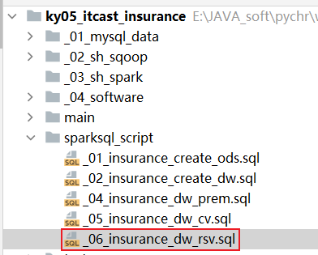

* 2- 编写SQL 完成统计计算操作

```sql
-- 完成计算保险准备金
set spark.sql.shuffle.partitions = 4;
set spark.sql.decimalOperations.allowPrecisionLoss=false;

-- 首先对接保费参数因子表, 将不需要的维度和指标获取出来
-- 步骤24
with rsv_src24 as (
    select
        t1.age_buy,
        t1.Nursing_Age,
        t1.sex,
        t1.t_age,
        t1.ppp,
        t1.bpp,
        t1.interest_rate,
        t1.sa,
        t1.policy_year,
        t1.age,
        t1.qx,
        t1.kx,
        t1.qx_d,
        t1.qx_ci,
        t1.dx_d,
        t1.dx_ci,
        t1.lx,
        t1.lx_d,
        t1.cx,
        t1.cx_,
        t1.ci_cx,
        t1.ci_cx_,
        t1.dx,
        t1.dx_d_,
        t1.ppp_,
        t1.bpp_,
        t1.db2_factor,
        cast(
           if(
                t1.policy_year = 1,
                0.5 * (t1.sa * t1.db1 * pow((1+t1.interest_rate),-0.25) + t2.prem * pow((1+t1.interest_rate),0.25) ),
                t1.sa * t1.db1
            )
        as decimal(17,12))as db1,

        cast(
            if(
                t1.policy_year = 1,
                0.5 * (t1.sa * t1.db2 * pow((1+t1.interest_rate),-0.25) + t2.prem * pow((1+t1.interest_rate),0.25) ),
                t1.sa * t1.db2
            )
        as decimal(17,12))as db2,

        cast(t1.sa * t1.db3 as decimal(17,12)) as db3,

        cast(t2.prem * t1.db4 as decimal(17,12)) as db4,
        cast(t2.prem * t1.db5 as decimal(17,12)) as db5,

        t2.prem
    from insurance_dw.prem_src10 t1
        join insurance_dw.prem_std12 t2 on t1.ppp = t2.ppp and t1.sex = t2.sex and t1.age_buy = t2.age_buy
),
rsv_src25 as (
    select
        *,
        cast(
            sum(ci_cx_ * db1) over(partition by ppp,sex,age_buy order by policy_year rows between current row and unbounded following)
                /
            dx
        as decimal(17,12)) as pvdb1,

        cast(
            sum(ci_cx_ * db2) over(partition by ppp,sex,age_buy order by policy_year rows between current row and unbounded following)
                /
            dx
        as decimal(17,12)) as pvdb2,

        cast(
            sum(dx * db3) over(partition by ppp,sex,age_buy order by policy_year rows between current row and unbounded following)
                /
            dx
        as decimal(17,12)) as pvdb3,

        cast(
            sum(cx_ * db4) over(partition by ppp,sex,age_buy order by policy_year rows between current row and unbounded following)
                /
            dx
        as decimal(17,12)) as pvdb4,

        cast(
            sum(ci_cx_ * db5) over(partition by ppp,sex,age_buy order by policy_year rows between current row and unbounded following)
                /
            dx
        as decimal(17,12)) as pvdb5
    from rsv_src24
),
rsv_src26 as (
    select
        ppp,
        sex,
        age_buy,
        cast(
            sum(
                if(
                    policy_year = 1,
                    pvdb1 + pvdb2 +pvdb3 + pvdb4 +pvdb5,
                    0
                )
            )
                /
            sum(dx * ppp_)
                *
            sum(
                if(policy_year = 1, dx,0)
            )
        as decimal(17,12)) as prem_rsv
    from rsv_src25
    group by ppp,sex,age_buy
),
rsv_src27 as (
    select
        t1.ppp,
        t1.sex,
        t1.age_buy,
        t1.prem_rsv,
        cast(
            if(
                t1.ppp = 1,
                t1.prem_rsv,
                sum(
                    if(
                        policy_year = 1,
                        ((db1 + db2 + db5) * ci_cx_ + db3 * dx + cx_ * db4) / dx,
                        0
                    )
                )
            )
        as decimal(17,12)) as alpha
    from rsv_src26 t1 join rsv_src25 t2
        on t1.age_buy = t2.age_buy and t1.ppp = t2.ppp and t1.sex = t2.sex
    group by t1.ppp,t1.sex,t1.age_buy,t1.prem_rsv
),
rsv_src28 as (
    select
        t1.age_buy,
        t1.sex,
        t1.ppp,
        t1.prem_rsv,
        t1.alpha,
        cast(
            if(
                t1.ppp =1,
                0,
                t1.prem_rsv
                    +
                cast(
                    (t1.prem_rsv - t1.alpha)
                        /
                    sum(
                        if(
                            t2.policy_year >=2,
                            t2.dx * t2.ppp_,
                            0
                        )
                    )
                as decimal(17,12))
                    *
                sum(
                    if(t2.policy_year = 1 , t2.dx , 0)
                )
            )

        as decimal(17,12)) as beta
    from rsv_src27 t1 join rsv_src25 t2
        on t1.age_buy = t2.age_buy and t1.ppp = t2.ppp and t1.sex = t2.sex
    group by t1.age_buy,t1.sex,t1.ppp,t1.prem_rsv, t1.alpha
),
rsv_src29 as (
    select
        t1.*,
        t2.alpha,
        t2.prem_rsv,
        t2.beta,
        cast(
            if(
                t1.policy_year = 1,
                t2.alpha,
                least(t1.prem,t2.beta)
            ) * t1.ppp_
        as decimal(17,12)) as np_
    from rsv_src25 t1 join rsv_src28 t2
        on t1.ppp = t2.ppp and t1.sex = t2.sex and t1.age_buy = t2.age_buy
),
rsv_src30 as (
    select
        *,
        cast(
            sum(dx * np_) over(partition by ppp,sex,age_buy order by policy_year rows between current row and unbounded following)
                /
            dx
        as decimal(17,12)) as pvnp
    from rsv_src29
),
rsv_src31 as (
    select
        *,
        lead(pvdb1 + pvdb2 + pvdb3 + pvdb4 +pvdb5 - pvnp,1,0) over(partition by ppp,sex,age_buy order by policy_year) as rsv1
    from rsv_src30
),
rsv_src32 as (
    select
        *,
        lag(rsv1,1,0) over(partition by ppp,sex,age_buy order by policy_year)
            -
        db3  as rsv2
    from rsv_src31
),
rsv_src33 as (
    select
        t1.*,
        greatest(t1.rsv1,t2.cv_1a) as rsv1_re,

        greatest(t1.rsv2, lag(t2.cv_1b,1,0)  over(partition by t1.ppp,t1.sex,t1.age_buy order by t1.policy_year) ) as rsv2_re
    from rsv_src32 t1 join insurance_dw.cv_src23 t2
        on  t1.ppp = t2.ppp and t1.sex = t2.sex and t1.policy_year = t2.policy_year and t1.age_buy = t2.age_buy
)
insert overwrite table insurance_dw.rsv_src
select
    age_buy,
    nursing_age,
    sex,
    t_age,
    ppp,
    bpp,
    interest_rate,
    sa,
    policy_year,
    age,
    qx,
    kx,
    qx_d,
    qx_ci,
    dx_d,
    dx_ci,
    lx,
    lx_d,
    cx,
    cx_,
    ci_cx,
    ci_cx_,
    dx,
    dx_d_,
    ppp_,
    bpp_,
    db1,
    db2_factor,
    db2,
    db3,
    db4,
    db5,
    np_,
    pvnp,
    pvdb1,
    pvdb2,
    pvdb3,
    pvdb4,
    pvdb5,
    prem_rsv,
    alpha,
    beta,
    rsv1,
    rsv2,
    rsv1_re,
    rsv2_re
from rsv_src33;


-- 校验保险准备金
select count(1) from insurance_dw.rsv_src;
select
*
from insurance_dw.rsv_src  where age_buy = 25 and sex='F' and ppp = 30;


```


发现一个问题, 计算后, 返回NULL, 但是将精度保护关闭后, 我们发现, 值回来, 不是NULL

```
思考什么原因? 
	发生在decimal这个类型上, decimal最大长度为38位. 当计算超过38位后, 默认decimal会自动进行四舍五入的操作
	但是,如果我们开启精度丢失保护后, 意味着不允许decimal类型自动进行四舍五入操作,一旦超过38位长度, 又不让精度损失, 那么decimal只能返回Null


思考: 那到底怎么计算的, 还超过这么大的长度呢? 你觉得 加 减 乘 除  那个操作会影响长度问题比较大呢? 除法

出现这个问题的最根本原因: 整个计算中出现多次乘除计算而导致的

如何解决呢? 
	1- 关闭精度处理 (不合适)
	2- 针对内部计算的操作, 对执行除法的上下计算内容, 单独再次通过cast 进行小数位缩减
```

