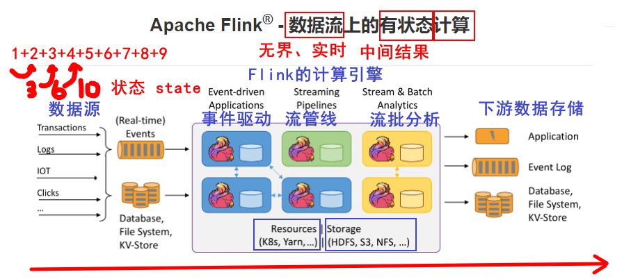
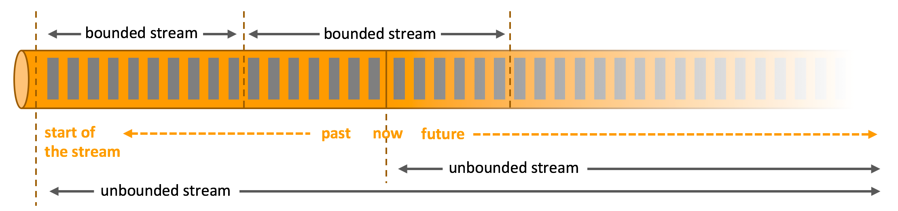
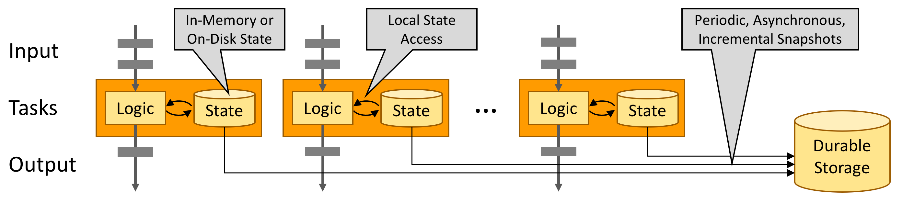
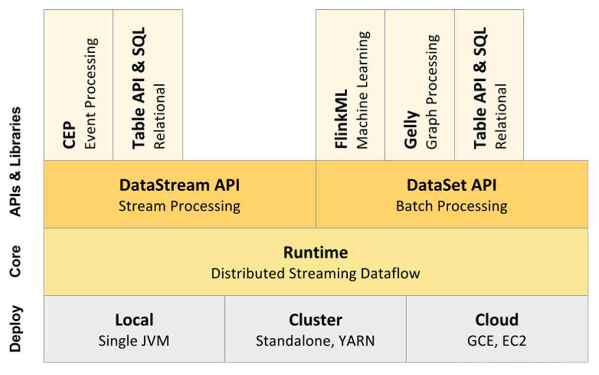
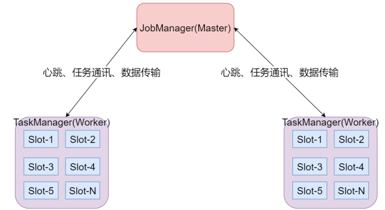
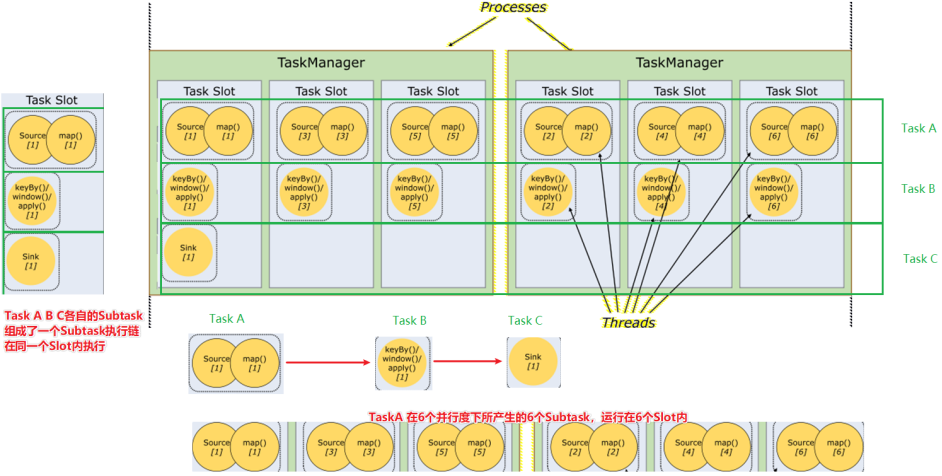
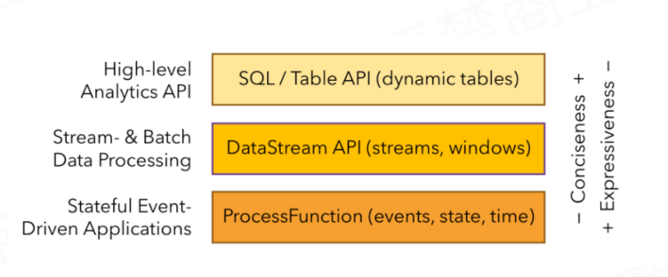

# Day1-Flink基础

## 今日目标

+ 【了解】- Flink基础的课程介绍
+ 【理解】- Flink的批处理和流处理的概念
+ 【了解】- Flink概述
+ 【理解】- Flink框架如何进行搭建和部署的
+ 【理解】- Flink的运行时架构
+ 【会用】- Flink的入门案例（DataStream API）流处理应用

## 课程介绍

## 批处理与流处理

### 知识点01：【了解】批处理和实时流处理的区别

- 批处理：对有界的数据进行处理就是批处理。

  > 有界的数据：明确定义了开始和结束。

- 实时流处理：对无界的数据流进行实时处理就是流处理。

  > 无界的数据流：可以认为有开始，没有结束，不知道何时会终止提供数据。

### 知识点02：【了解】批处理与流处理对比的特点

- 批处理程序的容错不使用检查点。因为数据有限，所以恢复可以通过“完全重播”（重新处理）来实现。这种处理方式会降低常规处理的成本，因为它可以避免检查点
- 批处理的特点是：有界、持久、大量，用于离线计算。
- 流处理的特点是：无界、实时、用于实时计算。

## Flink概述

### 知识点03：【理解】Flink官方简介

Apache Flink 是一个框架和分布式处理引擎，用于在**无边界和有边界数据流上进行有状态的计算**。Flink能在所有常见集群环境中运行，并能以内存速度和任意规模进行计算。

### 知识点04：【了解】处理无界和有界数据

任何类型的数据都可以形成一种事件流。信用卡交易、传感器测量、机器日志、网站或移动应用程序上的用户交互记录，所有这些数据都形成一种流。

数据可以被作为 无界 或者 有界 流来处理。

**Apache Flink 擅长处理无界和有界数据集**精确的时间控制和状态化使得 Flink 的运行时(runtime)能够运行任何处理无界流的应用。有界流则由一些专为固定大小数据集特殊设计的算法和数据结构进行内部处理，产生了出色的性能。

### 知识点05：【理解】部署应用到任意地方

Apache Flink 是一个分布式系统，它需要计算资源来执行应用程序。Flink 集成了所有常见的集群资源管理器，例如  **Hadoop YARN、 Kubernetes，但同时也可以作为 Standalone 独立集群运行**。

Flink 被设计为能够很好地工作在上述每个资源管理器中，这是通过资源管理器特定(resource-manager-specific)的部署模式实现的。Flink 可以采用与当前资源管理器相适应的方式进行交互。

### 知识点06：【了解】运行任意规模应用

Flink 旨在任意规模上运行有状态流式应用。因此，应用程序被并行化为可能数千个任务，这些任务分布在集群中并发执行。所以应用程序能够充分利用无尽的 CPU、内存、磁盘和网络 IO。而且 Flink 很容易维护非常大的应用程序状态。其异步和增量的检查点算法对处理延迟产生最小的影响，同时保证精确一次状态的一致性。

 Flink 用户报告了其生产环境中一些令人印象深刻的扩展性数字

- 处理每天处理数万亿的事件
- 应用维护几TB大小的状态

- 应用在数千个内核上运行

### 知识点07：【了解】利用内存性能

有状态的 Flink 程序针对本地状态访问进行了优化。任务的状态始终保留在内存中，如果状态大小超过可用内存，则会保存在能高效访问的磁盘数据结构中。任务通过访问本地（通常在内存中）状态来进行所有的计算，从而产生非常低的处理延迟。Flink 通过定期和异步地对本地状态进行持久化存储来保证故障场景下精确一次的状态一致性。

### 知识点08：【了解】Flink架构图

### 知识点09：【掌握】Flink的架构体系

目标：**掌握Flink集群的架构以及每个角色的功能**

- JobManager处理器：
  - **也称之为Master**，用于协调分布式执行，它们用来调度task，协调检查点，协调失败时恢复等。Flink运行时至少存在一个master处理器，如果配置高可用模式则会存在多个master处理器，它们其中有一个是leader，而其他的都是standby。
- TaskManager处理器：
  - **也称之为Worker**，用于执行一个dataflow的**task**(或者特殊的**subtask**)、数据缓冲和data stream的交换，Flink运行时至少会存在一个worker处理器。

- Slot 任务执行槽位：
  - 物理概念，一个TM(TaskManager)内会划分出多个Slot，1个Slot内最多**可以运行1个**Task(Subtask)或一组由Task(Subtask)组成的任务链。
  - 多个Slot之间会共享平分当前TM的内存空间
  - Slot是对一个TM的资源进行固定分配的工具，每个Slot在TM启动后，可以获得固定的资源
  - 比如1个TM是一个JVM进程，如果有6个Slot，那么这6个Slot平分这一个JVM进程的资源
  - 但是因为在同一个进程内，所以线程之间共享TCP连接、内存数据等，效率更高（Slot之间交流方便）

- Task：
  - 任务，每一个Flink的Job会根据情况（并行度、算子类型）将一个整体的Job划分为多个Task

- Subtask：
  - 子任务，一个Task可以由一个或者多个Subtask组成，一个Task有多少个Subtask取决于这个Task的并行度
  - 也就是，每一个Subtask就是当前Task任务并行的一个线程
  - 如，当前Task并行度为8，那么这个Task会有8个Subtask（8个线程并行执行这个Task）

- 并行度：
  - 并行度就是一个Task可以分成多少个Subtask并行执行的一个参数
  - 这个参数是动态的，可以在任务执行前进行分配，而非Slot分配，TM启动就固定了
  - 一个Task可以获得的最大并行度取决于整个Flink环境的可用Slot数量，也就是如果有8个Slot，那么最大并行度也就是8，**设置的再大也没有意义**

- 如下图：
  - 一个Job分为了3个Task来运行，分别是TaskA TaskB TaskC
  - 其中TaskA设置为了6个并行度，也就是TaskA可以有6个Subtask，如图可见，TaskA的6个Subtask各自在一个Slot内执行
  - 其中在Slot的时候说过，Slot可以运行由Task（或Subtask）组成的任务链，如图可见，最左边的Slot运行了TaskA TaskB TaskC 3个Task各自的1个Subtask组成的一个Subtask执行链

并行度是一个动态的概念，可以在多个地方设置==并行度==：

- 配置文件默认并行度：conf/flink-conf.yaml的parallelism.default
- 启动Flink任务，动态提交参数：比如：bin/flink run -p 3
- 在代码中设置全局并行度：env.setParallelism(3);　
- 针对每个算子进行单独设置：sum(1).setParallelism(3)

优先级别是什么样子呢？

+ 就近原则
+ 算子 > 代码全局 > 提交任务 > 配置文件中

### 知识点10：【掌握】Flink数据流编程模型

- 最顶层：SQL/Table API 提供了操作关系表、执行SQL语句分析的API库，供我们方便的开发SQL相关程序
- 中层：流和批处理API层，提供了一系列流和批处理的API和算子供我们对数据进行处理和分析
- 最底层：运行时层，提供了对Flink底层关键技术的操纵，如对Event、state、time、window等进行精细化控制的操作API

> 随着FlinkSQL的成熟，同时开发效率运维效率的考虑，企业越来越多的采用最顶层的FlinkSQL进行业务的开发，因此课程的讲解以FlinkSQL为主

### 知识点11：【扩展】Spark与Flink的区别

#### Flink 和 Spark 对比

通过前面的学习，我们了解到，Spark和Flink都支持批处理和流处理，接下来让我们对这两种流行的数据处理框架在各方面进行对比。首先，这两个数据处理框架有很多相同点：

- 基于内存的计算引擎
- 支持 Checkpoint 容错机制 和 Exactly-once 近义词语义，不多不少仅被有效处理一次
- 支持有效无环图的算子链，而且都支持 SQL 语义的操作

当然，它们的不同点也是相当明显，我们可以从4个不同的角度来看。

- 从流处理的角度来讲，Spark基于微批量处理，把流数据看成是一个个小的批处理数据块分别处理，所以延迟性只能做到秒级。而Flink基于每个事件处理，每当有新的数据输入都会立刻处理，是真正的流式计算，支持毫秒级计算。由于相同的原因，Spark只支持基于时间的窗口操作（处理时间或者事件时间），而Flink支持的窗口操作则非常灵活，不仅支持时间窗口，还支持基于数据本身的窗口，开发者可以自由定义想要的窗口操作。
- 从SQL 功能的角度来讲，Spark和Flink分别提供SparkSQL和Table APl提供SQL交互支持。两者相比较，Spark对SQL支持更好，相应的优化、扩展和性能更好，而Flink在SQL支持方面还有很大提升空间。
- 从迭代计算的角度来讲，Spark对机器学习的支持很好，因为可以在内存中缓存中间计算结果来加速机器学习算法的运行。但是大部分机器学习算法其实是一个有环的数据流，在Spark中，却是用无环图来表示。而Flink支持在运行时间中的有环数据流，从而可以更有效的对机器学习算法进行运算。

- 从相应的生态系统角度来讲，Spark 的社区无疑更加活跃。Spark可以说有着Apache旗下最多的开源贡献者，而且有很多不同的库来用在不同场景。而Flink由于较新，现阶段的开源社区不如Spark活跃，各种库的功能也不如Spark全面。但是Flink还在不断发展，各种功能也在逐渐完善。

#### 如何选择Spark和Flink

对于以下场景，你可以选择 Spark：

- 数据量非常大而且逻辑复杂的批数据处理，并且对计算效率有较高要求（比如用大数据分析来构建推荐系统进行个性化推荐、广告定点投放等）；
- 基于历史数据的交互式查询，要求响应较快；
- 基于实时数据流的数据处理，延迟性要求在在数百毫秒到数秒之间。

Spark完美满足这些场景的需求，而且它可以一站式解决这些问题，无需用别的数据处理平台。

由于Flink是为了提升流处理而创建的平台，所以它适用于各种需要非常低延迟（微秒到毫秒级）的实时数据处理场景，比如实时日志报表分析。而且Flink 用流处理去模拟批处理的思想，比Spark 用批处理去模拟流处理的思想扩展性更好。

总之，Apache Spark和Flink都是下一代大数据工具抢占业界关注的焦点。两者都提供与Hadoop和NoSQL数据库的本机连接，并且可以处理HDFS数据。两者都是几个大数据的好方法问题。但由于其底层架构，Flink比Spark更快。Apache Spark是Apache存储库中最活跃的组件。Spark拥有非常强大的社区支持，并且拥有大量的贡献者。Spark已经在生产中部署。但就流媒体功能而言，Flink远比Spark好（因为spark以微批量形式处理流）并且具有对流的本机支持。有人认为：Spark是大数据的3G，而Flink则被视为大数据的4G，该观点仅供参考即可。