# day02_Flink基础

## 今日目标

+ 【了解】- Flink基础的课程介绍
+ 【理解】- Flink的批处理和流处理的概念
+ 【了解】- Flink概述
+ 【理解】- Flink框架如何进行搭建和部署的
+ 【理解】- Flink的运行时架构
+ 【会用】- Flink的入门案例（DataStream API）流处理应用

## Flink的安装部署

Flink支持多种安装模式。

- local（**本地开发测试**）——本地模式
- standalone——独立模式，Flink自带集群，开发测试环境使用（**集群测试**）
- standaloneHA—独立集群高可用模式，Flink自带集群，开发测试环境使用（**略过**）
- yarn——计算资源统一由Hadoop YARN管理（**生产环境**）

###  Standalone - 伪分布环境（开发测试）

#### 知识点12：【理解】架构图

**目标**：**理解Standalone集群架构**

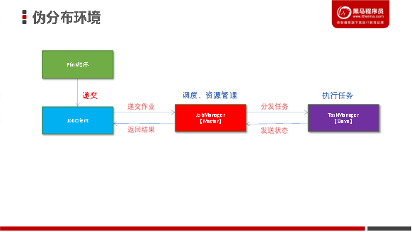

- Flink程序需要提交给**JobClient**

- JobClient将作业提交给**JobManager**

- JobManager负责协调资源分配和作业执行。 资源分配完成后，任务将提交给相应的**TaskManager**

- TaskManager启动一个线程以开始执行。TaskManager会向JobManager报告状态更改。例如开始执行，正在进行或已完成。 

- 作业执行完成后，结果将发送回客户端（JobClient）

#### 知识点13：【实现】Standalone集群部署

- **目标**：**实现Spark Standalone集群的部署**

- **实施**：

  - 下载Flink：[https://archive.apache.org/dist/flink/flink-1.15.2/flink-1.15.2-bin-scala_2.12.tgz](https://archive.apache.org/dist/flink/flink-1.15.0/flink-1.15.0-bin-scala_2.12.tgz)

  - 安装Flink

    - ~~~shell
      # 解压安装
      cd /export/software/
      tar -zxvf flink-1.15.2-bin-scala_2.12.tgz -C /export/server/
      # 构建软连接
      rm -rf flink
      ln -s /export/server/flink-1.15.2 /export/server/flink
      ~~~

  - 目录结构

    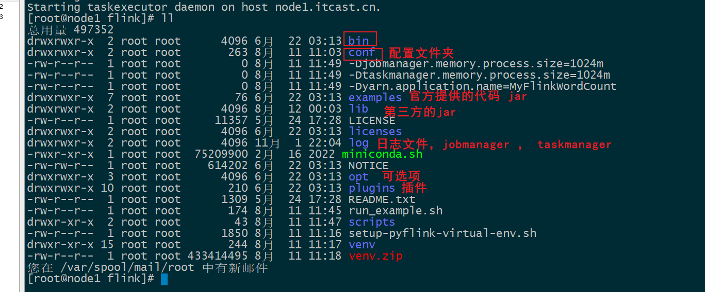

  - 修改**conf/flink-conf.yaml**配置文件

    - ~~~yaml
      #指定当前节点的slot数量
      taskmanager.numberOfTaskSlots: 4
      #设置checkpoint周期时间
      execution.checkpointing.interval: 5000
      #设置有且仅有一次模式 目前支持 EXACTLY_ONCE、AT_LEAST_ONCE        
      execution.checkpointing.mode: EXACTLY_ONCE
      #设置checkpoint的存储方式
      state.backend: filesystem
      #设置checkpoint的存储位置
      state.checkpoints.dir: hdfs://node1:8020/checkpoints
      #设置savepoint的存储位置
      state.savepoints.dir: hdfs://node1:8020/checkpoints
      #设置checkpoint的超时时间 即一次checkpoint必须在该时间内完成 不然就丢弃
      execution.checkpointing.timeout: 600000
      #设置两次checkpoint之间的最小时间间隔
      execution.checkpointing.min-pause: 500
      #设置并发checkpoint的数目
      execution.checkpointing.max-concurrent-checkpoints: 1
      #开启checkpoints的外部持久化这里设置了清除job时保留checkpoint，默认值时保留一个 假如要保留3个
      state.checkpoints.num-retained: 3
      #默认情况下，checkpoint不是持久化的，只用于从故障中恢复作业。当程序被取消时，它们会被删除。但是你可以配置checkpoint被周期性持久化到外部，类似于savepoints。这些外部的checkpoints将它们的元数据输出到外#部持久化存储并且当作业失败时不会自动清除。这样，如果你的工作失败了，你就会有一个checkpoint来恢复。
      #ExternalizedCheckpointCleanup模式配置当你取消作业时外部checkpoint会产生什么行为:
      #RETAIN_ON_CANCELLATION: 当作业被取消时，保留外部的checkpoint。注意，在此情况下，您必须手动清理checkpoint状态。
      #DELETE_ON_CANCELLATION: 当作业被取消时，删除外部化的checkpoint。只有当作业失败时，检查点状态才可用。
      execution.checkpointing.externalized-checkpoint-retention: RETAIN_ON_CANCELLATION
      # 该配置用于客户端 client 连接 Flink, 将此设置为 JobManager 运行的主机名(该配置决定WEB的地址)
      rest.address: node1
      # 客户端提供对外访问的地址和端口是rest.port和rest.address
      # 如果没有配置rest.bind-port, 那么其他服务也使用rest.port端口，所以只要使用其中一个启动模式，其他模式在启动时就会报错端口无法启动
      # 因此配置该项后, 其他 Job 启动后，就会在 rest.bind-address 和 rest.bind-port 随机选择并占用.
      rest.bind-address: node1
      classloader.check-leaked-classloader: false
      ~~~

  - 配置环境变量

    - ~~~shell
      vim /etc/profile
      FLINK_OPT_DIR=/export/server/flink-1.15.2/opt
      export FLINK_OPT_DIR=/export/server/flink-1.15.2/opt
      source /etc/profile
      ~~~

  - 启动Flink

    - ~~~shell
      bin/start-cluster.sh
      ~~~

  - 通过jps查看进程信息

    - 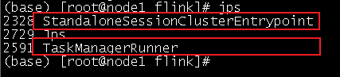

  - 访问web界面

    - http://node1:8081
    - 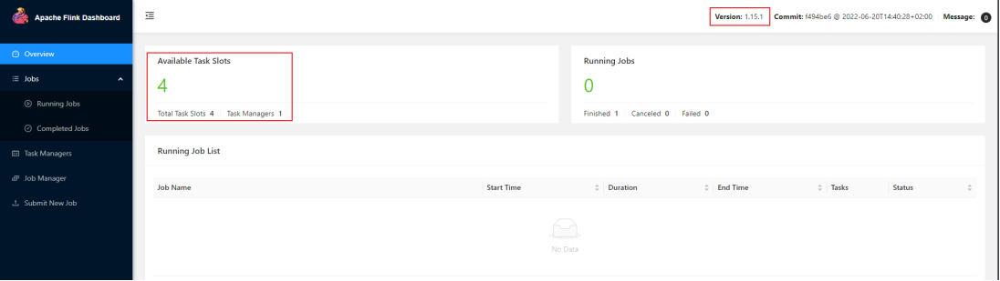

  - Flink集成Hadoop包

    - ~~~shell
      cd lib
      wget https://repository.cloudera.com/artifactory/cloudera-repos/org/apache/flink/flink-shaded-hadoop-3-uber/3.1.1.7.2.9.0-173-9.0/flink-shaded-hadoop-3-uber-3.1.1.7.2.9.0-173-9.0.jar
      ~~~

    - commons-cli-1.5.0.jar上传到lib目录下

    - 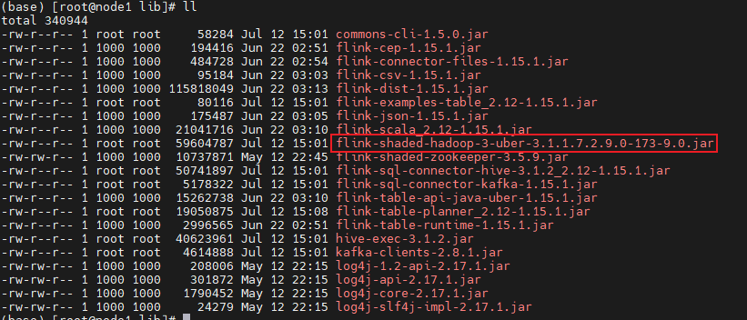

    

#### 知识点15：【实现】案例演示

- 运行测试任务

  - ~~~shell
    
    ~~~

- 观察WebUI

  - 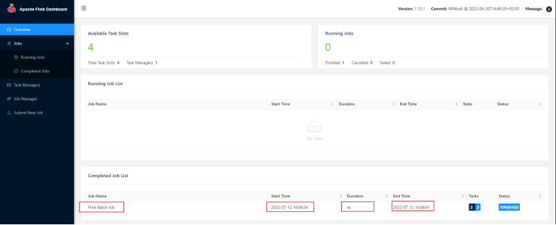

### yarn~集群环境（生产推荐）

#### 知识点16：【实现】环境准备

- 准备三台虚拟机

  - 服务器: node1(ResourceManager + NodeManager)
  - 服务器: node2(NodeManager)
  - 服务器: node3(NodeManager)

- 至少**hadoop2.2**

- hdfs & yarn均启动

- 修改hadoop的配置参数：**在node1服务器操作**

  - **vim** etc**/**hadoop**/**yarn-site.xml

    - ~~~xml
      <property>
          <name>yarn.nodemanager.vmem-check-enabled</name>
          <value>false</value>
      </property>
      <property>
        <name>yarn.resourcemanager.am.max-attempts</name>
        <value>5</value>
        <description>
          The maximum number of application master execution attempts.
        </description>
      </property>
      ~~~

- 分发yarn-site.xml到其它服务器节点

  - ~~~shell
    scp yarn-site.xml node2:$PWD
    scp yarn-site.xml node3:$PWD
    ~~~

- 重新启动HDFS、YARN集群

  - ~~~shell
    start-all.sh
    ~~~

#### 知识点17：【实现】准备 YARN 环境

- 

#### 知识点18：【理解】Yarn的三种部署方式

##### Session模式

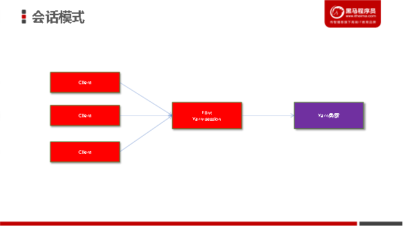

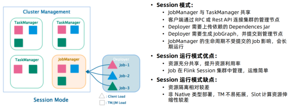

- 特点：需要事先申请资源，使用Flink中的yarn-session（yarn客户端），启动JobManager和TaskManger

- 优点：不需要每次递交作业申请资源，而是使用已经申请好的资源，从而提高执行效率

- 缺点：作业执行完成以后，资源不会被释放，因此一直会占用系统资源

- 应用场景：适合作业递交比较频繁的场景，小作业比较多的场景

##### Per-Job模式

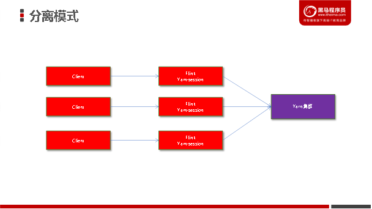

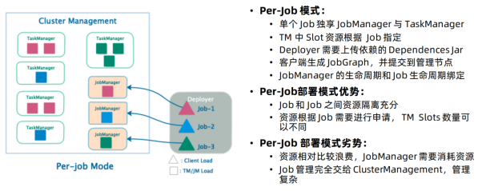

- 特点：每次递交作业都需要申请一次资源

- 优点：作业运行完成，资源会立刻被释放，不会一直占用系统资源

- 缺点：每次递交作业都需要申请资源，会影响执行效率，因为申请资源需要消耗时间

- 应用场景：适合作业比较少的场景、大作业的场景

##### application模式

- 背景：**flink-1.11** 引入了一种新的部署模式，即 Application 模式。目前，flink-1.11 已经可以支持基于 Yarn 和 Kubernetes 的 Application 模式。
- 优势：
  - 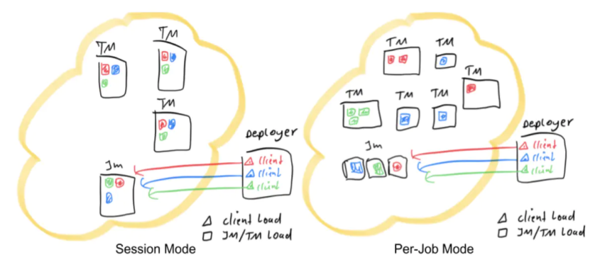
    - Session模式：所有作业共享集群资源，隔离性差，JM 负载瓶颈，main 方法在客户端执行。
    - Per-Job模式：每个作业单独启动集群，隔离性好，JM 负载均衡，main 方法在客户端执行。
    - 通过以上两种模式的特点描述，可以看出，main方法都是在客户端执行，社区考虑到在客户端执行 main() 方法来获取 flink 运行时所需的依赖项，并生成 JobGraph，提交到集群的操作都会在实时平台所在的机器上执行，那么将会给服务器造成很大的压力。尤其在大量用户共享客户端时，问题更加突出。
    - 因此，社区提出新的部署方式 Application 模式解决该问题。
  - 原理
    - 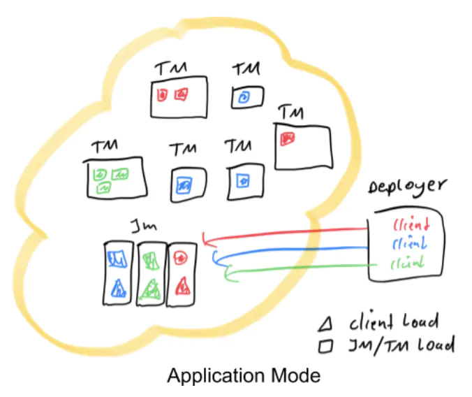
    - Application 模式下，用户程序的 main 方法将在集群中而不是客户端运行，用户将程序逻辑和依赖打包进一个可执行的 jar 包里，集群的入口程序 (ApplicationClusterEntryPoint) 负责调用其中的 main 方法来生成 JobGraph。Application 模式为每个提交的应用程序创建一个集群，该集群可以看作是在特定应用程序的作业之间共享的会话集群，并在应用程序完成时终止。在这种体系结构中，Application 模式在不同应用之间提供了资源隔离和负载平衡保证。在特定一个应用程序上，JobManager 执行 main() 可以节省所需的 CPU 周期，还可以节省本地下载依赖项所需的带宽。

#### 知识点19：【实现】Yarn的三种部署方式演示

##### Pre-Job 模式部署作业

执行以下命令，以 Pre-Job 模式部署 PyFlink 作业：

~~~shell

~~~

输入日志：

~~~
(base) [root@node1 flink-1.15.2]# bin/flink run -m yarn-cluster -pyarch venv.zip -pyexec venv.zip/venv/bin/python3.8 -py examples/python/datastream/word_count.py
WARNING: An illegal reflective access operation has occurred
WARNING: Illegal reflective access by org.apache.flink.api.java.ClosureCleaner (file:/export/server/flink-1.15.2/lib/flink-dist-1.15.2.jar) to field java.lang.String.value
WARNING: Please consider reporting this to the maintainers of org.apache.flink.api.java.ClosureCleaner
WARNING: Use --illegal-access=warn to enable warnings of further illegal reflective access operations
WARNING: All illegal access operations will be denied in a future release
2022-07-12 17:55:39,307 WARN  org.apache.flink.yarn.configuration.YarnLogConfigUtil        [] - The configuration directory ('/export/server/flink-1.15.2/conf') already contains a LOG4J config file.If you want to use logback, then please delete or rename the log configuration file.
2022-07-12 17:55:39,367 INFO  org.apache.hadoop.yarn.client.RMProxy                        [] - Connecting to ResourceManager at node1/192.168.88.161:8032
2022-07-12 17:55:39,528 INFO  org.apache.flink.yarn.YarnClusterDescriptor                  [] - No path for the flink jar passed. Using the location of class org.apache.flink.yarn.YarnClusterDescriptor to locate the jar
2022-07-12 17:55:39,537 WARN  org.apache.flink.yarn.YarnClusterDescriptor                  [] - Job Clusters are deprecated since Flink 1.15. Please use an Application Cluster/Application Mode instead.
2022-07-12 17:55:39,675 INFO  org.apache.hadoop.conf.Configuration                         [] - resource-types.xml not found
2022-07-12 17:55:39,685 INFO  org.apache.hadoop.yarn.util.resource.ResourceUtils           [] - Unable to find 'resource-types.xml'.
2022-07-12 17:55:39,797 INFO  org.apache.flink.yarn.YarnClusterDescriptor                  [] - The configured JobManager memory is 1600 MB. YARN will allocate 2048 MB to make up an integer multiple of its minimum allocation memory (1024 MB, configured via 'yarn.scheduler.minimum-allocation-mb'). The extra 448 MB may not be used by Flink.
2022-07-12 17:55:39,797 INFO  org.apache.flink.yarn.YarnClusterDescriptor                  [] - The configured TaskManager memory is 1728 MB. YARN will allocate 2048 MB to make up an integer multiple of its minimum allocation memory (1024 MB, configured via 'yarn.scheduler.minimum-allocation-mb'). The extra 320 MB may not be used by Flink.
2022-07-12 17:55:39,797 INFO  org.apache.flink.yarn.YarnClusterDescriptor                  [] - Cluster specification: ClusterSpecification{masterMemoryMB=1600, taskManagerMemoryMB=1728, slotsPerTaskManager=4}
2022-07-12 17:55:47,166 INFO  org.apache.flink.yarn.YarnClusterDescriptor                  [] - Removing 'localhost' Key: 'jobmanager.bind-host' , default: null (fallback keys: []) setting from effective configuration; using '0.0.0.0' instead.
2022-07-12 17:55:47,167 INFO  org.apache.flink.yarn.YarnClusterDescriptor                  [] - Removing 'localhost' Key: 'taskmanager.bind-host' , default: null (fallback keys: []) setting from effective configuration; using '0.0.0.0' instead.
2022-07-12 17:55:47,200 INFO  org.apache.flink.yarn.YarnClusterDescriptor                  [] - Submitting application master application_1657619193120_0002
2022-07-12 17:55:47,223 INFO  org.apache.hadoop.yarn.client.api.impl.YarnClientImpl        [] - Submitted application application_1657619193120_0002
2022-07-12 17:55:47,223 INFO  org.apache.flink.yarn.YarnClusterDescriptor                  [] - Waiting for the cluster to be allocated
2022-07-12 17:55:47,226 INFO  org.apache.flink.yarn.YarnClusterDescriptor                  [] - Deploying cluster, current state ACCEPTED
2022-07-12 17:55:59,078 INFO  org.apache.flink.yarn.YarnClusterDescriptor                  [] - YARN application has been deployed successfully.
2022-07-12 17:55:59,079 INFO  org.apache.flink.yarn.YarnClusterDescriptor                  [] - Found Web Interface node2:38614 of application 'application_1657619193120_0002'.
Job has been submitted with JobID d3517431b2791185e3fad73878d555af
Program execution finished
Job with JobID d3517431b2791185e3fad73878d555af has finished.
Job Runtime: 37703 ms

Executing word_count example with default input data set.
Use --input to specify file input.
Printing result to stdout. Use --output to specify output path.
~~~

上面信息已经显示运行完成，在 Web 界面可以看到作业状态：

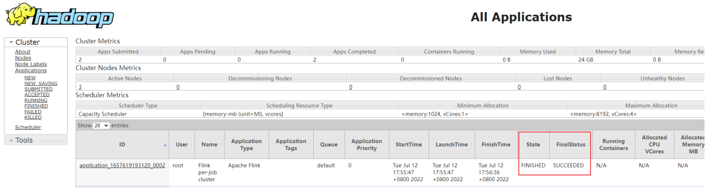

到这里，我们以 Pre-Job 的方式成功部署了 PyFlink 的作业！相比提交到本地 Standalone 集群，多了三个参数，我们简单说明如下：

| **参数**                         | **说明**                                                     |
| -------------------------------- | ------------------------------------------------------------ |
| -m yarn-cluster                  | yarn-session.sh(开辟资源)+flink run(提交任务)以 Per-Job 模式部署到 yarn 集群 |
| -pyarch venv.zip                 | 将当前目录下的 venv.zip 上传到 yarn 集群                     |
| -pyexec venv.zip/venv/bin/Python | 指定 venv.zip 中的 Python 解释器来执行 Python UDF，路径需要和 zip 包内部结构一致。 |

##### Session 模式部署作业

以 Session 模式部署作业也非常简单，操作一下：

~~~
(base) [root@node1 flink-1.15.2]# bin/yarn-session.sh
2022-07-12 18:09:27,123 INFO  org.apache.flink.configuration.GlobalConfiguration           [] - Loading configuration property: jobmanager.rpc.address, localhost
2022-07-12 18:09:27,125 INFO  org.apache.flink.configuration.GlobalConfiguration           [] - Loading configuration property: jobmanager.rpc.port, 6123
2022-07-12 18:09:27,126 INFO  org.apache.flink.configuration.GlobalConfiguration           [] - Loading configuration property: jobmanager.bind-host, localhost
2022-07-12 18:09:27,126 INFO  org.apache.flink.configuration.GlobalConfiguration           [] - Loading configuration property: jobmanager.memory.process.size, 1600m
2022-07-12 18:09:27,126 INFO  org.apache.flink.configuration.GlobalConfiguration           [] - Loading configuration property: taskmanager.bind-host, localhost
2022-07-12 18:09:27,126 INFO  org.apache.flink.configuration.GlobalConfiguration           [] - Loading configuration property: taskmanager.host, localhost
2022-07-12 18:09:27,126 INFO  org.apache.flink.configuration.GlobalConfiguration           [] - Loading configuration property: taskmanager.memory.process.size, 1728m
2022-07-12 18:09:27,126 INFO  org.apache.flink.configuration.GlobalConfiguration           [] - Loading configuration property: taskmanager.numberOfTaskSlots, 4
2022-07-12 18:09:27,126 INFO  org.apache.flink.configuration.GlobalConfiguration           [] - Loading configuration property: parallelism.default, 1
2022-07-12 18:09:27,126 INFO  org.apache.flink.configuration.GlobalConfiguration           [] - Loading configuration property: execution.checkpointing.interval, 5000
2022-07-12 18:09:27,126 INFO  org.apache.flink.configuration.GlobalConfiguration           [] - Loading configuration property: execution.checkpointing.mode, EXACTLY_ONCE
2022-07-12 18:09:27,127 INFO  org.apache.flink.configuration.GlobalConfiguration           [] - Loading configuration property: state.backend, filesystem
2022-07-12 18:09:27,127 INFO  org.apache.flink.configuration.GlobalConfiguration           [] - Loading configuration property: state.checkpoints.dir, hdfs://node1:8020/checkpoints
2022-07-12 18:09:27,127 INFO  org.apache.flink.configuration.GlobalConfiguration           [] - Loading configuration property: state.savepoints.dir, hdfs://node1:8020/checkpoints
2022-07-12 18:09:27,127 INFO  org.apache.flink.configuration.GlobalConfiguration           [] - Loading configuration property: execution.checkpointing.timeout, 600000
2022-07-12 18:09:27,127 INFO  org.apache.flink.configuration.GlobalConfiguration           [] - Loading configuration property: execution.checkpointing.min-pause, 500
2022-07-12 18:09:27,127 INFO  org.apache.flink.configuration.GlobalConfiguration           [] - Loading configuration property: execution.checkpointing.max-concurrent-checkpoints, 1
2022-07-12 18:09:27,127 INFO  org.apache.flink.configuration.GlobalConfiguration           [] - Loading configuration property: state.checkpoints.num-retained, 3
2022-07-12 18:09:27,127 INFO  org.apache.flink.configuration.GlobalConfiguration           [] - Loading configuration property: execution.checkpointing.externalized-checkpoint-retention, RETAIN_ON_CANCELLATION
2022-07-12 18:09:27,127 INFO  org.apache.flink.configuration.GlobalConfiguration           [] - Loading configuration property: state.backend, hashmap
2022-07-12 18:09:27,128 INFO  org.apache.flink.configuration.GlobalConfiguration           [] - Loading configuration property: state.checkpoint-storage, jobmanager
2022-07-12 18:09:27,128 INFO  org.apache.flink.configuration.GlobalConfiguration           [] - Loading configuration property: restart-strategy, fixed-delay
2022-07-12 18:09:27,128 INFO  org.apache.flink.configuration.GlobalConfiguration           [] - Loading configuration property: restart-strategy.fixed-delay.attempts, 3
2022-07-12 18:09:27,128 INFO  org.apache.flink.configuration.GlobalConfiguration           [] - Loading configuration property: restart-strategy.fixed-delay.delay, 10 s
2022-07-12 18:09:27,128 INFO  org.apache.flink.configuration.GlobalConfiguration           [] - Loading configuration property: jobmanager.execution.failover-strategy, region
2022-07-12 18:09:27,128 INFO  org.apache.flink.configuration.GlobalConfiguration           [] - Loading configuration property: rest.address, node1
2022-07-12 18:09:27,128 INFO  org.apache.flink.configuration.GlobalConfiguration           [] - Loading configuration property: rest.bind-address, node1
2022-07-12 18:09:27,129 INFO  org.apache.flink.configuration.GlobalConfiguration           [] - Loading configuration property: classloader.check-leaked-classloader, false
2022-07-12 18:09:27,295 WARN  org.apache.hadoop.util.NativeCodeLoader                      [] - Unable to load native-hadoop library for your platform... using builtin-java classes where applicable
2022-07-12 18:09:27,424 INFO  org.apache.flink.runtime.security.modules.HadoopModule       [] - Hadoop user set to root (auth:SIMPLE)
2022-07-12 18:09:27,433 INFO  org.apache.flink.runtime.security.modules.JaasModule         [] - Jaas file will be created as /tmp/jaas-12574813724942792954.conf.
2022-07-12 18:09:27,453 WARN  org.apache.flink.yarn.configuration.YarnLogConfigUtil        [] - The configuration directory ('/export/server/flink-1.15.2/conf') already contains a LOG4J config file.If you want to use logback, then please delete or rename the log configuration file.
2022-07-12 18:09:27,502 INFO  org.apache.hadoop.yarn.client.RMProxy                        [] - Connecting to ResourceManager at node1/192.168.88.161:8032
2022-07-12 18:09:27,596 INFO  org.apache.flink.runtime.util.config.memory.ProcessMemoryUtils [] - The derived from fraction jvm overhead memory (160.000mb (167772162 bytes)) is less than its min value 192.000mb (201326592 bytes), min value will be used instead
2022-07-12 18:09:27,604 INFO  org.apache.flink.runtime.util.config.memory.ProcessMemoryUtils [] - The derived from fraction jvm overhead memory (172.800mb (181193935 bytes)) is less than its min value 192.000mb (201326592 bytes), min value will be used instead
2022-07-12 18:09:27,690 INFO  org.apache.hadoop.conf.Configuration                         [] - resource-types.xml not found
2022-07-12 18:09:27,690 INFO  org.apache.hadoop.yarn.util.resource.ResourceUtils           [] - Unable to find 'resource-types.xml'.
2022-07-12 18:09:27,727 INFO  org.apache.flink.yarn.YarnClusterDescriptor                  [] - The configured JobManager memory is 1600 MB. YARN will allocate 2048 MB to make up an integer multiple of its minimum allocation memory (1024 MB, configured via 'yarn.scheduler.minimum-allocation-mb'). The extra 448 MB may not be used by Flink.
2022-07-12 18:09:27,728 INFO  org.apache.flink.yarn.YarnClusterDescriptor                  [] - The configured TaskManager memory is 1728 MB. YARN will allocate 2048 MB to make up an integer multiple of its minimum allocation memory (1024 MB, configured via 'yarn.scheduler.minimum-allocation-mb'). The extra 320 MB may not be used by Flink.
2022-07-12 18:09:27,728 INFO  org.apache.flink.yarn.YarnClusterDescriptor                  [] - Cluster specification: ClusterSpecification{masterMemoryMB=1600, taskManagerMemoryMB=1728, slotsPerTaskManager=4}
2022-07-12 18:09:31,077 INFO  org.apache.flink.yarn.YarnClusterDescriptor                  [] - Removing 'localhost' Key: 'jobmanager.bind-host' , default: null (fallback keys: []) setting from effective configuration; using '0.0.0.0' instead.
2022-07-12 18:09:31,078 INFO  org.apache.flink.yarn.YarnClusterDescriptor                  [] - Removing 'localhost' Key: 'taskmanager.bind-host' , default: null (fallback keys: []) setting from effective configuration; using '0.0.0.0' instead.
2022-07-12 18:09:31,119 INFO  org.apache.flink.runtime.util.config.memory.ProcessMemoryUtils [] - The derived from fraction jvm overhead memory (160.000mb (167772162 bytes)) is less than its min value 192.000mb (201326592 bytes), min value will be used instead
2022-07-12 18:09:31,128 INFO  org.apache.flink.yarn.YarnClusterDescriptor                  [] - Submitting application master application_1657619193120_0003
2022-07-12 18:09:31,149 INFO  org.apache.hadoop.yarn.client.api.impl.YarnClientImpl        [] - Submitted application application_1657619193120_0003
2022-07-12 18:09:31,149 INFO  org.apache.flink.yarn.YarnClusterDescriptor                  [] - Waiting for the cluster to be allocated
2022-07-12 18:09:31,154 INFO  org.apache.flink.yarn.YarnClusterDescriptor                  [] - Deploying cluster, current state ACCEPTED
2022-07-12 18:09:35,692 INFO  org.apache.flink.yarn.YarnClusterDescriptor                  [] - YARN application has been deployed successfully.
2022-07-12 18:09:35,692 INFO  org.apache.flink.yarn.YarnClusterDescriptor                  [] - Found Web Interface node3:39477 of application 'application_1657619193120_0003'.
JobManager Web Interface: http://node3:39477
~~~

执行成功后不会返回，但会启动一个 JoBManager Web，地址如上[**http://node3:39477**]，可复制到浏览器查看](http://localhost:62247，可复制到浏览器查看/):

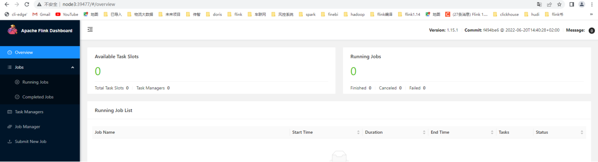

我们可以修改 conf/flink-conf.yaml 中的配置参数。如果要更改某些内容，请参考官方文档。接下来我们提交作业，首先按组合键 ***\*Ctrl+Z\**** 将 yarn-session.sh 进程切换到后台，并执行 bg 指令让其在后台继续执行, 然后执行以下命令，即可向 Session 模式的 Flink 集群提交 job ：

~~~
(base) [root@node1 flink-1.15.2]# bin/flink run -t yarn-session -Dyarn.application.id=application_1657619193120_0003 -pyarch venv.zip -pyexec venv.zip/venv/bin/python3.8 -py examples/python/datastream/word_count.py
2022-07-12 18:16:21,703 INFO  org.apache.flink.yarn.cli.FlinkYarnSessionCli                [] - Found Yarn properties file under /tmp/.yarn-properties-root.
2022-07-12 18:16:21,703 INFO  org.apache.flink.yarn.cli.FlinkYarnSessionCli                [] - Found Yarn properties file under /tmp/.yarn-properties-root.
WARNING: An illegal reflective access operation has occurred
WARNING: Illegal reflective access by org.apache.flink.api.java.ClosureCleaner (file:/export/server/flink-1.15.2/lib/flink-dist-1.15.2.jar) to field java.lang.String.value
WARNING: Please consider reporting this to the maintainers of org.apache.flink.api.java.ClosureCleaner
WARNING: Use --illegal-access=warn to enable warnings of further illegal reflective access operations
WARNING: All illegal access operations will be denied in a future release
2022-07-12 18:16:22,620 WARN  org.apache.flink.yarn.configuration.YarnLogConfigUtil        [] - The configuration directory ('/export/server/flink-1.15.2/conf') already contains a LOG4J config file.If you want to use logback, then please delete or rename the log configuration file.
2022-07-12 18:16:22,680 INFO  org.apache.hadoop.yarn.client.RMProxy                        [] - Connecting to ResourceManager at node1/192.168.88.161:8032
2022-07-12 18:16:22,764 INFO  org.apache.flink.yarn.YarnClusterDescriptor                  [] - No path for the flink jar passed. Using the location of class org.apache.flink.yarn.YarnClusterDescriptor to locate the jar
2022-07-12 18:16:22,839 INFO  org.apache.flink.yarn.YarnClusterDescriptor                  [] - Found Web Interface node3:39477 of application 'application_1657619193120_0003'.
Job has been submitted with JobID f1da08c8b4fa6a0ae3948fa2df51dc94
~~~

如果在打印 finished 之前查看之前的 web 页面，我们会发现 Session 集群会有一个正确运行的作业，如下：

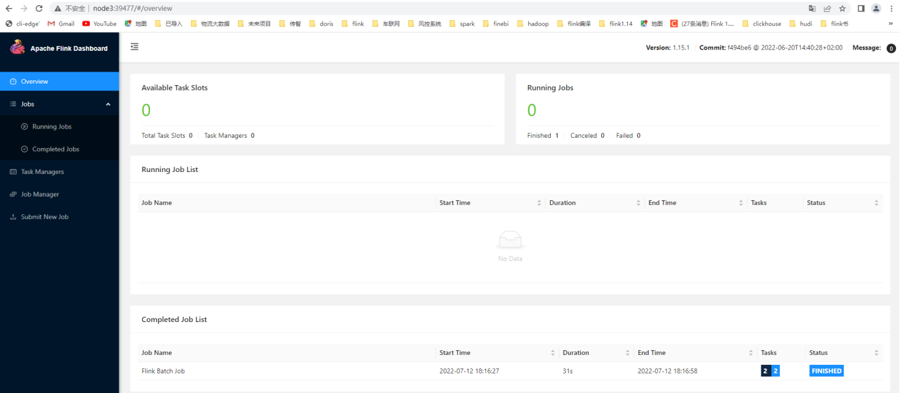

执行完毕后，别忘了关闭 yarn-session.sh（session 模式）：

~~~
yarn application -kill application_1657619193120_0003
~~~

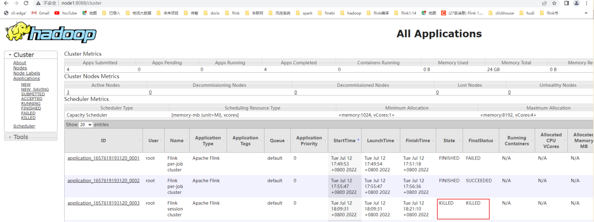

##### Application 模式部署作业

在该模式下需要将被执行的python文件和虚拟环境放到同一个目录下：

~~~shell
(base) [root@node1 flink-1.15.2]# mkdir scripts
(base) [root@node1 flink-1.15.2]# cp examples/python/datastream/word_count.py scripts/
(base) [root@node1 flink-1.15.2]# cp venv.zip scripts/
~~~

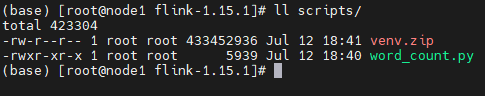

操作如下：

~~~
(base) [root@node1 flink-1.15.2]# ./bin/flink run-application -t yarn-application \
> -Djobmanager.memory.process.size=1024m \
> -Dtaskmanager.memory.process.size=1024m \
> -Dyarn.application.name="MyFlinkWordCount" \
> -Dyarn.ship-files=/export/server/flink-1.15.2/scripts \
> -pyarch scripts/venv.zip \
> -pyclientexec venv.zip/venv/bin/python3.8 \
> -pyexec venv.zip/venv/bin/python3.8 \
> -pyfs scripts/word_count.py \
> -pym word_count \
> --output hdfs://node1:8020/wordcount/output_52
2022-07-12 18:41:58,982 INFO  org.apache.flink.yarn.cli.FlinkYarnSessionCli                [] - Found Yarn properties file under /tmp/.yarn-properties-root.
2022-07-12 18:41:58,982 INFO  org.apache.flink.yarn.cli.FlinkYarnSessionCli                [] - Found Yarn properties file under /tmp/.yarn-properties-root.
2022-07-12 18:41:59,113 WARN  org.apache.flink.yarn.configuration.YarnLogConfigUtil        [] - The configuration directory ('/export/server/flink-1.15.2/conf') already contains a LOG4J config file.If you want to use logback, then please delete or rename the log configuration file.
2022-07-12 18:41:59,184 INFO  org.apache.hadoop.yarn.client.RMProxy                        [] - Connecting to ResourceManager at node1/192.168.88.161:8032
2022-07-12 18:41:59,268 INFO  org.apache.flink.yarn.YarnClusterDescriptor                  [] - No path for the flink jar passed. Using the location of class org.apache.flink.yarn.YarnClusterDescriptor to locate the jar
2022-07-12 18:41:59,361 INFO  org.apache.hadoop.conf.Configuration                         [] - resource-types.xml not found
2022-07-12 18:41:59,361 INFO  org.apache.hadoop.yarn.util.resource.ResourceUtils           [] - Unable to find 'resource-types.xml'.
2022-07-12 18:41:59,386 INFO  org.apache.flink.yarn.YarnClusterDescriptor                  [] - Cluster specification: ClusterSpecification{masterMemoryMB=1024, taskManagerMemoryMB=1024, slotsPerTaskManager=4}
2022-07-12 18:42:07,545 INFO  org.apache.flink.yarn.YarnClusterDescriptor                  [] - Removing 'localhost' Key: 'jobmanager.bind-host' , default: null (fallback keys: []) setting from effective configuration; using '0.0.0.0' instead.
2022-07-12 18:42:07,546 INFO  org.apache.flink.yarn.YarnClusterDescriptor                  [] - Removing 'localhost' Key: 'taskmanager.bind-host' , default: null (fallback keys: []) setting from effective configuration; using '0.0.0.0' instead.
2022-07-12 18:42:07,584 INFO  org.apache.flink.yarn.YarnClusterDescriptor                  [] - Submitting application master application_1657619193120_0008
2022-07-12 18:42:07,605 INFO  org.apache.hadoop.yarn.client.api.impl.YarnClientImpl        [] - Submitted application application_1657619193120_0008
2022-07-12 18:42:07,606 INFO  org.apache.flink.yarn.YarnClusterDescriptor                  [] - Waiting for the cluster to be allocated
2022-07-12 18:42:07,607 INFO  org.apache.flink.yarn.YarnClusterDescriptor                  [] - Deploying cluster, current state ACCEPTED
2022-07-12 18:42:13,395 INFO  org.apache.flink.yarn.YarnClusterDescriptor                  [] - YARN application has been deployed successfully.
2022-07-12 18:42:13,396 INFO  org.apache.flink.yarn.YarnClusterDescriptor                  [] - Found Web Interface node3:35217 of application 'application_1657619193120_0008'.
~~~

上面信息已经显示运行完成，在 Web 界面可以看到作业状态：

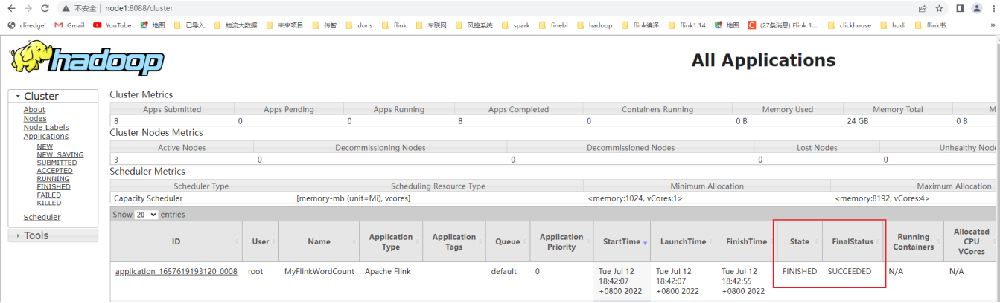

> 如果使用的是flink on yarn方式，想切换回standalone模式的话，需要删除文件：【/tmp/.yarn-properties-root】
>
> 因为默认查找当前yarn集群中已有的yarn-session信息中的jobmanager
>
> 如果是分离模式运行的YARN\JOB后，其运行完成会自动删除这个文件
>
> 但是会话模式的话，如果是kill掉任务，其不会执行自动删除这个文件的步骤，所以需要我们手动删除这个文件。

## Flink的入门案例

### 知识点20：【实现】创建Flink项目

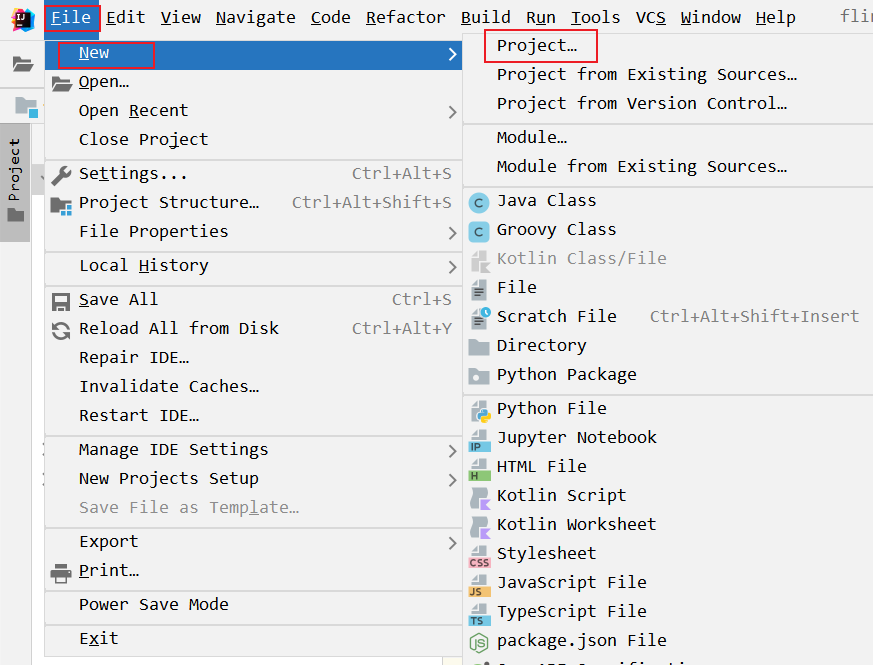

+ 有了这些信息我们就可以进行Flink的作业开发了。

### 知识点22：【实现】流处理的入门案例

#### 准备工作

- 在node1节点安装netcat工具

  ~~~shell
  yum install -y nc
  ~~~

- 将**flink-examples-table_2.12-1.15.2.jar**的jar包拷贝到指定目录

  ~~~txt
  如：D:/workspace/pyflink_study/libs/
  ~~~

- 启动netcat监听的端口号

  ~~~shell
  nc -lk 9999
  ~~~

  

#### 基于DataStreamAPI编程

~~~java
package cn.itcast.flink.base;

import org.apache.flink.api.common.functions.FlatMapFunction;
import org.apache.flink.api.java.functions.KeySelector;
import org.apache.flink.api.java.tuple.Tuple2;
import org.apache.flink.streaming.api.datastream.DataStreamSource;
import org.apache.flink.streaming.api.datastream.SingleOutputStreamOperator;
import org.apache.flink.streaming.api.environment.StreamExecutionEnvironment;
import org.apache.flink.util.Collector;

/**
 * Author itcast
 * Date 2022/11/3 21:41
 * Desc 需求 - 根据nc客户端输入的值，根据空格进行分割，并进行单词的统计打印
 */
public class WordCountByNetcat {
    public static void main(String[] args) throws Exception {
        /**
         * 创建环境
         * 1.创建流执行环境，StreamExecutionEnvironment 实例
         * 2.设置并行度及相关参数
         * source
         * 3.读取 socket 数据源，需要启动 nc
         * transformation
         * 4.对单词进行拆分，通过空格进行拆分
         * 5.将数组的集合压扁成 flatMap
         * 6.根据单词进行分流 keyBy
         * 7.进行累加求和
         * sink
         * 8.打印结果输出
         * 10.执行流环境
         */
        //创建环境
        //1.创建流执行环境，StreamExecutionEnvironment 实例
        StreamExecutionEnvironment env = StreamExecutionEnvironment.getExecutionEnvironment();
        //2.设置并行度及相关参数
        env.setParallelism(1);
        //source
        //3.读取 socket 数据源，需要启动 nc
        DataStreamSource<String> source = env.socketTextStream("node1", 9999);
        //transformation
        //4.对单词进行拆分，通过空格进行拆分,5.将数组的集合压扁成 flatMap
        // this is an apple  =>
        // this     1
        // is       1
        // an       1
        // apple    1
        SingleOutputStreamOperator<Tuple2<String, Integer>> flatMapDataStream = source.flatMap(new FlatMapFunction<String, Tuple2<String, Integer>>() {
            @Override
            public void flatMap(String value, Collector<Tuple2<String, Integer>> out) throws Exception {
                if (value != null) {
                    String[] words = value.split(" ");
                    //遍历这些单词
                    for (String word : words) {
                        out.collect(Tuple2.of(word,1));
                    }
                }
            }
        });

        //6.根据单词进行分流 keyBy
        // this     1
        // is       1      =>  this  is  an  apple
        // an       1
        // apple    1
        flatMapDataStream.keyBy(new KeySelector<Tuple2<String, Integer>, String>() {
            @Override
            public String getKey(Tuple2<String, Integer> value) throws Exception {
                return value.f0;
            }
        })
        //7.进行累加求和
                .sum(1)
        //sink
        //8.打印结果输出
                .print();
        //10.执行流环境
        env.execute("wordcount");
    }
}

~~~

#### 基于TableAPI编程

~~~python

~~~

#### 基于SQL编程

~~~python

~~~

