# day3-Flink基础

## 今日目标

+ 【理解】- 流处理的入门案例
+ 【掌握】- SQLClient工具的使用
+ 【理解】- Flink的运行时架构

## 问题解答

+ 创建 java 类，不能运行，提示让 setup JDK

  ① 在 目录下 找到 jdk-11-window 安装安装

  ~~~shell
  \初始化资料\JDK 安装包\
  
  jdk-11.0.12_windows-x64_bin.exe
  ~~~

  ② c:/java/jdk-1.8

  ③ 配置环境变量（可选）

  ④ 创建 java 程序

  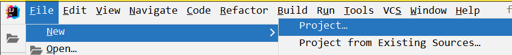

  ⑤ 项目已经创建完毕，需要配置 JDK-1.11

  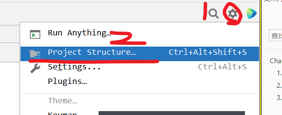

  ⑥ 需要使用 jdk11 为之前的项目创建编译语言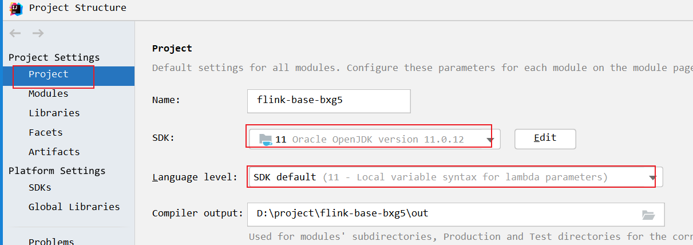

+ 无法下载 nc ，可以修复一下 repo 列表，如果下载软件慢或者镜像找不到，可以尝试修改资源目录

  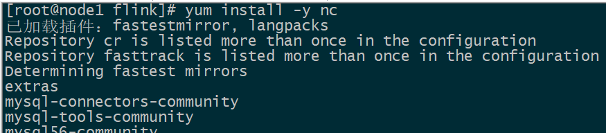

  ~~~shell
  /etc/yum.repos.d 
  CentOS-Base.repo
  
  yum clean all
  yum makecache fast
  ~~~

  

+ Java DataStream 实现 Wordcount 案例，SocketTextStream("node1",9999) ,  报错信息 Connection refused ，连接错误

  是没有启动 nc

  nc -lk 9999

  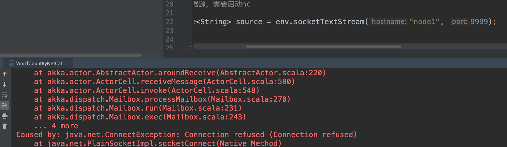

+ Flink 连接 Hadoop 的 jar 包,

  将连接 hadoop hdfs 的 jar 包上传到 $FLINK_HOME/lib 下之后，重新启动 Flink集群，通过 bin/stop-cluster .sh bin/start-cluster.sh

  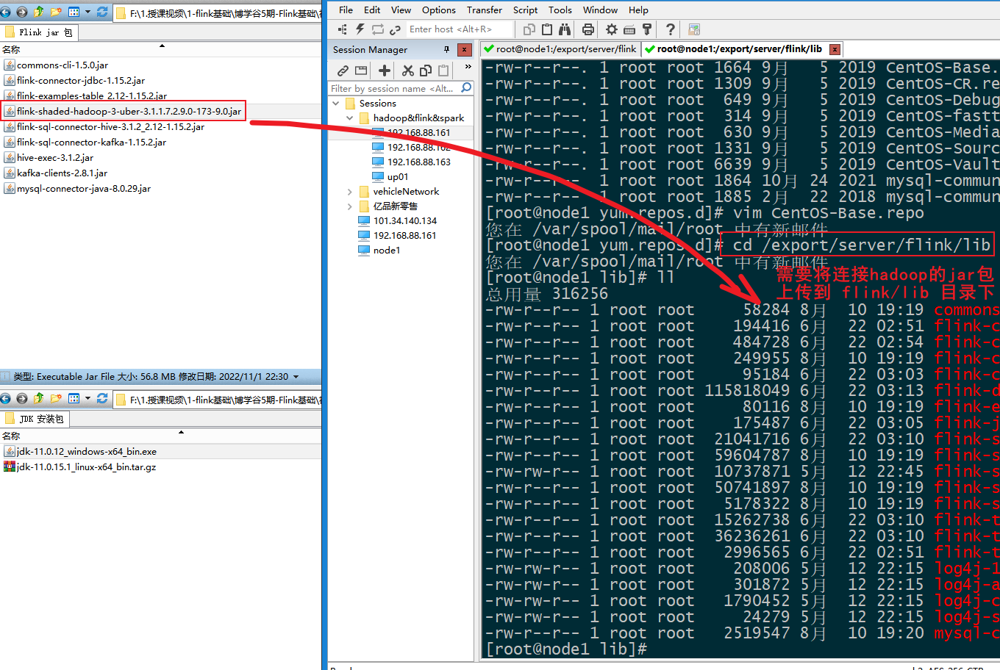

+ or Total Flink Memory size (Key: 'jobmanager.memory.flink.size' , default: null (fallback keys: [])), or Total Process Memory size (Key: 'jobmanager.memory.process.size' , default: null (fallback keys: [])) need to be configured explicitly.

  + 需要设置 flink-conf.yaml 中的配置属性信息

    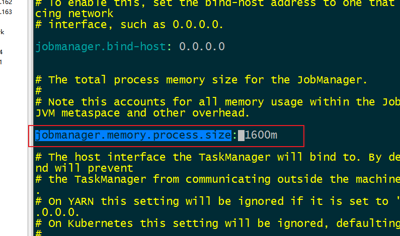

+ 缺少 commons-cli.jar 包

  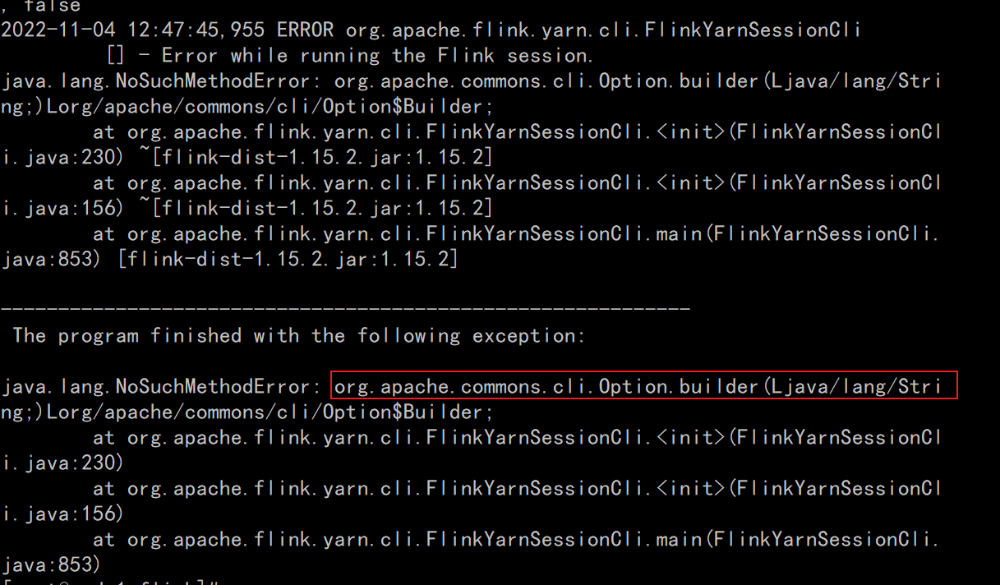

## Flink的入门案例

### 知识点22：【实现】流处理的入门案例

#### 准备工作

- 在node1节点安装netcat工具

  ~~~shell
  yum install -y nc
  ~~~

  

- 启动netcat监听的端口号

  ~~~shell
  nc -lk 9999
  ~~~

#### 基于DataStreamAPI编程

~~~java
package cn.itcast.flink.base;

import org.apache.flink.api.common.functions.FlatMapFunction;
import org.apache.flink.api.java.functions.KeySelector;
import org.apache.flink.api.java.tuple.Tuple2;
import org.apache.flink.streaming.api.datastream.DataStreamSource;
import org.apache.flink.streaming.api.datastream.SingleOutputStreamOperator;
import org.apache.flink.streaming.api.environment.StreamExecutionEnvironment;
import org.apache.flink.util.Collector;

/**
 * Author itcast
 * Date 2022/11/3 21:41
 * Desc 需求 - 根据nc客户端输入的值，根据空格进行分割，并进行单词的统计打印
 */
public class WordCountByNetcat {
    public static void main(String[] args) throws Exception {
        /**
         * 创建环境
         * 1.创建流执行环境，StreamExecutionEnvironment 实例
         * 2.设置并行度及相关参数
         * source
         * 3.读取 socket 数据源，需要启动 nc
         * transformation
         * 4.对单词进行拆分，通过空格进行拆分
         * 5.将数组的集合压扁成 flatMap
         * 6.根据单词进行分流 keyBy
         * 7.进行累加求和
         * sink
         * 8.打印结果输出
         * 10.执行流环境
         */
        //创建环境
        //1.创建流执行环境，StreamExecutionEnvironment 实例
        StreamExecutionEnvironment env = StreamExecutionEnvironment.getExecutionEnvironment();
        //2.设置并行度及相关参数
        env.setParallelism(1);
        //source
        //3.读取 socket 数据源，需要启动 nc
        DataStreamSource<String> source = env.socketTextStream("node1", 9999);
        //transformation
        //4.对单词进行拆分，通过空格进行拆分,5.将数组的集合压扁成 flatMap
        // this is an apple  =>
        // this     1
        // is       1
        // an       1
        // apple    1
        SingleOutputStreamOperator<Tuple2<String, Integer>> flatMapDataStream = source.flatMap(new FlatMapFunction<String, Tuple2<String, Integer>>() {
            @Override
            public void flatMap(String value, Collector<Tuple2<String, Integer>> out) throws Exception {
                if (value != null) {
                    String[] words = value.split(" ");
                    //遍历这些单词
                    for (String word : words) {
                        out.collect(Tuple2.of(word,1));
                    }
                }
            }
        });

        //6.根据单词进行分流 keyBy
        // this     1
        // is       1      =>  this  is  an  apple
        // an       1
        // apple    1
        flatMapDataStream.keyBy(new KeySelector<Tuple2<String, Integer>, String>() {
            @Override
            public String getKey(Tuple2<String, Integer> value) throws Exception {
                return value.f0;
            }
        })
        //7.进行累加求和
                .sum(1)
        //sink
        //8.打印结果输出
                .print();
        //10.执行流环境
        env.execute("wordcount");
    }
}
~~~

#### 基于TableAPI编程

~~~python
package cn.itcast.flink.base;

import org.apache.flink.streaming.api.environment.StreamExecutionEnvironment;
import org.apache.flink.table.api.DataTypes;
import org.apache.flink.table.api.Schema;
import org.apache.flink.table.api.Table;
import org.apache.flink.table.api.TableDescriptor;
import org.apache.flink.table.api.bridge.java.StreamTableEnvironment;

import static org.apache.flink.table.api.Expressions.$;

/**
 * Author itcast
 * Date 2022/11/6 15:10
 * 需求 - 通过 Flink Table Api 实现简单的 wordcount 案例
 */
public class WordcountTable {
    public static void main(String[] args) {
        /**
         * 1.创建流执行环境
         * 2.创建 Flink自带的造数的 Connector ，并指定两个字段 word, frequency
         * 3.对生成的数据源进行单词的统计 数据源.groupBy(单词).select($('word'),$('frequency').sum().as('counts'))
         * 4.创建一个 print connector
         * 5.将计算的 wordcount 结果输出到 print 表中
         */

        //1.创建流执行环境
        StreamExecutionEnvironment env = StreamExecutionEnvironment.getExecutionEnvironment();
        // 创建流表环境
        StreamTableEnvironment tEnv = StreamTableEnvironment.create(env);
        //2.创建 Flink自带的造数的 Connector ，并指定两个字段 word, frequency
        tEnv.createTemporaryTable("source", TableDescriptor.forConnector("datagen")
                .schema(
                        Schema.newBuilder()
                                .column("word", DataTypes.STRING())
                                .column("frequency",DataTypes.INT())
                                .build()
                )
                .option("rows-per-second","1")
                .option("fields.word.kind","random")
                .option("fields.word.length","1")
                .option("fields.frequency.min","1")
                .option("fields.frequency.max","9")
                .build()
        );
        //3.对生成的数据源进行单词的统计 数据源.groupBy(单词).select($('word'),$('frequency').sum().as('counts'))
        Table result = tEnv.from("source")
                .groupBy($("word"))
                .select($("word"), $("frequency").sum().as("sums"));
        //4.创建一个 print connector
        result.printSchema();

        tEnv.createTemporaryTable("sink",TableDescriptor.forConnector("print").schema(
                Schema.newBuilder()
                        .column("word",DataTypes.STRING())
                        .column("sums",DataTypes.INT())
                        .build()
        ).build());
        //5.将计算的 wordcount 结果输出到 print 表中
        result.executeInsert("sink");

    }
}
~~~

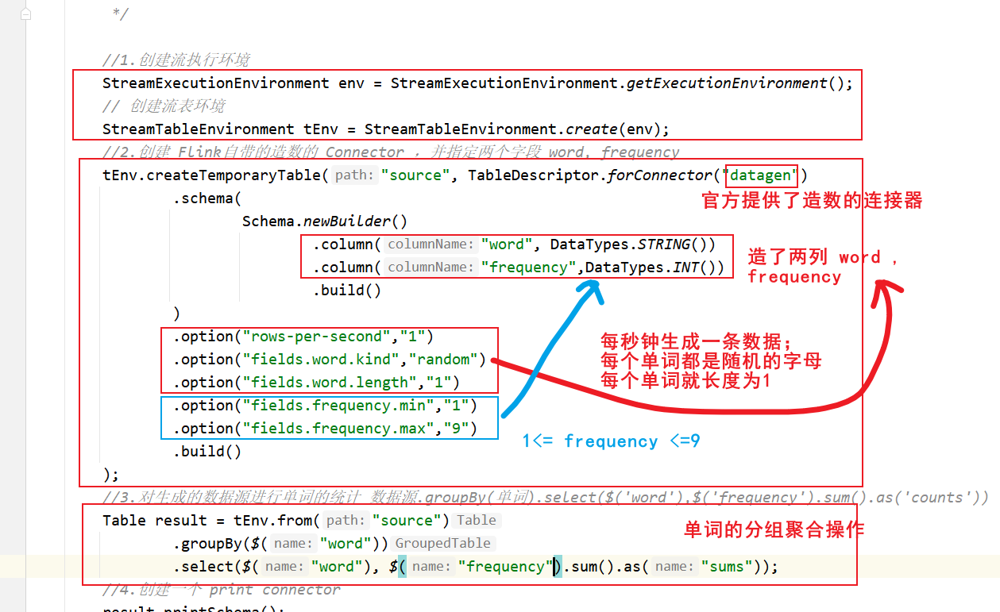

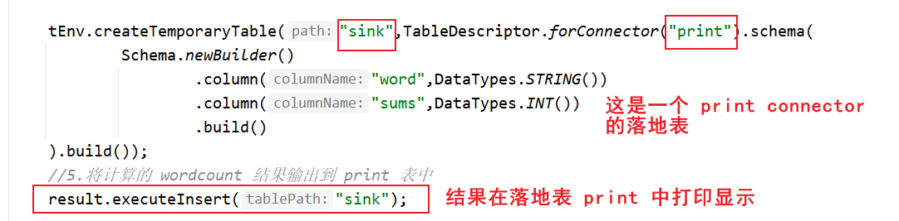

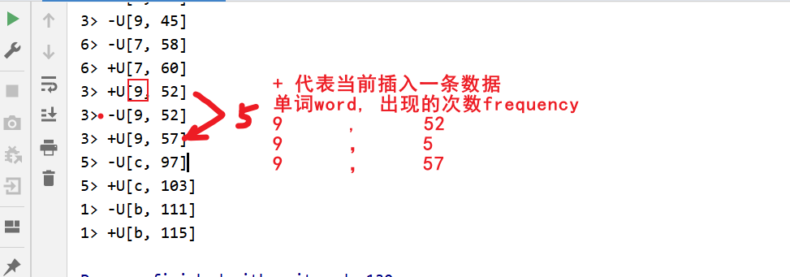

#### 基于SQL编程

~~~python
package cn.itcast.flink.base;

import org.apache.flink.streaming.api.environment.StreamExecutionEnvironment;
import org.apache.flink.table.api.bridge.java.StreamTableEnvironment;

/**
 * Author itcast
 * Date 2022/11/6 15:44
 * Desc 需求 - 基于FlinkSQL进行单词的统计输出
 */
public class WordcountSQL {
    public static void main(String[] args) {
        //创建流执行环境
        StreamExecutionEnvironment env = StreamExecutionEnvironment.getExecutionEnvironment();
        //创建流表环境
        StreamTableEnvironment tEnv = StreamTableEnvironment.create(env);
        //创建一个 datagen 自动生成数据的数据表基于FlinkSQL connector，指定两个字段 word ，frequency
        String ddl = "CREATE TABLE t_words (\n" +
                "    word STRING,\n" +
                "    frequency INT\n" +
                ") WITH (\n" +
                "  'connector' = 'datagen',\n" +
                "  'rows-per-second' = '1',\n" +
                "  'fields.word.kind' = 'random',\n" +
                "  'fields.word.length' = '1',\n" +
                "  'fields.frequency.min' = '1',\n" +
                "  'fields.frequency.max' = '9'\n" +
                ")";
        tEnv.executeSql(ddl);

        //创建一个落地表，print connector 用于打印输出结果
        String sink = "CREATE TABLE sink (\n" +
                "                word STRING,\n" +
                "                sums INT\n" +
                "        ) WITH (\n" +
                "                'connector' = 'print'\n" +
                "        )";
        tEnv.executeSql(sink);
        //将统计的结果输出到 print 控制台
        tEnv.executeSql("INSERT INTO sink " +
                "select word, sum(frequency) as sums " +
                "from t_words " +
                "group by word");
    }
}
~~~

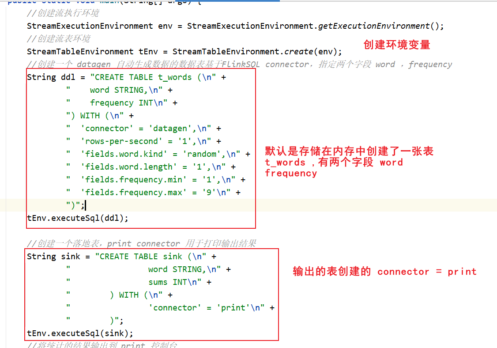

### 知识点23：【掌握】SqlClient工具的使用

SQL 客户端捆绑在常规 Flink 发行版中，因此可以直接运行。它仅需要一个正在运行的 Flink 集群就可以在其中执行表程序。有关设置 Flink 群集的更多信息，请参见[集群和部署](https://ci.apache.org/projects/flink/flink-docs-release-1.13/zh/docs/deployment/resource-providers/standalone/overview/)部分。如果仅想试用 SQL 客户端，也可以使用以下命令启动本地集群：

~~~shell
./bin/start-cluster.sh
~~~

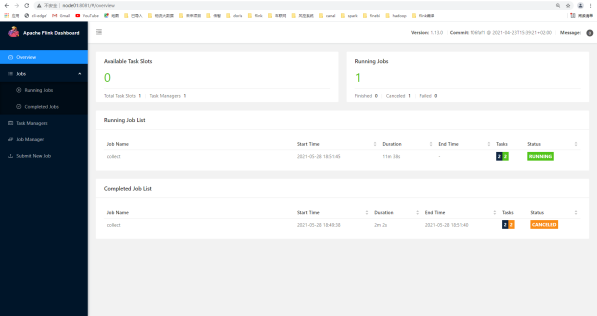

#### 启动 SQL 客户端命令行界面

SQL Client 脚本也位于 Flink 的 bin 目录中。用户可以通过启动嵌入式 standalone 进程或通过连接到远程 SQL 客户端网关来启动 SQL 客户端命令行界面。目前仅支持 **embedded**，模式默认值**embedded**。可以通过以下方式启动 CLI：

~~~shell
./bin/start-cluster.sh
~~~

或者显式使用 embedded 模式:

~~~shell
./bin/sql-client.sh embedded
~~~

启动成功 会进入 flink sql> 命令行界面 **(输入 quit; 退出)**

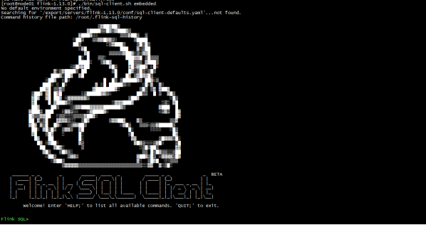

#### 执行 SQL 查询

命令行界面启动后，你可以使用 **help**命令列出所有可用的 SQL 语句。输入第一条 SQL 查询语句并按 **Enter** 键执行，可以验证你的设置及集群连接是否正确：

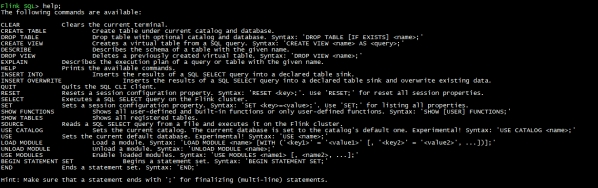 

~~~sql
SELECT 'Hello World';
~~~

 

**默认情况下输出默认采用的是表格模式**，在上面的演示中该查询不需要 **table source**，因为只产生一行结果。CLI 将从集群中检索结果并将其可视化。按 Q 键退出结果视图。

CLI 为维护和可视化结果提供三种模式：

- 表格模式（table mode）在内存中实体化结果，并将结果用规则的分页表格可视化展示出来。执行如下命令启用：

  - ~~~shell
    SET sql-client.execution.result-mode=table;
    ~~~

- 变更日志模式（changelog mode）不会实体化和可视化结果，而是由插入（+）和撤销（-）组成的持续查询产生结果流。

  - ~~~shell
    SET sql-client.execution.result-mode=changelog;
    ~~~

- Tableau模式（tableau mode）更接近传统的数据库，会将执行的结果以制表的形式直接打在屏幕之上。具体显示的内容会取决于作业 执行模式的不同(execution.type)：

  - ~~~shell
    SET sql-client.execution.result-mode=tableau;
    ~~~

可以用如下查询来查看三种结果模式的运行情况：

~~~sql
SELECT name, COUNT(*) AS cnt FROM (VALUES ('Bob'), ('Alice'), ('Greg'), ('Bob')) AS NameTable(name) GROUP BY name;
~~~

- 变更日志模式 下，看到的结果应该类似于：

~~~shell
SET sql-client.execution.result-mode=changelog;
~~~

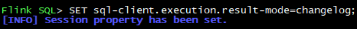

~~~sql
SELECT name, COUNT(*) AS cnt FROM (VALUES ('Bob'), ('Alice'), ('Greg'), ('Bob')) AS NameTable(name) GROUP BY name;
~~~

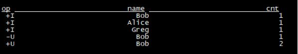

- 表格模式 下，可视化结果表将不断更新，直到表程序以如下内容结束：

~~~shell
SET sql-client.execution.result-mode=table;
~~~

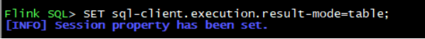

~~~sql
SELECT name, COUNT(*) AS cnt FROM (VALUES ('Bob'), ('Alice'), ('Greg'), ('Bob')) AS NameTable(name) GROUP BY name;
~~~

- Tableau模式 下，如果这个查询以流的方式执行，那么将显示以下内容：

~~~shell
SET sql-client.execution.result-mode=tableau;
~~~

~~~sql
SELECT name, COUNT(*) AS cnt FROM (VALUES ('Bob'), ('Alice'), ('Greg'), ('Bob')) AS NameTable(name) GROUP BY name;
~~~

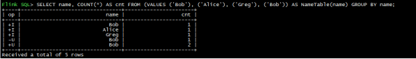

#### 将流处理案例的sql在sqlclient工具中执行

- 将**flink-examples-table_2.12-1.15.2.jar**上传到$FLINK_HOME/lib

  - 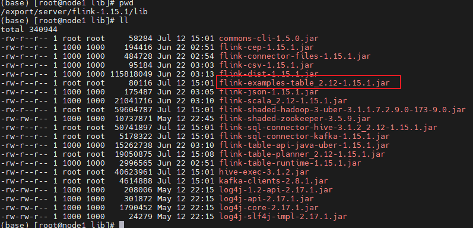

- 重启flink集群，并进入sql-client命令行

  - ~~~shell
    (base) [root@node1 flink-1.15.2]# bin/sql-client.sh
    ~~~

- 执行创建源表操作

  - ~~~sql
    create table source1(
                        word varchar comment ''
                    ) comment '从socket中源源不断获取数据' 
                    with(
                        'connector' = 'socket',
                        'hostname' = 'node1',        
                        'port' = '9999',
                        'format' = 'csv',
                        'csv.field-delimiter'='#'
                   
    ~~~

  - 

  - 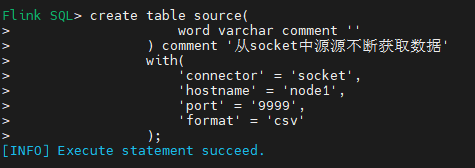

- 说明：

  ~~~shell
  1. create table 建表语句，遵循基本的 SQL ANSI 规范
  2. Flink 的表是使用 with 带上所有的参数（不同的connector 的 option 参数是不一样，需要查看官方网站）
  3. 参数都是以 key = value 形式显示出来
  4. 创建的表都是在内存中创建的，如果指定 hdfs connector ，就会将数据写入到 hdfs 上
  ~~~

  

- 执行创建目标表操作

  - ~~~sql
    CREATE TABLE sink1 (
                    word varchar comment '',
                    cnt bigint
                ) WITH (
                    'connector' = 'print'
                )
    ~~~

  - 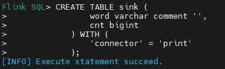

- 开启netcat，监听9999端口号

  - ~~~shell
    nc -lk 9999
    ~~~

  - 

- 在sql-client中递交一个流处理作业，将源表数据接受到的单词累加后实时写入到目标表

  - ~~~sql
    INSERT INTO sink1
                SELECT word, count(1) AS cnt
                FROM source1
                GROUP BY word
    ~~~

  - ~~~
    Flink SQL> INSERT INTO sink
    >             SELECT word, count(1) AS cnt
    >             FROM source
    >             GROUP BY word;
    [INFO] Submitting SQL update statement to the cluster...
    WARNING: An illegal reflective access operation has occurred
    WARNING: Illegal reflective access by org.apache.flink.api.java.ClosureCleaner (file:/export/server/flink-1.15.2/lib/flink-dist-1.15.2.jar) to field java.lang.String.value
    WARNING: Please consider reporting this to the maintainers of org.apache.flink.api.java.ClosureCleaner
    WARNING: Use --illegal-access=warn to enable warnings of further illegal reflective access operations
    WARNING: All illegal access operations will be denied in a future release
    [INFO] SQL update statement has been successfully submitted to the cluster:
    Job ID: 37643c78f8000a6d22a00e67379f2ad6
    ~~~

  - 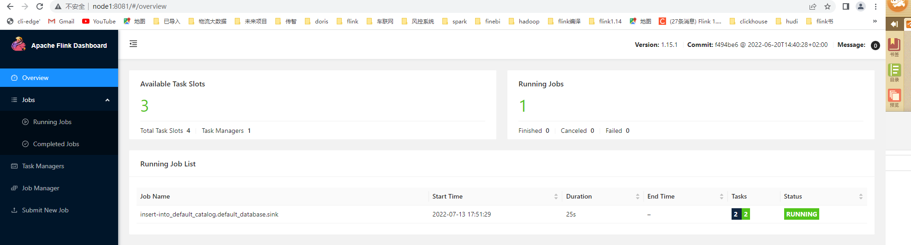

- 在nc输入单词

  - ~~~
    (base) [root@node1 flink-1.15.2]# nc -lk 9999
    hadoop
    spark
    hadoop
    ~~~

  - 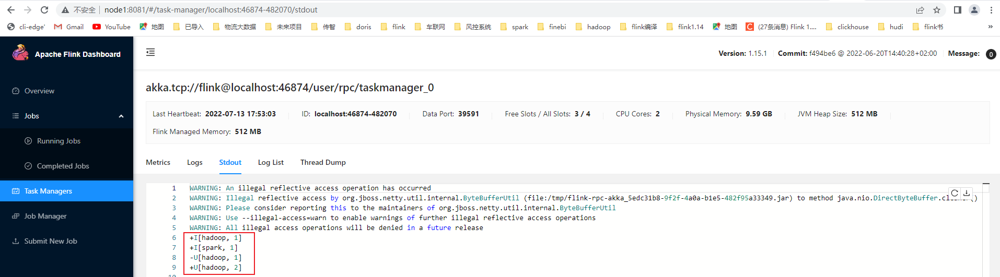

## Flink概念的透析

### Flink 的四大基石

+ Checkpoint 检查点 - 分布式协调一致性的快照 snapshot，容错机制
+ State 状态 - 中间结果
+ Time 时间 - EventTime（事件时间、摄取时间、执行时间） 
  + 事件时间  =  业务发生时间
+ window 窗口 - 将无界的数据转换成有界的数据进行计算

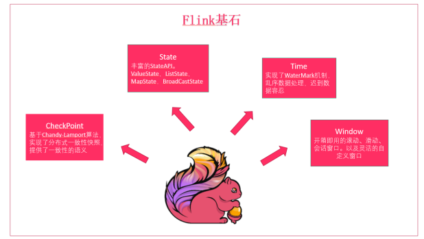

+ 整体架构

  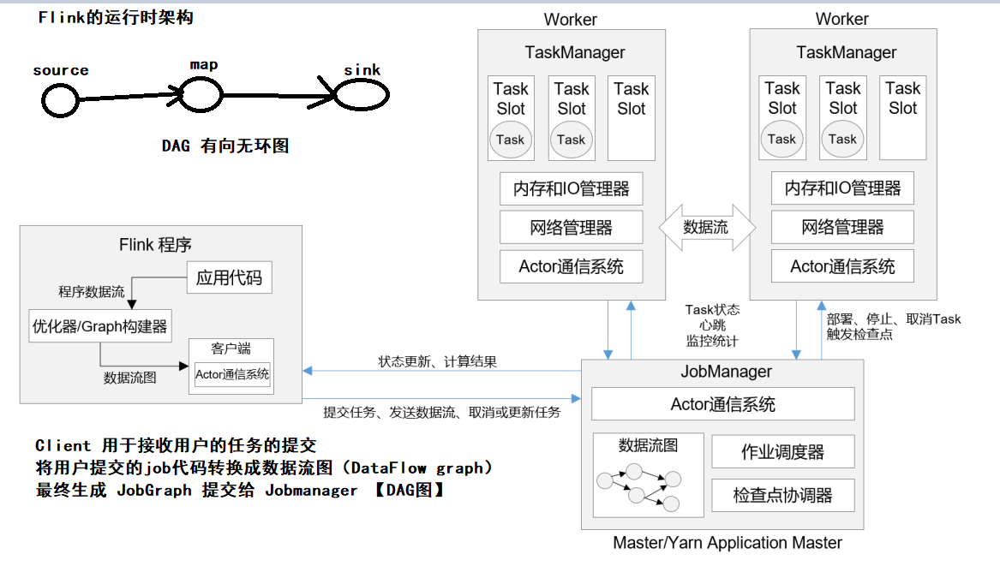

+ 作业提交的流程

  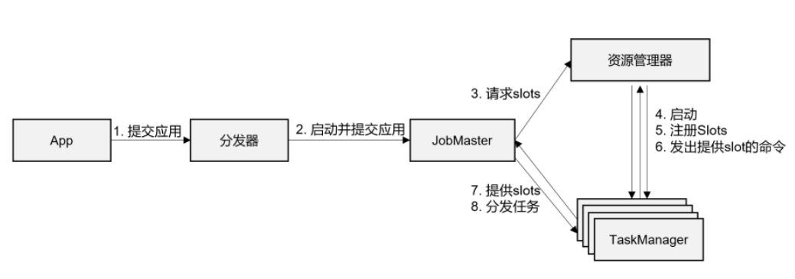

### 重要的概念

+ 操作链 operator chaining ， 将多个算子合并到一起 slot 执行，组成算子链，目的是为了优化程序的执行

+ 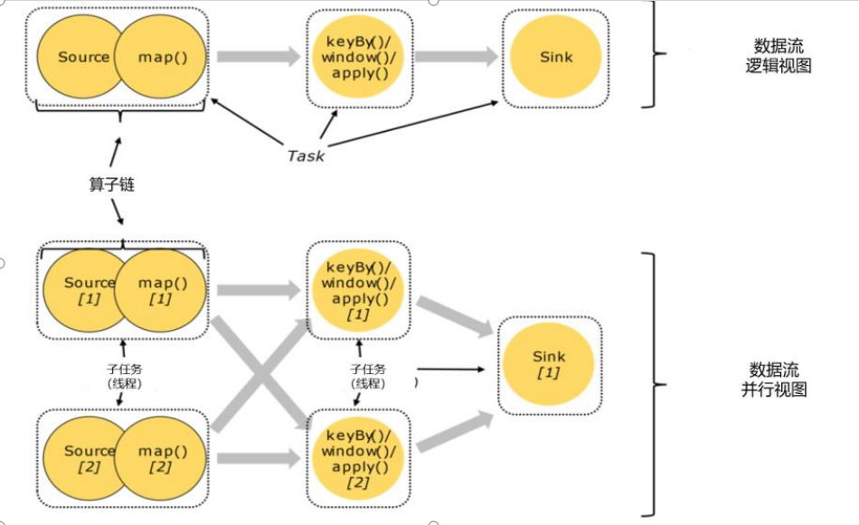

+ 如何开启和关闭

  ~~~shell
  // 禁用算子链
  .map(word -> Tuple2.of(word, 1L)).disableChaining();
  // 从当前算子开始新链
  .map(word -> Tuple2.of(word, 1L)).startNewChain()
  ~~~

  

+ 作业图 jobGraph 和执行图 ExecutionGraph

  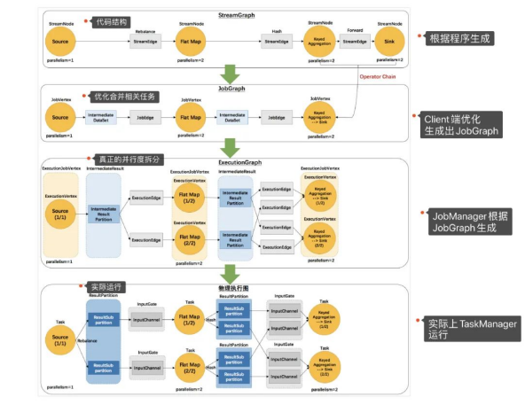

  + 逻辑流图（StreamGraph） -> 作业图 (JobGraph) -> 执行图 （ExecutionGraph） -> 物理图

+ 任务和任务槽
  + 任务槽就是携带一定的资源的容器，拥有固定大小的子集，可以用来独立执行一个子任务。

## Flink Table api & Flink SQL

+ Flink 流处理的抽象级别

  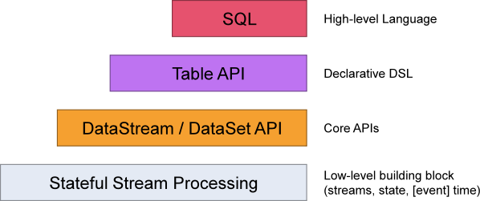

+ Flink Table Api 实现的代码结构

  ~~~java
  String sql = "create table if not exists t_user(id int, username string)
      	with (
  			'connector'='upsert-kafka',
      		'bootstrap.server'='node1.itcast.cn',
      		'topic'='test',
      		'format'='json'
  		)
      "
  tEnv.executeSql(sql)
      
  ~~~

  说明：当 with 写出来的数据源，和表名，表中的数据直接映射到了 kafka 中，操作这个表就是直接操作 kafka

+ Flink SQL 中的表是由三部分组成 ： **Catalog 名称.数据库名称.表名称**。
  + Catalog 名称 ： 连接不同的数据源 （hive  mysql 等）
  + 数据库名： 不同数据库 ， 默认是default
  + 表名称 ： 映射表

