# day4-Flink基础

## 今日目标

+ 【理解】- Flink SQL 数据类型
+ 【理解】- Flink SQL 动态表 & 连续查询
+ 【掌握】- Flink四大基石之时间
+ 【掌握】- Flink四大基石之window窗口

## FlinkSQL基础之四大基石

### 知识点03：【掌握】SQL 数据类型

在介绍完一些基本概念之后，我们来认识一下，Flink SQL 中的数据类型。Flink SQL 内置了很多常见的数据类型，并且也为用户提供了自定义数据类型的能力。总共包含 3 部分：

+ 原子数据类型
+ 符合数据类型
+ 用户自定义数据类型

#### 原子数据类型

- 字符串类型：
  - CHAR、CHAR(n)：定长字符串，就和 Java 中的 Char 一样，n 代表字符的定长，取值范围 [1, 2,147,483,647]。如果不指定 n，则默认为 1。
  - VARCHAR、VARCHAR(n)、STRING：可变长字符串，就和 Java 中的 String 一样，n 代表字符的最大长度，取值范围 [1, 2,147,483,647]。如果不指定 n，则默认为 1。STRING 等同于 VARCHAR(2147483647)。

- 二进制字符串类型：
  - BINARY、BINARY(n)：定长二进制字符串，n 代表定长，取值范围 [1, 2,147,483,647]。如果不指定 n，则默认为 1。
  - VARBINARY、VARBINARY(n)、BYTES：可变长二进制字符串，n 代表字符的最大长度，取值范围 [1, 2,147,483,647]。如果不指定 n，则默认为 1。BYTES 等同于 VARBINARY(2147483647)。

- 精确数值类型：
  - DECIMAL、DECIMAL(p)、DECIMAL(p, s)、DEC、DEC(p)、DEC(p, s)、NUMERIC、NUMERIC(p)、NUMERIC(p, s)：固定长度和精度的数值类型，就和 Java 中的 BigDecimal 一样，p 代表数值位数（长度），取值范围 [1, 38]；s 代表小数点后的位数（精度），取值范围 [0, p]。如果不指定，p 默认为 10，s 默认为 0
  - TINYINT：-128 到 127 的 1 字节大小的有符号整数，就和 Java 中的 byte 一样。
  - SMALLINT：-32,768 to 32,767 的 2 字节大小的有符号整数，就和 Java 中的 short 一样。
  - INT、INTEGER：-2,147,483,648 to 2,147,483,647 的 4 字节大小的有符号整数，就和 Java 中的 int 一样。
  - BIGINT：-9,223,372,036,854,775,808 to 9,223,372,036,854,775,807 的 8 字节大小的有符号整数，就和 Java 中的 long 一样。

- 有损精度数值类型：
  - FLOAT：4 字节大小的单精度浮点数值，就和 Java 中的 float 一样。
  - DOUBLE、DOUBLE PRECISION：8 字节大小的双精度浮点数值，就和 Java 中的 double 一样。
  - 关于 FLOAT 和 DOUBLE 的区别可见 https://www.runoob.com/w3cnote/float-and-double-different.html

- 布尔类型：BOOLEAN

- NULL 类型：NULL

- Raw 类型：RAW(‘class’, ‘snapshot’) 。只会在数据发生网络传输时进行序列化，反序列化操作，可以保留其原始数据。以 Java 举例，class 参数代表具体对应的 Java 类型，snapshot 代表类型在发生网络传输时的序列化器

- 日期、时间类型：
  - DATE：由 年-月-日 组成的 不带时区含义 的日期类型，取值范围 [0000-01-01, 9999-12-31]
  - TIME、TIME(p)：由 小时：分钟：秒[.小数秒] 组成的 不带时区含义 的的时间的数据类型，精度高达纳秒，取值范围 [00:00:00.000000000到23:59:59.9999999]。其中 p 代表小数秒的位数，取值范围 [0, 9]，如果不指定 p，默认为 0。
  - TIMESTAMP、TIMESTAMP(p)、TIMESTAMP WITHOUT TIME ZONE、TIMESTAMP(p) WITHOUT TIME ZONE：由 年-月-日 小时：分钟：秒[.小数秒] 组成的 不带时区含义 的时间类型，取值范围 [0000-01-01 00:00:00.000000000, 9999-12-31 23:59:59.999999999]。其中 p 代表小数秒的位数，取值范围 [0, 9]，如果不指定 p，默认为 6。
  - TIMESTAMP WITH TIME ZONE、TIMESTAMP(p) WITH TIME ZONE：由 年-月-日 小时：分钟：秒[.小数秒] 时区 组成的 带时区含义 的时间类型，取值范围 [0000-01-01 00:00:00.000000000 +14:59, 9999-12-31 23:59:59.999999999 -14:59]。其中 p 代表小数秒的位数，取值范围 [0, 9]，如果不指定 p，默认为 6
  - TIMESTAMP_LTZ、TIMESTAMP_LTZ(p)：由 年-月-日 小时：分钟：秒[.小数秒] 时区 组成的 带时区含义 的时间类型，取值范围 [0000-01-01 00:00:00.000000000 +14:59, 9999-12-31 23:59:59.999999999 -14:59]。其中 p 代表小数秒的位数，取值范围 [0, 9]，如果不指定 p，默认为 6。
  - TIMESTAMP_LTZ 与 TIMESTAMP WITH TIME ZONE 的区别在于：TIMESTAMP WITH TIME ZONE 的时区信息是携带在数据中的，举例：其输入数据应该是 2022-01-01 00:00:00.000000000 +08:00；TIMESTAMP_LTZ 的时区信息不是携带在数据中的，而是由 Flink SQL 任务的全局配置决定的，我们可以由 table.local-time-zone 参数来设置时区。
  - INTERVAL YEAR TO MONTH、 INTERVAL DAY TO SECOND：interval 的涉及到的种类比较多。INTERVAL 主要是用于给 TIMESTAMP、TIMESTAMP_LTZ 添加偏移量的。举例，比如给 TIMESTAMP 加、减几天、几个月、几年。INTERVAL 子句总共涉及到的语法种类

**如下 Flink SQL 案例所示**。

~~~sql
Flink SQL> CREATE TABLE sink_table2 (
    result_interval_year TIMESTAMP(3),
    result_interval_year_p TIMESTAMP(3),
    result_interval_year_p_to_month TIMESTAMP(3),
    result_interval_month TIMESTAMP(3),
    result_interval_day TIMESTAMP(3),
    result_interval_day_p1 TIMESTAMP(3),
    result_interval_day_p1_to_hour TIMESTAMP(3),
    result_interval_day_p1_to_minute TIMESTAMP(3),
    result_interval_day_p1_to_second_p2 TIMESTAMP(3),
    result_interval_hour TIMESTAMP(3),
    result_interval_hour_to_minute TIMESTAMP(3),
    result_interval_hour_to_second TIMESTAMP(3),
    result_interval_minute TIMESTAMP(3),
    result_interval_minute_to_second_p2 TIMESTAMP(3),
    result_interval_second TIMESTAMP(3),
    result_interval_second_p2 TIMESTAMP(3)
) WITH (
  'connector' = 'print'
);

Flink SQL> INSERT INTO sink_table2
SELECT
    -- Flink SQL 支持的所有 INTERVAL 子句如下，总体可以分为 `年-月`、`日-小时-秒` 两种

    -- 1. 年-月。取值范围为 [-9999-11, +9999-11]，其中 p 是指有效位数，取值范围 [1, 4]，默认值为 2。比如如果值为 1000，但是 p = 2，则会直接报错。
    -- INTERVAL YEAR
    f1 + INTERVAL '10' YEAR as result_interval_year
    -- INTERVAL YEAR(p)
    , f1 + INTERVAL '100' YEAR(3) as result_interval_year_p
    -- INTERVAL YEAR(p) TO MONTH
    , f1 + INTERVAL '10-03' YEAR(3) TO MONTH as result_interval_year_p_to_month
    -- INTERVAL MONTH
    , f1 + INTERVAL '13' MONTH as result_interval_month

    -- 2. 日-小时-秒。取值范围为 [-999999 23:59:59.999999999, +999999 23:59:59.999999999]，其中 p1\p2 都是有效位数，p1 取值范围 [1, 6]，默认值为 2；p2 取值范围 [0, 9]，默认值为 6
    -- INTERVAL DAY
    , f1 + INTERVAL '10' DAY as result_interval_day
    -- INTERVAL DAY(p1)
    , f1 + INTERVAL '100' DAY(3) as result_interval_day_p1
    -- INTERVAL DAY(p1) TO HOUR
    , f1 + INTERVAL '10 03' DAY(3) TO HOUR as result_interval_day_p1_to_hour
    -- INTERVAL DAY(p1) TO MINUTE
    , f1 + INTERVAL '10 03:12' DAY(3) TO MINUTE as result_interval_day_p1_to_minute
    -- INTERVAL DAY(p1) TO SECOND(p2)
    , f1 + INTERVAL '10 00:00:00.004' DAY TO SECOND(3) as result_interval_day_p1_to_second_p2
    -- INTERVAL HOUR
    , f1 + INTERVAL '10' HOUR as result_interval_hour
    -- INTERVAL HOUR TO MINUTE
    , f1 + INTERVAL '10:03' HOUR TO MINUTE as result_interval_hour_to_minute
    -- INTERVAL HOUR TO SECOND(p2)
    , f1 + INTERVAL '00:00:00.004' HOUR TO SECOND(3) as result_interval_hour_to_second
    -- INTERVAL MINUTE
    , f1 + INTERVAL '10' MINUTE as result_interval_minute
    -- INTERVAL MINUTE TO SECOND(p2)
    , f1 + INTERVAL '05:05.006' MINUTE TO SECOND(3) as result_interval_minute_to_second_p2
    -- INTERVAL SECOND
    , f1 + INTERVAL '3' SECOND as result_interval_second
    -- INTERVAL SECOND(p2)
    , f1 + INTERVAL '300' SECOND(3) as result_interval_second_p2
FROM (SELECT TO_TIMESTAMP_LTZ(1640966476500, 3) as f1)
~~~

输出结果：

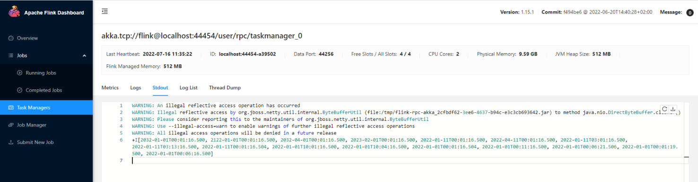

#### 复合数据类型

- 数组类型：ARRAY、t ARRAY。数组最大长度为 2,147,483,647。t 代表数组内的数据类型。举例 ARRAY、ARRAY，其等同于 INT ARRAY、STRING ARRAY

- Map 类型：MAP<kt, vt>。Map 类型就和 Java 中的 Map 类型一样，key 是没有重复的。举例 Map<STRING, INT>、Map<BIGINT, STRING>

- 集合类型：MULTISET、t MULTISET。就和 Java 中的 List 类型，一样，运行重复的数据。举例 MULTISET，其等同于 INT MULTISET

- 对象类型：ROW<n0 t0, n1 t1, …>、ROW<n0 t0 ‘d0’, n1 t1 ‘d1’, …>、ROW(n0 t0, n1 t1, …>、ROW(n0 t0 ‘d0’, n1 t1 ‘d1’, …)。就和 Java 中的自定义对象一样。举例：ROW(myField INT, myOtherField BOOLEAN)，其等同于 ROW<myField INT, myOtherField BOOLEAN>

**查询数据**：

~~~sql
select 111 as id,'张三' as name,Row(CURRENT_TIME,'ss',123) as obj,Array[Row('f',1),Row('s',2)] as arr,Map['k1','v1','k2','v2'] as `map`,Map['inner_map',Map['k','v']] as mapinmap;
~~~

**案例演示**：

~~~json
{
    "id":1238123899121,
    "name":"itcast",
    "date":"1990-10-14",
    "obj":{
        "time1":"12:12:43",
        "str":"sfasfafs",
        "lg":2324342345
    },
    "arr":[
        {
            "f1":"f1str11",
            "f2":134
        },
        {
            "f1":"f1str22",
            "f2":555
        }
    ],
    "time":"12:12:43",
    "timestamp":"1990-10-14 12:12:43",
    "map":{
        "flink":123
    },
    "mapinmap":{
        "inner_map":{
            "key":234
        }
    }
}
~~~

开启netcat，监听***\*9999\****端口号，输入json字符串：

~~~json
{"id":1238123899121,"name":"itcast","date":"1990-10-14","obj":{"time1":"12:12:43","str":"sfasfafs","lg":2324342345},"arr":[{"f1":"f1str11","f2":134},{"f1":"f1str22","f2":555}],"time":"12:12:43","timestamp":"1990-10-14 12:12:43","map":{"flink":123},"mapinmap":{"inner_map":{"key":234}}}
~~~

定义sql语句：

~~~sql
Flink SQL> CREATE TABLE json_source (
    id            BIGINT,
    name          STRING,
    `date`        DATE,
    obj           ROW<time1 TIME,str STRING,lg BIGINT>,
    arr           ARRAY<ROW<f1 STRING,f2 INT>>,
    `time`        TIME,
    `timestamp`   TIMESTAMP(3),
    `map`         MAP<STRING,BIGINT>,
    mapinmap      MAP<STRING,MAP<STRING,INT>>,
    proctime as PROCTIME()
 ) WITH (
    'connector' = 'socket',
    'hostname' = 'node1',        
    'port' = '9999',
    'format' = 'json'
);
~~~

获取数据：

~~~sql
select id, name,`date`,obj.str,arr[1].f1,`map`['flink'],mapinmap['inner_map']['key'] from json_source;
~~~

### 知识点04：【理解】SQL 动态表 & 连续查询

先看一下本节整体的思路：

- 先分析一下将 SQL 应用到流处理的思路
- SQL 应用于批处理已经很成熟了，通过对比流批处理在输入、数据处理、输出的异同点来分析出将 SQL 应用于流处理的核心要解决的问题点
- 分析如何使用 SQL 动态输入表 技术来将 输入数据流 映射到 SQL 中的输入表
- 分析如何使用 SQL 连续查询 技术来将 计算逻辑 映射到 SQL 中的运算语义
- 使用 SQL 动态表 & 连续查询技术 两种技术方案来将 流式 SQL 实际应用到两个常见案例中
- 分析 SQL 连续查询 的两种类型：更新（Update）查询 & 追加（Append）查询
- 分析如何使用 SQL 动态输出表 技术来将 输出数据流 映射到 SQL 中的输出表

目标：

- SQL 动态输入表、SQL 动态输出表

- SQL 连续查询 的两种类型分别对应的查询场景及 SQL 语义

+ 根据时间对数据进行统计

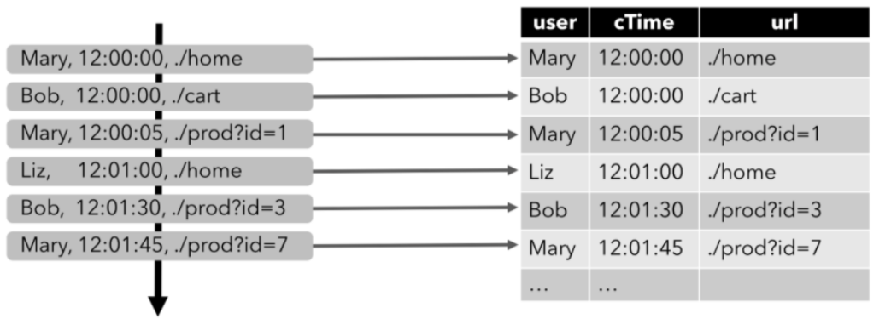

+ 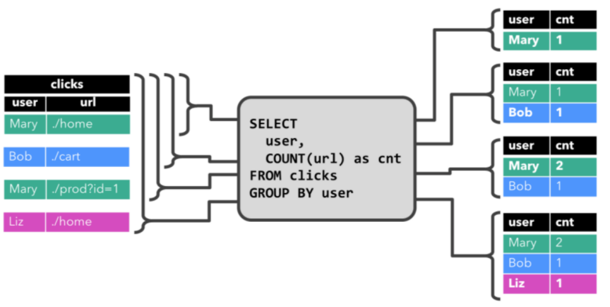
+ 每个用户的点击量统计
+ ,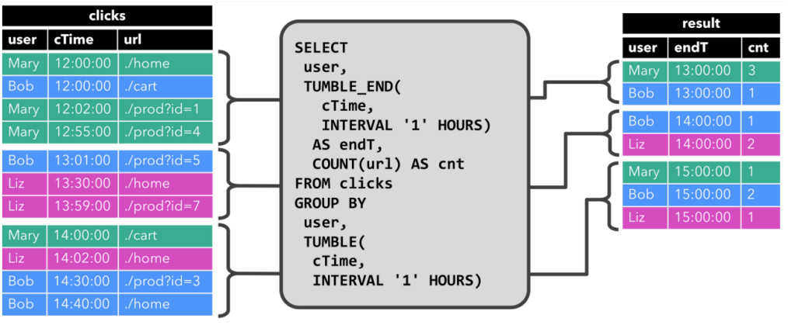
+ 根据用户和滚动时间进行计算

+ SQL连续查询的两种类型 ： Append（写入读取）  Update（更新查询）

#### SQL 应用于流处理的思路

在流式 SQL 诞生之前，所有的基于 SQL 的数据查询都是基于批数据的，没有将 SQL 应用到流数据处理这一说法。

那么如果我们想将 SQL 应用到流处理中，必然要站在巨人的肩膀（批数据处理的流程）上面进行，那么具体的分析思路如下：

- 步骤一：先比较 批处理 与 流处理 的异同之处：如果有相同的部分，那么可以直接复用；不同之处才是我们需要重点克服和关注的。

- 步骤二：摘出 1 中说到的不同之处，分析如果要满足这个不同之处，目前有哪些技术是类似的

- 步骤三：再从这些类似的技术上进一步发展，以满足将 SQL 应用于流任务中

接下来会根据上述三个步骤来一步一步介绍 动态表 诞生的背景以及这个概念是如何诞生的。

#### 流批处理的异同点及将 SQL 应用于流处理核心解决的问题

首先对比一下常见的 批处理 和 流处理 中 数据源（输入表）、处理逻辑、数据汇（结果表） 的异同点。

|        | **输入表**                                       | **处理逻辑**                                                 | **结果**         |
| ------ | ------------------------------------------------ | ------------------------------------------------------------ | ---------------- |
| 批处理 | 静态表：输入数据有限、是有界集合                 | 批式计算：每次执行查询能够访问到完整的输入数据，然后计算，输出完整的结果数据 | 静态表：数据有限 |
| 流处理 | 动态表：输入数据无限，数据实时增加，并且源源不断 | 流式计算：执行时不能够访问到完整的输入数据，每次计算的结果都是一个中间结果 | 动态表：数据无限 |

对比上述流批处理之后，我们得到了要将 SQL 应用于流式任务的三个要解决的核心点：

- SQL 输入表：分析如何将一个实时的，源源不断的输入流数据表示为 SQL 中的输入表。

- SQL 处理计算：分析将 SQL 查询逻辑翻译成什么样的底层处理技术才能够实时的处理流式输入数据，然后产出流式输出数据。

- SQL 输出表：分析如何将 SQL 查询输出的源源不断的流数据表示为一个 SQL 中的输出表。

将上面 3 个点总结一下，也就引出了本节的 动态表 和 连续查询 两种技术方案：

- 动态表：源源不断的输入、输出流数据映射到 动态表

- 连续查询：实时处理输入数据，产出输出数据的实时处理技术

#### SQL 流处理的输入：输入流映射为 SQL 动态输入表

动态表。这里的动态其实是相比于批处理的静态（有界）来说的。

- 静态表：应用于批处理数据中，静态表可以理解为是不随着时间实时进行变化的。一般都是一天、一小时的粒度新生成一个分区。

- 动态表：动态表是随时间实时进行变化的。是将 SQL 体系中表的概念应用到 Flink 上面的的核心点。

来看一个具体的案例，下图显示了点击事件流（左侧）如何转换为动态表（右侧）。当数据源生成更多的点击事件记录时，映射出来的动态表也会不断增长，这就是动态表的概念：

#### SQL 流处理的计算：实时处理底层技术 - SQL 连续查询

部分高级关系数据库系统提供了一个称为**物化视图（Materialized Views)** 的特性。

物化视图其实就是一条 SQL 查询，就像常规的虚拟视图 VIEW 一样。但与虚拟视图不同的是，物化视图会缓存查询的结果，因此在请求访问视图时不需要对查询进行重新计算，可以直接获取物化视图的结果，可以认为物化视图其实就是把结果缓存了下来。

举个例子：批处理中，如果以 Hive 天级别的物化视图来说，其实就是每天等数据源 ready 之后，调度物化视图的 SQL 执行然后产生新的结果提供服务。那么就可以认为一条表示了输入、处理、输出的 SQL 就是一个构建物化视图的过程。

映射到我们的流任务中，输入、处理逻辑、输出这一套流程也是一个物化视图的概念。相比批处理来说，流处理中，我们的数据源表的数据是源源不断的。那么从输入、处理、输出的整个物化视图的维护流程也必须是实时的。

因此我们就需要引入一种实时视图维护（Eager View Maintenance）的技术去做到：一旦更新了物化视图的数据源表就立即更新视图的结果，从而保证输出的结果也是最新的。

这种 实时视图维护（Eager View Maintenance）的技术就叫做 连续查询。

>1. 连续查询（Continuous Query） 不断的消费动态输入表的的数据，不断的更新动态结果表的数据。
>2. 连续查询（Continuous Query） 的产出的结果 = 批处理模式在输入表的上执行的相同查询的结果。相同的 SQL，对应于同一个输入数据，虽然执行方式不同，但是流处理和批处理的结果是永远都会相同的。

#### SQL 流处理实际应用：动态表 & 连续查询技术的两个实战案例

总结前两节，动态表 & 连续查询 两项技术在一条流 SQL 中的执行流程总共包含了三个步骤，如下图及总结所示：

 

- 第一步：将数据输入流转换为 SQL 中的动态输入表。这里的转化其实就是指将输入流映射（绑定）为一个动态输入表。上图虽然分开画了，但是可以理解为一个东西。

- 第二步：在动态输入表上执行一个连续查询，然后生成一个新的动态结果表。

- 第三步：生成的动态结果表被转换回数据输出流。

我们实际介绍一个案例来看看其运行方式，以上文介绍到的**点击事件流**为例，点击事件流数据的字段如下：

~~~json
[
  user:  VARCHAR,   // 用户名
  cTime: TIMESTAMP, // 访问 URL 的时间
  url:   VARCHAR    // 用户访问的 URL
]
~~~

- 第一步，将输入数据流映射为一个动态输入表。以下图为例，我们将点击事件流（图左）转换为动态表 (图右)。当点击数据源源不断的来到时，动态表的数据也会不断的增加。
  - 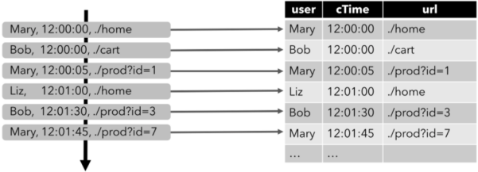
- 第二步，在点击事件流映射的动态输入表上执行一个连续查询（Continuous Query），并生成一个新的动态输出表。

下面介绍两个查询的案例：

第一个查询：一个简单的 GROUP-BY COUNT 聚合查询，写过 SQL 的都不会陌生吧，这种应该都是最基础，最常用的对数据按照类别分组的方法。

如下图所示 group by 聚合的常用案例。

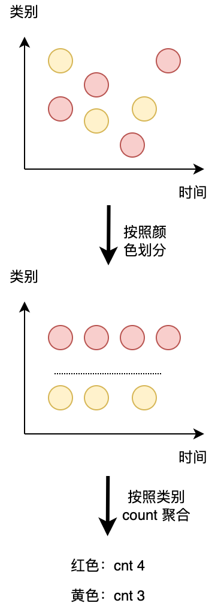

那么本案例中呢，是基于 clicks 表中 user 字段对 clicks 表（点击事件流）进行分组，来统计每一个 user 的访问的 URL 的数量。下面的图展示了当 clicks 输入表来了新数据（即表更新时），连续查询（Continuous Query） 的计算逻辑。

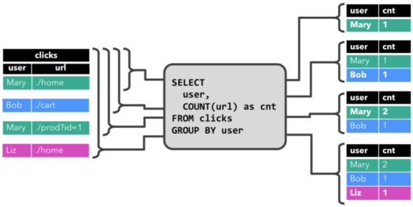

当查询开始，clicks 表(左侧)是空的。

- 当第一行数据被插入到 clicks 表时，连续查询（Continuous Query）开始计算结果数据。数据源表第一行数据 [Mary,./home] 输入后，会计算结果 [Mary, 1] 插入（insert）结果表。

- 当第二行 [Bob, ./cart] 插入到 clicks 表时，连续查询（Continuous Query）会计算结果 [Bob, 1]，并插入（insert）到结果表。

- 第三行 [Mary, ./prod?id=1] 输出时，会计算出[Mary, 2]（user 为 Mary 的数据总共来过两条，所以为 2），并更新（update）结果表，[Mary, 1] 更新成 [Mary, 2]。

- 最后，当第四行数据加入 clicks 表时，查询将第三行 [Liz, 1] 插入（insert）结果表中。

注意上述特殊标记出来的字体，可以看到连续查询对于结果的数据输出方式有两种：

- 插入（insert）结果表

- 更新（update）结果表

大家对于 插入（insert）结果表 这件事都比较好理解，因为离线数据都只有插入这个概念。

但是 更新（update）结果表 就是离线处理中没有概念了。这就是连续查询中中比较重要一个概念。后文会介绍。

接下来介绍第二条查询语句。

第二条查询与第一条类似，但是 group by 中除了 user 字段之外，还 group by 了 tumble，其代表开了个滚动窗口（后面会详细说明滚动窗口的作用），然后计算 url 数量。

group by user，是按照类别（横向）给数据分组，group by tumble 滚动窗口是按时间粒度（纵向）给数据进行分组。如下图所示。

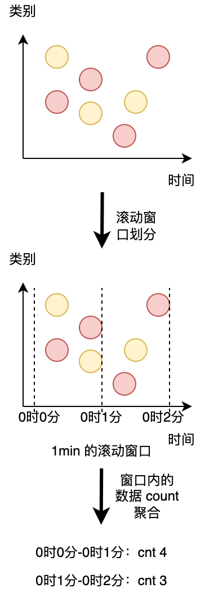

图形化一解释就很好理解了，两种都是对数据进行分组，一个是按照 类别 分组，另一种是按照 时间 分组。

与前面一样，左边显示了输入表 clicks。查询每小时持续计算结果并更新结果表。clicks 表有三列，user，cTime，url。其中 cTime 代表数据的时间戳，用于给数据按照时间粒度分组。

我们的滚动窗口的步长为 1 小时，即时间粒度上面的分组为 1 小时。其中时间戳在 12:00:00 - 12:59:59 之间有四条数据。13:00:00 - 13:59:59 有三条数据。14:00:00 - 14:59:59 之间有四条数据。

- 当 12:00:00 - 12:59:59 数据输入之后，1 小时的窗口，连续查询（Continuous Query）计算的结果如右图所示，将 [Mary, 3]，[Bob, 1] 插入（insert）结果表。

- 当 13:00:00 - 13:59:59 数据输入之后，1 小时的窗口，连续查询（Continuous Query）计算的结果如右图所示，将 [Bob, 1]，[Liz, 2] 插入（insert）结果表。

- 当 14:00:00 - 14:59:59 数据输入之后，1 小时的窗口，连续查询（Continuous Query）计算的结果如右图所示，将 [Mary, 1]，[Bob, 2]，[Liz, 1] 插入（insert）结果表。

而这个查询只有 插入（insert）结果表 这个行为。

#### SQL 连续查询的两种类型：更新（Update）查询 & 追加（Append）查询

虽然前一节的两个查询看起来非常相似（都计算分组进行计数聚合），但它们在一个重要方面不同：

- 第一个查询（group by user），即（Update）查询：会更新先前输出的结果，即结果表流数据中包含 INSERT 和 UPDATE 数据。

- 可以理解为 group by user 这条语句当中，输入源的数据是一直有的，源源不断的，同一个 user 的数据之后可能还是会有的，因此可以认为此 SQL 的每次的输出结果都是一个中间结果，

- 当同一个 user 下一条数据到来的时候，就要用新结果把上一次的产出中间结果（旧结果）给 UPDATE 了。所以这就是 UPDATE 查询的由来（其中 INSERT 就是第一条数据到来的时候，没有之前的中间结果，所以是 INSERT）。

- 第二个查询（group by user, tumble(xxx)），即（Append）查询：只追加到结果表，即结果表流数据中只包含 INSERT 的数据。

- 可以理解为虽然 group by user, tumble(xxx) 上游也是一个源源不断的数据，但是这个查询本质上是对时间上的划分，而时间都是越变越大的，当前这个滚动窗口结束之后，后面来的数据的时间都会比这个滚动窗口的结束时间大，都归属于之后的窗口了，当前这个滚动窗口的结果数据就不会再改变了，因此这条查询只有 INSERT 数据，即一个 Append 查询。

上面是 Flink SQL 连续查询处理机制上面的两类查询方式。我们可以发现连续查询的处理机制不一样，产出到结果表中的结果数据也是不一样的。针对上面两种结果表的更新方式，Flink SQL 提出了 changelog 表的概念来进行兼容。

changelog 表这个概念其实就和 MySQL binlog 是一样的。会包含 INSERT、UPDATE、DELETE 三种数据，通过这三种数据的处理来描述实时处理技术对于动态表的变更：

- changelog 表：即第一个查询的输出表，输出结果数据不但会追加，还会发生更新

- changelog insert-only 表：即第二个查询的输出表，输出结果数据只会追加，不会发生更新

#### SQL 流处理的输出：动态输出表转化为输出数据

可以看到我们的标题都是随着一个 SQL 的生命周期的。从 输入流映射为 SQL 动态输入表、实时处理底层技术 - SQL 连续查询 到本小节的 SQL 动态输出表转化为输出数据。都是有逻辑关系的。

我们上面介绍到了 **连续查询（Continuous Query）** 的输出结果表是一个 changelog。其可以像普通数据库表一样通过 INSERT、UPDATE 和 DELETE 来不断修改。

它可能是一个只有一行、不断更新 changelog 表，也可能是一个 insert-only 的 changelog 表，没有 UPDATE 和 DELETE 修改，或者介于两者之间的其他表。

在将动态表转换为流或将其写入外部系统时，需要对这些不同状态的数据进行编码。Flink 的 Table API 和 SQL API 支持三种方式来编码一个动态表的变化:

- Append-only 流： 输出的结果只有 INSERT 操作的数据。

- Retract 流：
  - Retract 流包含两种类型的 message： add messages 和 retract messages 。其将 INSERT 操作编码为 add message、将 DELETE 操作编码为 retract message、将 UPDATE 操作编码为更新先前行的 retract message 和更新（新）行的 add message，从而将动态表转换为 retract 流。
  - Retract 流写入到输出结果表的数据如下图所示，有 -，+ 两种，分别 - 代表撤回旧数据，+ 代表输出最新的数据。这两种数据最终都会写入到输出的数据引擎中。
  - 如果下游还有任务去消费这条流的话，要注意需要正确处理 -，+ 两种数据，防止数据计算重复或者错误。

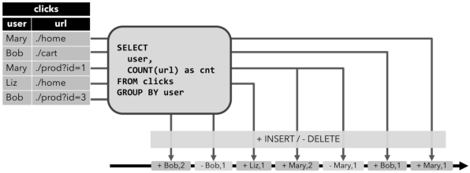

- Upsert 流：
  - Upsert 流包含两种类型的 message： upsert messages 和 delete messages。转换为 upsert 流的动态表需要唯一键（唯一键可以由多个字段组合而成）。其会将 INSERT 和 UPDATE 操作编码为 upsert message，将 DELETE 操作编码为 delete message。
  - Upsert 流写入到输出结果表的数据如下图所示，每次输出的结果都是当前每一个 user 的最新结果数据，不会有 Retract 中的 - 回撤数据。
  - 如果下游还有一个任务去消费这条流的话，消费流的算子需要知道唯一键（即 user），以便正确地根据唯一键（user）去拿到每一个 user 当前最新的状态。其与 retract 流的主要区别在于 UPDATE 操作是用单个 message 编码的，因此效率更高。下图显示了将动态表转换为 upsert 流的过程。

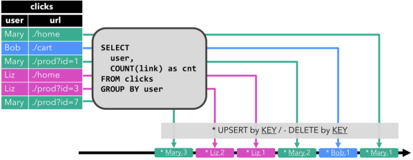

### SQL 的时间属性 time

先看一下本节整体的思路：

- 与离线处理中常见的时间分区字段一样，在实时处理中，时间属性也是一个核心概念。Flink 支持 处理时间、事件时间、摄入时间 三种时间语义。
- 分别介绍三种时间语义的应用场景及案例。三种时间在生产环境的使用频次 事件时间（**SQL 常用**） > 处理时间（**SQL 几乎不用，DataStream 少用**） > 摄入时间（**不用**）

#### 知识点05：【理解】Flink 三种时间属性简介

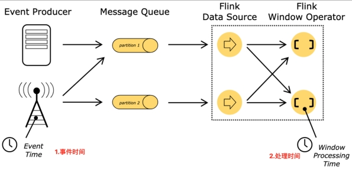

- 事件时间：指的是数据本身携带的时间，这个时间是在事件产生时的时间，而且在 Flink SQL 触发计算时，也使用数据本身携带的时间。这就叫做 事件时间。目前生产环境中用的最多。

- 处理时间：指的是具体算子计算数据执行时的机器时间（例如在算子中 Java 取 System.currentTimeMillis()) ），在生产环境中用的次多。

- 摄入时间：指的是数据从数据源进入 Flink 的时间。摄入时间用的最少，可以说基本不使用。

要注意到：

- 上述的三种时间概念不是由于有了数据而诞生的，而是有了 Flink 之后根据实际的应用场景而诞生的。以事件时间举个例子，如果只是数据携带了时间，Flink 也消费了这个数据，但是在 Flink 中没有使用数据的这个时间作为计算的触发条件，也不能把这个 Flink 任务叫做事件时间的任务。

- 其次，要认识到，一般一个 Flink 任务只会有一个时间属性，所以时间属性通常认为是一个任务粒度的。举例：我们可以说 A 任务是事件时间语义的任务，B 任务是处理时间语义的任务。当然了，一个任务也可以存在多个时间属性。

#### 知识点06：【理解】Flink 三种时间属性的应用场景

以上三种时间属性到底对我们的任务有啥影响呢？三种时间属性的应用场景是啥？

先说结论，在 Flink 中时间的作用：

- 主要体现在包含时间窗口的计算中：用于标识任务的时间进度，来判断是否需要触发窗口的计算。比如常用的滚动窗口、滑动窗口等都需要时间推动触发。这些窗口的应用场景后续会详细介绍。

- 次要体现在自定义时间语义的计算中：举个例子，比如用户可以自定义每隔 10s 的本地时间，或者消费到的数据的时间戳每增大 10s，就把计算结果输出一次，时间在此类应用中也是一种标识任务进度的作用。

以 滚动窗口 的聚合任务为例来介绍一下事件时间和处理时间的对比区别。

- 事件时间案例：还是以之前的 clicks 表拿来举例。

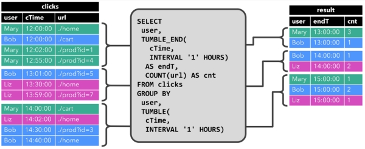 

上面这个案例的窗口大小是 1 小时，需求方需要按照用户点击时间戳 cTime 划分数据（划分滚动窗口），然后计算出 count 聚合结果（这样计算能反映出事件的真实发生时间），那么就需要把 cTime 设置为窗口的划分时间戳，即代码中 tumble(cTime, interval '1' hour)。

**上面这种就叫做事件时间。即用数据中自带的时间戳进行窗口的划分（点击操作真实的发生时间）**。

后续 Flink SQL 任务在运行的过程中也会实际按照 cTime 的当前时间作为一小时窗口结束触发条件并计算一个小时窗口内的数据。

- 处理时间案例：还是以之前的 clicks 表拿来举例。

还是上面那个案例，但是这次需求方不需要按照数据上的时间戳划分数据（划分滚动窗口），只需要数据来了之后， 在 Flink 机器上的时间作为一小时窗口结束的书法条件并计算。

那么这种触发机制就是处理时间。

- 摄入时间案例：在 Flink 从外部数据源读取到数据时，给这条数据带上的当前数据源算子的本地时间戳。下游可以用这个时间戳进行窗口聚合，**不过这种几乎不使用**。

#### 知识点07：【掌握】SQL 指定时间属性的两种方式

如果要满足 Flink SQL 时间窗口类的聚合操作，SQL 或 Table API 中的 数据源表 就需要提供时间属性（相当于我们把这个时间属性在 数据源表 上面进行声明），以及支持时间相关的操作。

那么来看看 Flink SQL 为我们提供的两种指定时间戳的方式：

- CREATE TABLE DDL 创建表的时候指定（**推荐**）

- 可以在 DataStream 中指定，在后续的 DataStream 转的 Table 中使用（**略过，授课以Flink SQL为主**）

一旦时间属性定义好，它就可以像普通列一样使用，也可以在时间相关的操作中使用。

##### SQL 处理时间案例

处理时间语义下，使用当机器的系统时间作为处理时间。它是时间的最简单概念。**它既不需要提取时间戳，也不需要生成watermark**。

来看看 Flink SQL 中如何指定处理时间。

- CREATE TABLE DDL 指定时间戳的方式。

  - ~~~sql
    CREATE TABLE user_actions (
      user_name STRING,
      data STRING,
      -- 使用下面这句来将 user_action_time 声明为处理时间
      user_action_time AS PROCTIME()
    ) WITH (
      ...
    );
    ~~~

- 使用案例

  - 读取order.csv'文件的数据，在原本的Schema上添加一个虚拟的时间戳列，时间戳列由***\*PROCTIME()\****函数计算产生。

  - ~~~sql
    Flink SQL> create table InputTable (
    `userid` varchar,
    `timestamp` bigint,
    `money` double,
    `category` varchar,
    `pt` AS PROCTIME()
    ) with (
    'connector' = 'filesystem',
    'path' = 'file:///export/data/input/order.csv',
    'format' = 'csv'
    );
    Flink SQL> desc InputTable ;
    +-----------+-----------------------------+-------+-----+---------------+-----------+
    |      name  |                        type      |  null | key  |        extras   | watermark |
    +-----------+-----------------------------+-------+-----+---------------+-----------+
    |    userid  |                      STRING      |  TRUE |      |                  |           |
    | timestamp |                      BIGINT      |  TRUE |      |                  |           |
    |     money  |                      DOUBLE      |  TRUE |      |                  |           |
    |  category |                      STRING      |  TRUE |      |                  |           |
    |        pt  | TIMESTAMP_LTZ(3) *PROCTIME*  | FALSE |      | AS PROCTIME() |           |
    +-----------+-----------------------------+-------+-----+---------------+-----------+
    5 rows in set
    ~~~

##### Flink的 watermark 水位线（水印）机制

+ 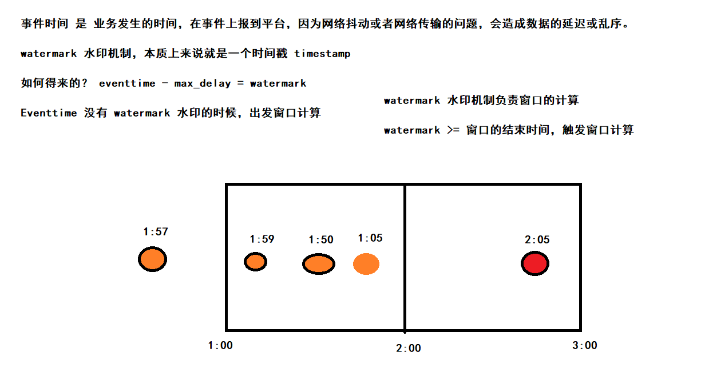

##### SQL 事件时间案例

来看看 Flink 中如何指定事件时间。

Event Time时间语义**使用一条数据实际发生的时间作为时间属性**，在Table API & SQL中这个字段通常被称为**rowtime**。这种模式下多次重复计算时，计算结果是确定的。这意味着，Event Time时间语义可以保证流处理和批处理的统一

Event Time时间语义下，我们需要设置每条数据发生时的时间戳，并提供一个Watermark。Watermark表示迟于该时间的数据都作为迟到数据对待

- CREATE TABLE DDL 指定时间戳的方式

  - ~~~sql
    CREATE TABLE user_actions (
      user_name STRING,
      data STRING,
      user_action_time TIMESTAMP(3),
      -- 使用下面这句来将 user_action_time 声明为事件时间，并且声明 watermark 的生成规则，即 user_action_time 减 5 秒
      -- 事件时间列的字段类型必须是 TIMESTAMP 或者 TIMESTAMP_LTZ 类型
      WATERMARK FOR user_action_time AS user_action_time - INTERVAL '5' SECOND
    ) WITH (
      ...
    );
    ~~~

  - 在上面的DDL中，**WATERMARK**起到了定义Event Time时间属性的作用，在这里暂时不讲解。

    如果想使用事件时间，那么我们的时间戳类型必须是 TIMESTAMP 或者 TIMESTAMP_LTZ 类型。

    但是实际应用中时间戳一般都是秒或者是毫秒（BIGINT 类型），那这种情况怎么办？

- **解决方案如下**：

  - ~~~sql
    CREATE TABLE user_actions (
      user_name STRING,
      data STRING,
      -- 1. 这个 ts 就是常见的毫秒级别时间戳
      ts BIGINT,
      -- 2. 将毫秒时间戳转换成 TIMESTAMP_LTZ 类型
      time_ltz AS TO_TIMESTAMP_LTZ(ts, 3),
      -- 3. 使用下面这句来将 user_action_time 声明为事件时间，并且声明 watermark 的生成规则，即 user_action_time 减 5 秒
      -- 事件时间列的字段类型必须是 TIMESTAMP 或者 TIMESTAMP_LTZ 类型
      WATERMARK FOR time_ltz AS time_ltz - INTERVAL '5' SECOND
    ) WITH (
      ...
    );
    ~~~

- 使用案例

  - 读取order.csv'文件的数据，定义现有事件时间字段上的 **watermark** 生成表达式，该表达式将事件时间字段标记为**事件时间属性**。

  - ~~~sql
    Flink SQL> create table InputTable2 (
     `userid` varchar,
     `timestamp` bigint,
     `money` double,
     `category` varchar,
     rt AS TO_TIMESTAMP(FROM_UNIXTIME(`timestamp`))
     ) with (
     'connector' = 'filesystem',
     'path' = 'file:///export/data/input/order.csv',
     'format' = 'csv'
    );
    
    Flink SQL> desc InputTable2;
    +-----------+--------------+------+-----+---------------------------------------------+-----------+
    |      name |         type | null | key |                                      extras | watermark |
    +-----------+--------------+------+-----+---------------------------------------------+-----------+
    |    userid |       STRING | TRUE |     |                                             |           |
    | timestamp |       BIGINT | TRUE |     |                                             |           |
    |     money |       DOUBLE | TRUE |     |                                             |           |
    |  category |       STRING | TRUE |     |                                             |           |
    |        rt | TIMESTAMP(3) | TRUE |     | AS TO_TIMESTAMP(FROM_UNIXTIME(`timestamp`)) |           |
    +-----------+--------------+------+-----+---------------------------------------------+-----------+
    ~~~
    
  - 这里可以看到并没有**rowtime**的时间属性标记，这种方式只是增加了一个 **rt** 的TIMESTAMP列，因此**事件时间**需要结合**watermark（水位线）**使用，**至于watermark知识点后续会讲到**。
  
  - ~~~sql
    Flink SQL> drop table InputTable2;
    [INFO] Execute statement succeed.
    
    Flink SQL> create table InputTable2 (
    `userid` varchar,
    `timestamp` bigint,
    `money` double,
    `category` varchar,
    rt AS TO_TIMESTAMP(FROM_UNIXTIME(`timestamp`)),
    watermark for rt as rt - interval '1' second
    ) with (
    'connector' = 'filesystem',
    'path' = 'file:///export/data/input/order.csv',
    'format' = 'csv'
    );
    Flink SQL> desc InputTable2;
    +-----------+------------------------+------+-----+---------------------------------------------+----------------------------+
    |      name  |                   type     | null | key |                                      extras |                  watermark |
    +-----------+------------------------+------+-----+---------------------------------------------+----------------------------+
    |    userid  |                 STRING    | TRUE |     |                                             |                            |
    | timestamp |                 BIGINT    | TRUE |     |                                             |                            |
    |     money  |                 DOUBLE     | TRUE |     |                                             |                            |
    |  category |                 STRING     | TRUE |     |                                             |                            |
    |        rt  | TIMESTAMP(3) *ROWTIME*  | TRUE |     | AS TO_TIMESTAMP(FROM_UNIXTIME(`timestamp`)) | `rt` - INTERVAL '1' SECOND |
    +-----------+------------------------+------+-----+---------------------------------------------+----------------------------+
    5 rows in set
    ~~~
  
  - 此时 **rt** 列被标记为 **rowtime** 的时间属性。

### SQL 的窗口操作（Window）

#### 知识点08：【理解】窗口的概述

在流处理应用中，数据是连续不断的，因此我们不可能等到所有数据都到了才开始处理。当然我们可以每来一个消息就处理一次，但是有时我们需要做一些聚合类的处理，例如：在过去的1分钟内有多少用户点击了我们的网页。在这种情况下，我们必须定义一个窗口，用来收集最近一分钟内的数据，并对这个窗口内的数据进行计算。

==窗口（window）就是从 Streaming 到 Batch 的一个桥梁。==

- 一个Window代表有限对象的集合。一个窗口有一个最大的时间戳，该时间戳意味着在其代表的某时间点——所有应该进入这个窗口的元素都已经到达

- Window就是用来对一个无限的流设置一个有限的集合，在有界的数据集上进行操作的一种机制。

- 在Table API和SQL中，主要有两种窗口：Group Windows 和 Over Windows。
  - Group Windows 根据时间或行计数间隔将组行聚合成有限的组，并对每个组计算一次聚合函数
  - Over Windows 窗口内聚合为每个输入行在其相邻行范围内计算一个聚合

#### Group Windows

##### 知识点08：【掌握】滚动窗口（TUMBLE）

**滚动窗口定义**：滚动窗口将每个元素指定给指定窗口大小的窗口。滚动窗口具有固定大小，且不重叠。例如，指定一个大小为 5 分钟的滚动窗口。在这种情况下，Flink 将每隔 5 分钟开启一个新的窗口，其中每一条数都会划分到唯一一个 5 分钟的窗口中，如下图所示。

 

TUMBLE函数基于时间属性字段为关系的每一行指定一个窗口。

在流模式下，时间属性字段必须是**事件或处理时间**属性。

在批处理模式下，窗口表函数的时间属性字段必须是**TIMESTAMP或TIMESTAMP _LTZ类型**的属性。TUMBLE的返回值是一个新的关系，它包括原始关系的所有列，以及另外3列**window_start、window_end、window_time，**以指示指定的窗口。原始时间属性**timecol**将是窗口TVF之后的常规时间戳列。

TUMBLE函数接受三个必需参数，一个可选参数：

~~~sql
TUMBLE(TABLE data, DESCRIPTOR(timecol), size [, offset ])
~~~

- data: 是一个表参数，可以是与时间属性列的任何关系。

- timecol: 是一个列描述符，指示数据的哪些时间属性列应映射到翻转窗口。

- size: 是指定滚动窗口宽度的持续时间。

- offset: 是一个可选参数，用于指定窗口起始位置的偏移量。

**应用场景**：常见的按照一分钟对数据进行聚合，计算一分钟内 PV，UV 数据。

**实际案例**：简单且常见的分维度分钟级别同时在线用户数、总销售额

那么上面这个案例的 SQL 要咋写呢？

关于滚动窗口，在 1.14 版本之前和 1.14 及之后版本有两种 Flink SQL 实现方式，分别是：

- Group Window Aggregation（**1.14** **之前只有此类方案，此方案在 1.14** **及之后版本已经标记为废弃，不推荐使用**）

- Windowing TVF（**1.14** **及之后建议使用 Windowing TVF**）

这里两种方法都会介绍：

- Group Window Aggregation 方案（**支持 Batch\Streaming 任务**）：

使用***\*socket\****演示：

准备测试数据：

~~~
6,12189,80729,1621718199
6,78750,7434,1621718201
6,38905,75583,1621718202
6,29388,52138,1621718205
6,51810,84241,1621718207
6,34713,87372,1621718208
6,62264,61675,1621718212
6,32460,29190,1621718260
6,73052,15170,1621718580
~~~

进入sql-client：

~~~sql
-- 数据源表
Flink SQL> CREATE TABLE source_table ( 
 dim STRING, 
 user_id BIGINT, 
 price BIGINT,
 `timestamp` bigint,
 row_time AS TO_TIMESTAMP(FROM_UNIXTIME(`timestamp`)),
 watermark for row_time as row_time - interval '0' second
) WITH (
  'connector' = 'socket',
  'hostname' = 'node1',        
  'port' = '9999',
  'format' = 'csv'
)

-- 数据处理逻辑
Flink SQL> select 
    dim,
    count(*) as pv,
    sum(price) as sum_price,
    max(price) as max_price,
    min(price) as min_price,
    -- 计算 uv 数
    count(distinct user_id) as uv,
    UNIX_TIMESTAMP(CAST(tumble_start(row_time, interval '5' second) AS STRING)) * 1000  as window_start
from source_table
group by
    dim,
    tumble(row_time, interval '5' second)
~~~

可以看到 Group Window Aggregation 滚动窗口的 SQL 语法就是把 tumble window 的声明写在了 group by 子句中，即 tumble(row_time, interval '1' minute)

第一个参数为事件时间的时间戳

第二个参数为滚动窗口大小

- Window TVF 方案（**1.14 只支持 Streaming 任务，1.15版本开始支持 Batch\Streaming 任务**）：

  - ~~~sql
    -- 数据源表
    Flink SQL> CREATE TABLE source_table ( 
     dim STRING, 
     user_id BIGINT, 
     price BIGINT,
     `timestamp` bigint,
     row_time AS TO_TIMESTAMP(FROM_UNIXTIME(`timestamp`)),
     watermark for row_time as row_time - interval '0' second
    ) WITH (
      'connector' = 'socket',
      'hostname' = 'node1',        
      'port' = '9999',
      'format' = 'csv'
    )
    
    -- 数据处理逻辑
    Flink SQL> SELECT 
        dim,
        UNIX_TIMESTAMP(CAST(window_start AS STRING)) * 1000 as window_start,
        UNIX_TIMESTAMP(CAST(window_end AS STRING)) * 1000 as window_end,
        count(*) as pv,
        sum(price) as sum_price,
        max(price) as max_price,
        min(price) as min_price,
        count(distinct user_id) as uv
    FROM TABLE(TUMBLE(
            TABLE source_table
            , DESCRIPTOR(row_time)
            , INTERVAL '5' SECOND))
    GROUP BY window_start, 
          window_end,
          dim;
    ~~~

  - 可以看到 Windowing TVF 滚动窗口的写法就是把 tumble window 的声明写在了数据源的 Table 子句中，即 TABLE(TUMBLE(TABLE source_table, DESCRIPTOR(row_time), INTERVAL '60' SECOND))，包含三部分参数。

    - 第一个参数 TABLE source_table 声明数据源表；
    - 第二个参数 DESCRIPTOR(row_time) 声明数据源的时间戳；
    - 第三个参数 INTERVAL '60' SECOND 声明滚动窗口大小为 1 min。

**SQL 语义：**

由于离线没有相同的时间窗口聚合概念，这里就直接说实时场景 SQL 语义，假设 Orders 为 kafka，target_table 也为 Kafka，这个 SQL 生成的实时任务，在执行时，会生成三个算子：

- 数据源算子（From Order）：连接到 Kafka topic，数据源算子一直运行，实时的从 Order Kafka 中一条一条的读取数据，然后一条一条发送给下游的 窗口聚合算子

- 窗口聚合算子（TUMBLE 算子）：接收到上游算子发的一条一条的数据，然后将每一条数据按照时间戳划分到对应的窗口中（根据事件时间、处理时间的不同语义进行划分），上述案例为事件时间，事件时间中，滚动窗口算子接收到上游的 Watermark 大于窗口的结束时间时，则说明当前这一分钟的滚动窗口已经结束了，将窗口计算完的结果发往下游算子（一条一条发给下游 数据汇算子）

- 数据汇算子（INSERT INTO target_table）：接收到上游发的一条一条的数据，写入到 target_table Kafka 中

这个实时任务也是 24 小时一直在运行的，所有的算子在同一时刻都是处于 running 状态的。

>事件时间中滚动窗口的窗口计算触发是由 **Watermark** 推动的。

##### 知识点09：【掌握】滑动窗口（HOP）

**滑动窗口定义**：滑动窗口也是将元素指定给固定长度的窗口。与滚动窗口功能一样，也有窗口大小的概念。不一样的地方在于，滑动窗口有另一个参数控制窗口计算的频率（滑动窗口滑动的步长）。因此，如果滑动的步长小于窗口大小，则滑动窗口之间每个窗口是可以重叠。在这种情况下，一条数据就会分配到多个窗口当中。举例，有 10 分钟大小的窗口，滑动步长为 5 分钟。这样，每 5 分钟会划分一次窗口，这个窗口包含的数据是过去 10 分钟内的数据，如下图所示。

在流模式下，时间属性字段必须是**事件或处理时间**属性。

在批处理模式下，窗口表函数的时间属性字段必须是**TIMESTAMP或TIMESTAMP _LTZ类型**的属性。TUMBLE的返回值是一个新的关系，它包括原始关系的所有列，以及另外3列“**window_start、window_end、window_time**，以指示指定的窗口。原始时间属性**timecol**将是窗口TVF之后的常规时间戳列。

HOP接受四个必需参数，一个可选参数：

~~~sql
HOP(TABLE data, DESCRIPTOR(timecol), slide, size [, offset ])
~~~

- data: 是一个表参数，可以是与时间属性列的任何关系。
- timecol：是一个列描述符，指示数据的哪些时间属性列应映射到跳跃窗口。
- slide: 是一个持续时间，指定顺序跳跃窗口开始之间的持续时间
- size: 是指定跳跃窗口宽度的持续时间。
- offset: 是一个可选参数，用于指定窗口起始位置的偏移量。

**应用场景**：比如计算同时在线的数据，要求结果的输出频率是 1 分钟一次，每次计算的数据是过去 5 分钟的数据（有的场景下用户可能在线，但是可能会 2 分钟不活跃，但是这也要算在同时在线数据中，所以取最近 5 分钟的数据就能计算进去了）

**实际案例**：简单且常见的分维度分钟级别同时在线用户数，1 分钟输出一次，计算最近 5 分钟的数据

依然是 Group Window Aggregation、Windowing TVF 两种方案：

- Group Window Aggregation 方案（**支持 Batch\Streaming 任务**）：

  - ~~~sql
    -- 数据源表
    Flink SQL> CREATE TABLE source_table ( 
     dim STRING, 
     user_id BIGINT, 
     price BIGINT,
     `timestamp` bigint,
     row_time AS TO_TIMESTAMP(FROM_UNIXTIME(`timestamp`)),
     watermark for row_time as row_time - interval '0' second
    ) WITH (
      'connector' = 'socket',
      'hostname' = 'node1',        
      'port' = '9999',
      'format' = 'csv'
    )
    
    -- 数据处理逻辑
    Flink SQL> SELECT dim,
        UNIX_TIMESTAMP(CAST(hop_start(row_time, interval '2' SECOND, interval '5' SECOND) AS STRING)) * 1000 as window_start, 
        count(distinct user_id) as uv
    FROM source_table
    GROUP BY dim
        , hop(row_time, interval '2' SECOND, interval '5' SECOND)
    ~~~

  - 可以看到 Group Window Aggregation 滚动窗口的写法就是把 hop window 的声明写在了 group by 子句中，即 hop(row_time, interval '1' minute, interval '5' minute)。其中：

    - 第一个参数为事件时间的时间戳；
    - 第二个参数为滑动窗口的滑动步长；
    - 第三个参数为滑动窗口大小。

- Windowing TVF 方案（**1.14只支持 Streaming 任务，1.15版本开始支持 Batch\Streaming 任务**）：（TVF:表值函数  Table-Value-Function）

  - ~~~sql
    -- 数据源表
    Flink SQL> CREATE TABLE source_table ( 
     dim STRING, 
     user_id BIGINT, 
     price BIGINT,
     `timestamp` bigint,
     row_time AS TO_TIMESTAMP(FROM_UNIXTIME(`timestamp`)),
     watermark for row_time as row_time - interval '0' second
    ) WITH (
      'connector' = 'socket',
      'hostname' = 'node1',        
      'port' = '9999',
      'format' = 'csv'
    )
    
    -- 数据处理逻辑
    Flink SQL> SELECT 
        dim,
    UNIX_TIMESTAMP(CAST(window_start AS STRING)) * 1000 as window_start,  
    UNIX_TIMESTAMP(CAST(window_end AS STRING)) * 1000 as window_end, 
        count(distinct user_id) as bucket_uv
    FROM TABLE(HOP(
            TABLE source_table
            , DESCRIPTOR(row_time)
            , interval '2' SECOND, interval '6' SECOND))
    GROUP BY window_start, 
          window_end,
          dim;
    ~~~

  - 可以看到 Windowing TVF 滚动窗口的写法就是把 hop window 的声明写在了数据源的 Table 子句中，即 TABLE(HOP(TABLE source_table, DESCRIPTOR(row_time), INTERVAL '1' MINUTES, INTERVAL '5' MINUTES))，包含四部分参数：

    - 第一个参数 TABLE source_table 声明数据源表；
    - 第二个参数 DESCRIPTOR(row_time) 声明数据源的时间戳；
    - 第三个参数 INTERVAL '1' MINUTES 声明滚动窗口滑动步长大小为 1 min。
    - 第四个参数 INTERVAL '5' MINUTES 声明滚动窗口大小为 5 min。

**SQL 语义**：滑动窗口语义和滚动窗口类似，这里不再赘述。

##### 知识点10：【掌握】Session 窗口（SESSION）

**Session 窗口定义**：Session 时间窗口和滚动、滑动窗口不一样，其没有固定的持续时间，如果在定义的间隔期（Session Gap）内没有新的数据出现，则 Session 就会窗口关闭。如下图对比所示：

**实际案例**：计算每个用户在活跃期间（一个 Session）总共购买的商品数量，如果用户 5 分钟没有活动则视为 Session 断开

目前 1.15 版本中 Flink SQL 不支持 Session 窗口的 Window TVF，所以这里就只介绍 Group Window Aggregation 方案：

- Group Window Aggregation 方案（**支持 Batch\Streaming 任务**）：

  - ~~~sql
    -- 数据源表，用户购买行为记录表
    Flink SQL> CREATE TABLE source_table ( 
     dim STRING, 
     user_id BIGINT, 
     price BIGINT,
     `timestamp` bigint,
     row_time AS TO_TIMESTAMP(FROM_UNIXTIME(`timestamp`)),
     watermark for row_time as row_time - interval '0' second
    ) WITH (
      'connector' = 'socket',
      'hostname' = 'node1',        
      'port' = '9999',
      'format' = 'csv'
    )
    
    -- 数据处理逻辑
    Flink SQL> SELECT 
        dim,
        UNIX_TIMESTAMP(CAST(session_start(row_time, interval '5' SECOND) AS STRING)) * 1000 as window_start, 
        count(1) as pv
    FROM source_table
    GROUP BY dim
          , session(row_time, interval '5' SECOND)
    ~~~

>上述 SQL 任务是在整个 Session 窗口结束之后才会把数据输出。Session 窗口即支持 处理时间 也支持 事件时间。但是处理时间只支持在 Streaming 任务中运行，Batch 任务不支持。

可以看到 Group Window Aggregation 中 Session 窗口的写法就是把 session window 的声明写在了 group by 子句中，即 session(row_time, interval '5' minute)。其中：

- 第一个参数为事件时间的时间戳；

- 第二个参数为 Session gap 间隔。

**SQL 语义**：Session 窗口语义和滚动窗口类似，这里不再赘述。

##### 知识点11：【掌握】渐进式窗口（CUMULATE）

**渐进式窗口定义**：渐进式窗口在其实就是 固定窗口间隔内提前触发的的滚动窗口，其实就是 Tumble Window + early-fire 的一个事件时间的版本。例如，从每日零点到当前这一分钟绘制累积 UV，其中 10:00 时的 UV 表示从 00:00 到 10:00 的 UV 总数。

渐进式窗口可以认为是首先开一个最大窗口大小的滚动窗口，然后根据用户设置的触发的时间间隔将这个滚动窗口拆分为多个窗口，这些窗口具有相同的窗口起点和不同的窗口终点。如下图所示：

这些CUMULATE函数根据时间属性列分配窗口。

在流模式下，时间属性字段必须是[**事件或处理时间属性](https://nightlies.apache.org/flink/flink-docs-release-1.15/zh/docs/dev/table/concepts/time_attributes/)。

在批处理模式下，窗口表函数的时间属性字段必须是**TIMESTAMP或TIMESTAMP _LTZ类型**的属性。CUMULATE的返回值是一个新的关系，它包括原始关系的所有列，以及另外3列“**window_start、window_end、window_time**”，以指示指定的窗口。原始时间属性“**timecol**”将是窗口TVF之后的常规时间戳列。

CUMULATE接受四个必需参数，一个可选参数：

~~~sql
CUMULATE(TABLE data, DESCRIPTOR(timecol), step, size)
~~~

- data: 是一个表参数，可以是与时间属性列的任何关系。
- timecol：是一个列描述符，指示数据的哪些时间属性列应映射到累积窗口。

- step: 是指定连续累积窗口结束之间增加的窗口大小的持续时间。

- size: 是指定累积窗口的最大宽度的持续时间。size必须是 的整数倍step。

- offset: 是一个可选参数，用于指定窗口起始位置的偏移量。

**应用场景**：周期内累计 PV，UV 指标（如每天累计到当前这一分钟的 PV，UV）。这类指标是一段周期内的累计状态，对分析师来说更具统计分析价值，而且几乎所有的复合指标都是基于此类指标的统计（不然离线为啥都要累计一天的数据，而不要一分钟累计的数据呢）。

**实际案例**：每天的截止当前分钟的累计 money（sum(money)），去重 id 数（count(distinct id)）。每天代表渐进式窗口大小为 1 天，分钟代表渐进式窗口移动步长为分钟级别。举例如下：

明细输入数据：

| **time**            | **id** | **money** |
| ------------------- | ------ | --------- |
| 2021-11-01 00:01:00 | A      | 3         |
| 2021-11-01 00:01:00 | B      | 5         |
| 2021-11-01 00:01:00 | A      | 7         |
| 2021-11-01 00:02:00 | C      | 3         |
| 2021-11-01 00:03:00 | C      | 10        |

预期经过渐进式窗口计算的输出数据：

| **time**            | **count distinct id** | **sum money** |
| ------------------- | --------------------- | ------------- |
| 2021-11-01 00:01:00 | 2                     | 15            |
| 2021-11-01 00:02:00 | 3                     | 18            |
| 2021-11-01 00:03:00 | 3                     | 28            |

转化为折线图长这样：

可以看到，其特点就在于，每一分钟的输出结果都是当天零点累计到当前的结果。

渐进式窗口目前只有 Windowing TVF 方案支持：

- Windowing TVF 方案（**1.14 只支持 Streaming 任务，1.15版本开始\*******\*支持 Batch\Streaming 任务**）：

  - ~~~sql
    -- 数据源表
    Flink SQL> CREATE TABLE source_table (
        -- 用户 id
        user_id BIGINT,
        -- 用户
        money BIGINT,
        -- 事件时间戳
        row_time AS cast(CURRENT_TIMESTAMP as timestamp(3)),
        -- watermark 设置
        WATERMARK FOR row_time AS row_time - INTERVAL '5' SECOND
    ) WITH (
      'connector' = 'datagen',
      'rows-per-second' = '10',
      'fields.user_id.min' = '1',
      'fields.user_id.max' = '100000',
      'fields.price.min' = '1',
      'fields.price.max' = '100000'
    );
    
    -- 数据汇表
    Flink SQL> CREATE TABLE sink_table (
        window_end bigint,
        window_start bigint,
        sum_money BIGINT,
        count_distinct_id bigint
    ) WITH (
      'connector' = 'print'
    );
    
    -- 数据处理逻辑
    Flink SQL> insert into sink_table
    SELECT 
        UNIX_TIMESTAMP(CAST(window_end AS STRING)) * 1000 as window_end, 
        window_start, 
        sum(money) as sum_money,
        count(distinct id) as count_distinct_id
    FROM TABLE(CUMULATE(
           TABLE source_table
           , DESCRIPTOR(row_time)
           , INTERVAL '60' SECOND
           , INTERVAL '1' DAY))
    GROUP BY
        window_start, 
        window_end
    ~~~

  - 可以看到 Windowing TVF 滚动窗口的写法就是把 cumulate window 的声明写在了数据源的 Table 子句中，即 TABLE(CUMULATE(TABLE source_table, DESCRIPTOR(row_time), INTERVAL '60' SECOND, INTERVAL '1' DAY))，其中包含四部分参数：

    - 第一个参数 TABLE source_table 声明数据源表；
    - 第二个参数 DESCRIPTOR(row_time) 声明数据源的时间戳；
    - 第三个参数 INTERVAL '60' SECOND 声明渐进式窗口触发的渐进步长为 1 min。
    - 第四个参数 INTERVAL '1' DAY 声明整个渐进式窗口的大小为 1 天，到了第二天新开一个窗口重新累计。

**SQL 语义**：渐进式窗口语义和滚动窗口类似，这里不再赘述。

#### Over Windows

**Over 聚合定义（支持 Batch\Streaming）**：可以理解为是一种特殊的滑动窗口聚合函数。

那这里我们拿 Over 聚合 与 窗口聚合 做一个对比，其之间的最大不同之处在于：

- 窗口聚合：不在 group by 中的字段，不能直接在 select 中拿到

- Over 聚合：能够保留原始字段

注意：

其实在生产环境中，Over 聚合的使用场景还是比较少的。在 Hive 中也有相同的聚合，但是可以想想你在离线数仓经常使用嘛？

**应用场景**：计算最近一段滑动窗口的聚合结果数据。

**实际案例**：查询每个产品最近一小时订单的金额总和：

~~~sql
SELECT order_id, order_time, amount,
  SUM(amount) OVER (
    PARTITION BY product
    ORDER BY order_time
    RANGE BETWEEN INTERVAL '1' HOUR PRECEDING AND CURRENT ROW
  ) AS one_hour_prod_amount_sum
FROM Orders
~~~

Over 聚合的语法总结如下：

~~~sql
SELECT
  agg_func(agg_col) OVER (
    [PARTITION BY col1[, col2, ...]]
    ORDER BY time_col
    range_definition),
  ...
FROM ...
~~~

其中：

- ORDER BY：必须是时间戳列（事件时间、处理时间）

- PARTITION BY：标识了聚合窗口的聚合粒度，如上述案例是按照 product 进行聚合

- range_definition：这个标识聚合窗口的聚合数据范围，在 Flink 中有两种指定数据范围的方式。第一种为 按照行数聚合，第二种为 按照时间区间聚合。如下案例所示：

##### 知识点12：【掌握】时间区间聚合

按照时间区间聚合就是时间区间的一个滑动窗口，比如下面案例 1 小时的区间，最新输出的一条数据的 sum 聚合结果就是最近一小时数据的 amount 之和。

~~~sql
CREATE TABLE source_table (
    order_id BIGINT,
    product BIGINT,
    amount BIGINT,
    order_time as cast(CURRENT_TIMESTAMP as TIMESTAMP(3)),
    WATERMARK FOR order_time AS order_time - INTERVAL '0.001' SECOND
) WITH (
  'connector' = 'datagen',
  'rows-per-second' = '1',
  'fields.order_id.min' = '1',
  'fields.order_id.max' = '2',
  'fields.amount.min' = '1',
  'fields.amount.max' = '10',
  'fields.product.min' = '1',
  'fields.product.max' = '2'
);

CREATE TABLE sink_table (
    product BIGINT,
    order_time TIMESTAMP(3),
    amount BIGINT,
    one_hour_prod_amount_sum BIGINT
) WITH (
  'connector' = 'print'
);

INSERT INTO sink_table
SELECT product, order_time, amount,
  SUM(amount) OVER (
    PARTITION BY product
    ORDER BY order_time
    -- 标识统计范围是一个 product 的最近 1 小时的数据
    RANGE BETWEEN INTERVAL '1' HOUR PRECEDING AND CURRENT ROW
  ) AS one_hour_prod_amount_sum
FROM source_table
~~~

结果如下：

~~~
+I[2, 2021-12-24T22:08:26.583, 7, 73]
+I[2, 2021-12-24T22:08:27.583, 7, 80]
+I[2, 2021-12-24T22:08:28.583, 4, 84]
+I[2, 2021-12-24T22:08:29.584, 7, 91]
+I[2, 2021-12-24T22:08:30.583, 8, 99]
+I[1, 2021-12-24T22:08:31.583, 9, 138]
+I[2, 2021-12-24T22:08:32.584, 6, 105]
+I[1, 2021-12-24T22:08:33.584, 7, 145]
~~~

##### 知识点13：【掌握】行数聚合

按照行数聚合就是数据行数的一个滑动窗口，比如下面案例，最新输出的一条数据的 sum 聚合结果就是最近 5 行数据的 amount 之和。

~~~sql
CREATE TABLE source_table (
    order_id BIGINT,
    product BIGINT,
    amount BIGINT,
    order_time as cast(CURRENT_TIMESTAMP as TIMESTAMP(3)),
    WATERMARK FOR order_time AS order_time - INTERVAL '0.001' SECOND
) WITH (
  'connector' = 'datagen',
  'rows-per-second' = '1',
  'fields.order_id.min' = '1',
  'fields.order_id.max' = '2',
  'fields.amount.min' = '1',
  'fields.amount.max' = '2',
  'fields.product.min' = '1',
  'fields.product.max' = '2'
);

CREATE TABLE sink_table (
    product BIGINT,
    order_time TIMESTAMP(3),
    amount BIGINT,
    one_hour_prod_amount_sum BIGINT
) WITH (
  'connector' = 'print'
);

INSERT INTO sink_table
SELECT product, order_time, amount,
  SUM(amount) OVER (
    PARTITION BY product
    ORDER BY order_time
    -- 标识统计范围是一个 product 的最近 5 行数据
    ROWS BETWEEN 5 PRECEDING AND CURRENT ROW
  ) AS one_hour_prod_amount_sum
FROM source_table
~~~

预期结果如下：

~~~
+I[2, 2021-12-24T22:18:19.147, 1, 9]
+I[1, 2021-12-24T22:18:20.147, 2, 11]
+I[1, 2021-12-24T22:18:21.147, 2, 12]
+I[1, 2021-12-24T22:18:22.147, 2, 12]
+I[1, 2021-12-24T22:18:23.148, 2, 12]
+I[1, 2021-12-24T22:18:24.147, 1, 11]
+I[1, 2021-12-24T22:18:25.146, 1, 10]
+I[1, 2021-12-24T22:18:26.147, 1, 9]
+I[2, 2021-12-24T22:18:27.145, 2, 11]
+I[2, 2021-12-24T22:18:28.148, 1, 10]
+I[2, 2021-12-24T22:18:29.145, 2, 10]
~~~

当然，如果你在一个 SELECT 中有多个聚合窗口的聚合方式，Flink SQL 支持了一种简化写法，如下案例：

~~~sql
SELECT order_id, order_time, amount,
SUM(amount) OVER w AS sum_amount,
AVG(amount) OVER w AS avg_amount
FROM Orders
-- 使用下面子句，定义 Over Window
WINDOW w AS (
PARTITION BY product
ORDER BY order_time
RANGE BETWEEN INTERVAL '1' HOUR PRECEDING AND CURRENT ROW)
~~~
