# Day05-笔记

## 今日目标

+ 掌握Flink的三种时间属性
+ 掌握SQL的窗口操作
+ 掌握SQL的水印操作
+ 掌握SQL的容错机制

+ 了解SQL的时区问题

## FlinkSQL整体概述

### SQL 的窗口操作（Window）

#### 知识点08：【理解】窗口的概述

在流处理应用中，数据是连续不断的，因此我们不可能等到所有数据都到了才开始处理。当然我们可以每来一个消息就处理一次，但是有时我们需要做一些聚合类的处理，例如：在过去的1分钟内有多少用户点击了我们的网页。在这种情况下，我们必须定义一个窗口，用来收集最近一分钟内的数据，并对这个窗口内的数据进行计算。

Flink 认为 Batch 是 Streaming 的一个特例，所以 Flink 底层引擎是一个流式引擎，在上面实现了流处理和批处理。而窗口（window）就是从 Streaming 到 Batch 的一个桥梁。

- 一个Window代表有限对象的集合。一个窗口有一个最大的时间戳，该时间戳意味着在其代表的某时间点——所有应该进入这个窗口的元素都已经到达

- Window就是用来对一个无限的流设置一个有限的集合，在有界的数据集上进行操作的一种机制。

- 在Table API和SQL中，主要有两种窗口：Group Windows 和 Over Windows。
  - Group Windows 根据时间或行计数间隔将组行聚合成有限的组，并对每个组计算一次聚合函数
  - Over Windows 窗口内聚合为每个输入行在其相邻行范围内计算一个聚合

#### Group Windows

##### 知识点08：【掌握】滚动窗口（TUMBLE）

**滚动窗口定义**：滚动窗口将每个元素指定给指定窗口大小的窗口。滚动窗口具有固定大小，且不重叠。例如，指定一个大小为 5 分钟的滚动窗口。在这种情况下，Flink 将每隔 5 分钟开启一个新的窗口，其中每一条数都会划分到唯一一个 5 分钟的窗口中，如下图所示。

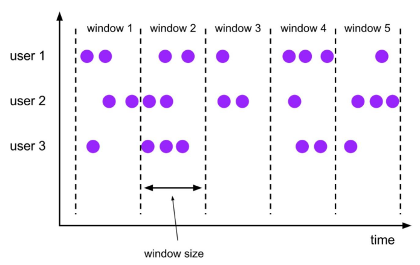 

TUMBLE函数基于时间属性字段为关系的每一行指定一个窗口。

在流模式下，时间属性字段必须是**事件或处理时间**属性。

在批处理模式下，窗口表函数的时间属性字段必须是**TIMESTAMP或TIMESTAMP _LTZ类型**的属性。TUMBLE的返回值是一个新的关系，它包括原始关系的所有列，以及另外3列**window_start、window_end、window_time，**以指示指定的窗口。原始时间属性**timecol**将是窗口TVF之后的常规时间戳列。

TUMBLE函数接受三个必需参数，一个可选参数：

~~~sql
TUMBLE(TABLE data, DESCRIPTOR(timecol), size [, offset ])
~~~

- data: 是一个表参数，可以是与时间属性列的任何关系。

- timecol: 是一个列描述符，指示数据的哪些时间属性列应映射到翻转窗口。

- size: 是指定滚动窗口宽度的持续时间。

- offset: 是一个可选参数，用于指定窗口起始位置的偏移量。

**应用场景**：常见的按照一分钟对数据进行聚合，计算一分钟内 PV，UV 数据。

**实际案例**：简单且常见的分维度分钟级别同时在线用户数、总销售额

那么上面这个案例的 SQL 要咋写呢？

关于滚动窗口，在 1.14 版本之前和 1.14 及之后版本有两种 Flink SQL 实现方式，分别是：

- Group Window Aggregation（**1.14** **之前只有此类方案，此方案在 1.14** **及之后版本已经标记为废弃，不推荐使用**）

- Windowing TVF（**1.14** **及之后建议使用 Windowing TVF**）

这里两种方法都会介绍：

- Group Window Aggregation 方案（**支持 Batch\Streaming 任务**）：

使用**socket**演示：

准备测试数据：

~~~
6,12189,80729,1621718199
6,78750,7434,1621718201
6,38905,75583,1621718202
6,29388,52138,1621718205
6,51810,84241,1621718207
6,34713,87372,1621718208
6,62264,61675,1621718212
6,32460,29190,1621718260
6,73052,15170,1621718580
~~~

进入sql-client：

~~~sql
-- 数据源表
Flink SQL> CREATE TABLE source_table ( 
 dim STRING, 
 user_id BIGINT, 
 price BIGINT,
 `timestamp` bigint,
 row_time AS TO_TIMESTAMP(FROM_UNIXTIME(`timestamp`)),
 watermark for row_time as row_time - interval '0' second
) WITH (
  'connector' = 'socket',
  'hostname' = 'node1',        
  'port' = '9999',
  'format' = 'csv'
)

-- 数据处理逻辑
Flink SQL> select 
    dim,
    count(*) as pv,
    sum(price) as sum_price,
    max(price) as max_price,
    min(price) as min_price,
    -- 计算 uv 数
    count(distinct user_id) as uv,
    UNIX_TIMESTAMP(CAST(tumble_start(row_time, interval '5' second) AS STRING)) * 1000  as window_start
from source_table
group by
    dim,
    tumble(row_time, interval '5' second)
~~~

可以看到 Group Window Aggregation 滚动窗口的 SQL 语法就是把 tumble window 的声明写在了 group by 子句中，即 tumble(row_time, interval '1' minute)

第一个参数为事件时间的时间戳

第二个参数为滚动窗口大小

- Window TVF 方案（**1.14 只支持 Streaming 任务，1.15版本开始支持 Batch\Streaming 任务**）：

  - ~~~sql
    -- 数据源表
    Flink SQL> CREATE TABLE source_table ( 
     dim STRING, 
     user_id BIGINT, 
     price BIGINT,
     `timestamp` bigint,
     row_time AS TO_TIMESTAMP(FROM_UNIXTIME(`timestamp`)),
     watermark for row_time as row_time - interval '0' second
    ) WITH (
      'connector' = 'socket',
      'hostname' = 'node1',        
      'port' = '9999',
      'format' = 'csv'
    )
    
    -- 数据处理逻辑
    Flink SQL> SELECT 
        dim,
        UNIX_TIMESTAMP(CAST(window_start AS STRING)) * 1000 as window_start,
        UNIX_TIMESTAMP(CAST(window_end AS STRING)) * 1000 as window_end,
        count(*) as pv,
        sum(price) as sum_price,
        max(price) as max_price,
        min(price) as min_price,
        count(distinct user_id) as uv
    FROM TABLE(TUMBLE(
            TABLE source_table
            , DESCRIPTOR(row_time)
            , INTERVAL '5' SECOND))
    GROUP BY window_start, 
          window_end,
          dim;
    ~~~

  - 可以看到 Windowing TVF 滚动窗口的写法就是把 tumble window 的声明写在了数据源的 Table 子句中，即 TABLE(TUMBLE(TABLE source_table, DESCRIPTOR(row_time), INTERVAL '60' SECOND))，包含三部分参数。

    - 第一个参数 TABLE source_table 声明数据源表；
    - 第二个参数 DESCRIPTOR(row_time) 声明数据源的时间戳；
    - 第三个参数 INTERVAL '60' SECOND 声明滚动窗口大小为 1 min。

**SQL 语义：**

由于离线没有相同的时间窗口聚合概念，这里就直接说实时场景 SQL 语义，假设 Orders 为 kafka，target_table 也为 Kafka，这个 SQL 生成的实时任务，在执行时，会生成三个算子：

- 数据源算子（From Order）：连接到 Kafka topic，数据源算子一直运行，实时的从 Order Kafka 中一条一条的读取数据，然后一条一条发送给下游的 窗口聚合算子

- 窗口聚合算子（TUMBLE 算子）：接收到上游算子发的一条一条的数据，然后将每一条数据按照时间戳划分到对应的窗口中（根据事件时间、处理时间的不同语义进行划分），上述案例为事件时间，事件时间中，滚动窗口算子接收到上游的 Watermark 大于窗口的结束时间时，则说明当前这一分钟的滚动窗口已经结束了，将窗口计算完的结果发往下游算子（一条一条发给下游 数据汇算子）

- 数据汇算子（INSERT INTO target_table）：接收到上游发的一条一条的数据，写入到 target_table Kafka 中

这个实时任务也是 24 小时一直在运行的，所有的算子在同一时刻都是处于 running 状态的。

>事件时间中滚动窗口的窗口计算触发是由 **Watermark** 推动的。

##### 知识点09：【掌握】滑动窗口（HOP）

**滑动窗口定义**：滑动窗口也是将元素指定给固定长度的窗口。与滚动窗口功能一样，也有窗口大小的概念。不一样的地方在于，滑动窗口有另一个参数控制窗口计算的频率（滑动窗口滑动的步长）。因此，如果滑动的步长小于窗口大小，则滑动窗口之间每个窗口是可以重叠。在这种情况下，一条数据就会分配到多个窗口当中。举例，有 10 分钟大小的窗口，滑动步长为 5 分钟。这样，每 5 分钟会划分一次窗口，这个窗口包含的数据是过去 10 分钟内的数据，如下图所示。

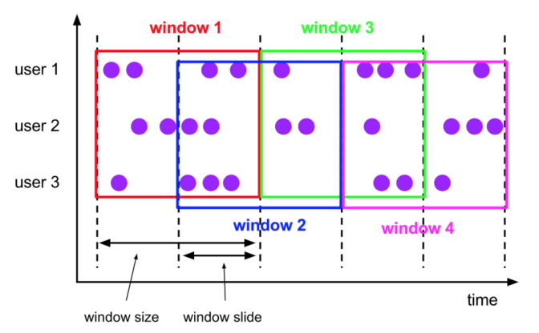

在流模式下，时间属性字段必须是**事件或处理时间**属性。

在批处理模式下，窗口表函数的时间属性字段必须是**TIMESTAMP或TIMESTAMP _LTZ类型**的属性。TUMBLE的返回值是一个新的关系，它包括原始关系的所有列，以及另外3列“**window_start、window_end、window_time**，以指示指定的窗口。原始时间属性**timecol**将是窗口TVF之后的常规时间戳列。

HOP接受四个必需参数，一个可选参数：

~~~sql
HOP(TABLE data, DESCRIPTOR(timecol), slide, size [, offset ])
~~~

- data: 是一个表参数，可以是与时间属性列的任何关系。
- timecol：是一个列描述符，指示数据的哪些时间属性列应映射到跳跃窗口。
- slide: 是一个持续时间，指定顺序跳跃窗口开始之间的持续时间
- size: 是指定跳跃窗口宽度的持续时间。
- offset: 是一个可选参数，用于指定窗口起始位置的偏移量。

**应用场景**：比如计算同时在线的数据，要求结果的输出频率是 1 分钟一次，每次计算的数据是过去 5 分钟的数据（有的场景下用户可能在线，但是可能会 2 分钟不活跃，但是这也要算在同时在线数据中，所以取最近 5 分钟的数据就能计算进去了）

**实际案例**：简单且常见的分维度分钟级别同时在线用户数，1 分钟输出一次，计算最近 5 分钟的数据

依然是 Group Window Aggregation、Windowing TVF 两种方案：

- Group Window Aggregation 方案（**支持 Batch\Streaming 任务**）：

  - ~~~sql
    -- 数据源表
    Flink SQL> CREATE TABLE source_table ( 
     dim STRING, 
     user_id BIGINT, 
     price BIGINT,
     `timestamp` bigint,
     row_time AS TO_TIMESTAMP(FROM_UNIXTIME(`timestamp`)),
     watermark for row_time as row_time - interval '0' second
    ) WITH (
      'connector' = 'socket',
      'hostname' = 'node1',        
      'port' = '9999',
      'format' = 'csv'
    )
    
    -- 数据处理逻辑
    Flink SQL> SELECT dim,
        UNIX_TIMESTAMP(CAST(hop_start(row_time, interval '2' SECOND, interval '5' SECOND) AS STRING)) * 1000 as window_start, 
        count(distinct user_id) as uv
    FROM source_table
    GROUP BY dim
        , hop(row_time, interval '2' SECOND, interval '5' SECOND)
    ~~~

  - 可以看到 Group Window Aggregation 滚动窗口的写法就是把 hop window 的声明写在了 group by 子句中，即 hop(row_time, interval '1' minute, interval '5' minute)。其中：

    - 第一个参数为事件时间的时间戳；
    - 第二个参数为滑动窗口的滑动步长；
    - 第三个参数为滑动窗口大小。

- Windowing TVF 方案（**1.14只支持 Streaming 任务，1.15版本开始支持 Batch\Streaming 任务**）：

  - ~~~sql
    -- 数据源表
    Flink SQL> CREATE TABLE source_table ( 
     dim STRING, 
     user_id BIGINT, 
     price BIGINT,
     `timestamp` bigint,
     row_time AS TO_TIMESTAMP(FROM_UNIXTIME(`timestamp`)),
     watermark for row_time as row_time - interval '0' second
    ) WITH (
      'connector' = 'socket',
      'hostname' = 'node1',        
      'port' = '9999',
      'format' = 'csv'
    )
    
    -- 数据处理逻辑
    Flink SQL> SELECT 
        dim,
    UNIX_TIMESTAMP(CAST(window_start AS STRING)) * 1000 as window_start,  
    UNIX_TIMESTAMP(CAST(window_end AS STRING)) * 1000 as window_end, 
        count(distinct user_id) as bucket_uv
    FROM TABLE(HOP(
            TABLE source_table
            , DESCRIPTOR(row_time)
            , interval '2' SECOND, interval '6' SECOND))
    GROUP BY window_start, 
          window_end,
          dim;
    ~~~

  - 可以看到 Windowing TVF 滚动窗口的写法就是把 hop window 的声明写在了数据源的 Table 子句中，即 TABLE(HOP(TABLE source_table, DESCRIPTOR(row_time), INTERVAL '1' MINUTES, INTERVAL '5' MINUTES))，包含四部分参数：

    - 第一个参数 TABLE source_table 声明数据源表；
    - 第二个参数 DESCRIPTOR(row_time) 声明数据源的时间戳；
    - 第三个参数 INTERVAL '1' MINUTES 声明滚动窗口滑动步长大小为 1 min。
    - 第四个参数 INTERVAL '5' MINUTES 声明滚动窗口大小为 5 min。

**SQL 语义**：滑动窗口语义和滚动窗口类似，这里不再赘述。

##### 知识点10：【掌握】Session 窗口（SESSION）

**Session 窗口定义**：Session 时间窗口和滚动、滑动窗口不一样，其没有固定的持续时间，如果在定义的间隔期（Session Gap）内没有新的数据出现，则 Session 就会窗口关闭。如下图对比所示：

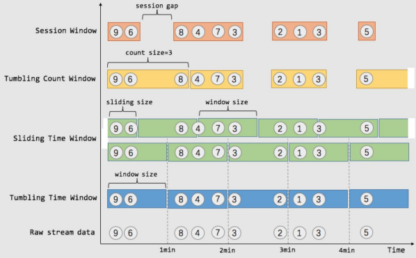

**实际案例**：计算每个用户在活跃期间（一个 Session）总共购买的商品数量，如果用户 5 分钟没有活动则视为 Session 断开

目前 1.15 版本中 Flink SQL 不支持 Session 窗口的 Window TVF，所以这里就只介绍 Group Window Aggregation 方案：

- Group Window Aggregation 方案（**支持 Batch\Streaming 任务**）：

  - ~~~sql
    -- 数据源表，用户购买行为记录表
    Flink SQL> CREATE TABLE source_table ( 
     dim STRING, 
     user_id BIGINT, 
     price BIGINT,
     `timestamp` bigint,
     row_time AS TO_TIMESTAMP(FROM_UNIXTIME(`timestamp`)),
     watermark for row_time as row_time - interval '0' second
    ) WITH (
      'connector' = 'socket',
      'hostname' = 'node1',        
      'port' = '9999',
      'format' = 'csv'
    )
    
    -- 数据处理逻辑
    Flink SQL> SELECT 
        dim,
        UNIX_TIMESTAMP(CAST(session_start(row_time, interval '5' SECOND) AS STRING)) * 1000 as window_start, 
        count(1) as pv
    FROM source_table
    GROUP BY dim
          , session(row_time, interval '5' SECOND)
    ~~~

>上述 SQL 任务是在整个 Session 窗口结束之后才会把数据输出。Session 窗口即支持 处理时间 也支持 事件时间。但是处理时间只支持在 Streaming 任务中运行，Batch 任务不支持。

可以看到 Group Window Aggregation 中 Session 窗口的写法就是把 session window 的声明写在了 group by 子句中，即 session(row_time, interval '5' minute)。其中：

- 第一个参数为事件时间的时间戳；

- 第二个参数为 Session gap 间隔。

**SQL 语义**：Session 窗口语义和滚动窗口类似，这里不再赘述。

##### 知识点11：【掌握】渐进式窗口（CUMULATE）

**渐进式窗口定义**：渐进式窗口在其实就是 固定窗口间隔内提前触发的的滚动窗口，其实就是 Tumble Window + early-fire 的一个事件时间的版本。例如，从每日零点到当前这一分钟绘制累积 UV，其中 10:00 时的 UV 表示从 00:00 到 10:00 的 UV 总数。

渐进式窗口可以认为是首先开一个最大窗口大小的滚动窗口，然后根据用户设置的触发的时间间隔将这个滚动窗口拆分为多个窗口，这些窗口具有相同的窗口起点和不同的窗口终点。如下图所示：

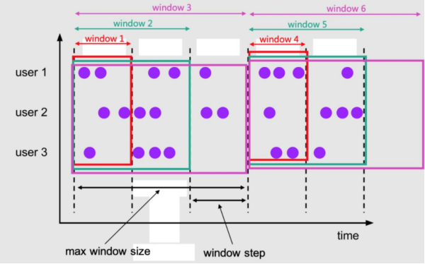

这些CUMULATE函数根据时间属性列分配窗口。

在流模式下，时间属性字段必须是[**事件或处理时间属性](https://nightlies.apache.org/flink/flink-docs-release-1.15/zh/docs/dev/table/concepts/time_attributes/)。

在批处理模式下，窗口表函数的时间属性字段必须是**TIMESTAMP或TIMESTAMP _LTZ类型**的属性。CUMULATE的返回值是一个新的关系，它包括原始关系的所有列，以及另外3列“**window_start、window_end、window_time**”，以指示指定的窗口。原始时间属性“**timecol**”将是窗口TVF之后的常规时间戳列。

CUMULATE接受四个必需参数，一个可选参数：

~~~sql
CUMULATE(TABLE data, DESCRIPTOR(timecol), step, size)
~~~

- data: 是一个表参数，可以是与时间属性列的任何关系。
- timecol：是一个列描述符，指示数据的哪些时间属性列应映射到累积窗口。

- step: 是指定连续累积窗口结束之间增加的窗口大小的持续时间。

- size: 是指定累积窗口的最大宽度的持续时间。size必须是 的整数倍step。

- offset: 是一个可选参数，用于指定窗口起始位置的偏移量。

**应用场景**：周期内累计 PV，UV 指标（如每天累计到当前这一分钟的 PV，UV）。这类指标是一段周期内的累计状态，对分析师来说更具统计分析价值，而且几乎所有的复合指标都是基于此类指标的统计（不然离线为啥都要累计一天的数据，而不要一分钟累计的数据呢）。

**实际案例**：每天的截止当前分钟的累计 money（sum(money)），去重 id 数（count(distinct id)）。每天代表渐进式窗口大小为 1 天，分钟代表渐进式窗口移动步长为分钟级别。举例如下：

明细输入数据：

| **time**            | **id** | **money** |
| ------------------- | ------ | --------- |
| 2021-11-01 00:01:00 | A      | 3         |
| 2021-11-01 00:01:00 | B      | 5         |
| 2021-11-01 00:01:00 | A      | 7         |
| 2021-11-01 00:02:00 | C      | 3         |
| 2021-11-01 00:03:00 | C      | 10        |

预期经过渐进式窗口计算的输出数据：

| **time**            | **count distinct id** | **sum money** |
| ------------------- | --------------------- | ------------- |
| 2021-11-01 00:01:00 | 2                     | 15            |
| 2021-11-01 00:02:00 | 3                     | 18            |
| 2021-11-01 00:03:00 | 3                     | 28            |

转化为折线图长这样：

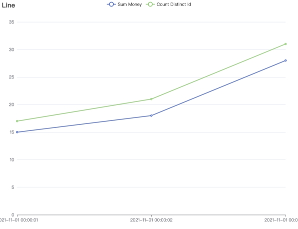

可以看到，其特点就在于，每一分钟的输出结果都是当天零点累计到当前的结果。

渐进式窗口目前只有 Windowing TVF 方案支持：

- Windowing TVF 方案（**1.14 只支持 Streaming 任务，1.15版本开始\*******\*支持 Batch\Streaming 任务**）：

  - ~~~sql
    -- 数据源表
    Flink SQL> CREATE TABLE source_table (
        -- 用户 id
        user_id BIGINT,
        -- 用户
        money BIGINT,
        -- 事件时间戳
        row_time AS cast(CURRENT_TIMESTAMP as timestamp(3)),
        -- watermark 设置
        WATERMARK FOR row_time AS row_time - INTERVAL '5' SECOND
    ) WITH (
      'connector' = 'datagen',
      'rows-per-second' = '10',
      'fields.user_id.min' = '1',
      'fields.user_id.max' = '100000',
      'fields.price.min' = '1',
      'fields.price.max' = '100000'
    );
    
    -- 数据汇表
    Flink SQL> CREATE TABLE sink_table (
        window_end bigint,
        window_start bigint,
        sum_money BIGINT,
        count_distinct_id bigint
    ) WITH (
      'connector' = 'print'
    );
    
    -- 数据处理逻辑
    Flink SQL> insert into sink_table
    SELECT 
        UNIX_TIMESTAMP(CAST(window_end AS STRING)) * 1000 as window_end, 
        UNIX_TIMESTAMP(CAST(window_start AS STRING)) *1000 AS window_start, 
        sum(money) as sum_money,
        count(distinct id) as count_distinct_id
    FROM TABLE(CUMULATE(
           TABLE source_table
           , DESCRIPTOR(row_time)
           , INTERVAL '60' SECOND
           , INTERVAL '1' DAY))
    GROUP BY
        window_start, 
        window_end
    ~~~

  - 可以看到 Windowing TVF 滚动窗口的写法就是把 cumulate window 的声明写在了数据源的 Table 子句中，即 TABLE(CUMULATE(TABLE source_table, DESCRIPTOR(row_time), INTERVAL '60' SECOND, INTERVAL '1' DAY))，其中包含四部分参数：

    - 第一个参数 TABLE source_table 声明数据源表；
    - 第二个参数 DESCRIPTOR(row_time) 声明数据源的时间戳；
    - 第三个参数 INTERVAL '60' SECOND 声明渐进式窗口触发的渐进步长为 1 min。
    - 第四个参数 INTERVAL '1' DAY 声明整个渐进式窗口的大小为 1 天，到了第二天新开一个窗口重新累计。

**SQL 语义**：渐进式窗口语义和滚动窗口类似，这里不再赘述。

#### Over Windows

**Over 聚合定义（支持 Batch\Streaming）**：可以理解为是一种特殊的滑动窗口聚合函数。

那这里我们拿 Over 聚合 与 窗口聚合 做一个对比，其之间的最大不同之处在于：

- 窗口聚合：不在 group by 中的字段，不能直接在 select 中拿到

- Over 聚合：能够保留原始字段

注意：

其实在生产环境中，Over 聚合的使用场景还是比较少的。在 Hive 中也有相同的聚合，但是可以想想你在离线数仓经常使用嘛？

**应用场景**：计算最近一段滑动窗口的聚合结果数据。

**实际案例**：查询每个产品最近一小时订单的金额总和：

~~~sql
SELECT order_id, order_time, amount,
  SUM(amount) OVER (
    PARTITION BY product
    ORDER BY order_time
    RANGE BETWEEN INTERVAL '1' HOUR PRECEDING AND CURRENT ROW
  ) AS one_hour_prod_amount_sum
FROM Orders
~~~

Over 聚合的语法总结如下：

~~~sql
SELECT
  agg_func(agg_col) OVER (
    [PARTITION BY col1[, col2, ...]]
    ORDER BY time_col
    range_definition),
  ...
FROM ...
~~~

其中：

- ORDER BY：必须是时间戳列（事件时间、处理时间）

- PARTITION BY：标识了聚合窗口的聚合粒度，如上述案例是按照 product 进行聚合

- range_definition：这个标识聚合窗口的聚合数据范围，在 Flink 中有两种指定数据范围的方式。第一种为 按照行数聚合，第二种为 按照时间区间聚合。如下案例所示：

##### 知识点12：【掌握】时间区间聚合

按照时间区间聚合就是时间区间的一个滑动窗口，比如下面案例 1 小时的区间，最新输出的一条数据的 sum 聚合结果就是最近一小时数据的 amount 之和。

~~~sql
CREATE TABLE source_table (
    order_id BIGINT,
    product BIGINT,
    amount BIGINT,
    order_time as cast(CURRENT_TIMESTAMP as TIMESTAMP(3)),
    WATERMARK FOR order_time AS order_time - INTERVAL '0.001' SECOND
) WITH (
  'connector' = 'datagen',
  'rows-per-second' = '1',
  'fields.order_id.min' = '1',
  'fields.order_id.max' = '2',
  'fields.amount.min' = '1',
  'fields.amount.max' = '10',
  'fields.product.min' = '1',
  'fields.product.max' = '2'
);

CREATE TABLE sink_table (
    product BIGINT,
    order_time TIMESTAMP(3),
    amount BIGINT,
    one_hour_prod_amount_sum BIGINT
) WITH (
  'connector' = 'print'
);

INSERT INTO sink_table
SELECT product, order_time, amount,
  SUM(amount) OVER (
    PARTITION BY product
    ORDER BY order_time
    -- 标识统计范围是一个 product 的最近 1 小时的数据
    RANGE BETWEEN INTERVAL '1' HOUR PRECEDING AND CURRENT ROW
  ) AS one_hour_prod_amount_sum
FROM source_table
~~~

结果如下：

~~~
+I[2, 2021-12-24T22:08:26.583, 7, 73]
+I[2, 2021-12-24T22:08:27.583, 7, 80]
+I[2, 2021-12-24T22:08:28.583, 4, 84]
+I[2, 2021-12-24T22:08:29.584, 7, 91]
+I[2, 2021-12-24T22:08:30.583, 8, 99]
+I[1, 2021-12-24T22:08:31.583, 9, 138]
+I[2, 2021-12-24T22:08:32.584, 6, 105]
+I[1, 2021-12-24T22:08:33.584, 7, 145]
~~~

##### 知识点13：【掌握】行数聚合

按照行数聚合就是数据行数的一个滑动窗口，比如下面案例，最新输出的一条数据的 sum 聚合结果就是最近 5 行数据的 amount 之和。

~~~sql
CREATE TABLE source_table (
    order_id BIGINT,
    product BIGINT,
    amount BIGINT,
    order_time as cast(CURRENT_TIMESTAMP as TIMESTAMP(3)),
    WATERMARK FOR order_time AS order_time - INTERVAL '0.001' SECOND
) WITH (
  'connector' = 'datagen',
  'rows-per-second' = '1',
  'fields.order_id.min' = '1',
  'fields.order_id.max' = '2',
  'fields.amount.min' = '1',
  'fields.amount.max' = '2',
  'fields.product.min' = '1',
  'fields.product.max' = '2'
);

CREATE TABLE sink_table (
    product BIGINT,
    order_time TIMESTAMP(3),
    amount BIGINT,
    one_hour_prod_amount_sum BIGINT
) WITH (
  'connector' = 'print'
);

INSERT INTO sink_table
SELECT product, order_time, amount,
  SUM(amount) OVER (
    PARTITION BY product
    ORDER BY order_time
    -- 标识统计范围是一个 product 的最近 5 行数据
    ROWS BETWEEN 5 PRECEDING AND CURRENT ROW
  ) AS one_hour_prod_amount_sum
FROM source_table
~~~

预期结果如下：

~~~
+I[2, 2021-12-24T22:18:19.147, 1, 9]
+I[1, 2021-12-24T22:18:20.147, 2, 11]
+I[1, 2021-12-24T22:18:21.147, 2, 12]
+I[1, 2021-12-24T22:18:22.147, 2, 12]
+I[1, 2021-12-24T22:18:23.148, 2, 12]
+I[1, 2021-12-24T22:18:24.147, 1, 11]
+I[1, 2021-12-24T22:18:25.146, 1, 10]
+I[1, 2021-12-24T22:18:26.147, 1, 9]
+I[2, 2021-12-24T22:18:27.145, 2, 11]
+I[2, 2021-12-24T22:18:28.148, 1, 10]
+I[2, 2021-12-24T22:18:29.145, 2, 10]
~~~

当然，如果你在一个 SELECT 中有多个聚合窗口的聚合方式，Flink SQL 支持了一种简化写法，如下案例：

~~~sql
SELECT order_id, order_time, amount,
SUM(amount) OVER w AS sum_amount,
AVG(amount) OVER w AS avg_amount
FROM Orders
-- 使用下面子句，定义 Over Window
WINDOW w AS (
PARTITION BY product
ORDER BY order_time
RANGE BETWEEN INTERVAL '1' HOUR PRECEDING AND CURRENT ROW)
~~~

### SQL 的水印操作（Watermark）

#### 知识点14：【理解】为什么要有 WaterMark？

当 flink 以 EventTime 模式处理流数据时，它会根据数据里的时间戳来处理基于时间的算子。但是由于网络、分布式等原因，会导致数据乱序的情况。如下图所示：

假设在一个5秒的Tumble窗口，有一个EventTime是 11秒的数据，在第16秒时候到来了。图示第11秒的数据，在16秒到来了，如下图：该如何处理迟到数据

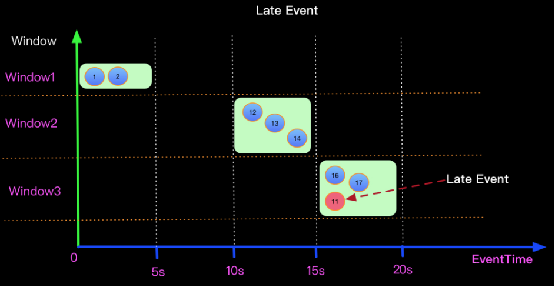

上面的问题在于如何将迟来的EventTime 为11的元素正确处理？

当Watermark的时间戳等于Event中携带的EventTime时候，上面场景（Watermark=EventTime)的计算结果如下：

 

如果想正确处理迟来的数据可以定义Watermark生成策略为 Watermark = EventTime -5s， 如下：

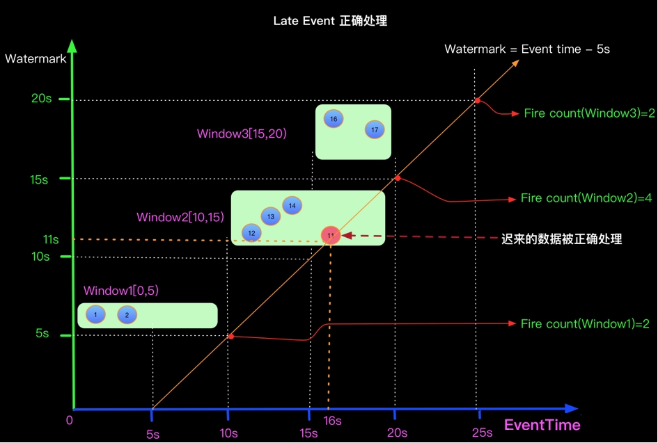

#### 知识点15：【掌握】代码演示

- 使用Socket模拟接收数据

- 设置WaterMark
  - 设置的逻辑：在第一条数据进来时，设置WaterMark为0，指定第一条数据的时间戳后，获取该时间戳与当前 WaterMark的最大值，并将最大值设置为下一条数据的WaterMark，以此类推

- 进行map基础转换，将String转换为Tuple2<String,String>

- 根据Key分组

- 使用滚动Event Time窗口，将5秒内的同组数据，进行Fold拼接输出

~~~sql
Flink SQL> CREATE TABLE MyTable (
item STRING,
ts TIMESTAMP(3), -- TIMESTAMP 类型的时间戳
WATERMARK FOR ts AS ts - INTERVAL '0' SECOND
) WITH (
'connector' = 'socket',
'hostname' = 'node1',
'port' = '9999',
'format' = 'csv'
);

Flink SQL> SELECT
TUMBLE_START(ts, INTERVAL '5' SECOND) AS window_start,
TUMBLE_END(ts, INTERVAL '5' SECOND) AS window_end,
TUMBLE_ROWTIME(ts, INTERVAL '5' SECOND) as window_rowtime,
item,count(item) as total_item
FROM MyTable
GROUP BY TUMBLE(ts, INTERVAL '5' SECOND), item;
~~~

开启9999端口，并输入第一条数据：

~~~
hello,2022-03-25 16:39:45
~~~

那么，我先假设后续的数据Event Time间隔为1秒，推断一下WaterMark的设定，如下图所示

1. 第一条数据的Event Time为1648197585000，那么当前窗口时间为：1648197585000-> 1648197589000，即下图中红色框线
2. 第一条数据进来时，这条数据之前的WaterMark为0，当第一条数据已经进入后，指定Event Time位置，并与现在的WaterMark比较，将两者中大的那个值设置为新的WaterMark，那么当前数据的WaterMark为1648197585000
3. 第二条数据进来时，前一条数据的WaterMark为1648197585000，第二条数据的Event Time比之前的WaterMark大，于是更新WaterMark，将当前的WaterMark更新为1648197586000，但还没到窗口触发时间，不进行计算
4. 后面几个以此类推，直到Event Time为：1648197590000的数据进来的时候，前一条数据的WaterMark为1648197589000，于是更新当前的WaterMark为1648197590000，Flink认为1648197590000之前的数据都已经到达，且达到了窗口的触发条件，开始进行计算

根据上面的推断，启动程序验证一下

先启动监听9999端口，再启动Flink程序，并向端口监听终端输入以下内容：

~~~
hello,2022-03-25 16:39:45
hello,2022-03-25 16:39:46
hello,2022-03-25 16:39:47
hello,2022-03-25 16:39:48
hello,2022-03-25 16:39:49
hello,2022-03-25 16:39:50
~~~

Flink输出结果：

~~~
Refresh: 1 s                                                                                                 Page: Last of 1                                                                                        Updated: 14:57:34.277 

            window_start              window_end          window_rowtime                           item           total_item
 2022-03-25 16:39:45.000 2022-03-25 16:39:50.000 2022-03-25 16:39:49.999                    hello               5
~~~

Rowtime列在经过窗口操作后，其Event Time属性将丢失。您可以使用辅助函数TUMBLE_ROWTIME、HOP_ROWTIME或SESSION_ROWTIME，获取窗口中的Rowtime列的最大值max(rowtime)作为时间窗口的Rowtime，其类型是具有Rowtime属性的TIMESTAMP，取值为 window_end - 1 。 例如[00:00, 00:15) 的窗口，返回值为00:14:59.999 。

**数据乱序的场景**

上面的实例，Event Time是有序，现在来做一下数据乱序的场景模拟启动程序，在监听终端中输入如下数据：

其中，在触发了了第一个窗口计算后，又来了两条迟到数据hello,2022-03-25 16:39:47，hello,2022-03-25 16:39:46

~~~
hello,2022-03-25 16:39:45
hello,2022-03-25 16:39:46
hello,2022-03-25 16:39:47
hello,2022-03-25 16:39:48
hello,2022-03-25 16:39:49
hello,2022-03-25 16:39:50
hello,2022-03-25 16:39:47
hello,2022-03-25 16:39:46
hello,2022-03-25 16:39:51
hello,2022-03-25 16:39:52
hello,2022-03-25 16:39:53
hello,2022-03-25 16:39:54
hello,2022-03-25 16:39:55
~~~

Flink结果：

~~~
                                                                                                         SQL Query Result (Table)                                                                                                          Refresh: 1 s                                                                                                 Page: Last of 1                                                                                        Updated: 15:11:20.960 

            window_start              window_end          window_rowtime                           item           total_item
 2022-03-25 16:39:45.000 2022-03-25 16:39:50.000 2022-03-25 16:39:49.999                    hello               5
 2022-03-25 16:39:50.000 2022-03-25 16:39:55.000 2022-03-25 16:39:54.999                    hello               5
~~~

从结果中可以看到，在第二个窗口中，**那两条迟到数据并没有进行处理，这个就是迟到丢弃**。

**乱序时间的设置：**

为了解决上面的问题，我们允许Flink处理延迟以5秒内的迟到数据

修改最大乱序时间

~~~sql
Flink SQL> drop table MyTable;
[INFO] Execute statement succeed.

Flink SQL> CREATE TABLE MyTable (
item STRING,
ts TIMESTAMP(3), -- TIMESTAMP 类型的时间戳
WATERMARK FOR ts AS ts - INTERVAL '5' SECOND
) WITH (
'connector' = 'socket',
'hostname' = 'node1',
'port' = '9999',
'format' = 'csv'
);

Flink SQL> SELECT
TUMBLE_START(ts, INTERVAL '5' SECOND) AS window_start,
TUMBLE_END(ts, INTERVAL '5' SECOND) AS window_end,
TUMBLE_ROWTIME(ts, INTERVAL '5' SECOND) as window_rowtime,
item,count(item) as total_item
FROM MyTable
GROUP BY TUMBLE(ts, INTERVAL '5' SECOND), item;
~~~

在监听终端中，输入数据

~~~
hello,2022-03-25 16:39:45
hello,2022-03-25 16:39:46
hello,2022-03-25 16:39:47
hello,2022-03-25 16:39:48
hello,2022-03-25 16:39:49
hello,2022-03-25 16:39:50
hello,2022-03-25 16:39:47
hello,2022-03-25 16:39:46
hello,2022-03-25 16:39:51
hello,2022-03-25 16:39:52
hello,2022-03-25 16:39:53
hello,2022-03-25 16:39:54
hello,2022-03-25 16:39:55
~~~

Flink输出结果：

~~~
Refresh: 1 s                                                                                                 Page: Last of 1                                                                                        Updated: 15:18:41.163 

            window_start              window_end          window_rowtime                           item           total_item
 2022-03-25 16:39:45.000 2022-03-25 16:39:50.000 2022-03-25 16:39:49.999                    hello               7
~~~

可以看到，设置了最大允许乱序时间后，WaterMark要比原来低5秒，可以对延迟5秒内的数据进行处理，窗口的触发条件也同样会往后延迟关于延迟时间，请结合业务场景进行设置。

### SQL 的容错（Checkpoint）

#### 知识点16：【理解】Checkpoint介绍

为了使 Flink 的状态具有良好的容错性，Flink 提供了**检查点机制 (CheckPoints)**  。通过检查点机制，**Flink 定期在数据流上生成 checkpoint barrier** ，当某个算子收到 ***\*barrier\**** 时，即会基于当前状态生成一份快照，然后再将该 barrier 传递到下游算子，下游算子接收到该 barrier 后，也基于当前状态生成一份快照，依次传递直至到最后的 Sink 算子上。当出现异常后，Flink 就可以根据最近的一次的快照数据将所有算子恢复到先前的状态。

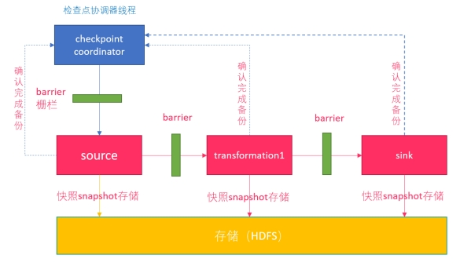 

- **CheckpointCoordinator**周期性的向该流应用的所有source算子发送**barrier**。 

- 当某个source算子收到一个barrier时，便暂停数据处理过程，然后将自己的当前状态制作成快照，并保存到指定的持久化存储中，最后向**CheckpointCoordinator**报告 自己快照制作情况，同时向自身所有下游算子广播该**barrier**，恢复数据处理 

- 下游算子收到barrier之后，会暂停自己的数据处理过程，然后将自身的相关状态制作成快照，并保存到指定的持久化存储中，最后向CheckpointCoordinator报告自身 快照情况，**同时向自身所有下游算子广播该barrier，恢复数据处理**。 

- 每个算子按照步骤3不断制作快照并向下游广播，直到最后barrier传递到sink算子，快照制作完成。 

- 当**CheckpointCoordinator**收到所有算子的报告之后，认为该周期的快照制作成功; 否则，如果在规定的时间内没有收到所有算子的报告，则认为本周期快照制作失败 

#### 知识点17：【理解】Flink 中的数据恢复过程

那么，容错到底解决了什么？其本质是解决数据恢复的问题。

Flink 的数据可以粗略分为以下三类：

- 第一种是元信息，相当于一个 Flink 作业运行起来所需要的最小信息集合，包括比如 Checkpoint 地址、Job Manager、Dispatcher、Resource Manager 等等，这些信息的容错是由 Kubernetes/Zookeeper 等系统的高可用性来保障的，不在我们讨论的容错范围内。

- Flink 作业运行起来以后，会从数据源读取数据写到 Sink 里，中间流过的数据称为处理的中间数据 Inflight Data (第二类)。

- 对于有状态的算子比如聚合算子，处理完输入数据会产生算子状态数据 (第三类)。

Flink 会周期性地对所有算子的状态数据做快照，上传到持久稳定的海量存储中 (Durable Bulk Store)，这个过程就是做 Checkpoint。Flink 作业发生错误时，会回滚到过去的一个快照检查点 Checkpoint 恢复。
我们当前有非常多的工作是针对提升 Checkpointing 效率来做的，因为在实际工作中，引擎层大部分 Oncall 或工单问题基本上都与 Checkpoint 相关，各种原因会造成 Checkpointing 超时。
Checkpointing 的流程分为以下几步：

第一步：Checkpoint Coordinate 从 Source 端插入 Checkpoint Barrier (上图黄色的竖条)。

第二步：Barrier 会随着中间数据处理向下游流动，流过算子的时候，系统会给算子的当前状态做一个同步快照，并将这个快照数据异步上传到远端存储。这样一来，Barrier 之前所有的输入数据对算子的影响都已反映在算子的状态中了。如果算子状态很大，会影响完成 Checkpointing 的时间。

第三步：当一个算子有多个输入的时候，需要算子拿到所有输入的 Barrier 之后才能开始做快照，也就是上图蓝色框的部分。可以看到，如果在对齐过程中有反压，造成中间处理数据流动缓慢，没有反压的那些线路也会被堵住，Checkpoint 会做得很慢，甚至做不出来。

第四步：所有算子的中间状态数据都成功上传到远端稳定存储之后， 一个完整的 Checkpoint 才算真正完成。
从这 4 个步骤中可以看到，**影响快速稳定地做 Checkpoint 的因素主要有 2 个，一个是处理的中间数据流动缓慢，另一个是算子状态数据过大，造成上传缓慢，下面来讲一讲如何来解决这两个因素**。

#### 知识点18：【理解】Checkpoint的配置

在flink-conf.yaml中配置：

~~~yaml
#开启checkpoint 每5000ms 一次
execution.checkpointing.interval: 5000
#设置有且仅有一次模式 目前支持 EXACTLY_ONCE、AT_LEAST_ONCE        
execution.checkpointing.mode: EXACTLY_ONCE
#设置checkpoint的存储方式
state.backend: filesystem
#设置checkpoint的存储位置
state.checkpoints.dir: hdfs://node1:8020/checkpoints
#设置savepoint的存储位置
state.savepoints.dir: hdfs://node1:8020/checkpoints
#设置checkpoint的超时时间 即一次checkpoint必须在该时间内完成 不然就丢弃
execution.checkpointing.timeout: 600000
#设置两次checkpoint之间的最小时间间隔
execution.checkpointing.min-pause: 500
#设置并发checkpoint的数目
execution.checkpointing.max-concurrent-checkpoints: 1
#开启checkpoints的外部持久化这里设置了清除job时保留checkpoint，默认值时保留一个 假如要保留3个
state.checkpoints.num-retained: 3
#默认情况下，checkpoint不是持久化的，只用于从故障中恢复作业。当程序被取消时，它们会被删除。但是你可以配置checkpoint被周期性持久化到外部，类似于savepoints。这些外部的checkpoints将它们的元数据输出到外#部持久化存储并且当作业失败时不会自动清除。这样，如果你的工作失败了，你就会有一个checkpoint来恢复。
#ExternalizedCheckpointCleanup模式配置当你取消作业时外部checkpoint会产生什么行为:
#RETAIN_ON_CANCELLATION: 当作业被取消时，保留外部的checkpoint。注意，在此情况下，您必须手动清理checkpoint状态。
#DELETE_ON_CANCELLATION: 当作业被取消时，删除外部化的checkpoint。只有当作业失败时，检查点状态才可用。
execution.checkpointing.externalized-checkpoint-retention: RETAIN_ON_CANCELLATION
~~~

**配置优化**

Checkpoint 时间间隔不易过大。一般来说，Checkpoint 时间间隔越长，需要生产的 State 就越大。如此一来，当失败恢复时，需要更长的追赶时间。

Checkpoint 时间间隔不易过小。如果 Checkpoint 时间间隔太小，那么 Flink 应用程序就会频繁 Checkpoint，导致部分资源被占有，无法专注地进行数据处理。

Checkpoint 时间间隔大于 Checkpoint 的生产时间。当 Checkpoint 时间间隔比 Checkpoint 生产时间长时，在上次 Checkpoint 完成时，不会立刻进行下一次 Checkpoint，而是会等待一段时间，之后再进行新的 Checkpoint。否则，每次 Checkpoint 完成时，就会立即开始下一次 Checkpoint，系统会有很多资源被 Checkpoint 占用，而真正任务计算的资源就会变少。

开启本地恢复。如果 Flink State 很大，在进行恢复时，需要从远程存储上读取 State 进行恢复，如果 State 文件过大，此时可能导致任务恢复很慢，大量的时间浪费在网络传输方面。此时可以设置 Flink 应用程序本地 State 恢复，应用程序 State 本地恢复默认没有开启，可以设置参数 state.backend.local-recovery 值为 true 进行激活，一般不需要。

设置 Checkpoint 保存数。Checkpoint 保存数默认是 1，也就是只保存最新的 Checkpoint 的 State 文件，当进行 State 恢复时，如果最新的 Checkpoint 文件不可用时 (比如文件损坏或者其他原因)，那么 State 恢复就会失败，如果设置 Checkpoint 保存数 3，即使最新的 Checkpoint 恢复失败，那么 Flink 也会回滚到上一次 Checkpoint 的状态文件进行恢复。考虑到这种情况，可以通过 state.checkpoints.num-retained 设置 Checkpoint 保存数。

#### 知识点19：【了解】什么是状态后端

Flink 提供了不同的状态后端，用于指定状态的存储方式和位置。默认情况下，配置文件***\*flink-conf.yaml\****确定所有 Flink 作业的状态后端。

对于流处理程序，Flink Job的状态后端决定了它的状态如何 存储在每个 TaskManager（TaskManager 的 Java 堆或（嵌入式）RocksDB）上。

State 始终在本地访问（只是访问/使用），这有助于 Flink 应用程序实现高吞吐量和低延迟。您可以选择将状态保留在 JVM 堆上，或者如果它太大，则保留在有效组织的磁盘数据结构中，这取决于状态后端的配置。

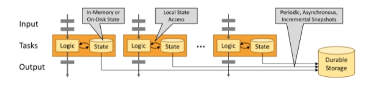 

flink提供不同的状态后端（state backends）来区分状态的存储⽅式和存储位置。flink状态可以存储在java堆内存内或者内存之外。通过状态后端的设置，flink允许应⽤保持⼤容量的状态。开发者可以在不改变应⽤逻辑的情况下设置状态后端。

**默认情况下，flink的状态会保存在taskmanager的内存中，⽽checkpoint会保存在jobManager的内存中**。

Flink 提供了三种可用的状态后端用于在不同情况下进行状态的保存：

- MemoryStateBackend
- FsStateBackend
- RocksDBStateBackend

从**Flink 1.13版本**开始，社区重新设计了其公共状态后端类，以帮助用户更好地理解本地状态存储和检查点存储的分离。此更改不会影响 Flink 的状态后端或检查点过程的运行时实现或特性；它只是为了更好地传达意图。用户可以迁移现有应用程序以使用新 API，而不会丢失任何状态或一致性。

##### MemoryStateBackend

MemoryStateBackend内部将状态（state）数据作为对象保存在java堆内存中（taskManager），通过checkpoint机制，MemoryStateBackend将状态（state）进⾏快照并保存Jobmanager（master）的堆内存中。

MemoryStateBackend可以通过配置来使⽤异步快照（asynchronous snapshots）。通过异步快照可以避免阻塞管道（blockingpipelines），⽬前是默认开启，当然也可以通过MemoryStateBackend的构造函数配置进⾏关闭：

**以前的MemoryStateBackend相当于使用**[**HashMapStateBackend**](#the-hashmapstatebackend)**和**[**JobManagerCheckpointStorage**](#the-jobmanagercheckpointstorage)

使用 MemoryStateBackend 时的注意点：

- 默认情况下，每一个状态的大小限制为 5 MB。可以通过 MemoryStateBackend 的构造函数增加这个大小。
- 状态大小受到 akka 帧大小的限制，所以无论怎么调整状态大小配置，都不能大于 akka 的帧大小。
- 状态的总大小不能超过 JobManager 的内存。

何时使用 MemoryStateBackend：

- 本地开发或调试时建议使用 MemoryStateBackend，因为这种场景的状态大小的是有限的。

- MemoryStateBackend 最适合小状态的应用场景。例如 Kafka Consumer，或者一次仅一记录的函数 （Map, FlatMap，或 Filter）。

**在debug模式下使用，不建议在生产模式下应用。**

- 全局配置 flink-conf.yaml

~~~yaml
state.backend: hashmap
# 可选，当不指定 checkpoint 路径时，默认自动使用 JobManagerCheckpointStorage
state.checkpoint-storage: jobmanager
~~~

##### FsStateBackend

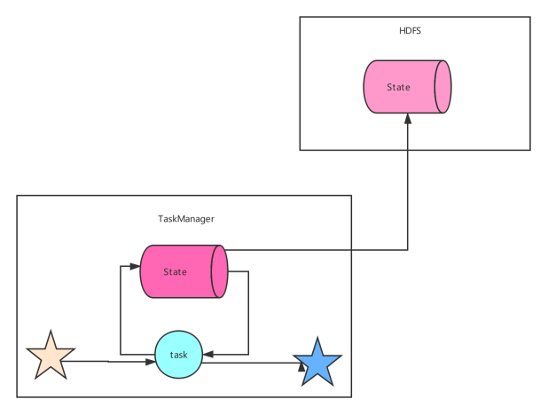

该持久化存储主要将快照数据保存到文件系统中，目前支持的文件系统主要是 ***\*HDFS和本地文件\****。如果使用HDFS，则初始化FsStateBackend时，需要传入以 “***\*hdfs://\****”开头的路径(即: new FsStateBackend("hdfs:///hacluster/checkpoint"))， 如果使用本地文件，则需要传入以“***\*file://\****”开头的路径(即:new FsStateBackend("file:///Data"))。在分布式情况下，不推荐使用本地文件。如果某个算子在节点A上失败，在节点B上恢复，使用本地文件时，在B上无法读取节点 A上的数据，导致状态恢复失败。

FsStateBackend适用的场景：

- 具有大状态，长窗口，大键 / 值状态的作业。

- 所有高可用性设置。

**分布式文件持久化，每次读写都会产生网络IO，整体性能不佳**

- 全局配置 flink-conf.yaml

~~~yaml
state.backend: hashmap 
state.checkpoints.dir: file:///checkpoint-dir/ 

# 默认为FileSystemCheckpointStorage 
state.checkpoint-storage: filesystem
~~~

##### RocksDBStateBackend

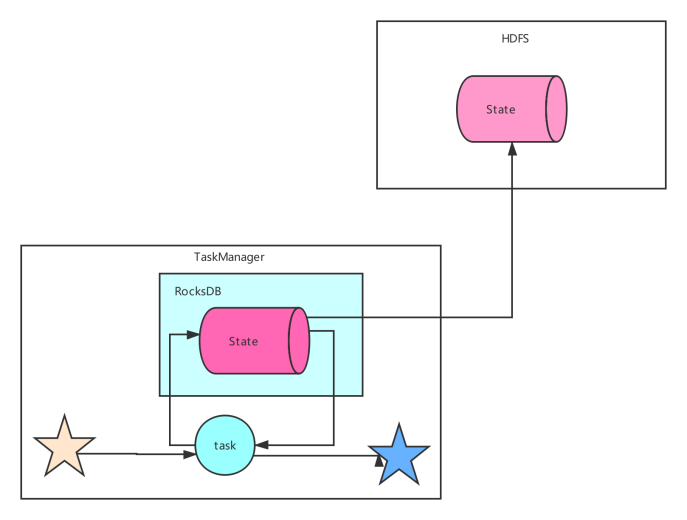

RocksDBStateBackend 的配置也需要一个文件系统（类型，地址，路径），如下所示：

- hdfs://namenode:9000/flink/checkpoints

- file:///flink/checkpoints

**RocksDB 是一种嵌入式的本地数据库**。RocksDBStateBackend 将处理中的数据使用 RocksDB 存储在本地磁盘上。在 checkpoint 时，整个 RocksDB 数据库会被存储到配置的文件系统中，或者在超大状态作业时可以将***\*增量\****的数据存储到配置的文件系统中。同时 Flink 会将极少的元数据存储在 JobManager 的内存中，或者在 Zookeeper 中（对于高可用的情况）。RocksDB 默认也是配置成异步快照的模式。

何时使用 RocksDBStateBackend：

- RocksDBStateBackend 最适合用于处理大状态，长窗口，或大键值状态的有状态处理任务。
- RocksDBStateBackend 非常适合用于高可用方案。
- **RocksDBStateBackend 是目前唯一支持增量 checkpoint 的后端**。增量 checkpoint 非常使用于超大状态的场景。

**本地文件+异步HDFS持久化**

- 全局配置 flink-conf.yaml

~~~yaml
state.backend: rocksdb
state.checkpoints.dir: file:///checkpoint-dir/

# Optional, Flink will automatically default to FileSystemCheckpointStorage
# when a checkpoint directory is specified.
state.checkpoint-storage: filesystem
~~~

### 知识点20：【理解】重启策略

实际生产作业中，我们期望Flink作业遇到错误的时候，能够自动重启恢复到正常运行状态。

Flink支持多种作业重启策略，但默认作业重启策略为none，即不会自动重启。作业一旦出现异常，会被标记为failed直接退出。

接下来为大家带来Flink支持的重启策略类型和配置方法。

#### 重启策略类型

Flink支持的重启策略类型如下：

- none, off, disable：无重启策略，作业遇到问题直接失败，不会重启。
- fixeddelay, fixed-delay：作业失败后，延迟一定时间重启。但是有最大重启次数限制，超过这个限制后作业失败，不再重启。
- failurerate, failure-rate：作业失败后，延迟一定时间重启。但是有最大失败率限制。如果一定时间内作业失败次数超过配置值，则标记为真的失败，不再重启。
- exponentialdelay, exponential-delay：作业失败后重启延迟时间随着失败次数指数递增。没有最大重启次数限制，无限尝试重启作业。

>注意：如果启用了checkpoint并且没有显式配置重启策略，会默认使用fixeddelay策略，最大重试次数为**Integer.MAX_VALUE**。

#### 全局配置

全局配置影响Flink提交的所有作业的。修改全局配置需要编辑**flink-conf.yaml**文件。

配置重启策略的方式：

~~~shell
restart-strategy: none, off, disable | fixeddelay, fixed-delay | failurerate, failure-rate | exponentialdelay, exponential-delay
~~~

接下来分别列出各个重启策略专属的配置参数和含义。

~~~
no restart
restart-strategy: none
fixeddelay
restart-strategy: fixed-delay

# 尝试重启次数
restart-strategy.fixed-delay.attempts: 10
# 两次连续重启的间隔时间
restart-strategy.fixed-delay.delay: 20 s
failurerate
restart-strategy: failure-rate

# 两次连续重启的间隔时间
restart-strategy.failure-rate.delay: 10 s
# 计算失败率的统计时间跨度
restart-strategy.failure-rate.failure-rate-interval: 2 min
# 计算失败率的统计时间内的最大失败次数
restart-strategy.failure-rate.max-failures-per-interval: 10
exponentialdelay
restart-strategy: exponential-delay

# 初次失败后重启时间间隔（初始值）
restart-strategy.exponential-delay.initial-backoff: 1 s
# 以后每次失败，重启时间间隔为上一次重启时间间隔乘以这个值
restart-strategy.exponential-delay.backoff-multiplier: 2
# 每次重启间隔时间的最大抖动值（加或减去该配置项范围内的一个随机数），防止大量作业在同一时刻重启
restart-strategy.exponential-delay.jitter-factor: 0.1
# 最大重启时间间隔，超过这个最大值后，重启时间间隔不再增大
restart-strategy.exponential-delay.max-backoff: 1 min
# 多长时间作业运行无失败后，重启间隔时间会重置为初始值（第一个配置项的值）
restart-strategy.exponential-delay.reset-backoff-threshold: 1 h
~~~

演示代码

~~~python

~~~

**flink-conf.yaml** 文件配置如下：

~~~yaml
execution.checkpointing.interval: 5000
#设置有且仅有一次模式 目前支持 EXACTLY_ONCE、AT_LEAST_ONCE        
execution.checkpointing.mode: EXACTLY_ONCE
state.backend: hashmap
#设置checkpoint的存储方式
state.checkpoint-storage: filesystem
#设置checkpoint的存储位置
state.checkpoints.dir: hdfs://node1:8020/checkpoints
#设置savepoint的存储位置
state.savepoints.dir: hdfs://node1:8020/checkpoints
#设置checkpoint的超时时间 即一次checkpoint必须在该时间内完成 不然就丢弃
execution.checkpointing.timeout: 600000
#设置两次checkpoint之间的最小时间间隔
execution.checkpointing.min-pause: 500
#设置并发checkpoint的数目
execution.checkpointing.max-concurrent-checkpoints: 1
#开启checkpoints的外部持久化这里设置了清除job时保留checkpoint，默认值时保留一个 假如要保留3个
state.checkpoints.num-retained: 3
#默认情况下，checkpoint不是持久化的，只用于从故障中恢复作业。当程序被取消时，它们会被删除。但是你可以配置checkpoint被周期性持久化到外部，类似于savepoints。这些外部的checkpoints将它们的元数据输出到外#部持久化存储并且当作业失败时不会自动
清除。这样，如果你的工作失败了，你就会有一个checkpoint来恢复。
#ExternalizedCheckpointCleanup模式配置当你取消作业时外部checkpoint会产生什么行为:
#RETAIN_ON_CANCELLATION: 当作业被取消时，保留外部的checkpoint。注意，在此情况下，您必须手动清理checkpoint状态。
#DELETE_ON_CANCELLATION: 当作业被取消时，删除外部化的checkpoint。只有当作业失败时，检查点状态才可用。
execution.checkpointing.externalized-checkpoint-retention: RETAIN_ON_CANCELLATION

# 设置重启策略
restart-strategy: fixed-delay
# 尝试重启次数
restart-strategy.fixed-delay.attempts: 3
# 两次连续重启的间隔时间
restart-strategy.fixed-delay.delay: 10 s
~~~

### 知识点21：【理解】SQL 时区问题

#### SQL 时区解决的问题

首先说一下这个问题的背景：

大家想一下离线 Hive 环境中，有遇到过时区时区相关的问题吗？

这个问题在底层的数据集成系统都已经给解决了，大家拿到手的 ODS 层表都是已经按照所在地区的时区给格式化好的了。

举个例子：看到日期分区为 2022-01-01 的 Hive 表时，可以默认认为该分区中的数据就对应到你所在地区的时区的 2022-01-01 日的数据。

但是 Flink 中时区问题要特别引起关注，不加小心就会误用。

而本节 SQL 时区旨在帮助大家了解到以下两个场景的问题：

- 在 1.13 之前，DDL create table 中使用 PROCTIME() 指定处理时间列时，返回值类型为 TIMESTAMP(3) 类型，而 TIMESTAMP(3) 是不带任何时区信息的，默认为 UTC 时间（0 时区）。
- 使用 StreamTableEnvironment::createTemporaryView 将 DataStream 转为 Table 时，注册处理时间（proctime.proctime）、事件时间列（rowtime.rowtime）时，两列时间类型也为 TIMESTAMP(3) 类型，不带时区信息。

而以上两个场景就会导致：

- 在北京时区的用户使用 TIMESTAMP(3) 类型的时间列开最常用的 1 天的窗口时，划分出来的窗口范围是北京时间的 [2022-01-01 08:00:00, 2022-01-02 08:00:00]，而不是北京时间的 [2022-01-01 00:00:00, 2022-01-02 00:00:00]。因为 TIMESTAMP(3) 是默认的 UTC 时间，即 0 时区。

- 北京时区的用户将 TIMESTAMP(3) 类型时间属性列转为 STRING 类型的数据展示时，也是 UTC 时区的，而不是北京时间的。

因此充分了解本节的知识内容可以很好的帮你避免时区问题错误。

#### SQL 时间类型

- Flink SQL 支持 TIMESTAMP（不带时区信息的时间）、TIMESTAMP_LTZ（带时区信息的时间）
- TIMESTAMP（不带时区信息的时间）：是通过一个 年， 月， 日， 小时， 分钟， 秒 和 小数秒 的字符串来指定。举例：1970-01-01 00:00:04.001。
- 为什么要使用字符串来指定呢？因为此种类型不带时区信息，所以直接用一个字符串指定就好了
- 那 TIMESTAMP 字符串的时间代表的是什么时区的时间呢？UTC 时区，也就是默认 0 时区，对应中国北京是东八区
- TIMESTAMP_LTZ（带时区信息的时间）：没有字符串来指定，而是通过 java 标准 epoch 时间 1970-01-01T00:00:00Z 开始计算的毫秒数。举例：1640966400000
- 其时区信息是怎么指定的呢？是通过本次任务中的时区配置参数 table.local-time-zone 设置的
- 时间戳本身也不带有时区信息，为什么要使用时间戳来指定呢？就是因为时间戳不带有时区信息，所以我们通过配置 table.local-time-zone 时区参数之后，就能将一个不带有时区信息的时间戳转换为带有时区信息的字符串了。举例：table.local-time-zone 为 Asia/Shanghai 时，4001 时间戳转化为字符串的效果是 1970-01-01 08:00:04.001。

#### 时区参数生效的 SQL 时间函数

以下 SQL 中的时间函数都会受到时区参数的影响，从而做到最后显示给用户的时间、窗口的划分都按照用户设置时区之内的时间。

- LOCALTIME
- LOCALTIMESTAMP
- CURRENT_DATE
- CURRENT_TIME
- CURRENT_TIMESTAMP
- CURRENT_ROW_TIMESTAMP()
- NOW()
- PROCTIME()：其中 PROCTIME() 在 1.13 版本及之后版本，返回值类型是 TIMESTAMP_LTZ(3)

在 Flink SQL client 中执行结果如下：

~~~sql
Flink SQL> SET sql-client.execution.result-mode=tableau;
Flink SQL> CREATE VIEW MyView1 AS SELECT LOCALTIME, LOCALTIMESTAMP, CURRENT_DATE, CURRENT_TIME, CURRENT_TIMESTAMP, CURRENT_ROW_TIMESTAMP(), NOW(), PROCTIME();
Flink SQL> DESC MyView1;

+------------------------+-----------------------------+-------+-----+--------+-----------+
|                   name |                        type |  null | key | extras | watermark |
+------------------------+-----------------------------+-------+-----+--------+-----------+
|              LOCALTIME |                     TIME(0) | false |     |        |           |
|         LOCALTIMESTAMP |                TIMESTAMP(3) | false |     |        |           |
|           CURRENT_DATE |                        DATE | false |     |        |           |
|           CURRENT_TIME |                     TIME(0) | false |     |        |           |
|      CURRENT_TIMESTAMP |            TIMESTAMP_LTZ(3) | false |     |        |           |
|CURRENT_ROW_TIMESTAMP() |            TIMESTAMP_LTZ(3) | false |     |        |           |
|                  NOW() |            TIMESTAMP_LTZ(3) | false |     |        |           |
|             PROCTIME() | TIMESTAMP_LTZ(3) *PROCTIME* | false |     |        |           |
+------------------------+-----------------------------+-------+-----+--------+-----------+

Flink SQL> SET table.local-time-zone=UTC;
Flink SQL> SELECT * FROM MyView1;

+-----------+-------------------------+--------------+--------------+-------------------------+-------------------------+-------------------------+-------------------------+
| LOCALTIME |          LOCALTIMESTAMP | CURRENT_DATE | CURRENT_TIME |       CURRENT_TIMESTAMP | CURRENT_ROW_TIMESTAMP() |                   NOW() |              PROCTIME() |
+-----------+-------------------------+--------------+--------------+-------------------------+-------------------------+-------------------------+-------------------------+
|  15:18:36 | 2021-04-15 15:18:36.384 |   2021-04-15 |     15:18:36 | 2021-04-15 15:18:36.384 | 2021-04-15 15:18:36.384 | 2021-04-15 15:18:36.384 | 2021-04-15 15:18:36.384 |
+-----------+-------------------------+--------------+--------------+-------------------------+-------------------------+-------------------------+-------------------------+

Flink SQL> SET table.local-time-zone=Asia/Shanghai;
Flink SQL> SELECT * FROM MyView1;

+-----------+-------------------------+--------------+--------------+-------------------------+-------------------------+-------------------------+-------------------------+
| LOCALTIME |          LOCALTIMESTAMP | CURRENT_DATE | CURRENT_TIME |       CURRENT_TIMESTAMP | CURRENT_ROW_TIMESTAMP() |                   NOW() |              PROCTIME() |
+-----------+-------------------------+--------------+--------------+-------------------------+-------------------------+-------------------------+-------------------------+
|  23:18:36 | 2021-04-15 23:18:36.384 |   2021-04-15 |     23:18:36 | 2021-04-15 23:18:36.384 | 2021-04-15 23:18:36.384 | 2021-04-15 23:18:36.384 | 2021-04-15 23:18:36.384 |
+-----------+-------------------------+--------------+--------------+-------------------------+-------------------------+-------------------------+-------------------------+

Flink SQL> CREATE VIEW MyView2 AS SELECT TO_TIMESTAMP_LTZ(4001, 3) AS ltz, TIMESTAMP '1970-01-01 00:00:01.001'  AS ntz;
Flink SQL> DESC MyView2;

+------+------------------+-------+-----+--------+-----------+
| name |             type |  null | key | extras | watermark |
+------+------------------+-------+-----+--------+-----------+
|  ltz | TIMESTAMP_LTZ(3) |  true |     |        |           |
|  ntz |     TIMESTAMP(3) | false |     |        |           |
+------+------------------+-------+-----+--------+-----------+

Flink SQL> SET table.local-time-zone=UTC;
Flink SQL> SELECT * FROM MyView2;

+-------------------------+-------------------------+
|                     ltz |                     ntz |
+-------------------------+-------------------------+
| 1970-01-01 00:00:04.001 | 1970-01-01 00:00:01.001 |
+-------------------------+-------------------------+

Flink SQL> SET table.local-time-zone=Asia/Shanghai;
Flink SQL> SELECT * FROM MyView2;

+-------------------------+-------------------------+
|                     ltz |                     ntz |
+-------------------------+-------------------------+
| 1970-01-01 08:00:04.001 | 1970-01-01 00:00:01.001 |
+-------------------------+-------------------------+

Flink SQL> CREATE VIEW MyView3 AS SELECT ltz, CAST(ltz AS TIMESTAMP(3)), CAST(ltz AS STRING), ntz, CAST(ntz AS TIMESTAMP_LTZ(3)) FROM MyView2;
Flink SQL> DESC MyView3;
+-------------------------------+------------------+-------+-----+--------+-----------+
|                          name |             type |  null | key | extras | watermark |
+-------------------------------+------------------+-------+-----+--------+-----------+
|                           ltz | TIMESTAMP_LTZ(3) |  true |     |        |           |
|     CAST(ltz AS TIMESTAMP(3)) |     TIMESTAMP(3) |  true |     |        |           |
|           CAST(ltz AS STRING) |           STRING |  true |     |        |           |
|                           ntz |     TIMESTAMP(3) | false |     |        |           |
| CAST(ntz AS TIMESTAMP_LTZ(3)) | TIMESTAMP_LTZ(3) | false |     |        |           |
+-------------------------------+------------------+-------+-----+--------+-----------+

Flink SQL> SELECT * FROM MyView3;

+-------------------------+---------------------------+-------------------------+-------------------------+-------------------------------+
|                     ltz | CAST(ltz AS TIMESTAMP(3)) |     CAST(ltz AS STRING) |                     ntz | CAST(ntz AS TIMESTAMP_LTZ(3)) |
+-------------------------+---------------------------+-------------------------+-------------------------+-------------------------------+
| 1970-01-01 08:00:04.001 |   1970-01-01 08:00:04.001 | 1970-01-01 08:00:04.001 | 1970-01-01 00:00:01.001 |       1970-01-01 00:00:01.001 |
+-------------------------+---------------------------+-------------------------+-------------------------+-------------------------------+
~~~

#### 知识点22：【掌握】事件时间和时区应用案例

这里分两类，分别是 TIMESTAMP（不带时区信息的时间）、TIMESTAMP_LTZ（带时区信息的时间） 的事件时间 Flink SQL 任务

- TIMESTAMP（不带时区信息的时间）

  - ~~~sql
    Flink SQL> CREATE TABLE MyTable2 (
    item STRING,
    price DOUBLE,
    ts TIMESTAMP(3), -- TIMESTAMP 类型的时间戳
    WATERMARK FOR ts AS ts - INTERVAL '10' SECOND
    ) WITH (
    'connector' = 'socket',
    'hostname' = 'node1',
    'port' = '9999',
    'format' = 'csv'
    );
    
    Flink SQL> CREATE VIEW MyView4 AS
    SELECT
    TUMBLE_START(ts, INTERVAL '10' MINUTES) AS window_start,
    TUMBLE_END(ts, INTERVAL '10' MINUTES) AS window_end,
    TUMBLE_ROWTIME(ts, INTERVAL '10' MINUTES) as window_rowtime,
    item,
    MAX(price) as max_price
    FROM MyTable2
    GROUP BY TUMBLE(ts, INTERVAL '10' MINUTES), item;
    
    Flink SQL> DESC MyView4;
    
    +----------------+------------------------+------+-----+--------+-----------+
    | name | type | null | key | extras | watermark |
    +----------------+------------------------+------+-----+--------+-----------+
    | window_start | TIMESTAMP(3) | true | | | |
    | window_end | TIMESTAMP(3) | true | | | |
    | window_rowtime | TIMESTAMP(3) *ROWTIME* | true | | | |
    | item | STRING | true | | | |
    | max_price | DOUBLE | true | | | |
    +----------------+------------------------+------+-----+--------+-----------+
    ~~~

  - 将数据写入到 MyTable2 中：

  - ~~~
    > nc -lk 9999
    A,1.1,2021-04-15 14:01:00
    B,1.2,2021-04-15 14:02:00
    A,1.8,2021-04-15 14:03:00 
    B,2.5,2021-04-15 14:04:00
    C,3.8,2021-04-15 14:05:00       
    C,3.8,2021-04-15 14:11:00
    ~~~

  - 最终结果如下：

  - ~~~sql
    Flink SQL> SET table.local-time-zone=UTC; 
    Flink SQL> SELECT * FROM MyView4;
    
    +-------------------------+-------------------------+-------------------------+------+-----------+
    |            window_start |              window_end |          window_rowtime | item | max_price |
    +-------------------------+-------------------------+-------------------------+------+-----------+
    | 2021-04-15 14:00:00.000 | 2021-04-15 14:10:00.000 | 2021-04-15 14:09:59.999 |    A |       1.8 |
    | 2021-04-15 14:00:00.000 | 2021-04-15 14:10:00.000 | 2021-04-15 14:09:59.999 |    B |       2.5 |
    | 2021-04-15 14:00:00.000 | 2021-04-15 14:10:00.000 | 2021-04-15 14:09:59.999 |    C |       3.8 |
    +-------------------------+-------------------------+-------------------------+------+-----------+
    
    Flink SQL> SET table.local-time-zone=Asia/Shanghai; 
    Flink SQL> SELECT * FROM MyView4;
    
    +-------------------------+-------------------------+-------------------------+------+-----------+
    |            window_start |              window_end |          window_rowtime | item | max_price |
    +-------------------------+-------------------------+-------------------------+------+-----------+
    | 2021-04-15 14:00:00.000 | 2021-04-15 14:10:00.000 | 2021-04-15 14:09:59.999 |    A |       1.8 |
    | 2021-04-15 14:00:00.000 | 2021-04-15 14:10:00.000 | 2021-04-15 14:09:59.999 |    B |       2.5 |
    | 2021-04-15 14:00:00.000 | 2021-04-15 14:10:00.000 | 2021-04-15 14:09:59.999 |    C |       3.8 |
    +-------------------------+-------------------------+-------------------------+------+-----------+
    ~~~

  - 通过上述结果可见，使用 TIMESTAMP（不带时区信息的时间） 进开窗，在 UTC 时区下的计算结果与在 Asia/Shanghai 时区下计算的窗口开始时间，窗口结束时间和窗口的时间是相同的。

- TIMESTAMP_LTZ（带时区信息的时间）

  - ~~~sql
    Flink SQL> CREATE TABLE MyTable3 (
    item STRING,
    price DOUBLE,
    ts BIGINT, -- long 类型的时间戳
    ts_ltz AS TO_TIMESTAMP_LTZ(ts, 3), -- 转为 TIMESTAMP_LTZ 类型的时间戳
    WATERMARK FOR ts_ltz AS ts_ltz - INTERVAL '10' SECOND
    ) WITH (
    'connector' = 'socket',
    'hostname' = 'node1',
    'port' = '9999',
    'format' = 'csv'
    );
    
    Flink SQL> CREATE VIEW MyView5 AS 
    SELECT 
    TUMBLE_START(ts_ltz, INTERVAL '10' MINUTES) AS window_start, 
    TUMBLE_END(ts_ltz, INTERVAL '10' MINUTES) AS window_end,
    TUMBLE_ROWTIME(ts_ltz, INTERVAL '10' MINUTES) as window_rowtime,
    item,
    MAX(price) as max_price
    FROM MyTable3
    GROUP BY TUMBLE(ts_ltz, INTERVAL '10' MINUTES), item;
    
    Flink SQL> DESC MyView5;
    
    +----------------+----------------------------+-------+-----+--------+-----------+
    | name | type | null | key | extras | watermark |
    +----------------+----------------------------+-------+-----+--------+-----------+
    | window_start | TIMESTAMP(3) | false | | | |
    | window_end | TIMESTAMP(3) | false | | | |
    | window_rowtime | TIMESTAMP_LTZ(3) *ROWTIME* | true | | | |
    | item | STRING | true | | | |
    | max_price | DOUBLE | true | | | |
    +----------------+----------------------------+-------+-----+--------+-----------+
    ~~~

  - 将数据写入 MyTable3：

  - ~~~
    A,1.1,1618495260000  # 对应到 UTC 时区的时间为 2021-04-15 14:01:00
    B,1.2,1618495320000  # 对应到 UTC 时区的时间为 2021-04-15 14:02:00
    A,1.8,1618495380000  # 对应到 UTC 时区的时间为 2021-04-15 14:03:00
    B,2.5,1618495440000  # 对应到 UTC 时区的时间为 2021-04-15 14:04:00
    C,3.8,1618495500000  # 对应到 UTC 时区的时间为 2021-04-15 14:05:00       
    C,3.8,1618495860000  # 对应到 UTC 时区的时间为 2021-04-15 14:11:00
    ~~~

  - 最终结果如下：

  - ~~~
    Flink SQL> SET table.local-time-zone=UTC; 
    Flink SQL> SELECT * FROM MyView5;
    
    +-------------------------+-------------------------+-------------------------+------+-----------+
    |            window_start |              window_end |          window_rowtime | item | max_price |
    +-------------------------+-------------------------+-------------------------+------+-----------+
    | 2021-04-15 14:00:00.000 | 2021-04-15 14:10:00.000 | 2021-04-15 14:09:59.999 |    A |       1.8 |
    | 2021-04-15 14:00:00.000 | 2021-04-15 14:10:00.000 | 2021-04-15 14:09:59.999 |    B |       2.5 |
    | 2021-04-15 14:00:00.000 | 2021-04-15 14:10:00.000 | 2021-04-15 14:09:59.999 |    C |       3.8 |
    +-------------------------+-------------------------+-------------------------+------+-----------+
    
    Flink SQL> SET table.local-time-zone=Asia/Shanghai; 
    Flink SQL> SELECT * FROM MyView5;
    
    +-------------------------+-------------------------+-------------------------+------+-----------+
    |            window_start |              window_end |          window_rowtime | item | max_price |
    +-------------------------+-------------------------+-------------------------+------+-----------+
    | 2021-04-15 22:00:00.000 | 2021-04-15 22:10:00.000 | 2021-04-15 22:09:59.999 |    A |       1.8 |
    | 2021-04-15 22:00:00.000 | 2021-04-15 22:10:00.000 | 2021-04-15 22:09:59.999 |    B |       2.5 |
    | 2021-04-15 22:00:00.000 | 2021-04-15 22:10:00.000 | 2021-04-15 22:09:59.999 |    C |       3.8 |
    +-------------------------+-------------------------+-------------------------+------+-----------+
    ~~~

  - 通过上述结果可见，使用 TIMESTAMP_LTZ（带时区信息的时间） 进开窗，在 UTC 时区下的计算结果与在 Asia/Shanghai 时区下计算的窗口开始时间，窗口结束时间和窗口的时间是不同的，都是按照时区进行格式化的。

#### 知识点22：【掌握】处理时间和时区应用案例

Flink SQL 定义处理时间属性列是通过 **PROCTIME()** 函数来指定的，其返回值类型是 TIMESTAMP_LTZ。

>在 Flink 1.13 之前，PROCTIME() 函数返回类型是 TIMESTAMP，返回值是 UTC 时区的时间戳，例如，上海时间显示为 2021-03-01 12:00:00 时，PROCTIME() 返回值显示 2021-03-01 04:00:00，我们进行使用是错误的。Flink 1.13 修复了这个问题，使用 TIMESTAMP_LTZ 作为 PROCTIME() 的返回类型，这样 Flink 就会自动获取当前时区信息，然后进行处理，不需要用户再进行时区的格式化处理了。

如下案例：

~~~sql
Flink SQL> SET table.local-time-zone=UTC;
Flink SQL> SELECT PROCTIME();

+-------------------------+
|              PROCTIME() |
+-------------------------+
| 2021-04-15 14:48:31.387 |
+-------------------------+

Flink SQL> SET table.local-time-zone=Asia/Shanghai;
Flink SQL> SELECT PROCTIME();

+-------------------------+
|              PROCTIME() |
+-------------------------+
| 2021-04-15 22:48:31.387 |
+-------------------------+

Flink SQL> CREATE TABLE MyTable1 (
                  item STRING,
                  price DOUBLE,
                  proctime as PROCTIME()
            ) WITH (
                'connector' = 'socket',
                'hostname' = 'node1',
                'port' = '9999',
                'format' = 'csv'
           );

Flink SQL> CREATE VIEW MyView3 AS
            SELECT
                TUMBLE_START(proctime, INTERVAL '10' MINUTES) AS window_start,
                TUMBLE_END(proctime, INTERVAL '10' MINUTES) AS window_end,
                TUMBLE_PROCTIME(proctime, INTERVAL '10' MINUTES) as window_proctime,
                item,
                MAX(price) as max_price
            FROM MyTable1
                GROUP BY TUMBLE(proctime, INTERVAL '10' MINUTES), item;

Flink SQL> DESC MyView3;

+-----------------+-----------------------------+-------+-----+--------+-----------+
|           name  |                        type |  null | key | extras | watermark |
+-----------------+-----------------------------+-------+-----+--------+-----------+
|    window_start |                TIMESTAMP(3) | false |     |        |           |
|      window_end |                TIMESTAMP(3) | false |     |        |           |
| window_proctime | TIMESTAMP_LTZ(3) *PROCTIME* | false |     |        |           |
|            item |                      STRING | true  |     |        |           |
|       max_price |                      DOUBLE | true  |     |        |           |
+-----------------+-----------------------------+-------+-----+--------+-----------+
~~~

将数据写入到 MyTable1 中：

~~~
> nc -lk 9999
A,1.1
B,1.2
A,1.8
B,2.5
C,3.8
~~~

其输出结果如下：

~~~sql
Flink SQL> SET table.local-time-zone=UTC;
Flink SQL> SELECT * FROM MyView3;

+-------------------------+-------------------------+-------------------------+------+-----------+
| window_start | window_end | window_procime | item | max_price |
+-------------------------+-------------------------+-------------------------+------+-----------+
| 2021-04-15 14:00:00.000 | 2021-04-15 14:10:00.000 | 2021-04-15 14:10:00.005 | A | 1.8 |
| 2021-04-15 14:00:00.000 | 2021-04-15 14:10:00.000 | 2021-04-15 14:10:00.007 | B | 2.5 |
| 2021-04-15 14:00:00.000 | 2021-04-15 14:10:00.000 | 2021-04-15 14:10:00.007 | C | 3.8 |
+-------------------------+-------------------------+-------------------------+------+-----------+

Flink SQL> SET table.local-time-zone=Asia/Shanghai;
Flink SQL> SELECT * FROM MyView3;

+-------------------------+-------------------------+-------------------------+------+-----------+
| window_start | window_end | window_procime | item | max_price |
+-------------------------+-------------------------+-------------------------+------+-----------+
| 2021-04-15 22:00:00.000 | 2021-04-15 22:10:00.000 | 2021-04-15 22:10:00.005 | A | 1.8 |
| 2021-04-15 22:00:00.000 | 2021-04-15 22:10:00.000 | 2021-04-15 22:10:00.007 | B | 2.5 |
| 2021-04-15 22:00:00.000 | 2021-04-15 22:10:00.000 | 2021-04-15 22:10:00.007 | C | 3.8 |
+-------------------------+-------------------------+-------------------------+------+-----------+
~~~

通过上述结果可见，使用处理时间进行开窗，在 UTC 时区下的计算结果与在 Asia/Shanghai 时区下计算的窗口开始时间，窗口结束时间和窗口的时间是不同的，都是按照时区进行格式化的。

**SQL 时间函数返回在流批任务中的异同**

以下函数：

- LOCALTIME

- LOCALTIMESTAMP

- CURRENT_DATE

- CURRENT_TIME

- CURRENT_TIMESTAMP

- NOW()

在 Streaming 模式下这些函数是每条记录都会计算一次，但在 Batch 模式下，只会在 query 开始时计算一次，所有记录都使用相同的时间结果。

以下时间函数无论是在 Streaming 模式还是 Batch 模式下，都会为每条记录计算一次结果：

- CURRENT_ROW_TIMESTAMP()
- PROCTIME()

