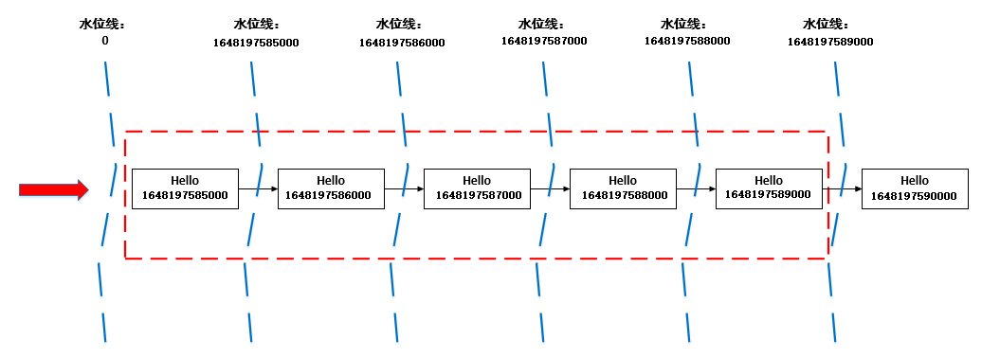
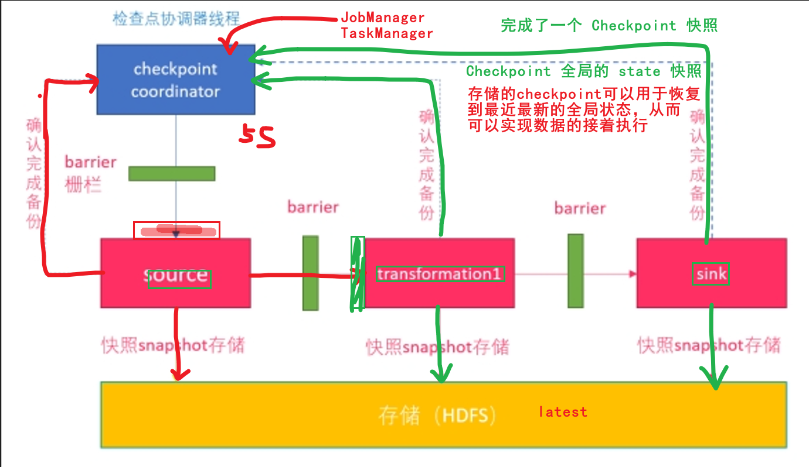
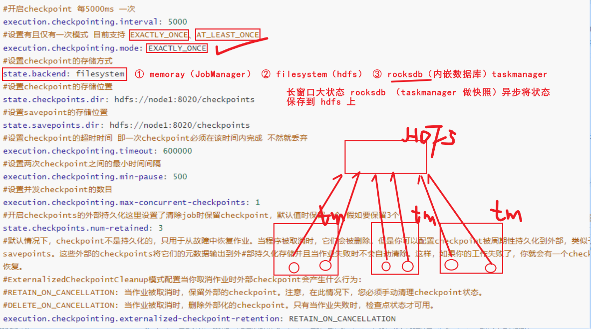
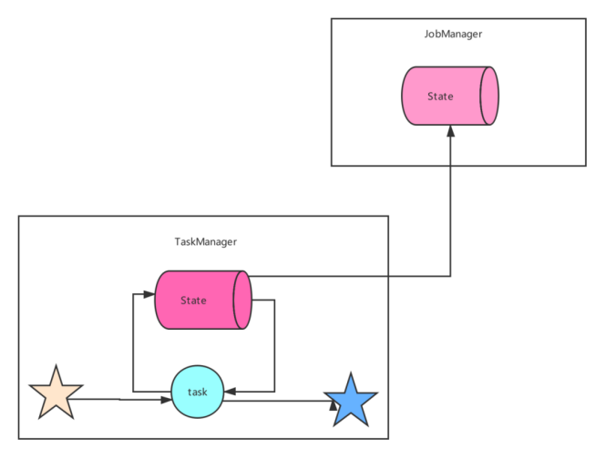
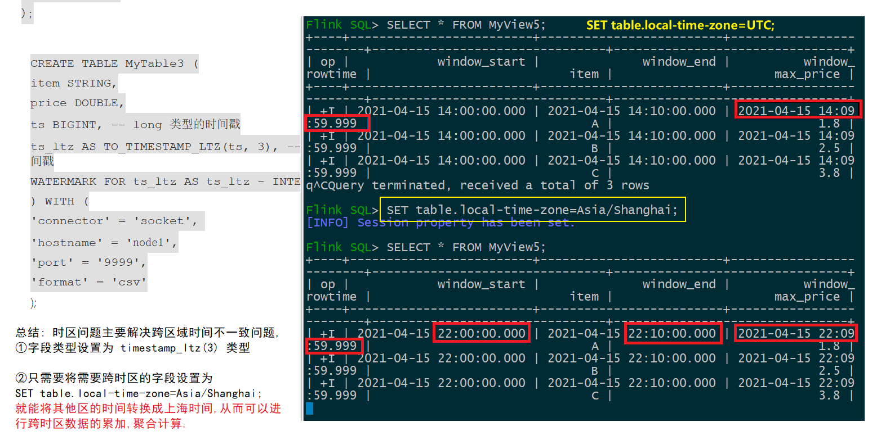
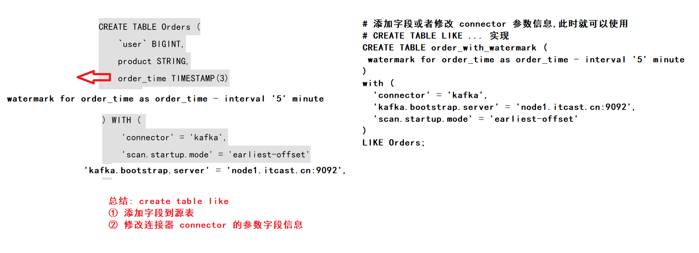
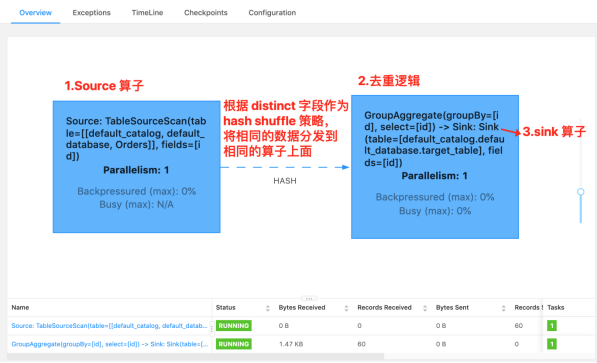
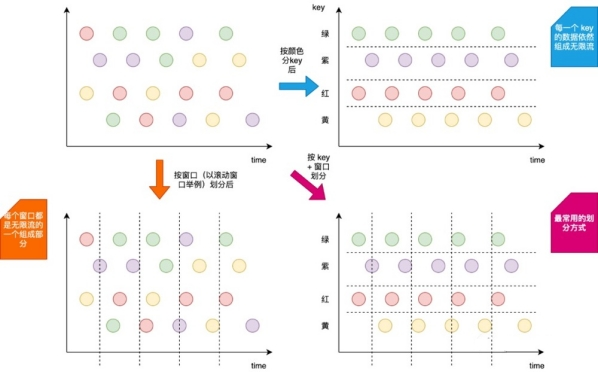

# day6-Flink基础&FlinkSQL

## 今日目标

+ 掌握SQL的水印操作
+ 掌握SQL的容错机制
+ 了解SQL的时区问题
+ 掌握SQL的语法

## 整体概述

### SQL 的水印操作（Watermark）

#### 知识点14：【理解】为什么要有 WaterMark？

+ 当 flink 以 EventTime 模式处理流数据时，它会根据数据里的时间戳来处理基于时间的算子。但是由于网络、分布式等原因，会导致数据乱序的情况。如下图所示：

+ 假设在一个5秒的Tumble窗口，有一个EventTime是 11秒的数据，在第16秒时候到来了。图示第11秒的数据，在16秒到来了，如下图：该如何处理迟到数据

上面的问题在于如何将迟来的EventTime 为11的元素正确处理？

当Watermark的时间戳等于Event中携带的EventTime时候，上面场景（Watermark=EventTime)的计算结果如下：

 

如果想正确处理迟来的数据可以定义Watermark生成策略为 Watermark = EventTime -5s， 如下：

#### 知识点15：【掌握】代码演示

- 使用Socket模拟接收数据

- 设置WaterMark
  - 设置的逻辑：在第一条数据进来时，设置WaterMark为0，指定第一条数据的时间戳后，获取该时间戳与当前 WaterMark的最大值，并将最大值设置为下一条数据的WaterMark，以此类推

- 进行map基础转换，将String转换为Tuple2<String,String>

- 根据Key分组

- 使用滚动Event Time窗口，将5秒内的同组数据，进行Fold拼接输出

~~~sql
Flink SQL> CREATE TABLE MyTable (
item STRING,
ts TIMESTAMP(3), -- TIMESTAMP 类型的时间戳
WATERMARK FOR ts AS ts - INTERVAL '0' SECOND
) WITH (
'connector' = 'socket',
'hostname' = 'node1',
'port' = '9999',
'format' = 'csv'
);

Flink SQL> SELECT
TUMBLE_START(ts, INTERVAL '5' SECOND) AS window_start,
TUMBLE_END(ts, INTERVAL '5' SECOND) AS window_end,
TUMBLE_ROWTIME(ts, INTERVAL '5' SECOND) as window_rowtime,
item,count(item) as total_item
FROM MyTable
GROUP BY TUMBLE(ts, INTERVAL '5' SECOND), item;
~~~

开启9999端口，并输入第一条数据：

~~~
hello,2022-03-25 16:39:45
~~~

那么，我先假设后续的数据Event Time间隔为1秒，推断一下WaterMark的设定，如下图所示

1. 第一条数据的Event Time为1648197585000，那么当前窗口时间为：1648197585000-> 1648197589000，即下图中红色框线
2. 第一条数据进来时，这条数据之前的WaterMark为0，当第一条数据已经进入后，指定Event Time位置，并与现在的WaterMark比较，将两者中大的那个值设置为新的WaterMark，那么当前数据的WaterMark为1648197585000
3. 第二条数据进来时，前一条数据的WaterMark为1648197585000，第二条数据的Event Time比之前的WaterMark大，于是更新WaterMark，将当前的WaterMark更新为1648197586000，但还没到窗口触发时间，不进行计算
4. 后面几个以此类推，直到Event Time为：1648197590000的数据进来的时候，前一条数据的WaterMark为1648197589000，于是更新当前的WaterMark为1648197590000，Flink认为1648197590000之前的数据都已经到达，且达到了窗口的触发条件，开始进行计算

根据上面的推断，启动程序验证一下

先启动监听9999端口，再启动Flink程序，并向端口监听终端输入以下内容：

~~~
hello,2022-03-25 16:39:45
hello,2022-03-25 16:39:46
hello,2022-03-25 16:39:47
hello,2022-03-25 16:39:48
hello,2022-03-25 16:39:49
hello,2022-03-25 16:39:50
~~~

Flink输出结果：

~~~
Refresh: 1 s                                                                                                 Page: Last of 1                                                                                        Updated: 14:57:34.277 

            window_start              window_end          window_rowtime                           item           total_item
 2022-03-25 16:39:45.000 2022-03-25 16:39:50.000 2022-03-25 16:39:49.999                    hello               5
~~~

Rowtime列在经过窗口操作后，其Event Time属性将丢失。您可以使用辅助函数TUMBLE_ROWTIME、HOP_ROWTIME或SESSION_ROWTIME，获取窗口中的Rowtime列的最大值max(rowtime)作为时间窗口的Rowtime，其类型是具有Rowtime属性的TIMESTAMP，取值为 window_end - 1 。 例如[00:00, 00:15) 的窗口，返回值为00:14:59.999 。

**数据乱序的场景**

上面的实例，Event Time是有序，现在来做一下数据乱序的场景模拟启动程序，在监听终端中输入如下数据：

其中，在触发了了第一个窗口计算后，又来了两条迟到数据hello,2022-03-25 16:39:47，hello,2022-03-25 16:39:46

~~~
hello,2022-03-25 16:39:45
hello,2022-03-25 16:39:46
hello,2022-03-25 16:39:47
hello,2022-03-25 16:39:48
hello,2022-03-25 16:39:49
hello,2022-03-25 16:39:50
hello,2022-03-25 16:39:47
hello,2022-03-25 16:39:46
hello,2022-03-25 16:39:51
hello,2022-03-25 16:39:52
hello,2022-03-25 16:39:53
hello,2022-03-25 16:39:54
hello,2022-03-25 16:39:55
~~~

Flink结果：

~~~
 SQL Query Result (Table)                                                                                                          Refresh: 1 s    Page: Last of 1                                                                                        Updated: 15:11:20.960 

 window_start              window_end          window_rowtime                           item           total_item
 2022-03-25 16:39:45.000 2022-03-25 16:39:50.000 2022-03-25 16:39:49.999                    hello               5
 2022-03-25 16:39:50.000 2022-03-25 16:39:55.000 2022-03-25 16:39:54.999                    hello               5
~~~

从结果中可以看到，在第二个窗口中，**那两条迟到数据并没有进行处理，这个就是迟到丢弃**。

**乱序时间的设置：**

为了解决上面的问题，我们允许Flink处理延迟以5秒内的迟到数据

修改最大乱序时间

~~~sql
Flink SQL> drop table MyTable;
[INFO] Execute statement succeed.

Flink SQL> CREATE TABLE MyTable (
item STRING,
ts TIMESTAMP(3), -- TIMESTAMP 类型的时间戳
WATERMARK FOR ts AS ts - INTERVAL '5' SECOND
) WITH (
'connector' = 'socket',
'hostname' = 'node1',
'port' = '9999',
'format' = 'csv'
);

Flink SQL> SELECT
TUMBLE_START(ts, INTERVAL '5' SECOND) AS window_start,
TUMBLE_END(ts, INTERVAL '5' SECOND) AS window_end,
TUMBLE_ROWTIME(ts, INTERVAL '5' SECOND) as window_rowtime,
item,count(item) as total_item
FROM MyTable
GROUP BY TUMBLE(ts, INTERVAL '5' SECOND), item;
~~~

在监听终端中，输入数据

~~~
hello,2022-03-25 16:39:45
hello,2022-03-25 16:39:46
hello,2022-03-25 16:39:47
hello,2022-03-25 16:39:48
hello,2022-03-25 16:39:49
hello,2022-03-25 16:39:50
hello,2022-03-25 16:39:47
hello,2022-03-25 16:39:46
hello,2022-03-25 16:39:51
hello,2022-03-25 16:39:52
hello,2022-03-25 16:39:53
hello,2022-03-25 16:39:54
hello,2022-03-25 16:39:55
~~~

Flink输出结果：

~~~
Refresh: 1 s     Page: Last of 1     Updated: 15:18:41.163 
window_start              window_end          window_rowtime                           item           total_item
2022-03-25 16:39:45.000 2022-03-25 16:39:50.000 2022-03-25 16:39:49.999                hello               7
~~~

可以看到，设置了最大允许乱序时间后，WaterMark要比原来低5秒，可以对延迟5秒内的数据进行处理，窗口的触发条件也同样会往后延迟关于延迟时间，请结合业务场景进行设置。

+ 结论
  + 如果实现 Flink - java 代码，涉及到 watermark 水印机制，如果是 BoundedOutofOrderness 允许最大延迟时间为 2s ，数据就会等待 2s ，如果事件时间大于等于窗口的结束时间，就会触发窗口的计算？不会，需要等待水印 >= 窗口的结束时间才会触发窗口的计算。

### SQL 的容错（Checkpoint）

#### 知识点16：【理解】Checkpoint介绍

为了使 Flink 的状态具有良好的容错性，Flink 提供了**检查点机制 (CheckPoints)**  。通过检查点机制，**Flink 定期在数据流上生成 checkpoint barrier** ，当某个算子收到 **barrier** 时，即会基于当前状态生成一份快照，然后再将该 barrier 传递到下游算子，下游算子接收到该 barrier 后，也基于当前状态生成一份快照，依次传递直至到最后的 Sink 算子上。当出现异常后，Flink 就可以根据最近的一次的快照数据将所有算子恢复到先前的状态。

- **CheckpointCoordinator**周期性的向该流应用的所有source算子发送**barrier**。 

- 当某个source算子收到一个barrier时，便暂停数据处理过程，然后将自己的当前状态制作成快照，并保存到指定的持久化存储中，最后向**CheckpointCoordinator**报告 自己快照制作情况，同时向自身所有下游算子广播该**barrier**，恢复数据处理 

- 下游算子收到barrier之后，会暂停自己的数据处理过程，然后将自身的相关状态制作成快照，并保存到指定的持久化存储中，最后向CheckpointCoordinator报告自身 快照情况，**同时向自身所有下游算子广播该barrier，恢复数据处理**。 

- 每个算子按照步骤3不断制作快照并向下游广播，直到最后barrier传递到sink算子，快照制作完成。 

- 当**CheckpointCoordinator**收到所有算子的报告之后，认为该周期的快照制作成功; 否则，如果在规定的时间内没有收到所有算子的报告，则认为本周期快照制作失败 

#### 知识点17：【理解】Flink 中的数据恢复过程

那么，容错到底解决了什么？其本质是解决数据恢复的问题。

Flink 的数据可以粗略分为以下三类：

- 第一种是元信息，相当于一个 Flink 作业运行起来所需要的最小信息集合，包括比如 Checkpoint 地址、Job Manager、Dispatcher、Resource Manager 等等，这些信息的容错是由 Kubernetes/Zookeeper 等系统的高可用性来保障的，不在我们讨论的容错范围内。

- Flink 作业运行起来以后，会从数据源读取数据写到 Sink 里，中间流过的数据称为处理的中间数据 Inflight Data (第二类)。

- 对于有状态的算子比如聚合算子，处理完输入数据会产生算子状态数据 (第三类)。

Flink 会周期性地对所有算子的状态数据做快照，上传到持久稳定的海量存储中 (Durable Bulk Store)，这个过程就是做 Checkpoint。Flink 作业发生错误时，会回滚到过去的一个快照检查点 Checkpoint 恢复。
我们当前有非常多的工作是针对提升 Checkpointing 效率来做的，因为在实际工作中，引擎层大部分 Oncall 或工单问题基本上都与 Checkpoint 相关，各种原因会造成 Checkpointing 超时。
Checkpointing 的流程分为以下几步：

第一步：Checkpoint Coordinate 从 Source 端插入 Checkpoint Barrier (上图黄色的竖条)。

第二步：Barrier 会随着中间数据处理向下游流动，流过算子的时候，系统会给算子的当前状态做一个同步快照，并将这个快照数据异步上传到远端存储。这样一来，Barrier 之前所有的输入数据对算子的影响都已反映在算子的状态中了。如果算子状态很大，会影响完成 Checkpointing 的时间。

第三步：当一个算子有多个输入的时候，需要算子拿到所有输入的 Barrier 之后才能开始做快照，也就是上图蓝色框的部分。可以看到，如果在对齐过程中有反压，造成中间处理数据流动缓慢，没有反压的那些线路也会被堵住，Checkpoint 会做得很慢，甚至做不出来。

第四步：所有算子的中间状态数据都成功上传到远端稳定存储之后， 一个完整的 Checkpoint 才算真正完成。
从这 4 个步骤中可以看到，**影响快速稳定地做 Checkpoint 的因素主要有 2 个，一个是处理的中间数据流动缓慢，另一个是算子状态数据过大，造成上传缓慢，下面来讲一讲如何来解决这两个因素**。

#### 知识点18：【理解】Checkpoint的配置

在flink-conf.yaml中配置：

~~~yaml
#开启checkpoint 每5000ms 一次
execution.checkpointing.interval: 5000
#设置有且仅有一次模式 目前支持 EXACTLY_ONCE、AT_LEAST_ONCE        
execution.checkpointing.mode: EXACTLY_ONCE
#设置checkpoint的存储方式
state.backend: filesystem
#设置checkpoint的存储位置
state.checkpoints.dir: hdfs://node1:8020/checkpoints
#设置savepoint的存储位置
state.savepoints.dir: hdfs://node1:8020/checkpoints
#设置checkpoint的超时时间 即一次checkpoint必须在该时间内完成 不然就丢弃
execution.checkpointing.timeout: 600000
#设置两次checkpoint之间的最小时间间隔
execution.checkpointing.min-pause: 500
#设置并发checkpoint的数目
execution.checkpointing.max-concurrent-checkpoints: 1
#开启checkpoints的外部持久化这里设置了清除job时保留checkpoint，默认值时保留一个 假如要保留3个
state.checkpoints.num-retained: 3
#默认情况下，checkpoint不是持久化的，只用于从故障中恢复作业。当程序被取消时，它们会被删除。但是你可以配置checkpoint被周期性持久化到外部，类似于savepoints。这些外部的checkpoints将它们的元数据输出到外#部持久化存储并且当作业失败时不会自动清除。这样，如果你的工作失败了，你就会有一个checkpoint来恢复。
#ExternalizedCheckpointCleanup模式配置当你取消作业时外部checkpoint会产生什么行为:
#RETAIN_ON_CANCELLATION: 当作业被取消时，保留外部的checkpoint。注意，在此情况下，您必须手动清理checkpoint状态。
#DELETE_ON_CANCELLATION: 当作业被取消时，删除外部化的checkpoint。只有当作业失败时，检查点状态才可用。
execution.checkpointing.externalized-checkpoint-retention: RETAIN_ON_CANCELLATION
~~~

**配置优化**

Checkpoint 时间间隔不易过大。一般来说，Checkpoint 时间间隔越长，需要生产的 State 就越大。如此一来，当失败恢复时，需要更长的追赶时间。

Checkpoint 时间间隔不易过小。如果 Checkpoint 时间间隔太小，那么 Flink 应用程序就会频繁 Checkpoint，导致部分资源被占有，无法专注地进行数据处理。

Checkpoint 时间间隔大于 Checkpoint 的生产时间。当 Checkpoint 时间间隔比 Checkpoint 生产时间长时，在上次 Checkpoint 完成时，不会立刻进行下一次 Checkpoint，而是会等待一段时间，之后再进行新的 Checkpoint。否则，每次 Checkpoint 完成时，就会立即开始下一次 Checkpoint，系统会有很多资源被 Checkpoint 占用，而真正任务计算的资源就会变少。

开启本地恢复。如果 Flink State 很大，在进行恢复时，需要从远程存储上读取 State 进行恢复，如果 State 文件过大，此时可能导致任务恢复很慢，大量的时间浪费在网络传输方面。此时可以设置 Flink 应用程序本地 State 恢复，应用程序 State 本地恢复默认没有开启，可以设置参数 state.backend.local-recovery 值为 true 进行激活，一般不需要。

设置 Checkpoint 保存数。Checkpoint 保存数默认是 1，也就是只保存最新的 Checkpoint 的 State 文件，当进行 State 恢复时，如果最新的 Checkpoint 文件不可用时 (比如文件损坏或者其他原因)，那么 State 恢复就会失败，如果设置 Checkpoint 保存数 3，即使最新的 Checkpoint 恢复失败，那么 Flink 也会回滚到上一次 Checkpoint 的状态文件进行恢复。考虑到这种情况，可以通过 state.checkpoints.num-retained 设置 Checkpoint 保存数。

#### 知识点19：【了解】什么是状态后端

Flink 提供了不同的状态后端，用于指定状态的存储方式和位置。默认情况下，配置文件***\*flink-conf.yaml\****确定所有 Flink 作业的状态后端。

对于流处理程序，Flink Job的状态后端决定了它的状态如何 存储在每个 TaskManager（TaskManager 的 Java 堆或（嵌入式）RocksDB）上。

State 始终在本地访问（只是访问/使用），这有助于 Flink 应用程序实现高吞吐量和低延迟。您可以选择将状态保留在 JVM 堆上，或者如果它太大，则保留在有效组织的磁盘数据结构中，这取决于状态后端的配置。

 

flink提供不同的状态后端（state backends）来区分状态的存储⽅式和存储位置。flink状态可以存储在java堆内存内或者内存之外。通过状态后端的设置，flink允许应⽤保持⼤容量的状态。开发者可以在不改变应⽤逻辑的情况下设置状态后端。

**默认情况下，flink的状态会保存在taskmanager的内存中，⽽checkpoint会保存在jobManager的内存中**。

Flink 提供了三种可用的状态后端用于在不同情况下进行状态的保存：

- MemoryStateBackend（默认）
- FsStateBackend（FileSystem）
- RocksDBStateBackend（内嵌数据库中）

从**Flink 1.13版本**开始，社区重新设计了其公共状态后端类，以帮助用户更好地理解本地状态存储和检查点存储的分离。此更改不会影响 Flink 的状态后端或检查点过程的运行时实现或特性；它只是为了更好地传达意图。用户可以迁移现有应用程序以使用新 API，而不会丢失任何状态或一致性。

##### MemoryStateBackend

MemoryStateBackend内部将状态（state）数据作为对象保存在java堆内存中（taskManager），通过checkpoint机制，MemoryStateBackend将状态（state）进⾏快照并保存Jobmanager（master）的堆内存中。

MemoryStateBackend可以通过配置来使⽤异步快照（asynchronous snapshots）。通过异步快照可以避免阻塞管道（blockingpipelines），⽬前是默认开启，当然也可以通过MemoryStateBackend的构造函数配置进⾏关闭：

**以前的MemoryStateBackend相当于使用**[**HashMapStateBackend**](#the-hashmapstatebackend)**和**[**JobManagerCheckpointStorage**](#the-jobmanagercheckpointstorage)

使用 MemoryStateBackend 时的注意点：

- 默认情况下，每一个状态的大小限制为 5 MB。可以通过 MemoryStateBackend 的构造函数增加这个大小。
- 状态大小受到 akka 帧大小的限制，所以无论怎么调整状态大小配置，都不能大于 akka 的帧大小。
- 状态的总大小不能超过 JobManager 的内存。

何时使用 MemoryStateBackend：

- 本地开发或调试时建议使用 MemoryStateBackend，因为这种场景的状态大小的是有限的。

- MemoryStateBackend 最适合小状态的应用场景。例如 Kafka Consumer，或者一次仅一记录的函数 （Map, FlatMap，或 Filter）。

**在debug模式下使用，不建议在生产模式下应用。**

- 全局配置 flink-conf.yaml

~~~yaml
state.backend: hashmap
# 可选，当不指定 checkpoint 路径时，默认自动使用 JobManagerCheckpointStorage
state.checkpoint-storage: jobmanager
~~~

##### FsStateBackend

该持久化存储主要将快照数据保存到文件系统中，目前支持的文件系统主要是 **HDFS和本地文件**。如果使用HDFS，则初始化FsStateBackend时，需要传入以 “**hdfs://**”开头的路径(即: new FsStateBackend("hdfs:///hacluster/checkpoint"))， 如果使用本地文件，则需要传入以“**file://**”开头的路径(即:new FsStateBackend("file:///Data"))。在分布式情况下，不推荐使用本地文件。如果某个算子在节点A上失败，在节点B上恢复，使用本地文件时，在B上无法读取节点 A上的数据，导致状态恢复失败。

FsStateBackend适用的场景：

- 具有大状态，长窗口，大键 / 值状态的作业。

- 所有高可用性设置。

**分布式文件持久化，每次读写都会产生网络IO，整体性能不佳**

- 全局配置 flink-conf.yaml

~~~yaml
state.backend: hashmap 
state.checkpoints.dir: file:///checkpoint-dir/ 

# 默认为FileSystemCheckpointStorage 
state.checkpoint-storage: filesystem
~~~

##### RocksDBStateBackend

RocksDBStateBackend 的配置也需要一个文件系统（类型，地址，路径），如下所示：

- hdfs://namenode:9000/flink/checkpoints

- file:///flink/checkpoints

**RocksDB 是一种嵌入式的本地数据库**。RocksDBStateBackend 将处理中的数据使用 RocksDB 存储在本地磁盘上。在 checkpoint 时，整个 RocksDB 数据库会被存储到配置的文件系统中，或者在超大状态作业时可以将**增量**的数据存储到配置的文件系统中。同时 Flink 会将极少的元数据存储在 JobManager 的内存中，或者在 Zookeeper 中（对于高可用的情况）。RocksDB 默认也是配置成异步快照的模式。

何时使用 RocksDBStateBackend：

- RocksDBStateBackend 最适合用于处理大状态，长窗口，或大键值状态的有状态处理任务。
- RocksDBStateBackend 非常适合用于高可用方案。
- **RocksDBStateBackend 是目前唯一支持增量 checkpoint 的后端**。增量 checkpoint 非常使用于超大状态的场景。

**本地文件+异步HDFS持久化**

- 全局配置 flink-conf.yaml

~~~yaml
state.backend: rocksdb
state.checkpoints.dir: file:///checkpoint-dir/

# Optional, Flink will automatically default to FileSystemCheckpointStorage
# when a checkpoint directory is specified.
state.checkpoint-storage: filesystem
~~~

### 知识点20：【理解】重启策略

实际生产作业中，我们期望Flink作业遇到错误的时候，能够自动重启恢复到正常运行状态。

Flink支持多种作业重启策略，但默认作业重启策略为none，即不会自动重启。作业一旦出现异常，会被标记为failed直接退出。

接下来为大家带来Flink支持的重启策略类型和配置方法。

#### 重启策略类型

Flink支持的重启策略类型如下：

- none, off, disable：无重启策略，作业遇到问题直接失败，不会重启。
- fixeddelay, fixed-delay：作业失败后，延迟一定时间重启。但是有最大重启次数限制，超过这个限制后作业失败，不再重启。
- failurerate, failure-rate：作业失败后，延迟一定时间重启。但是有最大失败率限制。如果一定时间内作业失败次数超过配置值，则标记为真的失败，不再重启。
- exponentialdelay, exponential-delay：作业失败后重启延迟时间随着失败次数指数递增。没有最大重启次数限制，无限尝试重启作业。

>注意：如果启用了checkpoint并且没有显式配置重启策略，会默认使用fixeddelay策略，最大重试次数为**Integer.MAX_VALUE**。

#### 全局配置

全局配置影响Flink提交的所有作业的。修改全局配置需要编辑**flink-conf.yaml**文件。

配置重启策略的方式：

~~~shell
restart-strategy: none, off, disable | fixeddelay, fixed-delay | failurerate, failure-rate | exponentialdelay, exponential-delay
~~~

接下来分别列出各个重启策略专属的配置参数和含义。

~~~
no restart
restart-strategy: none
fixeddelay
restart-strategy: fixed-delay

# 尝试重启次数
restart-strategy.fixed-delay.attempts: 10
# 两次连续重启的间隔时间
restart-strategy.fixed-delay.delay: 20 s
failurerate
restart-strategy: failure-rate

# 两次连续重启的间隔时间
restart-strategy.failure-rate.delay: 10 s
# 计算失败率的统计时间跨度
restart-strategy.failure-rate.failure-rate-interval: 2 min
# 计算失败率的统计时间内的最大失败次数
restart-strategy.failure-rate.max-failures-per-interval: 10
exponentialdelay
restart-strategy: exponential-delay

# 初次失败后重启时间间隔（初始值）
restart-strategy.exponential-delay.initial-backoff: 1 s
# 以后每次失败，重启时间间隔为上一次重启时间间隔乘以这个值
restart-strategy.exponential-delay.backoff-multiplier: 2
# 每次重启间隔时间的最大抖动值（加或减去该配置项范围内的一个随机数），防止大量作业在同一时刻重启
restart-strategy.exponential-delay.jitter-factor: 0.1
# 最大重启时间间隔，超过这个最大值后，重启时间间隔不再增大
restart-strategy.exponential-delay.max-backoff: 1 min
# 多长时间作业运行无失败后，重启间隔时间会重置为初始值（第一个配置项的值）
restart-strategy.exponential-delay.reset-backoff-threshold: 1 h
~~~

演示代码

~~~python
from datetime import timedelta

from pyflink.common import RestartStrategies, Types
from pyflink.datastream import StreamExecutionEnvironment, CheckpointingMode, \
    FileSystemCheckpointStorage, DataStream, \
    ExternalizedCheckpointCleanup, FlatMapFunction

if __name__ == '__main__':
    # 1. 创建流式处理环境
    env = StreamExecutionEnvironment.get_execution_environment()

    # 2. 创建source
    socket_stream = DataStream(env._j_stream_execution_environment.socketTextStream('node1', 9999))

    class MyFlatMapFunction(FlatMapFunction):
        def flat_map(self, value):
            value = value.split(" ")
            for word in value:
                if word == 'laowang':
                    raise TypeError("老王来了，程序挂了！")
                yield word

    # 3. transform
    ds = socket_stream.flat_map(MyFlatMapFunction()) \
           .map(lambda i: (i, 1), output_type = Types.TUPLE([Types.STRING(), Types.INT()])) \
           .key_by(lambda i: i[0]) \
           .reduce(lambda i, j: (i[0], i[1] + j[1]))

    # 4. transform
    ds.print()

    # 5. 真正执行代码
    env.execute('checkpoint_demo')
~~~

**flink-conf.yaml** 文件配置如下：

~~~yaml
execution.checkpointing.interval: 5000
#设置有且仅有一次模式 目前支持 EXACTLY_ONCE、AT_LEAST_ONCE        
execution.checkpointing.mode: EXACTLY_ONCE
state.backend: hashmap
#设置checkpoint的存储方式
state.checkpoint-storage: filesystem
#设置checkpoint的存储位置
state.checkpoints.dir: hdfs://node1:8020/checkpoints
#设置savepoint的存储位置
state.savepoints.dir: hdfs://node1:8020/checkpoints
#设置checkpoint的超时时间 即一次checkpoint必须在该时间内完成 不然就丢弃
execution.checkpointing.timeout: 600000
#设置两次checkpoint之间的最小时间间隔
execution.checkpointing.min-pause: 500
#设置并发checkpoint的数目
execution.checkpointing.max-concurrent-checkpoints: 1
#开启checkpoints的外部持久化这里设置了清除job时保留checkpoint，默认值时保留一个 假如要保留3个
state.checkpoints.num-retained: 3
#默认情况下，checkpoint不是持久化的，只用于从故障中恢复作业。当程序被取消时，它们会被删除。但是你可以配置checkpoint被周期性持久化到外部，类似于savepoints。这些外部的checkpoints将它们的元数据输出到外#部持久化存储并且当作业失败时不会自动
清除。这样，如果你的工作失败了，你就会有一个checkpoint来恢复。
#ExternalizedCheckpointCleanup模式配置当你取消作业时外部checkpoint会产生什么行为:
#RETAIN_ON_CANCELLATION: 当作业被取消时，保留外部的checkpoint。注意，在此情况下，您必须手动清理checkpoint状态。
#DELETE_ON_CANCELLATION: 当作业被取消时，删除外部化的checkpoint。只有当作业失败时，检查点状态才可用。
execution.checkpointing.externalized-checkpoint-retention: RETAIN_ON_CANCELLATION

# 设置重启策略
restart-strategy: fixed-delay
# 尝试重启次数
restart-strategy.fixed-delay.attempts: 3
# 两次连续重启的间隔时间
restart-strategy.fixed-delay.delay: 10 s
~~~

### 知识点21：【理解】SQL 时区问题

#### SQL 时区解决的问题

首先说一下这个问题的背景：

大家想一下离线 Hive 环境中，有遇到过时区时区相关的问题吗？

这个问题在底层的数据集成系统都已经给解决了，大家拿到手的 ODS 层表都是已经按照所在地区的时区给格式化好的了。

举个例子：看到日期分区为 2022-01-01 的 Hive 表时，可以默认认为该分区中的数据就对应到你所在地区的时区的 2022-01-01 日的数据。

但是 Flink 中时区问题要特别引起关注，不加小心就会误用。

而本节 SQL 时区旨在帮助大家了解到以下两个场景的问题：

- 在 1.13 之前，DDL create table 中使用 PROCTIME() 指定处理时间列时，返回值类型为 TIMESTAMP(3) 类型，而 TIMESTAMP(3) 是不带任何时区信息的，默认为 UTC 时间（0 时区）。
- 使用 StreamTableEnvironment::createTemporaryView 将 DataStream 转为 Table 时，注册处理时间（proctime.proctime）、事件时间列（rowtime.rowtime）时，两列时间类型也为 TIMESTAMP(3) 类型，不带时区信息。

而以上两个场景就会导致：

- 在北京时区的用户使用 TIMESTAMP(3) 类型的时间列开最常用的 1 天的窗口时，划分出来的窗口范围是北京时间的 [2022-01-01 08:00:00, 2022-01-02 08:00:00]，而不是北京时间的 [2022-01-01 00:00:00, 2022-01-02 00:00:00]。因为 TIMESTAMP(3) 是默认的 UTC 时间，即 0 时区。

- 北京时区的用户将 TIMESTAMP(3) 类型时间属性列转为 STRING 类型的数据展示时，也是 UTC 时区的，而不是北京时间的。

因此充分了解本节的知识内容可以很好的帮你避免时区问题错误。

#### SQL 时间类型

- Flink SQL 支持 TIMESTAMP（不带时区信息的时间）、TIMESTAMP_LTZ（带时区信息的时间）
- TIMESTAMP（不带时区信息的时间）：是通过一个 年， 月， 日， 小时， 分钟， 秒 和 小数秒 的字符串来指定。举例：1970-01-01 00:00:04.001。
- 为什么要使用字符串来指定呢？因为此种类型不带时区信息，所以直接用一个字符串指定就好了
- 那 TIMESTAMP 字符串的时间代表的是什么时区的时间呢？UTC 时区，也就是默认 0 时区，对应中国北京是东八区
- TIMESTAMP_LTZ（带时区信息的时间）：没有字符串来指定，而是通过 java 标准 epoch 时间 1970-01-01T00:00:00Z 开始计算的毫秒数。举例：1640966400000
- 其时区信息是怎么指定的呢？是通过本次任务中的时区配置参数 table.local-time-zone 设置的
- 时间戳本身也不带有时区信息，为什么要使用时间戳来指定呢？就是因为时间戳不带有时区信息，所以我们通过配置 table.local-time-zone 时区参数之后，就能将一个不带有时区信息的时间戳转换为带有时区信息的字符串了。举例：table.local-time-zone 为 Asia/Shanghai 时，4001 时间戳转化为字符串的效果是 1970-01-01 08:00:04.001。

#### 时区参数生效的 SQL 时间函数

以下 SQL 中的时间函数都会受到时区参数的影响，从而做到最后显示给用户的时间、窗口的划分都按照用户设置时区之内的时间。

- LOCALTIME
- LOCALTIMESTAMP
- CURRENT_DATE
- CURRENT_TIME
- CURRENT_TIMESTAMP
- CURRENT_ROW_TIMESTAMP()
- NOW()
- PROCTIME()：其中 PROCTIME() 在 1.13 版本及之后版本，返回值类型是 TIMESTAMP_LTZ(3)

在 Flink SQL client 中执行结果如下：

~~~sql
Flink SQL> SET sql-client.execution.result-mode=tableau;
Flink SQL> CREATE VIEW MyView1 AS SELECT LOCALTIME, LOCALTIMESTAMP, CURRENT_DATE, CURRENT_TIME, CURRENT_TIMESTAMP, CURRENT_ROW_TIMESTAMP(), NOW(), PROCTIME();
Flink SQL> DESC MyView1;

+------------------------+-----------------------------+-------+-----+--------+-----------+
|                   name |                        type |  null | key | extras | watermark |
+------------------------+-----------------------------+-------+-----+--------+-----------+
|              LOCALTIME |                     TIME(0) | false |     |        |           |
|         LOCALTIMESTAMP |                TIMESTAMP(3) | false |     |        |           |
|           CURRENT_DATE |                        DATE | false |     |        |           |
|           CURRENT_TIME |                     TIME(0) | false |     |        |           |
|      CURRENT_TIMESTAMP |            TIMESTAMP_LTZ(3) | false |     |        |           |
|CURRENT_ROW_TIMESTAMP() |            TIMESTAMP_LTZ(3) | false |     |        |           |
|                  NOW() |            TIMESTAMP_LTZ(3) | false |     |        |           |
|             PROCTIME() | TIMESTAMP_LTZ(3) *PROCTIME* | false |     |        |           |
+------------------------+-----------------------------+-------+-----+--------+-----------+

Flink SQL> SET table.local-time-zone=UTC;
Flink SQL> SELECT * FROM MyView1;

+-----------+-------------------------+--------------+--------------+-------------------------+-------------------------+-------------------------+-------------------------+
| LOCALTIME |          LOCALTIMESTAMP | CURRENT_DATE | CURRENT_TIME |       CURRENT_TIMESTAMP | CURRENT_ROW_TIMESTAMP() |                   NOW() |              PROCTIME() |
+-----------+-------------------------+--------------+--------------+-------------------------+-------------------------+-------------------------+-------------------------+
|  15:18:36 | 2021-04-15 15:18:36.384 |   2021-04-15 |     15:18:36 | 2021-04-15 15:18:36.384 | 2021-04-15 15:18:36.384 | 2021-04-15 15:18:36.384 | 2021-04-15 15:18:36.384 |
+-----------+-------------------------+--------------+--------------+-------------------------+-------------------------+-------------------------+-------------------------+

Flink SQL> SET table.local-time-zone=Asia/Shanghai;
Flink SQL> SELECT * FROM MyView1;

+-----------+-------------------------+--------------+--------------+-------------------------+-------------------------+-------------------------+-------------------------+
| LOCALTIME |          LOCALTIMESTAMP | CURRENT_DATE | CURRENT_TIME |       CURRENT_TIMESTAMP | CURRENT_ROW_TIMESTAMP() |                   NOW() |              PROCTIME() |
+-----------+-------------------------+--------------+--------------+-------------------------+-------------------------+-------------------------+-------------------------+
|  23:18:36 | 2021-04-15 23:18:36.384 |   2021-04-15 |     23:18:36 | 2021-04-15 23:18:36.384 | 2021-04-15 23:18:36.384 | 2021-04-15 23:18:36.384 | 2021-04-15 23:18:36.384 |
+-----------+-------------------------+--------------+--------------+-------------------------+-------------------------+-------------------------+-------------------------+

Flink SQL> CREATE VIEW MyView2 AS SELECT TO_TIMESTAMP_LTZ(4001, 3) AS ltz, TIMESTAMP '1970-01-01 00:00:01.001'  AS ntz;
Flink SQL> DESC MyView2;

+------+------------------+-------+-----+--------+-----------+
| name |             type |  null | key | extras | watermark |
+------+------------------+-------+-----+--------+-----------+
|  ltz | TIMESTAMP_LTZ(3) |  true |     |        |           |
|  ntz |     TIMESTAMP(3) | false |     |        |           |
+------+------------------+-------+-----+--------+-----------+

Flink SQL> SET table.local-time-zone=UTC;
Flink SQL> SELECT * FROM MyView2;

+-------------------------+-------------------------+
|                     ltz |                     ntz |
+-------------------------+-------------------------+
| 1970-01-01 00:00:04.001 | 1970-01-01 00:00:01.001 |
+-------------------------+-------------------------+

Flink SQL> SET table.local-time-zone=Asia/Shanghai;
Flink SQL> SELECT * FROM MyView2;

+-------------------------+-------------------------+
|                     ltz |                     ntz |
+-------------------------+-------------------------+
| 1970-01-01 08:00:04.001 | 1970-01-01 00:00:01.001 |
+-------------------------+-------------------------+

Flink SQL> CREATE VIEW MyView3 AS SELECT ltz, CAST(ltz AS TIMESTAMP(3)), CAST(ltz AS STRING), ntz, CAST(ntz AS TIMESTAMP_LTZ(3)) FROM MyView2;
Flink SQL> DESC MyView3;
+-------------------------------+------------------+-------+-----+--------+-----------+
|                          name |             type |  null | key | extras | watermark |
+-------------------------------+------------------+-------+-----+--------+-----------+
|                           ltz | TIMESTAMP_LTZ(3) |  true |     |        |           |
|     CAST(ltz AS TIMESTAMP(3)) |     TIMESTAMP(3) |  true |     |        |           |
|           CAST(ltz AS STRING) |           STRING |  true |     |        |           |
|                           ntz |     TIMESTAMP(3) | false |     |        |           |
| CAST(ntz AS TIMESTAMP_LTZ(3)) | TIMESTAMP_LTZ(3) | false |     |        |           |
+-------------------------------+------------------+-------+-----+--------+-----------+

Flink SQL> SELECT * FROM MyView3;

+-------------------------+---------------------------+-------------------------+-------------------------+-------------------------------+
|                     ltz | CAST(ltz AS TIMESTAMP(3)) |     CAST(ltz AS STRING) |                     ntz | CAST(ntz AS TIMESTAMP_LTZ(3)) |
+-------------------------+---------------------------+-------------------------+-------------------------+-------------------------------+
| 1970-01-01 08:00:04.001 |   1970-01-01 08:00:04.001 | 1970-01-01 08:00:04.001 | 1970-01-01 00:00:01.001 |       1970-01-01 00:00:01.001 |
+-------------------------+---------------------------+-------------------------+-------------------------+-------------------------------+
~~~

#### 知识点22：【掌握】事件时间和时区应用案例

这里分两类，分别是 TIMESTAMP（不带时区信息的时间）、TIMESTAMP_LTZ（带时区信息的时间） 的事件时间 Flink SQL 任务

- TIMESTAMP（不带时区信息的时间）

  - ~~~sql
    Flink SQL> CREATE TABLE MyTable2 (
    item STRING,
    price DOUBLE,
    ts TIMESTAMP(3), -- TIMESTAMP 类型的时间戳
    WATERMARK FOR ts AS ts - INTERVAL '10' SECOND
    ) WITH (
    'connector' = 'socket',
    'hostname' = 'node1',
    'port' = '9999',
    'format' = 'csv'
    );
    
    Flink SQL> CREATE VIEW MyView4 AS
    SELECT
    TUMBLE_START(ts, INTERVAL '10' MINUTES) AS window_start,
    TUMBLE_END(ts, INTERVAL '10' MINUTES) AS window_end,
    TUMBLE_ROWTIME(ts, INTERVAL '10' MINUTES) as window_rowtime,
    item,
    MAX(price) as max_price
    FROM MyTable2
    GROUP BY TUMBLE(ts, INTERVAL '10' MINUTES), item;
    
    Flink SQL> DESC MyView4;
    
    +----------------+------------------------+------+-----+--------+-----------+
    | name | type | null | key | extras | watermark |
    +----------------+------------------------+------+-----+--------+-----------+
    | window_start | TIMESTAMP(3) | true | | | |
    | window_end | TIMESTAMP(3) | true | | | |
    | window_rowtime | TIMESTAMP(3) *ROWTIME* | true | | | |
    | item | STRING | true | | | |
    | max_price | DOUBLE | true | | | |
    +----------------+------------------------+------+-----+--------+-----------+
    ~~~

  - 将数据写入到 MyTable2 中：

  - ~~~
    > nc -lk 9999
    A,1.1,2021-04-15 14:01:00
    B,1.2,2021-04-15 14:02:00
    A,1.8,2021-04-15 14:03:00 
    B,2.5,2021-04-15 14:04:00
    C,3.8,2021-04-15 14:05:00       
    C,3.8,2021-04-15 14:11:00
    ~~~

  - 最终结果如下：

  - ~~~sql
    Flink SQL> SET table.local-time-zone=UTC; 
    Flink SQL> SELECT * FROM MyView4;
    
    +-------------------------+-------------------------+-------------------------+------+-----------+
    |            window_start |              window_end |          window_rowtime | item | max_price |
    +-------------------------+-------------------------+-------------------------+------+-----------+
    | 2021-04-15 14:00:00.000 | 2021-04-15 14:10:00.000 | 2021-04-15 14:09:59.999 |    A |       1.8 |
    | 2021-04-15 14:00:00.000 | 2021-04-15 14:10:00.000 | 2021-04-15 14:09:59.999 |    B |       2.5 |
    | 2021-04-15 14:00:00.000 | 2021-04-15 14:10:00.000 | 2021-04-15 14:09:59.999 |    C |       3.8 |
    +-------------------------+-------------------------+-------------------------+------+-----------+
    
    Flink SQL> SET table.local-time-zone=Asia/Shanghai; 
    Flink SQL> SELECT * FROM MyView4;
    
    +-------------------------+-------------------------+-------------------------+------+-----------+
    |            window_start |              window_end |          window_rowtime | item | max_price |
    +-------------------------+-------------------------+-------------------------+------+-----------+
    | 2021-04-15 14:00:00.000 | 2021-04-15 14:10:00.000 | 2021-04-15 14:09:59.999 |    A |       1.8 |
    | 2021-04-15 14:00:00.000 | 2021-04-15 14:10:00.000 | 2021-04-15 14:09:59.999 |    B |       2.5 |
    | 2021-04-15 14:00:00.000 | 2021-04-15 14:10:00.000 | 2021-04-15 14:09:59.999 |    C |       3.8 |
    +-------------------------+-------------------------+-------------------------+------+-----------+
    ~~~

  - 通过上述结果可见，使用 TIMESTAMP（不带时区信息的时间） 进开窗，在 UTC 时区下的计算结果与在 Asia/Shanghai 时区下计算的窗口开始时间，窗口结束时间和窗口的时间是相同的。

- TIMESTAMP_LTZ（带时区信息的时间）

  - ~~~sql
    Flink SQL> CREATE TABLE MyTable3 (
    item STRING,
    price DOUBLE,
    ts BIGINT, -- long 类型的时间戳
    ts_ltz AS TO_TIMESTAMP_LTZ(ts, 3), -- 转为 TIMESTAMP_LTZ 类型的时间戳
    WATERMARK FOR ts_ltz AS ts_ltz - INTERVAL '10' SECOND
    ) WITH (
    'connector' = 'socket',
    'hostname' = 'node1',
    'port' = '9999',
    'format' = 'csv'
    );
    
    Flink SQL> CREATE VIEW MyView5 AS 
    SELECT 
    TUMBLE_START(ts_ltz, INTERVAL '10' MINUTES) AS window_start, 
    TUMBLE_END(ts_ltz, INTERVAL '10' MINUTES) AS window_end,
    TUMBLE_ROWTIME(ts_ltz, INTERVAL '10' MINUTES) as window_rowtime,
    item,
    MAX(price) as max_price
    FROM MyTable3
    GROUP BY TUMBLE(ts_ltz, INTERVAL '10' MINUTES), item;
    
    Flink SQL> DESC MyView5;
    
    +----------------+----------------------------+-------+-----+--------+-----------+
    | name | type | null | key | extras | watermark |
    +----------------+----------------------------+-------+-----+--------+-----------+
    | window_start | TIMESTAMP(3) | false | | | |
    | window_end | TIMESTAMP(3) | false | | | |
    | window_rowtime | TIMESTAMP_LTZ(3) *ROWTIME* | true | | | |
    | item | STRING | true | | | |
    | max_price | DOUBLE | true | | | |
    +----------------+----------------------------+-------+-----+--------+-----------+
    ~~~

  - 将数据写入 MyTable3：

  - ~~~
    A,1.1,1618495260000  # 对应到 UTC 时区的时间为 2021-04-15 14:01:00
    B,1.2,1618495320000  # 对应到 UTC 时区的时间为 2021-04-15 14:02:00
    A,1.8,1618495380000  # 对应到 UTC 时区的时间为 2021-04-15 14:03:00
    B,2.5,1618495440000  # 对应到 UTC 时区的时间为 2021-04-15 14:04:00
    C,3.8,1618495500000  # 对应到 UTC 时区的时间为 2021-04-15 14:05:00       
    C,3.8,1618495860000  # 对应到 UTC 时区的时间为 2021-04-15 14:11:00
    ~~~

  - 最终结果如下：

  - ~~~
    Flink SQL> SET table.local-time-zone=UTC; 
    Flink SQL> SELECT * FROM MyView5;
    
    +-------------------------+-------------------------+-------------------------+------+-----------+
    |            window_start |              window_end |          window_rowtime | item | max_price |
    +-------------------------+-------------------------+-------------------------+------+-----------+
    | 2021-04-15 14:00:00.000 | 2021-04-15 14:10:00.000 | 2021-04-15 14:09:59.999 |    A |       1.8 |
    | 2021-04-15 14:00:00.000 | 2021-04-15 14:10:00.000 | 2021-04-15 14:09:59.999 |    B |       2.5 |
    | 2021-04-15 14:00:00.000 | 2021-04-15 14:10:00.000 | 2021-04-15 14:09:59.999 |    C |       3.8 |
    +-------------------------+-------------------------+-------------------------+------+-----------+
    
    Flink SQL> SET table.local-time-zone=Asia/Shanghai; 
    Flink SQL> SELECT * FROM MyView5;
    
    +-------------------------+-------------------------+-------------------------+------+-----------+
    |            window_start |              window_end |          window_rowtime | item | max_price |
    +-------------------------+-------------------------+-------------------------+------+-----------+
    | 2021-04-15 22:00:00.000 | 2021-04-15 22:10:00.000 | 2021-04-15 22:09:59.999 |    A |       1.8 |
    | 2021-04-15 22:00:00.000 | 2021-04-15 22:10:00.000 | 2021-04-15 22:09:59.999 |    B |       2.5 |
    | 2021-04-15 22:00:00.000 | 2021-04-15 22:10:00.000 | 2021-04-15 22:09:59.999 |    C |       3.8 |
    +-------------------------+-------------------------+-------------------------+------+-----------+
    ~~~

  - 通过上述结果可见，使用 TIMESTAMP_LTZ（带时区信息的时间） 进开窗，在 UTC 时区下的计算结果与在 Asia/Shanghai 时区下计算的窗口开始时间，窗口结束时间和窗口的时间是不同的，都是按照时区进行格式化的。

#### 知识点22：【掌握】处理时间和时区应用案例

Flink SQL 定义处理时间属性列是通过 **PROCTIME()** 函数来指定的，其返回值类型是 TIMESTAMP_LTZ。

>在 Flink 1.13 之前，PROCTIME() 函数返回类型是 TIMESTAMP，返回值是 UTC 时区的时间戳，例如，上海时间显示为 2021-03-01 12:00:00 时，PROCTIME() 返回值显示 2021-03-01 04:00:00，我们进行使用是错误的。Flink 1.13 修复了这个问题，使用 TIMESTAMP_LTZ 作为 PROCTIME() 的返回类型，这样 Flink 就会自动获取当前时区信息，然后进行处理，不需要用户再进行时区的格式化处理了。

如下案例：

~~~sql
Flink SQL> SET table.local-time-zone=UTC;
Flink SQL> SELECT PROCTIME();

+-------------------------+
|              PROCTIME() |
+-------------------------+
| 2021-04-15 14:48:31.387 |
+-------------------------+

Flink SQL> SET table.local-time-zone=Asia/Shanghai;
Flink SQL> SELECT PROCTIME();

+-------------------------+
|              PROCTIME() |
+-------------------------+
| 2021-04-15 22:48:31.387 |
+-------------------------+

Flink SQL> CREATE TABLE MyTable1 (
                  item STRING,
                  price DOUBLE,
                  proctime as PROCTIME()
            ) WITH (
                'connector' = 'socket',
                'hostname' = 'node1',
                'port' = '9999',
                'format' = 'csv'
           );

Flink SQL> CREATE VIEW MyView3 AS
            SELECT
                TUMBLE_START(proctime, INTERVAL '10' MINUTES) AS window_start,
                TUMBLE_END(proctime, INTERVAL '10' MINUTES) AS window_end,
                TUMBLE_PROCTIME(proctime, INTERVAL '10' MINUTES) as window_proctime,
                item,
                MAX(price) as max_price
            FROM MyTable1
                GROUP BY TUMBLE(proctime, INTERVAL '10' MINUTES), item;

Flink SQL> DESC MyView3;

+-----------------+-----------------------------+-------+-----+--------+-----------+
|           name  |                        type |  null | key | extras | watermark |
+-----------------+-----------------------------+-------+-----+--------+-----------+
|    window_start |                TIMESTAMP(3) | false |     |        |           |
|      window_end |                TIMESTAMP(3) | false |     |        |           |
| window_proctime | TIMESTAMP_LTZ(3) *PROCTIME* | false |     |        |           |
|            item |                      STRING | true  |     |        |           |
|       max_price |                      DOUBLE | true  |     |        |           |
+-----------------+-----------------------------+-------+-----+--------+-----------+
~~~

将数据写入到 MyTable1 中：

~~~
> nc -lk 9999
A,1.1
B,1.2
A,1.8
B,2.5
C,3.8
~~~

其输出结果如下：

~~~sql
Flink SQL> SET table.local-time-zone=UTC;
Flink SQL> SELECT * FROM MyView3;

+-------------------------+-------------------------+-------------------------+------+-----------+
| window_start | window_end | window_procime | item | max_price |
+-------------------------+-------------------------+-------------------------+------+-----------+
| 2021-04-15 14:00:00.000 | 2021-04-15 14:10:00.000 | 2021-04-15 14:10:00.005 | A | 1.8 |
| 2021-04-15 14:00:00.000 | 2021-04-15 14:10:00.000 | 2021-04-15 14:10:00.007 | B | 2.5 |
| 2021-04-15 14:00:00.000 | 2021-04-15 14:10:00.000 | 2021-04-15 14:10:00.007 | C | 3.8 |
+-------------------------+-------------------------+-------------------------+------+-----------+

Flink SQL> SET table.local-time-zone=Asia/Shanghai;
Flink SQL> SELECT * FROM MyView3;

+-------------------------+-------------------------+-------------------------+------+-----------+
| window_start | window_end | window_procime | item | max_price |
+-------------------------+-------------------------+-------------------------+------+-----------+
| 2021-04-15 22:00:00.000 | 2021-04-15 22:10:00.000 | 2021-04-15 22:10:00.005 | A | 1.8 |
| 2021-04-15 22:00:00.000 | 2021-04-15 22:10:00.000 | 2021-04-15 22:10:00.007 | B | 2.5 |
| 2021-04-15 22:00:00.000 | 2021-04-15 22:10:00.000 | 2021-04-15 22:10:00.007 | C | 3.8 |
+-------------------------+-------------------------+-------------------------+------+-----------+
~~~

通过上述结果可见，使用处理时间进行开窗，在 UTC 时区下的计算结果与在 Asia/Shanghai 时区下计算的窗口开始时间，窗口结束时间和窗口的时间是不同的，都是按照时区进行格式化的。

**SQL 时间函数返回在流批任务中的异同**

以下函数：

- LOCALTIME

- LOCALTIMESTAMP

- CURRENT_DATE

- CURRENT_TIME

- CURRENT_TIMESTAMP

- NOW()

在 Streaming 模式下这些函数是每条记录都会计算一次，但在 Batch 模式下，只会在 query 开始时计算一次，所有记录都使用相同的时间结果。

以下时间函数无论是在 Streaming 模式还是 Batch 模式下，都会为每条记录计算一次结果：

- CURRENT_ROW_TIMESTAMP()
- PROCTIME()

## SQL 语法

### 知识点22：【理解】DDL：Create 子句

CREATE 语句用于向当前或指定的 **Catalog** 中注册库、表、视图或函数。注册后的库、表、视图和函数可以在 SQL 查询中使用。

目前 Flink SQL 支持下列 CREATE 语句：

- CREATE TABLE
- CREATE DATABASE
- CREATE VIEW
- CREATE FUNCTION

此节重点介绍建表，建数据库、视图和 UDF 会在后面的扩展章节进行介绍。

#### 建表语句

下面的 SQL 语句就是建表语句的定义，根据指定的表名创建一个表，如果同名表已经在 catalog 中存在了，则无法注册。

~~~sql
CREATE TABLE [IF NOT EXISTS] [catalog_name.][db_name.]table_name
  (
    { <physical_column_definition> | <metadata_column_definition> | <computed_column_definition> }[ , ...n]
    [ <watermark_definition> ]
    [ <table_constraint> ][ , ...n]
  )
  [COMMENT table_comment]
  [PARTITIONED BY (partition_column_name1, partition_column_name2, ...)]
  WITH (key1=val1, key2=val2, ...)
  [ LIKE source_table [( <like_options> )] ]
   
<physical_column_definition>:
  column_name column_type [ <column_constraint> ] [COMMENT column_comment]
  
<column_constraint>:
  [CONSTRAINT constraint_name] PRIMARY KEY NOT ENFORCED

<table_constraint>:
  [CONSTRAINT constraint_name] PRIMARY KEY (column_name, ...) NOT ENFORCED

<metadata_column_definition>:
  column_name column_type METADATA [ FROM metadata_key ] [ VIRTUAL ]

<computed_column_definition>:
  column_name AS computed_column_expression [COMMENT column_comment]

<watermark_definition>:
  WATERMARK FOR rowtime_column_name AS watermark_strategy_expression

<source_table>:
  [catalog_name.][db_name.]table_name

<like_options>:
{
   { INCLUDING | EXCLUDING } { ALL | CONSTRAINTS | PARTITIONS }
 | { INCLUDING | EXCLUDING | OVERWRITING } { GENERATED | OPTIONS | WATERMARKS } 
}[, ...]
~~~

#### 表中的列

- 常规列（即物理列）

  - 物理列是数据库中所说的常规列。其定义了物理介质中存储的数据中字段的名称、类型和顺序。

  - 其他类型的列可以在物理列之间声明，但不会影响最终的物理列的读取。

  - 举一个仅包含常规列的表的案例：

    - ~~~sql
      CREATE TABLE MyTable (
      	`user_id` BIGINT,
      	`name` STRING
      ) WITH (
      ...
      );
      ~~~

- 元数据列

  - 元数据列是 SQL 标准的扩展，允许访问数据源本身具有的一些元数据。元数据列由 **METADATA\** 关键字标识。

  - 例如，我们可以使用元数据列从 Kafka 数据中读取 Kafka 数据自带的时间戳（这个时间戳不是数据中的某个时间戳字段，而是数据写入 Kafka 时，Kafka 引擎给这条数据打上的时间戳标记），然后我们可以在 Flink SQL 中使用这个时间戳，比如进行基于时间的窗口操作。

  - 举例：

    - ~~~sql
      CREATE TABLE MyTable (
        `user_id` BIGINT,
        `name` STRING,
        -- 读取 kafka 本身自带的时间戳
        `record_time` TIMESTAMP_LTZ(3) METADATA FROM 'timestamp'
      ) WITH (
        'connector' = 'kafka'
        ...
      );
      ~~~

  - 元数据列可以用于后续数据的处理，或者写入到目标表中。

  - 举例：

    - ~~~sql
      INSERT INTO MyTable 
      SELECT 
      	user_id
      	, name
      	, record_time + INTERVAL '1' SECOND 
      FROM MyTable;
      ~~~

  - 如果自定义的列名称和 Connector 中定义 metadata 字段的名称一样的话，FROM xxx 子句是可以被省略的。

  - 举例：

    - ~~~sql
      CREATE TABLE MyTable (
        `user_id` BIGINT,
        `name` STRING,
        -- 读取 kafka 本身自带的时间戳
        `timestamp` TIMESTAMP_LTZ(3) METADATA
      ) WITH (
        'connector' = 'kafka'
        ...
      );
      ~~~

  - 关于 Flink SQL 的每种 Connector 都提供了哪些 metadata 字段，详细可见官网文档 [https://nightlies.apache.org/flink/flink-docs-release-1.15/docs/connectors/table/overview/](https://nightlies.apache.org/flink/flink-docs-release-1.13/docs/connectors/table/overview/)

  - 如果自定义列的数据类型和 Connector 中定义的 metadata 字段的数据类型不一致的话，程序运行时会自动 cast 强转。但是这要求两种数据类型是可以强转的。

  - 举例如下：

    - ~~~sql
      CREATE TABLE MyTable (
      	`user_id` BIGINT,
      	`name` STRING,
      	-- 将时间戳强转为 BIGINT
      	`timestamp` BIGINT METADATA
      ) WITH (
      'connector' = 'kafka'
      ...
      );
      ~~~

  - 默认情况下，Flink SQL planner 认为 metadata 列是可以 读取 也可以 写入 的。但是有些外部存储系统的元数据信息是只能用于读取，不能写入的。

  - 那么在往一个表写入的场景下，我们就可以使用 ***\*VIRTUAL\**** 关键字来标识某个元数据列不写入到外部存储中（不持久化）。

  - 以 Kafka 举例：

    - ~~~sql
      CREATE TABLE MyTable (
        -- sink 时会写入
        `timestamp` BIGINT METADATA,
        -- sink 时不写入
        `offset` BIGINT METADATA VIRTUAL,
        `user_id` BIGINT,
        `name` STRING,
      ) WITH (
        'connector' = 'kafka'
        ...
      );
      ~~~

  - 在上面这个案例中，Kafka 引擎的 offset 是只读的。所以我们在把 MyTable 作为数据源（输入）表时，schema 中是包含 offset 的。在把 MyTable 作为数据汇（输出）表时，schema 中是不包含 offset 的。如下：

    - ~~~
      -- 当做数据源（输入）的 schema
      MyTable(`timestamp` BIGINT, `offset` BIGINT, `user_id` BIGINT, `name` STRING)
      
      -- 当做数据汇（输出）的 schema
      MyTable(`timestamp` BIGINT, `user_id` BIGINT, `name` STRING)
      ~~~

    - 所以这里在写入时需要注意，不要在 SQL 的 INSERT INTO 语句中写入 offset 列，否则 Flink SQL 任务会直接报错。

- 计算列

  - 计算列其实就是在写建表的 DDL 时，可以拿已有的一些列经过一些自定义的运算生成的新列。这些列本身是没有以物理形式存储到数据源中的。

  - 举例：

    - ~~~sql
      CREATE TABLE MyTable (
        `user_id` BIGINT,
        `price` DOUBLE,
        `quantity` DOUBLE,
        -- cost 就是使用 price 和 quanitity 生成的计算列，计算方式为 price * quanitity
        `cost` AS price * quanitity,
      ) WITH (
        'connector' = 'kafka'
        ...
      );
      ~~~

- 注意事项

  - >计算列可以包含其他列、常量或者函数，但是不能写一个子查询进去。

  - 这时大家可能会问到一个问题，既然只能包含列、常量或者函数计算，我就直接在 DML query 代码中写就完事了呗，为啥还要专门在 DDL 中定义呢？

  - 结论：**没错，**如果只是简单的四则运算的话直接写在 DML 中就可以，但是计算列一般是用于定义时间属性的（因为在 SQL 任务中时间属性只能在 DDL 中定义，不能在 DML 语句中定义）。比如要把输入数据的时间格式标准化。处理时间、事件时间分别举例如下：

    - 处理时间：使用 **PROCTIME()** 函数来定义处理时间列

    - 事件时间：事件时间的时间戳可以在声明 Watermark 之前进行预处理。比如如果字段不是 TIMESTAMP(3) 类型或者时间戳是嵌套在 JSON 字符串中的，则可以使用计算列进行预处理。

    - 注意事项

      - >和虚拟 metadata 列是类似的，计算列也是只能读不能写的。
        >
        >也就是说，我们在把 MyTable 作为数据源（输入）表时，schema 中是包含 cost 的。
        >
        >在把 MyTable 作为数据汇（输出）表时，schema 中是不包含 cost 的。

    - 举例：

      - ~~~sql
        -- 当做数据源（输入）的 schema
        MyTable(`user_id` BIGINT, `price` DOUBLE, `quantity` DOUBLE, `cost` DOUBLE)
        
        -- 当做数据汇（输出）的 schema
        MyTable(`user_id` BIGINT, `price` DOUBLE, `quantity` DOUBLE)
        ~~~

+ 创建一个 FlinkSQL 表

  ~~~sql
  -- 定义三个字段 订单id，订单金额，订单时间
  -- 定义三个字段 得到 kafka 的偏移量，kafka中的时间，kafka中的topic ，其中偏移量不再写入到 外部系统中
  -- 请创建这个表 使用FlinkSQL
  
  CREATE TABLE MyTable (
    `order_id` STRING,
    `money` DOUBLE,
    `create_time` TIMESTAMP COMMENT '订单创建时间'
    `offset` BIGINT METADATA FROM 'offset' VIRTUAL,   -- reads and writes a Kafka record's timestamp
    `timestamp` TIMESTAMP_LTZ(3) METADATA FROM 'timestamp',
    `topic` STRING METADATA
  ) WITH (
    'connector' = 'kafka',
    'topic'='user_profile',
    'properties.bootstrap.servers' = 'node1:9092,node2:9092,node3:9092',
    'properties.group.id' = '_consumer_order_',
    'format' = 'csv',
    'value.format' ='json'
  );
  ~~~

  

#### 定义 Watermark

Watermark 是在 Create Table 中进行定义的。具体 SQL 语法标准是 WATERMARK FOR rowtime_column_name AS watermark_strategy_expression。

其中：

- rowtime_column_name：表的事件时间属性字段。该列必须是 **TIMESTAMP(3)**、TIMESTAMP_LTZ(3) 类，这个时间可以是一个计算列。

- watermark_strategy_expression：定义 Watermark 的生成策略。Watermark 的一般都是由 rowtime_column_name 列**减掉一段固定时间间隔**。SQL 中 Watermark 的生产策略是：**当前 Watermark 大于上次发出的 Watermark 时发出当前 Watermark**。

- 注意事项

  - >1. 如果你使用的是事件时间语义，那么必须要设设置**事件时间属性**和 **WATERMARK** 生成策略。
    >2. Watermark 的发出频率：Watermark 发出一般是间隔一定时间的，Watermark 的发出间隔时间可以由 **pipeline.auto-watermark-interval** 进行配置，如果设置为 200ms 则每 200ms 会计算一次 Watermark，然如果比之前发出的 Watermark 大，则发出。如果间隔设为 0ms，则 Watermark 只要满足触发条件就会发出，不会受到间隔时间控制。

  - 有界无序：设置方式为 WATERMARK FOR rowtime_column AS rowtime_column - INTERVAL 'string' timeUnit。此类策略就可以用于设置最大乱序时间，假如设置为 WATERMARK FOR rowtime_column AS rowtime_column - INTERVAL '5' SECOND，则生成的是运行 5s 延迟的 Watermark。**一般都用这种 Watermark 生成策略**，此类 Watermark 生成策略通常用于有数据乱序的场景中，而对应到实际的场景中，数据都是会存在乱序的，所以基本都使用此类策略。

  - 严格升序：设置方式为 WATERMARK FOR rowtime_column AS rowtime_column。**一般基本不用这种方式**。如果你能保证你的数据源的时间戳是严格升序的，那就可以使用这种方式。严格升序代表 Flink 任务认为时间戳只会越来越大，也不存在相等的情况，只要相等或者小于之前的，就认为是迟到的数据。

  - 递增：设置方式为 WATERMARK FOR rowtime_column AS rowtime_column - INTERVAL '0.001' SECOND。**一般基本不用这种方式**。如果设置此类，则允许有相同的时间戳出现。

#### Create Table With 子句

先看一个案例：

~~~sql
CREATE TABLE KafkaTable (
sku_id STRING, 
count_result BIGINT, 
sum_result BIGINT, 
avg_result DOUBLE, 
min_result BIGINT, 
max_result BIGINT, 
`ts` TIMESTAMP(3) METADATA FROM 'timestamp'
) WITH (
'connector' = 'kafka',
'topic' = 'test1',
'properties.bootstrap.servers' = 'node1.itcast.cn:9092',
'properties.group.id' = 'testGroup',
'scan.startup.mode' = 'earliest-offset',
'format' = 'json'
)
~~~

可以看到 DDL 中 With 子句就是在建表时，描述数据源的具体外部存储的元数据信息的。

一般 With 中的配置项由 Flink SQL 的 Connector（链接外部存储的连接器） 来定义，每种 Connector 提供的 With 配置项都是不同的。

- 注意事项
  -  Flink SQL 中 Connector 其实就是 Flink 用于链接外部数据源的接口。举一个类似的例子，在 Java 中想连接到 MySQL，需要使用 mysql-connector-java 包提供的 Java API 去链接。映射到 Flink SQL 中，在 Flink SQL 中要连接到 Kafka，需要使用 kafka connector
  -  Flink SQL 已经提供了一系列的内置 Connector，具体可见 [https://nightlies.apache.org/flink/flink-docs-release-1.15/docs/connectors/table/overview/](https://nightlies.apache.org/flink/flink-docs-release-1.13/docs/connectors/table/overview/)
     - 'connector' = 'kafka'：声明外部存储是 Kafka
     - 'topic' = 'test1'：声明 Flink SQL 任务要连接的 Kafka 表的 topic 是 test1
     - 'properties.bootstrap.servers' = 'node1:9092'：声明 Kafka 的 server ip 是 node1:9092
     - 'properties.group.id' = 'testGroup'：声明 Flink SQL 任务消费这个 Kafka topic，会使用 testGroup 的 group id 去消费
     - 'scan.startup.mode' = 'earliest-offset'：声明 Flink SQL 任务消费这个 Kafka topic 会从最早位点开始消费
     - 'format' = 'csv'：声明 Flink SQL 任务读入或者写出时对于 Kafka 消息的序列化方式是 csv 格式

#### Create Table Like 子句

Like 子句是 Create Table 子句的一个延伸。

举例：

下面定义了一张 Orders 表：

~~~sql
CREATE TABLE Orders (
    `user` BIGINT,
    product STRING,
    order_time TIMESTAMP(3)
) WITH ( 
    'connector' = 'kafka',
    'scan.startup.mode' = 'earliest-offset'
);
~~~

但是忘记定义 Watermark 了，那如果想加上 Watermark，就可以用 Like 子句定义一张带 Watermark 的新表：

~~~sql
CREATE TABLE Orders_with_watermark (
    -- 1. 添加了 WATERMARK 定义
    WATERMARK FOR order_time AS order_time - INTERVAL '5' SECOND 
) WITH (
    -- 2. 覆盖了原 Orders 表中 scan.startup.mode 参数
    'scan.startup.mode' = 'latest-offset'
)
-- 3. Like 子句声明是在原来的 Orders 表的基础上定义 Orders_with_watermark 表
LIKE Orders;
~~~

上面这个语句的效果就等同于：

~~~sql
CREATE TABLE Orders_with_watermark (
    `user` BIGINT,
    product STRING,
    order_time TIMESTAMP(3),
    WATERMARK FOR order_time AS order_time - INTERVAL '5' SECOND 
) WITH (
    'connector' = 'kafka',
    'scan.startup.mode' = 'latest-offset'
);
~~~

**不过这种不常使用**。就不过多介绍了。如果感兴趣，直接去官网参考具体注意事项：

[https://nightlies.apache.org/flink/flink-docs-release-1.15/docs/dev/table/sql/create/#like](#like)

### 知识点23：【理解】DML：With 子句

应用场景（**支持 Batch\Streaming**）：With 语句和离线 Hive SQL With 语句一样的，xdm，语法糖 +1，使用它可以让你的代码逻辑更加清晰。

案例：

~~~sql
-- 语法糖+1
WITH orders_with_total AS (
    SELECT 
        order_id
        , price + tax AS total
    FROM Orders
)
SELECT 
    order_id
    , SUM(total)
FROM orders_with_total
GROUP BY 
    order_id;
~~~

### 知识点24：【理解】DML：SELECT & WHERE 子句

应用场景（**支持 Batch\Streaming**）：SELECT & WHERE 语句和离线 Hive SQL 语句一样的，常用作 ETL，过滤，字段清洗标准化

案例：

~~~sql
INSERT INTO target_table
SELECT * FROM Orders

INSERT INTO target_table
SELECT order_id, price + tax FROM Orders

INSERT INTO target_table
-- 自定义 Source 的数据
SELECT order_id, price FROM (VALUES (1, 2.0), (2, 3.1))  AS t (order_id, price)

INSERT INTO target_table
SELECT price + tax FROM Orders WHERE id = 10

-- 使用 UDF 做字段标准化处理
INSERT INTO target_table
SELECT PRETTY_PRINT(order_id) FROM Orders
-- 过滤条件
Where id > 3
~~~

**SQL 语义：**

其实理解一个 SQL 最后生成的任务是怎样执行的，最好的方式就是理解其语义。

以下面的 SQL 为例，我们来介绍下其在离线中和在实时中执行的区别，对比学习一下，大家就比较清楚了

~~~sql
INSERT INTO target_table
	SELECT PRETTY_PRINT(order_id) FROM Orders
Where id > 3
~~~

这个 SQL 对应的实时任务，假设 Orders 为 kafka，target_table 也为 Kafka，在执行时，会生成三个算子：

- 数据源算子（From Order）：连接到 Kafka topic，数据源算子一直运行，实时的从 Order Kafka 中一条一条的读取数据，然后一条一条发送给下游的 过滤和字段标准化算子
- 过滤和字段标准化算子（Where id > 3 和 PRETTY_PRINT(order_id)）：接收到上游算子发的一条一条的数据，然后判断 id > 3？将判断结果为 true 的数据执行 PRETTY_PRINT UDF 后，一条一条将计算结果数据发给下游 数据汇算子
- 数据汇算子（INSERT INTO target_table）：接收到上游发的一条一条的数据，写入到 target_table Kafka 中

可以看到这个实时任务的所有算子是以一种 pipeline 模式运行的，所有的算子在同一时刻都是处于 running 状态的，24 小时一直在运行，实时任务中也没有离线中常见的分区概念。

关于看如何看一段 Flink SQL 最终的执行计划：

最好的方法就如上图，看 Flink web ui 的算子图，算子图上详细的标记清楚了每一个算子做的事情。以上图来说，我们可以看到主要有三个算子：

- Source 算子：Source: TableSourceScan(table=[[default_catalog, default_database, Orders]], fields=[order_id, name]) -> Calc(select=[order_id, name, CAST(CURRENT_TIMESTAMP()) AS row_time]) -> WatermarkAssigner(rowtime=[row_time], watermark=[(row_time - 5000:INTERVAL SECOND)]) ，其中 Source 表名称为 table=[[default_catalog, default_database, Orders]，字段为 select=[order_id, name, CAST(CURRENT_TIMESTAMP()) AS row_time]，Watermark 策略为 rowtime=[row_time], watermark=[(row_time - 5000:INTERVAL SECOND)]。
- 过滤算子：Calc(select=[order_id, name, row_time], where=[(order_id > 3)]) -> NotNullEnforcer(fields=[order_id])，其中过滤条件为 where=[(order_id > 3)]，结果字段为 select=[order_id, name, row_time]
- Sink 算子：Sink: Sink(table=[default_catalog.default_database.target_table], fields=[order_id, name, row_time])，其中最终产出的表名称为 table=[default_catalog.default_database.target_table]，表字段为 fields=[order_id, name, row_time]

可以看到 Flink SQL 具体执行了哪些操作是非常详细的标记在算子图上。所以一定要学会看算子图，这是掌握 debug、调优前最基础的一个技巧。

那么如果这个 SQL 放在 Hive 中执行时，假设其中 Orders 为 Hive 表，target_table 也为 Hive 表，其也会生成三个类似的算子（虽然实际可能会被优化为一个算子，这里为了方便对比，划分为三个进行介绍），离线和实时任务的执行方式完全不同：

- 数据源算子（From Order）：数据源从 Order Hive 表（通常都是读一天、一小时的分区数据）中一次性读取所有的数据，然后将读到的数据全部发给下游 过滤和字段标准化算子，然后 数据源算子 就运行结束了，释放资源了

- 过滤和字段标准化算子（Where id > 3 和 PRETTY_PRINT(order_id)）：接收到上游算子的所有数据，然后遍历所有数据判断 id > 3？将判断结果为 true 的数据执行 PRETTY_PRINT UDF 后，将所有数据发给下游 数据汇算子，然后 过滤和字段标准化算子 就运行结束了，释放资源了
- 数据汇算子（INSERT INTO target_table）：接收到上游的所有数据，将所有数据都写到 target_table Hive 表中，然后整个任务就运行结束了，整个任务的资源也就都释放了

可以看到离线任务的算子是分阶段（stage）进行运行的，每一个 stage 运行结束之后，然后下一个 stage 开始运行，全部的 stage 运行完成之后，这个离线任务就跑结束了。

**注意：**

之前做过离线数仓的，熟悉了离线的分区、计算任务定时调度运行这两个概念，所以在最初接触 Flink SQL 时，会以为 Flink SQL 实时任务也会存在这两个概念，这里做一下解释

- 分区概念：离线由于能力限制问题，通常都是进行一批一批的数据计算，每一批数据的数据量都是有限的集合，这一批一批的数据自然的划分方式就是时间，比如按小时、天进行划分分区。但是 在实时任务中，是没有分区的概念的，实时任务的上游、下游都是无限的数据流。

- 计算任务定时调度概念：同上，离线就是由于计算能力限制，数据要一批一批算，一批一批输入、产出，所以要按照小时、天定时的调度和计算。但是 在实时任务中，是没有定时调度的概念的，实时任务一旦运行起来就是 24 小时不间断，不间断的处理上游无限的数据，不简单的产出数据给到下游。

### 知识点25：【理解】DML：SELECT DISTINCT 子句

应用场景（**支持 Batch\Streaming**）：语句和离线 Hive SQL SELECT DISTINCT 语句一样的，用作根据 key 进行数据去重

案例：

~~~sql
INSERT into target_table
SELECT 
	DISTINCT id 
FROM Orders
~~~

SQL 语义：

也是拿离线和实时做对比。

这个 SQL 对应的实时任务，假设 Orders 为 kafka，target_table 也为 Kafka，在执行时，会生成三个算子：

- 数据源算子（From Order）：连接到 Kafka topic，数据源算子一直运行，实时的从 Order Kafka 中一条一条的读取数据，然后一条一条发送给下游的 去重算子
- 去重算子（DISTINCT id）：接收到上游算子发的一条一条的数据，然后判断这个 id 之前是否已经来过了，判断方式就是使用 Flink 中的 state 状态，如果状态中已经有这个 id 了，则说明已经来过了，不往下游算子发，如果状态中没有这个 id，则说明没来过，则往下游算子发，也是一条一条发给下游 数据汇算子
- 数据汇算子（INSERT INTO target_table）：接收到上游发的一条一条的数据，写入到 target_table Kafka 中

- 注意事项
  - 对于实时任务，计算时的状态可能会无限增长。
  - 状态大小取决于不同 key（上述案例为 id 字段）的数量。为了防止状态无限变大，我们可以设置状态的 TTL。但是这可能会影响查询结果的正确性，比如某个 key 的数据过期从状态中删除了，那么下次再来这么一个 key，由于在状态中找不到，就又会输出一遍。

那么如果这个 SQL 放在 Hive 中执行时，假设其中 Orders 为 Hive 表，target_table 也为 Hive 表，其也会生成三个相同的算子（虽然可能会被优化为一个算子，这里为了方便对比，划分为三个进行介绍），但是其和实时任务的执行方式完全不同：

- 数据源算子（From Order）：数据源从 Order Hive 表（通常都有天、小时分区限制）中一次性读取所有的数据，然后将读到的数据全部发给下游 去重算子，然后 数据源算子 就运行结束了，释放资源了
- 去重算子（DISTINCT id）：接收到上游算子的所有数据，然后遍历所有数据进行去重，将去重完的所有结果数据发给下游 数据汇算子，然后 去重算子 就运行结束了，释放资源了
- 数据汇算子（INSERT INTO target_table）：接收到上游的所有数据，将所有数据都写到 target_table Hive 中，然后整个任务就运行结束了，整个任务的资源也就都释放了

### 知识点26：【理解】Window TVF 支持多维数据分析

对于经常需要对数据进行多维度的聚合分析的场景，您既需要对a列做聚合，也要对b列做聚合，同时要按照a、b两列同时做聚合，因此需要多次使用UNION ALL。使用**GROUPING SETS**可以快速解决此类问题。

MaxCompute中的GROUPING SETS是对SELECT语句中GROUP BY子句的扩展，允许您采用多种方式对结果分组，而不必使用多个SELECT语句来实现这一目的。这样能够使MaxCompute的引擎给出更有效的执行计划，从而提高执行性能。

#### Grouping Sets

窗口聚合还支持GROUPING SETS语法。分组集允许比标准描述的分组操作更为复杂的分组操作GROUP BY。按每个指定的分组集将行分别分组，并像简单GROUP BY子句一样为每个组计算聚合。

具有的窗口聚合GROUPING SETS要求window_start和window_end都必须在GROUP BY子句中，而不是在GROUPING SETS子句中。

**注意：**GROUPING SETS语法也可以用于非窗口函数的场景

具体应用场景：实际的案例场景中，经常会有多个维度进行组合（cube）计算指标的场景。如果把每个维度组合的代码写一遍，然后 union all 起来，这样写起来非常麻烦，而且会导致一个数据源读取多遍。

这时，有离线 Hive SQL 使用经验的就会想到，如果有了 Grouping Sets，我们就可以直接用 Grouping Sets 将维度组合写在一条 SQL 中，写起来方便并且执行效率也高。当然，Flink 支持这个功能。

**但是目前 Grouping Sets 只在 Window TVF 中支持，不支持 Group Window Aggregation**。

来一个实际案例感受一下，计算每日零点累计到当前这一分钟的分汇总、age、sex、age+sex 维度的用户数。

~~~sql
-- 用户访问明细表
CREATE TABLE source_table (
    age STRING,
    sex STRING,
    user_id BIGINT,
    row_time AS cast(CURRENT_TIMESTAMP as timestamp(3)),
    WATERMARK FOR row_time AS row_time - INTERVAL '5' SECOND
) WITH (
  'connector' = 'datagen',
  'rows-per-second' = '1',
  'fields.age.length' = '1',
  'fields.sex.length' = '1',
  'fields.user_id.min' = '1',
  'fields.user_id.max' = '100000'
);

SELECT 
    UNIX_TIMESTAMP(CAST(window_start AS STRING)) * 1000 as window_start, 
    UNIX_TIMESTAMP(CAST(window_end AS STRING)) * 1000 as window_end, 
    if (age is null, 'ALL', age) as age,
    if (sex is null, 'ALL', sex) as sex,
    count(distinct user_id) as bucket_uv
FROM TABLE(CUMULATE(
       TABLE source_table
       , DESCRIPTOR(row_time)
       , INTERVAL '5' SECOND
       , INTERVAL '1' DAY))
GROUP BY 
    window_start, 
    window_end,
    -- grouping sets 写法
    GROUPING SETS (
        ()
        , (age)
        , (sex)
        , (age, sex)
    )
~~~

**这里需要注意下！！！**

Flink SQL 中 Grouping Sets 的语法和 Hive SQL 的语法有一些不同，如果我们使用 Hive SQL 实现上述 SQL 的语义，其实现如下：

~~~sql
insert into sink_table
SELECT 
    UNIX_TIMESTAMP(CAST(window_end AS STRING)) * 1000 as window_end, 
    if (age is null, 'ALL', age) as age,
    if (sex is null, 'ALL', sex) as sex,
    count(distinct user_id) as bucket_uv
FROM source_table
GROUP BY
    age
    , sex
-- hive sql grouping sets 写法
GROUPING SETS (
    ()
    , (age)
    , (sex)
    , (age, sex)
)
~~~

#### Rollup

**CUBE**和**ROLLUP**可以认为是特殊的**GROUPING SETS**。

CUBE会枚举指定列的所有可能组合作为GROUPING SETS，而ROLLUP会以按层级聚合的方式产生GROUPING SETS。

ROLLUP是用于指定通用分组集类型的简写形式。它表示给定的表达式列表以及列表的所有前缀，包括空列表。

具有的窗口聚合**ROLLUP要求window_start和window_end列都必须在GROUP BY子句中**，而不是在ROLLUP子句中。

**使用示例：**

~~~sql
GROUP BY ROLLUP(a, b, c)
--等价于以下语句。
GROUPING SETS((a,b,c),(a,b),(a), ())

GROUP BY ROLLUP ( a, (b, c), d )
--等价于以下语句。
GROUPING SETS (
    ( a, b, c, d ),
    ( a, b, c    ),
    ( a          ),
    (            )
)

GROUP BY grouping sets((b), (c),rollup(a,b,c))
--等价于以下语句。
GROUP BY GROUPING SETS (
    (b), (c),
    (a,b,c), (a,b), (a), ()
 )
~~~

来一个实际案例感受一下，计算每日零点累计到当前这一分钟的分汇总、age、sex、age+sex 维度的用户数。

~~~sql
-- 用户访问明细表
CREATE TABLE source_table (
    age STRING,
    sex STRING,
    user_id BIGINT,
    row_time AS cast(CURRENT_TIMESTAMP as timestamp(3)),
    WATERMARK FOR row_time AS row_time - INTERVAL '5' SECOND
) WITH (
  'connector' = 'datagen',
  'rows-per-second' = '1',
  'fields.age.length' = '1',
  'fields.sex.length' = '1',
  'fields.user_id.min' = '1',
  'fields.user_id.max' = '100000'
);

SELECT 
    UNIX_TIMESTAMP(CAST(window_start AS STRING)) * 1000 as window_start, 
    UNIX_TIMESTAMP(CAST(window_end AS STRING)) * 1000 as window_end, 
    if (age is null, 'ALL', age) as age,
    if (sex is null, 'ALL', sex) as sex,
    count(distinct user_id) as bucket_uv
FROM TABLE(CUMULATE(
       TABLE source_table
       , DESCRIPTOR(row_time)
       , INTERVAL '5' SECOND
       , INTERVAL '1' DAY))
GROUP BY 
    window_start, 
    window_end,
    ROLLUP(age, sex);
~~~

#### Cube

使用示例：

~~~sql
GROUP BY CUBE(a, b, c)
--等价于以下语句。
GROUPING SETS((a,b,c),(a,b),(a,c),(b,c),(a),(b),(c),())

GROUP BY CUBE ( (a, b), (c, d) )
--等价于以下语句。
GROUPING SETS (
    ( a, b, c, d ),
    ( a, b       ),
    (       c, d ),
    (            )
)

GROUP BY a, CUBE (b, c), GROUPING SETS ((d), (e))
--等价于以下语句。
GROUP BY GROUPING SETS (
    (a, b, c, d), (a, b, c, e),
    (a, b, d),    (a, b, e),
    (a, c, d),    (a, c, e),
    (a, d),       (a, e)
)
~~~

使用演示：

~~~sql
-- 用户访问明细表
CREATE TABLE source_table (
    age STRING,
    sex STRING,
    user_id BIGINT,
    row_time AS cast(CURRENT_TIMESTAMP as timestamp(3)),
    WATERMARK FOR row_time AS row_time - INTERVAL '5' SECOND
) WITH (
  'connector' = 'datagen',
  'rows-per-second' = '1',
  'fields.age.length' = '1',
  'fields.sex.length' = '1',
  'fields.user_id.min' = '1',
  'fields.user_id.max' = '100000'
);

SELECT 
    UNIX_TIMESTAMP(CAST(window_start AS STRING)) * 1000 as window_start, 
    UNIX_TIMESTAMP(CAST(window_end AS STRING)) * 1000 as window_end, 
    if (age is null, 'ALL', age) as age,
    if (sex is null, 'ALL', sex) as sex,
    count(distinct user_id) as bucket_uv
FROM TABLE(CUMULATE(
       TABLE source_table
       , DESCRIPTOR(row_time)
       , INTERVAL '5' SECOND
       , INTERVAL '1' DAY))
GROUP BY 
    window_start, 
    window_end,
    CUBE(age, sex);
~~~

#### GROUPING和GROUPING_ID函数

GROUPING SETS结果中使用NULL充当占位符，导致您会无法区分占位符NULL与数据中真正的NULL。因此，MaxCompute为您提供了GROUPING函数。GROUPING函数接受一个列名作为参数，如果结果对应行使用了参数列做聚合，返回0，此时意味着NULL来自输入数据。否则返回1，此时意味着NULL是GROUPING SETS的占位符。

MaxCompute还提供了GROUPING_ID函数，此函数接受一个或多个列名作为参数。结果是将参数列的GROUPING结果按照BitMap的方式组成整数。

使用示例：

~~~sql
SELECT a,b,c ,COUNT(*),
GROUPING(a) ga, 
GROUPING(b) gb, 
GROUPING(c) gc, 
GROUPING_ID(a,b,c) groupingid
FROM (VALUES (1,2,3)) as t(a,b,c)
GROUP BY CUBE(a,b,c)
~~~

输出结果：

~~~
          a           b           c                 EXPR$3                 ga                   gb                   gc           groupingid
           1           2           3                    1                     0                    0                    0                    0
           1           2      <NULL>                   1                     0                    0                    1                    1
           1      <NULL>           3                   1                     0                    1                    0                    2
           1      <NULL>      <NULL>                  1                     0                    1                    1                    3
      <NULL>           2           3                   1                     1                    0                    0                    4
      <NULL>           2      <NULL>                  1                     1                    0                    1                    5
      <NULL>      <NULL>           3                  1                     1                    1                    0                    6
      <NULL>      <NULL>      <NULL>                 1                     1                    1                    1                    7
~~~

默认情况，GROUP BY列表中不被使用的列，会被填充为NULL。您可以通过GROUPING函数输出更有实际意义的值。

~~~sql
SELECT 
    UNIX_TIMESTAMP(CAST(window_start AS STRING)) * 1000 as window_start, 
UNIX_TIMESTAMP(CAST(window_end AS STRING)) * 1000 as window_end, 
IF(GROUPING(age) = 0, age, 'ALL') as age,
   IF(GROUPING(sex) = 0, sex, 'ALL') as sex ,
  count(distinct user_id) as bucket_uv
FROM TABLE(CUMULATE(
       TABLE source_table
       , DESCRIPTOR(row_time)
       , INTERVAL '5' SECOND
       , INTERVAL '1' DAY))
GROUP BY 
    window_start, 
    window_end,
    CUBE(age, sex);
~~~

### 知识点27：【理解】DML：Group 聚合

**Group 聚合定义（支持 Batch\Streaming 任务）**：Flink 也支持 Group 聚合。Group 聚合和上面介绍到的窗口聚合的不同之处，就在于 Group 聚合是按照数据的类别进行分组，比如年龄、性别，是横向的；而窗口聚合是在时间粒度上对数据进行分组，是纵向的。如下图所示，就展示出了其区别。其中 按颜色分 key（横向） 就是 Group 聚合，按窗口划分（纵向） 就是窗口聚合。

 

**应用场景**：一般用于对数据进行分组，然后后续使用聚合函数进行 count、sum 等聚合操作。

那么这时候，大家就会问到，其实可以把窗口聚合的写法也转换为 Group 聚合，只需要把 Group 聚合的 Group By key 换成时间就行，那这两个聚合的区别到底在哪？

首先来举一个例子看看怎么将窗口聚合转换为 Group 聚合。假如一个窗口聚合是按照 1 分钟的粒度进行聚合，如下 SQL：

- 滚动窗口（TUMBLE）

  - ~~~sql
    -- 数据源表
    CREATE TABLE source_table (
        -- 维度数据
        dim STRING,
        -- 用户 id
        user_id BIGINT,
        -- 用户
        price BIGINT,
        -- 事件时间戳
        row_time AS cast(CURRENT_TIMESTAMP as timestamp(3)),
        -- watermark 设置
        WATERMARK FOR row_time AS row_time - INTERVAL '5' SECOND
    ) WITH (
      'connector' = 'datagen',
      'rows-per-second' = '10',
      'fields.dim.length' = '1',
      'fields.user_id.min' = '1',
      'fields.user_id.max' = '100000',
      'fields.price.min' = '1',
      'fields.price.max' = '100000'
    )
     
    select dim,
        count(*) as pv,
        sum(price) as sum_price,
        max(price) as max_price,
        min(price) as min_price,
        -- 计算 uv 数
        count(distinct user_id) as uv,
        UNIX_TIMESTAMP(CAST(tumble_start(row_time, interval '1' minute) AS STRING)) * 1000  as window_start
    from source_table
    group by
        dim,
        -- 按照 Flink SQL tumble 窗口写法划分窗口
        tumble(row_time, interval '1' minute)
    ~~~

- Group 聚合

  - ~~~sql
    -- 数据源表
    CREATE TABLE source_table (
    -- 维度数据
    dim STRING,
    -- 用户 id
    user_id BIGINT,
    -- 用户
    price BIGINT,
    -- 事件时间戳
    row_time AS cast(CURRENT_TIMESTAMP as timestamp(3)),
    -- watermark 设置
    WATERMARK FOR row_time AS row_time - INTERVAL '5' SECOND
    ) WITH (
    'connector' = 'datagen',
    'rows-per-second' = '10',
    'fields.dim.length' = '1',
    'fields.user_id.min' = '1',
    'fields.user_id.max' = '100000',
    'fields.price.min' = '1',
    'fields.price.max' = '100000'
    );
    
    
    -- 数据处理逻辑
    select dim,
    count(*) as pv,
    sum(price) as sum_price,
    max(price) as max_price,
    min(price) as min_price,
    -- 计算 uv 数
    count(distinct user_id) as uv,
    cast((UNIX_TIMESTAMP(CAST(row_time AS STRING))) / 60 as bigint) as window_start
    from source_table
    group by
    dim,
    -- 将秒级别时间戳 / 60 转化为 1min
    cast((UNIX_TIMESTAMP(CAST(row_time AS STRING))) / 60 as bigint)
    ~~~

确实没错，上面这个转换是一点问题都没有的。

但是窗口聚合和 Group by 聚合的差异在于：

- **本质区别**：窗口聚合是具有时间语义的，其本质是想实现窗口结束输出结果之后，后续有迟到的数据也不会对原有的结果发生更改了，即输出结果值是定值（不考虑 allowLateness）。而 Group by 聚合是没有时间语义的，不管数据迟到多长时间，只要数据来了，就把上一次的输出的结果数据撤回，然后把计算好的新的结果数据发出
- **运行层面**：窗口聚合是和 时间 绑定的，窗口聚合其中窗口的计算结果触发都是由时间（Watermark）推动的。Group by 聚合完全由数据推动触发计算，新来一条数据去根据这条数据进行计算出结果发出；由此可见两者的实现方式也大为不同。

**SQL 语义**

也是拿离线和实时做对比，Orders 为 kafka，target_table 为 Kafka，这个 SQL 生成的实时任务，在执行时，会生成三个算子：

- 数据源算子（From Order）：数据源算子一直运行，实时的从 Order Kafka 中一条一条的读取数据，然后一条一条发送给下游的 Group 聚合算子，向下游发送数据的 shuffle 策略是根据 group by 中的 key 进行发送，相同的 key 发到同一个 SubTask（并发） 中

- Group 聚合算子（group by key + sum\count\max\min）：接收到上游算子发的一条一条的数据，去状态 state 中找这个 key 之前的 sum\count\max\min 结果。如果有结果 oldResult，拿出来和当前的数据进行 sum\count\max\min 计算出这个 key 的新结果 newResult，并将新结果 [key, newResult] 更新到 state 中，在向下游发送新计算的结果之前，先发一条撤回上次结果的消息 -[key, oldResult]，然后再将新结果发往下游 +[key, newResult]；如果 state 中没有当前 key 的结果，则直接使用当前这条数据计算 sum\max\min 结果 newResult，并将新结果 [key, newResult] 更新到 state 中，当前是第一次往下游发，则不需要先发回撤消息，直接发送 +[key, newResult]。

- 数据汇算子（INSERT INTO target_table）：接收到上游发的一条一条的数据，写入到 target_table Kafka 中

这个实时任务也是 24 小时一直在运行的，所有的算子在同一时刻都是处于 running 状态的。

>1. Group by 聚合涉及到了回撤流（也叫 retract 流），会产生回撤流是因为从整个 SQL 的语义来看，上游的 Kafka 数据是源源不断的，无穷无尽的，那么每次这个 SQL 任务产出的结果都是一个中间结果，所以每次结果发生更新时，都需要将上一次发出的中间结果给撤回，然后将最新的结果发下去。
>2. Group by 聚合涉及到了状态：状态大小也取决于不同 key 的数量。为了防止状态无限变大，我们可以设置状态的 TTL。以上面的 SQL 为例，上面 SQL 是按照分钟进行聚合的，理论上到了今天，通常我们就可以不用关心昨天的数据了，那么我们可以设置状态过期时间为一天。“table.exec.state.ttl”
>3. https://nightlies.apache.org/flink/flink-docs-release-1.15/zh/docs/dev/table/config/

如果这个 SQL 放在 Hive 中执行时，其中 Orders 为 Hive，target_table 也为 Hive，其也会生成三个相同的算子，但是其和实时任务的执行方式完全不同：

- 数据源算子（From Order）：数据源算子从 Order Hive 中读取到所有的数据，然后所有数据发送给下游的 Group 聚合算子，向下游发送数据的 shuffle 策略是根据 group by 中的 key 进行发送，相同的 key 发到同一个算子中，然后这个算子就运行结束了，释放资源了

- Group 聚合算子（group by + sum\count\max\min）：接收到上游算子发的所有数据，然后遍历计算 sum\count\max\min 结果，批量发给下游 数据汇算子，这个算子也就运行结束了，释放资源了

- 数据汇算子（INSERT INTO target_table）：接收到上游发的一条一条的数据，写入到 target_table Hive 中，整个任务也就运行结束了，整个任务的资源也就都释放了

