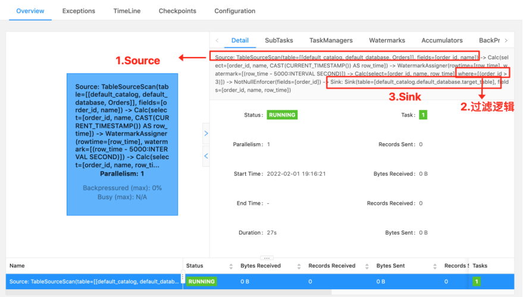
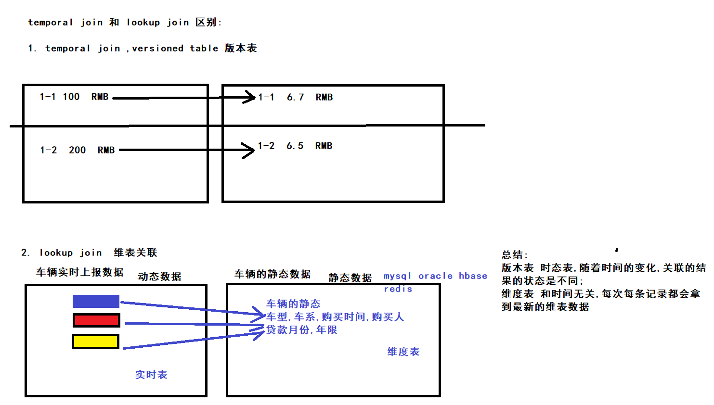
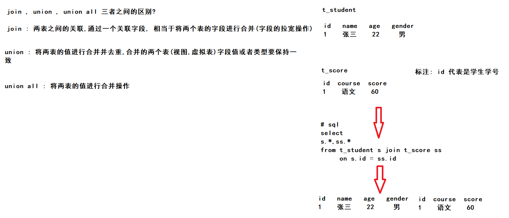
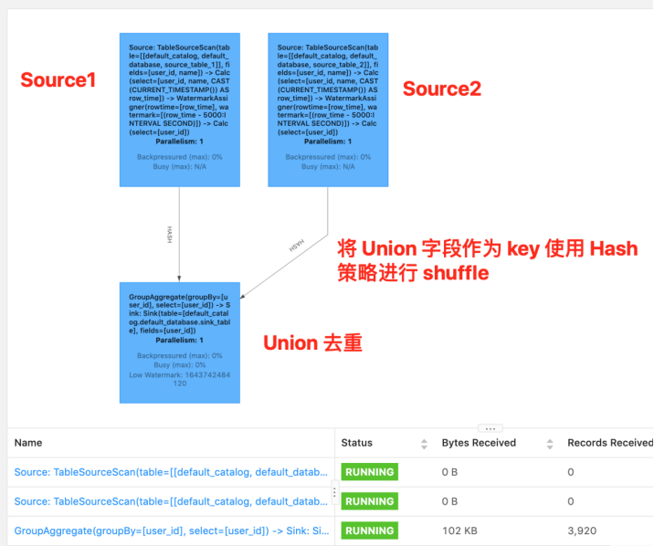
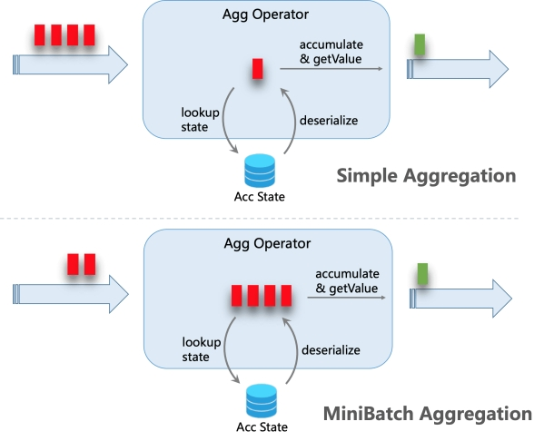
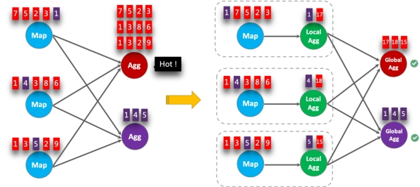
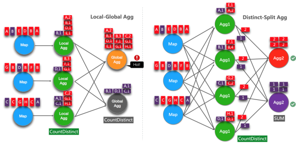

# day7-FlinkSQL

## 今日目标

## SQL 语法

### 知识点22：【理解】DDL：Create 子句

CREATE 语句用于向当前或指定的 **Catalog** 中注册库、表、视图或函数。注册后的库、表、视图和函数可以在 SQL 查询中使用。

目前 Flink SQL 支持下列 CREATE 语句：

- CREATE TABLE
- CREATE DATABASE
- CREATE VIEW
- CREATE FUNCTION

此节重点介绍建表，建数据库、视图和 UDF 会在后面的扩展章节进行介绍。

#### 建表语句

下面的 SQL 语句就是建表语句的定义，根据指定的表名创建一个表，如果同名表已经在 catalog 中存在了，则无法注册。

~~~sql
CREATE TABLE [IF NOT EXISTS] [catalog_name.][db_name.]table_name
  (
    { <physical_column_definition> | <metadata_column_definition> | <computed_column_definition> }[ , ...n]
    [ <watermark_definition> ]
    [ <table_constraint> ][ , ...n]
  )
  [COMMENT table_comment]
  [PARTITIONED BY (partition_column_name1, partition_column_name2, ...)]
  WITH (key1=val1, key2=val2, ...)
  [ LIKE source_table [( <like_options> )] ]
   
<physical_column_definition>:
  column_name column_type [ <column_constraint> ] [COMMENT column_comment]
  
<column_constraint>:
  [CONSTRAINT constraint_name] PRIMARY KEY NOT ENFORCED

<table_constraint>:
  [CONSTRAINT constraint_name] PRIMARY KEY (column_name, ...) NOT ENFORCED

<metadata_column_definition>:
  column_name column_type METADATA [ FROM metadata_key ] [ VIRTUAL ]

<computed_column_definition>:
  column_name AS computed_column_expression [COMMENT column_comment]

<watermark_definition>:
  WATERMARK FOR rowtime_column_name AS watermark_strategy_expression

<source_table>:
  [catalog_name.][db_name.]table_name

<like_options>:
{
   { INCLUDING | EXCLUDING } { ALL | CONSTRAINTS | PARTITIONS }
 | { INCLUDING | EXCLUDING | OVERWRITING } { GENERATED | OPTIONS | WATERMARKS } 
}[, ...]
~~~

#### 表中的列

- 常规列（即物理列）

  - 物理列是数据库中所说的常规列。其定义了物理介质中存储的数据中字段的名称、类型和顺序。

  - 其他类型的列可以在物理列之间声明，但不会影响最终的物理列的读取。

  - 举一个仅包含常规列的表的案例：

    - ~~~sql
      CREATE TABLE MyTable (
      	`user_id` BIGINT,
      	`name` STRING
      ) WITH (
      ...
      );
      ~~~

- 元数据列

  - 元数据列是 SQL 标准的扩展，允许访问数据源本身具有的一些元数据。元数据列由 **METADATA\** 关键字标识。

  - 例如，我们可以使用元数据列从 Kafka 数据中读取 Kafka 数据自带的时间戳（这个时间戳不是数据中的某个时间戳字段，而是数据写入 Kafka 时，Kafka 引擎给这条数据打上的时间戳标记），然后我们可以在 Flink SQL 中使用这个时间戳，比如进行基于时间的窗口操作。

  - 举例：

    - ~~~sql
      CREATE TABLE MyTable (
        `user_id` BIGINT,
        `name` STRING,
        -- 读取 kafka 本身自带的时间戳
        `record_time` TIMESTAMP_LTZ(3) METADATA FROM 'timestamp'
      ) WITH (
        'connector' = 'kafka'
        ...
      );
      ~~~

  - 元数据列可以用于后续数据的处理，或者写入到目标表中。

  - 举例：

    - ~~~sql
      INSERT INTO MyTable 
      SELECT 
      	user_id
      	, name
      	, record_time + INTERVAL '1' SECOND 
      FROM MyTable;
      ~~~

  - 如果自定义的列名称和 Connector 中定义 metadata 字段的名称一样的话，FROM xxx 子句是可以被省略的。

  - 举例：

    - ~~~sql
      CREATE TABLE MyTable (
        `user_id` BIGINT,
        `name` STRING,
        -- 读取 kafka 本身自带的时间戳
        `timestamp` TIMESTAMP_LTZ(3) METADATA
      ) WITH (
        'connector' = 'kafka'
        ...
      );
      ~~~

  - 关于 Flink SQL 的每种 Connector 都提供了哪些 metadata 字段，详细可见官网文档 [https://nightlies.apache.org/flink/flink-docs-release-1.15/docs/connectors/table/overview/](https://nightlies.apache.org/flink/flink-docs-release-1.13/docs/connectors/table/overview/)

  - 如果自定义列的数据类型和 Connector 中定义的 metadata 字段的数据类型不一致的话，程序运行时会自动 cast 强转。但是这要求两种数据类型是可以强转的。

  - 举例如下：

    - ~~~sql
      CREATE TABLE MyTable (
      	`user_id` BIGINT,
      	`name` STRING,
      	-- 将时间戳强转为 BIGINT
      	`timestamp` BIGINT METADATA
      ) WITH (
      'connector' = 'kafka'
      ...
      );
      ~~~

  - 默认情况下，Flink SQL planner 认为 metadata 列是可以 读取 也可以 写入 的。但是有些外部存储系统的元数据信息是只能用于读取，不能写入的。

  - 那么在往一个表写入的场景下，我们就可以使用 ***\*VIRTUAL\**** 关键字来标识某个元数据列不写入到外部存储中（不持久化）。

  - 以 Kafka 举例：

    - ~~~sql
      CREATE TABLE MyTable (
        -- sink 时会写入
        `timestamp` BIGINT METADATA,
        -- sink 时不写入
        `offset` BIGINT METADATA VIRTUAL,
        `user_id` BIGINT,
        `name` STRING,
      ) WITH (
        'connector' = 'kafka'
        ...
      );
      ~~~

  - 在上面这个案例中，Kafka 引擎的 offset 是只读的。所以我们在把 MyTable 作为数据源（输入）表时，schema 中是包含 offset 的。在把 MyTable 作为数据汇（输出）表时，schema 中是不包含 offset 的。如下：

    - ~~~
      -- 当做数据源（输入）的 schema
      MyTable(`timestamp` BIGINT, `offset` BIGINT, `user_id` BIGINT, `name` STRING)
      
      -- 当做数据汇（输出）的 schema
      MyTable(`timestamp` BIGINT, `user_id` BIGINT, `name` STRING)
      ~~~

    - 所以这里在写入时需要注意，不要在 SQL 的 INSERT INTO 语句中写入 offset 列，否则 Flink SQL 任务会直接报错。

- 计算列

  - 计算列其实就是在写建表的 DDL 时，可以拿已有的一些列经过一些自定义的运算生成的新列。这些列本身是没有以物理形式存储到数据源中的。

  - 举例：

    - ~~~sql
      CREATE TABLE MyTable (
        `user_id` BIGINT,
        `price` DOUBLE,
        `quantity` DOUBLE,
        -- cost 就是使用 price 和 quanitity 生成的计算列，计算方式为 price * quanitity
        `cost` AS price * quanitity,
      ) WITH (
        'connector' = 'kafka'
        ...
      );
      ~~~

- 注意事项

  - >计算列可以包含其他列、常量或者函数，但是不能写一个子查询进去。

  - 这时大家可能会问到一个问题，既然只能包含列、常量或者函数计算，我就直接在 DML query 代码中写就完事了呗，为啥还要专门在 DDL 中定义呢？

  - 结论：**没错，**如果只是简单的四则运算的话直接写在 DML 中就可以，但是计算列一般是用于定义时间属性的（因为在 SQL 任务中时间属性只能在 DDL 中定义，不能在 DML 语句中定义）。比如要把输入数据的时间格式标准化。处理时间、事件时间分别举例如下：

    - 处理时间：使用 **PROCTIME()** 函数来定义处理时间列

    - 事件时间：事件时间的时间戳可以在声明 Watermark 之前进行预处理。比如如果字段不是 TIMESTAMP(3) 类型或者时间戳是嵌套在 JSON 字符串中的，则可以使用计算列进行预处理。

    - 注意事项

      - >和虚拟 metadata 列是类似的，计算列也是只能读不能写的。
        >
        >也就是说，我们在把 MyTable 作为数据源（输入）表时，schema 中是包含 cost 的。
        >
        >在把 MyTable 作为数据汇（输出）表时，schema 中是不包含 cost 的。

    - 举例：

      - ~~~sql
        -- 当做数据源（输入）的 schema
        MyTable(`user_id` BIGINT, `price` DOUBLE, `quantity` DOUBLE, `cost` DOUBLE)
        
        -- 当做数据汇（输出）的 schema
        MyTable(`user_id` BIGINT, `price` DOUBLE, `quantity` DOUBLE)
        ~~~

#### 定义 Watermark

Watermark 是在 Create Table 中进行定义的。具体 SQL 语法标准是 WATERMARK FOR rowtime_column_name AS watermark_strategy_expression。

其中：

- rowtime_column_name：表的事件时间属性字段。该列必须是 **TIMESTAMP(3)**、\**TIMESTAMP_LTZ(3)** 类，这个时间可以是一个计算列。

- watermark_strategy_expression：定义 Watermark 的生成策略。Watermark 的一般都是由 rowtime_column_name 列**减掉一段固定时间间隔**。SQL 中 Watermark 的生产策略是：**当前 Watermark 大于上次发出的 Watermark 时发出当前 Watermark**。

- 注意事项

  - >1. 如果你使用的是事件时间语义，那么必须要设设置**事件时间属性**和 **WATERMARK** 生成策略。
    >2. Watermark 的发出频率：Watermark 发出一般是间隔一定时间的，Watermark 的发出间隔时间可以由 **pipeline.auto-watermark-interval** 进行配置，如果设置为 200ms 则每 200ms 会计算一次 Watermark，然如果比之前发出的 Watermark 大，则发出。如果间隔设为 0ms，则 Watermark 只要满足触发条件就会发出，不会受到间隔时间控制。

  - 有界无序：设置方式为 WATERMARK FOR rowtime_column AS rowtime_column - INTERVAL 'string' timeUnit。此类策略就可以用于设置最大乱序时间，假如设置为 WATERMARK FOR rowtime_column AS rowtime_column - INTERVAL '5' SECOND，则生成的是运行 5s 延迟的 Watermark。**一般都用这种 Watermark 生成策略**，此类 Watermark 生成策略通常用于有数据乱序的场景中，而对应到实际的场景中，数据都是会存在乱序的，所以基本都使用此类策略。

  - 严格升序：设置方式为 WATERMARK FOR rowtime_column AS rowtime_column。**一般基本不用这种方式**。如果你能保证你的数据源的时间戳是严格升序的，那就可以使用这种方式。严格升序代表 Flink 任务认为时间戳只会越来越大，也不存在相等的情况，只要相等或者小于之前的，就认为是迟到的数据。

  - 递增：设置方式为 WATERMARK FOR rowtime_column AS rowtime_column - INTERVAL '0.001' SECOND。**一般基本不用这种方式**。如果设置此类，则允许有相同的时间戳出现。

#### Create Table With 子句

先看一个案例：

~~~sql
CREATE TABLE KafkaTable (
sku_id STRING, 
count_result BIGINT, 
sum_result BIGINT, 
avg_result DOUBLE, 
min_result BIGINT, 
max_result BIGINT, 
`ts` TIMESTAMP(3) METADATA FROM 'timestamp'
) WITH (
'connector' = 'kafka',
'topic' = 'test1',
'properties.bootstrap.servers' = 'node1.itcast.cn:9092',
'properties.group.id' = 'testGroup',
'scan.startup.mode' = 'earliest-offset',
'format' = 'json'
)
~~~

可以看到 DDL 中 With 子句就是在建表时，描述数据源的具体外部存储的元数据信息的。

一般 With 中的配置项由 Flink SQL 的 Connector（链接外部存储的连接器） 来定义，每种 Connector 提供的 With 配置项都是不同的。

- 注意事项
  -  Flink SQL 中 Connector 其实就是 Flink 用于链接外部数据源的接口。举一个类似的例子，在 Java 中想连接到 MySQL，需要使用 mysql-connector-java 包提供的 Java API 去链接。映射到 Flink SQL 中，在 Flink SQL 中要连接到 Kafka，需要使用 kafka connector
  -  Flink SQL 已经提供了一系列的内置 Connector，具体可见 [https://nightlies.apache.org/flink/flink-docs-release-1.15/docs/connectors/table/overview/](https://nightlies.apache.org/flink/flink-docs-release-1.13/docs/connectors/table/overview/)
     - 'connector' = 'kafka'：声明外部存储是 Kafka
     - 'topic' = 'test1'：声明 Flink SQL 任务要连接的 Kafka 表的 topic 是 test1
     - 'properties.bootstrap.servers' = 'node1:9092'：声明 Kafka 的 server ip 是 node1:9092
     - 'properties.group.id' = 'testGroup'：声明 Flink SQL 任务消费这个 Kafka topic，会使用 testGroup 的 group id 去消费
     - 'scan.startup.mode' = 'earliest-offset'：声明 Flink SQL 任务消费这个 Kafka topic 会从最早位点开始消费
     - 'format' = 'csv'：声明 Flink SQL 任务读入或者写出时对于 Kafka 消息的序列化方式是 csv 格式

#### Create Table Like 子句

Like 子句是 Create Table 子句的一个延伸。

举例：

下面定义了一张 Orders 表：

~~~sql
CREATE TABLE Orders (
    `user` BIGINT,
    product STRING,
    order_time TIMESTAMP(3)
) WITH ( 
    'connector' = 'kafka',
    'scan.startup.mode' = 'earliest-offset'
);
~~~

但是忘记定义 Watermark 了，那如果想加上 Watermark，就可以用 Like 子句定义一张带 Watermark 的新表：

~~~sql
CREATE TABLE Orders_with_watermark (
    -- 1. 添加了 WATERMARK 定义
    WATERMARK FOR order_time AS order_time - INTERVAL '5' SECOND 
) WITH (
    -- 2. 覆盖了原 Orders 表中 scan.startup.mode 参数
    'scan.startup.mode' = 'latest-offset'
)
-- 3. Like 子句声明是在原来的 Orders 表的基础上定义 Orders_with_watermark 表
LIKE Orders;
~~~

上面这个语句的效果就等同于：

~~~sql
CREATE TABLE Orders_with_watermark (
    `user` BIGINT,
    product STRING,
    order_time TIMESTAMP(3),
    WATERMARK FOR order_time AS order_time - INTERVAL '5' SECOND 
) WITH (
    'connector' = 'kafka',
    'scan.startup.mode' = 'latest-offset'
);
~~~

**不过这种不常使用**。就不过多介绍了。如果感兴趣，直接去官网参考具体注意事项：

[https://nightlies.apache.org/flink/flink-docs-release-1.15/docs/dev/table/sql/create/#like](#like)

### 知识点23：【理解】DML：With 子句

应用场景（**支持 Batch\Streaming**）：With 语句和离线 Hive SQL With 语句一样的，xdm，语法糖 +1，使用它可以让你的代码逻辑更加清晰。

案例：

~~~sql
-- 语法糖+1
WITH orders_with_total AS (
    SELECT 
        order_id
        , price + tax AS total
    FROM Orders
)
SELECT 
    order_id
    , SUM(total)
FROM orders_with_total
GROUP BY 
    order_id;
~~~

### 知识点24：【理解】DML：SELECT & WHERE 子句

应用场景（**支持 Batch\Streaming**）：SELECT & WHERE 语句和离线 Hive SQL 语句一样的，xdm，常用作 ETL，过滤，字段清洗标准化

案例：

~~~sql
INSERT INTO target_table
SELECT * FROM Orders

INSERT INTO target_table
SELECT order_id, price + tax FROM Orders

INSERT INTO target_table
-- 自定义 Source 的数据
SELECT order_id, price FROM (VALUES (1, 2.0), (2, 3.1))  AS t (order_id, price)

INSERT INTO target_table
SELECT price + tax FROM Orders WHERE id = 10

-- 使用 UDF 做字段标准化处理
INSERT INTO target_table
SELECT PRETTY_PRINT(order_id) FROM Orders
-- 过滤条件
Where id > 3
~~~

**SQL 语义：**

其实理解一个 SQL 最后生成的任务是怎样执行的，最好的方式就是理解其语义。

以下面的 SQL 为例，我们来介绍下其在离线中和在实时中执行的区别，对比学习一下，大家就比较清楚了

~~~sql
INSERT INTO target_table
	SELECT PRETTY_PRINT(order_id) FROM Orders
Where id > 3
~~~

这个 SQL 对应的实时任务，假设 Orders 为 kafka，target_table 也为 Kafka，在执行时，会生成三个算子：

- 数据源算子（From Order）：连接到 Kafka topic，数据源算子一直运行，实时的从 Order Kafka 中一条一条的读取数据，然后一条一条发送给下游的 过滤和字段标准化算子
- 过滤和字段标准化算子（Where id > 3 和 PRETTY_PRINT(order_id)）：接收到上游算子发的一条一条的数据，然后判断 id > 3？将判断结果为 true 的数据执行 PRETTY_PRINT UDF 后，一条一条将计算结果数据发给下游 数据汇算子
- 数据汇算子（INSERT INTO target_table）：接收到上游发的一条一条的数据，写入到 target_table Kafka 中

可以看到这个实时任务的所有算子是以一种 pipeline 模式运行的，所有的算子在同一时刻都是处于 running 状态的，24 小时一直在运行，实时任务中也没有离线中常见的分区概念。

关于看如何看一段 Flink SQL 最终的执行计划：

最好的方法就如上图，看 Flink web ui 的算子图，算子图上详细的标记清楚了每一个算子做的事情。以上图来说，我们可以看到主要有三个算子：

- Source 算子：Source: TableSourceScan(table=[[default_catalog, default_database, Orders]], fields=[order_id, name]) -> Calc(select=[order_id, name, CAST(CURRENT_TIMESTAMP()) AS row_time]) -> WatermarkAssigner(rowtime=[row_time], watermark=[(row_time - 5000:INTERVAL SECOND)]) ，其中 Source 表名称为 table=[[default_catalog, default_database, Orders]，字段为 select=[order_id, name, CAST(CURRENT_TIMESTAMP()) AS row_time]，Watermark 策略为 rowtime=[row_time], watermark=[(row_time - 5000:INTERVAL SECOND)]。
- 过滤算子：Calc(select=[order_id, name, row_time], where=[(order_id > 3)]) -> NotNullEnforcer(fields=[order_id])，其中过滤条件为 where=[(order_id > 3)]，结果字段为 select=[order_id, name, row_time]
- Sink 算子：Sink: Sink(table=[default_catalog.default_database.target_table], fields=[order_id, name, row_time])，其中最终产出的表名称为 table=[default_catalog.default_database.target_table]，表字段为 fields=[order_id, name, row_time]

可以看到 Flink SQL 具体执行了哪些操作是非常详细的标记在算子图上。所以一定要学会看算子图，这是掌握 debug、调优前最基础的一个技巧。

那么如果这个 SQL 放在 Hive 中执行时，假设其中 Orders 为 Hive 表，target_table 也为 Hive 表，其也会生成三个类似的算子（虽然实际可能会被优化为一个算子，这里为了方便对比，划分为三个进行介绍），离线和实时任务的执行方式完全不同：

- 数据源算子（From Order）：数据源从 Order Hive 表（通常都是读一天、一小时的分区数据）中一次性读取所有的数据，然后将读到的数据全部发给下游 过滤和字段标准化算子，然后 数据源算子 就运行结束了，释放资源了

- 过滤和字段标准化算子（Where id > 3 和 PRETTY_PRINT(order_id)）：接收到上游算子的所有数据，然后遍历所有数据判断 id > 3？将判断结果为 true 的数据执行 PRETTY_PRINT UDF 后，将所有数据发给下游 数据汇算子，然后 过滤和字段标准化算子 就运行结束了，释放资源了
- 数据汇算子（INSERT INTO target_table）：接收到上游的所有数据，将所有数据都写到 target_table Hive 表中，然后整个任务就运行结束了，整个任务的资源也就都释放了

可以看到离线任务的算子是分阶段（stage）进行运行的，每一个 stage 运行结束之后，然后下一个 stage 开始运行，全部的 stage 运行完成之后，这个离线任务就跑结束了。

**注意：**

之前做过离线数仓的，熟悉了离线的分区、计算任务定时调度运行这两个概念，所以在最初接触 Flink SQL 时，会以为 Flink SQL 实时任务也会存在这两个概念，这里做一下解释

- 分区概念：离线由于能力限制问题，通常都是进行一批一批的数据计算，每一批数据的数据量都是有限的集合，这一批一批的数据自然的划分方式就是时间，比如按小时、天进行划分分区。但是 在实时任务中，是没有分区的概念的，实时任务的上游、下游都是无限的数据流。

- 计算任务定时调度概念：同上，离线就是由于计算能力限制，数据要一批一批算，一批一批输入、产出，所以要按照小时、天定时的调度和计算。但是 在实时任务中，是没有定时调度的概念的，实时任务一旦运行起来就是 24 小时不间断，不间断的处理上游无限的数据，不简单的产出数据给到下游。

### 知识点25：【理解】DML：SELECT DISTINCT 子句

应用场景（**支持 Batch\Streaming**）：语句和离线 Hive SQL SELECT DISTINCT 语句一样的，用作根据 key 进行数据去重

案例：

~~~sql
INSERT into target_table
SELECT 
	DISTINCT id 
FROM Orders
~~~

SQL 语义：

也是拿离线和实时做对比。

这个 SQL 对应的实时任务，假设 Orders 为 kafka，target_table 也为 Kafka，在执行时，会生成三个算子：

- 数据源算子（From Order）：连接到 Kafka topic，数据源算子一直运行，实时的从 Order Kafka 中一条一条的读取数据，然后一条一条发送给下游的 去重算子
- 去重算子（DISTINCT id）：接收到上游算子发的一条一条的数据，然后判断这个 id 之前是否已经来过了，判断方式就是使用 Flink 中的 state 状态，如果状态中已经有这个 id 了，则说明已经来过了，不往下游算子发，如果状态中没有这个 id，则说明没来过，则往下游算子发，也是一条一条发给下游 数据汇算子
- 数据汇算子（INSERT INTO target_table）：接收到上游发的一条一条的数据，写入到 target_table Kafka 中

- 注意事项
  - 对于实时任务，计算时的状态可能会无限增长。
  - 状态大小取决于不同 key（上述案例为 id 字段）的数量。为了防止状态无限变大，我们可以设置状态的 TTL。但是这可能会影响查询结果的正确性，比如某个 key 的数据过期从状态中删除了，那么下次再来这么一个 key，由于在状态中找不到，就又会输出一遍。

那么如果这个 SQL 放在 Hive 中执行时，假设其中 Orders 为 Hive 表，target_table 也为 Hive 表，其也会生成三个相同的算子（虽然可能会被优化为一个算子，这里为了方便对比，划分为三个进行介绍），但是其和实时任务的执行方式完全不同：

- 数据源算子（From Order）：数据源从 Order Hive 表（通常都有天、小时分区限制）中一次性读取所有的数据，然后将读到的数据全部发给下游 去重算子，然后 数据源算子 就运行结束了，释放资源了
- 去重算子（DISTINCT id）：接收到上游算子的所有数据，然后遍历所有数据进行去重，将去重完的所有结果数据发给下游 数据汇算子，然后 去重算子 就运行结束了，释放资源了
- 数据汇算子（INSERT INTO target_table）：接收到上游的所有数据，将所有数据都写到 target_table Hive 中，然后整个任务就运行结束了，整个任务的资源也就都释放了

### 知识点26：【理解】Window TVF 支持多维数据分析

对于经常需要对数据进行多维度的聚合分析的场景，您既需要对a列做聚合，也要对b列做聚合，同时要按照a、b两列同时做聚合，因此需要多次使用UNION ALL。使用**GROUPING SETS**可以快速解决此类问题。

MaxCompute中的GROUPING SETS是对SELECT语句中GROUP BY子句的扩展，允许您采用多种方式对结果分组，而不必使用多个SELECT语句来实现这一目的。这样能够使MaxCompute的引擎给出更有效的执行计划，从而提高执行性能。

#### Grouping Sets

窗口聚合还支持GROUPING SETS语法。分组集允许比标准描述的分组操作更为复杂的分组操作GROUP BY。按每个指定的分组集将行分别分组，并像简单GROUP BY子句一样为每个组计算聚合。

具有的窗口聚合GROUPING SETS要求window_start和window_end都必须在GROUP BY子句中，而不是在GROUPING SETS子句中。

**注意：**GROUPING SETS语法也可以用于非窗口函数的场景

具体应用场景：实际的案例场景中，经常会有多个维度进行组合（cube）计算指标的场景。如果把每个维度组合的代码写一遍，然后 union all 起来，这样写起来非常麻烦，而且会导致一个数据源读取多遍。

这时，有离线 Hive SQL 使用经验的就会想到，如果有了 Grouping Sets，我们就可以直接用 Grouping Sets 将维度组合写在一条 SQL 中，写起来方便并且执行效率也高。当然，Flink 支持这个功能。

**但是目前 Grouping Sets 只在 Window TVF 中支持，不支持 Group Window Aggregation**。

来一个实际案例感受一下，计算每日零点累计到当前这一分钟的分汇总、age、sex、age+sex 维度的用户数。

~~~sql
-- 用户访问明细表
CREATE TABLE source_table (
    age STRING,
    sex STRING,
    user_id BIGINT,
    row_time AS cast(CURRENT_TIMESTAMP as timestamp(3)),
    WATERMARK FOR row_time AS row_time - INTERVAL '5' SECOND
) WITH (
  'connector' = 'datagen',
  'rows-per-second' = '1',
  'fields.age.length' = '1',
  'fields.sex.length' = '1',
  'fields.user_id.min' = '1',
  'fields.user_id.max' = '100000'
);

SELECT 
    UNIX_TIMESTAMP(CAST(window_start AS STRING)) * 1000 as window_start, 
    UNIX_TIMESTAMP(CAST(window_end AS STRING)) * 1000 as window_end, 
    if (age is null, 'ALL', age) as age,
    if (sex is null, 'ALL', sex) as sex,
    count(distinct user_id) as bucket_uv
FROM TABLE(CUMULATE(
       TABLE source_table
       , DESCRIPTOR(row_time)
       , INTERVAL '5' SECOND
       , INTERVAL '1' DAY))
GROUP BY 
    window_start, 
    window_end,
    -- grouping sets 写法
    GROUPING SETS (
        ()
        , (age)
        , (sex)
        , (age, sex)
    )
~~~

**这里需要注意下！！！**

Flink SQL 中 Grouping Sets 的语法和 Hive SQL 的语法有一些不同，如果我们使用 Hive SQL 实现上述 SQL 的语义，其实现如下：

~~~sql
insert into sink_table
SELECT 
    UNIX_TIMESTAMP(CAST(window_end AS STRING)) * 1000 as window_end, 
    if (age is null, 'ALL', age) as age,
    if (sex is null, 'ALL', sex) as sex,
    count(distinct user_id) as bucket_uv
FROM source_table
GROUP BY
    age
    , sex
-- hive sql grouping sets 写法
GROUPING SETS (
    ()
    , (age)
    , (sex)
    , (age, sex)
)
~~~

#### Rollup

**CUBE**和**ROLLUP**可以认为是特殊的**GROUPING SETS**。

CUBE会枚举指定列的所有可能组合作为GROUPING SETS，而ROLLUP会以按层级聚合的方式产生GROUPING SETS。

ROLLUP是用于指定通用分组集类型的简写形式。它表示给定的表达式列表以及列表的所有前缀，包括空列表。

具有的窗口聚合**ROLLUP要求window_start和window_end列都必须在GROUP BY子句中**，而不是在ROLLUP子句中。

**使用示例：**

~~~sql
GROUP BY ROLLUP(a, b, c)
--等价于以下语句。
GROUPING SETS((a,b,c),(a,b),(a), ())

GROUP BY ROLLUP ( a, (b, c), d )
--等价于以下语句。
GROUPING SETS (
    ( a, b, c, d ),
    ( a, b, c    ),
    ( a          ),
    (            )
)

GROUP BY grouping sets((b), (c),rollup(a,b,c))
--等价于以下语句。
GROUP BY GROUPING SETS (
    (b), (c),
    (a,b,c), (a,b), (a), ()
 )
~~~

来一个实际案例感受一下，计算每日零点累计到当前这一分钟的分汇总、age、sex、age+sex 维度的用户数。

~~~sql
-- 用户访问明细表
CREATE TABLE source_table (
    age STRING,
    sex STRING,
    user_id BIGINT,
    row_time AS cast(CURRENT_TIMESTAMP as timestamp(3)),
    WATERMARK FOR row_time AS row_time - INTERVAL '5' SECOND
) WITH (
  'connector' = 'datagen',
  'rows-per-second' = '1',
  'fields.age.length' = '1',
  'fields.sex.length' = '1',
  'fields.user_id.min' = '1',
  'fields.user_id.max' = '100000'
);

SELECT 
    UNIX_TIMESTAMP(CAST(window_start AS STRING)) * 1000 as window_start, 
    UNIX_TIMESTAMP(CAST(window_end AS STRING)) * 1000 as window_end, 
    if (age is null, 'ALL', age) as age,
    if (sex is null, 'ALL', sex) as sex,
    count(distinct user_id) as bucket_uv
FROM TABLE(CUMULATE(
       TABLE source_table
       , DESCRIPTOR(row_time)
       , INTERVAL '5' SECOND
       , INTERVAL '1' DAY))
GROUP BY 
    window_start, 
    window_end,
    ROLLUP(age, sex);
~~~

#### Cube

使用示例：

~~~sql
GROUP BY CUBE(a, b, c)
--等价于以下语句。
GROUPING SETS((a,b,c),(a,b),(a,c),(b,c),(a),(b),(c),())

GROUP BY CUBE ( (a, b), (c, d) )
--等价于以下语句。
GROUPING SETS (
    ( a, b, c, d ),
    ( a, b       ),
    (       c, d ),
    (            )
)

GROUP BY a, CUBE (b, c), GROUPING SETS ((d), (e))
--等价于以下语句。
GROUP BY GROUPING SETS (
    (a, b, c, d), (a, b, c, e),
    (a, b, d),    (a, b, e),
    (a, c, d),    (a, c, e),
    (a, d),       (a, e)
)
~~~

使用演示：

~~~sql
-- 用户访问明细表
CREATE TABLE source_table (
    age STRING,
    sex STRING,
    user_id BIGINT,
    row_time AS cast(CURRENT_TIMESTAMP as timestamp(3)),
    WATERMARK FOR row_time AS row_time - INTERVAL '5' SECOND
) WITH (
  'connector' = 'datagen',
  'rows-per-second' = '1',
  'fields.age.length' = '1',
  'fields.sex.length' = '1',
  'fields.user_id.min' = '1',
  'fields.user_id.max' = '100000'
);

SELECT 
    UNIX_TIMESTAMP(CAST(window_start AS STRING)) * 1000 as window_start, 
    UNIX_TIMESTAMP(CAST(window_end AS STRING)) * 1000 as window_end, 
    if (age is null, 'ALL', age) as age,
    if (sex is null, 'ALL', sex) as sex,
    count(distinct user_id) as bucket_uv
FROM TABLE(CUMULATE(
       TABLE source_table
       , DESCRIPTOR(row_time)
       , INTERVAL '5' SECOND
       , INTERVAL '1' DAY))
GROUP BY 
    window_start, 
    window_end,
    CUBE(age, sex);
~~~

#### GROUPING和GROUPING_ID函数

GROUPING SETS结果中使用NULL充当占位符，导致您会无法区分占位符NULL与数据中真正的NULL。因此，MaxCompute为您提供了GROUPING函数。GROUPING函数接受一个列名作为参数，如果结果对应行使用了参数列做聚合，返回0，此时意味着NULL来自输入数据。否则返回1，此时意味着NULL是GROUPING SETS的占位符。

MaxCompute还提供了GROUPING_ID函数，此函数接受一个或多个列名作为参数。结果是将参数列的GROUPING结果按照BitMap的方式组成整数。

使用示例：

~~~sql
SELECT a,b,c ,COUNT(*),
GROUPING(a) ga, 
GROUPING(b) gb, 
GROUPING(c) gc, 
GROUPING_ID(a,b,c) groupingid
FROM (VALUES (1,2,3)) as t(a,b,c)
GROUP BY CUBE(a,b,c)
~~~

输出结果：

~~~
          a           b           c                 EXPR$3                 ga                   gb                   gc           groupingid
           1           2           3                    1                     0                    0                    0                    0
           1           2      <NULL>                   1                     0                    0                    1                    1
           1      <NULL>           3                   1                     0                    1                    0                    2
           1      <NULL>      <NULL>                  1                     0                    1                    1                    3
      <NULL>           2           3                   1                     1                    0                    0                    4
      <NULL>           2      <NULL>                  1                     1                    0                    1                    5
      <NULL>      <NULL>           3                  1                     1                    1                    0                    6
      <NULL>      <NULL>      <NULL>                 1                     1                    1                    1                    7
~~~

默认情况，GROUP BY列表中不被使用的列，会被填充为NULL。您可以通过GROUPING函数输出更有实际意义的值。

~~~sql
SELECT 
    UNIX_TIMESTAMP(CAST(window_start AS STRING)) * 1000 as window_start, 
UNIX_TIMESTAMP(CAST(window_end AS STRING)) * 1000 as window_end, 
IF(GROUPING(age) = 0, age, 'ALL') as age,
   IF(GROUPING(sex) = 0, sex, 'ALL') as sex ,
  count(distinct user_id) as bucket_uv
FROM TABLE(CUMULATE(
       TABLE source_table
       , DESCRIPTOR(row_time)
       , INTERVAL '5' SECOND
       , INTERVAL '1' DAY))
GROUP BY 
    window_start, 
    window_end,
    CUBE(age, sex);
~~~

### 知识点27：【理解】DML：Group 聚合

**Group 聚合定义（支持 Batch\Streaming 任务）**：Flink 也支持 Group 聚合。Group 聚合和上面介绍到的窗口聚合的不同之处，就在于 Group 聚合是按照数据的类别进行分组，比如年龄、性别，是横向的；而窗口聚合是在时间粒度上对数据进行分组，是纵向的。如下图所示，就展示出了其区别。其中 按颜色分 key（横向） 就是 Group 聚合，按窗口划分（纵向） 就是窗口聚合。

 

**应用场景**：一般用于对数据进行分组，然后后续使用聚合函数进行 count、sum 等聚合操作。

那么这时候，大家就会问到，其实可以把窗口聚合的写法也转换为 Group 聚合，只需要把 Group 聚合的 Group By key 换成时间就行，那这两个聚合的区别到底在哪？

首先来举一个例子看看怎么将窗口聚合转换为 Group 聚合。假如一个窗口聚合是按照 1 分钟的粒度进行聚合，如下 SQL：

- 滚动窗口（TUMBLE）

  - ~~~sql
    -- 数据源表
    CREATE TABLE source_table (
        -- 维度数据
        dim STRING,
        -- 用户 id
        user_id BIGINT,
        -- 用户
        price BIGINT,
        -- 事件时间戳
        row_time AS cast(CURRENT_TIMESTAMP as timestamp(3)),
        -- watermark 设置
        WATERMARK FOR row_time AS row_time - INTERVAL '5' SECOND
    ) WITH (
      'connector' = 'datagen',
      'rows-per-second' = '10',
      'fields.dim.length' = '1',
      'fields.user_id.min' = '1',
      'fields.user_id.max' = '100000',
      'fields.price.min' = '1',
      'fields.price.max' = '100000'
    )
     
    select dim,
        count(*) as pv,
        sum(price) as sum_price,
        max(price) as max_price,
        min(price) as min_price,
        -- 计算 uv 数
        count(distinct user_id) as uv,
        UNIX_TIMESTAMP(CAST(tumble_start(row_time, interval '1' minute) AS STRING)) * 1000  as window_start
    from source_table
    group by
        dim,
        -- 按照 Flink SQL tumble 窗口写法划分窗口
        tumble(row_time, interval '1' minute)
    ~~~

- Group 聚合

  - ~~~sql
    -- 数据源表
    CREATE TABLE source_table (
    -- 维度数据
    dim STRING,
    -- 用户 id
    user_id BIGINT,
    -- 用户
    price BIGINT,
    -- 事件时间戳
    row_time AS cast(CURRENT_TIMESTAMP as timestamp(3)),
    -- watermark 设置
    WATERMARK FOR row_time AS row_time - INTERVAL '5' SECOND
    ) WITH (
    'connector' = 'datagen',
    'rows-per-second' = '10',
    'fields.dim.length' = '1',
    'fields.user_id.min' = '1',
    'fields.user_id.max' = '100000',
    'fields.price.min' = '1',
    'fields.price.max' = '100000'
    );
    
    
    -- 数据处理逻辑
    select dim,
    count(*) as pv,
    sum(price) as sum_price,
    max(price) as max_price,
    min(price) as min_price,
    -- 计算 uv 数
    count(distinct user_id) as uv,
    cast((UNIX_TIMESTAMP(CAST(row_time AS STRING))) / 60 as bigint) as window_start
    from source_table
    group by
    dim,
    -- 将秒级别时间戳 / 60 转化为 1min
    cast((UNIX_TIMESTAMP(CAST(row_time AS STRING))) / 60 as bigint)
    ~~~

确实没错，上面这个转换是一点问题都没有的。

但是窗口聚合和 Group by 聚合的差异在于：

- **本质区别**：窗口聚合是具有时间语义的，其本质是想实现窗口结束输出结果之后，后续有迟到的数据也不会对原有的结果发生更改了，即输出结果值是定值（不考虑 allowLateness）。而 Group by 聚合是没有时间语义的，不管数据迟到多长时间，只要数据来了，就把上一次的输出的结果数据撤回，然后把计算好的新的结果数据发出
- **运行层面**：窗口聚合是和 时间 绑定的，窗口聚合其中窗口的计算结果触发都是由时间（Watermark）推动的。Group by 聚合完全由数据推动触发计算，新来一条数据去根据这条数据进行计算出结果发出；由此可见两者的实现方式也大为不同。

**SQL 语义**

也是拿离线和实时做对比，Orders 为 kafka，target_table 为 Kafka，这个 SQL 生成的实时任务，在执行时，会生成三个算子：

- 数据源算子（From Order）：数据源算子一直运行，实时的从 Order Kafka 中一条一条的读取数据，然后一条一条发送给下游的 Group 聚合算子，向下游发送数据的 shuffle 策略是根据 group by 中的 key 进行发送，相同的 key 发到同一个 SubTask（并发） 中

- Group 聚合算子（group by key + sum\count\max\min）：接收到上游算子发的一条一条的数据，去状态 state 中找这个 key 之前的 sum\count\max\min 结果。如果有结果 oldResult，拿出来和当前的数据进行 sum\count\max\min 计算出这个 key 的新结果 newResult，并将新结果 [key, newResult] 更新到 state 中，在向下游发送新计算的结果之前，先发一条撤回上次结果的消息 -[key, oldResult]，然后再将新结果发往下游 +[key, newResult]；如果 state 中没有当前 key 的结果，则直接使用当前这条数据计算 sum\max\min 结果 newResult，并将新结果 [key, newResult] 更新到 state 中，当前是第一次往下游发，则不需要先发回撤消息，直接发送 +[key, newResult]。

- 数据汇算子（INSERT INTO target_table）：接收到上游发的一条一条的数据，写入到 target_table Kafka 中

这个实时任务也是 24 小时一直在运行的，所有的算子在同一时刻都是处于 running 状态的。

>1. Group by 聚合涉及到了回撤流（也叫 retract 流），会产生回撤流是因为从整个 SQL 的语义来看，上游的 Kafka 数据是源源不断的，无穷无尽的，那么每次这个 SQL 任务产出的结果都是一个中间结果，所以每次结果发生更新时，都需要将上一次发出的中间结果给撤回，然后将最新的结果发下去。
>2. Group by 聚合涉及到了状态：状态大小也取决于不同 key 的数量。为了防止状态无限变大，我们可以设置状态的 TTL。以上面的 SQL 为例，上面 SQL 是按照分钟进行聚合的，理论上到了今天，通常我们就可以不用关心昨天的数据了，那么我们可以设置状态过期时间为一天。“table.exec.state.ttl”
>3. https://nightlies.apache.org/flink/flink-docs-release-1.15/zh/docs/dev/table/config/

如果这个 SQL 放在 Hive 中执行时，其中 Orders 为 Hive，target_table 也为 Hive，其也会生成三个相同的算子，但是其和实时任务的执行方式完全不同：

- 数据源算子（From Order）：数据源算子从 Order Hive 中读取到所有的数据，然后所有数据发送给下游的 Group 聚合算子，向下游发送数据的 shuffle 策略是根据 group by 中的 key 进行发送，相同的 key 发到同一个算子中，然后这个算子就运行结束了，释放资源了

- Group 聚合算子（group by + sum\count\max\min）：接收到上游算子发的所有数据，然后遍历计算 sum\count\max\min 结果，批量发给下游 数据汇算子，这个算子也就运行结束了，释放资源了

- 数据汇算子（INSERT INTO target_table）：接收到上游发的一条一条的数据，写入到 target_table Hive 中，整个任务也就运行结束了，整个任务的资源也就都释放了

### DML：Joins

Flink 也支持了非常多的数据 Join 方式，主要包括以下三种：

- 动态表（流）与动态表（流）的 Join
- 动态表（流）与外部维表（比如 Redis）的 Join
- 动态表字段的列转行（一种特殊的 Join）

细分 Flink SQL 支持的 Join：

- Regular Join：流与流的 Join，包括 Inner Equal Join、Outer Equal Join
- Interval Join：流与流的 Join，两条流一段时间区间内的 Join

- Temporal Join：流与流的 Join，包括事件时间，处理时间的 Temporal Join，类似于离线中的快照 Join

- Lookup Join：流与外部维表的 Join

- Array Expansion：表字段的列转行，类似于 Hive 的 explode 数据炸开的列转行

- Table Function：自定义函数的表字段的列转行，支持 Inner Join 和 Left Outer Join

#### 知识点28：【理解】Regular Join

**Regular Join 定义（支持 Batch\Streaming）**：Regular Join 其实就是和离线 Hive SQL 一样的 Regular Join，通过条件关联两条流数据输出。

**应用场景**：Join 其实在我们的数仓建设过程中应用是非常广泛的。离线数仓可以说基本上是离不开 Join 的。那么实时数仓的建设也必然离不开 Join，比如日志关联扩充维度数据，构建宽表；日志通过 ID 关联计算 CTR。

Regular Join 包含以下几种（以 L 作为左流中的数据标识，R 作为右流中的数据标识）：

- Inner Join（Inner Equal Join）：流任务中，只有两条流 Join 到才输出，输出 +[L, R]
- Left Join（Outer Equal Join）：流任务中，左流数据到达之后，无论有没有 Join 到右流的数据，都会输出（Join 到输出 +[L, R]，没 Join 到输出 +[L, null]），如果右流之后数据到达之后，发现左流之前输出过没有 Join 到的数据，则会发起回撤流，先输出 -[L, null]，然后输出 +[L, R]
- Right Join（Outer Equal Join）：有 Left Join 一样，左表和右表的执行逻辑完全相反
- Full Join（Outer Equal Join）：流任务中，左流或者右流的数据到达之后，无论有没有 Join 到另外一条流的数据，都会输出（对右流来说：Join 到输出 +[L, R]，没 Join 到输出 +[null, R]；对左流来说：Join 到输出 +[L, R]，没 Join 到输出 +[L, null]）。如果一条流的数据到达之后，发现之前另一条流之前输出过没有 Join 到的数据，则会发起回撤流（左流数据到达为例：回撤 -[null, R]，输出 +[L, R]，右流数据到达为例：回撤 -[L, null]，输出 +[L, R]）。

**实际案例**：案例为曝光日志关联点击日志筛选既有曝光又有点击的数据，并且补充点击的扩展参数（show inner click）：

**下面这个案例为 Inner Join 案例：**

~~~sql
-- 曝光日志数据
Flink SQL> CREATE TABLE show_log_table (
    log_id BIGINT,
    show_params STRING
) WITH (
  'connector' = 'socket',
  'hostname' = 'node1',        
  'port' = '8888',
  'format' = 'csv'
);

-- 点击日志数据
Flink SQL> CREATE TABLE click_log_table (
  log_id BIGINT,
  click_params     STRING
)
WITH (
  'connector' = 'socket',
  'hostname' = 'node1',        
  'port' = '9999',
  'format' = 'csv'
);

-- 流的 INNER JOIN，条件为 log_id
Flink SQL> SELECT
    show_log_table.log_id as s_id,
    show_log_table.show_params as s_params,
    click_log_table.log_id as c_id,
    click_log_table.click_params as c_params
FROM show_log_table
INNER JOIN click_log_table ON show_log_table.log_id = click_log_table.log_id;
~~~

开启netcat的**8888**端口，输入数据：

~~~
1,hadoop
2,spark
~~~

开启netcat的**9999**端口，输入数据：

~~~
1,zhangsan
2,lisi
~~~

输出结果如下：

~~~
s_id                       s_params                 c_id                       c_params
1                         hadoop                    1                       zhangsan
2                          spark                    2                           lisi
~~~

**如果为 Left Join 案例：**

~~~sql
Flink SQL> SELECT
    show_log_table.log_id as s_id,
    show_log_table.show_params as s_params,
    click_log_table.log_id as c_id,
    click_log_table.click_params as c_params
FROM show_log_table
LEFT JOIN click_log_table ON show_log_table.log_id = click_log_table.log_id;
~~~

开启netcat的***\*8888\****端口，输入数据：

~~~
1,hadoop
~~~

输出结果如下：

~~~
 s_id                       s_params                 c_id                       c_params
   1                         hadoop                  <NULL>                      <NULL>
~~~

开启netcat的***\*9999\****端口，输入数据：

~~~
1,zhangsan
~~~

输出结果如下：

~~~
s_id                       s_params                 c_id                       c_params
    1                         hadoop                    1                        zhangsan
~~~

***\*9999\****端口，继续输入数据：

~~~
1,zhangsan
~~~

输出结果如下：

~~~
s_id                       s_params                 c_id                       c_params
   1                         hadoop                    1                         zhangsan
   1                         hadoop                    1                         zhangsan
~~~

***\*8888\****端口，继续输入数据：

~~~
1,hadoop
~~~

输出结果：

~~~
s_id                       s_params                 c_id                       c_params
1                         hadoop                    1                       zhangsan
1                         hadoop                    1                       zhangsan
1                         hadoop                    1                       zhangsan
1                         hadoop                    1                       zhangsan
~~~

**如果为 Full Join 案例：**

~~~sql
Flink SQL> SELECT
show_log_table.log_id as s_id,
show_log_table.show_params as s_params,
click_log_table.log_id as c_id,
click_log_table.click_params as c_params
FROM show_log_table
FULL JOIN click_log_table ON show_log_table.log_id = click_log_table.log_id;
~~~

开启netcat的***\*8888\****端口，输入数据：

~~~
1,hadoop
~~~

输出结果如下：

~~~
s_id                       s_params                 c_id                       c_params
   1                         hadoop                  <NULL>                      <NULL>
~~~

开启netcat的***\*8888\****端口，输入数据：

~~~
1,hadoop
~~~

输出结果如下：

~~~
s_id                       s_params                 c_id                       c_params
   1                         hadoop                  <NULL>                      <NULL>
~~~

开启netcat的***\*9999\****端口，输入数据：

~~~
1,zhangsan
~~~

输出结果如下：

~~~
s_id                       s_params                 c_id                       c_params
    1                         hadoop                    1                        zhangsan
~~~

***\*9999\****端口，继续输入数据：

~~~
1,zhangsan
2,spark
~~~

输出结果如下：

~~~
s_id                       s_params                 c_id                       c_params
    1                         hadoop                    1                       zhangsan
1                         hadoop                    1                       zhangsan
 <NULL>                      <NULL>                    2                          spark
...
~~~

>1. 实时 Regular Join 可以不是 等值 join。等值 join 和 非等值 join 区别在于，等值 join 数据 shuffle 策略是 Hash，会按照 Join on 中的等值条件作为 id 发往对应的下游；非等值 join 数据 shuffle 策略是 Global，所有数据发往一个并发，按照非等值条件进行关联
>
>2. Join 的流程是左流新来一条数据之后，会和右流中符合条件的所有数据做 Join，然后输出。流的上游是无限的数据，所以要做到关联的话，Flink 会将两条流的所有数据都存储在 State 中，所以 Flink 任务的 State 会无限增大，因此你需要为 State 配置合适的 TTL，以防止 State 过大

#### 知识点29：【理解】Interval Join（时间区间 Join）

**Interval Join 定义（支持 Batch\Streaming）**：Interval Join 在离线的概念中是没有的。Interval Join 可以让一条流去 Join 另一条流中前后一段时间内的数据。

**应用场景**：为什么有 Regular Join 还要 Interval Join 呢？刚刚的案例也讲了，Regular Join 会产生回撤流，但是在实时数仓中一般写入的 sink 都是类似于 Kafka 这样的消息队列，然后后面接 clickhouse 等引擎，这些引擎又不具备处理回撤流的能力。所以可以理解 Interval Join 就是用于消灭回撤流的。

Interval Join 包含以下几种（以 L 作为左流中的数据标识，R 作为右流中的数据标识）：

- Inner Interval Join：流任务中，只有两条流 Join 到（满足 Join on 中的条件：两条流的数据在时间区间 + 满足其他等值条件）才输出，输出 +[L, R]
- Left Interval Join：流任务中，左流数据到达之后，如果没有 Join 到右流的数据，就会等待（放在 State 中等），如果之后右流之后数据到达之后，发现能和刚刚那条左流数据 Join 到，则会输出 +[L, R]。事件时间中随着 Watermark 的推进（也支持处理时间）。如果发现发现左流 State 中的数据过期了，就把左流中过期的数据从 State 中删除，然后输出 +[L, null]，如果右流 State 中的数据过期了，就直接从 State 中删除。
- Right Interval Join：和 Left Interval Join 执行逻辑一样，只不过左表和右表的执行逻辑完全相反
- Full Interval Join：流任务中，左流或者右流的数据到达之后，如果没有 Join 到另外一条流的数据，就会等待（左流放在左流对应的 State 中等，右流放在右流对应的 State 中等），如果之后另一条流数据到达之后，发现能和刚刚那条数据 Join 到，则会输出 +[L, R]。事件时间中随着 Watermark 的推进（也支持处理时间），发现 State 中的数据能够过期了，就将这些数据从 State 中删除并且输出（左流过期输出 +[L, null]，右流过期输出 -[null, R]）

可以发现 Inner Interval Join 和其他三种 Outer Interval Join 的区别在于，Outer 在随着时间推移的过程中，如果有数据过期了之后，会根据是否是 Outer 将没有 Join 到的数据也给输出。

**实际案例**：还是刚刚的案例，曝光日志关联点击日志筛选既有曝光又有点击的数据，条件是曝光关联之后发生 4 小时之内的点击，并且补充点击的扩展参数（show inner interval click）：

**下面为 Inner Interval Join：**

~~~sql
Flink SQL> CREATE TABLE show_log_table (
    log_id BIGINT,
    show_params STRING,
    `timestamp` bigint,
    row_time AS TO_TIMESTAMP(FROM_UNIXTIME(`timestamp`)),
    watermark for row_time as row_time 
) WITH (
  'connector' = 'socket',
  'hostname' = 'node1',        
  'port' = '8888',
  'format' = 'csv'
);

Flink SQL> CREATE TABLE click_log_table (
  log_id BIGINT,
  click_params     STRING,
  `timestamp` bigint,
  row_time AS TO_TIMESTAMP(FROM_UNIXTIME(`timestamp`)),
  watermark for row_time as row_time 
)
WITH (
  'connector' = 'socket',
  'hostname' = 'node1',        
  'port' = '9999',
  'format' = 'csv'
);

Flink SQL> SELECT
    show_log_table.log_id as s_id,
    show_log_table.show_params as s_params,
    click_log_table.log_id as c_id,
    click_log_table.click_params as c_params
FROM show_log_table 
INNER JOIN click_log_table ON show_log_table.log_id = click_log_table.log_id
AND show_log_table.row_time BETWEEN click_log_table.row_time - INTERVAL '10' SECOND AND click_log_table.row_time;
~~~

开启netcat的***\*8888\****端口，输入数据：

~~~
1,hadoop,1658300800		->2022-07-20 15:06:40
~~~

开启netcat的***\*9999\****端口，输入数据：

~~~
1,zhangsan,1658300805	->2022-07-20 15:06:45
~~~

输出结果如下：

~~~
s_id                       s_params                 c_id                       c_params
1                         hadoop                    1                         zhangsan
~~~

***\*9999\****端口，继续输入数据：

~~~
1,zhangsan,1658300811		-> 2022-07-20 15:06:51
~~~

输出结果没有反应，因为这个时间：***\*2022-07-20 15:06:51\****超过了时间区间下限。

**如果是 Left Interval Join：**

~~~sql
Flink SQL> SELECT
    show_log_table.log_id as s_id,
    show_log_table.show_params as s_params,
    click_log_table.log_id as c_id,
    click_log_table.click_params as c_params
FROM show_log_table 
LEFT JOIN click_log_table ON show_log_table.log_id = click_log_table.log_id
AND show_log_table.row_time BETWEEN click_log_table.row_time - INTERVAL '5' SECOND AND click_log_table.row_time + INTERVAL '5' SECOND;
~~~

开启netcat的***\*8888\****端口，输入数据：

~~~
1,hadoop,1658300800		->2022-07-20 15:06:40
~~~

开启netcat的***\*9999\****端口，输入数据：

~~~
1,zhangsan,1658300805	->2022-07-20 15:06:45
~~~

输出结果如下：

~~~
s_id                       s_params                 c_id                       c_params
1                         hadoop                    1                       zhangsan
~~~

***\*8888\****端口，继续输入数据：

~~~
1,hadoop,1658300801		->2022-07-20 15:06:41
1,hadoop,1658300811		->2022-07-20 15:06:51
~~~

输出结果如下：

~~~
s_id                       s_params                 c_id                       c_params
 1                         hadoop                    1                       zhangsan
 1                         hadoop                    1                       zhangsan
~~~

**2022-07-20 15:06:51**这条数据不会有任何的输出，因为已经超过了右表的边界。

**如果是 Full Interval Join：**

~~~sql
Flink SQL> SELECT
    show_log_table.log_id as s_id,
    show_log_table.show_params as s_params,
    click_log_table.log_id as c_id,
    click_log_table.click_params as c_params
FROM show_log_table 
FULL JOIN click_log_table ON show_log_table.log_id = click_log_table.log_id
AND show_log_table.row_time BETWEEN click_log_table.row_time - INTERVAL '5' SECOND AND click_log_table.row_time + INTERVAL '5' SECOND;
~~~

开启netcat的***\*8888\****端口，输入数据：

~~~
1,hadoop,1658300800		->2022-07-20 15:06:40
1,hadoop,1658300801		->2022-07-20 15:06:41
~~~

开启netcat的***\*9999\****端口，输入数据：

~~~
1,zhangsan,1658300805	->2022-07-20 15:06:45
1,zhangsan,1658300811	->2022-07-20 15:06:51
~~~

输出结果如下：

~~~
 s_id                       s_params                 c_id                       c_params
   1                         hadoop                    1                       zhangs
 1                         hadoop                    1                       zhangsan
~~~

>实时 Interval Join 可以不是 等值 join。等值 join 和 非等值 join 区别在于，等值 join 数据 shuffle 策略是 Hash，会按照 Join on 中的等值条件作为 id 发往对应的下游；非等值 join 数据 shuffle 策略是 Global，所有数据发往一个并发，然后将满足条件的数据进行关联输出

#### 知识点30：【理解】Temporal Join（快照 Join）

**Temporal Join 定义（支持 Batch\Streaming）**：Temporal Join 在离线的概念中其实是没有类似的 Join 概念的，但是离线中常常会维护一种表叫做 拉链快照表，使用一个明细表去 join 这个 拉链快照表 的 join 方式就叫做 Temporal Join。而 Flink SQL 中也有对应的概念，表叫做 Versioned Table，使用一个明细表去 join 这个 Versioned Table 的 join 操作就叫做 Temporal Join。Temporal Join 中，Versioned Table 其实就是对同一条 key（在 DDL 中以 primary key 标记同一个 key）的历史版本（根据时间划分版本）做一个维护，当有明细表 Join 这个表时，可以根据明细表中的时间版本选择 Versioned Table 对应时间区间内的快照数据进行 join。

**应用场景**：比如常见的汇率数据（实时的根据汇率计算总金额），在 12:00 之前（事件时间），人民币和美元汇率是 7:1，在 12:00 之后变为 6:1，那么在 12:00 之前数据就要按照 7:1 进行计算，12:00 之后就要按照 6:1 计算。在事件时间语义的任务中，事件时间 12:00 之前的数据，要按照 7:1 进行计算，12:00 之后的数据，要按照 6:1 进行计算。这其实就是离线中快照的概念，维护具体汇率的表在 Flink SQL 体系中就叫做 Versioned Table。

**Verisoned Table**：Verisoned Table 中存储的数据通常是来源于 CDC 或者会发生更新的数据。Flink SQL 会为 Versioned Table 维护 Primary Key 下的所有历史时间版本的数据。举一个汇率的场景的案例来看一下一个 Versioned Table 的两种定义方式。

- PRIMARY KEY 定义方式：

  - ~~~sql
    -- 定义一个汇率 versioned 表，其中 versioned 表的概念下文会介绍到
    CREATE TABLE currency_rates (
        currency STRING,
        conversion_rate DECIMAL(32, 2),
        update_time TIMESTAMP(3) METADATA FROM `values.source.timestamp` VIRTUAL,
        WATERMARK FOR update_time AS update_time,
        -- PRIMARY KEY 定义方式
        PRIMARY KEY(currency) NOT ENFORCED
    ) WITH (
       'connector' = 'kafka',
       'value.format' = 'debezium-json',
       /* ... */
    );
    ~~~

- Deduplicate 定义方式：

  - ~~~sql
    -- 定义一个 append-only 的数据源表
    CREATE TABLE currency_rates (
        currency STRING,
        conversion_rate DECIMAL(32, 2),
        update_time TIMESTAMP(3) METADATA FROM `values.source.timestamp` VIRTUAL,
        WATERMARK FOR update_time AS update_time
    ) WITH (
        'connector' = 'kafka',
        'value.format' = 'debezium-json',
        /* ... */
    );
    
    -- 将数据源表按照 Deduplicate 方式定义为 Versioned Table
    Flink SQL> CREATE VIEW versioned_rates AS
    SELECT currency, conversion_rate, update_time   -- 1. 定义 `update_time` 为时间字段
      FROM (
          SELECT *,
          ROW_NUMBER() OVER (PARTITION BY currency  -- 2. 定义 `currency` 为主键
             ORDER BY update_time DESC              -- 3. ORDER BY 中必须是时间戳列
          ) AS rownum 
          FROM currency_rates)
    WHERE rownum = 1; 
    ~~~

**Temporal Join 支持的时间语义**：事件时间、处理时间

**实际案例**：就是上文提到的汇率计算。

以 **事件时间** 任务举例：

定义一个输入订单数据：

~~~
cd /export/data/input
vim orders.csv
1,29,RMB,1609516800
2,19,RMB,1609603200
3,33,RMB,1610294400
4,55,RMB,1611158400
5,60,RMB,1611244800
~~~

定义一份当前汇率数据：

~~~
cd /export/data/input
vim currency_rates.csv
RMB,114,1609430400
RMB,115,1609603200
RMB,116,1610985600
~~~

案例演示：

~~~sql
-- 1. 定义一个输入订单表
Flink SQL> create table orders (
 order_id    STRING,
 price       DECIMAL(32,2),
 currency    STRING,
 `timestamp` bigint,
 `row_time` AS TO_TIMESTAMP(FROM_UNIXTIME(`timestamp`)),
 watermark for `row_time` as `row_time`
) WITH (
    'connector.type' = 'filesystem',
    'connector.path' = '/export/data/input/orders.csv',
    'format.type' = 'csv'
);

-- 2. 定义一个汇率 versioned 表，其中 versioned 表的概念下文会介绍到
Flink SQL> create table currency_rates (
 currency STRING,
 conversion_rate DECIMAL(32, 2),
 `timestamp` bigint,
 `row_time` AS TO_TIMESTAMP(FROM_UNIXTIME(`timestamp`)),
 watermark for `row_time` as `row_time`,
 PRIMARY KEY (currency) NOT ENFORCED
) WITH (
    'connector.type' = 'filesystem',
    'connector.path' = '/export/data/input/currency_rates.csv',
    'format.type' = 'csv'
);

Flink SQL> SELECT 
    order_id,
    price,
    orders.currency,
    conversion_rate,
    orders.`row_time`
FROM orders
LEFT JOIN currency_rates FOR SYSTEM_TIME AS OF orders.`row_time`
ON orders.currency = currency_rates.currency;
~~~

结果如下，可以看到相同的货币汇率会根据具体数据的事件时间不同 Join 到对应时间的汇率：

~~~
order_id price 货币 汇率 order_time
======== ===== ======== =============== =========
 order_id                              price                       currency                    conversion_rate                row_time
       1                              29.00                            RMB                             114.00 2021-01-02 00:00:00.000
       2                              19.00                            RMB                             115.00 2021-01-03 00:00:00.000
       3                              33.00                            RMB                             115.00 2021-01-11 00:00:00.000
       4                              55.00                            RMB                             116.00 2021-01-21 00:00:00.000
       5                              60.00                            RMB                             116.00 2021-01-22 00:00:00.000
~~~

>1. 事件时间的 Temporal Join 一定要给左右两张表都设置 Watermark。
>2. 事件时间的 Temporal Join 一定要把 Versioned Table 的主键包含在 Join on 的条件中。

还是相同的案例，如果是 **处理时间** 语义：

~~~sql
10:15> SELECT * FROM LatestRates;

currency rate
======== ======
US Dollar 102
Euro 		114
Yen 		1

10:30> SELECT * FROM LatestRates;

currency rate
======== ======
US Dollar 102
Euro 		114
Yen 		1

-- 10:42 时，Euro 的汇率从 114 变为 116
10:52> SELECT * FROM LatestRates;

currency rate
======== ======
US Dollar 102
Euro 		116 <==== 从 114 变为 116
Yen 		1

-- 从 Orders 表查询数据
SELECT * FROM Orders;

amount currency
====== =========
2 		Euro 			<== 在处理时间 10:15 到达的一条数据
1 		US Dollar 	<== 在处理时间 10:30 到达的一条数据
2 		Euro 			<== 在处理时间 10:52 到达的一条数据

-- 执行关联查询
SELECT
o.amount, o.currency, r.rate, o.amount * r.rate
FROM
Orders AS o
JOIN LatestRates FOR SYSTEM_TIME AS OF o.proctime AS r
ON r.currency = o.currency

-- 结果如下：
amount currency rate amount*rate
====== ========= ======= ============
2 		Euro 		114 		228 	<== 在处理时间 10:15 到达的一条数据
1 		US Dollar 102 		102		<== 在处理时间 10:30 到达的一条数据
2 		Euro 		116 		232		<== 在处理时间 10:52 到达的一条数据
~~~

可以发现处理时间就比较好理解了，因为处理时间语义中是根据左流数据到达的时间决定拿到的汇率值。Flink 就只为 LatestRates 维护了最新的状态数据，不需要关心历史版本的数据。

#### 知识点31：【理解】Lookup Join（维表 Join）

**Lookup Join 定义（支持 Batch\Streaming）**：Lookup Join 其实就是维表 Join，比如拿离线数仓来说，常常会有用户画像，设备画像等数据，而对应到实时数仓场景中，这种实时获取外部缓存的 Join 就叫做维表 Join。

**应用场景**：既然已经有了上面介绍的 Regular Join，Interval Join 等，为啥还需要一种 Lookup Join？因为上面说的这几种 Join 都是流与流之间的 Join，而 Lookup Join 是流与 Redis，Mysql，HBase 这种存储介质的 Join。Lookup 的意思就是实时查找，而实时的画像数据一般都是存储在 Redis，Mysql，HBase 中，这就是 Lookup Join 的由来

**实际案例**：使用曝光用户日志流（show_log）关联用户画像维表（user_profile）关联到用户的维度之后，提供给下游计算分性别，年龄段的曝光用户数使用。

来一波输入数据：

曝光用户日志流（show_log）数据（数据存储在 socket 中）：

~~~
log_id,timestamp,user_id
1,1635696063,a
2,1635696180,b
3,1635696300,c
4,1635696360,b
5,1635696420,c
6,1635696420,d
~~~

用户画像维表（user_profile）数据（数据存储在 mysql 中）：

~~~
user_id(主键) age sex
a 	12-18 	男
b 	18-24 	女
c 	18-24 	男
~~~

创建维度表，使用Mysql为例：

~~~sql
mysql> CREATE TABLE `user_profile` (
  `user_id` varchar(100) NOT NULL,
  `age` varchar(100) DEFAULT NULL,
  `sex` varchar(100) DEFAULT NULL,
  PRIMARY KEY (`user_id`)
) ENGINE=InnoDB DEFAULT CHARSET=utf8;
INSERT INTO test.user_profile (user_id,age,sex) VALUES
	 ('a','12-18','男'),
	 ('b','18-24','女'),
	 ('c','18-24','男');
~~~

具体 SQL：

~~~sql
Flink SQL> CREATE TABLE click_log_table (
  log_id BIGINT, 
  `timestamp` bigint,
  user_id string,
  proctime AS PROCTIME()
)
WITH (
  'connector' = 'socket',
  'hostname' = 'node1',        
  'port' = '8888',
  'format' = 'csv'
);

Flink SQL> CREATE TABLE user_profile (
  `user_id` string, 
  `age` string,
  `sex` string
)
WITH (
   'connector' = 'jdbc',
   'url' = 'jdbc:mysql://node1:3306/test',
   'table-name' = 'user_profile',
   'username'='root',
   'password'='123456'
);

Flink SQL> SELECT 
    s.log_id as log_id
    , s.`timestamp` as `timestamp`
    , s.user_id as user_id
    , s.proctime as proctime
    , u.sex as sex
    , u.age as age
FROM click_log_table AS s
LEFT JOIN user_profile FOR SYSTEM_TIME AS OF s.proctime AS u
ON s.user_id = u.user_id;
~~~

输出数据如下：

~~~
log_id 	timestamp 			user_id age 	sex
1 		2021-11-01 00:01:03 a 		12-18 	男
2 		2021-11-01 00:03:00 b 		18-24 	女
3 		2021-11-01 00:05:00 c 		18-24 	男
4 		2021-11-01 00:06:00 b 		18-24 	女
5 		2021-11-01 00:07:00 c 		18-24 	男
~~~

>1. 实时的 lookup 维表关联能使用 ***\*处理时间\**** 去做关联。
>
>2. 同一条数据关联到的维度数据可能不同：实时数仓中常用的实时维表都是在不断的变化中的，当前流表数据关联完维表数据后，如果同一个 key 的维表的数据发生了变化，已关联到的维表的结果数据不会再同步更新。举个例子，维表中 user_id 为 1 的数据在 08：00 时 age 由 12-18 变为了 18-24，那么当我们的任务在 08：01 failover 之后从 07：59 开始回溯数据时，原本应该关联到 12-18 的数据会关联到 18-24 的 age 数据。这是有可能会影响数据质量的。所以在评估你们的实时任务时要考虑到这一点。
>3. 会发生实时的新建及更新的维表建议应该建立起数据延迟的监控机制，防止出现流表数据先于维表数据到达，导致关联不到维表数据

**再说说维表常见的性能问题及优化思路。**

所有的维表性能问题都可以总结为：**高 qps 下访问维表存储引擎产生的任务背压，数据产出延迟问题**。

举个例子：

- 在没有使用维表的情况下：一条数据从输入 Flink 任务到输出 Flink 任务的时延假如为 0.1 ms，那么并行度为 1 的任务的吞吐可以达到 1 query / 0.1 ms = 1w qps。

- 在使用维表之后：每条数据访问维表的外部存储的时长为 2 ms，那么一条数据从输入 Flink 任务到输出 Flink 任务的时延就会变成 2.1 ms，那么同样并行度为 1 的任务的吞吐只能达到1 query / 2.1 ms = 476 qps。**两者的吞吐量相差21 倍**。

这就是为什么维表 join 的算子会产生背压，任务产出会延迟。

那么当然，解决方案也是有很多的。抛开 Flink SQL 想一下，如果我们使用 DataStream API，甚至是在做一个后端应用，需要访问外部存储时，常用的优化方案有哪些？这里列举一下：

- 按照 redis 维表的 key 分桶 + local cache：通过按照 key 分桶的方式，让大多数据的维表关联的数据访问走之前访问过得 local cache 即可。这样就可以把访问外部存储 2.1 ms 处理一个 query 变为访问内存的 0.1 ms 处理一个 query 的时长。

- 异步访问外存：DataStream api 有异步算子，可以利用线程池去同时多次请求维表外部存储。这样就可以把 2.1 ms 处理 1 个 query 变为 2.1 ms 处理 10 个 query。吞吐可变优化到 10 / 2.1 ms = 4761 qps。
- 批量访问外存：除了异步访问之外，我们还可以批量访问外部存储。举一个例子：在访问 redis 维表的 1 query 占用 2.1 ms 时长中，其中可能有 2 ms 都是在网络请求上面的耗时 ，其中只有 0.1 ms 是 redis server 处理请求的时长。那么我们就可以使用 redis 提供的 pipeline 能力，在客户端（也就是 flink 任务 lookup join 算子中），攒一批数据，使用 pipeline 去同时访问 redis sever。这样就可以把 2.1 ms 处理 1 个 query 变为 7ms（2ms + 50 * 0.1ms） 处理 50 个 query。吞吐可变为 50 query / 7 ms = 7143 qps。

个人认为上述优化效果中，最好用的是 1 + 3，2 相比 3 还是一条一条发请求，性能会差一些。

既然 DataStream 可以这样做，Flink SQL 必须必的也可以借鉴上面的这些优化方案。具体怎么操作呢？看下文操作

l 按照 redis 维表的 key 分桶 + local cache：sql 中如果要做分桶，得先做 group by，但是如果做了 group by 的聚合，就只能在 udaf 中做访问 redis 处理，并且 udaf 产出的结果只能是一条，所以这种实现起来非常复杂。我们选择不做 keyby 分桶。但是我们可以直接使用 local cache 去做本地缓存，虽然【直接缓存】的效果比【先按照 key 分桶再做缓存】的效果差，但是也能一定程度上减少访问 redis 压力。

l 异步访问外存：官方实现的 hbase connector 支持这个功能，参考下面链接文章的，点开之后搜索 lookup.async。[https://nightlies.apache.org/flink/flink-docs-release-1.15/docs/connectors/table/hbase/](https://nightlies.apache.org/flink/flink-docs-release-1.13/docs/connectors/table/hbase/)

#### 知识点32：【理解】Array Expansion（数组列转行）

**应用场景（支持 Batch\Streaming）**：将表中 ARRAY 类型字段（列）拍平，转为多行

**实际案例**：比如某些场景下，日志是合并、攒批上报的，就可以使用这种方式将一个 Array 转为多行。

~~~sql
CREATE TABLE show_log_table (
log_id BIGINT,
show_params ARRAY<STRING>
) WITH (
'connector' = 'datagen',
'rows-per-second' = '1',
'fields.log_id.min' = '1',
'fields.log_id.max' = '10'
);

CREATE TABLE sink_table (
log_id BIGINT,
show_param STRING
) WITH (
'connector' = 'print'
);

INSERT INTO sink_table
SELECT
log_id,
t.show_param as show_param
FROM show_log_table
-- array 炸开语法
CROSS JOIN UNNEST(show_params) AS t (show_param)
~~~

show_log_table 原始数据：

~~~
+I[7, [a, b, c]]
+I[5, [d, e, f]]
~~~

输出结果如下所示：

~~~
-- +I[7, [a, b, c]] 一行转为 3 行
+I[7, a]
+I[7, b]
+I[7, c]
-- +I[5, [d, e, f]] 一行转为 3 行
+I[5, d]
+I[5, e]
+I[5, f]
~~~

### 知识点33：【理解】DML：集合操作

集合操作支持 ***\*Batch\Streaming\**** 任务。

- UNION：
- 将集合合并并且去重。

- UNION ALL：将集合合并，不做去重。

  - ~~~sql
    Flink SQL> create view t1(s) as values ('c'), ('a'), ('b'), ('b'), ('c');
    Flink SQL> create view t2(s) as values ('d'), ('e'), ('a'), ('b'), ('b');
    
    Flink SQL> (SELECT s FROM t1) UNION (SELECT s FROM t2);
    +---+
    |  s|
    +---+
    |  c|
    |  a|
    |  b|
    |  d|
    |  e|
    +---+
    
    Flink SQL> (SELECT s FROM t1) UNION ALL (SELECT s FROM t2);
    +---+
    |  c|
    +---+
    |  c|
    |  a|
    |  b|
    |  b|
    |  c|
    |  d|
    |  e|
    |  a|
    |  b|
    |  b|
    +---+
    ~~~

- Intersect：交集并且去重

- Intersect ALL：交集不做去重

  - ~~~sql
    Flink SQL> create view t1(s) as values ('c'), ('a'), ('b'), ('b'), ('c');
    Flink SQL> create view t2(s) as values ('d'), ('e'), ('a'), ('b'), ('b');
    Flink SQL> (SELECT s FROM t1) INTERSECT (SELECT s FROM t2);
    +---+
    |  s|
    +---+
    |  a|
    |  b|
    +---+
    
    Flink SQL> (SELECT s FROM t1) INTERSECT ALL (SELECT s FROM t2);
    +---+
    |  s|
    +---+
    |  a|
    |  b|
    |  b|
    +---+
    ~~~

- Except：差集并且去重

- Except ALL：差集不做去重

  - ~~~sql
    Flink SQL> (SELECT s FROM t1) EXCEPT (SELECT s FROM t2);
    +---+
    | s |
    +---+
    | c |
    +---+
    
    Flink SQL> (SELECT s FROM t1) EXCEPT ALL (SELECT s FROM t2);
    +---+
    | s |
    +---+
    | c |
    | c |
    +---+
    ~~~

  - 上述 SQL 在流式任务中，如果一条左流数据先来了，没有从右流集合数据中找到对应的数据时会直接输出，当右流对应数据后续来了之后，会下发回撤流将之前的数据給撤回。这也是一个回撤流。

- In 子查询：这个大家比较熟悉了，但是注意，In 子查询的结果集只能有一列

  - ~~~sql
    SELECT user, amount
    FROM Orders
    WHERE product IN (
        SELECT product FROM NewProducts
    )
    ~~~

  - 上述 SQL 的 In 子句其实就和之前介绍到的 Inner Join 类似。并且 In 子查询也会涉及到大状态问题，大家注意设置 State 的 TTL。

### 知识点34：【理解】DML：Order By、Limit 子句

#### Order By 子句

支持 **Batch\Streaming**，但在实时任务中一般用的非常少。

实时任务中，Order By 子句中必须要有时间属性字段，并且时间属性必须为升序时间属性，即 WATERMARK FOR rowtime_column AS rowtime_column - INTERVAL '0.001' SECOND 或者 WATERMARK FOR rowtime_column AS rowtime_column。

**举例：**

~~~sql
CREATE TABLE source_table_1 (
    user_id BIGINT NOT NULL,
    row_time AS cast(CURRENT_TIMESTAMP as timestamp(3)),
    WATERMARK FOR row_time AS row_time
) WITH (
  'connector' = 'datagen',
  'rows-per-second' = '10',
  'fields.user_id.min' = '1',
  'fields.user_id.max' = '10'
);

CREATE TABLE sink_table (
    user_id BIGINT
) WITH (
  'connector' = 'print'
);

INSERT INTO sink_table
SELECT user_id
FROM source_table_1
Order By row_time, user_id desc
~~~

#### Limit 子句

支持 **Batch\Streaming**，但实时场景一般不使用，但是此处依然举一个例子：

~~~sql
CREATE TABLE source_table_1 (
    user_id BIGINT NOT NULL,
    row_time AS cast(CURRENT_TIMESTAMP as timestamp(3)),
    WATERMARK FOR row_time AS row_time
) WITH (
  'connector' = 'datagen',
  'rows-per-second' = '10',
  'fields.user_id.min' = '1',
  'fields.user_id.max' = '10'
);

CREATE TABLE sink_table (
    user_id BIGINT
) WITH (
  'connector' = 'print'
);

INSERT INTO sink_table
SELECT user_id
FROM source_table_1
Limit 3
~~~

结果如下，只有 3 条输出：

~~~
+I[5]
+I[9]
+I[4
~~~

### 知识点35：【理解】DML：TopN 子句

**TopN 定义（支持 Batch\Streaming）**：TopN 其实就是对应到离线数仓中的 row_number()，可以使用 row_number() 对某一个分组的数据进行排序

**应用场景**：根据 某个排序 条件，计算某个分组下的排行榜数据

**SQL 语法标准**：

~~~sql
SELECT [column_list]
FROM (
   SELECT [column_list],
     ROW_NUMBER() OVER ([PARTITION BY col1[, col2...]]
       ORDER BY col1 [asc|desc][, col2 [asc|desc]...]) AS rownum
   FROM table_name)
WHERE rownum <= N [AND conditions]
~~~

- ROW_NUMBER()：标识 TopN 排序子句
- PARTITION BY col1[, col2...]：标识分区字段，代表按照这个 col 字段作为分区粒度对数据进行排序取 topN，比如下述案例中的 partition by key，就是根据需求中的搜索关键词（key）做为分区
- ORDER BY col1 [asc|desc][, col2 [asc|desc]...]：标识 TopN 的排序规则，是按照哪些字段、顺序或逆序进行排序
- WHERE rownum <= N：这个子句是一定需要的，只有加上了这个子句，Flink 才能将其识别为一个 TopN 的查询，其中 N 代表 TopN 的条目数
- [AND conditions]：其他的限制条件也可以加上

**实际案例**：取某个搜索关键词下的搜索热度前 10 名的词条数据。

输入数据为搜索词条数据的搜索热度数据，当搜索热度发生变化时，会将变化后的数据写入到数据源的 Kafka 中：

数据源 schema：

~~~sql
-- 字段名	        备注
-- key         	搜索关键词
-- name        	搜索热度名称
-- search_cnt   	热搜消费热度（比如 3000）
-- timestamp       消费词条时间戳

CREATE TABLE source_table (
    name STRING NOT NULL,
    search_cnt BIGINT NOT NULL,
    key STRING NOT NULL,
    row_time AS cast(CURRENT_TIMESTAMP as timestamp(3)),
    WATERMARK FOR row_time AS row_time
) WITH (
  'connector' = 'socket',
  'hostname' = 'node1',        
  'port' = '8888',
  'format' = 'csv'
);

-- DML 逻辑
SELECT key, name, search_cnt, row_time as `timestamp`
FROM (
   SELECT key, name, search_cnt, row_time, 
     -- 根据热搜关键词 key 作为 partition key，然后按照 search_cnt 倒排取前 3 名
     ROW_NUMBER() OVER (PARTITION BY key
       ORDER BY search_cnt desc) AS rownum
   FROM source_table)
WHERE rownum <= 3;
~~~

变更日志模式（changelog mode）不会实体化和可视化结果，而是由插入（+）和撤销（-）组成的持续查询产生结果流。

~~~sql
Flink SQL> SET sql-client.execution.result-mode=changelog;
~~~

测试代码，并nc -lk 8888

~~~
词条1,4944,关键词1
词条1,8670,关键词1
词条2,1735,关键词1
词条3,6641,关键词1
词条3,6928,关键词1
词条4,6312,关键词1
词条4,7287,关键词1
~~~

输出结果：

~~~
 op                            key                           name           search_cnt               timestamp
 +I                           关键词1                            词条1                 4944 2022-07-22 16:23:19.063
 +I                           关键词1                            词条1                 8670 2022-07-22 16:23:28.483
 +I                           关键词1                            词条2                 1735 2022-07-22 16:23:33.264
 -D                           关键词1                            词条2                 1735 2022-07-22 16:23:33.264
 +I                           关键词1                            词条3                 6641 2022-07-22 16:23:37.697
 -D                           关键词1                            词条1                 4944 2022-07-22 16:23:19.063
 +I                           关键词1                            词条3                 6928 2022-07-22 16:23:41.008
 -D                           关键词1                            词条3                 6641 2022-07-22 16:23:37.697
 +I                           关键词1                            词条4                 7287 2022-07-22 16:23:51.243
~~~

可以看到输出数据是有回撤数据的，为什么会出现回撤，我们来看看 SQL 语义。

**SQL 语义**

上面的 SQL 会翻译成以下三个算子：

- 数据源：数据源即最新的词条下面的搜索词的搜索热度数据，消费到 Kafka 中数据后，按照 partition key 将数据进行 hash 分发到下游排序算子，相同的 key 数据将会发送到一个并发中

- 排序算子：为每个 Key 维护了一个 TopN 的榜单数据，接受到上游的一条数据后，如果 TopN 榜单还没有到达 N 条，则将这条数据加入 TopN 榜单后，直接下发数据，如果到达 N 条之后，经过 TopN 计算，发现这条数据比原有的数据排序靠前，那么新的 TopN 排名就会有变化，就变化了的这部分数据之前下发的排名数据撤回（即回撤数据），然后下发新的排名数据

- 数据汇：接收到上游的数据之后，然后输出到外部存储引擎中

上面三个算子也是会 24 小时一直运行的。

### 知识点36：【理解】DML：Window TopN

**Window TopN 定义（支持 Streaming）**：Window TopN 是一种特殊的 TopN，它的返回结果是每一个窗口内的 N 个最小值或者最大值。

**应用场景**：大家会问了，我有了 TopN 为啥还需要 Window TopN 呢？还记得上文介绍 TopN 说道的 TopN 时会出现中间结果，从而出现回撤数据的嘛？Window TopN 不会出现回撤数据，因为 Window TopN 实现是在窗口结束时输出最终结果，不会产生中间结果。而且注意，因为是窗口上面的操作，Window TopN 在窗口结束时，会自动把 State 给清除。

**SQL 语法标准**：

~~~sql
SELECT [column_list]
FROM (
   SELECT [column_list],
     ROW_NUMBER() OVER (PARTITION BY window_start, window_end [, col_key1...]
       ORDER BY col1 [asc|desc][, col2 [asc|desc]...]) AS rownum
   FROM table_name) -- windowing TVF
WHERE rownum <= N [AND conditions]
~~~

**实际案例**：取当前这一分钟的搜索关键词下的搜索热度前 10 名的词条数据

输入表字段：

~~~sql
-- 字段名	        备注
-- key         	    搜索关键词
-- name             搜索热度名称
-- search_cnt       热搜消费热度（比如 3000）
-- timestamp        消费词条时间戳

CREATE TABLE source_table (
    name BIGINT NOT NULL,
    search_cnt BIGINT NOT NULL,
    key BIGINT NOT NULL,
    row_time AS cast(CURRENT_TIMESTAMP as timestamp(3)),
    WATERMARK FOR row_time AS row_time
) WITH (
  'connector' = 'socket',
  'hostname' = 'node1',        
  'port' = '8888',
  'format' = 'csv'
);

-- 处理 sql：
SELECT key, name, search_cnt, window_start, window_end
FROM (
   SELECT key, name, search_cnt, window_start, window_end, 
     ROW_NUMBER() OVER (PARTITION BY window_start, window_end, key
       ORDER BY search_cnt desc) AS rownum
   FROM (
      SELECT window_start, window_end, key, name, max(search_cnt) as search_cnt
      -- window tvf 写法
      FROM TABLE(TUMBLE(TABLE source_table, DESCRIPTOR(row_time), INTERVAL '1' MINUTES))
      GROUP BY window_start, window_end, key, name
   )
)
WHERE rownum <= 3;
~~~

变更日志模式（changelog mode）不会实体化和可视化结果，而是由插入（+）和撤销（-）组成的持续查询产生结果流。

~~~sql
Flink SQL> SET sql-client.execution.result-mode=changelog;
~~~

测试代码，并nc -lk 8888

~~~
词条1,4944,关键词1
词条1,8670,关键词1
词条2,1735,关键词1
词条3,6641,关键词1
词条3,6928,关键词1
词条4,6312,关键词1
词条4,7287,关键词1
~~~

输出结果：

~~~
op                            key                           name                 search_cnt            window_start              window_end
 +I                           关键词1                         词条1                 8670            2022-07-22 16:57:00.000 2022-07-22 16:58:00.000
 +I                           关键词1                         词条3                 6641            2022-07-22 16:57:00.000 2022-07-22 16:58:00.000
 +I                           关键词1                         词条2                 1735            2022-07-22 16:57:00.000 2022-07-22 16:58:00.000
...
~~~

可以看到结果是符合预期的，其中没有回撤数据。

**SQL 语义**

- 数据源：数据源即最新的词条下面的搜索词的搜索热度数据，消费到 Kafka 中数据后，将数据按照窗口聚合的 key 通过 hash 分发策略发送到下游窗口聚合算子
- 窗口聚合算子：进行窗口聚合计算，随着时间的推进，将窗口聚合结果计算完成发往下游窗口排序算子
- 窗口排序算子：这个算子其实也是一个窗口算子，只不过这个窗口算子为每个 Key 维护了一个 TopN 的榜单数据，接受到上游发送的窗口结果数据进行排序，随着时间的推进，窗口的结束，将排序的结果输出到下游数据汇算子。
- 数据汇：接收到上游的数据之后，然后输出到外部存储引擎中

### 知识点37：【理解】DML：Deduplication

**Deduplication 定义（支持 Batch\Streaming）**：Deduplication 其实就是去重，也即上文介绍到的 TopN 中 row_number = 1 的场景，但是这里有一点不一样在于其排序字段一定是时间属性列，不能是其他非时间属性的普通列。在 row_number = 1 时，如果排序字段是普通列 planner 会翻译成 TopN 算子，如果是时间属性列 planner 会翻译成 Deduplication，这两者最终的执行算子是不一样的，Deduplication 相比 TopN 算子专门做了对应的优化，性能会有很大提升。

**应用场景：**比如上游数据发重了，或者计算 DAU 明细数据等场景，都可以使用 Deduplication 语法去做去重。

**SQL 语法标准**：

~~~sql
SELECT [column_list]
FROM (
   SELECT [column_list],
     ROW_NUMBER() OVER ([PARTITION BY col1[, col2...]]
       ORDER BY time_attr [asc|desc]) AS rownum
   FROM table_name)
WHERE rownum = 1
~~~

其中：

- ROW_NUMBER()：标识当前数据的排序值
- PARTITION BY col1[, col2...]：标识分区字段，代表按照这个 col 字段作为分区粒度对数据进行排序
- ORDER BY time_attr [asc|desc]：标识排序规则，必须为时间戳列，当前 Flink SQL 支持处理时间、事件时间，ASC 代表保留第一行，DESC 代表保留最后一行
- WHERE rownum = 1：这个子句是一定需要的，而且必须为 rownum = 1

**实际案例：**

这里举两个案例：

- 案例 1（事件时间）：是腾讯 QQ 用户等级的场景，每一个 QQ 用户都有一个 QQ 用户等级，需要求出当前用户等级在 星星，月亮，太阳 的用户数分别有多少。

  - ~~~sql
    -- 数据源：当每一个用户的等级初始化及后续变化的时候的数据，即用户等级变化明细数据。
    CREATE TABLE source_table (
        user_id BIGINT COMMENT '用户 id',
        level STRING COMMENT '用户等级',
        row_time AS cast(CURRENT_TIMESTAMP as timestamp(3)) COMMENT '事件时间戳',
        WATERMARK FOR row_time AS row_time
    ) WITH (
      'connector' = 'datagen',
      'rows-per-second' = '1',
      'fields.level.length' = '1',
      'fields.user_id.min' = '1',
      'fields.user_id.max' = '1000000'
    );
    
    -- 数据汇：输出即每一个等级的用户数
    CREATE TABLE sink_table (
        level STRING COMMENT '等级',
        uv BIGINT COMMENT '当前等级用户数',
        row_time timestamp(3) COMMENT '时间戳'
    ) WITH (
      'connector' = 'print'
    );
    
    -- 处理逻辑：
    INSERT INTO sink_table
    select 
        level
        , count(1) as uv
        , max(row_time) as row_time
    from (
          SELECT
              user_id,
              level,
              row_time,
              row_number() over(partition by user_id order by row_time) as rn
          FROM source_table
    )
    where rn = 1
    group by 
        level
    ~~~

  - 输出结果：

    - ~~~
      +I[等级 1, 6928, 2021-1-28T22:34]
      -I[等级 1, 6928, 2021-1-28T22:34]
      +I[等级 1, 8670, 2021-1-28T22:34]
      -I[等级 1, 8670, 2021-1-28T22:34]
      +I[等级 1, 77287, 2021-1-28T22:34]
      ...
      ~~~

  - 可以看到其有回撤数据。

  - 其对应的 SQL 语义如下：

    - 数据源：消费到 Kafka 中数据后，将数据按照 partition by 的 key 通过 hash 分发策略发送到下游去重算子
    - Deduplication 去重算子：接受到上游数据之后，根据 order by 中的条件判断当前的这条数据和之前数据时间戳大小，以上面案例来说，如果当前数据时间戳大于之前数据时间戳，则撤回之前向下游发的中间结果，然后将最新的结果发向下游（发送策略也为 hash，具体的 hash 策略为按照 group by 中 key 进行发送），如果当前数据时间戳小于之前数据时间戳，则不做操作。次算子产出的结果就是每一个用户的对应的最新等级信息。
    - Group by 聚合算子：接受到上游数据之后，根据 Group by 聚合粒度对数据进行聚合计算结果（每一个等级的用户数），发往下游数据汇算子
    - 数据汇：接收到上游的数据之后，然后输出到外部存储引擎中

- 案例 2（处理时间）：最原始的日志是明细数据，需要我们根据用户 id 筛选出这个用户当天的第一条数据，发往下游，下游可以据此计算分各种维度的 DAU

  - ~~~sql
    -- 数据源：原始日志明细数据
    CREATE TABLE source_table (
        user_id BIGINT COMMENT '用户 id',
        name STRING COMMENT '用户姓名',
        server_timestamp BIGINT COMMENT '用户访问时间戳',
        proctime AS PROCTIME()
    ) WITH (
      'connector' = 'datagen',
      'rows-per-second' = '1',
      'fields.name.length' = '1',
      'fields.user_id.min' = '1',
      'fields.user_id.max' = '10',
      'fields.server_timestamp.min' = '1',
      'fields.server_timestamp.max' = '100000'
    );
    
    -- 数据汇：根据 user_id 去重的第一条数据
    CREATE TABLE sink_table (
        user_id BIGINT,
        name STRING,
        server_timestamp BIGINT
    ) WITH (
      'connector' = 'print'
    );
    
    -- 处理逻辑：
    INSERT INTO sink_table
    select user_id,
           name,
           server_timestamp
    from (
          SELECT
              user_id,
              name,
              server_timestamp,
              row_number() over(partition by user_id order by proctime) as rn
          FROM source_table
    )
    where rn = 1
    ~~~

  - 输出结果：

    - ~~~
      +I[1, 用户 1, 2021-1-28T22:34]
      +I[2, 用户 2, 2021-1-28T22:34]
      +I[3, 用户 3, 2021-1-28T22:34]
      ...
      ~~~

    - 可以看到这个处理逻辑是没有回撤数据的。其对应的 SQL 语义如下：

    - 数据源：消费到 Kafka 中数据后，将数据按照 partition by 的 key 通过 hash 分发策略发送到下游去重算子

    - Deduplication 去重算子：处理时间语义下，如果是当前 key 的第一条数据，则直接发往下游，如果判断（根据 state 中是否存储过改 key）不是第一条，则直接丢弃

    - 数据汇：接收到上游的数据之后，然后输出到外部存储引擎中

>在 Deduplication 关于是否会出现回撤流，总结如下：
>
>1. Order by 事件时间 DESC：会出现回撤流，因为当前 key 下 可能会有 比当前事件时间还大的数据
>
>2. Order by 事件时间 ASC：会出现回撤流，因为当前 key 下 可能会有 比当前事件时间还小的数据
>
>3. Order by 处理时间 DESC：会出现回撤流，因为当前 key 下 可能会有 比当前处理时间还大的数据
>4. Order by 处理时间 ASC：不会出现回撤流，因为当前 key 下 不可能会有 比当前处理时间还小的数据

### 知识点38：【理解】EXPLAIN 子句

**应用场景**：EXPLAIN 子句其实就是用于查看当前这个 sql 查询的逻辑计划以及优化的执行计划。

**SQL 语法标准：**

~~~sql
EXPLAIN PLAN FOR <query_statement_or_insert_statement>
~~~

**实际案例：**

~~~sql
CREATE TABLE source_table (
    user_id BIGINT COMMENT '用户 id',
    name STRING COMMENT '用户姓名',
    server_timestamp BIGINT COMMENT '用户访问时间戳',
    proctime AS PROCTIME()
) WITH (
  'connector' = 'datagen',
  'rows-per-second' = '1',
  'fields.name.length' = '1',
  'fields.user_id.min' = '1',
  'fields.user_id.max' = '10',
  'fields.server_timestamp.min' = '1',
  'fields.server_timestamp.max' = '100000'
);

CREATE TABLE sink_table (
    user_id BIGINT,
    name STRING,
    server_timestamp BIGINT
) WITH (
  'connector' = 'print'
);

EXPLAIN PLAN FOR
INSERT INTO sink_table
select user_id,
       name,
       server_timestamp
from (
      SELECT
          user_id,
          name,
          server_timestamp,
          row_number() over(partition by user_id order by proctime) as rn
      FROM source_table
)
where rn = 1;
~~~

上述代码执行结果如下：

~~~
1.抽象语法树
2.== Abstract Syntax Tree ==
3.LogicalSink(table=[default_catalog.default_database.sink_table], fields=[user_id, name, server_timestamp])
4.+- LogicalProject(user_id=[$0], name=[$1], server_timestamp=[$2])
5.+- LogicalFilter(condition=[=($3, 1)])
6.+- LogicalProject(user_id=[$0], name=[$1], server_timestamp=[$2], rn=[ROW_NUMBER() OVER (PARTITION BY $0 ORDER BY PROCTIME() NULLS FIRST)])
7.+- LogicalTableScan(table=[[default_catalog, default_database, source_table]])
8.
9.优化后的物理计划
10.== Optimized Physical Plan ==
11.Sink(table=[default_catalog.default_database.sink_table], fields=[user_id, name, server_timestamp])
12.+- Calc(select=[user_id, name, server_timestamp])
13.+- Deduplicate(keep=[FirstRow], key=[user_id], order=[PROCTIME])
14.+- Exchange(distribution=[hash[user_id]])
15.+- Calc(select=[user_id, name, server_timestamp, PROCTIME() AS $3])
16.+- TableSourceScan(table=[[default_catalog, default_database, source_table]], fields=[user_id, name, server_timestamp])

17.优化后的执行计划
18.== Optimized Execution Plan ==
19.Sink(table=[default_catalog.default_database.sink_table], fields=[user_id, name, server_timestamp])
20.+- Calc(select=[user_id, name, server_timestamp])
21.+- Deduplicate(keep=[FirstRow], key=[user_id], order=[PROCTIME])
22.+- Exchange(distribution=[hash[user_id]])
23.+- Calc(select=[user_id, name, server_timestamp, PROCTIME() AS $3])
24.+- TableSourceScan(table=[[default_catalog, default_database, source_table]], fields=[user_id, name, server_timestamp])
~~~

### 知识点39：【理解】USE 子句

**应用场景**：如果熟悉 MySQL 的同学会非常熟悉这个子句，在 MySQL 中，USE 子句通常被用于切换库，那么在 Flink SQL 体系中，它的作用也是和 MySQL 中 USE 子句的功能基本一致，用于切换 Catalog，DataBase，使用 Module

**SQL 语法标准**：

~~~sql
create catalog test_catalog with(
 'type'='generic_in_memory'
);

Flink SQL> SHOW CATALOGS;
+-----------------+
|    catalog name |
+-----------------+
| default_catalog |
|    test_catalog |
+-----------------+
2 rows in set
Flink SQL> USE CATALOG test_catalog;
[INFO] Execute statement succeed.

Flink SQL> SHOW DATABASES;
+---------------+
| database name |
+---------------+
|       default |
+---------------+
1 row in set
Flink SQL> CREATE DATABASE db1 ;
[INFO] Execute statement succeed.
Flink SQL> SHOW DATABASES;
+---------------+
| database name |
+---------------+
|       default |
|           db1 |
+---------------+
2 rows in set

Flink SQL> USE db1;
[INFO] Execute statement succeed.

Flink SQL> show tables;
Empty set
~~~

## SQL UDF

### SQL 自定义函数（UDF）

Flink 体系也提供了类似于其他大数据引擎的 UDF 体系。

自定义函数（UDF）是一种扩展开发机制，可以用来在查询语句里调用难以用 SQL 进行 直接 表达的频繁使用或自定义的逻辑。

目前 Flink 自定义函数可以基于 JVM 语言（例如 Java 或 Scala）或 Python 实现，实现者可以在 UDF 中使用任意第三方库，本章聚焦于使用 Java 语言开发自定义函数。

当前 Flink 提供了一下几种 UDF 能力：

- 标量函数（Scalar functions 或 UDAF）：输入一条输出一条，将标量值转换成一个新标量值，对标 Hive 中的 UDF；
- 表值函数（Table functions 或 UDTF）：输入一条条输出多条，对标 Hive 中的 UDTF；
- 聚合函数（Aggregate functions 或 UDAF）：输入多条输出一条，对标 Hive 中的 UDAF；

### 知识点40：【掌握】SQL 标量函数（Scalar Function）

使用示例：

~~~python
from pyflink.table.udf import udf, FunctionContext, ScalarFunction
from pyflink.table import DataTypes

方式一：
@udf(result_type=DataTypes.STRING())
def sub_string(s: str, begin: int, end: int):
    return s[begin:end]

方式二:
sub_string = udf(lambda s, begin, end: s[begin:end], result_type=DataTypes.STRING())

方式三：
class SubString(object):
    def __call__(self, s: str, begin: int, end: int):
        return s[begin:end]

sub_string = udf(SubString(), result_type=DataTypes.STRING())

方式四：
def sub_string(s: str, begin: int, end: int):
    return s[begin:end]

sub_string_begin_1 = udf(functools.partial(sub_string, begin=1), result_type=DataTypes.STRING())

方式五：
class SubString(ScalarFunction):
    def open(self, function_context: FunctionContext):
        pass

    def eval(self, s: str, begin: int, end: int):
        return s[begin:end]

sub_string = udf(SubString(), result_type=DataTypes.STRING())
~~~

**说明：**

- 需要通过名字为 “ udf ” 的装饰器，声明这是一个 scalar function；

- 需要通过装饰器中的 result_type 参数，声明 scalar function 的结果类型；

- 上述方式五，通过继承 ScalarFunction 的方式来定义 Python UDF 有以下用处：
  - ScalarFunction 的基类 UserDefinedFunction 中定义了一个 open 方法，该方法只在作业初始化时执行一次，因此可以利用该方法，做一些初始化工作，比如加载机器学习模型、连接外部服务等。
  - 此外，还可以通过 open 方法中的 function_context 参数，注册及使用 metrics。

**举例：**

~~~python
from pyflink.datastream import StreamExecutionEnvironment
from pyflink.table import StreamTableEnvironment, DataTypes
from pyflink.table.udf import udf, ScalarFunction

if __name__ == '__main__':
    env = StreamExecutionEnvironment.get_execution_environment()
    env.set_parallelism(1)
    t_env = StreamTableEnvironment.create(env)
    t_env.get_config().get_configuration().set_string("python.fn-execution.memory.managed", 'true')

    # 2. 导入必要的包
    env.add_jars("file:///D:/workspace/pyflink_study/lib/flink-examples-table_2.12-1.15.1.jar")

    # 1
    class Add(ScalarFunction):
      def eval(self, i, j):
        return i + j
    add = udf(Add(), [DataTypes.BIGINT(), DataTypes.BIGINT()], DataTypes.BIGINT())
    t_env.register_function("add", add)

    # 2
    # add = udf(lambda i, j: i + j, [DataTypes.BIGINT(), DataTypes.BIGINT()], DataTypes.BIGINT())
    # t_env.register_function("add", add)

    # 3
    # @udf(input_types=[DataTypes.BIGINT(), DataTypes.BIGINT()], result_type=DataTypes.BIGINT())
    # def add(i, j):
    #  return i + j
    # t_env.register_function("add", add)

    # 4
    # class CallableAdd(object):
    #   def __call__(self, i, j):
    #     return i + j
    # add = udf(CallableAdd(), [DataTypes.BIGINT(), DataTypes.BIGINT()], DataTypes.BIGINT())
    # t_env.register_function("add", add)

    # 5
    # def partial_add(i, j, k):
    #   return i + j + k
    # add = udf(functools.partial(partial_add, k=1), [DataTypes.BIGINT(), DataTypes.BIGINT()],
    #           DataTypes.BIGINT())
    # t_env.register_function("add", add)

    t_env.execute_sql("""
        CREATE TABLE mySource (                                       
            a bigint,                                                    
            b bigint                                                
        ) WITH (                                                         
        'connector' = 'socket',
        'hostname' = 'node1',        
        'port' = '9999',
        'format' = 'csv'
        ) 
    """)
    t_env.execute_sql("""
        CREATE TABLE mySink (                                       
            a bigint,                                                    
            b bigint                                                
        ) WITH (                                                         
        'connector' = 'print'       
        ) 
    """)
    t_env.execute_sql("insert into mySink select a, add(a,b) from mySource").wait()
~~~

### 知识点41：【掌握】SQL 表值函数（Table Function）

Python UDTF，即 Python TableFunction，针对每一条输入数据，Python UDTF 可以产生 0 条、1 条或者多条输出数据，此外，一条输出数据可以包含多个列。比如以下示例，定义了一个名字为 split 的Python UDF，以指定字符串为分隔符，将输入字符串切分成两个字符串：

~~~python
from pyflink.table.udf import udtf
from pyflink.table import DataTypes

@udtf(result_types=[DataTypes.STRING(), DataTypes.STRING()])
def split(s: str, sep: str):
    splits = s.split(sep)
    yield splits[0], splits[1]
~~~

- 需要通过名字为 “ udtf ” 的装饰器，声明这是一个 table function；
- 需要通过装饰器中的 result_types 参数，声明 table function 的结果类型。由于 table function 每条输出可以包含多个列，result_types 需要指定所有输出列的类型；
- Python UDTF 的定义，也支持 Python UDF 章节中所列出的多种定义方式，这里只展示了其中一种。

定义完 Python UDTF 之后，可以直接在 Python Table API 中使用：

~~~python
env_settings = EnvironmentSettings.new_instance().in_streaming_mode().use_blink_planner().build()
t_env = StreamTableEnvironment.create(environment_settings=env_settings)

table = t_env.from_elements([("hello|word", 1), ("abc|def", 2)], ['a', 'b'])

table.join_lateral(split(table.a, '|').alias("c1, c2"))
table.left_outer_join_lateral(split(table.a, '|').alias("c1, c2"))
~~~

**举例：**

~~~sql
from pyflink.datastream import StreamExecutionEnvironment
from pyflink.table import StreamTableEnvironment, DataTypes
from pyflink.table.udf import TableFunction, udtf

class MultiEmit(TableFunction):
    def eval(self, x, y):
        print("x %s, y %s" % (x, y))
        for i in range(y):
            yield x, i

if __name__ == '__main__':
    env = StreamExecutionEnvironment.get_execution_environment()
    env.set_parallelism(1)
    t_env = StreamTableEnvironment.create(env)

    t_env.execute_sql("""CREATE TABLE Results(a BIGINT, b BIGINT, c BIGINT)
                            WITH ('connector'='print')""")

    t_env.create_temporary_system_function(
        "multi_emit", udtf(MultiEmit(), result_types=[DataTypes.BIGINT(), DataTypes.BIGINT()]))

    t = t_env.from_elements([(1, 1, 3), (2, 1, 6), (3, 2, 9)], ['a', 'b', 'c'])
    t_env.register_table("MyTable", t)
    t_env.sql_query(
        "SELECT a, x, y FROM MyTable LEFT JOIN LATERAL TABLE(multi_emit(a, b)) as T(x, y) ON TRUE").execute_insert("Results").wait()
~~~

## SQL 能力进阶

### 知识点44：【了解】SQL 任务参数配置

关于 Flink SQL 详细的配置项及功能如下链接所示，详细内容大家可以点击链接去看，下面只介绍常用的性能优化参数及其功能：

https://nightlies.apache.org/flink/flink-docs-release-1.15/docs/dev/table/config/

#### 参数设置方式

Flink SQL 相关参数需要在 TableEnvironment 中设置。如下案例：

~~~python
# instantiate table environment

TableEnvironment tEnv = ... 

# access flink configuration
configuration = t_env.get_config().get_configuration()
# set low-level key-value options
configuration.setString("table.exec.mini-batch.enabled", "true");
configuration.setString("table.exec.mini-batch.allow-latency", "5 s");
configuration.setString("table.exec.mini-batch.size", "5000");
~~~

具体参数分为以下 3 类：

- 运行时参数：优化 Flink SQL 任务在执行时的任务性能
- 优化器参数：Flink SQL 任务在生成执行计划时，经过优化器优化生成更优的执行计划
- 表参数：用于调整 Flink SQL table 的执行行为

#### 运行时参数

用于优化 Flink SQL 任务在执行时的任务性能。	

~~~yaml
# 默认值：100
# 值类型：Integer
# 流批任务：流、批任务都支持
# 用处：异步 lookup join 中最大的异步 IO 执行数目
table.exec.async-lookup.buffer-capacity: 100

# 默认值：false
# 值类型：Boolean
# 流批任务：流任务支持
# 用处：MiniBatch 优化是一种专门针对 unbounded 流任务的优化（即非窗口类应用），其机制是在 `允许的延迟时间间隔内` 以及 `达到最大缓冲记录数` 时触发以减少 `状态访问` 的优化，从而节约处理时间。下面两个参数一个代表 `允许的延迟时间间隔`，另一个代表 `达到最大缓冲记录数`。
table.exec.mini-batch.enabled: false

# 默认值：0 ms
# 值类型：Duration
# 流批任务：流任务支持
# 用处：此参数设置为多少就代表 MiniBatch 机制最大允许的延迟时间。注意这个参数要配合 `table.exec.mini-batch.enabled` 为 true 时使用，而且必须大于 0 ms
table.exec.mini-batch.allow-latency: 0 ms

# 默认值：-1
# 值类型：Long
# 流批任务：流任务支持
# 用处：此参数设置为多少就代表 MiniBatch 机制最大缓冲记录数。注意这个参数要配合 `table.exec.mini-batch.enabled` 为 true 时使用，而且必须大于 0
table.exec.mini-batch.size: -1

# 默认值：-1
# 值类型：Integer
# 流批任务：流、批任务都支持
# 用处：可以用此参数设置 Flink SQL 中算子的并行度，这个参数的优先级 `高于` StreamExecutionEnvironment 中设置的并行度优先级，如果这个值设置为 -1，则代表没有设置，会默认使用 StreamExecutionEnvironment 设置的并行度
table.exec.resource.default-parallelism: -1

# 默认值：ERROR
# 值类型：Enum【ERROR, DROP】
# 流批任务：流、批任务都支持
# 用处：表上的 NOT NULL 列约束强制不能将 NULL 值插入表中。Flink 支持 `ERROR`（默认）和 `DROP` 配置。默认情况下，当 NULL 值写入 NOT NULL 列时，Flink 会产生运行时异常。用户可以将行为更改为 `DROP`，直接删除此类记录，而不会引发异常。
table.exec.sink.not-null-enforcer: ERROR

# 默认值：false
# 值类型：Boolean
# 流批任务：流任务
# 用处：接入了 CDC 的数据源，上游 CDC 如果产生重复的数据，可以使用此参数在 Flink 数据源算子进行去重操作，去重会引入状态开销
table.exec.source.cdc-events-duplicate: false

# 默认值：0 ms
# 值类型：Duration
# 流批任务：流任务
# 用处：如果此参数设置为 60 s，当 Source 算子在 60 s 内未收到任何元素时，这个 Source 将被标记为临时空闲，此时下游任务就不依赖此 Source 的 Watermark 来推进整体的 Watermark 了。
# 默认值为 0 时，代表未启用检测源空闲。
table.exec.source.idle-timeout: 0 ms

# 默认值：0 ms
# 值类型：Duration
# 流批任务：流任务
# 用处：指定空闲状态（即未更新的状态）将保留多长时间。尤其是在 unbounded 场景中很有用。默认 0 ms 为不清除空闲状态
table.exec.state.ttl: 0 ms
~~~

其中上述参数中最常被用到为以下两种：

- MiniBatch 聚合

  - ~~~yaml
    table.exec.mini-batch.enabled: true
    table.exec.mini-batch.allow-latency: 60 s
    table.exec.mini-batch.size: 1000000000
    ~~~

  - 具体使用场景如下链接：

    [https://nightlies.apache.org/flink/flink-docs-release-1.15/docs/dev/table/tuning/#minibatch-aggregation](#minibatch-aggregation)

- state ttl 状态过期

  - ~~~sql
    -- 状态清除如下流 SQL 案例场景很有用，随着实时任务的运行，前几天（即前几天的 p_date）的 state 不会被更新的情况下，就可以使用空闲状态删除机制把 state 给删除
    select 
      p_date
      , count(distinct user_id) as uv
    from source_table
    group 
      p_date
    ~~~

#### 优化器参数

Flink SQL 任务在生成执行计划时，优化生成更优的执行计划

~~~yaml
#  默认值：AUTO
#  值类型：String
#  流批任务：流、批任务都支持
#  用处：聚合阶段的策略。和 MapReduce 的 Combiner 功能类似，可以在数据 shuffle 前做一些提前的聚合，可以选择以下三种方式
#  TWO_PHASE：强制使用具有 localAggregate 和 globalAggregate 的两阶段聚合。请注意，如果聚合函数不支持优化为两个阶段，Flink 仍将使用单阶段聚合。
#  两阶段优化在计算 count，sum 时很有用，但是在计算 count distinct 时需要注意，key 的稀疏程度，如果 key 不稀疏，那么很可能两阶段优化的效果会适得其反
#  ONE_PHASE：强制使用只有 CompleteGlobalAggregate 的一个阶段聚合。
#  AUTO：聚合阶段没有特殊的执行器。选择 TWO_PHASE 或者 ONE_PHASE 取决于优化器的成本。
#  
#  注意！！！：此优化在窗口聚合中会自动生效，但是在 unbounded agg 中需要与 minibatch 参数相结合使用才会生效
table.optimizer.agg-phase-strategy: AUTO

#  默认值：false
#  值类型：Boolean
#  流批任务：流任务
#  用处：避免 group by 计算 count distinct\sum distinct 数据时的 group by 的 key 较少导致的数据倾斜，比如 group by 中一个 key 的 distinct 要去重 500w 数据，而另一个 key 只需要去重 3 个 key，那么就需要先需要按照 distinct 的 key 进行分桶。将此参数设置为 true 之后，下面的 table.optimizer.distinct-agg.split.bucket-num 可以用于决定分桶数是多少
#  后文会介绍具体的案例
table.optimizer.distinct-agg.split.enabled: false

#  默认值：1024
#  值类型：Integer
#  流批任务：流任务
#  用处：避免 group by 计算 count distinct 数据时的 group by 较少导致的数据倾斜。加了此参数之后，会先根据 group by key 结合 hash_code（distinct_key）进行分桶，然后再自动进行合桶。
#  后文会介绍具体的案例
table.optimizer.distinct-agg.split.bucket-num: 1024

#  默认值：true
#  值类型：Boolean
#  流批任务：流任务
#  用处：如果设置为 true，Flink 优化器将会尝试找出重复的自计划并重用。默认为 true 不需要改动
table.optimizer.reuse-sub-plan-enabled: true

#  默认值：true
#  值类型：Boolean
#  流批任务：流任务
#  用处：如果设置为 true，Flink 优化器会找出重复使用的 table source 并且重用。默认为 true 不需要改动
table.optimizer.reuse-source-enabled: true

#  默认值：true
#  值类型：Boolean
#  流批任务：流任务
#  用处：如果设置为 true，Flink 优化器将会做谓词下推到 FilterableTableSource 中，将一些过滤条件前置，提升性能。默认为 true 不需要改动
table.optimizer.source.predicate-pushdown-enabled: true
~~~

其中上述参数中最常被用到为以下两种：

- 两阶段优化：

  - ~~~
    table.optimizer.agg-phase-strategy: AUTO
    ~~~

  - 在计算 count(1)，sum(col) 场景汇总提效很高，因为 count(1)，sum(col) 在经过本地 localAggregate 之后，每个 group by 的 key 就一个结果值。

    **注意！！！：此优化在窗口聚合中会自动生效，但是在 unbounded agg 中需要与 minibatch 参数相结合使用才会生效。**

- split 分桶：

  - ~~~
    table.optimizer.distinct-agg.split.enabled: true
    table.optimizer.distinct-agg.split.bucket-num: 1024
    ~~~

  - ~~~sql
    INSERT INTO sink_table
    SELECT
        count(distinct user_id) as uv,
        max(cast(server_timestamp as bigint)) as server_timestamp
    FROM source_table
    
    -- 上述 SQL 打开了 split 分桶之后的效果等同于以下 SQL
    
    INSERT INTO sink_table
    SELECT 
        sum(bucket_uv) as uv
        , max(server_timestamp) as server_timestamp
    FROM (
        SELECT
            count(distinct user_id) as bucket_uv,
            max(cast(server_timestamp as bigint)) as server_timestamp
        FROM source_table
        group by
            mod(hash_code(user_id), 1024)
    )
    ~~~

    **注意！！！：如果有多个 distinct key，则多个 distinct key 都会被作为分桶 key。**

#### 表参数

~~~yaml
#  默认值：false
#  值类型：Boolean
#  流批任务：流、批任务都支持
#  用处：DML SQL（即执行 insert into 操作）是异步执行还是同步执行。默认为异步（false），即可以同时提交多个 DML SQL 作业，如果设置为 true，则为同步，第二个 DML 将会等待第一个 DML 操作执行结束之后再执行
table.dml-sync: false

#  默认值：64000
#  值类型：Integer
#  流批任务：流、批任务都支持
#  用处：Flink SQL 会通过生产 java 代码来执行具体的 SQL 逻辑，但是 jvm 限制了一个 java 方法的最大长度不能超过 64KB，但是某些场景下 Flink SQL 生产的 java 代码会超过 64KB，这时 jvm 就会直接报错。因此此参数可以用于限制生产的 java 代码的长度来避免超过 64KB，从而避免 jvm 报错。
table.generated-code.max-length: 64000

#  默认值：default
#  值类型：String
#  流批任务：流、批任务都支持
#  用处：在使用天级别的窗口时，通常会遇到时区问题。举个例子，Flink 开一天的窗口，默认是按照 UTC 零时区进行划分，那么在北京时区划分出来的一天的窗口是第一天的早上 8:00 到第二天的早上 8:00，但是实际场景中想要的效果是第一天的早上 0:00 到第二天的早上 0:00 点。因此可以将此参数设置为 GMT+08:00 来解决这个问题。
table.local-time-zone: default

#  默认值：default
#  值类型：Enum【BLINK、OLD】
#  流批任务：流、批任务都支持
#  用处：Flink SQL planner，默认为 BLINK planner，也可以选择 old planner，但是推荐使用 BLINK planner
table.planner: BLINK

#  默认值：default
#  值类型：String
#  流批任务：流、批任务都支持
#  用处：Flink 解析一个 SQL 的解析器，目前有 Flink SQL 默认的解析器和 Hive SQL 解析器，其区别在于两种解析器支持的语法会有不同，比如 Hive SQL 解析器支持 between and、rlike 语法，Flink SQL 不支持
table.sql-dialect: default
~~~

### SQL 性能调优

主要介绍 Flink SQL 中的聚合算子的优化，在某些场景下应用这些优化后，性能提升会非常大。本小节主要包含以下四种优化：

- （**常用**）MiniBatch 聚合：unbounded group agg 中，可以使用 minibatch 聚合来做到微批计算、访问状态、输出结果，避免每来一条数据就计算、访问状态、输出一次结果，从而减少访问 state 的时长（尤其是 Rocksdb）提升性能。

- （**常用**）两阶段聚合：类似 MapReduce 中的 Combiner 的效果，可以先在 shuffle 数据之前先进行一次聚合，减少 shuffle 数据量

- （**不常用**）split 分桶：在 count distinct、sum distinct 的去重的场景中，如果出现数据倾斜，任务性能会非常差，所以如果先按照 distinct key 进行分桶，将数据打散到各个 TM 进行计算，然后将分桶的结果再进行聚合，性能就会提升很大

- （**常用**）去重 filter 子句：在 count distinct 中使用 filter 子句于 Hive SQL 中的 count(distinct if(xxx, user_id, null)) 子句，但是 state 中同一个 key 会按照 bit 位会进行复用，这对状态大小优化非常有用

上面简单介绍了聚合场景的四种优化，下面详细介绍一下其最终效果以及实现原理。

#### 知识点45：【了解】MiniBatch 聚合

**问题场景**：默认情况下，unbounded agg 算子是逐条处理输入的记录，其处理流程如下：

- 从状态中读取 accumulator；

- 累加/撤回的数据记录至 accumulator；

- 将 accumulator 写回状态；

- 下一条记录将再次从流程 1 开始处理。

但是上述处理流程的问题在于会增加 StateBackend 的访问性能开销（尤其是对于 RocksDB StateBackend）。

**MiniBatch 聚合如何解决上述问题**：其核心思想是将一组输入的数据缓存在聚合算子内部的缓冲区中。当输入的数据被触发处理时，每个 key 只需要访问一次状态后端，这样可以大大减少访问状态的时间开销从而获得更好的吞吐量。但是，其会增加一些数据产出的延迟，因为它会缓冲一些数据再去处理。因此如果你要做这个优化，需要提前做一下吞吐量和延迟之间的权衡，但是大多数情况下，buffer 数据的延迟都是可以被接受的。所以非常建议在 unbounded agg 场景下使用这项优化。

下图说明了 MiniBatch 聚合如何减少状态访问的。

 

上图展示了加 MiniBatch 和没加 MiniBatch 之前的执行区别。

**启用 MiniBatch 聚合的参数：**

~~~
t_env = ...

configuration = t_env.get_config().get_configuration()
configuration.set_string("table.exec.mini-batch.enabled", "true") # 启用MiniBatch聚合
configuration.set_string("table.exec.mini-batch.allow-latency", "5 s") # buffer最多5s的输入数据记录
configuration.set_string("table.exec.mini-batch.size", "5000") #buffer最多的输入数据记录数目
~~~

> 1. table.exec.mini-batch.allow-latency 和 table.exec.mini-batch.size 两者只要其中一项满足条件就会执行 batch 访问状态操作。
> 2. 上述 MiniBatch 配置不会对 Window TVF 生效，因为！！！Window TVF 默认就会启用小批量优化，Window TVF 会将 buffer 的输入记录记录在托管内存中，而不是 JVM 堆中，因此 Window TVF 不会有 GC 过高或者 OOM 的问题。

#### 知识点46：【了解】两阶段聚合

**问题场景**：在聚合数据处理场景中，很可能会由于热点数据导致数据倾斜，如下 SQL 所示，当 color = RED 为 50000w 条，而 color = BLUE 为 5 条，就产生了数据倾斜，而器数据处理的算子产生性能瓶颈。

~~~sql
SELECT color, sum(id)

FROM T

GROUP BY color
~~~

**两阶段聚合如何解决上述问题**：其核心思想类似于 MapReduce 中的 Combiner + Reduce，先将聚合操作在本地做一次 local 聚合，这样 shuffle 到下游的数据就会变少。

还是上面的 SQL 案例，如果在 50000w 条的 color = RED 的数据 shuffle 之前，在本地将 color = RED 的数据聚合成为 1 条结果，那么 shuffle 给下游的数据量就被极大地减少了。

下图说明了两阶段聚合是如何处理热点数据的：

 

**启用两阶段聚合的参数：**

~~~python
t_env = ...

configuration = t_env.get_config().get_configuration()
configuration.set_string("table.exec.mini-batch.enabled", "true") # 打开 minibatch
configuration.set_string("table.exec.mini-batch.allow-latency", "5 s");
configuration.set_string("table.exec.mini-batch.size", "5000");
configuration.set_string("table.optimizer.agg-phase-strategy", "TWO_PHASE") # 打开两阶段聚合
~~~

> 1. 此优化在窗口聚合中会自动生效，大家在使用 Window TVF 时可以看到 localagg + globalagg 两部分
> 2. 但是在 unbounded agg 中需要与 MiniBatch 参数相结合使用才会生效。

#### 知识点47：【了解】split 分桶

**问题场景**：使用两阶段聚合虽然能够很好的处理 count，sum 等常规聚合算子，但是在 count distinct，sum distinct 等算子的两阶段聚合效果在大多数场景下都不太满足预期。

因为 100w 条数据的 count 聚合能够在 local 算子聚合为 1 条数据，但是 count distinct 聚合 100w 条在 local 聚合之后的结果和可能是 90w 条，那么依然会有数据倾斜，如下 SQL 案例所示：

~~~sql
SELECT color, COUNT(DISTINCT user_id)
FROM T
GROUP BY color
~~~

**split 分桶如何解决上述问题**：其核心思想在于按照 distinct 的 key，即 user_id，先做数据的分桶，将数据打散，分散到 Flink 的多个 TM 上进行计算，然后再将数据合桶计算。打开 split 分桶之后的效果就等同于以下 SQL：

~~~sql
SELECT color, SUM(cnt)
FROM (
    SELECT color, COUNT(DISTINCT user_id) as cnt
    FROM T
    GROUP BY color, MOD(HASH_CODE(user_id), 1024)
)
GROUP BY color
~~~

下图说明了 split 分桶的处理流程：

**启用 split 分桶的参数：**

~~~python
t_env = ...

configuration = t_env.get_config().get_configuration()
configuration.set_string("table.optimizer.distinct-agg.split.enabled", "true") #打开 split 分桶
~~~

> 1. 如果有多个 distinct key，则多个 distinct key 都会被作为分桶 key。比如 count(distinct a)，sum(distinct b) 这种多个 distinct key 也支持。
>
> 2. 自己写的 UDAF 不支持！
> 3. 其实此种优化很少使用，因为大家直接自己按照分桶的写法自己就可以写了，而且最后生成的算子图和自己写的 SQL 的语法也能对应的上

#### 知识点48：【了解】去重 filter 子句

**问题场景**：在一些场景下，用户可能需要从不同维度计算 UV，例如 Android 的 UV、iPhone 的 UV、Web 的 UV 和总 UV。许多用户会选择 CASE WHEN 支持此功能，如下 SQL 所示：

~~~sql
SELECT
 day,
 COUNT(DISTINCT user_id) AS total_uv,
 COUNT(DISTINCT CASE WHEN flag IN ('android', 'iphone') THEN user_id ELSE NULL END) AS app_uv,
 COUNT(DISTINCT CASE WHEN flag IN ('wap', 'other') THEN user_id ELSE NULL END) AS web_uv
FROM T
GROUP BY day
~~~

但是如果你想实现类似的效果，Flink SQL 提供了更好性能的写法，就是本小节的 filter 子句。

**Filter 子句重写上述场景：**

~~~sql
SELECT
 day,
 COUNT(DISTINCT user_id) AS total_uv,
 COUNT(DISTINCT user_id) FILTER (WHERE flag IN ('android', 'iphone')) AS app_uv,
 COUNT(DISTINCT user_id) FILTER (WHERE flag IN ('web', 'other')) AS web_uv
FROM T
GROUP BY day
~~~

Filter 子句的优化点在于，Flink 会识别出三个去重的 key 都是 user_id，因此会把三个去重的 key 存在一个共享的状态中。而不是上文 case when 中的三个状态中。其具体实现区别在于：

- case when：total_uv、app_uv、web_uv 在去重时，state 是存在三个 MapState 中的，MapState key 为 user_id，value 为默认值，判断是否重复直接按照 key 是在 MapState 中的出现过进行判断。如果总 uv 为 1 亿，’android’, ‘iphone’ uv 为 5kw，’wap’, ‘other’ uv 为 5kw，则 3 个 state 要存储总共 2 亿条数据

- filter：total_uv、app_uv、web_uv 在去重时，state 是存在一个 MapState 中的，MapState key 为 user_id，value 为 long，其中 long 的第一个 bit 位标识在计算总 uv 时此 user_id 是否来光顾哦，第二个标识 ‘android’, ‘iphone’，第三个标识 ‘wap’, ‘other’，因此在上述 case when 相同的数据量的情况下，总共只需要存储 1 亿条数据，state 容量减小了几乎 50%

或者下面的场景也可以使用 filter 子句进行替换。

**优化前：**

~~~sql
select
    day
    , app_typp
    , count(distinct user_id) as uv
from source_table
group by
    day
    , app_type
~~~

如果能够确定 app_type 是可以枚举的，比如为 android、iphone、web 三种，则可以使用 filter 子句做性能优化：

~~~sql
select
    day
    , count(distinct user_id) filter (where app_type = 'android') as android_uv
    , count(distinct user_id) filter (where app_type = 'iphone') as iphone_uv
    , count(distinct user_id) filter (where app_type = 'web') as web_uv
from source_table
group by
    day
~~~

经过上述优化之后，state 大小的优化效果也会是成倍提升的。

