# Hudi核心概念剖析&综合案例

## 今晚课程内容

* Hudi的核心三个组件
* Hudi读取数据的方式
* Hudi支持的表类型

## Hudi的核心概念

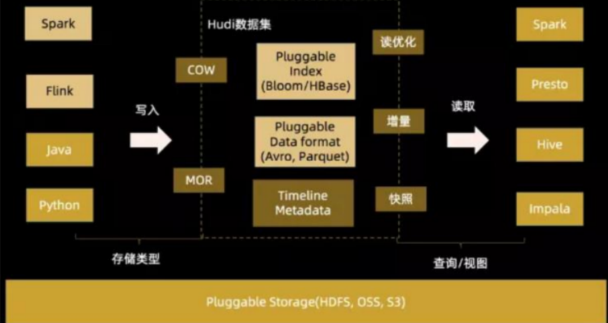

### Hudi的核心三个组件分别是

* Timeline时间轴
* 文件管理
* index索引

#### Timeline时间轴

~~~shell
Timeline由三部分组成：

Time（时间） 
	时间戳
Action（操作） 
	COMMIT、DELTA_COMMIT（提交）
	COMPACTION（压缩）
	CLEAN（清理）
State（状态）
	REQUESTED
	INFLIGHT
	COMPLETED
~~~

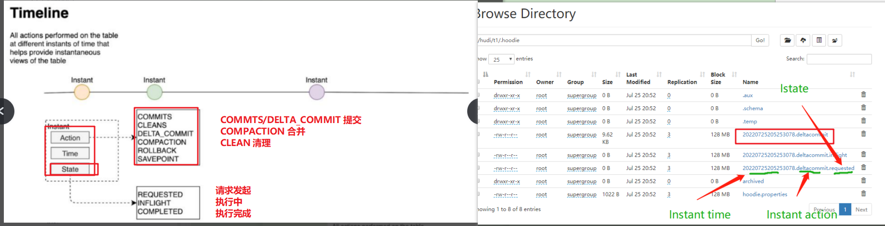

#### 文件管理

Hudi通过parquet+log文件来管理数据。

parquet文件，base file，基础文件。压缩后的文件。

log文件，日志文件，还没有压缩的文件。

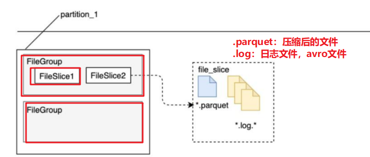

#### Index索引

Hudi支持Bloom Index，HBase Index，简单索引，自定义索引。

默认就是Bloom Index（布隆索引）。

## Hudi的三种计算模型

Hudi支持三种计算模型，分别是：

* Batch 批量计算
* Stream流式计算

* Incremental Query增量查询

### Batch批量计算特点

* 延迟较高
* 数据完整度较好
* 比较经济

### Stream流式计算特点

* 延迟低，时效性高
* 数据完整度较差
* 对资源占用较多，比较昂贵

### Incremental计算特点

本质上是以mini batch（微批）的形式来计算。相比批量而已，更加高效。相比流式而已，更加经济。

### 三种查询方式

Hudi基于三种计算模型的基础之上，支持三种查询数据的方式。

* Snapshot Query（快照查询）

~~~shell
Snapshot Query = Query（parquet + log）
~~~

* Incremental Query（增量查询）

~~~shell
Incremental Query  = Query（log）
~~~

* Read Optimized Query（读优化查询）

~~~shell
Read Optimized Query = Query（parquet）
~~~

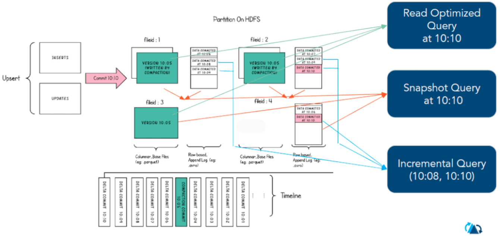

## Hudi支持的表类型

Hudi支持两种类型的表：

* Copy On Write（写时复制）

* Merge On Read（读时合并）

### Copy On Write

写时复制，数据在写入的时候，会把原数据copy一份，在此基础之上再写入。

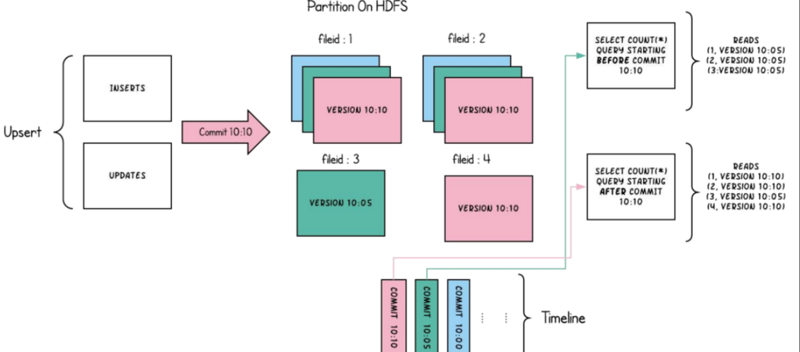

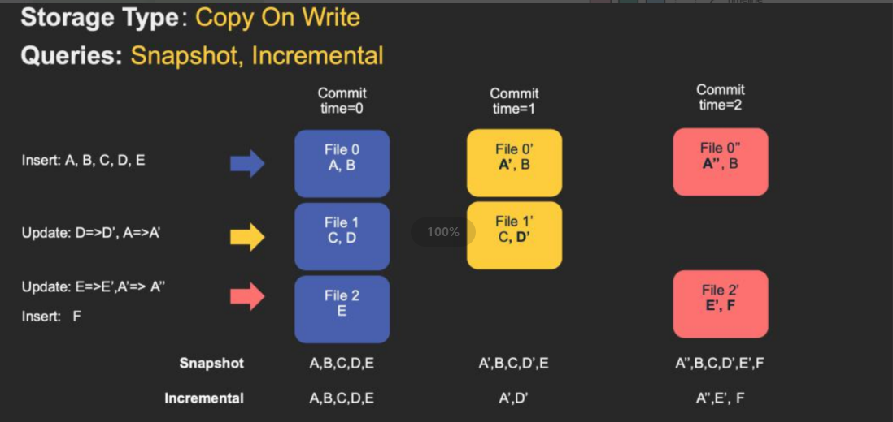

### Merge On Read

在读取（查询）的时候，会把之前的数据parquet+log合并，把最终结果返回。

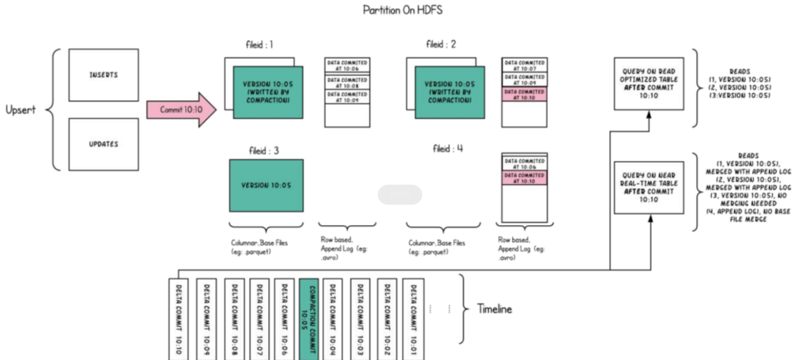

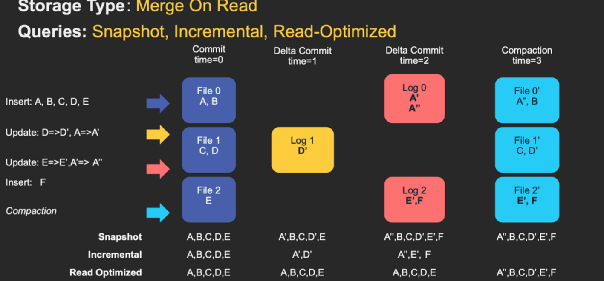

### COW VS MOR

COW：适合写少读多的场景。

MOR：适合读多写少的场景。

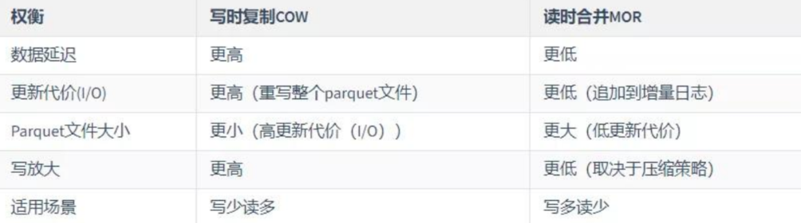

## MySQL-FlinkCDC-Hudi综合案例

### 数据流图

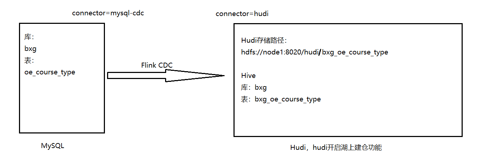

### 实现步骤

~~~shell
1.启动服务（HDFS、Hive、Flink）

2.准备MySQL的源库、表、数据（环境自带，不需要准备）

3.创建MySQL的源表的映射表

4.创建hudi目标表的映射表

5.使用FlinkSQL拉起数据任务
insert into sink_table select colA,colB,colC from source_table;

6.校验数据（比对Hive和MySQL的数据）
	1.HDFS验证
	2.Hive验证
~~~

### 实现

~~~sql
--1.启动服务(HDFS、Hive、Flink)
start-dfs.sh
nohup hive --service metastore > /tmp/hive-metastore.log &
nohup hive --service hiveserver2 > /tmp/hive-hiveserver2.log &
start-cluster.sh

--2.准备MySQL库、表、数据
不需要操作，MySQL库已存在

--3.创建MySQL源表的映射表
CREATE TABLE if not exists mysql_bxg_oe_course_type (
      `id` INT,
      `type_code` STRING,
      `desc` STRING,
      `creator` STRING,
      `operator` STRING,
      `create_time` TIMESTAMP(3),
      `update_time` TIMESTAMP(3),
      `delete_flag` BOOLEAN,
      PRIMARY KEY (`id`) NOT ENFORCED
    ) WITH (
      'connector'= 'mysql-cdc',  -- 指定connector，这里填 mysql-cdc
      'hostname'= '192.168.88.161', -- MySql server 的主机名或者 IP 地址
      'port'= '3306',  -- MySQL 服务的端口号
      'username'= 'root',   --  连接 MySQL 数据库的用户名
      'password'='123456',  -- 连接 MySQL 数据库的密码
      'server-time-zone'= 'Asia/Shanghai',  -- 时区
      'debezium.snapshot.mode'='initial',  -- 启动模式，默认为initial
      'database-name'= 'bxg',  -- 需要监控的数据库名
      'table-name'= 'oe_course_type' -- 需要监控的表名
);

--4.创建Hudi目标表的映射表
CREATE TABLE if not exists hudi_bxg_oe_course_type (
         `id` INT,
         `type_code` STRING,
         `desc` STRING,
         `creator` STRING,
         `operator` STRING,
         `create_time` TIMESTAMP(3),
         `update_time` TIMESTAMP(3),
         `delete_flag` BOOLEAN,
     `partition` STRING,
     PRIMARY KEY (`id`) NOT ENFORCED
    ) PARTITIONED BY (`partition`)
    with(
       'connector'='hudi',
      'path'= 'hdfs://192.168.88.161:8020/hudi/bxg_oe_course_type',  -- 数据存储目录
      'hoodie.datasource.write.recordkey.field'= 'id', -- 主键
      'write.precombine.field'= 'update_time',  -- 自动precombine的字段
      'write.tasks'= '1',
      'compaction.tasks'= '1',
      'write.rate.limit'= '2000', -- 限速
      'table.type'= 'MERGE_ON_READ', -- 默认COPY_ON_WRITE,可选MERGE_ON_READ
      'compaction.async.enabled'= 'true', -- 是否开启异步压缩
      'compaction.trigger.strategy'= 'num_commits', -- 按次数压缩
      'compaction.delta_commits'= '1', -- 默认为5
      'changelog.enabled'= 'true', -- 开启changelog变更
      'read.tasks' = '1',
      'read.streaming.enabled'= 'true', -- 开启流读
      'read.streaming.check-interval'= '3', -- 检查间隔，默认60s
      'hive_sync.enable'= 'true', -- 开启自动同步hive
      'hive_sync.mode'= 'hms', -- 自动同步hive模式，默认jdbc模式
      'hive_sync.metastore.uris'= 'thrift://192.168.88.161:9083', -- hive metastore地址
      'hive_sync.table'= 'bxg_oe_course_type', -- hive 新建表名
      'hive_sync.db'= 'bxg', -- hive 新建数据库名
      'hive_sync.username'= '', -- HMS 用户名
      'hive_sync.password'= '', -- HMS 密码
      'hive_sync.support_timestamp'= 'true'-- 兼容hive timestamp类型
    );

--5.使用FlinkSQL拉起数据任务
INSERT INTO hudi_bxg_oe_course_type SELECT  `id`,`type_code` ,`desc`,`creator` ,`operator`,`create_time` ,`update_time` ,`delete_flag`,DATE_FORMAT(`create_time`, 'yyyyMMdd') FROM mysql_bxg_oe_course_type;

--6.验证数据
（1）校验Hudi目录文件是否有数据
（2）校验Hive的数据量和MySQL是否一致
~~~

MySQL的数据量：

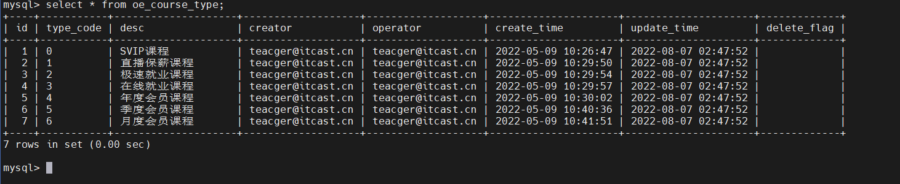

Hudi目录文件：

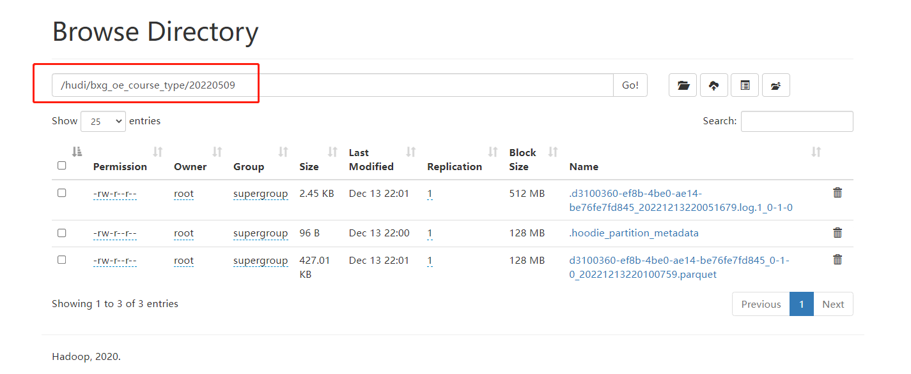

Hive中的数据：

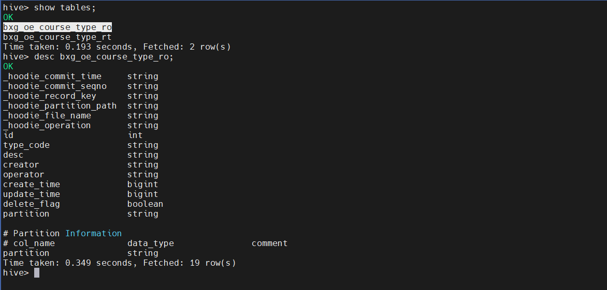

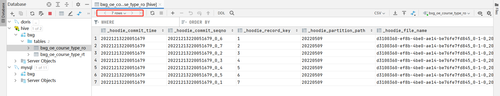

到此，数据验证完成。

> Tips：Hive中两种类型的表说明
>
> ro：read optimized，读优化的表
>
> rt：real time，实时的表。

