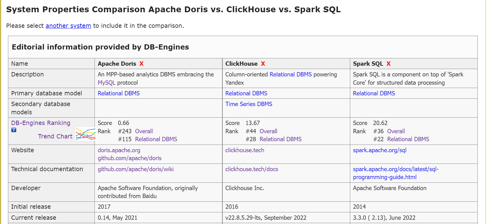
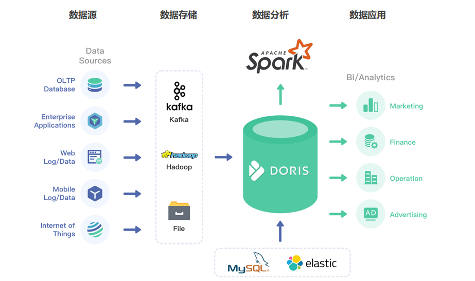
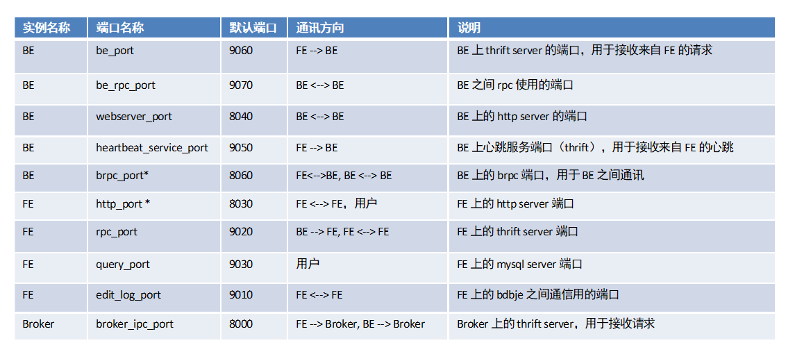
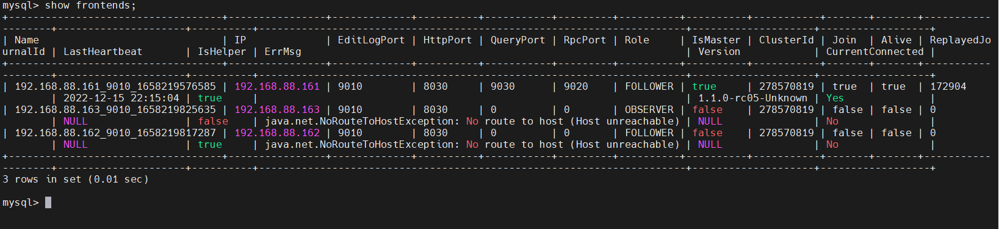
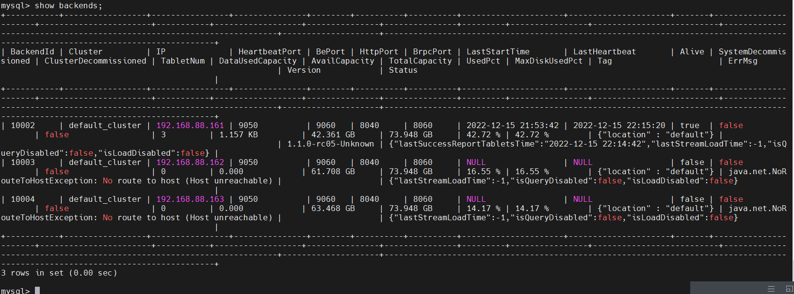

# Doris

## 今晚课程内容

* 为什么要学Doris
* Doris简介
  * 技术选型
* Doris安装、部署

## 为什么要学Doris

离线：Hadoop （MapReduce） -> Hive（SQL）

实时：编码 -> SQL（Clickhouse、Druid、Kylin、Doris）

Doris是一款可以支持实时分析的OLAP数据库引擎。

## Doris简介

### 概述

Apache Doris是一个现代化的基于MPP（Massively Parallel Processing 大规模并行处理）技术的分析型数据库产品。

### 数据库分类

数据库产品可以分为三类，分别是：

* OLTP（连机事务处理，传统关系型数据库）

* OLAP（联机分析处理，大数据分析数据库）
* HTAP（综合了OLTP和OLAP的优点，比如TiDB数据库）

### OLAP分类

MOLAP：多维，以空间换时间。对数据进行预聚合计算，比如Kylin。

ROLAP：关系，Clickhouse、Doris都是这种类型。

### OLAP引擎对比

### 数据库技术选型扩展

https://db-engines.com/

### Doris VS Clickhouse

Clickhouse单表性能强悍

Clickhouse运维繁琐，门槛较高

Doris单表性能不如Clickhouse，但是多表Join操作优于Clickhouse

Doris运维简单，支持标准SQL，完全兼容MySQL协议

### 应用场景

## Doris安装、部署

### Doris 的模块

Doris有两个模块，前端节点（Frontend）和后端节点（Backend），这两个模块是必选的。还有一个Broker模块，这个是可选的。

Frontend：和用户打交道，接收用户的请求，提交给后端。管理集群元数据，解析用户的请求，生成执行计划

Backend：执行任务，把结果返回给前端阶段

### Doris端口号

重要的端口号有两个：

8030：HTTP端口。和web打交道。

9030：MySQL Server的端口。

### Doris启停

~~~shell
#0进入DORIS_HOME目录下
cd $DORIS_HOME

#1.启动 FE(frontend)
fe/bin/start_fe.sh --daemon

#2.启动BE(backend)
be/bin/start_be.sh --daemon

#3.停止fe
fe/bin/stop_fe_sh 

#4.停止be
be/bin/stop_be.sh

#5.登录doris服务端
mysql -uroot -p123456 -hnode1 -P9030

#6.校验fe
show frontends;

#7.校验be
show backends;
~~~

