# Doris

## 今晚课程内容

* 为什么要学Doris
* Doris简介
  * 技术选型
* Doris安装、部署

## 为什么要学Doris

离线：Hadoop （MapReduce） -> Hive（SQL）

实时：编码 -> SQL（Clickhouse、Druid、Kylin、Doris）

Doris是一款可以支持实时分析的OLAP数据库引擎。

## Doris简介

### 概述

Apache Doris是一个现代化的基于MPP（Massively Parallel Processing 大规模并行处理）技术的分析型数据库产品。

### 数据库分类

数据库产品可以分为三类，分别是：

* OLTP（连机事务处理，传统关系型数据库）

* OLAP（联机分析处理，大数据分析数据库）
* HTAP（综合了OLTP和OLAP的优点，比如TiDB数据库）

### OLAP分类

MOLAP：多维，以空间换时间。对数据进行预聚合计算，比如Kylin。

ROLAP：关系，Clickhouse、Doris都是这种类型。

### OLAP引擎对比

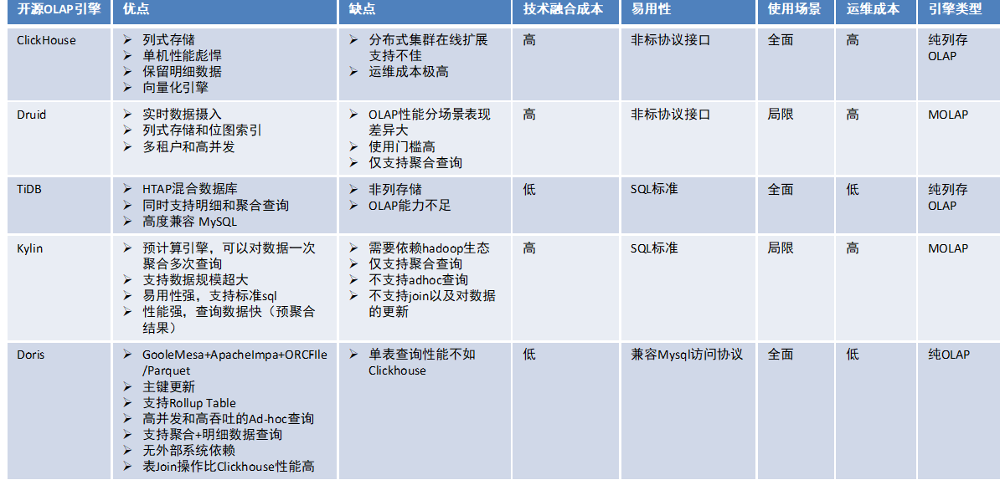

### 数据库技术选型扩展

https://db-engines.com/

### Doris VS Clickhouse

Clickhouse单表性能强悍

Clickhouse运维繁琐，门槛较高

Doris单表性能不如Clickhouse，但是多表Join操作优于Clickhouse

Doris运维简单，支持标准SQL，完全兼容MySQL协议

### 应用场景

## Doris安装、部署

### Doris 的模块

Doris有两个模块，前端节点（Frontend）和后端节点（Backend），这两个模块是必选的。还有一个Broker模块，这个是可选的。

Frontend：和用户打交道，接收用户的请求，提交给后端。管理集群元数据，解析用户的请求，生成执行计划

Backend：执行任务，把结果返回给前端阶段

### Doris端口号

重要的端口号有两个：

> 8030：HTTP端口。和web打交道，前端webUI访问的端口号。
>
> 9030：MySQL Server的端口，使用MySQL客户端登录的端口号。

### Doris启停

~~~shell
#0进入DORIS_HOME目录下
cd $DORIS_HOME

#1.启动 FE(frontend)
fe/bin/start_fe.sh --daemon

#2.启动BE(backend)
be/bin/start_be.sh --daemon

#3.停止fe
fe/bin/stop_fe_sh 

#4.停止be
be/bin/stop_be.sh

#5.登录doris服务端
mysql -uroot -p123456 -hnode1 -P9030

#6.校验fe
show frontends;

#7.校验be
show backends;
~~~

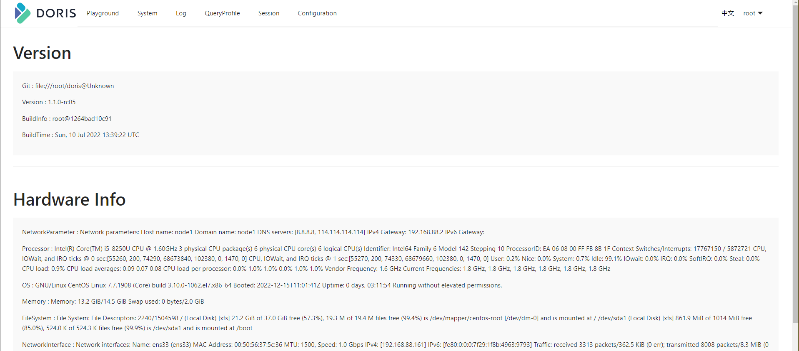

### 扩容缩容

#### FE扩容、缩容

~~~shell
#1.扩容
alter system add frontend ip:port

#2.缩容
alter system drop/demission frontend ip:port
~~~

#### BE扩容、缩容

~~~shell
#1.扩容
alter system add backend ip:port

#2.缩容
alter system drop backend ip:port
~~~

#### Broker扩容、缩容

~~~shell
#1.扩容
alter system add broker ip:port

#2.缩容
alter system drop broker ip:port
~~~

## Doris核心概念

### 概念

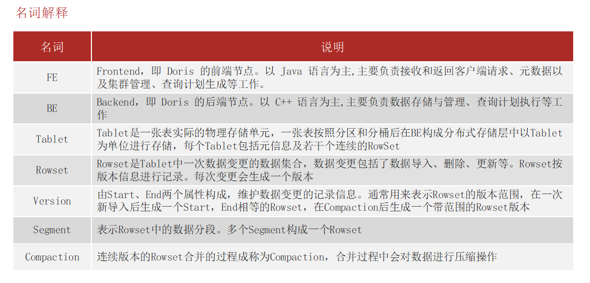

> FE：frontend，前端节点
>
> BE：backend，后端节点
>
> Doris表层级关系：
>
> table（表） -> partition（分区） -> distributed（分桶） -> tablet（分片） -> rowset（行集） -> segment（段）

### Doris架构

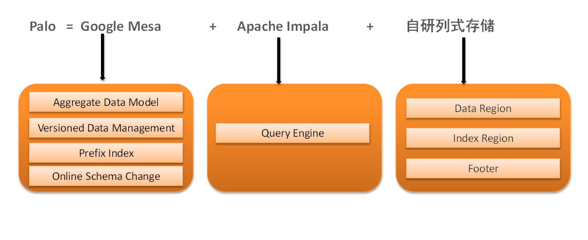

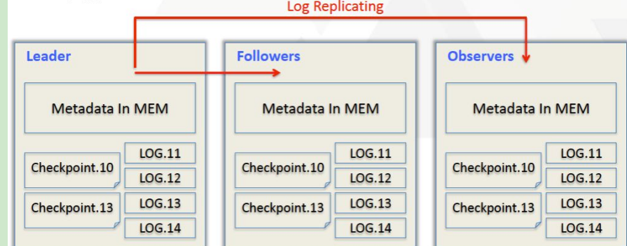

> Doris采用 “Paxos协议以及Memory+ Checkpoint + Journal” 的机制来确保元数据的高性能及高可靠。元数据的每次更新，都会遵照以下几步：
>
> 首先写入到磁盘的日志文件中
>
> 然后再写到内存中
>
> 最后定期checkpoint到本地磁盘上
>
> 相当于是一个纯内存的一个结构，也就是说所有的元数据都会缓存在内存之中，从而保证FE在宕机后能够快速恢复元数据，而且不丢失元数据。

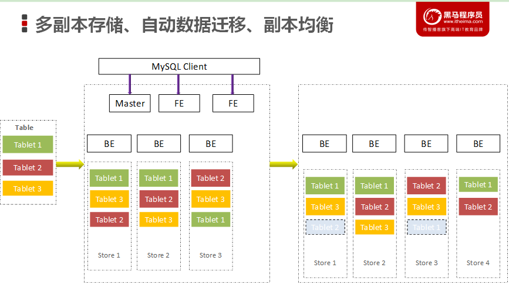

## Doris实践

### 建库、建表

#### 语法说明

~~~sql
--建库
create database test_db;

use test_db;

--建表
CREATE TABLE test_table
(
    event_day DATE,
    siteid INT DEFAULT '10',
    citycode SMALLINT,
    username VARCHAR(32) DEFAULT '',
    pv BIGINT SUM DEFAULT '0'
)
AGGREGATE KEY(event_day, siteid, citycode, username)
PARTITION BY RANGE(event_day)
(
    PARTITION p201706 VALUES LESS THAN ('2017-07-01'),
    PARTITION p201707 VALUES LESS THAN ('2017-08-01'),
    PARTITION p201708 VALUES LESS THAN ('2017-09-01')
)
DISTRIBUTED BY HASH(siteid) BUCKETS 10
PROPERTIES("replication_num" = "1");
~~~

建表语法解释如下：

~~~shell
#1.Doris的表有行、列的说法。列分为key列和value列。key在前，value列在后。
key列：维度列
value列：指标列
key列必须在value之前。
如果key列相同，则value列会按照指定的聚合函数进行聚合操作。
Doris的Aggregate Model中聚合函数有四个，分别是：
	（1）sum：求和
	（2）replace：替换
	（3）max：求最大值
	（4）min：求最小值

#2.Doris的数据模型有三种，分别是：
Aggregate Model，聚合模型，会对指定的value列进行预聚合操作
Uniq Model，唯一模型，能够保证key列的唯一性
	Uniq、Unique这两种写法都可以。
Duplicate Model，冗余模型，允许数据冗余存储，存储原始数据，不会对数据进行任何的操作
数据模型在建表的时候可以省略。默认的数据模型就是Duplicate Model。

#3.Doris支持手动分区、动态分区。
手动分区只支持Range（范围分区），List（列表分区）。
动态分区在后面讲，动态分区的分桶数上线为500.
partition by range|list (字段) (
	partition 分区名称 values less than (字段的某个值),
	partition 分区名称 values less than (字段的某个值),
	partition 分区名称 values less than (字段的某个值)
)
分区可以省略，Doris会默认给一个分区，这个分区的名字就是表名。

#4.Doris支持分桶操作，目前只支持Hash分桶。
distributed by hash(字段) buckets N
分桶不能省略，必须在建表的时候指定。否则建表不通过。

#5.Doris支持自定义属性，比如存储介质、冷却时间、副本数等。
properties("key" = "value")
SSD  |  HDD

#6.Doris支持自定义engine操作
Doris支持多种引擎，默认是olap，除此之外，还有mysql、broker、hive、iceberg
~~~

#### 演示

~~~sql
CREATE TABLE test_table
(
    event_day DATE,
    siteid INT DEFAULT '10',
    citycode SMALLINT,
    username VARCHAR(32) DEFAULT '',
    pv BIGINT SUM DEFAULT '0'
)
AGGREGATE KEY(event_day, siteid, citycode, username)
PARTITION BY RANGE(event_day)
(
    PARTITION p201706 VALUES LESS THAN ('2017-07-01'),
    PARTITION p201707 VALUES LESS THAN ('2017-08-01'),
    PARTITION p201708 VALUES LESS THAN ('2017-09-01')
)
DISTRIBUTED BY HASH(siteid) BUCKETS 10
PROPERTIES("replication_num" = "1");
~~~

### 数据模型

Doris支持三种数据模型，分别是：

* Aggregate Model（聚合模型）

* Uniq Model（唯一模型）
* Duplicate Model（冗余模型）

#### Aggregate Model（聚合模型）

模型模型，相同的key列才会产生聚合操作，如果key不相同，则不会产生聚合操作。

* 创建表

~~~sql
CREATE TABLE IF NOT EXISTS test_db.example_site_visit
(
    `user_id` LARGEINT NOT NULL COMMENT "用户id",
    `date` DATE NOT NULL COMMENT "数据灌入日期时间",
    `city` VARCHAR(20) COMMENT "用户所在城市",
    `age` SMALLINT COMMENT "用户年龄",
    `sex` TINYINT COMMENT "用户性别",
    `last_visit_date` DATETIME REPLACE DEFAULT "1970-01-01 00:00:00" COMMENT "用户最后一次访问时间",
    `cost` BIGINT SUM DEFAULT "0" COMMENT "用户总消费",
    `max_dwell_time` INT MAX DEFAULT "0" COMMENT "用户最大停留时间",
    `min_dwell_time` INT MIN DEFAULT "99999" COMMENT "用户最小停留时间"
)
AGGREGATE KEY(`user_id`, `date`, `city`, `age`, `sex`)
DISTRIBUTED BY HASH(`user_id`) BUCKETS 10
PROPERTIES("replication_num" = "1");
~~~

* 插入数据

~~~shell
insert into test_db.example_site_visit values(10000,'2017-10-01','北京',20,0,'2017-10-01 06:00:00',20,10,2);
insert into test_db.example_site_visit values(10000,'2017-10-01','北京',20,0,'2017-10-01 07:00:00',15,8,5);
insert into test_db.example_site_visit values(10001,'2017-10-01','北京',30,1,'2017-10-01 17:05:45',2,22,22);
insert into test_db.example_site_visit values(10002,'2017-10-02','上海',20,1,'2017-10-02 12:59:12',200,5,5);
insert into test_db.example_site_visit values(10003,'2017-10-02','广州',32,0,'2017-10-02 11:20:00',30,11,11);
insert into test_db.example_site_visit values(10004,'2017-10-01','深圳',35,0,'2017-10-01 10:00:15',100,3,3);
insert into test_db.example_site_visit values(10004,'2017-10-03','深圳',35,0,'2017-10-03 10:20:22',11,6,6);
~~~

* 结果

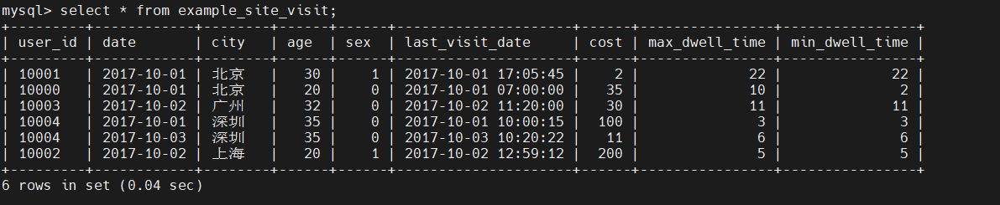

可以看到，相同的key，value被聚合了。这就是聚合模型。

#### Uniq model（唯一模型）

保证key列的唯一性。换言之，只要key列相同，value列就会进行聚合操作。这里的聚合就是`replace（替换）`操作。

Uniq Model（唯一模型）是一种特殊的Aggregate Model（聚合模型）。

* 创建表

~~~sql
CREATE TABLE IF NOT EXISTS test_db.user
(
    `user_id` LARGEINT NOT NULL COMMENT "用户id",
    `username` VARCHAR(50) NOT NULL COMMENT "用户昵称",
    `city` VARCHAR(20) COMMENT "用户所在城市",
    `age` SMALLINT COMMENT "用户年龄",
    `sex` TINYINT COMMENT "用户性别",
    `phone` LARGEINT COMMENT "用户电话",
    `address` VARCHAR(500) COMMENT "用户地址",
    `register_time` DATETIME COMMENT "用户注册时间"
)
UNIQUE KEY(`user_id`, `username`)
DISTRIBUTED BY HASH(`user_id`) BUCKETS 10
PROPERTIES("replication_num" = "1");
~~~

* 数据插入

~~~sql
insert into test_db.user values(10000,'zhangsan','北京',20,0,13112345312,'北京西城区','2020-10-01 07:00:00');
insert into test_db.user values(10000,'zhangsan','深圳',20,0,13112345312,'深圳市宝安区','2020-11-15 06:10:20');
~~~

* 结果

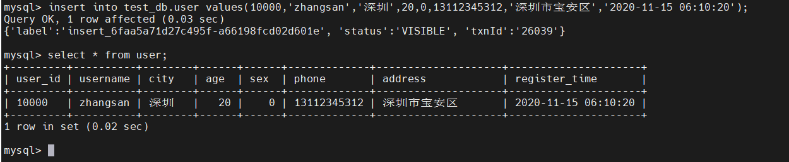

#### Duplicate Model（冗余模型）

允许数据冗余存储，不会对数据进行任何操作，可以保证数据的原始样子。

* 创建表

~~~sql
CREATE TABLE IF NOT EXISTS test_db.example_log
(
    `timestamp` DATETIME NOT NULL COMMENT "日志时间",
    `type` INT NOT NULL COMMENT "日志类型",
    `error_code` INT COMMENT "错误码",
    `error_msg` VARCHAR(1024) COMMENT "错误详细信息",
    `op_id` BIGINT COMMENT "负责人id",
    `op_time` DATETIME COMMENT "处理时间"
)
DUPLICATE KEY(`timestamp`, `type`)
DISTRIBUTED BY HASH(`timestamp`) BUCKETS 10
PROPERTIES("replication_num" = "1");
~~~

* 插入数据

~~~sql
insert into test_db.example_log values('2020-10-01 08:00:05',1,404,'not found page', 101, '2020-10-01 08:00:05');
insert into test_db.example_log values('2020-10-01 08:00:05',1,404,'not found page', 101, '2020-10-01 08:00:05');
insert into test_db.example_log values('2020-10-01 08:00:05',2,404,'not found page', 101, '2020-10-01 08:00:06');
insert into test_db.example_log values('2020-10-01 08:00:06',2,404,'not found page', 101, '2020-10-01 08:00:07');
~~~

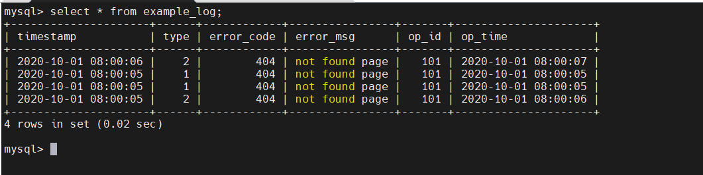

#### 三种数据模型的总结

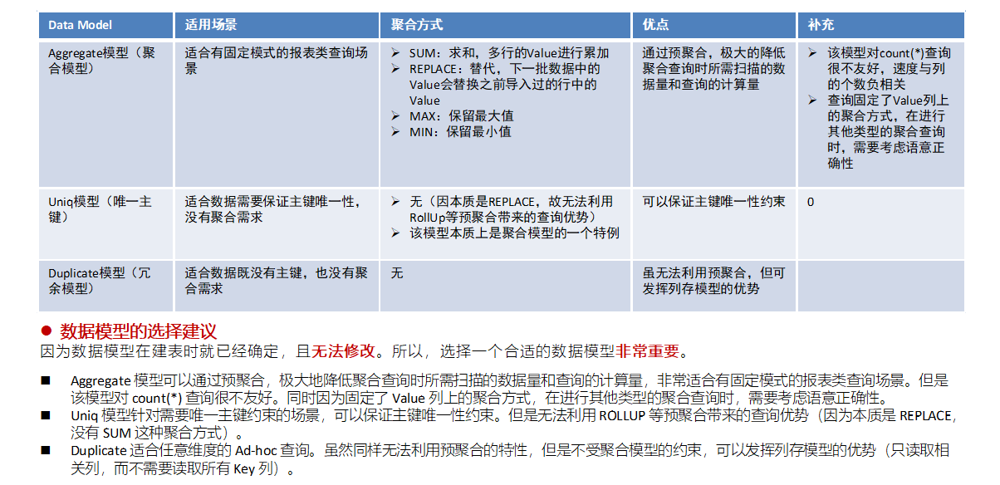

Aggregate Model：适合固定报表类型场景。

Uniq Model：适合需要保证数据唯一性的场景。

Duplicate Model：适合ad-hot查询（即席查询），非常灵活，不受模型约束。

### 数据导入

Doris支持多种数据导入方式，常见的有：

* Broker Load
* Stream Load
* Routine Load
* Insert Into

#### Broker Load

与分布式文件系统打交道，比如HDFS。

这里演示从HDFS导入数据到Doris中。

* 创建表

~~~sql
CREATE TABLE test_db.user_result(
id BIGINT,
name VARCHAR(50),
age INT,
gender INT,
province  VARCHAR(50),
city   VARCHAR(50),
region  VARCHAR(50),
phone VARCHAR(50),
birthday VARCHAR(50),
hobby  VARCHAR(50),
register_date VARCHAR(50)
)
DUPLICATE KEY(id)
DISTRIBUTED BY HASH(id) BUCKETS 10
PROPERTIES("replication_num" = "1");
~~~

* 准备数据

~~~shell
数据在之前分享的资料中：'资料\data\doris\user.csv'
hdfs dfs -mkdir -p /datas/doris 
hdfs dfs -put /export/data/doris/user.csv /datas/doris
~~~

* 创建导入任务

~~~sql
LOAD LABEL test_db.user_result
(
DATA INFILE("hdfs://node1:8020/datas/doris/user.csv")
INTO TABLE `user_result`
COLUMNS TERMINATED BY ","
FORMAT AS "csv"
(id, name, age, gender, province,city,region,phone,birthday,hobby,register_date)
)
WITH BROKER broker_name
(
"dfs.nameservices" = "my_cluster",
"dfs.ha.namenodes.my_cluster" = "nn1",
"dfs.namenode.rpc-address.my_cluster.nn1" = "node1:8020",
"dfs.client.failover.proxy.provider" = "org.apache.hadoop.hdfs.server.namenode.ha.ConfiguredFailoverProxyProvider"
)
PROPERTIES
(
    "max_filter_ratio"="0.00002"
);
~~~

* 查看导入的任务

~~~sql
show load order by CreateTime desc limit 1\G
~~~

* 结果

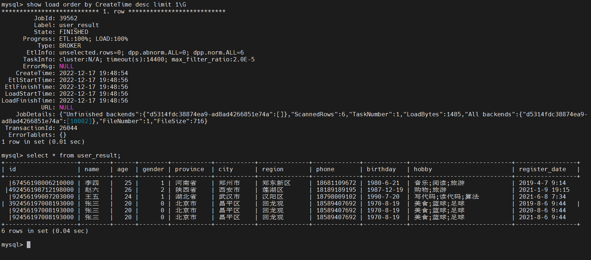

#### Stream Load

Stream Load用来和本地文件系统打交道。

目前 Stream Load 支持两个数据格式：CSV（文本） 和 JSON

* 准备数据

~~~shell
392456197008193000,张三,20,0,北京市,昌平区,回龙观,18589407692,1970-8-19,美食;篮球;足球,2021-8-6 9:44
267456198006210000,李四,25,1,河南省,郑州市,郑东新区,18681109672,1980-6-21,音乐;阅读;旅游,2019-4-7 9:14
892456199007203000,王五,24,1,湖北省,武汉市,汉阳区,18798009102,1990-7-20,写代码;读代码;算法,2021-6-8 7:34
492456198712198000,赵六,26,2,陕西省,西安市,莲湖区,18189189195,1987-12-19,购物;旅游,2021-1-9 19:15
392456197008193000,张三,20,0,北京市,昌平区,回龙观,18589407692,1970-8-19,美食;篮球;足球,2020-8-6 9:44
392456197008193000,张三,20,0,北京市,昌平区,回龙观,18589407692,1970-8-19,美食;篮球;足球,2019-8-6 9:44
~~~

把上述数据保存为`user.csv`文件，保存至`/export/data/doris`目录下。

* 清空表

~~~sql
truncate table user_result;
~~~

* 执行导入命令

~~~shell
curl --location-trusted -u root:123456 -H "column_separator:,"  -T /export/data/doris/user.csv -X PUT http://node1:8030/api/test_db/user_result/_stream_load
~~~

* 导入结果

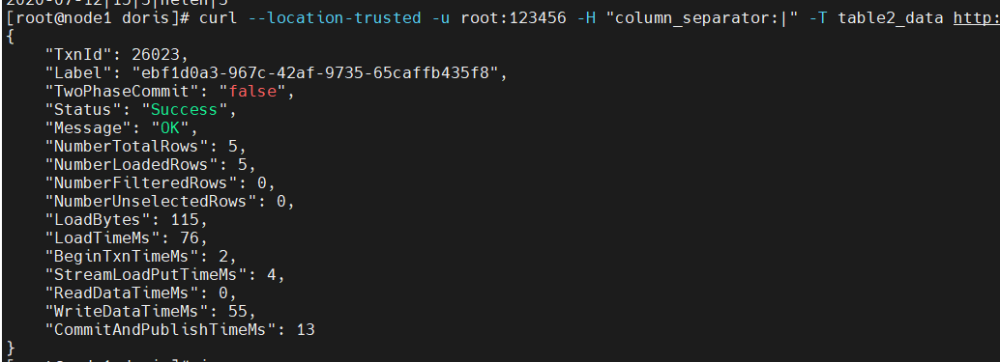

* 查询doris中表数据

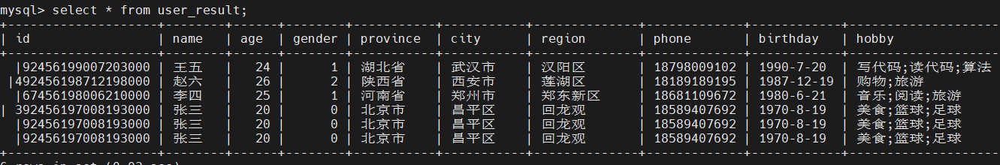

#### Routine load

Routine load主要用来和固定的数据源打交道，比如Kafka。目前Doris只支持kafka导入。

* 启动kafka

~~~shell
#1.启动zookeeper
zkServer.sh start

#2.启动kafka
cd $KAFKA_HOME
 nohup bin/kafka-server-start.sh config/server.properties > /tmp/kafka.log &
~~~

* 创建topic

~~~shell
bin/kafka-topics.sh --create \
--zookeeper node1:2181,node2:2181,node3:2181 \
--replication-factor 1 \
--partitions 1 \
--topic test
~~~

* 启动生产者，写入数据

~~~shell
#1.启动生产者命令如下
bin/kafka-console-producer.sh --broker-list node1:9092 --topic test

#2.写入数据如下，json数据
{"id":1,"name":"zhangsan","age":30}
{"id":2,"name":"lisi","age":18}
~~~

* 创建表

~~~sql
create table student_kafka
(
id int,
name varchar(50),
age int
)
DUPLICATE KEY(id)
DISTRIBUTED BY HASH(id) BUCKETS 10
PROPERTIES("replication_num" = "1");
~~~

* 创建Routine load任务

~~~shell
CREATE ROUTINE LOAD test_db.kafka_job1 on student_kafka
PROPERTIES
(
    "desired_concurrent_number"="1",
"strict_mode"="false",
    "format" = "json"
)
FROM KAFKA
(
    "kafka_broker_list"= "node1:9092",
    "kafka_topic" = "test",
    "property.group.id" = "test_group_1",
    "property.kafka_default_offsets" = "OFFSET_BEGINNING",
    "property.enable.auto.commit" = "false"
);
~~~

* 结果

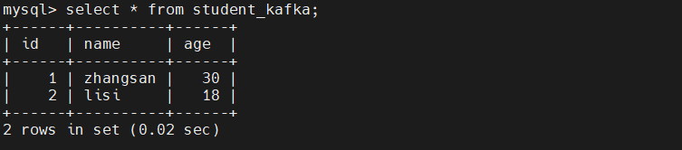

#### Insert into

常规的SQL insert操作。略。

~~~sql
insert into user_result values (...);
~~~

### 数据导出

Doris支持把表的数据导出到外部的存储系统，比如HDFS等。

* 创建导除任务

~~~shell
EXPORT TABLE test_db.example_site_visit 
TO "hdfs://node1:8020/datas/output" 
WITH BROKER "broker_name" (
"username"="root", 
"password"="123456"
);
~~~

* 查看任务状态

~~~shell
show export;
~~~

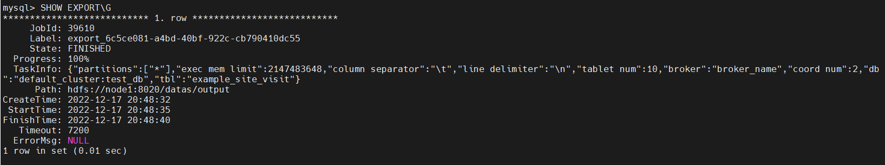

* 检验数据

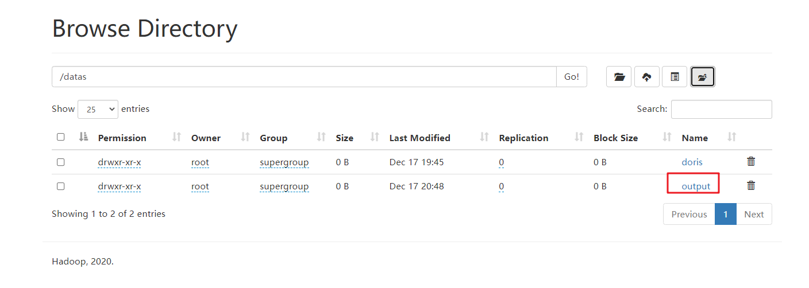

### 删除数据

Doris目前支持两种删除数据的方式：

* delete删除
* 分区删除

#### delete 删除

~~~sql
delete from student_kafka where id = 2;
~~~

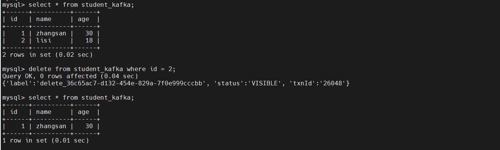

#### 分区删除

~~~shell
alter table table2 drop partition p202007;
~~~

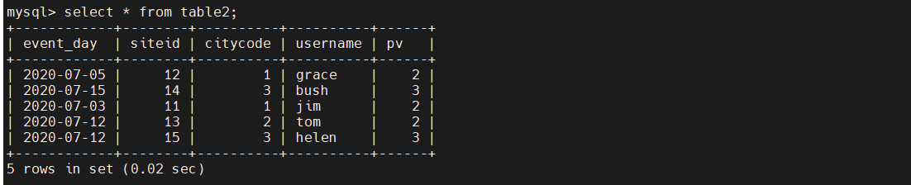

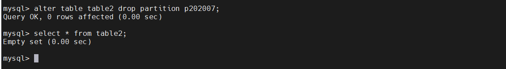

### Join

Doris的Inner join支持Broadcast Join、Shuffle Join、Bucket Shuffle Join、Colocate Join。

默认就是Broadcast Join。

* Broadcast Join

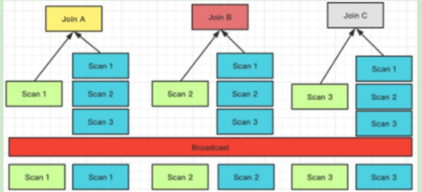

* Shuffle Join

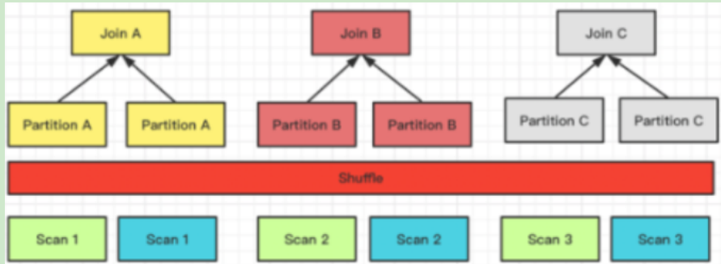

* Bucket Shuffle Join

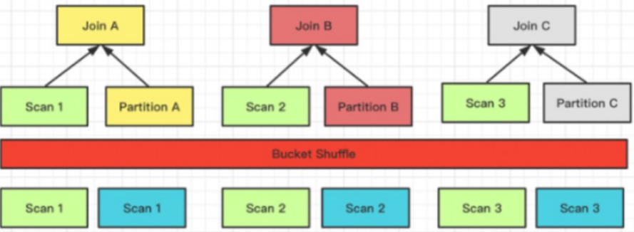

* Colocate Join

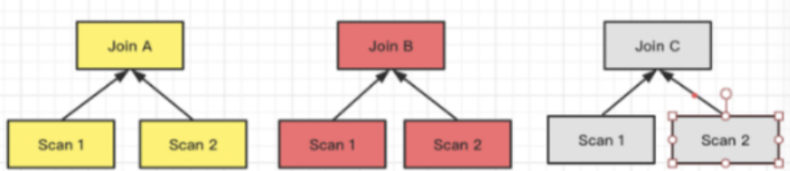

* 四种Join对比如下

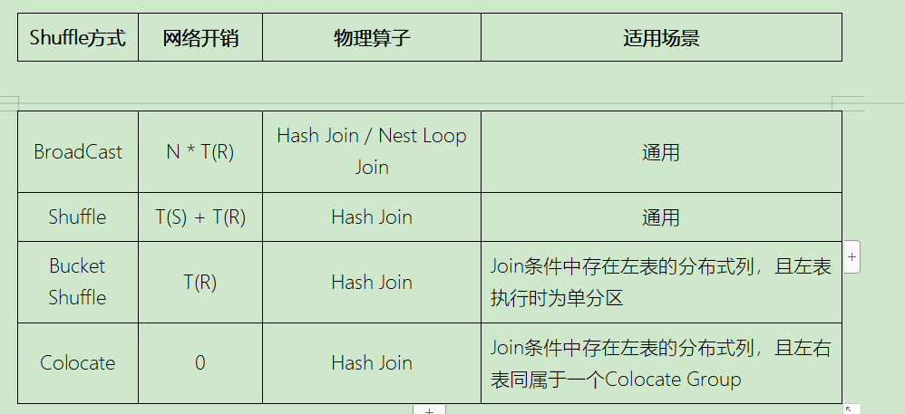

### Rollup

#### MySQL的索引&Oracle物化视图

~~~sql
--MySQL的表
create table t1(
	id int,
    name varchar(20),
    age int,
    sex int,
    address varchar(50)
);

--MySQL的表
create table t2(
	name varchar(20),
    id int,
    age int,
    sex int,
    address varchar(50)
);

insert into t1|t2

select id,name age,sex,address from t1 where id = 1001;

select id,name age,sex,address from t2 where id = 1001;

create view v_v1 sql 语句

create materialized view v_v2 sql 语句

Oracle 物化视图，MySQL没有物化视图。但是Hive在3.0之后也有了物化视图。

视图不能保存数据，但是物化视图，可以保存数据！！！！
~~~

#### Doris的Rollup

Rollup  =  索引 + 物化视图

索引如果是多个字段（id,sex,联合索引），Doris可以调整列的顺序，用来支持查询的时候最左匹配。

Rollup 还可以`调整列的顺序`，以支持索引的前缀匹配。（最左匹配原则）

> Tips：
>
> 1.官网没有这么说，但是可以这么去理解。
>
> 2.什么叫调整列的顺序？
>
> 就是说，Doris在建表的时候，列是默认就有顺序的，这个顺序就是Doris的索引的顺序，这就是一个默认的rollup。

因为建表时已经指定了列顺序，所以一个表只有一种前缀索引。**这对于使用其他不能命中前缀索引的列作为条件进行的查询来说，效率上可能无法满足需求**。因此，我们可以通过创建 ROLLUP 来人为的调整列顺序。

在三种数据模型下的Rollup的含义：

* Aggregate Model下，Rollup除了能够人为调整列的顺序之外，还有聚合的含义。

* Uniq Model下，Rollup除了能够人为调整列的顺序之外，还有聚合（replace）含义。
* Duplicate Model下，Rollup只能够人为调整列的顺序，没有聚合含义。

### 物化视图

Doris支持物化视图，物化视图也是一个Rollup，只是它是在Rollup之后才出来，所以它有一些除了Rollup之外的其他功能，比如说支持更多的聚合函数等。所以，物化视图也叫做Rollup的超集（父亲）。

#### Rollup VS 物化视图

* Rollup在聚合模型下，支持的聚合函数有限制。而且在非聚合模型下，不支持聚合操作，仅仅只是调整列的顺序而已。

物化视图是表级别的，不针对某一种数据模型。所以可以在冗余模型下仍然具有聚合含义。

* 物化视图支持的函数更丰富。

#### 局限性

* 物化视图的聚合函数的参数不支持表达式仅支持单列，比如： sum(a+b)不支持。

*  如果删除语句的条件列，在物化视图中不存在，则不能进行删除操作。如果一定要删除数据，则需要先将物化视图删除，然后方可删除数据。

*  单表上过多的物化视图会影响导入的效率：导入数据时，物化视图和 base 表数据是同步更新的，如果一张表的物化视图表超过10张，则有可能导致导入速度很慢。这就像单次导入需要同时导入10张表数据是一样的。

* 相同列，不同聚合函数，不能同时出现在一张物化视图中，比如：select sum(a), min(a) from table 不支持。

*  **物化视图针对** **Unique Key数据模型，只能改变列顺序，不能起到聚合的作用，所以在Unique Key模型上不能通过创建物化视图的方式对数据进行粗粒度聚合操作**

### 动态分区

Doris支持动态分区。动态分区有四种调度单位，分别是：

* HOUR（小时）
* DAY（天）
* WEEK（周）
* MONTH（月）

查看哪些表是动态分区的表

~~~shell
show dynamic partition tables;
~~~

查看某个表的分区情况

~~~sql
show partitions from table_name;
~~~

#### 演示DAY动态分区

* 创建表

~~~sql
CREATE TABLE order_dynamic_partition1
(
id int,
time date,
money double,
areaName varchar(50)
)
duplicate key(id,time)
PARTITION BY RANGE(time)()
DISTRIBUTED BY HASH(id) buckets 10
PROPERTIES(
	"dynamic_partition.enable" = "true",
"dynamic_partition.time_unit" = "DAY",
"dynamic_partition.start" = "-7",
      "dynamic_partition.end" = "3",
      "dynamic_partition.prefix" = "p",
      "dynamic_partition.buckets" = "10",
	"replication_num" = "1"
);
~~~

* 插入数据

~~~shell
insert into order_dynamic_partition1 values(1,'2022-10-12 11:00:00', 200.0, '北京');
insert into order_dynamic_partition1 values(1,'2022-12-20 11:00:00', 200.0, '北京');
insert into order_dynamic_partition1 values(1,'2022-12-21 11:00:00', 200.0, '北京');
~~~

* 结果

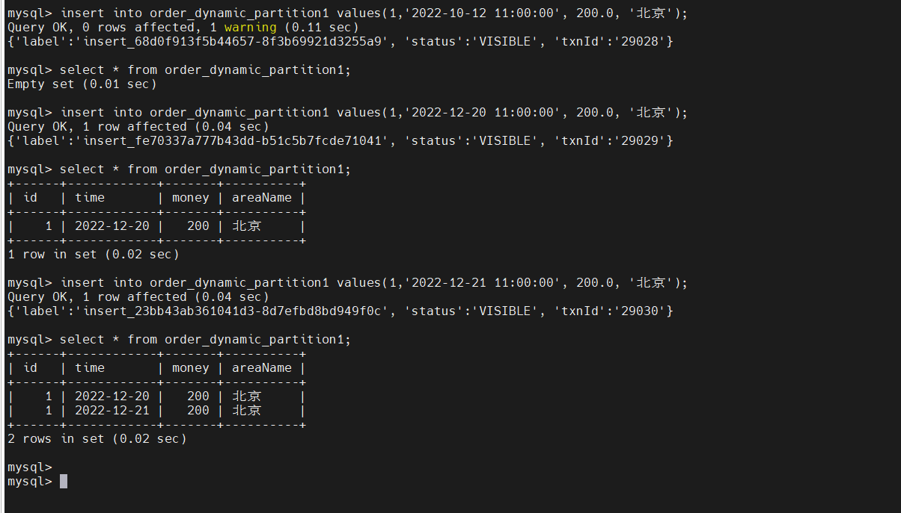

结论：分区必须存在，否则数据无法正常读取。

#### 演示WEEK动态分区

* 创建表

~~~sql
CREATE TABLE order_dynamic_partition2
(
id int,
time date,
money double,
areaName varchar(50)
)
duplicate key(id,time)
PARTITION BY RANGE(time)()
DISTRIBUTED BY HASH(id) buckets 10
PROPERTIES(
"dynamic_partition.enable" = "true",
    "dynamic_partition.time_unit" = "WEEK",
    "dynamic_partition.start" = "-2",
    "dynamic_partition.end" = "2",
    "dynamic_partition.prefix" = "p",
    "dynamic_partition.buckets" = "8",
"replication_num" = "1"
);
~~~

* 查看分区

~~~shell
show partitions from order_dynamic_partition2;
~~~

* 截图

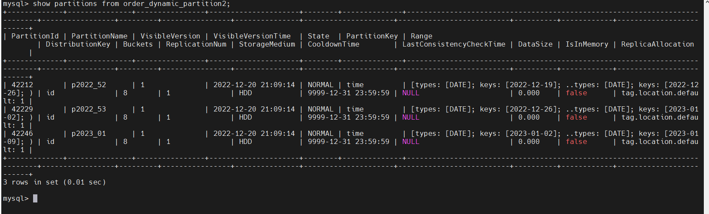

#### 演示MONTH动态分区

* 创建表

~~~sql
CREATE TABLE order_dynamic_partition4
(
id int,
time date,
money double,
areaName varchar(50)
)
duplicate key(id,time)
PARTITION BY RANGE(time)()
DISTRIBUTED BY HASH(id) buckets 10
PROPERTIES(
	"dynamic_partition.enable" = "true",
    "dynamic_partition.time_unit" = "MONTH",
    "dynamic_partition.end" = "2",
    "dynamic_partition.prefix" = "p",
    "dynamic_partition.buckets" = "8",
"dynamic_partition.start_day_of_month" = "3",
"replication_num" = "1"
);
~~~

> 注意：
>
> 月初默认是1，这里人为改为了3，只是演示功能，实际中应该换为1才符合常规逻辑。

* 查看分区

~~~shell
show partitions from order_dynamic_partition4;
~~~

* 截图

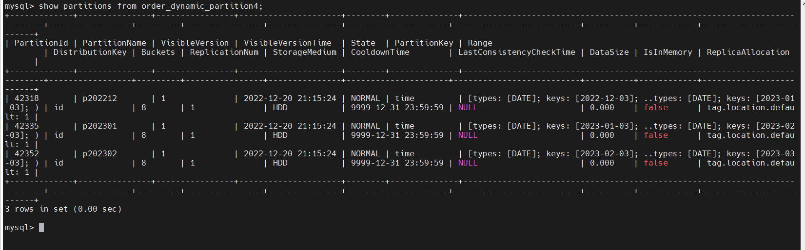

#### 动态分区与手动分区的转换

##### 手动分区转动态分区

* 创建表

~~~sql
CREATE TABLE table_partition
(
id int,
time date,
money double,
areaName varchar(50)
)
duplicate key(id,time)
PARTITION BY RANGE(time)
(
    PARTITION `p202001` VALUES LESS THAN ("2020-02-01"),
    PARTITION `p202002` VALUES LESS THAN ("2020-03-01"),
PARTITION `p202003` VALUES LESS THAN ("2020-04-01")
)
DISTRIBUTED BY HASH(id) buckets 10
PROPERTIES
(
   "dynamic_partition.enable" = "false",
"dynamic_partition.time_unit" = "DAY",
"dynamic_partition.prefix" = "p",
"dynamic_partition.end" = "3",
"dynamic_partition.buckets" = "10",
"replication_num" = "1"
);
~~~

* 更改设置

~~~shell
ALTER TABLE table_partition set (
"dynamic_partition.enable" = "true",
"dynamic_partition.start" = "-1", 
"dynamic_partition.end" = "3"
);
~~~

* 查看分区

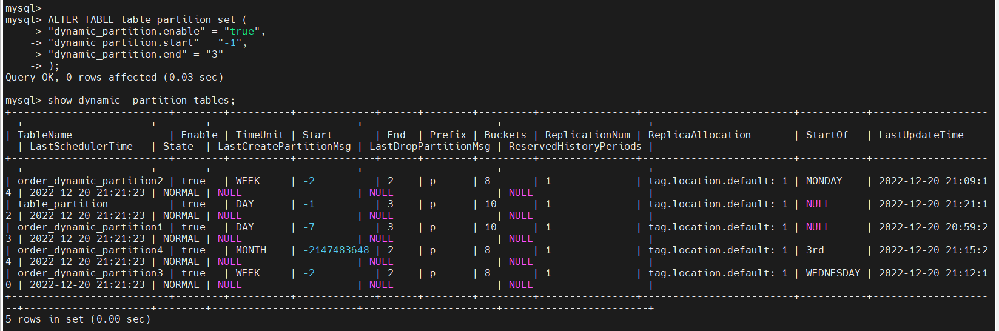

##### 动态分区转手动分区

* 设置参数即可

~~~shell
ALTER TABLE order_dynamic_partition1 set (
"dynamic_partition.enable" = "false");
~~~

### 函数

Doris内置了很多的函数，用来做数据分析。

可以通过如下命令查看。

~~~sql
show builtin functions in test_db;
~~~

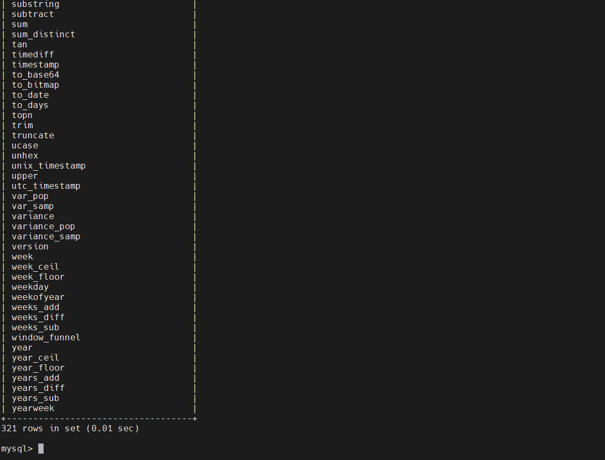

函数的使用方式，可以通过help命令来获取帮助。比如：

~~~shell
help yearweek;
~~~

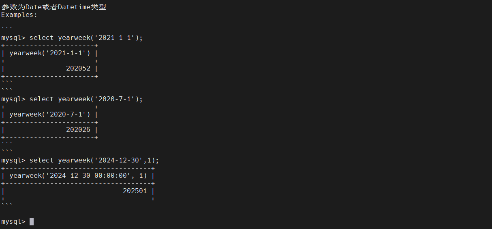

其他的函数也类似。

## FlinkSQL-Doris的案例演示

### 演示从FlinkSQL到Doris的案例

#### 数据流图

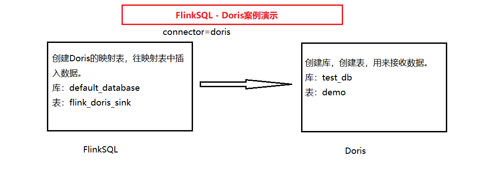

#### 操作步骤

~~~shell
（1）在Doris中创建库，表，用来接收数据
（2）在FlinkSQL中创建Doris的映射表
（3）在FlinkSQL中往Doris的映射表插入数据
（4）在Doris中校验数据是否同步过来
~~~

#### 实现

##### Doris中创建库、表

~~~sql
CREATE TABLE if not exists test_db.demo
(
    id    int,
    name STRING,
    age   INT,
    price DECIMAL(5, 2),
    sale  DOUBLE
) UNIQUE KEY(`id`)
DISTRIBUTED BY HASH(`id`) BUCKETS 1
PROPERTIES (
"replication_allocation" = "tag.location.default: 1"
);
~~~

##### 在FlinkSQL中创建Doris的映射表

~~~sql
CREATE TABLE flink_doris_sink
(
    id    int,
    name STRING,
    age   INT,
    price DECIMAL(5, 2),
    sale  DOUBLE,
    PRIMARY KEY (`id`) NOT ENFORCED
)
WITH (
    'connector' = 'doris'
    ,'fenodes' = 'node1:8030'
    ,'password' = '123456'
    ,'username' = 'root'
    ,'table.identifier' = 'test_db.demo'
    ,'sink.properties.format' = 'json'
    ,'sink.enable-delete' = 'true'
    ,'sink.properties.strip_outer_array' = 'true'
    ,'sink.batch.size' = '2000'
    ,'sink.batch.interval' = '10s'
    ,'sink.properties.format' = 'json'
);
~~~

##### 在FlinkSQL中进行数据插入

~~~sql
insert into flink_doris_sink values(1,'zhangsan',30,6.66,5);
insert into flink_doris_sink values(2,'lisi',18,18.88,66);
insert into flink_doris_sink values(3,'wangwu',25,188,1);
~~~

##### 在Doris中验证数据

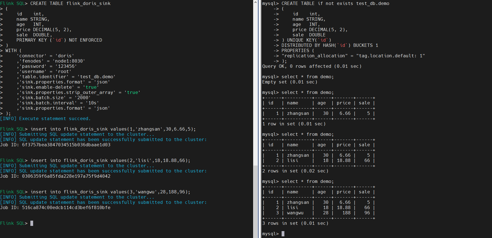

### 演示从MySQL到Doris的案例

#### 数据流图

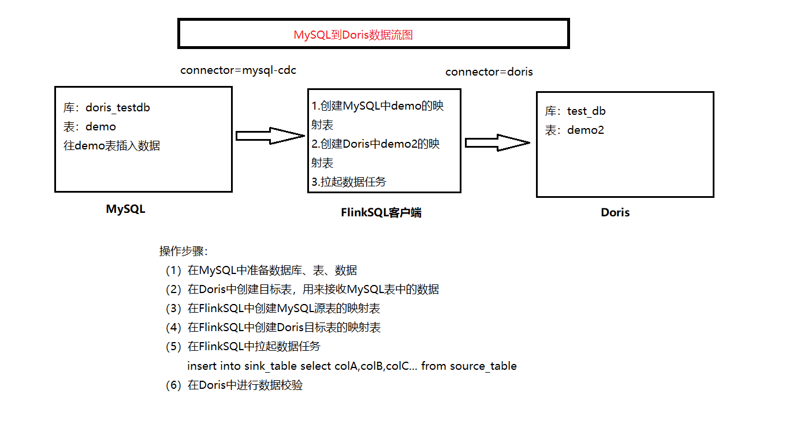

#### 操作步骤

~~~shell
（1）在MySQL中准备数据库、表、数据
（2）在Doris中创建目标表
（3）在FlinkSQL中创建源表的映射表
（4）在FlinkSQL中创建目标表的映射表
（5）在FlinkSQL中拉起数据任务
（6）校验数据
~~~

#### 实现

##### 在MySQL中准备库、表、数据

~~~sql
--创建库
create database doris_testdb;

--切换库
use doris_testdb;

--创建表
CREATE TABLE if not exists doris_testdb.demo
(
    id    int,
    name  varchar(255),
    age   INT,
    price DECIMAL(5, 2),
    sale  DOUBLE,
    PRIMARY KEY (`id`)
)
    ENGINE = InnoDB
    DEFAULT CHARACTER SET = utf8
    COLLATE = utf8_general_ci;

--插入数据
insert into demo values(1,'zhangsan',30,6.66,5);
insert into demo values(2,'lisi',18,18.88,66);
insert into demo values(3,'wangwu',25,188,1);
~~~

##### 在Doris中创建目标表

~~~sql
CREATE TABLE if not exists test_db.demo2
(
    id    int,
    name STRING,
    age   INT,
    price DECIMAL(5, 2),
    sale  DOUBLE
) UNIQUE KEY(`id`)
DISTRIBUTED BY HASH(`id`) BUCKETS 1
PROPERTIES (
"replication_allocation" = "tag.location.default: 1"
);
~~~

##### 在FlinkSQL中创建源表的映射表

~~~sql
CREATE TABLE flink_doris_source (
    id int,
    name STRING,
    age INT,
    price DECIMAL(5,2),
    sale DOUBLE,
    PRIMARY KEY ( `id` ) NOT ENFORCED
) WITH (
    'connector'= 'mysql-cdc',
    'hostname'= 'node1',
    'port'= '3306',
    'username'= 'root',
    'password'='123456',
    'server-time-zone'= 'Asia/Shanghai',
    'debezium.snapshot.mode'='initial',
    'database-name'= 'doris_testdb',
    'table-name'= 'demo'
);
~~~

##### 在FlinkSQL中创建目标表的映射表

~~~sql
CREATE TABLE flink_doris_sink2 (
    id int,
    name STRING,
    age INT,
    price DECIMAL(5,2),
    sale DOUBLE,
    PRIMARY KEY ( `id` ) NOT ENFORCED
) WITH (
    'fenodes' = 'node1:8030'
    ,'table.identifier' = 'test_db.demo2'
    ,'sink.enable-delete' = 'true'
    ,'sink.properties.strip_outer_array' = 'true'
    ,'sink.batch.size' = '2000'
    ,'password' = '123456'
    ,'connector' = 'doris'
    ,'sink.batch.interval' = '10s'
    ,'sink.max-retries' = '5'
    ,'sink.properties.format' = 'json'
    ,'username' = 'root'
);
~~~

##### 在FlinkSQL中拉起数据任务

~~~sql
INSERT INTO flink_doris_sink2 select id,name,age,price,sale from flink_doris_source;
~~~

##### 在Doris中校验数据

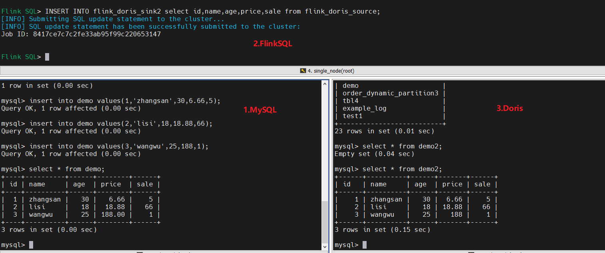

### Doris的通用配置项

https://doris.apache.org/docs/dev/ecosystem/flink-doris-connector#general

| **Key**                          | **Default Value**  | **Required** | **Comment**                                                  |
| -------------------------------- | ------------------ | ------------ | ------------------------------------------------------------ |
| fenodes                          | --                 | Y            | Doris FE http 地址                                           |
| table.identifier                 | --                 | Y            | Doris 表名，如：db.tbl                                       |
| username                         | --                 | Y            | 访问 Doris 的用户名                                          |
| password                         | --                 | Y            | 访问 Doris 的密码                                            |
| doris.request.retries            | 3                  | N            | 向 Doris 发送请求的重试次数                                  |
| doris.request.connect.timeout.ms | 30000              | N            | 向 Doris 发送请求的连接超时时间                              |
| doris.request.read.timeout.ms    | 30000              | N            | 向 Doris 发送请求的读取超时时间                              |
| doris.request.query.timeout.s    | 3600               | N            | 查询 Doris 的超时时间，默认值为1小时，-1表示无超时限制       |
| doris.request.tablet.size        | Integer. MAX_VALUE | N            | 一个 Partition 对应的 Doris Tablet 个数。 此数值设置越小，则会生成越多的 Partition。从而提升 Flink 侧的并行度，但同时会对 Doris 造成更大的压力。 |
| doris.batch.size                 | 1024               | N            | 一次从 BE 读取数据的最大行数。增大此数值可减少 Flink 与 Doris 之间建立连接的次数。 从而减轻网络延迟所带来的额外时间开销。 |
| doris.exec.mem.limit             | 2147483648         | N            | 单个查询的内存限制。默认为 2GB，单位为字节                   |
| doris.deserialize.arrow.async    | FALSE              | N            | 是否支持异步转换 Arrow 格式到 flink-doris-connector 迭代所需的 RowBatch |
| doris.deserialize.queue.size     | 64                 | N            | 异步转换 Arrow 格式的内部处理队列，当 doris.deserialize.arrow.async 为 true 时生效 |
| doris.read.field                 | --                 | N            | 读取 Doris 表的列名列表，多列之间使用逗号分隔                |
| doris.filter.query               | --                 | N            | 过滤读取数据的表达式，此表达式透传给 Doris。Doris 使用此表达式完成源端数据过滤。 |
| sink.label-prefix                | --                 | Y            | Stream load导入使用的label前缀。2pc场景下要求全局唯一 ，用来保证Flink的EOS语义。 |
| sink.properties.*                | --                 | N            | Stream Load 的导入参数。例如: 'sink.properties.column_separator' = ', ' 定义列分隔符，'sink.properties.escape_delimiters' = 'true' 特殊字符作为分隔符,'\x01'会被转换为二进制的0x01JSON格式导入'sink.properties.format' = 'json' 'sink.properties.read_json_by_line' = 'true' |
| sink.enable-delete               | TRUE               | N            | 是否启用删除。此选项需要 Doris 表开启批量删除功能(Doris0.15+版本默认开启)，只支持 Unique 模型。 |
| sink.enable-2pc                  | TRUE               | N            | 是否开启两阶段提交(2pc)，默认为true，保证Exactly-Once语义。关于两阶段提交可参考[这里](https://doris.apache.org/zh-CN/docs/data-operate/import/import-way/stream-load-manual.html)。 |
| sink.max-retries                 | 1                  | N            | 2pc场景下，commit阶段失败后的重试次数。                      |
| sink.buffer-size                 | 1048576(1MB)       | N            | 写数据缓存buffer大小，单位字节。不建议修改，默认配置即可。   |
| sink.buffer-count                | 3                  | N            | 写数据缓存buffer个数，不建议修改，默认配置即可。             |

### Doris&Flink列类型匹配关系表

| **Doris Type** | **Flink Type**       |
| -------------- | -------------------- |
| NULL_TYPE      | NULL                 |
| BOOLEAN        | BOOLEAN              |
| TINYINT        | TINYINT              |
| SMALLINT       | SMALLINT             |
| INT            | INT                  |
| BIGINT         | BIGINT               |
| FLOAT          | FLOAT                |
| DOUBLE         | DOUBLE               |
| DATE           | DATE                 |
| **DATETIME**   | **TIMESTAMP**        |
| DECIMAL        | DECIMAL              |
| CHAR           | STRING               |
| LARGEINT       | STRING               |
| VARCHAR        | STRING               |
| DECIMALV2      | DECIMAL              |
| **TIME**       | **DOUBLE**           |
| HLL            | Unsupported datatype |

Doris的增伤改操作，增加、删除三个模型都可以，更新操作只能在Uniq模型下使用。

