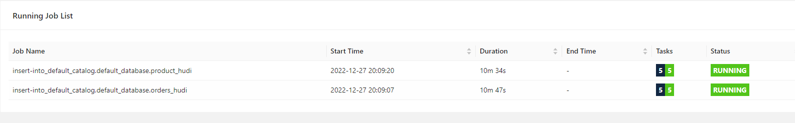
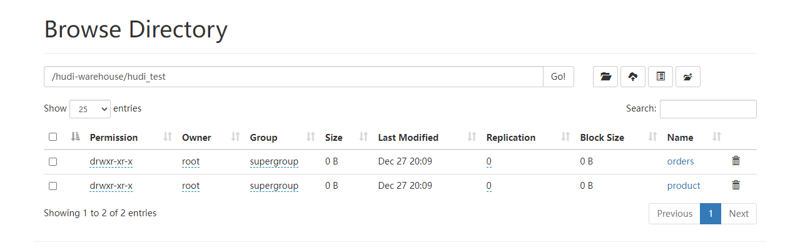
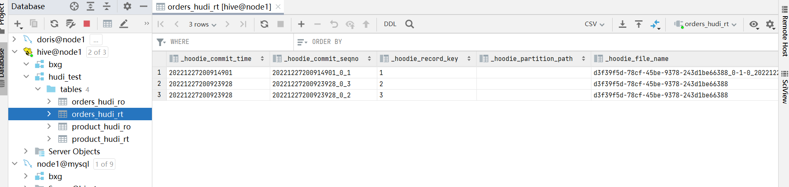
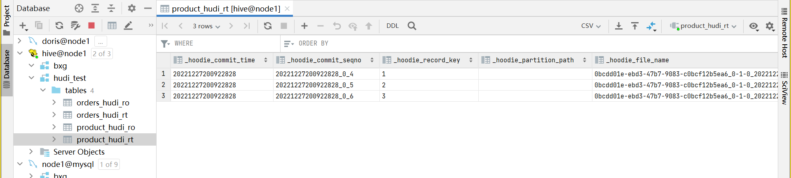
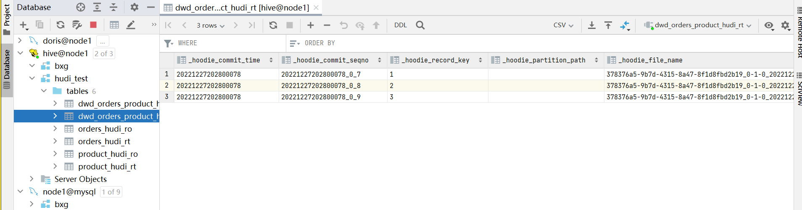
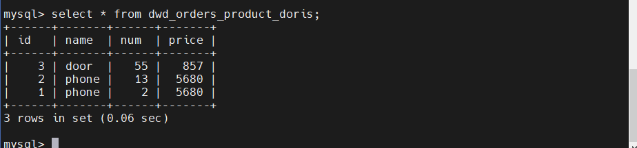
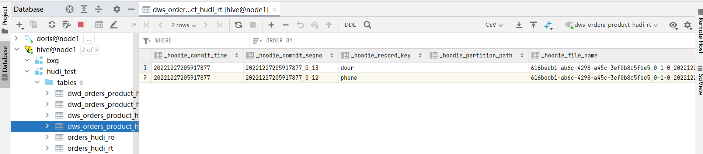

# Flink项目

## 数据流向Demo演示

### 架构


### 数据流向示意图


### 操作步骤

```shell
任务1.ODS层的实现
（1）在MySQL中准备库、表、数据
（2）在FlinkSQL中创建MySQL的映射表
（3）在FlinkSQL中创建hudi的映射表
（4）拉起数据任务
insert into sink_table select colA,colB,colC ... from source_table;
（5）去HDFS和Hive校验数据

任务2.Hudi的DWD层实现
（1）在FlinkSQL中创建dwd层的映射表
（2）在FlinkSQL中拉起数据任务
（3）去HDFS和Hive校验数据


任务3.Doris的DWD层实现
（1）在Doris中创建库、表，用来接收数据
（2）在FlinkSQL中创建Doris的映射表
（3）在FlinkSQL拉起数据任务
（4）去Doris校验数据


任务4.Hudi的DWS层实现
（1）在FlinkSQL中创建dws层的映射表
（2）在FlinkSQL中拉起数据任务
（3）在HDFS和Hive校验数据


任务5.Doris的DWS层的实现
（1）在Doris中创建表，用来接收数据
（2）在FlinkSQL中创建Doris的映射表
（3）在FlinkSQL拉起数据任务
（4）在Doris中校验数据

```

### 实现

#### 任务一

##### 准备好MySQL的库、表，数据

~~~sql
--创建库
create database if not exists hudi_test;

--切换库
use hudi_test;

--创建表
CREATE TABLE `orders` (
    `id` int(11) NOT NULL,
    `pid` int(11) NOT NULL,
    `num` int(11) DEFAULT NULL,
    PRIMARY KEY (`id`)
) ENGINE=InnoDB DEFAULT CHARSET=utf8;

--插入数据
INSERT INTO `orders` VALUES (1,1,2),(2,1,13),(3,2,55);

--创建表
CREATE TABLE `product` (
    `id` int(11) NOT NULL,
    `name` varchar(50) DEFAULT NULL,
    `price` decimal(10,4),
    PRIMARY KEY (`id`)
) ENGINE=InnoDB DEFAULT CHARSET=utf8;

--插入数据
INSERT INTO `product` VALUES (1,'phone',5680),(2,'door',857),(3,'screen',3333);
~~~

##### 在FlinkSQL准备MySQL的映射表

~~~sql
CREATE TABLE orders_mysql (
  id INT,
  pid INT,
  num INT,
  PRIMARY KEY(id) NOT ENFORCED
) WITH (
    'connector' = 'mysql-cdc',
    'hostname' = 'node1',
    'port' = '3306',
    'username' = 'root',
    'password' = '123456',
    'database-name' = 'hudi_test',
    'table-name' = 'orders'
);


CREATE TABLE product_mysql (
   id INT,
   name STRING,
   price decimal(10,4),
   PRIMARY KEY(id) NOT ENFORCED
) WITH (
    'connector' = 'mysql-cdc',
    'hostname' = 'node1',
    'port' = '3306',
    'username' = 'root',
    'password' = '123456',
    'database-name' = 'hudi_test',
    'table-name' = 'product'
);
~~~

##### 在FlinkSQL中准备Hudi的映射表

~~~sql
CREATE TABLE orders_hudi(
    id INT,
    pid INT,
    num INT,
    PRIMARY KEY(id) NOT ENFORCED
) WITH (
    'connector'='hudi'
    ,'path'= 'hdfs://node1:8020/hudi-warehouse/hudi_test/orders'
    ,'hoodie.datasource.write.recordkey.field'= 'id'
    ,'write.tasks'= '1'
    ,'compaction.tasks'= '1'
    ,'write.rate.limit'= '2000' 
    ,'table.type'= 'MERGE_ON_READ'
    ,'compaction.async.enabled'= 'true'
    ,'compaction.trigger.strategy'= 'num_commits'
    ,'compaction.delta_commits'= '1'
    ,'changelog.enabled'= 'true'
    ,'read.tasks' = '1'
    ,'read.streaming.enabled'= 'true' 
    ,'read.start-commit'='earliest' 
    ,'read.streaming.check-interval'= '3' 
    ,'hive_sync.enable'= 'true' 
    ,'hive_sync.mode'= 'hms' 
    ,'hive_sync.metastore.uris'= 'thrift://node1:9083' 
    ,'hive_sync.table'= 'orders_hudi' 
    ,'hive_sync.db'= 'hudi_test' 
    ,'hive_sync.username'= '' 
    ,'hive_sync.password'= '' 
    ,'hive_sync.support_timestamp'= 'true' 
);


CREATE TABLE product_hudi(
    id INT,
    name STRING,
    price decimal(10,4),
    PRIMARY KEY(id) NOT ENFORCED
) WITH (
    'connector'='hudi'
    ,'path'= 'hdfs://node1:8020/hudi-warehouse/hudi_test/product'
    ,'hoodie.datasource.write.recordkey.field'= 'id'
    ,'write.tasks'= '1'
    ,'compaction.tasks'= '1'
    ,'write.rate.limit'= '2000'
    ,'table.type'= 'MERGE_ON_READ'
    ,'compaction.async.enabled'= 'true'
    ,'compaction.trigger.strategy'= 'num_commits'
    ,'compaction.delta_commits'= '1'
    ,'changelog.enabled'= 'true'
    ,'read.tasks' = '1'
    ,'read.streaming.enabled'= 'true' -- 开启流读
    ,'read.start-commit'='earliest' --如果想消费所有数据，设置值为earliest
    ,'read.streaming.check-interval'= '3' -- 检查间隔，默认60s
    ,'hive_sync.enable'= 'true' -- 开启自动同步hive
    ,'hive_sync.mode'= 'hms' -- 自动同步hive模式，默认jdbc模式
    ,'hive_sync.metastore.uris'= 'thrift://node1:9083' -- hive metastore地址
    ,'hive_sync.table'= 'product_hudi' -- hive 新建表名
    ,'hive_sync.db'= 'hudi_test' -- hive 新建数据库名
    ,'hive_sync.username'= '' -- HMS 用户名
    ,'hive_sync.password'= '' -- HMS 密码
    ,'hive_sync.support_timestamp'= 'true'-- 兼容hive timestamp类型
);
~~~

##### 拉起数据任务

~~~sql
insert into orders_hudi select * from orders_mysql;
insert into product_hudi select * from product_mysql;
~~~

##### 校验数据

* 8081页面截图



* HDFS文件路径截图



* MySQL源表数据截图


* Hive目标表数据截图





#### 任务二

##### 在FlinkSQL中创建dwd层的映射表

~~~sql
CREATE TABLE dwd_orders_product_hudi (
    id INT,
    name STRING,
    num INT,
    price decimal(10,4),
    PRIMARY KEY(id) NOT ENFORCED
) WITH (
    'connector'='hudi'
    ,'path'= 'hdfs://node1:8020/hudi-warehouse/hudi_test/dwd_orders_product'
    ,'hoodie.datasource.write.recordkey.field'= 'id'
    ,'write.tasks'= '1'
    ,'compaction.tasks'= '1'
    ,'write.rate.limit'= '2000'
    ,'table.type'= 'MERGE_ON_READ'
    ,'compaction.async.enabled'= 'true'
    ,'compaction.trigger.strategy'= 'num_commits'
    ,'compaction.delta_commits'= '1'
    ,'changelog.enabled'= 'true',
    'read.tasks' = '1',
    'read.streaming.enabled'= 'true', -- 开启流读
    'read.start-commit'='earliest',--如果想消费所有数据，设置值为earliest
    'read.streaming.check-interval'= '3', -- 检查间隔，默认60s
    'hive_sync.enable'= 'true', -- 开启自动同步hive
    'hive_sync.mode'= 'hms', -- 自动同步hive模式，默认jdbc模式
    'hive_sync.metastore.uris'= 'thrift://node1:9083', -- hive metastore地址
    'hive_sync.table'= 'dwd_orders_product_hudi', -- hive 新建表名
    'hive_sync.db'= 'hudi_test', -- hive 新建数据库名
    'hive_sync.username'= '', -- HMS 用户名
    'hive_sync.password'= '', -- HMS 密码
    'hive_sync.support_timestamp'= 'true'-- 兼容hive timestamp类型
);
~~~

##### 在FlinkSQL中拉起数据任务

~~~sql
insert into dwd_orders_product_hudi 
select
    orders_hudi.id as id,
    product_hudi.name as name,
    orders_hudi.num as num,
    product_hudi.price as price
from orders_hudi
inner join product_hudi on orders_hudi.pid = product_hudi.id;
~~~

##### 校验数据

HDFS路径截图


Hive数据截图



#### 任务三

##### 在Doris中创建库、表

~~~sql
create database if not exists test;
create table if not exists test.dwd_orders_product_doris
(
    id  int, 
    name string not null,
num INT,
price decimal(10,4)
) Unique Key (`id`)
comment ''
DISTRIBUTED BY HASH(`id`) BUCKETS 10
PROPERTIES (
"replication_allocation" = "tag.location.default: 1"
);
~~~

##### 在FlinkSQL中创建Doris的映射表

~~~sql
CREATE TABLE if not exists dwd_orders_product_doris (
    id INT,
    name STRING,
    num INT,
    price decimal(10,4),
    PRIMARY KEY(id) NOT ENFORCED
) WITH (
    'fenodes' = '192.168.88.161:8030'
    ,'table.identifier' = 'test.dwd_orders_product_doris'
    ,'sink.enable-delete' = 'true'
    ,'sink.properties.strip_outer_array' = 'true'
    ,'sink.batch.size' = '2000'
    ,'password' = '123456'
    ,'connector' = 'doris'
    ,'sink.batch.interval' = '10s'
    ,'sink.max-retries' = '5'
    ,'sink.properties.format' = 'json'
    ,'username' = 'root'
);
~~~

##### 在FlinkSQL中拉起数据任务

~~~sql
insert into dwd_orders_product_doris
select
    id,
    name,
    num,
    price
from dwd_orders_product_hudi;
~~~

##### 校验数据



#### 任务四

##### 在FlinkSQL中创建dws层的映射表

~~~sql
CREATE TABLE dws_orders_product_hudi(
    name STRING,
    cnt BIGINT,
    price decimal(10,4),
    total_money decimal(10,4),
    PRIMARY KEY(name) NOT ENFORCED
) WITH (
    'connector'='hudi'
    ,'path'= 'hdfs://node1:8020/hudi-warehouse/hudi_test/dws_orders_product'
    ,'hoodie.datasource.write.recordkey.field'= 'id'
    ,'write.tasks'= '1'
    ,'compaction.tasks'= '1'
    ,'write.rate.limit'= '2000'
    ,'table.type'= 'MERGE_ON_READ'
    ,'compaction.async.enabled'= 'true'
    ,'compaction.trigger.strategy'= 'num_commits'
    ,'compaction.delta_commits'= '1'
    ,'changelog.enabled'= 'true',
    'read.tasks' = '1',
    'read.streaming.enabled'= 'true', -- 开启流读
    'read.start-commit'='earliest',--如果想消费所有数据，设置值为earliest
    'read.streaming.check-interval'= '3', -- 检查间隔，默认60s
    'hive_sync.enable'= 'true', -- 开启自动同步hive
    'hive_sync.mode'= 'hms', -- 自动同步hive模式，默认jdbc模式
    'hive_sync.metastore.uris'= 'thrift://node1:9083', -- hive metastore地址
    'hive_sync.table'= 'dws_orders_product_hudi', -- hive 新建表名
    'hive_sync.db'= 'hudi_test', -- hive 新建数据库名
    'hive_sync.username'= '', -- HMS 用户名
    'hive_sync.password'= '', -- HMS 密码
    'hive_sync.support_timestamp'= 'true'-- 兼容hive timestamp类型
);
~~~

##### 拉起数据任务

~~~sql
insert into dws_orders_product_hudi
select
    name,
    sum(num) as cnt,
    max(price) as price,
    sum(num)*max(price) as total_money
from dwd_orders_product_hudi
group by name;
~~~

##### 校验数据




#### 任务五

##### 在Doris中创建物理表

~~~sql
create table if not exists test.dws_orders_product_doris(
	name VARCHAR(32),
    cnt BIGINT,
    price decimal(10,4),
    total_money decimal(10,4)
) Unique Key (`name`)
DISTRIBUTED BY HASH(`name`) BUCKETS 10
PROPERTIES (
"replication_allocation" = "tag.location.default: 1"
);
~~~

##### 在FlinkSQL中创建物理表的映射表

~~~sql
CREATE TABLE if not exists dws_orders_product_doris (
    name string,
    cnt BIGINT,
    price decimal(10,4),
    total_money decimal(10,4),
    PRIMARY KEY(name) NOT ENFORCED
) WITH (
    'fenodes' = '192.168.88.161:8030'
    ,'table.identifier' = 'test.dws_orders_product_doris'
    ,'sink.enable-delete' = 'true'
    ,'sink.properties.strip_outer_array' = 'true'
    ,'sink.batch.size' = '2000'
    ,'password' = '123456'
    ,'connector' = 'doris'
    ,'sink.batch.interval' = '10s'
    ,'sink.max-retries' = '5'
    ,'sink.properties.format' = 'json'
    ,'username' = 'root'
);
~~~

##### 拉起数据任务

~~~sql
insert into dws_orders_product_doris
select
    name,
    cnt, 
    price,
    total_money
from dws_orders_product_hudi;
~~~

##### 校验数据


#### 模拟业务变更

通过手动修改MySQL中的数据，来模拟业务的变化，看这个架构的时效性。

~~~sql
--1.新增操作
insert into orders values (4,2,100);

--2.修改操作
update orders set num = 200 where id = 4;

--3.删除操作
delete from orders where id = 4;
~~~

更新前的数据


新增后的结果


修改后的结果


删除后的结果


