# Flink项目

## 数据流向Demo演示

### 架构

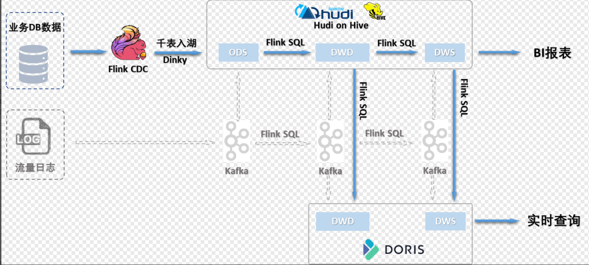

### 数据流向示意图

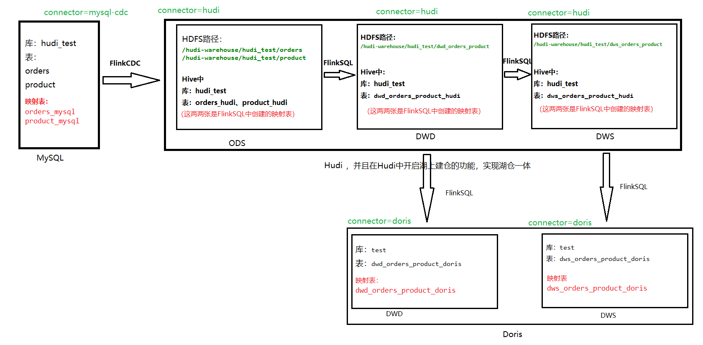

### 操作步骤

```shell
任务1.ODS层的实现
（1）在MySQL中准备库、表、数据
（2）在FlinkSQL中创建MySQL的映射表
（3）在FlinkSQL中创建hudi的映射表
（4）拉起数据任务
insert into sink_table select colA,colB,colC ... from source_table;
（5）去HDFS和Hive校验数据

任务2.Hudi的DWD层实现
（1）在FlinkSQL中创建dwd层的映射表
（2）在FlinkSQL中拉起数据任务
（3）去HDFS和Hive校验数据


任务3.Doris的DWD层实现
（1）在Doris中创建库、表，用来接收数据
（2）在FlinkSQL中创建Doris的映射表
（3）在FlinkSQL拉起数据任务
（4）去Doris校验数据


任务4.Hudi的DWS层实现
（1）在FlinkSQL中创建dws层的映射表
（2）在FlinkSQL中拉起数据任务
（3）在HDFS和Hive校验数据


任务5.Doris的DWS层的实现
（1）在Doris中创建表，用来接收数据
（2）在FlinkSQL中创建Doris的映射表
（3）在FlinkSQL拉起数据任务
（4）在Doris中校验数据

```

### 实现

#### 任务一

##### 准备好MySQL的库、表，数据

~~~sql
--创建库
create database if not exists hudi_test;

--切换库
use hudi_test;

--创建表
CREATE TABLE `orders` (
    `id` int(11) NOT NULL,
    `pid` int(11) NOT NULL,
    `num` int(11) DEFAULT NULL,
    PRIMARY KEY (`id`)
) ENGINE=InnoDB DEFAULT CHARSET=utf8;

--插入数据
INSERT INTO `orders` VALUES (1,1,2),(2,1,13),(3,2,55);

--创建表
CREATE TABLE `product` (
    `id` int(11) NOT NULL,
    `name` varchar(50) DEFAULT NULL,
    `price` decimal(10,4),
    PRIMARY KEY (`id`)
) ENGINE=InnoDB DEFAULT CHARSET=utf8;

--插入数据
INSERT INTO `product` VALUES (1,'phone',5680),(2,'door',857),(3,'screen',3333);
~~~

##### 在FlinkSQL准备MySQL的映射表

~~~sql
CREATE TABLE orders_mysql (
  id INT,
  pid INT,
  num INT,
  PRIMARY KEY(id) NOT ENFORCED
) WITH (
    'connector' = 'mysql-cdc',
    'hostname' = 'node1',
    'port' = '3306',
    'username' = 'root',
    'password' = '123456',
    'database-name' = 'hudi_test',
    'table-name' = 'orders'
);


CREATE TABLE product_mysql (
   id INT,
   name STRING,
   price decimal(10,4),
   PRIMARY KEY(id) NOT ENFORCED
) WITH (
    'connector' = 'mysql-cdc',
    'hostname' = 'node1',
    'port' = '3306',
    'username' = 'root',
    'password' = '123456',
    'database-name' = 'hudi_test',
    'table-name' = 'product'
);
~~~

##### 在FlinkSQL中准备Hudi的映射表

~~~sql
CREATE TABLE orders_hudi(
    id INT,
    pid INT,
    num INT,
    PRIMARY KEY(id) NOT ENFORCED
) WITH (
    'connector'='hudi'
    ,'path'= 'hdfs://node1:8020/hudi-warehouse/hudi_test/orders'
    ,'hoodie.datasource.write.recordkey.field'= 'id'
    ,'write.tasks'= '1'
    ,'compaction.tasks'= '1'
    ,'write.rate.limit'= '2000' 
    ,'table.type'= 'MERGE_ON_READ'
    ,'compaction.async.enabled'= 'true'
    ,'compaction.trigger.strategy'= 'num_commits'
    ,'compaction.delta_commits'= '1'
    ,'changelog.enabled'= 'true'
    ,'read.tasks' = '1'
    ,'read.streaming.enabled'= 'true' 
    ,'read.start-commit'='earliest' 
    ,'read.streaming.check-interval'= '3' 
    ,'hive_sync.enable'= 'true' 
    ,'hive_sync.mode'= 'hms' 
    ,'hive_sync.metastore.uris'= 'thrift://node1:9083' 
    ,'hive_sync.table'= 'orders_hudi' 
    ,'hive_sync.db'= 'hudi_test' 
    ,'hive_sync.username'= '' 
    ,'hive_sync.password'= '' 
    ,'hive_sync.support_timestamp'= 'true' 
);


CREATE TABLE product_hudi(
    id INT,
    name STRING,
    price decimal(10,4),
    PRIMARY KEY(id) NOT ENFORCED
) WITH (
    'connector'='hudi'
    ,'path'= 'hdfs://node1:8020/hudi-warehouse/hudi_test/product'
    ,'hoodie.datasource.write.recordkey.field'= 'id'
    ,'write.tasks'= '1'
    ,'compaction.tasks'= '1'
    ,'write.rate.limit'= '2000'
    ,'table.type'= 'MERGE_ON_READ'
    ,'compaction.async.enabled'= 'true'
    ,'compaction.trigger.strategy'= 'num_commits'
    ,'compaction.delta_commits'= '1'
    ,'changelog.enabled'= 'true'
    ,'read.tasks' = '1'
    ,'read.streaming.enabled'= 'true' -- 开启流读
    ,'read.start-commit'='earliest' --如果想消费所有数据，设置值为earliest
    ,'read.streaming.check-interval'= '3' -- 检查间隔，默认60s
    ,'hive_sync.enable'= 'true' -- 开启自动同步hive
    ,'hive_sync.mode'= 'hms' -- 自动同步hive模式，默认jdbc模式
    ,'hive_sync.metastore.uris'= 'thrift://node1:9083' -- hive metastore地址
    ,'hive_sync.table'= 'product_hudi' -- hive 新建表名
    ,'hive_sync.db'= 'hudi_test' -- hive 新建数据库名
    ,'hive_sync.username'= '' -- HMS 用户名
    ,'hive_sync.password'= '' -- HMS 密码
    ,'hive_sync.support_timestamp'= 'true'-- 兼容hive timestamp类型
);
~~~

##### 拉起数据任务

~~~sql
insert into orders_hudi select * from orders_mysql;
insert into product_hudi select * from product_mysql;
~~~

##### 校验数据

* 8081页面截图


* HDFS文件路径截图


* MySQL源表数据截图

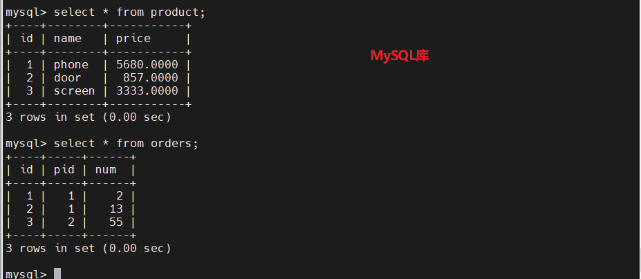

* Hive目标表数据截图


#### 任务二

##### 在FlinkSQL中创建dwd层的映射表

~~~sql
CREATE TABLE dwd_orders_product_hudi (
    id INT,
    name STRING,
    num INT,
    price decimal(10,4),
    PRIMARY KEY(id) NOT ENFORCED
) WITH (
    'connector'='hudi'
    ,'path'= 'hdfs://node1:8020/hudi-warehouse/hudi_test/dwd_orders_product'
    ,'hoodie.datasource.write.recordkey.field'= 'id'
    ,'write.tasks'= '1'
    ,'compaction.tasks'= '1'
    ,'write.rate.limit'= '2000'
    ,'table.type'= 'MERGE_ON_READ'
    ,'compaction.async.enabled'= 'true'
    ,'compaction.trigger.strategy'= 'num_commits'
    ,'compaction.delta_commits'= '1'
    ,'changelog.enabled'= 'true',
    'read.tasks' = '1',
    'read.streaming.enabled'= 'true', -- 开启流读
    'read.start-commit'='earliest',--如果想消费所有数据，设置值为earliest
    'read.streaming.check-interval'= '3', -- 检查间隔，默认60s
    'hive_sync.enable'= 'true', -- 开启自动同步hive
    'hive_sync.mode'= 'hms', -- 自动同步hive模式，默认jdbc模式
    'hive_sync.metastore.uris'= 'thrift://node1:9083', -- hive metastore地址
    'hive_sync.table'= 'dwd_orders_product_hudi', -- hive 新建表名
    'hive_sync.db'= 'hudi_test', -- hive 新建数据库名
    'hive_sync.username'= '', -- HMS 用户名
    'hive_sync.password'= '', -- HMS 密码
    'hive_sync.support_timestamp'= 'true'-- 兼容hive timestamp类型
);
~~~

##### 在FlinkSQL中拉起数据任务

~~~sql
insert into dwd_orders_product_hudi 
select
    orders_hudi.id as id,
    product_hudi.name as name,
    orders_hudi.num as num,
    product_hudi.price as price
from orders_hudi
inner join product_hudi on orders_hudi.pid = product_hudi.id;
~~~

##### 校验数据

HDFS路径截图

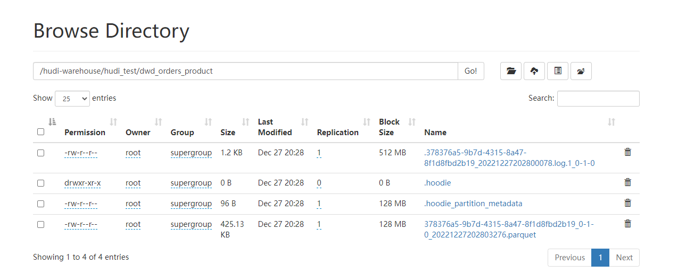

Hive数据截图


#### 任务三

##### 在Doris中创建库、表

~~~sql
create database if not exists test;
create table if not exists test.dwd_orders_product_doris
(
    id  int, 
    name string not null,
num INT,
price decimal(10,4)
) Unique Key (`id`)
comment ''
DISTRIBUTED BY HASH(`id`) BUCKETS 10
PROPERTIES (
"replication_allocation" = "tag.location.default: 1"
);
~~~

##### 在FlinkSQL中创建Doris的映射表

~~~sql
CREATE TABLE if not exists dwd_orders_product_doris (
    id INT,
    name STRING,
    num INT,
    price decimal(10,4),
    PRIMARY KEY(id) NOT ENFORCED
) WITH (
    'fenodes' = '192.168.88.161:8030'
    ,'table.identifier' = 'test.dwd_orders_product_doris'
    ,'sink.enable-delete' = 'true'
    ,'sink.properties.strip_outer_array' = 'true'
    ,'sink.batch.size' = '2000'
    ,'password' = '123456'
    ,'connector' = 'doris'
    ,'sink.batch.interval' = '10s'
    ,'sink.max-retries' = '5'
    ,'sink.properties.format' = 'json'
    ,'username' = 'root'
);
~~~

##### 在FlinkSQL中拉起数据任务

~~~sql
insert into dwd_orders_product_doris
select
    id,
    name,
    num,
    price
from dwd_orders_product_hudi;
~~~

##### 校验数据


#### 任务四

##### 在FlinkSQL中创建dws层的映射表

~~~sql
CREATE TABLE dws_orders_product_hudi(
    name STRING,
    cnt BIGINT,
    price decimal(10,4),
    total_money decimal(10,4),
    PRIMARY KEY(name) NOT ENFORCED
) WITH (
    'connector'='hudi'
    ,'path'= 'hdfs://node1:8020/hudi-warehouse/hudi_test/dws_orders_product'
    ,'hoodie.datasource.write.recordkey.field'= 'id'
    ,'write.tasks'= '1'
    ,'compaction.tasks'= '1'
    ,'write.rate.limit'= '2000'
    ,'table.type'= 'MERGE_ON_READ'
    ,'compaction.async.enabled'= 'true'
    ,'compaction.trigger.strategy'= 'num_commits'
    ,'compaction.delta_commits'= '1'
    ,'changelog.enabled'= 'true',
    'read.tasks' = '1',
    'read.streaming.enabled'= 'true', -- 开启流读
    'read.start-commit'='earliest',--如果想消费所有数据，设置值为earliest
    'read.streaming.check-interval'= '3', -- 检查间隔，默认60s
    'hive_sync.enable'= 'true', -- 开启自动同步hive
    'hive_sync.mode'= 'hms', -- 自动同步hive模式，默认jdbc模式
    'hive_sync.metastore.uris'= 'thrift://node1:9083', -- hive metastore地址
    'hive_sync.table'= 'dws_orders_product_hudi', -- hive 新建表名
    'hive_sync.db'= 'hudi_test', -- hive 新建数据库名
    'hive_sync.username'= '', -- HMS 用户名
    'hive_sync.password'= '', -- HMS 密码
    'hive_sync.support_timestamp'= 'true'-- 兼容hive timestamp类型
);
~~~

##### 拉起数据任务

~~~sql
insert into dws_orders_product_hudi
select
    name,
    sum(num) as cnt,
    max(price) as price,
    sum(num)*max(price) as total_money
from dwd_orders_product_hudi
group by name;
~~~

##### 校验数据

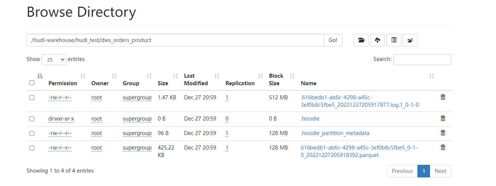


#### 任务五

##### 在Doris中创建物理表

~~~sql
create table if not exists test.dws_orders_product_doris(
	name VARCHAR(32),
    cnt BIGINT,
    price decimal(10,4),
    total_money decimal(10,4)
) Unique Key (`name`)
DISTRIBUTED BY HASH(`name`) BUCKETS 10
PROPERTIES (
"replication_allocation" = "tag.location.default: 1"
);
~~~

##### 在FlinkSQL中创建物理表的映射表

~~~sql
CREATE TABLE if not exists dws_orders_product_doris (
    name string,
    cnt BIGINT,
    price decimal(10,4),
    total_money decimal(10,4),
    PRIMARY KEY(name) NOT ENFORCED
) WITH (
    'fenodes' = '192.168.88.161:8030'
    ,'table.identifier' = 'test.dws_orders_product_doris'
    ,'sink.enable-delete' = 'true'
    ,'sink.properties.strip_outer_array' = 'true'
    ,'sink.batch.size' = '2000'
    ,'password' = '123456'
    ,'connector' = 'doris'
    ,'sink.batch.interval' = '10s'
    ,'sink.max-retries' = '5'
    ,'sink.properties.format' = 'json'
    ,'username' = 'root'
);
~~~

##### 拉起数据任务

~~~sql
insert into dws_orders_product_doris
select
    name,
    cnt, 
    price,
    total_money
from dws_orders_product_hudi;
~~~

##### 校验数据

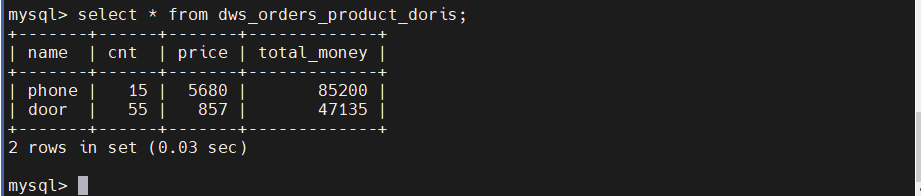

#### 模拟业务变更

通过手动修改MySQL中的数据，来模拟业务的变化，看这个架构的时效性。

~~~sql
--1.新增操作
insert into orders values (4,2,100);

--2.修改操作
update orders set num = 200 where id = 4;

--3.删除操作
delete from orders where id = 4;
~~~

更新前的数据

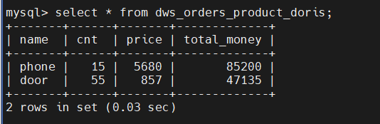

新增后的结果

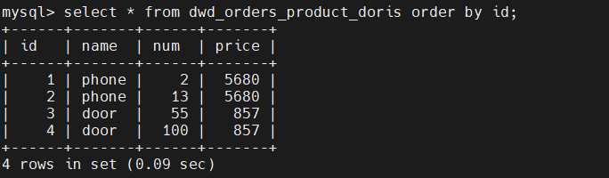

修改后的结果

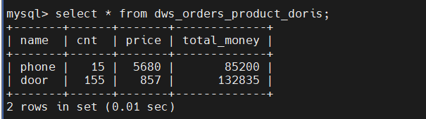

删除后的结果

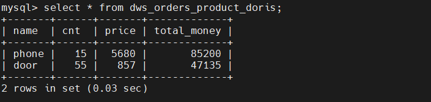

## 新媒体短视频课程报名分析看板

### 分层设计

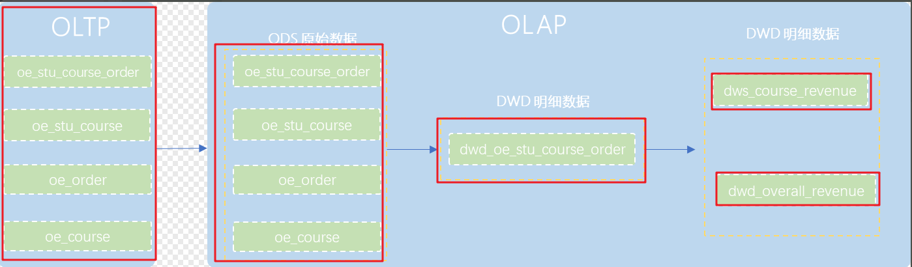

### ODS层实现

#### 数据流图

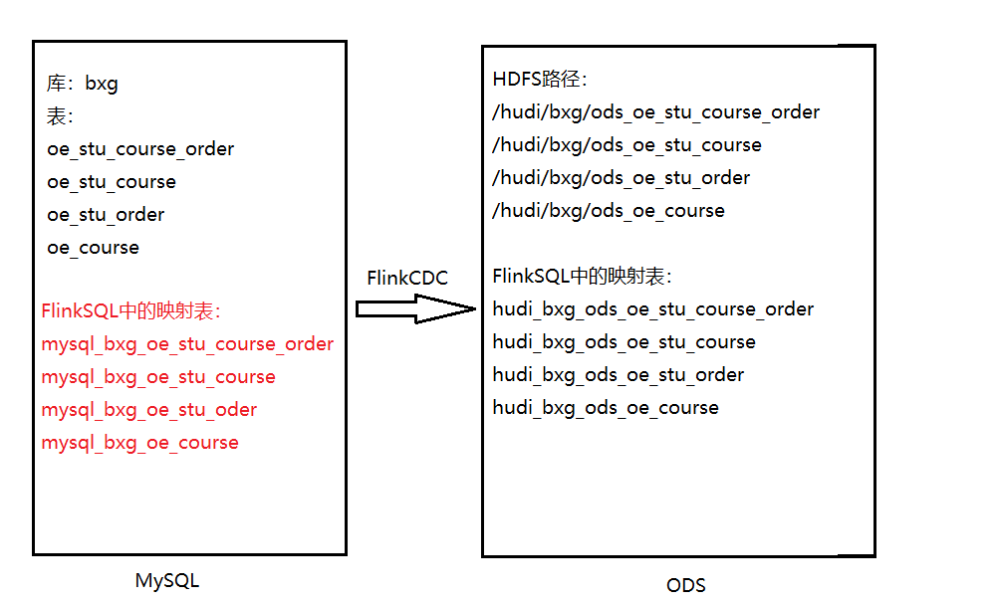

#### 实现步骤

~~~shell
1.在MySQL中准备库、表、数据（不需要准备了，已经在MySQL的bxg库中有数据了）
2.在FlinkSQL中创建MySQL源表的映射表（4张表）
3.在FlinkSQL中创建Hudi的映射表（4张表）
4.拉起数据任务（4个任务）
5.在HDFS和Hive中分别去校验数据
~~~

#### 具体实现

##### 在FlinkSQL中创建MySQL源表的映射表

~~~sql
CREATE TABLE if not exists mysql_bxg_oe_stu_course_order (
    `id` INT,
    `student_course_id` INT,
    `order_id` STRING,
    `order_detail_id` STRING,
    `create_time` TIMESTAMP(3),
    `update_time` TIMESTAMP(3),
    `delete_flag` BOOLEAN,
    PRIMARY KEY (`id`) NOT ENFORCED
) WITH (
    'connector'= 'mysql-cdc',
    'hostname'= 'node1',
    'port'= '3306',
    'username'= 'root',
    'password'='123456',
    'server-time-zone'= 'Asia/Shanghai',
    'debezium.snapshot.mode'='initial',
    'database-name'= 'bxg',
    'table-name'= 'oe_stu_course_order'
);


CREATE TABLE if not exists mysql_bxg_oe_stu_course (
    `id` INT,
    `student_id` STRING,
    `course_id` INT,
    `status` TINYINT,
    `contract_status` TINYINT,
    `learn_status` TINYINT,
    `service_days` SMALLINT,
    `service_expires` TIMESTAMP(3),
    `validity_days` INT,
    `validity_expires` TIMESTAMP(3),
    `terminate_cause` TINYINT,
    `effective_date` TIMESTAMP(3),
    `finished_time` TIMESTAMP(3),
    `total_progress` DECIMAL(10,2),
    `purchase_time` INT,
    `create_time` TIMESTAMP(3),
    `update_time` TIMESTAMP(3),
    `delete_flag` BOOLEAN,
    PRIMARY KEY (`id`) NOT ENFORCED
) WITH (
    'connector'= 'mysql-cdc',
    'hostname'= 'node1',
    'port'= '3306',
    'username'= 'root',
    'password'='123456',
    'server-time-zone'= 'Asia/Shanghai',
    'debezium.snapshot.mode'='initial',
    'database-name'= 'bxg',
    'table-name'= 'oe_stu_course'
);


CREATE TABLE if not exists mysql_bxg_oe_order (
    `id` STRING,
    `channel` STRING,
    `student_id` STRING,
    `order_no` STRING,
    `total_amount` DECIMAL(10,2),
    `discount_amount` DECIMAL(10,2),
    `charge_against_amount` DECIMAL(10,2),
    `payable_amount` DECIMAL(10,2),
    `status` TINYINT,
    `pay_status` TINYINT,
    `pay_time` TIMESTAMP(3),
    `paid_amount` DECIMAL(10,2),
    `effective_date` TIMESTAMP(3),
    `terminal` TINYINT,
    `refund_status` TINYINT,
    `refund_amount` DECIMAL(10,2),
    `refund_time` TIMESTAMP(3),
    `create_time` TIMESTAMP(3),
    `update_time` TIMESTAMP(3),
    `delete_flag` BOOLEAN,
    PRIMARY KEY (id) NOT ENFORCED
) WITH (
    'connector' = 'mysql-cdc',
    'hostname' = 'node1',
    'port' = '3306',
    'username' = 'root',
    'password' = '123456',
    'server-time-zone'= 'Asia/Shanghai',
    'debezium.snapshot.mode'='initial',
    'database-name'= 'bxg',
    'table-name' = 'oe_order'
);


CREATE TABLE if not exists mysql_bxg_oe_course (
    `id` INT,
    `grade_name` STRING,
    `bigimg_path` STRING,
    `video_url` STRING,
    `img_alt` STRING,
    `description` STRING,
    `detailimg_path` STRING,
    `smallimg_path` STRING,
    `sort` INT,
    `status` STRING,
    `learnd_count` INT,
    `learnd_count_flag` INT,
    `original_cost` DECIMAL(10,2),
    `current_price` DECIMAL(10,2),
    `course_length` DECIMAL(10,2),
    `menu_id` INT,
    `is_free` BOOLEAN,
    `course_detail` STRING,
    `course_detail_mobile` STRING,
    `course_detail1` STRING,
    `course_detail1_mobile` STRING,
    `course_plan_detail` STRING,
    `course_plan_detail_mobile` STRING,
    `course_detail2` STRING,
    `course_detail2_mobile` STRING,
    `course_outline` STRING,
    `common_problem` STRING,
    `common_problem_mobile` STRING,
    `lecturer_id` INT,
    `is_recommend` INT,
    `recommend_sort` INT,
    `qqno` STRING,
    `description_show` INT,
    `rec_img_path` STRING,
    `pv` INT,
    `course_type` INT,
    `default_student_count` INT,
    `study_status` INT,
    `online_course` INT,
    `course_level` INT,
    `content_type` INT,
    `recommend_type` INT,
    `employment_rate` STRING,
    `employment_salary` STRING,
    `score` STRING,
    `cover_url` STRING,
    `offline_course_url` STRING,
    `outline_url` STRING,
    `project_page_url` STRING,
    `preschool_test_flag` BOOLEAN,
    `service_period` INT,
    `included_validity_period` TINYINT,
    `validity_period` INT,
    `qualified_jobs` STRING,
    `work_year_min` INT,
    `work_year_max` INT,
    `promote_flag` BOOLEAN,
    `create_person` STRING,
    `update_person` STRING,
    `create_time` TIMESTAMP(3),
    `update_time` TIMESTAMP(3),
    `is_delete` BOOLEAN,
    PRIMARY KEY (`id`) NOT ENFORCED
) WITH (
    'connector'= 'mysql-cdc',
    'hostname'= 'node1',
    'port'= '3306',
    'username'= 'root',
    'password'='123456',
    'server-time-zone'= 'Asia/Shanghai',
    'debezium.snapshot.mode'='initial',
    'database-name'= 'bxg',
    'table-name'= 'oe_course'
);
~~~

##### 在FlinkSQL中创建目标表的映射表

~~~sql
CREATE TABLE if not exists hudi_bxg_ods_oe_stu_course_order (
    `id` INT,
    `student_course_id` INT,
    `order_id` STRING,
    `order_detail_id` STRING,
    `create_time` TIMESTAMP(3),
    `update_time` TIMESTAMP(3),
    `delete_flag` BOOLEAN,
   PRIMARY KEY (id) NOT ENFORCED
) WITH(
    'connector'='hudi'
    ,'path'= 'hdfs://node1:8020/hudi/bxg/ods_oe_stu_course_order'
    ,'hoodie.datasource.write.recordkey.field'= 'id' 
    ,'write.tasks'= '1'
    ,'compaction.tasks'= '1'
    ,'write.rate.limit'= '2000' 
    ,'table.type'= 'MERGE_ON_READ' 
    ,'compaction.async.enabled'= 'true' 
    ,'compaction.trigger.strategy'= 'num_commits' 
    ,'compaction.delta_commits'= '1'
    ,'changelog.enabled'= 'true' 
    ,'read.tasks' = '1'
    ,'read.streaming.enabled'= 'true' 
    ,'read.start-commit'='earliest'
    ,'read.streaming.check-interval'= '3'
    ,'hive_sync.enable'= 'true' 
    ,'hive_sync.mode'= 'hms' 
    ,'hive_sync.metastore.uris'= 'thrift://node1:9083'
    ,'hive_sync.table'= 'ods_oe_stu_course_order'
    ,'hive_sync.db'= 'bxg' 
    ,'hive_sync.username'= '' 
    ,'hive_sync.password'= '' 
    ,'hive_sync.support_timestamp'= 'true' 
);


CREATE TABLE if not exists hudi_bxg_ods_oe_stu_course (
    `id` INT,
    `student_id` STRING,
    `course_id` INT,
    `status` INT,
    `contract_status` INT,
    `learn_status` INT,
    `service_days` INT,
    `service_expires` TIMESTAMP(3),
    `validity_days` INT,
    `validity_expires` TIMESTAMP(3),
    `terminate_cause` INT,
    `effective_date` TIMESTAMP(3),
    `finished_time` TIMESTAMP(3),
    `total_progress` DECIMAL(10,2),
    `purchase_time` INT,
    `create_time` TIMESTAMP(3),
    `update_time` TIMESTAMP(3),
    `delete_flag` BOOLEAN,
   PRIMARY KEY (id) NOT ENFORCED
) WITH(
    'connector'='hudi'
    ,'path'= 'hdfs://node1:8020/hudi/bxg/ods_oe_stu_course'
    ,'hoodie.datasource.write.recordkey.field'= 'id' 
    ,'write.tasks'= '1'
    ,'compaction.tasks'= '1'
    ,'write.rate.limit'= '2000' 
    ,'table.type'= 'MERGE_ON_READ' 
    ,'compaction.async.enabled'= 'true' 
    ,'compaction.trigger.strategy'= 'num_commits' 
    ,'compaction.delta_commits'= '1'
    ,'changelog.enabled'= 'true' 
    ,'read.tasks' = '1'
    ,'read.streaming.enabled'= 'true' 
    ,'read.start-commit'='earliest'
    ,'read.streaming.check-interval'= '3'
    ,'hive_sync.enable'= 'true' 
    ,'hive_sync.mode'= 'hms' 
    ,'hive_sync.metastore.uris'= 'thrift://node1:9083'
    ,'hive_sync.table'= 'ods_oe_stu_course'
    ,'hive_sync.db'= 'bxg' 
    ,'hive_sync.username'= '' 
    ,'hive_sync.password'= '' 
    ,'hive_sync.support_timestamp'= 'true' 
);


CREATE TABLE if not exists hudi_bxg_ods_oe_order (
    `id` STRING,
    `channel` STRING,
    `student_id` STRING,
    `order_no` STRING,
    `total_amount` DECIMAL(10,2),
    `discount_amount` DECIMAL(10,2),
    `charge_against_amount` DECIMAL(10,2),
    `payable_amount` DECIMAL(10,2),
    `status` INT,
    `pay_status` INT,
    `pay_time` TIMESTAMP(3),
    `paid_amount` DECIMAL(10,2),
    `effective_date` TIMESTAMP(3),
    `terminal` INT,
    `refund_status` INT,
    `refund_amount` DECIMAL(10,2),
    `refund_time` TIMESTAMP(3),
    `create_time` TIMESTAMP(3),
    `update_time` TIMESTAMP(3),
    `delete_flag` BOOLEAN,
   PRIMARY KEY (id) NOT ENFORCED
)WITH(
    'connector'='hudi'
    ,'path'= 'hdfs://node1:8020/hudi/bxg/ods_oe_order'
    ,'hoodie.datasource.write.recordkey.field'= 'id' 
    ,'write.tasks'= '1'
    ,'compaction.tasks'= '1'
    ,'write.rate.limit'= '2000' 
    ,'table.type'= 'MERGE_ON_READ' 
    ,'compaction.async.enabled'= 'true' 
    ,'compaction.trigger.strategy'= 'num_commits' 
    ,'compaction.delta_commits'= '1'
    ,'changelog.enabled'= 'true' 
    ,'read.tasks' = '1'
    ,'read.streaming.enabled'= 'true' 
    ,'read.start-commit'='earliest'
    ,'read.streaming.check-interval'= '3'
    ,'hive_sync.enable'= 'true' 
    ,'hive_sync.mode'= 'hms' 
    ,'hive_sync.metastore.uris'= 'thrift://node1:9083'
    ,'hive_sync.table'= 'ods_oe_order'
    ,'hive_sync.db'= 'bxg' 
    ,'hive_sync.username'= '' 
    ,'hive_sync.password'= '' 
    ,'hive_sync.support_timestamp'= 'true' 
);


CREATE TABLE if not exists hudi_bxg_ods_oe_course(
    `id` INT,
    `grade_name` STRING,
    `bigimg_path` STRING,
    `video_url` STRING,
    `img_alt` STRING,
    `description` STRING,
    `detailimg_path` STRING,
    `smallimg_path` STRING,
    `sort` INT,
    `status` STRING,
    `learnd_count` INT,
    `learnd_count_flag` INT,
    `original_cost` DECIMAL(10,2),
    `current_price` DECIMAL(10,2),
    `course_length` DECIMAL(10,2),
    `menu_id` INT,
    `is_free` BOOLEAN,
    `course_detail` STRING,
    `course_detail_mobile` STRING,
    `course_detail1` STRING,
    `course_detail1_mobile` STRING,
    `course_plan_detail` STRING,
    `course_plan_detail_mobile` STRING,
    `course_detail2` STRING,
    `course_detail2_mobile` STRING,
    `course_outline` STRING,
    `common_problem` STRING,
    `common_problem_mobile` STRING,
    `lecturer_id` INT,
    `is_recommend` INT,
    `recommend_sort` INT,
    `qqno` STRING,
    `description_show` INT,
    `rec_img_path` STRING,
    `pv` INT,
    `course_type` INT,
    `default_student_count` INT,
    `study_status` INT,
    `online_course` INT,
    `course_level` INT,
    `content_type` INT,
    `recommend_type` INT,
    `employment_rate` STRING,
    `employment_salary` STRING,
    `score` STRING,
    `cover_url` STRING,
    `offline_course_url` STRING,
    `outline_url` STRING,
    `project_page_url` STRING,
    `preschool_test_flag` BOOLEAN,
    `service_period` INT,
    `included_validity_period` INT,
    `validity_period` INT,
    `qualified_jobs` STRING,
    `work_year_min` INT,
    `work_year_max` INT,
    `promote_flag` BOOLEAN,
    `create_person` STRING,
    `update_person` STRING,
    `create_time` TIMESTAMP(3),
    `update_time` TIMESTAMP(3),
    `is_delete` BOOLEAN,
   PRIMARY KEY (id) NOT ENFORCED
) WITH(
    'connector'='hudi'
    ,'path'= 'hdfs://node1:8020/hudi/bxg/ods_oe_course'
    ,'hoodie.datasource.write.recordkey.field'= 'id' 
    ,'write.tasks'= '1'
    ,'compaction.tasks'= '1'
    ,'write.rate.limit'= '2000' 
    ,'table.type'= 'MERGE_ON_READ' 
    ,'compaction.async.enabled'= 'true' 
    ,'compaction.trigger.strategy'= 'num_commits' 
    ,'compaction.delta_commits'= '1'
    ,'changelog.enabled'= 'true' 
    ,'read.tasks' = '1'
,'read.streaming.enabled'= 'true'
    ,'read.start-commit'='earliest' 
    ,'read.streaming.check-interval'= '3'
    ,'hive_sync.enable'= 'true' 
    ,'hive_sync.mode'= 'hms' 
    ,'hive_sync.metastore.uris'= 'thrift://node1:9083'
    ,'hive_sync.table'= 'ods_oe_course'
    ,'hive_sync.db'= 'bxg' 
    ,'hive_sync.username'= '' 
    ,'hive_sync.password'= '' 
    ,'hive_sync.support_timestamp'= 'true' 
);
~~~

##### 在FlinkSQL拉起数据任务

~~~sql
INSERT INTO `hudi_bxg_ods_oe_stu_course_order` SELECT `id`, `student_course_id`, `order_id`, `order_detail_id`, `create_time`, `update_time`, `delete_flag`
FROM `mysql_bxg_oe_stu_course_order`;


INSERT INTO `hudi_bxg_ods_oe_stu_course` SELECT  id, student_id, course_id, status, contract_status, learn_status, service_days, service_expires, validity_days, validity_expires, terminate_cause, effective_date, finished_time, total_progress, purchase_time, create_time, update_time, delete_flag
FROM `mysql_bxg_oe_stu_course`;


INSERT INTO `hudi_bxg_ods_oe_order` SELECT  `id`, `channel`, `student_id`, `order_no`, `total_amount`, `discount_amount`, `charge_against_amount`, `payable_amount`, `status`, `pay_status`, `pay_time`, `paid_amount`, `effective_date`, `terminal`, `refund_status`, `refund_amount`, `refund_time`, `create_time`, `update_time`, `delete_flag`
FROM `mysql_bxg_oe_order`;


INSERT INTO `hudi_bxg_ods_oe_course`
select  id, grade_name, bigimg_path, video_url, img_alt, description, detailimg_path, smallimg_path, sort, status, learnd_count, learnd_count_flag, original_cost, current_price, course_length, menu_id, is_free, course_detail, course_detail_mobile, course_detail1, course_detail1_mobile, course_plan_detail, course_plan_detail_mobile, course_detail2, course_detail2_mobile, course_outline, common_problem, common_problem_mobile, lecturer_id, is_recommend, recommend_sort, qqno, description_show, rec_img_path, pv, course_type, default_student_count, study_status, online_course, course_level, content_type, recommend_type, employment_rate, employment_salary, score, cover_url, offline_course_url, outline_url, project_page_url, preschool_test_flag, service_period, included_validity_period, validity_period, qualified_jobs, work_year_min, work_year_max, promote_flag, create_person, update_person, create_time, update_time, is_delete
from `mysql_bxg_oe_course`;
~~~

##### 数据校验

* 任务的运行情况

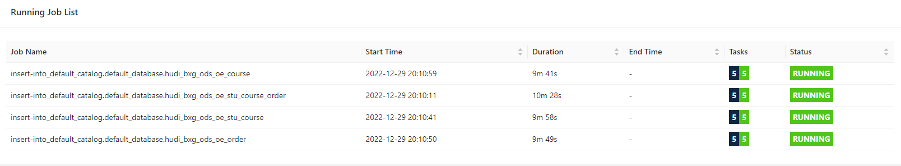

* HDFS的目录

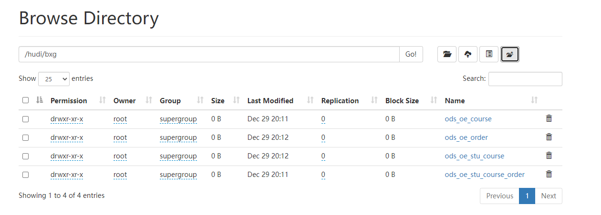

* Hive中的表情况

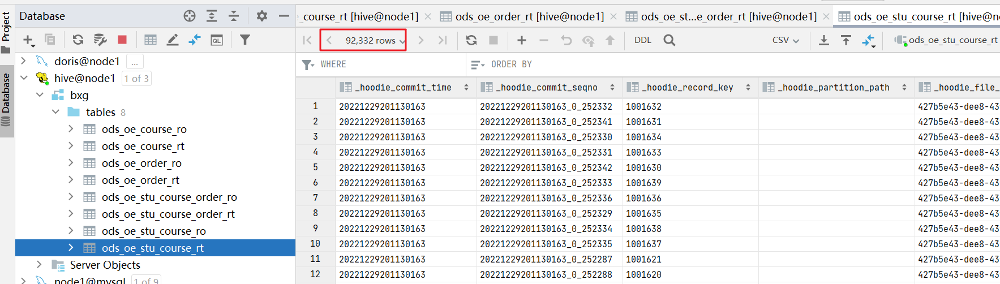

* MySQL中的数据量

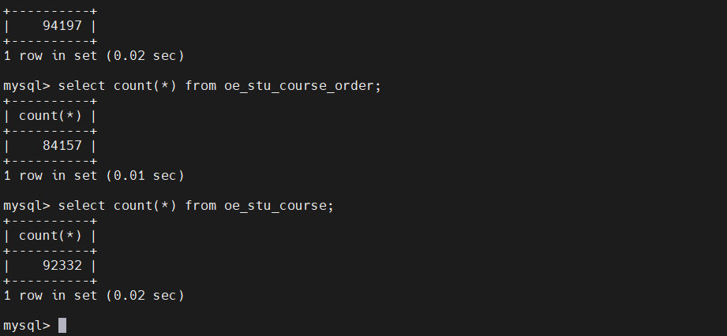

### Hudi DWD层实现

#### 数据流图

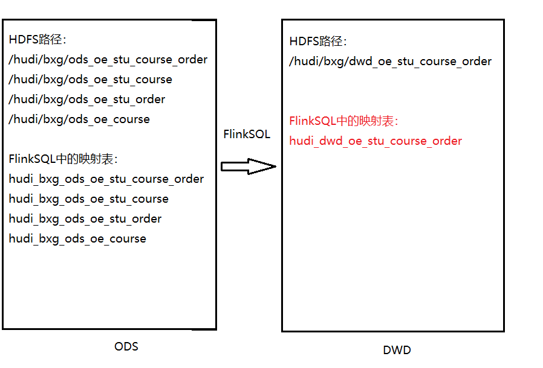

#### 操作步骤

~~~shell
1.在FlinkSQL中创建目标表的映射表
2.在FlinkSQL拉起数据任务
3.校验数据即可
~~~

#### 具体实现

##### 在FlinkSQL中创建目标表的映射表

~~~sql
CREATE TABLE if not exists hudi_dwd_oe_stu_course_order (
     `id` int,
     `stu_course_id` int,
     `order_id` string,
     `course_id` int,
     `stu_course_status` int,
     `stu_course_status_des` string,
     `stu_course_delete_flag` BOOLEAN,
     `payable_amount` decimal(10,2),
     `pay_status` int,
     `pay_time` TIMESTAMP(3),
     `paid_amount` decimal(10,2),
     `refund_status` int,
     `order_delete_flag` boolean,
     `grade_name` string,
     `is_complete_order` boolean,
     PRIMARY KEY (`id`) NOT ENFORCED
) WITH(
    'connector'='hudi'
    ,'path'= 'hdfs://node1:8020/hudi/bxg/dwd_oe_stu_course_order'
    ,'hoodie.datasource.write.recordkey.field'= 'id' 
    ,'write.tasks'= '1'
    ,'compaction.tasks'= '1'
    ,'write.rate.limit'= '2000' 
    ,'table.type'= 'MERGE_ON_READ' 
    ,'compaction.async.enabled'= 'true' 
    ,'compaction.trigger.strategy'= 'num_commits' 
    ,'compaction.delta_commits'= '1'
    ,'changelog.enabled'= 'true' 
    ,'read.tasks' = '3'
    ,'read.streaming.enabled'= 'true' 
    ,'read.start-commit'='earliest'
    ,'read.streaming.check-interval'= '3'
    ,'hive_sync.enable'= 'true' 
    ,'hive_sync.mode'= 'hms' 
    ,'hive_sync.metastore.uris'= 'thrift://node1:9083'
    ,'hive_sync.table'= 'dwd_oe_stu_course_order'
    ,'hive_sync.db'= 'bxg' 
    ,'hive_sync.username'= '' 
    ,'hive_sync.password'= '' 
    ,'hive_sync.support_timestamp'= 'true' 
);
~~~

##### 拉起数据任务

~~~sql
insert into hudi_dwd_oe_stu_course_order
SELECT
    `osco`.`id`,
    `osco`.`student_course_id`,
    `osco`.`order_id`,
    `osc`.`course_id`,
    `osc`.`status` as `stu_course_status`,
     case `osc`.`status` when 0 then '试学' when 1 then '生效' when 2 then '待生效' when -1 then '停课' else '退费' end as `stu_course_status_des`,
    `osc`.`delete_flag` as `stu_course_delete_flag`,
    `oo`.`payable_amount`,
    `oo`.`pay_status`,
    `oo`.`pay_time`,
    `oo`.`paid_amount`,
    `oo`.`refund_status`,
    `oo`.`delete_flag` as `order_delete_flag`,
    `oc`.`grade_name`,
    if (oo.`payable_amount`>0 and `oo`.`pay_status`=2 and `oo`.`delete_flag` = false and `osc`.`delete_flag` = false, true, false) as is_complete_order
FROM hudi_bxg_ods_oe_stu_course_order AS osco
LEFT JOIN hudi_bxg_ods_oe_stu_course AS osc
ON osc.id = osco.student_course_id
LEFT JOIN hudi_bxg_ods_oe_order AS oo
ON oo.id = osco.order_id
LEFT JOIN hudi_bxg_ods_oe_course AS oc
ON oc.id = osc.course_id;
~~~


### Doris DWD层实现

#### 数据流图

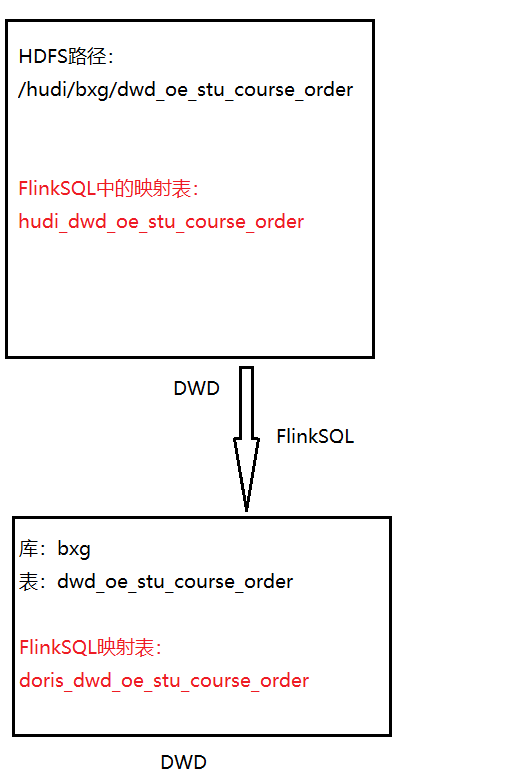

#### 操作步骤

~~~shell
1.在Doris中创建物理表，用来接收结果
2.在FlinkSQL创建Doris的映射表
3.在FlinkSQL拉起数据任务
4.在Doris中校验数据
~~~

#### 具体实现

##### 在Doris中创建物理表，用来接收结果

~~~sql
--创建库
CREATE DATABASE IF NOT EXISTS bxg;

--切换库
use bxg;

--创建表
CREATE TABLE IF NOT EXISTS bxg.dwd_oe_stu_course_order
(
   `id` int,
   `stu_course_id` int COMMENT '学员课程id',
   `order_id` string,
   `course_id` int COMMENT '学员购买的课程',
   `stu_course_status` int COMMENT '学员课程状态：0试学、1生效、2待生效、-1停课、8退费',
   `stu_course_status_des` string COMMENT '学员课程状态描述：0试学、1生效、2待生效、-1停课、8退费',
   `stu_course_delete_flag` BOOLEAN,
   `payable_amount` decimal(10,2) COMMENT '实际应付总金额=原价-优惠总额-冲抵金额',
   `pay_status` int  COMMENT '支付状态：0未支付、1部分支付、2支付完成',
   `pay_time` datetime COMMENT '最后支付完成时间',
   `paid_amount` decimal(10,2) COMMENT '当前已付总额',
   `refund_status` INT COMMENT '退费状态:0-未退费;-1-已退费;-2-退费中;-3-部分退费',
   `order_delete_flag` BOOLEAN COMMENT 'ods_bxg_oe_order表中订单是否删除',
   `grade_name` string COMMENT '课程名称',
   `is_complete_order` BOOLEAN COMMENT '实际应付总金额0且支付状态pay_status完成'
) Unique Key (`id`)
DISTRIBUTED BY HASH(`id`) BUCKETS 10
PROPERTIES (
"replication_allocation" = "tag.location.default: 1"
);
~~~

##### 在FlinkSQL创建Doris的映射表

~~~sql
CREATE TABLE if not exists doris_dwd_oe_stu_course_order (
     `id` int,
     `stu_course_id` int,
     `order_id` string,
     `course_id` int,
     `stu_course_status` int,
     `stu_course_status_des` string,
     `stu_course_delete_flag` BOOLEAN,
     `payable_amount` decimal(10,2),
     `pay_status` int,
     `pay_time` TIMESTAMP(3),
     `paid_amount` decimal(10,2),
     `refund_status` int,
     `order_delete_flag` boolean,
     `grade_name` string,
     `is_complete_order` boolean,
     PRIMARY KEY (`id`) NOT ENFORCED
) WITH (
    'fenodes' = 'node1:8030'
    ,'table.identifier' = 'bxg.dwd_oe_stu_course_order'
    ,'sink.enable-delete' = 'true'
    ,'sink.properties.strip_outer_array' = 'true'
    ,'sink.batch.size' = '2000'
    ,'password' = '123456'
    ,'connector' = 'doris'
    ,'sink.batch.interval' = '10s'
    ,'sink.max-retries' = '5'
    ,'sink.properties.format' = 'json'
    ,'username' = 'root'
);
~~~

##### 在FlinkSQL拉起数据任务

~~~sql
INSERT INTO doris_dwd_oe_stu_course_order SELECT `id`,`stu_course_id`, `order_id`,`course_id`,`stu_course_status`,`stu_course_status_des`, `stu_course_delete_flag`,`payable_amount`,`pay_status`,`pay_time`,`paid_amount`,`refund_status`, `order_delete_flag`, `grade_name`, `is_complete_order`
FROM hudi_dwd_oe_stu_course_order;
~~~

##### 去Doris校验数据

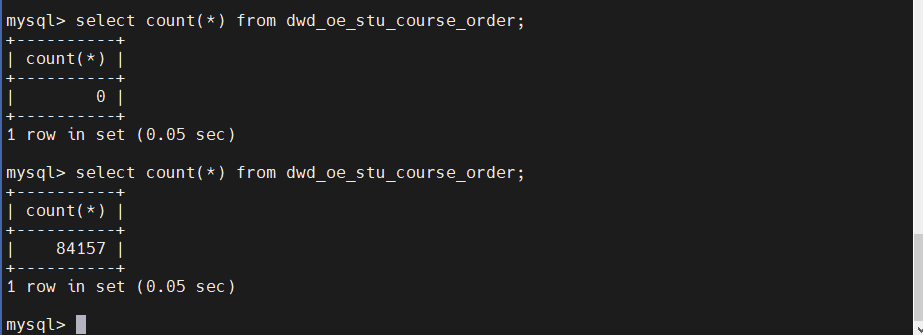

### Hudi DWS层实现

#### 数据流图

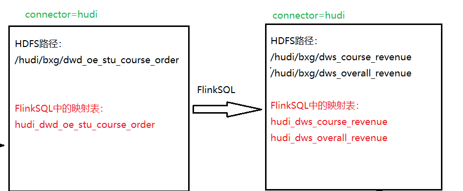

#### 操作步骤

~~~shell
1.在FlinkSQL创建映射表
2.拉起数据任务
3.HDFS、Hive校验
~~~


#### 具体实现

##### 在FlinkSQL中创建映射表

~~~sql
CREATE TABLE if not exists hudi_dws_course_revenue(
    `course_id` int,
    `date` string,
    `total_cnt` bigint,
    `toatal_money` decimal(38,4),
    `avg` decimal(38,4),
    `stu_course_order_status` string,
    PRIMARY KEY (`course_id`,`date`) NOT ENFORCED
) WITH(
    'connector'='hudi'
    ,'path'= 'hdfs://node1:8020/hudi/bxg/dws_course_revenue'
    ,'hoodie.datasource.write.recordkey.field'= '`course_id`,`date`'
    ,'write.tasks'= '1'
    ,'compaction.tasks'= '1'
    ,'write.rate.limit'= '2000'
    ,'table.type'= 'MERGE_ON_READ'
    ,'compaction.async.enabled'= 'true'
    ,'compaction.trigger.strategy'= 'num_commits'
    ,'compaction.delta_commits'= '1'
    ,'changelog.enabled'= 'true'
    ,'read.tasks' = '3'
    ,'read.streaming.enabled'= 'true'
    ,'read.start-commit'='earliest'
    ,'read.streaming.check-interval'= '3'
    ,'hive_sync.enable'= 'true'
    ,'hive_sync.mode'= 'hms'
    ,'hive_sync.metastore.uris'= 'thrift://node1:9083'
    ,'hive_sync.table'= 'dws_course_revenue'
    ,'hive_sync.db'= 'bxg'
    ,'hive_sync.username'= ''
    ,'hive_sync.password'= ''
    ,'hive_sync.support_timestamp'= 'true'
);


CREATE TABLE if not exists hudi_dws_overall_revenue (
    `course_id` int,
    `course_name` string,
    `paid_count` bigint,
    `paid_amount` decimal(38,4),
    PRIMARY KEY (`course_id`) NOT ENFORCED
) WITH(
    'connector'='hudi'
    ,'path'= 'hdfs://node1:8020/hudi/bxg/dws_overall_revenue'
    ,'hoodie.datasource.write.recordkey.field'= '`course_id`'
    ,'write.tasks'= '1'
    ,'compaction.tasks'= '1'
    ,'write.rate.limit'= '2000'
    ,'table.type'= 'MERGE_ON_READ'
    ,'compaction.async.enabled'= 'true'
    ,'compaction.trigger.strategy'= 'num_commits'
    ,'compaction.delta_commits'= '1'
    ,'changelog.enabled'= 'true'
    ,'read.tasks' = '3'
    ,'read.streaming.enabled'= 'true'
    ,'read.start-commit'='earliest'
    ,'read.streaming.check-interval'= '3'
    ,'hive_sync.enable'= 'true'
    ,'hive_sync.mode'= 'hms'
    ,'hive_sync.metastore.uris'= 'thrift://node1:9083'
    ,'hive_sync.table'= 'dws_overall_revenue'
    ,'hive_sync.db'= 'bxg'
    ,'hive_sync.username'= ''
    ,'hive_sync.password'= ''
    ,'hive_sync.support_timestamp'= 'true'
);
~~~

##### 拉起数据任务

~~~sql
INSERT INTO hudi_dws_course_revenue
SELECT
    ifnull(course_id,-1) as course_id,
    '合计' AS `date`,
    count(1) AS `total_cnt`,
    CASE WHEN count(1) >0 THEN sum(paid_amount) ELSE 0 END  AS  `toatal_money`,
    CASE WHEN count(1) >0 THEN sum(paid_amount) / if(count(1)<=0,1,count(1)) ELSE 0 END AS `avg`,
    CONCAT('【',cast(course_id as string),'】',grade_name)  as  `stu_course_order_status`
FROM hudi_dwd_oe_stu_course_order
WHERE is_complete_order = true
  AND stu_course_status not in (8)
GROUP BY course_id,grade_name

union

select
    ifnull(course_id,-1) as course_id,
    ifnull(date_format(pay_time, 'yyyy/MM/dd'),'-1') as `date`,
    count(1) AS `total_cnt`,
    CASE WHEN count(1) > 0 THEN sum(paid_amount) ELSE 0 END AS `toatal_money`,
    CASE WHEN count(1) > 0 THEN sum(paid_amount) / if(count(1)=0,1,count(1)) ELSE 0 END AS `avg`,
    LISTAGG(stu_course_status_des) as `stu_course_order_status`
from hudi_dwd_oe_stu_course_order
WHERE is_complete_order is true
group by course_id,date_format(pay_time, 'yyyy/MM/dd');


INSERT INTO hudi_dws_overall_revenue
SELECT
    ifnull(course_id,-1) as course_id,
    grade_name AS `course_name`,
    COUNT(CASE WHEN (is_complete_order is true AND refund_status not in (-1))
                   THEN order_id
               ELSE null
        END)  AS `paid_count`,
    SUM(CASE WHEN (is_complete_order is true AND refund_status not in (-1))
                 THEN paid_amount
             ELSE null
        END) AS  `paid_amount`
FROM hudi_dwd_oe_stu_course_order
GROUP BY course_id,grade_name;
~~~

### Doris DWS层实现

#### 数据流图

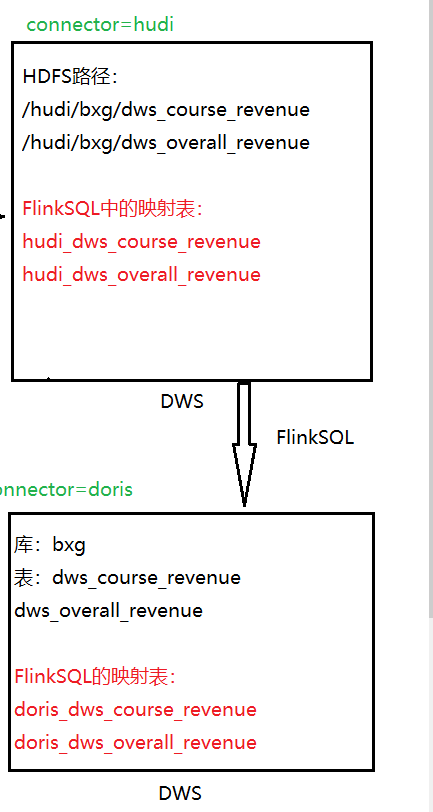

#### 操作步骤

~~~shell
1.在Doris中创建物理表
2.在FlinkSQL中创建Doris的映射表
3.在FlinkSQL中拉起数据任务
4.在Doris中校验数据
~~~

#### 具体实现

##### 在Doris中创建物理表

~~~sql
CREATE TABLE IF NOT EXISTS bxg.dws_course_revenue
(
    `course_id` int,
    `date` varchar(255),
    `total_cnt` bigint,
    `toatal_money` decimal(27,4),
    `avg` decimal(27,4),
    `stu_course_order_status` string
) Unique Key (`course_id`,`date`)
DISTRIBUTED BY HASH(`course_id`) BUCKETS 10
PROPERTIES (
"replication_allocation" = "tag.location.default: 1"
);


CREATE TABLE IF NOT EXISTS bxg.dws_overall_revenue
(
    `course_id` int,
    `course_name` string,
    `paid_count` bigint,
    `paid_amount` decimal(27,4)
) Unique Key (`course_id`)
DISTRIBUTED BY HASH(`course_id`) BUCKETS 10
PROPERTIES (
"replication_allocation" = "tag.location.default: 1"
);
~~~

##### 在FlinkSQL中创建映射表

~~~sql
CREATE TABLE if not exists doris_dws_course_revenue(
    `course_id` int,
    `date` string,
    `total_cnt` bigint,
    `toatal_money` decimal(38,4),
    `avg` decimal(38,4),
    `stu_course_order_status` string,
    PRIMARY KEY (`course_id`,`date`) NOT ENFORCED
) WITH (
    'fenodes' = 'node1:8030'
    ,'table.identifier' = 'bxg.dws_course_revenue'
    ,'sink.enable-delete' = 'true'
    ,'sink.properties.strip_outer_array' = 'true'
    ,'sink.batch.size' = '2000'
    ,'password' = '123456'
    ,'connector' = 'doris'
    ,'sink.batch.interval' = '10s'
    ,'sink.max-retries' = '5'
    ,'sink.properties.format' = 'json'
    ,'username' = 'root'
);


CREATE TABLE if not exists doris_dws_overall_revenue(
    `course_id` int,
    `course_name` string,
    `paid_count` bigint,
    `paid_amount` decimal(38,4),
    PRIMARY KEY (`course_id`) NOT ENFORCED
) WITH (
    'fenodes' = 'node1:8030'
    ,'table.identifier' = 'bxg.dws_overall_revenue'
    ,'sink.enable-delete' = 'true'
    ,'sink.properties.strip_outer_array' = 'true'
    ,'sink.batch.size' = '2000'
    ,'password' = '123456'
    ,'connector' = 'doris'
    ,'sink.batch.interval' = '10s'
    ,'sink.max-retries' = '5'
    ,'sink.properties.format' = 'json'
    ,'username' = 'root'
);
~~~

##### 在FlinkSQL中拉起数据任务

~~~sql
insert into doris_dws_course_revenue
select `course_id`, `date`, `total_cnt`, `toatal_money`, `avg`, `stu_course_order_status`
from hudi_dws_course_revenue;


insert into doris_dws_overall_revenue
select `course_id`, `course_name`,`paid_count`,`paid_amount`
from hudi_dws_overall_revenue;
~~~

## 营收业绩整体情况分析看板

### 需求

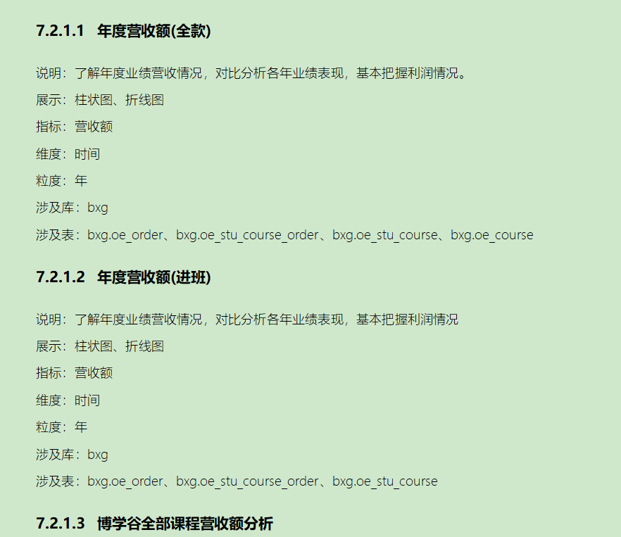

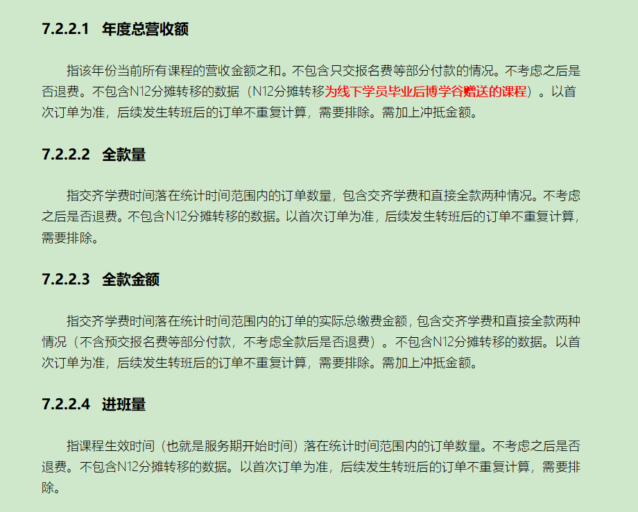

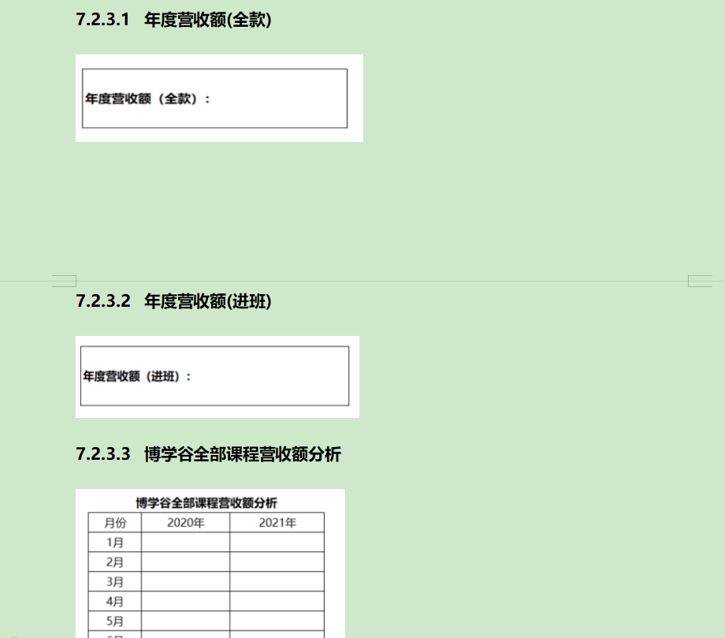

### ODS层实现

#### 数据流图

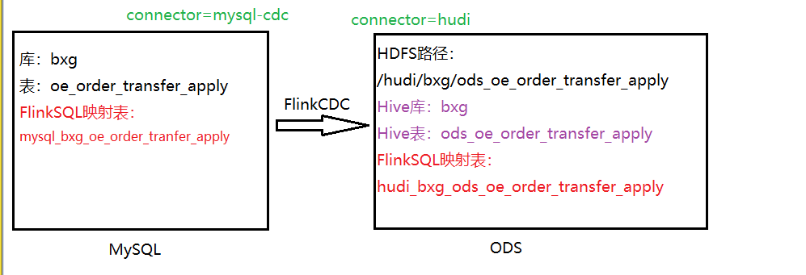

#### 操作步骤

~~~shell
（1）在MySQL中准备库、表、数据
（2）在FlinkSQL创建MySQL的映射表
（3）在FlinkSQL创建Hudi的映射表
（4）在FlinkSQL拉起数据任务
（5）在HDFS、Hive校验数据
~~~

#### 实现

##### 在MySQL中准备库、表、数据

~~~sql
不需要准备，数据已经有了。
~~~

##### 在FlinkSQL创建MySQL的映射表

~~~sql
CREATE TABLE if not exists mysql_bxg_oe_order_transfer_apply (
  `id` INT,
  `order_id` STRING,
  `order_detail_id` STRING,
  `deposit_id` STRING,
  `cash_back_record_id` INT,
  `student_id` STRING,
  `course_id` INT,
  `stu_course_id` INT,
  `order_refund_id` INT,
  `original_stu_course_status` TINYINT,
  `original_order_refund_status` TINYINT,
  `biz_type` TINYINT,
  `oa_affair_id` STRING,
  `oa_summary_id` STRING,
  `oa_template_code` STRING,
  `oa_template_id` STRING,
  `oa_bill_no` STRING,
  `fee_transfer_type` TINYINT,
  `amount` DECIMAL(10,2),
  `status` TINYINT,
  `order_type` TINYINT,
  `target_order_id` STRING,
  `target_order_detail_id` STRING,
  `target_import_order_id` INT,
  `target_order_type` TINYINT,
  `creator` STRING,
  `creator_name` STRING,
  `create_time` TIMESTAMP(3),
  `update_time` TIMESTAMP(3),
  `delete_flag` BOOLEAN,
PRIMARY KEY (`id`) NOT ENFORCED
 ) WITH (
          'connector'= 'mysql-cdc',
          'hostname'= 'node1',
          'port'= '3306',
          'username'= 'root',
          'password'='123456',
          'server-time-zone'= 'Asia/Shanghai',
          'debezium.snapshot.mode'='initial',
          'database-name'= 'bxg',
          'table-name'= 'oe_order_transfer_apply'
          );
~~~

##### 在FlinkSQL创建Hudi的映射表

~~~sql
CREATE TABLE IF NOT EXISTS `hudi_bxg_ods_oe_order_transfer_apply` (
   `id` INT,
  `order_id` STRING,
  `order_detail_id` STRING,
  `deposit_id` STRING,
  `cash_back_record_id` INT,
  `student_id` STRING,
  `course_id` INT,
  `stu_course_id` INT,
  `order_refund_id` INT,
  `original_stu_course_status` INT,
  `original_order_refund_status` INT,
  `biz_type` INT,
  `oa_affair_id` STRING,
  `oa_summary_id` STRING,
  `oa_template_code` STRING,
  `oa_template_id` STRING,
  `oa_bill_no` STRING,
  `fee_transfer_type` INT,
  `amount` DECIMAL(10,2),
  `status` INT,
  `order_type` INT,
  `target_order_id` STRING,
  `target_order_detail_id` STRING,
  `target_import_order_id` INT,
  `target_order_type` INT,
  `creator` STRING,
  `creator_name` STRING,
  `create_time` TIMESTAMP(3),
  `update_time` TIMESTAMP(3),
  `delete_flag` BOOLEAN, 
  PRIMARY KEY ( `id` ) NOT ENFORCED
) WITH(
     'connector'='hudi'
    ,'path'= 'hdfs://node1:8020/hudi/bxg/ods_oe_order_transfer_apply'
    ,'hoodie.datasource.write.recordkey.field'= 'id' 
    ,'write.tasks'= '1'
    ,'compaction.tasks'= '1'
    ,'write.rate.limit'= '2000' 
    ,'table.type'= 'MERGE_ON_READ' 
    ,'compaction.async.enabled'= 'true' 
    ,'compaction.trigger.strategy'= 'num_commits' 
    ,'compaction.delta_commits'= '1'
    ,'changelog.enabled'= 'true' 
    ,'read.tasks' = '1'
    ,'read.streaming.enabled'= 'true' 
    ,'read.start-commit'='earliest'
    ,'read.streaming.check-interval'= '3'
    ,'hive_sync.enable'= 'true' 
    ,'hive_sync.mode'= 'hms' 
    ,'hive_sync.metastore.uris'= 'thrift://node1:9083'
    ,'hive_sync.table'= 'ods_oe_order_transfer_apply'
    ,'hive_sync.db'= 'bxg' 
    ,'hive_sync.username'= '' 
    ,'hive_sync.password'= '' 
    ,'hive_sync.support_timestamp'= 'true' 
);
~~~

##### 在FlinkSQL拉起数据任务

~~~sql
INSERT INTO `hudi_bxg_ods_oe_order_transfer_apply` 
SELECT `id`,`order_id` ,`order_detail_id`,`deposit_id`,`cash_back_record_id` ,`student_id` ,`course_id`,`stu_course_id` ,`order_refund_id` ,`original_stu_course_status` ,`original_order_refund_status` ,`biz_type`,`oa_affair_id`,`oa_summary_id` ,`oa_template_code` ,`oa_template_id`,`oa_bill_no`,`fee_transfer_type` ,`amount`,`status`,`order_type` ,`target_order_id`,`target_order_detail_id` ,`target_import_order_id`,`target_order_type` ,`creator` ,`creator_name`,`create_time`,`update_time`,`delete_flag`
FROM `mysql_bxg_oe_order_transfer_apply`;
~~~

##### 在HDFS、Hive校验数据

HDFS中校验

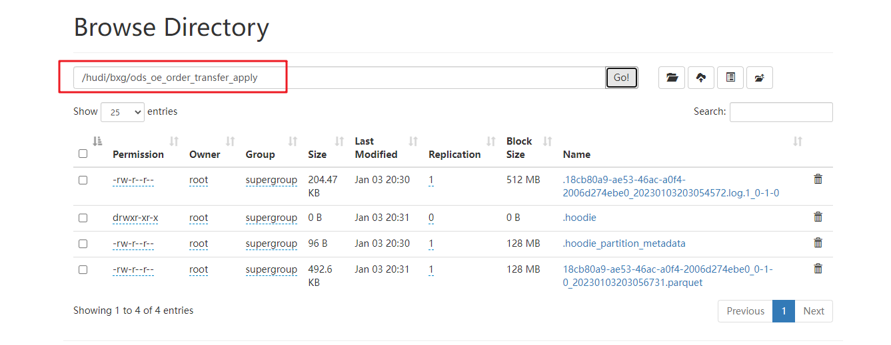

Hive中校验

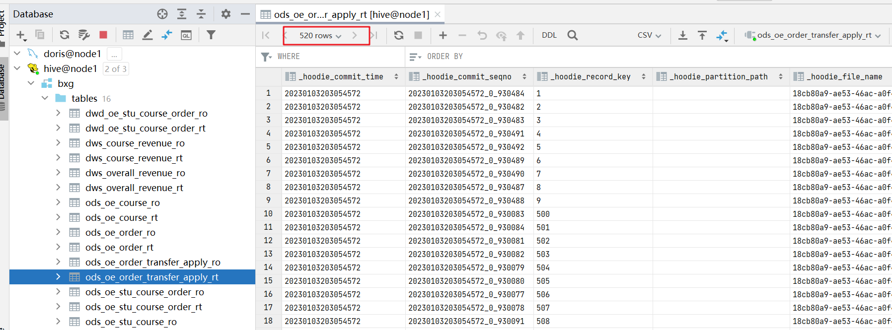

MySQL中校验

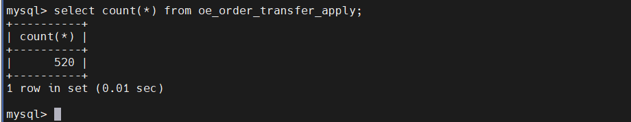

### DWD层实现（Hudi）

#### 数据流图

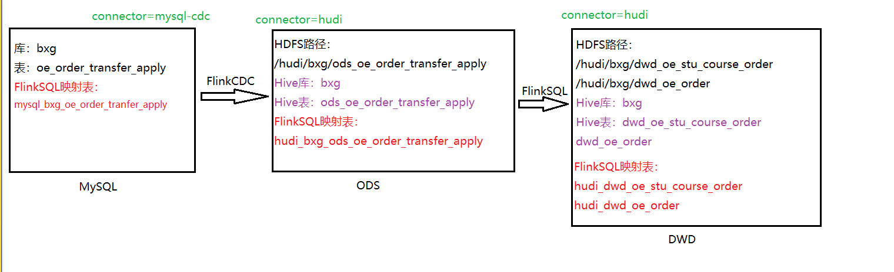

#### 操作步骤

~~~shell
（1）在FlinkSQL创建DWD层的映射表（2张表）
（2）在FlinkSQL拉起数据任务（2个任务）
（3）在HDFS、Hive校验数据
~~~

#### 实现

##### 在FlinkSQL创建DWD层的映射表

~~~sql
CREATE TABLE if not exists hudi_dwd_oe_stu_course_order (
     `id` int,
     `stu_course_id` int,
     `order_id` string,
     `course_id` int,
     `stu_course_status` int,
`stu_course_status_des` string,
     `stu_course_delete_flag` BOOLEAN,
`effective_date` TIMESTAMP(3),
`payable_amount` decimal(10,2),
`pay_status` int,
`pay_time` TIMESTAMP(3),
`paid_amount` decimal(10,2),
`refund_status` int,
`order_delete_flag` boolean,
`grade_name` string,
`course_type` INT,
`is_complete_order` boolean,
PRIMARY KEY (`id`) NOT ENFORCED
) WITH(
    'connector'='hudi'
    ,'path'= 'hdfs://node1:8020/hudi/bxg/dwd_oe_stu_course_order'
    ,'hoodie.datasource.write.recordkey.field'= 'id' 
    ,'write.tasks'= '1'
    ,'compaction.tasks'= '1'
    ,'write.rate.limit'= '2000' 
    ,'table.type'= 'MERGE_ON_READ' 
    ,'compaction.async.enabled'= 'true' 
    ,'compaction.trigger.strategy'= 'num_commits' 
    ,'compaction.delta_commits'= '1'
    ,'changelog.enabled'= 'true' 
    ,'read.tasks' = '1'
    ,'read.streaming.enabled'= 'true' 
    ,'read.start-commit'='earliest'
    ,'read.streaming.check-interval'= '3'
    ,'hive_sync.enable'= 'true' 
    ,'hive_sync.mode'= 'hms' 
    ,'hive_sync.metastore.uris'= 'thrift://node1:9083'
    ,'hive_sync.table'= 'dwd_oe_stu_course_order'
    ,'hive_sync.db'= 'bxg' 
    ,'hive_sync.username'= '' 
    ,'hive_sync.password'= '' 
    ,'hive_sync.support_timestamp'= 'true' 
);


CREATE TABLE if not exists hudi_dwd_oe_order (
    `id` STRING,
    `channel` STRING,
    `student_id` STRING,
    `order_no` STRING,
    `total_amount` DECIMAL(10,2),
    `discount_amount` DECIMAL(10,2),
    `charge_against_amount` DECIMAL(10,2),
    `payable_amount` DECIMAL(10,2),
    `status` INT,
    `pay_status` INT,
    `pay_time` TIMESTAMP(3),
    `paid_amount` DECIMAL(10,2),
    `effective_date` TIMESTAMP(3),
    `terminal` INT,
    `refund_status` INT,
    `refund_amount` DECIMAL(10,2),
    `refund_time` TIMESTAMP(3),
    `create_time` TIMESTAMP(3),
    `update_time` TIMESTAMP(3),
    `delete_flag` BOOLEAN,
    `is_target_order` BOOLEAN,
PRIMARY KEY (`id`) NOT ENFORCED
) WITH(
    'connector'='hudi'
    ,'path'= 'hdfs://node1:8020/hudi/bxg/dwd_oe_order'
    ,'hoodie.datasource.write.recordkey.field'= 'id' 
    ,'write.tasks'= '1'
    ,'compaction.tasks'= '1'
    ,'write.rate.limit'= '2000' 
    ,'table.type'= 'MERGE_ON_READ' 
    ,'compaction.async.enabled'= 'true' 
    ,'compaction.trigger.strategy'= 'num_commits' 
    ,'compaction.delta_commits'= '1'
    ,'changelog.enabled'= 'true' 
    ,'read.tasks' = '1'
    ,'read.streaming.enabled'= 'true' 
    ,'read.start-commit'='earliest'
    ,'read.streaming.check-interval'= '3'
    ,'hive_sync.enable'= 'true' 
    ,'hive_sync.mode'= 'hms' 
    ,'hive_sync.metastore.uris'= 'thrift://node1:9083'
    ,'hive_sync.table'= 'dwd_oe_order'
    ,'hive_sync.db'= 'bxg' 
    ,'hive_sync.username'= '' 
    ,'hive_sync.password'= '' 
    ,'hive_sync.support_timestamp'= 'true' 
);
~~~

##### 在FlinkSQL拉起数据任务

~~~sql
insert into hudi_dwd_oe_stu_course_order
SELECT
    `osco`.`id`,
    `osco`.`student_course_id`,
    `osco`.`order_id`,
    `osc`.`course_id`,
`osc`.`status` as `stu_course_status`,
case `osc`.`status` when 0 then '试学' when 1 then '生效' when 2 then '待生效' when -1 then '停课' else '退费' end as `stu_course_status_des`,
    `osc`.`delete_flag` as `stu_course_delete_flag`,
`osc`.`effective_date`,
    `oo`.`payable_amount`,
    `oo`.`pay_status`,
    `oo`.`pay_time`,
    `oo`.`paid_amount`,
    `oo`.`refund_status`,
    `oo`.`delete_flag` as `order_delete_flag`,
    `oc`.`grade_name`,
`oc`.`course_type`,
    if (oo.`payable_amount`>0 and `oo`.`pay_status`=2 and `oo`.`delete_flag` = false and `osc`.`delete_flag` = false, true, false) as is_complete_order
FROM hudi_bxg_ods_oe_stu_course_order AS osco
LEFT JOIN hudi_bxg_ods_oe_stu_course AS osc
ON osc.id = osco.student_course_id
LEFT JOIN hudi_bxg_ods_oe_order AS oo
ON oo.id = osco.order_id
LEFT JOIN hudi_bxg_ods_oe_course AS oc
ON oc.id = osc.course_id;


CREATE VIEW IF NOT EXISTS bxg_common_change_classes_v AS SELECT distinct(target_order_id) FROM hudi_bxg_ods_oe_order_transfer_apply t  WHERE t.biz_type = 1 AND t.status = 0 AND t.fee_transfer_type=0 AND t.delete_flag = false;


insert into hudi_dwd_oe_order
SELECT
    `id`, `channel`, `student_id`, `order_no`, `total_amount`, `discount_amount`, `charge_against_amount`, `payable_amount`, `status`, `pay_status`, `pay_time`, `paid_amount`, `effective_date`, `terminal`, `refund_status`, `refund_amount`, `refund_time`, `create_time`,`update_time`, `delete_flag`,
if (`ccv`.`target_order_id` is not null, true, false) AS `is_target_order`
FROM hudi_bxg_ods_oe_order AS oo
LEFT JOIN `bxg_common_change_classes_v` AS `ccv`
    ON `oo`.`id`=`ccv`.`target_order_id`;
~~~

##### 在HDFS、Hive校验

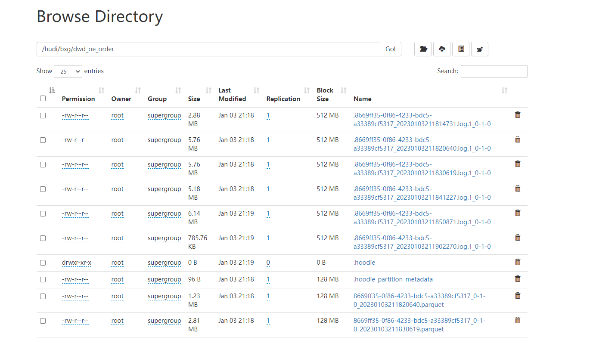

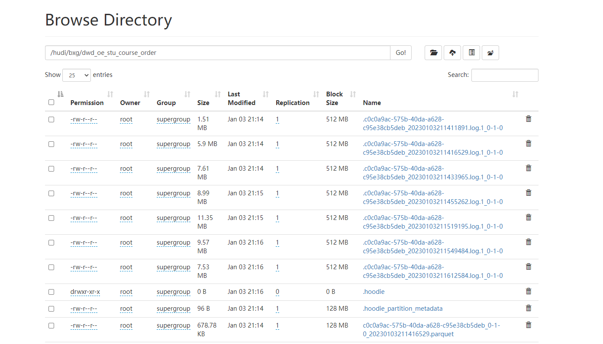

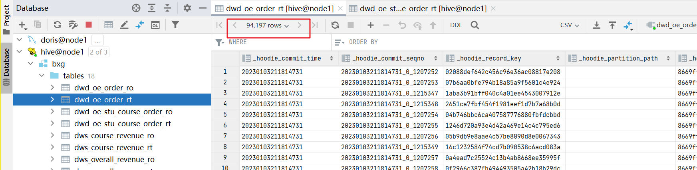

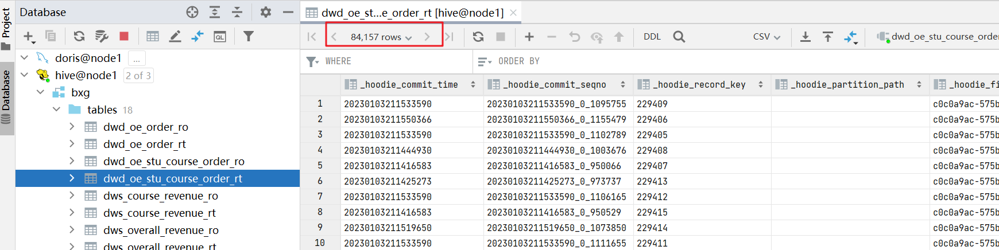

### DWD层实现（Doris）

#### 数据流图

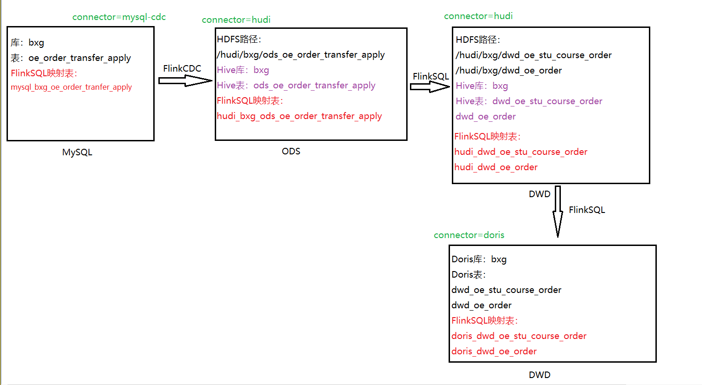

#### 操作步骤

~~~sql
（1）在Doris创建库、表（2张表）
（2）在FlinkSQL创建Doris的映射表（2张表）
（3）在FlinkSQL拉起数据任务（2个任务）
（4）在Doris校验数据
~~~

#### 实现

##### 在Doris创建库、表（2张表）

~~~sql
CREATE TABLE IF NOT EXISTS bxg.dwd_oe_stu_course_order
(
   `id` int,
   `stu_course_id` int COMMENT '学员课程id',
   `order_id` string,
   `course_id` int COMMENT '学员购买的课程',
   `stu_course_status` int COMMENT '学员课程状态：0试学、1生效、2待生效、-1停课、8退费',
`stu_course_status_des` string COMMENT '学员课程状态描述：0试学、1生效、2待生效、-1停课、8退费',
   `stu_course_delete_flag` BOOLEAN,
`effective_date` datetime,
   `payable_amount` decimal(10,2) COMMENT '实际应付总金额=原价-优惠总额-冲抵金额',
   `pay_status` int  COMMENT '支付状态：0未支付、1部分支付、2支付完成',
   `pay_time` datetime COMMENT '最后支付完成时间',
   `paid_amount` decimal(10,2) COMMENT '当前已付总额',
   `refund_status` INT COMMENT '退费状态:0-未退费;-1-已退费;-2-退费中;-3-部分退费',
   `order_delete_flag` BOOLEAN COMMENT 'ods_bxg_oe_order表中订单是否删除',
   `grade_name` string COMMENT '课程名称',
`course_type`  int,
   `is_complete_order` BOOLEAN COMMENT '实际应付总金额0且支付状态pay_status完成'
) Unique Key (`id`)
DISTRIBUTED BY HASH(`id`) BUCKETS 10
PROPERTIES (
"replication_allocation" = "tag.location.default: 1"
);


CREATE TABLE  if not exists bxg.`dwd_oe_order` (
    `id` varchar(32) NOT NULL,
    `channel` string NOT NULL COMMENT '订单渠道来源：BXG/博学谷，目前只有博学谷，将来可能会有黑马短训、酷丁鱼等',
    `student_id` string NOT NULL COMMENT '用户ID',
    `order_no` string NOT NULL COMMENT '订单号，生成规则：年（2位）-月（2位）-日（2位）-时（2位）-随机码（12位） eg.16110910aRdK45Y86qe3',
    `total_amount` decimal(10,2) NOT NULL DEFAULT '0.00' COMMENT '原价/总价',
    `discount_amount` decimal(10,2) NOT NULL DEFAULT '0.00' COMMENT '优惠总额，有可能是优惠券优惠、也有可能是满减优惠',
    `charge_against_amount` decimal(10,2) NOT NULL DEFAULT '0.00' COMMENT '冲抵金额，目前包含报名费',
    `payable_amount` decimal(10,2) NOT NULL DEFAULT '0.00' COMMENT '实际应付总金额=原价-优惠总额-冲抵金额',
    `status` int NOT NULL DEFAULT '0' COMMENT '订单状态：0未生效、1已生效、-1已关闭。和订单支付状态区分开，因为在某些情况下学员没有支付完成订单也已经开始生效。“-1已关闭”状态代表已退费和超时关闭两种含义。',
    `pay_status` int NOT NULL COMMENT '支付状态：0未支付、1部分支付、2支付完成',
    `pay_time` datetime DEFAULT NULL COMMENT '最后支付完成时间',
    `paid_amount` decimal(10,2) NOT NULL DEFAULT '0.00' COMMENT '当前已付总额',
    `effective_date` datetime DEFAULT NULL COMMENT '订单生效日期。从该日期开始计算服务期。',
    `terminal` int NOT NULL DEFAULT '0' COMMENT '下单订单终端：0/PC官网、1/后台导入-其他、2/App、3/移动官网、4微信内、5/后台导入-线下转线上、6/ios、7/补录-系统-N12分摊转移、8/小程序(在线编程)',
    `refund_status` int NOT NULL DEFAULT '0' COMMENT '退费状态:0-未退费;-1-已退费;-2-退费中;-3-部分退费',
    `refund_amount` decimal(10,2) NOT NULL DEFAULT '0.00' COMMENT '退费金额',
`refund_time` datetime DEFAULT NULL COMMENT '最后退费时间',
`create_time` datetime NOT NULL COMMENT '物理入库时间，如果是补录订单，该时间为补录订单的日期，而不是学员真实缴费的日期。',
    `update_time` datetime NOT NULL,
`delete_flag` boolean NOT NULL,
`is_target_order` boolean
    )  UNIQUE KEY(`id`)
    COMMENT '订单：主订单'
    DISTRIBUTED BY HASH(`id`) BUCKETS 10
    PROPERTIES (
        "replication_allocation" = "tag.location.default: 1"
               );
~~~

##### 在FlinkSQL创建Doris的映射表（2张表）

~~~sql
CREATE TABLE if not exists doris_dwd_oe_stu_course_order (
     `id` int,
     `stu_course_id` int,
     `order_id` string,
     `course_id` int,
     `stu_course_status` int,
`stu_course_status_des` string,
     `stu_course_delete_flag` BOOLEAN,
`effective_date` TIMESTAMP(3),
     `payable_amount` decimal(10,2),
     `pay_status` int,
     `pay_time` TIMESTAMP(3),
     `paid_amount` decimal(10,2),
     `refund_status` int,
     `order_delete_flag` boolean,
     `grade_name` string,
`course_type` INT,
     `is_complete_order` boolean,
     PRIMARY KEY (`id`) NOT ENFORCED
) WITH (
    'fenodes' = 'node1:8030'
    ,'table.identifier' = 'bxg.dwd_oe_stu_course_order'
    ,'sink.enable-delete' = 'true'
    ,'sink.properties.strip_outer_array' = 'true'
    ,'sink.batch.size' = '2000'
    ,'password' = '123456'
    ,'connector' = 'doris'
    ,'sink.batch.interval' = '10s'
    ,'sink.max-retries' = '5'
    ,'sink.properties.format' = 'json'
    ,'username' = 'root'
);


CREATE TABLE if not exists doris_dwd_oe_order (
                                                `id` STRING,
    `channel` STRING,
    `student_id` STRING,
    `order_no` STRING,
    `total_amount` DECIMAL(10,2),
    `discount_amount` DECIMAL(10,2),
    `charge_against_amount` DECIMAL(10,2),
    `payable_amount` DECIMAL(10,2),
    `status` INT,
    `pay_status` INT,
    `pay_time` TIMESTAMP(3),
    `paid_amount` DECIMAL(10,2),
    `effective_date` TIMESTAMP(3),
    `terminal` INT,
    `refund_status` INT,
    `refund_amount` DECIMAL(10,2),
`refund_time` TIMESTAMP(3),
`create_time` TIMESTAMP(3),
    `update_time` TIMESTAMP(3),
`delete_flag` BOOLEAN,
`is_target_order` BOOLEAN,
    PRIMARY KEY (id) NOT ENFORCED
    ) WITH (
          'fenodes' = '192.168.88.161:8030'
          ,'table.identifier' = 'bxg.dwd_oe_order'
          ,'sink.enable-delete' = 'true'
          ,'sink.properties.strip_outer_array' = 'true'
          ,'sink.batch.size' = '2000'
          ,'password' = '123456'
          ,'connector' = 'doris'
          ,'sink.batch.interval' = '10s'
          ,'sink.max-retries' = '5'
          ,'sink.properties.format' = 'json'
          ,'username' = 'root'
          );

~~~

##### 在FlinkSQL拉起数据任务（2个任务）

~~~sql
INSERT INTO doris_dwd_oe_stu_course_order SELECT `id`,`stu_course_id`, `order_id`,`course_id`,`stu_course_status`,`stu_course_status_des`,`stu_course_delete_flag`, `effective_date`,`payable_amount`,`pay_status`,`pay_time`,`paid_amount`,`refund_status`, `order_delete_flag`, `grade_name`, `course_type`,`is_complete_order`
FROM hudi_dwd_oe_stu_course_order;


INSERT INTO `doris_dwd_oe_order` SELECT  `id`, `channel`, `student_id`, `order_no`, `total_amount`, `discount_amount`, `charge_against_amount`, `payable_amount`, `status`, `pay_status`, `pay_time`, `paid_amount`, `effective_date`, `terminal`, `refund_status`, `refund_amount`, `refund_time`,`create_time`,`update_time`, `delete_flag` , `is_target_order`
FROM hudi_dwd_oe_order;
~~~

##### 在Doris校验数据

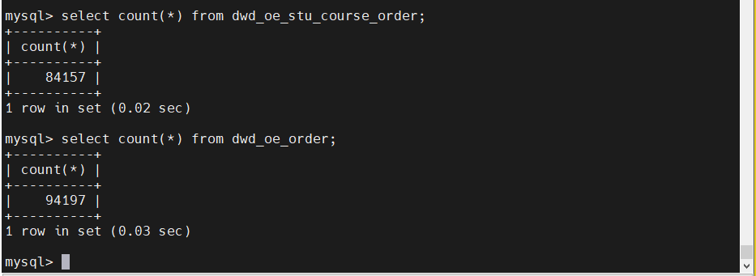

### DWS层实现（Hudi）

#### 数据流图

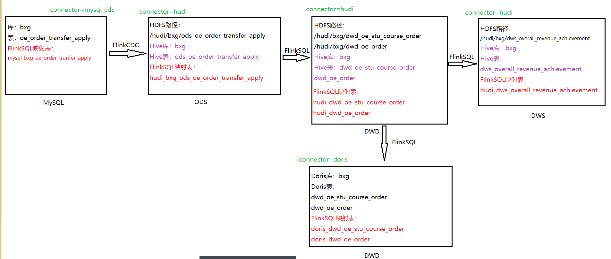

#### 操作步骤

~~~shell
（1）在FlinkSQL创建DWS层映射表
（2）在FlinkSQL拉起数据任务
（3）在HDFS、Hive校验
~~~

##### 在FlinkSQL创建DWS层映射表

~~~sql
CREATE TABLE if not exists hudi_dws_overall_revenue_achievement(
course_id INT,
`year` BIGINT,
`mon` BIGINT,
eff_year BIGINT,
eff_mon BIGINT,
course_type int,
`stu_course_delete_flag` BOOLEAN,
`stu_course_status` INT,
 grade_name STRING,
`sm` decimal(38,6),
`cnt` BIGINT,
 PRIMARY KEY (course_id,`year`,`mon`,eff_year,eff_mon,course_type,stu_course_delete_flag,stu_course_status) NOT ENFORCED
) WITH(
    'connector'='hudi'
    ,'path'= 'hdfs://node1:8020/hudi/bxg/dws_overall_revenue_achievement'
    ,'hoodie.datasource.write.recordkey.field'= 'course_id,`year`,`mon`,eff_year,eff_mon,course_type,stu_course_delete_flag,stu_course_status'
    ,'write.tasks'= '1'
    ,'compaction.tasks'= '1'
    ,'write.rate.limit'= '2000'
    ,'table.type'= 'MERGE_ON_READ'
    ,'compaction.async.enabled'= 'true'
    ,'compaction.trigger.strategy'= 'num_commits'
    ,'compaction.delta_commits'= '1'
    ,'changelog.enabled'= 'true'
    ,'read.tasks' = '1'
    ,'read.streaming.enabled'= 'true'
    ,'read.start-commit'='earliest'
    ,'read.streaming.check-interval'= '3'
    ,'hive_sync.enable'= 'true'
    ,'hive_sync.mode'= 'hms'
    ,'hive_sync.metastore.uris'= 'thrift://node1:9083'
    ,'hive_sync.table'= 'dws_overall_revenue_achievement'
    ,'hive_sync.db'= 'bxg'
    ,'hive_sync.username'= ''
    ,'hive_sync.password'= ''
    ,'hive_sync.support_timestamp'= 'true'
);
~~~

##### 在FlinkSQL拉起数据任务

~~~sql
INSERT INTO hudi_dws_overall_revenue_achievement
SELECT
IFNULL(osco.course_id,-1) as course_id,
IFNULL(year(oo.pay_time),-1)   as  `year`,
IFNULL(month(oo.pay_time),-1) as `mon`,
IFNULL(year(osco.effective_date),-1) as eff_year,
IFNULL(month(osco.effective_date),-1) as eff_mon,
IFNULL(osco.course_type,-1) as course_type,
IFNULL(osco.`stu_course_delete_flag`,FALSE) as stu_course_delete_flag, 
IFNULL(osco.`stu_course_status`,-1) as stu_course_status,
osco.grade_name,
sum(oo.`payable_amount` + (CASE WHEN oo.`charge_against_amount` IS NOT null THEN oo.`charge_against_amount` ELSE 0 END))/ 10000  as `sm`,
count(oo.id)  as `cnt`
FROM
    `hudi_dwd_oe_order` oo
        LEFT JOIN  `hudi_dwd_oe_stu_course_order`  osco
            on  oo.`id` = osco.`order_id`
            WHERE 
-- 支付状态：支付完成
        oo.`pay_status` = 2
-- 未删除订单
  AND oo.`delete_flag` is FALSE 
-- 转班情况只取第一次的订单，转班后的订单不重复计算
  AND oo.`is_target_order` is FALSE 
-- 排除N12分摊转移
  AND oo.`terminal` not in (7)
-- 排除测试课
  AND osco.`course_id` NOT IN (555,1537) 
  GROUP BY year(oo.pay_time),month(oo.pay_time),year(osco.effective_date),month(osco.effective_date),
  osco.course_id,osco.grade_name,
osco.course_type,osco.`stu_course_delete_flag`,osco.`stu_course_status`;
~~~

##### HDFS、Hive校验数据

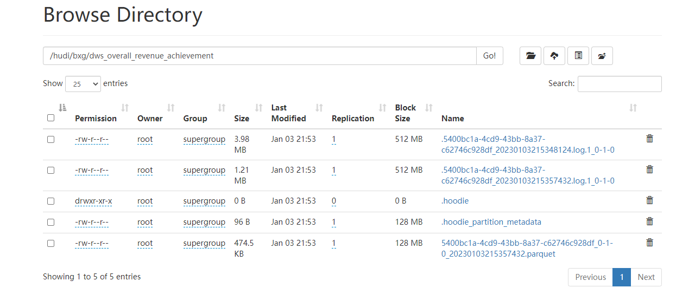

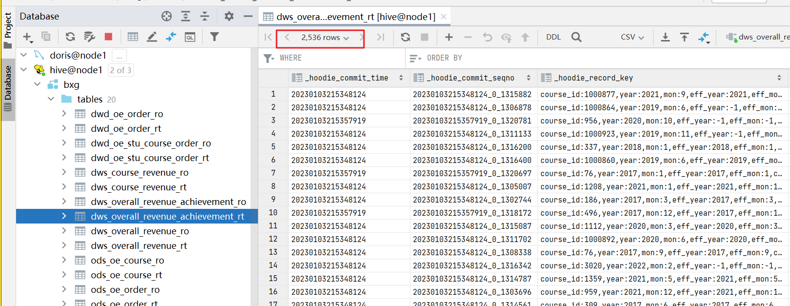

### DWS层实现（Doris）

#### 数据流图

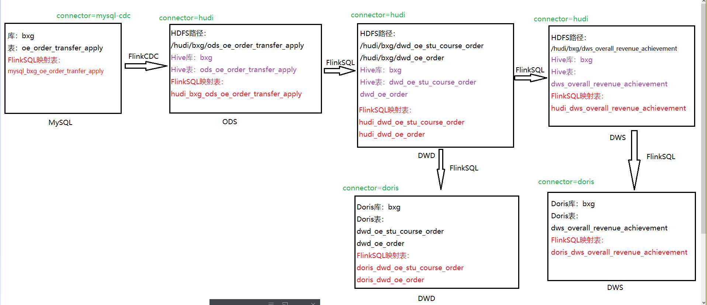

#### 操作步骤

~~~sql
（1）在Doris创建库、表
（2）在FlinkSQL创建Doris映射表
（3）在FlinkSQL拉起数据任务
（4）在Doris校验数据
~~~

##### 在Doris创建库、表

~~~sql
CREATE TABLE IF NOT EXISTS bxg.dws_overall_revenue_achievement
(
course_id INT,
`year` BIGINT,
`mon` BIGINT,
eff_year BIGINT,
eff_mon BIGINT,
course_type int,
`stu_course_delete_flag` BOOLEAN,
`stu_course_status` INT,
grade_name string,
`sm` decimal(27,6),
`cnt` BIGINT
) Unique Key (course_id,`year`,`mon`,eff_year,eff_mon,course_type,stu_course_delete_flag,stu_course_status)
DISTRIBUTED BY HASH(`course_id`) BUCKETS 10
PROPERTIES (
"replication_allocation" = "tag.location.default: 1"
);
~~~

##### 在FlinkSQL创建Doris映射表

~~~sql
CREATE TABLE if not exists doris_dws_overall_revenue_achievement (
course_id INT,
`year` BIGINT,
`mon` BIGINT,
eff_year BIGINT,
eff_mon BIGINT,
course_type int,
`stu_course_delete_flag` BOOLEAN,
`stu_course_status` INT,
grade_name string,
`sm` decimal(27,6),
`cnt` BIGINT,
 PRIMARY KEY (course_id,`year`,`mon`,eff_year,eff_mon,course_type,stu_course_delete_flag,stu_course_status) NOT ENFORCED
) WITH (
    'fenodes' = 'node1:8030'
    ,'table.identifier' = 'bxg.dws_overall_revenue_achievement'
    ,'sink.enable-delete' = 'true'
    ,'sink.properties.strip_outer_array' = 'true'
    ,'sink.batch.size' = '2000'
    ,'password' = '123456'
    ,'connector' = 'doris'
    ,'sink.batch.interval' = '10s'
    ,'sink.max-retries' = '5'
    ,'sink.properties.format' = 'json'
    ,'username' = 'root'
);
~~~

##### 在FlinkSQL拉起数据任务

~~~sql
INSERT INTO `doris_dws_overall_revenue_achievement` SELECT 
course_id,`year`,`mon`,eff_year ,eff_mon ,
course_type,`stu_course_delete_flag`,
`stu_course_status`,grade_name,`sm`,`cnt`
FROM hudi_dws_overall_revenue_achievement;
~~~

##### 在Doris校验数据

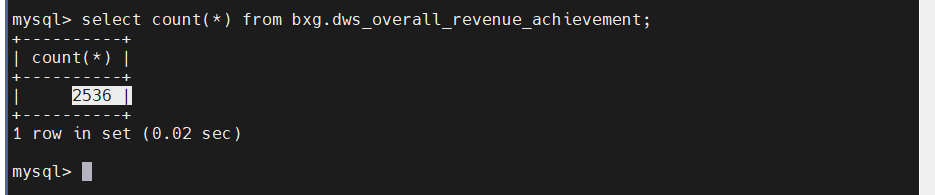


