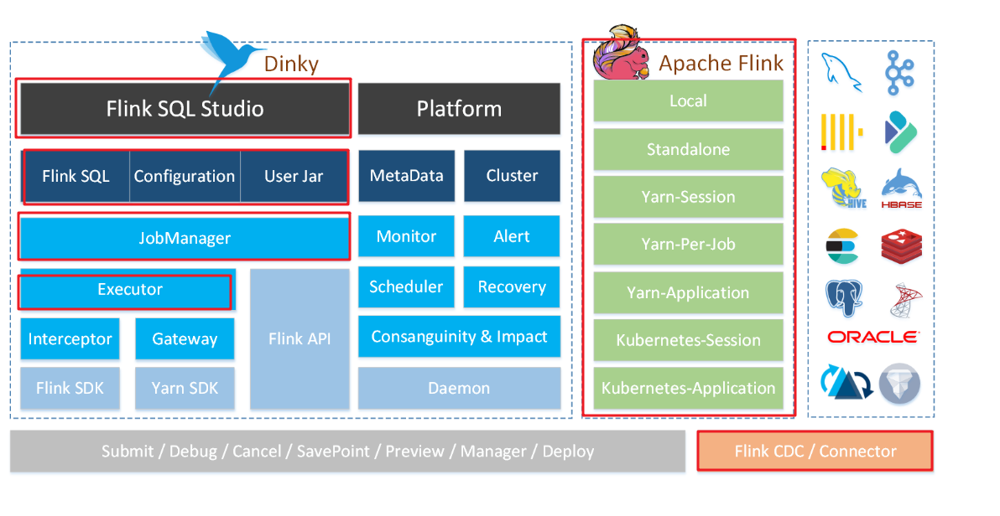
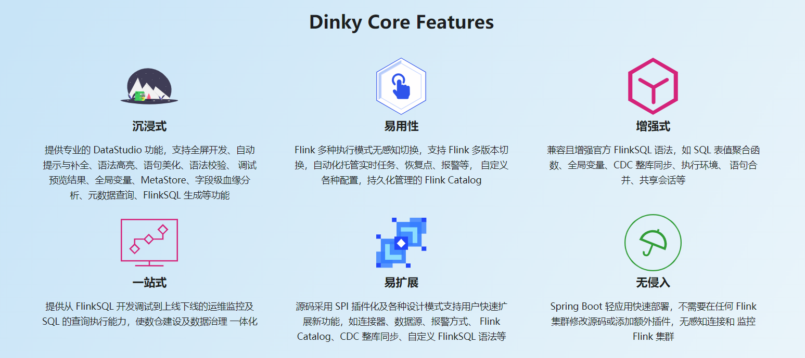
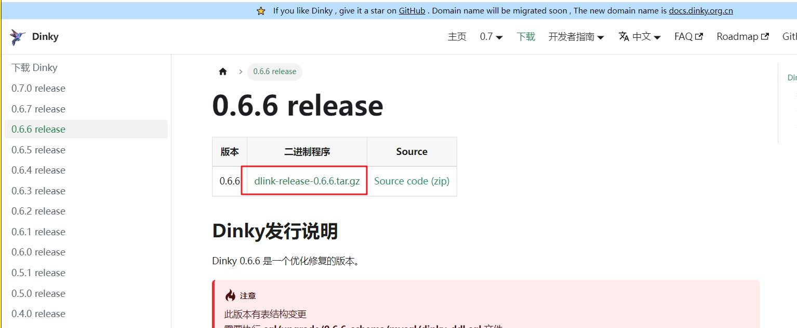
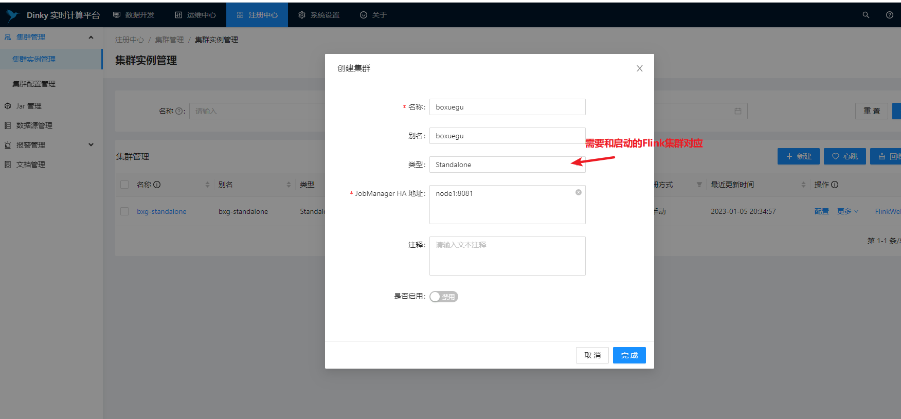
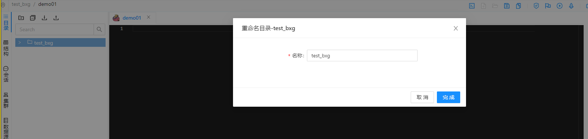
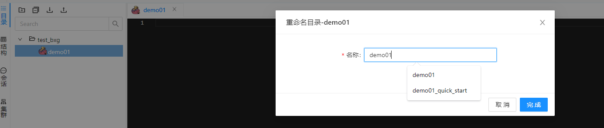
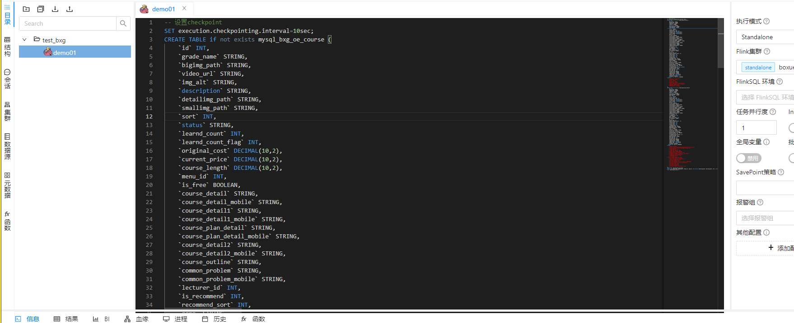
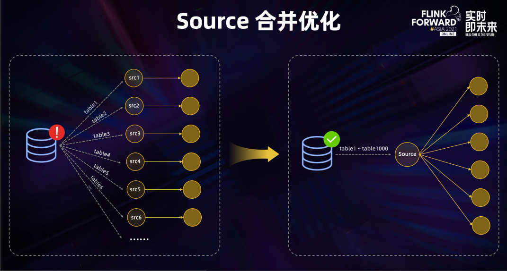
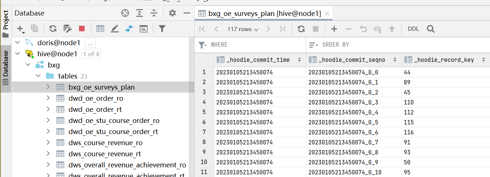
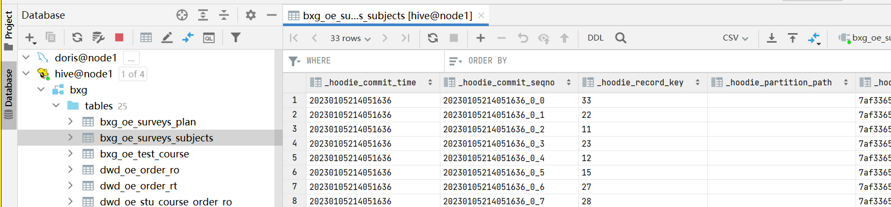

# 线上部署

## 为什么要学线上部署

1）FlinkSQL虽然可以满足开发需求，但是不方便运维，管理任务。比如说Flink集群需要升级、扩容等操作时，任务没办法暂停、重新运行。在8081 WebUI页面没办法完成这种类型的需求。

2）FlinkSQL开发需求时，对资源的消耗过于严重了。因为每个表需要一个任务来同步，如果业务库有几十上百张表，那么则需要几十上百个任务才能满足数据同步的需求。这还仅仅是从业务库到ODS层而已。

基于上述的原因，所以我们要学线上部署。

## Dinky介绍

### 简介

Dinky，不是Flink的一部分，也不是FlinkCDC的一部分，更不是Apache的一部分。它只是一个国内开发小工具而已，专门用来部署FlinkSQL任务的。

官网链接如下：

http://www.dlink.top/

### 架构

### 核心特性

### 功能

- 沉浸式 FlinkSQL 数据开发：自动提示补全、语法高亮、语句美化、在线调试、语法校验、执行计划、MetaStore、血缘分析、版本对比等
- 支持 FlinkSQL 多版本开发及多种执行模式：Local、Standalone、Yarn/Kubernetes Session、Yarn Per-Job、Yarn/Kubernetes Application
- 支持 Apache Flink 生态：Connector、FlinkCDC、Table Store 等
- 支持 FlinkSQL 语法增强：表值聚合函数、全局变量、执行环境、语句合并、整库同步等
- 支持 FlinkCDC 整库实时入仓入湖、多库输出、自动建表、模式演变
- 支持 Flink Java / Scala / Python UDF 开发与自动提交
- 支持 SQL 作业开发：ClickHouse、Doris、Hive、Mysql、Oracle、Phoenix、PostgreSql、Presto、SqlServer、StarRocks 等
- 支持实时在线调试预览 Table、 ChangeLog、统计图和 UDF
- 支持 Flink Catalog、数据源元数据在线查询及管理
- 支持自动托管的 SavePoint/CheckPoint 恢复及触发机制：最近一次、最早一次、指定一次等
- 支持实时任务运维：上线下线、作业信息、集群信息、作业快照、异常信息、数据地图、数据探查、历史版本、报警记录等
- 支持作为多版本 FlinkSQL Server 以及 OpenApi 的能力
- 支持实时作业报警及报警组：钉钉、微信企业号、飞书、邮箱等
- 支持多种资源管理：集群实例、集群配置、Jar、数据源、报警组、报警实例、文档、系统配置等
- 支持企业级管理功能：多租户、用户、角色、命名空间等
- 更多隐藏功能等待小伙伴们探索

## Dinky下载、安装、部署

### 下载

~~~shell
http://www.dlink.top/download/dinky-0.6.6
~~~

### 部署

#### 下载

~~~shell
tar -zxvf dlink-release-{version}.tar.gz
mv dlink-release-{version} dlink
cd dlink
~~~

#### 初始化数据库

~~~shell
#登录mysql
mysql -uroot -proot@123
#创建数据库
mysql>
create database dlink;
#授权
mysql>
grant all privileges on dlink.* to 'dlink'@'%' identified by 'dlink' with grant option;
mysql>
flush privileges;
#此处用 dlink 用户登录
mysql -h fdw1 -udlink -pdlink
~~~

#### nginx（选择安装）

~~~shell
http {
    log_format  main  '$remote_addr - $remote_user [$time_local] "$request" '
                      '$status $body_bytes_sent "$http_referer" '
                      '"$http_user_agent" "$http_x_forwarded_for"';

    access_log  /var/log/nginx/access.log  main;

    sendfile            on;
    tcp_nopush          on;
    tcp_nodelay         on;
    keepalive_timeout   65;
    types_hash_max_size 4096;

    include             /etc/nginx/mime.types;
    default_type        application/octet-stream;

    # Load modular configuration files from the /etc/nginx/conf.d directory.
    # See http://nginx.org/en/docs/ngx_core_module.html#include
    # for more information.
    include /etc/nginx/conf.d/*.conf;

    server {
        listen       12000;
        #listen       80;
        #listen       [::]:80;
        #server_name  _;
        server_name  node1;
        root         /export/server/dlink/html;

        # Load configuration files for the default server block.
        include /etc/nginx/default.d/*.conf;

        location / {
            root   /export/server/dlink/html;
            index  index.html index.htm;
                        try_files $uri $uri/ /index.html;
        }

~~~

#### 启动Dinky

~~~shell
#启动
$sh auto.sh start
#停止
$sh auto.sh stop
#重启
$sh auto.sh restart
#查看状态
$sh auto.sh status
~~~

启动后，可以在浏览器访问：

~~~shell
http://node1:12000
~~~

用户名/密码：admin/admin

## Dinky使用

### 使用配置

#### 创建集群实例

#### 创建目录

#### 创建作业

创建好作业后，就可以在作业中完成FlinkSQL的开发了。

### 快速入门（传统开发方式）

~~~sql
-- 设置checkpoint
SET execution.checkpointing.interval=10sec;
CREATE TABLE if not exists mysql_bxg_oe_course (
    `id` INT,
    `grade_name` STRING,
    `bigimg_path` STRING,
    `video_url` STRING,
    `img_alt` STRING,
    `description` STRING,
    `detailimg_path` STRING,
    `smallimg_path` STRING,
    `sort` INT,
    `status` STRING,
    `learnd_count` INT,
    `learnd_count_flag` INT,
    `original_cost` DECIMAL(10,2),
    `current_price` DECIMAL(10,2),
    `course_length` DECIMAL(10,2),
    `menu_id` INT,
    `is_free` BOOLEAN,
    `course_detail` STRING,
    `course_detail_mobile` STRING,
    `course_detail1` STRING,
    `course_detail1_mobile` STRING,
    `course_plan_detail` STRING,
    `course_plan_detail_mobile` STRING,
    `course_detail2` STRING,
    `course_detail2_mobile` STRING,
    `course_outline` STRING,
    `common_problem` STRING,
    `common_problem_mobile` STRING,
    `lecturer_id` INT,
    `is_recommend` INT,
    `recommend_sort` INT,
    `qqno` STRING,
    `description_show` INT,
    `rec_img_path` STRING,
    `pv` INT,
    `course_type` INT,
    `default_student_count` INT,
    `study_status` INT,
    `online_course` INT,
    `course_level` INT,
    `content_type` INT,
    `recommend_type` INT,
    `employment_rate` STRING,
    `employment_salary` STRING,
    `score` STRING,
    `cover_url` STRING,
    `offline_course_url` STRING,
    `outline_url` STRING,
    `project_page_url` STRING,
    `preschool_test_flag` BOOLEAN,
    `service_period` INT,
    `included_validity_period` TINYINT,
    `validity_period` INT,
    `qualified_jobs` STRING,
    `work_year_min` INT,
    `work_year_max` INT,
    `promote_flag` BOOLEAN,
    `create_person` STRING,
    `update_person` STRING,
    `create_time` TIMESTAMP(3),
    `update_time` TIMESTAMP(3),
    `is_delete` BOOLEAN,
    PRIMARY KEY (`id`) NOT ENFORCED
) WITH (
    'connector'= 'mysql-cdc',
    'hostname'= 'node1',
    'port'= '3306',
    'username'= 'root',
    'password'='123456',
    'server-time-zone'= 'Asia/Shanghai',
    'debezium.snapshot.mode'='initial',
    'database-name'= 'bxg',
    'table-name'= 'oe_course'
);
CREATE TABLE if not exists hudi_bxg_ods_oe_course(
    `id` INT,
    `grade_name` STRING,
    `bigimg_path` STRING,
    `video_url` STRING,
    `img_alt` STRING,
    `description` STRING,
    `detailimg_path` STRING,
    `smallimg_path` STRING,
    `sort` INT,
    `status` STRING,
    `learnd_count` INT,
    `learnd_count_flag` INT,
    `original_cost` DECIMAL(10,2),
    `current_price` DECIMAL(10,2),
    `course_length` DECIMAL(10,2),
    `menu_id` INT,
    `is_free` BOOLEAN,
    `course_detail` STRING,
    `course_detail_mobile` STRING,
    `course_detail1` STRING,
    `course_detail1_mobile` STRING,
    `course_plan_detail` STRING,
    `course_plan_detail_mobile` STRING,
    `course_detail2` STRING,
    `course_detail2_mobile` STRING,
    `course_outline` STRING,
    `common_problem` STRING,
    `common_problem_mobile` STRING,
    `lecturer_id` INT,
    `is_recommend` INT,
    `recommend_sort` INT,
    `qqno` STRING,
    `description_show` INT,
    `rec_img_path` STRING,
    `pv` INT,
    `course_type` INT,
    `default_student_count` INT,
    `study_status` INT,
    `online_course` INT,
    `course_level` INT,
    `content_type` INT,
    `recommend_type` INT,
    `employment_rate` STRING,
    `employment_salary` STRING,
    `score` STRING,
    `cover_url` STRING,
    `offline_course_url` STRING,
    `outline_url` STRING,
    `project_page_url` STRING,
    `preschool_test_flag` BOOLEAN,
    `service_period` INT,
    `included_validity_period` INT,
    `validity_period` INT,
    `qualified_jobs` STRING,
    `work_year_min` INT,
    `work_year_max` INT,
    `promote_flag` BOOLEAN,
    `create_person` STRING,
    `update_person` STRING,
    `create_time` TIMESTAMP(3),
    `update_time` TIMESTAMP(3),
    `is_delete` BOOLEAN,
   PRIMARY KEY (id) NOT ENFORCED
) WITH(
    'connector'='hudi'
    ,'path'= 'hdfs://node1:8020/hudi/bxg/ods_oe_course_dlink'
    ,'hoodie.datasource.write.recordkey.field'= 'id' 
    ,'write.tasks'= '1'
    ,'compaction.tasks'= '1'
    ,'write.rate.limit'= '2000' 
    ,'table.type'= 'MERGE_ON_READ' 
    ,'compaction.async.enabled'= 'true' 
    ,'compaction.trigger.strategy'= 'num_commits' 
    ,'compaction.delta_commits'= '1'
    ,'changelog.enabled'= 'true' 
    ,'read.tasks' = '1'
,'read.streaming.enabled'= 'true'
    ,'read.start-commit'='earliest' 
    ,'read.streaming.check-interval'= '3'
    ,'hive_sync.enable'= 'true' 
    ,'hive_sync.mode'= 'hms' 
    ,'hive_sync.metastore.uris'= 'thrift://node1:9083'
    ,'hive_sync.table'= 'ods_oe_course_dlink'
    ,'hive_sync.db'= 'bxg' 
    ,'hive_sync.username'= '' 
    ,'hive_sync.password'= '' 
    ,'hive_sync.support_timestamp'= 'true' 
);
INSERT INTO `hudi_bxg_ods_oe_course`
select  id, grade_name, bigimg_path, video_url, img_alt, description, detailimg_path, smallimg_path, sort, status, learnd_count, learnd_count_flag, original_cost, current_price, course_length, menu_id, is_free, course_detail, course_detail_mobile, course_detail1, course_detail1_mobile, course_plan_detail, course_plan_detail_mobile, course_detail2, course_detail2_mobile, course_outline, common_problem, common_problem_mobile, lecturer_id, is_recommend, recommend_sort, qqno, description_show, rec_img_path, pv, course_type, default_student_count, study_status, online_course, course_level, content_type, recommend_type, employment_rate, employment_salary, score, cover_url, offline_course_url, outline_url, project_page_url, preschool_test_flag, service_period, included_validity_period, validity_period, qualified_jobs, work_year_min, work_year_max, promote_flag, create_person, update_person, create_time, update_time, is_delete
from `mysql_bxg_oe_course`;
~~~

> 说明：
>
> 之前在FlinkSQL中怎么写的，在Dinky也一样。
>
> 把之前在FlinkSQL写的代码拿过来即可。

### CDCSOURCE整库同步

#### 原理

### 语法结构

~~~sql
EXECUTE CDCSOURCE jobname 
  WITH ( key1=val1, key2=val2, ...)
~~~

#### with参数说明

WITH 参数通常用于指定 CDCSOURCE 所需参数，语法为`'key1'='value1', 'key2' = 'value2'`的键值对。

**配置项**

| 配置项            | 是否必须 | 默认值        | 说明                                                         |
| ----------------- | -------- | ------------- | ------------------------------------------------------------ |
| connector         | 是       | 无            | 指定要使用的连接器，当前支持 mysql-cdc 及 oracle-cdc         |
| hostname          | 是       | 无            | 数据库服务器的 IP 地址或主机名                               |
| port              | 是       | 无            | 数据库服务器的端口号                                         |
| username          | 是       | 无            | 连接到数据库服务器时要使用的数据库的用户名                   |
| password          | 是       | 无            | 连接到数据库服务器时要使用的数据库的密码                     |
| scan.startup.mode | 否       | latest-offset | 消费者的可选启动模式，有效枚举为“initial”和“latest-offset”   |
| database-name     | 否       | 无            | 如果table-name="test\.student,test\.score",此参数可选。      |
| table-name        | 否       | 无            | 支持正则,示例:"test\.student,test\.score"                    |
| source.*          | 否       | 无            | 指定个性化的 CDC 配置，如 source.server-time-zone 即为 server-time-zone 配置参数。 |
| checkpoint        | 否       | 无            | 单位 ms                                                      |
| parallelism       | 否       | 无            | 任务并行度                                                   |
| sink.connector    | 是       | 无            | 指定 sink 的类型，如 datastream-kafka、datastream-doris、datastream-hudi、kafka、doris、hudi、jdbc 等等，以 datastream- 开头的为 DataStream 的实现方式 |
| sink.sink.db      | 否       | 无            | 目标数据源的库名，不指定时默认使用源数据源的库名             |
| sink.table.prefix | 否       | 无            | 目标表的表名前缀，如 ODS *即为所有的表名前拼接 ODS*          |
| sink.table.suffix | 否       | 无            | 目标表的表名后缀                                             |
| sink.table.upper  | 否       | 无            | 目标表的表名全大写                                           |
| sink.table.lower  | 否       | 无            | 目标表的表名全小写                                           |
| sink.*            | 否       | 无            | 目标数据源的配置信息，同 FlinkSQL，使用 ${schemaName} 和 ${tableName} 可注入经过处理的源表名 |

### CDCSource同步一张表

~~~shell
--cdcsource方式，同步一张表至hudi
execute cdcsource demo with (
'connector' = 'mysql-cdc',
'hostname' = 'node1',
'port' = '3306',
'username' = 'root',
'password' = '123456',
'source.server-time-zone' = 'Asia/Shanghai',
'checkpoint'='5000',
'scan.startup.mode'='initial',
'parallelism'='1',
'database-name'='bxg',
'table-name'='bxg\.oe_surveys_plan',
'sink.connector'='hudi',
'sink.path'='hdfs://node1:8020/hudi/bxg/${tableName}',
'sink.hoodie.datasource.write.recordkey.field'='id',
'sink.hoodie.parquet.max.file.size'='268435456',
'sink.write.precombine.field'='update_time',
'sink.write.tasks'='1',
'sink.write.bucket_assign.tasks'='2',
'sink.write.precombine'='true',
'sink.compaction.async.enabled'='true',
'sink.write.task.max.size'='1024',
'sink.write.rate.limit'='3000',
'sink.write.operation'='upsert',
'sink.table.type'='COPY_ON_WRITE',
'sink.compaction.tasks'='1',
'sink.compaction.delta_seconds'='20',
'sink.compaction.async.enabled'='true',
'sink.read.streaming.skip_compaction'='true',
'sink.compaction.delta_commits'='20',
'sink.compaction.trigger.strategy'='num_or_time',
'sink.compaction.max_memory'='500',
'sink.changelog.enabled'='true',
'sink.read.streaming.enabled'='true',
'sink.read.streaming.check.interval'='3',
'sink.hive_sync.enable'='true',
'sink.hive_sync.mode'='hms',
'sink.hive_sync.db'='bxg',
'sink.hive_sync.table'='${tableName}',
'sink.table.prefix.schema'='true',
'sink.hive_sync.metastore.uris'='thrift://node1:9083',
'sink.hive_sync.username'=''
)
~~~

### CDCSOURCE同步多张表

~~~shell
execute cdcsource demo with (
'connector' = 'mysql-cdc',
'hostname' = 'node1',
'port' = '3306',
'username' = 'root',
'password' = '123456',
'source.server-time-zone' = 'Asia/Shanghai',
'checkpoint'='5000',
'scan.startup.mode'='initial',
'parallelism'='1',
'database-name'='bxg',
'table-name'='bxg\.oe_test_course,bxg\.oe_surveys_subjects',
'sink.connector'='hudi',
'sink.path'='hdfs://node1:8020/hudi/bxg/${tableName}',
'sink.hoodie.datasource.write.recordkey.field'='id',
'sink.hoodie.parquet.max.file.size'='268435456',
'sink.write.precombine.field'='update_time',
'sink.write.tasks'='1',
'sink.write.bucket_assign.tasks'='2',
'sink.write.precombine'='true',
'sink.compaction.async.enabled'='true',
'sink.write.task.max.size'='1024',
'sink.write.rate.limit'='3000',
'sink.write.operation'='upsert',
'sink.table.type'='COPY_ON_WRITE',
'sink.compaction.tasks'='1',
'sink.compaction.delta_seconds'='20',
'sink.compaction.async.enabled'='true',
'sink.read.streaming.skip_compaction'='true',
'sink.compaction.delta_commits'='20',
'sink.compaction.trigger.strategy'='num_or_time',
'sink.compaction.max_memory'='500',
'sink.changelog.enabled'='true',
'sink.read.streaming.enabled'='true',
'sink.read.streaming.check.interval'='3',
'sink.hive_sync.enable'='true',
'sink.hive_sync.mode'='hms',
'sink.hive_sync.db'='bxg',
'sink.hive_sync.table'='${tableName}',
'sink.table.prefix.schema'='true',
'sink.hive_sync.metastore.uris'='thrift://node1:9083',
'sink.hive_sync.username'=''
)
~~~

截图如下：

### 整库同步

~~~shell
EXECUTE CDCSOURCE jobname WITH (
'connector' = 'mysql-cdc',
'hostname' = '192.168.88.161',
'port' = '3306',
'username' = 'root',
'password' = '123456',
'source.server-time-zone' = 'Asia/Shanghai',
'checkpoint'='90000',
'scan.startup.mode'='initial',
'parallelism'='2',
'database-name'='bxg',
'table-name'='bxg\.oe_course,bxg\.oe_stu_course,bxg\.oe_stu_course_order,bxg\.oe_order,bxg\.oe_order_transfer_apply,
bxg\.oe_user,bxg\.oe_programming_course,bxg\.oe_stu_programming_learning_history,bxg\.oe_order_refund,bxg\.oe_order_refund_apply',
'sink.connector'='hudi',
'sink.path'='hdfs://192.168.88.161:8020/hudi/bxg_dlink/${tableName}',
'sink.hoodie.datasource.write.recordkey.field'='id',
'sink.hoodie.parquet.max.file.size'='268435456',
'sink.write.precombine.field'='update_time',
'sink.write.tasks'='1',
'sink.write.bucket_assign.tasks'='2',
'sink.write.precombine'='true',
'sink.compaction.async.enabled'='true',
'sink.write.task.max.size'='1024',
'sink.write.rate.limit'='3000',
'sink.write.operation'='upsert',
'sink.table.type'='MERGE_ON_READ',
'sink.compaction.tasks'='1',
'sink.compaction.delta_seconds'='20',
'sink.compaction.async.enabled'='true',
'sink.read.streaming.skip_compaction'='true',
'sink.compaction.delta_commits'='20',
'sink.compaction.trigger.strategy'='num_or_time',
'sink.compaction.max_memory'='500',
'sink.changelog.enabled'='true',
'sink.read.streaming.enabled'='true',
'sink.read.streaming.check.interval'='3',
'sink.hive_sync.enable'='true',
'sink.hive_sync.mode'='hms',
'sink.hive_sync.db'='bxg_dlink',
'sink.hive_sync.table'='${tableName}',
'sink.table.prefix'='hudi_bxg_ods_',
'sink.hive_sync.metastore.uris'='thrift://192.168.88.161:9083',
'sink.hive_sync.username'=''
)
~~~

整库同步就是千表入湖。它只能改善数据入湖入仓的架构。

后面的从ODS到DWD，从DWD到DWS的开发，和之前FlinkSQL中一样。

只是可以把之前在FlinkSQL写的代码挪到Dinky中来。

